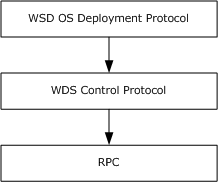

[MS-WDSOSD]:

Windows Deployment Services Operation System
Deployment Protocol

Intellectual Property Rights Notice for Open Specifications Documentation

  Technical Documentation. Microsoft publishes Open Specifications documentation (“this

documentation”) for protocols, file formats, data portability, computer languages, and standards
support. Additionally, overview documents cover inter-protocol relationships and interactions.

  Copyrights. This documentation is covered by Microsoft copyrights. Regardless of any other

terms that are contained in the terms of use for the Microsoft website that hosts this
documentation, you can make copies of it in order to develop implementations of the technologies
that are described in this documentation and can distribute portions of it in your implementations
that use these technologies or in your documentation as necessary to properly document the
implementation. You can also distribute in your implementation, with or without modification, any
schemas, IDLs, or code samples that are included in the documentation. This permission also
applies to any documents that are referenced in the Open Specifications documentation.
  No Trade Secrets. Microsoft does not claim any trade secret rights in this documentation.
  Patents. Microsoft has patents that might cover your implementations of the technologies

described in the Open Specifications documentation. Neither this notice nor Microsoft's delivery of
this documentation grants any licenses under those patents or any other Microsoft patents.
However, a given Open Specifications document might be covered by the Microsoft Open
Specifications Promise or the Microsoft Community Promise. If you would prefer a written license,
or if the technologies described in this documentation are not covered by the Open Specifications
Promise or Community Promise, as applicable, patent licenses are available by contacting
iplg@microsoft.com.

  License Programs. To see all of the protocols in scope under a specific license program and the

associated patents, visit the Patent Map.

  Trademarks. The names of companies and products contained in this documentation might be
covered by trademarks or similar intellectual property rights. This notice does not grant any
licenses under those rights. For a list of Microsoft trademarks, visit
www.microsoft.com/trademarks.

  Fictitious Names. The example companies, organizations, products, domain names, email

addresses, logos, people, places, and events that are depicted in this documentation are fictitious.
No association with any real company, organization, product, domain name, email address, logo,
person, place, or event is intended or should be inferred.

Reservation of Rights. All other rights are reserved, and this notice does not grant any rights other
than as specifically described above, whether by implication, estoppel, or otherwise.

Tools. The Open Specifications documentation does not require the use of Microsoft programming
tools or programming environments in order for you to develop an implementation. If you have access
to Microsoft programming tools and environments, you are free to take advantage of them. Certain
Open Specifications documents are intended for use in conjunction with publicly available standards
specifications and network programming art and, as such, assume that the reader either is familiar
with the aforementioned material or has immediate access to it.

Support. For questions and support, please contact dochelp@microsoft.com.

[MS-WDSOSD] - v20240423
Windows Deployment Services Operation System Deployment Protocol
Copyright © 2024 Microsoft Corporation
Release: April 23, 2024

1 / 58

Revision Summary

Date

Revision
History

Revision
Class

Comments

5/22/2009

0.1

Major

First Release.

7/2/2009

0.1.1

Editorial

Changed language and formatting in the technical content.

8/14/2009

0.1.2

Editorial

Changed language and formatting in the technical content.

9/25/2009

0.2

Minor

Clarified the meaning of the technical content.

11/6/2009

0.2.1

Editorial

Changed language and formatting in the technical content.

12/18/2009  1.0

Major

Updated and revised the technical content.

1/29/2010

1.0.1

Editorial

Changed language and formatting in the technical content.

3/12/2010

1.0.2

Editorial

Changed language and formatting in the technical content.

4/23/2010

1.0.3

Editorial

Changed language and formatting in the technical content.

6/4/2010

1.1

Minor

Clarified the meaning of the technical content.

7/16/2010

1.1

8/27/2010

1.1

10/8/2010

1.1

11/19/2010  1.1

1/7/2011

1.1

2/11/2011

1.1

3/25/2011

1.1

5/6/2011

1.1

None

None

None

None

None

None

None

None

No changes to the meaning, language, or formatting of the
technical content.

No changes to the meaning, language, or formatting of the
technical content.

No changes to the meaning, language, or formatting of the
technical content.

No changes to the meaning, language, or formatting of the
technical content.

No changes to the meaning, language, or formatting of the
technical content.

No changes to the meaning, language, or formatting of the
technical content.

No changes to the meaning, language, or formatting of the
technical content.

No changes to the meaning, language, or formatting of the
technical content.

6/17/2011

1.2

Minor

Clarified the meaning of the technical content.

9/23/2011

1.2

12/16/2011  2.0

3/30/2012

3.0

7/12/2012

3.0

10/25/2012  3.0

1/31/2013

3.0

None

Major

Major

None

None

None

No changes to the meaning, language, or formatting of the
technical content.

Updated and revised the technical content.

Updated and revised the technical content.

No changes to the meaning, language, or formatting of the
technical content.

No changes to the meaning, language, or formatting of the
technical content.

No changes to the meaning, language, or formatting of the

2 / 58

[MS-WDSOSD] - v20240423
Windows Deployment Services Operation System Deployment Protocol
Copyright © 2024 Microsoft Corporation
Release: April 23, 2024

Date

Revision
History

Revision
Class

Comments

technical content.

8/8/2013

4.0

Major

Updated and revised the technical content.

11/14/2013  4.0

2/13/2014

4.0

5/15/2014

4.0

None

None

None

No changes to the meaning, language, or formatting of the
technical content.

No changes to the meaning, language, or formatting of the
technical content.

No changes to the meaning, language, or formatting of the
technical content.

6/30/2015

5.0

Major

Significantly changed the technical content.

7/14/2016

5.0

None

No changes to the meaning, language, or formatting of the
technical content.

6/1/2017

5.0

9/15/2017

6.0

3/16/2018

7.0

9/12/2018

8.0

4/7/2021

9.0

4/23/2024

10.0

None

Major

Major

Major

Major

Major

No changes to the meaning, language, or formatting of the
technical content.

Significantly changed the technical content.

Significantly changed the technical content.

Significantly changed the technical content.

Significantly changed the technical content.

Significantly changed the technical content.

[MS-WDSOSD] - v20240423
Windows Deployment Services Operation System Deployment Protocol
Copyright © 2024 Microsoft Corporation
Release: April 23, 2024

3 / 58

## Table of Contents

- [1 Introduction](#1-introduction)
  - [1.1 Glossary](#11-glossary)
  - [1.2 References](#12-references)
    - [1.2.1 Normative References](#121-normative-references)
    - [1.2.2 Informative References](#122-informative-references)
  - [1.3 Overview](#13-overview)
  - [1.4 Relationship to Other Protocols](#14-relationship-to-other-protocols)
  - [1.5 Prerequisites/Preconditions](#15-prerequisitespreconditions)
  - [1.6 Applicability Statement](#16-applicability-statement)
  - [1.7 Versioning and Capability Negotiation](#17-versioning-and-capability-negotiation)
  - [1.8 Vendor-Extensible Fields](#18-vendor-extensible-fields)
  - [1.9 Standards Assignments](#19-standards-assignments)
- [2 Messages](#2-messages)
  - [2.1 Transport](#21-transport)
  - [2.2 Message Syntax](#22-message-syntax)
    - [2.2.1 WDS_OP_LOG_INIT](#221-wdsoploginit)
    - [2.2.2 WDS_OP_LOG_MSG](#222-wdsoplogmsg)
      - [2.2.2.1 Section](#2221-section)
      - [2.2.2.2 Section](#2222-section)
      - [2.2.2.3 Section](#2223-section)
      - [2.2.2.4 Section](#2224-section)
      - [2.2.2.5 Section](#2225-section)
      - [2.2.2.6 This status](#2226-this-status)
      - [2.2.2.7 Section](#2227-section)
      - [2.2.2.8 Section](#2228-section)
      - [2.2.2.9 Section](#2229-section)
      - [2.2.2.10 Section](#22210-section)
      - [2.2.2.11 Section](#22211-section)
      - [2.2.2.12 Section](#22212-section)
      - [2.2.2.13 Section](#22213-section)
      - [2.2.2.14 Section](#22214-section)
      - [2.2.2.15 Message type](#22215-message-type)
      - [2.2.2.16 WDS_LOG_TYPE_CLIENT_DRIVER_PACKAGE_NOT_ACCESSIBLE](#22216-wdslogtypeclientdriverpackagenotaccessible)
      - [2.2.2.17 Section](#22217-section)
      - [2.2.2.18 Section](#22218-section)
      - [2.2.2.19 WDS_LOG_TYPE_CLIENT_OFFLINE_DRIVER_INJECTION_FAILURE](#22219-wdslogtypeclientofflinedriverinjectionfailure)
      - [2.2.2.20 Section](#22220-section)
      - [2.2.2.21 ARCHITECTURE (WDSCPL_VAR_ULONG): MUST be set to the processor architecture of the client](#22221-architecture-wdscplvarulong-must-be-set-to-the-processor-architecture-of-the-client)
      - [2.2.2.22 WDS_LOG_TYPE_CLIENT_IMAGE_SELECTED3](#22222-wdslogtypeclientimageselected3)
    - [2.2.3 WDS_OP_GET_CLIENT_UNATTEND](#223-wdsopgetclientunattend)
    - [2.2.4 WDS_OP_GET_UNATTEND_VARIABLES](#224-wdsopgetunattendvariables)
    - [2.2.5 WDS_OP_GET_DOMAIN_JOIN_INFORMATION](#225-wdsopgetdomainjoininformation)
    - [2.2.6 WDS_OP_IMG_ENUMERATE](#226-wdsopimgenumerate)
    - [2.2.7 DDP_OP_GET_MACHINE_DRIVER_PACKAGES](#227-ddpopgetmachinedriverpackages)
    - [2.2.8 Architecture](#228-architecture)
    - [2.2.9 WDSDCMGR_OP_QUERY_METADATA](#229-wdsdcmgropquerymetadata)
    - [2.2.10 WDS_OP_RESET_BOOT_PROGRAM](#2210-wdsopresetbootprogram)
  - [2.3 Directory Service Schema Elements](#23-directory-service-schema-elements)
- [3 Protocol Details](#3-protocol-details)
  - [3.1 Server Details](#31-server-details)
    - [3.1.1 Abstract Data Model](#311-abstract-data-model)
      - [3.1.1.1 WDS Server Configuration](#3111-wds-server-configuration)
      - [3.1.1.2 Computers in Active Directory Domain](#3112-computers-in-active-directory-domain)
      - [3.1.1.3 Users in the Active Directory Domain](#3113-users-in-the-active-directory-domain)
      - [3.1.1.4 Machine Naming Policy](#3114-machine-naming-policy)
    - [3.1.2 Timers](#312-timers)
    - [3.1.3 Initialization](#313-initialization)
    - [3.1.4 Higher-Layer Triggered Events](#314-higher-layer-triggered-events)
    - [3.1.5 Message Processing Events and Sequencing Rules](#315-message-processing-events-and-sequencing-rules)
      - [3.1.5.1 WDS_OP_LOG_INIT](#3151-wdsoploginit)
      - [3.1.5.2 WDS_OP_LOG_MSG](#3152-wdsoplogmsg)
      - [3.1.5.3 WDS_OP_GET_CLIENT_UNATTEND](#3153-wdsopgetclientunattend)
      - [3.1.5.4 WDS_OP_GET_UNATTEND_VARIABLES](#3154-wdsopgetunattendvariables)
      - [3.1.5.5 WDS_OP_GET_DOMAIN_JOIN_INFORMATION](#3155-wdsopgetdomainjoininformation)
        - [3.1.5.5.1 Computer Object Exists](#31551-computer-object-exists)
        - [3.1.5.5.2 Computer Object Does Not Exist](#31552-computer-object-does-not-exist)
      - [3.1.5.6 WDS_OP_IMG_ENUMERATE](#3156-wdsopimgenumerate)
        - [3.1.5.6.1 Without CLIENT_CAP_SUPPORT_V2](#31561-without-clientcapsupportv2)
        - [3.1.5.6.2 With CLIENT_CAP_SUPPORT_V2](#31562-with-clientcapsupportv2)
        - [3.1.5.6.3 Without CLIENT_CAP_SUPPORT_VHDX](#31563-without-clientcapsupportvhdx)
        - [3.1.5.6.4 With CLIENT_CAP_SUPPORT_VHDX](#31564-with-clientcapsupportvhdx)
      - [3.1.5.7 DDP_OP_GET_MACHINE_DRIVER_PACKAGES](#3157-ddpopgetmachinedriverpackages)
      - [3.1.5.8 WDSDCMGR_OP_QUERY_METADATA](#3158-wdsdcmgropquerymetadata)
      - [3.1.5.9 WDS_OP_RESET_BOOT_PROGRAM](#3159-wdsopresetbootprogram)
    - [3.1.6 Timer Events](#316-timer-events)
    - [3.1.7 Other Local Events](#317-other-local-events)
  - [3.2 Client Details](#32-client-details)
    - [3.2.1 Abstract Data Model](#321-abstract-data-model)
      - [3.2.1.1 Client Configuration](#3211-client-configuration)
    - [3.2.2 Timers](#322-timers)
    - [3.2.3 Initialization](#323-initialization)
      - [3.2.3.1 Initialize Logging](#3231-initialize-logging)
      - [3.2.3.2 Initialize Deployment Agent Metadata](#3232-initialize-deployment-agent-metadata)
      - [3.2.3.3 Status Message: Client Started](#3233-status-message-client-started)
    - [3.2.4 Higher-Layer Triggered Events](#324-higher-layer-triggered-events)
    - [3.2.5 Message Processing Events and Sequencing Rules](#325-message-processing-events-and-sequencing-rules)
      - [3.2.5.1 Getting Unattended Instructions for Deployment Agent](#3251-getting-unattended-instructions-for-deployment-agent)
      - [3.2.5.2 Getting Credentials](#3252-getting-credentials)
      - [3.2.5.3 Getting List of Images](#3253-getting-list-of-images)
      - [3.2.5.4 Transferring Selected OS Image](#3254-transferring-selected-os-image)
      - [3.2.5.5 Applying Selected OS Image](#3255-applying-selected-os-image)
      - [3.2.5.6 Driver Injection](#3256-driver-injection)
      - [3.2.5.7 Deployed OS Unattend and Domain Join](#3257-deployed-os-unattend-and-domain-join)
        - [3.2.5.7.1 Computer Account Exists](#32571-computer-account-exists)
        - [3.2.5.7.2 Computer Account Does Not Exist](#32572-computer-account-does-not-exist)
      - [3.2.5.8 Finishing Up](#3258-finishing-up)
      - [3.2.5.9 Error Handling](#3259-error-handling)
    - [3.2.6 Timer Events](#326-timer-events)
    - [3.2.7 Other Local Events](#327-other-local-events)
- [4 Protocol Examples](#4-protocol-examples)
  - [4.1 Getting Transaction ID and Log Level](#41-getting-transaction-id-and-log-level)
  - [4.2 Client Started Status Message](#42-client-started-status-message)
  - [4.3 Get Deployment Agent Unattend](#43-get-deployment-agent-unattend)
  - [4.4 Enumerating OS Images](#44-enumerating-os-images)
  - [4.5 Getting Unattend Variables For OS Deployment In Unattended Mode](#45-getting-unattend-variables-for-os-deployment-in-unattended-mode)
  - [4.6 Getting Domain Join Information](#46-getting-domain-join-information)
  - [4.7 Initializing Deployment Agent Metadata](#47-initializing-deployment-agent-metadata)
- [5 Security](#5-security)
  - [5.1 Security Considerations for Implementers](#51-security-considerations-for-implementers)
  - [5.2 Index of Security Parameters](#52-index-of-security-parameters)
- [6 Appendix A: Product Behavior](#6-appendix-a-product-behavior)
- [7 Change Tracking](#7-change-tracking)
- [8 Index](#8-index)

## 1 Introduction

The Windows Deployment Services (WDS) OS Deployment Protocol specifies services exposed by the
WDS server which are used by the clients to deploy an operating system (OS) on a machine. It is a
client/server protocol which uses the Windows Deployment Services Control Protocol to communicate.

Sections 1.5, 1.8, 1.9, 2, and 3 of this specification are normative. All other sections and examples in
this specification are informative.

### 1.1 Glossary

This document uses the following terms:

Active Directory: The Windows implementation of a general-purpose directory service, which uses

LDAP as its primary access protocol. Active Directory stores information about a variety of
objects in the network such as user accounts, computer accounts, groups, and all related
credential information used by Kerberos [MS-KILE]. Active Directory is either deployed as
Active Directory Domain Services (AD DS) or Active Directory Lightweight Directory
Services (AD LDS), which are both described in [MS-ADOD]: Active Directory Protocols
Overview.

Active Directory domain: A domain hosted on Active Directory. For more information, see

[MS-ADTS].

Active Directory Domain Services (AD DS): A directory service (DS) implemented by a domain
controller (DC). The DS provides a data store for objects that is distributed across multiple DCs.
The DCs interoperate as peers to ensure that a local change to an object replicates correctly
across DCs.  AD DS is a deployment of Active Directory [MS-ADTS].

client machine GUID: Each client machine is assigned a unique GUID by the machine

manufacturer and is stored in the SMBIOS of the client machine as per [DMTF-DSP0134].

deployed OS: An operating system (OS) image that has been deployed/installed on the client

machine.

deployment agent: An application on the client machine that communicates with WDS server and

deploys an OS image on the client machine.

deployment agent unattend: Unattended instructions that provide input for all or some steps

performed by the deployment agent. If unattended instructions do not provide input for certain
steps, the deployment agent asks the user for input.

domain: A set of users and computers sharing a common namespace and management

infrastructure. At least one computer member of the set has to act as a domain controller (DC)
and host a member list that identifies all members of the domain, as well as optionally hosting
the Active Directory service. The domain controller provides authentication of members,
creating a unit of trust for its members. Each domain has an identifier that is shared among its
members. For more information, see [MS-AUTHSOD] section 1.1.1.5 and [MS-ADTS].

domain join: A process to configure a machine to join an Active Directory domain and assume the

identity assigned to it by the domain controller.

driver: Software that allows applications to interact with a hardware device by using abstract/high-

level constructs.

driver package: A collection of the files needed to successfully load a driver. This includes the

device information (.inf) file, the catalog file, and all of the binaries that are copied by the .inf
file.  Multiple drivers packaged together for deployment purposes.

[MS-WDSOSD] - v20240423
Windows Deployment Services Operation System Deployment Protocol
Copyright © 2024 Microsoft Corporation
Release: April 23, 2024

7 / 58

Endpoint GUID: Set of relevant services provided by a Service Provider are grouped together and

as a whole identified by a unique Endpoint GUID.

globally unique identifier (GUID): A term used interchangeably with universally unique

identifier (UUID) in Microsoft protocol technical documents (TDs). Interchanging the usage of
these terms does not imply or require a specific algorithm or mechanism to generate the value.
Specifically, the use of this term does not imply or require that the algorithms described in
[RFC4122] or [C706] have to be used for generating the GUID. See also universally unique
identifier (UUID).

image group: Each image group has a unique name and an ACL to specify users who are allowed
to deploy OS images from the image group. An image group can contain multiple OS image
containers.

little-endian: Multiple-byte values that are byte-ordered with the least significant byte stored in

the memory location with the lowest address.

machine naming policy: Specifies a naming scheme that is used to generate a name for the

machine.

multicast namespace: Hosts multiple content that are available to clients using multicast

sessions. Identification by a unique name is required. All content under a multicast namespace
is available for transmission over multicast transmission.

multicast transmission: The ability of server to send OS image container files using the multicast

feature of the User Datagram Protocol (UDP).

OS deployment process: Set of operations that have to be performed by the deployment agent

to prepare and deploy an OS image on client machine. It also includes steps that are performed
by a deployed OS to bring the OS to a functioning state. Each step in the process might require
input from the user.

OS image: Set of files required to deploy/install an Operating System on a machine. Each OS

image is in either Virtual Hard Drive (VHD) or Windows Imaging (WIM) format. Each OS image
also has associated OS image metadata.

OS Image Container: Single or multiple files that contain one or more OS images. Each OS image

is identified by a unique numeric value in an OS image container.

OS Image Language: An OS image supports multiple locales and at deployment time any

supported locale can be chosen for deployment.

OS Image Metadata: Set of attributes that specifies the properties of an OS image.

OS Image Unattend: Unattended instructions that provide input for some or all steps performed

by the Deployed OS to bring OS to a functioning state. If Unattended instructions do not provide
input for certain steps, Deployed OS asks user for input.

Remote Installation (REMINST) Share: A disk share that all WDS servers are required to create

on initialization.

Status Message: Client sends status update messages to WDS server during deployment of an OS

image on client machine. Each status message includes the severity and description.

Unattend Variable: A placeholder in the Unattended Instructions that is replaced by a value

during OS Deployment Process.

Unattended Instructions: Set of instructions that enable Deployment Agent and Deployed OS to

operate in Unattended Mode.

Unattended Mode: Same as Unattended Operation.

8 / 58

[MS-WDSOSD] - v20240423
Windows Deployment Services Operation System Deployment Protocol
Copyright © 2024 Microsoft Corporation
Release: April 23, 2024

Unicode string: A Unicode 8-bit string is an ordered sequence of 8-bit units, a Unicode 16-bit
string is an ordered sequence of 16-bit code units, and a Unicode 32-bit string is an ordered
sequence of 32-bit code units. In some cases, it could be acceptable not to terminate with a
terminating null character. Unless otherwise specified, all Unicode strings follow the UTF-16LE
encoding scheme with no Byte Order Mark (BOM).

VHD Image: An OS image packaged in the Virtual Hard Disk (VHD) format.

WDS server: A Windows Deployment Services (WDS) server that communicates with clients by

using the WDS OS Deployment Protocol to aid in deployment of an OS image on a client
machine. Clients also communicate to a WDS server to request initiation/setup of multicast
sessions for content available in multicast namespace on server.A WDS server provides an
extensible mechanism to allow service providers to provide services to clients.

WIM Image: An OS image packaged in Windows Imaging (WIM) file format.

MAY, SHOULD, MUST, SHOULD NOT, MUST NOT: These terms (in all caps) are used as defined
in [RFC2119]. All statements of optional behavior use either MAY, SHOULD, or SHOULD NOT.

### 1.2 References

Links to a document in the Microsoft Open Specifications library point to the correct section in the
most recently published version of the referenced document. However, because individual documents
in the library are not updated at the same time, the section numbers in the documents may not
match. You can confirm the correct section numbering by checking the Errata.

#### 1.2.1 Normative References

We conduct frequent surveys of the normative references to assure their continued availability. If you
have any issue with finding a normative reference, please contact dochelp@microsoft.com. We will
assist you in finding the relevant information.

[MS-ADA1] Microsoft Corporation, "Active Directory Schema Attributes A-L".

[MS-ADA2] Microsoft Corporation, "Active Directory Schema Attributes M".

[MS-ADA3] Microsoft Corporation, "Active Directory Schema Attributes N-Z".

[MS-ADLS] Microsoft Corporation, "Active Directory Lightweight Directory Services Schema".

[MS-ADSC] Microsoft Corporation, "Active Directory Schema Classes".

[MS-ERREF] Microsoft Corporation, "Windows Error Codes".

[MS-WDSC] Microsoft Corporation, "Windows Deployment Services Control Protocol".

[RFC2119] Bradner, S., "Key words for use in RFCs to Indicate Requirement Levels", BCP 14, RFC
2119, March 1997, https://www.rfc-editor.org/info/rfc2119

[RFC4122] Leach, P., Mealling, M., and Salz, R., "A Universally Unique Identifier (UUID) URN
Namespace", RFC 4122, July 2005, https://www.rfc-editor.org/info/rfc4122

[RFC5234] Crocker, D., Ed., and Overell, P., "Augmented BNF for Syntax Specifications: ABNF", STD
68, RFC 5234, January 2008, https://www.rfc-editor.org/info/rfc5234

#### 1.2.2 Informative References

None.

[MS-WDSOSD] - v20240423
Windows Deployment Services Operation System Deployment Protocol
Copyright © 2024 Microsoft Corporation
Release: April 23, 2024

9 / 58

<!-- Extracted images from page 10 -->

<!-- /Extracted images from page 10 -->

### 1.3 Overview

The deployment agent uses the WDS OS Deployment Protocol (WDSOSD) to request information
concerning deployment of an OS image on the client system. This information includes instructions
for deploying an OS with or without user interaction, available OS images on the server, reporting of
current status of the client, and joining of an Active Directory domain at the end of the deployment
process.

A typical interaction between client and server involves the following steps (for brevity, only the core
steps for OS deployment are included below).

1.  The client has already obtained the name or IP address of the WDS server.

2.  The deployment agent queries the WDS server if it should perform the OS deployment process

in unattended mode, along with unattended instructions for the deployment agent, if
applicable.

3.  The client obtains user credentials and requests the server to enumerate the OS images available

to the client.

4.  Once an OS image is selected, the client proceeds to download the relevant files, and deploys the

OS image on the client machine.

5.  The client queries the server as to whether the client machine is to join an Active Directory

domain, and applies the policy depending on the answer.

6.  The client enumerates all devices installed on the client machine and requests applicable driver

packages from the server, and then proceeds to configure the deployed OS using the driver
package returned by the server.

### 1.4 Relationship to Other Protocols

The WDS OS Deployment Protocol relies on the Windows Deployment Services Control Protocol as
transport. It uses the WDS Control Protocol to send and receive replies.

The following diagram illustrates the relationship of the WDS OS Deployment Protocol and how it
relates to the WDS Control Protocol.

Figure 1: Protocol relationships (WDS OS Deployment Protocol to WDS Control Protocol)

[MS-WDSOSD] - v20240423
Windows Deployment Services Operation System Deployment Protocol
Copyright © 2024 Microsoft Corporation
Release: April 23, 2024

10 / 58

### 1.5 Prerequisites/Preconditions

This protocol is implemented on top of the WDS Control Protocol, and therefore has the prerequisites
identified in [MS-WDSC].

The WDS OS Deployment Protocol assumes that the client has obtained the name or IP address of the
server that supports this protocol.

The deployment agent supports the OS images available on the server and is responsible for
deploying and installing the OS image from an OS image container to the client machine.

The deployment agent and WDS server have an agreement on the format of the deployment agent
unattend, if applicable.

The WDS server and deployed OS have an agreement on the format of the deployed OS unattend.

The deployment agent can process replacement variables for the deployed OS unattend.

The deployment agent is capable of configuring the deployed OS to join a specific Active Directory
domain, if applicable.

### 1.6 Applicability Statement

This protocol is applicable when an application deploys an OS on a client machine.

### 1.7 Versioning and Capability Negotiation

This document covers versioning issues in the following areas:

  Supported transports: This protocol uses the Windows Deployment Services Control Protocol for

transport as specified in section 2.







Protocol versions: The protocol supports multiple Endpoint GUIDs and opcodes as specified in
section 2.1.

 Security and authentication methods: The security requirements for each Endpoint GUID and
opcode are defined in 2.2.

Localization: The protocol acts as a pass-through for all strings; no support for localization is built
into the protocol.

  Capability negotiation: The protocol does explicit capability negotiation for certain Endpoint GUIDs

and opcodes as specified in the following section.

Capability

Section

WDS_OP_IMG_ENUMERATE  Section 2.2.6

### 1.8 Vendor-Extensible Fields

This protocol uses Win32 error codes as defined in [MS-ERREF] section 2.2. Vendors SHOULD reuse
those values with their indicated meaning. Choosing any other value runs the risk of a collision in the
future.

[MS-WDSOSD] - v20240423
Windows Deployment Services Operation System Deployment Protocol
Copyright © 2024 Microsoft Corporation
Release: April 23, 2024

11 / 58

### 1.9 Standards Assignments

Parameter

Value

Reference

OS Deployment Endpoint GUID

d8deeb5a-effd-43b2-99fc-
1a8a5921c227

Dynamic Driver Provisioning Endpoint
GUID

1a927394-352e-4553-ae3f-
7cf4aafca620

Deployment Agent Metadata Endpoint
GUID

1044dfb7-a36b-40c3-92bb-
ac4152187cb3

[MS-
WDSC] (section 2.1.2)

[MS-
WDSC] (section 2.1.2)

[MS-
WDSC] (section 2.1.2)

[MS-WDSOSD] - v20240423
Windows Deployment Services Operation System Deployment Protocol
Copyright © 2024 Microsoft Corporation
Release: April 23, 2024

12 / 58

## 2 Messages

### 2.1 Transport

The protocol MUST use the Endpoint GUIDs as specified in [MS-WDSC], (section 2.1.2).

Each opcode under the Endpoint GUID requires an authenticated and/or unauthenticated client
request. Opcodes are defined in the section immediately following.

### 2.2 Message Syntax

The WDS OS Deployment Protocol MUST support the following opcodes under the OS deployment
Endpoint GUID.

Opcode

Authentication
requirements

Description

WDS_OP_IMG_ENUMERATE

Authenticated

Enumerate and return the list of OS images
available to client machine. See section
2.2.6.

0x00000002

WDS_OP_LOG_INIT

0x00000003

WDS_OP_LOG_MSG

0x00000004

Authenticated and
Unauthenticated

Provides a unique Transaction ID and
severity level for status messages that
MUST be logged by the client. See section
2.2.1.

Authenticated and
Unauthenticated

Logs a status message on the server,
specifying status update from client. See
section 2.2.2.

WDS_OP_GET_CLIENT_UNATTEND

0x00000005

Authenticated and
Unauthenticated

Queries the server for deployment agent
unattend. See section 2.2.3.

WDS_OP_GET_UNATTEND_VARIABLES

Authenticated

0x00000006

WDS_OP_GET_DOMAIN_JOIN_INFORMATION

Authenticated

0x00000007

WDS_OP_RESET_BOOT_PROGRAM

Authenticated

0x00000008

Queries the server for values for variables to
be consumed for deployed OS Unattend.
See section 2.2.4.

Queries the server to find out if the client
SHOULD join a domain, and the details of
the domain to be joined. See section 2.2.5.

Sent by the client to notify the server that
the deployment is complete and therefore
the server SHOULD reset the PXE boot
program selected for the client if appropriate
per server policy. Thus, the client will not
attempt to boot from the network after the
client next reboots. For more details about
the booting process, see section 2.2.10.

The WDS OS Deployment Protocol MAY<1> support the dynamic driver provisioning Endpoint GUID.
If supported, the dynamic driver provisioning Endpoint GUID MUST support the following opcodes.

Opcode

Authentication
requirements

Description

DDP_OP_GET_MACHINE_DRIVER_PACKAGES

Authenticated

0x000000C8

Queries the server for driver packages
that match the devices that are installed
on the client machines.

13 / 58

[MS-WDSOSD] - v20240423
Windows Deployment Services Operation System Deployment Protocol
Copyright © 2024 Microsoft Corporation
Release: April 23, 2024

The WDS OS Deployment Protocol MAY<2> support the deployment agent metadata Endpoint GUID.
If supported, the deployment agent metadata Endpoint GUID MUST support the following opcodes.

Opcode

WDSDCMGR_OP_QUERY_METADATA

0x00000002

Authentication
requirements

Authenticated or
Unauthenticated

Description

Queries the server for deployment agent
metadata.

#### 2.2.1 WDS_OP_LOG_INIT

This opcode is used to initialize logging and to obtain a unique Transaction ID that is used later to
send status messages generated by the deployment agent to the server.

The request packet from client MUST include the following variables:

VERSION (WDSCPL_VAR_ULONG): MUST be set to 1.

The reply packet from the server MUST include the following variables:

VERSION (WDSCPL_VAR_ULONG): MUST be set to 1.

LOGLEVEL (WDSCPL_VAR_ULONG): The enumeration specifies the severity for status messages
that MUST be logged by the client. Each severity level MUST include lower severity level status
messages.

This variable MUST be set to a value as given in the following table.

Log Level

Description

WDS_LOG_LEVEL_DISABLED

The client MUST NOT log any status messages.

0x00000000

WDS_LOG_LEVEL_ERROR

The client MUST log all status messages for failure conditions.

0x00000001

WDS_LOG_LEVEL_WARNING

The client MUST log all status messages for warning and failure conditions.

0x00000002

WDS_LOG_LEVEL_INFO

0x00000003

The client MUST log all status messages for informational, warning, and failure
conditions.

TRANSACTION_ID (WDSCPL_VAR_WSTRING): MUST be set to the string value that is used by
the client in WDS_OP_LOG_MSG opcode (section 2.2.2) to send status messages to the server.

#### 2.2.2 WDS_OP_LOG_MSG

This opcode is used to send a status message to the server. The client MUST log status messages
that have been requested by the server (section 2.2.1).

To log a status message, the client MUST send the variables listed in the following section. Depending
on the type of status message being logged, it MAY require additional variables which are listed in
separate sections for each status message.

The request packet MUST include the following variables:

[MS-WDSOSD] - v20240423
Windows Deployment Services Operation System Deployment Protocol
Copyright © 2024 Microsoft Corporation
Release: April 23, 2024

14 / 58

VERSION (WDSCPL_VAR_ULONG): MUST be set to 1.

MESSAGE_TYPE (WDSCPL_VAR_ULONG):

Specifies the type of status message being logged. MUST be set to a value from the following table.

Message type

Log level

WDS_LOG_TYPE_CLIENT_ERROR

WDS_LOG_LEVEL_ERROR

0x00000001

WDS_LOG_TYPE_CLIENT_STARTED

WDS_LOG_LEVEL_INFO

0x00000002

WDS_LOG_TYPE_CLIENT_FINISHED

WDS_LOG_LEVEL_INFO

0x00000003

WDS_LOG_TYPE_CLIENT_IMAGE_SELECTED

WDS_LOG_LEVEL_INFO

0x00000004

WDS_LOG_TYPE_CLIENT_APPLY_STARTED

WDS_LOG_LEVEL_INFO

0x00000005

WDS_LOG_TYPE_CLIENT_APPLY_FINISHED

WDS_LOG_LEVEL_INFO

0x00000006

WDS_LOG_TYPE_CLIENT_GENERIC_MESSAGE

WDS_LOG_LEVEL_ERROR

0x00000007

WDS_LOG_TYPE_CLIENT_UNATTEND_MODE

WDS_LOG_LEVEL_INFO

0x00000008

WDS_LOG_TYPE_CLIENT_TRANSFER_START

WDS_LOG_LEVEL_INFO

0x00000009

WDS_LOG_TYPE_CLIENT_TRANSFER_END

WDS_LOG_LEVEL_INFO

0x0000000A

WDS_LOG_TYPE_CLIENT_TRANSFER_DOWNGRADE

WDS_LOG_LEVEL_INFO

0x0000000B

WDS_LOG_TYPE_CLIENT_DOMAINJOINERROR

WDS_LOG_LEVEL_ERROR

0x0000000C

WDS_LOG_TYPE_CLIENT_POST_ACTIONS_START

WDS_LOG_LEVEL_INFO

0x0000000D

WDS_LOG_TYPE_CLIENT_POST_ACTIONS_END

WDS_LOG_LEVEL_INFO

0x0000000E

WDS_LOG_TYPE_CLIENT_APPLY_STARTED_2

WDS_LOG_LEVEL_INFO

0x0000000F

WDS_LOG_TYPE_CLIENT_APPLY_FINISHED_2

WDS_LOG_LEVEL_INFO

0x00000010

[MS-WDSOSD] - v20240423
Windows Deployment Services Operation System Deployment Protocol
Copyright © 2024 Microsoft Corporation
Release: April 23, 2024

Additional
variables
section

Section
##### 2.2.2.1 Section

##### 2.2.2.2 Section

##### 2.2.2.3 Section

##### 2.2.2.4 Section

##### 2.2.2.5 Section

##### 2.2.2.6 This status

message is
not used by
the client.

Section
##### 2.2.2.7 Section

##### 2.2.2.8 Section

##### 2.2.2.9 Section

##### 2.2.2.10 Section

##### 2.2.2.11 Section

##### 2.2.2.12 Section

##### 2.2.2.13 Section

##### 2.2.2.14 Section

##### 2.2.2.15 Message type

15 / 58

Log level

WDS_LOG_TYPE_CLIENT_DOMAINJOINERROR_2

WDS_LOG_LEVEL_ERROR

0x00000011

Additional
variables
section

Section
##### 2.2.2.16 WDS_LOG_TYPE_CLIENT_DRIVER_PACKAGE_NOT_ACCESSIBLE

WDS_LOG_LEVEL_WARNING  Section

0x00000012

WDS_LOG_TYPE_CLIENT_OFFLINE_DRIVER_INJECTION_START

WDS_LOG_LEVEL_INFO

0x00000013

WDS_LOG_TYPE_CLIENT_OFFLINE_DRIVER_INJECTION_END

WDS_LOG_LEVEL_INFO

0x00000014

##### 2.2.2.17 Section

##### 2.2.2.18 Section

##### 2.2.2.19 WDS_LOG_TYPE_CLIENT_OFFLINE_DRIVER_INJECTION_FAILURE

WDS_LOG_LEVEL_WARNING  Section

0x00000015

WDS_LOG_TYPE_CLIENT_IMAGE_SELECTED2

WDS_LOG_LEVEL_INFO

0x00000016

##### 2.2.2.20 Section

##### 2.2.2.21 ARCHITECTURE (WDSCPL_VAR_ULONG): MUST be set to the processor architecture of the client

machine as specified in the 2.2.8 section.

CLIENT_ADDRESS (WDSCPL_VAR_WSTRING): MUST be set to the IP address of the network
interface card being used by the client to communicate with WDS server.

CLIENT_UUID (WDSCPL_VAR_WSTRING): MUST be set to the client machine GUID.

CLIENT_MAC (WDSCPL_VAR_WSTRING): MUST set to the MAC address of the network interface
card being used by the client to communicate with the WDS server.

TRANSACTION_ID (WDSCPL_VAR_WSTRING): MUST set to the Transaction ID as returned by the
server in reply to WDS_OP_LOG_INIT, and specified in section 2.2.1.

2.2.2.1  WDS_LOG_TYPE_CLIENT_ERROR

This status message is logged by the client when it encounters a fatal error condition and is unable
to continue. The request packet MUST specify the following variables in addition to variables specified
in section 3.1.5.2.

MESSAGE (WDSCPL_VAR_WSTRING): MUST specify the description of the fatal error.

2.2.2.2  WDS_LOG_TYPE_CLIENT_STARTED

This status message  is logged when the client has initialized successfully and is ready to go through
the OS deployment process. The request packet MUST specify the following variables in addition to
variables specified in section 3.1.5.2.

VER_CLIENT_AUTO (WDSCPL_VAR_WSTRING): MUST be set to the version of the client.

VER_OS_AUTO (WDSCPL_VAR_WSTRING): MUST be set to the version of the OS being used to
deploy the new OS on the client machine.

[MS-WDSOSD] - v20240423
Windows Deployment Services Operation System Deployment Protocol
Copyright © 2024 Microsoft Corporation
Release: April 23, 2024

16 / 58

2.2.2.3  WDS_LOG_TYPE_CLIENT_FINISHED

This status message is logged when the client has finished the deployment of the OS on the client
machine.

This status message does not require any additional variables.

2.2.2.4  WDS_LOG_TYPE_CLIENT_IMAGE_SELECTED

This status message is logged when the client has selected an OS image for deployment. The
request packet MUST specify the following variables in addition to variables specified in section
3.1.5.2.

IMAGE_NAME (WDSCPL_VAR_STRING): MUST be set to the name of the OS image selected by
the client.

IMAGE_GROUP (WDSCPL_VAR_WSTRING): MUST be set to the name of the image group
containing the selected OS image.

The client MUST first try to log the status message using
WDS_LOG_TYPE_CLIENT_IMAGE_SELECTED2 (section 2.2.2.21) and on failure MUST fall back to using
this status message.

2.2.2.5  WDS_LOG_TYPE_CLIENT_APPLY_STARTED

This status message  is logged when the client has started the installation/deployment of the
selected OS image to the client machine.

The client MUST first try to log the status message using WDS_LOG_TYPE_CLIENT_APPLY_STARTED_2
(section 2.2.2.14) and on failure MUST fall back to using this status message.

This status message does not require any additional variables.

2.2.2.6  WDS_LOG_TYPE_CLIENT_APPLY_FINISHED

This status message is logged when the client has finished the installation/deployment of the
selected OS image to the client machine.

The client MUST first try to log the status message using
WDS_LOG_TYPE_CLIENT_APPLY_FINISHED_2 (section 2.2.2.15) and on failure MUST fall back to
using this status message.

This status message does not require any additional variables.

2.2.2.7  WDS_LOG_TYPE_CLIENT_UNATTEND_MODE

This status message is logged to specify if the deployment agent is operating in unattended
mode. The request packet MUST specify the following variables in addition to variables specified in
section 2.2.2.

UNATTEND_MODE (WDSCPL_VAR_ULONG): MUST be set to 1 if client is operating in unattended
mode; otherwise, MUST be set to zero.

[MS-WDSOSD] - v20240423
Windows Deployment Services Operation System Deployment Protocol
Copyright © 2024 Microsoft Corporation
Release: April 23, 2024

17 / 58

2.2.2.8  WDS_LOG_TYPE_CLIENT_TRANSFER_START

This status message is logged when the client is starting the download of the files for an OS image
container that contains the selected OS image. The request packet MUST specify the following
variables in addition to variables specified in section 2.2.2.

IMAGE_NAME (WDSCPL_VAR_WSTRING): MUST be set to the name of the OS image selected by
the client.

IMAGE_GROUP (WDSCPL_VAR_WSTRING): MUST be set to the name of the image group
containing the selected OS image.

NAMESPACE_NAME (WDSCPL_VAR_WSTRING): MUST be set to the multicast namespace being
used by the client to download the OS image container files.

2.2.2.9  WDS_LOG_TYPE_CLIENT_TRANSFER_END

This status message is logged when the client has completed the download of the OS image
container that contains the selected OS image. The request packet MUST specify the following
variables in addition to variables specified in section 2.2.2.

IMAGE_NAME (WDSCPL_VAR_WSTRING): MUST be set to the name of the OS image selected by
the client.

IMAGE_GROUP (WDSCPL_VAR_WSTRING): MUST be set to the name of the image group
containing the selected OS image.

NAMESPACE_NAME (WDSCPL_VAR_WSTRING): MUST be set to the multicast namespace being
used by the client to download the OS image.

2.2.2.10

WDS_LOG_TYPE_CLIENT_TRANSFER_DOWNGRADE

This status message is logged when the client fails to download the OS image container that
contains the selected OS image using multicast transmission, and is now using an alternate
mechanism<3> to download the OS image container files. The request packet MUST specify the
following variables in addition to variables specified in section 2.2.2.

IMAGE_NAME (WDSCPL_VAR_WSTRING): MUST be set to the name of the OS image selected by
the client.

IMAGE_GROUP (WDSCPL_VAR_WSTRING): MUST be set to the name of the image group
containing the selected OS image.

NAMESPACE_NAME (WDSCPL_VAR_WSTRING): MUST be set to the multicast namespace being
used by the client to download the OS image.

2.2.2.11

WDS_LOG_TYPE_CLIENT_DOMAINJOINERROR

This status message is logged when the client encounters an error while configuring the deployed
OS to join an Active Directory domain. The request packet MUST specify the following variables in
addition to the variables specified in section 2.2.2.

MACHINE_NAME (WDSCPL_VAR_WSTRING): MUST be set to the computer object name used to
configure the deployed OS for the domain join.

MACHINE_OU (WDSCPL_VAR_WSTRING): MUST be set to the organizational unit in Active
Directory used to configure the deployed OS for the domain join.

[MS-WDSOSD] - v20240423
Windows Deployment Services Operation System Deployment Protocol
Copyright © 2024 Microsoft Corporation
Release: April 23, 2024

18 / 58

The client MUST first try to log the status message using
WDS_LOG_TYPE_CLIENT_DOMAINJOINERROR2 (section 2.2.2.16) and on failure MUST fall back to
using this status message.

2.2.2.12

WDS_LOG_TYPE_CLIENT_POST_ACTIONS_START

This status message is logged when the client is starting to process the OS image unattend.

This status message does not require any additional variables.

2.2.2.13

WDS_LOG_TYPE_CLIENT_POST_ACTIONS_END

This status message is logged after the client has completed processing of the OS image unattend.

This status message does not require any additional variables.

2.2.2.14

WDS_LOG_TYPE_CLIENT_APPLY_STARTED_2

This status message is logged when the client is starting the download of the files for an OS image
container that contains the selected OS image. The request packet MUST specify the following
variables in addition to variables specified in section 2.2.2.

The WDS server MAY NOT<4> support this status message. The client MUST first try to log this
status message, and on failure MUST fall back to using WDS_LOG_TYPE_CLIENT_APPLY_STARTED
(section 2.2.2.5).

IMAGE_NAME (WDSCPL_VAR_WSTRING): MUST be set to the name of the OS image selected by
the client.

IMAGE_GROUP (WDSCPL_VAR_WSTRING): MUST be set to the name of the image group
containing the selected OS image.

2.2.2.15

WDS_LOG_TYPE_CLIENT_APPLY_FINISHED_2

This status message is logged when the client has finished applying the selected OS image to the
client machine. The request packet MUST specify the following variables in addition to variables
specified in section 2.2.2.

The WDS server MAY NOT<5> support this status message. The client MUST first try to log this
status message and on failure MUST fall back to using WDS_LOG_TYPE_CLIENT_APPLY_FINISHED
(section 2.2.2.3).

IMAGE_NAME (WDSCPL_VAR_WSTRING): MUST be set to the name of the OS image selected by
the client.

IMAGE_GROUP (WDSCPL_VAR_WSTRING): MUST be set to the name of the image group
containing the selected OS image.

2.2.2.16

WDS_LOG_TYPE_CLIENT_DOMAINJOINERROR2

This status message is logged when the client encounters a fatal error while configuring the
deployed OS to join an Active Directory domain. The request packet MUST specify the following
variables in addition to variables specified in section 2.2.2.

MACHINE_NAME (WDSCPL_VAR_WSTRING): MUST be set to the computer object name that was
used to configure the deployed OS image for joining a domain.

[MS-WDSOSD] - v20240423
Windows Deployment Services Operation System Deployment Protocol
Copyright © 2024 Microsoft Corporation
Release: April 23, 2024

19 / 58

MACHINE_OU (WDSCPL_VAR_WSTRING): MUST be set to the organizational unit in Active
Directory that was used to configure the deployed OS image for joining the domain.

ERROR_CODE (WDSCPL_VAR_ULONG): MUST be set to the Win32 error code for the failed
operation ([MS-ERREF]).

The WDS server MAY NOT support this status message. The client MUST try to log this status
message and on failure MUST fall back to using WDS_LOG_TYPE_CLIENT_DOMAINJOINERROR
(section 2.2.2.11).

2.2.2.17

WDS_LOG_TYPE_CLIENT_DRIVER_PACKAGE_NOT_ACCESSIBLE

This status message is logged when the client is not able to access the driver package files
required to configure the deployed OS to use a specific driver package. The request packet MUST
specify the following variables in addition to variables specified in section 2.2.2.

DRIVER_PACKAGE_NAME (WDSCPL_VAR_WSTRING): MUST be set to the name of the failed
driver package.

ERROR_CODE (WDSCPL_VAR_ULONG): MUST be set to the Win32 error code of the failed
operation ([MS-ERREF]).

The WDS server MAY NOT<6> support this status message.

2.2.2.18

WDS_LOG_TYPE_CLIENT_OFFLINE_DRIVER_INJECTION_START

This status message is logged when the client is starting to configure the deployed OS to use
specific driver packages.

The WDS server MAY NOT<7> support this status message.

This status message does not require any additional variables.

2.2.2.19

WDS_LOG_TYPE_CLIENT_OFFLINE_DRIVER_INJECTION_END

This status message is logged when the client has finished configuring the deployed OS to use
specific driver packages.

The WDS server MAY NOT<8> support this status message.

This status message does not require any additional variables.

2.2.2.20

WDS_LOG_TYPE_CLIENT_OFFLINE_DRIVER_INJECTION_FAILURE

This status message is logged when the client is not able to configure the deployed OS to use a
specific driver package. The request packet MUST specify the following variables in addition to
variables specified in section 2.2.2.

DRIVER_PACKAGE_NAME (WDSCPL_VAR_WSTRING): MUST be set to the name of the failed
driver package.

ERROR_CODE (WDSCPL_VAR_ULONG): MUST be set to the Win32 error code of the failed
operation ([MS-ERREF]).

The WDS server MAY NOT support this status message.<9>

[MS-WDSOSD] - v20240423
Windows Deployment Services Operation System Deployment Protocol
Copyright © 2024 Microsoft Corporation
Release: April 23, 2024

20 / 58

2.2.2.21

WDS_LOG_TYPE_CLIENT_IMAGE_SELECTED2

The status message is logged when the client has selected an OS image for deployment. The
request packet MUST specify the following variables in addition to variables specified in section 2.2.2.

IMAGE_NAME (WDSCPL_VAR_WSTRING): MUST be set to the name of the OS image selected by
the client.

IMAGE_GROUP (WDSCPL_VAR_WSTRING): MUST be set to the name of the image group
containing the selected OS image.

IMAGE LANGUAGE (WDSCPL_VAR_WSTRING): MUST set to the OS image language selected by
the client for the selected OS image.

The WDS server MAY NOT<10> support this status message. The client MUST first try to log using
this status message and on failure MUST fall back to using
WDS_LOG_TYPE_CLIENT_IMAGE_SELECTED (section 2.2.2.4).

##### 2.2.2.22 WDS_LOG_TYPE_CLIENT_IMAGE_SELECTED3

The status message is logged when the client has selected an OS image for deployment. The
request packet MUST specify the following variables in addition to variables specified in section 2.2.2.

IMAGE_NAME (WDSCPL_VAR_WSTRING): MUST be set to the name of the OS image selected by
the client.

IMAGE_GROUP (WDSCPL_VAR_WSTRING): MUST be set to the name of the image group
containing the selected OS image.

IMAGE LANGUAGE (WDSCPL_VAR_WSTRING): MUST set to the OS image language selected by
the client for the selected OS image.

IMAGE ARCHITECTURE (WDSCPL_VAR_ULONG): MUST be set to the architecture supported by
the image that was selected in terms of the architecture codes specified in section 2.2.8.

The WDS server MAY NOT<11> support this status message. The client MUST first try to log on using
this status message and on failure MUST fall back to using
WDS_LOG_TYPE_CLIENT_IMAGE_SELECTED2 (section 2.2.2.21).

#### 2.2.3 WDS_OP_GET_CLIENT_UNATTEND

This opcode is used to query for unattended instructions for the deployment agent.

The client MUST send the following variables to the server:

VERSION (WDSCPL_VAR_ULONG): MUST be set to 1.

ARCHITECTURE (WDSCPL_VAR_ULONG): MUST be set to the processor architecture of the client

machine as specified in section 2.2.8.

CLIENT_MAC (WDSCPL_VAR_WSTRING): MUST be set to a string representation of the hardware
address of the network interface card being used by the client to communicate with the WDS
server. This string MUST use valid formatting, in the same format as the ABNF specification for
the CLIENT_GUID variable.

CLIENT_GUID (WDSCPL_VAR_WSTRING): MUST be set to a string representation of the client's
machine identifier, either the DHCP_UUID or DHCPv6 DUID.<12> The format of this string is
given by the following ABNF specification, as specified in [RFC5234]:

[MS-WDSOSD] - v20240423
Windows Deployment Services Operation System Deployment Protocol
Copyright © 2024 Microsoft Corporation
Release: April 23, 2024

21 / 58

 client-guid = short-mac / dashed-mac / raw-guid / formatted-guid / duid-ll / duid-llt / duid-
uuid / duid
 digit = "0" / "1" / "2" / "3" / "4" / "5" / "6" / "7" / "8" / "9"
 hex-digit = "a" / "b" / "c" / "d" / "e" / "f" / digit
 short-mac = 12hex-digit
 dashed-mac = 5( 2hex-digit "-" ) 2hex-digit
 raw-guid = 32hex-digit
 formatted-guid = ("{" guid-body "}") / guid-body
 guid-body = 8hex-digit "-" 4hex-digit "-" 4hex-digit "-" 4hex-digit "-" 12hex-digit
 duid-llt = "00-01-00-01-" 9( 2hex-digit "-" ) 2hex-digit
 duid-ll = "00-03-00-01-" 5( 2hex-digit "-" ) 2hex-digit
 duid-uuid = "00-04-" 15( 2hex-digit "-" ) 2hex-digit
 duid = "[" *( 2hex-digit "-" ) 2hex-digit "]"

The reply from the server MUST set the following variables:

VERSION (WDSCPL_VAR_ULONG): MUST be set to 1.

FLAGS (WDSCPL_VAR_ULONG):

The value for the FLAGS variable is a bitwise OR of the following values:

Flag

Description

WdsCliClientUnattendPresent

0x00000001

MUST be set if the server provided unattended instructions for the
deployment agent. If this flag is set, the reply packet MUST also include
the CLIENT_UNATTEND variable.

WdsCliClientUnattendOverride

0x00000002

When set, this flag specifies that unattended instructions for the deployed
OS that are present locally on the client machine MUST override the
unattended instructions for the deployed OS that are provided by the
server.

CLIENT_UNATTEND (WDSCPL_VAR_BLOB): This variable specifies unattended instructions that
are used by the deployment agent to operate in unattended mode. This variable MUST be
present if the WdsCliClientUnattendPresent flag is specified for the FLAGS variable.

FIRMWARE (WDSCPL_VAR_BYTE): This variable specifies the firmware type of the client.  This

variable SHOULD<13> be present to explicitly specify the firmware type of the client. The value of
the FIRMWARE variable MUST be one of the following values:

Firmware Type

Description

WdsCliClientFirmwareTypePcat

0x00000000

MUST be set to indicate the client’s active firmware type is a PC/AT-
compatible BIOS.

WdsCliClientFirmwareTypeUefi

MUST be set to indicate the client’s active firmware type is EFI or UEFI.

0x00000001

#### 2.2.4 WDS_OP_GET_UNATTEND_VARIABLES

This opcode is used to retrieve a list of values for unattend variables that MAY be present in
deployed OS unattend. The returned values are used to replace unattend variables in deployed OS
unattend.

The request packet MUST include the following variables:

[MS-WDSOSD] - v20240423
Windows Deployment Services Operation System Deployment Protocol
Copyright © 2024 Microsoft Corporation
Release: April 23, 2024

22 / 58

VERSION (WDSCPL_VAR_ULONG): MUST be set to 1.

CLIENT_MAC (WDSCPL_VAR_WSTRING): MUST be specified in the same manner as defined for
CLIENT_MAC in WDS_OP_GET_CLIENT_UNATTEND, as specified in section 2.2.3.

CLIENT_GUID (WDSCPL_VAR_WSTRING): MUST be specified in the same manner as defined for
CLIENT_GUID in WDS_OP_GET_CLIENT_UNATTEND, as specified in section 2.2.3.

The reply packet from the server MUST include the following:

VERSION (WDSCPL_VAR_ULONG): MUST be set to 1.

MACHINENAME (WDSCPL_VAR_WSTRING): For client machines that have a computer object in
the Active Directory domain, this variable MUST be set to the value of the samAccountName
attribute, after stripping any leading dollar sign characters from the attribute value.

This variable MUST be set to an empty string if no computer object exists.

MACHINEDOMAIN (WDSCPL_VAR_WSTRING): For client machines that have a computer object in
the Active Directory domain, this variable MUST be set to the name of the Active Directory domain;
otherwise, this variable MUST be set to an empty string.

ORGNAME (WDSCPL_VAR_WSTRING): MUST be the name of the organization.

TIMEZONE (WDSCPL_VAR_WSTRING): MUST be set to the time zone configured on the server.

#### 2.2.5 WDS_OP_GET_DOMAIN_JOIN_INFORMATION

This opcode is used to query policy for joining the deployed OS to an Active Directory domain.

The request packet MUST include the following variables:

VERSION (WDSCPL_VAR_ULONG): MUST be set to 1.

CLIENT_MAC (WDSCPL_VAR_WSTRING): MUST be specified in the same manner as defined for

CLIENT_MAC in WDS_OP_GET_CLIENT_UNATTEND as specified in section 2.2.3.

CLIENT_GUID (WDSCPL_VAR_WSTRING): MUST be specified in the same manner as defined for

CLIENT_GUID in WDS_OP_GET_CLIENT_UNATTEND as specified in section 2.2.3.

The reply packet from the server MUST include the following:

VERSION (WDSCPL_VAR_ULONG): MUST be set to 1.

FLAGS (WDSCPL_VAR_ULONG):

The value for this variable is a bitwise OR of the following flags:

Flag

Description

WdsCliFlagJoinDomain

0x00000001

WdsCliFlagAccountExists

0x00000002

MUST be set if the client is required to join an Active Directory domain.
The client MUST NOT join a domain if this flag is absent.

MUST be set if a computer object for the client machine already exists in
Active Directory domain.

WdsCliFlagPrestageUsingMac

0x00000004

Only used when a computer object for the client machine does not exist in
the Active Directory domain.

When this flag is set, the client MUST use the MAC address of the network
interface card being used to communicate with the WDS server for the
netbootGUID attribute when creating a computer object for the client

23 / 58

[MS-WDSOSD] - v20240423
Windows Deployment Services Operation System Deployment Protocol
Copyright © 2024 Microsoft Corporation
Release: April 23, 2024

Flag

Description

machine in Active Directory domain.

When this flag is not set, the client MUST use the client machine GUID
instead.

WdsCliFlagResetBootProgram

0x00000100

When this flag is set, the client MUST reset the client’s boot program,
either directly through Active Directory or through
WDS_OP_RESET_BOOT_PROGRAM.

When the MACHINEDN variable is specified and is not the empty string,
the client MUST reset the client’s boot program directly by deleting the
value for the netbootMachineFilePath attribute for the computer object in
the Active Directory domain.

When the MACHINEDN variable is not specified or is specified to be the
empty string, the client MUST reset the client’s boot program through
WDS_OP_RESET_BOOT_PROGRAM.

When this flag is set, the client MUST delete the value for
netbootMachineFilePath attribute for the computer object in Active
Directory domain.

MACHINEOU (WDSCPL_VAR_WSTRING): This variable is set to an empty string if the client

machine has a computer object in Active Directory domain.

For a client machine that does not have a computer object in Active Directory domain, this
variable specifies the organizational unit in the Active Directory domain where the computer object
for the client machine MUST be created.

MACHINENAME (WDSCPL_VAR_WSTRING): For a client machine that has a computer object in
Active Directory domain, this variable is set to the value of the samAccountName attribute of
the computer object after stripping any leading dollar sign characters from the attribute value.

For a client machine that does not have a computer object in the Active Directory domain, this
variable is set to the machine naming policy that MUST be used by the client to generate a
unique computer object name for the client machine.

MACHINEDOMAIN (WDSCPL_VAR_WSTRING): For a client machine that has a computer object in
the Active Directory domain, this variable is set to the name of the Active Directory domain where
the computer object for the client machine exists.

For a client machine that does not have a computer object in the Active Directory domain, this
variable is set to an empty string.

MACHINEDN (WDSCPL_VAR_WSTRING): For a client machine that has a computer object

(account) in the Active Directory domain, this variable is set to the distinguished name of the
computer object for the client machine.

For a client machine that does not have a computer object in the Active Directory domain, this
variable is set to an empty string.

FIRSTNAME (WDSCPL_VAR_WSTRING): This variable is set to the first name of the user identity

being used to communicate with WDS server.

LASTNAME (WDSCPL_VAR_WSTRING): This variable is set to the last name of the user identity

being used to communicate with the WDS server.

#### 2.2.6 WDS_OP_IMG_ENUMERATE

This opcode is used to enumerate all OS images available on the server and accessible to the client.

The request packet MUST include the following:

24 / 58

[MS-WDSOSD] - v20240423
Windows Deployment Services Operation System Deployment Protocol
Copyright © 2024 Microsoft Corporation
Release: April 23, 2024

VERSION (WDSCPL_VAR_ULONG): MUST be set to 1.

The request packet MAY<14> include the following:

CC (WDSCPL_VAR_ULONG): This variable is used to specify the capabilities of the client. The value
for this parameter is a bitwise OR of the following:

Flag

Description

CLIENT_CAP_SUPPORT_V2

0x00000001

MUST be set if the client supports the version 2.0 format that is used to return
information for each OS image.

CLIENT_CAP_SUPPORT_VHDX

0x00000002

MUST be set if the client is capable of deploying OS images in the VHDX
format.<15>

If the client used WDSDCMGR_OP_QUERY_METADATA to get deployment agent metadata from the
server as specified in section 2.2.9, the client SHOULD<16> include this in the request packet in the
following variables:

IMDC (WDSCPL_VAR_ULONG): MUST specify the same value specified by the Metadata.Count
variable in the server's response to WDSDCMGR_OP_QUERY_METADATA.

The md_index in the following variable is a placeholder and is replaced by a value of zero in order to
generate the variable name for the first variable, and incremented for subsequent variables up to
(IMDC - 1).  In this manner the request packet MUST include IMDC instances of the following variable:

IMD[md_index] (WDSCPL_VAR_WSTRING): MUST specify the same values specified by the
Metadata.Entry[index] variables in the same order in the server's response to
WDSDCMGR_OP_QUERY_METADATA.

The reply packet from the server MUST include the following variables:

VERSION (WDSCPL_VAR_ULONG): MUST be set to 1.

The following variables MAY be present in the reply packet:

OPTIONS (WDSCPL_VAR_ULONG): The value for this variable is a bitwise OR of the following:

Flag

Description

WdsCliFlagEnumFilterVersion

0x00000001

MAY be set to instruct the client to display only the OS images that exactly
match the version of the OS currently running on the client machine and
being used for deployment.

WdsCliFlagEnumFilterFirmware

0x00000002

MAY be set to instruct the client to display only the OS images for selection
that match the firmware type of the client machine.

SC (WDSCPL_VAR_ULONG): If the request packet specifies the CC variable, and the server
supports at least one of the capabilities specified by the client, then the reply packet MUST include this
variable. The value for this variable is a bitwise OR of the following:

Flag

Description

SERVER_CAP_SUPPORT_V2

0x00000001

MUST be set if the client specifies the CC variable with the
CLIENT_CAP_SUPPORT_V2 flag set, and the server supports the version 2.0
format for returning the list of OS images.

SERVER_CAP_SUPPORT_VHDX

0x00000002

MUST be set if the client specifies the CC variable with the
CLIENT_CAP_SUPPORT_VHDX flag set and the CLIENT_CAP_SUPPORT_V2
flag set, and the server supports the version 2.0 format for returning the list

25 / 58

[MS-WDSOSD] - v20240423
Windows Deployment Services Operation System Deployment Protocol
Copyright © 2024 Microsoft Corporation
Release: April 23, 2024

Flag

Description

of OS images, and the server supports deploying OS images in the VHDX
format.<17>

If the reply packet does not have an SC variable, or the value for the variable does not have the
SERVER_CAP_SUPPORT_V2 flag set, then information for each OS image available to the client is
available as follows:<18>

XML_index (WDSCPL_VAR_WSTRING): MUST be set to the OS image metadata.

PATH_index (WDSCPL_VAR_WSTRING): MUST be set to the relative path of the OS image
container file on WDS server.<19>

GROUP_index (WDSCPL_VAR_WSTRING): MUST be set to the image group to which the OS
image belongs.

INDEX_index (WDSCPL_VAR_ULONG): MUST be set to the unique numeric index of the OS image
in the OS image container.

NAMESPACE_index (WDSCPL_VAR_WSTRING): MAY<20> be present in a reply packet; MUST be
set to the multicast namespace that MAY be available and can provide the files for the OS image
container using multicast transmission. If multicast transmission is not available, this variable
MUST be set to an empty string.

RESOURCEFILEPATH_index (WDSCPL_VAR_WSTRING): MAY be present in a reply packet.<21>
For an OS image container that uses two files to package OS images, this variable is set to the relative
path of the second file for the OS image container.<22>

If the OS image container only has one file, this variable is set to the same value as the PATH_index
variable.

NAMESPACE_SIZE_index (WDSCPL_VAR_ULONG64): MAY<23> be present; MUST be set to the
estimated number of bytes that the client has to download using multicast transmission in order to
fully download the OS image container onto the client machine.

To retrieve information for all OS images from the reply packet, the client MUST substitute an index
with a value of 1 and retrieve all variables for the first OS image. The client MUST increment the index
for each iteration and continue to retrieve information for subsequent OS images until the variables
generated by using the next index value are not found in the reply packet.

If the reply packet specifies the SC variable and it has SERVER_CAP_SUPPORT_V2 flag set<24>, then
information for each OS image available to the client is available as follows:

IL.Type[index] (WDSCPL_VAR_ULONG): MUST be set to the type of OS image as specified in the
following table:

Image type

 Description

DEP_IMAGE_VHD

MUST be set for OS images of type VHD Image.

0x00000001

DEP_IMAGE_WIM

MUST be set for OS images of type WIM Image.

0x00000002

DEP_IMAGE_VHDX

0x00000003

MUST be set for OS images of type VHDX image.  If the server does not specify the SC
variable with the SERVER_CAP_SUPPORT_VHDX flag, the server MUST NOT specify any
instances of DEP_IMAGE_VHDX in the reply packet.<25>

IL.Xml[index] (WDSCPL_VAR_WSTRING): MUST be set to the OS image metadata.

26 / 58

[MS-WDSOSD] - v20240423
Windows Deployment Services Operation System Deployment Protocol
Copyright © 2024 Microsoft Corporation
Release: April 23, 2024

IL.Path[index] (WDSCPL_VAR_WSTRING): MUST set to the relative path of the OS image
container file on WDS server.<26>

IL.ResPath[index] (WDSCPL_VAR_WSTRING): For OS image containers that have more than one
file, this parameter specifies the second file for the OS image container.<27>

IL.Group[index] (WDSCPL_VAR_WSTRING): MUST be set to the image group the OS image
belongs to.

IL.Index[index] (WDSCPL_VAR_ULONG): MUST be set to the unique numeric index of the OS
image in the OS image container.

IL.NS[index] (WDSCPL_VAR_WSTRING): MUST be set to the multicast namespace that MAY be
available and can provide the files for the OS image container using multicast transmission.

IL.NSCS[index] (WDSCPL_VAR_ULONG64): MUST be set to the estimated number of bytes that
the client has to download using multicast transmission in order to fully download the OS image
container on the client machine.

IL.ExFlags[index] (WDSCPL_VAR_ULONG): The value for this variable is a bitwise OR the flags as
specified in the following table:

Flag

 Description

EX_FLAG_SPARSE_FILE

0x00000001

This flag indicates that the deployment agent MUST NOT use the sparse file feature
of the file system when downloading the OS image container files from the WDS
server using multicast transmission.

IL.DepFiles[index].Cnt (WDSCPL_VAR_ULONG): MUST be set to the total number of files for an
OS image container.

IL.DepFiles[index].VL[file_index] (WDSCPL_VAR_WSTRING): MUST be set to the relative path
of the files on WDS server.<28>

To retrieve all dependent files for an OS image container, the client must substitute file_index with a
value of zero and retrieve the value for the resulting variable. The client MUST continue to increment
the file_index up to (DepFiles[index].Cnt - 1) to retrieve all files.

IL.MdGuid[index] (WDSCPL_VAR_BLOB): MAY<29> be specified by the server to indicate a
unique identifier for the OS image.  If this variable is specified, it MUST be a 16-byte value storing a
GUID that was assigned by the server to the OS image and that uniquely identifies the OS image
among other OS images in the image store.

#### 2.2.7 DDP_OP_GET_MACHINE_DRIVER_PACKAGES

This opcode is used by the clients to get driver packages that enable the deployed OS to recognize
and configure devices installed on the client machine.

The request packet MUST include the following variables:

MA (WDSCPL_VAR_BLOB): MUST be set to the MAC address of the network interface card being
used by the client to communicate with the server.

DpF (WDSCSL_VAR_ULONG):

This variable is a bitwise OR of the following flags:

[MS-WDSOSD] - v20240423
Windows Deployment Services Operation System Deployment Protocol
Copyright © 2024 Microsoft Corporation
Release: April 23, 2024

27 / 58

Flag

Description

WDSDDP_DRVPKG_DETAIL_DRIVERS

0x00000001

Specifies that all matching driver packages MUST include the list of
drivers in the driver package.

WDSDDP_DRVPKG_DETAIL_FILES

0x00000002

Specifies that all matching driver packages MUST include the list of
files for the driver packages.

The following variables are used to specify the deployed OS information:

IMDG (WDSCPL_VAR_BLOB): If the deployed OS was chosen from among those OS images
returned by the server in the reply from WDS_OP_IMG_ENUMERATE as specified in section 2.2.6, and
the server specified the variable IL.MdGuid[index] for that OS image, then the client SHOULD specify
that value in the IMDG variable.

Mi.TOSI.OSVM (WDSCPL_VAR_ULONG): MUST be set to the major version of the deployed OS.

Mi.TOSI.OSVMn (WDSCPL_VAR_ULONG): MUST be set to the minor version of the deployed OS.

Mi.TOSI.Bn (WDSCPL_VAR_ULONG): MUST be set to the build number of the deployed OS.

Mi.TOSI.Sb (WDSCPL_VAR_ULONG): MUST be set to the service pack build number of the

deployed OS.

Mi.TOSI.Ar (WDSCPL_VAR_ULONG): MUST be set to the architecture of the deployed OS as

specified in section 2.2.8.

Mi.TOSI.Ed (WDSCPL_VAR_WSTRING): MUST be set to the edition of the deployed OS.

Mi.TOSI.Lp.Cnt (WDSCPL_VAR_ULONG): MUST be set to the total number of language packs
available in the deployed OS.

Mi.TOSI.Lp.VL[index] (WDSCPL_VAR_WSTRING): MUST be set to the list of language packs
available in the deployed OS. The client MUST generate variables for each language pack by replacing
the index in the variable name with a value of zero for the first entry and continue to increment the
index for subsequent entries up (Mi.TOSI.Cnt - 1).

Values for the following variables are extracted from the SMBIOS of the client machine:

Mi.SMBI.MR (WDSCPL_VAR_WSTRING): MUST be set to the manufacturer of the client machine.

Mi.SMBI.BD (WDSCPL_VAR_WSTRING): MUST be set to the BIOS vendor of the client machine.

Mi.SMBI.BV (WDSCPL_VAR_WSTRING): MUST be set to the BIOS version.

Mi.SMBI.CU (WDSCPL_VAR_WSTRING): MUST be set to the client machine GUID.

Mi.SMBI.MO (WDSCPL_VAR_WSTRING): MAY<30> be set to the model of the client machine.

Mi.SMBI.CS.Cnt (WDSCPL_VAR_ULONG): MUST be set to the total number of chassis types that
are specified in the SMBIOS of the client machine.

Mi.SMBI.CS.VL[index] (WDSCPL_VAR_ULONG): MUST be set to the list of chassis types as
specified in the SMBIOS of the client machine. The client MUST generate variables for each chassis
type by replacing the index in the variable name with a value of zero for first entry and continue to
increment index for subsequent entries up to (Mi.SMBI.CS.Cnt - 1).

The following variables specify details for each device that is installed on the client machine.

Mi.D.Cnt (WDSCPL_VAR_ULONG): MUST be set to the total number of devices installed on the
client machine.

28 / 58

[MS-WDSOSD] - v20240423
Windows Deployment Services Operation System Deployment Protocol
Copyright © 2024 Microsoft Corporation
Release: April 23, 2024

For the following variables, the variable name is generated for each device by replacing the index with
a value of zero for first device, and incremented for each iteration and new variable names generated
up to (Mi.D.Cnt - 1).

Mi.D.VL[index].N (WDSCPL_VAR_WSTRING): MUST be set to the name of the device.

Mi.D.VL[index].D (WDSCPL_VAR_WSTRING): MUST be set to the description of the device.

Mi.D.VL[index].I (WDSCPL_VAR_WSTRING): MUST be set to the instance ID of the device.

Mi.D.VL[index].H.Cnt (WDSCPL_VAR_ULONG): MUST be set to the total number of hardware IDs

for the device.

Mi.D.VL[index].H.VL[hw_index] (WDSCPL_VAR_WSTRING): MUST be set to the list of hardware
IDs for the device. The variable name for hardware ID is generated by replacing the hw_index with a
value of zero for the first entry and incremented for subsequent entries up to (Mi.D.VL[index].Cnt).

Mi.D.VL[index].C.Cnt (WDSCPL_VAR_ULONG): MUST be set to the total number of compatible IDs
for the device.

Mi.D.VL[index].C.VL[cp_index] (WDSCPL_VAR_WSTRING): MUST be set to the list of
compatible IDs for the device. The variable name for each compatible ID is generated by replacing the
cp_index in the variable name with a value of zero for the first entry and incrementing it by one for
subsequent entries up to (Mi.D.VL[index].C.Cnt - 1).

If the client used WDSDCMGR_OP_QUERY_METADATA to get deployment agent metadata from the
server as specified in section 2.2.9, the client SHOULD<31> include this in the request packet in the
following variables:

MDC (WDSCPL_VAR_ULONG): MUST specify the same value specified by the Metadata.Count
variable in the server's response to WDSDCMGR_OP_QUERY_METADATA.

The md_index in the following variable is a placeholder and is replaced by a value of zero in order to
generate the variable name for the first variable, and incremented for subsequent variables up to
(MDC - 1).  In this manner the request packet MUST include MDC instances of the following variable:

MD[md_index] (WDSCPL_VAR_WSTRING): MUST specify the same values specified by the
Metadata.Entry[index] variables in the same order in the server's response to
WDSDCMGR_OP_QUERY_METADATA.

The reply packet from the server MUST include the following variables:

DpC (WDSCPL_VAR_ULONG): MUST be set to the number of driver packages returned by the
server.

The index in the following variables is a placeholder, and is replaced by a value of zero in order to
generate variable names for the first driver package, and incremented for subsequent driver packages
up to (DpC - 1).

Dp.ID[index] (WDSCPL_VAR_BLOB): MUST be set to the 128-bit unique identifier for the driver
package.

Dp.NM[index] (WDSCPL_VAR_WSTRING): MUST be set to the friendly name for the driver
package.

Dp.EN[index] (WDSCPL_VAR_ULONG): MUST be set to 1.

Dp.IP[index] (WDSCPL_VAR_WSTRING): MUST be set to the network path of the .inf file (INF) for
the driver package.

[MS-WDSOSD] - v20240423
Windows Deployment Services Operation System Deployment Protocol
Copyright © 2024 Microsoft Corporation
Release: April 23, 2024

29 / 58

Dp.PP[index] (WDSCPL_VAR_WSTRING): MUST be set to the network path for the folder
containing all files required for the driver package.

Dp.CG[index] (WDSCPL_VAR_BLOB): MUST be set to a 128-bit value specifying the class of the
driver package.

Dp.PN[index] (WDSCPL_VAR_WSTRING): MUST be set to the provider of the driver package.

Dp.AR[index] (WDSCPL_VAR_ULONG): MUST be set to the processor architecture supported by
the driver package (section 2.2.8).

Dp.LN[index] (WDSCPL_VAR_WSTRING): MUST be set to the locale supported by the driver
package.

Dp.SG[index] (WDSCPL_VAR_ULONG): MUST be set to 1 for driver packages that are signed;
otherwise, MUST be set to 0.

Dp.VTS[index] (WDSCPL_VAR_ULONG64): MUST be set to the date the driver package was
published. The time is a 64-bit value representing the number of 100-nanosecond intervals since
January 1, 1601 (UTC).

Dp.FG[index] (WDSCPL_VAR_ULONG):

The value is a bitwise OR of the following flags:

Flag

Description

WDSDDP_DRVPKG_DETAIL_DRIVERS

0x00000001

Specifies that the reply packet includes the list of drivers in the driver
package.

WDSDDP_DRVPKG_DETAIL_FILES

0x00000002

Specifies that the reply packet includes the list of files required for the
driver package.

Dp.V[index] (WDSCPL_VAR_ULONG): MUST be set to the version of the driver package.

Dp.Da[index] (WDSCPL_VAR_ULONG64): MUST be set to the time when the driver package was
added to the server by administrator. The time is a 64-bit value representing the number of 100-
nanosecond intervals since January 1, 1601 (UTC).

If the Dp.FG[index] variable specifies the WDSDDP_DRVPKG_DETAIL_DRIVERS flag, then the details
of each driver MUST be specified using the following variables:

Dp.DL[index].Cnt (WDSCPL_VAR_ULONG): MUST be set to the total number of drivers in the driver
package.

The details for each driver MUST be specified using the following variables. The variables names for
each driver are generated by replacing the drv_index with a value of zero for the first driver and
incremented for each subsequent driver up to (Dp.DL[index].Cnt - 1).

Dp.DL[index].DL[drv_index].DN (WDSCPL_VAR_WSTRING): MUST be set to the hardware
description of the driver.

Dp.DL[index].DL[drv_index].MR (WDSCPL_VAR_WSTRING): MUST be set to the manufacturer
of the driver.

Dp.DL[index].DL[drv_index].HID (WDSCPL_VAR_WSTRING): MUST be set to the hardware ID
of device supported by driver.

Dp.DL[index].DL[drv_index].CID.Cnt (WDSCPL_VAR_ULONG): MUST be set to the total number
of compatible IDs supported by the driver.

30 / 58

[MS-WDSOSD] - v20240423
Windows Deployment Services Operation System Deployment Protocol
Copyright © 2024 Microsoft Corporation
Release: April 23, 2024

Dp.DL[index].DL[drv_index].CID.VL[cid_index] (WDSCPL_VAR_WSTRING): MUST be set to
the list of compatible IDs supported by the driver. The variable names for each compatible ID is
generated by replacing cid_index with a value of zero for the first compatible ID and incremented for
each subsequent entry up to (Dp.DL[index].CID.Cnt - 1).

Dp.DL[index].DL[drv_index].EID.Cnt (WDSCPL_VAR_ULONG): MUST be set to the total number
of exclude IDs that driver does not support.

Dp.DL[index].DL[drv_index].EID.VL[eid_index] (WDSCPL_VAR_WSTRING): MUST be set to
the list of exclude IDs that are not supported by the driver. The variable names for each exclude ID is
generated by replaced eid_index with a value of zero for the first exclude ID and incremented for each
subsequent entry up to (Dp.DL[index].EID.Cnt - 1).

If the Dp.FG[index] variable specifies the WDSDDP_DRVPKG_DETAIL_FILES flag, then the details of
files required for driver package must be specified using the following variables:

Dp.DL[index].FL.Cnt (WDSCPL_VAR_ULONG): MUST be set to the total number of files required
by the driver package.

Dp.DL[index].FL.VL[fl_index].SF (WDSCPL_VAR_WSTRING): MUST be set to the network path
for each file that is required by the driver package. The variable name for each file is generated by
replacing the fl_index in the variable name with a value of zero for the first file and incremented for
subsequent entries up to (Dp.DL[index].FL.Cnt - 1).

#### 2.2.8 Architecture

The processor architecture of the client machine MUST be set to one of the following:

Architecture type

Description

PROCESSOR_ARCHITECTURE_AMD64

MUST be set for processors capable of an x64 instruction set.

0x00000009

PROCESSOR_ARCHITECTURE_INTEL

MUST be set for processors that support an x86 instruction set only.

0x00000000

PROCESSOR_ARCHITECTURE_IA64

MUST be set for processors that support an IA64 instruction set.<32>

0x00000006

PROCESSOR_ARCHITECTURE_ARM64

MUST be set for processors that support an ARM64 instruction set.<33>

0x0000000B

PROCESSOR_ARCHITECTURE_ARM

MUST be set for processors that support an ARM instruction set.<34>

0x00000005

#### 2.2.9 WDSDCMGR_OP_QUERY_METADATA

This opcode is used by the clients to get deployment agent metadata from the server, which is used to
customize the deployment behavior of the deployment agent.

The request packet MUST include the following variables:

Metadata.Count (WDSCPL_VAR_ULONG): MUST be set to the number of deployment agent

metadata entries in the request.

[MS-WDSOSD] - v20240423
Windows Deployment Services Operation System Deployment Protocol
Copyright © 2024 Microsoft Corporation
Release: April 23, 2024

31 / 58

The index in the following variable is a placeholder and is replaced by a value of zero in order to

generate the variable name for the first variable, and incremented for subsequent variables up to
(Metadata.Count - 1).  The request packet MUST include Metadata.Count instances of the
following variable:

Metadata.Entry[index] (WDSCPL_VAR_WSTRING): MUST be a 16-bit little-endian Unicode

string in the format specified by the following ABNF specification, as specified in [RFC5234].

 entry = identifier [filter] "=" value
 identifier-start = "a" / "b" / "c" / "d" / "e" / "f" / "g" / "h" / "i" / "j" / "k" / "l" /
"m" / "n" / "o" / "p" / "q" / "r" / "s" / "t" / "u" / "v" / "w" / "x" / "y" / "z"
 identifier = identifier-start *("." / identifier-start)
 filter = "[" operator [";" set-specifier] [";" match-group] "]"
 operator = "equal" / "notequal" / "greaterthan" / "lessthan" / "lessthanorequal" /
"greaterthanorequal" / "matchespattern" / "notmatchespattern"
 set-specifier = "allof" "atleastoneof"
 match-group = "matchgroup" "=" 1*identifier-start
 value = string-value / bool-value / time-value / integer-value / version-value / guid-value /
binary-value
 string-value = (%x22 %x22) / (%x22 string-body %x22) / (%x27 string-body %x27)
 string-body = 1*string-element
 string-element = %x1-21 / %x23-26 / %x28-5b / %x5d-ff / (%x5c %x5c) / (%x5c %x22) / (%x5c
%x27)
 bool-value = "true" / "false"
 digit = "0" / "1" / "2" / "3" / "4" / "5" / "6" / "7" / "8" / "9"
 hex-digit = "a" / "b" / "c" / "d" / "e" / "f" / digit
 time-value = 1*digit "/" 1*digit "/" 1*digit [1*digit ":" 1*digit ":" 1*digit ["." 1*digit]]
 integer-value = ["-"] 1*digit ; MUST specify a valid 64-bit signed integer
 version-value = version-number "." version-number "." version-number "." version-number
 version-number = digit / 2digit / 3digit / ( [ %x31-35 ] 4*digit ) / ( "64" 3digit ) / ( "65"
%x30-34 2digit ) / ( "655" %x30-32 digit ) / ( "6553" %x30-35 )
 guid-value = ("{" guid-body "}") / guid-body
 guid-body = 8hex-digit "-" 4hex-digit "-" 4hex-digit "-" 4hex-digit "-" 12hex-digit
 binary-value = "[" 2hex-digit *("-" 2hex-digit) "]"

The response packet MUST include the following variables:

Metadata.Count (WDSCPL_VAR_ULONG): MUST be set to the number of deployment agent

metadata entries in the reply.

The index in the following variable is a placeholder and is replaced by a value of zero in order to
generate the variable name for the first variable, and incremented for subsequent variables up to
(Metadata.Count - 1).  In this manner the reply packet MUST include Metadata.Count instances of
the following variable:

Metadata.Entry[index] (WDSCPL_VAR_WSTRING): MUST be a 16-bit little-endian Unicode string

in the format specified by the preceding ABNF specification.

#### 2.2.10 WDS_OP_RESET_BOOT_PROGRAM

The WDS_OP_RESET_BOOT_PROGRAM opcode is used by the client to notify the server that the
deployment is complete, and therefore the server SHOULD reset the PXE boot program selected for
the client, if appropriate per server policy, so that the client will not attempt to boot from the network
after the client next reboots.

The request packet MUST include the following variables:

VERSION (WDSCPL_VAR_ULONG): MUST be set to 1.

CLIENT_MAC (WDSCPL_VAR_WSTRING): MUST be specified in the same manner as defined for
CLIENT_MAC in WDS_OP_GET_CLIENT_UNATTEND, as specified in section 2.2.3.

[MS-WDSOSD] - v20240423
Windows Deployment Services Operation System Deployment Protocol
Copyright © 2024 Microsoft Corporation
Release: April 23, 2024

32 / 58

CLIENT_GUID (WDSCPL_VAR_WSTRING): MUST be specified in the same manner as defined for
CLIENT_GUID in WDS_OP_GET_CLIENT_UNATTEND, as specified in section 2.2.3.

There are no additional variables defined for the server's reply.

### 2.3 Directory Service Schema Elements

The protocol accesses the Directory Service schema classes and attributes listed in the following table.

For the syntactic specifications of the following Computer Class pairs, refer either to:

Active Directory Domain Services (AD DS) ([MS-ADA1], [MS-ADA2], [MS-ADA3], and [MS-
ADSC]), or to Active Directory Lightweight Directory Services (AD LDS) ([MS-ADLS]).

Class

Attribute

Computer  samAccountName

netbootGUID

netbootMachineFilePath

netbootMirrorDataFile

User

samAccountName

givenName

sn

The Directory Service schema classes and attributes listed in the following table are mentioned in [MS-
ADA3] but are relevant only in server-to-server Windows Deployment Services protocols, and are not
covered in this document.

Class

Attribute

serviceConnectionPoint  netbootAnswerOnlyValidClients

netbootAnswerRequests

netbootNewMachineNamingPolicy

netbootNewMachineOU

netbootServer

netbootSCPBL

[MS-WDSOSD] - v20240423
Windows Deployment Services Operation System Deployment Protocol
Copyright © 2024 Microsoft Corporation
Release: April 23, 2024

33 / 58

## 3 Protocol Details

### 3.1 Server Details

This section specifies the WDS OS Deployment Protocol behavior for WDS server.

#### 3.1.1 Abstract Data Model

This section describes a conceptual model of possible data organization that an implementation
maintains to participate in this protocol. The described organization is provided to facilitate the
explanation of how the protocol behaves. This document does not mandate that implementations
adhere to this model as long as their external behavior is consistent with that described in this
document.

image group: Collection of OS images grouped under an image group. Each image group is

identified by a unique name, and access to OS images in the image group is controlled by image
group access control list.

image group access control list: An access control list that specifies which client identities have

read permissions for the image group.

image store: Collection of image groups. All files and folders for image groups and OS images in an

image group are made available by the server using a network share<35>

WDS server configuration: Configuration information for a server, in persistent storage, in the form

of (name, value) pairs. The list of metadata information can be found in section 3.1.1.1.

driver package store: Persistent storage where files and metadata for each driver package is

stored. All files for driver packages are made available by the server using a network share<36>

status messages log: A persistent storage where all status messages received from clients are

stored.

deployment agent unattend store: A persistent storage where unattended instructions for the

deployment agent for each processor architecture are stored.

computers in active directory domain: Configuration information for each client machine is stored

in the Active Directory domain.

users in active directory domain: Configuration information for each user is stored in the Active

Directory domain.

computers in a custom computer data store: Configuration information for each client machine

can be stored in a custom data store remotely on the server machine, or locally on the server
machine, in a format other than the Active Directory domain.

##### 3.1.1.1 WDS Server Configuration

The following properties are stored for the WDS server configuration.

ClientLoggingLevel: A numeric value that specifies the types of status messages the client MUST

log during the OS deployment process.

OrganizationName: Specifies the business name of the organization.

TimeZone: Specifies the time zone configured on the server.

[MS-WDSOSD] - v20240423
Windows Deployment Services Operation System Deployment Protocol
Copyright © 2024 Microsoft Corporation
Release: April 23, 2024

34 / 58

NewMachinesJoinDomain: A Boolean value that, when set to True, specifies that all client machines

that do not have a computer object in the Active Directory domain MUST join the Active
Directory domain. A value of False specifies that such client machines MUST NOT join an Active
Directory domain.

NewMachineNamingPolicy: Specifies the naming scheme to use to generate the name for the client

machines (Machine Naming Policy section).

NewMachineOU: Specifies the distinguished name of the organizational unit (OU) in the Active
Directory domain where client machines that do not have a computer object in the Active
Directory domain MUST create the computer object.

PrestageUsingMAC: A Boolean value that, when set to True, specifies that all client machines that do
not have a computer object in Active Directory domain MUST set the netbootGUID attribute of the
computer object to the MAC address of the network interface card being used by the client to
communicate with the server. When set to False, this value specifies that the client machine
GUID MUST be used for the netbootGUID attribute of the computer object.

ResetBootProgram: A Boolean value that, when set to True, specifies that the client MUST delete

the value of the netbootMachineFilePath attribute of the computer object. When set to False, the
client MUST NOT take any action.

ImageFilterOnVersion: A Boolean value that, when set to True, specifies that the client MUST

display OS images where the version of the OS image exactly matches the version of the OS
being used by the client for deployment. When set to False, the client MUST NOT do any filtering
based on versions.

ImageFilterOnFirmware: A Boolean value that, when set to True, specifies that the client MUST

display OS images where the firmware type of the OS image exactly matches the firmware type of
the client machine. When set to False, the client MUST NOT filter OS images based on firmware
type.

OSImageUnattendOverride: A Boolean value that, when set to True, specifies that the unattended

instructions for the deployed OS present on the client machine MUST override any unattended
instructions for the deployed OS provided by the server. When set to False, the unattended
instructions provided by the server MUST be used.

##### 3.1.1.2 Computers in Active Directory Domain

The server uses the MAC address or the client machine GUID to find the computer object in Active
Directory Domain for each client. The server uses the LDAP search filter as follows to search for the
computer object for the client machine.

(&(objectClass=Computer)(|(netbootGUID=<MAC Address>)(netbootGUID=<client machine
GUID>)))

If more than one matching computer object is found, the server uses the first matching computer
object.

MachineName: Any dollar sign characters at the end of the value for samAccountName attribute are
removed, and the resulting value is used as machine name for the client machine.

netbootMirrorDataFile: This attribute is used to store multiple values in the following format:

<key-1>=<value-1>; <key-2>=<value-2>;...; <key-N>=<value-N>;

DeploymentAgentUnattend: Specifies the relative path to the file containing unattended
instructions for deployment agent. The value is stored in netbootMirrorDataFile attribute using
the WdsUnattendFilePath key. If the key is missing from netbootMirrorDataFile, or the value is

[MS-WDSOSD] - v20240423
Windows Deployment Services Operation System Deployment Protocol
Copyright © 2024 Microsoft Corporation
Release: April 23, 2024

35 / 58

set to an empty string, then it MUST be treated as if there is no unattended instruction for the
deployment agent.

JoinDomain: Specifies whether the client machine MUST join an Active Directory domain. The value is
stored in the netbootMirrorDataFile attribute using the DomainJoin key. The value is a numeric
value which is set to zero to indicate that the client machine MUST NOT join the Active Directory
domain; a nonzero value indicates that the client machine MUST join the Active Directory domain. If
this key is missing from the netbootMirrorDataFile attribute, it MUST be treated as being set to a
nonzero value.

##### 3.1.1.3 Users in the Active Directory Domain

The server uses the user name of the authenticated user to find the user object in Active Directory
domain. The server uses the following LDAP search filter to find the user account.

(&(objectClass=User)(samAccountName=<User Name>$))

FirstName: The givenName attribute specifies the first name of the user.

LastName: The sn attribute specifies the last name of the user.

##### 3.1.1.4 Machine Naming Policy

The machine naming policy is used to generate a unique name for the client machine so that it can
join an Active Directory domain. A machine naming policy consists of alphanumeric characters, and
has variables embedded in it. The variables are replaced with actual values to generate a unique name
for the client machine.

The following variables MUST be supported.

Variable

Description

%[0][length]First

Replaced with the first name of the user.

%[0][length]Last

Replaced with the last name of the user.

%[0][length]Username  Replaced with the user name of the user.

%[0][length]MAC

Replaced with the MAC address of the network interface card being used by the client
machine to communicate with the WDS server.

%[0][length]#

Replaced with an incremental number.

Variable names MUST be treated as case-insensitive.

The fields inside square brackets [] are optional.

If a percentage (%) character is followed by zero, then a numeric value for length MUST be specified.

The length field specifies the maximum number of characters to be used for the variable value,
counting the characters from left to right. If the length of the value for a variable is larger than the
length specified by the length field, it MUST be trimmed to the length specified by length. If the length
of the value for a variable is smaller than length, then the actual value for the variable is used.

If the percentage (%) character is followed by zero, and the length of the value for a variable is
smaller than the length, then the value MUST be left-padded with zeros to increase the length of value
to length.

If neither zero nor length is specified following the percentage (%) character, then the actual value for
the variable is used.

36 / 58

[MS-WDSOSD] - v20240423
Windows Deployment Services Operation System Deployment Protocol
Copyright © 2024 Microsoft Corporation
Release: April 23, 2024

#### 3.1.2 Timers

None.

#### 3.1.3 Initialization

On initialization, the WDS server MUST register the OS deployment Endpoint GUID as specified in
section 2.1. The WDS server MAY<37> register the dynamic driver  provisioning Endpoint GUID as
specified in section 2.1. The WDS server MAY<38> register the deployment agent metadata Endpoint
GUID as specified in section 2.1.

#### 3.1.4 Higher-Layer Triggered Events

None.

#### 3.1.5 Message Processing Events and Sequencing Rules

All request packets received by the WDS server MUST meet the authentication requirement for the
Endpoint GUID and opcode, as specified in section 2.2.

##### 3.1.5.1 WDS_OP_LOG_INIT

This opcode is used by the client to obtain the Log Level and the unique Transaction ID.

The server MUST validate that all required variables are specified in the request packet.

The server MUST generate a unique GUID (as defined in [RFC4122]) and return it as the
TRANSACTION_ID after conversion to a Unicode string. The server MUST set the LOGLEVEL
variable to ClientLoggingLevel as specified in section 3.1.1.1.

##### 3.1.5.2 WDS_OP_LOG_MSG

This opcode is used by the clients to send status messages to the server.

The server MUST validate that all required variables are specified in the request packet.

The server MAY<39> validate that the log level for the status message being logged is consistent with
ClientLoggingLevel as specified in section 3.1.1.1. The server MUST validate that all required
variables for the status message are specified, and add the status message to the status messages
log.

##### 3.1.5.3 WDS_OP_GET_CLIENT_UNATTEND

This opcode is used to query for unattended instructions for the deployment agent.

The server MUST validate that all required variables are specified in the request packet.

The server MUST follow the following steps to determine if there are unattended instructions for the
deployment agent:

The server MUST search for a matching computer object in the Active Directory domain as specified
in section 3.1.1.2.

If a computer object is found and the DeploymentAgentUnattend attribute (section 3.1.1.2)
specifies a relative path to a file for the deployment agent, the server MUST read the contents of the
file and set the CLIENT_UNATTEND variable to the contents.

[MS-WDSOSD] - v20240423
Windows Deployment Services Operation System Deployment Protocol
Copyright © 2024 Microsoft Corporation
Release: April 23, 2024

37 / 58

If a computer object is not found or the DeploymentAgentUnattend attribute does not specify a
relative path to a file, then the server MUST check the deployment agent unattend store for
unattended instructions for the architecture specified by the client using the ARCHITECTURE
variable. If unattended instructions are found, the server MUST set the CLIENT_UNATTEND variable
to it.

If the FIRMWARE variable is present, the server MAY use the value of the FIRMWARE variable to
select more specific unattended instructions from the deployment agent's unattend store for the
architecture and firmware types, by using both the ARCHITECTURE and FIRMWARE variables
together.<40> In this case, the server MUST set the CLIENT_UNATTEND variable to these
unattended instructions.

If unattended instructions are found, the FLAGS variable MUST be set to include the
WdsCliClientUnattendPresent flag.

If the OSImageUnattendOverride (section 3.1.1.1) is set to TRUE, then the FLAGS variable MUST
also include the WdsCliClientUnattendOverride flag.

##### 3.1.5.4 WDS_OP_GET_UNATTEND_VARIABLES

This opcode is used to retrieve a list of values for the unattend variables that MAY be present in
deployed OS unattend. The returned values are used to replace unattend variables in deployed OS
unattend.

The server MUST validate that all required variables are specified in the request packet.

The server MUST search for a matching computer object in the Active Directory domain, as
specified in section 3.1.1.2. If the computer object is found, the server MUST set the following
variables in the reply packet:

The MACHINENAME variable MUST be set to the MachineName attribute, as specified in section
3.1.1.2.

The MACHINEDOMAIN variable MUST be set to the name of the Active Directory domain.

If a computer object does not exist in the Active Directory domain, the server MUST set
MACHINENAME and MACHINEDOMAIN to the empty string.

The TIMESIZE variable MUST be set to TimeZone as specified in section 3.1.1.1.

The ORGNAME variable MUST be set to OrganizationName as specified in section 3.1.1.1.

##### 3.1.5.5 WDS_OP_GET_DOMAIN_JOIN_INFORMATION

This opcode is used to query policy for joining the deployed OS to an Active Directory domain.

The server MUST validate that all required variables are specified in the request packet.

The server MUST search for a user account in the Active Directory domain (section 3.1.1.3) and MUST
set the following variables:

FIRSTNAME variable to FirstName attribute (section 3.1.1.3).

LASTNAME variable to LastName attribute (section 3.1.1.3).

The server MUST search for a computer object in the Active Directory domain for the client machine,
as specified in section 3.1.1.2. If a computer object is found, the server MUST follow the steps in
section 3.1.1.2; otherwise, the server MUST follow steps in section 3.1.1.2.

[MS-WDSOSD] - v20240423
Windows Deployment Services Operation System Deployment Protocol
Copyright © 2024 Microsoft Corporation
Release: April 23, 2024

38 / 58

###### 3.1.5.5.1 Computer Object Exists

The server MUST set the FLAGS variable as follows:

  MUST include WdsCliFlagsAccountExists.

  MUST include WdsCliFlagJoinDomain if the JoinDomain attribute (section 3.1.1.2) is set to a

nonzero value.

  MUST include WdsCliFlagResetBootProgram if ResetBootProgram is set to TRUE (section 3.1.1.1).

Remaining variables MUST be set as follows:

  MUST set the MACHINEOU variable to a null string.

  MUST set the MACHINENAME variable to the value of the MachineName attribute (section

3.1.1.2).

If the computer object information exists in an Active Directory Domain:

  MUST set the MACHINEDOMAIN to the name of the Active Directory domain.

  MUST set the MACHINEDN to the Distinguished Name of the computer object in the Active

Directory domain.

Otherwise, the computer object information exists in a custom computer data store, and the values of
the MACHINEDOMAIN and MACHINEDN MUST be an empty string.

###### 3.1.5.5.2 Computer Object Does Not Exist

The server MUST set the FLAGS variable as follows:

  MUST include WdsCliFlagJoinDomain if NewMachinesJoinDomain is set to TRUE (section 3.1.1.1).

  MUST include WdsCliFlagPrestageUsingMAC if PrestageUsingMAC is set to TRUE (section 3.1.1.1).

The server MUST set the remaining variables as follows:

  MUST set MACHINEOU to NewMachineOU (section 3.1.1.1).

  MUST set MACHINENAME to NewMachineNamingPolicy (section 3.1.1.1).

  MUST set MACHINEDOMAIN to a null string.

  MUST set MACHINEDN to a null string.

##### 3.1.5.6 WDS_OP_IMG_ENUMERATE

 WDS_OP_IMG_ENUMERATE is used to enumerate all OS images that are available on the server and
accessible to the client.

The server MUST validate that all required variables are specified in the request packet.

The server MUST set the OPTIONS variable as follows in the reply packet:

MUST include WdsCliFlagEnumFilterVersion if ImageFilterOnVersion is set to TRUE (section 3.1.1.1).

MUST include WdsCliFlagEnumFilterFirmware if ImageFilterOnFirmware is set to TRUE (section
3.1.1.1).

[MS-WDSOSD] - v20240423
Windows Deployment Services Operation System Deployment Protocol
Copyright © 2024 Microsoft Corporation
Release: April 23, 2024

39 / 58

If the request packet specifies a CC variable, and the CC variable has the CLIENT_CAP_SUPPORT_V2
flag set, then the request is further processed as specified in section 3.1.5.6.2; otherwise, it is
processed as specified in section 3.1.5.6.1.

###### 3.1.5.6.1 Without CLIENT_CAP_SUPPORT_V2

The server MUST only return OS images that can be fully described using the version 1.0
format.<41> The server MUST enumerate all image groups in the image store, and MUST ensure
that the user identity has access to the image group, based on the image group access control list.
The server MUST enumerate all supported OS images in each image group, and add information for
each OS image, as described in section 2.2.6.

###### 3.1.5.6.2 With CLIENT_CAP_SUPPORT_V2

The server MUST add an SC variable to the reply packet, and include the SERVER_CAP_SUPPORT_V2
flag. The server MUST return all OS images that can be fully described using the version 2.0 format
<42> The server MUST enumerate all image groups in the image store and ensure that the user
identity has access to the image groups, based on the image groups access control list. The server
MUST enumerate all OS images in each image group, and add information for each, as described in
section 2.2.6.

###### 3.1.5.6.3 Without CLIENT_CAP_SUPPORT_VHDX

The server MUST NOT return any OS images in the VHDX format.

###### 3.1.5.6.4 With CLIENT_CAP_SUPPORT_VHDX

The server MUST add an SC variable to the reply packet that contains SERVER_CAP_SUPPORT_VHDX
if and only if the client also specified CLIENT_CAP_SUPPORT_V2.  In this case the server is permitted
to return all OS images in VHDX format.<43> The server MUST enumerate all VHDX images in all
image groups in the image store and ensure that the user identity has access to the image groups,
based on the image groups' access control list.  The server MUST enumerate all OS images in each
image group, and add information for each image, as described in section 2.2.6.

##### 3.1.5.7 DDP_OP_GET_MACHINE_DRIVER_PACKAGES

This opcode is used by the clients to get driver packages for devices installed on the client machine.

The server MUST validate that the client has specified all required variables.

The server MUST extract details of each device installed on the client machine and search for a
matching driver package in the driver package store. If no match is found, then the server MUST skip
the unmatched device and continue to attempt to match the remaining devices.

The server MUST add details of all matching driver packages to the reply packet.

##### 3.1.5.8 WDSDCMGR_OP_QUERY_METADATA

This opcode is used by the clients to get deployment agent metadata that can be used to customize
the behavior of the deployment agent. The server uses the deployment agent metadata store to
determine the deployment agent metadata that can be sent in the reply packet, based on the
deployment agent metadata specified by the client in the request packet.

The server MUST validate that the client has specified all required variables.

The server MUST validate that all deployment agent metadata strings match the format specified in
section 2.2.9.

[MS-WDSOSD] - v20240423
Windows Deployment Services Operation System Deployment Protocol
Copyright © 2024 Microsoft Corporation
Release: April 23, 2024

40 / 58

The server MUST add all required variables to the reply packet.

##### 3.1.5.9 WDS_OP_RESET_BOOT_PROGRAM

The WDS_OP_RESET_BOOT_PROGRAM opcode is used by the client to notify the server that the
deployment is complete, and the server SHOULD therefore reset the PXE boot program selected for
the client, if appropriate per server policy, so that the client will not attempt to boot from the network
after the client next reboots.

The server MUST validate that the client has specified all required variables.

The server MUST use the CLIENT_MAC and CLIENT_GUID variables to locate the Computer Object
in the custom computer data store.

The server MUST delete the attribute in the custom computer data store that corresponds to the boot
program, similar to netbootMachineFilePath in Active Directory.

#### 3.1.6 Timer Events

None.

#### 3.1.7 Other Local Events

None.

### 3.2 Client Details

This section specifies the WDS OS Deployment Protocol behavior for clients.

#### 3.2.1 Abstract Data Model

This section describes a conceptual model of possible data organization that an implementation
maintains to participate in this protocol. The described organization is provided to facilitate the
explanation of how the protocol behaves. This document does not mandate that implementations
adhere to this model as long as their external behavior is consistent with that described in this
document.

OSImageUnattend: unattended instructions for deployed OS that MAY be present on the client

machine.

Client Configuration: A temporary storage mechanism where the client stores the configuration

information.

Client Metadata: Temporary storage which records the deployment agent metadata in the server's

response to the WDSDCMGR_OP_QUERY_METADATA opcode. This is a list of strings in the format
specified by the ABNF grammar given in section 2.2.9. The list is initially empty.

##### 3.2.1.1 Client Configuration

The following properties are stored for the WDS server configuration.

LogTransactionId: A unique Transaction ID that is returned by the WDS_OP_LOG_INIT opcode

(section 2.2.1).

LogLevel: Specifies the severity level for the status messages that MUST be sent to the server

(section 2.2.1).

[MS-WDSOSD] - v20240423
Windows Deployment Services Operation System Deployment Protocol
Copyright © 2024 Microsoft Corporation
Release: April 23, 2024

41 / 58

UnattendFlags: Specifies a set of flags that are returned by WDS_OP_GET_CLIENT_UNATTEND

(section 2.2.3).

DeploymentAgentUnattend: Unattended Instructions returned by

WDS_OP_GET_CLIENT_UNATTEND (section 2.2.3).

SelectedOSImage: An OS image that is selected for deployment on the client machine.

#### 3.2.2 Timers

None.

#### 3.2.3 Initialization

##### 3.2.3.1 Initialize Logging

The client MUST initialize logging using the opcode specified in 2.2.1.

The value of the TRANSACTION_ID variable in the reply packet MUST be stored in LogTransactionID
(section 3.2.1.1).

The value of the LOGLEVEL variable in the reply packet MUST be stored in LogLevel (section 3.2.1.1).

##### 3.2.3.2 Initialize Deployment Agent Metadata

The client MAY<44> initialize deployment agent metadata using the
WDSDCMGR_OP_QUERY_METADATA opcode, if the server has made the deployment agent metadata
Endpoint GUID available.

The list of entries specified by the Metadata.Entry[index] variables in the servers reply is stored in
Client Metadata.

The deployment agent can use the deployment agent metadata in Client Metadata to customize or
extend the functionality of the deployment agent.

##### 3.2.3.3 Status Message: Client Started

The client MUST send WDS_LOG_TYPE_CLIENT_STARTED using 2.2.2, if allowed by LogLevel (section
3.2.1.1).

#### 3.2.4 Higher-Layer Triggered Events

None.

#### 3.2.5 Message Processing Events and Sequencing Rules

##### 3.2.5.1 Getting Unattended Instructions for Deployment Agent

The client MUST query the server for unattended instructions for the deployment agent using the
WDS_OP_GET_CLIENT_UNATTEND opcode (section 2.2.3).

The client MUST set UnattendFlags (section 3.2.1.1) to the value of the FLAGS variable in the reply
packet.

If UnattendFlags specifies the WdsCliClientUnattendPresent flag, the client MUST set
DeploymentAgentUnattend (section 3.2.1.1) to the value of the CLIENT_UNATTEND variable.

42 / 58

[MS-WDSOSD] - v20240423
Windows Deployment Services Operation System Deployment Protocol
Copyright © 2024 Microsoft Corporation
Release: April 23, 2024

The client MUST log the status message as follows if allowed by LogLevel (section 3.2.1.1):



If the client has been provided unattended instructions, it MUST log a
WDS_LOG_TYPE_CLIENT_UNATTEND_MODE status message.



The client MAY log the same status message when no unattended instructions are provided.<45>

##### 3.2.5.2 Getting Credentials

The client MUST get user credentials that are to be used for authentication to the server. If the
DeploymentAgentUnattend (section 3.2.1.1) specifies user credentials, then the deployment agent
MUST NOT prompt the user for credentials.

##### 3.2.5.3 Getting List of Images

The client MUST query for a list of OS images that are available to the client using
WDS_OP_IMG_ENUMERATE (section 2.2.6).

If DeploymentAgentUnattend (section 3.2.1.1) specifies an OS image that is to be deployed, the
deployment agent MUST automatically select the specified OS image. No user input MUST be
required.

If DeploymentAgentUnattend (section 3.2.1.1) does not specify an OS image for deployment, the
deployment agent MUST present all available OS images to the user and wait for the user to make a
selection.

The SelectedOSImage (section 3.2.1.1) MUST be set to the OS images selected for deployment (either
automatically or by user input).

If LogLevel allows logging, the client MUST log the  WDS_LOG_TYPE_CLIENT_IMAGE_SELECTED3
status message.  If an attempt to log WDS_LOG_TYPE_CLIENT_IMAGE_SELECTED3 fails, the client
MUST try again using the WDS_LOG_TYPE_CLIENT_IMAGE_SELECTED2 status message. If an attempt
to log fails, the client MUST try again using the WDS_LOG_TYPE_CLIENT_IMAGE_SELECTED status
message.

##### 3.2.5.4 Transferring Selected OS Image

If LogLevel (section 3.2.1.1) allows logging, the client MUST log a
WDS_LOG_TYPE_CLIENT_TRANSFER_START status message.

The client MUST try to download the SelectedOSImage (section 3.2.1.1) files using Multicast
Transmission.

If OS image container files are not available via Multicast Transmission, the client MUST fall back to
using an alternate mechanism<46> and MUST log a
WDS_LOG_TYPE_CLIENT_TRANSFER_DOWNGRADE status message if allowed by LogLevel (section
3.2.1.1).

If LogLevel (section 3.2.1.1) allows logging, the client MUST log a
WDS_LOG_TYPE_CLIENT_TRANSFER_END status message when the download has completed.

##### 3.2.5.5 Applying Selected OS Image

If LogLevel (section 3.2.1.1) allows logging, the client MUST log a
WDS_LOG_TYPE_CLIENT_APPLY_STARTED_2 status message. If the attempt to log the message
fails, the client MUST log a WDS_LOG_TYPE_CLIENT_APPLY_STARTED status message.

[MS-WDSOSD] - v20240423
Windows Deployment Services Operation System Deployment Protocol
Copyright © 2024 Microsoft Corporation
Release: April 23, 2024

43 / 58

The client MUST process the OS image container files for SelectedOSImage (section 3.2.1.1) and
deploy them to the client machine.

When the OS has been deployed, and if LogLevel (section 3.2.1.1) allows logging, the client MUST
log a WDS_LOG_TYPE_CLIENT_APPLY_FINISHED_2 status message. If the attempt to log the message
fails, the client MUST log a WDS_LOG_TYPE_CLIENT_APPLY_FINISHED status message.

##### 3.2.5.6 Driver Injection

If LogLevel (section 3.2.1.1) allows logging, the client MUST log a
WDS_LOG_TYPE_CLIENT_OFFLINE_DRIVER_INJECTION_START status message.

The client MUST query and send a list of all devices installed on the client machine to the server using
WDS_OP_GET_MACHINE_DRIVER_PACKAGES (section 2.2.7).

For each driver package that is returned by the server, the client MUST configure the deployed OS
to use the driver package.

The client MUST log a WDS_LOG_TYPE_CLIENT_DRIVER_PACKAGE_NOT_ACCESSIBLE status message
if the files for the driver package are not accessible, and if LogLevel (section 3.2.1.1) allows it.

The client MUST log a WDS_LOG_TYPE_CLIENT_OFFLINE_DRIVER_INJECTION_FAILURE status
message if it encounters a failure configuring the deployed OS for the driver package, and LogLevel
(section 3.2.1.1) allows it.

If LogLevel (section 3.2.1.1) allows logging, the client MUST log a
WDS_LOG_TYPE_CLIENT_OFFLINE_DRIVER_INJECTION_END status message.

##### 3.2.5.7 Deployed OS Unattend and Domain Join

If LogLevel (section 3.2.1.1) allows logging, the client MUST log a
WDS_LOG_TYPE_CLIENT_POST_ACTIONS_START status message.

The client MUST get domain join information from the server using
WDS_OP_GET_DOMAIN_JOIN_INFORMATION (section 2.2.5).

If the FLAGS variable in the reply packet includes the WdsCliJoinDomain flag, and if
WdsCliFlagsAccountExists is also specified, the client MUST follow the steps in section 3.1.5.5.1 ;
otherwise the client MUST follow steps in section 3.1.5.5.2.

If the client fails to configure the deployed OS to join an Active Directory domain, and if allowed
by LogLevel), the client MUST log a WDS_LOG_TYPE_CLIENT_DOMAINJOINERROR2 status message.
If the attempt to log the status message fails, the client MUST log a
WDS_LOG_TYPE_CLIENT_DOMAINJOINERROR status message.

The client MUST query the server for unattended instructions for the deployed OS. The WDS OS
Deployment Protocol does not provide a mechanism for obtaining the unattended instructions for the
deployed OS. A contract MUST exist between client and server on how this information is
communicated.

If unattended instructions for the deployed OS exists, the client MUST query for unattend variables
for unattended instructions for the deployed OS, using WDS_OP_GET_UNATTEND_VARIABLES (section
2.2.4), and MUST perform variable replacement for unattended instructions for the deployed OS. The
client MUST also configure the deployed OS to use the unattended instructions.

If LogLevel allows logging, the client MUST log a
WDS_LOG_TYPE_CLIENT_POST_ACTIONS_ENDstatus message.

###### 3.2.5.7.1 Computer Account Exists

[MS-WDSOSD] - v20240423
Windows Deployment Services Operation System Deployment Protocol
Copyright © 2024 Microsoft Corporation
Release: April 23, 2024

44 / 58

If the FLAGS variable specifies WdsCliFlagResetBootProgram,  the MACHINEDN variable is specified,
and the value of the MACHINEDN variable is not the empty string, the client MUST delete the value
of the netbootMachineFilePath attribute in the computer object specified by MACHINEDN.

If the FLAGS variable specifies WdsCliFlagResetBootProgram, and the MACHINEDN variable is not
specified or the value of the MACHINEDN variable is the empty string, the client MUST reset the boot
program by using WDS_OP_RESET_BOOT_PROGRAM.

###### 3.2.5.7.2 Computer Account Does Not Exist

The client MUST generate a unique name for the client machine using the machine naming policy
(section 3.1.1.4) specified using the MACHINENAME variable, and MUST create a computer object in
Active Directory domain in Organizational Unit specified by MACHINEOU variable.

If FLAGS variable specifies WdsCliFlagsPrestageUsingMAC, the client MUST set the netbootGUID
attribute of the computer object to the MAC address of the network interface card being used to
communicate with server; otherwise this attribute MUST be set to the client machine GUID.

##### 3.2.5.8 Finishing Up

If LogLevel (section 3.2.1.1) allows logging, the client MUST log a
WDS_LOG_TYPE_CLIENT_FINISHED status message.

##### 3.2.5.9 Error Handling

When the client encounters a fatal error and is unable to continue, it MUST log a
WDS_LOG_TYPE_CLIENT_ERROR status message, if allowed by LogLevel (section 3.2.1.1).

#### 3.2.6 Timer Events

None.

#### 3.2.7 Other Local Events

None.

[MS-WDSOSD] - v20240423
Windows Deployment Services Operation System Deployment Protocol
Copyright © 2024 Microsoft Corporation
Release: April 23, 2024

45 / 58

## 4 Protocol Examples

### 4.1 Getting Transaction ID and Log Level

The variables required for getting Transaction ID and Log Level are shown in this example.

Variables in request packet:

VERSION (WDSCPL_VAR_ULONG): 0x00000001

Variables in reply packet:

VERSION (WDSCPL_VAR_ULONG): 0x00000001

LOGLEVEL (WDSCPL_VAR_ULONG): 0x00000003 (WDS_LOG_LEVEL_INFO)

TRANSACTION_ID (WDSCPL_VAR_WSTRING): 'c990a222-1c8a-420b-9c37-9af1b6971a43'

### 4.2 Client Started Status Message

The variables required for a "client started" status message are shown in this example.

Variables in request packet:

VERSION (WDSCPL_VAR_ULONG): 0x00000001

MESSAGE_TYPE (WDSCPL_VAR_ULONG): 0x00000002 (WDS_LOG_TYPE_CLIENT_STARTED)

ARCHITECTURE (WDSCPL_VAR_ULONG): 0x00000004 (PROCESSOR_ARCHITECTURE_AMD64)

TRANSACTION_ID (WDSCPL_VAR_WSTRING): 'c990a222-1c8a-420b-9c37-9af1b6971a43'

CLIENT_ADDRESS (WDSCPL_VAR_WSTRING): '192.168.0.250'

CLIENT_MAC (WDSCPL_VAR_WSTRING): '001122334455'

CLIENT_UUID (WDSCPL_VAR_WSTRING): '11223344556677578058C2C04F503931'

VER_CLIENT_AUTO (WDSCPL_VAR_WSTRING): '6.0.6001.18000'

VER_OS_AUTO (WDSCPL_VAR_WSTRING): '6.0.6001.18000'

### 4.3 Get Deployment Agent Unattend

The variables and values required for a get deployment agent unattend transaction are shown in this
example.

Variables in request packet:

VERSION (WDSCPL_VAR_ULONG): 0x00000001

ARCHITECTURE (WDSCPL_VAR_ULONG): 0x00000004 (PROCESSOR_ARCHITECTURE_AMD64)

CLIENT_MAC (WDSCPL_VAR_WSTRING): '001122334455'

CLIENT_GUID (WDSCPL_VAR_WSTRING): '11223344556677578058C2C04F503931'

Variables in reply packet:

VERSION (WDSCPL_VAR_ULONG): 0x00000001

[MS-WDSOSD] - v20240423
Windows Deployment Services Operation System Deployment Protocol
Copyright © 2024 Microsoft Corporation
Release: April 23, 2024

46 / 58

FLAGS (WDSCPL_VAR_ULONG): 0x00000000

### 4.4 Enumerating OS Images

The enumerating OS images request packet that follows does not include a CC variable, so the reply
from the server uses v1.00 format to return information for each OS image.

Variables in request packet:

VERSION (WDSCPL_VAR_ULONG): 0x00000001

Variables in reply packet:

VERSION (WDSCPL_VAR_ULONG): 0x00000001

OPTIONS (WDSCPL_VAR_ULONG): 0x00000003 (WdsCliFlagEnumFilterVersion |
WdsCliFlagEnumFilterFirmware)

XML_1 (WDSCPL_VAR_WSTRING):

  <IMAGE INDEX="1">     <DIRCOUNT>11893</DIRCOUNT>     <FILECOUNT>59718</FILECOUNT>
<TOTALBYTES>12496772072</TOTALBYTES>     <CREATIONTIME>       <HIGHPART>0x01C89B07</HIGHPART>
<LOWPART>0x0AF84640</LOWPART>     </CREATIONTIME>     <LASTMODIFICATIONTIME>
<HIGHPART>0x01C8FE43</HIGHPART>       <LOWPART>0x88FAAA20</LOWPART>
</LASTMODIFICATIONTIME>     <WINDOWS>       <ARCH>9</ARCH>       <PRODUCTNAME>Microsoft
Windows Operating System</PRODUCTNAME>       <EDITIONID>Business</EDITIONID>
<HAL>acpiapic</HAL>       <PRODUCTTYPE>WinNT</PRODUCTTYPE>       <PRODUCTSUITE>Terminal
Server</PRODUCTSUITE>       <LANGUAGES>         <LANGUAGE>en-US</LANGUAGE>
<DEFAULT>en-US</DEFAULT>       </LANGUAGES>       <VERSION>         <MAJOR>6</MAJOR>
<MINOR>1</MINOR>         <BUILD>6587</BUILD>         <SPBUILD>1</SPBUILD>       </VERSION>
<SYSTEMROOT>WINDOWS</SYSTEMROOT>     </WINDOWS>     <NAME>[MC] Windows Vista BUSINESS</NAME>
<DESCRIPTION>[MC] Windows Vista BUSINESS</DESCRIPTION>     <FLAGS>BUSINESS</FLAGS>
<DISPLAYNAME>Windows 7 Business</DISPLAYNAME>     <DISPLAYDESCRIPTION>Windows 7
Business</DISPLAYDESCRIPTION>   </IMAGE>

PATH_1 (WDSCPL_VAR_WSTRING): '\Images\Default\install.wim'

GROUP_1 (WDSCPL_VAR_WSTRING): 'Default'

INDEX_1 (WDSCPL_VAR_ULONG): 0x00000001

  NAMESPACE_1 (WDSCPL_VAR_WSTRING): 'WDS:Default/install.wim/1' NAMESPACE_SIZE_1
(WDSCPL_VAR_ULONG64): 0x00000000EF8B56EC RESOURCEFILEPATH_1 (WDSCPL_VAR_WSTRING):
'\Images\Default\install.wim' XML_2 (WDSCPL_VAR_WSTRING):
1186059293118768057570x01C89B060xE5C3AF02    </CREATIONTIME>     <LASTMODIFICATIONTIME>
<HIGHPART>0x01C89B23</HIGHPART>       <LOWPART>0x9A94438C</LOWPART>
</LASTMODIFICATIONTIME>     <WINDOWS>       <ARCH>9</ARCH>       <PRODUCTNAME>Microsoft
Windows Operating System</PRODUCTNAME>       <HAL>acpiapic</HAL>
<PRODUCTTYPE>WinNT</PRODUCTTYPE>       <PRODUCTSUITE>Terminal Server</PRODUCTSUITE>
<LANGUAGES>         <LANGUAGE>en-US</LANGUAGE>         <DEFAULT>en-US</DEFAULT>
</LANGUAGES>       <VERSION>         <MAJOR>6</MAJOR>         <MINOR>1</MINOR>
<BUILD>6587</BUILD>         <SPBUILD>1</SPBUILD>       </VERSION>
<SYSTEMROOT>WINDOWS</SYSTEMROOT>     </WINDOWS>     <NAME>Windows Vista HOMEBASIC</NAME>
<DESCRIPTION>Windows Vista HOMEBASIC</DESCRIPTION>     <FLAGS>HOMEBASIC</FLAGS>
<DISPLAYNAME>Windows 7 HomeBasic</DISPLAYNAME>     <DISPLAYDESCRIPTION>Windows 7
HomeBasic</DISPLAYDESCRIPTION>   </IMAGE>

PATH_2 (WDSCPL_VAR_WSTRING): '\Images\Default\install.wim'

GROUP_2 (WDSCPL_VAR_WSTRING): 'Default'

INDEX_2 (WDSCPL_VAR_ULONG): 0x00000002

[MS-WDSOSD] - v20240423
Windows Deployment Services Operation System Deployment Protocol
Copyright © 2024 Microsoft Corporation
Release: April 23, 2024

47 / 58

NAMESPACE_2 (WDSCPL_VAR_WSTRING): ''

NAMESPACE_SIZE_2 (WDSCPL_VAR_ULONG64): 0x00000000EF8B56EC

RESOURCEFILEPATH_2 (WDSCPL_VAR_WSTRING): '\Images\Default\install.wim'

### 4.5 Getting Unattend Variables For OS Deployment In Unattended Mode

The variables required for getting unattend variables for OS deployment in unattended mode are
shown in this example.

Variables in request packet:

VERSION (WDSCPL_VAR_ULONG): 0x00000001

CLIENT_MAC (WDSCPL_VAR_WSTRING): '001122334455'

CLIENT_GUID (WDSCPL_VAR_WSTRING): '11223344556677578058C2C04F503931'

Variables in reply packet:

VERSION (WDSCPL_VAR_ULONG): 0x00000001

MACHINENAME (WDSCPL_VAR_WSTRING): 'administrator2'

MACHINEDOMAIN (WDSCPL_VAR_WSTRING): 'contoso.com'

ORGNAME (WDSCPL_VAR_WSTRING): 'Contoso Corp.'

TIMEZONE (WDSCPL_VAR_WSTRING): 'Pacific Standard Time'

### 4.6 Getting Domain Join Information

The variables required for getting domain join information are shown in this example.

Variables in request packet:

VERSION (WDSCPL_VAR_ULONG): 0x00000001

CLIENT_MAC (WDSCPL_VAR_WSTRING): '001122334455'

CLIENT_GUID (WDSCPL_VAR_WSTRING): '11223344556677578058C2C04F503931'

Variables in reply packet:

VERSION (WDSCPL_VAR_ULONG): 0x00000001

FLAGS (WDSCPL_VAR_ULONG): 0x00000003 (WdsCliFlagJoinDomain | WdsCliFlagAccountExists)

MACHINEOU (WDSCPL_VAR_WSTRING): ''

MACHINENAME (WDSCPL_VAR_WSTRING): 'administrator2'

MACHINEDOMAIN (WDSCPL_VAR_WSTRING): 'contoso.com'

MACHINEDN (WDSCPL_VAR_WSTRING):
'CN=administrator2,CN=Computers,DC=contoso,DC=com'

FIRSTNAME (WDSCPL_VAR_WSTRING): 'John'

LASTNAME (WDSCPL_VAR_WSTRING): 'Smith'

[MS-WDSOSD] - v20240423
Windows Deployment Services Operation System Deployment Protocol
Copyright © 2024 Microsoft Corporation
Release: April 23, 2024

48 / 58

### 4.7 Initializing Deployment Agent Metadata

The variables required for initializing deployment agent metadata are shown in this example.

Variables in the request packet:

Metadata.Count (WDSCPL_VAR_ULONG): 3

Metadata.Entry0 (WDSCPL_VAR_WSTRING): WDS.Request.Type='Image'

Metadata.Entry1 (WDSCPL_VAR_WSTRING): WDS.Device.Request=true

Metadata.Entry2 (WDSCPL_VAR_WSTRING): WDS.Device.MAC={00000000-0000-0000-0000-
012345ABCDEF}

Variables in the reply packet:

Metadata.Count (WDSCPL_VAR_ULONG): 5

Metadata.Entry0 (WDSCPL_VAR_WSTRING): WDS.Object.Type='Image'

Metadata.Entry1 (WDSCPL_VAR_WSTRING): WDS.BINLSVC.ProposedName='foo'

Metadata.Entry2 (WDSCPL_VAR_WSTRING): WDS.Device.MAC={00000000-0000-0000-0000-
012345ABCDEF}

Metadata.Entry3 (WDSCPL_VAR_WSTRING): WDS.BINLVSC.JoinRights=0

Metadata.Entry4 (WDSCPL_VAR_WSTRING): WDS.BINLSVC.JoinDomain=TRUE

[MS-WDSOSD] - v20240423
Windows Deployment Services Operation System Deployment Protocol
Copyright © 2024 Microsoft Corporation
Release: April 23, 2024

49 / 58

## 5 Security

### 5.1 Security Considerations for Implementers

The unattended instructions for the deployment agent MAY contain user credentials. This information
is transmitted to the client over an unauthenticated channel.

### 5.2 Index of Security Parameters

Security parameter

Section

Endpoint GUIDs, opcodes, and security  2.1 section

[MS-WDSOSD] - v20240423
Windows Deployment Services Operation System Deployment Protocol
Copyright © 2024 Microsoft Corporation
Release: April 23, 2024

50 / 58

## 6 Appendix A: Product Behavior

The information in this specification is applicable to the following Microsoft products or supplemental
software. References to product versions include updates to those products.

The terms "earlier" and "later", when used with a product version, refer to either all preceding
versions or all subsequent versions, respectively. The term "through" refers to the inclusive range of
versions. Applicable Microsoft products are listed chronologically in this section.

  Windows Server 2003 operating system with Service Pack 1 (SP1)

  Windows Server 2003 operating system with Service Pack 2 (SP2)

  Windows Server 2008 operating system

  Windows Server 2008 R2 operating system

  Windows Server 2012 operating system

  Windows Server 2012 R2 operating system

  Windows Server 2016 operating system

  Windows Server operating system

  Windows Server 2019 operating system

  Windows Server 2022 operating system

  Windows Server 2025 operating system

Exceptions, if any, are noted in this section. If an update version, service pack or Knowledge Base
(KB) number appears with a product name, the behavior changed in that update. The new behavior
also applies to subsequent updates unless otherwise specified. If a product edition appears with the
product version, behavior is different in that product edition.

Unless otherwise specified, any statement of optional behavior in this specification that is prescribed
using the terms "SHOULD" or "SHOULD NOT" implies product behavior in accordance with the
SHOULD or SHOULD NOT prescription. Unless otherwise specified, the term "MAY" implies that the
product does not follow the prescription.

<1> Section 2.2: Windows Server 2003 operating system and Windows Server 2008 do not support
the dynamic driver provisioning Endpoint GUID.

<2> Section 2.2: Windows Server 2003, Windows Server 2008, and Windows Server 2008 R2 WDS
Servers do not support the deployment agent metadata Endpoint GUID.

<3> Section 2.2.2.10: Applicable Windows Server releases use the Server Message Block (SMB)
protocol to copy the files for the OS image container for the selected OS image.

<4> Section 2.2.2.14: Windows Server 2003 does not support this status message.

<5> Section 2.2.2.15: Windows Server 2003 does not support this status message.

<6> Section 2.2.2.17: Windows Server 2003 and Windows Server 2008 do not support this status
message.

<7> Section 2.2.2.18: Windows Server 2003 and Windows Server 2008 do not support this status
message.

[MS-WDSOSD] - v20240423
Windows Deployment Services Operation System Deployment Protocol
Copyright © 2024 Microsoft Corporation
Release: April 23, 2024

51 / 58

<8> Section 2.2.2.19: Windows Server 2003 and Windows Server 2008 do not support this status
message.

<9> Section 2.2.2.20: Windows Server 2003 and Windows Server 2008 do not support this status
message.

<10> Section 2.2.2.21: Windows Server 2003 and Windows Server 2008 do not support this status
message.

<11> Section 2.2.2.22:  Windows Server 2003, Windows Server 2008 and Windows Server 2008 R2
do not support this status message. This status message is sent by Windows Server 2012 and later
WDS clients.

<12> Section 2.2.3: The Windows Server 2012 and later WDS server is capable of storing OS images
in the VHDX format, and enumerating these for clients that specify CLIENT_CAP_SUPPORT_VHDX.

<13> Section 2.2.3: The Windows Server 2012 and later WDS clients specify an appropriate value for
the FIRMWARE variable.

<14> Section 2.2.6: Windows Server 2003 and Windows Server 2008 do not set the CC variable.

<15> Section 2.2.6: The Windows Server 2003, Windows Server 2008, and Windows Server 2008 R2
WDS servers and clients do not support OS images in the VHDX format.

<16> Section 2.2.6: The Windows Server 2003, Windows Server 2008, and Windows Server 2008 R2
WDS clients do not echo back deployment agent metadata in the WDS_OP_IMG_ENUMERATE request
packet.

<17> Section 2.2.6: The Windows Server 2003, Windows Server 2008, and Windows Server 2008 R2
WDS servers and clients do not support OS images in the VHDX format.

<18> Section 2.2.6: Applicable Windows Server releases return WIM images only if the SC variable
is absent from the reply packet, or the value for the SC variable does not have the
SERVER_CAP_SUPPORT_V2 flag set.

<19> Section 2.2.6: Applicable Windows Server releases set the PATH_index variable to a path
relative to the REMINST share on the server for the WIM Image file.

<20> Section 2.2.6: Windows Server 2003 does not return a NAMESPACE_index variable. If this
variable is missing, the client must assume that server does not support multicast transmission.

<21> Section 2.2.6: Windows Server 2003 do not set the RESOURCEFILEPATH_index variable. If
this variable is missing from the reply packet, the client MUST assume the name of the WIM image
resource file to be Res.RWM and must assume that it resides in the same folder as the WIM image file.

<22> Section 2.2.6: Windows Server 2008 R2 and later set the RESOURCEFILEPATH_index to a path
relative to the REMINST share on server for WIM image resource file.

<23> Section 2.2.6: Windows Server 2003 does not set the NAMESPACE_SIZE_index variable.

<24> Section 2.2.6: Windows Server 2003 and Windows Server 2008 do not support v2.0 format for
returning available OS images.

<25> Section 2.2.6: The Windows Server 2003, Windows Server 2008, and Windows Server 2008 R2
WDS servers and clients do not support OS images in the VHDX format.

<26> Section 2.2.6: Windows Server 2008 R2 and later set the IL.PATH[index] variable to a path
relative to the REMINST share on the server for the WIM Image file or VHD Image file depending on
the type of OS image.

[MS-WDSOSD] - v20240423
Windows Deployment Services Operation System Deployment Protocol
Copyright © 2024 Microsoft Corporation
Release: April 23, 2024

52 / 58

<27> Section 2.2.6: Windows Server 2008 R2 and later set the IL.ResPath[index] variable to an
empty string for VHD images. For WIM images, this variable is set to the path relative to the REMINST
share on server for WIM image Resource file (if present) or WIM image file (if the WIM image
Resource file is not present).

<28> Section 2.2.6: Windows Server 2008 R2 and later set the IL.DepFiles[index].VL[file_index]
variable list to the list of paths relative to the REMINST share on server.

<29> Section 2.2.6: The Windows Server 2003, Windows Server 2008, and Windows Server 2008 R2
WDS servers do not specify the IL.MdGuid[index] variable.

<30> Section 2.2.7: The Windows Server 2003, Windows Server 2008, and Windows Server 2008 R2
WDS servers and clients do not support the Mi.SMBI.MO variable.

<31> Section 2.2.7: The Windows Server 2003, Windows Server 2008, and Windows Server 2008 R2
WDS clients will not echo back deployment agent metadata in the
DDP_OP_GET_MACHINE_DRIVER_PACKAGES request packet.

<32> Section 2.2.8:  The IA64 processor architecture is only supported by Windows Server v1709
operating system and earlier.

<33> Section 2.2.8:  The ARM64 processor architecture is not supported by Windows Server v1709
and earlier.

<34> Section 2.2.8: The ARM processor architecture is not supported by Windows Server 2003,
Windows Server 2008, and Windows Server 2008 R2.

<35> Section 3.1.1: The server uses the Images folder under a network share named REMINST to
share the image store.

<36> Section 3.1.1: The server uses the Drivers folder under a network share named REMINST to
share the driver package store.

<37> Section 3.1.3: Windows Server 2003 and Windows Server 2008 WDS servers do not support the
dynamic driver provisioning metadata Endpoint GUID.

<38> Section 3.1.3: Windows Server 2003, Windows Server 2008, and Windows Server 2008 R2 WDS
servers do not support the deployment agent metadata Endpoint GUID.

<39> Section 3.1.5.2: The Log Level for a status message being logged is not validated against
ClientLoggingLevel as specified in section 3.1.1.1.

<40> Section 3.1.5.3: The Windows Server 2012 and later WDS server selects unattended
instructions specific to the client firmware type when the FIRMWARE variable is specified by the client.

<41> Section 3.1.5.6.1: Applicable Windows Server releases return only WIM images when using the
version 1.0 format.

<42> Section 3.1.5.6.2: Applicable Windows Server releases return WIM images and VHD images
using the version 2.0 format.

<43> Section 3.1.5.6.4: Windows Server 2003, Windows Server 2008, and Windows Server 2008 R2
are not capable of storing OS images in the VHDX format, or enumerating these for clients that specify
CLIENT_CAP_SUPPORT_VHDX.

<44> Section 3.2.3.2: Windows Server 2003, Windows Server 2008, and Windows Server 2008 R2
WDS clients will not check for the presence of the deployment agent metadata Endpoint GUID.

<45> Section 3.2.5.1: WDS_LOG_TYPE_CLIENT_UNATTEND_MODE is only logged when unattended
instructions are provided to the client.

[MS-WDSOSD] - v20240423
Windows Deployment Services Operation System Deployment Protocol
Copyright © 2024 Microsoft Corporation
Release: April 23, 2024

53 / 58

<46> Section 3.2.5.4: Uses SMB to download the OS image container files.

[MS-WDSOSD] - v20240423
Windows Deployment Services Operation System Deployment Protocol
Copyright © 2024 Microsoft Corporation
Release: April 23, 2024

54 / 58

## 7 Change Tracking

This section identifies changes that were made to this document since the last release. Changes are
classified as Major, Minor, or None.

The revision class Major means that the technical content in the document was significantly revised.
Major changes affect protocol interoperability or implementation. Examples of major changes are:

  A document revision that incorporates changes to interoperability requirements.
  A document revision that captures changes to protocol functionality.

The revision class Minor means that the meaning of the technical content was clarified. Minor changes
do not affect protocol interoperability or implementation. Examples of minor changes are updates to
clarify ambiguity at the sentence, paragraph, or table level.

The revision class None means that no new technical changes were introduced. Minor editorial and
formatting changes may have been made, but the relevant technical content is identical to the last
released version.

The changes made to this document are listed in the following table. For more information, please
contact dochelp@microsoft.com.

Section

Description

6 Appendix A: Product
Behavior

Added Windows Server 2025 to the list of applicable
products.

Revision
class

Major

[MS-WDSOSD] - v20240423
Windows Deployment Services Operation System Deployment Protocol
Copyright © 2024 Microsoft Corporation
Release: April 23, 2024

55 / 58

## 8 Index
A

Abstract data model
   client 41
      configuration 41
      overview 41
   server 34
      computers in Active Directory domain 35
      configuration 34
      machine naming policy 36
      overview 34
      users in Active Directory domain 36
Active Directory domain
   computers in 35
   users in 36
Applicability 11
Architecture message 31

C

Capability negotiation 11
Change tracking 55
Client
   abstract data model 41
      client configuration 41
      overview 41
   higher-layer triggered events 42
   initialization
      Client Started status message 42
      initializing deployment agent metadata 42
      initializing logging 42
   local events 45
   message processing
      applying selected OS image 43
      deployed OS unattend and domain join 44
      driver injection 44
      error handling 45
      finishing up 45
      getting credentials 43
      getting list of images 43
      getting unattended instructions for deployment

agent 42

      transferring selected OS image 43
   other local events 45
   overview 41
   processor architecture 31
   sequencing rules
      applying selected OS image 43
      deployed OS unattend and domain join 44
      driver injection 44
      error handling 45
      finishing up 45
      getting credentials 43
      getting list of images 43
      getting unattended instructions for deployment

agent 42

      transferring selected OS image 43
   timer events 45
   timers 42
Client Started status message example 46
Configuration

   client 41
   server 34

D

Data model - abstract
   client 41
      configuration 41
      overview 41
   server 34
      computers in Active Directory domain 35
      configuration 34
      machine naming policy 36
      overview 34
      users in Active Directory domain 36
DDP_OP_GET_MACHINE_DRIVER_PACKAGES

message 27

DDP_OP_GET_MACHINE_DRIVER_PACKAGES opcode

(section 2.2.7 27, section 3.1.5.7 40)

Deployed OS unattend and domain join
   if computer object found 44
   if computer object not found 45
Directory service schema elements 33

E

Elements - directory service schema 33
Enumerating OS images - example 47
Examples
   Client Started status message 46
   enumerating OS images 47
   get deployment agent unattend transaction 46
   getting domain join information 48
   getting transaction ID and log level 46
   getting unattend variables for OS deployment in

unattended mode 48

   initializing deployment agent metadata 49

F

Fields - vendor-extensible 11

G

Get deployment agent unattend transaction example

46

Getting domain join information - example 48
Getting transaction ID and log level - example 46
Getting unattend variables for OS deployment in

unattended mode - example 48

Glossary 7

H

Higher-layer triggered events
   client 42
   server 37

I

Implementer - security considerations 50

56 / 58

[MS-WDSOSD] - v20240423
Windows Deployment Services Operation System Deployment Protocol
Copyright © 2024 Microsoft Corporation
Release: April 23, 2024

Index of security parameters 50
Informative references 9
Initialization
   client
      Client Started status message 42
      initializing deployment agent metadata 42
      initializing logging 42
   server 37
Initializing deployment agent metadata - example 49
Introduction 7

L

Local events
   client 45
   server 41

M

Machine naming policy 36
Message processing
   client
      applying selected OS image 43
      deployed OS unattend and domain join 44
      driver injection 44
      error handling 45
      finishing up 45
      getting credentials 43
      getting list of images 43
      getting unattended instructions for deployment

agent 42

      transferring selected OS image 43
   server 37
Messages
   Architecture 31
   DDP_OP_GET_MACHINE_DRIVER_PACKAGES 27
   syntax
      overview 13
      processor architecture 31
   transport 13
   WDS_OP_GET_CLIENT_UNATTEND 21
   WDS_OP_GET_DOMAIN_JOIN_INFORMATION 23
   WDS_OP_GET_UNATTEND_VARIABLES 22
   WDS_OP_IMG_ENUMERATE 24
   WDS_OP_LOG_INIT 14
   WDS_OP_LOG_MSG 14
   WDS_OP_RESET_BOOT_PROGRAM 32
   WDSDCMGR_OP_QUERY_METADATA 32

N

Preconditions 11
Prerequisites 11
Product behavior 51

R

References 9
   informative 9
   normative 9
Relationship to other protocols 10

S

Schema elements - directory service 33
Security
   implementer considerations 50
   parameter index 50
Sequencing rules
   client
      applying selected OS image 43
      deployed OS unattend and domain join 44
      driver injection 44
      error handling 45
      finishing up 45
      getting credentials 43
      getting list of images 43
      getting unattended instructions for deployment

agent 42

      transferring selected OS image 43
   server 37
Server
   abstract data model 34
      computers in Active Directory domain 35
      machine naming policy 36
      overview 34
      users in Active Directory domain 36
      WDS server configuration 34
   higher-layer triggered events 37
   initialization 37
   local events 41
   message processing 37
   other local events 41
   overview 34
   sequencing rules 37
   timer events 41
   timers 37
Standards assignments 12
Syntax
   overview 13
   processor architecture 31

Normative references 9

T

O

Other local events
   client 45
   server 41
Overview (synopsis) 10

P

Parameter index - security 50
Parameters - security index 50

Timer events
   client 45
   server 41
Timers
   client 42
   server 37
Tracking changes 55
Transport 13
Triggered events - higher-layer
   client 42
   server 37

[MS-WDSOSD] - v20240423
Windows Deployment Services Operation System Deployment Protocol
Copyright © 2024 Microsoft Corporation
Release: April 23, 2024

57 / 58

   without CLIENT_CAP_SUPPORT_V2 40
WDS_OP_LOG_INIT message 14
WDS_OP_LOG_INIT opcode (section 2.2.1 14,

section 3.1.5.1 37)

WDS_OP_LOG_MSG message 14
WDS_OP_LOG_MSG opcode (section 2.2.2 14,

section 3.1.5.2 37)

WDS_OP_RESET_BOOT_PROGRAM message 32
WDSDCMGR_OP_QUERY_METADATA message 32
WDSDCMGR_OP_QUERY_METADATA opcode (section

2.2.9 32, section 3.1.5.8 40)

V

Vendor-extensible fields 11
Versioning 11

W

WDS_LOG_TYPE_CLIENT_APPLY_FINISHED status

message 17

WDS_LOG_TYPE_CLIENT_APPLY_FINISHED_2 status

message 19

WDS_LOG_TYPE_CLIENT_APPLY_STARTED status

message 17

WDS_LOG_TYPE_CLIENT_APPLY_STARTED_2 status

message 19

WDS_LOG_TYPE_CLIENT_DOMAINJOINERROR status

message 18

WDS_LOG_TYPE_CLIENT_DOMAINJOINERROR2

status message 19

WDS_LOG_TYPE_CLIENT_DRIVER_PACKAGE_NOT_A

CCESSIBLE status message 20

WDS_LOG_TYPE_CLIENT_ERROR status message 16
WDS_LOG_TYPE_CLIENT_FINISHED status message

17

WDS_LOG_TYPE_CLIENT_IMAGE_SELECTED status

message 17

WDS_LOG_TYPE_CLIENT_IMAGE_SELECTED2 status

message 21

WDS_LOG_TYPE_CLIENT_OFFLINE_DRIVER_INJECTI

ON_END status message 20

WDS_LOG_TYPE_CLIENT_OFFLINE_DRIVER_INJECTI

ON_FAILURE status message 20

WDS_LOG_TYPE_CLIENT_OFFLINE_DRIVER_INJECTI

ON_START status message 20

WDS_LOG_TYPE_CLIENT_POST_ACTIONS_END

status message 19

WDS_LOG_TYPE_CLIENT_POST_ACTIONS_START

status message 19

WDS_LOG_TYPE_CLIENT_STARTED status message

16

WDS_LOG_TYPE_CLIENT_TRANSFER_DOWNGRADE

status message 18

WDS_LOG_TYPE_CLIENT_TRANSFER_END status

message 18

WDS_LOG_TYPE_CLIENT_TRANSFER_START status

message 18

WDS_LOG_TYPE_CLIENT_UNATTEND_MODE status

message 17

WDS_OP_GET_CLIENT_UNATTEND message 21
WDS_OP_GET_CLIENT_UNATTEND opcode (section

2.2.3 21, section 3.1.5.3 37)

WDS_OP_GET_DOMAIN_JOIN_INFORMATION

message 23

WDS_OP_GET_DOMAIN_JOIN_INFORMATION opcode

23

   if computer object found 39
   if computer object not found 39
   overview 38
WDS_OP_GET_UNATTEND_VARIABLES message 22
WDS_OP_GET_UNATTEND_VARIABLES opcode
(section 2.2.4 22, section 3.1.5.4 38)

WDS_OP_IMG_ENUMERATE message 24
WDS_OP_IMG_ENUMERATE opcode 24
   overview 39
   with CLIENT_CAP_SUPPORT_V2 40

[MS-WDSOSD] - v20240423
Windows Deployment Services Operation System Deployment Protocol
Copyright © 2024 Microsoft Corporation
Release: April 23, 2024

58 / 58

