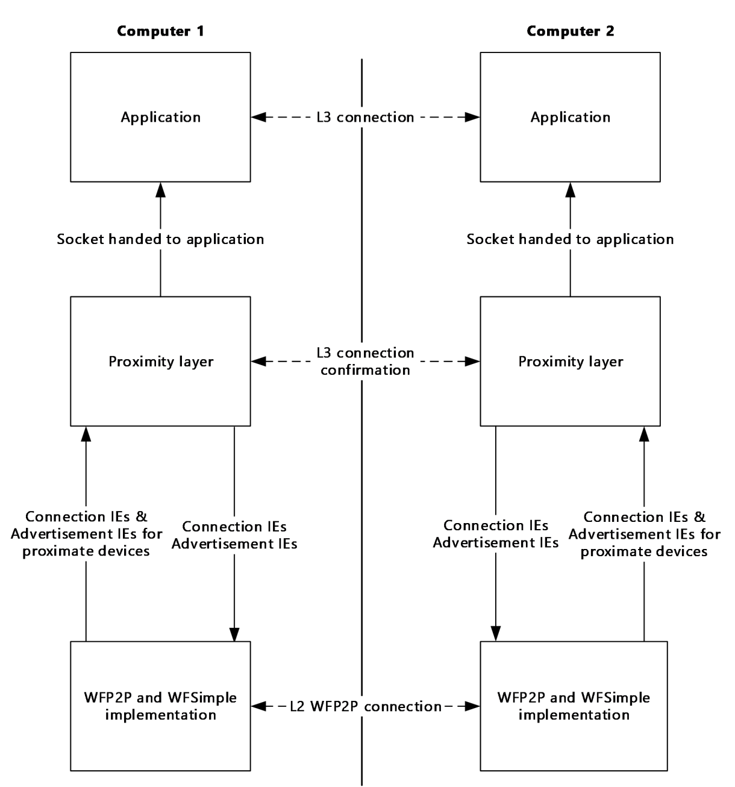
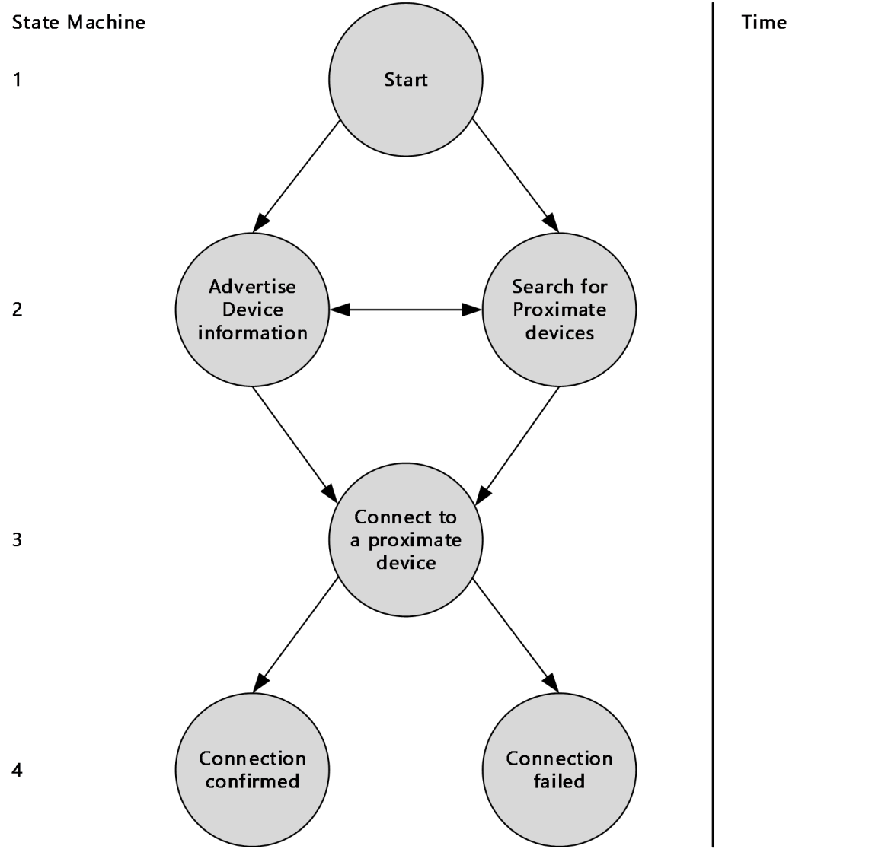
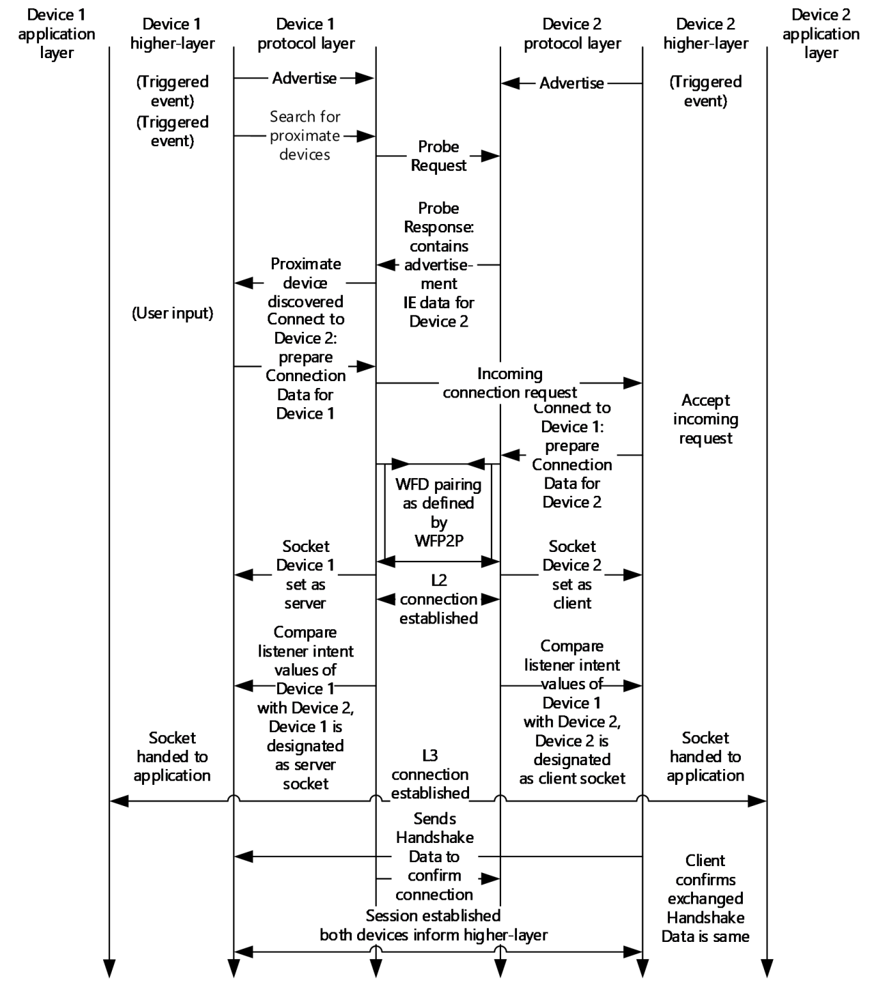
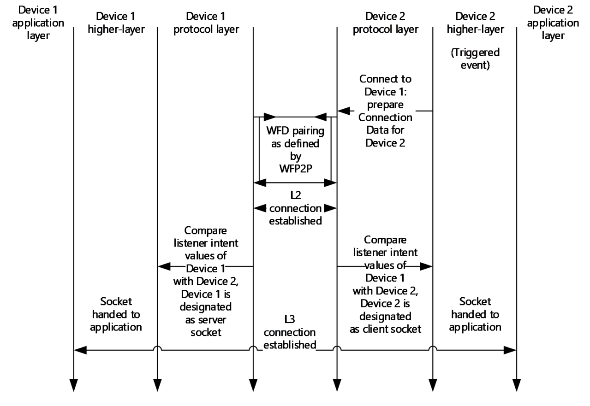

[MS-WFDAA]:

Wi-Fi Direct (WFD) Application to Application Protocol

Intellectual Property Rights Notice for Open Specifications Documentation

  Technical Documentation. Microsoft publishes Open Specifications documentation (“this

documentation”) for protocols, file formats, data portability, computer languages, and standards
support. Additionally, overview documents cover inter-protocol relationships and interactions.

  Copyrights. This documentation is covered by Microsoft copyrights. Regardless of any other

terms that are contained in the terms of use for the Microsoft website that hosts this
documentation, you can make copies of it in order to develop implementations of the technologies
that are described in this documentation and can distribute portions of it in your implementations
that use these technologies or in your documentation as necessary to properly document the
implementation. You can also distribute in your implementation, with or without modification, any
schemas, IDLs, or code samples that are included in the documentation. This permission also
applies to any documents that are referenced in the Open Specifications documentation.
  No Trade Secrets. Microsoft does not claim any trade secret rights in this documentation.
  Patents. Microsoft has patents that might cover your implementations of the technologies

described in the Open Specifications documentation. Neither this notice nor Microsoft's delivery of
this documentation grants any licenses under those patents or any other Microsoft patents.
However, a given Open Specifications document might be covered by the Microsoft Open
Specifications Promise or the Microsoft Community Promise. If you would prefer a written license,
or if the technologies described in this documentation are not covered by the Open Specifications
Promise or Community Promise, as applicable, patent licenses are available by contacting
iplg@microsoft.com.

  License Programs. To see all of the protocols in scope under a specific license program and the

associated patents, visit the Patent Map.

  Trademarks. The names of companies and products contained in this documentation might be
covered by trademarks or similar intellectual property rights. This notice does not grant any
licenses under those rights. For a list of Microsoft trademarks, visit
www.microsoft.com/trademarks.

  Fictitious Names. The example companies, organizations, products, domain names, email

addresses, logos, people, places, and events that are depicted in this documentation are fictitious.
No association with any real company, organization, product, domain name, email address, logo,
person, place, or event is intended or should be inferred.

Reservation of Rights. All other rights are reserved, and this notice does not grant any rights other
than as specifically described above, whether by implication, estoppel, or otherwise.

Tools. The Open Specifications documentation does not require the use of Microsoft programming
tools or programming environments in order for you to develop an implementation. If you have access
to Microsoft programming tools and environments, you are free to take advantage of them. Certain
Open Specifications documents are intended for use in conjunction with publicly available standards
specifications and network programming art and, as such, assume that the reader either is familiar
with the aforementioned material or has immediate access to it.

Support. For questions and support, please contact dochelp@microsoft.com.

[MS-WFDAA] - v20240423
Wi-Fi Direct (WFD) Application to Application Protocol
Copyright © 2024 Microsoft Corporation
Release: April 23, 2024

1 / 31

Revision Summary

Date

Revision
History

Revision
Class

Comments

8/8/2013

1.0

11/14/2013  1.0

New

None

Released new document.

No changes to the meaning, language, or formatting of the
technical content.

2/13/2014

2.0

Major

Significantly changed the technical content.

5/15/2014

2.0

6/30/2015

3.0

10/16/2015  4.0

7/14/2016

5.0

6/1/2017

6.0

12/1/2017

6.0

9/12/2018

7.0

4/7/2021

8.0

6/25/2021

9.0

4/23/2024

10.0

None

Major

Major

Major

Major

None

Major

Major

Major

Major

No changes to the meaning, language, or formatting of the
technical content.

Significantly changed the technical content.

Significantly changed the technical content.

Significantly changed the technical content.

Significantly changed the technical content.

No changes to the meaning, language, or formatting of the
technical content.

Significantly changed the technical content.

Significantly changed the technical content.

Significantly changed the technical content.

Significantly changed the technical content.

[MS-WFDAA] - v20240423
Wi-Fi Direct (WFD) Application to Application Protocol
Copyright © 2024 Microsoft Corporation
Release: April 23, 2024

2 / 31

## Table of Contents

- [1 Introduction](#1-introduction)
  - [1.1 Glossary](#11-glossary)
  - [1.2 References](#12-references)
    - [1.2.1 Normative References](#121-normative-references)
    - [1.2.2 Informative References](#122-informative-references)
  - [1.3 Overview](#13-overview)
  - [1.4 Relationship to Other Protocols](#14-relationship-to-other-protocols)
  - [1.5 Prerequisites/Preconditions](#15-prerequisitespreconditions)
  - [1.6 Applicability Statement](#16-applicability-statement)
  - [1.7 Versioning and Capability Negotiation](#17-versioning-and-capability-negotiation)
  - [1.8 Vendor-Extensible Fields](#18-vendor-extensible-fields)
  - [1.9 Standards Assignments](#19-standards-assignments)
- [2 Messages](#2-messages)
  - [2.1 Transport](#21-transport)
  - [2.2 Message Syntax](#22-message-syntax)
    - [2.2.1 AppWFDAcceptHeader Message](#221-appwfdacceptheader-message)
    - [2.2.2 AppWFDConnectionIE Message](#222-appwfdconnectionie-message)
    - [2.2.3 AppWFDDiscoveryMetadataIE Message](#223-appwfddiscoverymetadataie-message)
    - [2.2.4 AppWFDDiscoveryPrimaryIE Message](#224-appwfddiscoveryprimaryie-message)
- [3 Protocol Details](#3-protocol-details)
  - [3.1 Common Details](#31-common-details)
    - [3.1.1 Abstract Data Model](#311-abstract-data-model)
    - [3.1.2 Timers](#312-timers)
    - [3.1.3 Initialization](#313-initialization)
    - [3.1.4 Higher-Layer Triggered Events](#314-higher-layer-triggered-events)
    - [3.1.5 Message Processing Events and Sequencing Rules](#315-message-processing-events-and-sequencing-rules)
    - [3.1.6 Timer Events](#316-timer-events)
    - [3.1.7 Other Local Events](#317-other-local-events)
  - [3.2 Client Details](#32-client-details)
    - [3.2.1 Abstract Data Model](#321-abstract-data-model)
    - [3.2.2 Timers](#322-timers)
    - [3.2.3 Initialization](#323-initialization)
    - [3.2.4 Higher-Layer Triggered Events](#324-higher-layer-triggered-events)
    - [3.2.5 Message Processing Events and Sequencing Rules](#325-message-processing-events-and-sequencing-rules)
    - [3.2.6 Timer Events](#326-timer-events)
    - [3.2.7 Other Local Events](#327-other-local-events)
  - [3.3 Server Details](#33-server-details)
    - [3.3.1 Abstract Data Model](#331-abstract-data-model)
    - [3.3.2 Timers](#332-timers)
    - [3.3.3 Initialization](#333-initialization)
    - [3.3.4 Higher-Layer Triggered Events](#334-higher-layer-triggered-events)
    - [3.3.5 Message Processing Events and Sequencing Rules](#335-message-processing-events-and-sequencing-rules)
    - [3.3.6 Timer Events](#336-timer-events)
    - [3.3.7 Other Local Events](#337-other-local-events)
- [4 Protocol Examples](#4-protocol-examples)
  - [4.1 Version 1.0 AppWFDDiscoveryPrimaryIE](#41-version-10-appwfddiscoveryprimaryie)
  - [4.2 Version 2.0 AppWFDDiscoveryPrimaryIE (Host Role)](#42-version-20-appwfddiscoveryprimaryie-host-role)
  - [4.3 Version 2.0 AppWFDDiscoveryPrimaryIE (Peer Role)](#43-version-20-appwfddiscoveryprimaryie-peer-role)
  - [4.4 Version 2.0 AppWFDDiscoveryMetadataIE](#44-version-20-appwfddiscoverymetadataie)
  - [4.5 AppWFDConnectionIE](#45-appwfdconnectionie)
- [5 Security](#5-security)
  - [5.1 Security Considerations for Implementers](#51-security-considerations-for-implementers)
  - [5.2 Index of Security Parameters](#52-index-of-security-parameters)
- [6 Appendix A: Product Behavior](#6-appendix-a-product-behavior)
- [7 Change Tracking](#7-change-tracking)
- [8 Index](#8-index)

## 1 Introduction

The Wi-Fi Direct (WFD) Application to Application Protocol (WFDA2A) enables two or more devices to
establish a direct connection without requiring an intermediary, such as an infrastructure wireless
access point (WAP). To establish the connection, the proximate devices are required to already be
running the same application. The connection is established via one of the following relationships:



Peer-to-peer: A single WFD connection between two applications where both are performing the
role of a peer.

  Host-to-client: An application performing the role of the host that supports WFD connections with
multiple applications performing the role of a client. Although a host can connect to multiple
clients, a client can only connect to one host.

The peer, host, and client roles are specific to the application and are different from the initiator and
recipient roles for the data link layer (L2) and the server and client roles for the network layer
(L3).

Applications advertise and search for applications on proximate devices by using specific frames, the
format of which is defined by the Wi-Fi Peer-to-Peer (P2P) Specification v1.2 (WFP2P) [WF-P2P1.2].
Devices connect by using specific messages, the format of which is defined by the Wi-Fi Simple
Configuration Technical Specification v2.0.2 (WFSimple) [WF-WSC2.0.2]. Devices confirm the wireless
connection by exchanging a session ID created during the connection.

This document refers to the detailed specifications defined in the WFP2P [WF-P2P1.2] and the
WFSimple [WF-WSC2.0.2] documents and provides application-specific message formats and
descriptions to explain how the WFDA2A Protocol fits into the overall framework.

Sections 1.5, 1.8, 1.9, 2, and 3 of this specification are normative. All other sections and examples in
this specification are informative.

### 1.1 Glossary

This document uses the following terms:

advertise: To publish descriptive identifying information in a name service.

advertisement: Data used by a device to make itself discoverable to proximate devices.

Beacon: A management frame that contains all of the information required to connect to a

network. In a WLAN, Beacon frames are periodically transmitted to announce the presence of
the network.

big-endian: Multiple-byte values that are byte-ordered with the most significant byte stored in the

memory location with the lowest address.

data link layer (L2): The second layer in the ISO/OSI reference model that provides the ability to

transfer data among network entities and supports detection and handling of errors in the
physical layer.

information element (IE): In a Wi-Fi Protected Setup (WPS) scenario, descriptive information
consisting of informative type-length-values that specify the possible and currently deployed
configuration methods for a device. The IE is transferred and added to the Beacon and Probe
Response frames, and optionally to the Probe Request frame and associated request and
response messages.

listener intent: A variable number value specified in the AppWFDConnectionIE message.  WFDA2A

uses listener intent to determine the client and server roles.

5 / 31

[MS-WFDAA] - v20240423
Wi-Fi Direct (WFD) Application to Application Protocol
Copyright © 2024 Microsoft Corporation
Release: April 23, 2024

little-endian: Multiple-byte values that are byte-ordered with the least significant byte stored in

the memory location with the lowest address.

Media Access Control (MAC) address: A hardware address provided by the network interface
vendor that uniquely identifies each interface on a physical network for communication with
other interfaces, as specified in [IEEE802.3]. It is used by the media access control sublayer of
the data link layer of a network connection.

network layer (L3): The third layer in the ISO/OSI reference model that provides the ability to

transfer variable length data sequences from a source host on one network to a destination host
on a different network while maintaining the quality of service (QoS) requested by the transport
layer.

organizationally unique identifier (OUI): A unique 24-bit string that uniquely identifies a

vendor, manufacturer, or organization on a worldwide l basis, as specified in [IEEE-OUI]. The
OUI is used to help distinguish both physical devices and software, such as a network protocol,
that belong to one entity from those that belong to another.

pre-shared key (PSK): A key that is obtained through peer-to-peer (P2P) provisioning.

Probe Request: A frame that contains the advertisement IE for a device that is seeking to

establish a connection with a proximate device. The Probe Request frame is defined in the Wi-Fi
Peer-to-Peer (P2P) Specification v1.2 [WF-P2P1.2] section 4.2.2.

Probe Response: A frame that contains the advertisement IE for a device. The Probe Response is

sent in response to a Probe Request. The Probe Response frame is defined in the Wi-Fi Peer-to-
Peer (P2P) Specification v1.2 [WF-P2P1.2] section 4.2.3.

Transmission Control Protocol (TCP): A protocol used with the Internet Protocol (IP) to send
data in the form of message units between computers over the Internet. TCP handles keeping
track of the individual units of data (called packets) that a message is divided into for efficient
routing through the Internet.

type-length-value (TLV): A method of organizing data that involves a Type code (16-bit), a

specified length of a Value field (16-bit), and the data in the Value field (variable).

Wi-Fi Direct (WFD): A standard that allows Wi-Fi devices to connect to each other without

requiring a wireless access point (WAP). This standard enables WFD devices to transfer data
directly among each other resulting in significant reductions in setup.

Wi-Fi Direct (WFD) Application to Application Protocol (WFDA2A): The protocol specified by

this document, Wi-Fi Direct (WFD) Application to Application Protocol.

Wi-Fi Protected Setup (WPS): A computing standard that attempts to allow easy establishment
of a secure wireless home network. This standard was formerly known as Wi-Fi Simple Config.

wireless access point (WAP): A wireless network access server (NAS) that implements 802.11.

MAY, SHOULD, MUST, SHOULD NOT, MUST NOT: These terms (in all caps) are used as defined
in [RFC2119]. All statements of optional behavior use either MAY, SHOULD, or SHOULD NOT.

### 1.2 References

Links to a document in the Microsoft Open Specifications library point to the correct section in the
most recently published version of the referenced document. However, because individual documents
in the library are not updated at the same time, the section numbers in the documents may not
match. You can confirm the correct section numbering by checking the Errata.

[MS-WFDAA] - v20240423
Wi-Fi Direct (WFD) Application to Application Protocol
Copyright © 2024 Microsoft Corporation
Release: April 23, 2024

6 / 31

#### 1.2.1 Normative References

We conduct frequent surveys of the normative references to assure their continued availability. If you
have any issue with finding a normative reference, please contact dochelp@microsoft.com. We will
assist you in finding the relevant information.

[IEEE-OUI] IEEE Standards Association, "IEEE MAC Address Block Large (MA-L) Field Registration
Authority Public Listing", http://standards-oui.ieee.org/oui/oui.txt

[MSDN-PF.AlternateIdentities] Microsoft Corporation, "PeerFinder.AlternateIdentities,
alternateIdentities property", https://learn.microsoft.com/en-
us/uwp/api/Windows.Networking.Proximity.PeerFinder#Windows_Networking_Proximity_PeerFinder_A
lternateIdentities

[RFC2119] Bradner, S., "Key words for use in RFCs to Indicate Requirement Levels", BCP 14, RFC
2119, March 1997, https://www.rfc-editor.org/info/rfc2119

[WF-P2P1.2] Wi-Fi Alliance, "Wi-Fi Peer-to-Peer (P2P) Technical Specification v1.2", https://www.wi-
fi.org/wi-fi-peer-to-peer-p2p-technical-specification-v12

Note There is a charge to download the specification.

[WF-WSC2.0.2] Wi-Fi Alliance, "Wi-Fi Simple Configuration Technical Specification v2.0.2", August
2011, https://www.wi-fi.org/wi-fi-simple-configuration-technical-specification-v202

Note There is a charge to download the specification.

#### 1.2.2 Informative References

None.

### 1.3 Overview

WFDA2A is based on WFP2P [WF-P2P1.2] and WFSimple [WF-WSC2.0.2] and uses vendor-specific
information elements (IEs) from these standards definitions to discover similar applications and to
exchange connection information in a wireless environment.

In a Wi-Fi Direct (WFD) application-to-application scenario, the server application listens for
connection requests from client applications. The server and client’s role determination for L3 is based
on a listener intent value exchanged during establishment of the L2 connection.

WFDA2A uses a portion of the pre-shared key (PSK) during establishment of the L2 connection to
confirm the connection. Setting up a connection between proximate devices requires three steps:

1.  Advertising and searching for devices

2.  Establishing a connection

3.  Confirming the connection

[MS-WFDAA] - v20240423
Wi-Fi Direct (WFD) Application to Application Protocol
Copyright © 2024 Microsoft Corporation
Release: April 23, 2024

7 / 31

<!-- Extracted images from page 8 -->

<!-- /Extracted images from page 8 -->

### 1.4 Relationship to Other Protocols

Figure 1: Relationship of WFDA2A to other protocols

WFDA2A relies on WFP2P [WF-P2P1.2] and WFSimple [WF-WSC2.0.2]. The protocol encodes
connection and advertisement IEs and establishes the L3 connection. The WLAN service operating
on the lower layer sets up an L2 connection by implementing WFP2P and WFSimple.

### 1.5 Prerequisites/Preconditions

WFDA2A depends on the following:

1.  WFSimple [WF-WSC2.0.2] for proper key exchange.

[MS-WFDAA] - v20240423
Wi-Fi Direct (WFD) Application to Application Protocol
Copyright © 2024 Microsoft Corporation
Release: April 23, 2024

8 / 31

2.  WFP2P [WF-P2P1.2] for group owner and client negotiation for WFD pairing. WFDA2A also

depends on WFSimple [WF-WSC2.0.2].

3.  TCP/IP to establish an L3 connection.

### 1.6 Applicability Statement

An application uses WFDA2A to locate and connect to proximate devices. WFDA2A is only applicable in
scenarios with two or more devices, all of which are required to support WFDA2A. Use of the protocol
is particularly applicable when a WAP is not available. In such cases, WFD sets up a personal area
network connection between proximate devices without requiring an intermediary.

### 1.7 Versioning and Capability Negotiation

This document describes two versions of the Wi-Fi Direct (WFD) Application to Application Protocol
(WFDA2A):

  WFDA2Av1: Version 1.0 of the Wi-Fi Direct (WFD) Application to Application Protocol [MS-

WFDAA].

  WFDA2Av2: Version 2.0 of the Wi-Fi Direct (WFD) Application to Application Protocol [MS-WFDAA].

### 1.8 Vendor-Extensible Fields

WFDA2A uses the Probe Response and Beacon vendor-extensible fields defined in WFP2P [WF-
P2P1.2] sections 4.2.3 and 4.2.1 respectively, to relay advertisement information. WFDA2A uses the
M7 or M8 vendor-extensible fields defined in WFSimple [WF-WSC2.0.2] sections 8.3.8 and 8.3.9
respectively, to relay connection information.

### 1.9 Standards Assignments

None.

[MS-WFDAA] - v20240423
Wi-Fi Direct (WFD) Application to Application Protocol
Copyright © 2024 Microsoft Corporation
Release: April 23, 2024

9 / 31

## 2 Messages

### 2.1 Transport

WFDA2A relies on WFD transport. Proximate devices MUST setup a WFD connection as defined in
WFP2P [WF-P2P1.2] and WFSimple [WF-WSC2.0.2].

### 2.2 Message Syntax

Unless otherwise specified, all fields in this protocol MUST be transmitted in little-endian byte order.

#### 2.2.1 AppWFDAcceptHeader Message

The AppWFDAcceptHeader message is sent by the client to the server after the TCP connection is
established using the port and IP information sent in the AppWFDConnectionIE message to confirm
the connection. The client MUST send the first eight bytes of the PSK (specified in the SessionId
field) exchanged during L2 connection followed by the ConnectionType field. ConnectionType
MUST be set to 0 to indicate that the connection is over WFD. The server MUST validate the
SessionId and send the AppWFDAcceptHeader message to the client on the connected socket. The
client MUST validate the AppWFDAcceptHeader message received from the server by comparing it to
the message sent by the client. If the headers do not match, the client MUST abort the connection.

0  1  2  3  4  5  6  7  8  9

1
0  1  2  3  4  5  6  7  8  9

2
0  1  2  3  4  5  6  7  8  9

3
0  1

SessionId

...

ConnectionType

...

SessionId (8 bytes): This field consists of the first 8 bytes of the PSK that is exchanged during the

WFD L2 connection. The SessionId ensures that the same applications that connected over L2
are connecting over L3.

ConnectionType (8 bytes): This field indicates the type of transport over which the server and client

connected. This field MUST be set to 0 to indicate that the connection is over WFD.

#### 2.2.2 AppWFDConnectionIE Message

The AppWFDConnectionIE message is sent by using the M7 and M8 vendor-extensible fields, defined
in WFSimple [WF-WSC2.0.2] sections 8.3.8 and 8.3.9 respectively, after an application has requested
a connection with a proximate device.

0  1  2  3  4  5  6  7  8  9

1
0  1  2  3  4  5  6  7  8  9

2
0  1  2  3  4  5  6  7  8  9

3
0  1

VendorExtensionAttributeType

cbLength1

WPSOUI

PortAndIPAddrType

[MS-WFDAA] - v20240423
Wi-Fi Direct (WFD) Application to Application Protocol
Copyright © 2024 Microsoft Corporation
Release: April 23, 2024

10 / 31

...

cbLength2

PortAndIPAddr (variable)

...

...

ListenerIntentType

cbLength3

ListenerIntent (variable)

...

...

VendorExtensionAttributeType (2 bytes):  This field indicates the vendor extension attribute type
for the WPS organizationally unique identifier (OUI), as specified in [IEEE-OUI]. The field
MUST be set to the value 0x1049 and MUST be specified in big-endian byte order.

cbLength1 (2 bytes):  This field indicates the remaining size of the message in bytes. This field

MUST be specified in big-endian byte order.

WPSOUI (3 bytes): This field indicates the WPS OUI. The field MUST be set to the value 0x000137

and MUST be specified in big-endian byte order.

PortAndIPAddrType (2 bytes): This field indicates that the TLV contains a port and an IP address.

The field MUST contain the value 0x1009 and MUST be specified in big-endian byte order.

cbLength2 (2 bytes):  This field indicates the size of the PortAndIPAddr field in bytes.

PortAndIPAddr (variable): This field contains the TCP port and the IP address in the following

format:

0  1  2  3  4  5  6  7  8  9

1
0  1  2  3  4  5  6  7  8  9

2
0  1  2  3  4  5  6  7  8  9

3
0  1

Port

IP Address (variable)

...

...

The port MUST be specified in big-endian byte order.

ListenerIntentType (2 bytes):  This field indicates that the TLV contains the listener intent. The

field MUST contain the value 0x100A and MUST be specified in big-endian byte order.

cbLength3 (2 bytes): This field indicates the size of the ListenerIntent field in bytes. This field

MUST be specified in big-endian byte order.

ListenerIntent (variable): This field contains the listener intent of the peer. The peer with a higher

listener intent value MUST become the listener for the TCP connection and the other peer MUST
connect to the listener peer. When the two listener intent values are the same, the device with the
numerically larger media access control address (MAC address) MUST become the client for
the connection.<1>

[MS-WFDAA] - v20240423
Wi-Fi Direct (WFD) Application to Application Protocol
Copyright © 2024 Microsoft Corporation
Release: April 23, 2024

11 / 31

#### 2.2.3 AppWFDDiscoveryMetadataIE Message

The AppWFDDiscoveryMetadataIE message is contained in advertisement frames that the application
sends over WFD in Probe Response or Beacon frames. It is an optional message that contains
application-specific metadata.

0  1  2  3  4  5  6  7  8  9

1
0  1  2  3  4  5  6  7  8  9

2
0  1  2  3  4  5  6  7  8  9

3
0  1

A - VendorExtensionIE

cbLength

OUI

...

...

...

OUIType

B - VendorExtensionAttributeType

cbLength1

WPSOUI

MetadataAttributeType

cbLength2

Metadata (variable)

...

...

A - VendorExtensionIE (1 byte):  This field indicates that the message is a vendor extension IE.

This field MUST be set to the value 0xDD.

cbLength (1 byte):  This field indicates the remaining size of the message in bytes.

OUI (3 bytes):  This field MUST be set to the value 0x0050F2 and MUST be specified in big-endian

byte order.

OUIType (1 byte):  This field MUST be set to the value 0x04.

B - VendorExtensionAttributeType (2 bytes):  This field indicates the vendor extension attribute

type for WPS OUI, as specified in [IEEE-OUI]. The field MUST be set to the value 0x1049 and
MUST be specified in big-endian byte order.

cbLength1 (2 bytes):  This field indicates the remaining size of the message in bytes. This field

MUST be specified in big-endian byte order.

WPSOUI (3 bytes):  This field indicates the WPS OUI. The field MUST be set to the value 0x000137

and MUST be specified in big-endian byte order.

MetadataAttributeType (2 bytes): This field indicates that the TLV contains a Metadata field. The

field MUST be set to the value 0x100E and MUST be specified in big-endian byte order. This TLV
MUST be present only in WFDA2Av2.

cbLength2 (2 bytes):  This field indicates the size of the Metadata field in bytes and MUST be

specified in big-endian byte order. The size of the metadata MUST NOT be greater than 32 bytes.

Metadata (variable):  This field contains the metadata which is an application-specific data BLOB.

The size of the field is indicated by the cbLength2 field. Metadata is an optional property and the
AppWFDDiscoveryMetadataIE message will not be present in the advertisement if metadata is not
set by the application.

[MS-WFDAA] - v20240423
Wi-Fi Direct (WFD) Application to Application Protocol
Copyright © 2024 Microsoft Corporation
Release: April 23, 2024

12 / 31

#### 2.2.4 AppWFDDiscoveryPrimaryIE Message

The AppWFDDiscoveryPrimaryIE message is contained in advertisement frames that the application
sends over WFD to Probe Response or Beacon frames. This message contains application
attributes, such as the Display Name, Peer Id, Role and Version. This IE MUST be present in the
advertisement frames for applications on proximate devices to discover the advertising application.

0  1  2  3  4  5  6  7  8  9

1
0  1  2  3  4  5  6  7  8  9

2
0  1  2  3  4  5  6  7  8  9

3
0  1

VendorExtensionIE

cbLength

OUI

...

...

...

OUIType

VendorExtensionAttributeType

cbLength1

WPSOUI

PeerIdAttributeType

cbLength2

PeerId (variable)

...

...

DisplayNameAttributeType

cbLength3

DisplayName (variable)

...

...

RoleAttributeType

cbLength4

Role (variable)

...

...

VersionAttributeType

cbLength5

Version (variable)

...

...

VendorExtensionIE (1 byte): This field indicates that the message is a vendor extension IE. The

field MUST be set to the value 0xDD.

13 / 31

[MS-WFDAA] - v20240423
Wi-Fi Direct (WFD) Application to Application Protocol
Copyright © 2024 Microsoft Corporation
Release: April 23, 2024

cbLength (1 byte): This field indicates the remaining size of the message in bytes.

OUI (3 bytes): This field MUST be set to the value 0x0050F2 and MUST be specified in big-endian

byte order.

OUIType (1 byte): This field MUST be set to the value 0x04.

VendorExtensionAttributeType (2 bytes): This field indicates the vendor extension attribute type
for WPS OUI, as specified in [IEEE-OUI]. The field MUST contain the value 0x1049 and MUST be
specified in big-endian byte order.

cbLength1 (2 bytes):  This field indicates the remaining size of the message in bytes. The field

MUST be specified in big-endian byte order.

WPSOUI (3 bytes): This field indicates the WPS OUI. This field MUST be set to the value 0x000137

and MUST be specified in big-endian byte order.

PeerIdAttributeType (2 bytes): This field contains a TLV that specifies the Peer Id. Based on the
protocol version, this field MUST contain one of the values noted in the following table. This field
MUST be specified in big-endian byte order.

Protocol version  Value

WFDA2Av1

0x100B

WFDA2Av2

0x100C

cbLength2 (2 bytes): This field indicates the size of the PeerId field in bytes. This field MUST be

specified in big-endian byte order.

PeerId (variable): This field contains the Peer Id. The Peer Id is a unique identifier that identifies the

application. The size of this field is indicated by the cbLength2 field. The Peer Id MUST be a SHA-
256 hash of the string passed by the higher layer.

DisplayNameAttributeType (2 bytes): This field indicates that the TLV contains a Display Name.

Based on the protocol version, this field MUST contain one of the values in the following table. This
field MUST be specified in big-endian byte order.

Protocol version  Value

WFDA2Av1

0x1008

WFDA2Av2

0x1010

cbLength3 (2 bytes):  This field indicates the size of the DisplayName field in bytes. This field

MUST be specified in big-endian byte order. The Display Name size MUST NOT exceed 98 bytes.

DisplayName (variable): This field contains the Display Name. The Display Name is a property that

the application can set. The size is indicated by the cbLength3 field. Note that if the application
does not set a Display Name, the system MUST set the computer’s DNS name as the Display
Name.

RoleAttributeType (2 bytes): This TLV MUST be present only in WFDA2Av2. When present, this

field indicates that the TLV contains a Role. The field MUST contain the value 0x100D and MUST
be specified in big-endian byte order. If the field is not present, by default the application
performs the peer role.

cbLength4 (2 bytes):  This field indicates the size of the Role field and MUST be set to 1 byte. This

field MUST be specified in big-endian byte order.

[MS-WFDAA] - v20240423
Wi-Fi Direct (WFD) Application to Application Protocol
Copyright © 2024 Microsoft Corporation
Release: April 23, 2024

14 / 31

Role (variable): This field identifies the role that the application is performing (see section 3.1.3).
The size of the field is indicated by the cbLength4 field which MUST be set to 1 byte. The field
MUST be set to one of the values in the following table to indicate the role.

Role  Value

Peer

0x01

Host

0x02

Client  0x03

VersionAttributeType (2 bytes):  This field indicates that the TLV contains a Version attribute. It

MUST contain the value 0x100F and MUST be specified in big-endian byte order. This TLV MUST
be present only in WFDA2Av2.

cbLength5 (2 bytes):  This field indicates the size of the Version field and MUST be set to 2 bytes.

This field MUST be specified in big-endian byte order.

Version (variable): This field identifies the protocol version. The size of the field is indicated by the

cbLength4 field which MUST be set to 2 bytes. This field MUST be specified in big-endian byte
order. The most significant byte MUST indicate the major version and the least significant byte
MUST indicate the minor version.<2>

[MS-WFDAA] - v20240423
Wi-Fi Direct (WFD) Application to Application Protocol
Copyright © 2024 Microsoft Corporation
Release: April 23, 2024

15 / 31

<!-- Extracted images from page 16 -->

<!-- /Extracted images from page 16 -->

## 3 Protocol Details

This section defines how a device advertises and searches for proximate devices, establishes a
connection, and confirms the connection. A device MUST follow the specified guidance for all three
steps to successfully establish a connection with a proximate device.

### 3.1 Common Details

The following state diagram depicts how a device implements WFDA2A.

Figure 2: WFDA2A state diagram

1.  A higher-layer trigger moves the protocol from state 1: start, to state 2 (for details, see section

3.1.4).

2.  State 2 consists of two complementary operations: advertise device information and search for
proximate devices. When the protocol advertises device information, it can be discovered by a
device searching for proximate devices. Conversely, when the protocol is searching for devices, it
can discover proximate devices that are advertising their device information.

16 / 31

[MS-WFDAA] - v20240423
Wi-Fi Direct (WFD) Application to Application Protocol
Copyright © 2024 Microsoft Corporation
Release: April 23, 2024

In state 2, the protocol can transition from one operation to the other. For the protocol and a
proximate device to discover each other, the device has to perform the opposite operation to that
being performed by the protocol. For example, if the protocol is advertising device information,
then for the protocol to be discovered, the proximate device has to be searching for devices. If the
protocol and proximate device persistently perform the same operation, only advertise device
information or only search for proximate devices, the connection cannot be made.

3.  A higher-layer trigger moves the protocol from state 2 to state 3, connecting to a proximate

device (for details, see section 3.1.4).

4.  After all of the message processing events and sequencing events have completed (for details, see
section 3.1.5), the protocol moves to state 4. If all processing was successful, the connection is
made between the protocol and the proximate device; otherwise, the connection fails.

#### 3.1.1 Abstract Data Model

This section describes a conceptual model of possible data organization that an implementation
maintains to participate in this protocol. The described organization is provided to facilitate the
explanation of how the protocol behaves. This document does not mandate that implementations
adhere to this model as long as their external behavior is consistent with that described in this
document.

The following is a list of the abstract data model elements maintained by the WFDA2A protocol for
each proximate device:

Advertisement data:  The device’s Display Name, Peer ID, Role, Version, and optional Metadata.

Connection data:  The IP address, port number, and listener intent.

Handshake data:  The Session ID (derived from the WFD PSK) and the Connection Type.

#### 3.1.2 Timers

WFDA2A uses the ClientTimer and ServerTimer (see section 3.3.2). If a timer expires before a
connection is established, WFDA2A updates the application that a timeout error has occurred.

#### 3.1.3 Initialization

When a higher layer is ready to advertise, it passes Advertisement data to the protocol, including
Display Name, Peer ID, Role, and optional Metadata IE content, which all come from the application.

To establish a successful wireless connection, the higher layer MUST specify the same Peer ID value
across proximate devices. If a Peer ID value is not provided, the higher layer MUST create a Peer ID.
Cross-platform applications MUST encode the alternateIdentities property as defined in [MSDN-
PF.AlternateIdentities] as their Peer ID value.

The application MUST specify one of the following values for the application level role:

Role  Description

Peer

Host

Peer role applications can discover other peer role applications. However, a peer role application MUST
only connect to one other peer role application at any time.

Host role applications can discover client role applications. Host role applications MAY connect to multiple
client role applications at the same time.

Client  Client role applications can discover host role applications. Client role applications MUST only connect to

17 / 31

[MS-WFDAA] - v20240423
Wi-Fi Direct (WFD) Application to Application Protocol
Copyright © 2024 Microsoft Corporation
Release: April 23, 2024

Role  Description

one host role application at a time.

Implementations MUST support the peer role and SHOULD support the host and client roles.<3>

A higher layer can trigger the search for proximate devices which causes Probe Requests to be sent
to the devices. To reply, a device returns a Probe Response containing the advertisement IEs
which SHOULD be sent by the protocol layer to the higher layer.

After a higher layer selects a proximate device, the protocol establishes a connection with that device.
At that time, the protocol MUST prepare the Connection data.

Next, the higher-layer for the device receives and accepts the incoming connection request.  As a
result, the device sends its Connection data back to the initiator.

At this point, both devices have requested a connection with each other. The devices create an L2
connection by using the WFP2P pairing procedure and create a PSK (for details of the negotiation, see
section 3.2.5). The devices establish an L3 connection based on the values specified in the
Connection data.

After an L3 connection is established, the protocol confirms the connection using the Handshake
data which is part of the AppWFDAcceptHeader (see section 2.2.1). The protocol uses the PSK to
create a Session ID, which is the first 8 bytes of the PSK. The exchange is bi-directional with one side
sending information as part of the AppWFDAcceptHeader (see section 2.2.1).

#### 3.1.4 Higher-Layer Triggered Events

To successfully establish a connection, the protocol relies on three higher-layer events:

1.  A higher layer publishes advertisement IE content which causes a device to be discoverable to

proximate devices.

2.  A higher-layer initiates searching for proximate devices which causes Probe Requests to be sent
to proximate devices. In reply, Probe Responses are received from the proximate devices and
these contain the advertisement IEs for the devices.

3.  A higher-layer selects a proximate device to connect with which causes the sending and receiving

of Connection data.

#### 3.1.5 Message Processing Events and Sequencing Rules

The following diagram depicts the messaging sequence between WFDA2A and a proximate device.

[MS-WFDAA] - v20240423
Wi-Fi Direct (WFD) Application to Application Protocol
Copyright © 2024 Microsoft Corporation
Release: April 23, 2024

18 / 31

<!-- Extracted images from page 19 -->

<!-- /Extracted images from page 19 -->

Figure 3: Messaging sequence between WFDA2A and a proximate device

The message sequence between the WFDA2A and a proximate device is distributed into five steps:

1.  Advertise device information: A higher layer triggers the advertising of device information.

The higher layer passes advertisement IE content to WFDA2A which then publishes the
information on the wire to be discovered by proximate devices.

[MS-WFDAA] - v20240423
Wi-Fi Direct (WFD) Application to Application Protocol
Copyright © 2024 Microsoft Corporation
Release: April 23, 2024

19 / 31

2.  Search for proximate devices: A higher layer triggers the search for proximate devices that are
performing the complementary role (for details about Roles, see section 3.1.3). WFDA2A MUST
send Probe Requests containing the advertisement IE content to proximate devices. If a
proximate device is discovered that is performing a complementary role, the device MUST reply
with a Probe Response containing its advertisement IE content.

3.  Establish an L2 connection: A higher layer selects a proximate device and designates it as the
initiator. The initiator’s protocol prepares the initiator's Connection data and sends an incoming
connection request to the proximate device designated as the recipient.  After the recipient
accepts the incoming connection request, the recipient sends its Connection data back to the
initiator. At this point, both devices have requested a connection with each other. The devices
create an L2 connection using the WFP2P pairing procedure.

4.  Establish an L3 connection: The two devices establish an L3 connection based on the

Connection data. During creation of the L3 connection, WFDA2A assigns one device as the client
and the other as the server, the difference being that the client connects on an L3 socket, as
defined in section 3.2.5, while the server listens on an L3 socket, as defined in section 3.3.5. Note
that the L3 client and server designations are assigned independently of the L2 initiator and
recipient roles defined in step 3.

5.  Confirm the connection: Upon establishment of the connection, the client MUST send the

AppWFDAcceptHeader message to the server (see section 2.2.1). When the AppWFDAcceptHeader
message is received, the server MUST validate the SessionId from AppWFDAcceptHeader by
comparing it to the value of its SessionId. If the two SessionId values match, the server MUST
send the AppWFDAcceptHeader message to the client; otherwise, the server MUST abort the
connection. When the AppWFDAcceptHeader message is sent to the client, the client MUST
validate the AppWFDAcceptHeader received from the server by comparing it to what was
previously sent by the client. If the two AppWFDAcceptHeader messages are identical,
establishment of the connection is complete; otherwise, the client MUST abort the connection.

#### 3.1.6 Timer Events

When the ClientTimer or ServerTimer (section 3.1.2) expires before a connection is established,
WFDA2A informs the higher layer that a timeout error has occurred.

#### 3.1.7 Other Local Events

During L2 establishment, a higher layer on the recipient device accepts the incoming connection
request which causes the recipient’s Connection data to be sent to the initiator. If the incoming
connection request is not accepted, the recipient’s protocol times out as defined by WFP2P in [WF-
P2P1.2] section 4.1.7.

A higher-layer can cancel a connection at any time; consequently, WFDA2A cancels the current
operation. The device will not receive any connection requests and the proximate device will time out.
The connection attempt SHOULD fail.

### 3.2 Client Details

The following sections specify proper protocol behavior for a device designated as a client.

In WFDA2A, negotiation between a client and the server occurs during establishment of the L3
connection. For a description of protocol behavior prior to L3 establishment, see section 3.1.4.

#### 3.2.1 Abstract Data Model

This section describes a conceptual model of possible data organization that an implementation
maintains to participate in this protocol. The described organization is provided to facilitate the

20 / 31

[MS-WFDAA] - v20240423
Wi-Fi Direct (WFD) Application to Application Protocol
Copyright © 2024 Microsoft Corporation
Release: April 23, 2024

explanation of how the protocol behaves. This document does not mandate that implementations
adhere to this model as long as their external behavior is consistent with that described in this
document.

The following is a list of the abstract data model elements maintained by the WFDA2A protocol for a
device designated as a client.

Connection data:  The IP address, port number, and listener intent.

Handshake data:  The Session ID (derived from the WFD PSK) and the Connection Type.

#### 3.2.2 Timers

ClientTimer:  During L3 establishment, the client sets a one minute timer after attempting to connect
to the server. If the timer expires without the server accepting the connection, WFDA2A informs
the application that a time-out error has occurred.

#### 3.2.3 Initialization

The process of advertisement and establishment of the L2 connection are as specified in sections
3.1.3 and 3.1.5.

WFDA2A creates a relationship between a client and the server based on the Connection data. The
protocol for each device prepares and exchanges the Connection data during L2 establishment as
defined in section 3.1.5.

Initialization of the Handshake data is as defined in sections 3.1.3 and 3.1.5.

#### 3.2.4 Higher-Layer Triggered Events

Clients implement the higher-layer triggered events as defined in section 3.1.4.

#### 3.2.5 Message Processing Events and Sequencing Rules

The following diagram depicts the messaging sequence for client/server negotiation and is a portion of
the diagram presented in section 3.1.5.

[MS-WFDAA] - v20240423
Wi-Fi Direct (WFD) Application to Application Protocol
Copyright © 2024 Microsoft Corporation
Release: April 23, 2024

21 / 31

<!-- Extracted images from page 22 -->

<!-- /Extracted images from page 22 -->

Figure 4: Messaging sequence for client/server negotiation

Establish an L3 connection: Two devices set up a client/server relationship based on their
Connection data exchanged during L2 establishment (see section 3.1.5). To identify the client, the
devices compare the respective listener intent values and the device with the lower value MUST be
designated as the client. When the two values are the same, the devices MUST compare the
respective MAC address values and the device with the numerically larger MAC address MUST be
designated as the client. The other device is then designated as the server.

Confirmation of the Handshake data and establishment of the connection are as defined in section
3.1.5.

#### 3.2.6 Timer Events

Clients implement the timer events as defined in section 3.1.6.

#### 3.2.7 Other Local Events

A higher layer can cancel a connection at any time. If a higher layer cancels a connection, WFDA2A
cancels the current operation. The device will not receive any connection requests and the proximate
device will time-out.  The connection attempt fails.

### 3.3 Server Details

The following sections specify proper protocol behavior for a device designated as the server.

[MS-WFDAA] - v20240423
Wi-Fi Direct (WFD) Application to Application Protocol
Copyright © 2024 Microsoft Corporation
Release: April 23, 2024

22 / 31

In WFDA2A, negotiation between a client and the server occurs during establishment of the L3
connection. For a description of protocol behavior prior to L3 establishment, see section 3.1.4.

#### 3.3.1 Abstract Data Model

This section describes a conceptual model of possible data organization that an implementation
maintains to participate in this protocol. The described organization is provided to facilitate the
explanation of how the protocol behaves. This document does not mandate that implementations
adhere to this model as long as their external behavior is consistent with that described in this
document.

The following is a list of the abstract data model elements maintained by the WFDA2A protocol for a
device designated as the server:

Connection data:  The IP address, port number, and listener intent.

Handshake data: The Session ID (derived from the WFD PSK) and the Connection Type.

#### 3.3.2 Timers

ServerTimer:  During L3 establishment, the server sets a one minute timer after attempting to listen
to incoming connections from the client. If the timer expires without a connection request from
the client, WFDA2A informs the application that a time-out error has occurred.

#### 3.3.3 Initialization

The process of advertisement and establishment of the L2 connection are as defined in sections
3.1.3 and 3.1.5.

WFDA2A creates a relationship between a client and the server based on the Connection data. The
protocol for each device prepares and exchanges the Connection data during L2 establishment as
defined in section 3.1.5.

Initialization of the Handshake data is as defined in sections 3.1.3 and 3.1.5.

#### 3.3.4 Higher-Layer Triggered Events

Servers implement the higher-layer triggered events defined in section 3.1.4.

#### 3.3.5 Message Processing Events and Sequencing Rules

The following diagram depicts the messaging sequence for client/server negotiation and is a portion of
the diagram presented in section 3.1.5.

[MS-WFDAA] - v20240423
Wi-Fi Direct (WFD) Application to Application Protocol
Copyright © 2024 Microsoft Corporation
Release: April 23, 2024

23 / 31

<!-- Extracted images from page 24 -->

<!-- /Extracted images from page 24 -->

Figure 5: Messaging sequence for client/server negotiation

Establish an L3 connection: Two devices set up a client/server relationship based on the
Connection data exchanged during L2 establishment (see section 3.1.5). To identify the client in the
relationship, the devices compare the respective listener intent values and the device with the
higher value MUST be designated as the server. When the two values are the same, the devices MUST
compare the respective MAC address values and the device with the numerically smaller MAC
address MUST be designated as the server. The other device is then designated as the client.

Confirmation of the Handshake data and establishment of the connection are as defined in section
3.1.5.

#### 3.3.6 Timer Events

Servers implement the timer events as defined in section 3.1.6.

#### 3.3.7 Other Local Events

A higher layer can cancel a connection at any time; subsequently, WFDA2A cancels the current
operation. The device will not receive any connection requests and the proximate device will time out.
The connection attempt fails.

[MS-WFDAA] - v20240423
Wi-Fi Direct (WFD) Application to Application Protocol
Copyright © 2024 Microsoft Corporation
Release: April 23, 2024

24 / 31

## 4 Protocol Examples

The following sections provide examples that describe the formats for the IEs.

### 4.1 Version 1.0 AppWFDDiscoveryPrimaryIE

 0xDD,            // Vendor extension IE
 0x38,            // Length = 56 bytes
 0x00, 0x50, 0xF2,   // Expected OUI
 0x04,            // Expected subtype

 0x10, 0x49,     // Vendor Extension Attribute type
 0x00, 0x30,     // Length = 48 bytes
 0x00, 0x01, 0x37,   // Expected WPS OUI

 0x10, 0x0B,               // Peer ID Attribute type
 0x00, 0x20,               // Length = 32 bytes
 0x11, 0x12, 0x13, 0x14, 0x15, 0x16, 0x17, 0x18, 0x19,   // Peer ID (example)
 0x1A, 0x1B, 0x1C, 0x1D, 0x1E, 0x1F,   0x20,
 0x01, 0x02, 0x03, 0x04, 0x05, 0x06, 0x07, 0x08, 0x09,
 0x0A, 0x0B, 0x0C, 0x0D, 0x0E, 0x0F, 0x10,

 0x10, 0x08,         // Display Name attribute type
 0x00, 0x05,         // Length = 5 bytes
 0x53, 0x6D, 0x69, 0x74, 0x68          // Display name: "Smith" (Example)

### 4.2 Version 2.0 AppWFDDiscoveryPrimaryIE (Host Role)

 0xDD,           // Vendor extension IE
 0x46,            // Length = 70 bytes
 0x00, 0x50, 0xf2,   // Expected OUI
 0x04,            // Expected subtype

 0x10, 0x49,     // Vendor Extension Attribute type
 0x00, 0x3E,     // Length = 62 bytes
 0x00, 0x01, 0x37,   // Expected WPS OUI

 0x10, 0x10,             // Display Name attribute type
 0x00, 0x08,             // Length = 8 bytes

 // Display name: "John Doe" (Example)
 0x4a, 0x6f, 0x68, 0x6e, 0x20, 0x44, 0x6f, 0x65,

 0x10, 0x0c,             // Peer ID Peer Attribute type
 0x00, 0x20,               // Length = 32 bytes
 0x2a, 0x2b, 0x2c, 0x2d, 0x2e, 0x2f, 0x30, 0x31, 0x42,   // Peer ID (example)
 0x43, 0x44, 0x45, 0x46, 0x47, 0x48, 0x49,  0x00, 0x01,
 0x02, 0x03, 0x04, 0x05, 0x06, 0x07, 0xff, 0xfe, 0xfd, 0xfc, 0xfb, 0xfa, 0xf9, 0xf8,

 0x10, 0x0d,   // Role Attribute type
 0x00, 0x01,   // Length = 1 byte
 0x02,          // Role (Host)

 0x10, 0x0f,   // Version Attribute type
 0x00, 0x02,      // Length = 2 bytes
 0x02, 0x00,   // (Major Version = 2, Minor Version = 0)

### 4.3 Version 2.0 AppWFDDiscoveryPrimaryIE (Peer Role)

 0xDD,           // Vendor extension IE
 0x46,            // Length = 70 bytes
 0x00, 0x50, 0xf2,   // Expected OUI
 0x04,            // Expected subtype

[MS-WFDAA] - v20240423
Wi-Fi Direct (WFD) Application to Application Protocol
Copyright © 2024 Microsoft Corporation
Release: April 23, 2024

25 / 31

 0x10, 0x49,     // Vendor Extension Attribute type
 0x00, 0x3E,     // Length = 62 bytes
 0x00, 0x01, 0x37,   // Expected WPS OUI

 0x10, 0x08,             // Display Name attribute type
 0x00, 0x08,             // Length = 8 bytes

 // Display name: "John Doe" (Example)
 0x4a, 0x6f, 0x68, 0x6e, 0x20, 0x44, 0x6f, 0x65,

 0x10, 0x0B,             // Peer ID Peer Attribute type
 0x00, 0x20,               // Length = 32 bytes
 0x2a, 0x2b, 0x2c, 0x2d, 0x2e, 0x2f, 0x30, 0x31, 0x42,   // Peer ID (example)
 0x43, 0x44, 0x45, 0x46, 0x47, 0x48, 0x49,  0x00, 0x01,
 0x02, 0x03, 0x04, 0x05, 0x06, 0x07, 0xff, 0xfe, 0xfd, 0xfc, 0xfb, 0xfa, 0xf9, 0xf8,

 0x10, 0x0d,   // Role Attribute type
 0x00, 0x01,   // Length = 1 byte
 0x01,          // Role (Peer)

 0x10, 0x0F,   // Version Attribute type
 0x00, 0x02,      // Length = 2 bytes
 0x02, 0x00,   // (Major Version = 2, Minor Version = 0)

### 4.4 Version 2.0 AppWFDDiscoveryMetadataIE

 0xDD,            // Vendor extension IE
 0x2F,            // Length = 47 bytes
 0x00, 0x50, 0xf2,   // Expected OUI
 0x04,                // Expected subtype

 0x10, 0x49,     // Vendor Extension Attribute type
 0x00, 0x27,     // Length = 39 bytes
 0x00, 0x01, 0x37,   // Expected WPS OUI

 0x10, 0x0e,     // AppMetadata attribute type
 0x00, 0x20,     // Length = 32 Bytes

 // AppMetadata
 0xff, 0xd8, 0xff, 0xe0, 0x00, 0x10, 0x4a, 0x46, 0x49, 0x46, 0x00, 0x01, 0x02, 0x00, 0x00,
0x01,
 0x00, 0x01, 0x00, 0x00, 0xff, 0xe1, 0x25, 0x07, 0x68, 0x74, 0x74, 0x70, 0x3a, 0x2f, 0x2f,
0x6e

### 4.5 AppWFDConnectionIE

 0x10, 0x0A,   // Listener intent attribute type
 0x00, 0x02,   // Length = 2 bytes
 0x44, 0x00,   // Listener Intent = 17408

 0x10, 0x09,   // IP Address/Port Attribute type
 0x00, 0x12,   // Length = 18 Bytes
 0x43, 0x42,   // Port = 17218

 // IP Address
 0xfe, 0x80, 0x00, 0x00, 0x00, 0x00, 0x00, 0x00, 0x01, 0x02, 0x03, 0x04, 0x05, 0x06, 0x07, 0x8

[MS-WFDAA] - v20240423
Wi-Fi Direct (WFD) Application to Application Protocol
Copyright © 2024 Microsoft Corporation
Release: April 23, 2024

26 / 31

## 5 Security

### 5.1 Security Considerations for Implementers

WFDA2A is built on top of WFSimple and uses its security models. WFSimple outlines the security
model for key exchange used while establishing the L2 and L3 connections. For details about the
security model, see [WF-WSC2.0.2].

### 5.2 Index of Security Parameters

None.

[MS-WFDAA] - v20240423
Wi-Fi Direct (WFD) Application to Application Protocol
Copyright © 2024 Microsoft Corporation
Release: April 23, 2024

27 / 31

## 6 Appendix A: Product Behavior

The information in this specification is applicable to the following Microsoft products or supplemental
software. References to product versions include updates to those products.

  Windows 8 operating system

  Windows Server 2012 operating system

  Windows 8.1 operating system

  Windows Server 2012 R2 operating system

  Windows 10 operating system

  Windows Server 2016 operating system

  Windows Server 2019 operating system

  Windows Server 2022 operating system

  Windows 11 operating system

  Windows Server 2025 operating system

Exceptions, if any, are noted in this section. If an update version, service pack or Knowledge Base
(KB) number appears with a product name, the behavior changed in that update. The new behavior
also applies to subsequent updates unless otherwise specified. If a product edition appears with the
product version, behavior is different in that product edition.

Unless otherwise specified, any statement of optional behavior in this specification that is prescribed
using the terms "SHOULD" or "SHOULD NOT" implies product behavior in accordance with the
SHOULD or SHOULD NOT prescription. Unless otherwise specified, the term "MAY" implies that the
product does not follow the prescription.

<1> Section 2.2.2:  The value for the listener intent is set based on whether the machine is joined
to a domain. Machines joined to a domain usually perform the L3 client role and specify a listener
intent value of 100. Machines not joined to a domain usually perform the L3 server role and specify a
listener intent value of 500.

<2> Section 2.2.4:  In Windows, the major version is set to 2 and the minor version is set to 0,
except in Windows 8 and Windows Server 2012, the Version field is not present.

<3> Section 3.1.3: Windows 8 and Windows Server 2012 do not implement the application level host
or client roles.

[MS-WFDAA] - v20240423
Wi-Fi Direct (WFD) Application to Application Protocol
Copyright © 2024 Microsoft Corporation
Release: April 23, 2024

28 / 31

## 7 Change Tracking

This section identifies changes that were made to this document since the last release. Changes are
classified as Major, Minor, or None.

The revision class Major means that the technical content in the document was significantly revised.
Major changes affect protocol interoperability or implementation. Examples of major changes are:

  A document revision that incorporates changes to interoperability requirements.
  A document revision that captures changes to protocol functionality.

The revision class Minor means that the meaning of the technical content was clarified. Minor changes
do not affect protocol interoperability or implementation. Examples of minor changes are updates to
clarify ambiguity at the sentence, paragraph, or table level.

The revision class None means that no new technical changes were introduced. Minor editorial and
formatting changes may have been made, but the relevant technical content is identical to the last
released version.

The changes made to this document are listed in the following table. For more information, please
contact dochelp@microsoft.com.

Section

Description

6 Appendix A: Product
Behavior

Added Windows Server 2025 to the list of applicable
products.

Revision
class

Major

[MS-WFDAA] - v20240423
Wi-Fi Direct (WFD) Application to Application Protocol
Copyright © 2024 Microsoft Corporation
Release: April 23, 2024

29 / 31

## 8 Index
A

Abstract data model
   client 20
   server 23
Applicability 9
AppWFDAcceptHeader Message message 10
AppWFDConnectionIE Message message 10
AppWFDDiscoveryMetadataIE Message message 12
AppWFDDiscoveryPrimaryIE Message message 13

C

Capability negotiation 9
Change tracking 29
Client
   abstract data model 20
   higher-layer triggered events 21
   initialization 21
   message processing 21
   other local events 22
   overview (section 3.1 16, section 3.2 20)
   sequencing rules 21
   timer events 22
   timers 21

D

Data model - abstract
   client 20
   server 23

F

Fields - vendor-extensible 9

G

Glossary 5

H

Higher-layer triggered events
   client 21
   server 23

I

Implementer - security considerations 27
Index of security parameters 27
Informative references 7
Initialization
   client 21
   server 23
Introduction 5

M

Message processing
   client 21
   server 23

[MS-WFDAA] - v20240423
Wi-Fi Direct (WFD) Application to Application Protocol
Copyright © 2024 Microsoft Corporation
Release: April 23, 2024

Messages
   AppWFDAcceptHeader Message 10
   AppWFDAcceptHeader Message message 10
   AppWFDConnectionIE Message 10
   AppWFDConnectionIE Message message 10
   AppWFDDiscoveryMetadataIE Message 12
   AppWFDDiscoveryMetadataIE Message message 12
   AppWFDDiscoveryPrimaryIE Message 13
   transport 10

N

Normative references 7

O

Other local events
   client 22
   server 24
Overview (synopsis) 7

P

Parameters - security index 27
Preconditions 8
Prerequisites 8
Product behavior 28
Protocol Details
   overview 16
Proxy
   overview 16

R

References 6
   informative 7
   normative 7
Relationship to other protocols 8

S

Security
   implementer considerations 27
   parameter index 27
Sequencing rules
   client 21
   server 23
Server
   abstract data model 23
   higher-layer triggered events 23
   initialization 23
   message processing 23
   other local events 24
   overview (section 3.1 16, section 3.3 22)
   sequencing rules 23
   timer events 24
   timers 23
Standards assignments 9

T

30 / 31

Timer events
   client 22
   server 24
Timers
   client 21
   server 23
Tracking changes 29
Transport 10
Triggered events - higher-layer
   client 21
   server 23

V

Vendor-extensible fields 9
Versioning 9

[MS-WFDAA] - v20240423
Wi-Fi Direct (WFD) Application to Application Protocol
Copyright © 2024 Microsoft Corporation
Release: April 23, 2024

31 / 31

