[MS-WMI]:

Windows Management Instrumentation Remote Protocol

Intellectual Property Rights Notice for Open Specifications Documentation

  Technical Documentation. Microsoft publishes Open Specifications documentation (“this

documentation”) for protocols, file formats, data portability, computer languages, and standards
support. Additionally, overview documents cover inter-protocol relationships and interactions.

  Copyrights. This documentation is covered by Microsoft copyrights. Regardless of any other

terms that are contained in the terms of use for the Microsoft website that hosts this
documentation, you can make copies of it in order to develop implementations of the technologies
that are described in this documentation and can distribute portions of it in your implementations
that use these technologies or in your documentation as necessary to properly document the
implementation. You can also distribute in your implementation, with or without modification, any
schemas, IDLs, or code samples that are included in the documentation. This permission also
applies to any documents that are referenced in the Open Specifications documentation.
  No Trade Secrets. Microsoft does not claim any trade secret rights in this documentation.
  Patents. Microsoft has patents that might cover your implementations of the technologies

described in the Open Specifications documentation. Neither this notice nor Microsoft's delivery of
this documentation grants any licenses under those patents or any other Microsoft patents.
However, a given Open Specifications document might be covered by the Microsoft Open
Specifications Promise or the Microsoft Community Promise. If you would prefer a written license,
or if the technologies described in this documentation are not covered by the Open Specifications
Promise or Community Promise, as applicable, patent licenses are available by contacting
iplg@microsoft.com.

  License Programs. To see all of the protocols in scope under a specific license program and the

associated patents, visit the Patent Map.

  Trademarks. The names of companies and products contained in this documentation might be
covered by trademarks or similar intellectual property rights. This notice does not grant any
licenses under those rights. For a list of Microsoft trademarks, visit
www.microsoft.com/trademarks.

  Fictitious Names. The example companies, organizations, products, domain names, email

addresses, logos, people, places, and events that are depicted in this documentation are fictitious.
No association with any real company, organization, product, domain name, email address, logo,
person, place, or event is intended or should be inferred.

Reservation of Rights. All other rights are reserved, and this notice does not grant any rights other
than as specifically described above, whether by implication, estoppel, or otherwise.

Tools. The Open Specifications documentation does not require the use of Microsoft programming
tools or programming environments in order for you to develop an implementation. If you have access
to Microsoft programming tools and environments, you are free to take advantage of them. Certain
Open Specifications documents are intended for use in conjunction with publicly available standards
specifications and network programming art and, as such, assume that the reader either is familiar
with the aforementioned material or has immediate access to it.

Support. For questions and support, please contact dochelp@microsoft.com.

[MS-WMI] - v20240423
Windows Management Instrumentation Remote Protocol
Copyright © 2024 Microsoft Corporation
Release: April 23, 2024

1 / 234

Revision Summary

Date

Revision
History

Revision
Class

Comments

3/2/2007

1.0

4/3/2007

1.1

5/11/2007

1.2

New

Minor

Minor

Version 1.0 release

Version 1.1 release

Version 1.2 release

6/1/2007

1.2.1

Editorial

Changed language and formatting in the technical content.

7/3/2007

1.2.2

Editorial

Changed language and formatting in the technical content.

8/10/2007

1.2.3

Editorial

Changed language and formatting in the technical content.

9/28/2007

1.3

Minor

Clarified the meaning of the technical content.

10/23/2007  2.0

1/25/2008

2.1

3/14/2008

3.0

6/20/2008

4.0

7/25/2008

4.1

8/29/2008

5.0

10/24/2008  5.1

12/5/2008

5.2

1/16/2009

5.3

2/27/2009

5.4

4/10/2009

6.0

5/22/2009

7.0

7/2/2009

8.0

8/14/2009

8.1

9/25/2009

8.2

11/6/2009

9.0

12/18/2009  10.0

1/29/2010

11.0

3/12/2010

11.1

4/23/2010

12.0

6/4/2010

13.0

7/16/2010

13.0

Major

Minor

Major

Major

Minor

Major

Minor

Minor

Minor

Minor

Major

Major

Major

Minor

Minor

Major

Major

Major

Minor

Major

Major

None

Converted the document to unified format, and updated the
technical content.

Clarified the meaning of the technical content.

Updated and revised the technical content.

Updated and revised the technical content.

Clarified the meaning of the technical content.

Updated and revised the technical content.

Clarified the meaning of the technical content.

Clarified the meaning of the technical content.

Clarified the meaning of the technical content.

Clarified the meaning of the technical content.

Updated and revised the technical content.

Updated and revised the technical content.

Updated and revised the technical content.

Clarified the meaning of the technical content.

Clarified the meaning of the technical content.

Updated and revised the technical content.

Updated and revised the technical content.

Updated and revised the technical content.

Clarified the meaning of the technical content.

Updated and revised the technical content.

Updated and revised the technical content.

No changes to the meaning, language, or formatting of the
technical content.

2 / 234

[MS-WMI] - v20240423
Windows Management Instrumentation Remote Protocol
Copyright © 2024 Microsoft Corporation
Release: April 23, 2024

Date

Revision
History

Revision
Class

Comments

8/27/2010

14.0

10/8/2010

15.0

11/19/2010  16.0

1/7/2011

17.0

2/11/2011

18.0

3/25/2011

19.0

5/6/2011

20.0

6/17/2011

20.1

9/23/2011

21.0

12/16/2011  22.0

3/30/2012

23.0

7/12/2012

24.0

10/25/2012  25.0

1/31/2013

25.0

Major

Major

Major

Major

Major

Major

Major

Minor

Major

Major

Major

Major

Major

None

Updated and revised the technical content.

Updated and revised the technical content.

Updated and revised the technical content.

Updated and revised the technical content.

Updated and revised the technical content.

Updated and revised the technical content.

Updated and revised the technical content.

Clarified the meaning of the technical content.

Updated and revised the technical content.

Updated and revised the technical content.

Updated and revised the technical content.

Updated and revised the technical content.

Updated and revised the technical content.

No changes to the meaning, language, or formatting of the
technical content.

8/8/2013

26.0

Major

Updated and revised the technical content.

11/14/2013  26.0

None

No changes to the meaning, language, or formatting of the
technical content.

2/13/2014

26.0

None

No changes to the meaning, language, or formatting of the
technical content.

5/15/2014

26.0

None

No changes to the meaning, language, or formatting of the
technical content.

6/30/2015

27.0

Major

Significantly changed the technical content.

10/16/2015  27.0

None

No changes to the meaning, language, or formatting of the
technical content.

7/14/2016

27.0

None

No changes to the meaning, language, or formatting of the
technical content.

6/1/2017

27.0

9/15/2017

28.0

9/12/2018

29.0

3/15/2019

29.0

4/7/2021

30.0

6/25/2021

31.0

None

Major

Major

None

Major

Major

No changes to the meaning, language, or formatting of the
technical content.

Significantly changed the technical content.

Significantly changed the technical content.

No changes to the meaning, language, or formatting of the
technical content.

Significantly changed the technical content.

Significantly changed the technical content.

[MS-WMI] - v20240423
Windows Management Instrumentation Remote Protocol
Copyright © 2024 Microsoft Corporation
Release: April 23, 2024

3 / 234

Date

Revision
History

Revision
Class

Comments

4/23/2024

32.0

Major

Significantly changed the technical content.

[MS-WMI] - v20240423
Windows Management Instrumentation Remote Protocol
Copyright © 2024 Microsoft Corporation
Release: April 23, 2024

4 / 234

## Table of Contents

- [1 Introduction](#1-introduction)
  - [1.1 Glossary](#11-glossary)
  - [1.2 References](#12-references)
    - [1.2.1 Normative References](#121-normative-references)
    - [1.2.2 Informative References](#122-informative-references)
  - [1.3 Overview](#13-overview)
  - [1.4 Relationship to Other Protocols](#14-relationship-to-other-protocols)
  - [1.5 Prerequisites/Preconditions](#15-prerequisitespreconditions)
  - [1.6 Applicability Statement](#16-applicability-statement)
  - [1.7 Versioning and Capability Negotiation](#17-versioning-and-capability-negotiation)
  - [1.8 Vendor-Extensible Fields](#18-vendor-extensible-fields)
  - [1.9 Standards Assignments](#19-standards-assignments)
- [2 Messages](#2-messages)
  - [2.1 Transport](#21-transport)
  - [2.2 Common Data Types](#22-common-data-types)
    - [2.2.1 WQL Query](#221-wql-query)
      - [2.2.1.1 WQL Schema and Data Query](#2211-wql-schema-and-data-query)
      - [2.2.1.2 WQL Event Query](#2212-wql-event-query)
    - [2.2.2 CIM Path and Namespace](#222-cim-path-and-namespace)
    - [2.2.3 Protocol Return Codes](#223-protocol-return-codes)
    - [2.2.4 IWbemClassObject Interface](#224-iwbemclassobject-interface)
      - [2.2.4.1 Prototype Result Object](#2241-prototype-result-object)
      - [2.2.4.2 Extrinsic Events](#2242-extrinsic-events)
    - [2.2.5 WBEM_CHANGE_FLAG_TYPE Enumeration](#225-wbemchangeflagtype-enumeration)
    - [2.2.6 WBEM_GENERIC_FLAG_TYPE Enumeration](#226-wbemgenericflagtype-enumeration)
    - [2.2.7 WBEM_STATUS_TYPE Enumeration](#227-wbemstatustype-enumeration)
    - [2.2.8 WBEM_TIMEOUT_TYPE Enumeration](#228-wbemtimeouttype-enumeration)
    - [2.2.9 WBEM_QUERY_FLAG_TYPE Enumeration](#229-wbemqueryflagtype-enumeration)
    - [2.2.10 WBEM_BACKUP_RESTORE_FLAGS Enumeration](#2210-wbembackuprestoreflags-enumeration)
    - [2.2.11 WBEMSTATUS Enumeration](#2211-wbemstatus-enumeration)
    - [2.2.12 WBEM_CONNECT_OPTIONS Enumeration](#2212-wbemconnectoptions-enumeration)
    - [2.2.13 IWbemContext Interface](#2213-iwbemcontext-interface)
      - [2.2.13.1 IWbemContextBuffer Marshaling Structure](#22131-iwbemcontextbuffer-marshaling-structure)
      - [2.2.13.2 IWbemContextProperty Marshaling Structure](#22132-iwbemcontextproperty-marshaling-structure)
      - [2.2.13.3 IWbemContextString Marshaling Structure](#22133-iwbemcontextstring-marshaling-structure)
      - [2.2.13.4 IWbemContextArray Marshaling Structure](#22134-iwbemcontextarray-marshaling-structure)
    - [2.2.14 ObjectArray Structure](#2214-objectarray-structure)
      - [2.2.14.1 WBEM_DATAPACKET_OBJECT Structure](#22141-wbemdatapacketobject-structure)
      - [2.2.14.2 WBEMOBJECT_CLASS Structure](#22142-wbemobjectclass-structure)
      - [2.2.14.3 WBEMOBJECT_INSTANCE Structure](#22143-wbemobjectinstance-structure)
      - [2.2.14.4 WBEMOBJECT_INSTANCE_NOCLASS Structure](#22144-wbemobjectinstancenoclass-structure)
    - [2.2.15 WBEM_REFRESHED_OBJECT Structure](#2215-wbemrefreshedobject-structure)
    - [2.2.16 WBEM_INSTANCE_BLOB Enumeration](#2216-wbeminstanceblob-enumeration)
    - [2.2.17 WBEM_INSTANCE_BLOB_TYPE Enumeration](#2217-wbeminstanceblobtype-enumeration)
    - [2.2.18 RefreshedInstances](#2218-refreshedinstances)
    - [2.2.19 RefreshedSingleInstance](#2219-refreshedsingleinstance)
    - [2.2.20 _WBEM_REFRESH_INFO Structure](#2220-wbemrefreshinfo-structure)
    - [2.2.21 _WBEM_REFRESHER_ID Structure](#2221-wbemrefresherid-structure)
    - [2.2.22 _WBEM_RECONNECT_INFO Structure](#2222-wbemreconnectinfo-structure)
    - [2.2.23 _WBEM_RECONNECT_RESULTS Structure](#2223-wbemreconnectresults-structure)
    - [2.2.24 _WBEM_RECONNECT_TYPE Enumeration](#2224-wbemreconnecttype-enumeration)
    - [2.2.25 WBEM_REFRESH_TYPE Enumeration](#2225-wbemrefreshtype-enumeration)
    - [2.2.26 _WBEM_REFRESH_INFO_NON_HIPERF Structure](#2226-wbemrefreshinfononhiperf-structure)
    - [2.2.27 _WBEM_REFRESH_INFO_REMOTE Structure](#2227-wbemrefreshinforemote-structure)
    - [2.2.28 _WBEM_REFRESH_INFO_UNION Union](#2228-wbemrefreshinfounion-union)
    - [2.2.29 WMI Locale Formats](#2229-wmi-locale-formats)
    - [2.2.30 __SystemSecurity Class](#2230-systemsecurity-class)
      - [2.2.30.1 __SystemSecurity::GetSD](#22301-systemsecuritygetsd)
      - [2.2.30.2 __SystemSecurity::SetSD](#22302-systemsecuritysetsd)
      - [2.2.30.3 RequiresEncryption](#22303-requiresencryption)
    - [2.2.31 Default System Classes](#2231-default-system-classes)
    - [2.2.32 Supported WMI Qualifiers](#2232-supported-wmi-qualifiers)
- [3 Protocol Details](#3-protocol-details)
  - [3.1 Server Details](#31-server-details)
    - [3.1.1 Abstract Data Model](#311-abstract-data-model)
        - [3.2.4.1.2 for more details.](#32412-for-more-details)
      - [3.2.4.2 IWbemServices Interface Client Details](#3242-iwbemservices-interface-client-details)
        - [3.2.4.2.1 Sending Events to Server](#32421-sending-events-to-server)
        - [3.2.4.2.2 Calling Put Interfaces for CIM Objects with Amended Qualifiers](#32422-calling-put-interfaces-for-cim-objects-with-amended-qualifiers)
        - [3.2.4.2.3 Deleting Class Objects with Amended Qualifiers](#32423-deleting-class-objects-with-amended-qualifiers)
        - [3.2.4.2.4 Invoking Synchronous Methods Returing No Object](#32424-invoking-synchronous-methods-returing-no-object)
        - [3.2.4.2.5 IWbemServices::ExecMethod and IWbemServices::ExecMethodAsync](#32425-iwbemservicesexecmethod-and-iwbemservicesexecmethodasync)
        - [3.2.4.2.6 Invoking Synchronous Methods Returning Single Object](#32426-invoking-synchronous-methods-returning-single-object)
        - [3.2.4.2.7 Invoking Semisynchronous Methods That Return a Single Object](#32427-invoking-semisynchronous-methods-that-return-a-single-object)
        - [3.2.4.2.8 Invoking Synchronous and Semisynchronous Operations Returning Multiple](#32428-invoking-synchronous-and-semisynchronous-operations-returning-multiple)
        - [3.2.4.2.9 Invoking Asynchronous Operations](#32429-invoking-asynchronous-operations)
      - [3.2.4.3 IWbemBackupRestore Interface Client Details](#3243-iwbembackuprestore-interface-client-details)
      - [3.2.4.4 IWbemBackupRestoreEx Interface Client Details](#3244-iwbembackuprestoreex-interface-client-details)
      - [3.2.4.5 IWbemRefreshingServices Interface Client Details](#3245-iwbemrefreshingservices-interface-client-details)
        - [3.2.4.5.1 IWbemRefreshingServices::AddObjectToRefresher and](#32451-iwbemrefreshingservicesaddobjecttorefresher-and)
        - [3.2.4.5.2 IWbemRefreshingServices::AddEnumToRefresher](#32452-iwbemrefreshingservicesaddenumtorefresher)
        - [3.2.4.5.3 IWbemRefreshingServices::GetRemoteRefresher](#32453-iwbemrefreshingservicesgetremoterefresher)
        - [3.2.4.5.4 IWbemRefreshingServices::ReconnectRemoteRefresher](#32454-iwbemrefreshingservicesreconnectremoterefresher)
      - [3.2.4.6 IUnsecuredApartment Interface Client Details](#3246-iunsecuredapartment-interface-client-details)
      - [3.2.4.7 IWbemUnsecuredApartment Interface Client Details](#3247-iwbemunsecuredapartment-interface-client-details)
      - [3.2.4.8 IWbemShutdown Interface Client Details](#3248-iwbemshutdown-interface-client-details)
    - [3.2.5 Timer Events](#325-timer-events)
    - [3.2.6 Other Local Events](#326-other-local-events)
      - [3.2.6.1 Shutdown](#3261-shutdown)
- [4 Protocol Examples](#4-protocol-examples)
  - [4.1 Protocol Initialization](#41-protocol-initialization)
    - [4.1.1 Protocol Initialization Trace](#411-protocol-initialization-trace)
    - [4.1.2 Example Captures](#412-example-captures)
  - [4.2 Synchronous Operations](#42-synchronous-operations)
    - [4.2.1 Synchronous Delivery of a Single Result](#421-synchronous-delivery-of-a-single-result)
    - [4.2.2 Synchronous Delivery of Result Sets](#422-synchronous-delivery-of-result-sets)
      - [4.2.2.1 Unoptimized Client and Unoptimized Server](#4221-unoptimized-client-and-unoptimized-server)
      - [4.2.2.2 Unoptimized Client and Optimized Server](#4222-unoptimized-client-and-optimized-server)
      - [4.2.2.4 explain the call sequences between the newer versions of client and server.](#4224-explain-the-call-sequences-between-the-newer-versions-of-client-and-server)
    - [4.2.3 Synchronous Delivery Traces](#423-synchronous-delivery-traces)
      - [4.2.3.1 Synchronous Delivery of IWbemServices ExecQuery and ExecMethod](#4231-synchronous-delivery-of-iwbemservices-execquery-and-execmethod)
      - [4.2.3.2 Synchronous Delivery of IWbemServices PutInstance, DeleteInstance, and](#4232-synchronous-delivery-of-iwbemservices-putinstance-deleteinstance-and)
  - [4.3 Semisynchronous Operations](#43-semisynchronous-operations)
    - [4.3.1 Semisynchronous Delivery of a Single Result](#431-semisynchronous-delivery-of-a-single-result)
    - [4.3.2 Semisynchronous Delivery of Result Sets](#432-semisynchronous-delivery-of-result-sets)
    - [4.3.3 Semisynchronous Delivery Traces](#433-semisynchronous-delivery-traces)
      - [4.3.3.1 Semisynchronous Delivery of IWbemServices ExecQuery and ExecMethod](#4331-semisynchronous-delivery-of-iwbemservices-execquery-and-execmethod)
      - [4.3.3.2 Semisynchronous Delivery of IWbemServices PutInstance, DeleteInstance,](#4332-semisynchronous-delivery-of-iwbemservices-putinstance-deleteinstance)
  - [4.4 Asynchronous Delivery of Results](#44-asynchronous-delivery-of-results)
  - [4.5 Optimized Asynchronous Delivery of Results](#45-optimized-asynchronous-delivery-of-results)
  - [4.6 Configuring Refreshing Services](#46-configuring-refreshing-services)
  - [4.7 Using the Refresher Interface](#47-using-the-refresher-interface)
- [5 Security](#5-security)
  - [5.1 Security Considerations for Implementers](#51-security-considerations-for-implementers)
  - [5.2 Index of Security Parameters](#52-index-of-security-parameters)
- [6 Appendix A: Full IDL](#6-appendix-a-full-idl)
- [7 Appendix B: Product Behavior](#7-appendix-b-product-behavior)
- [8 Appendix C: Additional Error Codes](#8-appendix-c-additional-error-codes)
- [9 Appendix D: Enumerating Class Schema](#9-appendix-d-enumerating-class-schema)
- [10 Change Tracking](#10-change-tracking)
- [11 Index](#11-index)

## 1 Introduction

Windows Management Instrumentation (WMI) Remote Protocol is a Distributed Component Object
Model (DCOM), as specified in [MS-DCOM], a client/server–based framework that provides an open
and automated means of systems management. WMI leverages the Common Information Model
(CIM), as specified in [DMTF-DSP0004], to represent various components of the operating system.
CIM is the conceptual model for storing enterprise management information. The information available
from CIM is specified by a series of classes and associations, and the elements contained in them
(methods, properties, and references). These constructs describe the data available to WMI clients.

Sections 1.5, 1.8, 1.9, 2, and 3 of this specification are normative. All other sections and examples in
this specification are informative.

### 1.1 Glossary

This document uses the following terms:

activation: In COM, a local mechanism by which a client provides the CLSID of an object class
and obtains an object, either an object from that object class or a class factory that is able to
create such objects.

amended qualifier: A qualifier whose value can be localized to the desired locale as needed. For
example, a description qualifier can be localized to give the description of the subject in the
user's locale.

asynchronous operation: An operation executed on the server side. The client continues

executing and does not check whether a response is available from the server.

Augmented Backus-Naur Form (ABNF): A modified version of Backus-Naur Form (BNF),

commonly used by Internet specifications. ABNF notation balances compactness and simplicity
with reasonable representational power. ABNF differs from standard BNF in its definitions and
uses of naming rules, repetition, alternatives, order-independence, and value ranges. For more
information, see [RFC5234].

authentication level: A numeric value indicating the level of authentication or message protection

that remote procedure call (RPC) will apply to a specific message exchange. For more
information, see [C706] section 13.1.2.1 and [MS-RPCE].

CIM class: A CIM object that represents a CIM class definition as a CIM object. It is the

template representing a manageable entity with a set of properties and methods.

CIM database: A persistent database that holds information about CIM objects and namespaces.

CIM instance: An instantiation of a CIM class representing a manageable entity.

CIM localizable information: The portion of information in a CIM class definition that could be

language-specific or country-specific.

CIM method: An operation describing the behavior of a CIM class or a CIM instance. It is

generally an action that can be performed against the manageable entity made up of a CIM
class.

CIM namespace: A logical grouping of a set of CIM classes designed for the same purpose or
sharing a common management objective within the database used to store all CIM class
definitions.

CIM object: Refers to a CIM class or a CIM instance.

[MS-WMI] - v20240423
Windows Management Instrumentation Remote Protocol
Copyright © 2024 Microsoft Corporation
Release: April 23, 2024

10 / 234

class identifier (CLSID): A GUID that identifies a software component; for instance, a DCOM

object class or a COM class.

client: Identifies the system that consumes WMI services and initiates DCOM ([MS-DCOM]) calls to

WMI servers.

Common Information Model (CIM): The Distributed Management Task Force (DMTF) model that

describes how to represent real-world computer and network objects. CIM uses an object-
oriented paradigm, where managed objects are modeled using the concepts of classes and
instances. See [DMTF-DSP0004].

Common Information Model (CIM) class: A collection of Common Information Model (CIM)
instances that support the same type, that is, the same CIM properties and CIM methods, as
specified in [DMTF-DSP0004].

Common Information Model (CIM) instance: Provides values for the CIM properties associated
with the CIM instance's defining CIM class. A CIM instance does not carry values for any
other CIM properties or CIM methods that are not defined in (or inherited by) its defining CIM
class. For more information, see [DMTF-DSP0004].

Common Information Model (CIM) object: An object that represents a Common Information

Model (CIM) object. This can be either a CIM class or a CIM instance of a CIM class.

Common Information Model (CIM) path: A string expression locating a class or an instance of
a class in the operating system. The CIM path includes the computer name, the namespace,
the name of CIM class, and the unique identifier locating the CIM class or CIM instance.

Common Information Model (CIM) property: Assigns values used to characterize instances of
a CIM class. A CIM property can be thought of as a pair of Get and Set functions that, when
applied to an object, return state and set state, respectively. For more information, see [DMTF-
DSP0004].

Common Information Model (CIM) relative path: A string expression where elements like the

computer and/or the namespace of the CIM class and/or CIM instance are not used.

Distributed Component Object Model (DCOM): The Microsoft Component Object Model (COM)
specification that defines how components communicate over networks, as specified in [MS-
DCOM].

dynamic disk: A disk on which volumes can be composed of more than one partition on disks of

the same pack, as opposed to basic disks where a partition and a volume are equivalent.

empty CIM object: A data structure conforming to the Windows Management Instrumentation

(WMI) serialization model having no properties, method, or derivation.

extrinsic event: An event that is generated by a component outside the implementation.

globally unique identifier (GUID): A term used interchangeably with universally unique

identifier (UUID) in Microsoft protocol technical documents (TDs). Interchanging the usage of
these terms does not imply or require a specific algorithm or mechanism to generate the value.
Specifically, the use of this term does not imply or require that the algorithms described in
[RFC4122] or [C706] have to be used for generating the GUID. See also universally unique
identifier (UUID).

Interface Definition Language (IDL): The International Standards Organization (ISO) standard
language for specifying the interface for remote procedure calls. For more information, see
[C706] section 4.

interface pointer: A pointer to an interface that is implemented by an [MS-DCOM] object.

intrinsic event: An event that defines an event generated by the implementation itself.

11 / 234

[MS-WMI] - v20240423
Windows Management Instrumentation Remote Protocol
Copyright © 2024 Microsoft Corporation
Release: April 23, 2024

language code identifier (LCID): A 32-bit number that identifies the user interface human

language dialect or variation that is supported by an application or a client computer.

manageable entity: A Common Information Model (CIM) instance that represents a

manageable component of an operating system.

managed object: The actual item in the system environment that is accessed by the provider, as

described in [DMTF-DSP0004].

Microsoft Interface Definition Language (MIDL): The Microsoft implementation and extension
of the OSF-DCE Interface Definition Language (IDL). MIDL can also mean the Interface
Definition Language (IDL) compiler provided by Microsoft. For more information, see [MS-
RPCE].

opnum: An operation number or numeric identifier that is used to identify a specific remote

procedure call (RPC) method or a method in an interface. For more information, see [C706]
section 12.5.2.12 or [MS-RPCE].

qualifier: Additional information about a class, property, method or method parameter. For

example, an abstract qualifier describes that the class is abstract and cannot have instances, an
IN qualifier describes the method parameter is used as input parameter.

security principal: A unique entity identifiable through cryptographic means by at least one key.
A security principal often corresponds to a human user but can also be a service offering a
resource to other security principals. Sometimes referred to simply as a "principal".

security provider: A pluggable security module that is specified by the protocol layer above the
remote procedure call (RPC) layer, and will cause the RPC layer to use this module to secure
messages in a communication session with the server. The security provider is sometimes
referred to as an authentication service. For more information, see [C706] and [MS-RPCE].

Security Support Provider Interface (SSPI): An API that allows connected applications to call
one of several security providers to establish authenticated connections and to exchange data
securely over those connections. It is equivalent to Generic Security Services (GSS)-API, and
the two are on-the-wire compatible.

semisynchronous operation: An operation that is executed on the server side while the client is

regularly checking to see if there is no response available from the server.

server: Used to identify the system that implements WMI services, provides management

services, and accepts DCOM ([MS-DCOM]) calls from WMI clients.

static CIM object: A CIM class or instance whose content is stored in the CIM database.

static mapping or record: A manually created entry in the database of a NBNS server.

superclasses and subclasses: Types of Common Information Model (CIM) classes. A

subclass is derived from a superclass. The subclasses inherit all features of its superclass but
can add new features or redefine existing ones. A superclass is the CIM class from which a CIM
class inherits.

synchronous operation: An operation that is executed on the server side while the client is

waiting for the response message.

Unicode character: Unless otherwise specified, a 16-bit UTF-16 code unit.

universally unique identifier (UUID): A 128-bit value. UUIDs can be used for multiple

purposes, from tagging objects with an extremely short lifetime, to reliably identifying very
persistent objects in cross-process communication such as client and server interfaces, manager
entry-point vectors, and RPC objects. UUIDs are highly likely to be unique. UUIDs are also
known as globally unique identifiers (GUIDs) and these terms are used interchangeably in

12 / 234

[MS-WMI] - v20240423
Windows Management Instrumentation Remote Protocol
Copyright © 2024 Microsoft Corporation
Release: April 23, 2024

the Microsoft protocol technical documents (TDs). Interchanging the usage of these terms does
not imply or require a specific algorithm or mechanism to generate the UUID. Specifically, the
use of this term does not imply or require that the algorithms described in [RFC4122] or [C706]
has to be used for generating the UUID.

Windows Management Instrumentation (WMI): The Microsoft implementation of Common
Information Model (CIM), as specified in [DMTF-DSP0004]. WMI allows an administrator to
manage local and remote machines and models computer and network objects using an
extension of the CIM standard.

WMI Query Language (WQL): A subset of American National Standards Institute Structured

Query Language (ANSI SQL). It differs from the standard SQL in that it retrieves from classes
rather than tables and returns CIM classes or instances rather than rows.  WQL is specified in
[MS-WMI] section 2.2.1.

MAY, SHOULD, MUST, SHOULD NOT, MUST NOT: These terms (in all caps) are used as defined
in [RFC2119]. All statements of optional behavior use either MAY, SHOULD, or SHOULD NOT.

### 1.2 References

Links to a document in the Microsoft Open Specifications library point to the correct section in the
most recently published version of the referenced document. However, because individual documents
in the library are not updated at the same time, the section numbers in the documents may not
match. You can confirm the correct section numbering by checking the Errata.

#### 1.2.1 Normative References

We conduct frequent surveys of the normative references to assure their continued availability. If you
have any issue with finding a normative reference, please contact dochelp@microsoft.com. We will
assist you in finding the relevant information.

[C706] The Open Group, "DCE 1.1: Remote Procedure Call", C706, August 1997,
https://publications.opengroup.org/c706

Note Registration is required to download the document.

[DMTF-DSP0004] Distributed Management Task Force, "Common Information Model (CIM)
Infrastructure Specification", DSP0004, version 2.3 final, October 2005,
http://www.dmtf.org/standards/published_documents/DSP0004V2.3_final.pdf

[FIPS127] National Institute of Standards and Technology, "Database Language SQL", FIPS PUB 127,
June 1993, https://nvlpubs.nist.gov/nistpubs/Legacy/FIPS/fipspub127-1.pdf

[IEEE754] IEEE, "IEEE Standard for Binary Floating-Point Arithmetic", IEEE 754-1985, October 1985,
http://ieeexplore.ieee.org/servlet/opac?punumber=2355

[MS-DCOM] Microsoft Corporation, "Distributed Component Object Model (DCOM) Remote Protocol".

[MS-DTYP] Microsoft Corporation, "Windows Data Types".

[MS-ERREF] Microsoft Corporation, "Windows Error Codes".

[MS-LCID] Microsoft Corporation, "Windows Language Code Identifier (LCID) Reference".

[MS-OAUT] Microsoft Corporation, "OLE Automation Protocol".

[MS-RPCE] Microsoft Corporation, "Remote Procedure Call Protocol Extensions".

[MS-WMI] - v20240423
Windows Management Instrumentation Remote Protocol
Copyright © 2024 Microsoft Corporation
Release: April 23, 2024

13 / 234

[MS-WMIO] Microsoft Corporation, "Windows Management Instrumentation Encoding Version 1.0
Protocol".

[RFC2119] Bradner, S., "Key words for use in RFCs to Indicate Requirement Levels", BCP 14, RFC
2119, March 1997, https://www.rfc-editor.org/info/rfc2119

[RFC4234] Crocker, D., Ed., and Overell, P., "Augmented BNF for Syntax Specifications: ABNF", RFC
4234, October 2005, https://www.rfc-editor.org/info/rfc4234

[UNICODE] The Unicode Consortium, "The Unicode Consortium Home Page", http://www.unicode.org/

#### 1.2.2 Informative References

[MSDN-GetSystemDefaultLangID] Microsoft Corporation, "GetSystemDefaultLangID function",
http://msdn.microsoft.com/en-us/library/dd318120(VS.85).aspx

[MSDN-OpenEvent] Microsoft Corporation, "OpenEvent function", http://msdn.microsoft.com/en-
us/library/ms684305.aspx

[MSDN-QUAL] Microsoft Corporation, "WMI-Specific Qualifiers", http://msdn.microsoft.com/en-
us/library/aa394581.aspx

[MSDN-WQL] Microsoft Corporation, "Querying with WQL", http://msdn.microsoft.com/en-
us/library/aa392902.aspx

[SysDocCap-WMI] Microsoft Corporation, "[MS-WMOD]-captureALL", Captures associated MS-WMI,
November 2016, https://github.com/microsoft/prot-od-netcaps/tree/master/%5BMS-WMOD%5D-
captureALL

### 1.3 Overview

The Windows Management Instrumentation (WMI) Remote Protocol is used to communicate
management data conforming to Common Information Model (CIM), as specified in [DMTF-
DSP0004]. The Windows Management Instrumentation Remote Protocol uses CIM as the conceptual
model for representing enterprise management information that can be managed by an administrator.
However WMI is not fully compliant with [DMTF-DSP0004]. The exceptions are documented where
applicable in the WMI Remote Protocol.

The Windows Management Instrumentation Remote Protocol is implemented as a three-tier
architecture, as illustrated in the following figure.

[MS-WMI] - v20240423
Windows Management Instrumentation Remote Protocol
Copyright © 2024 Microsoft Corporation
Release: April 23, 2024

14 / 234

<!-- Extracted images from page 15 -->
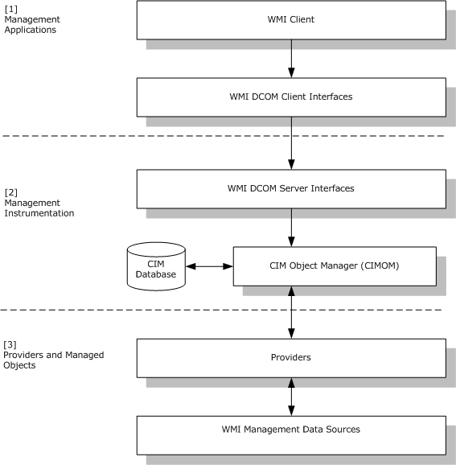
<!-- /Extracted images from page 15 -->

Figure 1: Windows Management Instrumentation Remote Protocol architecture

At layer 3, the Providers are designed to interact locally with WMI Management Data Sources.
Providers implement abstract interface as specified in section 3.1.4.17. Windows Management
Instrumentation Remote Protocol management data sources are designed to interact locally with
manageable entities. Layer 2 supports the core of the Windows Management Instrumentation
Remote Protocol service and is called the CIM Object Manager (CIMOM). CIMOM interacts with CIM
database for storing or accessing CIM class and CIM instances that are static CIM object; CIM
providers for storing or accessing CIM class and CIM instances that are dynamic from the [DMTF-
DSP0004]. WMI DCOM Client Interfaces in Layer 1 and WMI DCOM Server Interfaces in Layer 2
implement the Distributed Component Object Model interfaces (as specified in [MS-DCOM]]) that
are used by the Windows Management Instrumentation Remote Protocol to communicate over the
network between Windows Management Instrumentation Remote Protocol clients and servers. This
layer is the only layer that communicates over the network. Network communication is achieved by
using the Distributed Component Object Model (DCOM) Remote Protocol and a set of Windows
Management Instrumentation Remote Protocol DCOM interfaces, as specified in section 3.1.4.

[MS-WMI] - v20240423
Windows Management Instrumentation Remote Protocol
Copyright © 2024 Microsoft Corporation
Release: April 23, 2024

15 / 234

<!-- Extracted images from page 16 -->
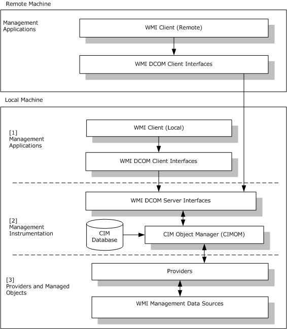
<!-- /Extracted images from page 16 -->

Figure 2: Clients can be local or remote from the server

Windows Management Instrumentation Remote Protocol clients can be local or remote from the
server, as illustrated in the preceding figure. In either case, the same set of Windows Management
Instrumentation Remote Protocol interfaces is used.

The communication works the same way between clients and server; all interactions between clients
and server are made through the DCOM Remote Protocol locally or remotely. Therefore, clients are
always acting in a message submission mode through the DCOM Remote Protocol to leverage the
Windows Management Instrumentation Remote Protocol interfaces that are implemented on the server
side.

The client can call the server in one of the following ways:

  Synchronous calls

16 / 234

[MS-WMI] - v20240423
Windows Management Instrumentation Remote Protocol
Copyright © 2024 Microsoft Corporation
Release: April 23, 2024

  Semisynchronous calls

  Asynchronous calls

The server APIs for synchronous and semisynchronous APIs are the same, but the call is executed
synchronously if the flags do not contain WBEM_FLAG_RETURN_IMMEDIATELY. If the flag
WBEM_FLAG_RETURN_IMMEDIATELY is specified, the call is executed semisynchronously. Examples of
such APIs include IWbemServices::GetObject (section 3.1.4.3.4),
IWbemServices::PutClass (section 3.1.4.3.6), and so on.

The IWbemServices methods that end with Async are asynchronous counterparts for their
synchronous APIs. Example of async APIs are IWbemServices::GetObjectAsync (section 3.1.4.3.5),
IWbemServices::PutClassAsync (section 3.1.4.3.7), and so on

The management information that is exchanged between clients and server (and server and clients) is
transmitted over the network by the Windows Management Instrumentation Remote Protocol as a
custom-marshaled payload, as specified in [MS-DCOM] section 2.2.18.6.

The Windows Management Instrumentation Remote Protocol serializes the management information
that is transmitted, as specified in [MS-WMIO]. Before reading this Windows Management
Instrumentation Remote Protocol document, acquire a working knowledge of the concepts, structures,
and communication protocols as specified in [MS-DCOM], [DMTF-DSP0004], and [MS-WMIO].
Namespace security is controlled by using security descriptors, as specified in [MS-DTYP].

### 1.4 Relationship to Other Protocols

The Windows Management Instrumentation Remote Protocol uses the DCOM Remote Protocol to
communicate over the network and to authenticate all requests issued against the infrastructure. The
DCOM Remote Protocol is actually the foundation for the Windows Management Instrumentation
Remote Protocol and is used to accomplish the following:



Establish the protocol.

  Secure the communication channel.

  Authenticate clients.



Implement reliable communication between clients and servers.

This implies that the DCOM Remote Protocol implementation provides and uses all underlying
protocols, as specified in [MS-RPCE], [MS-DCOM], and [C706].

In addition to DCOM Remote Protocol support, the Windows Management Instrumentation Remote
Protocol uses a special encoding, as specified in [MS-WMIO], to transfer information as specified in
[DMTF-DSP0004] over the network.

### 1.5 Prerequisites/Preconditions

The client that uses the protocol possesses valid credentials that are recognized by the server
accepting the client requests. The client uses security providers that recognize such credentials to
authenticate to the remote server by using the Security Support Provider Interface (SSPI), which
is supported by the Remote Procedure Call Protocol Extensions, as specified in [MS-RPCE].

The server system is started with the DCOM Remote Protocol activation service fully initialized before
the activation request. The client is configured to receive activation requests from the server if it
wants to call the service asynchronously, as specified in section 4.4.

An implementation of the DCOM Remote Protocol, as specified in [MS-DCOM], needs to be available.

[MS-WMI] - v20240423
Windows Management Instrumentation Remote Protocol
Copyright © 2024 Microsoft Corporation
Release: April 23, 2024

17 / 234

### 1.6 Applicability Statement

The Windows Management Instrumentation Remote Protocol implementation is designed for managing
components that are represented by CIM classes on remote clients and servers. This protocol is
designed to act as a transport for CIM-compatible management objects and operations on CIM
objects.

### 1.7 Versioning and Capability Negotiation

This document covers versioning issues in the following areas. The Windows Management
Instrumentation Remote Protocol does explicit negotiation as follows:







The client of this protocol uses the mechanism, as specified in [MS-DCOM] section 1.7, to discover
which interfaces are supported by the exported object and to interpret the E_NOINTERFACE result,
as specified in [MS-DCOM] section 1.7. The client then adjusts its behavior based on the
availability of the requested interface, as specified in sections 3.2.3 and 3.2.4.2.8.

The protocol uses return codes as a capability discovery mechanism; the client interprets them as
a capability negotiation, as specified in section 3.2.4.1.1.

The protocol uses return values and parameters to negotiate the locale capabilities of the server
as specified in section 3.2.3.

### 1.8 Vendor-Extensible Fields

In order to extend the CIM schema using the Windows Management Instrumentation Remote
Protocol, vendors MUST use operations as specified in section 3.1.4.3.

This protocol uses HRESULT values as specified in [MS-ERREF]. Vendors can define their own
HRESULT values, provided they set the C bit (0x20000000) for each vendor-defined value, indicating
that the value is a customer code.

### 1.9 Standards Assignments

There are no standards assignments for this protocol. This protocol uses the following class
identifiers (CLSIDs) (as specified in [MS-DCOM] section 1.9):

  CLSID_WbemLevel1Login ({8BC3F05E-D86B-11D0-A075-00C04FB68820})

  CLSID_WbemBackupRestore ({C49E32C6-BC8B-11D2-85D4-00105A1F8304})

The following GUIDs are used for the interfaces:

















IID_IWbemLevel1Login ({F309AD18-D86A-11d0-A075-00C04FB68820})

IID_IWbemLoginClientID ({d4781cd6-e5d3-44df-ad94-930efe48a887})

IID_IWbemLoginHelper ({541679AB-2E5F-11d3-B34E-00104BCC4B4A})

IID_IWbemServices ({9556DC99-828C-11CF-A37E-00AA003240C7})

IID_IWbemBackupRestore ({C49E32C7-BC8B-11d2-85D4-00105A1F8304})

IID_IWbemBackupRestoreEx ({A359DEC5-E813-4834-8A2A-BA7F1D777D76})

IID_IWbemClassObject ({DC12A681-737F-11CF-884D-00AA004B2E24})

IID_IWbemContext ({44aca674-e8fc-11d0-a07c-00c04fb68820})

[MS-WMI] - v20240423
Windows Management Instrumentation Remote Protocol
Copyright © 2024 Microsoft Corporation
Release: April 23, 2024

18 / 234

## 2 Messages

The following sections specify how Windows Management Instrumentation Remote Protocol messages
are transported and specify Windows Management Instrumentation Remote Protocol message syntax.

### 2.1 Transport

Windows Management Instrumentation Remote Protocol messages MUST be transported via the DCOM
Remote Protocol. The Windows Management Instrumentation Remote Protocol objects that are
exported by the Windows Management Instrumentation (WMI) server MUST be capable of
DCOM activation, as specified in [MS-DCOM] section 3.2.4.1.1.

The client connection MUST be secured at an authentication level that is negotiated by the DCOM
Remote Protocol infrastructure.

### 2.2 Common Data Types

#### 2.2.1 WQL Query

A client has the capability to express a query against a server. This query MUST be expressed in the
WMI Query Language (WQL). WQL is a subset of the American National Standards Institute
Structured Query Language, as specified in [FIPS127] and [MSDN-WQL]. WQL differs from the
standard SQL in that WQL retrieves from classes rather than tables, and returns CIM classes or CIM
instances rather than rows. WQL supports a specific semantic designed to query against CIM classes
or CIM instances with their related characteristics. Queries MUST be of one of the following 3 forms:

  Schema queries: Queries focused on CIM classes.

  Data queries: Queries focused on CIM instances.



Event queries: Queries focused on events triggered by state changes of CIM classes or CIM
instances. Events triggered on CIM instances can be internal to the infrastructure (intrinsic) or
external to the infrastructure (extrinsic). Events can also be timer events.

WQL uses terminologies and concepts, as specified in [DMTF-DSP0004], except as noted below, and
requires familiarity with the CIM model. The server MUST treat a backslash as an escape character in
a WQL query, except within a LIKE clause. The server MUST treat literal strings in WQL data as case-
insensitive, contrary to what [DMTF-DSP0004] specifies.

The next section specifies the complete syntax of WQL queries for schema, data, and event queries.

##### 2.2.1.1 WQL Schema and Data Query

The syntax for the WQL schema and data queries is provided in Augmented Backus-Naur Form
(ABNF).

 ; -----------------------------------
 ; WQL schema and data queries
 ; -----------------------------------

 DATA-WQL =
  ("SELECT" <PROPERTY-LIST> "FROM" <CLASS-NAME>
    <OPTIONAL-SEL-WHERE>)/
  ("SELECT" ASTERISK "FROM" <CLASS-NAME> <OPTIONAL-SEL-WHERE>)/
  ("SELECT" ASTERISK "FROM META_CLASS" <OPTIONAL-META-WHERE>)/
  ("ASSOCIATORS OF {" <OBJECT-REL-PATH> "}"
    <OPTIONAL-ASSOC-WHERE>)/

[MS-WMI] - v20240423
Windows Management Instrumentation Remote Protocol
Copyright © 2024 Microsoft Corporation
Release: April 23, 2024

19 / 234

  ("REFERENCES OF {" <OBJECT-REL-PATH> "}" <OPTIONAL-REF-WHERE>)

 PROPERTY-LIST = <PROPERTY-NAME> <PROPERTY-LIST2>
 PROPERTY-LIST2 = [COMMA <PROPERTY-LIST>]

 OPTIONAL-SEL-WHERE = ["WHERE" <EXPR>]
 OPTIONAL-META-WHERE = ["WHERE __THIS ISA" <CLASS-NAME>]
 OPTIONAL-ASSOC-WHERE =
  ["WHERE" [ "AssocClass=" <CLASS-NAME> BLANK ]
  [ "RequiredAssocQualifier=" <QUALIFIER-NAME> BLANK ]
  [ "RequiredQualifier=" <QUALIFIER-NAME> BLANK ]
  [ "ResultClass=" <CLASS-NAME> BLANK ]
  [ "ResultRole=" <PROPERTY-NAME> BLANK ]
  [ "Role=" <PROPERTY-NAME> BLANK ]
  [ "KeysOnly" BLANK ]
  [ "ClassDefsOnly" BLANK ]
                        ]
 OPTIONAL-REF-WHERE =
  ["WHERE" [ "RequiredQualifier=" <QUALIFIER-NAME> BLANK ]
  [ "ResultClass=" <CLASS-NAME> BLANK ]
  [ "Role=" <PROPERTY-NAME> BLANK ]
  [ "KeysOnly" BLANK ]
  [ "ClassDefsOnly" BLANK ]
                      ]

 OBJECT-REL-PATH =
  <CLASS-NAME> "=" <TYPED-CONSTANT> <OBJECT-REL-PATH2>
 OBJECT-REL-PATH2 =
  [COMMA <OBJECT-REL-PATH>]

 ; -----------------------------------
 ; Expression
 ; -----------------------------------

 EXPR =
  ( [OPEN-PARENTHESIS] <PROPERTY-EVALUATION>
     <EXPR2> [CLOSE-PARENTHESIS] ) /
      ( [OPEN-PARENTHESIS] "__CLASS" <EQUIVALENT-OPERATOR>
        <CLASS-NAME> <EXPR2> [CLOSE-PARENTHESIS] )

 EXPR2 = ( ["OR"  [OPEN-PARENTHESIS] <EXPR> [CLOSE-PARENTHESIS] ])/
         ( ["AND" [OPEN-PARENTHESIS] <EXPR> [CLOSE-PARENTHESIS] ])

 PROPERTY-EVALUATION =
    ( <PROPERTY-NAME> <OPERATOR> <TYPED-CONSTANT> ) /
     ( <PROPERTY-NAME> <IS-OPERATOR> "NULL" )

 OPERATOR = <EQUIVALENT-OPERATOR> /
            <COMPARE-OPERATOR>

 EQUIVALENT-OPERATOR = "=" / "!=" / "<>"

 COMPARE-OPERATOR = "<=" / ">=" / "<" / ">" / "LIKE"
 IS-OPERATOR = "IS" / "IS NOT"

 ; -----------------------------------
 ; Characters
 ; -----------------------------------

 ALPHA = %x41-5A
 DIGIT = %x30-39
 COMMA = ","
 ASTERISK = "*"
 OPEN-PARENTHESIS = "("
 CLOSE-PARENTHESIS = ")"
 BLANK = " " / "\x09"
 DOUBLEUNDERSCORE = %x5f %x5f

[MS-WMI] - v20240423
Windows Management Instrumentation Remote Protocol
Copyright © 2024 Microsoft Corporation
Release: April 23, 2024

20 / 234

 STRING-IDENTIFIER = ALPHA *(ALPHA / DIGIT / (*("_") ALPHA / DIGIT))

 CLASS-NAME = [DOUBLEUNDERSCORE] <STRING-IDENTIFIER>
 PROPERTY-NAME = [DOUBLEUNDERSCORE] <STRING-IDENTIFIER>
 QUALIFIER-NAME = <STRING-IDENTIFIER>

 TYPED-CONSTANT = INT /
                  REAL /
                  UNICODE-STRING /
                  DATETIME /
                  BOOL

 INT = "[-+]?\d+"
 REAL = "[-+]?(\d*\.\d+)|(\d+)"
 STRING = ["]([a-z][A-Z]\d)*["]
 ; DATETIME is specified in section 2.2.1 of [DMTF-DSP0004]
 BOOL = "TRUE" / "FALSE"

Schema objects and
keywords

Description

UNICODE-STRING

A string constant with Unicode characters. This string constant is surrounded by ("") or
a ('').

CLASS-NAME

Identifies the CIM class name to be queried.

PROPERTY-NAME

Identifies the name of a property of the CIM class.

QUALIFIER-NAME

In the context of a WQL query, QUALIFIER-NAME is an attribute of a PROPERTY-NAME
defining the nature of an association with another CIM class. All qualifiers, including
any custom-defined qualifier, MUST be supported within the context of a WQL query.

DATA-WQL

SELECT

A string expressing the WQL query. The WQL string uses different WQL reserved
keywords to select the type of information desired.

A keyword expressing the selection of information requested (similar to SQL SELECT).
SELECT expresses the CIM class or CIM instance to be queried. It MUST be specified
when the ASSOCIATORS OF or the REFERENCES OF keyword is not used. It MUST NOT
be used when the ASSOCIATORS OF or the REFERENCES OF keyword is used.

PROPERTY-LIST

A list of PROPERTY-NAME values. PROPERTY-NAME values in the list MUST be
separated by a comma (",").

ASTERISK

Requires all properties of a CIM class or a CIM instance.

FROM

 A keyword that MUST be specified with the SELECT statement to express the CIM
class or CIM instance the query MUST be executed against.

OPTIONAL-SEL-WHERE

The WHERE statement narrows the scope of a SELECT.

OPTIONAL-META-
WHERE

The WHERE statement narrows the scope of a SELECT. The WHERE statement followed
by the __THIS ISA statement is narrowing the scope of the WQL query to return CIM
instances according to the following rule: The only CIM instances returned are the
instances of the class CLASS-NAME and all the subclasses in CLASS-NAME's class
inheritance hierarchy.

__CLASS

A keyword referring to the CIM object, indicating the class of the current CIM object.
The __CLASS keyword in a WHERE clause only selects CIM instances of derived classes
made out of the CLASS-NAME.

21 / 234

[MS-WMI] - v20240423
Windows Management Instrumentation Remote Protocol
Copyright © 2024 Microsoft Corporation
Release: April 23, 2024

Schema objects and
keywords

Description

ASSOCIATORS OF

OPTIONAL-ASSOC-
WHERE

 A keyword that is a WQL statement to locate associated CIM classes or CIM
instances. It MUST NOT be used in combination with the SELECT keyword and the
REFERENCES OF keyword.

If the WHERE statement is specified in an ASSOCIATORS OF WQL query, it narrows the
scope to one or several characteristics of the association and associated CIM classes.
The filter expression can be made of several specific keywords and expressions to
validate these characteristics. Each expression MUST be separated by a BLANK
character, as specified in the preceding ABNF notation. Each expression MUST NOT be
used more than once in a single WQL query. The keyword supported to narrow the
scope of an ASSOCIATORS OF query are AssocClass, RequiredAssocQualifier,
RequiredQualifier, ResultClass, ResultRole, Role, KeysOnly, and ClassDefsOnly.

REFERENCES OF

A keyword that is a WQL statement to locate the CIM classes or CIM instances
associating CIM classes or CIM instances. It MUST NOT be used in combination with
the SELECT keyword and the ASSOCIATORS OF keyword.

OPTIONAL-REF-WHERE

If the WHERE statement is specified in a REFERENCES OF query, it narrows the scope
to one or several characteristics of the association and associated classes. The filter
expression can be made of several specific keywords and expressions to express these
characteristics. Each expression MUST be separated by a BLANK character. Each
expression MUST NOT be used more than once in a single WQL query. The keywords
supported to narrow the scope of a REFERENCES OF query are RequiredQualifier,
ResultClass, Role, KeysOnly, and ClassDefsOnly.

OBJECT-REL-PATH

The CIM relative path of the CIM class or CIM instance to be queried. It MUST be
specified for ASSOCIATORS OF and REFERENCES OF queries.

KeysOnly

ClassDefsOnly

AssocClass

RequiredAssocQualifier

If the KeysOnly keyword is being used in ASSOCIATORS OF and REFERENCES OF
queries, only the key properties of resulting CIM instances MUST be populated.

If the ClassDefsOnly keyword is being used in ASSOCIATORS OF and REFERENCES OF
queries only the CIM class definitions of resulting CIM instances MUST be returned.

If the AssocClass keyword is being used in ASSOCIATORS OF queries, the resulting
CIM instances MUST be associated with association class or CIM instances made out of
the CLASS-NAME specified.

If the RequiredAssocQualifier keyword is being used in ASSOCIATORS OF queries, the
returned CIM instances is associated with the source object through an association
class that included the specified qualifier. For example, in the following query:
ASSOCIATORS OF {Win32_LogicalDisk.DeviceID="C:"} WHERE
RequiredAssocQualifier = Association

the returned CIM instances is associated with the source object represented by
{Win32_LogicalDisk.DeviceID="C:"} through an association class that includes the
qualifier "association".

RequiredQualifier

If the RequiredQualifier keyword is being used in ASSOCIATORS OF and REFERENCES
OF queries, the resulting CIM instances MUST have the CIM qualifier of the given name
set.

ResultClass

Role

ResultRole

If the ResultClass keyword is being used in ASSOCIATORS OF and REFERENCES OF
queries, the resulting CIM instances MUST belong to or be derived from the class
specified by CLASS-NAME.

If the Role keyword is being used in ASSOCIATORS OF and REFERENCES OF queries,
the result MUST only return CIM instances where the role matches the reference CIM
property name of the association class.

If the ResultRole keyword is being used in ASSOCIATORS OF queries, the result MUST
only return CIM instances where the role matches the reference CIM property name of

22 / 234

[MS-WMI] - v20240423
Windows Management Instrumentation Remote Protocol
Copyright © 2024 Microsoft Corporation
Release: April 23, 2024

Schema objects and
keywords

Description

the CIM instances.

Operator  Description

=

Test the equivalence of two values.

!=

Test the negated equivalence of two values.

Applicable
Type

string, numeric,
reference,
datetime

string, numeric,
reference,
datetime

string, numeric,
datetime

string, numeric,
datetime

>

<

>=

<=

LIKE

Test whether the value of the property is greater than that of the typed-constant.

Test whether the value of the property is less than that of the typed-constant.

Test whether the value of the property is greater than or equal to that of the
typed-constant.

string, numeric,
datetime

Test whether the value of the property is less than or equal to that of the typed-
constant.

string, numeric,
datetime

Test whether a given character string of the property value matches a specified
pattern of the typed-constant. The specified pattern can contain exactly the
characters to match, or it can contain meta characters. The table below lists the
meta characters. If used with a non-string property, the behavior is the same as
the '=' operator, and it tests the equivalence of two values. The use of meta
characters mentioned below with a non-string property results in the error
WBEM_E_INVALID_QUERY.

string

IS

Test whether the value of the property is null.

IS NOT

Test whether the value of property is not null.

string, numeric,
reference,
datetime, object

string, numeric,
reference,
datetime, object

If typed-constant is string, the operator MUST perform a case-insensitive lexicographic relation test.
If the operator is not applicable to the property type, the server MUST return
WBEM_E_INVALID_QUERY.

The following characters have special meaning within a LIKE clause:

Character  Description

[

Any one character within a range specified as a sequence of one or more of the following formats,
terminated by a "]":



A non-caret followed by "-" or "=" followed by any character except the terminating "]" matches
any character in a sequential range of characters.  For instance, "[a-f]" or "[a=f]" matches any
character from "a" through "f".



A non-caret followed by "-" or "=" followed by the terminating "]" matches the two literal

[MS-WMI] - v20240423
Windows Management Instrumentation Remote Protocol
Copyright © 2024 Microsoft Corporation
Release: April 23, 2024

23 / 234

Character  Description

characters inside the brackets: the non-caret and the "-" or "=".

A caret followed by any character except the terminating "]" matches any character except
those in the sequence(s) following the caret, up to the terminating "]". For example, "[^ad-f]"
matches anything except an "a", "d", "e", or "f".

A caret followed by a closing bracket matches the caret itself: "[^]".

Any other character matches the literal character itself.







Note that "%", "_", and "[" serve as literals within a bracketed sequence.

%

_

Any string of 0 (zero) or more characters. The following example finds all instances where "Win" is
found anywhere in the class name: SELECT * FROM meta_class WHERE __Class LIKE "%Win%"

Any one character. Any literal underscore used in the query string MUST be escaped by placing it
inside [] (square brackets).

##### 2.2.1.2 WQL Event Query

The following example shows the syntax for WQL event queries in ABNF notation.

 ; -----------------------------------
 ; WQL event queries
 ; -----------------------------------

 EVENT-WQL = "SELECT" <PROPERTY-LIST> "FROM" /
               <EVENT-CLASS-NAME> <OPTIONAL-WITHIN> <EVENT-WHERE>

 OPTIONAL-WITHIN = ["WITHIN" <INTERVAL>]
 INTERVAL = 1*MODULOREAL
 EVENT-WHERE = ["WHERE" <EVENT-EXPR>]

 EVENT-EXPR = ( (<INSTANCE-STATE> "ISA" <CLASS-NAME> <EXPR2>) /
               <EXPR> )
               ["GROUP WITHIN" <INTERVAL>
                     ( ["BY" [<INSTANCE-STATE> DOT] <PROPERTY-NAME>]
                       ["HAVING" <EXPR>] )]
 INSTANCE-STATE = "TARGETINSTANCE" / "PREVIOUSINSTANCE"

 ; -----------------------------------
 ; Expression
 ; -----------------------------------

 EXPR =
  [OPEN-PARENTHESIS] <PROPERTY-EVALUATION> /
   <EXPR2> [CLOSE-PARENTHESIS]
 EXPR2 = ( ["OR"  [OPEN-PARENTHESIS] <EXPR> /
    [CLOSE-PARENTHESIS] ] ) /
         ( ["AND" [OPEN-PARENTHESIS] <EXPR> /
    [CLOSE-PARENTHESIS] ] )

 PROPERTY-EVALUATION =
  ( <PROPERTY-NAME> <OPERATOR> <TYPED-CONSTANT> ) /
   ( <PROPERTY-NAME> <IS-OPERATOR> "NULL" )

 OPERATOR = <EQUIVALENT-OPERATOR> /
            <COMPARE-OPERATOR>

[MS-WMI] - v20240423
Windows Management Instrumentation Remote Protocol
Copyright © 2024 Microsoft Corporation
Release: April 23, 2024

24 / 234

 EQUIVALENT-OPERATOR = "=" / "!=" / "<>"
 COMPARE-OPERATOR = "<=" / ">=" / "<" / ">" / "LIKE"
 IS-OPERATOR = "IS" / "IS NOT"

 ; -----------------------------------
 ; Characters
 ; -----------------------------------

 ALPHA = %x41-5A
 DIGIT = %x30-39
 DOT = ","
 COMMA = "."
 ASTERISK = "*"
 OPEN-PARENTHESIS = "("
 CLOSE-PARENTHESIS = ")"
 STRING-IDENTIFIER = ALPHA *(ALPHA / DIGIT / (*("_") ALPHA / DIGIT))
 DOUBLEUNDERSCORE = "__"

 CLASS-NAME = [DOUBLEUNDERSCORE] <STRING-IDENTIFIER>
 EVENT-CLASS-NAME = [DOUBLEUNDERSCORE] <STRING-IDENTIFIER>
 PROPERTY-NAME = [DOUBLEUNDERSCORE] <STRING-IDENTIFIER>

 TYPED-CONSTANT = INT /
                  REAL /
                  STRING /
                  DATETIME /
                  BOOL

 INT = "[-+]?\d*"
 REAL = "[-+]?\d*(\.\d+)?"
 MODULOREAL = "[+]?\d*(\.\d+)?"
 STRING = ["]([a-z][A-Z]\d)*["]
 ; DATETIME is specified in section 2.2.1 of [DMTF-DSP0004]
 BOOL = "TRUE" / "FALSE"

Objects and
keywords

Description

CLASS-NAME

Identifies a CIM class name to be queried for events.

PROPERTY-
NAME

EVENT-WQL

SELECT

Identifies the name of a CIM property of a CIM class.

A string expressing the WQL event query. The WQL string uses different WQL reserved keywords
to select the type of information wanted.

A keyword expressing the selection of information requested (similar to SQL SELECT). SELECT
expresses the CIM class or CIM instance to be queried. It MUST be specified in a WQL event
query.

PROPERTY-
LIST

A list of PROPERTY-NAME values. PROPERTY-NAME values in the list MUST be separated by a
comma (",").

ASTERISK

Requires all properties of a CIM class or a CIM instance.

FROM

A keyword that MUST be specified with the SELECT statement to express the CIM class or CIM
instance that the query MUST be run against.

EVENT-
CLASS-NAME

MUST be specified and MUST be an intrinsic, an extrinsic, or a timer event class. An intrinsic
event class is a class derived from __InstanceOperationEvent, __ClassOperationEvent, or
__NamespaceOperationEvent, representing possible intrinsic events. An extrinsic event class is
a class derived from __ExtrinsicEvent, representing possible extrinsic events. A timer event class

25 / 234

[MS-WMI] - v20240423
Windows Management Instrumentation Remote Protocol
Copyright © 2024 Microsoft Corporation
Release: April 23, 2024

Objects and
keywords

Description

is a class derived from __TimerEvent event class, representing possible timer events.

WITHIN

A keyword indicating the server to poll the system for an event. In case of an intrinsic EVENT-
CLASS-NAME, the WITHIN keyword MUST be specified. The WITHIN keyword is optional for
extrinsic EVENT-CLASS-NAME. If the WITHIN keyword is specified, the INTERVAL MUST be
specified.

INTERVAL

INTERVAL specifies the polling interval. It MUST be expressed in seconds. If "WITHIN" is
specified, the INTERVAL MUST be specified.

EVENT-
WHERE

INSTANCE-
STATE

ISA

GROUP
WITHIN

HAVING

BY

The WHERE statement narrows the scope of a SELECT event query if the EVENT-CLASS-NAME is
an extrinsic or timer event CIM class. The WHERE statement MUST be specified to narrow the
scope of a SELECT event query if the EVENT-CLASS-NAME is an intrinsic CIM class.

Indicates the type of instance to be evaluated. INSTANCE-STATE MUST be specified if CLASS-
NAME is an intrinsic CIM class. INSTANCE-STATE is optional if CLASS-NAME is an extrinsic CIM
class. If specified, INSTANCE-STATE MUST be PREVIOUSINSTANCE (to indicate that the state of
the CIM class or CIM instance before the event MUST be evaluated) or TARGETINSTANCE (to
indicate that the state of the CIM class or CIM instance after the event MUST be evaluated).

A keyword that MUST be used in combination with the INSTANCE-STATE keyword. It is used as a
comparative operator between the INSTANCE-STATE and a CLASS-NAME to reduce the scope of
events returned to the CIM instances made out of the CLASS-NAME.

If the GROUP WITHIN keyword is used, the INTERVAL MUST be specified. This keyword indicates
that all events occurring during the WITHIN INTERVAL period MUST be grouped as one event.

If the HAVING keyword is specified, it MUST be followed by EXPR to filter the selection of events.
This keyword indicates that all events grouped during the GROUP WITHIN period MUST meet the
expression specified in EXPR before being returned as one event.

A keyword that groups event instances sharing a same value on a specified PROPERTY-NAME. In
such a case, events are returned that represent a group of events sharing the same PROPERTY-
NAME value. The system MUST return as many events representing a group of events as there
are PROPERTY-NAME values.

EVENT-EXPR

 An expression for filtering WMI events.

#### 2.2.2 CIM Path and Namespace

The syntax for CIM path and namespace is provided in ABNF notation.

 ; -----------------------------------
 ; CIM PATH
 ; -----------------------------------

 CIMPATH = ( <NAMESPACE-PATH> COLON <OBJECT-PATH> ) /
   <OBJECT-PATH>
    NAMESPACE-PATH = [<MACHINE-PATH>] NAMESPACE
    MACHINE-PATH = BACKSLASH BACKSLASH <MACHINENAME> BACKSLASH
    OBJECT-PATH = <CLASS-NAME> [<INSTANCE-KEY>]
    INSTANCE-KEY = (EQUAL "@") / DOT <KEY-VALUE-LIST>
    KEY-VALUE-LIST = <PROPERTY-NAME> EQUAL
      <TYPED-CONSTANT> <KEY-VALUE-LIST2>
    KEY-VALUE-LIST2 = [ COMMA KEY-VALUE-LIST ]

 CLASS-NAME = [__]<STRING-IDENTIFIER>

[MS-WMI] - v20240423
Windows Management Instrumentation Remote Protocol
Copyright © 2024 Microsoft Corporation
Release: April 23, 2024

26 / 234

 PROPERTY-NAME = [__]<STRING-IDENTIFIER>

 ; -----------------------------------
 ; NAMESPACE
 ; -----------------------------------

 NAMESPACE = <STRING-IDENTIFIER> <SUB-NAMESPACE>
 <SUB-NAMESPACE> = [ BACKSLASH <NAMESPACE> ]

 TYPED-CONSTANT = INT /
                  REAL /
                  STRING /
                  DATETIME /
                  BOOL

 INT = "[-+]?\d*"
 REAL = "[-+]?\d*(\.\d+)?"
 STRING = ["]([a-z][A-Z]\d)*["]
 DATETIME =
 "(\d\d\d\d)(0\d|1[012])(0\d|[12][0-9]|3[01])([0-1]\d|2[0-3])([0-5]\d)([0-
5]\d)[.]\d\d\d\d\d\d[+-]([0-6][02468][0]|7[0-2][0])"

 BOOL = "TRUE" / "FALSE"

 ; -----------------------------------
 ; Characters
 ; -----------------------------------

 ALPHA = %x41-5A
 DIGIT = %x30-39
 BACKSLASH = "\"
 DOT = "."
 STRING-IDENTIFIER = ALPHA *(ALPHA / DIGIT / (*("_") ALPHA / DIGIT))
 COLON=":"
 MACHINENAME = <STRING-IDENTIFIER> / DOT

Objects and
keywords

Description

OBJECT-PATH

The path of the CIM class or CIM instance to be referenced.

MACHINENAME

The network-identifiable name of the machine where the referenced WMI class, instance,
or namespace resides.

CLASS-NAME

Identifies a CIM class name.

INSTANCE-KEY

Uniquely identifies the instance of a given CIM class.

KEY-VALUE-LIST

List of property names and their values, separated by a ",". Each property value pair is
represented in propertyName=value format.

PROPERTY-NAME

Identifies the name of a property of the CIM class.

#### 2.2.3 Protocol Return Codes

Codes that are returned by the protocol are represented as an HRESULT, as specified in [MS-ERREF]
section 2.1.

The HRESULT values that are documented in the following table are interpreted by the protocol
through a specific set of interface methods, as specified in sections 3.1.4.3, 3.1.4.4.2, and 3.2.4.1.1.

27 / 234

[MS-WMI] - v20240423
Windows Management Instrumentation Remote Protocol
Copyright © 2024 Microsoft Corporation
Release: April 23, 2024

The severity bit of HRESULT MUST be interpreted as specified in [MS-ERREF] section 2.1. HRESULT
errors are not recoverable by the protocol. HRESULT successes, other than the ones specified in the
following table, MUST be considered as equal to WBEM_S_NO_ERROR.

Constant/value

Description

WBEM_S_NO_ERROR

The operation was successful.

0x00000000

WBEM_S_FALSE

0x00000001

Either no more CIM objects are available, the number of returned CIM objects is less
than the number requested, or this is the end of an enumeration.

WBEM_S_TIMEDOUT

A call timed out. This is not an error condition.

0x00040004

WBEM_S_NEW_STYLE

0x000400FF

The operation was successful and indicates that the receiver of the call is able to receive
optimized IWbemObjectSink::Indicate calls.

#### 2.2.4 IWbemClassObject Interface

The signatures of many methods that are related to the Windows Management Instrumentation
Remote Protocol include a parameter to specify an IWbemClassObject interface pointer. This
parameter MUST be custom marshaled by the DCOM Remote Protocol, as specified in the following
table. The IWbemClassObject interface represents a WMI object, such as a WMI class or an object
instance. All CIM objects (CIM classes and CIM instances) that are passed during WMI calls
between the client and server are objects of this interface.

Parameter/source

Value/description

Interface UUID

{DC12A681-737F-11CF-884D-00AA004B2E24}

Marshaling buffer
layout

The buffer representing a CIM object MUST be encoded using the EncodingUnit object
block, as specified in [MS-WMIO] section 2.2.1.

Unmarshaler CLSID

{4590F812-1D3A-11D0-891F-00AA004B2E24}

This CLSID MUST represent the unmarshaler CLSID that is supplied by WMI to DCOM
and MUST be sent over the network by DCOM when custom marshaling is implemented.
For more information (OBJREF_CUSTOM), see the [MS-DCOM].

##### 2.2.4.1 Prototype Result Object

The prototype result object is an IWbemClassObject (section 2.2.4) that is returned when the lFlags
parameter of the IWbemServices::ExecQuery (section 3.1.4.3.18) or
IWbemServices::ExecQueryAsync (section 3.1.4.3.19) method includes the WBEM_FLAG_PROTOTYPE
flag.

The query returns the CIM class object that is specified in the CLASS-NAME of the query that is
modified to match the query.

If the query specifies PROPERTY-LIST, as specified in section 2.2.1.1, the class object is modified to
represent the results of the query by removing all the properties that are not specified in the
PROPERTY-LIST of the query and by adding selected properties with the Order qualifier (see the
2nd paragraph following concerning the Order qualifier). In this case, the CIM class is encoded as an
IWbemClassObject object, with an ObjectFlags block that contains a 0x10 value that is set as specified

28 / 234

[MS-WMI] - v20240423
Windows Management Instrumentation Remote Protocol
Copyright © 2024 Microsoft Corporation
Release: April 23, 2024

in [MS-WMIO] section 2.2.6. If any key property is removed because it is not specified in PROPERTY-
LIST, the 0x40 flag is set on ObjectFlags.

If the query specifies ASTERISK, as specified in section 2.2.1.1, the class object is returned with all
the properties added to the Order qualifier. In this case, the CIM class is encoded as an
IWbemClassObject object and the 0x10 flag is not set in ObjectFlags.

The Order qualifier (QUALIFIER-NAME attribute set to Order, see section 2.2.1.1) is an array of 32-
bit signed integers. Each value in the array represents the position of the property in PROPERTY-
LIST (if PROPERTY-LIST is specified) or represents the order in which the property appears in the
class (if the query specifies ASTERISK). The position is encoded starting from 0.

For example,

 select prop1,prop2,prop1 from class1

results in class1 containing only two properties, prop1 and prop2. The prop1 property is added to an
Order qualifier that has a value of {0,2}, and the prop2 property is added to an Order qualifier that
has a value of {1}.

Note  The prop1 property occurs twice in the PROPERTY-LIST, at positions 1 and 3, and therefore,
has two values {0,2}.

If the query specifies a PROPERTY-LIST that does not contain at least one of the following
properties, the DerivationList in ClassPart of the CurrentClass, as specified in [MS-WMIO] section
2.2.17, is encoded as empty:

  __DERIVATION

  __SUPERCLASS

  __DYNASTY

Otherwise, the DerivationList in ClassPart of the CurrentClass is encoded in the same way as the
actual CIM class that represents the CLASS-NAME of the query.

The PropertyLookupTable, NdTable, ValueTable, and ClassHeap in ClassPart of the CurrentClass (as
specified in [MS-WMIO] section 2.2.15) are encoded to contain only the selected properties in the
query.

Remaining items are encoded in the same way as the CIM class that represents the CLASS-NAME
that is specified in the query.

##### 2.2.4.2 Extrinsic Events

Extrinsic events are events generated by a component outside the implementation. In WMI, extrinsic
events are represented as instances of a class that is derived from the __ExtrinsicEvent class. If any
component wants to generate an event, the component defines a class that is derived from the
__ExtrinsicEvent class. Instances of the derived class defined by the component, represented by using
IWbemClassObject (section 2.2.4), are used to send events.

__ExtrinsicEvent class is defined by WMI as shown in the following MOF text.

 [abstract]
 class __SystemClass
 {
 };

[MS-WMI] - v20240423
Windows Management Instrumentation Remote Protocol
Copyright © 2024 Microsoft Corporation
Release: April 23, 2024

29 / 234

 [abstract]
 class __IndicationRelated : __SystemClass
 {
 };

  [abstract: DisableOverride ToInstance ToSubClass]
 class __Event : __IndicationRelated
 {
     uint64 TIME_CREATED;
     uint8 SECURITY_DESCRIPTOR[];
 };

 class __ExtrinsicEvent : __Event
 {
 };

Where TIME_CREATED is the time at which the event is generated, represented as a 64-bit value that
represents the number of 100-nanosecond intervals since January 1, 1601 (UTC), and
SECURITY_DESCRIPTOR is a security descriptor, as defined in [MS-DTYP], represented as an array of
bytes. The security descriptor MUST specify security for events as specified in section 5.2.

#### 2.2.5 WBEM_CHANGE_FLAG_TYPE Enumeration

The WBEM_CHANGE_FLAG_TYPE enumeration is used to indicate and update the type of the flag.

 typedef [v1_enum] enum tag_WBEM_CHANGE_FLAG_TYPE
 {
   WBEM_FLAG_CREATE_OR_UPDATE = 0x00,
   WBEM_FLAG_UPDATE_ONLY = 0x01,
   WBEM_FLAG_CREATE_ONLY = 0x02,
   WBEM_FLAG_UPDATE_SAFE_MODE = 0x20,
   WBEM_FLAG_UPDATE_FORCE_MODE = 0x40
 } WBEM_CHANGE_FLAG_TYPE;

WBEM_FLAG_CREATE_OR_UPDATE:  This flag causes the put operation to update the class or

instance if it does not exist, or to overwrite the class or instance if it exists already.

WBEM_FLAG_UPDATE_ONLY:  This flag causes the put operation to update the class or instance.

The class or instance MUST exist for the call to be successful.

WBEM_FLAG_CREATE_ONLY:  This flag causes the put operation to create the class or instance. For

the call to be successful, the class or instance MUST NOT exist.

WBEM_FLAG_UPDATE_SAFE_MODE:  This flag allows updates of classes even if there are child

classes, as long as the change does not cause any conflicts with child classes. An example of an
update that this flag allows is the adding of a new property to the base class that was not
previously mentioned in any of the child classes. If the class has instances, the update fails.

WBEM_FLAG_UPDATE_FORCE_MODE:  This flag forces updates of classes when conflicting child

classes exist. An example of an update that this flag forces is when a class qualifier is defined in a
child class and the base class tries to add the same qualifier that conflicted with the existing one.
In force mode, this conflict is resolved by deleting the conflicting qualifier in the child class.

#### 2.2.6 WBEM_GENERIC_FLAG_TYPE Enumeration

The WBEM_GENERIC_FLAG_TYPE enumeration is used to indicate and update the type of the flag.

[MS-WMI] - v20240423
Windows Management Instrumentation Remote Protocol
Copyright © 2024 Microsoft Corporation
Release: April 23, 2024

30 / 234

 typedef [v1_enum] enum tag_WBEM_GENERIC_FLAG_TYPE
 {
   WBEM_FLAG_RETURN_WBEM_COMPLETE = 0x0,
   WBEM_FLAG_RETURN_IMMEDIATELY = 0x10,
   WBEM_FLAG_FORWARD_ONLY = 0x20,
   WBEM_FLAG_NO_ERROR_OBJECT = 0x40,
   WBEM_FLAG_SEND_STATUS = 0x80,
   WBEM_FLAG_ENSURE_LOCATABLE = 0x100,
   WBEM_FLAG_DIRECT_READ = 0x200,
   WBEM_MASK_RESERVED_FLAGS = 0x1F000,
   WBEM_FLAG_USE_AMENDED_QUALIFIERS = 0x20000,
   WBEM_FLAG_STRONG_VALIDATION = 0x100000
 } WBEM_GENERIC_FLAG_TYPE;

WBEM_FLAG_RETURN_WBEM_COMPLETE:  This flag makes the operation synchronous. This is the

default behavior and so this flag need not be explicitly specified.

WBEM_FLAG_RETURN_IMMEDIATELY:  This flag causes the call to return without waiting for the

operation to complete. The call result parameter contains the IWbemCallResult object by using the
status of the operation that can be retrieved.

WBEM_FLAG_FORWARD_ONLY:  This flag causes a forward-only enumerator,

IEnumWbemClassObject, (section 3.1.4.4), to be returned. Forward-only enumerators are
typically much faster and use less memory than conventional enumerators; however, they do not
allow calls to IEnumWbemClassObject::Clone or IEnumWbemClassObject::Reset.

WBEM_FLAG_NO_ERROR_OBJECT:  This flag MUST NOT be set, and MUST be ignored on receipt.

WBEM_FLAG_SEND_STATUS:  This flag registers a request with WMI to receive intermediate status
reports through the client implementation of IWbemObjectSink::SetStatus, if supported by the
server implementation.

WBEM_FLAG_ENSURE_LOCATABLE:  This flag ensures that any returned objects have enough

information in them so that system properties, such as __PATH, __RELPATH, and __SERVER,<1>
are non-NULL.

WBEM_FLAG_DIRECT_READ:  This flag causes direct access to the specified class without regard to

its parent class or subclasses.

WBEM_MASK_RESERVED_FLAGS:  This flag MUST NOT be set, and MUST be ignored on receipt.

WBEM_FLAG_USE_AMENDED_QUALIFIERS:  If this flag is set, the server retrieves any qualifiers
in the CIM object that can be localized in the current connection's locale. The set of localized
qualifiers and the list of locales for which the qualifier is localized are implementation dependent.
When the localized information is available, the server retrieves the localized values using the
client-preferred locale. If the localized values are not available, the server returns values using the
default locale.

The localized qualifiers or amended qualifiers are identified by the qualifier flavor as defined in
[MS-WMIO] section 2.2.62.

If this flag is not set, the server does not retrieve any localized qualifiers for the CIM object.

WBEM_FLAG_STRONG_VALIDATION:  This flag MUST NOT be set, and MUST be ignored on

receipt.

#### 2.2.7 WBEM_STATUS_TYPE Enumeration

The WBEM_STATUS_TYPE enumeration gives information about the status of the operation.

[MS-WMI] - v20240423
Windows Management Instrumentation Remote Protocol
Copyright © 2024 Microsoft Corporation
Release: April 23, 2024

31 / 234

 typedef enum tag_WBEM_STATUS_TYPE
 {
   WBEM_STATUS_COMPLETE = 0,
   WBEM_STATUS_REQUIREMENTS = 0x01,
   WBEM_STATUS_PROGRESS = 2
 } WBEM_STATUS_TYPE;

WBEM_STATUS_COMPLETE:  When the WMI operation is completed, WMI calls

IWbemObjectSink::SetStatus with WBEM_STATUS_COMPLETE.

WBEM_STATUS_REQUIREMENTS:  This flag MUST NOT be set, and MUST be ignored on receipt.

WBEM_STATUS_PROGRESS:  WMI reports the progress of the operation to
IWbemObjectSink::SetStatus with flag WBEM_STATUS_PROGRESS.

#### 2.2.8 WBEM_TIMEOUT_TYPE Enumeration

The WBEM_TIMEOUT_TYPE enumeration gives information about the type of time-out for the process.

 typedef [v1_enum] enum tag_WBEM_TIMEOUT_TYPE
 {
   WBEM_NO_WAIT = 0,
   WBEM_INFINITE = 0xFFFFFFFF
 } WBEM_TIMEOUT_TYPE;

WBEM_NO_WAIT:  If passed as a time-out parameter to the IEnumWbemClassObject::Next method,
the call returns the available objects, if any, at the time of the call; it does not wait for any more
objects.

WBEM_INFINITE:  If passed as a time-out parameter to IEnumWbemClassObject::Next, the call

blocks until objects are available.

#### 2.2.9 WBEM_QUERY_FLAG_TYPE Enumeration

The WBEM_QUERY_FLAG_TYPE enumeration gives information about the type of the flag.

 typedef [v1_enum] enum tag_WBEM_QUERY_FLAG_TYPE
 {
   WBEM_FLAG_DEEP = 0,
   WBEM_FLAG_SHALLOW = 1,
   WBEM_FLAG_PROTOTYPE = 2
 } WBEM_QUERY_FLAG_TYPE;

WBEM_FLAG_DEEP:  If used in IWbemServices::CreateClassEnum or

IWbemServices::CreateClassEnumAsync, the WBEM_FLAG_DEEP constant causes the enumeration
to return all the subclasses in the hierarchy of a specified class but to not return the class itself.

If used in IWbemServices::CreateInstanceEnum or IWbemServices::CreateInstanceEnumAsync,
this constant causes the enumeration to return the instances of this class and also the instances of
subclasses in the hierarchy of the class.

WBEM_FLAG_SHALLOW:  If used in IWbemServices::CreateClassEnum or

IWbemServices::CreateClassEnumAsync, the WBEM_FLAG_SHALLOW constant causes the
enumeration to return the immediate subclasses of a specified class.

[MS-WMI] - v20240423
Windows Management Instrumentation Remote Protocol
Copyright © 2024 Microsoft Corporation
Release: April 23, 2024

32 / 234

If used in IWbemServices::CreateInstanceEnum or IWbemServices::CreateInstanceEnumAsync,
this constant causes the enumeration to return only the instances of this class and excludes all
instances of subclasses.

WBEM_FLAG_PROTOTYPE:  This flag is used for prototyping. It does not run the query; instead, it

returns the Prototype Result Object as specified in section 2.2.4.1.

#### 2.2.10 WBEM_BACKUP_RESTORE_FLAGS Enumeration

The WBEM_BACKUP_RESTORE_FLAGS enumeration gives information about the backup and restore
state of the process.

 typedef [v1_enum] enum tag_WBEM_BACKUP_RESTORE_FLAGS
 {
   WBEM_FLAG_BACKUP_RESTORE_FORCE_SHUTDOWN = 1
 } WBEM_BACKUP_RESTORE_FLAGS;

WBEM_FLAG_BACKUP_RESTORE_FORCE_SHUTDOWN:  While the CIM database is being

restored, any clients connected to WMI are forcibly disconnected.

#### 2.2.11 WBEMSTATUS Enumeration

The WBEMSTATUS enumeration gives information about the status of an operation. If the server
encounters an error condition for which this protocol does not explicitly state an error value, the
server can return any HRESULT to indicate failure by setting the Severity (S bit) of the HRESULT, as
defined in [MS-ERREF] section 2.1.

The statuses of operations that are not explicitly called out in this document but are part of the
associated IDL are deemed to be local-only and are implementation-specific.

 typedef [v1_enum] enum tag_WBEMSTATUS
 {
   WBEM_S_NO_ERROR = 0x00,
   WBEM_S_FALSE = 0x01,
   WBEM_S_TIMEDOUT = 0x40004,
   WBEM_S_NEW_STYLE = 0x400FF,
   WBEM_S_PARTIAL_RESULTS = 0x40010,
   WBEM_E_FAILED = 0x80041001,
   WBEM_E_NOT_FOUND = 0x80041002,
   WBEM_E_ACCESS_DENIED = 0x80041003,
   WBEM_E_PROVIDER_FAILURE = 0x80041004,
   WBEM_E_TYPE_MISMATCH = 0x80041005,
   WBEM_E_OUT_OF_MEMORY = 0x80041006,
   WBEM_E_INVALID_CONTEXT = 0x80041007,
   WBEM_E_INVALID_PARAMETER = 0x80041008,
   WBEM_E_NOT_AVAILABLE = 0x80041009,
   WBEM_E_CRITICAL_ERROR = 0x8004100a,
   WBEM_E_NOT_SUPPORTED = 0x8004100C,
   WBEM_E_PROVIDER_NOT_FOUND = 0x80041011,
   WBEM_E_INVALID_PROVIDER_REGISTRATION = 0x80041012,
   WBEM_E_PROVIDER_LOAD_FAILURE = 0x80041013,
   WBEM_E_INITIALIZATION_FAILURE = 0x80041014,
   WBEM_E_TRANSPORT_FAILURE = 0x80041015,
   WBEM_E_INVALID_OPERATION = 0x80041016,
   WBEM_E_ALREADY_EXISTS = 0x80041019,
   WBEM_E_UNEXPECTED = 0x8004101d,
   WBEM_E_INCOMPLETE_CLASS = 0x80041020,
   WBEM_E_SHUTTING_DOWN = 0x80041033,
   E_NOTIMPL = 0x80004001,
   WBEM_E_INVALID_SUPERCLASS = 0x8004100D,
   WBEM_E_INVALID_NAMESPACE = 0x8004100E,
   WBEM_E_INVALID_OBJECT = 0x8004100F,

[MS-WMI] - v20240423
Windows Management Instrumentation Remote Protocol
Copyright © 2024 Microsoft Corporation
Release: April 23, 2024

33 / 234

   WBEM_E_INVALID_CLASS = 0x80041010,
   WBEM_E_INVALID_QUERY = 0x80041017,
   WBEM_E_INVALID_QUERY_TYPE = 0x80041018,
   WBEM_E_PROVIDER_NOT_CAPABLE = 0x80041024,
   WBEM_E_CLASS_HAS_CHILDREN = 0x80041025,
   WBEM_E_CLASS_HAS_INSTANCES = 0x80041026,
   WBEM_E_ILLEGAL_NULL = 0x80041028,
   WBEM_E_INVALID_CIM_TYPE = 0x8004102D,
   WBEM_E_INVALID_METHOD = 0x8004102E,
   WBEM_E_INVALID_METHOD_PARAMETERS = 0x8004102F,
   WBEM_E_INVALID_PROPERTY = 0x80041031,
   WBEM_E_CALL_CANCELLED = 0x80041032,
   WBEM_E_INVALID_OBJECT_PATH = 0x8004103A,
   WBEM_E_OUT_OF_DISK_SPACE = 0x8004103B,
   WBEM_E_UNSUPPORTED_PUT_EXTENSION = 0x8004103D,
   WBEM_E_QUOTA_VIOLATION = 0x8004106c,
   WBEM_E_SERVER_TOO_BUSY = 0x80041045,
   WBEM_E_METHOD_NOT_IMPLEMENTED = 0x80041055,
   WBEM_E_METHOD_DISABLED = 0x80041056,
   WBEM_E_UNPARSABLE_QUERY = 0x80041058,
   WBEM_E_NOT_EVENT_CLASS = 0x80041059,
   WBEM_E_MISSING_GROUP_WITHIN = 0x8004105A,
   WBEM_E_MISSING_AGGREGATION_LIST = 0x8004105B,
   WBEM_E_PROPERTY_NOT_AN_OBJECT = 0x8004105c,
   WBEM_E_AGGREGATING_BY_OBJECT = 0x8004105d,
   WBEM_E_BACKUP_RESTORE_WINMGMT_RUNNING = 0x80041060,
   WBEM_E_QUEUE_OVERFLOW = 0x80041061,
   WBEM_E_PRIVILEGE_NOT_HELD = 0x80041062,
   WBEM_E_INVALID_OPERATOR = 0x80041063,
   WBEM_E_CANNOT_BE_ABSTRACT = 0x80041065,
   WBEM_E_AMENDED_OBJECT = 0x80041066,
   WBEM_E_VETO_PUT = 0x8004107A,
   WBEM_E_PROVIDER_SUSPENDED = 0x80041081,
   WBEM_E_ENCRYPTED_CONNECTION_REQUIRED = 0x80041087,
   WBEM_E_PROVIDER_TIMED_OUT = 0x80041088,
   WBEM_E_NO_KEY = 0x80041089,
   WBEM_E_PROVIDER_DISABLED = 0x8004108a,
   WBEM_E_REGISTRATION_TOO_BROAD = 0x80042001,
   WBEM_E_REGISTRATION_TOO_PRECISE = 0x80042002
 } WBEMSTATUS;

WBEM_S_NO_ERROR:  The operation completed successfully.

WBEM_S_FALSE:  Either no more CIM objects are available, the number of returned CIM objects is
less than the number requested, or this is the end of an enumeration. This error code is returned
from the IEnumWbemClassObject and IWbemWCOSmartEnum interface methods.

WBEM_S_TIMEDOUT:  The attempt to establish the connection has expired.

WBEM_S_NEW_STYLE:  The server supports ObjectArray encoding; see section 3.1.4.2.1 for details.

WBEM_S_PARTIAL_RESULTS:  The server could not return all the objects and/or properties

requested.

WBEM_E_FAILED:  The server has encountered an unknown error while processing the client's

request.

WBEM_E_NOT_FOUND:  The object specified in the path does not exist.

WBEM_E_ACCESS_DENIED:  The permission required to perform the operation is not helped by the

security principal performing the operation.

WBEM_E_PROVIDER_FAILURE:  The server has encountered an unknown error while processing

the client's request.

34 / 234

[MS-WMI] - v20240423
Windows Management Instrumentation Remote Protocol
Copyright © 2024 Microsoft Corporation
Release: April 23, 2024

WBEM_E_TYPE_MISMATCH:  The server has found an incorrect data type associated with property

or input parameter in client's request.

WBEM_E_OUT_OF_MEMORY:  The server ran out of memory before completing the operation.

WBEM_E_INVALID_CONTEXT:  The IWbemContext object sent as part of client's request does

not contain the required properties.

WBEM_E_INVALID_PARAMETER:  One or more of the parameters passed to the method is not
valid. Methods return this error in any of the following circumstances: (1) a parameter is NULL
where a non-NULL value is required, (2) the flags specified in the lFlags parameter are not allowed
in this method.

WBEM_E_NOT_AVAILABLE:  The resource is unavailable.

WBEM_E_CRITICAL_ERROR :  The server has encountered a catastrophic failure and cannot

process any client's request.

WBEM_E_NOT_SUPPORTED:  The attempted operation is not supported.

WBEM_E_PROVIDER_NOT_FOUND:  The server has encountered an implementation-specific error.

WBEM_E_INVALID_PROVIDER_REGISTRATION:  The server has encountered an

implementation-specific error.

WBEM_E_PROVIDER_LOAD_FAILURE:  The server has encountered an implementation-specific

error.

WBEM_E_INITIALIZATION_FAILURE:  The server has encountered failure during its initialization.

WBEM_E_TRANSPORT_FAILURE:  There is a network problem detected in reaching the server.

WBEM_E_INVALID_OPERATION:  The operation performed is not valid.

WBEM_E_ALREADY_EXISTS:  When a Put method is called for a CIM object with the flag
WBEM_FLAG_CREATE_ONLY and the object already exists, WBEM_E_ALREADY_EXISTS is
returned.

WBEM_E_UNEXPECTED:  An unspecified error has occurred.

WBEM_E_INCOMPLETE_CLASS:  The object passed doesn't correspond to any of classes registered

with WMI.

WBEM_E_SHUTTING_DOWN:  The server cannot process the requested operation as it is shutting

down.

E_NOTIMPL:  The attempted operation is not implemented. The value of this element is as specified

in [MS-ERREF] section 2.1.

WBEM_E_INVALID_SUPERCLASS:  When putting a class, the server did not find the parent class

specified for the new class to be added.

WBEM_E_INVALID_NAMESPACE:  When connecting to WMI, the namespace specified is not found.

WBEM_E_INVALID_OBJECT:  The CIM instance passed to the server doesn't have required

information.

WBEM_E_INVALID_CLASS:  The class name is invalid.

WBEM_E_INVALID_QUERY:  The query sent to the server doesn't semantically conform to the rules

specified in section 2.2.1.

35 / 234

[MS-WMI] - v20240423
Windows Management Instrumentation Remote Protocol
Copyright © 2024 Microsoft Corporation
Release: April 23, 2024

WBEM_E_INVALID_QUERY_TYPE:  The query language specified is invalid.

WBEM_E_PROVIDER_NOT_CAPABLE:  The server does not support the requested operation on the

given CIM class.

WBEM_E_CLASS_HAS_CHILDREN:  The class cannot be updated because it has derived classes.

WBEM_E_CLASS_HAS_INSTANCES:  The class cannot be updated because it has instances.

WBEM_E_ILLEGAL_NULL:  The server identifies that one of the non-nullable NULL properties was

set to NULL in the Put operation.

WBEM_E_INVALID_CIM_TYPE:  The CIM type specified is not valid.

WBEM_E_INVALID_METHOD:  The CIM object does not implement the specified method.

WBEM_E_INVALID_METHOD_PARAMETERS:  One or more of the parameters passed to the CIM

method are not valid.

WBEM_E_INVALID_PROPERTY:  The property for which the operation is made is no longer present

in the CIM database.

WBEM_E_CALL_CANCELLED:  The server canceled the execution of the request due to resource

constraints. The client can try the call again.

WBEM_E_INVALID_OBJECT_PATH:  The object path is not syntactically valid.

WBEM_E_OUT_OF_DISK_SPACE:  Insufficient resources on the server to satisfy the client's

request.

WBEM_E_UNSUPPORTED_PUT_EXTENSION:  The server has encountered an implementation-

specific error.

WBEM_E_QUOTA_VIOLATION:  Quota violation.

WBEM_E_SERVER_TOO_BUSY:  The server cannot complete the operation at this point.

WBEM_E_METHOD_NOT_IMPLEMENTED:  An attempt was made to execute a method not marked

with "implemented" in this class or any of its derived classes.

WBEM_E_METHOD_DISABLED:  An attempt was made to execute a method marked with "disabled"

qualifier in MOF.

WBEM_E_UNPARSABLE_QUERY:  The query sent to the server doesn't syntactically conform to the

rules specified in section 2.2.1.

WBEM_E_NOT_EVENT_CLASS:  The FROM clause of WQL Event Query (section 2.2.1.2) represents

a class that is not derived from Event.

WBEM_E_MISSING_GROUP_WITHIN:  The GROUP BY clause of WQL query does not have

WITHIN specified.

WBEM_E_MISSING_AGGREGATION_LIST:  The GROUP BY clause was used with aggregation,

which is not supported.

WBEM_E_PROPERTY_NOT_AN_OBJECT:  The GROUP BY clause references an object that is an

embedded object without using Dot notation.

WBEM_E_AGGREGATING_BY_OBJECT:  The GROUP BY clause references an object that is an

embedded object without using Dot notation.

[MS-WMI] - v20240423
Windows Management Instrumentation Remote Protocol
Copyright © 2024 Microsoft Corporation
Release: April 23, 2024

36 / 234

WBEM_E_BACKUP_RESTORE_WINMGMT_RUNNING:  A request for backing up or restoring the

CIM database was sent while the server was using it.

WBEM_E_QUEUE_OVERFLOW:  The EventQueue on the server has more events than can be

consumed by the client.

WBEM_E_PRIVILEGE_NOT_HELD:  The server could not find the required privilege for performing

operations on CIM classes or CIM instances.

WBEM_E_INVALID_OPERATOR:  An operator in the WQL query is invalid for this property type.

WBEM_E_CANNOT_BE_ABSTRACT:  The CIM class on the server had the abstract qualifier set to

true, while its parent class does not have the abstract qualifier set to false.

WBEM_E_AMENDED_OBJECT:  A CIM instance with amended qualifier set to true is being updated

without WBEM_FLAG_USE_AMENDED_QUALIFIERS flag.

WBEM_E_VETO_PUT:  The server cannot perform a PUT operation because it is not supported for

the given CIM class.

WBEM_E_PROVIDER_SUSPENDED:  The server has encountered an implementation-specific error.

WBEM_E_ENCRYPTED_CONNECTION_REQUIRED:  The server has encountered an

implementation-specific error.

WBEM_E_PROVIDER_TIMED_OUT:

WBEM_E_NO_KEY:  The IWbemServices::PuInstance or IWbemServices::PutInstanceAsync

operation was attempted with no value set for the key properties.

WBEM_E_PROVIDER_DISABLED:  The server has encountered an implementation-specific error.

WBEM_E_REGISTRATION_TOO_BROAD:  The server has encountered an implementation-specific

error.

WBEM_E_REGISTRATION_TOO_PRECISE:  The WQL query for intrinsic events for a class issued

without a WITHIN clause.

#### 2.2.12 WBEM_CONNECT_OPTIONS Enumeration

The WBEM_CONNECT_OPTIONS enumeration gives information about the type of options of the
connection.

 typedef [v1_enum] enum tag_WBEM_CONNECT_OPTIONS
 {
   WBEM_FLAG_CONNECT_REPOSITORY_ONLY = 0x40,
   WBEM_FLAG_CONNECT_PROVIDERS = 0x100
 } WBEM_CONNECT_OPTIONS;

WBEM_FLAG_CONNECT_REPOSITORY_ONLY:  Reserved for local use.

WBEM_FLAG_CONNECT_PROVIDERS:  Reserved for local use.<2>

#### 2.2.13 IWbemContext Interface

The signatures of many methods that are related to the Windows Management Instrumentation
Remote Protocol include a parameter to specify an IWbemContext interface pointer. The
IWbemContext interface represents an IWbemContext object, which acts as a property bag (a
specialized container for properties that store variants) that a client MAY use to store additional

37 / 234

[MS-WMI] - v20240423
Windows Management Instrumentation Remote Protocol
Copyright © 2024 Microsoft Corporation
Release: April 23, 2024

information to be used by the server. This information MUST be composed of a property list, the
property types, and the assigned property values.

The following properties can be passed as part of any call where IWbemContext is passed as a
parameter to the server.<3>

PropertyName

PropertyType  PropertyValue

Description

__ProviderArchitecture

VT_I4

32 or 64

__RequiredArchitecture

VT_BOOL

True or False

__MI_DESTINATIONOPTIONS_DATA_LOCALE  VT_BSTR

__MI_DESTINATIONOPTIONS_UI_LOCALE

VT_BSTR

MUST be a locale
name in the
"MS_xxx" format
(see section
2.2.29.

MUST be a locale
name in the
"MS_xxx" format
(see section
2.2.29.

__CorrelationId

VT_BSTR

GUID in string
form.

Indicates the provider
architecture to be used.
This parameter directs
WMI to choose the
specified type of
provider, if available. If
omitted, WMI is directed
to choose the native
architecture of the
server.

Indicates whether the
requested WMI provider
architecture is required.

A locale that indicates the
preferred format for
culture-specific
information such as time
and date.

A locale that indicates the
preferred language to use
for human-readable
strings.

This value SHOULD be
used in tracing or
debugging to group client
operation and WMI server
tasks related to client
operation.

When used through Windows Management Instrumentation Remote Protocol methods, the
IWbemContext parameter MUST be custom marshaled by the DCOM Remote Protocol (see [MS-
DCOM]), as specified in the following list.

Parameter/source  Value/description

Interface UUID

{44ACA674-E8FC-11D0-A07C-00C04FB68820}

Marshaling buffer
layout

The marshaling buffer has the format of the IWbemContextBuffer structure, as specified
in section 2.2.13.1.

Unmarshaler CLSID

{674B6698-EE92-11D0-AD71-00C04FD8FDFF}

This CLSID represents the unmarshaler CLSID that is supplied by the Windows
Management Instrumentation Remote Protocol to the DCOM Remote Protocol and MUST
be sent over the network by the DCOM Remote Protocol when custom marshaling is
implemented. For more information, refer to [MS-DCOM] section 2.2.18.6.

For the IDL of these two IWbemContext interfaces, see Appendix A, which contains the full IDL of the
Windows Management Instrumentation Remote Protocol.

[MS-WMI] - v20240423
Windows Management Instrumentation Remote Protocol
Copyright © 2024 Microsoft Corporation
Release: April 23, 2024

38 / 234

All scalar types that are encountered in the following structures MUST be stored in little-endian
format.

The IWbemContext interface is marshaled or unmarshaled by using the following data structures.

Structure

Description

IWbemContextBuffer Marshaling

Structure requirements for marshaling a buffer.

IWbemContextProperty Marshaling  Structure requirements for marshaling a property.

IWbemContextString Marshaling

Structure requirements for marshaling a string.

IWbemContextArray Marshaling

Structure requirements for marshaling an array.

The IWbemContext interface pointer is specified as a parameter for many remote methods in WMI.
The data structures that are listed here define the wire formats for the data that is used by this
protocol.

The integer formats OCTET, UINT16, and UINT32 are encoded as defined in [MS-WMIO] section
2.2.72.

##### 2.2.13.1 IWbemContextBuffer Marshaling Structure

The IWbemContextBuffer data structure defines the wire format for buffer data that is used by this
protocol. Its structure has the following encoding format (defined in ABNF notation as specified in
[RFC4234]).

 IWbemContextBuffer = NumGuids *GUID NumProps *IWbemContextProperty



The stream MUST start with a 32-bit integer (NumGUIDs, in the following list). The following
ABNF represents the number of GUIDs that are present in the next GuidArray. GUID is defined in
[MS-DTYP] section 2.3.4.

 NumGuids = UINT32

  NumGuids MUST be set to 1, MUST be followed by an array of standard GUIDs, and MUST

contain NumGuids elements. Since the NumGuids value is set to 1, only one GUID needs to be
present.



The stream MUST contain a 32-bit integer that represents the property count.

 NumProps = UINT32



The property list MUST immediately follow the property count and MUST be marshaled as a
continuous list without padding between properties, as specified in
IWbemContextProperty (section 2.2.13.2). The number of IWbemContextProperty properties
MUST be equal to NumProps.

##### 2.2.13.2 IWbemContextProperty Marshaling Structure

The IWbemContextProperty data structure defines the wire format for property data that is used by
this protocol. The property is a variable-length structure and has the following structure:

[MS-WMI] - v20240423
Windows Management Instrumentation Remote Protocol
Copyright © 2024 Microsoft Corporation
Release: April 23, 2024

39 / 234

 IWbemContextProperty = PropertyName PropertyFlags PropertyType PropertyValue

  PropertyName MUST be the name of the property, marshaled as a string in the

IWbemContextString format specified in 2.2.13.3.

 PropertyName = IWbemContextString

  PropertyFlags is a 32-bit integer. It MUST be set to 0 and ignored.

 PropertyFlags = UINT32

  PropertyType is a 16-bit unsigned integer that represents the type of the property.

 PropertyType = UINT16

MUST have one of the following values as specified in [MS-OAUT] section 2.2.7:

  VT_NULL

  VT_I2

  VT_I4

  VT_R4

  VT_R8

  VT_BSTR

  VT_BOOL

  VT_UI1

  VT_UI2

  VT_UI4

  VT_UNKNOWN

  VT_I1

If the value is an array, the listed property types MUST be combined by using the bitwise OR
operation with VT_ARRAY (also specified in [MS-OAUT] section 2.2.7).

  PropertyValue is marshaled as shown in the following table.

 Property types

 Marshaling

VT_BSTR

MUST be marshaled as an IWbemContextString.

VT_IUNKNOWN

MUST be marshaled as a buffer for the IWbemClassObject interface.

VT_NULL

MUST be marshaled as an array of size 0.

VT_UI1, VT_I1

MUST be marshaled as an array of 8 bytes with the first byte containing the value of
the property.

40 / 234

[MS-WMI] - v20240423
Windows Management Instrumentation Remote Protocol
Copyright © 2024 Microsoft Corporation
Release: April 23, 2024

 Property types

 Marshaling

VT_I2, VT_UI2,
VT_BOOL

MUST be marshaled as an array of 8 bytes with the first 2 bytes containing the value
of the property.

VT_I4, VT_UI4

MUST be marshaled as an array of 8 bytes with the first 4 bytes containing the value
of the property.

VT_R4

 MUST be marshaled as an array of 8 bytes with the first 4 bytes containing the
value of the property, as specified in [IEEE754], a 4-byte floating-point format.

VT_R8

MUST be marshaled in an 8-byte floating-point format as specified in [IEEE754].

VT_ARRAY | VT_*

MUST be marshaled as an IWbemContextArray structure, as specified in 2.2.13.4.

##### 2.2.13.3 IWbemContextString Marshaling Structure

The IWbemContextString data structure defines the wire format for the string data that is used by this
protocol. Strings (property names and VT_BSTR properties values) MUST be represented as a 32-bit
character count and followed by a sequence of characters that are encoded in UTF-16, as specified in
[UNICODE].

IWbemContextString has the following structure.

 IWbemContextString = StringLength *UnicodeCharacter

  StringLength MUST represent the length of the string as a character count.

 StringLength = UINT32
 UnicodeCharacter = 2OCTET

  StringLength MUST be followed by a sequence of characters encoded with UTF-16, as specified in

[UNICODE]. The length of the sequence MUST be equal to StringLength. The string MUST NOT
have a terminating NIL (0x0000) character.

##### 2.2.13.4 IWbemContextArray Marshaling Structure

The IWbemContextArray data structure defines the wire format for array data that is used by this
protocol. IWbemContextArray has the following structure:

 IWbemContextArray = ElementCount ElementSize *Elements

  ElementCount MUST be an integer that represents the number of elements in the array.

ElementCount = UINT32.

  ElementSize MUST represent the size of a single element in the array. The size MUST match the

size of the elements. ElementSize = UINT32.

  Elements is a variable stream of bytes that represent all element values in the array. (Array

elements are marshaled in a different representation from nonarray elements.)

Each element MUST be marshaled as an array of bytes that use the following representation.

[MS-WMI] - v20240423
Windows Management Instrumentation Remote Protocol
Copyright © 2024 Microsoft Corporation
Release: April 23, 2024

41 / 234

Type

Marshaling

VT_BSTR

MUST be marshaled as an IWbemContextString. In this case, ElementSize SHOULD be
set to 4 or 8.<4>

VT_IUNKNOWN

MUST be marshaled as an array of bytes that represent a marshaling buffer for the
IWbemClassObject interface. In this case, ElementSize SHOULD be set to 4 or 8.<5>

VT_NULL

MUST be marshaled as 0 bytes.

VT_I1, VT_UI1

MUST be marshaled as 1 byte.

VT_I4, VT_UI4

MUST be marshaled in 4-byte little-endian format.

VT_R4

 MUST be marshaled as an array of 8 bytes with the first 4 bytes containing the value of
the property, as specified in [IEEE754], in a 4-byte floating-point format.

VT_R8

MUST be marshaled as an 8-byte floating-point format, as specified in [IEEE754].

VT_I2, VT_BOOL,
VT_UI2

MUST be marshaled as a 2-byte little-endian format.

#### 2.2.14 ObjectArray Structure

The ObjectArray structure MUST be used to encode multiple CIM objects that are returned in
response to the IWbemWCOSmartEnum::Next (section 3.1.4.7.1) method. This structure is also used
to encode parameters of the optimized IWbemObjectSink::Indicate (section 3.1.4.2.1) method.<6>
To minimize network bandwidth, a server SHOULD support the ObjectArray structure when an array of
CIM objects is sent.

The optimization MUST be achieved by sending the CIM class information just once at the beginning
of the communication for the same class type. Instances of different classes are allowed, in which case
only the first instance of every unique class MUST contain the CIM class information for optimization.
This CIM class MUST be identified by a randomly generated GUID, generated by the server, that that
is maintained by both the server and the client for the duration of the method call. The remaining CIM
instances MUST be sent without the CIM class information. The CIM class definition that is identified
by the GUID is used to reconstruct the full CIM instances on the client side.

0  1  2  3  4  5  6  7  8  9

1
0  1  2  3  4  5  6  7  8  9

2
0  1  2  3  4  5  6  7  8  9

3
0  1

dwByteOrdering

abSignature

...

dwSizeOfHeader1

dwDataSize1

dwFlags

bVersion

bPacketType

dwSizeOfHeader2

[MS-WMI] - v20240423
Windows Management Instrumentation Remote Protocol
Copyright © 2024 Microsoft Corporation
Release: April 23, 2024

42 / 234

...

...

...

...

...

dwDataSize2

dwSizeOfHeader3

dwDataSize3

dwNumObjects

wbemObjects (variable)

...

dwByteOrdering (4 bytes): The byte ordering. It MUST be value 0.

Value

Meaning

0x00000000  The value when byte ordering is little-endian.

abSignature (8 bytes): MUST be set to {0x57, 0x42, 0x45, 0x4D, 0x44, 0x41, 0x54, 0x41} (a byte

array containing the unquoted, unterminated ASCII string "WBEMDATA").

dwSizeOfHeader1 (4 bytes): This stores the total size of these fields: dwByteOrdering,

abSignature, dwSizeofHeader1, dwDataSize1, dwFlags, bVersion, and bPacketType.

The size of the header MUST be 0x0000001A. Data immediately follows the header.

dwDataSize1 (4 bytes): MUST indicate the length, in bytes, of the data that follows this header,

starting at the dwSizeOfHeader2 field.

dwFlags (4 bytes): The flag value MUST be 0x00000000.

bVersion (1 byte): The version number of the header. The version MUST be 1.

bPacketType (1 byte): The value of this field is dependent on the call context.

Value

Meaning

0x00000000  The value in the context of an optimized IWbemObjectSink::Indicate call.

0x00000001  The value in the context of an optimized IWbemWCOSmartEnum::Next call.

dwSizeOfHeader2 (4 bytes): This stores the size of these fields: dwSizeofHeader2 and

dwDataSize2.

This value MUST be 8. Data immediately follows after the field dwDataSize2.

dwDataSize2 (4 bytes): MUST be the size, in bytes, of the data that follows this field.

dwSizeOfHeader3 (4 bytes):  This stores the size of these fields: dwSizeofHeader3,

dwDataSize3, and dwNumObjects. This value MUST be 12. Data immediately follows after the
field dwNumObjects.

dwDataSize3 (4 bytes): MUST indicate the length of the remaining data, starting at the

wbemObjects field.

dwNumObjects (4 bytes): MUST be the number of CIM objects in the ObjectArray.

[MS-WMI] - v20240423
Windows Management Instrumentation Remote Protocol
Copyright © 2024 Microsoft Corporation
Release: April 23, 2024

43 / 234

wbemObjects (variable): The objects array that contains the CIM class definition and CIM

instances. These CIM objects MUST be encoded in the WBEM_DATAPACKET_OBJECT structure.

##### 2.2.14.1 WBEM_DATAPACKET_OBJECT Structure

The WBEM_DATAPACKET_OBJECT MUST contain the CIM class definition and CIM instances.

0  1  2  3  4  5  6  7  8  9

1
0  1  2  3  4  5  6  7  8  9

2
0  1  2  3  4  5  6  7  8  9

3
0  1

dwSizeOfHeader

dwSizeOfData

bObjectType

Object (variable)

...

dwSizeOfHeader (4 bytes): The size, in bytes, of the WBEM_DATAPACKET_OBJECT header, which

MUST be 0x00000009.

dwSizeOfData (4 bytes): The size, in bytes, of the data following the WBEM_DATAPACKET_OBJECT

header.

bObjectType (1 byte): The type of data in the data packet. The type MUST take one of the following

specified values.

Value  Meaning

1

2

3

Object is type WBEMOBJECT_CLASS.

Structure contains the complete CIM Class definition.

Object is type WBEMOBJECT_INSTANCE.

Structure contains the complete CIM Instance definition.

Object is type WBEMOBJECT_INSTANCE_NOCLASS.

Structure contains CIM Instance without the CIM Class definition.

Object (variable): The CIM object carried into the WBEM_DATAPACKET_OBJECT, having

dwSizeOfData bytes. The embedded CIM object MUST match the selector field bObjectType.

##### 2.2.14.2 WBEMOBJECT_CLASS Structure

The WBEMOBJECT_CLASS structure MUST contain a complete CIM class definition.

0  1  2  3  4  5  6  7  8  9

1
0  1  2  3  4  5  6  7  8  9

2
0  1  2  3  4  5  6  7  8  9

3
0  1

dwSizeOfHeader

dwSizeOfData

ObjectData (variable)

[MS-WMI] - v20240423
Windows Management Instrumentation Remote Protocol
Copyright © 2024 Microsoft Corporation
Release: April 23, 2024

44 / 234

...

dwSizeOfHeader (4 bytes): The size, in bytes, of the header, which MUST be 0x00000008.

dwSizeOfData (4 bytes): The size, in bytes, of the data that follows the header.

ObjectData (variable): Contains the string of bytes that represent the CIM class, encoded as

EncodingUnitObjectBlock, as specified in [MS-WMIO] section 2.2.2.

##### 2.2.14.3 WBEMOBJECT_INSTANCE Structure

The WBEMOBJECT_INSTANCE structure MUST contain a complete CIM instance.

0  1  2  3  4  5  6  7  8  9

1
0  1  2  3  4  5  6  7  8  9

2
0  1  2  3  4  5  6  7  8  9

3
0  1

dwSizeOfHeader

dwSizeOfData

classID (16 bytes)

...

...

ObjectData (variable)

...

dwSizeOfHeader (4 bytes): The size, in bytes, of the header, which MUST be 0x00000018.

dwSizeOfData (4 bytes): The size, in bytes, of the data that follows the header.

classID (16 bytes): The unique identifier of the CIM class type.

ObjectData (variable): Contains the string of bytes that represent the CIM instance, encoded as

EncodingUnitObjectBlock, as specified in [MS-WMIO] section 2.2.2.

##### 2.2.14.4 WBEMOBJECT_INSTANCE_NOCLASS Structure

The WBEMOBJECT_INSTANCE_NOCLASS structure MUST contain a CIM instance without the CIM
class definition.

0  1  2  3  4  5  6  7  8  9

1
0  1  2  3  4  5  6  7  8  9

2
0  1  2  3  4  5  6  7  8  9

3
0  1

dwSizeOfHeader

dwSizeOfData

classID (16 bytes)

[MS-WMI] - v20240423
Windows Management Instrumentation Remote Protocol
Copyright © 2024 Microsoft Corporation
Release: April 23, 2024

45 / 234

...

...

ObjectData (variable)

...

dwSizeOfHeader (4 bytes): The size, in bytes, of the header, which MUST be 0x00000018.

dwSizeOfData (4 bytes): The size, in bytes, of the data that follows the header.

classID (16 bytes): The unique identifier of the CIM class type.

ObjectData (variable): Contains the string of bytes that represent the CIM instance, encoded as

the EncodingUnitInstanceNoClass object block, as specified in [MS-WMIO] section 2.2.3. The CIM
instance transmitted using EncodingUnitInstanceNoClass does not have a CurrentClass block (as
specified in [MS-WMIO] section 2.2.13) to minimize the data transmitted because CurrentClass
contains the same data for all the CIM instances.

The CurrentClass for another instance of the same CIM class is previously sent using the
WBEMOBJECT_INSTANCE structure. To match the WBEMOBJECT_INSTANCE structure that has the
CurrentClass block, the classID specified in WBEMOBJECT_INSTANCE_NOCLASS MUST be matched
with the classID of WBEMOBJECT_INSTANCE. If a matching WBEMOBJECT_INSTANCE is found, the
CurrentClass block in the WBEMOBJECT_INSTANCE MUST be used to encode or decode
EncodingUnitInstanceNoClass. If no matching WBEMOBJECT_INSTANCE is found during decoding, it
MUST be treated as an error. If no matching WBEMOBJECT_INSTANCE is found during encoding, the
CIM instance MUST be encoded as a WBEMOBJECT_INSTANCE structure.

#### 2.2.15 WBEM_REFRESHED_OBJECT Structure

The WBEM_REFRESHED_OBJECT structure MUST be used to encode the results of the remote
refreshing service that is returned by the
IWbemRemoteRefresher::RemoteRefresh (section 3.1.4.13.1) interface method.

 typedef struct _WBEM_REFRESHED_OBJECT {
   long m_lRequestId;
   WBEM_INSTANCE_BLOB_TYPE m_lBlobType;
   long m_lBlobLength;
   [size_is(m_lBlobLength)] byte* m_pbBlob;
 } WBEM_REFRESHED_OBJECT;

m_lRequestId:  MUST contain the request ID.

m_lBlobType:  MUST represent the type of the CIM object that is encoded in m_pbBlob as specified

in 2.2.17.

m_lBlobLength:  MUST represent the length of the m_pbBlob array.

m_pBlob:  When the m_lBlobType parameter is set to WBEM_BLOB_TYPE_ALL, it MUST contain the
instance information that is represented in the RefreshedSingleInstance format for a single
IWbemClassObject interface pointer being part of the refreshing result.

When m_lBlobType is set to WBEM_BLOB_TYPE_ERROR, the m_lBlobLength parameter MUST be
set to NULL.

[MS-WMI] - v20240423
Windows Management Instrumentation Remote Protocol
Copyright © 2024 Microsoft Corporation
Release: April 23, 2024

46 / 234

When m_lBlobType is set to WBEM_BLOB_TYPE_ENUM, it MUST contain the instance information
that is represented in the WBEM_INSTANCE_BLOB format for several IWbemClassObject interface
pointers being part of the refreshing result.

#### 2.2.16 WBEM_INSTANCE_BLOB Enumeration

The WBEM_INSTANCE_BLOB is used to represent the refreshed object or enumeration in the m_pBlob
attribute of the WBEM_REFRESHED_OBJECT structure.

0  1  2  3  4  5  6  7  8  9

1
0  1  2  3  4  5  6  7  8  9

2
0  1  2  3  4  5  6  7  8  9

3
0  1

Version

numObjects

Objects (variable)

...

Version (4 bytes): MUST represent the encoding version. Version MUST be set to 0x00000001.

numObjects (4 bytes): MUST represent the number of CIM objects encoded that are contained in

the package.

Objects (variable): MUST contain a sequence of IWbemClassObjects of count numObjects, with each

IWbemClassObject encoded in RefreshedInstances format.

#### 2.2.17 WBEM_INSTANCE_BLOB_TYPE Enumeration

The WBEM_INSTANCE_BLOB_TYPE enumeration is used to indicate the type of a CIM object.

 typedef [v1_enum] enum _WBEM_INSTANCE_BLOB_TYPE
 {
   WBEM_BLOB_TYPE_ALL = 2,
   WBEM_BLOB_TYPE_ERROR = 3,
   WBEM_BLOB_TYPE_ENUM = 4
 } WBEM_INSTANCE_BLOB_TYPE;

WBEM_BLOB_TYPE_ALL:  The object is a single CIM object.

WBEM_BLOB_TYPE_ERROR:  Represents an error condition. In this case the object is NULL.

WBEM_BLOB_TYPE_ENUM:  The object is an enumeration of objects of a specific CIM type.

#### 2.2.18 RefreshedInstances

The RefreshedInstances packet is contained within the WBEM_INSTANCE_BLOB.

0  1  2  3  4  5  6  7  8  9

1
0  1  2  3  4  5  6  7  8  9

2
0  1  2  3  4  5  6  7  8  9

3
0  1

blobSize

[MS-WMI] - v20240423
Windows Management Instrumentation Remote Protocol
Copyright © 2024 Microsoft Corporation
Release: April 23, 2024

47 / 234

Blob (variable)

...

blobSize (4 bytes): MUST represent the length of the blob array.

Blob (variable): MUST be a byte stream representing an IWbemClassObject encoded as a

RefreshedSingleInstance.

#### 2.2.19 RefreshedSingleInstance

The RefreshedSingeInstance MUST be encoded as a sequence of bytes representing the following
elements of the original IWbemClassObject, without any padding:

1.  InstanceHeap size (encoded as 4 bytes)

2.  NdTable

3.  InstanceData

4.  InstanceQualifierSet

5.  InstanceHeap

The elements of IWbemClassObject are defined in [MS-WMIO].

#### 2.2.20 _WBEM_REFRESH_INFO Structure

The _WBEM_REFRESH_INFO structure MUST be populated by the Windows Management
Instrumentation Remote Protocol service that provides the refresher information. The structure MUST
be used to return to information from IWbemRefreshingServices (section 3.1.4.12) interface methods.

 typedef struct {
   long m_lType;
   [switch_is(m_lType)] WBEM_REFRESH_INFO_UNION m_Info;
   long m_lCancelId;
 } _WBEM_REFRESH_INFO;

m_lType:  MUST be one of the constants specified in WBEM_REFRESH_TYPE.

m_Info:  MUST be one of the WBEM_REFRESH_INFO_UNION types.

m_lCancelId:  MUST be a unique identifier for the refresher object that is being used to cancel the

refreshing object when the refresher object is using
IWbemRemoteRefresher::StopRefreshing (section 3.1.4.13.2).

#### 2.2.21 _WBEM_REFRESHER_ID Structure

The _WBEM_REFRESHER_ID structure identifies the client that is requesting refreshing services. The
structure MUST be used to return information from IWbemRefreshingServices (section 3.1.4.12)
interface methods.

 typedef struct {
   [string] LPSTR m_szMachineName;
   DWORD m_dwProcessId;
   GUID m_guidRefresherId;

[MS-WMI] - v20240423
Windows Management Instrumentation Remote Protocol
Copyright © 2024 Microsoft Corporation
Release: April 23, 2024

48 / 234

 } _WBEM_REFRESHER_ID;

m_szMachineName:  MUST be the NetBIOS name of the client machine.

m_dwProcessId :  It MUST be an identifier created by the client and it MUST be unique within the

context of the client.<7>

m_guidRefresherId:  MUST be a client-generated GUID.

#### 2.2.22 _WBEM_RECONNECT_INFO Structure

The _WBEM_RECONNECT_INFO structure MUST contain the type for the information about the target
CIM instance.

 typedef struct {
   long m_lType;
   [string] LPCWSTR m_pwcsPath;
 } _WBEM_RECONNECT_INFO;

m_lType:  MUST be one of the WBEM_RECONNECT_TYPE enumeration values.

m_pwcsPath :  MUST be a CIM path to the remote CIM instance to be added to the refresher.

#### 2.2.23 _WBEM_RECONNECT_RESULTS Structure

The _WBEM_RECONNECT_RESULTS structure defines the status of a reconnect operation. The
structure MUST be used to return information from IWbemRefreshingServices (section 3.1.4.12)
interface methods.

 typedef struct {
   long m_lId;
   HRESULT m_hr;
 } _WBEM_RECONNECT_RESULTS;

m_lId:   MUST be a unique identifier for the refresher object used to cancel the refreshing object by
using the IWbemRemoteRefresher::StopRefreshing (section 3.1.4.13.2) interface method.

m_hr:  MUST be the HRESULT of the reconnect operation.

#### 2.2.24 _WBEM_RECONNECT_TYPE Enumeration

The _WBEM_RECONNECT_TYPE enumeration defines possible types of remote CIM instances. The
structure MUST be used to return to information from IWbemRefreshingServices (section 3.1.4.12)
interface methods.

 typedef  enum
 {
   WBEM_RECONNECT_TYPE_OBJECT = 0,
   WBEM_RECONNECT_TYPE_ENUM = 1,
   WBEM_RECONNECT_TYPE_LAST = 2
 } WBEM_RECONNECT_TYPE;

WBEM_RECONNECT_TYPE_OBJECT:  The refresher MUST connect to refresh an object.

WBEM_RECONNECT_TYPE_ENUM:  The refresher MUST connect to refresh an enumeration.

49 / 234

[MS-WMI] - v20240423
Windows Management Instrumentation Remote Protocol
Copyright © 2024 Microsoft Corporation
Release: April 23, 2024

WBEM_RECONNECT_TYPE_LAST:  This member is used only by the server to track the range of

values for this enumeration. It MUST NOT be used by the client.

#### 2.2.25 WBEM_REFRESH_TYPE Enumeration

The WBEM_REFRESH_TYPE enumeration defines refresh types for the _WBEM_REFRESH_INFO
structure.

 typedef  enum
 {
   WBEM_REFRESH_TYPE_INVALID = 0,
   WBEM_REFRESH_TYPE_REMOTE = 3,
   WBEM_REFRESH_TYPE_NON_HIPERF = 6
 } WBEM_REFRESH_TYPE;

WBEM_REFRESH_TYPE_INVALID:  The server uses this value internally. The server MUST NOT

return this value.

WBEM_REFRESH_TYPE_REMOTE:  The m_Info member of the _WBEM_REFRESH_INFO structure

contains the _WBEM_REFRESH_INFO_REMOTE structure.

WBEM_REFRESH_TYPE_NON_HIPERF:  The m_Info member of the _WBEM_REFRESH_INFO

structure contains the _WBEM_REFRESH_INFO_NON_HIPERF structure.

#### 2.2.26 _WBEM_REFRESH_INFO_NON_HIPERF Structure

The _WBEM_REFRESH_INFO_NON_HIPERF structure MUST be returned by the server when the
requested CIM instance cannot be part of the refreshing results.

 typedef struct {
   [string] wchar_t* m_wszNamespace;
   IWbemClassObject* m_pTemplate;
 } _WBEM_REFRESH_INFO_NON_HIPERF;

m_wszNamespace:  MUST be a CIM namespace where enumeration of a given class exists.

m_pTemplate:  MUST be a pointer to an IWbemClassObject interface, which MUST represent a CIM

instance with all properties set to the default values. Default property values are as specified in
[MS-WMIO] section 2.2.26.

#### 2.2.27 _WBEM_REFRESH_INFO_REMOTE Structure

The _WBEM_REFRESH_INFO_REMOTE structure MUST be used when the client is on a different
computer than the computer on which the WMI service providing the refreshed information resides.

 typedef struct {
   IWbemRemoteRefresher* m_pRefresher;
   IWbemClassObject* m_pTemplate;
   GUID m_Guid;
 } _WBEM_REFRESH_INFO_REMOTE;

m_pRefresher:  MUST be a pointer to the IWbemRemoteRefresher interface that the client used to

retrieve the refreshed information.

m_pTemplate:  MUST be a pointer to an IWbemClassObject interface that MUST represent a CIM
instance with all properties set to the default values as specified in [MS-WMIO] section 2.2.26.

50 / 234

[MS-WMI] - v20240423
Windows Management Instrumentation Remote Protocol
Copyright © 2024 Microsoft Corporation
Release: April 23, 2024

m_Guid:  MUST be a globally unique identifier (GUID) created to identify this

_WBEM_REFRESH_INFO object.

#### 2.2.28 _WBEM_REFRESH_INFO_UNION Union

The _WBEM_REFRESH_INFO_UNION union defines a union of one of the following types: m_Remote,
m_NonHiPerf, or m_hres.

 typedef
 [switch_type(long)]
 union  {
   [case(WBEM_REFRESH_TYPE_REMOTE)]
     _WBEM_REFRESH_INFO_REMOTE m_Remote;
   [case(WBEM_REFRESH_TYPE_NON_HIPERF)]
     _WBEM_REFRESH_INFO_NON_HIPERF m_NonHiPerf;
   [case(WBEM_REFRESH_TYPE_INVALID)]
     HRESULT m_hres;
 } WBEM_REFRESH_INFO_UNION;

m_Remote:  An m_Remote _WBEM_REFRESH_INFO_REMOTE type.

m_NonHiPerf:  An m_NonHiPerf _WBEM_REFRESH_INFO_NON_HIPERF type.

m_hres:  An m_hres HRESULT type.

#### 2.2.29 WMI Locale Formats

The client can request data from the WMI server in a client-preferred locale. The format of each locale
MUST conform to one of the following:





"MS_xxx" format, where "xxx" is a string representation of LCID in BASE16, which identifies the
locale as specified in [MS-LCID]. For example, to send LCID 1033 (0x409), the string is "MS_409".

Locale name format as specified in [MS-LCID]. For example, LCID 1033 (0x409) maps to en-US
and is passed as "en-US" in this representation.

#### 2.2.30 __SystemSecurity Class

The __SystemSecurity class is used to read or modify the security descriptor for a CIM namespace.
The class is defined by WMI as shown in the following MOF text.

 [singleton: DisableOverride ToInstance ToSubClass]
 class __SystemSecurity
 {
    [Static] uint32 GetSD([out] uint8 sd[]);
    [Static] uint32 SetSD([in] uint8 sd[]);
 };

##### 2.2.30.1 __SystemSecurity::GetSD

The GetSD method gets the security descriptor in the NamespaceConnection of the namespace. This
method is called using the IWbemServices interface as described in section 3.2.4.2.5.

 void GetSD (
   [out] Uint32 sd
 );

[MS-WMI] - v20240423
Windows Management Instrumentation Remote Protocol
Copyright © 2024 Microsoft Corporation
Release: April 23, 2024

51 / 234

sd: Exchanges a byte array containing a self-relative SECURITY_DESCRIPTOR structure, as defined in

[MS-DTYP] (section 2.4.6).

A return value of 0 indicates success. Any nonzero value indicates failure.<8>

##### 2.2.30.2 __SystemSecurity::SetSD

The SetSD method changes the security descriptor in the NamespaceConnection of the namespace. If
there is a parent namespace, server MUST add access control entries of the parent to the security
descriptor using the following rules.

If the Discretionary Access Control List of the parent security descriptor is not protected, meaning that
if the SE_DACL_PROTECTED bit is not set in the parent security descriptor, then execute the following
algorithm using the DACL of the parent and child security descriptors.

If the System Access Control List of the parent security descriptor is not protected, meaning that if the
SE_SACL_PROTECTED bit is not set in the parent security descriptor, then execute the following
algorithm using the SACL of the parent and child security descriptors.

1.  For each Access Control Entry of parent ACL, if CONTAINER_INHERIT_ACE bit is not set, then

ignore this ACE.

2.  Otherwise, append the parent ACE to the ACL in the child security descriptor. If

NO_PROPAGATE_INHERIT_ACE bit is set in the parent ACE, server MUST clear the
CONTAINER_INHERIT_ACE bit from the appended ACE.

3.  If INHERIT_ONLY_ACE bit is set in the parent ACE, server MUST clear this bit from the appended

ACE.

This method is called using IWbemServices interface as described in section 3.2.4.2.5.

 void SetSD (
   [out] Uint32 sd
 );

sd: Exchanges a byte array containing a self-relative SECURITY_DESCRIPTOR structure, as defined in

[MS-DTYP] (section 2.4.6).

A return value of 0 indicates success. Any nonzero value indicates failure.<9>

##### 2.2.30.3 RequiresEncryption

The RequiresEncryption qualifier has a Boolean data type. If the RequiresEncryption qualifier is
present and set to TRUE for the __SystemSecurity singleton instance, the server SHOULD set the
RequiresEncryption flag for the containing CIM namespace. If RequiresEncryption is set, the
server MUST reject the client request with authentication levels that are not equal to
RPC_C_AUTHN_LEVEL_PKT_PRIVACY.<10>

#### 2.2.31 Default System Classes

Classes whose names begin with an underscore are termed system classes. WMI defines certain
system classes as listed as below. MOF representation of each of the class objects can be obtained by
using the script specified in Appendix D: Enumerating Class Schema.

__SystemClass: Base class from which for all of the system classes below.

__SystemSecurity: Contains methods that let you access and modify the security settings for a
namespace as specified in section 2.2.30.

52 / 234

[MS-WMI] - v20240423
Windows Management Instrumentation Remote Protocol
Copyright © 2024 Microsoft Corporation
Release: April 23, 2024

__IndicationRelated: Serves as a parent class for all event-related classes.

__Namespace: Represents a WMI namespace.

__PARAMETERS: Defines the input and output parameters for methods.

__Event: An abstract base class that serves as the parent class for all intrinsic and extrinsic events.

__ExtrinsicEvent: Serves as a parent class for all user-defined event types, also known as extrinsic
events.

__NamespaceOperationEvent: A base class for all intrinsic events that relate to a namespace.

__NamespaceCreationEvent: Reports a namespace creation event, which is a type of intrinsic
event generated when a new namespace is added to the current namespace.

__NamespaceDeletionEvent: Reports a namespace deletion event, which is a type of intrinsic event
that is generated when a subnamespace is removed from the current namespace.

__NamespaceModificationEvent: Reports a namespace modification event, which is a type of
intrinsic event that is generated when a namespace is modified.

__ClassOperationEvent: A base class for all intrinsic events that relate to a class.

__ClassCreationEvent: Represents a class creation event, which is a type of intrinsic event
generated when a new class is added to the namespace.

__ClassDeletionEvent: Represents a class deletion event, which is a type of intrinsic event
generated when a class is removed from the namespace.

__ClassModificationEvent: Represents a class modification event, which is a type of intrinsic event
generated when a class is changed in the namespace.

__InstanceOperationEvent: Serves as a base class for all intrinsic events that relate to an instance.

__InstanceCreationEvent: Reports an instance creation event, which is a type of intrinsic event
that is generated when a new instance is added to the namespace.

__InstanceDeletionEvent: Reports an instance deletion event, which is a type of intrinsic event
generated when an instance is deleted from the namespace.

__InstanceModificationEvent: Reports an instance modification event, which is a type of intrinsic
event generated when an instance changes in the namespace.

__AggregateEvent: Represents an event of several individual intrinsic or extrinsic events. WMI
generates an instance of __AggregateEvent rather than __Event when consumers register with the
GROUP WITHIN clause in their event query.

__TimerEvent: Reports an event generated by WMI in response to an event consumer's request for
an interval timer event or an absolute timer event.

__ExtendedStatus: Used to report detailed status and error information.

#### 2.2.32 Supported WMI Qualifiers

The CIM standard qualifiers supported by WMI are referenced in [DMTF-DSP0004].

The following table lists WMI-specific qualifiers described in [MSDN-QUAL] and the processing rules
for each of them.

[MS-WMI] - v20240423
Windows Management Instrumentation Remote Protocol
Copyright © 2024 Microsoft Corporation
Release: April 23, 2024

53 / 234

Qualifier

CIMType

Description

Data type: VT_BSTR

Applies to: properties, method parameters

This qualifier MUST be created by the server for all properties and method parameters
at the time of their creation. Its value MUST contain text describing the type of a
property or a method parameter. For CIM_reference properties, the value is
"ref:ClassName" where ClassName is the name of the class that the property is a
reference of. For embedded objects (of type CIM_Object), the value is
"object:EmbedClass" where EmbedClass is the name of the class that the embedded
objects is a type of.

Amendment

Data type: Boolean

Applies to: classes

Indicates that a class contains amended qualifiers that are localized.

ClassContext

Data type: VT_BSTR

Applies to: classes

Dynamic

Data type: Boolean

Applies to: classes, instances

Indicates a class in which instances are created dynamically.

Fixed

Data type: CIM_BOOLEAN

Applies to: instances

A client MAY treat the value of this qualifier as a hint that the value of this property
cannot change during the lifetime of the instance.

InstanceContext

Data type: VT_BSTR

Applies to: instances

The server MUST pass the value of this qualifier to the provider for any processing.

Locale

Data type: VT_BSTR

Applies to: classes or instances

A client MAY treat the value of this qualifier as a hint for the locale for the class or
instance. See WMI Locale Formats (section 2.2.29).

NamespaceSecuritySDDL  Data type: string array

Applies to: namespace instances<11>

See sections 3.1.4.18.1 and 3.1.4.18.2 for more details.

PropertyContext

Data type: VT_BSTR

Applies to: properties

This qualifier value contains provider-specific data related to a class property. The
server MUST pass the value of this qualifier to the provider for any processing.

Provider

Data type: VT_BSTR

Applies to: classes

RequiresEncryption

Data type: Boolean

Applies to: namespace instances

If set to TRUE, RequiresEncryption marks a namespace so that the client MUST
connect with encrypted authentication. Section 2.2.30.3 describes this qualifier in
detail.

Singleton

Data type: Boolean

Applies to: classes

The server MUST treat a class with this qualifier as having only one instance and if the

54 / 234

[MS-WMI] - v20240423
Windows Management Instrumentation Remote Protocol
Copyright © 2024 Microsoft Corporation
Release: April 23, 2024

Qualifier

Description

value is omitted, then it is interpreted as TRUE.

[MS-WMI] - v20240423
Windows Management Instrumentation Remote Protocol
Copyright © 2024 Microsoft Corporation
Release: April 23, 2024

55 / 234

## 3 Protocol Details

The following sections specify details of the Windows Management Instrumentation Remote Protocol,
including abstract data models, interface method syntax, and message processing rules. A client in the
context of this specification is a machine that issues a Windows Management Instrumentation Remote
Protocol request. The request is issued against a Windows Management Instrumentation Remote
Protocol server. In this context, a server is a machine that handles the request issued by the client.
Detailed sequence diagrams are as specified in section 4.

### 3.1 Server Details

A client in the context of this specification is a machine that issues a Windows Management
Instrumentation Remote Protocol request. The request is issued against a Windows Management
Instrumentation Remote Protocol server. In this context, a server is a machine that handles the
request issued by the client. Detailed sequence diagrams are as specified in section 4. However, an
overview of a typical protocol sequence is illustrated as follows.

[MS-WMI] - v20240423
Windows Management Instrumentation Remote Protocol
Copyright © 2024 Microsoft Corporation
Release: April 23, 2024

56 / 234

<!-- Extracted images from page 57 -->
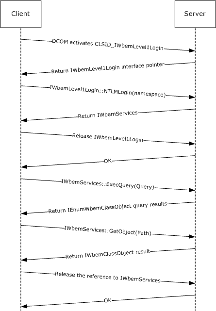
<!-- /Extracted images from page 57 -->

Figure 3: Typical protocol sequence

#### 3.1.1 Abstract Data Model

Unless otherwise indicated, each of the following elements is maintained in volatile storage.

The server MUST maintain a security descriptor for each namespace.

The server MUST maintain an InitSuccess Boolean value that shows whether all the data structures
were initialized successfully.

[MS-WMI] - v20240423
Windows Management Instrumentation Remote Protocol
Copyright © 2024 Microsoft Corporation
Release: April 23, 2024

57 / 234

The server MUST maintain an EventDropLimit DWORD value that represents the threshold used for
dropping the events on the server.

The server MUST maintain a MaxRequestLimit integer value that represents the maximum number
of requests the server can handle at a time. This value is implementation-specific.<12>

The server MUST maintain a CurrentRequestCount counter that represents the number of
IWbemServices calls in progress.

The server SHOULD maintain in persistent storage an AllowAnonymousCallback Boolean flag as a
global value. The flag indicates whether the server allows anonymous callbacks to the client.

The server SHOULD maintain an UnsecAppAccessControlDefault Boolean flag as a global value.
The flag indicates whether the server checks for an acceptable authentication level in callbacks.

The server MUST maintain a global BackupInProgress flag that indicates whether an
IWbemBackupRestore::Backup operation has been triggered by a client and is in progress.

The server MUST maintain a global RestoreInProgress flag that indicates whether an
IWbemBackupRestore::Restore operation has been triggered by a client and is in progress.

The server MUST maintain a global IsServerPaused flag that indicates whether an
IWbemBackupRestore::Pause operation has been triggered by a client and is in progress.

The server MUST maintain a global IsServerShuttingDown flag that indicates whether the server is
in the process of shutting down.

The server MUST maintain a table NamespaceConnectionTable in the CIM database, where each
entry contains:

Name: A string that represents the namespace name.

Security Descriptor: The scheme used for initializing the security descriptor is implementation-

dependent.<13>

RequiresEncryption: A flag that indicates whether a DCOM client request needs the security level set

to RPC_C_AUTHN_LEVEL_PKT_PRIVACY.

ClassTable: A ClassTable (see below) that contains information about the classes in the namespace.

The server MUST maintain the following information:

EventBindingTable: A table of bindings, where each binding contains:

EventFilter: The WHERE clause of a notification query.

EventConsumer: An interface pointer back to the client through which the client is notified of

events.

EventPollingTimer: A timer that specifies the interval at which WMI will poll the provider

responsible for the class for intrinsic events.

EventGroupingTimer: A timer that specifies for how long events for a given consumer and filter

are to be withheld before being delivered.

EventQueue: A collection of events that have occurred and have yet to be dispatched to the

Event Consumer.

EventGroupAggregateQueue: A collection of AggregateEvent events that has yet to be

dispatched to the Event Consumer.

ClientSecurityContext: Security context of the client.

58 / 234

[MS-WMI] - v20240423
Windows Management Instrumentation Remote Protocol
Copyright © 2024 Microsoft Corporation
Release: April 23, 2024

PrevInstances: Array of IWbemClassObject objects that are instances of the class in the event

filter. This information is used in the generation of intrinsic events.

IWbemServices: The object created on the server upon successful completion of

IWbemLevel1Login::NTLMLogin. This contains the following:

ClientPreferredLocales: Used by the server uses to return localizable information as specified in

3.1.1.2.

NamespaceConnection reference: Reference to the NamespaceConnection object (which

corresponds to the namespace information passed by the client) that is stored in the
NamespaceConnectionTable.

GrantedAccess: The set of access rights (enumerated in section 5.2) that have been granted to

the client in this namespace.

ClassTable: A table in the CIM database of CIM classes that are registered within a namespace,

where each entry contains:

ClassDeclaration: The CIM class specification as defined in [DMTF-DSP0004].

DerivedClassTable: A reference to the parent class entry in the ClassTable.

InstanceProviderId: A locally unique string that specifies the provider from which the instances

are being returned. This is the same as the value of the [provider] qualifier of the class
definition. If the instances are returned from the CIM database rather than a provider, this
value MUST be set to NULL.

ClassInstancesTable: A list of instances of the given CIM class.

The ClassTable MUST include entries defining the system classes in sections 2.2.30 and 2.2.31. If the
server supports the dynamic objects, the server MUST maintain a ProviderTable in the CIM database
where each entry contains:

ProviderId: Unique Id of the provider in the system.

ProviderEntryPoint: A pointer to the provider instance that the server is to communicate with.

IsClassProvider: A Boolean that is true if the provider creates dynamic CIM classes, or false if it only

creates dynamic instances.

ProviderArchitectureType: The provider architecture, either 32-bit or 64-bit. ProviderId is the

same for each ProviderArchitectureType value. ProviderId and ProviderArchitectureType
uniquely determine the ProviderEntryPoint to be used to forward the calls to a given provider in
the system.

SupportsGet: A Boolean value that is TRUE if the abstract interface Get Properties within an Instance
of a Class (section 3.1.4.17.3) or Get Properties within a Class (section 3.1.4.17.4) is supported
by the provider. By default, this value is set to FALSE.

SupportsPut: A Boolean value that is TRUE if one of the following abstract interfaces is supported by

the provider. By default, this value is set to FALSE.

  Update Properties Within an Instance of a Class (section 3.1.4.17.5)

  Update Properties Within a Class (section 3.1.4.17.6)

  Create an Instance of a Class (section 3.1.4.17.7)

  Create a Class (section 3.1.4.17.8)

[MS-WMI] - v20240423
Windows Management Instrumentation Remote Protocol
Copyright © 2024 Microsoft Corporation
Release: April 23, 2024

59 / 234

SupportsDelete: A Boolean value that is TRUE if the abstract interface Delete an Instance of a

Class (section 3.1.4.17.9) or Delete a Class (section 3.1.4.17.10) is supported by the provider. By
default, this value is set to FALSE.

SupportsEnumerate: A Boolean value that is TRUE if the abstract interface Enumerate Instances of a

Given Class (section 3.1.4.17.1) or Enumerate the Subclasses of a Given
Class (section 3.1.4.17.2) is supported by the provider. By default, this value is set to FALSE.

SupportsRefresher: A Boolean value that is TRUE if the provider supports refreshing the CIM object.

By default, this value is set to FALSE.

EventQueryList: A list of WQL query strings representing events that can be produced by this

provider. See section 3.1.4.3.20 for details.

ResultSetQueries: A list of WQL query strings; see section 3.1.4 for details.

QuerySupportLevels: An array of strings that present the query capabilities of the provider. The

values MUST  be the combination of zero or more of the following strings:
"WQL:Associators","WQL:V1ProviderDefined","WQL:UnarySelect","WQL:References".<14>

AsyncOperationTable: A table to store the information of asynchronous calls (see section 3.1.1.1.3)
in progress. Each entry of this table corresponds to one asynchronous call, where each entry
contains the following:

ClientSyncPointer: A pointer to IWbemObjectSink passed as a response handler by the client
as part of an asynchronous call. This can be used to identify a client asynchronous call on the
server.

CallbackInProgress: A Boolean value that is set to TRUE if there is an

IWbemObjectSink::Indicate or IWbemObjectSink::SetStatus with a currently-in-progress
message. The value is set to FALSE if there is no IWbemObjectSink::Indicate and
IWbemObjectSink::SetStatus in progress for the operation. See sections 3.2.4.1.1 and
###### 3.2.4.1.2 for more details.

CallCancelled: A Boolean value that is set to TRUE if the operation is canceled. The initial value of

this variable is FALSE.

SetStatusWithFinalResultCalled: A Boolean value that is set to TRUE if

IWbemObjectSink::SetStatus with a final result is called. The initial value of this variable is
FALSE.

WbemCallResultTable: A table to store information about pending single-result semisynchronous

operations (see section 3.2.4.2.7 for a list of single-result semisynchronous operations). Each
entry in this table corresponds to one semisynchronous call, where each entry contains the
following:

WbemCallResultPointer: A pointer to a server-created IWbemCallResult object.

FinalResult: An HRESULT to store the result status of the call.

ResultObject: A pointer to IWbemClassObject to store the result object of the call.

ResultService: A pointer to IWbemServices, used to store the result only if this is an

IWbemServices::OpenNamespace call.

ResultString: A pointer to a string.

OperationFinished: A Boolean value to store if the operation is completed. This value is initially

set to FALSE.

[MS-WMI] - v20240423
Windows Management Instrumentation Remote Protocol
Copyright © 2024 Microsoft Corporation
Release: April 23, 2024

60 / 234

The following ADM elements are used to store information about semisynchronous calls returning
multiple objects (see section 3.2.4.2.8 for a list of multiple-result semisynchronous calls).

SemiSinkResultSetObject: A structure to store the results of multiple-result semisynchronous calls.

One instance of this structure is created for every multiple-result semisynchronous call. The
structure contains the following:

ResultArray: An array of IWbemClassObjects to store the result objects.

CurrentTotalCount: An integer value to store the count of the valid number of array elements.

OperationFinished: A Boolean value to store if the operation is completed. This value is initially

set to FALSE.

RefCount: An integer indicating the count of IEnumWbemClassObject pointers that point to this

instance of SemiSinkResultObject. When this count becomes zero, the object is freed.

Flags: The lFlags parameter value passed in as part of a semisynchronous call.

FinalResult: An HRESULT to store the result status of the call.

ClientSecurityContext: The security context of the client.

EnumWbemClassObjectTable: A table to store information about the pending result of

semisynchronous operations. Each entry in this table either corresponds to one semisynchronous
call or is a clone of another IEnumWbemClassObject instance. Each entry contains the following:

EnumWbemClassObjectPointer: A pointer to SemiSinkResultSetObject.

ResultSetPointer: A pointer to SemiSinkResultSetObject.

CurrentIndex: An integer value pointing to the index of the next object to be given to the client.

SinkQueue: A queue to store the information about pending NextAsync calls. Each element of this

queue contains the following:

WbemObjectSinkPointer: A pointer to the client passed in IWbemObjectSink.

RemainingRequestCount: An integer representing the remaining number of objects to be given

as part of the callbacks on this sink.

3.1.1.1  Delivering Results to Client

3.1.1.1.1 Synchronous Calls

The server MUST complete the requested operation before returning from the synchronous method
call. The status of the operation is returned as return value of the method. On successful execution of
the synchronous methods, the server MUST return result object or objects in the out parameter of the
method.

3.1.1.1.2 Semisynchronous Calls

The server MUST start the requested operation and MUST return the appropriate response without
waiting for the operation to complete. If the requested operation fails to start, the server MUST return
an error as a return value of the method and MUST NOT return IEnumWbemClassObject or
IWbemCallResult as an out parameter.

3.1.1.1.2.1  Semisynchronous Operations Returning Multiple Objects

[MS-WMI] - v20240423
Windows Management Instrumentation Remote Protocol
Copyright © 2024 Microsoft Corporation
Release: April 23, 2024

61 / 234

For the requested operation to begin successfully, the server MUST create and return an object of type
IEnumWbemClassObject for the following methods, and the return value MUST be
WBEM_S_NO_ERROR, as specified in section 2.2.11. When the client calls the methods of
IEnumWbemClassObject, the IEnumWbemClassObject method MUST deliver the results of the
requested operation. The enumeration of IEnumWbemClassObject MUST return the same result set as
the corresponding synchronous operation.

Before returning WBEM_S_NO_ERROR, the server MUST create an instance of the
SemiSinkResultSetObject ADM element and initialize CurrentTotalCount to zero, OperationFinished
to FALSE, and RefCount to 1. The server MUST also copy the lFlags parameter of the operation. The
server MUST create an entry in EnumWbemClassObjectTable for IEnumWbemClassObject by
storing a pointer to SemiSinkResultSetObject created for this operation in ResultSetPointer. The
server initializes CurrentIndex of EnumWbemClassObjectTable to start the index of ResultArray
and stores the security context of the client in ClientSecurityContext.









IWbemServices::ExecQuery (section 3.1.4.3.18)

IWbemServices::CreateInstanceEnum (section 3.1.4.3.16)

IWbemServices::CreateClassEnum (section 3.1.4.3.10)

IWbemServices::ExecNotificationQuery (section 3.1.4.3.20)

The server stores the results of the operation in SemiSinkResultSetObject and tracks the client
fetching the results by using the entry in EnumWbemClassObjectTable.

The server updates the SemiSinkResultSetObject EnumWbemClassObjectTable entry as follows:

1.  The server MUST store the results of the operation in ResultArray as they are available and

update CurrentTotalCount to reflect the total results.

2.  The server MUST set OperationFinished to TRUE when the operation is finished.

3.  When the operation is finished, either completed or failed, the server MUST set FinalResult with

the result code as specified in section 2.2.11 and set OperationFinished to TRUE.

4.  When the client releases the reference to IEnumWbemClassObject, the server MUST delete the

EnumWbemClassObjectTable entry and decrement RefCount by 1 for the
SemiSinkResultSetObject referenced in ResultSetPointer.

5.  When the RefCount of SemiSinkResultSetObject is zero, the server MUST free the result stored

in ResultArray and delete this instance of SemiSinkResultSetObject.

3.1.1.1.2.2  Semisynchronous Operations Returning a Single Object

If the requested operation begins successfully, the server MUST return an IWbemCallResult object for
the following methods, and the return value MUST be WBEM_S_NO_ERROR. When the client calls the
methods of IWbemCallResult, IWbemCallResult MUST deliver the result of the requested operation.

Before returning WBEM_S_NO_ERROR, the server MUST create an entry in WbemCallResultTable by
keeping a reference to IEnumWbemClassObject in WbemCallResultPointer and initializing
ResultObject, ResultString, and ResultService to NULL. The server MUST set OperationFinished
to FALSE.









IWbemServices::OpenNamespace (section 3.1.4.3.1)

IWbemServices::PutInstance (section 3.1.4.3.12)

IWbemServices::GetObject (section 3.1.4.3.4)

IWbemServices::PutClass (section 3.1.4.3.6)

[MS-WMI] - v20240423
Windows Management Instrumentation Remote Protocol
Copyright © 2024 Microsoft Corporation
Release: April 23, 2024

62 / 234







IWbemServices::DeleteClass (section 3.1.4.3.8)

IWbemServices::DeleteInstance (section 3.1.4.3.14)

IWbemServices::ExecMethod (section 3.1.4.3.22)

The server sets ResultObject, ResultString, and ResultService as the results become available for
the respective operations. When an operation is finished, the server MUST set FinalResult with the
operation result and set OperationFinished to TRUE. The server MUST remove the entry for this
operation from WbemCallResultTable when the client releases its last reference of
IEnumWbemClassObject.

3.1.1.1.3 Asynchronous calls

The server MUST start the requested operation and MUST return the appropriate response without
waiting for the completion of the operation. If starting the requested operation fails, the server MUST
return the error as a return value of the method; MUST NOT keep a reference to IWbemObjectSink
(passed as a response handler); and MUST NOT call IWbemObjectSink::Indicate or
IWbemObjectSink::SetStatus.

Section 3.2.4.2.9 lists the asynchronous method calls. Before starting an asynchronous operation, the
server method MUST create an entry in AsyncOperationTable, storing a reference to the client's
IWbemObjectSink in ClientSyncPointer, and set other fields (CallbackInprogress, CallCancelled,
and SetStatusWithFinalResultCalled) to FALSE.

For the requested operation to begin successfully, the server MUST return WBEM_S_NO_ERROR, as
specified in section 2.2.11 and MUST keep a reference to IWbemObjectSink passed as a response
handler.

The server MUST invoke the IWbemObjectSink::Indicate and IWbemObjectSink::SetStatus methods,
as specified in sections 3.2.4.1.1 and 3.2.4.1.2. If the call to IWbemObjectSink::Indicate or
IWbemObjectSink::SetStatus fails, the server MUST cancel the asynchronous operation.

The server MAY call IWbemObjectSink::SetStatus multiple times when it executes the asynchronous
operation in order to report the operation progress,<15> as explicitly requested by a client using a
WBEM_SEND_STATUS flag. In this situation, the HRESULT parameter contains the progress
information.

Calls made by the server into the client-provided IWbemObjectSink interface SHOULD use an
authentication level that is greater than NONE. If that fails, and if the
UnsecAppAccessControlDefault flag is set to false and AllowAnonymousCallback flag is set to
true, the server SHOULD retry with an authentication level of NONE.<16> The server MUST try to
make the calls by using the machine principal name.

The total number of client operations is limited by MaxRequestLimit as described in section 3.1.4.3.

3.1.1.2  Localization Support

The server MUST support storage of CIM localizable information. The localizable class properties
MUST have amended qualifiers in the MOF class definition.

The server MUST store each class with amended qualifiers as two or more objects:

  A locale-neutral object that contains all properties, with all amended qualifiers stripped.

  A localized object for each supported locale. The class object contains only the properties that

have amended qualifiers, and their respective qualifiers. This localized object MUST be stored in
a namespace that is a direct child of the namespace (from NamespaceConnectionTable) in

[MS-WMI] - v20240423
Windows Management Instrumentation Remote Protocol
Copyright © 2024 Microsoft Corporation
Release: April 23, 2024

63 / 234

which a locale-neutral object exists and the name of the namespace MUST be a locale name in the
"MS_xxx" format (see section 2.2.29).

When the server updates an existing class, it MUST observe the
WBEM_FLAG_USE_AMENDED_QUALIFIERS flag:





If the client specifies the flag, then both locale-neutral and locale-specific objects MUST be
updated.

If the client does not specify the flag, only the locale-neutral object MUST be updated. If the class
sent by the client contains amended qualifiers, then the server MUST update the locale-neutral
class exactly as requested, rather than removing the amended qualifiers.

When the client creates a new class, the server MUST create the class only in the locale-neutral area
(regardless whether WBEM_FLAG_USE_AMENDED_QUALIFIERS is set). The amended qualifiers
MUST not be stripped.

When the client retrieves a class object and the WBEM_FLAG_USE_AMENDED_QUALIFIERS is set,
the server MUST merge the locale-neutral and locale-dependent class definitions and present them as
one class to the client using the following algorithm.

  Retrieve the locale-neutral class. Then it MUST search for localized class objects, using the list of

locales in the NamespaceConnection object's ClientPreferredLocales. The search for the class
is made in the order of the locales in ClientPreferredLocales. When the requested class is found
in one locale namespace, the server MUST stop looking.



If present, the localized object MUST be merged with the neutral object (which has priority over
any qualifier present in the localized object).

When a client retrieves a class object and the WBEM_FLAG_USE_AMENDED_QUALIFIERS flag is
not set, the server MUST return the locale-neutral object as-is, without checking for localized
definitions. If the locale-neutral class is not found, the server MUST return WBEM_E_NOT_FOUND,
regardless of whether WBEM_FLAG_USE_AMENDED_QUALIFIERS is specified, even if locale-
specific objects exist.

Note  The class will have amended qualifiers if the class object was originally created without
stripping the amended qualifiers.

If a class is annotated with the Amendment qualifier, attempts to create instances of the class MUST
fail with a WBEM_E_INVALID_OPERATION error.

When a client deletes a class object and the WBEM_FLAG_USE_AMENDED_QUALIFIERS flag is not
set, the server MUST delete the locale-neutral object as-is, without checking for localized definitions.

When a client deletes a class object and the WBEM_FLAG_USE_AMENDED_QUALIFIERS flag is
set, the server MUST fail with a WBEM_E_INVALID_PARAMETER error.

3.1.2  Timers

The server MUST use timers to ensure that the conversation between itself and its clients remains
active. The Windows Management Instrumentation Remote Protocol uses the following timers:

Sink timer: Each asynchronous operation has a corresponding timer, which MUST be initialized to
30 seconds when the server calls the client back using IWbemObjectSink. The timer MUST be
reset when the call completes.

Backup timer: Each IWbemBackupRestoreEx has a corresponding timer, which MUST be initialized to
15 minutes when the server receives an IWbemBackupRestoreEx::Pause. The timer MUST be
reset when the server receives an IWbemBackupRestoreEx::Resume.

[MS-WMI] - v20240423
Windows Management Instrumentation Remote Protocol
Copyright © 2024 Microsoft Corporation
Release: April 23, 2024

64 / 234

EventPollingTimer: This timer tracks the polling interval specified by the WITHIN clause of an

event query. The timer interval is the number of seconds specified in the query. The minimum
value of the polling interval is 0.001 (equivalent to 1 millisecond) and the maximum value is
418937 (0xffffffff/1000).

EventGroupingTimer: This timer tracks the grouping interval specified by the GROUP WITHIN

clause of an event query. The timer interval is the number of seconds specified in the query. The
minimum value of the polling interval is 0.001 (equivalent to 1 millisecond) and the maximum
value is 418937 (0xffffffff/1000).

3.1.3  Initialization

The protocol MUST be initialized after successful activation of one of the two interfaces that are
registered with the DCOM Remote Protocol infrastructure, as specified in [MS-DCOM] section 1.9.

All the global flags and other elements mentioned in ADM are volatile unless they are loaded and
stored from CIM database. Unless otherwise specified, the updates to the ADM elements directly
happen in CIM database.

The server MUST initialize InitSuccess to false.

The server MUST initialize EventDropLimit to 1000.

The server MUST initialize MaxRequestLimit to 5000.

The server MUST initialize CurrentRequestCount to 0.

The server MUST initialize UnsecAppAccessControlDefault to false.

The server MUST enumerate the NamespaceConnectionTable and ensure that a single
__SystemSecurity instance is present in each namespace and matches the namespace's
RequiresEncryption flag and security descriptor.

If the server has dynamic CIM classes or CIM instances in the system, the server MUST load each
provider of the ProviderTable as described in 3.1.6.2.

The server MUST create an empty EventBindingTable object during its initialization. The information
kept in this object is volatile and is not persisted during the server's shutdown.

The server MUST initialize the BackupInProgress flag to False.

The server MUST initialize the RestoreInProgress flag to False.

The server MUST initialize the IsServerPaused flag to False.

The server MUST initialize the IsServerShuttingDown flag to False.

The server SHOULD initialize AllowAnonymousCallback to False. <17>

When the server has successfully initialized the above data structures, it MUST set InitSuccess to
True.

3.1.4  Message Processing Events and Sequencing Rules

The server MUST accept multiple parallel invocations from different clients running under different
security principals that the server impersonates. On each interface, the server MUST support
multiple outstanding calls.

[MS-WMI] - v20240423
Windows Management Instrumentation Remote Protocol
Copyright © 2024 Microsoft Corporation
Release: April 23, 2024

65 / 234

The errors returned by the server are not actionable unless explicitly specified in this section. The
server MUST perform an access check against all operations and ensure secure access to the results.
If the access check fails, the server MUST return WBEM_E_ACCESS_DENIED.

If the impersonation level is not RPC_C_IMPL_LEVEL_IMPERSONATE or
RPC_C_IMPL_LEVEL_DELEGATE, the server MUST return WBEM_E_ACCESS_DENIED.

The methods MUST be secured by using access rights as specified in section 5.2.

The server MUST treat characters as Unicode characters and represent them in 16 bits. This is
contrary to the requirement of [DMTF-DSP0004] where the string data type is interpreted as a UCS
character.

The server MAY support ordered array types, as specified in the requirement of [DMTF-
DSP0004].<18>

If the server detects that the IWbemClassObject that is sent by the client does not conform to [MS-
WMIO] encoding, as specified in section 2.2.4, the server MUST return an HRESULT that has the S
(severity) bit set as specified in [MS-ERREF]. The exact code is implementation-dependent.

If the server is expected to set the value of the output parameter, but the output parameter is set to
NULL upon input, the server SHOULD return an error to indicate failure. In this case, the server cannot
modify the output parameter.

For all methods, the server MUST enforce that the DCOM security level is at least at the
RPC_C_AUTHN_LEVEL_CONNECT level, and SHOULD be RPC_C_AUTHN_LEVEL_PKT_INTEGRITY; the
server MUST also evaluate the security principal rights to open a CIM namespace.<19> The server
MUST fail the operation if the security requirements are not met.

For all IwbemServices methods, the server MUST verify that the client has been granted the access
rights specified in the method description, by testing that those rights are included in
GrantedAccess.

For all methods, if the server cannot find the NamespaceConnection associated with IWbemServices
in the NamespaceConnectionTable (either because the table no longer contains a row for the
namespace or because the NamespaceConnection was replaced during
IWbemBackupRestore::Restore), the server MUST return WBEM_E_INVALID_NAMESPACE.

For all methods that create, query, update, or delete the CIM instances, the server MUST obtain
InstanceProviderId for the given class from the ClassTable.

If InstanceProviderId is NULL, the server MUST forward the request to the CIM database. If
InstanceProviderId is not NULL, and if the IWbemContext object is passed to the server, WMI MUST
obtain the ProviderArchitecture from the IWbemContext object, and use the following algorithm to
locate the correct provider.



If ProviderArchitecture is not present or if IWbemContext object is not passed, then the server
MUST find the ProviderEntryPoint corresponding to InstanceProviderId in the ProviderTable.



If ProviderArchitecture is present:







If its value is neither 32 nor 64, the server MUST return WBEM_E_INVALID_PARAMETER.

If RequiredArchitecture is present and is set to TRUE, the server MUST find the
ProviderEntryPoint in ProviderTable corresponding to ProviderArchitecture and
InstanceProviderId.

If RequiredArchitecture is not present or set to FALSE, the server MUST find the
ProviderEntryPoint in ProviderTable corresponding to ProviderArchitecture and
InstanceProviderId. If there is no ProviderEntryPoint found, the server MUST find
ProviderEntryPoint for the given InstanceProviderId ignoring the ProviderArchitecture.

66 / 234

[MS-WMI] - v20240423
Windows Management Instrumentation Remote Protocol
Copyright © 2024 Microsoft Corporation
Release: April 23, 2024

If the server cannot find ProviderEntryPoint, it MUST return WBEM_E_PROVIDER_LOAD_FAILURE. If
the ProviderEntryPoint is found, the server MUST use the abstract interface defined in 3.1.4.17 to
communicate with the provider.

For all methods that create, query, update, or delete the CIM class where InstanceProviderId is
not zero, the server MUST go through each of the WQL queries in ResultSetQueries and evaluate
the WHERE clause. If the expression evaluates to TRUE for the given CIM class (that is, the provider
supports the CIM class), then the server MUST proceed with the rest of the processing for the method
as specified in the method-specific processing rules in 3.1.4. If FALSE, the server MUST return
WBEM_E_PROVIDER_NOT_CAPABLE.

For all methods that query, update, or delete the CIM classes, the server MUST obtain
InstanceProviderId for the given class from the ClassTable. If InstanceProviderId is not NULL,
and if the IWbemContext object is passed to the server, the server MUST obtain the
ProviderArchitecture from IWbemContext object. The same algorithm is used as for CIM instances.

For all methods that query, update, or delete the CIM instances, the server MAY allow the static
properties to be modified, contrary to [DMTF-DSP0004] requirements.<20>

If the server cannot find ProviderEntryPoint, it MUST return WBEM_E_PROVIDER_LOAD_FAILURE. If
the ProviderEntryPoint is found, the server MUST use the abstract interface defined in section
3.1.4.17to communicate with the provider.

For all methods where the request is sent to the provider, the provider MAY choose to perform
additional authentication or authorization, or perform the operations within the context of security
principal in which ProviderEntryPoint was called<21>

Specific rules related to creation, deletion, navigation, and persistence of the namespaces are covered
as part of section 3.1.4.18.

The server SHOULD fail the operation and return WBEM_E_ACCESS_DENIED if the namespace has the
RequiresEncryption flag set and if the DCOM security level is lower than
RPC_C_AUTHN_LEVEL_PKT_PRIVACY.<22>

The server MAY return WBEM_E_QUOTA_VIOLATION if the number of active IWbemServices objects is
more than an implementation-defined limit for a given namespace.<23>

The server MUST fail the operation and return CO_E_SERVER_STOPPING if the RestoreInProgress
flag is set to True.

The server MUST fail the operation and return WBEM_E_SHUTTING_DOWN if the
IsServerShuttingDown flag is set to True.

If either of the BackupInProgress or IsServerPaused flags are set to True, the server MUST buffer
the request (unless the request exceeds MaxRequestLimit as described in section 3.1.4.3) until both
the BackupInProgress and IsServerPaused flags are set to False before performing the operation.

For all methods that update the CIM class, if CIM class on the server had abstract qualifier set to true,
while its parent class does not have abstract qualifier set to false, the server MUST return
WBEM_E_CANNOT_BE_ABSTRACT.

For all methods that update CIM instance, if a CIM instance with amended qualifier set to true is
being updated without WBEM_FLAG_USE_AMENDED_QUALIFIERS flag, the server MUST return
WBEM_E_AMENDED_OBJECT.

When an IWbemContext object is passed to an IWbemServices method, the following optional
parameters could be present:



If __MI_DESTINATIONOPTIONS_DATA_LOCALE is present:

[MS-WMI] - v20240423
Windows Management Instrumentation Remote Protocol
Copyright © 2024 Microsoft Corporation
Release: April 23, 2024

67 / 234



The WMI server SHOULD<24> indicate to the WMI v2 provider to use this locale to format the
culture-specific information such as date/time format; otherwise, it MUST indicate the first
ClientPreferredLocale.



If __MI_DESTINATIONOPTIONS_UI_LOCALE is present:



The WMI Server SHOULD<25> indicate to the WMI v2 provider to use this locale to determine
the display language for human-readable strings; otherwise, it MUST indicate the first
ClientPreferredLocale.



If __CorrelationId is present:





The WMI Server SHOULD<26> store this value and use as part of internal logging.

The WMI server SHOULD pass this to the provider as part of IWbemContext, and the provider
can use this value as part of its own logging.

3.1.4.1  IWbemLevel1Login Interface

The IWbemLevel1Login interface allows a user to connect to the management services interface in a
particular namespace. The interface MUST be uniquely identified by the UUID {F309AD18-D86A-
11d0-A075-00C04FB68820}.

Methods in RPC Opnum Order

Method

Description

EstablishPosition

Opnum: 3

RequestChallenge  Opnum: 4

WBEMLogin

Opnum: 5

NTLMLogin

Opnum: 6

The object that exports this interface also implements the IWbemLoginClientID and
IWbemLoginHelper interfaces. The IRemUnknown and IRemUnknown2 interfaces, specified in [MS-
DCOM], MUST be used to manage the interfaces exposed by the object. The object MUST be uniquely
identified with the CLSID {8BC3F05E-D86B-11D0-A075-00C04FB68820}.

[MS-WMI] - v20240423
Windows Management Instrumentation Remote Protocol
Copyright © 2024 Microsoft Corporation
Release: April 23, 2024

68 / 234

<!-- Extracted images from page 69 -->
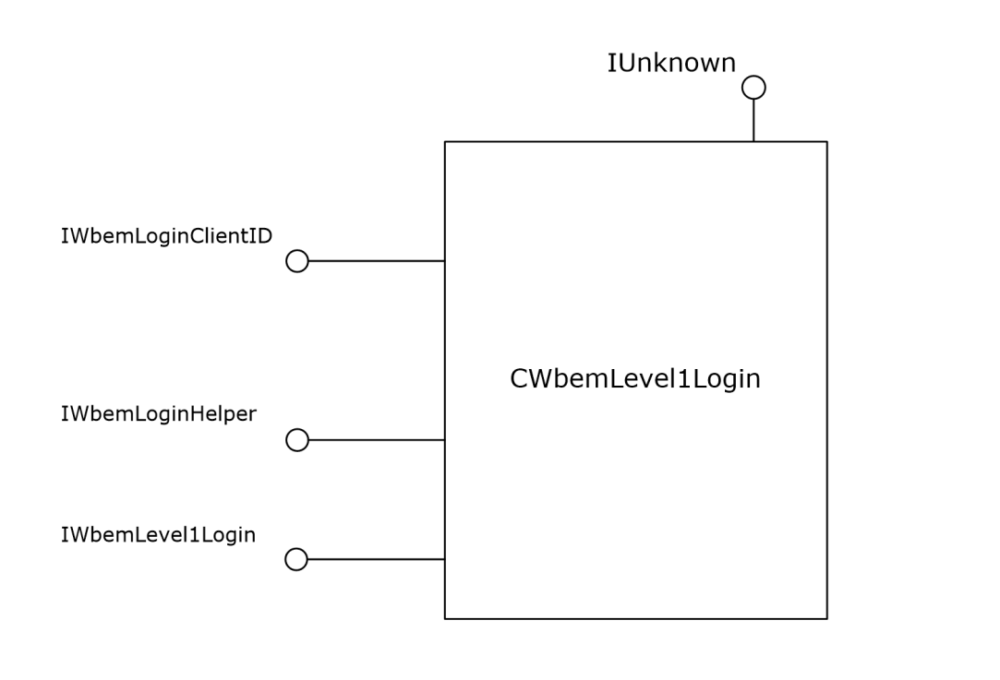
<!-- /Extracted images from page 69 -->

Figure 4: The IWbemLevel1Login interface

3.1.4.1.1 IWbemLevel1Login::EstablishPosition (Opnum 3)

The IWbemLevel1Login::EstablishPosition method does not perform any action. The return value and
output parameter are used in locale negotiation as specified in section 3.2.3.

 HRESULT EstablishPosition(
   [in, unique, string] wchar_t* reserved1,
   [in] DWORD reserved2,
   [out] DWORD* LocaleVersion
 );

reserved1: MUST be set to NULL when sent and MUST be ignored on receipt.

reserved2: MUST be set to 0 when sent and MUST be ignored on receipt.

LocaleVersion: The server MUST set the value of LocaleVersion based on the server behavior when
IWbemLevel1Login::NTLMLogin is passed an unrecognized locale name in the wszPreferredLocale
parameter:

The return value and LocaleVersion are used for Locale capability negotiation before calling
IWbemLevel1Login::NTLMLogin, as specified in section 3.2.3.





If the server ignores an unrecognized locale name in the Locale Name Format, as specified in
section 2.2.29, passed to IWbemLevel1Login::NTLMLogin while all other parameters are valid,
and completes the execution of the IWbemLevel1Login::NTLMLogin method, the server MUST
set the LocaleVersion parameter to 1.

If the server returns an error for an unrecognized locale name in Locale Name Format, as
specified in section 2.2.29, passed to IWbemLevel1Login::NTLMLogin, while all other
parameters are valid, the server MUST set the LocaleVersion parameter to 0.

[MS-WMI] - v20240423
Windows Management Instrumentation Remote Protocol
Copyright © 2024 Microsoft Corporation
Release: April 23, 2024

69 / 234

Return Values: The server MUST return one of the following values, based on server behavior for the

wszPreferredLocale parameter in IWbemLevel1Login::NTLMLogin.

Return value/code  Description

0x00

The connection was established and no error occurred.<27>

WBEM_S_NO_ERROR

0x80004001

E_NOTIMPL

The attempted operation is not implemented. The value of this element is as
specified in [MS-ERREF] section 2.1.<28>

3.1.4.1.2 IWbemLevel1Login::RequestChallenge (Opnum 4)

This method does not perform any action.

 HRESULT RequestChallenge(
   [in, unique, string] wchar_t* reserved1,
   [in, unique, string] wchar_t* reserved2,
   [out, size_is(16), length_is(16)]
     unsigned char* reserved3
 );

reserved1: MUST be set to NULL when sent and MUST be ignored on receipt.

reserved2: MUST be set to NULL when sent and MUST be ignored on receipt.

reserved3: MUST be set to NULL when sent and MUST be ignored on receipt.

Return value/code

Description

0x8004100c

The server SHOULD return this value.

WBEM_E_NOT_SUPPORTED

3.1.4.1.3 IWbemLevel1Login::WBEMLogin (Opnum 5)

This method does not perform any action.

 HRESULT WBEMLogin(
   [in, unique, string] wchar_t* reserved1,
   [in, size_is(16), length_is(16), unique]
     unsigned char* reserved2,
   [in] long reserved3,
   [in] IWbemContext* reserved4,
   [out] IWbemServices** reserved5
 );

reserved1: MUST be set to NULL when sent and MUST be ignored on receipt.

reserved2: MUST be set to NULL when sent and MUST be ignored on receipt.

reserved3: MUST be set to 0 when sent and MUST be ignored on receipt.

reserved4: MUST be set to NULL when sent and MUST be ignored on receipt.

[MS-WMI] - v20240423
Windows Management Instrumentation Remote Protocol
Copyright © 2024 Microsoft Corporation
Release: April 23, 2024

70 / 234

reserved5: MUST be set to NULL when sent and MUST be ignored on receipt.

Return value/code  Description

0x80004001

E_NOTIMPL

The server SHOULD return this value.

3.1.4.1.4 IWbemLevel1Login::NTLMLogin (Opnum 6)

The IWbemLevel1Login::NTLMLogin method MUST connect a user to the management services
interface in a specified namespace.

 HRESULT NTLMLogin(
   [in, unique, string] LPWSTR wszNetworkResource,
   [in, unique, string] LPWSTR wszPreferredLocale,
   [in] long lFlags,
   [in] IWbemContext* pCtx,
   [out] IWbemServices** ppNamespace
 );

wszNetworkResource: The string MUST represent the namespace on the server to which the

returned IWbemServices object is associated. This parameter MUST NOT be NULL and MUST
match the namespace syntax as specified in section 2.2.2.

wszPreferredLocale: MUST be a pointer to a string that MUST specify the locale values in the
preferred order, separated by a comma. If the client does not supply it, the server creates a
default list which is implementation-specific.<29> Each locale format SHOULD conform to the WMI
locale format, as specified in WMI Locale Formats (section 2.2.29). Any subsequent calls that
request CIM localizable information (WBEM_FLAG_USE_AMENDED_QUALIFIERS) SHOULD
return the localized information in the order of preference if the information is available in the
LCID.<30> The server MUST save this information in ClientPreferredLocales.

lFlags: MUST be 0. The server SHOULD consider any other value as not valid and return

WBEM_E_INVALID_PARAMETER; otherwise, the server behavior is implementation-specific.<31>

pCtx: MUST be a pointer to an IWbemContext interface, which MUST contain additional information

sent by the client. If pCtx is NULL, the parameter MUST be ignored.

ppNamespace: If the call succeeds, ppNamespace MUST return a pointer to an IWbemServices

interface pointer. This parameter MUST be set to NULL when an error occurs.

Return Values: This method MUST return an HRESULT value that MUST indicate the status of the

method call. The server MUST return WBEM_S_NO_ERROR, as specified in section 2.2.11, to
indicate the successful completion of the method.

WBEM_S_NO_ERROR (0x00)

The server MUST return WBEM_E_INITIALIZATION_FAILURE if InitSuccess is false.

The server MUST determine the client's access rights by comparing
RpcImpersonationAccessToken.Sids[UserIndex] as defined in [MS-RPCE] section 3.3.3.4.3
against the security descriptor stored in NamespaceConnection.

The security principal that makes the call MUST have WBEM_REMOTE_ENABLE and WBEM_ENABLE
access to the namespace; otherwise, WBEM_ACCESS_DENIED MUST be returned.

[MS-WMI] - v20240423
Windows Management Instrumentation Remote Protocol
Copyright © 2024 Microsoft Corporation
Release: April 23, 2024

71 / 234

In response to the IWbemLevel1Login::NTLMLogin method, the server MUST return an IWbemServices
interface that corresponds to the wszNetworkResource parameter.

The server SHOULD enforce a maximum length for the wszNetworkResource parameter, and return
WBEM_E_QUOTA_VIOLATION if the limit is exceeded.<32>

When the call succeeds, the server MUST create an IWbemServices object. The server MUST store
the wszPreferredLocale inside the object. The server MUST find the NamespaceConnection object
for wszNetworkResource passed into the NamespaceConnectionTable, and store its reference in the
IWbemServices object. The server MUST return WBEM_E_INVALID_NAMESPACE if the
NamespaceConnection object cannot be found. The server MUST set GrantedAccess to the set of
access rights granted to the client by the namespace security descriptor.

All subsequent IWbemServices method invocations that request localized information MUST return the
information in the language that is specified in wszPreferredLocale. When the preferred locale is NULL,
the server SHOULD<33> use implementation-specific logic to decide the locale.

The successful method execution MUST fill the ppNamespace parameter with an IWbemServices
interface pointer and MUST return WBEM_S_NO_ERROR.

The failed method execution MUST set the output parameter to NULL and MUST return an error in the
format specified in section 2.2.3. If the namespace does not exist, the server MUST return a
WBEM_E_INVALID_NAMESPACE HRESULT value.

3.1.4.2  IWbemObjectSink Interface Server Details

The IWbemObjectSink interface MUST be implemented by the WMI client if the WMI client uses
asynchronous method calls as specified in section 3.2.4.2.9. In this case, the WMI client acts as an
IWbemObjectSink server. The WMI server acts as an IWbemObjectSink client and invokes the
IWbemObjectSink methods to deliver the results (IWbemClassObjects, if any, and the status code) of
the IWbemServices method for which this IWbemObjectSink is passed as a response handler.

If the WMI client calls the IWbemServices::QueryObjectSink method, the IWbemObjectSink interface
MUST be implemented by the WMI server and MUST be returned to the client in the
ppResponseHandler parameter, as specified in section 3.1.4.3.3. In this case, the WMI server acts as
an IWbemObjectSink server. The WMI client acts as an IWbemObjectSink client and invokes the
IWbemObjectSink methods to deliver the results, that is, IWbemClassObjects that represent the
extrinsic events the client wants to deliver to the server.

Because this interface is implemented by the WMI client and the WMI server and called by both, the
server in this section refers to the implementer of this interface and the client refers to the caller in a
specific scenario.

The IWbemObjectSink interface is a DCOM Remote Protocol (as specified in [MS-DCOM]) interface.
The interface MUST be uniquely identified by UUID {7c857801-7381-11cf-884d-00aa004b2e24}.

Methods in RPC Opnum Order

Method

Description

Indicate

The server receives the IWbemClassObject interfaces, which are sent in an ObjectArray structure.
These objects are the result of an IWbemServices asynchronous method call that was started with
this sink as the response handler.

Opnum: 3

SetStatus  The server receives either a completion status code or information about the progress of the

operation that was started with this sink as the response handler.

Opnum: 4

[MS-WMI] - v20240423
Windows Management Instrumentation Remote Protocol
Copyright © 2024 Microsoft Corporation
Release: April 23, 2024

72 / 234

3.1.4.2.1 IWbemObjectSink::Indicate (Opnum 3) Server details

When the IWbemObjectSink::Indicate method is called, the apObjArray parameter MUST contain
additional result objects as an array of an IWbemClassObject, sent by the client to the server. The
IWbemObjectSink::Indicate method has the following syntax, expressed in Microsoft Interface
Definition Language (MIDL).

 HRESULT Indicate(
   [in] long lObjectCount,
   [in, size_is(lObjectCount)] IWbemClassObject** apObjArray
 );

lObjectCount: MUST be the number of CIM objects in the array of pointers in the ppObjArray

parameter.

apObjArray: MUST contain an array of result objects sent by the caller.

Return Values: This method MUST return an HRESULT value that MUST indicate the status of the

method call.

WBEM_S_NO_ERROR (0x00)

When the IWbemObjectSink::Indicate method is called for the first time, the server that implements
the ObjectArray structure MUST return WBEM_S_NEW_STYLE if the execution of the method succeeds.
If a server does not implement the ObjectArray structure, it MUST return WBEM_S_NO_ERROR for
successful execution of the method.

If the server implements the ObjectArray structure and WBEM_S_NEW_STYLE is returned during the
first call to the IWbemObjectSink::Indicate method, the server MUST support subsequent calls to the
IWbemObjectSink::Indicate method by using both the DCOM Remote Protocol marshaling and the
ObjectArray structure as specified in section 2.2.14.

3.1.4.2.2 IWbemObjectSink::SetStatus (Opnum 4) Server Details

When the IWbemObjectSink::SetStatus method is called, the parameter MUST contain the result of
the operation or the progress status information.

 HRESULT SetStatus(
   [in] long lFlags,
   [in] HRESULT hResult,
   [in] BSTR strParam,
   [in] IWbemClassObject* pObjParam
 );

lFlags: Flags that give information about the operation status. The flags MUST be interpreted as

specified in the following table.

Note  The flags are not bit flags and cannot be combined.

Value

Meaning

WBEM_STATUS_COMPLETE

Indicates the end of the asynchronous operation.

0x00000000

WBEM_STATUS_PROGRESS   Indicates the progress state of the asynchronous operation.

[MS-WMI] - v20240423
Windows Management Instrumentation Remote Protocol
Copyright © 2024 Microsoft Corporation
Release: April 23, 2024

73 / 234

Value

0x00000002

Meaning

Any other DWORD value that does not match the condition shown MUST be treated as not valid
and an error MUST be returned.

hResult: The HRESULT value of the asynchronous operation or notification. This hResult MUST be the
same HRESULT that the WMI client gets from the matching synchronous operation when the
WMI client makes an asynchronous request to the WMI server.

strParam: If the parameter is NULL, the server MUST ignore the parameter. If the parameter is not

NULL, it MUST represent the operational result of the asynchronous operation. The string MUST be
the same as the string that is returned from the IWbemCallResult::GetResultString (Opnum 4)
method when the operation is executed synchronously.

pObjParam: If the parameter is NULL, the server MUST ignore the parameter. If the parameter is not
NULL, the object MUST contain additional error information for the asynchronous operation failure.

Return Values: This method MUST return an HRESULT value that MUST indicate the status of the

method call. The server MUST return WBEM_S_NO_ERROR (specified in section 2.2.11) to indicate
the successful completion of the method.

WBEM_S_NO_ERROR (0x00)

3.1.4.3  IWbemServices Interface

The IWbemServices interface exposes methods that MUST provide management services to client
processes. The implementation MUST implement all methods and return errors if the semantics of the
operation cannot be completed. IWbemServices defines the execution scope for all methods
implemented on the interface. The initial scope MUST be established by the
IWbemLevel1Login::NTLMLogin call, which returns the interface pointer.

Methods in RPC Opnum Order

Method

Description

OpenNamespace

Provides the client with an IWbemServices interface pointer that is scoped to the
requested namespace.

Opnum: 3

CancelAsyncCall

Cancels a currently pending asynchronous method call identified by the
IWbemObjectSink pointer passed to the initial asynchronous method.

Opnum: 4

QueryObjectSink

Obtains a notification handler that allows the client to send events directly to the
server.

Opnum: 5

GetObject

Retrieves a CIM class or a CIM instance.

Opnum: 6

GetObjectAsync

Asynchronous version of the IWbemServices::GetObject method.

Opnum: 7

PutClass

Creates a new class or updates an existing class in the namespace associated with
the current IWbemServices interface.

Opnum: 8

[MS-WMI] - v20240423
Windows Management Instrumentation Remote Protocol
Copyright © 2024 Microsoft Corporation
Release: April 23, 2024

74 / 234

Method

Description

PutClassAsync

Asynchronous version of the IWbemServices::PutClass method.

Opnum: 9

DeleteClass

Deletes a specified class from the namespace associated with the current
IWbemServices interface.

Opnum: 10

DeleteClassAsync

Asynchronous version of the IWbemServices::DeleteClass method.

Opnum: 11

CreateClassEnum

Creates a class enumeration.

Opnum: 12

CreateClassEnumAsync

Asynchronous version of the IWbemServices::CreateClassEnum method.

Opnum: 13

PutInstance

Creates or updates an instance of an existing class.

Opnum: 14

PutInstanceAsync

Asynchronous version of the PutInstance method.

Opnum: 15

DeleteInstance

Deletes an instance of an existing class from the namespace that is pointed to by
the IWbemServices interface object that is used to call the method.

Opnum: 16

DeleteInstanceAsync

Asynchronous version of the IWbemServices::DeleteInstance method.

Opnum: 17

CreateInstanceEnum

Creates an instance enumeration of all class instances that satisfy the selection
criteria.

Opnum: 18

CreateInstanceEnumAsync

Asynchronous version of the IWbemServices::CreateInstanceEnum method.

Opnum: 19

ExecQuery

Returns an enumerable collection of IWbemClassObject interface objects based on
a query.

Opnum: 20

ExecQueryAsync

Asynchronous version of the IWbemServices::ExecQuery method.

Opnum: 21

ExecNotificationQuery

Server runs a query to receive events when called by a client to request
subscription to the events.

Opnum: 22

ExecNotificationQueryAsync  Asynchronous version of the IWbemServices::ExecNotificationQuery method.

Opnum: 23

ExecMethod

Executes a CIM method implemented by a CIM class or a CIM instance retrieved
from the IWbemServices interface.

Opnum: 24

ExecMethodAsync

Asynchronous version of the IWbemServices::ExecMethod method.

Opnum: 25

[MS-WMI] - v20240423
Windows Management Instrumentation Remote Protocol
Copyright © 2024 Microsoft Corporation
Release: April 23, 2024

75 / 234

<!-- Extracted images from page 76 -->
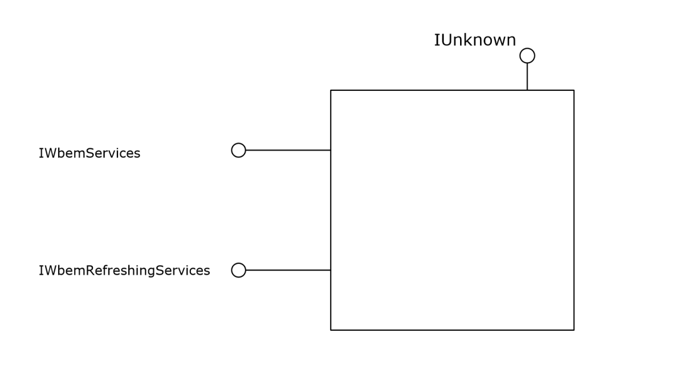
<!-- /Extracted images from page 76 -->

IWbemServices MUST be a DCOM Remote Protocol interface. The interface MUST be uniquely
identified by UUID {9556dc99-828c-11cf-a37e-00aa003240c7}. The object exporting this interface
also implements the IWbemRefreshingServices interface, as shown in the following diagram.

Figure 5: The IWbemServices interface

For all methods, the server MUST increment CurrentRequestCount at the start of the method, and
decrement it when returning from the method.

If IsServerPaused flag is set to True, the server MUST return WBEM_E_SERVER_TOO_BUSY if
CurrentRequestCount is greater than MaxRequestLimit. The class names used in the operations
MUST conform to the CLASS-NAME element of the WQL query. The server MUST treat class names in
a case-insensitive manner.

3.1.4.3.1 IWbemServices::OpenNamespace (Opnum 3)

The IWbemServices::OpenNamespace method provides the client with an IWbemServices interface
pointer that is scoped to the requested namespace. The specified namespace MUST be a child
namespace of the current namespace through which this method is called.

 HRESULT OpenNamespace(
   [in] const BSTR strNamespace,
   [in] long lFlags,
   [in] IWbemContext* pCtx,
   [out, in, unique] IWbemServices** ppWorkingNamespace,
   [out, in, unique] IWbemCallResult** ppResult
 );

strNamespace: MUST be the CIM path to the target namespace. This parameter MUST NOT be

NULL.

lFlags: Flags that affect the behavior of the OpenNamespace method. The behavior of each flag MUST

be interpreted as follows:





If this bit is not set, the server MUST make the method call synchronous.

If this bit is set, the server MUST make the method call semisynchronously.

76 / 234

[MS-WMI] - v20240423
Windows Management Instrumentation Remote Protocol
Copyright © 2024 Microsoft Corporation
Release: April 23, 2024

Name

Value

WBEM_FLAG_RETURN_IMMEDIATELY  0x00000010

Any other DWORD value that does not match the preceding condition MUST be treated as invalid.

pCtx: This parameter MUST be NULL.

ppWorkingNamespace: This parameter MUST NOT be NULL on input when

WBEM_FLAG_RETURN_IMMEDIATELY is not set. If the method returns WBEM_S_NO_ERROR,
ppWorkingNamespace MUST receive a pointer to an IWbemServices interface pointer to the
requested namespace.

The output parameter MUST be based on the state of the lFlags parameter (whether
WBEM_FLAG_RETURN_IMMEDIATELY is set) as listed in the following table.

Flag state

Success operation

Failure operation

WBEM_FLAG_RETURN_IMMEDIATELY is
not set.

MUST be set to the requested
IWbemServices interface.

WBEM_FLAG_RETURN_IMMEDIATELY is
set.

MUST be set to NULL if the input
parameter is not-NULL.

MUST be set to NULL if
the input parameter is
not-NULL.

MUST be set to NULL if
the input parameter is
not-NULL.

ppResult: The output parameter MUST be filled according to the state of the lFlags parameter

(whether WBEM_FLAG_RETURN_IMMEDIATELY is set) as listed in the following table.

Flag state

Success operation

Failure operation

WBEM_FLAG_RETURN_IMMEDIATELY is
not set.

MUST be set to NULL if the input
parameter is not-NULL.

WBEM_FLAG_RETURN_IMMEDIATELY is
set.

MUST be set to the requested
IWbemCallResult interface.

MUST be set to NULL if
the input parameter is
not-NULL.

MUST be set to NULL if
the input parameter is
not-NULL.

This parameter MUST NOT be NULL on input when WBEM_FLAG_RETURN_IMMEDIATELY equals 1.
In such a case, it receives a pointer to an IWbemCallResult interface pointer.

Return Values: This method MUST return an HRESULT value that MUST indicate the status of the

method call. The server MUST return WBEM_S_NO_ERROR, as specified in section 2.2.11, to
indicate the successful completion of the method.

WBEM_S_NO_ERROR (0x00)

Requirements described in the parameter definitions are checked, and if the requirements are not
met, the server returns WBEM_E_INVALID_PARAMETER.

In response to the IWbemServices::OpenNamespace method, the server MUST evaluate whether the
strNamespace parameter, which is specified in the preceding list, is a child of the namespace that is
associated with the current interface pointer. If the requested namespace does not exist as a child
namespace, the server MUST return WBEM_E_INVALID_NAMESPACE. If the requested namespace
exists as a child namespace of the current interface pointer, the server MUST create another
IWbemServices interface pointer associated with this namespace and return WBEM_S_NO_ERROR.

If the method returns a success code, the method MUST fill one of the two output parameters, as
indicated by the use of the lFlags parameter, which is previously specified.

77 / 234

[MS-WMI] - v20240423
Windows Management Instrumentation Remote Protocol
Copyright © 2024 Microsoft Corporation
Release: April 23, 2024

The successful synchronous method execution MUST fill the ppWorkingNamespace parameter with an
IWbemServices interface pointer and MUST return WBEM_S_NO_ERROR.

The semisynchronous method execution MUST follow the rules that are specified in section
3.1.1.1.2.

The failed method execution MUST set the output parameters to NULL and MUST return an error in the
format that is specified in section 2.2.11.

If the ppResult input parameter is non-NULL, the server MUST deliver the result of the requested
operation (regardless whether WBEM_FLAG_RETURN_IMMEDIATELY is set) via the IWbemCallResult,
similar to the semisynchronous execution case.

3.1.4.3.2 IWbemServices::CancelAsyncCall (Opnum 4)

The IWbemServices::CancelAsyncCall method cancels a currently pending asynchronous method call
identified by the IWbemObjectSink pointer passed to the initial asynchronous method.

 HRESULT CancelAsyncCall(
   [in] IWbemObjectSink* pSink
 );

pSink: MUST be a pointer to the IWbemObjectSink interface object that was passed to the

asynchronous method that the client wants to cancel. This parameter MUST NOT be NULL.

Return Values: This method MUST return an HRESULT value that MUST indicate the status of the

method call. The server MUST return WBEM_S_NO_ERROR (as specified in section 2.2.11) to
indicate the successful completion of the method.

Return value/code  Description

0x00

Indicates a successful completion to the method call.

WBEM_S_NO_ERROR

In response to the IWbemServices::CancelAsyncCall method, the server MUST identify and cancel all
pending asynchronous operations initiated by an asynchronous method execution, such as
IWbemServices::GetObjectAsync, which used the pSink interface pointer parameter as their
response handler. The server MUST return an error if the interface pointer is NULL, and it MUST return
an error if the pSink parameter is not associated with an entry in AsyncOperationTable.

As part of the IWbemServices::CancelAsyncCall method, the server MUST set the CallCancelled value
for this asynchronous operation entry in the AsyncOperationTable to TRUE. Setting CallCancelled to
TRUE ensures that no new IWbemObjectSink::Indicate messages or progress messages using
IWbemObjectSink::SetStatus are called to the client. If SetStatusWithFinalResultCalled is FALSE,
the server MUST set SetStatusWithFinalResultCalled to TRUE and return the error
WBEM_E_CALL_CANCELLED.

The server MUST NOT wait for any response from the client to complete the cancellation to prevent
protocol performance degradation.

The successful method execution MUST return WBEM_S_NO_ERROR.

The failed method execution MUST return an error in the format specified in section 2.2.11.

3.1.4.3.3 IWbemServices::QueryObjectSink (Opnum 5)

The QueryObjectSink method obtains a notification handler that allows the client to send events
directly to the server.

78 / 234

[MS-WMI] - v20240423
Windows Management Instrumentation Remote Protocol
Copyright © 2024 Microsoft Corporation
Release: April 23, 2024

 HRESULT QueryObjectSink(
   [in] long lFlags,
   [out] IWbemObjectSink** ppResponseHandler
 );

lFlags: This parameter is not used and its value MUST be 0x0.

ppResponseHandler: MUST be a pointer to a QueryObjectSink interface pointer to the notification
handler that allows the client to send events directly to the server. This parameter MUST be set to
NULL on error.

Return Values: This method MUST return an HRESULT value that MUST indicate the status of the

method call. The server MUST return WBEM_S_NO_ERROR (specified in section 2.2.11) to indicate
the successful completion of the method.

WBEM_S_NO_ERROR (0x00)

The security principal that makes the call MUST have WBEM_REMOTE_ENABLE, WBEM_ENABLE, and
WBEM_FULL_WRITE accesses to the namespace; otherwise, WBEM_E_ACCESS_DENIED MUST be
returned.

In response to the IWbemServices::QueryObjectSink method, the server MUST return an
IWbemObjectSink interface pointer in ppResponseHandler. The server MUST return an error if the
ppResponseHandler is NULL or if it is unable to create the requested interface pointer.

The successful method execution MUST fill the ppResponseHandler parameter and MUST return
WBEM_S_NO_ERROR.

The failed method execution MUST set the output parameters to NULL and MUST return an error in the
format as specified in section 2.2.11.

When extrinsic events are delivered to the server by using IWbemObjectSink::Indicate as specified in
section 3.1.4.2.1, the server MUST send the event objects to all WMI clients whose notification query
satisfies the event objects that are delivered through IWbemObjectSink::Indicate and whose security
permissions match the security descriptor as specified in section 5.2. Refer to section 3.1.6.1 for
information on how the result objects are delivered to the client.

The notification query is made by the client to the server by calling
IWbemServices::ExecNotificationQuery or IWbemServices::ExecNotificationQueryAsync. Refer to
sections 3.1.4.3.20 and 3.1.4.3.21 for information about how the server processes the client requests
for notifications.

3.1.4.3.4 IWbemServices::GetObject (Opnum 6)

The IWbemServices::GetObject method retrieves a CIM class or a CIM instance. This method MUST
retrieve CIM objects from the namespace that is associated with the current IWbemServices
interface.

 HRESULT GetObject(
   [in] const BSTR strObjectPath,
   [in] long lFlags,
   [in] IWbemContext* pCtx,
   [out, in, unique] IWbemClassObject** ppObject,
   [out, in, unique] IWbemCallResult** ppCallResult
 );

strObjectPath: MUST be the CIM path of the CIM object to be retrieved. If the parameter is NULL,

the server MUST return an empty CIM Object.

79 / 234

[MS-WMI] - v20240423
Windows Management Instrumentation Remote Protocol
Copyright © 2024 Microsoft Corporation
Release: April 23, 2024

lFlags: Specifies the behavior of the IWbemServices::GetObject method. Flag behavior MUST be

interpreted as specified in the following table.

The server MUST allow any combination of zero or more flags from the following table and MUST
comply with all the restrictions in a flag description. Any other DWORD value that does not match
a flag condition MUST be treated as not valid.

Value

Meaning

WBEM_FLAG_USE_AMENDED_QUALIFIERS

0x00020000

WBEM_FLAG_RETURN_IMMEDIATELY

0x00000010

WBEM_FLAG_DIRECT_READ

0x00000200

If this bit is not set, the server SHOULD return no CIM
localizable information.

If this bit is set, the server SHOULD return CIM localizable
information for the CIM object, as specified in section 2.2.6.

If this bit is not set, the server MUST make the method call
synchronously.

If this bit is set, the server MUST make the method call
semisynchronously.

If this bit is set, the server MUST disregard any derived class
when it searches the result.

If this bit is not set, the server MUST consider the entire class
hierarchy when it returns the result.

pCtx: MUST be a pointer to an IWbemContext interface, which MUST contain additional information
that the client wants to pass for processing to the implementer of the CIM object that is referred
to by strObjectPath. If the parameter is set to NULL, the server MUST ignore it.

ppObject: If the parameter is set to NULL, the server MUST ignore it. In this case, the output

parameter MUST be filled according to the state of the lFlags parameter (whether
WBEM_FLAG_RETURN_IMMEDIATELY is set) as listed in the following table.

Flag state

Success operation

Failure operation

WBEM_FLAG_RETURN_IMMEDIATELY is
not set.

MUST contain an
IWbemClassObject interface
pointer.

MUST be set to NULL if
the input parameter is
non-NULL.

WBEM_FLAG_RETURN_IMMEDIATELY is
set.

MUST be set to NULL if the input
parameter is non-NULL.

MUST be set to NULL if
the input parameter is
non-NULL.

ppCallResult: The output parameter MUST be filled according to the state of the lFlags parameter

(whether WBEM_FLAG_RETURN_IMMEDIATELY is set) as listed in the following table.

Flag state

Success operation

WBEM_FLAG_RETURN_IMMEDIATELY
is not set.

MUST be set to NULL if the ppCallResult input
parameter is non-NULL.

Failure
operation

MUST be set
to NULL if
the
ppCallResult
input
parameter
is non-
NULL.

WBEM_FLAG_RETURN_IMMEDIATELY
is set.

The ppCallResult parameter MUST NOT be NULL
upon input. If NULL, the server MUST return
WBEM_E_INVALID_PARAMETER. Upon output, the

MUST be set
to NULL if
the

80 / 234

[MS-WMI] - v20240423
Windows Management Instrumentation Remote Protocol
Copyright © 2024 Microsoft Corporation
Release: April 23, 2024

Flag state

Success operation

parameter MUST contain the IWbemCallResult
interface pointer.

Failure
operation

ppCallResult
input
parameter
is non-
NULL.

Return Values: This method MUST return an HRESULT that MUST indicate the status of the method

call. The HRESULT MUST have the type and values as specified in section 2.2.11. The server MUST
return WBEM_S_NO_ERROR (as specified in section 2.2.11) to indicate the successful completion
of the method.

WBEM_S_NO_ERROR (0x00)

The security principal that makes the call MUST have WBEM_REMOTE_ENABLE and WBEM_ENABLE
accesses to the namespace; otherwise, WBEM_E_ACCESS_DENIED MUST be returned.

In response to the IWbemServices::GetObject method, the server MUST interpret strObjectPath as
defined in [DMTF-DSP0004] section 8.5. If the path refers to a class, the server MUST look it up in the
ClassTable. If found, the server MUST return an object that represents the ClassDeclaration. If
strObjectPath refers to an instance, the server MUST check the InstanceProviderId for the class. If
InstanceProviderId is NULL, then the server MUST look up the CIM database and return the CIM
instance. If InstanceProviderId is not NULL, then the server MUST find the provider entry
corresponding to InstanceProviderId in the ProviderTable.



If found:





If SupportsGet is FALSE, the server MUST return WBEM_E_PROVIDER_NOT_CAPABLE.

Else the server MUST use the abstract interface specified as part of 3.1.4.17 to communicate
with the provider, and return the appropriate results or the error code.



If not found, the server MUST return WBEM_E_PROVIDER_NOT_FOUND.

The successful synchronous method execution MUST provide the retrieved IWbemClassObject
interface pointer in the ppObject parameter and MUST return WBEM_S_NO_ERROR.

The method MUST fail if the CIM object that is referred to by strObjectPath does not exist, if the
method parameters are not valid as specified in the preceding list, or if the server is unable to execute
the method. The failed method execution MUST set the output parameters to NULL and MUST return
an error in the format specified in section 2.2.11.

The semisynchronous method execution MUST follow the rules that are specified in section 3.1.1.1.2.

If a class is marked by a Singleton qualifier, the server MUST treat "Class-Name = @" in the object
path as referencing the singleton instance of the class.

3.1.4.3.5 IWbemServices::GetObjectAsync (Opnum 7)

The IWbemServices::GetObjectAsync method is the asynchronous version of the
IWbemServices::GetObject method.

 HRESULT GetObjectAsync(
   [in] const BSTR strObjectPath,
   [in] long lFlags,
   [in] IWbemContext* pCtx,
   [in] IWbemObjectSink* pResponseHandler
 );

[MS-WMI] - v20240423
Windows Management Instrumentation Remote Protocol
Copyright © 2024 Microsoft Corporation
Release: April 23, 2024

81 / 234

strObjectPath: MUST be the CIM path of the CIM object to be retrieved. If this parameter is set to

NULL, the server MUST return an empty CIM object.

lFlags: Specifies the behavior of the GetObjectAsync method. Flag behavior MUST be interpreted as

specified in the following table.

The server MUST accept a combination of zero or more flags from the following table and MUST
comply with all the restrictions in a flag description. Any other DWORD value that does not match
a flag condition MUST be treated as not valid.

Value

Meaning

WBEM_FLAG_USE_AMENDED_QUALIFIERS

0x00020000

WBEM_FLAG_SEND_STATUS

0x00000080

WBEM_FLAG_DIRECT_READ

0x00000200

If this bit is not set, the server SHOULD return no CIM
localizable information.

If this bit is set, the server SHOULD return CIM localizable
information for the CIM object, as specified in section 2.2.6.

If this bit is not set, the server MUST make one final
IWbemObjectSink::SetStatus call on the interface pointer
that is provided in the pResponseHandler parameter.

If this bit is set, the server MAY make intermediate
IWbemObjectSink::SetStatus calls on the interface pointer
prior to call completion.

If this bit is not set, the implementer MUST consider the entire
class hierarchy when it returns the result.

If this bit is set, the server MUST disregard any derived class
when it searches the result.

pCtx: MUST be a pointer to an IWbemContext interface, which MUST contain additional information

that the client wants to provide to the server about the CIM object referred to by strObjectPath. If
pCtx is NULL, the parameter MUST be ignored.

pResponseHandler: MUST be a pointer to the IWbemObjectSink interface that is implemented by the

caller, where enumeration results are delivered. The parameter MUST NOT be NULL. If the
parameter is NULL, the server MUST return WBEM_E_INVALID_PARAMETER.

Return Values: This method MUST return an HRESULT value that MUST indicate the status of the

method call. The server MUST return WBEM_S_NO_ERROR (specified in section 2.2.11) to indicate
the successful completion of the method.

WBEM_S_NO_ERROR (0x00)

The following validation occurs before an asynchronous operation is started:

The security principal that makes the call MUST have WBEM_REMOTE_ENABLE and WBEM_ENABLE
accesses to the namespace; otherwise, WBEM_E_ACCESS_DENIED MUST be returned.

Requirements mentioned in the parameter definitions are also checked before an asynchronous
operation is started.

If successful, the server MUST create a new entry in AsyncOperationTable as specified in section
3.1.1.1.3.

The following validation happens asynchronously.

In response to IwbemServices::GetObjectAsync method, the server MUST interpret strObjectPathas
defined in [DMTF-DSP0004] section 8.5. If the path refers to a class, the server MUST look it up in the
ClassTable. If found, the server MUST return an object that represents the ClassDeclaration. If
strObjectPath refers to an instance, the server MUST check the InstanceProviderId for the class. If

82 / 234

[MS-WMI] - v20240423
Windows Management Instrumentation Remote Protocol
Copyright © 2024 Microsoft Corporation
Release: April 23, 2024

InstanceProviderId is NULL, then the server MUST look up the CIM database and return the CIM
instance. If InstanceProviderId is not NULL, then the server MUST use the abstract interface
specified as part of section 3.1.4.18 to communicate with the provider, and find the provider entry
corresponding to the InstanceProviderId in the ProviderTable.



If found:





If SupportsGet is FALSE, the server MUST return WBEM_E_PROVIDER_NOT_CAPABLE.

Else, the server MUST use the abstract interface specified in section 3.1.4.17 to communicate
with the provider, and return the appropriate results or the error code.



If not found, the server MUST return WBEM_E_PROVIDER_NOT_FOUND.

The method MUST fail if the CIM object that is referred to by strObjectPath does not exist, if the
method parameters are not valid as specified in the preceding list, or if the server is unable to execute
the method. The failed method execution MUST set the output parameters to NULL and MUST return
an error in the format specified in section 2.2.11.

If a class is marked by a Singleton qualifier, the server MUST treat "Class-Name = @" in the object
path as referencing the singleton instance of the class.

3.1.4.3.6 IWbemServices::PutClass (Opnum 8)

The IWbemServices::PutClass method creates a new class or updates an existing class in the
namespace that is associated with the current IWbemServices interface. The server MUST NOT allow
the creation of classes that have names that begin or end with an underscore because those names
are reserved for system classes. If the class name does not conform to the CLASS-NAME element
defined in WQL, the server MUST return WBEM_E_INVALID_PARAMETER.

 HRESULT PutClass(
   [in] IWbemClassObject* pObject,
   [in] long lFlags,
   [in] IWbemContext* pCtx,
   [out, in, unique] IWbemCallResult** ppCallResult
 );

pObject: MUST be a pointer to an IWbemClassObject interface pointer that MUST contain the class
information to create a new class or update an existing class. This parameter MUST NOT be NULL.

lFlags: Specifies the behavior of the PutClass method. Flag behavior MUST be interpreted as specified

in the following table.

The server MUST accept a combination of zero or more flags from the following table and MUST
comply with all the restrictions in a flag description. Any other DWORD value that does not match
a flag condition MUST be treated as not valid.

Value

Meaning

WBEM_FLAG_USE_AMENDED_QUALIFIERS

0x00020000

WBEM_FLAG_RETURN_IMMEDIATELY

0x00000010

If this bit is set, the server SHOULD ignore all the amended
qualifiers while it creates or updates the CIM class.<34>

If this bit is not set, the server SHOULD include all the
qualifiers, including amended qualifiers, while it updates or
creates the CIM class.

If this bit is not set, the server MUST make the method call
synchronously.

If this bit is set, the server MUST make the method call
semisynchronously.

83 / 234

[MS-WMI] - v20240423
Windows Management Instrumentation Remote Protocol
Copyright © 2024 Microsoft Corporation
Release: April 23, 2024

Value

Meaning

WBEM_FLAG_UPDATE_ONLY

0x00000001

The server MUST update a CIM class pObject if the CIM class
is present.

This flag is mutually exclusive with
WBEM_FLAG_CREATE_ONLY. If none of these flags are set,
the server MUST create or update a CIM class pObject.

WBEM_FLAG_CREATE_ONLY

0x00000002

The server MUST create a CIM class pObject if the CIM class is
not already present.

WBEM_FLAG_UPDATE_FORCE_MODE

0x00000040

The server MUST update the class even if conflicting child
classes exist.

WBEM_FLAG_UPDATE_SAFE_MODE

0x00000020

The server MUST update the class as long as the change does
not cause any conflicts with existing child classes or instances.

This flag is mutually exclusive with
WBEM_FLAG_UPDATE_FORCE_MODE. If none of these flags
are set, the server MUST update the class if there is no
derived class, if there is no instance for that class, or if the
class is unchanged.

pCtx: MUST be a pointer to an IWbemContext interface, which MUST contain additional information

that the client wants to provide to the server about the CIM class that is referred to by the pObject
parameter. If the pCtx parameter is NULL, it MUST be ignored.

ppCallResult: If the input parameter is non-NULL, the server MUST return WBEM_S_NO_ERROR and

IWbemCallResult MUST deliver the result of the requested operation (regardless whether
WBEM_FLAG_RETURN_IMMEDIATELY is set). The output parameter MUST be filled according to
the state of the lFlags parameter (whether WBEM_FLAG_RETURN_IMMEDIATELY is set) as listed in
the following table.

Flag state

Operation Started Successfully

WBEM_FLAG_RETURN_IMMEDIATELY
is not set.

MUST be set to IWbemCallResult if the input
parameter is non-NULL.

WBEM_FLAG_RETURN_IMMEDIATELY
is set.

This parameter MUST NOT be NULL upon input. If
NULL, the server MUST return
WBEM_E_INVALID_PARAMETER. On output, the
parameter MUST contain the IWbemCallResult
interface pointer.

Operation
Failed to
Start

MUST be
set to
NULL if the
input
parameter
is non-
NULL.

MUST be
set to
NULL if the
input
parameter
is non-
NULL.

If the ppCallResult input parameter is NULL and WBEM_FLAG_RETURN_IMMEDIATELY is not set,
the server MUST deliver the result of the requested operation synchronously.

Return Values: This method MUST return an HRESULT value that MUST indicate the status of the

method call. The server MUST return WBEM_S_NO_ERROR (specified in section 2.2.11) to indicate
the successful completion of the method.

WBEM_S_NO_ERROR (0x00)

84 / 234

[MS-WMI] - v20240423
Windows Management Instrumentation Remote Protocol
Copyright © 2024 Microsoft Corporation
Release: April 23, 2024

The security principal that makes the call MUST have WBEM_REMOTE_ENABLE and WBEM_ENABLE
accesses to the namespace; otherwise,  WBEM_E_ACCESS_DENIED MUST be returned.

The server MUST first determine whether the class is dynamic or static. If the class exists in the
ClassTable for the namespace, then it is static when InstanceProviderId is NULL and dynamic
otherwise. If the class does not exist in the ClassTable, then WMI MUST iterate through each entry in
ProviderTable with IsClassProvider set to TRUE, calling the IsClassSupported entrypoint
(described in section 3.1.4.17.14). If a provider returns TRUE, then the algorithm is terminated and
the class is dynamic. Otherwise, the class is static.

If the CIM class being updated is dynamic, the security principal that makes the call MUST have
WBEM_WRITE_PROVIDER access to the namespace; otherwise, WBEM_E_ACCESS_DENIED MUST be
returned.

If the CIM class being updated is static, the security principal that makes the call MUST have
WBEM_FULL_WRITE access to the namespace; otherwise, WBEM_E_ACCESS_DENIED MUST be
returned.

The server MUST return WBEM_E_CANNOT_BE_SINGLETON if an attempt is made to mark a class as a
singleton that has a nonsingleton superclass or a class with key properties.

If the CIM class being created or updated is dynamic, the server MUST obtain SupportsPut for the
given provider in the ProviderTable. If SupportsPut is FALSE, the server MUST return
WBEM_E_PROVIDER_NOT_CAPABLE.

In response to the IWbemServices::PutClass method, the server MUST evaluate the pObject
parameter and MUST add or update this class into the current namespace. The method MUST fail if
pObject represents a read-only class, if the method parameters or their combinations are not valid as
specified in this section, or if the server is unable to execute the method. The method MUST fail with
WBEM_E_NOT_FOUND if pObject property __SUPERCLASS is specified but not found in ClassTable.

If a new class is added or an existing class is updated successfully, ClassTable MUST be updated with
the changes. If pObject property __SUPERCLASS is specified, DerivedClassTable MUST point to the
entry in the ClassTable representing the superclass.

If the CIM class referred by pObject is a new entry in the ClassTable, the server MUST generate a
__ClassCreationEvent event object upon successful creation of the class.

If the CIM class referred by pObject already exists in the ClassTable prior to this method call, the
server MUST generate a __ClassModificationEvent event object upon successfully updating the
class information.

The successful synchronous method execution MUST return WBEM_S_NO_ERROR.

The semisynchronous method execution MUST follow the rules that are specified in section 3.1.1.1.2.

The failed method execution MUST set output parameters to NULL and MUST return an error in the
format specified in section 2.2.11.

The server MUST ensure that the value referred by __CLASS conforms to CLASS-NAME in section
2.2.1.1. In addition:







If the value has an underscore character ("_") as the first character, the server MUST return
WBEM_E_INVALID_OPERATION.

If the value has an underscore character ("_") as the last character prior to NULL, the server
MUST return WBEM_E_INVALID_OBJECT.

The server SHOULD enforce a maximum length for the _CLASS property (2.2) of the object
pointed to by the pObject parameter, and return WBEM_E_QUOTA_VIOLATION if the limit is
exceeded.<35>

85 / 234

[MS-WMI] - v20240423
Windows Management Instrumentation Remote Protocol
Copyright © 2024 Microsoft Corporation
Release: April 23, 2024

3.1.4.3.7 IWbemServices::PutClassAsync (Opnum 9)

The IWbemServices::PutClassAsync method is the asynchronous version of the
IWbemServices::PutClass method. The PutClassAsync method creates a new class or updates an
existing class. The server MUST NOT allow the creation of classes that have names that begin or end
with an underscore because those names are reserved for system classes. If the class name does not
conform to the CLASS-NAME element defined in WQL, the server MUST return
WBEM_E_INVALID_PARAMETER.

 HRESULT PutClassAsync(
   [in] IWbemClassObject* pObject,
   [in] long lFlags,
   [in] IWbemContext* pCtx,
   [in] IWbemObjectSink* pResponseHandler
 );

pObject: MUST be a pointer to an IWbemClassObject interface pointer that MUST contain the class
information to create a new class or update an existing class. The class that is specified by the
parameter MUST have been correctly initialized with all the required property values. This
parameter MUST NOT be NULL.

lFlags: Specifies the behavior of the PutClassAsync method. Flag behavior MUST be interpreted as

specified in the following table.

The server MUST accept a combination of zero or more flags from the following table and MUST
comply with all the restrictions in a flag description. Any other DWORD value that does not match
a flag condition MUST be treated as not valid.

Value

Meaning

WBEM_FLAG_USE_AMENDED_QUALIFIERS

0x00020000

WBEM_FLAG_UPDATE_ONLY

0x00000001

If this bit is set, the server SHOULD ignore all the amended
qualifiers while it creates or updates a CIM class.<36>

If this bit is not set, the server SHOULD include all the
qualifiers, including amended qualifiers, while it updates or
creates a CIM class.

The server MUST update a CIM class pObject if the CIM class
is present.

This flag is mutually exclusive with
WBEM_FLAG_CREATE_ONLY. If none of these flags are set,
the server MUST create or update a CIM class pObject.

WBEM_FLAG_CREATE_ONLY

0x00000002

The server MUST create a CIM class pObject if the CIM class is
not already present.

WBEM_FLAG_UPDATE_FORCE_MODE

0x00000040

The server MUST forcefully update the class even when
conflicting child classes exist.

WBEM_FLAG_UPDATE_SAFE_MODE

0x00000020

The server MUST update the class as long as the change does
not cause any conflicts with existing child classes or instances.

This flag is mutually exclusive with
WBEM_FLAG_UPDATE_FORCE_MODE.

If none of these flags are set, the server MUST update the
class if there is no derived class, if there is no instance for that
class, or if the class is unchanged.

WBEM_FLAG_SEND_STATUS

0x00000080

If this bit is not set, the server MUST make one final
IWbemObjectSink::SetStatus method call on the interface
pointer that is provided in the pResponseHandler parameter.

[MS-WMI] - v20240423
Windows Management Instrumentation Remote Protocol
Copyright © 2024 Microsoft Corporation
Release: April 23, 2024

86 / 234

Value

Meaning

If this bit is set, the server MAY make intermediate
IWbemObjectSink::SetStatus calls on the interface pointer
prior to call completion.

pCtx: MUST be a pointer to an IWbemContext interface, which MUST contain additional information

that the client wants to pass to the server. If the pCtx parameter is NULL, the parameter MUST be
ignored.

pResponseHandler: MUST be a pointer to an IWbemObjectSink interface object that is implemented

by the client of this method. The parameter MUST NOT be NULL.

Return Values: This method MUST return an HRESULT value that MUST indicate the status of the

method call. The server MUST return WBEM_S_NO_ERROR (specified in section 2.2.11) to indicate
the successful completion of the method.

WBEM_S_NO_ERROR (0x00)

The following validation happens before asynchronous operation is started:

The security principal that makes the call MUST have WBEM_REMOTE_ENABLE and WBEM_ENABLE
accesses to the namespace; otherwise, WBEM_E_ACCESS_DENIED MUST be returned.

Requirements mentioned in the parameter definitions are also checked before starting asynchronous
operation.

If successful, the server MUST create a new entry in AsyncOperationTable as specified in section
3.1.1.1.3.

The following validation happens asynchronously:

The server MUST first determine whether the class is dynamic or static.  If the class exists in the
ClassTable for the namespace, then it is static when InstanceProviderId is NULL and dynamic
otherwise. If the class does not exist in the ClassTable, then WMI MUST iterate through each entry in
ProviderTable with IsClassProvider set to TRUE, calling the IsClassSupported entrypoint
(described in section 3.1.4.17.14). If a provider returns TRUE, then the algorithm is terminated and
the class is dynamic. Otherwise, the class is static.

If the CIM class being updated is dynamic, the security principal that makes the call MUST have
WBEM_WRITE_PROVIDER access to the namespace; otherwise, WBEM_E_ACCESS_DENIED MUST be
returned.

If the CIM class being updated is static, the security principal that makes the call MUST have
WBEM_FULL_WRITE access to the namespace; otherwise, WBEM_E_ACCESS_DENIED MUST be
returned.

If the CIM class being created or updated is dynamic, the server MUST obtain SupportsPut for the
given provider in the ProviderTable. If SupportsPut is FALSE, the server MUST return
WBEM_E_PROVIDER_NOT_CAPABLE.

The server MUST return WBEM_E_CANNOT_BE_SINGLETON if an attempt is made to mark a class as a
Singleton that has a nonsingleton superclass or a class with key properties.

In response to the IWbemServices::PutClassAsync method, the server MUST evaluate the pObject
parameter (previously specified) and it MUST add or update this class into the current namespace. The
method MUST fail if pObject represents a read-only class, if the method parameters or their
combinations are not valid (as previously specified), or if the server is unable to execute the method.
The method MUST fail with WBEM_E_NOT_FOUND if pObject property __SUPERCLASS is specified but
not found in ClassTable.

87 / 234

[MS-WMI] - v20240423
Windows Management Instrumentation Remote Protocol
Copyright © 2024 Microsoft Corporation
Release: April 23, 2024

If a new class is added or an existing class is updated, ClassTable MUST be updated with the
changes. If pObject property __SUPERCLASS is specified, DerivedClassTable MUST point to the
entry in the ClassTable representing the SuperClass.

If the CIM class referred by pObject is a new entry in the ClassTable, the server MUST generate a
__ClassCreationEvent event object upon successful creation of the class.

If the CIM class referred by pObject already exists in the ClassTable prior to this method call,  the
server MUST generate a __ClassModificationEvent event object upon successfully updating the
class information.

The server MUST ensure that the value referred by __CLASS conforms to CLASS-NAME in 2.2.1.1. In
addition:







If the value has an underscore character ("_") as the first character, the server MUST return
WBEM_E_INVALID_OPERATION.

If the value has an underscore character as the last character prior to NULL, the server MUST
return WBEM_E_INVALID_OBJECT.

The server SHOULD enforce a maximum length for the _CLASS property (see section 2.2) of the
object pointed to by the pObject parameter, and return WBEM_E_QUOTA_VIOLATION if the limit
is exceeded.<37>

3.1.4.3.8 IWbemServices::DeleteClass (Opnum 10)

The IWbemServices::DeleteClass method MUST delete a specified class from the namespace that is
associated with the current IWbemServices interface.

 HRESULT DeleteClass(
   [in] const BSTR strClass,
   [in] long lFlags,
   [in] IWbemContext* pCtx,
   [out, in, unique] IWbemCallResult** ppCallResult
 );

strClass: MUST be the name of the class to delete. This parameter MUST NOT be NULL.

lFlags: Specifies the behavior of the DeleteClass method. Flag behavior MUST be interpreted as

specified in the following table.

Value

Meaning

WBEM_FLAG_RETURN_IMMEDIATELY

0x00000010

If this bit is set, the server MUST make the method call
semisynchronously.

If this bit is not set, the server MUST make the method call
synchronously.

Any other DWORD value that does not match the preceding condition MUST be treated as invalid.

pCtx: MUST be a pointer to an IWbemContext interface, which MUST contain additional information
that the client wants to pass to the server. If pCtx is NULL, the parameter MUST be ignored.

ppCallResult: The output parameter MUST be filled according to the state of the lFlags parameter

(whether WBEM_FLAG_RETURN_IMMEDIATELY is set) as listed in the following table.

[MS-WMI] - v20240423
Windows Management Instrumentation Remote Protocol
Copyright © 2024 Microsoft Corporation
Release: April 23, 2024

88 / 234

Flag state

Operation Started Successfully

WBEM_FLAG_RETURN_IMMEDIATELY
is not set.

MUST be set to IWbemCallResult if the
ppCallResult input parameter is non-NULL.

WBEM_FLAG_RETURN_IMMEDIATELY
is set.

The ppCallResult parameter MUST NOT be
NULL upon input. If NULL, the server MUST
return WBEM_E_INVALID_PARAMETER. On
output, the parameter MUST contain the
IWbemCallResult interface pointer.

Operation
Failed to
Start

MUST be set
to NULL if the
ppCallResult
input
parameter is
non-NULL.

MUST be set
to NULL if the
ppCallResult
input
parameter is
non-NULL.

Return Values: This method MUST return an HRESULT value that MUST indicate the status of the

method call. The server MUST return WBEM_S_NO_ERROR (specified in section 2.2.11) to indicate
the successful completion of the method.

WBEM_S_NO_ERROR (0x00)

The security principal that makes the call MUST have WBEM_REMOTE_ENABLE and WBEM_ENABLE
accesses to the namespace; otherwise, WBEM_E_ACCESS_DENIED MUST be returned.

If the CIM class being deleted is dynamic, the security principal that makes the call MUST have
WBEM_WRITE_PROVIDER access to the namespace; otherwise, WBEM_E_ACCESS_DENIED MUST be
returned.

If the CIM class being deleted is static, the security principal that makes the call MUST have
WBEM_FULL_WRITE access to the namespace; otherwise, WBEM_E_ACCESS_DENIED MUST be
returned.

If the CIM class being deleted is dynamic, the server MUST obtain SupportsDelete for the given
provider in the ProviderTable. If SupportsDelete is FALSE, the server MUST return
WBEM_E_PROVIDER_NOT_CAPABLE.

In response to the IWbemServices::DeleteClass method, the server MUST evaluate the strClass
parameter (specified in this section) and MUST delete the strClass parameter from the current
namespace. The server MUST delete all the instances of the class and recursively delete all the derived
classes. The method MUST fail if the following applies: if strClass does not exist; if the method
parameters or their combinations are not valid as specified in this section; or if the server is unable to
execute the method.

The successful synchronous method execution MUST return WBEM_S_NO_ERROR.

The semisynchronous method execution MUST follow the rules that are specified in section 3.1.1.1.2.

The failed method execution MUST set output parameters to NULL and MUST return an error in the
format specified in section 2.2.11.

If the ppResult input parameter is non-NULL, the server MUST deliver the result of the requested
operation (regardless whether WBEM_FLAG_RETURN_IMMEDIATELY is set) via the IWbemCallResult,
similar to the semisynchronous execution case. If the ppCallResult input parameter is NULL and
WBEM_FLAG_RETURN_IMMEDIATELY is not set, the server MUST deliver the result of the requested
operation synchronously.

If a class is deleted, the corresponding entries for the class and its derived classes MUST be deleted
from the ClassTable.

89 / 234

[MS-WMI] - v20240423
Windows Management Instrumentation Remote Protocol
Copyright © 2024 Microsoft Corporation
Release: April 23, 2024

The server MUST generate a __ClassDeletionEvent event object upon successfully deleting the class
information.

The server SHOULD enforce a maximum length for the strClass parameter, and return
WBEM_E_QUOTA_VIOLATION if the limit is exceeded.<38>

3.1.4.3.9 IWbemServices::DeleteClassAsync (Opnum 11)

The IWbemServices::DeleteClassAsync method is the asynchronous version of the
IWbemServices::DeleteClass method. The DeleteClassAsync method MUST delete a specified class
from the namespace.

 HRESULT DeleteClassAsync(
   [in] const BSTR strClass,
   [in] long lFlags,
   [in] IWbemContext* pCtx,
   [in] IWbemObjectSink* pResponseHandler
 );

strClass: MUST be the name of the class to delete. This parameter MUST NOT be NULL.

lFlags: Specifies the behavior of the DeleteClassAsync method. Flag behavior MUST be interpreted as

specified in the following table.

Value

Meaning

WBEM_FLAG_SEND_STATUS

0x00000080

If this bit is not set, the server MUST make one final
IWbemObjectSink::SetStatus call on the interface pointer that is
provided in the pResponseHandler parameter.

If this bit is set, the server MAY make intermediate
IWbemObjectSink::SetStatus calls on the interface pointer prior to call
completion.

Any other DWORD value that does not match the preceding condition MUST be treated as not
valid.

pCtx: MUST be a pointer to an IWbemContext interface, which MUST contain additional information
that the client wants to pass to the server. If pCtx is NULL, the parameter MUST be ignored.

pResponseHandler: MUST be a pointer to an IWbemObjectSink interface object that is implemented

by the client of this method. This parameter MUST NOT be NULL.

Return Values: This method MUST return an HRESULT value that MUST indicate the status of the

method call. The server MUST return WBEM_S_NO_ERROR (as specified in section 2.2.11) to
indicate the successful completion of the method.

WBEM_S_NO_ERROR (0x00)

The following validation occurs before asynchronous operation is started:

The security principal that makes the call MUST have WBEM_REMOTE_ENABLE and WBEM_ENABLE
accesses to the namespace; otherwise, WBEM_E_ACCESS_DENIED MUST be returned.

The server SHOULD enforce a maximum length for the strClass parameter and return
WBEM_E_QUOTA_VIOLATION if the limit is exceeded.<39>

The requirements mentioned in the parameter definitions are also checked before starting the
asynchronous operation.

[MS-WMI] - v20240423
Windows Management Instrumentation Remote Protocol
Copyright © 2024 Microsoft Corporation
Release: April 23, 2024

90 / 234

If successful, the server MUST create a new entry in AsyncOperationTable as specified in section
3.1.1.1.3.

The following validation occurs asynchronously:

If the CIM class being deleted is dynamic, the security principal that makes the call MUST have
WBEM_WRITE_PROVIDER access to the namespace; otherwise, WBEM_E_ACCESS_DENIED MUST be
returned.

If the CIM class being deleted is static, the security principal that makes the call MUST have
WBEM_FULL_WRITE access to the namespace; otherwise, WBEM_E_ACCESS_DENIED MUST be
returned.

If the CIM class being deleted is dynamic, the server MUST obtain SupportsDelete for the given
provider in the ProviderTable. If SupportsDelete is FALSE, the server MUST return
WBEM_E_PROVIDER_NOT_CAPABLE.

In response to the IWbemServices::DeleteClassAsync method, the server MUST evaluate the strClass
parameter (specified in this section) and MUST delete strClass from the current namespace. The
server MUST delete all the instances of the class and recursively delete all the derived classes. The
method MUST fail if the following applies: if strClass does not exist; if the method parameters or their
combinations are not valid as previously specified; or if the server is unable to execute the method.

If a new class is deleted, the corresponding entries for the class and the derived classes MUST be
deleted from the ClassTable.

The server MUST generate a __ClassDeletionEvent event object upon successfully deleting the class
information.

3.1.4.3.10

IWbemServices::CreateClassEnum (Opnum 12)

The IWbemServices::CreateClassEnum method provides a class enumeration. When this method is
invoked, the server MUST return all classes that satisfy the selection criteria from the namespace that
is associated with the current IWbemServices interface.

 HRESULT CreateClassEnum(
   [in] const BSTR strSuperclass,
   [in] long lFlags,
   [in] IWbemContext* pCtx,
   [out] IEnumWbemClassObject** ppEnum
 );

strSuperClass: MUST specify a superclass name. Only classes that are subclasses of this class

MUST be returned. If strSuperClass is NULL or a zero-length string, all classes in the namespace
MUST be included in the result set. The results MUST be filtered by using the lFlags parameter.
Classes without a base class MUST be considered to be derived from the NULL superclass.

lFlags: Flags affect the behavior of the CreateClassEnum method. Flag behavior MUST be interpreted

as specified in the following table.

The server MUST allow any combination of zero or more flags from the following table and MUST
comply with all the restrictions in a flag description. Any other DWORD value that does not match
a flag condition MUST be treated as not valid.

Value

Meaning

WBEM_FLAG_USE_AMENDED_QUALIFIERS

0x00020000

If this bit is not set, the server SHOULD return no CIM
localizable information.

If this bit is set, the server SHOULD return CIM localizable

91 / 234

[MS-WMI] - v20240423
Windows Management Instrumentation Remote Protocol
Copyright © 2024 Microsoft Corporation
Release: April 23, 2024

Value

Meaning

WBEM_FLAG_RETURN_IMMEDIATELY

0x00000010

WBEM_FLAG_SHALLOW

0x00000001

WBEM_FLAG_FORWARD_ONLY

0x00000020

information for the CIM object, as specified in section
2.2.6.

If this bit is not set, the server MUST make the method
call synchronously.

If this bit is set, the server MUST make the method call
semisynchronously.

When this bit is not set, the server MUST return all
classes that are derived from the requested class and all
its subclasses.

When this bit is set, the server MUST return only the
classes that are directly derived from the requested class.

When this bit is not set, the server MUST return an
enumerator that has reset capability.

When this bit is set, the server MUST return an
enumerator that does not have reset capability, as
specified in section 3.1.4.4.

pCtx: MUST be a pointer to an IWbemContext interface that MUST contain additional information that

the client wants to pass to the server. If the pCtx parameter is NULL, it MUST be ignored.

ppEnum: MUST receive the pointer to the enumerator that implements the IEnumWbemClassObject

interface. This parameter MUST NOT be NULL.

Return Values: This method MUST return an HRESULT value that MUST indicate the status of the

method call. The server MUST return WBEM_S_NO_ERROR (as specified in section 2.2.11) to
indicate the successful completion of the method.

WBEM_S_NO_ERROR (0x00)

The security principal that makes the call MUST have WBEM_REMOTE_ENABLE and WBEM_ENABLE
accesses to the namespace; otherwise, WBEM_E_ACCESS_DENIED MUST be returned.

If strSuperClass is dynamic, the server MUST obtain SupportsEnumerate for the given provider in
the ProviderTable. If SupportsEnumerate is FALSE, the server MUST return
WBEM_E_PROVIDER_NOT_CAPABLE.

In response to the IWbemServices::CreateClassEnum method, the server MUST evaluate the
strSuperClass parameter (specified in the preceding list) and MUST return all classes that match the
input parameters from the current namespace. The method MUST fail if strSuperClass does not exist;
if the method parameters or their combinations are not valid as previously specified; or if the server is
unable to execute the method.

The successful synchronous method execution MUST fill the ppEnum parameter with an
IEnumWbemClassObject interface pointer after all classes are collected and MUST return
WBEM_S_NO_ERROR.

The semisynchronous method execution MUST follow the rules that are specified in section 3.1.1.1.2.

The failed method execution MUST set the value that is referenced by the output parameters to NULL
and MUST return an error in the format that is specified in section 2.2.11.

The server SHOULD enforce a maximum length for the strSuperClass parameter, and return
WBEM_E_QUOTA_VIOLATION if the limit is exceeded.<40>

3.1.4.3.11

IWbemServices::CreateClassEnumAsync (Opnum 13)

92 / 234

[MS-WMI] - v20240423
Windows Management Instrumentation Remote Protocol
Copyright © 2024 Microsoft Corporation
Release: April 23, 2024

The IWbemServices::CreateClassEnumAsync method provides an asynchronous class enumeration.
When this method is invoked, the server MUST return all classes that satisfy the selection criteria.

 HRESULT CreateClassEnumAsync(
   [in] const BSTR strSuperclass,
   [in] long lFlags,
   [in] IWbemContext* pCtx,
   [in] IWbemObjectSink* pResponseHandler
 );

strSuperClass: Specifies a superclass name. Only classes that are subclasses of this class MUST be

returned. If strSuperClass is NULL or a zero-length string, all classes in the namespace MUST be
considered in the result set. The results MUST be filtered by using the lFlags parameter. Classes
without a base class are considered to be derived from the NULL superclass.

lFlags: Flags that affect the behavior of the CreateClassEnum method. Flag behavior MUST be

interpreted as specified in the following table.

The server MUST allow any combination of zero or more flags from the following table and MUST
comply with all the restrictions in a flag description. Any other DWORD value that does not match
a flag condition MUST be treated as not valid.

Value

Meaning

WBEM_FLAG_USE_AMENDED_QUALIFIERS

0x00020000

WBEM_FLAG_SEND_STATUS

0x00000080

WBEM_FLAG_SHALLOW

0x00000001

If this bit is not set, the server SHOULD return no CIM
localizable information.

If this bit is set, the server SHOULD return CIM localizable
information for the CIM object as specified in section
2.2.6.

If this bit is not set, the server MUST make one final
IWbemObjectSink::SetStatus call on the interface
pointer that is provided in the pResponseHandler
parameter.

If this bit is set, the server MAY make intermediate
IWbemObjectSink::SetStatus calls on the interface
pointer prior to call completion.

When this bit is not set, the server MUST return all
classes that are derived from the requested class and all
its subclasses.

When this bit is set, the server MUST only return the
classes that are directly derived from the requested class.

pCtx: MUST be a pointer to an IWbemContext interface, which MUST contain additional information
that the client wants to pass to the server. If pCtx is NULL, the parameter MUST be ignored.

pResponseHandler: MUST be a pointer to the IWbemObjectSink that is implemented by the caller,
where enumeration results are delivered. The parameter MUST NOT be NULL. In error cases,
indicated by the return value, the supplied IWbemObjectSink interface pointer MUST NOT be used.
If WBEM_S_NO_ERROR is returned, the user IWbemObjectSink interface pointer MUST be called
to indicate the results of the CreateClassEnumAsync operation, as specified later in this section.

Return Values: This method MUST return an HRESULT, which MUST indicate the status of the

method call. The HRESULT MUST have the type and values as specified in section 2.2.11. The
server MUST return WBEM_S_NO_ERROR (specified in section 2.2.11) to indicate the successful
completion of the method.

WBEM_S_NO_ERROR (0x00)

93 / 234

[MS-WMI] - v20240423
Windows Management Instrumentation Remote Protocol
Copyright © 2024 Microsoft Corporation
Release: April 23, 2024

The following validation occurs before the asynchronous operation starts:

The security principal that makes the call MUST have WBEM_REMOTE_ENABLE and WBEM_ENABLE
accesses to the namespace; otherwise, WBEM_E_ACCESS_DENIED MUST be returned.

The server SHOULD enforce a maximum length for the strSuperClass parameter and return
WBEM_E_QUOTA_VIOLATION if the limit is exceeded.<41>

Requirements mentioned in the parameter definitions are also checked before starting the
asynchronous operation.

If successful, the server MUST create a new entry in AsyncOperationTable as specified in section
3.1.1.1.3.

The following validation occurs asynchronously:

If strSuperClass is dynamic, the server MUST obtain SupportsEnumerate for the given provider in
the ProviderTable. If SupportsEnumerate is FALSE, the server MUST return
WBEM_E_PROVIDER_NOT_CAPABLE.

In response to the IWbemServices::CreateClassEnumAsync method, the server MUST evaluate the
strSuperClass parameter (specified in this section) and MUST return all classes that match the input
parameters from the current namespace. The method MUST fail if strSuperClass does not exist, if the
method parameters or their combinations are not valid as specified earlier in this section, or if the
server is unable to execute the method.

3.1.4.3.12

IWbemServices::PutInstance (Opnum 14)

The IWbemServices::PutInstance method creates or updates an instance of an existing class.

The PutInstance method opnum equals 14.

 HRESULT PutInstance(
   [in] IWbemClassObject* pInst,
   [in] long lFlags,
   [in] IWbemContext* pCtx,
   [out, in, unique] IWbemCallResult** ppCallResult
 );

pInst: MUST be a pointer to an IWbemClassObject interface object that MUST contain the class
instance that the client wants to create or update. This parameter MUST NOT be NULL.

lFlags: Flags that affect the behavior of the PutInstance method. Flag behavior MUST be interpreted

as specified in the following table.

The server MUST accept a combination of zero or more flags from the following table and MUST
comply with all the restrictions in a flag description. Any other DWORD value that does not match
a flag condition MUST be treated as not valid.

Value

Meaning

WBEM_FLAG_USE_AMENDED_QUALIFIERS

0x00020000

If this bit is set, the server SHOULD ignore all the
amended qualifiers while this method creates or updates
a CIM instance.

If this bit is not set, the server SHOULD include all the
qualifiers, including amended qualifiers, while this method
creates or updates a CIM instance.

WBEM_FLAG_RETURN_IMMEDIATELY

If this bit is not set, the server MUST make the method
call synchronously.

94 / 234

[MS-WMI] - v20240423
Windows Management Instrumentation Remote Protocol
Copyright © 2024 Microsoft Corporation
Release: April 23, 2024

Value

0x00000010

WBEM_FLAG_UPDATE_ONLY

0x00000001

Meaning

If this bit is set, the server MUST make the method call
semisynchronously.

The server MUST update a CIM instance pObject if the
CIM instance is present.

This flag is mutually exclusive with
WBEM_FLAG_CREATE_ONLY. If none of these flags are
set, the server MUST create or update a CIM instance
pObject.

WBEM_FLAG_CREATE_ONLY

0x00000002

The server MUST create a CIM instance pObject if the CIM
instance is not already present.

pCtx: This parameter is optional. The pCtx parameter MUST be a pointer to an IWbemContext

interface object. The pCtx parameter indicates whether the client is requesting a partial-instance
update or a full-instance update. A partial-instance update modifies a subset of the CIM instance
properties. In contrast, a full-instance update modifies all the properties. If NULL, this parameter
indicates that the client application is requesting a full-instance update. When pCtx is used to
perform a partial-instance update, the IWbemContext interface object MUST be filled in with the
properties that are specified in the following table. If the IWbemContext interface object does not
contain the properties in the table, the method MUST return WBEM_E_INVALID_CONTEXT.

Property name

Type

Description

__PUT_EXTENSIONS

VT_BOOL

If this property is set to TRUE, one or more of the other
IWbemContext values have been specified. To perform a
partial instance update, this property MUST be set to
TRUE and the properties that follow MUST be set as
specified in their respective descriptions.

__PUT_EXT_STRICT_NULLS  VT_BOOL

If this property is set to TRUE, the server MUST force the
setting of properties to NULL. This parameter is optional.

__PUT_EXT_PROPERTIES

VT_ARRAY |
VT_BSTR

__PUT_EXT_ATOMIC

VT_BOOL

Contains a CIM property list to update. The server
MUST ignore the properties that are not listed. To
perform a partial instance update, the list of properties
MUST be specified.

If the return code indicates success, all CIM property
updates MUST have been successful.

On failure, the server MUST revert any changes to the
original state for all CIM property that was updated. On
failure, not a single change MUST remain. The operation
is successful when all properties are updated.

ppCallResult: If the input parameter is non-NULL, the server MUST return WBEM_S_NO_ERROR and

IWbemCallResult MUST deliver the result of the requested operation (regardless whether
WBEM_FLAG_RETURN_IMMEDIATELY is set). The output parameter MUST be filled according to
the state of the lFlags parameter (whether WBEM_FLAG_RETURN_IMMEDIATELY is set) as listed in
the following table.

Flag state

Operation Started Successfully

WBEM_FLAG_RETURN_IMMEDIATELY
is not set.

MUST be set to IWbemCallResult if the input
parameter is non-NULL.

Operation
Failed to
Start

MUST be
set to
NULL if the
input

95 / 234

[MS-WMI] - v20240423
Windows Management Instrumentation Remote Protocol
Copyright © 2024 Microsoft Corporation
Release: April 23, 2024

Flag state

Operation Started Successfully

WBEM_FLAG_RETURN_IMMEDIATELY
is set.

This parameter MUST NOT be NULL upon input. If
NULL, the server MUST return
WBEM_E_INVALID_PARAMETER. On output, the
parameter MUST contain the IWbemCallResult
interface pointer.

Operation
Failed to
Start

parameter
is non-
NULL.

MUST be
set to
NULL if the
input
parameter
is non-
NULL.

If the ppCallResult input parameter is NULL and WBEM_FLAG_RETURN_IMMEDIATELY is not set,
the server MUST deliver the result of the requested operation synchronously.

Return Values: This method MUST return an HRESULT value that MUST indicate the status of the

method call. The server MUST return WBEM_S_NO_ERROR (specified in section 2.2.11) to indicate
the successful completion of the method.

WBEM_S_NO_ERROR (0x00)

The security principal that makes the call MUST have WBEM_REMOTE_ENABLE and WBEM_ENABLE
accesses to the namespace; otherwise, WBEM_E_ACCESS_DENIED MUST be returned.

If the CIM instance being updated is dynamic, the security principal that makes the call MUST have
WBEM_WRITE_PROVIDER access to the namespace; otherwise, WBEM_E_ACCESS_DENIED MUST be
returned.

If the CIM instance being created or updated is dynamic, the server MUST obtain SupportsPut for the
corresponding provider in the ProviderTable. If SupportsPut is FALSE, the server MUST return
WBEM_E_PROVIDER_NOT_CAPABLE.

If the CIM instance being updated is static and if the CIM instance is of a class that has a WMI system
class as one of the classes in the parent hierarchy, the security principal that makes the call MUST
have WBEM_FULL_WRITE access to the namespace; otherwise, WBEM_E_ACCESS_DENIED MUST be
returned.

If the CIM instance being updated is static and if the CIM instance is of a class that does not have a
WMI system class as one of the classes in the parent hierarchy, the security principal that makes the
call MUST have WBEM_PARTIAL_WRITE_REP access to the namespace; otherwise,
WBEM_E_ACCESS_DENIED MUST be returned.

If the CIM class of the instance being created has a parent class that is not abstract, the server MUST
fail the operation with WBEM_E_NOT_FOUND. [DMTF-DSP0004] requires that the operation MUST
succeed whenth e parent CIM class is abstract.

In response to the IWbemServices::PutInstance method, the server MUST evaluate the pInst
parameter as specified in this section. It MUST add or update this instance into the current
namespace. The method MUST fail if the following applies: if the server does not allow creation of new
instances for the pInst class or does not allow modification of the instance that is represented by
pInst; if the method parameters or their combinations are not valid as specified in this section; or if
the server is unable to execute the method.

The successful synchronous method execution MUST return WBEM_S_NO_ERROR.

The semisynchronous method execution MUST follow the rules as specified in section 3.1.1.1.2.

[MS-WMI] - v20240423
Windows Management Instrumentation Remote Protocol
Copyright © 2024 Microsoft Corporation
Release: April 23, 2024

96 / 234

The failed method execution MUST set output parameters to NULL and MUST return an error in the
format that is specified in section 2.2.11.

The server SHOULD enforce a maximum length for the __RELPATH system property of the object
pointed to by the pInst parameter, and return WBEM_E_QUOTA_VIOLATION if the limit is
exceeded.<42>

3.1.4.3.13

IWbemServices::PutInstanceAsync (Opnum 15)

The IWbemServices::PutInstanceAsync method is the asynchronous version of the PutInstance
method. The PutInstanceAsync method creates or updates an instance of an existing class.

 HRESULT PutInstanceAsync(
   [in] IWbemClassObject* pInst,
   [in] long lFlags,
   [in] IWbemContext* pCtx,
   [in] IWbemObjectSink* pResponseHandler
 );

pInst: MUST be a pointer to an IWbemClassObject interface object that MUST contain the class
instance that the client wants to create or update. This parameter MUST NOT be NULL.

lFlags: Flags that affect the behavior of the PutInstanceAsync method. Flag behavior MUST be

interpreted as specified in the following table.

The server MUST accept a combination of zero or more flags from the following table and MUST
comply with all the restrictions in a flag description. Any other DWORD value that does not comply
with this condition MUST be treated as not valid.

Value

Meaning

WBEM_FLAG_USE_AMENDED_QUALIFIERS

0x00020000

WBEM_FLAG_UPDATE_ONLY

0x00000001

WBEM_FLAG_CREATE_ONLY

0x00000002

WBEM_FLAG_SEND_STATUS

0x00000080

If this bit is set, the server SHOULD ignore all the
amended qualifiers while this method creates or updates
a CIM instance.

If this bit is not set, the server SHOULD include all the
qualifiers, including amended qualifiers, while this method
creates or updates a CIM instance.

The server MUST update a CIM instance pObject if the
CIM instance is present.

This flag is mutually exclusive with
WBEM_FLAG_CREATE_ONLY. If none of these flags are
set, the server MUST create or update a CIM instance
pObject.

The server MUST create a CIM instance pObject if the CIM
instance is not already present.

If this bit is not set, the server MUST make one final
IWbemObjectSink::SetStatus call on the interface
pointer that is provided in the pResponseHandler
parameter.

If this bit is set, the server MAY make intermediate
IWbemObjectSink::SetStatus calls on the interface
pointer prior to call completion.

pCtx: This parameter is optional. The pCtx parameter MUST be a pointer to an

IWbemContext (section 2.2.13) interface object. The pCtx parameter indicates whether the client
is requesting a partial-instance update or full-instance update. A partial-instance update modifies

97 / 234

[MS-WMI] - v20240423
Windows Management Instrumentation Remote Protocol
Copyright © 2024 Microsoft Corporation
Release: April 23, 2024

a subset of CIM instance properties; a full-instance update modifies all the properties. If NULL,
this parameter indicates that the client application is requesting a full-instance update. When pCtx
is used to perform a partial-instance update, the IWbemContext interface MUST be completed with
the properties that are specified in the following table. If the IWbemContext interface object does
not contain the properties in the table, the method MUST return WBEM_E_INVALID_CONTEXT.

Property name

Type

Description

__PUT_EXTENSIONS

VT_BOOL

__PUT_EXT_STRICT_NULLS  VT_BOOL

__PUT_EXT_PROPERTIES

VT_ARRAY |
VT_BSTR

__PUT_EXT_ATOMIC

VT_BOOL

If this property is set to TRUE, one or more of the other
IWbemContext values have been specified. To perform a
partial-instance update, this property MUST be set to
TRUE.

If this property is set to TRUE, the server MUST force
the setting of properties to NULL. This parameter is
optional.

Contains a CIM property list to update. The server MUST
ignore properties that are not listed. To perform a
partial-instance update, the list of properties MUST be
specified.

If the return code indicates success, all CIM property
updates MUST have been successful.

On failure, the server MUST revert any changes to the
original state for all CIM property updates. On failure,
any changes MUST NOT remain. The operation is
successful when all properties are updated.

pResponseHandler: MUST be a pointer to an IWbemObjectSink interface object that is implemented

by the client of this method. This parameter MUST NOT be NULL.

Return Values: This method MUST return an HRESULT value that MUST indicate the status of the

method call. The server MUST return WBEM_S_NO_ERROR (specified in section 2.2.11) to indicate
the successful completion of the method.

WBEM_S_NO_ERROR (0x00)

The following validation occurs before asynchronous operation is started.

The security principal that makes the call MUST have WBEM_REMOTE_ENABLE and WBEM_ENABLE
accesses to the namespace; otherwise, WBEM_E_ACCESS_DENIED MUST be returned.

The server SHOULD enforce a maximum length for the _RELPATH system property of the object
pointed to by the pInst parameter and return WBEM_E_QUOTA_VIOLATION if the limit is
exceeded.<43>

Requirements mentioned in the parameter definitions are also checked before the asynchronous
operation is started.

If successful, the server MUST create a new entry in AsyncOperationTable as specified in section
3.1.1.1.3.

The following validation occurs asynchronously.

If the CIM instance being updated is dynamic, the security principal that makes the call MUST have
WBEM_WRITE_PROVIDER access to the namespace; otherwise, WBEM_E_ACCESS_DENIED MUST be
returned.

If the CIM instance being updated is static and if the CIM instance is of a class that has a WMI system
class as one of the classes in the parent hierarchy, the security principal that makes the call MUST

98 / 234

[MS-WMI] - v20240423
Windows Management Instrumentation Remote Protocol
Copyright © 2024 Microsoft Corporation
Release: April 23, 2024

have WBEM_FULL_WRITE access to the namespace; otherwise, WBEM_E_ACCESS_DENIED MUST be
returned.

If the CIM instance being updated is static and if the CIM instance is of a class that does not have a
WMI system class as one of the classes in the parent hierarchy, the security principal that makes the
call MUST have WBEM_PARTIAL_WRITE_REP access to the namespace; otherwise,
WBEM_E_ACCESS_DENIED MUST be returned.

If the CIM class of the instance being created has a parent class that is not abstract, the server MUST
fail the operation with WBEM_E_NOT_FOUND. [DMTF-DSP0004] requires that the operation MUST
succeed when the parent CIM class is abstract.

If the CIM instance being created or updated is dynamic, the server MUST obtain SupportsPut for the
corresponding provider in the ProviderTable. If SupportsPut is FALSE, the server MUST return
WBEM_E_PROVIDER_NOT_CAPABLE.

In response to an IWbemServices::PutInstanceAsync method, the server MUST evaluate the pInst
parameter as specified in this section. It MUST add or update this instance into the current
namespace. The method MUST fail if one of the following is true: the server does not allow the
creation of new instances for the class of pInst or does not allow modification of the instance that is
represented by pInst; the method parameters or their combinations are not valid, as specified earlier
in this section; or the server is unable to execute the method.

If the instance belongs to the __Namespace class, then the server MUST create a new namespace as
described in section 3.1.4.3.13.

3.1.4.3.14

IWbemServices::DeleteInstance (Opnum 16)

The IWbemServices::DeleteInstance method deletes an instance of an existing class from the
namespace that is pointed to by the IWbemServices interface object that is used to call the method.

 HRESULT DeleteInstance(
   [in] const BSTR strObjectPath,
   [in] long lFlags,
   [in] IWbemContext* pCtx,
   [out, in, unique] IWbemCallResult** ppCallResult
 );

strObjectPath: MUST be the CIM path to the class instance that the client wants to delete. This

parameter MUST NOT be NULL. The CIM path MUST contain the class name and the value of the
key properties.

lFlags: Flags that affect the behavior of the IWbemServices::DeleteInstance method. Flag behavior

MUST be interpreted as specified in the following table.

Value

Meaning

WBEM_FLAG_RETURN_IMMEDIATELY

0x00000010

If this bit is not set, the server MUST make the method call
synchronously.

If this bit is set, the server MUST make the method call
semisynchronously.

Any other DWORD value that does not match the preceding condition MUST be treated as invalid.

pCtx: MUST be a pointer to an IWbemContext interface, which MUST contain additional information
that the client wants to pass to the server. If pCtx is NULL, the parameter MUST be ignored.

ppCallResult: If the input parameter is non-NULL, the server MUST return WBEM_S_NO_ERROR and

IWbemCallResult MUST deliver the result of the requested operation (regardless whether

99 / 234

[MS-WMI] - v20240423
Windows Management Instrumentation Remote Protocol
Copyright © 2024 Microsoft Corporation
Release: April 23, 2024

WBEM_FLAG_RETURN_IMMEDIATELY is set). The output parameter MUST be filled according to
the state of the lFlags parameter (whether WBEM_FLAG_RETURN_IMMEDIATELY is set) as listed in
the following table.

Flag state

Operation Started Successfully

WBEM_FLAG_RETURN_IMMEDIATELY
is not set.

MUST be set to IWbemCallResult if the input
parameter is non-NULL.

WBEM_FLAG_RETURN_IMMEDIATELY
is set.

This parameter MUST NOT be NULL upon input. If
NULL, the server MUST return
WBEM_E_INVALID_PARAMETER. On output, the
parameter MUST contain the IWbemCallResult
interface pointer.

Operation
Failed to
Start

MUST be
set to
NULL if the
input
parameter
is non-
NULL.

MUST be
set to
NULL if the
input
parameter
is non-
NULL.

If the ppCallResult input parameter is NULL and WBEM_FLAG_RETURN_IMMEDIATELY is not set,
the server MUST deliver the result of the requested operation synchronously.

Return Values: This method MUST return an HRESULT value that MUST indicate the status of the

method call. The server MUST return WBEM_S_NO_ERROR (specified in section 2.2.11) to indicate
the successful completion of the method.

WBEM_S_NO_ERROR (0x00)

The security principal that makes the call MUST have WBEM_REMOTE_ENABLE and WBEM_ENABLE
accesses to the namespace; otherwise,  WBEM_E_ACCESS_DENIED MUST be returned.

If the CIM instance being updated is dynamic, the security principal that makes the call MUST have
WBEM_WRITE_PROVIDER access to the namespace; otherwise, WBEM_E_ACCESS_DENIED MUST be
returned.

If the CIM instance being updated is static and if the CIM instance is of a class that has a WMI system
class as one of the classes in the parent hierarchy, the security principal that makes the call MUST
have WBEM_FULL_WRITE access to the namespace; otherwise, WBEM_E_ACCESS_DENIED MUST be
returned.

If the CIM instance being updated is static and if the CIM instance is of a class that does not have a
WMI system class as one of the classes in the parent hierarchy, the security principal that makes the
call MUST have WBEM_PARTIAL_WRITE_REP access to the namespace; otherwise,
WBEM_E_ACCESS_DENIED MUST be returned.

If the CIM instance being deleted is dynamic, the server MUST obtain SupportsDelete for the given
provider in the ProviderTable. If SupportsDelete is FALSE, the server MUST return
WBEM_E_PROVIDER_NOT_CAPABLE.

In response to the IWbemServices::DeleteInstance method, the server MUST evaluate the
strObjectPath parameter (as specified in this section) and MUST delete the instance that is identified
by strObjectPath from the current namespace. The method MUST fail if the following applies: if
strObjectPath does not exist; if the method parameters or their combinations are not valid as specified
in the preceding list; or if the server is unable to execute the method.

[MS-WMI] - v20240423
Windows Management Instrumentation Remote Protocol
Copyright © 2024 Microsoft Corporation
Release: April 23, 2024

100 / 234

The server SHOULD enforce a maximum length for the strObjectPath parameter, and return
WBEM_E_QUOTA_VIOLATION if the limit is exceeded.<44>

The successful synchronous method execution MUST return WBEM_S_NO_ERROR.

The semisynchronous method execution MUST follow the rules as specified in section 3.1.1.1.2.

The failed method execution MUST set the output parameters to NULL and MUST return an error in the
format specified in section 2.2.11.

3.1.4.3.15

IWbemServices::DeleteInstanceAsync (Opnum 17)

The IWbemServices::DeleteInstanceAsync method is the asynchronous version of the
IWbemServices::DeleteInstance method. The IWbemServices::DeleteInstanceAsync method deletes
an instance of an existing class from the namespace that is pointed to by the IWbemServices interface
that is used to call the method.

 HRESULT DeleteInstanceAsync(
   [in] const BSTR strObjectPath,
   [in] long lFlags,
   [in] IWbemContext* pCtx,
   [in] IWbemObjectSink* pResponseHandler
 );

strObjectPath: MUST be the CIM path to the class instance that the client wants to delete. This

parameter MUST NOT be NULL. The CIM path MUST contain the class name and the value of the
key properties.

lFlags: Flags that affect the behavior of the IWbemServices::DeleteInstanceAsync method. Flag

behavior MUST be interpreted as specified in the following table.

Value

Meaning

WBEM_FLAG_SEND_STATUS

0x00000080

If this bit is not set, the server MUST make one final
IWbemObjectSink::SetStatus call on the interface pointer that is
provided in the pResponseHandler parameter.

If this bit is set, the server MAY make intermediate
IWbemObjectSink::SetStatus calls on the interface pointer prior to call
completion.

Any other DWORD value that does not match the preceding condition MUST be treated as invalid.

pCtx: MUST be a pointer to an IWbemContext interface, which contains additional information that the

client wants to pass to the server. If pCtx is NULL, the parameter MUST be ignored.

pResponseHandler: MUST be a pointer to an IWbemObjectSink interface object that is implemented

by the client of this method. This parameter MUST NOT be NULL.

Return Values: This method MUST return an HRESULT value that MUST indicate the status of the

method call. The server MUST return WBEM_S_NO_ERROR (specified in section 2.2.11) to indicate
the successful completion of the method.

WBEM_S_NO_ERROR (0x00)

The following validation happens before asynchronous operation is started.

The security principal that makes the call MUST have WBEM_REMOTE_ENABLE and WBEM_ENABLE
accesses to the namespace; otherwise, WBEM_E_ACCESS_DENIED MUST be returned.

[MS-WMI] - v20240423
Windows Management Instrumentation Remote Protocol
Copyright © 2024 Microsoft Corporation
Release: April 23, 2024

101 / 234

The server SHOULD enforce a maximum length for the strObjectPath parameter and return
WBEM_E_QUOTA_VIOLATION if the limit is exceeded.<45>

The method MUST fail if strObjectPath does not exist.

The requirements mentioned in the parameter definitions are also checked before an asynchronous
operation is started.

If successful, the server MUST create a new entry in AsyncOperationTable as specified in section
3.1.1.1.3.

The following validation occurs asynchronously.

If the CIM instance being updated is dynamic, the security principal that makes the call MUST have
WBEM_WRITE_PROVIDER access to the namespace; otherwise, WBEM_E_ACCESS_DENIED MUST be
returned.

If the CIM instance being updated is static and if the CIM instance is of a class that has a WMI system
class as one of the classes in the parent hierarchy, the security principal that makes the call MUST
have WBEM_FULL_WRITE access to the namespace; otherwise, WBEM_E_ACCESS_DENIED MUST be
returned.

If the CIM instance being updated is static and if the CIM instance is of a class that does not have a
WMI system class as one of the classes in the parent hierarchy, the security principal that makes the
call MUST have WBEM_PARTIAL_WRITE_REP access to the namespace; otherwise,
WBEM_E_ACCESS_DENIED MUST be returned.

If the CIM instance being deleted is dynamic, the server MUST obtain SupportsDelete for the given
provider in the ProviderTable. If SupportsDelete is FALSE, the server MUST return
WBEM_E_PROVIDER_NOT_CAPABLE.

In response to an IWbemServices::DeleteInstanceAsync method, the server MUST evaluate the
strObjectPath parameter (as specified in this section) and MUST delete the instance that is identified
by strObjectPath from the current namespace. The method MUST fail if the following applies: if
strObjectPath does not exist; if the method parameters or their combinations are not valid as specified
in this section; or if the server is unable to execute the method.

3.1.4.3.16

IWbemServices::CreateInstanceEnum (Opnum 18)

The IWbemServices::CreateInstanceEnum method provides an instance enumeration. When this
method is invoked, the server MUST return all instances for the specific class in the current
namespace.

 HRESULT CreateInstanceEnum(
   [in] const BSTR strSuperClass,
   [in] long lFlags,
   [in] IWbemContext* pCtx,
   [out] IEnumWbemClassObject** ppEnum
 );

strSuperClass: MUST contain the name of the CIM class for which the client wants instances. This

parameter MUST NOT be NULL.

lFlags: Flags that affect the behavior of the CreateInstanceEnum method. Flag behavior MUST be

interpreted as specified in the following table.

The server MUST allow any combination of zero or more flags from the following table and MUST
comply with all the restrictions in a flag description. Any other DWORD value that does not match
a flag condition MUST be treated as not valid.

102 / 234

[MS-WMI] - v20240423
Windows Management Instrumentation Remote Protocol
Copyright © 2024 Microsoft Corporation
Release: April 23, 2024

Value

Meaning

WBEM_FLAG_USE_AMENDED_QUALIFIERS

0x00020000

WBEM_FLAG_RETURN_IMMEDIATELY

0x00000010

WBEM_FLAG_DIRECT_READ

0x00000200

WBEM_FLAG_SHALLOW

0x00000001

If this bit is not set, the server SHOULD return no CIM
localizable information.

If this bit is set, the server SHOULD return CIM localizable
information for the CIM object, as specified in section
2.2.6.

If this bit is not set, the server MUST make the method
call synchronously.

If this bit is set, the server MUST make the method call
semisynchronously.

If this bit is not set, the server MUST consider the entire
class hierarchy when it returns the result.

If this bit is set, the server MUST disregard any derived
class when it searches the result.

If this bit is set, the server MUST return instances of the
requested class only and MUST exclude instances of
classes that are derived from the requested class.

If this bit is not set, the server MUST return all instances
of the requested class as well as instances of classes that
are derived from the requested class.

WBEM_FLAG_FORWARD_ONLY

0x00000020

If this bit is not set, the server MUST return an
enumerator that has reset capability.

If this bit is set, the server MUST return an enumerator
that does not have reset capability, as specified in section
3.1.4.4.

pCtx: MUST be a pointer to an IWbemContext interface, which contains additional information that the

client wants to pass to the server. If pCtx is NULL, the parameter MUST be ignored.

ppEnum: MUST receive the pointer to the enumerator that is used to enumerate through the returned
class instances, which implements the IEnumWbemClassObject interface. This parameter MUST
NOT be NULL.

Return Values: This method MUST return an HRESULT value that MUST indicate the status of the

method call. The server MUST return the following value (specified in section 2.2.11) to indicate
the successful completion of the method.

WBEM_S_NO_ERROR (0x00)

The security principal that makes the call MUST have WBEM_ENABLE and WBEM_REMOTE_ENABLE
accesses to the namespace; otherwise, WBEM_E_ACCESS_DENIED MUST be returned.

If strSuperClass is dynamic, the server MUST obtain SupportsEnumerate for the given provider in
the ProviderTable. If SupportsEnumerate is FALSE, the server MUST return
WBEM_E_PROVIDER_NOT_CAPABLE.

In response to the IWbemServices::CreateInstanceEnum method, the server MUST evaluate the
strSuperClass parameter (as specified in this section) and MUST return all instances for the specific
class in the current namespace. The method MUST fail if the following applies: if strSuperClass does
not exist; if the method parameters or their combinations are not valid, as specified in this section; or
if the server is unable to execute the method.

The server SHOULD enforce a maximum length for the strSuperClass parameter, and return
WBEM_E_QUOTA_VIOLATION if the limit is exceeded.<46>

[MS-WMI] - v20240423
Windows Management Instrumentation Remote Protocol
Copyright © 2024 Microsoft Corporation
Release: April 23, 2024

103 / 234

The successful synchronous method execution MUST fill the ppEnum parameter with an
IEnumWbemClassObject interface pointer after all instances are collected and MUST return
WBEM_S_NO_ERROR.

The semisynchronous method execution MUST follow the rules as specified in section 3.1.1.1.2.

The failed method execution MUST set the value that is referenced by the output parameters to NULL
and MUST return an error in the format that is specified in section 2.2.11.

3.1.4.3.17

IWbemServices::CreateInstanceEnumAsync (Opnum 19)

The IWbemServices::CreateInstanceEnumAsync method provides an asynchronous instance
enumeration. When this method is invoked, the server MUST return all instances for the specific class
in the current namespace.

 HRESULT CreateInstanceEnumAsync(
   [in] const BSTR strSuperClass,
   [in] long lFlags,
   [in] IWbemContext* pCtx,
   [in] IWbemObjectSink* pResponseHandler
 );

strSuperClass: MUST contain the name of the CIM class for which the client wants instances. This

parameter MUST NOT be NULL.

lFlags: Flags that affect the behavior of the IWbemServices::CreateInstanceEnumAsync method. Flag

behavior MUST be interpreted as specified in the following table.

The server MUST allow any combination of zero or more flags from the following table and MUST
comply with all the restrictions in a flag description. Any other DWORD value that does not match
a flag condition MUST be treated as not valid.

Value

Meaning

WBEM_FLAG_USE_AMENDED_QUALIFIERS

0x00020000

WBEM_FLAG_SEND_STATUS

0x00000080

WBEM_FLAG_DIRECT_READ

0x00000200

WBEM_FLAG_SHALLOW

0x00000001

If this bit is not set, the server SHOULD return no CIM
localizable information.

If this bit is set, the server SHOULD return CIM localizable
information for the CIM object, as specified in section
2.2.6.

If this bit is not set the server MUST make one final
IWbemObjectSink::SetStatus call on the interface
pointer that is provided in the pResponseHandler
parameter.

If this bit is set, the server MAY make intermediate
IWbemObjectSink::SetStatus calls on the interface
pointer prior to call completion.

If this bit is not set, the server MUST consider the entire
class hierarchy when it returns the result.

If this bit is set, the server MUST disregard any derived
class when it searches the result.

If this bit is set, the server MUST return instances of the
requested class only and MUST exclude instances of
classes that are derived from the requested class.

If this bit is not set, the server MUST return all instances
of the requested class as well as instances of classes that
are derived from the requested class.

104 / 234

[MS-WMI] - v20240423
Windows Management Instrumentation Remote Protocol
Copyright © 2024 Microsoft Corporation
Release: April 23, 2024

pCtx: MUST be a pointer to an IWbemContext interface, which MUST contain additional information
that the client wants to pass to the server. If pCtx is NULL, the parameter MUST be ignored.

pResponseHandler: MUST be a pointer to the IWbemObjectSink interface that is implemented by the

caller and where enumeration results are delivered. The parameter MUST NOT be NULL.

Return Values: This method MUST return an HRESULT value that MUST indicate the status of the

method call. The server MUST return WBEM_S_NO_ERROR (as specified in section 2.2.11) to
indicate the successful completion of the method.

WBEM_S_NO_ERROR (0x00)

The following validation happens before asynchronous operation is started.

The security principal that makes the call MUST have WBEM_ENABLE and WBEM_REMOTE_ENABLE
accesses to the namespace; otherwise, WBEM_E_ACCESS_DENIED MUST be returned.

The method MUST fail if strSuperClass does not exist.

The server SHOULD enforce a maximum length for the strSuperClass parameter and return
WBEM_E_QUOTA_VIOLATION if the limit is exceeded.<47>

Requirements mentioned in the parameter definitions are also checked before starting the
asynchronous operation.

If successful, the server MUST create a new entry in AsyncOperationTable as specified in section
3.1.1.1.3.

The following validation happens asynchronously.

If strSuperClass is dynamic, the server MUST obtain SupportsEnumerate for the given provider in
the ProviderTable. If SupportsEnumerate is FALSE, the server MUST return
WBEM_E_PROVIDER_NOT_CAPABLE.

In response to IWbemServices::CreateInstanceEnumAsync, the server MUST evaluate the
strSuperClass parameter (as specified in this section) and MUST return all instances for the specified
class in the current namespace. The method MUST fail if the following applies: if the method
parameters or their combinations are not valid as specified earlier in this section or if the server is
unable to execute the method.

3.1.4.3.18

IWbemServices::ExecQuery (Opnum 20)

The IWbemServices::ExecQuery method returns an enumerable collection of IWbemClassObject
interface objects based on a query.

 HRESULT ExecQuery(
   [in] const BSTR strQueryLanguage,
   [in] const BSTR strQuery,
   [in] long lFlags,
   [in] IWbemContext* pCtx,
   [out] IEnumWbemClassObject** ppEnum
 );

strQueryLanguage: MUST be set to "WQL".

strQuery: MUST contain the "WQL" query text as specified in [UNICODE] (UTF-16) and in section

2.2.1. This parameter MUST NOT be NULL.

lFlags: Specifies the behavior of the IWbemServices::ExecQuery method. Flag behavior MUST be

interpreted as specified in the following table.

105 / 234

[MS-WMI] - v20240423
Windows Management Instrumentation Remote Protocol
Copyright © 2024 Microsoft Corporation
Release: April 23, 2024

The server MUST allow any combination of zero or more flags from the following table and MUST
comply with all the restrictions in a flag description. Any other DWORD value that does not match
a flag condition MUST be treated as not valid.

Value

Meaning

WBEM_FLAG_USE_AMENDED_QUALIFIERS

0x00020000

WBEM_FLAG_RETURN_IMMEDIATELY

0x00000010

WBEM_FLAG_DIRECT_READ

0x00000200

If this bit is not set, the server SHOULD not return CIM
localizable information.

If this bit is set, the server SHOULD return CIM localizable
information for the CIM object, as specified in section
2.2.6.

If this bit is not set, the server MUST make the method
call synchronously.

If this bit is set, the server MUST make the method call
semisynchronously.

If this bit is not set, the server MUST consider the entire
class hierarchy when it returns the result.

If this bit is set, the server MUST disregard any derived
class when it searches the result.

WBEM_FLAG_PROTOTYPE

If this bit is not set, the server MUST run the query.

0x00000002

WBEM_FLAG_FORWARD_ONLY

0x00000020

If this bit is set, the server MUST only return the class
schema of the resulting objects.

If this bit is not set, the server MUST return an
enumerator that has reset capability.

If this bit is set, the server MUST return an enumerator
without reset capability, as specified in section 3.1.4.4.

pCtx: MUST be a pointer to an IWbemContext interface, which MUST contain additional information
that the client wants to pass to the server. If pCtx is NULL, the parameter MUST be ignored.

ppEnum: MUST receive the pointer to the IEnumWbemClassObject that is used to enumerate through
the CIM objects that are returned for the query result set. This parameter MUST NOT be NULL.

Return Values: This method MUST return an HRESULT value that MUST indicate the status of the

method call. The server MUST return WBEM_S_NO_ERROR (as specified in section 2.2.11) to
indicate the successful completion of the method.

WBEM_S_NO_ERROR (0x00)

The security principal that makes the call MUST have WBEM_ENABLE and WBEM_REMOTE_ENABLE
accesses to the namespace; otherwise, WBEM_E_ACCESS_DENIED MUST be returned.

In response to IWbemServices::ExecQuery, the server MUST evaluate the strQuery and
strQueryLanguage parameters (as specified in this section) and MUST return all instances that match
the provided query. The method MUST fail if the method parameters or their combinations are not
valid, as specified earlier in this section, or if the server is unable to execute the method.

The server SHOULD enforce a maximum length for the strQuery parameter, and return
WBEM_E_QUOTA_VIOLATION if the limit is exceeded.<48>

If the strQuery is not syntactically valid or one or more elements in <PROPERTY-LIST> contains
undefined properties, the server MUST return WBEM_E_INVALID_QUERY.

If strQuery is evaluated successfully, the following processing rules MUST be applied. These rules use
the following state variables:

[MS-WMI] - v20240423
Windows Management Instrumentation Remote Protocol
Copyright © 2024 Microsoft Corporation
Release: April 23, 2024

106 / 234

QueryPropertyList: A list of properties to be retrieved, from the WQL SELECT query.

QueryWhereFilter: The WHERE clause of the query.

1.  If strQuery begins with SELECT, the server MUST do the following:

1.  Find the NamespaceConnection matching the current session.

2.  Populate the QueryPropertyList and QueryWhereFilter data from the query.

3.  Search the ClassTable for the class-name specified in the FROM clause and find all the

classes in the inheritance hierarchy (through the DerivedClassTable).

4.  For each class:



If InstanceProviderId is not zero:









Find QuerySupportLevels corresponding to the given ProviderId in the
ProviderTable.

If QuerySupportLevels contains "WQL:UnarySelect" or "WQL:V1ProviderDefined",
the server MUST call the provider method specified in 3.1.4.17.15 by passing the
strQuery.

If the results are returned from the provider, then the server MUST skip the remaining
steps.

If the provider returned WBEM_E_PROVIDER_NOT_CAPABLE, the server MUST call the
provider method specified in 3.1.4.17.1 to obtain the instances of the class.



If InstanceProviderId is zero:



The server MUST find the instances for the class in ClassInstancesTable in the
ClassTable corresponding to the class.

2.  Filter the enumerated instances using the QueryWhereFilter (see WQL Query (section 2.2.1)).

3.  From the filtered instances, select only the properties on the QueryPropertyList to form the

result of the query.

4.  If strQuery begins with ASSOCIATORS OF, the server MUST do the following:

1.  Find the NamespaceConnection matching the current session.

2.  Populate the QueryWhereFilter data from the query.

3.  Get all the WMI instances matching the object-path in the query.

4.  From the __CLASS property of each instance, get the class-name of all returned WMI objects.

5.  Search in the NamespaceConnection.ClassTable for those classes with properties of type

REF [DMTF-DSP0004] with the class-name matching one of the class names from step 4. Call
the resulting list AssociationClasses.

6.  For each RequiredAssocQualifier clause in the query, remove from AssociationClasses any

class not containing the qualifier value specified with RequiredAssocQualifier.

7.  For each class in AssociationClasses:



If InstanceProviderId is not zero:

[MS-WMI] - v20240423
Windows Management Instrumentation Remote Protocol
Copyright © 2024 Microsoft Corporation
Release: April 23, 2024

107 / 234









Find QuerySupportLevels corresponding to the given ProviderId in the
ProviderTable.

If QuerySupportLevels contains "WQL:UnarySelect" or "WQL:V1ProviderDefined",
the server MUST call the provider method specified in 3.1.4.17.15 by passing the
strQuery.

If the results are returned from the provider, then the server MUST skip the remaining
steps.

If the provider returned WBEM_E_PROVIDER_NOT_CAPABLE, the server MUST call the
provider method specified in 3.1.4.17.1 to obtain the instances of the class.



If InstanceProviderId is zero:



The server MUST find the instances for the class in ClassInstancesTable in the
ClassTable corresponding to the class.

1.  After all the instances are obtained from the preceding step, select the instances where the

REF property matched one of the instances from step 3.

2.  For each remaining instance, look for all other ref properties in the instance and get the object

referenced by them.

3.  Filter this list of instances using the QueryWhereFilter.

4.  The server SHOULD<49> process the following step. If KeysOnly is specified as part of the
QueryWhereFilter, search the class table again for the classes of the filtered instances and
get the list of key properties from ClassDeclaration (key properties will have a qualifier
'key'). Select the values of (only) the key properties to form the result of the query.

5.  If ClassDefsOnly is specified as part of the QueryWhereFilter, search the ClassTable again
for the classDeclaration of the filtered instances and return the class declaration instead of
the instances as the result of the query.

5.  If strQuery begins with REFERENCES OF, the server MUST do the following:

1.  Find the NamespaceConnection matching the current session.

2.  Populate the QueryWhereFilter data from the query.

3.  Get all the WMI instances matching the object-path in the query.

4.  From the __CLASS property, get the class-name of all returned WMI objects.

5.  Search in the NamespaceConnection.ClassTable for those classes with properties of type

REF [DMTF-DSP0004] with the class-name matching one of the class names from step 4. Call
the resulting list AssociationClasses.

6.  For each class in AssociationClasses:



If InstanceProviderId is not zero:





Find QuerySupportLevels corresponding to the given ProviderId in the
ProviderTable.

If QuerySupportLevels  contains "WQL:UnarySelect" or "WQL:V1ProviderDefined",
the server MUST call the Provider method specified in 3.1.4.17.15 by passing the
strQuery.

[MS-WMI] - v20240423
Windows Management Instrumentation Remote Protocol
Copyright © 2024 Microsoft Corporation
Release: April 23, 2024

108 / 234





If the results are returned from the provider, then the server MUST skip the remaining
steps.

If the provider returned WBEM_E_PROVIDER_NOT_CAPABLE, the server MUST call the
provider method specified in 3.1.4.17.1 to obtain the instances of the class.



If InstanceProviderId is zero:



The server MUST find the instances for the class in ClassInstancesTable in the
ClassTable corresponding to the class.

10. After all the instances are obtained from the above step, select the instances where the REF

property matched one of the instances from step 3.

11. Filter this list of instances using the QueryWhereFilter.

12. The server SHOULD<50> process the following step. If Keysonly is specified as part of

QueryWhereFilter, search the ClassTable again for the classes of the filtered instances and get
the list of keys from ClassDeclaration (key properties will have a qualifier 'key'). Select the
values of (only) the key properties to form the result of the query.

13. If classdefsonly is specified as part of the QueryWhereFilter, search the ClassTable again for
the ClassDeclaration of the filtered instances and return the class declaration instead of the
instances as the result of the query.

The successful synchronous method execution MUST fill the ppEnum parameter with a
IEnumWbemClassObject interface pointer after all instances are collected and MUST return
WBEM_S_NO_ERROR.

The semisynchronous method execution MUST follow the rules that are specified in section
3.1.1.1.2.

The failed method execution MUST set the value that is referenced by the output parameters to NULL
and MUST return an error in the format specified in section 2.2.11.

3.1.4.3.19

IWbemServices::ExecQueryAsync (Opnum 21)

The IWbemServices::ExecQueryAsync method is the asynchronous version of the
IWbemServices::ExecQuery method. The IWbemServices::ExecQueryAsync method returns an
enumerable collection of IWbemClassObject interface objects based on a query.

 HRESULT ExecQueryAsync(
   [in] const BSTR strQueryLanguage,
   [in] const BSTR strQuery,
   [in] long lFlags,
   [in] IWbemContext* pCtx,
   [in] IWbemObjectSink* pResponseHandler
 );

strQueryLanguage: MUST be set to "WQL".

strQuery: MUST contain the WQL query text as specified in section 2.2.1. This parameter MUST NOT

be NULL.

lFlags: Specifies the behavior of the IWbemServices::ExecQueryAsync method. Flag behavior MUST

be interpreted as specified in the following table.

The server MUST allow any combination of zero or more flags from the following table and MUST
comply with all the restrictions in a flag description. Any other DWORD value that does not match
a flag condition MUST be treated as not valid.

109 / 234

[MS-WMI] - v20240423
Windows Management Instrumentation Remote Protocol
Copyright © 2024 Microsoft Corporation
Release: April 23, 2024

Value

Meaning

WBEM_FLAG_USE_AMENDED_QUALIFIERS

0x00020000

WBEM_FLAG_SEND_STATUS

0x00000080

If this bit is not set, the server SHOULD not return CIM
localizable information.

If this bit is set, the server SHOULD return CIM localizable
information for the CIM object, as specified in section
2.2.6.

If this bit is not set the server MUST make one final
IWbemObjectSink::SetStatus call on the interface
pointer that is provided in the pResponseHandler
parameter.

If this bit is set, the server MAY make intermediate
IWbemObjectSink::SetStatus calls on the interface
pointer prior to call completion.

WBEM_FLAG_PROTOTYPE

If this bit is not set, the server MUST run the query.

0x00000002

WBEM_FLAG_DIRECT_READ

0x00000200

If this bit is set, the server MUST only return the class
schema of the resulting objects.

If this bit is not set, the server MUST consider the entire
class hierarchy when it returns the result.

If this bit is set, the server MUST disregard any derived
class when it searches the result.

pCtx: MUST be a pointer to an IWbemContext interface, which MUST contain additional information
that the client wants to pass to the server. If pCtx is NULL, the parameter MUST be ignored.

pResponseHandler: MUST be a pointer to the IWbemObjectSink interface that is implemented by the

caller, where enumeration results are delivered. The parameter MUST NOT be NULL.

Return Values: This method MUST return an HRESULT value that MUST indicate the status of the

method call. The server MUST return WBEM_S_NO_ERROR (as specified in section 2.2.11) to
indicate the successful completion of the method.

WBEM_S_NO_ERROR (0x00)

The following validation happens before asynchronous operation is started.

The security principal that makes the call MUST have WBEM_ENABLE and WBEM_REMOTE_ENABLE
accesses to the namespace; otherwise, WBEM_E_ACCESS_DENIED MUST be returned.

This method MUST fail if strQueryLanguage or strQuery does not exist.

The server SHOULD enforce a maximum length for the strQuery parameter and return
WBEM_E_QUOTA_VIOLATION if the limit is exceeded.<51>

Requirements mentioned in the parameter definitions are also checked before an asynchronous
operation is started.

If successful, the server MUST create a new entry in AsyncOperationTable as specified in section
3.1.1.1.3.

The following validation happens asynchronously.

In response to an IWbemServices::ExecQueryAsync method call, the server MUST evaluate the
strQueryLanguage and strQuery parameters (as specified in this section) and return all instances that
match the requested query. The method MUST fail if the method parameters or their combinations are
not valid as specified earlier in this section, or if the server is unable to execute the method.

[MS-WMI] - v20240423
Windows Management Instrumentation Remote Protocol
Copyright © 2024 Microsoft Corporation
Release: April 23, 2024

110 / 234

If the strQuery is not syntactically valid or one or more elements in <PROPERTY-LIST> contains
undefined properties, the server MUST return WBEM_E_INVALID_QUERY.

See IWbemServices::ExecQuery (Opnum 20) (section 3.1.4.3.18) for more details on the processing
rules for WQL queries.

3.1.4.3.20

IWbemServices::ExecNotificationQuery (Opnum 22)

The IWbemServices::ExecNotificationQuery method provides a subscription for event notifications.
When this method is invoked, the server runs a query to deliver events matching the query. The call is
executed semisynchronously and MUST follow the rules that are specified in section 3.1.1.1.2. The
WMI client can poll the returned enumerator for events as they arrive. Releasing the returned
enumerator cancels the query.

 HRESULT ExecNotificationQuery(
   [in] const BSTR strQueryLanguage,
   [in] const BSTR strQuery,
   [in] long lFlags,
   [in] IWbemContext* pCtx,
   [out] IEnumWbemClassObject** ppEnum
 );

strQueryLanguage: MUST be set to "WQL".

strQuery: MUST contain the WQL event-related query text as specified in section 2.2.1. This

parameter MUST NOT be NULL.

lFlags: Specifies the behavior of the IWbemServices::ExecNotificationQuery method. Flag behavior

MUST be interpreted as specified in the following table.

The server MUST allow any combination of zero or more flags from the following table and MUST
comply with all the restrictions in a flag description. Any other DWORD value that does not match
a flag condition MUST be treated as not valid.

Value

Meaning

WBEM_FLAG_USE_AMENDED_QUALIFIERS

0x00020000

If this bit is not set, the server SHOULD return no CIM
localizable information.

If this bit is set, the server SHOULD return CIM localizable
information for the CIM object, as specified in section
2.2.6.

WBEM_FLAG_RETURN_IMMEDIATELY

0x00000010

If this bit is set, the server MUST make the method call
semisynchronously.

This flag MUST always be set.

WBEM_FLAG_FORWARD_ONLY

0x00000020

If this bit is set, the server MUST return an enumerator
that does not have reset capability, as specified in section
3.1.4.4.

This flag MUST always be set.

pCtx: MUST be a pointer to an IWbemContext interface, which MUST contain additional information
that the client wants to pass to the server. If pCtx is NULL, the parameter MUST be ignored.

ppEnum: MUST receive the pointer to the IEnumWbemClassObject that is used to enumerate through
the CIM objects that are returned for the query result set. This parameter MUST NOT be NULL.

[MS-WMI] - v20240423
Windows Management Instrumentation Remote Protocol
Copyright © 2024 Microsoft Corporation
Release: April 23, 2024

111 / 234

Return Values: This method MUST return an HRESULT value that MUST indicate the status of the

method call. The server MUST return WBEM_S_NO_ERROR (as specified in section 2.2.11) to
indicate the successful completion of the method.

WBEM_S_NO_ERROR (0x00)

The security principal that makes the call MUST have WBEM_ENABLE and WBEM_REMOTE_ENABLE
accesses to the namespace; otherwise, WBEM_E_ACCESS_DENIED MUST be returned.

In response to IWbemServices::ExecNotificationQuery, the server MUST evaluate the strQuery and
strQueryLanguage parameters (as specified in this section) and MUST return all events that match the
query. The method MUST fail if the method parameters or their combinations are not valid as specified
earlier in this section, or if the server is unable to execute the method. Because the stream of events
that are returned by the server is not finite, the method IWbemServices::ExecNotificationQuery MUST
NOT be executed synchronously. As previously specified, this request MUST fail because the method
parameters are not valid.

For each provider in the ProviderTable where EventQueryList is not empty:



For each query in EventQueryList, the server MUST check whether the instance of a CIM class
passed as part of strQuery is a logical subset of the query.

If no query is matched, the server MUST return WBEM_E_INVALID_CLASS.

If strQuery is evaluated successfully, the server MUST create an entry (row) in the EventBindingTable.
If strQuery includes a WITHIN clause, then the server MUST create an EventPollingTimer, set its
interval to the number of seconds specified in the WITHIN clause, and start the timer. If strQuery
includes a GROUP WITHIN clause, then the server MUST create an EventGroupingTimer and set
its interval to the number of seconds specified in the GROUP WITHIN clause. The server MUST set
ClientSecurityContext to RpcImpersonationAccessToken.Sids[UserIndex]). The server response to
out-of-range time intervals is implementation-dependent.<52>

If either WITHIN or GROUP WITHIN clause is specified, the server MUST query for the instances of the
underlying CIM class (for which the notifications are requested) in the strQuery and populate
EventBindingTable.PrevInstances with the list of instances.

The server MUST delete the row when the client releases all references to the IEnumWbemClassObject
Interface returned in ppEnum. If strQuery specified an EventPollingTimer, the server MUST also
cancel the timer. If strQuery specified an EventGroupingTimer, the server MUST also cancel the timer.

The server SHOULD enforce a maximum length for the strQuery parameter, and return
WBEM_E_QUOTA_VIOLATION if the limit is exceeded.<53>

If the FROM clause of strQuery represents a class that is not derived from __Event, the server MUST
return WBEM_E_NOT_EVENT_CLASS.

If the GROUP BY clause of strQuery does not have WITHIN specified, the server MUST return
WBEM_E_MISSING_GROUP_WITHIN.

If the GROUP BY clause of strQuery was used with aggregation that is not supported, the server MUST
return WBEM_E_MISSING_AGGREGATION_LIST.

If the GROUP BY clause of strQuery references an object that is an embedded object without using Dot
notation, the server MUST return WBEM_E_AGGREGATING_BY_OBJECT.

If WITHIN clause is not specified as part of strQuery that contains an intrinsic event class, the server
MUST return WBEM_E_REGISTRATION_TOO_PRECISE.

If the strQuery is not syntactically valid or one or more elements in <PROPERTY-LIST> contains
undefined properties, the server MUST return WBEM_E_INVALID_QUERY.

112 / 234

[MS-WMI] - v20240423
Windows Management Instrumentation Remote Protocol
Copyright © 2024 Microsoft Corporation
Release: April 23, 2024

The failed method execution MUST set the value that is referenced by the output parameters to NULL
and MUST return an error in the format specified in section 2.2.11.

3.1.4.3.21

IWbemServices::ExecNotificationQueryAsync (Opnum 23)

The IWbemServices::ExecNotificationQueryAsync method is the asynchronous version of the
IWbemServices::ExecNotificationQuery method. The IWbemServices::ExecNotificationQueryAsync
method provides subscription for asynchronous event notifications. When this method is invoked, the
server performs the same task as the IWbemServices::ExecNotificationQuery method, except that
events are supplied to the specified response handler (pResponseHandler) until the
IWbemServices::CancelAsyncCall method is called.

 HRESULT ExecNotificationQueryAsync(
   [in] const BSTR strQueryLanguage,
   [in] const BSTR strQuery,
   [in] long lFlags,
   [in] IWbemContext* pCtx,
   [in] IWbemObjectSink* pResponseHandler
 );

strQueryLanguage: MUST be set to "WQL".

strQuery: MUST contain the WQL event-related query text as specified in section 2.2.1. This

parameter MUST NOT be NULL.

lFlags: Specifies the behavior of the IWbemServices::ExecNotificationQueryAsync method. Flag

behavior MUST be interpreted as specified in the following table.

The server MUST allow any combination of zero or more flags from the following table and MUST
comply with all the restrictions in a flag description. Any other DWORD value that does not match
a flag condition MUST be treated as not valid.

Value

Meaning

WBEM_FLAG_USE_AMENDED_QUALIFIERS

0x00020000

If this bit is not set, the server SHOULD return no CIM
localizable information.

If this bit is set, the server SHOULD return CIM localizable
information.

WBEM_FLAG_SEND_STATUS

This flag is ignored.

0x00000080

pCtx: MUST be a pointer to an IWbemContext interface, which MUST contain additional information
that the client wants to pass to the server. If pCtx is NULL, this parameter MUST be ignored.

pResponseHandler: MUST be a pointer to the IWbemObjectSink interface that is implemented by the

caller, where enumeration results are delivered. This parameter MUST NOT be NULL.

Return Values: This method MUST return an HRESULT value that MUST indicate the status of the

method call. The server MUST return WBEM_S_NO_ERROR, as specified in section 2.2.11, to
indicate the successful completion of the method.

WBEM_S_NO_ERROR (0x00)

The following validation occurs before an asynchronous operation is started.

The security principal that makes the call MUST have WBEM_ENABLE and WBEM_REMOTE_ENABLE
accesses to the namespace; otherwise, WBEM_E_ACCESS_DENIED MUST be returned.

[MS-WMI] - v20240423
Windows Management Instrumentation Remote Protocol
Copyright © 2024 Microsoft Corporation
Release: April 23, 2024

113 / 234

This method MUST fail if strQueryLanguage or strQuery does not exist.

The server SHOULD enforce a maximum length for the strQuery parameter and return
WBEM_E_QUOTA_VIOLATION if the limit is exceeded.<54>

Requirements mentioned in the parameter definitions are also checked before the asynchronous
operation is started.

If successful, the server MUST create a new entry in AsyncOperationTable as specified in section
3.1.1.1.3.

The following validation happens asynchronously.

In response to IWbemServices::ExecNotificationQueryAsync, the server MUST evaluate the
strQueryLanguage and strQuery parameters (as specified earlier in this section) and MUST start to
provide events that match the requested query. The method MUST fail if the method parameters or
their combinations are not valid, as specified earlier in this section, or if the server is unable to
execute the method.

For each provider in the ProviderTable where EventQueryList is not empty:



For each query in EventQueryList, the server MUST check whether the instance of a CIM class
passed as part of strQuery is a logical subset of the query.

If no query is matched, the server MUST return WBEM_E_INVALID_CLASS.

If the FROM clause of strQuery represents a class that is not derived from __Event, the server MUST
return WBEM_E_NOT_EVENT_CLASS.

If the GROUP BY clause of strQuery does not have WITHIN specified, the server MUST return
WBEM_E_MISSING_GROUP_WITHIN.

If the GROUP BY clause of strQuery was used with aggregation that is not supported, the server MUST
return WBEM_E_MISSING_AGGREGATION_LIST.

If the GROUP BY clause of strQuery references an object that is an embedded object without using Dot
notation, the server MUST return WBEM_E_AGGREGATING_BY_OBJECT.

If WITHIN clause is not specified as part of strQuery that contains an intrinsic event class, the server
MUST return WBEM_E_REGISTRATION_TOO_PRECISE.

If the strQuery is not syntactically valid or one or more elements in <PROPERTY-LIST> contains
undefined properties, the server MUST return WBEM_E_INVALID_QUERY.

If method execution succeeds, the server MUST run the notification query until the query is canceled
or execution fails. The server MUST NOT call IWbemObjectSink::SetStatus to send success or
operation progress information. When query execution fails, the server MUST call
IWbemObjectSink::SetStatus to send the error to the client, and the server MUST release
IWbemObjectSink.

If the strQuery is evaluated successfully, the server MUST create an entry (row) in the
EventBindingTable. If strQuery includes a WITHIN clause, the server MUST create an
EventPollingTimer, set its interval to the number of seconds specified in the WITHIN clause, and
start the timer. If strQuery includes a GROUP WITHIN clause, then the server MUST create an
EventGroupingTimer and set its interval to the number of seconds specified in the GROUP WITHIN
clause. The server MUST set ClientSecurityContext to
RpcImpersonationAccessToken.Sids[UserIndex]. The server response to out-of-range time intervals is
implementation-dependent.<55>

[MS-WMI] - v20240423
Windows Management Instrumentation Remote Protocol
Copyright © 2024 Microsoft Corporation
Release: April 23, 2024

114 / 234

If either WITHIN or GROUP WITHIN clause is specified, the server MUST query for the instances of the
underlying CIM class (for which the notifications are requested) in the strQuery and populate
EventBindingTable.PrevInstances with the list of instances.

The server MUST delete the row when the client cancels the query. If strQuery specified an
EventPollingTimer, the server MUST also cancel the timer. If strQuery specified an
EventGroupingTimer, the server MUST also cancel the timer.

3.1.4.3.22

IWbemServices::ExecMethod (Opnum 24)

The IWbemServices::ExecMethod method executes a CIM method that is implemented by a CIM
class or a CIM instance that is retrieved from the IWbemServices interface.

 HRESULT ExecMethod(
   [in] const BSTR strObjectPath,
   [in] const BSTR strMethodName,
   [in] long lFlags,
   [in] IWbemContext* pCtx,
   [in] IWbemClassObject* pInParams,
   [out, in, unique] IWbemClassObject** ppOutParams,
   [out, in, unique] IWbemCallResult** ppCallResult
 );

strObjectPath: MUST be the CIM path to the class or instance that implements the method. This

parameter MUST NOT be NULL. The CIM path MUST contain the class name and the value of the
key properties.

strMethodName: MUST be the name of the method to be executed. This parameter MUST NOT be

NULL.

lFlags: Specifies the behavior of the IWbemServices::ExecMethod method. Flag behavior MUST be

interpreted as specified in the following table.

Value

Meaning

WBEM_FLAG_RETURN_IMMEDIATELY

0x00000010

If this bit is not set, the server MUST make the method call
synchronously.

If this bit is set, the server MUST make the method call
semisynchronously.

Any other DWORD value that does not match the preceding condition MUST be treated as invalid.

pCtx: MUST be a pointer to an IWbemContext interface, which MUST contain additional information
that the client wants to pass to the server. If pCtx is NULL, the parameter MUST be ignored.

pInParams: MUST be a pointer to an IWbemClassObject interface pointer, which MUST contain an
instance of input parameter CIM class as defined in [MS-WMIO] (section 2.3.3), with method
parameter values set as properties. This parameter MUST be NULL when the method has no input
parameters.

ppOutParams: The output parameter MUST be filled according to the state of the lFlags parameter

(whether WBEM_FLAG_RETURN_IMMEDIATELY is set) as listed in the following table.

Flag state

Success operation

Failure
operation

WBEM_FLAG_RETURN_IMMEDIATELY
is not set.

This parameter MUST NOT be NULL upon input. If
NULL, the server MUST return
WBEM_E_INVALID_PARAMETER. Upon output, the

MUST be
set to
NULL if

115 / 234

[MS-WMI] - v20240423
Windows Management Instrumentation Remote Protocol
Copyright © 2024 Microsoft Corporation
Release: April 23, 2024

Flag state

Success operation

parameter MUST contain an IWbemClassObject
interface pointer.

WBEM_FLAG_RETURN_IMMEDIATELY
is set.

MUST return NULL.

Failure
operation

the input
parameter
is non-
NULL.

MUST be
set to
NULL if
the input
parameter
is non-
NULL.

ppCallResult: In this situation, the output parameter MUST be filled according to the state of the

lFlags parameter (whether WBEM_FLAG_RETURN_IMMEDIATELY is set) as listed in the following
table.

Condition

Success operation

WBEM_FLAG_RETURN_IMMEDIATELY
is not set.

 MUST be set to IWbemCallResult if the
ppCallResult input parameter is non-NULL.

WBEM_FLAG_RETURN_IMMEDIATELY
is set.

The ppCallResult parameter MUST NOT be NULL
upon input. If NULL, the server MUST return
WBEM_E_INVALID_PARAMETER. Upon output,
the parameter MUST contain the
IWbemCallResult interface pointer.

Failure
operation

MUST be set
to NULL if
the
ppCallResult
input
parameter is
non-NULL.

MUST be set
to NULL if
the
ppCallResult
input
parameter is
non-NULL.

Return Values: This method MUST return an HRESULT, which MUST indicate the status of the

method call. HRESULT MUST have the type and values as specified in section 2.2.11. The server
MUST return WBEM_S_NO_ERROR (specified in section 2.2.11) to indicate the successful
completion of the method.

WBEM_S_NO_ERROR (0x00)

The security principal that makes the call MUST have WBEM_METHOD_EXECUTE and
WBEM_REMOTE_ENABLE accesses to the namespace; otherwise, WBEM_E_ACCESS_DENIED MUST be
returned.

In response to IWbemServices::ExecMethod, the server MUST evaluate the strObjectPath and
strMethodName parameters (as specified in this section) and MUST execute the method that is
identified by strMethodName and implemented by the CIM object that is referred to by strObjectPath.
The server MUST use the input parameters to the CIM method from the pInParams parameter, which
is an instance of the input parameter CIM class as defined in [MS-WMIO] (section 2.3.3). The server
MUST execute the CIM method and send the output parameters as an instance of the output
parameter CIM class as defined in [MS-WMIO] (section 2.3.3). The method MUST fail if the CIM object
that is referred to by strObjectPath does not exist, if the method parameters are not valid, as specified
earlier in this section, or if the server is unable to execute the method.

[MS-WMI] - v20240423
Windows Management Instrumentation Remote Protocol
Copyright © 2024 Microsoft Corporation
Release: April 23, 2024

116 / 234

If the strMethodName has "disabled" qualifier set to true, then the server MUST return
WBEM_E_METHOD_DISABLED. If the strMethodName is not implemented by the CIM class as pointed
by the strObjectPath, the server MUST return WBEM_E_METHOD_NOT_IMPLEMENTED.

The successful synchronous method execution MUST return the output parameters that are
encapsulated in an IWbemClassObject interface pointer in the ppObject parameter and MUST return
WBEM_S_NO_ERROR.

The semisynchronous method execution MUST follow the rules that are specified in section 3.1.1.1.2.

The failed method execution MUST set the output parameters to NULL and MUST return an error in the
format specified in section 2.2.11.

3.1.4.3.23

IWbemServices::ExecMethodAsync (Opnum 25)

The IWbemServices::ExecMethodAsync method asynchronously executes a CIM method that is
implemented by a CIM class or a CIM instance that is retrieved from the IWbemServices interface.

 HRESULT ExecMethodAsync(
   [in] const BSTR strObjectPath,
   [in] const BSTR strMethodName,
   [in] long lFlags,
   [in] IWbemContext* pCtx,
   [in] IWbemClassObject* pInParams,
   [in] IWbemObjectSink* pResponseHandler
 );

strObjectPath: MUST be the CIM path to the class or instance that implements the method. This

parameter MUST NOT be NULL. The CIM path MUST contain the class name and the value of the
key properties.

strMethodName: MUST be the name of the method to be executed. This parameter MUST NOT be

NULL.

lFlags: Specifies the behavior of the ExecMethodAsync method. Flag behavior MUST be interpreted as

specified in the following table.

Value

Meaning

WBEM_FLAG_SEND_STATUS

0x00000080

If this bit is not set, the server MUST make just one final
IWbemObjectSink::SetStatus call on the interface pointer that is
provided in the pResponseHandler parameter.

If this bit is set, the server MAY make intermediate
IWbemObjectSink::SetStatus calls on the interface pointer prior to call
completion.

Any other DWORD value that does not match the preceding condition MUST be treated as invalid.

pCtx: MUST be a pointer to an IWbemContext interface, which MUST contain additional information
that the client wants to pass to the server. If pCtx is NULL, the parameter MUST be ignored.

pInParams: MUST be a pointer to an IWbemClassObject interface pointer, which MUST contain an
instance of input parameter CIM class as defined in [MS-WMIO] (section 2.3.3), with method
parameter values set as properties. This parameter MUST be NULL when the method has no input
parameters.

pResponseHandler: MUST be a pointer to an IWbemObjectSink interface object that is implemented

by the client of this method. This parameter MUST NOT be NULL.

[MS-WMI] - v20240423
Windows Management Instrumentation Remote Protocol
Copyright © 2024 Microsoft Corporation
Release: April 23, 2024

117 / 234

Return Values: This method MUST return an HRESULT value that MUST indicate the status of the

method call. The server MUST return WBEM_S_NO_ERROR (as specified in section 2.2.11) to
indicate the successful completion of the method.

WBEM_S_NO_ERROR (0x00)

The following validation occurs before asynchronous operation is started.

The security principal that makes the call MUST have WBEM_METHOD_EXECUTE,
WBEM_REMOTE_ENABLE, and WBEM_ENABLE accesses to the namespace; otherwise,
WBEM_E_ACCESS_DENIED MUST be returned.

Requirements mentioned in the parameter definitions are also checked before the asynchronous
operation is started.

If successful, the server MUST create a new entry in AsyncOperationTable as specified in section
3.1.1.1.3.

The following validation happens asynchronously.

In response to IWbemServices::ExecMethodAsync, the server MUST evaluate strObjectPath and
strMethodName (as specified in this section) and MUST execute the method that is identified by
strMethodName, implemented by the strObjectPath CIM object. The server MUST use the input
parameters to the CIM method from the pInParams parameter, which is an instance of the input
parameter CIM class as defined in [MS-WMIO] (section 2.3.3). The server MUST execute the CIM
method and send the output parameters as an instance of the output parameter CIM class as defined
in [MS-WMIO] (section 2.3.3). The method MUST fail if the method parameters or their combinations
are not valid, as specified earlier in this section, or if the server is unable to execute the method.

If the strMethodName has "disabled" qualifier set to true, then the server MUST return
WBEM_E_METHOD_DISABLED. If the strMethodName is not implemented by the CIM class as pointed
by the strObjectPath, the server MUST return WBEM_E_METHOD_NOT_IMPLEMENTED.

3.1.4.4  IEnumWbemClassObject Interface

The IEnumWbemClassObject interface returns results from synchronous and semisynchronous
method calls, which can return multiple CIM objects as result. The interface is implemented by the
server. The interface MUST be uniquely identified by UUID {027947e1-d731-11ce-a357-
000000000001}.

Methods in RPC opnum order:

Method

Description

Reset

Causes the server to reset the enumeration sequence to the beginning of the collection of CIM
objects.

Opnum: 3

Next

Causes the server to get one or more CIM objects starting at the current position in an enumeration,
and to move the current position by the number of CIM objects in the uCount parameter.

Opnum: 4

NextAsync  Asynchronous version of the IEnumWbemClassObject::Next method.

Opnum: 5

Clone

Causes the server to make a logical copy of the entire enumerator.

Opnum: 6

Skip

Causes the server to move the current position in an enumeration ahead by a specified number of

118 / 234

[MS-WMI] - v20240423
Windows Management Instrumentation Remote Protocol
Copyright © 2024 Microsoft Corporation
Release: April 23, 2024

<!-- Extracted images from page 119 -->
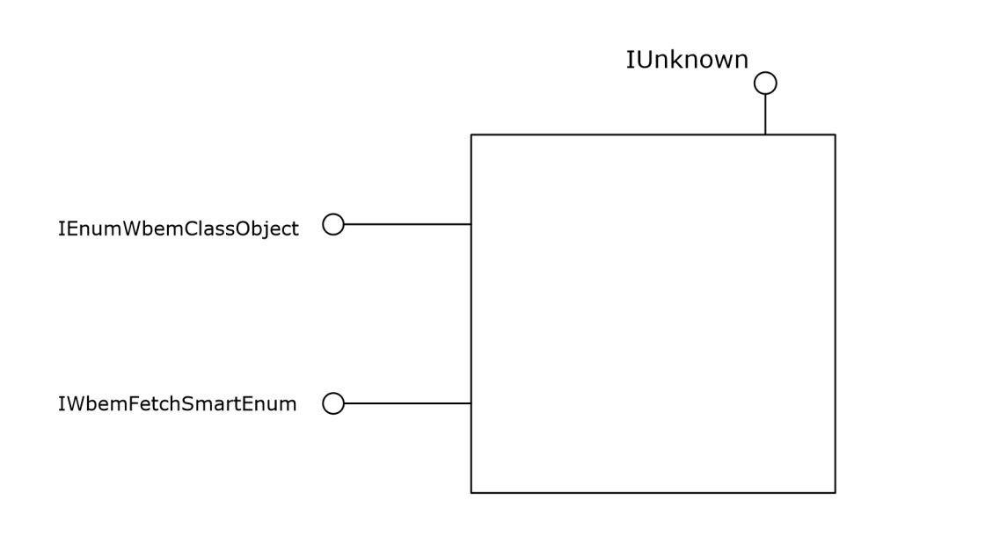
<!-- /Extracted images from page 119 -->

Method

Description

CIM objects.

Opnum: 7

An IEnumWbemClassObject interface object MUST be returned by IWbemServices::CreateClassEnum,
IWbemServices::CreateInstanceEnum, or IWbemServices::ExecQuery,
IWbemServices::ExecNotificationQuery, as specified in IWbemServices section 3.1.4.3.

The object that exports this interface MUST implement the IWbemFetchSmartEnum interface. The
IRemUnknown and IRemUnknown2 interfaces, as specified in [MS-DCOM], MUST be used to manage
the interfaces exposed by the object.

Figure 6: IEnumWbemClassObject interface

3.1.4.4.1 IEnumWbemClassObject::Reset (Opnum 3)

When the IEnumWbemClassObject::Reset method is invoked, the server MUST reset the enumeration
sequence to the beginning of the collection of CIM objects.

 HRESULT Reset();

This method has no parameters.

Return Values: This method MUST return an HRESULT value that MUST indicate the status of the

method call. The server MUST return WBEM_S_NO_ERROR (specified in section 2.2.11) to indicate
the successful completion of the method. If the IEnumWbemClassObject::Reset method is invoked
on an enumerator that does not support reset capability, the server MUST return
WBEM_E_INVALID_OPERATION.

WBEM_S_NO_ERROR (0x00)

The server MUST locate the entry in EnumWbemClassObjectTable with
EnumWbemClassObjectPointer matching IEnumWbemClassObject.

[MS-WMI] - v20240423
Windows Management Instrumentation Remote Protocol
Copyright © 2024 Microsoft Corporation
Release: April 23, 2024

119 / 234

The server MUST validate that the security principal that makes the call is the same as the
ClientSecurityContext of the SemiSinkResultSetObject pointed to by the entry in the
EnumWbemClassObjectTable; otherwise, WBEM_E_ACCESS_DENIED MUST be returned.

In response to the IEnumWbemClassObject::Reset method, the server MUST reset the status of the
enumeration (as specified in this section) if the enumerator is not created by using
WBEM_FLAG_FORWARD_ONLY by setting the CurrentIndex entry in EnumWbemClassObjectTable
to start the index of ResultArray.

If the enumerator is created by using WBEM_FLAG_FORWARD_ONLY, the server MUST return
WBEM_E_INVALID_OPERATION.

A successful method execution MUST return WBEM_S_NO_ERROR.

A failed method execution MUST return an error in the format that is specified in section 2.2.11.

3.1.4.4.2 IEnumWbemClassObject::Next (Opnum 4)

When the IEnumWbemClassObject::Next method is invoked, the server MUST get zero or more CIM
objects starting at the current position in an enumeration. The server MUST also move the current
position by the number of CIM objects in the uCount parameter. When IEnumWbemClassObject is
created, the current position MUST be set on the first CIM object of the collection. The order of the
CIM objects that are stored in the enumerator is arbitrary.

 HRESULT Next(
   [in] long lTimeout,
   [in] ULONG uCount,
   [out, size_is(uCount), length_is(*puReturned)]
     IWbemClassObject** apObjects,
   [out] ULONG* puReturned
 );

lTimeout: MUST be the maximum amount of time, in milliseconds, that the

IEnumWbemClassObject::Next method call allows to pass before it times out. If the constant
WBEM_INFINITE (0xFFFFFFFF) is specified, the call MUST wait until one or more CIM objects are
available. If the value 0x0 (WBEM_NO_WAIT) is specified, the call MUST return the available CIM
objects, if any, at the time the call is made, and MUST NOT wait for any more objects.

uCount: MUST be the number of requested CIM objects to return.

apObjects: MUST be a pointer to an array of IWbemClassObject interface pointers. At entry, this

parameter MUST NOT be NULL. Upon return by the server, this parameter can be NULL if a failure
occurs or if there are no results.

puReturned: MUST be a pointer to a ULONG type that receives the number of CIM objects that are

returned. When sent by the client, this parameter MUST NOT be NULL. Upon return by the server,
this parameter value can be zero if a failure occurs or if there are no results.

Return Values: This method MUST return an HRESULT value that MUST indicate the status of the

method call. The server MUST return WBEM_S_NO_ERROR (specified in section 2.2.11) to indicate
the successful completion of the method.

WBEM_S_NO_ERROR (0x00)

The server MUST locate the entry in EnumWbemClassObjectTable with
EnumWbemClassObjectPointer matching IEnumWbemClassObject.

The server MUST validate that the security principal that makes the call is the same as the
ClientSecurityContext of the SemiSinkResultSetObject pointed to by the entry in
EnumWbemClassObjectTable; otherwise, WBEM_E_ACCESS_DENIED MUST be returned.

120 / 234

[MS-WMI] - v20240423
Windows Management Instrumentation Remote Protocol
Copyright © 2024 Microsoft Corporation
Release: April 23, 2024

In response to the IEnumWbemClassObject::Next method call, the server MUST evaluate the uCount
and lTimeout parameters (as specified in this section) and MUST return the requested number of CIM
objects, if any are available. The server MUST perform the operation within the time allowed by
lTimeout.

If the earlier semisynchronous operation is finished, and if the server does not have the requested
number of CIM objects, the server MUST return WBEM_S_FALSE with the available CIM objects;
otherwise, WBEM_S_NO_ERROR is returned with the requested number of CIM objects. The current
index position pointed to by the CurrentIndex entry in EnumWbemClassObjectTable MUST be
incremented with the number of CIM objects returned.

If the earlier semisynchronous operation is not finished and the server does not have the requested
number of CIM objects, the method MUST wait the amount of time in lTimeout for the operation to
finish or for the availability of the requested number of objects, whichever is earlier. The server MUST
fill the output parameters of the method as specified previously. If the number of the remaining CIM
objects to be given to the client is less than the number of requested CIM objects, the server MUST
return WBEM_S_TIMEDOUT; otherwise, WBEM_S_NO_ERROR is returned. The current index position
pointed to by the CurrentIndex entry in EnumWbemClassObjectTable MUST be incremented with
the number of CIM objects returned.

If the original semisynchronous operation fails, the server MUST return the error code that the
original method would have returned in its synchronous version.

The failed method execution MUST set the value that is referenced by the output parameters to NULL
and MUST return an error in the format that is specified in section 2.2.11.

3.1.4.4.3 IEnumWbemClassObject::NextAsync (Opnum 5)

The IEnumWbemClassObject::NextAsync method is the asynchronous version of the
IEnumWbemClassObject::Next method. It provides controlled asynchronous retrieval of CIM objects
to a sink. The server MUST asynchronously get one or more CIM objects, starting at the current
position in an enumeration, and MUST move the current position by the number of CIM objects. When
IEnumWbemClassObject is created, the current position MUST be set on the first CIM object of the
collection. The order of the CIM objects that are stored in the enumerator is arbitrary.

 HRESULT NextAsync(
   [in] ULONG uCount,
   [in] IWbemObjectSink* pSink
 );

uCount: MUST be the number of CIM objects being requested.

pSink: MUST be a pointer to the IWbemObjectSink interface, which MUST represent the sink to

receive the CIM object. As each batch of CIM objects is requested, they MUST be delivered to the
IWbemObjectSink::Indicate method to which pSink points (as specified in section 3.1.4.2.1) and
MUST be followed by a final call to the IWbemObjectSink::SetStatus method to which pSink
points, as specified in section 3.1.4.2.2. This parameter MUST NOT be NULL. In error cases,
indicated by the HRESULT return value, the supplied IWbemObjectSink interface pointer MUST
NOT be used by the server.

Return Values: This method MUST return an HRESULT value that MUST indicate the status of the

method call. The server MUST return WBEM_S_NO_ERROR (specified in section 2.2.11) to indicate
the successful completion of the method.

WBEM_S_NO_ERROR (0x00)

The server MUST locate the entry in EnumWbemClassObjectTable with
EnumWbemClassObjectPointer matching IEnumWbemClassObject.

121 / 234

[MS-WMI] - v20240423
Windows Management Instrumentation Remote Protocol
Copyright © 2024 Microsoft Corporation
Release: April 23, 2024

The server MUST validate that the security principal that makes the call is the same as the
ClientSecurityContext of the SemiSinkResultSetObject pointed to by the entry in the
EnumWbemClassObjectTable; otherwise, WBEM_E_ACCESS_DENIED MUST be returned.

The server MUST serialize execution of the IEnumWbemClassObject::Next call and asynchronous
execution of the IEnumWbemClassObject::NextAsync call, the IEnumWbemClassObject::Reset call,
and the IEnumWbemClassObject::Clone call.

In response to IEnumWbemClassObject::NextAsync, the server MUST synchronously evaluate the
uCount parameter as specified in this section. If the uCount parameter value is zero, the server MUST
return WBEM_S_FALSE. If the uCount parameter value is greater than zero, the server MUST add a
record in SinkQueue of an entry in EnumWbemClassObjectTable for this operation. The new
record in SinkQueue will store a reference to pSink in WbemObjectSinkPointer and store the
requested count in RemainingRequestCount.

The failed method execution MUST return an error in the format specified in section 2.2.11.

If the method succeeds, the server MUST wait asynchronously until either the
SemiSinkResultSetObject contains RemainingRequestCount objects starting at CurrentIndex,
or its OperationFinished flag is set to true, or the enumeration encounters an error. At that time:





If the enumeration encountered an error, the server MUST deliver the error to the client by calling
IWbemObjectSink::SetStatus.

If the enumeration finished with fewer than the requested number of objects, the server MUST
deliver them to the client by calling the IWbemObjectSink::Indicate method and then indicate
completion by calling IWbemObjectSink::SetStatus with status WBEM_S_FALSE.

  Otherwise, the server MUST deliver RemainingRequestCount objects to the client by calling the

IWbemObjectSink::Indicate method and then indicate completion by calling
IWbemObjectSink::SetStatus with status WBEM_S_NO_ERROR.

The current index position pointed to by CurrentIndex in an entry of EnumWbemClassObjectTable
MUST be incremented by the number of CIM objects delivered to the client.

Finally, the server MUST remove the entry from SinkQueue.

3.1.4.4.4 IEnumWbemClassObject::Clone (Opnum 6)

The IEnumWbemClassObject::Clone method makes a logical copy of the entire enumerator. The
cloned enumerator MUST have the same current position as the source enumerator.

 HRESULT Clone(
   [out] IEnumWbemClassObject** ppEnum
 );

ppEnum: Upon return, MUST contain a pointer to an IEnumWbemClassObject interface CIM object
that is a logical copy of the entire enumerator that made the Clone method call, retaining the
current position in an enumeration. This parameter MUST NOT be NULL. When returned by the
server, this parameter can be NULL if a failure occurred or if there are no results.

Return Values: This method MUST return an HRESULT value that MUST indicate the status of the

method call. The server MUST return WBEM_S_NO_ERROR (specified in section 2.2.11) to indicate
the successful completion of the method.

WBEM_S_NO_ERROR (0x00)

The server MUST locate the entry in EnumWbemClassObjectTable with
EnumWbemClassObjectPointer matching the IEnumWbemClassObject.

122 / 234

[MS-WMI] - v20240423
Windows Management Instrumentation Remote Protocol
Copyright © 2024 Microsoft Corporation
Release: April 23, 2024

The server MUST validate that the security principal that makes the call is the same as the
ClientSecurityContext of the SemiSinkResultSetObject pointed to by the entry in
EnumWbemClassObjectTable; otherwise, WBEM_E_ACCESS_DENIED MUST be returned.

If the earlier semisynchronous operation is created by using WBEM_FLAG_FORWARD_ONLY, then
IEnumWbemClassObject::Clone is not supported and the server MUST return
WBEM_E_INVALID_OPERATION.

The server MUST serialize execution of IEnumWbemClassObject::Next call, asynchronous callbacks
related to IEnumWbemClassObject::NextAsync call, IEnumWbemClassObject::Reset call, and
IEnumWbemClassObject::Clone call.

As part of IEnumWbemClassObject::Clone, the server MUST create a new IEnumWbemClassObject
enumerator as follows. Create a new entry in the EnumWbemClassObjectTable and store a
reference to the newly created enumerator in EnumWbemClassObjectPointer. The new entry in
EnumWbemClassObjectTable will copy the current pointer index value from the earlier enumerator.
The new entry ResultSetPointer will point to SemiSinkResultSetObject that was created as part of
an earlier semisynchronous operation and increment the RefCount of SemiSinkResultSetObject by
one.

The successful method execution MUST fill the ppEnum parameter with an IEnumWbemClassObject
interface pointer, as specified in section 3.1.4.4, which MUST be a copy of the source enumerator
that retains the current position in an enumeration. The method MUST return WBEM_S_NO_ERROR.

If the original semisynchronous operation fails, the server MUST return the error code that the original
method would have returned in its synchronous version.

The failed method execution MUST return an error in the format that is specified in section 2.2.11.

3.1.4.4.5 IEnumWbemClassObject::Skip (Opnum 7)

When the IEnumWbemClassObject::Skip method is invoked, the server MUST move the current
position in an enumeration ahead by a specified number of CIM objects.

The IEnumWbemClassObject::Skip method opnum equals 7.

 HRESULT Skip(
   [in] long lTimeout,
   [in] ULONG nCount
 );

lTimeout: MUST be the maximum amount of time, in milliseconds, that the call to Skip allows to pass
before it times out. If the constant WBEM_INFINITE (0xFFFFFFFF) is used, the Skip method call
waits until the operation succeeds.

nCount: MUST be the number of CIM objects to skip in the enumeration. If this parameter is greater

than the number of CIM objects that remain to enumerate, the call MUST skip to the end of the
enumeration, and WBEM_S_FALSE MUST be the returned value for the method.

Return Values: This method MUST return an HRESULT value that MUST indicate the status of the

method call. The server MUST return WBEM_S_NO_ERROR (specified in section 2.2.11) to indicate
the successful completion of the method.

WBEM_S_NO_ERROR (0x00)

The server MUST locate the entry in EnumWbemClassObjectTable with
EnumWbemClassObjectPointer matching IEnumWbemClassObject.

[MS-WMI] - v20240423
Windows Management Instrumentation Remote Protocol
Copyright © 2024 Microsoft Corporation
Release: April 23, 2024

123 / 234

The server MUST validate that the security principal that makes the call is the same as the
ClientSecurityContext of the SemiSinkResultSetObject pointed to by the entry in
EnumWbemClassObjectTable; otherwise, WBEM_E_ACCESS_DENIED MUST be returned.

In response to the IEnumWbemClassObject::Skip method, the server MUST evaluate the uCount and
lTimeout parameters as specified in this section. The server MUST skip the requested number of CIM
objects from the result set. The server MUST complete the operation within the time allowed by
lTimeout. The requested number of CIM objects MUST start from the current index position. The
current index position in the enumeration MUST be incremented by the number of CIM objects
skipped.

If the earlier semisynchronous operation is finished and the server does not have the requested
number of CIM objects to skip, the server MUST return WBEM_S_FALSE by skipping the available CIM
objects; otherwise, the server MUST return WBEM_S_NO_ERROR by skipping the requested number of
CIM objects. The current index position pointed to by the CurrentIndex entry in
EnumWbemClassObjectTable MUST be incremented with the number of CIM objects skipped.

If the earlier semisynchronous operation is not finished and the server does not have the requested
number of CIM objects to skip, this method MUST wait for lTimeout, or for the operation to finish, or
for availability of the requested number of objects, whichever is earliest. If the number of the
remaining CIM objects to be skipped is less than the number requested, the server MUST return
WBEM_S_TIMEDOUT; otherwise, the server MUST return WBEM_S_NO_ERROR. The current index
position pointed to by the CurrentIndex entry in EnumWbemClassObjectTable MUST be
incremented with the number of CIM objects skipped.

If the original semisynchronous operation fails, the server MUST return the error code that the
original method would have returned in its synchronous version.

The failed method execution MUST return an error in the format that is specified in section 2.2.11.

3.1.4.5  IWbemCallResult Interface

The IWbemCallResult interface MUST be used to return call results from semisynchronous calls that
return a single CIM object. The interface MUST be implemented by the server. The interface MUST be
uniquely identified by UUID {44aca675-e8fc-11d0-a07c-00c04fb68820}.

Methods in RPC Opnum Order

Method

Description

GetResultObject

Causes the server to attempt to retrieve a CIM object from a previous semisynchronous call
to the IWbemServices::GetObject method or IWbemServices::ExecMethod method.

Opnum: 3

GetResultString

Causes the server to return the assigned CIM path of a CIM instance that was created by
the IWbemServices::PutInstance method.

Opnum: 4

GetResultServices  Causes the server to retrieve a pointer to the IWbemServices interface that results from a

semisynchronous call to the IWbemServices::OpenNamespace method.

Opnum: 5

GetCallStatus

Causes the server to return the status of the current outstanding semisynchronous call.

Opnum: 6

3.1.4.5.1 IWbemCallResult::GetResultObject (Opnum 3)

[MS-WMI] - v20240423
Windows Management Instrumentation Remote Protocol
Copyright © 2024 Microsoft Corporation
Release: April 23, 2024

124 / 234

When the IWbemCallResult::GetResultObject method is called, the server MUST attempt to retrieve a
CIM object from a previous semisynchronous operation call to the IWbemServices::GetObject
method or the IWbemServices::ExecMethod method. The entry in WbemCallResultTable with
WbemCallResultPointer pointing to IWbemCallResult is used to identify the previous
semisynchronous call.

 HRESULT GetResultObject(
   [in] long lTimeout,
   [out] IWbemClassObject** ppResultObject
 );

lTimeout: MUST be the maximum amount of time, in milliseconds, that the call to the

IWbemCallResult::GetResultObject method allows to pass before it times out. If the constant
WBEM_INFINITE (0xFFFFFFFF) is used, the GetResultObject method call MUST wait until the
operation succeeds. If this parameter is set to 0 and the result object is available at the time of
the method call, the object MUST be returned in ppResultObject and WBEM_S_NO_ERROR MUST
also be returned. If this parameter is set to 0 but the result object is not available at the time of
the method call, WBEM_S_TIMEDOUT MUST be returned.

ppResultObject: A pointer to a variable that receives a logical copy of the CIM object when the

semisynchronous operation is complete. A new CIM object MUST NOT be returned on error. When
sent by the client, this parameter value MUST NOT be NULL. Upon return by the server, this
parameter value can be NULL if there is a failure or if there are no results. The caller of this
method MUST call IWbemClassObject::Release on the returned object when the object is no
longer required.

Return Values: This method MUST return an HRESULT value that MUST indicate the status of the

method call. The server MUST return WBEM_S_NO_ERROR (specified in section 2.2.11) to indicate
the successful completion of the method.

WBEM_S_NO_ERROR (0x00)

The server MUST locate the entry in WbemCallResultTable with WbemCallResultPointer matching
IWbemCallResult.

The IWbemCallResult::GetResultObject method MUST be called on the interface obtained in responses
to a previous call to a semisynchronous operation returning an IWbemCallResult interface.

In response to the IWbemCallResult::GetResultObject method, the server MUST wait for the operation
to finish by waiting up to lTimeout for OperationFinished to become TRUE for this operation entry in
WbemCallResultTable. If the operation is finished successfully in lTimeout time, the server MUST
return the CIM object in the ppResultObject parameter by making a logical copy of ResultObject. If
the operation is not finished in lTimeout time, the server MUST return WBEM_S_TIMEDOUT. The
method MUST fail if the method parameters are not valid, as specified earlier in this section, or if the
server is unable to execute the method.

The successful method execution MUST fill ppResultObject with an IWbemClassObject interface
pointer and MUST return WBEM_S_NO_ERROR.

If the operation is not finished in lTimeout time, this method MUST set the value referenced by the
output parameters to NULL and return WBEM_S_TIMEDOUT. The client is allowed to retry the
operation.

If the operation fails within lTimeout time, the server MUST set the value referenced by the output
parameters to NULL and return the error code that the original method would have returned in its
synchronous version in the format specified in section 2.2.11.

3.1.4.5.2 IWbemCallResult::GetResultString (Opnum 4)

125 / 234

[MS-WMI] - v20240423
Windows Management Instrumentation Remote Protocol
Copyright © 2024 Microsoft Corporation
Release: April 23, 2024

When the IWbemCallResult::GetResultString method is called, the server MUST return the assigned
CIM path of a CIM instance that was created by the IWbemServices::PutInstance method that
returned IWbemCallResult in the ppCallResult parameter.

 HRESULT GetResultString(
   [in] long lTimeout,
   [out] BSTR* pstrResultString
 );

lTimeout: MUST be a maximum amount of time, in milliseconds, that the call to GetResultString

allows to pass before timing out. If the constant WBEM_INFINITE (0xFFFFFFFF) is used, the
GetResultString method call MUST wait until the operation succeeds. This parameter MUST NOT be
NULL.

pstrResultString: MUST be a pointer to a BSTR value, which MUST contain the CIM path of the CIM

object instance, which MUST lead to the CIM instance that was created using
IWbemServices::PutInstance. In case of failure of the semisynchronous operation, the
returned string MUST be NULL. When sent by the client, this pointer parameter MUST NOT be
NULL. If the original operation does not return a string, the returned string MUST be NULL.

Return Values: This method MUST return an HRESULT value that MUST indicate the status of the

method call. The server MUST return WBEM_S_NO_ERROR (specified in section 2.2.11) to indicate
the successful completion of the method.

WBEM_S_NO_ERROR (0x00)

The server MUST locate the entry in WbemCallResultTable with WbemCallResultPointer matching
IWbemCallResult. The IWbemCallResult::GetResultString method MUST be called on the interface
obtained in responses to a previous call to a semisynchronous operation returning an IWbemCallResult
interface.

IWbemCallResult::GetResultString MUST be called to obtain the CIM path created after
IWbemServices::PutInstance execution. In response to the IWbemCallResult::GetResultString
method, the server MUST wait for the operation to finish in lTimeout time. The operation is finished
when OperationFinished is TRUE. If the operation is not finished in lTimeout time, the server MUST
return WBEM_S_TIMEDOUT. If the operation is finished successfully in lTimeout time, the server MUST
make a copy of the ResultString in WbemCallResultTable for this operation and return it in the
pstrResultString parameter. The method MUST fail if the method parameters are not valid, as specified
earlier in this section, or if the server is unable to execute the method. If the operation is finished
successfully, and if ResultString is set to NULL, the server MUST return
WBEM_E_INVALID_OPERATION for this method.

The successful method execution MUST fill pstrResultString with a string value of type BSTR and MUST
return WBEM_S_NO_ERROR.

The failed method execution sets the value referenced by the output parameters to NULL and MUST
return an error in the format specified in section 2.2.11. In case the operation is not completed after
lTimeout milliseconds, the server MUST return WBEM_S_TIMEDOUT and MUST allow for further retries
to be made.

If the original semisynchronous operation fails, the IWbemCallResult::GetResultString method MUST
return the error code that the original method would have returned in its synchronous version.

3.1.4.5.3 IWbemCallResult::GetResultServices (Opnum 5)

When the IWbemCallResult::GetResultServices method is called, the server MUST retrieve a pointer to
the IWbemServices interface that results from a semisynchronous call to the
IWbemServices::OpenNamespace method.

126 / 234

[MS-WMI] - v20240423
Windows Management Instrumentation Remote Protocol
Copyright © 2024 Microsoft Corporation
Release: April 23, 2024

 HRESULT GetResultServices(
   [in] long lTimeout,
   [out] IWbemServices** ppServices
 );

lTimeout: MUST be the time, in milliseconds, that the call to GetResultServices allows to pass before
timing out. If the constant WBEM_INFINITE (0xFFFFFFFF) is used, the Skip method call MUST wait
until the operation succeeds.

ppServices: MUST be a pointer to the IWbemServices interface that is requested by the original call

to IWbemServices::OpenNamespace when that interface becomes available. If the
semisynchronous operation fails, the returned parameter MUST be NULL. When sent by the
client, this pointer parameter MUST NOT be NULL. If the original operation does not return an
interface pointer, the returned parameter MUST be NULL.

Return Values: This method MUST return an HRESULT value that MUST indicate the status of the

method call. The server MUST return WBEM_S_NO_ERROR (specified in section 2.2.11) to indicate
the successful completion of the method.

WBEM_S_NO_ERROR (0x00)

The server MUST locate the entry in WbemCallResultTable with WbemCallResultPointer matching
IWbemCallResult. The IWbemCallResult::GetResultServices method MUST be called on the interface
that is obtained in response to a previous call to a semisynchronous operation that returns an
IWbemCallResult interface.

IWbemCallResult::GetResultServices MUST be called to obtain the IWbemServices interface pointer
that is returned by the IWbemServices::OpenNamespace execution. In response to the
IWbemCallResult::GetResultServices method, the server MUST wait for the operation to finish in
lTimeout time. The operation is finished when OperationFinished is TRUE. If the operation is not
finished in lTimeout time, the server MUST return WBEM_S_TIMEDOUT. If the operation is finished
successfully in lTimeout time, the server MUST return the IWbemServices interface pointer result
stored in ResultService of the operation in the ppServices parameter. The method MUST fail if the
method parameters are not valid, as specified earlier in this section, or if the server is unable to
execute the method.

 The successful method execution MUST fill the ppServices parameter with an IWbemServices
interface pointer and MUST return WBEM_S_NO_ERROR.

The failed method execution sets the value that is referenced by the output parameters to NULL and
MUST return an error in the format that is specified in section 2.2.11. If the operation does not
complete within lTimeout milliseconds, the server MUST return WBEM_S_TIMEDOUT and MUST allow
for further retries to be made.

If the original semisynchronous operation fails, the IWbemCallResult::GetResultServices method MUST
return the error code that the original method would have returned in its synchronous version.

3.1.4.5.4 IWbemCallResult::GetCallStatus (Opnum 6)

When the IWbemCallResult::GetCallStatus method is invoked, the server MUST return the status of
the current outstanding semisynchronous call.

 HRESULT GetCallStatus(
   [in] long lTimeout,
   [out] long* plStatus
 );

[MS-WMI] - v20240423
Windows Management Instrumentation Remote Protocol
Copyright © 2024 Microsoft Corporation
Release: April 23, 2024

127 / 234

lTimeout: MUST be the maximum amount of time, in milliseconds, that the call to GetCallStatus

allows to pass before timing out. If the constant WBEM_INFINITE (0xFFFFFFFF) is used, the Skip
method call waits until the operation succeeds.

plStatus:  MUST be the status of a call to an IWbemServices method if the WBEM_S_NO_ERROR code
is returned for this method. When sent by the client, this parameter MUST NOT be NULL. Upon
return by the server, this parameter can be NULL if there is a failure or if there are no results.

Return Values: This method MUST return an HRESULT value that MUST indicate the status of the

method call. The server MUST return WBEM_S_NO_ERROR (specified in section 2.2.11) to indicate
the successful completion of the method.

WBEM_S_NO_ERROR (0x00)

The server MUST locate the entry in WbemCallResultTable with WbemCallResultPointer matching
IWbemCallResult.

The IWbemCallResult::GetCallStatus method MUST be called on the interface that is obtained in
response to a previous call to a semisynchronous operation that returns an IWbemCallResult
interface.

In response to an IWbemCallResult::GetCallStatus method, the server MUST wait for the operation to
finish in lTimeout time. The operation is finished if OperationFinished becomes TRUE. If the
operation is not finished in lTimeout time, the server MUST return WBEM_S_TIMEDOUT. If the
operation is finished successfully in lTimeout time, the server MUST give the result of the FinalResult
operation in the plStatus parameter. The method MUST fail if the method parameters are not valid, as
specified earlier in this section, or if the server is unable to execute the method.

The successful method execution MUST fill plStatus with the operation status code of the
IWbemServices method operation and MUST return WBEM_S_NO_ERROR.

The failed method execution sets the value that is referenced by the output parameters to NULL and
MUST return an error in the format that is specified in section 2.2.11.

3.1.4.6  IWbemFetchSmartEnum Interface

The IWbemFetchSmartEnum interface (an [MS-DCOM] interface) is a helper interface used to retrieve
a network-optimized enumerator interface. The server MUST fail the IRemUnknown::QueryInterface
operation if the interface is not implemented by the server.

The IWbemFetchSmartEnum is a DCOM Remote Protocol interface. The interface MUST be uniquely
identified by the UUID {1C1C45EE-4395-11d2-B60B-00104B703EFD}.

Methods in RPC Opnum Order

Method

Description

GetSmartEnum  Retrieves an IWbemWCOSmartEnum interface, which is a network-optimized enumerator

interface.

Opnum: 3

3.1.4.6.1 IWbemFetchSmartEnum::GetSmartEnum (Opnum 3)

The IWbemFetchSmartEnum::GetSmartEnum method retrieves an
IWbemWCOSmartEnum (section 3.1.4.7) interface, which is a network-optimized enumerator
interface.

[MS-WMI] - v20240423
Windows Management Instrumentation Remote Protocol
Copyright © 2024 Microsoft Corporation
Release: April 23, 2024

128 / 234

 HRESULT GetSmartEnum(
   [out] IWbemWCOSmartEnum** ppSmartEnum
 );

ppSmartEnum: MUST be a pointer to a network-optimized enumerator interface. This parameter

MUST NOT be NULL. Upon return by the server, this parameter can be NULL if there is a failure or
if there are no results.

Return Values: This method MUST return an HRESULT value that MUST indicate the status of the

method call. The server MUST return WBEM_S_NO_ERROR (specified in section 2.2.11) to indicate
the successful completion of the method.

WBEM_S_NO_ERROR (0x00)

The server MUST locate the associated IEnumWbemClassObject interface pointer in the
EnumWbemClassObjectTable, and validate that the security principal that makes the call is the
same as the ClientSecurityContext of the SemiSinkResultSetObject pointed to by the entry in the
EnumWbemClassObjectTable; otherwise, WBEM_E_ACCESS_DENIED MUST be returned.

In response to the IWbemFetchSmartEnum::GetSmartEnum method, the server MUST return an
IWbemWCOSmartEnum interface in the ppSmartEnum output parameter.

A successful execution MUST return the IWbemWCOSmartEnum interface in the output parameter and
MUST return WBEM_S_NO_ERROR.

The failed method execution MUST set the output parameters to NULL and MUST return an error in the
format specified in section 2.2.11.

3.1.4.7  IWbemWCOSmartEnum Interface

The server MUST implement the IWbemWCOSmartEnum interface if it implements
IWbemFetchSmartEnum::GetSmartEnum. The IWbemWCOSmartEnum interface is intended to provide
an alternate synchronous enumeration of CIM objects for IEnumWbemClassObject.

The interface MUST be uniquely identified by UUID {423EC01E-2E35-11d2-B604-00104B703EFD}.

Methods in RPC Opnum Order

Method  Description

Next

Returns an array of IWbemClassObject interface pointers that are encoded by using the ObjectArray
structure for optimization purposes.

Opnum: 3

3.1.4.7.1 IWbemWCOSmartEnum::Next (Opnum 3)

The IWbemWCOSmartEnum::Next method MUST return an array of IWbemClassObject interface
pointers that are encoded by using the ObjectArray structure for optimization purposes. The array of
objects that are returned in the ObjectArray structure MUST be identical to the array of CIM objects
that are returned by IEnumWbemClassObject::Next.

 HRESULT Next(
   [in] REFGUID proxyGUID,
   [in] long lTimeout,
   [in] ULONG uCount,
   [out] ULONG* puReturned,

[MS-WMI] - v20240423
Windows Management Instrumentation Remote Protocol
Copyright © 2024 Microsoft Corporation
Release: April 23, 2024

129 / 234

   [out] ULONG* pdwBuffSize,
   [out, size_is(,*pdwBuffSize)] byte** pBuffer
 );

proxyGUID: MUST be a client-generated GUID that MUST identify the client. This parameter MUST

NOT be NULL.

lTimeout: MUST be the maximum amount of time, in milliseconds, that the Next method call allows
to pass before it times out. If the constant WBEM_INFINITE (0xFFFFFFFF) is used, the Skip
method call waits until the operation succeeds. This parameter MUST NOT be NULL.

uCount: MUST be the number of requested CIM objects. This parameter MUST NOT be NULL.

puReturned: MUST be a pointer to a ULONG value that MUST contain the number of CIM objects that

are returned by the Next method. This parameter MUST NOT be NULL.

pdwBuffSize: MUST be a pointer to a ULONG value that MUST contain the buffer size, in bytes. This

parameter MUST NOT be NULL.

pBuffer: MUST be a pointer to the byte array that MUST represent the packet. This parameter MUST

NOT be NULL. The byte array represents an array of CIM objects that are encoded by using the
ObjectArray format as specified in section 2.2.14. When returned by the server, this parameter
can be NULL if a failure occurs or if there are no results to return.

Return Values: This method MUST return an HRESULT value that MUST indicate the status of the

method call. The server MUST return WBEM_S_NO_ERROR (specified in section 2.2.11) to indicate
the successful completion of the method.

If a failure occurs, the server MUST return an HRESULT whose S (severity) bit is set as specified in
[MS-ERREF] section 2.1. The actual HRESULT value is implementation dependent.

WBEM_S_NO_ERROR (0x00)

The IWbemWCOSmartEnum::Next method MUST be called on an IWbemWCOSmartEnum interface
that is returned by a previous call to IWbemFetchSmartEnum::GetSmartEnum.

The server MUST locate the associated IEnumWbemClassObject interface pointer in the
EnumWbemClassObjectTable, and validate that the security principal that makes the call is the
same as the ClientSecurityContext of the SemiSinkResultSetObject pointed to by the entry in the
EnumWbemClassObjectTable; otherwise, WBEM_E_ACCESS_DENIED MUST be returned.

In response to IWbemWCOSmartEnum::Next, the server MUST evaluate the lTimeout parameter (as
specified in this section) and MUST evaluate the GUID in order to identify the client. The server MUST
return the maximum number of CIM objects that are requested by uCount.

If the server is unable to return all the requested CIM objects in the requested amount of time, it
MUST return WBEM_S_TIMEDOUT. The requested number of CIM objects MUST start from the current
index position. The current index position in the enumeration MUST be incremented by the number of
returned CIM objects.

On success, the server MUST return data in the pBuffer by using an ObjectArray structure as specified
in section 2.2.14.

The successful method execution MUST return WBEM_S_NO_ERROR. If the number of remaining CIM
objects to be retrieved is less than the number of requested CIM objects, the server MUST return
WBEM_S_FALSE. Regardless, the server MUST fill the output parameters of the method as specified in
section 2.2.14.

[MS-WMI] - v20240423
Windows Management Instrumentation Remote Protocol
Copyright © 2024 Microsoft Corporation
Release: April 23, 2024

130 / 234

3.1.4.8  IWbemLoginClientID Interface

This interface is not required for the protocol to work.

The interface MUST be uniquely identified by UUID {d4781cd6-e5d3-44df-ad94-930efe48a887}.

Methods in RPC Opnum Order

Method

Description

SetClientInfo  Passes the client NETBIOS name and a unique client generated number to the server.

Opnum: 3

3.1.4.8.1 IWbemLoginClientID::SetClientInfo (Opnum 3)

The IWbemLoginClientID::SetClientInfo method MUST pass the client NETBIOS name and a unique
client-generated number to the server.

 HRESULT SetClientInfo(
   [in, unique, string] LPWSTR wszClientMachine,
   [in] long lClientProcId,
   [in] long lReserved
 );

wszClientMachine: MUST specify the client NETBIOS name. This parameter MUST NOT be NULL.

lClientProcId: Specifies a client-generated number. The server MAY use this for logging

purposes.<56>

lReserved: This parameter is not used, and its value MUST be NULL.

Return Values: This method MUST return an HRESULT value that MUST indicate the status of the

method call. The server MUST return WBEM_S_NO_ERROR (specified in section 2.2.11) to indicate
the successful completion of the method.

In case of failure, the server MUST return an HRESULT whose S (severity) bit is set as specified in
[MS-ERREF] section 2.1. The actual HRESULT value is implementation dependent.

WBEM_S_NO_ERROR (0x00)

3.1.4.9  IWbemLoginHelper Interface

The server MUST fail the IRemUnknown::QueryInterface operation if the interface is not implemented
by the server. This interface is not required for the protocol to work.

The interface MUST be uniquely identified by UUID {541679AB-2E5F-11d3-B34E-00104BCC4B4A}.

Methods in RPC Opnum Order

Method  Description

SetEvent  Signals an event on the server with name that MUST be specified as a parameter of the method.

Opnum: 3

[MS-WMI] - v20240423
Windows Management Instrumentation Remote Protocol
Copyright © 2024 Microsoft Corporation
Release: April 23, 2024

131 / 234

3.1.4.9.1 IWbemLoginHelper::SetEvent (Opnum 3)

The IWbemLoginHelper::SetEvent MUST return WBEM_S_NO_ERROR. The SetEvent method SHOULD
NOT perform any action.<57>

The opnum of the SetEvent method equals 3.

 HRESULT SetEvent(
   [in] LPCSTR sEventToSet
 );

sEventToSet: MUST contain the name of the event to be signaled. This parameter MUST NOT be

NULL.

Return Values: This method MUST return an HRESULT value that MUST indicate the status of the

method call. The server MUST return WBEM_S_NO_ERROR (specified in section 2.2.11) to indicate
the successful completion of the method.

If the method fails, the server MUST return an HRESULT whose S (severity) bit is set as specified
in [MS-ERREF] section 2.1. The actual HRESULT value is implementation dependent.

WBEM_S_NO_ERROR (0x00)

3.1.4.10

IWbemBackupRestore Interface

The IWbemBackupRestore interface exposes methods that back up and restore the contents of the
CIM database. The interface MUST be implemented by the server to support backup/restore
scenarios. The interface MUST be uniquely identified by UUID {C49E32C7-BC8B-11d2-85D4-
00105A1F8304}.

Methods in RPC Opnum Order

Method  Description

Backup

Causes the server to back up the contents of the CIM database.

Opnum: 3

Restore

Causes the server to restore the contents of the CIM database.

Opnum: 4

The object exporting this interface MUST also implement the IWbemBackupRestoreEx interface. The
IRemUnknown and IRemUnknown2 interfaces, as specified in [MS-DCOM], MUST be used to manage
the interfaces exposed by the object. The object MUST be uniquely identified with CLSID {C49E32C6-
BC8B-11D2-85D4-00105A1F8304}.

[MS-WMI] - v20240423
Windows Management Instrumentation Remote Protocol
Copyright © 2024 Microsoft Corporation
Release: April 23, 2024

132 / 234

<!-- Extracted images from page 133 -->
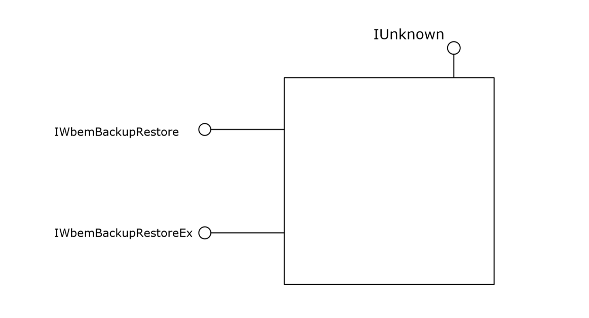
<!-- /Extracted images from page 133 -->

Figure 7: The IWbemBackupRestore interface

3.1.4.10.1

IWbemBackupRestore::Backup (Opnum 3)

On the IWbemBackupRestore::Backup method invocation, the server MUST back up the contents of
the CIM database.

 HRESULT Backup(
   [in, string] LPCWSTR strBackupToFile,
   [in] long lFlags
 );

strBackupToFile: MUST be a UTF-16 string, which MUST contain the name of the file to which the

CIM database is backed up. This parameter MUST NOT<58> be NULL.

lFlags:  This parameter is not used, and its value MUST be 0x0.

Return Values: This method MUST return an HRESULT value that MUST indicate the status of the

method call. The server MUST return WBEM_S_NO_ERROR (specified in section 2.2.11) to indicate
the successful completion of the method.

In case of failure, the server MUST return an HRESULT whose S (severity) bit is set as specified in
[MS-ERREF] section 2.1. The actual HRESULT value is implementation dependent.

WBEM_S_NO_ERROR (0x00)

The IWbemBackupRestore::Backup method MUST be called on the interface that is obtained from the
DCOM Remote Protocol activation of a CLSID_WbemBackupRestore interface, as specified in this
section.

In response to the IWbemBackupRestore::Backup method, the server MUST set the
BackupInProgress flag to True. The server MUST back up the CIM database in a file that is specified
in the strBackupToFile parameter. The server SHOULD<59> verify that the security principal
making the call is allowed to back up the CIM database using implementation-specific authorization
policy. If the security principal is not authorized, the server MUST return WBEM_E_ACCESS_DENIED.

[MS-WMI] - v20240423
Windows Management Instrumentation Remote Protocol
Copyright © 2024 Microsoft Corporation
Release: April 23, 2024

133 / 234

The Backup operation MUST NOT impact the state of the incoming calls. After the Backup operation is
complete, the server MUST set the BackupInProgress flag to False.

3.1.4.10.2

IWbemBackupRestore::Restore (Opnum 4)

On the IWbemBackupRestore::Restore method invocation, the server MUST restore the contents of
the CIM database.

 HRESULT Restore(
   [in, string] LPCWSTR strRestoreFromFile,
   [in] long lFlags
 );

strRestoreFromFile: MUST be a UTF-16 string that MUST contain the name of the file from which to

restore the CIM database. This parameter MUST NOT<60> be NULL.

lFlags: Flags that affect the behavior of the Restore method. The flags' behavior MUST be interpreted

as specified in the following table.

Value

Meaning

WBEM_FLAG_BACKUP_RESTORE_FORCE_SHUTDOWN

0x00000001

If the bit is not set and if there are any active
clients, the server MUST NOT perform the
restore.

If the bit is set, the server MUST shut down
any active clients before performing the
restore operation.

Return Values: This method MUST return an HRESULT value that MUST indicate the status of the

method call. The server MUST return WBEM_S_NO_ERROR (specified in section 2.2.11) to indicate
the successful completion of the method.

If the WBEM_FLAG_BACKUP_RESTORE_FORCE_SHUTDOWN flag is not set, the server MUST
return WBEM_E_INVALID_PARAMETER.

In case of failure, the server MUST return an HRESULT whose S (severity) bit is set as specified in
[MS-ERREF] section 2.1. The actual HRESULT value is implementation dependent.

WBEM_S_NO_ERROR (0x00)

In response to the IWbemBackupRestore::Restore method, the server MUST set the
RestoreInProgress flag to True. The server MUST go through each entry in
NamespaceConnectionTable and delete the corresponding NamespaceConnection object. The
server MUST restore the CIM database from the file that is specified in the strRestoreFromFile
parameter. The server SHOULD<61> verify that the security principal making the call is allowed to
restore the CIM database using implementation-specific authorization policy. If the security principal is
not authorized, the server MUST return WBEM_E_ACCESS_DENIED.

The server MUST re-initialize the NamespaceConnectionTable with NamespaceConnection
objects after the CIM database restoration is complete.

After the Restore operation is complete, the server MUST reset the RestoreInProgress flag to False.

3.1.4.11

IWbemBackupRestoreEx Interface

The IWbemBackupRestoreEx interface extends the IWbemBackupRestore interface and exposes
methods that pause and resume the activity in the Windows Management Instrumentation Remote
Protocol. These methods are used to provide an alternative solution for backing up the contents of the

134 / 234

[MS-WMI] - v20240423
Windows Management Instrumentation Remote Protocol
Copyright © 2024 Microsoft Corporation
Release: April 23, 2024

CIM database. The interface MUST be implemented in order to support backup/restore scenarios
without stopping the server. The server SHOULD support this interface.<62>

The IWbemBackupRestoreEx interface is a DCOM Remote Protocol interface (as specified in [MS-
DCOM]). The interface MUST be uniquely identified by UUID {A359DEC5-E813-4834-8A2A-
BA7F1D777D76}.

Methods in RPC Opnum Order

Method  Description

Pause

Causes the server to lock the CIM database in a consistent state while it is copied.

Opnum: 5

Resume  Causes the server to unlock the CIM database and resume operations.

Opnum: 6

3.1.4.11.1

IWbemBackupRestoreEx::Pause (Opnum 5)

On the IWbemBackupRestoreEx::Pause method invocation, the server MUST set the IsServerPaused
flag to True and MUST persist the CIM database in a consistent state.

 HRESULT Pause();

This method has no parameters.

Return Values: This method MUST return an HRESULT value that MUST indicate the status of the

method call. The server MUST return WBEM_S_NO_ERROR (specified in section 2.2.11) to indicate
the successful completion of the method.

If Pause is called and the IsServerPaused flag is set to True, the server MUST return
WBEM_E_INVALID_OPERATION. In case of any other failure, the server MUST return an HRESULT
whose S (severity) bit is set as specified in [MS-ERREF] section 2.1. The actual HRESULT value is
implementation dependent.

WBEM_S_NO_ERROR (0x00)

The IWbemBackupRestoreEx::Pause method MUST be called on the interface that is obtained from the
DCOM Remote Protocol activation of the CLSID_WbemBackupRestore interface, as specified in this
section.

The server MUST NOT reset the backup timer if Pause is called multiple times while the
IsServerPaused flag is set to True.

3.1.4.11.2

IWbemBackupRestoreEx::Resume (Opnum 6)

On the IWbemBackupRestoreEx::Resume method invocation, the server MUST set the
IsServerPaused flag to False.

 HRESULT Resume();

This method has no parameters.

[MS-WMI] - v20240423
Windows Management Instrumentation Remote Protocol
Copyright © 2024 Microsoft Corporation
Release: April 23, 2024

135 / 234

Return Values: This method MUST return an HRESULT value that MUST indicate the status of the
method call. The server MUST return a WBEM_S_NO_ERROR (specified in section 2.2.11) to
indicate the successful completion of the method.

If Resume is called and the IsServerPaused flag is set to False, the server MUST return
WBEM_E_INVALID_OPERATION.

In case of any other failure, the server MUST return an HRESULT whose S (severity) bit is set as
specified in [MS-ERREF] section 2.1. The actual HRESULT value is implementation dependent.

WBEM_S_NO_ERROR (0x00)

3.1.4.12

IWbemRefreshingServices Interface

The IWbemRefreshingServices interface SHOULD<63> be implemented by the server. This interface
(an [MS-DCOM] interface) provides methods that allow clients to get updates of numerous objects in a
single DCOM Remote Protocol method invocation; whereas the IWbemServices interface provides
methods that allow clients to get updates on a class or an instance.

The IWbemRefreshingServices interface requires multiple calls to set up the remote refresher;
however, after the remote refresher is set up, obtaining updates requires only a single call. The
IWbemRefreshingServices interface provides a faster CIM instance refreshing service when updated
data on CIM instances have to be retrieved multiple times.

This interface MUST be uniquely identified by UUID {2C9273E0-1DC3-11d3-B364-00105A1F8177}.

Methods in RPC Opnum Order

Method

Description

AddObjectToRefresher

Adds a CIM instance to the list of CIM objects to be refreshed.

Opnum: 3

AddObjectToRefresherByTemplate  Adds a CIM instance that is identified by its CIM object instance, to the list

of CIM objects to be refreshed.

Opnum: 4

AddEnumToRefresher

Adds all CIM instances of the CIM class name to the list of CIM objects to
be refreshed.

Opnum: 5

RemoveObjectFromRefresher

Removes a CIM instance from the list of CIM instances to be refreshed.

Opnum: 6

GetRemoteRefresher

Retrieves an IWbemRemoteRefresherinterface pointer.

Opnum: 7

ReconnectRemoteRefresher

Restores a set of CIM instances and enumerations to a server refresher.

Opnum: 8

3.1.4.12.1

IWbemRefreshingServices::AddObjectToRefresher (Opnum 3)

The IWbemRefreshingServices::AddObjectToRefresher method MUST add a CIM instance, which is
identified by its CIM path, to the list of CIM instances that can be refreshed.

 HRESULT AddObjectToRefresher(
   [in] _WBEM_REFRESHER_ID* pRefresherId,

[MS-WMI] - v20240423
Windows Management Instrumentation Remote Protocol
Copyright © 2024 Microsoft Corporation
Release: April 23, 2024

136 / 234

   [in, string] LPCWSTR wszPath,
   [in] long lFlags,
   [in] IWbemContext* pContext,
   [in] DWORD dwClientRefrVersion,
   [out] _WBEM_REFRESH_INFO* pInfo,
   [out] DWORD* pdwSvrRefrVersion
 );

pRefresherId: MUST be a pointer to the _WBEM_REFRESHER_ID structure, as specified in section

2.2.21, which identifies the client that is requesting refreshing services. This parameter MUST NOT
be NULL.

wszPath: MUST be a string that MUST contain the CIM path of the CIM instance. This parameter

MUST NOT be NULL.

lFlags: This parameter is not used, and its value SHOULD be 0x0.

pContext: MUST be a pointer to an IWbemContext interface object, which MUST contain additional
information for the server refresher. If pContext is NULL, the parameter MUST be ignored.

dwClientRefrVersion: MUST be the version of the client refresher. This value SHOULD<64> be 0x2.

The server MUST allow all client versions.

pInfo: MUST be an output parameter that MUST return a _WBEM_REFRESH_INFO structure, as
specified in section 2.2.20, which MUST contain refresher information about the CIM instance in
wszPath. It MUST NOT be NULL.

pdwSvrRefrVersion: MUST be an output parameter that MUST be the version of the server

refresher. The value of this parameter SHOULD be 0x1.

Return Values: This method MUST return an HRESULT value that MUST indicate the status of the

method call. The server MUST return WBEM_S_NO_ERROR (specified in section 2.2.11) to indicate
the successful completion of the method.

WBEM_S_NO_ERROR (0x00)

The security principal that makes the call MUST have WBEM_REMOTE_ENABLE and WBEM_ENABLE
accesses to the namespace; otherwise, WBEM_E_ACCESS_DENIED MUST be returned.

In response to IWbemRefreshingServices::AddObjectToRefresher, the server MUST evaluate the CIM
path to the CIM instance and MUST return information to the client to handle the specific CIM instance
as specified in this section.

A successful call to IWbemRefreshingServices::AddObjectToRefresher MUST return
WBEM_S_NO_ERROR and MUST fill the output _WBEM_REFRESH_INFO structure as specified in
section 2.2.20.

The server MUST locate the InstanceProviderId for the instance in wszPath using the algorithm in
section 3.1.4. If InstanceProviderId is not empty and the provider's SupportsRefresher field is
TRUE, the server MUST return the _WBEM_REFRESH_INFO structure that has an m_lType that is
set to _WBEM_REFRESH_INFO_REMOTE, otherwise returning one with m_lType set to
_WBEM_REFRESH_TYPE_NON_HIPERF.

If the server sets m_lType to _WBEM_REFRESH_INFO_REMOTE, the server MUST return an
IWbemRemoteRefresher interface pointer in _WBEM_REFRESH_INFO_REMOTE that is part of
_WBEM_REFRESH_INFO.

If the server sets m_lType to _WBEM_REFRESH_TYPE_NON_HIPERF, the server MUST return a
_WBEM_REFRESH_INFO_NON_HIPERF structure as part of _WBEM_REFRESH_INFO.

[MS-WMI] - v20240423
Windows Management Instrumentation Remote Protocol
Copyright © 2024 Microsoft Corporation
Release: April 23, 2024

137 / 234

In case of failure, the server MUST fill in the _WBEM_REFRESH_INFO structure with 0x0, set its
m_lType member to WBEM_REFRESH_TYPE_INVALID, and return an HRESULT error in the format
that is specified in section 2.2.11.

3.1.4.12.2

IWbemRefreshingServices::AddObjectToRefresherByTemplate (Opnum

4)

The IWbemRefreshingServices::AddObjectToRefresherByTemplate method MUST add a CIM instance,
which is identified by its CIM object instance, to the list of CIM instances to be refreshed.

The AddObjectToRefresherByTemplate method opnum equals 4.

 HRESULT AddObjectToRefresherByTemplate(
   [in] _WBEM_REFRESHER_ID* pRefresherId,
   [in] IWbemClassObject* pTemplate,
   [in] long lFlags,
   [in] IWbemContext* pContext,
   [in] DWORD dwClientRefrVersion,
   [out] _WBEM_REFRESH_INFO* pInfo,
   [out] DWORD* pdwSvrRefrVersion
 );

pRefresherId: MUST be a pointer to the _WBEM_REFRESHER_ID structure, as specified in section

2.2.21, which identifies the client that is requesting refreshing services. This parameter MUST NOT
be NULL.

pTemplate: MUST be a pointer to an IWbemClassObject interface CIM instance that MUST be a

template for the CIM instances to be refreshed by the refresher. This parameter MUST NOT be
NULL.

lFlags: This parameter is not used, and its value SHOULD be 0x0.

pContext: MUST be a pointer to an IWbemContext interface object, which MUST contain additional
information for the server refresher. If pContext is NULL, the parameter MUST be ignored.

dwClientRefrVersion: MUST be the version of the client refresher. This value SHOULD<65> be 0x2.

The server MUST allow all client versions.

pInfo: MUST be an output parameter that returns a _WBEM_REFRESH_INFO structure, as specified in
section 2.2.20, which MUST contain refresher information about the CIM instance in wszPath. This
parameter MUST NOT be NULL.

pdwSvrRefrVersion: MUST be an output parameter that MUST be the version of the server

refresher. The value of this parameter SHOULD be 0x1.

Return Values: This method MUST return an HRESULT value that MUST indicate the status of the

method call. The server MUST return WBEM_S_NO_ERROR (specified in section 2.2.11) to indicate
the successful completion of the method.

WBEM_S_NO_ERROR (0x00)

The security principal that makes the call MUST have WBEM_REMOTE_ENABLE and WBEM_ENABLE
accesses to the namespace; otherwise, WBEM_E_ACCESS_DENIED MUST be returned.

In response to IWbemRefreshingServices::AddObjectToRefresherByTemplate, the server MUST
evaluate the pTemplate parameter that defines the CIM instance, and it MUST return information to
the client to handle the specific CIM instance as specified in this section.

[MS-WMI] - v20240423
Windows Management Instrumentation Remote Protocol
Copyright © 2024 Microsoft Corporation
Release: April 23, 2024

138 / 234

A successful call to IWbemRefreshingServices::AddObjectToRefresherByTemplate MUST return
WBEM_S_NO_ERROR and MUST fill the output _WBEM_REFRESH_INFO structure, as specified in this
section.

The server MUST locate the InstanceProviderId for the instance in wszPath using the algorithm in
section 3.1.4. If InstanceProviderId is not empty and the provider's SupportsRefresher field is
TRUE, the server MUST return the _WBEM_REFRESH_INFO structure that has an m_lType set to
_WBEM_REFRESH_INFO_REMOTE, otherwise returning one with m_lType set to
__WBEM_REFRESH_TYPE_NON_HIPERF.

If the server sets m_lType to _WBEM_REFRESH_INFO_REMOTE, the server MUST return an
IWbemRemoteRefresher interface pointer in _WBEM_REFRESH_INFO_REMOTE that is part of
_WBEM_REFRESH_INFO.

If the server sets m_lType to _WBEM_REFRESH_TYPE_NON_HIPERF, the server MUST return the
_WBEM_REFRESH_TYPE_NON_HIPERF structure as part of _WBEM_REFRESH_INFO.

In case of failure, the server MUST fill in the _WBEM_REFRESH_INFO parameter with 0x0, set its
m_lType member to WBEM_REFRESH_TYPE_INVALID, and return an error in the format that is
specified in section 2.2.11.

3.1.4.12.3

IWbemRefreshingServices::AddEnumToRefresher (Opnum 5)

The IWbemRefreshingServices::AddEnumToRefresher method MUST add all CIM instances that are
identified by the CIM class name to the list of CIM instances to be refreshed.

 HRESULT AddEnumToRefresher(
   [in] _WBEM_REFRESHER_ID* pRefresherId,
   [in, string] LPCWSTR wszClass,
   [in] long lFlags,
   [in] IWbemContext* pContext,
   [in] DWORD dwClientRefrVersion,
   [out] _WBEM_REFRESH_INFO* pInfo,
   [out] DWORD* pdwSvrRefrVersion
 );

pRefresherId: MUST be a pointer to the _WBEM_REFRESHER_ID structure, as specified in section

2.2.21, which identifies the client that is requesting refreshing services. This parameter MUST NOT
be NULL.

wszClass: MUST be a string that MUST contain the enumeration CIM class name. This parameter

MUST NOT be NULL.

lFlags: This parameter is not used, and its value SHOULD be 0x0.

pContext: MUST be a pointer to an IWbemContext interface object, which MUST contain additional

information for the server refresher. If pContext is NULL, the parameter is ignored.

dwClientRefrVersion: MUST be the version of the client refresher. This value SHOULD<66> be 0x2.

The server MUST allow all client versions.

pInfo: MUST be an output parameter that returns a _WBEM_REFRESH_INFO structure, as specified in
section 2.2.20, which MUST contain refresher information about the CIM instance in wszPath. This
parameter MUST NOT be NULL.

pdwSvrRefrVersion: MUST be an output parameter, which MUST be the version of the server

refresher. The value of this parameter SHOULD be 0x1.

[MS-WMI] - v20240423
Windows Management Instrumentation Remote Protocol
Copyright © 2024 Microsoft Corporation
Release: April 23, 2024

139 / 234

Return Values: This method MUST return an HRESULT value that MUST indicate the status of the

method call. The server MUST return WBEM_S_NO_ERROR (specified in section 2.2.11) to indicate
the successful completion of the method.

WBEM_S_NO_ERROR (0x00)

The security principal that makes the call MUST have WBEM_REMOTE_ENABLE and WBEM_ENABLE
accesses to the namespace; otherwise, WBEM_E_ACCESS_DENIED MUST be returned.

In response to IWbemRefreshingServices::AddEnumToRefresher, the server MUST evaluate the
wszClass parameter, and it MUST return information to the client so that the server knows how to
handle the specific class as specified in this section.

This method MUST add all instances of a class, instead of a single instance of a class, as is the case for
the IWbemRefreshingServices::AddObjectToRefresher and
IWbemRefreshingServices::AddObjectToRefresherByTemplate methods.

A successful call to IWbemRefreshingServices::AddEnumToRefresher MUST return
WBEM_S_NO_ERROR and MUST fill the output _WBEM_REFRESH_INFO structure as specified in
section 2.2.20.

The server MUST locate the InstanceProviderId for the class in wszPath using the algorithm in
section 3.1.4. If InstanceProviderId is not empty and the provider's SupportsRefresher field is
TRUE, the server MUST return the _WBEM_REFRESH_INFO structure that has an m_lType that is
set to _WBEM_REFRESH_INFO_REMOTE, otherwise returning one with m_lType set to
_WBEM_REFRESH_TYPE_NON_HIPERF.

If the server sets m_lType to _WBEM_REFRESH_INFO_REMOTE, the server MUST return an
IWbemRemoteRefresher interface pointer in _WBEM_REFRESH_INFO_REMOTE that is part of
_WBEM_REFRESH_INFO.

If the server sets m_lType to _WBEM_REFRESH_TYPE_NON_HIPERF, the server MUST return the
_WBEM_REFRESH_TYPE_NON_HIPERF structure as part of _WBEM_REFRESH_INFO.

In case of failure, the server MUST fill in the _WBEM_REFRESH_INFO structure with 0x0, set m_lType
to WBEM_REFRESH_TYPE_INVALID, and return an error in the format that is specified in section
2.2.11.

3.1.4.12.4

IWbemRefreshingServices::RemoveObjectFromRefresher (Opnum 6)

The IWbemRefreshingServices::RemoveObjectFromRefresher method MUST remove a CIM instance,
which is identified by its CIM path, from the list of CIM instances that can be refreshed.

 HRESULT RemoveObjectFromRefresher(
   [in] _WBEM_REFRESHER_ID* pRefresherId,
   [in] long lId,
   [in] long lFlags,
   [in] DWORD dwClientRefrVersion,
   [out] DWORD* pdwSvrRefrVersion
 );

pRefresherId: MUST be a pointer to the _WBEM_REFRESHER_ID structure, as specified in section

2.2.21, that identifies the client that is requesting refreshing services. This parameter MUST NOT
be NULL.

lId: This parameter MUST be an identifier to the object that is being removed. This parameter MUST

NOT be NULL.

lFlags: This parameter is not used, and its value SHOULD be 0x0.

140 / 234

[MS-WMI] - v20240423
Windows Management Instrumentation Remote Protocol
Copyright © 2024 Microsoft Corporation
Release: April 23, 2024

dwClientRefrVersion: MUST be the version of the client refresher. This value SHOULD<67> be 0x2.

The server MUST allow all client versions.

pdwSvrRefrVersion: MUST be an output parameter, which MUST be the version of the server

refresher. This value SHOULD be 0x1.

Return Values: This method MUST return an HRESULT value that MUST indicate the status of the

method call. If there are no failures, the server MUST always return
WBEM_E_NOT_AVAILABLE.<68>

WBEM_E_NOT_AVAILABLE (0x80041009)

In response to IWbemRefreshingServices::RemoveObjectFromRefresher, the server MUST set
pdwSvrRefrVersion to 0x1 and return WBEM_E_NOT_AVAILABLE.

In case of failure, the server MUST set pdwSvrRefrVersion to 1 and MUST return an error in the
format specified in section 2.2.11.

3.1.4.12.5

IWbemRefreshingServices::GetRemoteRefresher (Opnum 7)

The IWbemRefreshingServices::GetRemoteRefresher method MUST return an IWbemRemoteRefresher
interface pointer. This pointer is needed by the client to refresh objects and enumerations.

 HRESULT GetRemoteRefresher(
   [in] _WBEM_REFRESHER_ID* pRefresherId,
   [in] long lFlags,
   [in] DWORD dwClientRefrVersion,
   [out] IWbemRemoteRefresher** ppRemRefresher,
   [out] GUID* pGuid,
   [out] DWORD* pdwSvrRefrVersion
 );

pRefresherId: MUST be a pointer to the _WBEM_REFRESHER_ID structure, as specified in section

2.2.21, that identifies the client that is requesting refreshing services. This parameter MUST NOT
be NULL.

lFlags: This parameter is not used, and its value SHOULD be 0x0.

dwClientRefrVersion: MUST be the version of the client refresher. This value SHOULD<69> be 0x2.

The server MUST allow all client versions.

ppRemRefresher: MUST be a pointer to an IWbemRemoteRefresher interface pointer that the client

can use to call the IWbemRemoteRefresher::RemoteRefresh method to refresh CIM instances
and enumerations. This parameter MUST NOT be NULL.

pGuid: MUST be an output parameter that MUST be a pointer to a GUID value that MUST identify the

returned refresher object. This parameter MUST NOT be NULL.

pdwSvrRefrVersion: MUST be an output parameter that MUST be the version of the server

refresher. The value of this parameter SHOULD be 0x1.

Return Values: This method MUST return an HRESULT value that MUST indicate the status of the

method call. The server MUST return WBEM_S_NO_ERROR (specified in section 2.2.11) to indicate
the successful completion of the method.

In case of failure, the server MUST return an HRESULT whose S (severity) bit is set as specified in
[MS-ERREF] section 2.1. The actual HRESULT value is implementation dependent.

WBEM_S_NO_ERROR (0x00)

[MS-WMI] - v20240423
Windows Management Instrumentation Remote Protocol
Copyright © 2024 Microsoft Corporation
Release: April 23, 2024

141 / 234

The security principal that makes the call MUST have WBEM_REMOTE_ENABLE and WBEM_ENABLE
accesses to the namespace; otherwise, WBEM_E_ACCESS_DENIED MUST be returned.

The IWbemRefreshingServices::GetRemoteRefresher method evaluates the pRefresherID parameter
and MUST return an IWbemRemoteRefresher interface pointer and a GUID that is randomly generated
by the server in order to identify this interface pointer. The IWbemRefreshingServices interface pointer
MUST have the same value as the one initially returned by the
IWbemRefreshingServices::AddObjectToRefresher,
IWbemRefreshingServices::AddObjectToRefresherByTemplate, or
IWbemRefreshingServices::AddEnumToRefresher method.

A successful call to IWbemRefreshingServices::GetRemoteRefresher MUST return
WBEM_S_NO_ERROR and fill the ppRemRefresher and pGuid fields. The pdwSvrRefrVersion field
is reserved for future use and MUST be set to 0x1.

The returned IWbemRemoteRefresher interface MUST be used in calls to the
IWbemRemoteRefresher::RemoteRefresh and IWbemRemoteRefresher::StopRefreshing methods.

3.1.4.12.6

IWbemRefreshingServices::ReconnectRemoteRefresher (Opnum 8)

The IWbemRefreshingServices::ReconnectRemoteRefresher method MUST restore a set of CIM
instances and enumerations that are passed in apReconnectInfo to a refresher.

 HRESULT ReconnectRemoteRefresher(
   [in] _WBEM_REFRESHER_ID* pRefresherId,
   [in] long lFlags,
   [in] long lNumObjects,
   [in] DWORD dwClientRefrVersion,
   [in, size_is(lNumObjects)] _WBEM_RECONNECT_INFO* apReconnectInfo,
   [in, out, size_is(lNumObjects)]
     _WBEM_RECONNECT_RESULTS* apReconnectResults,
   [out] DWORD* pdwSvrRefrVersion
 );

pRefresherId: MUST be a pointer to the _WBEM_REFRESHER_ID structure, as specified in section

2.2.21, which identifies the client that is requesting refresh services. This parameter MUST NOT be
NULL.

lFlags: This parameter is not used, and its value SHOULD be 0x0.

lNumObjects: MUST be the number of CIM instances that are contained in the apReconnectInfo

array.

dwClientRefrVersion: MUST be the version of the client refresher. This value SHOULD<70> be 0x2.

The server MUST allow all client versions.

apReconnectInfo: MUST be a pointer to the _WBEM_RECONNECT_INFO structure array (specified in
section 2.2.22) that contains a type and a CIM path to the refresher objects. This parameter
MUST NOT be NULL.

apReconnectResults: MUST be a pointer to the _WBEM_RECONNECT_RESULTS structure array,
which MUST contain the identifier for each CIM instance and enumeration, and the success or
failure status of the reconnection. This parameter MUST NOT be NULL.

pdwSvrRefrVersion: MUST be an output parameter that is the version of the server refresher. This

value SHOULD be 0x1.

Return Values: This method MUST return an HRESULT value that MUST indicate the status of the

method call. The server MUST return WBEM_S_NO_ERROR, as specified in section 2.2.11, to
indicate the successful completion of the method.

142 / 234

[MS-WMI] - v20240423
Windows Management Instrumentation Remote Protocol
Copyright © 2024 Microsoft Corporation
Release: April 23, 2024

WBEM_S_NO_ERROR (0x00)

The security principal that makes the call MUST have WBEM_REMOTE_ENABLE and WBEM_ENABLE
accesses to the namespace; otherwise, WBEM_E_ACCESS_DENIED MUST be returned.

The description of IWbemRefreshingServices is specified in IWbemRefreshingServices Interface.

In response to IWbemRefreshingServices::ReconnectRemoteRefresher, the server MUST evaluate the
pRefresherId and apReconnectInfo arrays; and MUST reconnect to the refresher the requested CIM
objects and enumerators that are listed in apReconnectInfo, as specified in this section.

If one of the CIM objects cannot be reconnected, the apReconnectResults element that corresponds to
apReconnectInfo MUST be set with an HRESULT return code.

A successful call to IWbemRefreshingServices::ReconnectRemoteRefresher MUST return
WBEM_S_NO_ERROR and MUST fill the reconnection status in the apReconnectResults array.

In case of failure, the server MUST return an HRESULT value that indicates the status of the method
call. If the failure is due to a class that no longer exists, the server MUST return a
WBEM_E_INVALID_CLASS HRESULT value. If the failure is due to an instance that no longer exists,
the server MUST return a WBEM_E_NOT_FOUND HRESULT value.

Each array element MUST contain a refresher CIM object identifier (the m_lId member of
_WBEM_RECONNECT_RESULTS) that can be used to cancel the object. The m_lId member MUST be a
unique identifier for the refresher object that is used to cancel the refreshing object when the
refresher object is using IWbemRemoteRefresher::StopRefreshing.

3.1.4.13

IWbemRemoteRefresher Interface

The IWbemRemoteRefresher interface (an [MS-DCOM] interface) SHOULD<71> be implemented by
the server. The interface MUST be uniquely identified by UUID {F1E9C5B2-F59B-11d2-B362-
00105A1F8177}.

Methods in RPC Opnum Order

Method

Description

RemoteRefresh

Retrieves the updated set of CIM instances and enumerations configured by an
IWbemRefreshingServices interface pointer.

Opnum: 3

StopRefreshing

Removes a set of CIM instance and enumerations configured by
IWbemRefreshingServices interface pointer.

Opnum: 4

Opnum5NotUsedOnWire  This method is reserved for local use and is not used remotely.

Opnum: 5

3.1.4.13.1

IWbemRemoteRefresher::RemoteRefresh (Opnum 3)

The IWbemRemoteRefresher::RemoteRefresh method MUST return the updated collection of CIM
instances and enumerations previously configured by the IWbemRefreshingServices interface
pointer.

 HRESULT RemoteRefresh(
   [in] long lFlags,
   [out] long* plNumObjects,

[MS-WMI] - v20240423
Windows Management Instrumentation Remote Protocol
Copyright © 2024 Microsoft Corporation
Release: April 23, 2024

143 / 234

   [out, size_is(,*plNumObjects)] WBEM_REFRESHED_OBJECT** paObjects
 );

lFlags: This parameter is not used, and its value MUST be 0x0.

plNumObjects: If successful, plNumObjects MUST be a pointer to the number of CIM instances and

enumerations that the method returns. It MUST NOT be NULL.

If the method fails, the server MUST set plNumObjects to NULL.

paObjects: If successful, paObjects MUST be a pointer to an array of WBEM_REFRESHED_OBJECT
objects specified in section 2.2.15. The array MUST contain CIM instances and enumerations. It
MUST NOT be NULL.

If the method fails, the server MUST set paObjects to NULL.

Return Values: This method MUST return an HRESULT value that MUST indicate the status of the

method call.

The server MUST return WBEM_S_NO_ERROR (specified in section 2.2.11) to indicate the
successful completion of the method.

WBEM_S_NO_ERROR (0x00)

The IWbemRemoteRefresher::RemoteRefresh method MUST be called on the IWbemRemoteRefresher
interface pointer returned as a member of the _WBEM_REFRESH_INFO structure from
IWbemRefreshingServices methods or on the interface returned by
IWbemRefreshingServices::GetRemoteRefresher method invocation.

In response to IWbemRemoteRefresher::RemoteRefresh method, the server MUST read the current
values of all the CIM objects previously added to the set of refreshing objects using
IWbemRefreshingServices methods. The updated values for all CIM objects MUST be encoded into the
output parameter using the format specified in this section.

3.1.4.13.2

IWbemRemoteRefresher::StopRefreshing (Opnum 4)

The IWbemRemoteRefresher::StopRefreshing method MUST remove a set of CIM instances or
enumerations from the collection previously configured by the IWbemRefreshingServices interface
pointer.

 HRESULT StopRefreshing(
   [in] long lNumIds,
   [in, size_is(lNumIds)] long* aplIds,
   [in] long lFlags
 );

lNumIds: MUST be the number of identifiers in the array of object identifiers in the aplIds parameter.

aplIds: MUST be an array of object identifiers that MUST identify the CIM instances and

enumerations to stop refreshing. The object identifier is the m_lCancelId member from the
_WBEM_REFRESH_INFO structure that is specified in section 2.2.20 and MUST be obtained from a
previous call to the IWbemRefreshingServices::AddObjectToRefresher,
IWbemRefreshingServices::AddObjectToRefresherByTemplate, or
IWbemRefreshingServices::AddEnumToRefresher method specified in section 3.1.4.12.

lFlags: This parameter is not used, and its value MUST be 0x0.

[MS-WMI] - v20240423
Windows Management Instrumentation Remote Protocol
Copyright © 2024 Microsoft Corporation
Release: April 23, 2024

144 / 234

Return Values: This method MUST return an HRESULT value that MUST indicate the status of the
method call. In case of success, the server MUST return WBEM_S_NO_ERROR (as specified in
section 2.2.11) to indicate the successful completion of the method.

WBEM_S_NO_ERROR (0x00)

The IWbemRemoteRefresher::StopRefreshing method MUST be called on the IWbemRemoteRefresher
interface pointer that is returned as a member of the _WBEM_REFRESH_INFO structure from the
methods of the IWbemRefreshingServices interface or on the interface that is returned by the
IWbemRefreshingServices::GetRemoteRefresher method invocation.

In response to the IWbemRemoteRefresher::StopRefreshing method, the server MUST remove a list of
CIM objects that were previously added to the set of refreshing objects using the
IWbemRefreshingServices methods. The CIM objects MUST be identified by their identifier, the
m_lCancelId member of the _WBEM_REFRESH_INFO structure that is returned by a previous
IWbemRefreshingServices::AddObjectToRefresher,
IWbemRefreshingServices::AddObjectToRefresherByTemplate, or
IWbemRefreshingServices::AddEnumToRefresher call.

In case of failure the server MUST return an error in the format specified in section 2.2.11.

3.1.4.13.3

IWbemRemoteRefresher::Opnum5NotUsedOnWire (Opnum 5)

The IWbemRemoteRefresher::Opnum5NotUsedOnWire method MUST return a random GUID that
identifies the server object that receives the call.

 HRESULT Opnum5NotUsedOnWire(
   [in] long lFlags,
   [out] GUID* pGuid
 );

lFlags: This parameter is not used, and its value MUST be 0x0.

pGuid:  MUST be an output parameter, which MUST be a pointer to a GUID value that MUST identify

the server object. This parameter MUST NOT be NULL.<72>

Return Values: This method MUST return an HRESULT value that MUST indicate the status of the

method call. The server MUST return WBEM_S_NO_ERROR (specified in section 2.2.11) to indicate
the successful completion of the method.

In case of failure, the server MUST return an HRESULT whose S (severity) bit is set as specified in
[MS-ERREF] section 2.1. The actual HRESULT value is implementation dependent.

3.1.4.14

IWbemShutdown Interface

The IwbemShutdown interface allows the server to notify its subsystems of an impending shutdown.
The interface MUST be uniquely identified by the UUID {F309AD18-D86A-11d0-A075-
00C04FB68820}.

Method

Description

Shutdown  The objects that export this interface MUST be uniquely identified with the CLSID {73E709EA-5D93-
4B2E-BBB0-99B7938DA9E4} or CLSID {1F87137D-0E7C-44d5-8C73-4EFFB68962F2}.

Opnum: 3

[MS-WMI] - v20240423
Windows Management Instrumentation Remote Protocol
Copyright © 2024 Microsoft Corporation
Release: April 23, 2024

145 / 234

<!-- Extracted images from page 146 -->
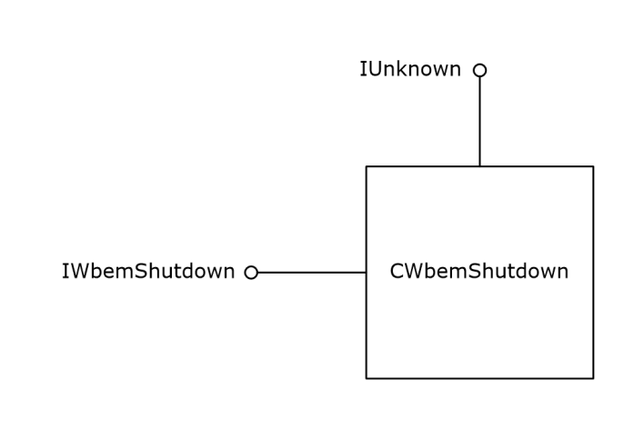
<!-- /Extracted images from page 146 -->

Figure 8: The IWbemShutdown interface

3.1.4.14.1

IWbemShutdown::Shutdown (Opnum 3)

The IWbemShutdown::Shutdown method does not perform any action when called by a remote client.

 HRESULT Shutdown(
   [in] long reserved1,
   [in] ulong reserved2,
   [in] IWbemContext* Reserved3
 );

reserved1: MUST be set to 0 when sent and MUST be ignored on receipt.

reserved2: MUST be set to 0 when sent and MUST be ignored on receipt.

Reserved3: MUST be set to NULL when sent and MUST be ignored on receipt.

Return Values: This method MUST return 0x800706ba RPC Server Unavailable.

3.1.4.15

IUnsecuredApartment Interface

The IUnsecuredApartment interface allows a local client to register a callback for asynchronous remote
operations. The interface MUST be uniquely identified by the UUID {1cfaba8c-1523-11d1-ad79-
00c04fd8fdff}.

Method

Description

CreateObjectStub  The objects that export this interface MUST be uniquely identified with the CLSID

{49bd2028-1523-11d1-ad79-00c04fd8fdff}

Opnum: 3

[MS-WMI] - v20240423
Windows Management Instrumentation Remote Protocol
Copyright © 2024 Microsoft Corporation
Release: April 23, 2024

146 / 234

<!-- Extracted images from page 147 -->
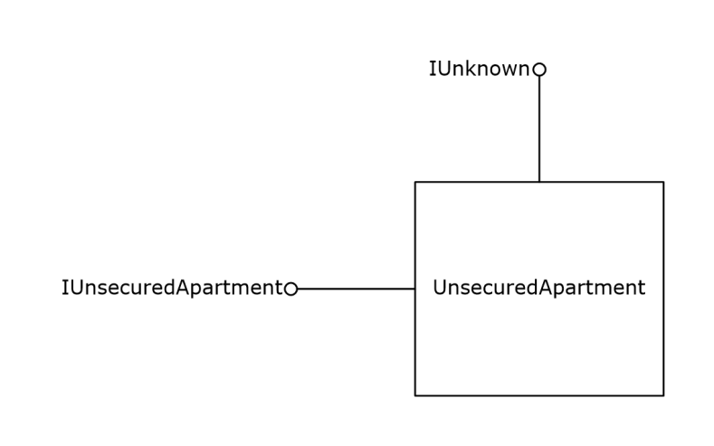
<!-- /Extracted images from page 147 -->

Figure 9: The IUnsecuredApartment interface

3.1.4.15.1

IUnsecuredApartment::CreateObjectStub (Opnum 3)

The IUnsecuredApartment::CreateObjectStub method does not perform any action and returns
E_UNEXPECTED when called by a remote client.

 HRESULT CreateObjectStub(
   [in] IUnknown* reserved1,
   [out] IUnknown* reserved2
 );

reserved1: MUST be set to NULL when sent and MUST be ignored on receipt.

reserved2: MUST be set to NULL when sent and MUST be ignored on receipt.

Return Values: This method MUST return E_UNEXPECTED as specified in [MS-ERREF] section 2.1.

3.1.4.16

IWbemUnsecuredApartment Interface

The IWbemUnsecuredApartment interface allows a local client to register a callback for asynchronous
remote operations. The interface MUST be uniquely identified by the UUID {31739d04-3471-4cf4-
9a7c-57a44ae71956}.

Method

Description

CreateSinkStub  The objects that export this interface MUST be uniquely identified with the CLSID {49bd2028-

1523-11d1-ad79-00c04fd8fdff}.

Opnum: 3

[MS-WMI] - v20240423
Windows Management Instrumentation Remote Protocol
Copyright © 2024 Microsoft Corporation
Release: April 23, 2024

147 / 234

<!-- Extracted images from page 148 -->
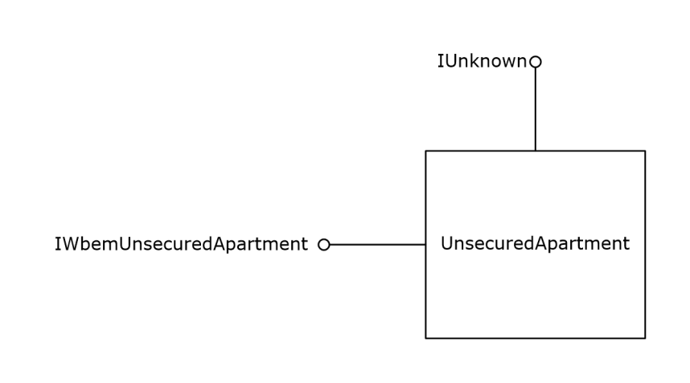
<!-- /Extracted images from page 148 -->

Figure 10: The IWbemUnsecuredApartment interface

3.1.4.16.1

IWbemUnsecuredApartment::CreateSinkStub (Opnum 3)

The IWbemUnsecuredApartment::CreateSinkStub method does not perform any action when called by
a remote client.

 HRESULT CreateSinkStub(
   [in] IWbemObjectSink* reserved1,
   [in] dword reserved2,
   [in, unique] LPCWSTR reserved3,
   [out] IWbemObjectSink** reserved4
 );

reserved1: MUST be set to NULL when sent and MUST be ignored on receipt.

reserved2: MUST be set to 0 when sent and MUST be ignored on receipt.

reserved3: MUST be set to NULL when sent and MUST be ignored on receipt.

reserved4: MUST be set to NULL when sent and MUST be ignored on receipt.

Return Values: This method MUST return E_UNEXPECTED as specified in [MS-ERREF] section 2.1.

3.1.4.17

Abstract Provider Interface

Below are the details of the interface used between CIM server and the providers. The server uses
ProviderEntryPoint stored in ProviderTable for the given provider for performing any operation below.
For sending indications or events to the server, the provider MUST trigger 3.1.6.1.

The server MUST perform the following two processing rules for each invocation of each of the
methods listed below in this section:





Prior to the invocation, the server MUST impersonate the client (the security principal of the caller)
by invoking the abstract interface RpcImpersonateClient as specified in [MS-RPCE] section
3.3.3.4.3.2, passing in NULL as the BindingHandle parameter.

Following invocation, the server MUST stop impersonating the client prior to returning a status
code by invoking the abstract interface RpcRevertToSelf as specified in [MS-RPCE] section
3.3.3.4.3.3.

[MS-WMI] - v20240423
Windows Management Instrumentation Remote Protocol
Copyright © 2024 Microsoft Corporation
Release: April 23, 2024

148 / 234

The provider is expected to use those credentials with IMPERSONATE level impersonation for any
necessary local access checks and remote network operations.

The server communicates asynchronously with the provider. The server creates the
IWbemObjectSink object and passes a pointer to the IWbemObjectSink object to each of the
provider operations through which the provider communicates the results back to the server. The
server then forwards the results to the client. The server deletes the IWbemObjectSink object after
receiving the status of the operation from the provider, or after calling the Cancel operation on the
provider if the client canceled the operation.

The WMI v2 provider SHOULD<73> query the WMI server for data locale for each invocation of the
method on the provider. The provider SHOULD use this locale for formatting decimals in string format
and for representing time and date in string format.

The WMI v2 provider SHOULD<74> query the WMI server for the UI locale for each invocation of the
method on the provider. The provider SHOULD use this locale when providing string output.

3.1.4.17.1

Enumerate Instances of a Given Class

The server passes Class name and a pointer to the IWbemObjectSink object. The provider
communicates the instances through the IWbemObjectSink::Indicate method. After all the
instances are returned or if there is a failure encountered, the provider sends the final status using
IWbemObjectSink::SetStatus method.

3.1.4.17.2

Enumerate the Subclasses of a Given Class

The server passes Class name and a pointer to the IWbemObjectSink object. The provider
communicates the subclasses through the IWbemObjectSink::Indicate method. After all the
subclasses are returned or if there is a failure encountered, the provider sends the final status using
IWbemObjectSink::SetStatus method.

3.1.4.17.3  Get Properties Within an Instance of a Class

The server passes class name, the key property values through the IWbemClassObject instance,
and a pointer to the IWbemObjectSink object to the provider. The provider returns the
IWbemClassObject instance containing the nonkey properties for the given instance through the
IWbemObjectSink::Indicate method. The provider returns WBEM_E_NOT_FOUND through the
IWbemObjectSink::SetStatus method if the instance referred by the key properties is not found.
On success, the provider sends the final status info using the IWbemObjectSink::SetStatus
method.

3.1.4.17.4  Get Properties Within a Class

The server passes the class name and a pointer to an IWbemObjectSink object to the provider. The
provider returns the class metadata through the IWbemClassObject instance containing the
metadata of the given class, through the IWbemObjectSink::Indicate method. The provider returns
WBEM_E_NOT_FOUND through the IWbemObjectSink::SetStatus method if the class is not found.
On success, the provider sends the final status using the IWbemObjectSink::SetStatus method.

3.1.4.17.5  Update Properties Within an Instance of a Class

The server passes Class name, instance information through the IWbemClassObject instance, and a
pointer to the IWbemObjectSink object to the provider. The provider applies the changes to the
managed object and returns success or failure to the server through IWbemObjectSink::SetStatus.

3.1.4.17.6  Update Properties Within a Class

[MS-WMI] - v20240423
Windows Management Instrumentation Remote Protocol
Copyright © 2024 Microsoft Corporation
Release: April 23, 2024

149 / 234

The server passes Class name, updated class metadata through the IWbemClassObject instance,
and a pointer to the IWbemObjectSink object to the provider. The provider applies the changes to
the managed object and returns success or failure to the server through
IWbemObjectSink::SetStatus.

3.1.4.17.7

Create an Instance of a Class

The server passes Class name, instance information through the IWbemClassObject instance, and a
pointer to the IWbemObjectSink object to the provider. The provider applies the changes to the
managed object and returns success or failure to the server through
IWbemObjectSink::SetStatus.

3.1.4.17.8

Create a Class

The server passes Class name, class metadata through the IWbemClassObject instance, and a
pointer to IWbemObjectSink object to the provider. The provider applies the changes to the
managed object and returns success or failure to the server through
IWbemObjectSink::SetStatus.

3.1.4.17.9  Delete an Instance of a Class

The server passes class name, instance information through the IWbemClassObject instance, and a
pointer to the IWbemObjectSink object to the provider. The provider applies the changes to the
managed object and returns success or failure to the server through
IWbemObjectSink::SetStatus.

3.1.4.17.10  Delete a Class

The server passes Class name, class metadata through the IWbemClassObject instance, and a
pointer to the IWbemObjectSink object to the provider. The provider applies the changes to the
managed object and returns success or failure to the server through
IWbemObjectSink::SetStatus.

3.1.4.17.11  Execute a Provider's Method

The server passes Class name, method name, input parameters to the method through the
IWbemClassObject instances, and a pointer to the IWbemObjectSink object  to the provider. Upon
success, the provider returns output parameter values as IWbemClassObject instances, and a
method result (success/failure) to the server through the IWbemObjectSink::Indicate method.

Note  If for a method parameter, the qualifier< IN>/<IN,OUT>/<OUT> is not specified, the server
SHOULD<75> consider the parameter as IN,OUT.

3.1.4.17.12  Cancel an Existing Operation

The server passes the pointer to the IWbemObjectSink object to the provider. The provider cancels
the pending operation corresponding to the given IWbemObjectSink object.

3.1.4.17.13  Subscribe for Event Notification

The server passes RpcImpersonationAccessToken.Sids[UserIndex]) and a pointer to the
IWbemObjectSink object to the provider. The provider performs a security access check on the
client's identity, validating that the client has WBEM_RIGHT_SUBSCRIBE permission. If the provider
does not want to grant access to the client, it returns WBEM_E_ACCESS_DENIED to the server
through IWbemObjectSink::SetStatus.

3.1.4.17.14  Is Dynamic Class Supported

[MS-WMI] - v20240423
Windows Management Instrumentation Remote Protocol
Copyright © 2024 Microsoft Corporation
Release: April 23, 2024

150 / 234

The server passes the namespace and class name to the provider. The provider returns TRUE to
indicate that it supports operations on this class, or FALSE if not.

3.1.4.17.15  Execute Query

The server passes a WQL query and a pointer to the IWbemObjectSink object. The provider
communicates with the matching objects through the IWbemObjectSink::Indicate (section 3.1.4.2.1)
method. After all the matching objects are returned, or if there is a failure encountered, the provider
sends the final status using the IWbemObjectSink::SetStatus (section 3.1.4.2.2) method.

If the provider cannot process the query, then it MUST return WBEM_E_PROVIDER_NOT_CAPABLE.

3.1.4.18

Namespaces

The direct children of a given namespace are represented as instances of the _Namespace class
within the parent namespace. A client with sufficient privilege can query and modify the child
namespaces through operations on the __Namespace instances, as described in the following
subsections.

The namespaces, their corresponding classes and instances, and subnamespaces and their
corresponding classes and instances, MUST be persisted in CIM database.

3.1.4.18.1

Creating Namespaces

When the server receives a request to create a new instance of the __Namespace class, the server
MUST create a child namespace of the current namespace, using the instance's Name field as the
name of the new namespace. A corresponding ClassTable and CIM database entries MUST be
created, defining the system classes specified in section 2.2.31. The InstanceProviderId for each
class MUST be set to NULL. A NamespaceConnection MUST be created for the new namespace and
added to the NamespaceConnectionTable. If the new instance includes the
NamespaceSecuritySDDL qualifier, then the qualifier's value specifies the security descriptor of the
namespace in SDDL format; otherwise, the server MUST include an implementation-dependent default
value for the qualifier.<76>

If there is a parent namespace, the server MUST add access control entries of the parent to the
security descriptor using the algorithm in section 2.2.30.2.

The server MUST generate a __NamespaceCreationEvent event object upon successful creation of
the namespace.

The server MUST set the namespace's RequiresEncryption flag using the semantics described in
section 2.2.30.3.

3.1.4.18.2  Reading Namespace Information

When the server receives a request to get an instance of the __Namespace class, the server MUST
check for the existence of a child namespace (of the current namespace in the IWbemServices
Interface (section 3.1.4.3)) with the same name, returning WBEM_E_NOT_FOUND if none matches.
The RequiresEncryption and NamespaceSecuritySDDL qualifiers MUST be set to the values of the
child namespace's RequiresEncryption flag and security descriptor, respectively.

Similarly, when a client enumerates instances of the __Namespace class, the server MUST return a
set of instances corresponding to the child namespaces of the current namespace.

See Appendix D: Enumerating Class Schema for an example.

3.1.4.18.3  Updating Namespace Information

[MS-WMI] - v20240423
Windows Management Instrumentation Remote Protocol
Copyright © 2024 Microsoft Corporation
Release: April 23, 2024

151 / 234

When the server receives a request to put an instance of the __Namespace class, the server MUST
check for the existence of a child namespace (of the current namespace in the IWbemServices
interface) with the same name, returning WBEM_E_NOT_FOUND if none matches. The server MUST
update the namespace information based on the qualifiers of the received instance, just as during
namespace creation (see section 3.1.4.18.1 for details).

The server MUST generate a __NamespaceModificationEvent event object upon successful
modification of the namespace information.

3.1.4.18.4  Deleting Namespaces

When the server receives a request to delete an instance of the __Namespace class, the server
MUST check for the existence of a child namespace (of the current namespace in the IWbemServices
interface) with the same name, returning WBEM_E_NOT_FOUND if none matches. The server MUST
delete all classes and instances in the child namespace and all descendants from the CIM database.
The server MUST delete the NamespaceConnection objects for each of the namespaces in the
hierarchy and MUST remove the corresponding entries from NamespaceConnectionTable. The
server MUST delete the ClassTable corresponding to each of the namespaces in the hierarchy.

The server MUST generate a __NamespaceDeletionEvent event object upon successful modification
of the namespace information.

3.1.5  Timer Events

The Windows Management Instrumentation Remote Protocol uses four timers:

Sink timer: If the timer expires and the call is not completed, the server MUST cancel the

asynchronous operation for which the timer expired.

Backup Timer: If the timer expires, the server MUST resume operations by simulating

IWbemBackupRestoreEx::Resume and MUST reset the timer to 0.

EventPollingTimer: If the timer expires, the server MUST query for the instances of the underlying
CIM class (for which the notifications are requested) in the corresponding EventFilter in the
EventBindingTable, and store them in CurrInstances (which is array of IWbemClassObject
objects). The server MUST compare CurrInstances to PrevInstances already stored in the
event.







If an instance exists only in CurrInstances and is not present in PrevInstances, and the
FROM clause of the EventFilter has __InstanceCreationEvent, the server MUST prepare an
__InstanceCreationEvent object with the TargetInstance set to new object found in
CurrInstances array.

If an instance only exists in PrevInstances and is not present in CurrInstances, and the
FROM clause of the EventFilter has __InstanceDeletionEvent, the server MUST prepare an
__InstanceDeletionEvent object with the TargetInstance set to old object in
PrevInstances array.

If the instance exists in both the arrays, then the server MUST compare the properties of the
objects. If they are not same and the FROM clause of the EventFilter has
__InstanceModificationEvent, the server MUST prepare an
__InstanceModificationEvent object with the PreviousInstance set to old object in
PrevInstances array and the TargetInstance set to new object found in CurrInstances
array.

The server MUST add each of the above events object prepared to the EventQueue, deliver the
events that have accumulated in the EventQueue (ignoring delivery failures), clear the queue,
move CurrInstances array into PrevInstances array, and restart the timer.

[MS-WMI] - v20240423
Windows Management Instrumentation Remote Protocol
Copyright © 2024 Microsoft Corporation
Release: April 23, 2024

152 / 234

EventGroupingTimer: If the timer expires, the server MUST

1.  Follow the same procedure followed for EventPollingTimer to create the

__InstanceCreationEvent, __InstanceDeletionEvent, and
__InstanceModificationEvent events, and add them to EventGroupAggregateQueue.

2.  Examine the events that have accumulated in the EventGroupAggregateQueue and discard

those that do not match the "HAVING" clause of the filter (if specified).

3.  Deliver the remaining events to the client, ignoring delivery failures.

4.  Clear EventGroupAggregateQueue.

5.  Restart the timer.

3.1.6  Other Local Events

None.

3.1.6.1  Indication Event Is Generated

The server MUST execute the following algorithm for each row of the EventBindingTable.

1.  Check whether the indication matches the EventFilter. If not, then skip to the next row.

2.  If the SECURITY_DESCRIPTOR property of indication is available, check whether client has access
to this indication by Validating the SECURITY_DESCRIPTOR property of the indication against
ClientSecurityContext. If the client does not have access, the server MUST ignore this
indication.

3.  If an EventGroupingTimer exists in this row, search the EventGroupAggregateQueue for an

event that meets the matching criteria specified in the "BY" clause of the filter (or any event, if no
"BY" clause was specified). If no matching event is found, create a new __AggregateEvent with
a copy of the indication in the Representative property and one in the NumberOfEvents property;
otherwise, increment the event's NumberOfEvents property. If the number of rows in the
EventGroupAggregateQueue is more than EventDropLimit, return
WBEM_E_QUEUE_OVERFLOW to the client.  If the EventGroupingTimer is not currently active,
then start it.

4.  Otherwise, if an EventPollingTimer exists in this row, then add the indication to the

EventQueue.  If the number of rows in the EventQueue is more than EventDropLimit, return
WBEM_E_QUEUE_OVERFLOW to the client.

5.  Otherwise, deliver the indication to the client via the EventConsumer interface in that row.

3.1.6.2  Load Provider

The server creates a provider instance and passes namespace name, locale ID,
ProviderArchitectureType, and a pointer to callback into it. If the provider initialization was successful,
the server creates an entry for the given provider in ProviderTable with ProviderEntryPoint as
pointer to the provider instance created above. The server will proceed with the specific client's
request upon successful load of the provider. The error encountered during load will be sent to the
server, and the server terminates the client's request with WBEM_E_PROVIDER_LOAD_FAILURE.

[MS-WMI] - v20240423
Windows Management Instrumentation Remote Protocol
Copyright © 2024 Microsoft Corporation
Release: April 23, 2024

153 / 234

3.1.6.3  Unload Provider

The server removes the entry for the corresponding provider in ProviderTable. The server deletes
the provider instance created as part of 3.1.6.2. If an error is encountered during the Unload, it will be
returned to the server.

3.2  Client Details

3.2.1  Abstract Data Model

The client MUST maintain association between _WBEM_REFRESHER_ID and the objects refreshed in
respective ID by the server. This information MUST be passed to the server when reconnecting the
refresher.

3.2.2  Timers

None

3.2.3  Initialization

The client MUST activate the IWbemLevel1Login interface on the machine that is running the target
WMI server by using the CLSID {8BC3F05E-D86B-11D0-A075-00C04FB68820}, as specified in the
DCOM Remote Protocol ([MS-DCOM]). The client SHOULD obtain the IWbemLoginClientID interface by
using the IRemUnknown and IRemUnknown2 interfaces, [MS-DCOM], on the IWbemLevel1Login
interface. If the server returns an error for the IWbemLoginClientID interface, the client MUST ignore
the error. If the server returns the IWbemLoginClientID interface, the client SHOULD call the
IWbemLoginClientID::SetClientInfo method to set the client information on the server.<77>

The client SHOULD NOT obtain the IWbemLoginHelper interface from IWbemLevel1Login by calling the
IRemUnknown and IRemUnknown2 interfaces.<78>

The client MUST call the IWbemLevel1Login::NTLMLogin method. If the
IWbemLevel1Login::NTLMLogin method completes successfully, the ppNamespace parameter has an
IWbemServices interface pointer that can be used by the client to call the IWbemServices methods.

If the client has multiple preferred locales or any locale string that does not match the "MS_xxx"
format as the pszPreferredLocale parameter to IWbemLevel1Login::NTLMLogin, the client MUST
determine whether the server supports the locale and filter out unsupported locales before calling
IWbemLevel1Login::NTLMLogin. To determine supported locales, the client MUST call
IWbemLevel1Login::EstablishPosition If the return value is E_NOTIMPL, the client MUST choose the
first locale that matches the "MS_xxx" format and MUST remove other locales from the string.

If the locale list is empty after unsupported locales are filtered out,<79> the client MUST pass NULL
for pszPreferredLocale.

3.2.4  Message Processing Events and Sequencing Rules

If the client detects that the IWbemClassObject that is returned by the WMI server does not conform
to [MS-WMIO] encoding, as specified in section 2.2.4, the results MUST be ignored and the requested
operation MUST be considered as failed.

For each operation that accepts an IWbemContext object, the client SHOULD generate a new,
unique request ID, and set the __CorrelationId context option to the request ID.<80>

[MS-WMI] - v20240423
Windows Management Instrumentation Remote Protocol
Copyright © 2024 Microsoft Corporation
Release: April 23, 2024

154 / 234

3.2.4.1  IWbemObjectSink Interface Client Details

The IWbemObjectSink interface is implemented by the WMI client if the WMI client uses asynchronous
method calls as specified in section 3.2.4.2.9. In this case, the WMI client acts as an
IWbemObjectSink server. The WMI server acts as an IWbemObjectSink client. The WMI server MUST
invoke the IWbemObjectSink methods to deliver the results (IWbemClassObjects, if any, and the
status code) of the IWbemServices method for which this IWbemObjectSink is passed as a response
handler, as specified in section 3.1.1.1.3.

Because this interface is implemented by the WMI client and the WMI server and invoked by both, the
server in this section refers to the implementer of this interface, and client refers to the invoker in a
specific scenario.

The IWbemObjectSink interface is implemented by the WMI server and returned to the WMI client in a
ppResponseHandler parameter, if the WMI client calls the IWbemServices::QueryObjectSink method.
In this case, the WMI server acts as an IWbemObjectSink server. The WMI client acts as an
IWbemObjectSink client. The WMI client MUST invoke IWbemObjectSink methods to deliver the
results, that is, IWbemClassObjects that represent the extrinsic event the client wants to deliver to the
server.

Method

Description

Indicate

Called by the client to return additional results.

Opnum: 3

SetStatus  Called by the client either to indicate the end of an operation or to send status information to the

server.

Opnum: 4

3.2.4.1.1 IWbemObjectSink::Indicate Client Details

If there are no IWbemClassObject results to be reported, the client MUST NOT call the
IWbemObjectSink::Indicate method.

Otherwise, the client MUST call the IWbemObjectSink::Indicate method one or more times until the
entire IWbemClassObject results are delivered to the server. Each time the
IWbemObjectSink::Indicate method is called, a subset of the result is delivered to the server. For a
specific set of result objects, the client uses implementation-specific criteria to choose the number and
timing of the IWbemObjectSink::Indicate method calls that are used to deliver the result
objects.<81>

Clients that implement the ObjectArray structure MUST call IWbemObjectSink::Indicate by using
DCOM Remote Protocol marshaling, as specified in [MS-DCOM], for the first time. If a server returns
WBEM_S_NEW_STYLE, the client SHOULD send the remainder of the results by using the ObjectArray
structure as specified in section 2.2.14. If the server does not return WBEM_S_NEW_STYLE, the client
MUST send the remainder of the results from  the IWbemObjectSink::Indicate call by using DCOM
Remote Protocol marshaling, as specified in [MS-DCOM], and MUST NOT use the ObjectArray
structure.

The following applies when the WMI server acts as an IWbemObjectSink client:

For each asynchronous operation, there MUST be only one call at a time: either
IWbemObjectSink::Indicate or IWbemObjectSink::SetStatus. This is ensured by calling
IWbemObjectSink::Indicate only if CallbackInProgress is FALSE. Set CallbackInProgress to TRUE
before calling IWbemObjectSink::Indicate, and reset it to FALSE after the call is returned.
IWbemOjbectSink::Indicate MUST NOT be called if CallCancelled is set to TRUE.

155 / 234

[MS-WMI] - v20240423
Windows Management Instrumentation Remote Protocol
Copyright © 2024 Microsoft Corporation
Release: April 23, 2024

If IWbemObjectSink::Indicate returns an error, the server MUST do the following:

1.  Set CallCancelled to TRUE in AsyncOperationTable for the entry identified by this

IWbemObjectSink.

2.  Send the final result with WBEM_E_CALL_CANCELLED.

3.  Remove the entry for this operation in AsyncOperationTable.

3.2.4.1.2 IWbemObjectSink::SetStatus Client Details

The client MUST call the IWbemObjectSink::SetStatus method operation to send the final status of the
IWbemServices method operation by passing WBEM_STATUS_COMPLETE as an lFlags parameter and
the operation return code as an HRESULT parameter. After calling IWbemObjectSink::SetStatus with
final status information, the client MUST release the IWbemObjectSink interface and MUST NOT call
any other methods of IWbemObjectSink.

When the reported operation status is success, the client MUST set the pObjParam parameter to NULL.

The client MAY call IWbemObjectSink::SetStatus multiple times during the operation execution to
report the operation progress.<82> In this case, lFlags MUST be set to WBEM_STATUS_PROGRESS
and the hResult parameter MUST contain the progress information.

When sending operation progress information, the client MAY call IWbemObjectSink::SetStatus any
time before final status is sent.

The following applies when the WMI server acts as an IWbemObjectSink client.

For each asynchronous operation, there MUST only be one call at a time of either
IWbemObjectSink::Indicate or IWbemObjectSink::SetStatus (for operation progress information). This
is ensured by calling IWbemObjectSink::Indicate only if CallbackInProgress is FALSE. Set
CallbackInProgress to TRUE before calling operation progress information by
IWbemObjectSink::SetStatus, and reset to FALSE after the call returns. Operation progress by
IWbemObjectSink::SetStatus MUST NOT be called if CallCancelled is TRUE.

If operation progress information by IWbemObjectSink::SetStatus returns an error, the server MUST
do the following:

1.  Set CallCancelled to TRUE in AsyncOperationTable for the entry identified by this

IWbemObjectSink.

2.  Send the final result with WBEM_E_CALL_CANCELLED.

3.  Remove the entry for this operation in AsyncOperationTable.

##### 3.2.4.2 IWbemServices Interface Client Details

###### 3.2.4.2.1 Sending Events to Server

If the client wants to send the events to the WMI server, the client MUST call the
IWbemServices::QueryObjectSink method on the IWbemObjectSink interface that is obtained as
specified in section 3.2.3. When the method execution succeeds, the client gets the IWbemObjectSink
interface. The extrinsic events, represented as IWbemClassObject Prototype Result Object, as
specified in 2.2.4.1, MUST be delivered to the server by calling IWbemObjectSink::Indicate.When the
client completes delivering the extrinsic events, the client MUST release the IWbemObjectSink.

###### 3.2.4.2.2 Calling Put Interfaces for CIM Objects with Amended Qualifiers

[MS-WMI] - v20240423
Windows Management Instrumentation Remote Protocol
Copyright © 2024 Microsoft Corporation
Release: April 23, 2024

156 / 234

If the client calls the PutClass, PutClassAsync, PutInstance, or PutInstanceAsync method to update or
create a CIM Object that contains amended qualifiers, the client SHOULD set the
WBEM_FLAG_USE_AMENDED_QUALIFIERS flag.

To create a new class with amended qualifiers, the client MUST first separate the class into a locale-
neutral class object and a locale-specific class object, with contents as described in section 3.1.1.2.
Then the client MUST make multiple calls to PutClass or PutClassAsync; one to create the locale-
neutral class object and one for each supported locale to construct the locale-specific class object. The
client SHOULD create the locale-neutral object last.

###### 3.2.4.2.3 Deleting Class Objects with Amended Qualifiers

To delete a class with amended qualifiers, the client MUST delete the locale-neutral class object and
the locale-specific class object. The client MUST make multiple calls to DeleteClass or
DeleteClassAsync; one to delete the locale-neutral class object and one for each supported locale to
delete the locale-specific class object. The client SHOULD delete the locale-neutral object first.

###### 3.2.4.2.4 Invoking Synchronous Methods Returing No Object

If the client wants to invoke following WMI methods synchronously, the client MUST NOT set
WBEM_FLAG_RETURN_IMMEDIATELY when making method calls. When the method completes, the
result of the operation is returned as return value. List of methods returning no objects in synchronous
mode are









IWbemServices::PutInstance

IWbemServices::PutClass

IWbemServices::DeleteClass

IWbemServices::DeleteInstance

###### 3.2.4.2.5 IWbemServices::ExecMethod and IWbemServices::ExecMethodAsync

The client MUST create a CIM instance for the input parameter CIM class defined in [MS-WMIO]
section 2.3.3. The values of the CIM instance properties MUST be set to the values of the input
parameters of the method by matching the parameter name to the property name. This CIM instance
MUST be passed to IWbemServices::ExecMethod (section 3.1.4.3.22) or
IWbemServices::ExecMethodAsync (section 3.1.4.3.23) as pInParams.

The output parameters from the method invocation will be returned as an instance of output
parameter CIM class as defined in [MS-WMIO] section 2.3.3. Depending on how the method is
invoked, the resultant object is returned in one of the ways as described in sections 3.2.4.2.6,
3.2.4.2.7, or 3.2.4.2.9.

###### 3.2.4.2.6 Invoking Synchronous Methods Returning Single Object

If the client wants to invoke any of the following WMI methods synchronously, the client MUST NOT
set WBEM_FLAG_RETURN_IMMEDIATELY when making method calls. When the method completes
successfully, the output parameter contains the result object of the operation. The following table lists
the methods and output parameter containing the result object of the operation.

S.No  Methode name

Output Parameter contatining result object

1

2

3

IWbemServices::OpenNamespace  ppWorkingNamespace

IWbemServices::GetObject

ppObject

IWbemServices::ExecMethod

ppOutParams

[MS-WMI] - v20240423
Windows Management Instrumentation Remote Protocol
Copyright © 2024 Microsoft Corporation
Release: April 23, 2024

157 / 234

When the call to the method fails, the output parameter is NULL.

###### 3.2.4.2.7 Invoking Semisynchronous Methods That Return a Single Object

If the client wants to invoke any of the following WMI methods semisynchronously, the client MUST
set WBEM_FLAG_RETURN_IMMEDIATELY when it makes the method calls.

When the method returns success, the IWbemCallResult parameter MUST be used to get the result of
the actual semisynchronous operation. The client MUST call the methods of IWbemCallResult, as
specified in the following table, to obtain the results of the semisynchronous operation that is initiated
by the client. The client MUST NOT call other methods of IWbemCallResult except as specified in the
following table.

Method

Rule

IWbemServices::OpenNamespace  The IWbemCallResult::GetResultServices method MUST be called to retrieve

the IWbemServices pointer.

IWbemServices::PutInstance

The IWbemCallResult::GetResultString method MUST be called to obtain the
CIM path that was assigned to the CIM instance.

IWbemServices::GetObject

The IWbemCallResult::GetResultObject method MUST be called to retrieve
the CIM object.

IWbemServices::PutClass

IWbemServices::DeleteClass

IWbemServices::DeleteInstance

IWbemServices::ExecMethod

The IWbemCallResult::GetCallStatus method MUST be called to return the
call status.

The IWbemCallResult::GetResultObject method MUST be called to retrieve
the output parameters.

When the semisynchronous IWbemServices method fails, the output parameter does not have the
IWbemCallResult interface.

###### 3.2.4.2.8 Invoking Synchronous and Semisynchronous Operations Returning Multiple

Objects

If the client wants to invoke any of the following WMI methods semisynchronously, the client MUST
set WBEM_FLAG_RETURN_IMMEDIATELY when making method calls. If the client wants to invoke any
of the following methods synchronously, the client MUST NOT set
WBEM_FLAG_RETURN_IMMEDIATELY when making IWbemServices method calls.

The methods returning multiple objects are as follows:









IWbemServices::ExecQuery

IWbemServices::CreateInstanceEnum

IWbemServices::CreateClassEnum

IWbemServices::ExecNotificationQuery

When the method execution fails, as indicated by the return value, the output parameter does not
have IEnumWbemClassObject.

When IWbemServices method execution succeeds, an object of type IEnumWbemClassObject is
returned to the client.

The client SHOULD obtain IWbemFetchSmartEnum interface using IRemUnknown and IRemUnknown2
interfaces as specified in [MS-DCOM], on this IEnumWbemClassObject interface. If client obtains

158 / 234

[MS-WMI] - v20240423
Windows Management Instrumentation Remote Protocol
Copyright © 2024 Microsoft Corporation
Release: April 23, 2024

IWbemFetchSmartEnum, the client MUST call IWbemFetchSmartEnum::GetSmartEnum to obtain
IWbemWCOSmartEnum. The client SHOULD call IWbemWCOSmartEnum::Next method repeatedly to
retrieve the objects. When IWbemWCOSmartEnum::Next returns WBEM_S_NO_ERROR or
WBEM_S_TIMEDOUT, the client SHOULD call IEnumWbemClassObject::Next again. If
IWbemWCOSmartEnum::Next returns an error as specified in 2.2.11 or returns WBEM_S_FALSE, the
client MUST NOT call IWbemWCOSmartEnum::Next again.

If the server returns an error when obtaining IWbemFetchSmartEnum, the client MUST ignore the
error and SHOULD call IEnumWbemClassObject::Next method repeatedly to retrieve the objects.
When IEnumWbemClassObject::Next returns WBEM_S_NO_ERROR or WBEM_S_TIMEDOUT, the client
SHOULD call IEnumWbemClassObject::Next again. If IEnumWbemClassObject::Next returns an error
as specified in 2.2.11 or returns WBEM_S_FALSE, the client MUST NOT call
IEnumWbemClassObject::Next again.

When the client made a semisynchronous call and subsequent IEnumWbemClassObject::Next or
IWbemWCOSmartEnum::Next call returns an error, the client MUST interpret the error as the error of
actual semisynchronous operation as though the operation is executed synchronously.

The client MUST NOT call IEnumWbemClassObject::Reset or IEnumWbemClassObject::Clone, if the
IWbemServices method that created the IEnumWbemClassObject is passed
WBEM_FLAG_FORWARD_ONLY flag.

If the client wants to start the enumerator from the first object, the client MUST call
IEnumWbemClassObject::Reset, if the IWbemServices method that created the
IEnumWbemClassObject is not passed WBEM_FLAG_FORWARD_ONLY flag.

If the client wants to create a new enumerator containing the same result set, the client MUST call
IEnumWbemClassObject::Clone, if the IWbemServices method that created the
IEnumWbemClassObject is not passed WBEM_FLAG_FORWARD_ONLY flag. The client SHOULD use
IEnumWbemClassObject created using IEnumWbemClassObject::Clone as another result object by
calling IEnumWbemClassObject::Next.

If the client wants to get some results of the operation asynchronously, the client MUST call
IEnumWbemClassObject::NextAsync with the uCount, in this case next uCount result objects are
returned in IWbemObjectSink passed as a parameter to IEnumWbemClassObject::NextAsync.

###### 3.2.4.2.9 Invoking Asynchronous Operations

The methods providing asynchronous behaviors are as follows:





















IWbemServices::GetObjectAsync (section 3.1.4.3.5)

IWbemServices::PutClassAsync (section 3.1.4.3.7)

IWbemServices::DeleteClassAsync (section 3.1.4.3.9)

IWbemServices::CreateClassEnumAsync (section 3.1.4.3.11)

IWbemServices::PutInstanceAsync (section 3.1.4.3.13)

IWbemServices::DeleteInstanceAsync (section 3.1.4.3.15)

IWbemServices::CreateInstanceEnumAsync (section 3.1.4.3.17)

IWbemServices::ExecQueryAsync (section 3.1.4.3.19)

IWbemServices::ExecNotificationQueryAsync (section 3.1.4.3.21)

IWbemServices::ExecMethodAsync (section 3.1.4.3.23)

[MS-WMI] - v20240423
Windows Management Instrumentation Remote Protocol
Copyright © 2024 Microsoft Corporation
Release: April 23, 2024

159 / 234

If the client wants to invoke any of the above asynchronous methods, the client MUST pass an object
implementing IWbemObjectSink interface to the above method calls as a response handler.

When the method invocation succeeds, the client SHOULD wait for the result of the operation to be
returned to the client using IWbemObjectSink::Indicate and IWbemObjectSink::SetStatus on the
IWbemObjectSink passed to the asynchronous method.

When the IWbemServices method invocation fails, the result of the operation is returned as a return
value of the method.

After the IWbemServices  asynchronous method invocation succeeds, if the client wants to cancel the
pending asynchronous operation the client MUST call IWbemServices::CancelAsyncCall method. If
the client calls IWbemServices::CancelAsyncCall, the client MUST pass the IWbemObjectSink passed
to the asynchronous IWbemServices method that is still pending. The client MUST NOT call
IWbemServices::CancelAsyncCall from within a call to IWbemObjectSink::Indicate or
IWbemObjectSink::SetStatus.

##### 3.2.4.3 IWbemBackupRestore Interface Client Details

If client wants to invoke methods of IWbemBackupRestore interface, the client MUST activate
IWbemBackupRestore interface on the target WMI server machine using CLSID {C49E32C6-BC8B-
11D2-85D4-00105A1F8304} as specified in DCOM remote protocol.

##### 3.2.4.4 IWbemBackupRestoreEx Interface Client Details

If client wants to invoke methods of IWbemBackupRestoreEx interface, the client MUST activate
IWbemBackupRestoreEx interface on the target WMI server using CLSID {C49E32C6-BC8B-11D2-
85D4-00105A1F8304} as specified in DCOM remote protocol. The client MAY obtain
IWbemBackupRestoreEx by calling IRemUnknown and IRemUnknown2 interfaces, as specified in [MS-
DCOM], on IWbemBackupRestore interface obtained as specified in section 3.1.4.10.

##### 3.2.4.5 IWbemRefreshingServices Interface Client Details

The client MUST obtain IWbemRefreshingServices interface, if the client wants to get updates to the
objects in an efficient manner. The client MUST obtain IWbemRefreshingServices interface by calling
IRemUnknown and IRemUnknown2 on IWbemServices interface obtained as specified in section 3.2.3.

The client MUST generate _WBEM_REFRESHER_ID as specified in section 2.2.21. The client MAY call
IWbemRefreshingServices::AddObjectToRefresher,
IWbemRefreshingServices::AddObjectToRefresherByTemplate or
IWbemRefreshingServices::AddEnumToRefresher to add multiple objects and enums to the refresher.

###### 3.2.4.5.1 IWbemRefreshingServices::AddObjectToRefresher and

IWbemRefreshingServices::AddObjectToRefresherByTemplate

The client MUST pass the _WBEM_REFRESHER_ID that is generated as specified in section 2.2.21 to
the IWbemRefreshingServices::AddObjectToRefresher and
IWbemRefreshingServices::AddObjectToRefresherByTemplate methods.

When the client calls the IWbemRefreshingServices::AddObjectToRefresher or
IWbemRefreshingServices::AddObjectToRefresherByTemplate method with pRefresherId generated by
the client, the server returns the refresher information in the _WBEM_REFRESH_INFO structure if the
method succeeds.

The client MUST allow all the version numbers that are returned by the server in pdwSvrRefrVersion.

If the returned _WBEM_REFRESH_INFO structure contains m_lType as
WBEM_REFRESH_TYPE_REMOTE, the m_Info structure contains the _WBEM_REFRESH_INFO_REMOTE

160 / 234

[MS-WMI] - v20240423
Windows Management Instrumentation Remote Protocol
Copyright © 2024 Microsoft Corporation
Release: April 23, 2024

structure. The client MUST obtain the IWbemRemoteRefresher from the m_pRefresher in
_WBEM_REFRESH_INFO_REMOTE. The client MUST use the IWbemRemoteRefresher::RemoteRefresh
method to get the updated object. If the client wants to remove the particular object from the remote
refresher, the client MUST use m_lCancelId, which is returned in _WBEM_REFRESH_INFO, to invoke
the IWbemRemoteRefresher::StopRefreshing method.

If the returned _WBEM_REFRESH_INFO structure contains m_lType as
WBEM_REFRESH_TYPE_NON_HIPERF, the client MUST retrieve the CIM instance using
IWbemServices::GetObject or IWbemServices::GetObjectAsync on the initial IWbemServices
interface.

When the IWbemRefreshingServices::AddObjectToRefresher or
IWbemRefreshingServices::AddObjectToRefresherByTemplate method fails, the server does not return
the _WBEM_REFRESH_INFO structure.

###### 3.2.4.5.2 IWbemRefreshingServices::AddEnumToRefresher

The client MUST pass the _WBEM_REFRESHER_ID that is generated as specified in section 2.2.21 to
the IWbemRefreshingServices::AddEnumToRefresher method.

When the client calls the IWbemRefreshingServices::AddEnumToRefresher method with pRefresherId
generated by the client, the server returns the refresher information in the _WBEM_REFRESH_INFO
structure if the method succeeds.

The client MUST allow all the version numbers that are returned by the server in pdwSvrRefrVersion.

If the returned _WBEM_REFRESH_INFO structure contains m_lType as
WBEM_REFRESH_TYPE_REMOTE, the m_Info structure contains the
_WBEM_REFRESH_INFO_REMOTE structure. The client MUST obtain the IWbemRemoteRefresher
from the m_pRefresher in _WBEM_REFRESH_INFO_REMOTE. The client MUST use the
IWbemRemoteRefresher::RemoteRefresh method to get the updated enumeration. The client MUST
use m_lCancelId, which is returned in _WBEM_REFRESH_INFO, to invoke the
IWbemRemoteRefresher::StopRefreshing method if the client wants to remove the particular
enumeration from the remote refresher.

If the returned _WBEM_REFRESH_INFO structure contains m_lType as
WBEM_REFRESH_TYPE_NON_HIPERF, the client MUST retrieve the CIM instances using
IWbemServices::CreateInstanceEnum or IWbemServices::CreateInstanceEnumAsync on the initial
IWbemServices interface.

When the IWbemRefreshingServices::AddEnumToRefresher method fails, the client MUST NOT use the
_WBEM_REFRESH_INFO structure.

###### 3.2.4.5.3 IWbemRefreshingServices::GetRemoteRefresher

When invoking the methods of the IWbemRemoteRefresher interface, if the connection is lost and
reported to the client as an RPC disconnect error (as specified in [MS-ERREF]), the client SHOULD try
to reconnect to WMI by obtaining IWbemServices as specified in section 3.2.3 and to obtain the
IWbemRemoteRefresher interface using the IWbemServices interface as specified in section 3.2.4.5,
and SHOULD call the IWbemRefreshingServices::GetRemoteRefresher method on this interface.

If the IWbemRefreshingServices::GetRemoteRefresher method call succeeds, the client gets a GUID of
the remote refresher in the pGuid parameter.

The client MUST allow all the version numbers that are returned by the server in the
pdwSvrRefrVersion parameter.

If the GUID is equal to the GUID that is returned in WBEM_REFRESH_INFO_REMOTE when the remote
refresher is first received by calling either IWbemRefreshingServices::AddEnumToRefresher,

161 / 234

[MS-WMI] - v20240423
Windows Management Instrumentation Remote Protocol
Copyright © 2024 Microsoft Corporation
Release: April 23, 2024

IWbemRefreshingServices::AddObjectToRefresher, or
IWbemRefreshingServices::AddObjectToRefresherByTemplate, the client MUST NOT call
IWbemRefreshingServices::ReconnectRemoteRefresher. The client SHOULD call
IWbemRemoteRefresher::RemoteRefresh on the IWbemRemoteRefresher interface, which is obtained
by using IWbemRefreshingServices::GetRemoteRefresher to refresh the object. The client MUST NOT
call the methods on the IWbemRemoteRefresher interface whose connection is initially lost.

If the GUID is not equal to the GUID that is returned in WBEM_REFRESH_INFO_REMOTE when the
remote refresher is first received by calling either IWbemRefreshingServices::AddEnumToRefresher,
IWbemRefreshingServices::AddObjectToRefresher or
IWbemRefreshingServices::AddObjectToRefresherByTemplate, the client MUST call
IWbemRefreshingServices::ReconnectRemoteRefresher to reconnect all the objects to the refresher.
The client MUST NOT call methods on the new remote refresher until
IWbemRefreshingServices::ReconnectRemoteRefresher is executed successfully. The client MUST NOT
call methods on the IWbemRemoteRefresher interface whose connection is lost initially.

If the IWbemRefreshingServices::GetRemoteRefresher method call fails, the client SHOULD retry after
allowing a time-out.

###### 3.2.4.5.4 IWbemRefreshingServices::ReconnectRemoteRefresher

The client SHOULD call IWbemRefreshingServices::ReconnectRemoteRefresher if the
IWbemRemoteRefresher method call failed and the client is attempting to reconnect the remote
refresher as specified in section 3.2.4.5.3.

The client MUST allow all the version numbers that are returned by the server in pdwSvrRefrVersion.

When the method executes successfully, the client MUST validate all _WBEM_RECONNECT_RESULTS
to see if any object or enumerator has failed to be added to the refresher.

##### 3.2.4.6 IUnsecuredApartment Interface Client Details

The client MUST NOT activate or QueryInterface for the IUnsecuredApartment interface.

##### 3.2.4.7 IWbemUnsecuredApartment Interface Client Details

The client MUST NOT activate or QueryInterface for the IWbemUnsecuredApartment interface.

##### 3.2.4.8 IWbemShutdown Interface Client Details

The client MUST NOT activate or QueryInterface for the IWbemShutdown interface.

#### 3.2.5 Timer Events

None.

#### 3.2.6 Other Local Events

None.

##### 3.2.6.1 Shutdown

Set the IsServerShuttingDown flag to True.

[MS-WMI] - v20240423
Windows Management Instrumentation Remote Protocol
Copyright © 2024 Microsoft Corporation
Release: April 23, 2024

162 / 234

## 4 Protocol Examples

The following sections describe several operations as used in common scenarios to illustrate the
function of the Windows Management Instrumentation Remote Protocol.

### 4.1 Protocol Initialization

The protocol is initiated by the DCOM Remote Protocol activation of the CLSID _IWbemLevel1Login.

The examples are performed using the wbemtest utility. Network captures with annotations for a
number of examples are available from [SysDocCap-WMI].

The figure below illustrates one possible sequence of steps that the WMI client takes during
establishment of connection with WMI server.

For a client application to connect to the WMI service on a remote server, the client application first
obtains an IWbemLevel1Login interface pointer to the server on the remote computer by using the
DCOM activation. The client then obtains IWbemLoginClientID by calling IRemUnknown using
IWbemLevel1Login. The client calls IWbemLoginClientID::SetClientInfo. Then the client obtains
IWbemLoginHelper by calling IRemUnknown using IWbemLevel1Login. The client calls
IWbemLoginHelper::SetEvent to determine whether the WMI server is running on the same machine.
Finally, the client calls the IWbemLevel1Login::NTLMLogin method to obtain an IWbemServices
interface pointer. The IWbemServices interface pointer is the starting point for all other activities.

[MS-WMI] - v20240423
Windows Management Instrumentation Remote Protocol
Copyright © 2024 Microsoft Corporation
Release: April 23, 2024

163 / 234

<!-- Extracted images from page 164 -->
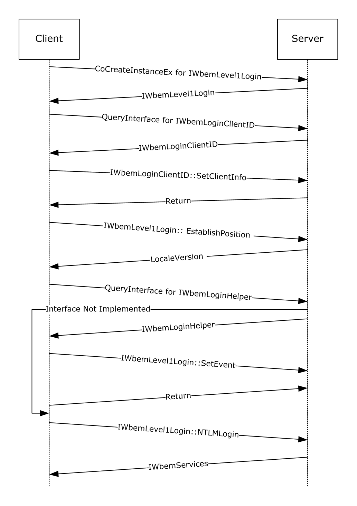
<!-- /Extracted images from page 164 -->

Figure 11: Protocol initialization example

#### 4.1.1 Protocol Initialization Trace

This section contains information about the messages exchanged as part of the protocol initialization
between SAI-NAV009 (client) and SAI-NAV009-2 (server). The specific trace is taken as part of
IWbemServices::ExecQuery call. For brevity, only the relevant traces are shown here.

Client creates a DCOM request to obtain IWbemLevel1Login interface:

164 / 234

[MS-WMI] - v20240423
Windows Management Instrumentation Remote Protocol
Copyright © 2024 Microsoft Corporation
Release: April 23, 2024

 - DCOM: RemoteCreateInstance Request, DCOM Version=5.7  Causality Id={8E2416FE-0A3F-42BE-
A9B0-F30624C94619}
   + HeaderReq: DCOM Version=5.7  Causality Id={8E2416FE-0A3F-42BE-A9B0-F30624C94619}
   + AggregationInterface:
   + ActivationProperties:

Server responds with IWbemLevel1Login interface pointer to the client's request:

 - DCOM: RemoteCreateInstance Response, ORPCFLOCAL - Local call to this computer
   + HeaderResp: ORPCFLOCAL - Local call to this computer
   + ActivationProperties:

Client performs the QueryInterface for IWbemLoginClientID interface from IWbemLevel1Login
interface pointer:

 - DCOM: IRemUnknown2:RemQueryInterface Request, DCOM Version=5.7  Causality Id={8E2416FE-
0A3F-42BE-A9B0-F30624C94619}
   + HeaderReq: DCOM Version=5.7  Causality Id={8E2416FE-0A3F-42BE-A9B0-F30624C94619}
     QueriedObjectIpId: {0001A407-06C4-0000-A6E3-C870B6019C76}
     PublicObjectReferenceCount: 5 (0x5)
     NumRequestedIIds: 1 (0x1)
   + Size: 1 Elements
   + InterfaceIds:

Server responds with IwbemLoginClientID interface pointer to the client:

 - DCOM: IRemUnknown2:RemQueryInterface Response, ORPCFNULL - No additional information in
this packet
   + HeaderResp: ORPCFNULL - No additional information in this packet
   + RemqiresultPtr: Pointer To 0x00020000
   + Size: 1 Elements
   + QueryInterfaceResults:
   + ReturnValue: Success

Client callsSetClientInfo method on IwbemLoginClientID interface pointer obtained from the server:

 - WMI: IWbemLoginClientID:SetClientInfo Request, ClientMachine=SAI-NAV009 ClientProcId=6420
Reserved=0
   + ClientMachine: SAI-NAV009
   + Pad: 2 Bytes
     ClientProcId: 6420 (0x1914)
     Reserved: 0 (0x0)

Server responds with WBEM_S_NO_ERROR:

 - WMI: IWbemLoginClientID:SetClientInfo Response, ReturnValue=WBEM_S_NO_ERROR
     ReturnValue: 0x00000000 - WBEM_S_NO_ERROR - Indicates a successful completion to the
method call.

[MS-WMI] - v20240423
Windows Management Instrumentation Remote Protocol
Copyright © 2024 Microsoft Corporation
Release: April 23, 2024

165 / 234

Client calls EstablishPosition method on IWbemLevel1Login interface pointer to determine supported
locales on the server:

 - WMI: IWbemLevel1Login:EstablishPosition Request, Reserved1=NULL Reserved2=0
   + Reserved1: NULL
     Pad: 0 Bytes
     Reserved2: 0 (0x0)

Server responds with LocalVersion as 1. This means that the server ignores unrecognized locale
names in the locale name format:

 - WMI: IWbemLevel1Login:EstablishPosition Response, LocaleVersion=1
ReturnValue=WBEM_S_NO_ERROR
     LocaleVersion: 1 (0x1)
     ReturnValue: 0x00000000 - WBEM_S_NO_ERROR - Indicates a successful completion to the
method call.

Client calls NTLMLogin method on IWbemLevel1Login interface pointer to obtain IWbemServices
interface pointer for root\cimv2 namespace on sai-nav009-2 (server):

 - WMI: IWbemLevel1Login:NTLMLogin Request, NetworkResource=\\sai-nav009-2\root\cimv2
PreferredLocale=en-US,en Flags=0
   + NetworkResource: \\sai-nav009-2\root\cimv2
   + PreferredLocale: en-US,en
   + pad: 2 Bytes
     Flags: 0 (0x0)
   + Ctx: NULL

Server responds with IWbemServices interface pointer for root\cimv2 namespace on sai-nav009-2
(server). Client uses this interface pointer to make synchronous, asynchronous, and
semisynchronous operations on the server:

 - WMI: IWbemLevel1Login:NTLMLogin Response, ReturnValue=WBEM_S_NO_ERROR
   + Namespace: OBJREFSTANDARD - {9556DC99-828C-11CF-A37E-00AA003240C7}
   + pad: 2 Bytes
     ReturnValue: 0x00000000 - WBEM_S_NO_ERROR - Indicates a successful completion to the
method call.

#### 4.1.2 Example Captures

None.

### 4.2 Synchronous Operations

A synchronous operation completes when the entire result set is ready on the server. The following
sections describe the different scenarios where synchronous operations are applicable.

[MS-WMI] - v20240423
Windows Management Instrumentation Remote Protocol
Copyright © 2024 Microsoft Corporation
Release: April 23, 2024

166 / 234

<!-- Extracted images from page 167 -->
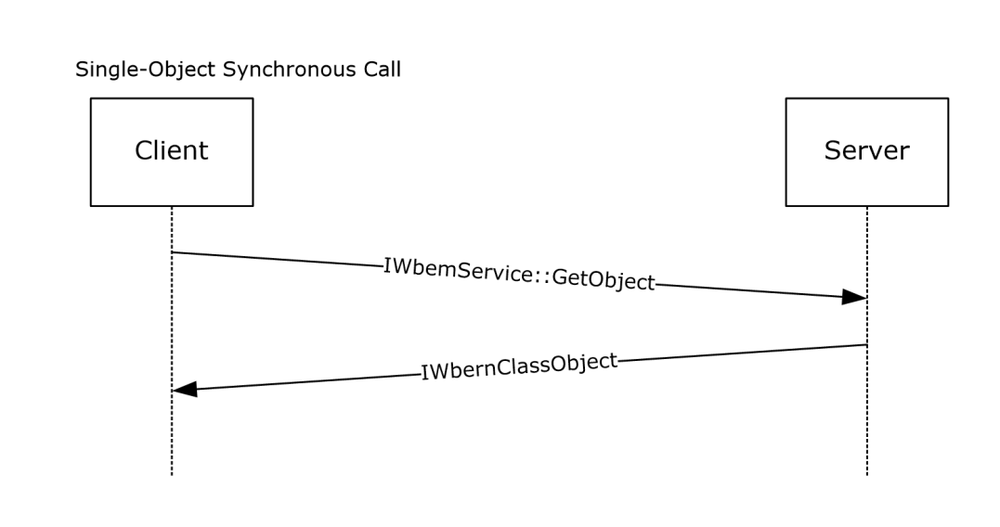
<!-- /Extracted images from page 167 -->

#### 4.2.1 Synchronous Delivery of a Single Result

The IWbemServices::GetObject and IWbemServices::ExecMethod methods support synchronous calls
returning a single marshaled IWbemClassObject interface pointer.

Figure 12: Synchronous delivery of a single result

#### 4.2.2 Synchronous Delivery of Result Sets

In this context of operation, there are two kinds of client behavior and two kinds of server behavior,
depending in the product version, resulting in four cases of client-server interaction.

The client behaviors are as follows:

  Unoptimized client behavior<83>

  Optimized client behavior<84>

The server behaviors are as follows:

  Unoptimized server behavior<85>

  Optimized server behavior<86>

The resulting client-server interactions are defined in the following sections:

  Unoptimized Client and Unoptimized Server (section 4.2.2.1)

  Unoptimized Client and Optimized Server (section 4.2.2.2)

  Optimized Client and Optimized Server (section 4.2.2.3)

  Optimized Client and Unoptimized Server (section 4.2.2.4)

##### 4.2.2.1 Unoptimized Client and Unoptimized Server

The product versions that exhibit unoptimized client behavior and unoptimized server behavior are
referenced in section 4.2.2.

[MS-WMI] - v20240423
Windows Management Instrumentation Remote Protocol
Copyright © 2024 Microsoft Corporation
Release: April 23, 2024

167 / 234

<!-- Extracted images from page 168 -->
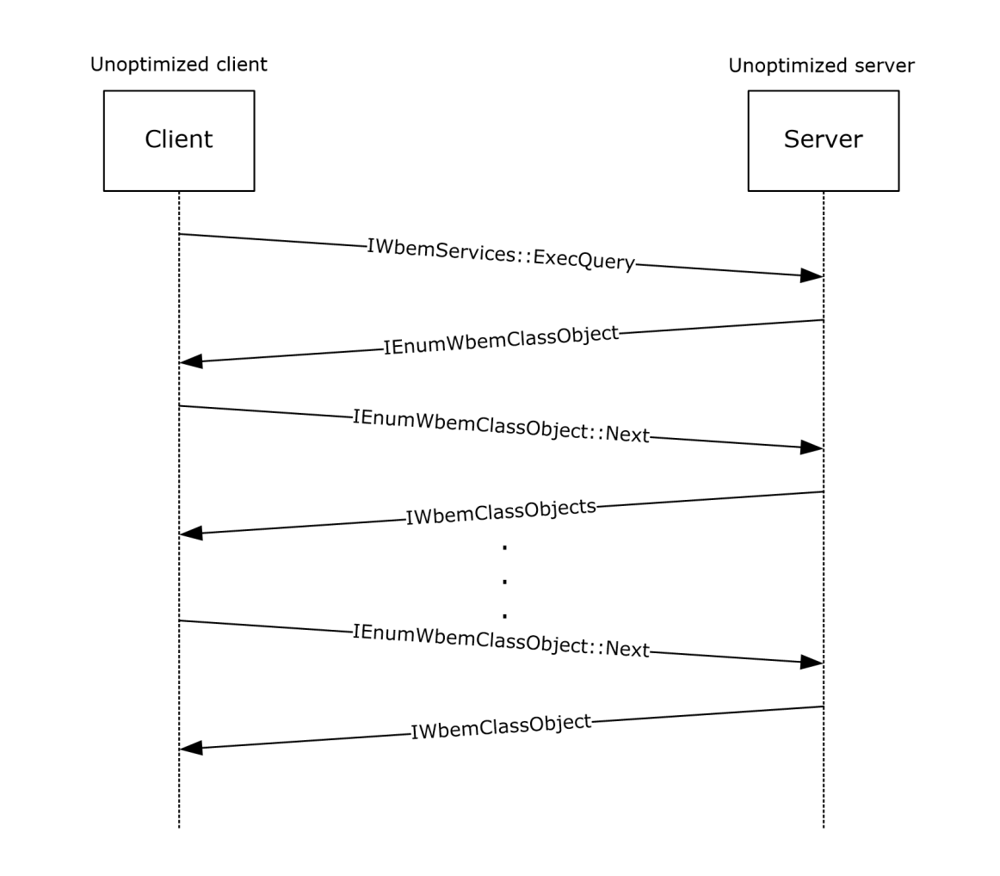
<!-- /Extracted images from page 168 -->

To make a synchronous operation from a client to a server, the client uses the IWbemServices
interface pointer. The client calls the IWbemServices synchronous methods
IWbemServices::CreateInstanceEnum, IWbemServices::CreateClassEnum, and
IWbemServices::ExecQuery. In response to the method executed, the server returns an
IEnumWbemClassObject interface pointer. The client then uses the IEnumWbemClassObject::Next
method to repeatedly retrieve the IWbemClassObject objects from the query result set.

Figure 13: Unoptimized Client and Unoptimized Server

An example capture is given on [SysDocCap-WMI] showing a Windows 2000 Server operating system
connecting to a second Windows 2000 Server using wbemtest utility and enumerating the default
namespace.

##### 4.2.2.2 Unoptimized Client and Optimized Server

The product versions that exhibit unoptimized client behavior and optimized server behavior are
referenced in section 4.2.2.

To make a synchronous operation from a client to a server, the client uses the IWbemServices
interface pointer. The client calls the IWbemServices synchronous methods
IWbemServices::CreateInstanceEnum, IWbemServices::CreateClassEnum, and
IWbemServices::ExecQuery. In response to the method executed, the server returns an

[MS-WMI] - v20240423
Windows Management Instrumentation Remote Protocol
Copyright © 2024 Microsoft Corporation
Release: April 23, 2024

168 / 234

<!-- Extracted images from page 169 -->
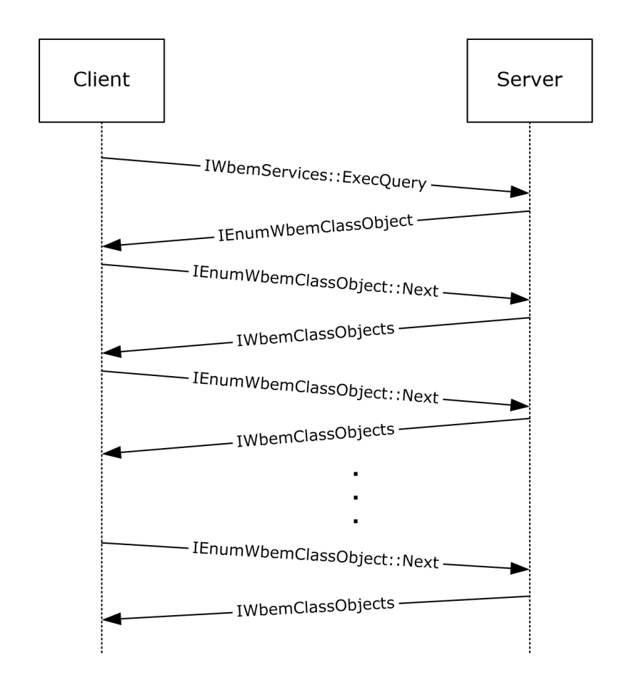
<!-- /Extracted images from page 169 -->

IEnumWbemClassObject interface pointer. The client then uses the IEnumWbemClassObject::Next
method to repeatedly retrieve the IWbemClassObject objects from the query result set.

The call sequence is the same as that in section 4.2.2.1 because in both cases, the client is
unoptimized, and therefore still uses the old mechanism for communication. Sections 4.2.2.3 and
##### 4.2.2.4 explain the call sequences between the newer versions of client and server.

Figure 14: Unoptimized Client and Optimized Server

An example capture is given on [SysDocCap-WMI] showing a Windows 2000 Server connecting to a
Windows Server 2008 operating system using the wbemtest utility and enumerating the default
namespace.

4.2.2.3  Optimized Client and Optimized Server

The product versions that exhibit optimized client behavior and optimized server behavior are
referenced in section 4.2.2.

To make a synchronous operation from a client to a server, the client uses the IWbemServices
interface pointer. The client calls the IWbemServices synchronous methods
IWbemServices::CreateInstanceEnum, IWbemServices::CreateClassEnum, and
IWbemServices::ExecQuery. In response to the method executed, the server returns an
IEnumWbemClassObject interface pointer. The client uses IRemUnknown and IRemUnknown2, as
specified in [MS-DCOM], to obtain an IWbemFetchSmartEnum interface pointer from the
IEnumWbemClassObject interface pointer. The client then calls the

169 / 234

[MS-WMI] - v20240423
Windows Management Instrumentation Remote Protocol
Copyright © 2024 Microsoft Corporation
Release: April 23, 2024

<!-- Extracted images from page 170 -->
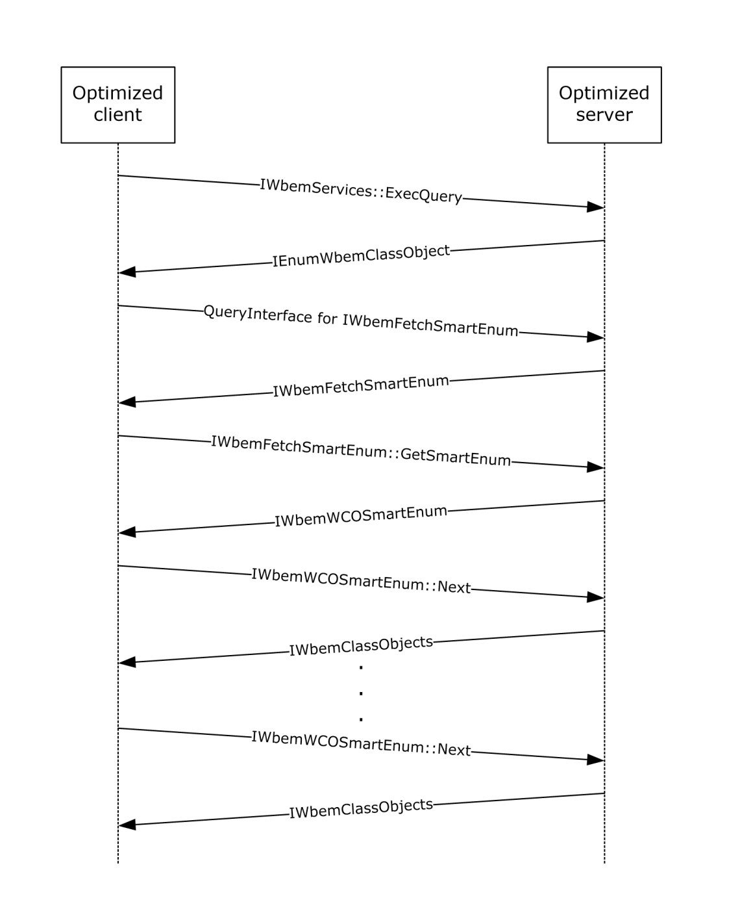
<!-- /Extracted images from page 170 -->

IWbemFetchSmartEnum::GetSmartEnum method to obtain the IWbemWCOSmartEnum interface
pointer. The client uses the IWbemWCOSmartEnum::Next method repeatedly to retrieve the
IWbemClassObject interface pointers that contains the result set. The results are encoded as an
ObjectArray as specified in section 2.2.14.

Figure 15: Optimized Client and Optimized Server

An example capture is given on [SysDocCap-WMI] showing a Windows Vista operating system client
connecting to Windows Server 2008 using the wbemtest utility and enumerating the default
namespace.

[MS-WMI] - v20240423
Windows Management Instrumentation Remote Protocol
Copyright © 2024 Microsoft Corporation
Release: April 23, 2024

170 / 234

<!-- Extracted images from page 171 -->
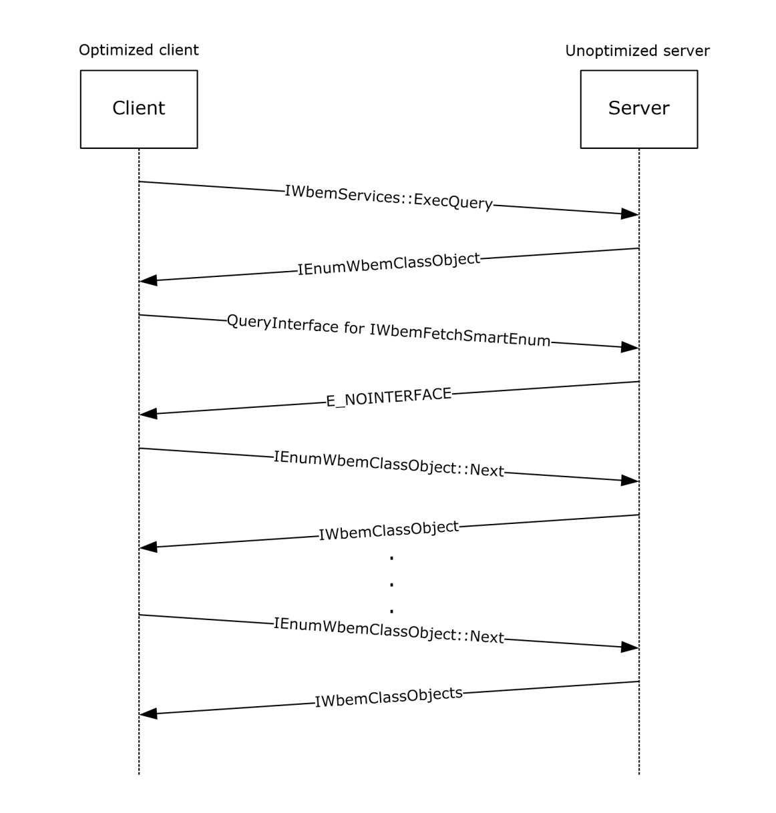
<!-- /Extracted images from page 171 -->

4.2.2.4  Optimized Client and Unoptimized Server

The product versions that exhibit optimized client behavior and unoptimized server behavior are
referenced in section 4.2.2.

To make a synchronous operation from a client to a server, the client uses the IWbemServices
interface pointer. The client calls the IWbemServices synchronous methods
IWbemServices::CreateInstanceEnum, IWbemServices::CreateClassEnum, and
IWbemServices::ExecQuery. In response to the method executed, the server returns an
IEnumWbemClassObject interface pointer. The client uses IRemUnknown and IRemUnknown2, as
specified in [MS-DCOM], to obtain an IWbemFetchSmartEnum interface pointer from
IEnumWbemClassObject interface pointer. The operation fails because the server is not implementing
the IWbemFetchSmartEnum interface. The client falls back to unoptimized client behavior.

Figure 16: Optimized Client and Unoptimized Server

[MS-WMI] - v20240423
Windows Management Instrumentation Remote Protocol
Copyright © 2024 Microsoft Corporation
Release: April 23, 2024

171 / 234

An example capture is given on [SysDocCap-WMI] showing a Windows 7 operating system client
connecting to a Windows 2000 Server using the wbemtest utility and enumerating the default
namespace

#### 4.2.3 Synchronous Delivery Traces

##### 4.2.3.1 Synchronous Delivery of IWbemServices ExecQuery and ExecMethod

Operations

This section contains the information exchanged between SAI-NAV009 (client) and SAI-NAV009-2
(server).

First the client tries to connect to the server and obtains IwbemServices for namespace root\cimv2
as outlined in 4.1.1.

Client calls ExecQuery method on IWbemServices interface pointer with "select * from
win32_process where Name='calc.exe'" as strQuery. It is assumed that an instance of calc.exe is
running on the server:

 - WMI: IWbemServices:ExecQuery Request, Flags=32
   + StrQueryLanguage: WQL
   + StrQuery: select * from win32_process where Name='calc.exe'
   + Pad: 2 Bytes
   + Flags: 32 (0x20)
   + Ctx: NULL

In response to the method executed above, the server returns an IEnumWbemClassObject interface
pointer:

 - WMI: IWbemServices:ExecQuery Response, ReturnValue=WBEM_S_NO_ERROR
   + Enum: OBJREFSTANDARD - {027947E1-D731-11CE-A357-000000000001}
   + Pad: 2 Bytes
     ReturnValue: 0x00000000 - WBEM_S_NO_ERROR - Indicates a successful completion to the
method call.

The client uses IRemUnknown and IRemUnknown2, as specified in [MS-DCOM], to obtain an
IWbemFetchSmartEnum interface pointer from the IEnumWbemClassObject interface pointer. From
this the client knows whether the server is optimized:

 - DCOM: IRemUnknown2:RemQueryInterface Request, DCOM Version=5.7  Causality Id={8E2416FE-
0A3F-42BE-A9B0-F30624C94619}
   + HeaderReq: DCOM Version=5.7  Causality Id={8E2416FE-0A3F-42BE-A9B0-F30624C94619}
     QueriedObjectIpId: {0002E41C-06C4-0000-1F17-07BCF2EEB3F8}
     PublicObjectReferenceCount: 5 (0x5)
     NumRequestedIIds: 1 (0x1)
   + Size: 1 Elements
   + InterfaceIds:

Server responds with a valid IWbemFetchSmartEnum interface pointer. This means that the server is
optimized:

 - DCOM: IRemUnknown2:RemQueryInterface Response, ORPCFNULL - No additional information in
this packet

172 / 234

[MS-WMI] - v20240423
Windows Management Instrumentation Remote Protocol
Copyright © 2024 Microsoft Corporation
Release: April 23, 2024

   + HeaderResp: ORPCFNULL - No additional information in this packet
   + RemqiresultPtr: Pointer To 0x00020000
   + Size: 1 Elements
   + QueryInterfaceResults:
   + ReturnValue: Success

The client then calls the IWbemFetchSmartEnum::GetSmartEnum method to obtain the
IWbemWCOSmartEnum interface pointer:

 WMI: IWbemFetchSmartEnum:GetSmartEnum Request

Server responds with a valid IWbemWCOSmartEnum interface pointer:

 - WMI: IWbemFetchSmartEnum:GetSmartEnum Response, ReturnValue=WBEM_S_NO_ERROR
   + SmartEnum: OBJREFSTANDARD - {423EC01E-2E35-11D2-B604-00104B703EFD}
   + Pad: 2 Bytes
     ReturnValue: 0x00000000 - WBEM_S_NO_ERROR - Indicates a successful completion to the
method call.

The client uses the IWbemWCOSmartEnum::Next method repeatedly to retrieve the
IwbemClassObject interface pointers that contains the result set:

 - WMI: IWbemWCOSmartEnum:Next Request, Timeout=0 UCount=10
     proxyGUID: {7F666EB6-FA61-48E8-8464-224C8E909D22}
     Timeout: WBEM_NO_WAIT(Call returns immediately, regardless of whether any objects are
available.)
     UCount: 10 (0xA)

Server responds with the result set with one win32_process object for calc.exe instance running. The
results are encoded as an ObjectArray as specified in section 2.2.14:

 - WMI: IWbemWCOSmartEnum:Next Response, PuReturned=1 BuffSize=9101 ReturnValue=0x00000300 -
Unknown Value
     PuReturned: 1 (0x1)
     BuffSize: 9101 (0x238D)
   + BufferPtrSize: Pointer To 0x00020000, 9101 Elements
   + ObjectArray:
   + Pad: 2 Bytes
     ReturnValue: 0x00000300 - Unknown Value
 + msrpc: c/o Continued Response: IWbemWCOSmartEnum(WMIRP) {423EC01E-2E35-11D2-B604-
00104B703EFD}  Call=0xA  Context=0x6  Hint=0xD1C  Cancels=0x0 InstanceQuarlifier error:
Unknown QualifierType

Client obtains __RELPATH property from IwbemClassObject as \\SAI-NAV009-
2\root\cimv2:Win32_Process.Handle="724".

Client makes ExecMethod operation on IWbemServices interface pointer to call terminate() method on
win32_process object corresponding to calc.exe instance obtained above. This action terminates the
process calc.exe on the server:

 - WMI: IWbemServices:ExecMethod Request, Flags=0
   + StrObjectPath: \\SAI-NAV009-2\root\cimv2:Win32_Process.Handle="724"

173 / 234

[MS-WMI] - v20240423
Windows Management Instrumentation Remote Protocol
Copyright © 2024 Microsoft Corporation
Release: April 23, 2024

   + StrMethodName: Terminate
   + Pad: 2 Bytes
     Flags: Unknown
   + Ctx: NULL
   + InParams: OBJREFCUSTOM - {DC12A681-737F-11CF-884D-00AA004B2E24}
   + OutParams: NULL
   + CallResult: NULL

Server responds with ResultValue as WBEM_S_NO_ERROR. This means that Terminate method was
successfully executed on Win32_Process object:

 - WMI: IWbemServices:ExecMethod Response, ReturnValue=WBEM_S_NO_ERROR
   + OutParams: OBJREFCUSTOM - {DC12A681-737F-11CF-884D-00AA004B2E24}
   + CallResult: NULL
     Pad: 0 Bytes
     ReturnValue: 0x00000000 - WBEM_S_NO_ERROR - Indicates a successful completion to the
method call.)

To confirm that calc.exe instance is indeed terminated on the server, client makes the same
ExecQuery operation on IWbemServices interface pointer obtained from the server:

 + DCOM: WMI protocol Request, DCOM Version=5.7  Causality Id={8E2416FE-0A3F-42BE-A9B0-
F30624C94619}
 - WMI: IWbemServices:ExecQuery Request, Flags=32
   + StrQueryLanguage: WQL
   + StrQuery: select * from win32_process where Name='calc.exe'
   + Pad: 2 Bytes
   + Flags: 32 (0x20)
   + Ctx: NULL

In response to the method executed above, the server returns an IEnumWbemClassObject interface
pointer:

 - WMI: IWbemServices:ExecQuery Response, ReturnValue=WBEM_S_NO_ERROR
   + Enum: OBJREFSTANDARD - {027947E1-D731-11CE-A357-000000000001}
   + Pad: 2 Bytes
     ReturnValue: 0x00000000 - WBEM_S_NO_ERROR - Indicates a successful completion to the
method call.

The client uses IRemUnknown and IRemUnknown2, as specified in [MS-DCOM], to obtain an
IWbemFetchSmartEnum interface pointer from the IEnumWbemClassObject interface pointer. From
this the client knows whether the server is optimized:

 - DCOM: IRemUnknown2:RemQueryInterface Request, DCOM Version=5.7  Causality Id={8E2416FE-
0A3F-42BE-A9B0-F30624C94619}
   + HeaderReq: DCOM Version=5.7  Causality Id={8E2416FE-0A3F-42BE-A9B0-F30624C94619}
     QueriedObjectIpId: {0001F82E-06C4-0000-829F-784637EF2774}
     PublicObjectReferenceCount: 5 (0x5)
     NumRequestedIIds: 1 (0x1)
   + Size: 1 Elements
   + InterfaceIds:

[MS-WMI] - v20240423
Windows Management Instrumentation Remote Protocol
Copyright © 2024 Microsoft Corporation
Release: April 23, 2024

174 / 234

Server responds with a valid IWbemFetchSmartEnum interface pointer. This means that the server is
optimized:

 - DCOM: IRemUnknown2:RemQueryInterface Response, ORPCFNULL - No additional information in
this packet
   + HeaderResp: ORPCFNULL - No additional information in this packet
   + RemqiresultPtr: Pointer To 0x00020000
   + Size: 1 Elements
   + QueryInterfaceResults:
   + ReturnValue: Success

The client then calls the IWbemFetchSmartEnum::GetSmartEnum method to obtain the
IWbemWCOSmartEnum interface pointer:

 WMI: IWbemFetchSmartEnum:GetSmartEnum Request

Server responds with a valid IWbemWCOSmartEnum interface pointer:

 - WMI: IWbemFetchSmartEnum:GetSmartEnum Response, ReturnValue=WBEM_S_NO_ERROR
   + SmartEnum: OBJREFSTANDARD - {423EC01E-2E35-11D2-B604-00104B703EFD}
   + Pad: 2 Bytes
     ReturnValue: 0x00000000 - WBEM_S_NO_ERROR - Indicates a successful completion to the
method call.

The client uses the IWbemWCOSmartEnum::Next method repeatedly to retrieve the
IwbemClassObject interface pointers that contain the result set:

 - WMI: IWbemWCOSmartEnum:Next Request, Timeout=0 UCount=10
     proxyGUID: {09EFDDA0-3E1E-40E2-B87A-F73895BEAACA}
     Timeout: WBEM_NO_WAIT(Call returns immediately, regardless of whether any objects are
available.)
     UCount: 10 (0xA)

Server responds with the result set this time with no calc.exe instances. This proves that the
terminate method was called on win32_process object, and has terminated calc.exe instance on the
server:

 - WMI: IWbemWCOSmartEnum:Next Response, PuReturned=0 BuffSize=0 ReturnValue=WBEM_S_FALSE
     PuReturned: 0 (0x0)
     BuffSize: 0 (0x0)
   + BufferPtrSize: Pointer To NULL
     Pad: 0 Bytes
     ReturnValue: 0x00000001 - WBEM_S_FALSE - Either no more CIM objects are available, the
number of returned CIM objects is less than the number requested, or this is the end of an
enumeration.

##### 4.2.3.2 Synchronous Delivery of IWbemServices PutInstance, DeleteInstance, and

CreateInstanceEnum Operations

This section contains the information exchanged between SAI-NAV009 (client) and SAI-NAV009-2
(server).

175 / 234

[MS-WMI] - v20240423
Windows Management Instrumentation Remote Protocol
Copyright © 2024 Microsoft Corporation
Release: April 23, 2024

On the server machine, the MOF shown below is compiled and made available to WMI.

 #pragma namespace("\\\\.\\root\\cimv2\\MyTest")
 Class TestWMI
 {
     [key] uint32 x;
     uint32 y;
 };

First the client tries to connect to the server and obtains IWbemServices interface pointer for
namespace root\cimv2\MyTest as outlined in 4.1.1. There is initially an instance of a TestWMI Class
created on the server with (x=3,y=5).

Client calls PutInstance operation on IWbemServices interface pointer to create another instance of
TestWMI class on the server. The instance property values are x=10, y=15:

 - WMI: IWbemServices:PutInstance Request, Flags=0
   + Inst: OBJREFCUSTOM - {DC12A681-737F-11CF-884D-00AA004B2E24}
     Pad: 0 Bytes
   + Flags: 0 (0x0)
   + Ctx: NULL
   + CallResult: NULL

Server returns WBEM_S_NO_ERROR. This implies that the instance above was successfully created on
the server:

 - WMI: IWbemServices:PutInstance Response, ReturnValue=WBEM_S_NO_ERROR
   + CallResult: NULL
     Pad: 0 Bytes
     ReturnValue: 0x00000000 - WBEM_S_NO_ERROR - Indicates a successful completion to the
method call.

Client calls CreateInstanceEnum operation on IWbemServices interface pointer:

 - WMI: IWbemServices:CreateInstanceEnum Request, Flags=33
   + StrFilter: TestWMI
   + Pad: 2 Bytes
   + Flags: 33 (0x21)
   + Ctx: NULL

In response to the method executed above, the server returns an IEnumWbemClassObject interface
pointer:

 - WMI: IWbemServices:CreateInstanceEnum Response, ReturnValue=WBEM_S_NO_ERROR
   + Enum: OBJREFSTANDARD - {027947E1-D731-11CE-A357-000000000001}
   + Pad: 2 Bytes
     ReturnValue: 0x00000000 - WBEM_S_NO_ERROR - Indicates a successful completion to the
method call.

The client uses IRemUnknown and IRemUnknown2, as specified in [MS-DCOM], to obtain an
IWbemFetchSmartEnum interface pointer from the IEnumWbemClassObject interface pointer. From
this the client would know if the server is optimized:

[MS-WMI] - v20240423
Windows Management Instrumentation Remote Protocol
Copyright © 2024 Microsoft Corporation
Release: April 23, 2024

176 / 234

 - DCOM: IRemUnknown2:RemQueryInterface Request, DCOM Version=5.7  Causality Id={BD28B839-
5D20-4435-9852-1FE794070A9C}
   + HeaderReq: DCOM Version=5.7  Causality Id={BD28B839-5D20-4435-9852-1FE794070A9C}
     QueriedObjectIpId: {00026021-06C4-0000-9260-C0BCD4C240B3}
     PublicObjectReferenceCount: 5 (0x5)
     NumRequestedIIds: 1 (0x1)
   + Size: 1 Elements
   + InterfaceIds:

Server responds with a valid IWbemFetchSmartEnum interface pointer. This means that the server is
optimized:

 - DCOM: IRemUnknown2:RemQueryInterface Response, ORPCFNULL - No additional information in
this packet
   + HeaderResp: ORPCFNULL - No additional information in this packet
   + RemqiresultPtr: Pointer To 0x00020000
   + Size: 1 Elements
   + QueryInterfaceResults:
   + ReturnValue: Success

The client then calls the IWbemFetchSmartEnum::GetSmartEnum method to obtain the
IWbemWCOSmartEnum interface pointer:

   WMI: IWbemFetchSmartEnum:GetSmartEnum Request

Server responds with a valid IWbemWCOSmartEnum interface pointer:

 - WMI: IWbemFetchSmartEnum:GetSmartEnum Response, ReturnValue=WBEM_S_NO_ERROR
   + SmartEnum: OBJREFSTANDARD - {423EC01E-2E35-11D2-B604-00104B703EFD}
   + Pad: 2 Bytes
     ReturnValue: 0x00000000 - WBEM_S_NO_ERROR - Indicates a successful completion to the
method call.

The client uses the IWbemWCOSmartEnum::Next method repeatedly to retrieve the
IWbemClassObject interface pointers that contains the result set:

 - WMI: IWbemWCOSmartEnum:Next Request, Timeout=0 UCount=10
     proxyGUID: {DCFE7B7E-853F-494D-9EAD-FB96164158C1}
     Timeout: WBEM_NO_WAIT(Call returns immediately, regardless of whether any objects are
available.)
     UCount: 10 (0xA)

Server responds with the result set containing 2 TestWMI instances. The instance property values are
(x=3,y=5) and (x=10,y=15):

 - WMI: IWbemWCOSmartEnum:Next Response, PuReturned=2 BuffSize=410 ReturnValue=WBEM_S_FALSE
     PuReturned: 2 (0x2)
     BuffSize: 410 (0x19A)
   + BufferPtrSize: Pointer To 0x00020000, 410 Elements
   + ObjectArray:
   + Pad: 2 Bytes

[MS-WMI] - v20240423
Windows Management Instrumentation Remote Protocol
Copyright © 2024 Microsoft Corporation
Release: April 23, 2024

177 / 234

Client calls PutInstance operation on IWbemServices interface pointer on one of the TestWMI class
instances (x=10, y=15) to update it to (x=10, y=20):

 - WMI: IWbemServices:PutInstance Request, Flags=0
   + Inst: OBJREFCUSTOM - {DC12A681-737F-11CF-884D-00AA004B2E24}
     Pad: 0 Bytes
   + Flags: 0 (0x0)
   + Ctx: NULL
   + CallResult: NULL

Server returns WBEM_S_NO_ERROR. This implies that the instance update above was successful on
the server:

 - WMI: IWbemServices:PutInstance Response, ReturnValue=WBEM_S_NO_ERROR
   + CallResult: NULL
     Pad: 0 Bytes
     ReturnValue: 0x00000000 - WBEM_S_NO_ERROR - Indicates a successful completion to the
method call.

Client calls DeleteInstance operation on IWbemServices interface pointer by providing the
strObjectPath as \\SAI-NAV009-2\ROOT\cimv2\MyTest:TestWMI.x=10):

 - WMI: IWbemServices:DeleteInstance Request, Flags=0
   + StrObjectPath: \\SAI-NAV009-2\ROOT\cimv2\MyTest:TestWMI.x=10
   + Pad: 2 Bytes
     Flags: Unknown
   + Ctx: NULL
   + CallResult: NULL

Server responds with success. This implies that TestWMI instance with key value as x=10 has been
successfully deleted from the server:

 - WMI: IWbemServices:DeleteInstance Response, ReturnValue=WBEM_S_NO_ERROR
   + CallResult: NULL
     Pad: 0 Bytes
     ReturnValue: 0x00000000 - WBEM_S_NO_ERROR - Indicates a successful completion to the
method call.

Client calls CreateInstanceEnum operation on IWbemServices interface pointer to find out the existing
TestWMI instances on the server:

 - WMI: IWbemServices:CreateInstanceEnum Request, Flags=33
   + StrFilter: TestWMI
   + Pad: 2 Bytes
   + Flags: 33 (0x21)
   + Ctx: NULL

[MS-WMI] - v20240423
Windows Management Instrumentation Remote Protocol
Copyright © 2024 Microsoft Corporation
Release: April 23, 2024

178 / 234

In response to the method executed above, the server returns an IEnumWbemClassObject interface
pointer:

 - WMI: IWbemServices:CreateInstanceEnum Response, ReturnValue=WBEM_S_NO_ERROR
   + Enum: OBJREFSTANDARD - {027947E1-D731-11CE-A357-000000000001}
   + Pad: 2 Bytes
     ReturnValue: 0x00000000 - WBEM_S_NO_ERROR - Indicates a successful completion to the
method call.

The client uses IRemUnknown and IRemUnknown2, as specified in [MS-DCOM], to obtain an
IWbemFetchSmartEnum interface pointer from the IEnumWbemClassObject interface pointer. From
this the client knows whether the server is optimized:

 - DCOM: IRemUnknown2:RemQueryInterface Request, DCOM Version=5.7  Causality Id={BD28B839-
5D20-4435-9852-1FE794070A9C}
   + HeaderReq: DCOM Version=5.7  Causality Id={BD28B839-5D20-4435-9852-1FE794070A9C}
     QueriedObjectIpId: {00004007-06C4-0000-99C1-96EC7361199B}
     PublicObjectReferenceCount: 5 (0x5)
     NumRequestedIIds: 1 (0x1)
   + Size: 1 Elements
   + InterfaceIds:

Server responds with a valid IWbemFetchSmartEnum interface pointer. This means that the server is
optimized:

 - DCOM: IRemUnknown2:RemQueryInterface Response, ORPCFNULL - No additional information in
this packet
   + HeaderResp: ORPCFNULL - No additional information in this packet
   + RemqiresultPtr: Pointer To 0x00020000
   + Size: 1 Elements
   + QueryInterfaceResults:
   + ReturnValue: Success

The client then calls the IWbemFetchSmartEnum::GetSmartEnum method to obtain the
IWbemWCOSmartEnum interface pointer:

   WMI: IWbemFetchSmartEnum:GetSmartEnum Request

Server responds with a valid IWbemWCOSmartEnum interface pointer:

 - WMI: IWbemFetchSmartEnum:GetSmartEnum Response, ReturnValue=WBEM_S_NO_ERROR
   + SmartEnum: OBJREFSTANDARD - {423EC01E-2E35-11D2-B604-00104B703EFD}
   + Pad: 2 Bytes
     ReturnValue: 0x00000000 - WBEM_S_NO_ERROR - Indicates a successful completion to the
method call.

The client uses the IWbemWCOSmartEnum::Next method repeatedly to retrieve the
IWbemClassObject interface pointers that contain the result set:

 - WMI: IWbemWCOSmartEnum:Next Request, Timeout=0 UCount=10
     proxyGUID: {45CE1C5B-9841-4D4E-964D-BD5E03695B47}
     Timeout: WBEM_NO_WAIT(Call returns immediately, regardless of whether any objects are
available.)

179 / 234

[MS-WMI] - v20240423
Windows Management Instrumentation Remote Protocol
Copyright © 2024 Microsoft Corporation
Release: April 23, 2024

Server responds with the result set containing 1 TestWMI instance (x=3,y=5). This confirms that the
other instance with x=10 has been successfully deleted as part of DeleteInstance call.

 - WMI: IWbemWCOSmartEnum:Next Response, PuReturned=1 BuffSize=307 ReturnValue=WBEM_S_FALSE
     PuReturned: 1 (0x1)
     BuffSize: 307 (0x133)
   + BufferPtrSize: Pointer To 0x00020000, 307 Elements
   + ObjectArray:
   + Pad: 1 Bytes
     ReturnValue: 0x00000001 - WBEM_S_FALSE - Either no more CIM objects are available, the
number of returned CIM objects is less than the number requested, or this is the end of an
enumeration.

### 4.3 Semisynchronous Operations

In semisynchronous cases, the call returns before the requested operation completes, and another
interface is used to retrieve the operation results. The returned interface depends on the
IWbemServices methods that are invoked by the client. The following sections describe the two
different behaviors.

#### 4.3.1 Semisynchronous Delivery of a Single Result

The methods returning a single element such as IWbemServices::OpenNamespace,
IWbemServices::GetObject, IWbemServices::PutClass, IWbemServices::DeleteClass,
IWbemServices::PutInstance, IWbemServices::DeleteInstance, or IWbemServices::ExecMethod return
an IWbemCallResult interface pointer. To obtain the operation results, the client uses the
IWbemCallResult methods.

[MS-WMI] - v20240423
Windows Management Instrumentation Remote Protocol
Copyright © 2024 Microsoft Corporation
Release: April 23, 2024

180 / 234

<!-- Extracted images from page 181 -->
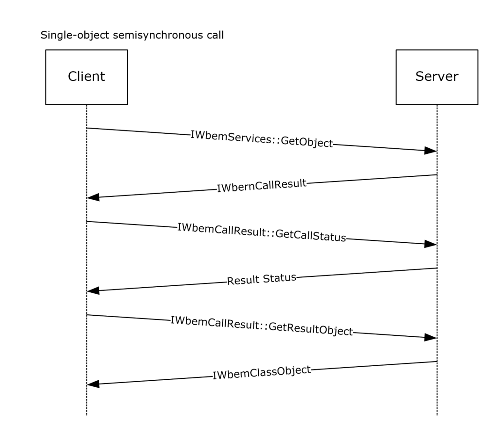
<!-- /Extracted images from page 181 -->

Figure 17: Semisynchronous delivery of a single result

#### 4.3.2 Semisynchronous Delivery of Result Sets

The semisynchronous operation uses the same sequence as the synchronous calls, as specified in
section 4.2.2, to request a result set. However, in semisynchronous cases, the
IEnumWbemClassObject interface pointer is returned before the result set is available on the server.
This is different from the synchronous case, in which the interface pointer is returned only after the
result set is available on the server. The IEnumWbemClassObject interface pointer is returned before
the result set is available on the server. When the client calls the IEnumWbemClassObject::Next
method, it specifies a time-out within which the server returns the requested results. When one of the
previous conditions is satisfied, the call completes.

#### 4.3.3 Semisynchronous Delivery Traces

##### 4.3.3.1 Semisynchronous Delivery of IWbemServices ExecQuery and ExecMethod

Operations

This section contains the information exchanged between SAI-NAV009 (client) and SAI-NAV009-2
(server).

First the client tries to connect to the server and obtains IWbemServices for namespace root\cimv2 as
outlined in 4.1.1.

[MS-WMI] - v20240423
Windows Management Instrumentation Remote Protocol
Copyright © 2024 Microsoft Corporation
Release: April 23, 2024

181 / 234

The client calls ExecQuery method on IwbemServices interface pointer with "select * from
win32_process where Name='calc.exe'" as strQuery. It is assumed that an instance of calc.exe is
running on the server:

 - WMI: IWbemServices:ExecQuery Request, Flags=48
   + StrQueryLanguage: WQL
   + StrQuery: select * from win32_process where Name='calc.exe'
   + Pad: 2 Bytes
   + Flags: 48 (0x30)
   + Ctx: NULL

In response to the method executed above, the server returns an IenumWbemClassObject interface
pointer:

 - WMI: IWbemServices:ExecQuery Response, ReturnValue=WBEM_S_NO_ERROR
   + Enum: OBJREFSTANDARD - {027947E1-D731-11CE-A357-000000000001}
   + Pad: 2 Bytes
     ReturnValue: 0x00000000 - WBEM_S_NO_ERROR - Indicates a successful completion to the
method call.

The client uses IRemUnknown and IRemUnknown2, as specified in [MS-DCOM], to obtain an
IWbemFetchSmartEnum interface pointer from the IEnumWbemClassObject interface pointer. From
this the client would know if the server is optimized:

 - DCOM: IRemUnknown2:RemQueryInterface Request, DCOM Version=5.7  Causality Id={EF414E15-
6ACF-408A-BB6E-ECB20DA968D8}
   + HeaderReq: DCOM Version=5.7  Causality Id={EF414E15-6ACF-408A-BB6E-ECB20DA968D8}
     QueriedObjectIpId: {0001B004-06C4-0000-712F-83B56A62FA75}
     PublicObjectReferenceCount: 5 (0x5)
     NumRequestedIIds: 1 (0x1)
   + Size: 1 Elements
   + InterfaceIds:

The server responds with a valid IWbemFetchSmartEnum interface pointer. This means that the server
is optimized:

 - DCOM: IRemUnknown2:RemQueryInterface Response, ORPCFNULL - No additional information in
this packet
   + HeaderResp: ORPCFNULL - No additional information in this packet
   + RemqiresultPtr: Pointer To 0x00020000
   + Size: 1 Elements
   + QueryInterfaceResults:
   + ReturnValue: Success

The client then calls the IWbemFetchSmartEnum::GetSmartEnum method to obtain the
IWbemFetchSmartEnum interface pointer:

   WMI: IWbemFetchSmartEnum:GetSmartEnum Request

The server responds with a valid IWbemWCOSmartEnum interface pointer:

[MS-WMI] - v20240423
Windows Management Instrumentation Remote Protocol
Copyright © 2024 Microsoft Corporation
Release: April 23, 2024

182 / 234

 - WMI: IWbemFetchSmartEnum:GetSmartEnum Response, ReturnValue=WBEM_S_NO_ERROR
   + SmartEnum: OBJREFSTANDARD - {423EC01E-2E35-11D2-B604-00104B703EFD}
   + Pad: 2 Bytes
     ReturnValue: 0x00000000 - WBEM_S_NO_ERROR - Indicates a successful completion to the
method call.

The client uses the IWbemWCOSmartEnum::Next method repeatedly to retrieve the
IwbemClassObject interface pointers that contain the result set:

 - WMI: IWbemWCOSmartEnum:Next Request, Timeout=5000 UCount=10
     proxyGUID: {90B8134C-F980-415C-92E3-511819BC3BC5}
     Timeout: 5000 ms(0x1388)
     UCount: 10 (0xA)

The server responds with the result set with one win32_process object for calc.exe instance running.
The results are encoded as an ObjectArray as specified in section 2.2.14:

 - WMI: IWbemWCOSmartEnum:Next Response, PuReturned=1 BuffSize=9104 ReturnValue=0x00000300 -
Unknown Value
     PuReturned: 1 (0x1)
     BuffSize: 9104 (0x2390)
   + BufferPtrSize: Pointer To 0x00020000, 9104 Elements
   + ObjectArray:
   + Pad: 2 Bytes
     ReturnValue: 0x00000300 - Unknown Value
 + msrpc: c/o Continued Response: IWbemWCOSmartEnum(WMIRP) {423EC01E-2E35-11D2-B604-
00104B703EFD}  Call=0xA  Context=0x6  Hint=0xD1C  Cancels=0x0 InstanceQuarlifier error:
Unknown QualifierType

The client obtains __RELPATH property from IwbemClassObject as \\SAI-NAV009-
2\root\cimv2:Win32_Process.Handle="2680".

The client makes ExecMethod operation on IWbemServices interface pointer to call terminate()
method on Win32_Process object corresponding to calc.exe instance obtained above. [This action
terminates the process calc.exe on the server]:

 - WMI: IWbemServices:ExecMethod Request, Flags=16
   + StrObjectPath: \\SAI-NAV009-2\root\cimv2:Win32_Process.Handle="2680"
   + StrMethodName: Terminate
   + Pad: 2 Bytes
     Flags: WBEM_FLAG_RETURN_IMMEDIATELY - If this bit is not set, the server MUST make the
method call synchronously. If this bit is set, the server MUST make the method call
semisynchronously.
   + Ctx: NULL
   + InParams: OBJREFCUSTOM - {DC12A681-737F-11CF-884D-00AA004B2E24}
   + OutParams: NULL
   + CallResult: NULL

The server responds with a valid IWbemCallResult interface pointer corresponding to the ExecMethod
operation above:

 - WMI: IWbemServices:ExecMethod Response, ReturnValue=WBEM_S_NO_ERROR
   + OutParams: NULL
   + CallResult: OBJREFSTANDARD - {44ACA675-E8FC-11D0-A07C-00C04FB68820}

183 / 234

[MS-WMI] - v20240423
Windows Management Instrumentation Remote Protocol
Copyright © 2024 Microsoft Corporation
Release: April 23, 2024

   + Pad: 2 Bytes
     ReturnValue: 0x00000000 - WBEM_S_NO_ERROR - Indicates a successful completion to the
method call.

The client calls GetCallStatus on IWbemCallResult interface pointer to obtain the status of the
ExecMethod operation above:

 - WMI: IWbemCallResult:GetCallStatus Request, Timeout=5000
     Timeout: 5000 ms(0x1388)

The server responds with ReturnValue WBEM_S_NO_ERROR, and the Status as S_OK. This implies
that the ExecMethod operation above was successfully executed on the server:

 - WMI: IWbemCallResult:GetCallStatus Response, Status=0 ReturnValue=WBEM_S_NO_ERROR
     Status: 0 (0x0)
     ReturnValue: 0x00000000 - WBEM_S_NO_ERROR - Indicates a successful completion to the
method call.

The client calls GetResultObject method on IWbemCallResult interface pointer to get the result object:

 - WMI: IWbemCallResult:GetCallStatus Response, Status=0 ReturnValue=WBEM_S_NO_ERROR
     Status: 0 (0x0)
     ReturnValue: 0x00000000 - WBEM_S_NO_ERROR - Indicates a successful completion to the
method call.

The server responds with WBEM_S_NO_ERROR, and an instance of IwbemClassObject that contains
the return value from Terminate method above:

 - WMI: IWbemCallResult:GetResultObject Response, ReturnValue=WBEM_S_NO_ERROR
   + ResultObject: OBJREFCUSTOM - {DC12A681-737F-11CF-884D-00AA004B2E24}
   + pad: 3 Bytes
     ReturnValue: 0x00000000 - WBEM_S_NO_ERROR - Indicates a successful completion to the
method call.

To confirm that calc.exe instance is indeed terminated, the client calls ExecQuery method on
IWbemServices interface pointer with "select * from win32_process where Name='calc.exe'" as
strQuery:

 - WMI: IWbemServices:ExecQuery Request, Flags=48
   + StrQueryLanguage: WQL
   + StrQuery: select * from win32_process where Name='calc.exe'
   + Pad: 2 Bytes
   + Flags: 48 (0x30)
   + Ctx: NULL

In response to the method executed above, the server returns an IEnumWbemClassObject interface
pointer:

 - WMI: IWbemServices:ExecQuery Response, ReturnValue=WBEM_S_NO_ERROR
   + Enum: OBJREFSTANDARD - {027947E1-D731-11CE-A357-000000000001}
   + Pad: 2 Bytes

184 / 234

[MS-WMI] - v20240423
Windows Management Instrumentation Remote Protocol
Copyright © 2024 Microsoft Corporation
Release: April 23, 2024

     ReturnValue: 0x00000000 - WBEM_S_NO_ERROR - Indicates a successful completion to the
method call.

The client uses IRemUnknown and IRemUnknown2, as specified in [MS-DCOM], to obtain an
IWbemFetchSmartEnum interface pointer from the IEnumWbemClassObject interface pointer. From
this the client knows whether the server is optimized:

 - DCOM: IRemUnknown2:RemQueryInterface Request, DCOM Version=5.7  Causality Id={EF414E15-
6ACF-408A-BB6E-ECB20DA968D8}
   + HeaderReq: DCOM Version=5.7  Causality Id={EF414E15-6ACF-408A-BB6E-ECB20DA968D8}
     QueriedObjectIpId: {0001942E-06C4-0000-E48B-1633B50E272E}
     PublicObjectReferenceCount: 5 (0x5)
     NumRequestedIIds: 1 (0x1)
   + Size: 1 Elements
   + InterfaceIds:

The server responds with a valid IWbemFetchSmartEnum interface pointer. This means that the server
is optimized:

 - DCOM: IRemUnknown2:RemQueryInterface Response, ORPCFNULL - No additional information in
this packet
   + HeaderResp: ORPCFNULL - No additional information in this packet
   + RemqiresultPtr: Pointer To 0x00020000
   + Size: 1 Elements
   + QueryInterfaceResults:
   + ReturnValue: Success

The client then calls the IWbemFetchSmartEnum::GetSmartEnum method to obtain the
IWbemWCOSmartEnum interface pointer:

 WMI: IWbemFetchSmartEnum:GetSmartEnum Request

The server responds with a valid IWbemWCOSmartEnum interface pointer:

 - WMI: IWbemFetchSmartEnum:GetSmartEnum Response, ReturnValue=WBEM_S_NO_ERROR
   + SmartEnum: OBJREFSTANDARD - {423EC01E-2E35-11D2-B604-00104B703EFD}
   + Pad: 2 Bytes
     ReturnValue: 0x00000000 - WBEM_S_NO_ERROR - Indicates a successful completion to the
method call.

The client uses the IWbemWCOSmartEnum::Next method repeatedly to retrieve the
IwbemClassObject interface pointers that contain the result set:

 - WMI: IWbemWCOSmartEnum:Next Request, Timeout=5000 UCount=10
     proxyGUID: {4382C990-EC38-4C41-8A88-A1B14E7DE10B}
     Timeout: 5000 ms(0x1388)
     UCount: 10 (0xA)

[MS-WMI] - v20240423
Windows Management Instrumentation Remote Protocol
Copyright © 2024 Microsoft Corporation
Release: April 23, 2024

185 / 234

The server responds with the result set this time with no calc.exe instances. (This proves that the
terminate method was called and has terminated calc.exe process on the server):

   - WMI: IWbemWCOSmartEnum:Next Response, PuReturned=0 BuffSize=0 ReturnValue=WBEM_S_FALSE
     PuReturned: 0 (0x0)
     BuffSize: 0 (0x0)
   + BufferPtrSize: Pointer To NULL
     Pad: 0 Bytes
     ReturnValue: 0x00000001 - WBEM_S_FALSE - Either no more CIM objects are available, the
number of returned CIM objects is less than the number requested, or this is the end of an
enumeration.

##### 4.3.3.2 Semisynchronous Delivery of IWbemServices PutInstance, DeleteInstance,

and CreateInstanceEnum Operations

This section contains the information exchanged between SAI-NAV009 (client) and SAI-NAV009-2
(server). The MOF shown below is compiled on the server machine and is made available to WMI.

 #pragma namespace("\\\\.\\root\\cimv2\\MyTest")
 Class TestWMI
 {
     [key] uint32 x;
     uint32 y;
 };

There is initially an instance of TestWMI object created (x=3,y=5).

First the client tries to connect to the server and obtains IWbemServices interface pointer for
namespace root\cimv2\MyTest as outlined in 4.1.1.

Client calls PutInstance operation on IWbemServices interface pointer to create another instance of
TestWMI class on the server. The instance property values are x=10, y=15:

 - WMI: IWbemWCOSmartEnum:Next Response, PuReturned=0 BuffSize=0 ReturnValue=WBEM_S_FALSE
     PuReturned: 0 (0x0)
     BuffSize: 0 (0x0)
   + BufferPtrSize: Pointer To NULL
     Pad: 0 Bytes
     ReturnValue: 0x00000001 - WBEM_S_FALSE - Either no more CIM objects are available, the
number of returned CIM objects is less than the number requested, or this is the end of an
enumeration.

Server responds with a valid IWbemCallResult interface pointer corresponding to the PutInstance
operation above:

 - WMI: IWbemServices:PutInstance Response, ReturnValue=WBEM_S_NO_ERROR
   + CallResult: OBJREFSTANDARD - {44ACA675-E8FC-11D0-A07C-00C04FB68820}
   + Pad: 2 Bytes
     ReturnValue: 0x00000000 - WBEM_S_NO_ERROR - Indicates a successful completion to the
method call.

Client calls GetCallStatus on IWbemCallResult interface pointer to obtain the status of PutInstance
operation above:

[MS-WMI] - v20240423
Windows Management Instrumentation Remote Protocol
Copyright © 2024 Microsoft Corporation
Release: April 23, 2024

186 / 234

 - WMI: IWbemCallResult:GetCallStatus Request, Timeout=5000
     Timeout: 5000 ms(0x1388)

Server responds with ReturnValue WBEM_S_NO_ERROR, and the Status as S_OK. This implies that
the PutInstance operation above was successfully executed on the server:

 - WMI: IWbemCallResult:GetCallStatus Response, Status=0 ReturnValue=WBEM_S_NO_ERROR
     Status: 0 (0x0)
     ReturnValue: 0x00000000 - WBEM_S_NO_ERROR - Indicates a successful completion to the
method call.

Client calls GetResultObject method on IWbemCallResult interface pointer to get the result object:

 - DCOM: IRemUnknown2:RemRelease Request, DCOM Version=5.7  Causality Id={84EE6C91-3DF6-4B65-
95F1-71E440FE05B7}
   + HeaderReq: DCOM Version=5.7  Causality Id={84EE6C91-3DF6-4B65-95F1-71E440FE05B7}
     ObjectReferenceCount: 1 (0x1)
   + Size: 1 Elements
   + InterfaceReferences:

Server responds with WBEM_S_NO_ERROR, and an instance of IWbemClassObject that contains the
return value from Client's PutInstance operation above:

 - DCOM: IRemUnknown2:RemRelease Response, ORPCFNULL - No additional information in this
packet
   + HeaderResp: ORPCFNULL - No additional information in this packet
   + ReturnValue: Success

Client calls CreateInstanceEnum operation on IWbemServices interface pointer:

 - WMI: IWbemServices:CreateInstanceEnum Request, Flags=49
   + StrFilter: tESTWMI
   + Pad: 2 Bytes
   + Flags: 49 (0x31)
   + Ctx: NULL

In response to the method executed above, the server returns an IEnumWbemClassObject interface
pointer:

 - WMI: IWbemServices:CreateInstanceEnum Response, ReturnValue=WBEM_S_NO_ERROR
   + Enum: OBJREFSTANDARD - {027947E1-D731-11CE-A357-000000000001}
   + Pad: 2 Bytes
     ReturnValue: 0x00000000 - WBEM_S_NO_ERROR - Indicates a successful completion to the
method call.

The client uses IEnumWbemClassObject interface pointer, as specified in [MS-DCOM], to obtain an
IWbemFetchSmartEnum interface pointer from the IEnumWbemClassObject interface pointer. From
this the client knows that the server is optimized:

187 / 234

[MS-WMI] - v20240423
Windows Management Instrumentation Remote Protocol
Copyright © 2024 Microsoft Corporation
Release: April 23, 2024

 - DCOM: IRemUnknown2:RemQueryInterface Request, DCOM Version=5.7  Causality Id={84EE6C91-
3DF6-4B65-95F1-71E440FE05B7}
   + HeaderReq: DCOM Version=5.7  Causality Id={84EE6C91-3DF6-4B65-95F1-71E440FE05B7}
     QueriedObjectIpId: {0003C027-06EC-0000-6584-686A50EA42DD}
     PublicObjectReferenceCount: 5 (0x5)
     NumRequestedIIds: 1 (0x1)
   + Size: 1 Elements
   + InterfaceIds:

Server responds with a valid IWbemFetchSmartEnum interface pointer. This means that the server is
optimized:

 - DCOM: IRemUnknown2:RemQueryInterface Response, ORPCFNULL - No additional information in
this packet
   + HeaderResp: ORPCFNULL - No additional information in this packet
   + RemqiresultPtr: Pointer To 0x00020000
   + Size: 1 Elements
   + QueryInterfaceResults:
   + ReturnValue: Success

The client then calls the IWbemFetchSmartEnum::GetSmartEnum method to obtain the
IWbemWCOSmartEnum:

   WMI: IWbemFetchSmartEnum:GetSmartEnum Request

Server responds with a valid IWbemWCOSmartEnum:

 - WMI: IWbemFetchSmartEnum:GetSmartEnum Response, ReturnValue=WBEM_S_NO_ERROR
   + SmartEnum: OBJREFSTANDARD - {423EC01E-2E35-11D2-B604-00104B703EFD}
   + Pad: 2 Bytes
     ReturnValue: 0x00000000 - WBEM_S_NO_ERROR - Indicates a successful completion to the
method call.

The client uses the IWbemWCOSmartEnum::Next method repeatedly to retrieve the
IwbemClassObject interface pointers that contain the result set:

 - WMI: IWbemWCOSmartEnum:Next Request, Timeout=5000 UCount=10
     proxyGUID: {0889A6FE-0430-433F-AF18-708650793226}
     Timeout: 5000 ms(0x1388)
     UCount: 10 (0xA)

Server responds with the result set containing 2 TestWMI instances. The instance property values are
(x=3,y=5) and (x=10,y=15):

 - WMI: IWbemWCOSmartEnum:Next Response, PuReturned=2 BuffSize=410 ReturnValue=WBEM_S_FALSE
     PuReturned: 2 (0x2)
     BuffSize: 410 (0x19A)
   + BufferPtrSize: Pointer To 0x00020000, 410 Elements
   + ObjectArray:
   + Pad: 2 Bytes

[MS-WMI] - v20240423
Windows Management Instrumentation Remote Protocol
Copyright © 2024 Microsoft Corporation
Release: April 23, 2024

188 / 234

     ReturnValue: 0x00000001 - WBEM_S_FALSE - Either no more CIM objects are available, the
number of returned CIM objects is less than the number requested, or this is the end of an
enumeration.

Client calls DeleteInstance operation on IWbemServices interface pointer by providing the object path
of one of the instances (\\SAI-NAV009-2\ROOT\cimv2\MyTest:TestWMI.x=10):

 - WMI: IWbemServices:DeleteInstance Request, Flags=16
   + StrObjectPath: \\SAI-NAV009-2\ROOT\cimv2\Mytest:TestWMI.x=10
   + Pad: 2 Bytes
     Flags: WBEM_FLAG_RETURN_IMMEDIATELY - If this bit is not set, the server MUST make the
method call synchronously.If this bit is set, the server MUST make the method call
semisynchronously.
   + Ctx: NULL
   + CallResult: NULL

Server responds with a valid IWbemCallResult interface pointer corresponding to the DeleteInstance
operation above:

 - WMI: IWbemServices:DeleteInstance Response, ReturnValue=WBEM_S_NO_ERROR
   + CallResult: OBJREFSTANDARD - {44ACA675-E8FC-11D0-A07C-00C04FB68820}
   + Pad: 2 Bytes
     ReturnValue: 0x00000000 - WBEM_S_NO_ERROR - Indicates a successful completion to the
method call.

Client calls GetCallStatus on IWbemCallResult interface pointer to obtain the status of DeleteInstance
operation above:

 - WMI: IWbemCallResult:GetCallStatus Request, Timeout=5000
     Timeout: 5000 ms(0x1388)

Server responds with ReturnValue WBEM_S_NO_ERROR, and the Status as S_OK. This implies that
the DeleteInstance operation above was successfully executed on the server:

 - WMI: IWbemCallResult:GetCallStatus Response, Status=0 ReturnValue=WBEM_S_NO_ERROR
     Status: 0 (0x0)
     ReturnValue: 0x00000000 - WBEM_S_NO_ERROR - Indicates a successful completion to the
method call.

Client calls CreateInstanceEnum operation on IWbemServices interface pointer:

 - WMI: IWbemServices:CreateInstanceEnum Request, Flags=49
   + StrFilter: TESTWMI
   + Pad: 2 Bytes
   + Flags: 49 (0x31)
   + Ctx: NULL

In response to the method executed above, the server returns an IEnumWbemClassObject interface
pointer:

189 / 234

[MS-WMI] - v20240423
Windows Management Instrumentation Remote Protocol
Copyright © 2024 Microsoft Corporation
Release: April 23, 2024

 - WMI: IWbemServices:CreateInstanceEnum Response, ReturnValue=WBEM_S_NO_ERROR
   + Enum: OBJREFSTANDARD - {027947E1-D731-11CE-A357-000000000001}
   + Pad: 2 Bytes
     ReturnValue: 0x00000000 - WBEM_S_NO_ERROR - Indicates a successful completion to the
method call.

The client uses IRemUnknown and IRemUnknown2, as specified in [MS-DCOM], to obtain an
IWbemFetchSmartEnum interface pointer from the IWbemFetchSmartEnum interface pointer. From
this the client knows that the server is optimized:

 - DCOM: IRemUnknown2:RemQueryInterface Request, DCOM Version=5.7  Causality Id={84EE6C91-
3DF6-4B65-95F1-71E440FE05B7}
   + HeaderReq: DCOM Version=5.7  Causality Id={84EE6C91-3DF6-4B65-95F1-71E440FE05B7}
     QueriedObjectIpId: {0001A01D-06EC-0000-2B72-904611092FBE}
     PublicObjectReferenceCount: 5 (0x5)
     NumRequestedIIds: 1 (0x1)
   + Size: 1 Elements
   + InterfaceIds:

Server responds with a valid IWbemFetchSmartEnum interface pointer. This means that the server is
optimized:

 - DCOM: IRemUnknown2:RemQueryInterface Response, ORPCFNULL - No additional information in
this packet
   + HeaderResp: ORPCFNULL - No additional information in this packet
   + RemqiresultPtr: Pointer To 0x00020000
   + Size: 1 Elements
   + QueryInterfaceResults:
   + ReturnValue: Success

The client then calls the IWbemFetchSmartEnum::GetSmartEnum method to obtain the
IWbemWCOSmartEnum interface pointer:

   WMI: IWbemFetchSmartEnum:GetSmartEnum Request

Server responds with a valid IWbemWCOSmartEnum interface pointer:

 - WMI: IWbemFetchSmartEnum:GetSmartEnum Response, ReturnValue=WBEM_S_NO_ERROR
   + SmartEnum: OBJREFSTANDARD - {423EC01E-2E35-11D2-B604-00104B703EFD}
   + Pad: 2 Bytes
     ReturnValue: 0x00000000 - WBEM_S_NO_ERROR - Indicates a successful completion to the
method call.

The client uses the IWbemWCOSmartEnum::Next method repeatedly to retrieve the
IwbemClassObject interface pointers that contain the result set:

 - WMI: IWbemWCOSmartEnum:Next Request, Timeout=5000 UCount=10
     proxyGUID: {89AC6869-F7CB-4E5A-973C-0C8E84961240}
     Timeout: 5000 ms(0x1388)
     UCount: 10 (0xA)

[MS-WMI] - v20240423
Windows Management Instrumentation Remote Protocol
Copyright © 2024 Microsoft Corporation
Release: April 23, 2024

190 / 234

Server responds with the result set containing 1 TestWMI instance (x=3,y=5). This confirms that the
other instance with x=10 has been successfully deleted as part of DeleteInstance call:

 - WMI: IWbemWCOSmartEnum:Next Response, PuReturned=1 BuffSize=307 ReturnValue=WBEM_S_FALSE
     PuReturned: 1 (0x1)
     BuffSize: 307 (0x133)
   + BufferPtrSize: Pointer To 0x00020000, 307 Elements
   + ObjectArray:
   + Pad: 1 Bytes
     ReturnValue: 0x00000001 - WBEM_S_FALSE - Either no more CIM objects are available, the
number of returned CIM objects is less than the number requested, or this is the end of an
enumeration.

### 4.4 Asynchronous Delivery of Results

An asynchronous method returns before the requested operation completes. The server continues to
execute the request and delivers the results to the client using a response handler when the results
are available. The response handler receives the results as they become available. The
IWbemObjectSink::Indicate method is called by the server when a result is found during the
operation.

To make an asynchronous query, the client uses the IWbemServices interface pointer and it passes
the IWbemObjectSink interface when calling an asynchronous method of the IWbemServices interface.

If the asynchronous call returns SUCCESS, the server keeps a reference to the IWbemObjectSink
interface pointer. If the server is required to return WMI objects to the client, the server delivers the
results through the IWbemObjectSink::Indicate method.

After the delivery of all objects, the server makes a single call to IWbemObjectSink::SetStatus to
indicate that the operation finished, specifying the final status of the operation. After that, the server
releases the IWbemObjectSink pointer.

[MS-WMI] - v20240423
Windows Management Instrumentation Remote Protocol
Copyright © 2024 Microsoft Corporation
Release: April 23, 2024

191 / 234

<!-- Extracted images from page 192 -->
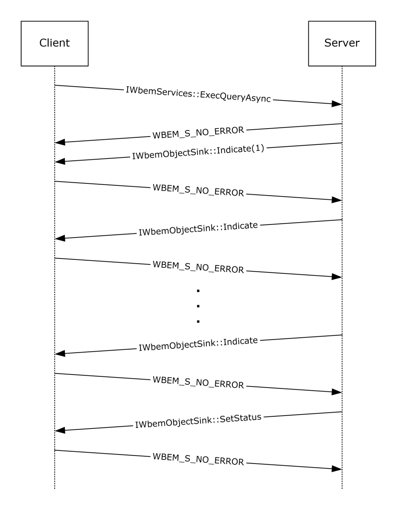
<!-- /Extracted images from page 192 -->

Figure 18: Asynchronous delivery of results

### 4.5 Optimized Asynchronous Delivery of Results

The asynchronous communication is optimized to reduce the network usage by making use of the
ObjectArray structure as specified in section 2.2.14.

A client supporting that capability notifies the server by returning 0x400FF (WBEM_S_NEW_STYLE) in
the first Indicate operation. A server that does not support the ObjectArray structure interprets this as
a success return code, while a server supporting the ObjectArray structure notices the code and sends
the rest of the results by using the ObjectArray structure, as specified in section 2.2.14.

[MS-WMI] - v20240423
Windows Management Instrumentation Remote Protocol
Copyright © 2024 Microsoft Corporation
Release: April 23, 2024

192 / 234

<!-- Extracted images from page 193 -->
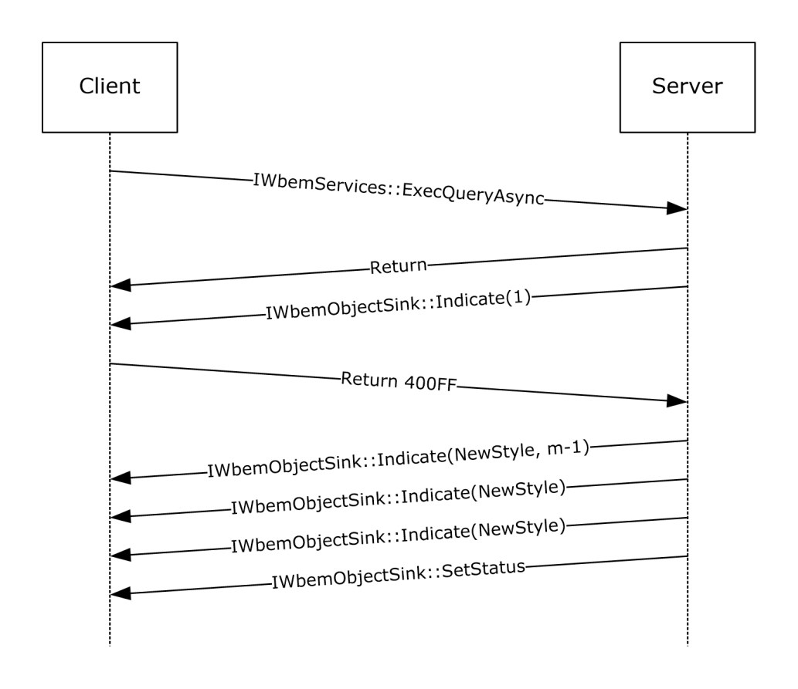
<!-- /Extracted images from page 193 -->

Figure 19: Optimized asynchronous delivery of results

### 4.6 Configuring Refreshing Services

When using the refresher mechanism, a client application that is connected to a remote computer
through an IWbemServices pointer uses the IRemUnknown and IRemUnknown2 interfaces, as
specified in [MS-DCOM], to obtain an IWbemRefreshingServices interface, and it adds CIM objects or
enumerators as needed. The following diagram illustrates this behavior.

[MS-WMI] - v20240423
Windows Management Instrumentation Remote Protocol
Copyright © 2024 Microsoft Corporation
Release: April 23, 2024

193 / 234

<!-- Extracted images from page 194 -->
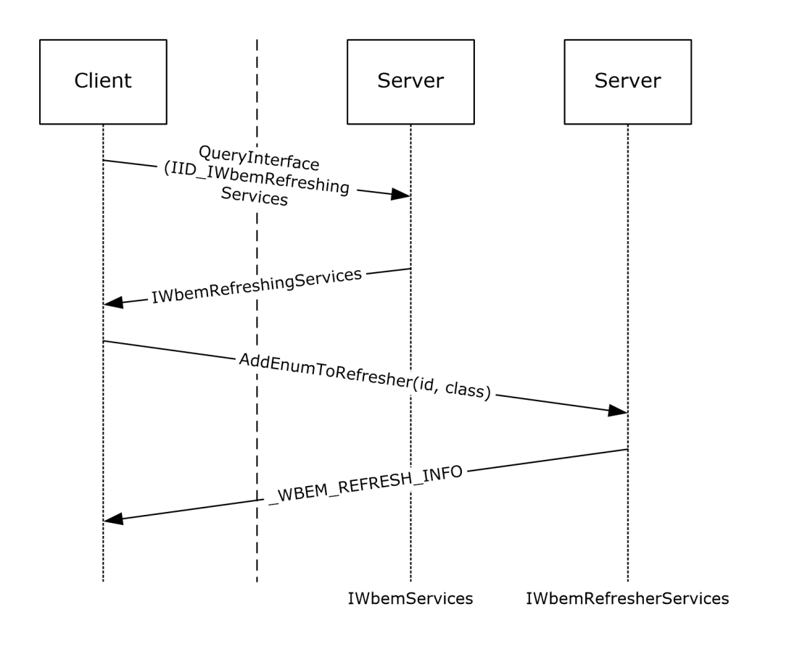
<!-- /Extracted images from page 194 -->

Figure 20: Configuring refreshing services

### 4.7 Using the Refresher Interface

The IWbemRemoteRefresher interface pointer that is returned from IWbemRefreshingServices is
used to obtain an updated result set. For the usage of the remote refresher, the client calls the
IWbemRemoteRefresher::RemoteRefresh method when the client needs to get an updated set of data.

[MS-WMI] - v20240423
Windows Management Instrumentation Remote Protocol
Copyright © 2024 Microsoft Corporation
Release: April 23, 2024

194 / 234

<!-- Extracted images from page 195 -->
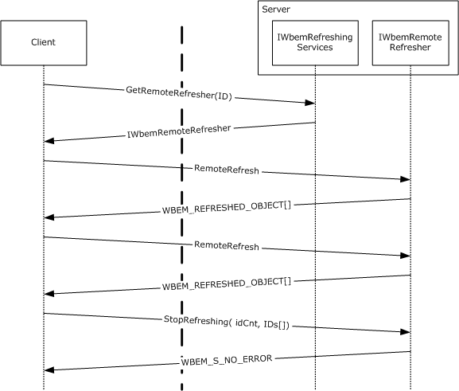
<!-- /Extracted images from page 195 -->

Figure 21: Using the refresher interface

[MS-WMI] - v20240423
Windows Management Instrumentation Remote Protocol
Copyright © 2024 Microsoft Corporation
Release: April 23, 2024

195 / 234

## 5 Security

The following sections specify security considerations for implementers of the Windows Management
Instrumentation Remote Protocol.

### 5.1 Security Considerations for Implementers

For all methods, the server MUST enforce that the DCOM security level is at least at the
RPC_C_AUTHN_LEVEL_CONNECT level, and SHOULD be at the RPC_C_AUTHN_LEVEL_PKT_INTEGRITY
level; the server MUST also evaluate the security principal rights to open a CIM namespace.<87>
The server MUST fail the operation if the security requirements are not met.

### 5.2 Index of Security Parameters

The server MUST secure access to each CIM namespace by using security descriptors<88> as
specified in [MS-DTYP].

The server MUST use the DCOM identity of the caller against the security descriptor of the namespace
to grant or deny the access.

The access mask that controls the security principal rights contains the following specific rights,
which are interpreted as specified in the table.

Constants

Value

Meaning

WBEM_ENABLE

WBEM_FULL_WRITE

0x1

0x4

Grants the security principal read permissions.

Grants the security principal to write to classes and instances.

WBEM_METHOD_EXECUTE

0x2

Grants the security principal to execute methods.

WBEM_PARTIAL_WRITE_REP  0x8

Grants the security principal to update or delete CIM instances that
are static.

WBEM_REMOTE_ENABLE

0x20

Grants the security principal to remotely access the server.

WBEM_WRITE_PROVIDER

0x10

Grants the security principal to update or delete CIM instances that
are dynamic.

READ_CONTROL

0x20000  Allows the security principal to read the security descriptor of CIM

namespace.

WRITE_DAC

0x40000  Allows the security principal to modify the security descriptor of CIM

namespace.

In order to change the namespace security descriptor, a client MUST use the Windows Management
Instrumentation Remote Protocol and the required CIM object encoding, as specified in [MS-WMIO].
To query or change the security descriptor, the __SystemSecurity class methods GetSD and SetSD
defined in section 2.2.30 MUST be used. To manage the namespace security, the __SystemSecurity
class MUST be implemented at the top level of every namespace. The GetSD and SetSD methods are
invoked as specified in sections 3.1.4.3.22 and 3.1.4.3.23.

If the event object that is delivered to the WMI server (as specified in 3.2.4.2.1) contains a non-null
SECURITY_DESCRIPTOR as specified in 2.2.4.2, the server MUST secure access to the event object by
using access controls specified in the security descriptor. The access mask that controls the security
principal rights has the following specific rights, which are interpreted as specified in the following
table.

[MS-WMI] - v20240423
Windows Management Instrumentation Remote Protocol
Copyright © 2024 Microsoft Corporation
Release: April 23, 2024

196 / 234

Constants

Value  Meaning

WBEM_RIGHTS_PUBLISH

0x80

Grants the security principal permission to send events to the WMI server
as specified in 3.2.4.2.1.

WBEM_RIGHT_SUBSCRIBE  0x40

Grants the security principal permission to receive the event object using
the IWbemServices::ExecNotificationQuery or
IWbemServices::ExecNotificationQueryAsync method call. If this
permission is not granted, the client can make
IWbemServices::ExecNotificationQuery or
IWbemServices::ExecNotificationQueryAsync calls, but the event is not
delivered.

[MS-WMI] - v20240423
Windows Management Instrumentation Remote Protocol
Copyright © 2024 Microsoft Corporation
Release: April 23, 2024

197 / 234

## 6 Appendix A: Full IDL

For ease of implementation, the full IDL is provided, where "ms-oaut.idl" is the IDL found in [MS-
OAUT] Appendix A.

 import "ms-dtyp.idl";
 import "ms-oaut.idl";

 typedef GUID *REFGUID;

 interface IWbemClassObject;
 interface IWbemServices;
 interface IWbemObjectSink;
 interface IEnumWbemClassObject;
 interface IWbemCallResult;
 interface IWbemContext;
 interface IWbemBackupRestore;
 interface IWbemBackupRestoreEx;
 interface IWbemLoginClientID;
 interface IWbemLevel1Login;
 interface IWbemLoginHelper;

 [
     restricted,
     uuid(8BC3F05E-D86B-11d0-A075-00C04FB68820)
 ]
 coclass WbemLevel1Login {
     interface IWbemLevel1Login;
 };

 typedef long HRESULT;

 typedef [v1_enum] enum tag_WBEM_QUERY_FLAG_TYPE {
     WBEM_FLAG_DEEP = 0,
     WBEM_FLAG_SHALLOW = 1,
     WBEM_FLAG_PROTOTYPE = 2
 } WBEM_QUERY_FLAG_TYPE;

 typedef [v1_enum] enum tag_WBEM_CHANGE_FLAG_TYPE {
     WBEM_FLAG_CREATE_OR_UPDATE = 0x00,
     WBEM_FLAG_UPDATE_ONLY = 0x01,
     WBEM_FLAG_CREATE_ONLY = 0x02,
     WBEM_FLAG_UPDATE_SAFE_MODE = 0x20,
     WBEM_FLAG_UPDATE_FORCE_MODE = 0x40
 } WBEM_CHANGE_FLAG_TYPE;

 typedef [v1_enum] enum tag_WBEM_CONNECT_OPTIONS {
     WBEM_FLAG_CONNECT_REPOSITORY_ONLY =  0x40,
     WBEM_FLAG_CONNECT_PROVIDERS       = 0x100
 } WBEM_CONNECT_OPTIONS;

 typedef [v1_enum] enum tag_WBEM_GENERIC_FLAG_TYPE {
     WBEM_FLAG_RETURN_WBEM_COMPLETE = 0x0,
     WBEM_FLAG_RETURN_IMMEDIATELY = 0x10,
     WBEM_FLAG_FORWARD_ONLY = 0x20,
     WBEM_FLAG_NO_ERROR_OBJECT = 0x40,
     WBEM_FLAG_SEND_STATUS = 0x80,
     WBEM_FLAG_ENSURE_LOCATABLE = 0x100,
     WBEM_FLAG_DIRECT_READ = 0x200,
     WBEM_MASK_RESERVED_FLAGS = 0x1F000,
     WBEM_FLAG_USE_AMENDED_QUALIFIERS = 0x20000,
     WBEM_FLAG_STRONG_VALIDATION = 0x100000
 } WBEM_GENERIC_FLAG_TYPE;

 typedef enum tag_WBEM_STATUS_TYPE {
     WBEM_STATUS_COMPLETE = 0,
     WBEM_STATUS_REQUIREMENTS = 0x01,

[MS-WMI] - v20240423
Windows Management Instrumentation Remote Protocol
Copyright © 2024 Microsoft Corporation
Release: April 23, 2024

198 / 234

     WBEM_STATUS_PROGRESS = 2
 } WBEM_STATUS_TYPE;

 typedef [v1_enum] enum tag_WBEM_TIMEOUT_TYPE {
     WBEM_NO_WAIT = 0,
     WBEM_INFINITE = 0xFFFFFFFF
 } WBEM_TIMEOUT_TYPE;

 typedef [v1_enum] enum tag_WBEM_BACKUP_RESTORE_FLAGS {
     WBEM_FLAG_BACKUP_RESTORE_FORCE_SHUTDOWN = 1
 } WBEM_BACKUP_RESTORE_FLAGS;

 typedef [v1_enum] enum tag_WBEMSTATUS {
     WBEM_S_NO_ERROR = 0x00,
     WBEM_S_FALSE = 0x01,
     WBEM_S_TIMEDOUT = 0x40004,
     WBEM_S_NEW_STYLE = 0x400FF,
     WBEM_S_PARTIAL_RESULTS = 0x40010,
     WBEM_E_FAILED = 0x80041001,
     WBEM_E_NOT_FOUND = 0x80041002,
     WBEM_E_ACCESS_DENIED = 0x80041003,
     WBEM_E_PROVIDER_FAILURE = 0x80041004,
     WBEM_E_TYPE_MISMATCH = 0x80041005,
     WBEM_E_OUT_OF_MEMORY = 0x80041006,
     WBEM_E_INVALID_CONTEXT = 0x80041007,
     WBEM_E_INVALID_PARAMETER = 0x80041008,
     WBEM_E_NOT_AVAILABLE = 0x80041009,
     WBEM_E_CRITICAL_ERROR = 0x8004100a,
     WBEM_E_NOT_SUPPORTED = 0x8004100C,
     WBEM_E_PROVIDER_NOT_FOUND = 0x80041011,
     WBEM_E_INVALID_PROVIDER_REGISTRATION = 0x80041012,
     WBEM_E_PROVIDER_LOAD_FAILURE = 0x80041013,
     WBEM_E_INITIALIZATION_FAILURE = 0x80041014,
     WBEM_E_TRANSPORT_FAILURE = 0x80041015,
     WBEM_E_INVALID_OPERATION = 0x80041016,
     WBEM_E_ALREADY_EXISTS = 0x80041019,
     WBEM_E_UNEXPECTED = 0x8004101d,
     WBEM_E_INCOMPLETE_CLASS = 0x80041020,
     WBEM_E_SHUTTING_DOWN = 0x80041033,
     E_NOTIMPL = 0x80004001,
     WBEM_E_INVALID_SUPERCLASS = 0x8004100D,
     WBEM_E_INVALID_NAMESPACE = 0x8004100E,
     WBEM_E_INVALID_OBJECT = 0x8004100F,
     WBEM_E_INVALID_CLASS = 0x80041010,
     WBEM_E_INVALID_QUERY = 0x80041017,
     WBEM_E_INVALID_QUERY_TYPE = 0x80041018,
     WBEM_E_PROVIDER_NOT_CAPABLE = 0x80041024,
     WBEM_E_CLASS_HAS_CHILDREN = 0x80041025,
     WBEM_E_CLASS_HAS_INSTANCES = 0x80041026,
     WBEM_E_ILLEGAL_NULL = 0x80041028,
     WBEM_E_INVALID_CIM_TYPE = 0x8004102D,
     WBEM_E_INVALID_METHOD = 0x8004102E,
     WBEM_E_INVALID_METHOD_PARAMETERS = 0x8004102F,
     WBEM_E_INVALID_PROPERTY = 0x80041031,
     WBEM_E_CALL_CANCELLED = 0x80041032,
     WBEM_E_INVALID_OBJECT_PATH = 0x8004103A,
     WBEM_E_OUT_OF_DISK_SPACE = 0x8004103B,
     WBEM_E_UNSUPPORTED_PUT_EXTENSION = 0x8004103D,
     WBEM_E_QUOTA_VIOLATION = 0x8004106c,
     WBEM_E_SERVER_TOO_BUSY = 0x80041045,
     WBEM_E_METHOD_NOT_IMPLEMENTED = 0x80041055,
     WBEM_E_METHOD_DISABLED = 0x80041056,
     WBEM_E_UNPARSABLE_QUERY = 0x80041058,
     WBEM_E_NOT_EVENT_CLASS = 0x80041059,
     WBEM_E_MISSING_GROUP_WITHIN = 0x8004105A,
     WBEM_E_MISSING_AGGREGATION_LIST = 0x8004105B,
     WBEM_E_PROPERTY_NOT_AN_OBJECT = 0x8004105c,
     WBEM_E_AGGREGATING_BY_OBJECT = 0x8004105d,
     WBEM_E_BACKUP_RESTORE_WINMGMT_RUNNING = 0x80041060,

[MS-WMI] - v20240423
Windows Management Instrumentation Remote Protocol
Copyright © 2024 Microsoft Corporation
Release: April 23, 2024

199 / 234

     WBEM_E_QUEUE_OVERFLOW = 0x80041061,
     WBEM_E_PRIVILEGE_NOT_HELD = 0x80041062,
     WBEM_E_INVALID_OPERATOR = 0x80041063,
     WBEM_E_CANNOT_BE_ABSTRACT = 0x80041065,
     WBEM_E_AMENDED_OBJECT = 0x80041066,
     WBEM_E_VETO_PUT = 0x8004107A,
     WBEM_E_PROVIDER_SUSPENDED = 0x80041081,
     WBEM_E_ENCRYPTED_CONNECTION_REQUIRED = 0x80041087,
     WBEM_E_PROVIDER_TIMED_OUT = 0x80041088,
     WBEM_E_NO_KEY = 0x80041089,
     WBEM_E_PROVIDER_DISABLED = 0x8004108a,
     WBEM_E_REGISTRATION_TOO_BROAD = 0x80042001,
     WBEM_E_REGISTRATION_TOO_PRECISE = 0x80042002
 }   WBEMSTATUS;

 [
     restricted,
     uuid(674B6698-EE92-11d0-AD71-00C04FD8FDFF)
 ]
 coclass WbemContext
 {
     interface IWbemContext;
 };

 [
     uuid(9A653086-174F-11d2-B5F9-00104B703EFD)
 ]
 coclass WbemClassObject
 {
     interface IWbemClassObject;
 };

 [
     uuid(C49E32C6-BC8B-11d2-85D4-00105A1F8304)
 ]
 coclass WbemBackupRestore
 {
     interface IWbemBackupRestoreEx;
 };

 #define OPTIONAL in, unique

 interface IWbemQualifierSet;

 [
     local,
     restricted,
     object,
     uuid(dc12a681-737f-11cf-884d-00aa004b2e24)
 ]
 interface IWbemClassObject : IUnknown
 {
 };

 interface IWbemServices;

 [
     object,
     restricted,
     uuid(7c857801-7381-11cf-884d-00aa004b2e24)
 ]
 interface IWbemObjectSink : IUnknown
 {
     HRESULT Indicate(
         [in] long lObjectCount,

[MS-WMI] - v20240423
Windows Management Instrumentation Remote Protocol
Copyright © 2024 Microsoft Corporation
Release: April 23, 2024

200 / 234

         [in, size_is(lObjectCount)]
             IWbemClassObject** apObjArray
     );

     HRESULT SetStatus(
         [in] long lFlags,
         [in] HRESULT hResult,
         [in] BSTR strParam,
         [in] IWbemClassObject* pObjParam
     );
 };

 [
     object,
     restricted,
     uuid(027947e1-d731-11ce-a357-000000000001)
 ]
 interface IEnumWbemClassObject : IUnknown
 {
     HRESULT Reset();

     HRESULT Next(
         [in]  long lTimeout,
         [in]  ULONG uCount,
         [out, size_is(uCount), length_is(*puReturned)]
               IWbemClassObject** apObjects,
         [out] ULONG* puReturned
     );

     HRESULT NextAsync(
         [in]  ULONG uCount,
         [in]  IWbemObjectSink* pSink
     );

     HRESULT Clone(
         [out] IEnumWbemClassObject** ppEnum
     );

     HRESULT Skip(
         [in] long lTimeout,
         [in] ULONG nCount
     );
 };

 [
     object,
     restricted,
     local,
     uuid(44aca674-e8fc-11d0-a07c-00c04fb68820)
 ]
 interface IWbemContext : IUnknown
 {
 };

 [
     object,
     restricted,
     uuid(44aca675-e8fc-11d0-a07c-00c04fb68820)
 ]
 interface IWbemCallResult : IUnknown
 {
     HRESULT GetResultObject(
         [in]  long lTimeout,
         [out] IWbemClassObject** ppResultObject
     );

     HRESULT GetResultString(

[MS-WMI] - v20240423
Windows Management Instrumentation Remote Protocol
Copyright © 2024 Microsoft Corporation
Release: April 23, 2024

201 / 234

         [in]  long lTimeout,
         [out] BSTR* pstrResultString
     );

     HRESULT GetResultServices(
         [in]  long lTimeout,
         [out] IWbemServices** ppServices
     );

     HRESULT GetCallStatus(
         [in]  long lTimeout,
         [out] long* plStatus
     );
 };

 [
     object,
     restricted,
     uuid(9556dc99-828c-11cf-a37e-00aa003240c7),
     pointer_default(unique)
 ]
 interface IWbemServices : IUnknown
 {
     HRESULT OpenNamespace(
         [in]  const BSTR strNamespace,
         [in]  long lFlags,
         [in]  IWbemContext* pCtx,
         [out, in, unique] IWbemServices** ppWorkingNamespace,
         [out, in, unique] IWbemCallResult** ppResult
     );

     HRESULT CancelAsyncCall(
         [in] IWbemObjectSink* pSink
     );

     HRESULT QueryObjectSink(
         [in] long lFlags,
         [out] IWbemObjectSink** ppResponseHandler
     );

     HRESULT GetObject(
         [in]  const BSTR strObjectPath,
         [in]  long lFlags,
         [in]  IWbemContext* pCtx,
         [out, in, unique] IWbemClassObject** ppObject,
         [out, in, unique] IWbemCallResult** ppCallResult
     );

     HRESULT GetObjectAsync(
         [in]  const BSTR strObjectPath,
         [in]  long lFlags,
         [in]  IWbemContext* pCtx,
         [in]  IWbemObjectSink* pResponseHandler
     );

     HRESULT PutClass(
         [in] IWbemClassObject* pObject,
         [in] long lFlags,
         [in]  IWbemContext* pCtx,
         [out, in, unique] IWbemCallResult** ppCallResult
     );

     HRESULT PutClassAsync(
         [in] IWbemClassObject* pObject,
         [in] long lFlags,
         [in] IWbemContext* pCtx,
         [in] IWbemObjectSink* pResponseHandler
     );

[MS-WMI] - v20240423
Windows Management Instrumentation Remote Protocol
Copyright © 2024 Microsoft Corporation
Release: April 23, 2024

202 / 234

     HRESULT DeleteClass(
         [in] const BSTR strClass,
         [in] long lFlags,
         [in] IWbemContext* pCtx,
         [out, in, unique] IWbemCallResult** ppCallResult
     );

     HRESULT DeleteClassAsync(
         [in] const BSTR strClass,
         [in] long lFlags,
         [in] IWbemContext* pCtx,
         [in] IWbemObjectSink* pResponseHandler
     );

     HRESULT CreateClassEnum(
         [in]  const BSTR strSuperclass,
         [in]  long lFlags,
         [in]  IWbemContext* pCtx,
         [out] IEnumWbemClassObject** ppEnum
     );

     HRESULT CreateClassEnumAsync(
         [in]  const BSTR strSuperclass,
         [in]  long lFlags,
         [in]  IWbemContext* pCtx,
         [in]  IWbemObjectSink* pResponseHandler
     );

     HRESULT PutInstance(
         [in]  IWbemClassObject* pInst,
         [in]  long lFlags,
         [in]  IWbemContext* pCtx,
         [out, in, unique] IWbemCallResult** ppCallResult
     );

     HRESULT PutInstanceAsync(
         [in] IWbemClassObject* pInst,
         [in] long lFlags,
         [in] IWbemContext* pCtx,
         [in] IWbemObjectSink* pResponseHandler
     );

     HRESULT DeleteInstance(
         [in] const BSTR strObjectPath,
         [in] long lFlags,
         [in]  IWbemContext* pCtx,
         [out, in, unique] IWbemCallResult** ppCallResult
     );

     HRESULT DeleteInstanceAsync(
         [in] const BSTR strObjectPath,
         [in] long lFlags,
         [in] IWbemContext* pCtx,
         [in] IWbemObjectSink* pResponseHandler
     );

     HRESULT CreateInstanceEnum(
         [in] const BSTR strSuperClass,
         [in] long lFlags,
         [in]  IWbemContext* pCtx,
         [out] IEnumWbemClassObject** ppEnum
     );

     HRESULT CreateInstanceEnumAsync(
         [in] const BSTR strSuperClass,
         [in] long lFlags,
         [in] IWbemContext* pCtx,
         [in] IWbemObjectSink* pResponseHandler

[MS-WMI] - v20240423
Windows Management Instrumentation Remote Protocol
Copyright © 2024 Microsoft Corporation
Release: April 23, 2024

203 / 234

     );

     HRESULT ExecQuery(
         [in]  const BSTR strQueryLanguage,
         [in]  const BSTR strQuery,
         [in]  long lFlags,
         [in]  IWbemContext* pCtx,
         [out] IEnumWbemClassObject** ppEnum
     );

     HRESULT ExecQueryAsync(
         [in] const BSTR strQueryLanguage,
         [in] const BSTR strQuery,
         [in] long lFlags,
         [in] IWbemContext* pCtx,
         [in] IWbemObjectSink* pResponseHandler
     );

     HRESULT ExecNotificationQuery(
         [in] const BSTR strQueryLanguage,
         [in] const BSTR strQuery,
         [in] long lFlags,
         [in]  IWbemContext* pCtx,
         [out] IEnumWbemClassObject** ppEnum
     );

     HRESULT ExecNotificationQueryAsync(
         [in] const BSTR strQueryLanguage,
         [in] const BSTR strQuery,
         [in] long lFlags,
         [in] IWbemContext* pCtx,
         [in] IWbemObjectSink* pResponseHandler
     );

     HRESULT ExecMethod(
         [in] const BSTR strObjectPath,
         [in] const BSTR strMethodName,
         [in] long lFlags,
         [in] IWbemContext* pCtx,
         [in] IWbemClassObject* pInParams,
         [out, in, unique] IWbemClassObject** ppOutParams,
         [out, in, unique] IWbemCallResult** ppCallResult
     );

     HRESULT ExecMethodAsync(
         [in] const BSTR strObjectPath,
         [in] const BSTR strMethodName,
         [in] long lFlags,
         [in] IWbemContext* pCtx,
         [in] IWbemClassObject* pInParams,
         [in] IWbemObjectSink* pResponseHandler
     );
 };

 [
     object,
     restricted,
     uuid(C49E32C7-BC8B-11d2-85D4-00105A1F8304)
 ]
 interface IWbemBackupRestore : IUnknown
 {
     HRESULT Backup(
         [in, string] LPCWSTR strBackupToFile,
         [in] long lFlags
     );

     HRESULT Restore(
         [in, string] LPCWSTR strRestoreFromFile,
         [in] long lFlags

[MS-WMI] - v20240423
Windows Management Instrumentation Remote Protocol
Copyright © 2024 Microsoft Corporation
Release: April 23, 2024

204 / 234

     );
 };

 [
     object,
     restricted,
     uuid(A359DEC5-E813-4834-8A2A-BA7F1D777D76)
 ]
 interface IWbemBackupRestoreEx : IWbemBackupRestore
 {
     HRESULT Pause();
     HRESULT Resume();
 };

 typedef enum _WBEM_REFR_VERSION_NUMBER {
     WBEM_REFRESHER_VERSION  = 2
 } WBEM_REFR_VERSION_NUMBER;

 typedef [v1_enum] enum _WBEM_INSTANCE_BLOB_TYPE {
     WBEM_BLOB_TYPE_ALL = 2,
     WBEM_BLOB_TYPE_ERROR = 3,
     WBEM_BLOB_TYPE_ENUM = 4
 } WBEM_INSTANCE_BLOB_TYPE;

 typedef struct _WBEM_REFRESHED_OBJECT {
     long m_lRequestId;
     WBEM_INSTANCE_BLOB_TYPE m_lBlobType;
     long m_lBlobLength;
     [size_is(m_lBlobLength)] byte* m_pbBlob;
 } WBEM_REFRESHED_OBJECT;

 [
     restricted,
     uuid(F1E9C5B2-F59B-11d2-B362-00105A1F8177)
 ]
 interface IWbemRemoteRefresher : IUnknown {
     HRESULT RemoteRefresh(
         [in] long lFlags,
         [out] long* plNumObjects,
         [out, size_is(,*plNumObjects)]
             WBEM_REFRESHED_OBJECT** paObjects
     );

     HRESULT StopRefreshing(
         [in] long lNumIds,
         [in, size_is(lNumIds)] long* aplIds,
         [in] long lFlags
     );

     HRESULT Opnum5NotUsedOnWire(
         [in] long lFlags,
         [out] GUID* pGuid
     );
 };

 typedef struct {
     IWbemRemoteRefresher* m_pRefresher;
     IWbemClassObject*     m_pTemplate;
     GUID                  m_Guid;
 } _WBEM_REFRESH_INFO_REMOTE;

 typedef struct {
     [string] wchar_t* m_wszNamespace;
     IWbemClassObject* m_pTemplate;
 } _WBEM_REFRESH_INFO_NON_HIPERF;

[MS-WMI] - v20240423
Windows Management Instrumentation Remote Protocol
Copyright © 2024 Microsoft Corporation
Release: April 23, 2024

205 / 234

 typedef enum
 {
     WBEM_REFRESH_TYPE_INVALID = 0,
     WBEM_REFRESH_TYPE_REMOTE = 3,
     WBEM_REFRESH_TYPE_NON_HIPERF = 6
 }WBEM_REFRESH_TYPE;

 typedef [switch_type(long)] union {
     [case (WBEM_REFRESH_TYPE_REMOTE)]
         _WBEM_REFRESH_INFO_REMOTE m_Remote;

     [case (WBEM_REFRESH_TYPE_NON_HIPERF)]
         _WBEM_REFRESH_INFO_NON_HIPERF m_NonHiPerf;

     [case (WBEM_REFRESH_TYPE_INVALID)]
         HRESULT m_hres;

 } WBEM_REFRESH_INFO_UNION;

 typedef struct {
     long m_lType;
     [switch_is(m_lType)] WBEM_REFRESH_INFO_UNION m_Info;
     long m_lCancelId;
 } _WBEM_REFRESH_INFO;

 typedef struct {
     [string] LPSTR m_szMachineName;
     DWORD          m_dwProcessId;
     GUID           m_guidRefresherId;
 } _WBEM_REFRESHER_ID;

 typedef enum {
    WBEM_RECONNECT_TYPE_OBJECT = 0,
    WBEM_RECONNECT_TYPE_ENUM = 1,
    WBEM_RECONNECT_TYPE_LAST = 2
 }WBEM_RECONNECT_TYPE;

 typedef struct {
     long m_lType;
     [string] LPCWSTR m_pwcsPath;
 } _WBEM_RECONNECT_INFO;

 typedef struct {
    long m_lId;
    HRESULT m_hr;
 } _WBEM_RECONNECT_RESULTS;

 [
     restricted,
     uuid(2C9273E0-1DC3-11d3-B364-00105A1F8177)
 ]
 interface IWbemRefreshingServices : IUnknown
 {
     HRESULT AddObjectToRefresher(
         [in] _WBEM_REFRESHER_ID* pRefresherId,
         [in, string] LPCWSTR wszPath,
         [in] long lFlags,
         [in] IWbemContext* pContext,
         [in] DWORD dwClientRefrVersion,
         [out] _WBEM_REFRESH_INFO* pInfo,
         [out] DWORD* pdwSvrRefrVersion
     );

     HRESULT AddObjectToRefresherByTemplate(
         [in] _WBEM_REFRESHER_ID* pRefresherId,
         [in] IWbemClassObject* pTemplate,
         [in] long lFlags,
         [in] IWbemContext* pContext,
         [in] DWORD dwClientRefrVersion,

[MS-WMI] - v20240423
Windows Management Instrumentation Remote Protocol
Copyright © 2024 Microsoft Corporation
Release: April 23, 2024

206 / 234

         [out] _WBEM_REFRESH_INFO* pInfo,
         [out] DWORD* pdwSvrRefrVersion
     );

     HRESULT AddEnumToRefresher(
         [in] _WBEM_REFRESHER_ID* pRefresherId,
         [in, string] LPCWSTR wszClass,
         [in] long lFlags,
         [in] IWbemContext* pContext,
         [in] DWORD dwClientRefrVersion,
         [out] _WBEM_REFRESH_INFO* pInfo,
         [out] DWORD* pdwSvrRefrVersion
     );

     HRESULT RemoveObjectFromRefresher(
         [in] _WBEM_REFRESHER_ID* pRefresherId,
         [in] long lId,
         [in] long lFlags,
         [in] DWORD dwClientRefrVersion,
         [out] DWORD* pdwSvrRefrVersion
     );

     HRESULT GetRemoteRefresher(
         [in] _WBEM_REFRESHER_ID* pRefresherId,
         [in] long lFlags,
         [in] DWORD dwClientRefrVersion,
         [out] IWbemRemoteRefresher** ppRemRefresher,
         [out] GUID* pGuid,
         [out] DWORD* pdwSvrRefrVersion
     );

     HRESULT ReconnectRemoteRefresher(
         [in] _WBEM_REFRESHER_ID* pRefresherId,
         [in] long lFlags,
         [in] long lNumObjects,
         [in] DWORD dwClientRefrVersion,
         [in, size_is(lNumObjects)]
             _WBEM_RECONNECT_INFO* apReconnectInfo,
         [in, out, size_is(lNumObjects)]
             _WBEM_RECONNECT_RESULTS* apReconnectResults,
         [out] DWORD* pdwSvrRefrVersion
     );
 };

 [
     restricted,
     object,
     uuid(423EC01E-2E35-11d2-B604-00104B703EFD)
 ]
 interface IWbemWCOSmartEnum : IUnknown
 {
     HRESULT Next(
         [in] REFGUID proxyGUID,
         [in] long lTimeout,
         [in] ULONG uCount,
         [out] ULONG* puReturned,
         [out] ULONG* pdwBuffSize,
         [out, size_is(,*pdwBuffSize)] byte** pBuffer
         );
 };

 [
     restricted,
     object,
     uuid(1C1C45EE-4395-11d2-B60B-00104B703EFD)
 ]
 interface IWbemFetchSmartEnum : IUnknown
 {

[MS-WMI] - v20240423
Windows Management Instrumentation Remote Protocol
Copyright © 2024 Microsoft Corporation
Release: April 23, 2024

207 / 234

     HRESULT GetSmartEnum(
         [out] IWbemWCOSmartEnum** ppSmartEnum
     );
 };

 [
     restricted,
     object,
     uuid(d4781cd6-e5d3-44df-ad94-930efe48a887)
 ]
 interface IWbemLoginClientID : IUnknown
 {
     HRESULT SetClientInfo(
         [in, unique, string ] LPWSTR wszClientMachine,
         [in] long lClientProcId,
         [in] long lReserved
     );
 };

 [
     object,
     restricted,
     uuid(F309AD18-D86A-11d0-A075-00C04FB68820),
     pointer_default(unique)
 ]
 interface IWbemLevel1Login :  IUnknown
 {
     HRESULT EstablishPosition(
         [in, unique, string] wchar_t* reserved1,
         [in] DWORD reserved2,
         [out] DWORD* LocaleVersion
     );

     HRESULT RequestChallenge(
         [in, unique, string] wchar_t* reserved1,
         [in, unique, string] wchar_t* reserved2,
         [out, size_is(16), length_is(16)] unsigned char* reserved3
     );

     HRESULT WBEMLogin(
         [in, unique, string] wchar_t* reserved1,
         [in, size_is(16), length_is(16), unique]
                 unsigned char* reserved2,
         [in] long reserved3,
         [in] IWbemContext* reserved4,
         [out] IWbemServices** reserved5
     );

     HRESULT NTLMLogin(
         [in, unique, string] LPWSTR wszNetworkResource,
         [in, unique, string] LPWSTR wszPreferredLocale,
         [in]   long lFlags,
         [in]   IWbemContext* pCtx,
         [out]  IWbemServices** ppNamespace
     );

 };

 [
     restricted,
     object,
     uuid(541679AB-2E5F-11d3-B34E-00104BCC4B4A)
 ]
 interface IWbemLoginHelper : IUnknown
 {
     HRESULT SetEvent(
         [in] LPCSTR sEventToSet
     );

[MS-WMI] - v20240423
Windows Management Instrumentation Remote Protocol
Copyright © 2024 Microsoft Corporation
Release: April 23, 2024

208 / 234

 };

[MS-WMI] - v20240423
Windows Management Instrumentation Remote Protocol
Copyright © 2024 Microsoft Corporation
Release: April 23, 2024

209 / 234

## 7 Appendix B: Product Behavior

The information in this specification is applicable to the following Microsoft products or supplemental
software. References to product versions include updates to those products.

The terms "earlier" and "later", when used with a product version, refer to either all preceding
versions or all subsequent versions, respectively. The term "through" refers to the inclusive range of
versions. Applicable Microsoft products are listed chronologically in this section.

Windows Client

  Windows NT 4.0 operating system

  Windows 2000 Professional operating system

  Windows XP operating system

  Windows XP 64-Bit Edition operating system

  Windows Vista operating system

  Windows 7 operating system

  Windows 8 operating system

  Windows 8.1 operating system

  Windows 10 operating system

  Windows 11 operating system

Windows Server

  Windows NT Server operating system

  Windows 2000 Server operating system

  Windows Server 2003 operating system

  Windows Server 2003 operating system with Service Pack 2 (SP2)

  Windows Server 2008 operating system

  Windows Server 2008 R2 operating system

  Windows Server 2012 operating system

  Windows Server 2012 R2 operating system

  Windows Server 2016 operating system

  Windows Server operating system

  Windows Server 2019 operating system

  Windows Server 2022 operating system

  Windows Server 2025 operating system

Exceptions, if any, are noted in this section. If an update version, service pack or Knowledge Base
(KB) number appears with a product name, the behavior changed in that update. The new behavior

[MS-WMI] - v20240423
Windows Management Instrumentation Remote Protocol
Copyright © 2024 Microsoft Corporation
Release: April 23, 2024

210 / 234

also applies to subsequent updates unless otherwise specified. If a product edition appears with the
product version, behavior is different in that product edition.

Unless otherwise specified, any statement of optional behavior in this specification that is prescribed
using the terms "SHOULD" or "SHOULD NOT" implies product behavior in accordance with the
SHOULD or SHOULD NOT prescription. Unless otherwise specified, the term "MAY" implies that the
product does not follow the prescription.

<1> Section 2.2.6: The prefix "__" is specific to Windows and is not a CIM standard.

<2> Section 2.2.12: Windows interprets the flags as follows:

WBEM_FLAG_CONNECT_REPOSITORY_ONLY: The connection is established to operate only on
the static data (classes and instances) stored in the CIM database. Operations requiring a
provider will not be supported on this connection.

WBEM_FLAG_CONNECT_PROVIDERS: The connection is established to operate only on the

provider.

<3> Section 2.2.13: A Windows client builds the IWbemContext object by using a set of specific
IWbemContext methods to add, delete, and enumerate properties with their respective values. The
IWbemContext methods are not used by the protocol at any time. They are used internally by the
client and the server to manage the content of the object.

The following Windows versions support the context properties in the table: Windows XP operating
system Service Pack 1 (SP1), Windows Server 2003 operating system with Service Pack 1 (SP1),
Windows Vista, Windows Server 2008, Windows 7, and Windows Server 2008 R2 operating system.
Prior versions of Windows ignore these values.

<4> Section 2.2.13.4: 32-bit versions of Windows set the value to 4; however, 64-bit versions of
Windows set the value to 8.

<5> Section 2.2.13.4: 32-bit versions of Windows set the value to 4; however, 64-bit versions of
Windows set the value to 8.

<6> Section 2.2.14:  This optimization technique is being used by Windows starting with Windows XP
and Windows Server 2003.

<7> Section 2.2.21: Windows uses the m_dwProcessId as the process identifier.

<8> Section 2.2.30.1: Windows 2000 Professional and later and Windows Server 2003 and later do
not return errors using the return value of the GetSD CIM method. Errors are returned as an error in
the IWbemServices interface method call.

<9> Section 2.2.30.2: Windows 2000 Professional and later and Windows Server 2003 and later do
not return errors using the return value of the GetSD CIM method. Errors are returned as an error in
the IWbemServices interface method call.

<10> Section 2.2.30.3: On Windows NT 4.0, Windows 2000 Professional, Windows 2000 Server,
Windows Server 2003, Windows XP, and Windows XP SP1, the RequiresEncryption qualifier is
ignored.

<11> Section 2.2.32: In Windows, the security descriptor of a namespace can be specified explicitly in
an MOF file, using the NamespaceSecuritySDDL qualifier. The qualifier is a string in the security
descriptor definition language (SDDL) format. If no NamespaceSecuritySDDL qualifier is present, the
server initializes the security descriptor for the namespace to the default value.

<12> Section 3.1.1: In Windows, the limit is 5000.

<13> Section 3.1.1: In Windows, the security descriptor of a namespace can be specified explicitly in
an MOF file, using the NamespaceSecuritySDDL qualifier. The qualifier is a string in the security

211 / 234

[MS-WMI] - v20240423
Windows Management Instrumentation Remote Protocol
Copyright © 2024 Microsoft Corporation
Release: April 23, 2024

descriptor definition language (SDDL) format. If no NamespaceSecuritySDDL qualifier is present, the
server initializes the security descriptor for the namespace to the default value.

The security groups refer to the values defined in [MS-DTYP] section 2.4.2.4.

Starting with Windows Vista, the default security groups are:

  AUTHENTICATED_USERS



LOCAL_SERVICE

  NETWORK_SERVICE

  BUILTIN_ADMINISTRATORS

In Windows Server 2003, Windows XP, Windows 2000 Server, Windows 2000 Professional, and
Windows NT 4.0, the default security groups are:

  BUILTIN_ADMINISTRATORS



LOCAL_SERVICE

  NETWORK_SERVICE



EVERYONE

The default access permissions for the AUTHENTICATED_USERS, LOCAL_SERVICE, and
NETWORK_SERVICE are:

  WBEM_METHOD_EXECUTE

  WBEM_FULL_WRITE

  WBEM_ENABLE

<14> Section 3.1.1: "WQL:References" is used in Windows NT Server, Windows NT 4.0, and Windows
2000 Server only.

<15> Section 3.1.1.1.3: Windows does not send progress information.

<16> Section 3.1.1.1.3: Windows tries to make the call at the highest authentication level,
RPC_C_AUTHN_PKT_PRIVACY. If UnsecAppAccessControlDefault is set to false, Windows gradually
downgrades (decreasing the authentication level by one level at every call) to RPC_C_AUTHN_NONE if
the DCOM Remote Protocol (as specified in [MS-DCOM]) is unable to use the current authentication
level. The minimum authentication level for Windows 2000 Professional and Windows 2000 Server is
RPC_C_AUTHN_LEVEL_CONNECT. In Windows 2000 Professional and Windows 2000 Server, Windows
XP, and Windows Server 2003, the server does not check for the AllowAnonymousCallback flag prior
to making anonymous callbacks to the client.

In Windows Vista and later and Windows Server 2008 and later, the AllowAnonymousCallback value
will be retrieved from registry location
HKLM\SOFTWARE\Microsoft\WBEM\CIMOM\AllowAnonymousCallback. In Windows 2000 Professional
and Windows XP, the server does not check for the UnsecAppAccessControlDefault flag prior to
downgrading the authentication level.

In Windows Server 2003 and later and Windows Vista and later, the UnsecAppAccessControlDefault
value will be retrieved from registry location
HKLM\Software\Microsoft\WBEM\CIMOM\UnsecAppAccessControlDefault.

<17> Section 3.1.3: In Windows 2000 Professional, Windows 2000 Server, Windows XP, and Windows
Server 2003, this value is set to True.

212 / 234

[MS-WMI] - v20240423
Windows Management Instrumentation Remote Protocol
Copyright © 2024 Microsoft Corporation
Release: April 23, 2024

<18> Section 3.1.4: The following Windows versions support ordered array types:

  Windows NT operating system

  Windows NT 4.0

  Windows XP 64-Bit Edition

<19> Section 3.1.4: Windows secures the access to each namespace and accepts only authenticated
calls made at least at the RPC_C_AUTHN_LEVEL_CONNECT level. Windows behavior across different
operating systems is specified in the following table.

Operating system version

Minimum authentication level

Windows NT

RPC_C_AUTHN_LEVEL_CONNECT

Windows 2000 operating system

RPC_C_AUTHN_LEVEL_CONNECT

Windows 2000 Professional operating system Service Pack 3 (SP3)  RPC_C_AUTHN_LEVEL_PKT

Windows XP

Windows Server 2003

Windows Vista

RPC_C_AUTHN_LEVEL_PKT

RPC_C_AUTHN_LEVEL_PKT

RPC_C_AUTHN_LEVEL_PKT

<20> Section 3.1.4: Windows NT Server and Windows NT 4.0 do not allow the static properties to be
modified.

<21> Section 3.1.4: Windows allows providers to do the impersonation or do additional authentication
and authorization checks based on the security principal of the caller.

<22> Section 3.1.4: On Windows NT 4.0, Windows 2000, Windows Server 2003, Windows XP, and
Windows XP SP1, the RequiresEncryption qualifier is ignored.

<23> Section 3.1.4: In Windows Server 2008 and Windows Server 2008 R2, if the number of active
IWbemService objects for root\virtualization namespace is more than 4096, the server returns
WBEM_E_QUOTA_VIOLATION.

<24> Section 3.1.4:  Windows 2000, Windows XP, Windows Server 2003, Windows Vista, Windows
Server 2008, and Windows 7 do not use this.

<25> Section 3.1.4:  Windows 2000, Windows XP, Windows Server 2003, Windows Vista, Windows
Server 2008, and Windows 7 do not use this.

<26> Section 3.1.4: Windows 2000, Windows XP, Windows Server 2003, Windows Vista, Windows
Server 2008, and Windows 7 do not set this option. Windows 8 and later and Windows Server 2012
and later set this option when WMI C-Client APIs are used but not when the IWbemServices COM
interface is used.

<27> Section 3.1.4.1.1: If the server accepts as a locale parameter for the
IWbemLevel1Login::NTLMLogin method all locales valid for Windows Vista as defined in Appendix A of
[MS-LCID], the server returns WBEM_S_NO_ERROR for IWbemLevel1Login::EstablishPosition.

<28> Section 3.1.4.1.1: If the server returns WBEM_E_INVALID_PARAMETER for any valid Windows
Vista locales as specified in Appendix A of [MS-LCID] that has been passed as a locale parameter to
the IWbemLevel1Login::NTLMLogin method while all other parameters are valid, the server returns
E_NOTIMPL for IWbemLevel1Login::EstablishPosition.

[MS-WMI] - v20240423
Windows Management Instrumentation Remote Protocol
Copyright © 2024 Microsoft Corporation
Release: April 23, 2024

213 / 234

<29> Section 3.1.4.1.4: In Windows, it is the Windows system locale of the server.

<30> Section 3.1.4.1.4: Windows 2000 and later and Windows XP and later fail the call and return
0x80041008 (WBEM_E_INVALID_PARAMETER) if the locale name does not match one of the WMI
Locale Formats (section 2.2.29), or if the locale name is not valid for that operating system.

If the locale name is in the "MS_xxx" format but refers to an LCID, Windows Vista and later and
Windows Server 2008 and later fail the call and return 0x80070057 (E_INVALIDARG).

If the locale is in "MS_xxx" format as defined in section 2.2.29 and the LCID is not valid for Windows
7, Windows Server 2008 R2, Windows 8, or Windows Server 2012, Windows fails the call and returns
E_INVALIDARG. If the locale string is not in "MS_xxx" format and it is not a valid locale for Windows 7
and later and Windows Server 2008 R2 and later, the locale is ignored.

<31> Section 3.1.4.1.4: Windows clients always set lFlags to 0. The server role of Windows 2000
returns WBEM_E_INVALID_PARAMETER for a nonzero value of lFlags. The server roles of Windows XP
and later and Windows Server 2003 and later allow lFlags to be 0 or any combination of the flags
WBEM_FLAG_CONNECT_PROVIDERS and WBEM_FLAG_CONNECT_REPOSITORY_ONLY.

<32> Section 3.1.4.1.4: The following Windows client versions do not enforce a limit:

  Windows NT 4.0

  Windows NT Server 4.0 operating system

  Windows 2000 Professional

  Windows 2000 Server

  Windows XP

  Windows XP SP1

  Windows XP operating system Service Pack 2 (SP2)

  Windows Server 2003

  Windows Server 2003 with SP1

The following versions of Windows enforce a query string limit of 8173 characters (WBEM_MAX_PATH
-19, where WBEM_MAX_PATH = 0x2000 and the 19 characters represent the length of the string
__namespace.name=""):

  Windows Server 2003 SP2 and later

  Windows Vista and later

<33> Section 3.1.4.1.4: Windows uses the system's locale as described in [MSDN-
GetSystemDefaultLangID].

<34> Section 3.1.4.3.6: Windows does not ignore the amended qualifiers while it creates a CIM
class; however, it does ignore all the amended qualifiers while it updates a class. Because the
amended qualifiers are not ignored while Windows creates a CIM class, when this CIM class is
retrieved by using IWbemServices::GetObject or IWbemServices::GetObjectAsync (retrieved even
without using the WBEM_FLAG_USE_AMENDED_QUALIFIERS flag), the returned class contains
amended qualifiers.

<35> Section 3.1.4.3.6: Windows client versions Windows NT 4.0, Windows 2000 Professional,
Windows XP, and server versions Windows NT Server 4.0, Windows 2000 Server, and Windows Server
2003, and Windows Server 2003 with SP1 do not enforce a limit.

[MS-WMI] - v20240423
Windows Management Instrumentation Remote Protocol
Copyright © 2024 Microsoft Corporation
Release: April 23, 2024

214 / 234

The following versions of Windows enforce a query string limit of 4096 characters
(WBEM_MAX_IDENTIFIER = 0x1000):

  Windows Server 2003 SP2 and later

  Windows Vista and later

<36> Section 3.1.4.3.7: Windows does not ignore the amended qualifiers while it creates a CIM class;
however, it does ignore all the amended qualifiers while it updates a class. Because the amended
qualifiers are not ignored while Windows creates a CIM class, when this CIM class is retrieved by using
IWbemServices::GetObject or IWbemServices::GetObjectAsync (retrieved even without using the
WBEM_FLAG_USE_AMENDED_QUALIFIERS flag), the returned class contains amended qualifiers.

<37> Section 3.1.4.3.7: Windows client versions Windows NT 4.0, Windows 2000 Professional,
Windows XP, and server versions Windows NT Server 4.0, Windows 2000 Server, Windows Server
2003, and Windows Server 2003 with SP1 do not enforce a limit.

The following versions of both client and server enforce a query string limit of 4096 characters
(WBEM_MAX_IDENTIFIER = 0x1000):

  Windows Server 2003 SP2 and later

  Windows Vista and later

<38> Section 3.1.4.3.8: The following Windows versions do not enforce a limit:

  Windows NT 4.0

  Windows 2000

  Windows XP

  Windows Server 2003

  Windows Server 2003 with SP1

The following Windows versions enforce a query string limit of 4096 characters
(WBEM_MAX_IDENTIFIER = 0x1000):

  Windows Server 2003 SP2 and later

  Windows Vista and later

<39> Section 3.1.4.3.9: The following Windows versions do not enforce a limit:

  Windows NT 4.0

  Windows 2000

  Windows XP

  Windows Server 2003

  Windows Server 2003 with SP1

The following Windows versions enforce a query string limit of 4,096 characters
(WBEM_MAX_IDENTIFIER = 0x1000):

  Windows Server 2003 SP2 and later

  Windows Vista and later

[MS-WMI] - v20240423
Windows Management Instrumentation Remote Protocol
Copyright © 2024 Microsoft Corporation
Release: April 23, 2024

215 / 234

<40> Section 3.1.4.3.10: The following Windows versions do not enforce a limit:

  Windows NT 4.0

  Windows 2000

  Windows XP

  Windows Server 2003

  Windows Server 2003 with SP1

These Windows versions enforce a query string limit of 4096 characters (WBEM_MAX_IDENTIFIER =
0x1000):

  Windows Server 2003 SP2 and later

  Windows Vista and later

<41> Section 3.1.4.3.11: The following Windows versions do not enforce a limit:

  Windows NT 4.0

  Windows 2000

  Windows XP

  Windows Server 2003

  Windows Server 2003 with SP1

These Windows versions enforce a query string limit of 4096 characters (WBEM_MAX_IDENTIFIER =
0x1000):

  Windows Server 2003 SP2 and later

  Windows Vista and later

<42> Section 3.1.4.3.12: Windows client versions Windows NT 4.0, Windows 2000 Professional,
Windows XP, and server versions Windows NT Server 4.0, Windows 2000 Server, Windows Server
2003 and Windows Server 2003 with SP1 do not enforce a limit.

The following versions of both client and server enforce a query string limit of 8192 characters
(WBEM_MAX_PATH = 0x2000):

  Windows Server 2003 SP2 and later

  Windows Vista and later

<43> Section 3.1.4.3.13: Windows client versions Windows NT 4.0, Windows 2000 Professional,
Windows XP, and server versions Windows NT Server 4.0, Windows 2000 Server, Windows Server
2003, and Windows Server 2003 with SP1 do not enforce a limit.

The following versions of Windows enforce a query string limit of 8,192 characters (WBEM_MAX_PATH
= 0x2000):

  Windows Server 2003 SP2 and later

  Windows Vista and later

<44> Section 3.1.4.3.14: The following Windows versions do not enforce a limit:

  Windows NT 4.0

216 / 234

[MS-WMI] - v20240423
Windows Management Instrumentation Remote Protocol
Copyright © 2024 Microsoft Corporation
Release: April 23, 2024

  Windows 2000

  Windows XP

  Windows Server 2003

  Windows Server 2003 with SP1

These Windows versions enforce a query string limit of 8192 characters (WBEM_MAX_PATH =
0x2000):

  Windows Server 2003 SP2 and later

  Windows Vista and later

<45> Section 3.1.4.3.15: The following Windows versions do not enforce a limit:

  Windows NT 4.0

  Windows 2000

  Windows XP

  Windows Server 2003

  Windows Server 2003 with SP1

These Windows versions enforce a query string limit of 8,192 characters (WBEM_MAX_PATH =
0x2000):

  Windows Server 2003 SP2 and later

  Windows Vista and later

<46> Section 3.1.4.3.16: The following Windows versions do not enforce a limit:

  Windows NT 4.0

  Windows 2000

  Windows XP

  Windows Server 2003

  Windows Server 2003 with SP1

These Windows versions enforce a query string limit of 4096 characters (WBEM_MAX_IDENTIFIER =
0x1000):

  Windows Server 2003 SP2 and later

  Windows Vista and later

<47> Section 3.1.4.3.17: The following Windows versions do not enforce a limit:

  Windows NT 4.0

  Windows 2000

  Windows XP

  Windows Server 2003

[MS-WMI] - v20240423
Windows Management Instrumentation Remote Protocol
Copyright © 2024 Microsoft Corporation
Release: April 23, 2024

217 / 234

  Windows Server 2003 with SP1

These Windows versions enforce a query string limit of 4,096 characters (WBEM_MAX_IDENTIFIER =
0x1000):

  Windows Server 2003 SP2 and later

  Windows Vista and later

<48> Section 3.1.4.3.18: The following Windows versions do not enforce a limit:

  Windows NT 4.0

  Windows 2000

  Windows XP

  Windows Server 2003

  Windows Server 2003 with SP1

These Windows versions enforce a query string limit of 16384 characters (WBEM_MAX_QUERY =
0x4000):

  Windows Server 2003 SP2 and later

  Windows Vista and later

<49> Section 3.1.4.3.18: Keysonly is not available in the following products: Windows 95 operating
system, Windows NT 4.0, Windows 98 operating system, Windows Millennium Edition operating
system, and Windows 2000.

<50> Section 3.1.4.3.18: Keysonly is not available in the following products: Windows 95, Windows
NT 4.0, Windows 98, Windows Millennium Edition, and Windows 2000.

<51> Section 3.1.4.3.19: The following Windows versions do not enforce a limit:

  Windows NT 4.0

  Windows 2000

  Windows XP

  Windows XP 64-Bit Edition

  Windows XP SP1

  Windows Server 2003

  Windows Server 2003 with SP1

These Windows versions enforce a query string limit of 16,384 characters (WBEM_MAX_QUERY =
0x4000):

  Windows Server 2003 SP2 and later

  Windows Vista and later

<52> Section 3.1.4.3.20: In the following versions of Windows, the interval is first converted to a
double, then multiplied by 1000, and then converted to a 32-bit unsigned integer. This has the effect
of truncating out-of-range values without generating an error.

  Windows 2000

[MS-WMI] - v20240423
Windows Management Instrumentation Remote Protocol
Copyright © 2024 Microsoft Corporation
Release: April 23, 2024

218 / 234

  Windows 2000 Server

  Windows XP

  Windows 7

  Windows Server 2008

  Windows Server 2008 R2

  Windows 8

  Windows Server 2012

<53> Section 3.1.4.3.20: The following Windows versions do not enforce a limit:

  Windows NT 4.0

  Windows 2000

  Windows XP

  Windows Server 2003

  Windows Server 2003 with SP1

These Windows versions enforce a query string limit of 16384 characters (WBEM_MAX_QUERY =
0x4000):

  Windows Server 2003 SP2 and later

  Windows Vista and later

<54> Section 3.1.4.3.21: The following Windows versions do not enforce a limit:

  Windows NT 4.0

  Windows 2000

  Windows XP

  Windows Server 2003

  Windows Server 2003 with SP1

These Windows versions enforce a query string limit of 16,384 characters (WBEM_MAX_QUERY =
0x4000):

  Windows Server 2003 SP2 and later

  Windows Vista and later

<55> Section 3.1.4.3.21: In the following versions of Windows, the interval is first converted to a
double, then multiplied by 1000, and then converted to a 32-bit unsigned integer. This has the effect
of truncating out-of-range values without generating an error.

  Windows 2000

  Windows 2000 Server

  Windows XP

  Windows 7

[MS-WMI] - v20240423
Windows Management Instrumentation Remote Protocol
Copyright © 2024 Microsoft Corporation
Release: April 23, 2024

219 / 234

  Windows Server 2008

  Windows Server 2008 R2

  Windows 8

  Windows Server 2012

<56> Section 3.1.4.8.1: Applicable Windows Server releases record lClientProcId for debugging
purposes.

<57> Section 3.1.4.9.1: A WMI server in Windows 2000 and Windows XP signals a Windows kernel
event with the specified name. The valid values for the sEventToSet parameter of
IWbemLoginHelper::SetEvent are all the valid values for the lpName parameter to the OpenEvent
function, as defined in [MSDN-OpenEvent]. If the client can detect that the event is set at the end of
the IWbemLoginHelper::SetEvent method call, the client identifies that the server is running in the
same server. If the client and server are running on different machines, the Windows event by the
specified name will not be set on the client machine, and the client can then identify that the server is
running on another machine.

<58> Section 3.1.4.10.1: Applicable Windows Server releases require an absolute file path that starts
with a drive letter.

<59> Section 3.1.4.10.1: Windows allows users that have the SE_BACKUP_PRIVILEGE privilege to
perform the backup operation.

<60> Section 3.1.4.10.2: Applicable Windows Server releases require an absolute file path that starts
with a drive letter.

<61> Section 3.1.4.10.2: Windows allows users that have the SE_RESTORE_PRIVILEGE privilege to
perform the restore operation.

<62> Section 3.1.4.11: This interface is not supported in Windows NT 4.0 and Windows 2000.

<63> Section 3.1.4.12: The IWbemRefreshingServices interface is not available in Windows NT 4.0,
Windows 2000, or Windows 2000 Server.

<64> Section 3.1.4.12.1: Windows 2000 sets the version number to 1.

<65> Section 3.1.4.12.2: Windows 2000 sets the version number to 1.

<66> Section 3.1.4.12.3: Windows 2000 sets the version number to 1.

<67> Section 3.1.4.12.4: Windows 2000 sets the version number to 1.

<68> Section 3.1.4.12.4: Windows does not implement this method and returns a
WBEM_E_NOT_AVAILABLE error code.

<69> Section 3.1.4.12.5: Windows 2000 sets the version number to 1.

<70> Section 3.1.4.12.6: Windows 2000 sets the version number to 1.

<71> Section 3.1.4.13: The IWbemRemoteRefresher interface is not available in Windows NT 4.0,
Windows 2000, or Windows 2000 Server.

<72> Section 3.1.4.13.3: The Opnum5NotUsedOnWire method is not used by Windows and therefore
is not required for an implementation.

<73> Section 3.1.4.17:  Windows 2000, Windows XP, Windows Server 2003, Windows Vista, Windows
Server 2008, and Windows 7 do not use this.

[MS-WMI] - v20240423
Windows Management Instrumentation Remote Protocol
Copyright © 2024 Microsoft Corporation
Release: April 23, 2024

220 / 234

<74> Section 3.1.4.17:  Windows 2000, Windows XP, Windows Server 2003, Windows Vista, Windows
Server 2008, and Windows 7 do not use this.

<75> Section 3.1.4.17.11: In Windows XP, Windows Server 2003, Windows Vista, and Windows
Server 2008, the default is IN when IN/IN,OUT/OUT is not specified for a method parameter.

<76> Section 3.1.4.18.1: Windows initializes the security descriptor for the namespace to the
following values.

Starting with Windows Vista, the default security groups are:

  Authenticated Users



LOCAL SERVICE

  NETWORK SERVICE

  Administrators (on the local computer)

In Windows Server 2003, Windows XP, Windows 2000 and Windows NT 4.0, the default security
groups are:

  Administrators



LOCAL SERVICE

  NETWORK SERVICE



Everyone

The default access permissions for the Authenticated Users, LOCAL SERVICE, and NETWORK SERVICE
are:







Execute Methods

Full Write

Enable Account

<77> Section 3.2.3: Windows clients pass the client process ID in the lClientProcId parameter.

<78> Section 3.2.3: Windows 2000 and Windows XP clients obtain the IWbemLoginHelper interface
by using the IRemUnknown and IRemUnknown2 interfaces, as specified in [MS-DCOM] sections
3.1.1.5.6 and 3.1.1.5.7, on the IWbemLevel1Login interface.

If the server returns an error during the attempt to use IRemUnknown and IRemUnknown2 to obtain
an IWbemLoginHelper interface, the client ignores the error. The client calls
IWbemLoginHelper::SetEvent to determine whether both the client and server are running on the
same machine.

The valid values for the sEventToSet parameter of IWbemLoginHelper::SetEvent are all the valid
values for the lpName parameter to the OpenEvent function as defined in [MSDN-OpenEvent]. If the
client can detect that the event is set at the end of the IWbemLoginHelper::SetEvent method call, the
client can identify that both the client and server are running on the same machine. If the client and
server are running on different machines, the Windows event by the specified name is not set on the
client machine, and the client can then identify that the server is running on another machine.

<79> Section 3.2.3: If the return value from IWbemLevel1Login::EstablishPosition is
WBEM_S_NO_ERROR and LocaleVersion is set to 0, the client filters out locale lists that are not
supported in Windows Vista, as specified in [MS-LCID].

[MS-WMI] - v20240423
Windows Management Instrumentation Remote Protocol
Copyright © 2024 Microsoft Corporation
Release: April 23, 2024

221 / 234

<80> Section 3.2.4: Windows 2000, Windows XP, Windows Server 2003, Windows Vista, Windows
Server 2008, and Windows 7 do not set the option. Windows 8 does set the option when WMI C-Client
APIs are used but not when the IWbemServices COM interface is used.

<81> Section 3.2.4.1.1: Windows attempts to batch object delivery. The algorithm is complex;
however, the maximum batch size, in bytes, can be set by editing the registry value for
FinalizerBatchSize under the HKEY_LOCAL_MACHINE\SOFTWARE\Microsoft\Wbem\CIMOM registry
subkey. If FinalizerBatchSize is not specified, the default value, 262144 (0x40000), is used.

<82> Section 3.2.4.1.2: Windows does not send progress information.

<83> Section 4.2.2: In this context, unoptimized client behavior is client behavior in Windows 2000
and Windows 2000 Server.

<84> Section 4.2.2: In this context, optimized client behavior is client behavior in the following
Windows versions:

  Windows XP 64-Bit Edition

  Windows XP SP1

  Windows XP operating system Service Pack 3 (SP3) and later

  Windows Server 2003

  Windows Server 2003 SP2 and later

<85> Section 4.2.2: In this context, unoptimized server behavior is server behavior in Windows 2000
and Windows 2000 Server.

<86> Section 4.2.2: Optimized server behavior in this context is server behavior in the following
Windows versions:

  Windows XP 64-Bit Edition

  Windows XP SP1

  Windows XP SP3 and later

  Windows Server 2003

  Windows Server 2003 SP2 and later

<87> Section 5.1: Windows secures the access to each namespace and accepts only authenticated
calls made at least at the RPC_C_AUTHN_LEVEL_CONNECT level. Windows behavior across different
operating systems is specified in the following table.

Operating system version

Minimum authentication level

Windows NT

 RPC_C_AUTHN_LEVEL_CONNECT

Windows 2000

RPC_C_AUTHN_LEVEL_CONNECT

Windows 2000 Professional SP3   RPC_C_AUTHN_LEVEL_PKT

Windows XP

RPC_C_AUTHN_LEVEL_PKT

Windows Server 2003

RPC_C_AUTHN_LEVEL_PKT

Windows Vista

RPC_C_AUTHN_LEVEL_PKT

[MS-WMI] - v20240423
Windows Management Instrumentation Remote Protocol
Copyright © 2024 Microsoft Corporation
Release: April 23, 2024

222 / 234

<88> Section 5.2: In Windows, local administrators are implicitly granted all rights that are specified
in the table in section 5.2.

[MS-WMI] - v20240423
Windows Management Instrumentation Remote Protocol
Copyright © 2024 Microsoft Corporation
Release: April 23, 2024

223 / 234

## 8 Appendix C: Additional Error Codes

The following status codes are defined by WMI, but are either unused or used only in local client
scenarios:

Status Code

Value

Used?

WBEM_E_INVALID_STREAM

0x8004100B

Local only

WBEM_E_OVERRIDE_NOT_ALLOWED

0x8004101A

Local only

WBEM_E_PROPAGATED_QUALIFIER

0x8004101B

Local only

WBEM_E_PROPAGATED_PROPERTY

0x8004101C

Local only

WBEM_E_ILLEGAL_OPERATION

0x8004101E

Local only

WBEM_E_CANNOT_BE_KEY

0x8004101F

Local only

WBEM_E_INCOMPLETE_CLASS

0x80041020

Local only

WBEM_E_INVALID_SYNTAX

0x80041021

Local only

WBEM_E_NONDECORATED_OBJECT

0x80041022  Unused

WBEM_E_READ_ONLY

0x80041023

Local only

WBEM_E_QUERY_NOT_IMPLEMENTED

0x80041027  Unused

WBEM_E_INVALID_PROPERTY_TYPE

0x8004102A

Local only

WBEM_E_CANNOT_BE_SINGLETON

0x8004102C

Local only

WBEM_E_INVALID_CIM_TYPE

0x8004102D  Local only

WBEM_E_SYSTEM_PROPERTY

0x80041030

Local only

WBEM_E_PROPAGATED_METHOD

0x80041034

Local only

WBEM_E_UNSUPPORTED_PARAMETER

0x80041035  Unused

WBEM_E_MISSING_PARAMETER_ID

0x80041036

Local only

WBEM_E_INVALID_PARAMETER_ID

0x80041037

Local only

WBEM_E_NONCONSECUTIVE_PARAMETER_IDS

0x80041038

Local only

WBEM_E_PARAMETER_ID_ON_RETVAL

0x80041039

Local only

WBEM_E_BUFFER_TOO_SMALL

0x8004103C

Local only

WBEM_E_UNKNOWN_OBJECT_TYPE

0x8004103E

Local only

WBEM_E_UNKNOWN_PACKET_TYPE

0x8004103F

Local only

WBEM_E_MARSHAL_VERSION_MISMATCH

0x80041040

Local only

WBEM_E_MARSHAL_INVALID_SIGNATURE

0x80041041

Local only

WBEM_E_INVALID_QUALIFIER

0x80041042

Local only

WBEM_E_INVALID_DUPLICATE_PARAMETER

0x80041043

Local only

WBEM_E_TOO_MUCH_DATA

0x80041044  Unused

[MS-WMI] - v20240423
Windows Management Instrumentation Remote Protocol
Copyright © 2024 Microsoft Corporation
Release: April 23, 2024

224 / 234

Status Code

Value

Used?

WBEM_E_INVALID_FLAVOR

0x80041046

Local only

WBEM_E_CIRCULAR_REFERENCE

0x80041047

Local only

WBEM_E_UNSUPPORTED_CLASS_UPDATE

0x80041048  Unused

WBEM_E_CANNOT_CHANGE_KEY_INHERITANCE

0x80041049  Unused

WBEM_E_CANNOT_CHANGE_INDEX_INHERITANCE

0x80041050  Unused

WBEM_E_TOO_MANY_PROPERTIES

0x80041051

Local only

WBEM_E_UPDATE_TYPE_MISMATCH

0x80041052

Local only

WBEM_E_UPDATE_OVERRIDE_NOT_ALLOWED

0x80041053

Local only

WBEM_E_UPDATE_PROPAGATED_METHOD

0x80041054

Local only

WBEM_E_REFRESHER_BUSY

0x80041057

Local only

WBEM_E_LOCAL ONLY_CREDENTIALS

0x80041064

Local only

WBEM_E_CLIENT_TOO_SLOW

0x80041067  Unused

WBEM_E_NULL_SECURITY_DESCRIPTOR

0x80041068  Unused

WBEM_E_INVALID_ASSOCIATION

0x8004106A  Unused

WBEM_E_AMBIGUOUS_OPERATION

0x8004106B  Unused

WBEM_E_RESERVED_001

0x8004106D  Unused

WBEM_E_RESERVED_002

0x8004106E  Unused

WBEM_E_UNSUPPORTED_LOCAL ONLY

0x8004106F  Unused

WBEM_E_HANDLE_OUT_OF_DATE

0x80041070  Unused

WBEM_E_CONNECTION_FAILED

0x80041071  Unused

WBEM_E_INVALID_HANDLE_REQUEST

0x80041072  Unused

WBEM_E_PROPERTY_NAME_TOO_WIDE

0x80041073  Unused

WBEM_E_CLASS_NAME_TOO_WIDE

0x80041074  Unused

WBEM_E_METHOD_NAME_TOO_WIDE

0x80041075  Unused

WBEM_E_QUALIFIER_NAME_TOO_WIDE

0x80041076  Unused

WBEM_E_RERUN_COMMAND

0x80041077  Unused

WBEM_E_DATABASE_VER_MISMATCH

0x80041078  Unused

WBEM_E_VETO_DELETE

0x80041079  Unused

WBEM_E_INVALID_LOCAL ONLY

0x80041080  Unused

WBEM_E_SYNCHRONIZATION_REQUIRED

0x80041082  Unused

WBEM_E_NO_SCHEMA

0x80041083  Unused

WBEM_E_PROVIDER_ALREADY_REGISTERED

0x80041084

Local only

[MS-WMI] - v20240423
Windows Management Instrumentation Remote Protocol
Copyright © 2024 Microsoft Corporation
Release: April 23, 2024

225 / 234

Status Code

Value

Used?

WBEM_E_PROVIDER_NOT_REGISTERED

0x80041085

Local only

WBEM_E_FATAL_TRANSPORT_ERROR

0x80041086  Unused

WBEMMOF_E_EXPECTED_QUALIFIER_NAME

0x80044001

Local only

WBEMMOF_E_EXPECTED_SEMI

0x80044002

Local only

WBEMMOF_E_EXPECTED_OPEN_BRACE

0x80044003

Local only

WBEMMOF_E_EXPECTED_CLOSE_BRACE

0x80044004

Local only

WBEMMOF_E_EXPECTED_CLOSE_BRACKET

0x80044005

Local only

WBEMMOF_E_EXPECTED_CLOSE_PAREN

0x80044006

Local only

WBEMMOF_E_ILLEGAL_CONSTANT_VALUE

0x80044007

Local only

WBEMMOF_E_EXPECTED_TYPE_IDENTIFIER

0x80044008

Local only

WBEMMOF_E_EXPECTED_OPEN_PAREN

0x80044009

Local only

WBEMMOF_E_UNRECOGNIZED_TOKEN

0x8004400A

Local only

WBEMMOF_E_UNRECOGNIZED_TYPE

0x8004400B

Local only

WBEMMOF_E_EXPECTED_PROPERTY_NAME

0x8004400C

Local only

WBEMMOF_E_TYPEDEF_NOT_SUPPORTED

0x8004400D  Local only

WBEMMOF_E_UNEXPECTED_ALIAS

0x8004400E

Local only

WBEMMOF_E_UNEXPECTED_ARRAY_INIT

0x8004400F

Local only

WBEMMOF_E_INVALID_AMENDMENT_SYNTAX

0x80044010

Local only

WBEMMOF_E_INVALID_DUPLICATE_AMENDMENT

0x80044011

Local only

WBEMMOF_E_INVALID_PRAGMA

0x80044012

Local only

WBEMMOF_E_INVALID_NAMESPACE_SYNTAX

0x80044013

Local only

WBEMMOF_E_EXPECTED_CLASS_NAME

0x80044014

Local only

WBEMMOF_E_TYPE_MISMATCH

0x80044015

Local only

WBEMMOF_E_EXPECTED_ALIAS_NAME

0x80044016

Local only

WBEMMOF_E_INVALID_CLASS_DECLARATION

0x80044017

Local only

WBEMMOF_E_INVALID_INSTANCE_DECLARATION

0x80044018

Local only

WBEMMOF_E_EXPECTED_DOLLAR

0x80044019

Local only

WBEMMOF_E_CIMTYPE_QUALIFIER

0x8004401A

Local only

WBEMMOF_E_DUPLICATE_PROPERTY

0x8004401B

Local only

WBEMMOF_E_INVALID_NAMESPACE_SPECIFICATION  0x8004401C  Unused

WBEMMOF_E_OUT_OF_RANGE

0x8004401D  Unused

WBEMMOF_E_INVALID_FILE

0x8004401E

Local only

[MS-WMI] - v20240423
Windows Management Instrumentation Remote Protocol
Copyright © 2024 Microsoft Corporation
Release: April 23, 2024

226 / 234

Status Code

Value

Used?

WBEMMOF_E_ALIASES_IN_EMBEDDED

0x8004401F

Local only

WBEMMOF_E_NULL_ARRAY_ELEM

0x80044020

Local only

WBEMMOF_E_DUPLICATE_QUALIFIER

0x80044021

Local only

WBEMMOF_E_EXPECTED_FLAVOR_TYPE

0x80044022

Local only

WBEMMOF_E_INCOMPATIBLE_FLAVOR_TYPES

0x80044023  Unused

WBEMMOF_E_MULTIPLE_ALIASES

0x80044024

Local only

WBEMMOF_E_INCOMPATIBLE_FLAVOR_TYPES2

0x80044025

Local only

WBEMMOF_E_NO_ARRAYS_RETURNED

0x80044026

Local only

WBEMMOF_E_MUST_BE_IN_OR_OUT

0x80044027

Local only

WBEMMOF_E_INVALID_FLAGS_SYNTAX

0x80044028

Local only

WBEMMOF_E_EXPECTED_BRACE_OR_BAD_TYPE

0x80044029

Local only

WBEMMOF_E_UNSUPPORTED_CIMV22_QUAL_VALUE

0x8004402A

Local only

WBEMMOF_E_UNSUPPORTED_CIMV22_DATA_TYPE

0x8004402B

Local only

WBEMMOF_E_INVALID_DELETEINSTANCE_SYNTAX

0x8004402C

Local only

WBEMMOF_E_INVALID_QUALIFIER_SYNTAX

0x8004402D  Local only

WBEMMOF_E_QUALIFIER_USED_OUTSIDE_SCOPE

0x8004402E

Local only

WBEMMOF_E_ERROR_CREATING_TEMP_FILE

0x8004402F

Local only

WBEMMOF_E_ERROR_INVALID_INCLUDE_FILE

0x80044030

Local only

WBEMMOF_E_INVALID_DELETECLASS_SYNTAX

0x80044031

Local only

WBEM_S_ALREADY_EXISTS

0x40001

Unused

WBEM_S_RESET_TO_DEFAULT

0x40002

Local only

WBEM_S_DIFFERENT

0x40003

Local only

WBEM_S_NO_MORE_DATA

0x40005

Local only

WBEM_S_OPERATION_CANCELLED

0x40006

Local only

WBEM_S_PENDING

0x40007

Unused

WBEM_S_DUPLICATE_OBJECTS

0x40008

Unused

WBEM_S_ACCESS_DENIED

0x40009

Local only

WBEM_S_PARTIAL_RESULTS

0x40010

Local only

WBEM_S_SOURCE_NOT_AVAILABLE

0x40017

Local only

WBEM_S_SAME

0

Local only

[MS-WMI] - v20240423
Windows Management Instrumentation Remote Protocol
Copyright © 2024 Microsoft Corporation
Release: April 23, 2024

227 / 234

## 9 Appendix D: Enumerating Class Schema

The following script shows how to enumerate the current class schemas on a Windows machine:

 EnumerateSchema "root"

 sub EnumerateSchema(ns)
      if instr(ns,"LDAP") = 0 then
                              wscript.echo "#pragma namespace(""\\\\.\\" & escapeit(ns) &
""")"
      set wmi = getobject("winmgmts:\\.\" & ns)
      for each cls in wmi.subclassesof("")
              wscript.echo cls.getobjecttext_(0)
      next

      for each subns in wmi.instancesof("__namespace")
              EnumerateSchema ns & "\" & subns.name
      next
      end if
 end sub

 function escapeit(ns)
      escapeit = replace(ns, "\", "\\")
 end function

To use the script:

1.  Save the script as "getmofs.vbs" on the target machine.

2.  From a cmd.exe window, type "cscript getmofs.vbs > schema.mof". On Windows versions that
support the Windows Integrity Mechanism, including the Windows Vista operating system and
later versions, the CMD window is required to be "elevated", that is, run with administrative
privileges.

The resulting output (in schema.mof) represents all of the class schemas on the particular system.

[MS-WMI] - v20240423
Windows Management Instrumentation Remote Protocol
Copyright © 2024 Microsoft Corporation
Release: April 23, 2024

228 / 234

## 10 Change Tracking

This section identifies changes that were made to this document since the last release. Changes are
classified as Major, Minor, or None.

The revision class Major means that the technical content in the document was significantly revised.
Major changes affect protocol interoperability or implementation. Examples of major changes are:

  A document revision that incorporates changes to interoperability requirements.
  A document revision that captures changes to protocol functionality.

The revision class Minor means that the meaning of the technical content was clarified. Minor changes
do not affect protocol interoperability or implementation. Examples of minor changes are updates to
clarify ambiguity at the sentence, paragraph, or table level.

The revision class None means that no new technical changes were introduced. Minor editorial and
formatting changes may have been made, but the relevant technical content is identical to the last
released version.

The changes made to this document are listed in the following table. For more information, please
contact dochelp@microsoft.com.

Section

Description

Revision
class

4.1 Protocol
Initialization

11482 : Updated description to accommodate that the formerly
referenced network captures no longer exist from [SysDocCap-WMI], but
that other examples do exist at the site.

Major

4.1.2 Example
Captures

7 Appendix B:
Product Behavior

11482 : Replaced section content with 'None.', as the formerly
referenced example traces (cap files) no longer exist at the [SysDocCap-
WMI] site.

Major

Added Windows Server 2025 to the list of applicable products.

Major

[MS-WMI] - v20240423
Windows Management Instrumentation Remote Protocol
Copyright © 2024 Microsoft Corporation
Release: April 23, 2024

229 / 234

## 11 Index
_

__SystemSecurity class 51
_WBEM_RECONNECT_INFO structure 49
_WBEM_RECONNECT_RESULTS structure 49
_WBEM_REFRESH_INFO structure 48
_WBEM_REFRESH_INFO_NON_HIPERF structure 50
_WBEM_REFRESH_INFO_REMOTE structure 50
_WBEM_REFRESH_TYPE enumeration 50
_WBEM_REFRESHER_ID structure 48

A

Abstract data model
   client 154
   server 57
Abstract Provider Interface method 148
AddEnumToRefresher method 139
Additional error codes 224
AddObjectToRefresher method 136
AddObjectToRefresherByTemplate method 138
Applicability 18
Asynchronous delivery example 191
Asynchronous delivery of results example 191

B

Backup method 133

C

CancelAsyncCall method 78
Capability negotiation 18
Change tracking 229
CIM path and namespace 26
Client
   abstract data model 154
   initialization 154
   IUnsecuredApartment Interface Client Details

method 162

   IWbemBackupRestore Interface Client Details

method 160

   IWbemBackupRestoreEx Interface Client Details

method 160

   IWbemObjectSink Interface Client Details method

155

   IWbemRefreshingServices Interface Client Details

method 160

   IWbemShutdown Interface Client Details method

162

   IWbemUnsecuredApartment Interface Client

Details method 162

   local events 162
   message processing 154
   overview 56
   sequencing rules 154
   timer events 162
   timers 154
Clone method 122
Common data types
   CIM path and namespace 26

[MS-WMI] - v20240423
Windows Management Instrumentation Remote Protocol
Copyright © 2024 Microsoft Corporation
Release: April 23, 2024

   default system classes 52
   IWbemClassObject interface 28
   IWbemContext interface 37
   locale formats 51
   ObjectArray structure 42
   RefreshedInstances packet 47
   RefreshedSingleInstance packet 48
   return codes 27
   supported qualifiers 53
   SystemSecurity class 51
   WBEM_BACKUP_RESTORE_FLAGS enumeration 33
   WBEM_CHANGE_FLAG_TYPE enumeration 30
   WBEM_CONNECT_OPTIONS enumeration 37
   WBEM_GENERIC_FLAG_TYPE enumeration 30
   WBEM_INSTANCE_BLOB enumeration 47
   WBEM_INSTANCE_BLOB_TYPE enumeration 47
   WBEM_QUERY_FLAG_TYPE enumeration 32
   WBEM_RECONNECT_INFO structure 49
   WBEM_RECONNECT_RESULTS structure 49
   WBEM_RECONNECT_TYPE enumeration 49
   WBEM_REFRESH_INFO structure 48
   WBEM_REFRESH_INFO_NON_HIPERF structure 50
   WBEM_REFRESH_INFO_REMOTE structure 50
   WBEM_REFRESH_INFO_UNION union 51
   WBEM_REFRESH_TYPE enumeration 50
   WBEM_REFRESHED_OBJECT structure 46
   WBEM_REFRESHER_ID structure 48
   WBEM_STATUS_TYPE enumeration 31
   WBEM_TIMEOUT_TYPE enumeration 32
   WBEMSTATUS enumeration 33
   WQL query 19
Configuring refreshing services example 193
CreateClassEnum method 91
CreateClassEnumAsync method 92
CreateInstanceEnum method 102
CreateInstanceEnumAsync method 104
CreateObjectStub method 147
CreateSinkStub method 148

D

Data model - abstract
   client 154
   server 57
Data types
   CIM path and namespace 26
   default system classes 52
   IWbemClassObject interface 28
   IWbemContext interface 37
   locale formats 51
   ObjectArray structure 42
   RefreshedInstances packet 47
   RefreshedSingleInstance packet 48
   return codes 27
   supported qualifiers 53
   SystemSecurity class 51
   WBEM_BACKUP_RESTORE_FLAGS enumeration 33
   WBEM_CHANGE_FLAG_TYPE enumeration 30
   WBEM_CONNECT_OPTIONS enumeration 37
   WBEM_GENERIC_FLAG_TYPE enumeration 30
   WBEM_INSTANCE_BLOB enumeration 47

230 / 234

   WBEM_INSTANCE_BLOB_TYPE enumeration 47
   WBEM_QUERY_FLAG_TYPE enumeration 32
   WBEM_RECONNECT_INFO structure 49
   WBEM_RECONNECT_RESULTS structure 49
   WBEM_RECONNECT_TYPE enumeration 49
   WBEM_REFRESH_INFO structure 48
   WBEM_REFRESH_INFO_NON_HIPERF structure 50
   WBEM_REFRESH_INFO_REMOTE structure 50
   WBEM_REFRESH_INFO_UNION union 51
   WBEM_REFRESH_TYPE enumeration 50
   WBEM_REFRESHED_OBJECT structure 46
   WBEM_REFRESHER_ID structure 48
   WBEM_STATUS_TYPE enumeration 31
   WBEM_TIMEOUT_TYPE enumeration 32
   WBEMSTATUS enumeration 33
   WQL query 19
Default system classes 52
DeleteClass method 88
DeleteClassAsync method 90
DeleteInstance method 99
DeleteInstanceAsync method 101

E

Error codes - additional 224
EstablishPosition method 69
Events
   local
      client 162
      server 153
   local - client 162
   local - server 153
   timer
      client 162
      server 152
   timer - client 162
   timer - server 152
Examples
   asynchronous delivery 191
   asynchronous delivery of results 191
   configuring refresher services 193
   configuring refreshing services 193
   initialization 163
   optimized asynchronous delivery 192
   optimized asynchronous delivery of results 192
   overview 163
   protocol initialization 163
   refresher interface 194
   semisynchronous operations 180
   synchronous operations 166
   using the refresher interface 194
ExecMethod method 115
ExecMethodAsync method 117
ExecNotificationQuery method 111
ExecNotificationQueryAsync method 113
ExecQuery method 105
ExecQueryAsync method 109

F

Fields - vendor-extensible 18
Full IDL 198

G

[MS-WMI] - v20240423
Windows Management Instrumentation Remote Protocol
Copyright © 2024 Microsoft Corporation
Release: April 23, 2024

GetCallStatus method 127
GetObject method 79
GetObjectAsync method 81
GetRemoteRefresher method 141
GetResultObject method 124
GetResultServices method 126
GetResultString method 125
GetSD method 51
GetSmartEnum method 128
Glossary 10

I

IDL 198
IEnumWbemClassObject Interface method 118
Implementer - security considerations 196
Index of security parameters 196
Indicate method 73
Informative references 14
Initialization
   client 154
   server 65
Initialization examples
   captures 166
   overview 163
   trace 164
Introduction 10
IUnsecuredApartment Interface Client Details

method 162

IUnsecuredApartment Interface method 146
IWbemBackupRestore Interface Client Details

method 160

IWbemBackupRestore Interface method 132
IWbemBackupRestoreEx Interface Client Details

method 160

IWbemBackupRestoreEx Interface method 134
IWbemCallResult Interface method 124
IWbemClassObject interface 28
IWbemContext interface 37
IWbemFetchSmartEnum Interface method 128
IWbemLevel1Login Interface method 68
IWbemLevel1Login::EstablishPosition (Opnum 3) 69
IWbemLevel1Login::RequestChallenge (Opnum 4) 70
IWbemLevel1Login::WBEMLogin (Opnum 5) 70
IWbemLoginClientID Interface method 131
IWbemLoginHelper Interface method 131
IWbemObjectSink Interface Client Details method

155

IWbemObjectSink Interface Server Details method

72

IWbemRefreshingServices Interface Client Details

method 160

IWbemRefreshingServices Interface method 136
IWbemRemoteRefresher Interface method 143
IWbemServices Interface method 74
IWbemShutdown Interface Client Details method 162
IWbemShutdown Interface method 145
IWbemUnsecuredApartment Interface Client Details

method 162

IWbemUnsecuredApartment Interface method 147
IWbemWCOSmartEnum Interface method 129

L

Local events

231 / 234

   client 162
   server 153
Locale formats 51

M

Message processing
   client 154
   server 65
Messages
   common data types
      CIM path and namespace 26
      default system classes 52
      IWbemClassObject interface 28
      IWbemContext interface 37
      locale formats 51
      ObjectArray structure 42
      RefreshedInstances packet 47
      RefreshedSingleInstance packet 48
      return codes 27
      supported qualifiers 53
      SystemSecurity class 51
      WBEM_BACKUP_RESTORE_FLAGS enumeration

33

      WBEM_CHANGE_FLAG_TYPE enumeration 30
      WBEM_CONNECT_OPTIONS enumeration 37
      WBEM_GENERIC_FLAG_TYPE enumeration 30
      WBEM_INSTANCE_BLOB enumeration 47
      WBEM_INSTANCE_BLOB_TYPE enumeration 47
      WBEM_QUERY_FLAG_TYPE enumeration 32
      WBEM_RECONNECT_INFO structure 49
      WBEM_RECONNECT_RESULTS structure 49
      WBEM_RECONNECT_TYPE enumeration 49
      WBEM_REFRESH_INFO structure 48
      WBEM_REFRESH_INFO_NON_HIPERF structure

50

      WBEM_REFRESH_INFO_REMOTE structure 50
      WBEM_REFRESH_INFO_UNION union 51
      WBEM_REFRESH_TYPE enumeration 50
      WBEM_REFRESHED_OBJECT structure 46
      WBEM_REFRESHER_ID structure 48
      WBEM_STATUS_TYPE enumeration 31
      WBEM_TIMEOUT_TYPE enumeration 32
      WBEMSTATUS enumeration 33
      WQL query 19
   overview 19
   transport 19
Methods
   Abstract Provider Interface 148
   IEnumWbemClassObject Interface 118
   IUnsecuredApartment Interface 146
   IUnsecuredApartment Interface Client Details 162
   IWbemBackupRestore Interface 132
   IWbemBackupRestore Interface Client Details 160
   IWbemBackupRestoreEx Interface 134
   IWbemBackupRestoreEx Interface Client Details

160

   IWbemCallResult Interface 124
   IWbemFetchSmartEnum Interface 128
   IWbemLevel1Login Interface 68
   IWbemLoginClientID Interface 131
   IWbemLoginHelper Interface 131
   IWbemObjectSink Interface Client Details 155
   IWbemObjectSink Interface Server Details 72
   IWbemRefreshingServices Interface 136

[MS-WMI] - v20240423
Windows Management Instrumentation Remote Protocol
Copyright © 2024 Microsoft Corporation
Release: April 23, 2024

   IWbemRefreshingServices Interface Client Details

160

   IWbemRemoteRefresher Interface 143
   IWbemServices Interface 74
   IWbemShutdown Interface 145
   IWbemShutdown Interface Client Details 162
   IWbemUnsecuredApartment Interface 147
   IWbemUnsecuredApartment Interface Client

Details 162

   IWbemWCOSmartEnum Interface 129
   Namespaces 151

N

Namespaces method 151
Next method (section 3.1.4.4.2 120, section

3.1.4.7.1 129)
NextAsync method 121
Normative references 13
NTLMLogin method 71

O

ObjectArray packet 42
OpenNamespace method 76
Opnum5NotUsedOnWire method 145
Optimized asynchronous delivery example 192
Optimized asynchronous delivery of results example

192

Overview (synopsis) 14

P

Parameter index - security 196
Parameters - security index 196
Pause method 135
Preconditions 17
Prerequisites 17
Product behavior 210
Protocol Details
   overview 56
Protocol initialization example 163
PutClass method 83
PutClassAsync method 86
PutInstance method 94
PutInstanceAsync method 97

Q

Qualifiers 53
QueryObjectSink method 78

R

ReconnectRemoteRefresher method 142
References 13
   informative 14
   normative 13
RefreshedInstances packet 47
RefreshedSingleInstance packet 48
Refresher interface example 194
Relationship to other protocols 17
RemoteRefresh method 143
RemoveObjectFromRefresher method 140

232 / 234

RequestChallenge method 70
Reset method 119
Restore method 134
Resume method 135

S

Security
   implementer considerations 196
   overview 196
   parameter index 196
Semisynchronous operations example 180
Semisynchronous operations examples
   delivery of result sets 181
   delivery of single result 180
   delivery traces
      delivery of IWbemServices ExecQuery and

ExecMethod operations 181

      delivery of IwbemServices

PutInstance/DeleteInstance/CreateInstanceEnu
m operations 186

   overview 180
Sequencing rules
   client 154
   server 65
Server
   abstract data model 57
   Abstract Provider Interface method 148
   IEnumWbemClassObject Interface method 118
   initialization 65
   IUnsecuredApartment Interface method 146
   IWbemBackupRestore Interface method 132
   IWbemBackupRestoreEx Interface method 134
   IWbemCallResult Interface method 124
   IWbemFetchSmartEnum Interface method 128
   IWbemLevel1Login Interface method 68
   IWbemLoginClientID Interface method 131
   IWbemLoginHelper Interface method 131
   IWbemObjectSink Interface Server Details method

72

   IWbemRefreshingServices Interface method 136
   IWbemRemoteRefresher Interface method 143
   IWbemServices Interface method 74
   IWbemShutdown Interface method 145
   IWbemUnsecuredApartment Interface method 147
   IWbemWCOSmartEnum Interface method 129
   local events 153
   message processing 65
   Namespaces method 151
   overview (section 3 56, section 3.1 56)
   sequencing rules 65
   timer events 152
   timers 64
SetClientInfo method 131
SetEvent method 132
SetSD method 52
SetStatus method 73
Shutdown method 146
Skip method 123
Standards assignments 18
Status codes - additional 224
StopRefreshing method 144
Supported qualifiers 53
Synchronous operations example 166
Synchronous operations examples

[MS-WMI] - v20240423
Windows Management Instrumentation Remote Protocol
Copyright © 2024 Microsoft Corporation
Release: April 23, 2024

   delivery of result sets
      optimized client and optimized server 169
      optimized client and unoptimized server 171
      overview 167
      unoptimized client and optimized server 168
      unoptimized client and unoptimized server 167
   delivery of single result 167
   delivery traces
      delivery of IWbemServices ExecQuery and

ExecMethod operations 172

      delivery of IwbemServices

PutInstance/DeleteInstance/CreateInstanceEnu
m operations 175

   overview 166
System classes 52
SystemSecurity class 51

T

Timer events
   client 162
   server 152
Timers
   client 154
   server 64
Tracking changes 229
Transport 19
Transport - message 19

U

Using the refresher interface example 194

V

Vendor-extensible fields 18
Versioning 18

W

WBEM_BACKUP_RESTORE_FLAGS enumeration 33
WBEM_CHANGE_FLAG_TYPE enumeration 30
WBEM_CONNECT_OPTIONS enumeration 37
WBEM_DATAPACKET_OBJECT packet 44
WBEM_GENERIC_FLAG_TYPE enumeration 30
WBEM_INSTANCE_BLOB packet 47
WBEM_INSTANCE_BLOB_TYPE enumeration 47
WBEM_QUERY_FLAG_TYPE enumeration 32
WBEM_RECONNECT_TYPE enumeration 49
WBEM_REFRESHED_OBJECT structure 46
WBEM_S_FALSE 27
WBEM_S_NEW_STYLE 27
WBEM_S_NO_ERROR 27
WBEM_S_TIMEDOUT 27
WBEM_STATUS_TYPE enumeration 31
WBEM_TIMEOUT_TYPE enumeration 32
WBEMLogin method 70
WBEMOBJECT_CLASS packet 44
WBEMOBJECT_INSTANCE packet 45
WBEMOBJECT_INSTANCE_NOCLASS packet 45
WBEMSTATUS enumeration 33
WQL event query 24
WQL query 19
WQL schema and data query 19

233 / 234

[MS-WMI] - v20240423
Windows Management Instrumentation Remote Protocol
Copyright © 2024 Microsoft Corporation
Release: April 23, 2024

234 / 234

