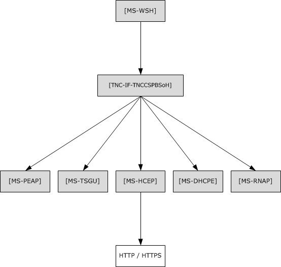
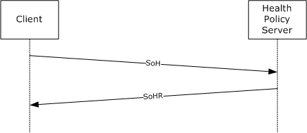
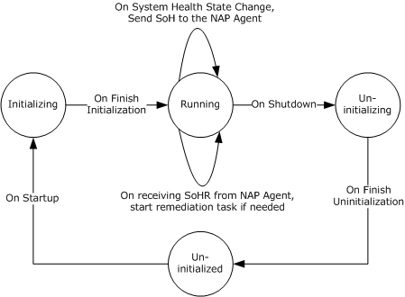
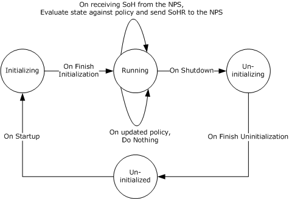

[MS-WSH]:

Windows Security Health Agent (WSHA) and Windows
Security Health Validator (WSHV) Protocol

Intellectual Property Rights Notice for Open Specifications Documentation

  Technical Documentation. Microsoft publishes Open Specifications documentation (“this

documentation”) for protocols, file formats, data portability, computer languages, and standards
support. Additionally, overview documents cover inter-protocol relationships and interactions.

  Copyrights. This documentation is covered by Microsoft copyrights. Regardless of any other

terms that are contained in the terms of use for the Microsoft website that hosts this
documentation, you can make copies of it in order to develop implementations of the technologies
that are described in this documentation and can distribute portions of it in your implementations
that use these technologies or in your documentation as necessary to properly document the
implementation. You can also distribute in your implementation, with or without modification, any
schemas, IDLs, or code samples that are included in the documentation. This permission also
applies to any documents that are referenced in the Open Specifications documentation.
  No Trade Secrets. Microsoft does not claim any trade secret rights in this documentation.
  Patents. Microsoft has patents that might cover your implementations of the technologies

described in the Open Specifications documentation. Neither this notice nor Microsoft's delivery of
this documentation grants any licenses under those patents or any other Microsoft patents.
However, a given Open Specifications document might be covered by the Microsoft Open
Specifications Promise or the Microsoft Community Promise. If you would prefer a written license,
or if the technologies described in this documentation are not covered by the Open Specifications
Promise or Community Promise, as applicable, patent licenses are available by contacting
iplg@microsoft.com.

  License Programs. To see all of the protocols in scope under a specific license program and the

associated patents, visit the Patent Map.

  Trademarks. The names of companies and products contained in this documentation might be
covered by trademarks or similar intellectual property rights. This notice does not grant any
licenses under those rights. For a list of Microsoft trademarks, visit
www.microsoft.com/trademarks.

  Fictitious Names. The example companies, organizations, products, domain names, email

addresses, logos, people, places, and events that are depicted in this documentation are fictitious.
No association with any real company, organization, product, domain name, email address, logo,
person, place, or event is intended or should be inferred.

Reservation of Rights. All other rights are reserved, and this notice does not grant any rights other
than as specifically described above, whether by implication, estoppel, or otherwise.

Tools. The Open Specifications documentation does not require the use of Microsoft programming
tools or programming environments in order for you to develop an implementation. If you have access
to Microsoft programming tools and environments, you are free to take advantage of them. Certain
Open Specifications documents are intended for use in conjunction with publicly available standards
specifications and network programming art and, as such, assume that the reader either is familiar
with the aforementioned material or has immediate access to it.

Support. For questions and support, please contact dochelp@microsoft.com.

[MS-WSH] - v20170601
Windows Security Health Agent (WSHA) and Windows Security Health Validator (WSHV) Protocol
Copyright © 2017 Microsoft Corporation
Release: June 1, 2017

1 / 80

Revision Summary

Date

Revision
History

Revision
Class

Comments

4/3/2007

0.1

6/1/2007

2.0

7/3/2007

3.0

7/20/2007

4.0

New

Major

Major

Major

Version 0.1 release

Updated and revised the technical content.

MLonghorn+90

Made fixes to packets.

8/10/2007

4.0.1

Editorial

Changed language and formatting in the technical content.

9/28/2007

4.0.2

Editorial

Changed language and formatting in the technical content.

10/23/2007  4.0.3

Editorial

Changed language and formatting in the technical content.

11/30/2007  4.0.4

Editorial

Changed language and formatting in the technical content.

1/25/2008

5.0

Major

Updated and revised the technical content.

3/14/2008

5.0.1

Editorial

Changed language and formatting in the technical content.

5/16/2008

5.0.2

Editorial

Changed language and formatting in the technical content.

6/20/2008

6.0

7/25/2008

6.1

8/29/2008

6.2

Major

Minor

Minor

Updated and revised the technical content.

Clarified the meaning of the technical content.

Clarified the meaning of the technical content.

10/24/2008  6.2.1

Editorial

Changed language and formatting in the technical content.

12/5/2008

7.0

1/16/2009

8.0

Major

Major

Updated and revised the technical content.

Updated and revised the technical content.

2/27/2009

8.0.1

Editorial

Changed language and formatting in the technical content.

4/10/2009

8.0.2

Editorial

Changed language and formatting in the technical content.

5/22/2009

9.0

7/2/2009

10.0

8/14/2009

11.0

9/25/2009

11.1

11/6/2009

12.0

12/18/2009  13.0

Major

Major

Major

Minor

Major

Major

Updated and revised the technical content.

Updated and revised the technical content.

Updated and revised the technical content.

Clarified the meaning of the technical content.

Updated and revised the technical content.

Updated and revised the technical content.

1/29/2010

13.0.1

Editorial

Changed language and formatting in the technical content.

3/12/2010

14.0

4/23/2010

15.0

Major

Major

Updated and revised the technical content.

Updated and revised the technical content.

6/4/2010

15.0.1

Editorial

Changed language and formatting in the technical content.

7/16/2010

16.0

Major

Updated and revised the technical content.

[MS-WSH] - v20170601
Windows Security Health Agent (WSHA) and Windows Security Health Validator (WSHV) Protocol
Copyright © 2017 Microsoft Corporation
Release: June 1, 2017

2 / 80

Date

Revision
History

Revision
Class

Comments

8/27/2010

17.0

10/8/2010

18.0

11/19/2010  19.0

1/7/2011

20.0

2/11/2011

20.0

3/25/2011

21.0

5/6/2011

22.0

6/17/2011

23.0

9/23/2011

23.0

12/16/2011  24.0

3/30/2012

25.0

7/12/2012

25.0

Major

Major

Major

Major

None

Major

Major

Major

None

Major

Major

None

Updated and revised the technical content.

Updated and revised the technical content.

Updated and revised the technical content.

Updated and revised the technical content.

No changes to the meaning, language, or formatting of the
technical content.

Updated and revised the technical content.

Updated and revised the technical content.

Updated and revised the technical content.

No changes to the meaning, language, or formatting of the
technical content.

Updated and revised the technical content.

Updated and revised the technical content.

No changes to the meaning, language, or formatting of the
technical content.

10/25/2012  25.0

None

No changes to the meaning, language, or formatting of the
technical content.

1/31/2013

25.0

None

No changes to the meaning, language, or formatting of the
technical content.

8/8/2013

26.0

Major

Updated and revised the technical content.

11/14/2013  26.0

None

No changes to the meaning, language, or formatting of the
technical content.

2/13/2014

26.0

None

No changes to the meaning, language, or formatting of the
technical content.

5/15/2014

26.0

None

No changes to the meaning, language, or formatting of the
technical content.

6/30/2015

26.0

None

No changes to the meaning, language, or formatting of the
technical content.

10/16/2015  26.0

None

No changes to the meaning, language, or formatting of the
technical content.

7/14/2016

26.0

None

No changes to the meaning, language, or formatting of the
technical content.

6/1/2017

26.0

None

No changes to the meaning, language, or formatting of the
technical content.

[MS-WSH] - v20170601
Windows Security Health Agent (WSHA) and Windows Security Health Validator (WSHV) Protocol
Copyright © 2017 Microsoft Corporation
Release: June 1, 2017

3 / 80

## Table of Contents

- [1 Introduction](#1-introduction)
  - [1.1 Glossary](#11-glossary)
  - [1.2 References](#12-references)
    - [1.2.1 Normative References](#121-normative-references)
    - [1.2.2 Informative References](#122-informative-references)
  - [1.3 Overview](#13-overview)
    - [1.3.1 Network Access Protection (NAP) Application Programming Interface (API)](#131-network-access-protection-nap-application-programming-interface-api)
  - [1.4 Relationship to Other Protocols](#14-relationship-to-other-protocols)
    - [1.4.1 Relationship with the Windows Update Client-Server Protocol](#141-relationship-with-the-windows-update-client-server-protocol)
  - [1.5 Prerequisites/Preconditions](#15-prerequisitespreconditions)
  - [1.6 Applicability Statement](#16-applicability-statement)
  - [1.7 Versioning and Capability Negotiation](#17-versioning-and-capability-negotiation)
  - [1.8 Vendor-Extensible Fields](#18-vendor-extensible-fields)
  - [1.9 Standards Assignments](#19-standards-assignments)
- [2 Messages](#2-messages)
  - [2.1 Transport](#21-transport)
  - [2.2 Message Syntax](#22-message-syntax)
    - [2.2.1 TLV](#221-tlv)
    - [2.2.2 WSHA SoH](#222-wsha-soh)
      - [2.2.2.1 TLV 1](#2221-tlv-1)
      - [2.2.2.2 TLV 2](#2222-tlv-2)
      - [2.2.2.3 TLV 3](#2223-tlv-3)
      - [2.2.2.4 TLV 4](#2224-tlv-4)
      - [2.2.2.5 TLV 5](#2225-tlv-5)
      - [2.2.2.6 TLV 6](#2226-tlv-6)
      - [2.2.2.7 TLV 7](#2227-tlv-7)
      - [2.2.2.8 TLV 8](#2228-tlv-8)
      - [2.2.2.9 TLV 9](#2229-tlv-9)
      - [2.2.2.10 TLV 10](#22210-tlv-10)
      - [2.2.2.11 TLV 11](#22211-tlv-11)
      - [2.2.2.12 TLV 12](#22212-tlv-12)
      - [2.2.2.13 TLV 13](#22213-tlv-13)
      - [2.2.2.14 TLV 14](#22214-tlv-14)
      - [2.2.2.15 TLV 15](#22215-tlv-15)
      - [2.2.2.16 TLV 16](#22216-tlv-16)
      - [2.2.2.17 TLV 17](#22217-tlv-17)
      - [2.2.2.18 TLV 18](#22218-tlv-18)
      - [2.2.2.19 TLV 19](#22219-tlv-19)
    - [2.2.3 WSHV SoHR](#223-wshv-sohr)
      - [2.2.3.1 TLV 1](#2231-tlv-1)
      - [2.2.3.2 TLV 2](#2232-tlv-2)
      - [2.2.3.3 TLV 3](#2233-tlv-3)
      - [2.2.3.4 TLV 4](#2234-tlv-4)
      - [2.2.3.5 TLV 5](#2235-tlv-5)
      - [2.2.3.6 TLV 6](#2236-tlv-6)
      - [2.2.3.7 TLV 7](#2237-tlv-7)
      - [2.2.3.8 TLV 8](#2238-tlv-8)
      - [2.2.3.9 TLV 9](#2239-tlv-9)
      - [2.2.3.10 TLV 10](#22310-tlv-10)
      - [2.2.3.11 TLV 11](#22311-tlv-11)
      - [2.2.3.12 TLV 12](#22312-tlv-12)
      - [2.2.3.13 TLV 13](#22313-tlv-13)
      - [2.2.3.14 TLV 14](#22314-tlv-14)
      - [2.2.3.15 TLV 15](#22315-tlv-15)
    - [2.2.4 NAPSystemHealthID](#224-napsystemhealthid)
    - [2.2.5 Flag](#225-flag)
    - [2.2.6 Version](#226-version)
    - [2.2.7 HealthClassID](#227-healthclassid)
    - [2.2.8 ProductName](#228-productname)
    - [2.2.9 ClientStatusCode](#229-clientstatuscode)
      - [2.2.9.1 Windows Update Agent (WUA) Error Codes and Security Update Status Codes](#2291-windows-update-agent-wua-error-codes-and-security-update-status-codes)
      - [2.2.9.2 Windows Security Center (WSC) Error Codes](#2292-windows-security-center-wsc-error-codes)
      - [2.2.9.3 Antivirus and Antispyware Status Codes](#2293-antivirus-and-antispyware-status-codes)
      - [2.2.9.4 Firewall Status Codes](#2294-firewall-status-codes)
      - [2.2.9.5 Automatic Update Status Codes](#2295-automatic-update-status-codes)
      - [2.2.9.6 ClientStatusCode Packet](#2296-clientstatuscode-packet)
    - [2.2.10 DurationSinceLastSynch](#2210-durationsincelastsynch)
    - [2.2.11 WSUSServerName](#2211-wsusservername)
    - [2.2.12 UpdatesFlag](#2212-updatesflag)
    - [2.2.13 ComplianceCode1](#2213-compliancecode1)
    - [2.2.14 ComplianceCode2](#2214-compliancecode2)
      - [2.2.14.1 Antivirus and Antispyware](#22141-antivirus-and-antispyware)
      - [2.2.14.2 Security Updates](#22142-security-updates)
    - [2.2.15 Data Types](#2215-data-types)
      - [2.2.15.1 ProductInformation](#22151-productinformation)
      - [2.2.15.2 SecurityUpdatesStatus](#22152-securityupdatesstatus)
- [3 Protocol Details](#3-protocol-details)
  - [3.1 Common Details](#31-common-details)
    - [3.1.1 Abstract Data Model](#311-abstract-data-model)
    - [3.1.2 Timers](#312-timers)
    - [3.1.3 Initialization](#313-initialization)
    - [3.1.4 Higher-Layer Triggered Events](#314-higher-layer-triggered-events)
    - [3.1.5 Processing Events and Sequencing Rules](#315-processing-events-and-sequencing-rules)
      - [3.1.5.1 Setting the NAP System Health ID Field](#3151-setting-the-nap-system-health-id-field)
    - [3.1.6 Timer Events](#316-timer-events)
    - [3.1.7 Other Local Events](#317-other-local-events)
  - [3.2 WSHA (Client) Specific Details](#32-wsha-client-specific-details)
    - [3.2.1 Abstract Data Model](#321-abstract-data-model)
    - [3.2.2 Timers](#322-timers)
    - [3.2.3 Initialization](#323-initialization)
    - [3.2.4 Higher-Layer Triggered Events](#324-higher-layer-triggered-events)
      - [3.2.4.1 SoH Request](#3241-soh-request)
      - [3.2.4.2 SendMessageToUI Abstract Interface](#3242-sendmessagetoui-abstract-interface)
      - [3.2.4.3 GetNumberOfFirewallProducts Abstract Interface](#3243-getnumberoffirewallproducts-abstract-interface)
      - [3.2.4.4 GetFirewallProductsInformation Abstract Interface](#3244-getfirewallproductsinformation-abstract-interface)
      - [3.2.4.5 GetNumberOfAntivirusProducts Abstract Interface](#3245-getnumberofantivirusproducts-abstract-interface)
      - [3.2.4.6 GetAntivirusProductsInformation Abstract Interface](#3246-getantivirusproductsinformation-abstract-interface)
      - [3.2.4.7 GetNumberOfAntispywareProducts Abstract Interface](#3247-getnumberofantispywareproducts-abstract-interface)
      - [3.2.4.8 GetAntispywareProductsInformation Abstract Interface](#3248-getantispywareproductsinformation-abstract-interface)
      - [3.2.4.9 GetAutomaticUpdatesStatusCode Abstract Interface](#3249-getautomaticupdatesstatuscode-abstract-interface)
      - [3.2.4.10 GetSecurityUpdatesStatus Abstract Interface](#32410-getsecurityupdatesstatus-abstract-interface)
      - [3.2.4.11 FreeProductsInformation Abstract Interface](#32411-freeproductsinformation-abstract-interface)
      - [3.2.4.12 GetClientVersion Abstract Interface](#32412-getclientversion-abstract-interface)
      - [3.2.4.13 ClientVersion ADM Initialization](#32413-clientversion-adm-initialization)
      - [3.2.4.14 SohFlag ADM initialization](#32414-sohflag-adm-initialization)
      - [3.2.4.15 RemediateFirewall Abstract Interface](#32415-remediatefirewall-abstract-interface)
      - [3.2.4.16 RemediateAntispyware Abstract Interface](#32416-remediateantispyware-abstract-interface)
      - [3.2.4.17 RemediateAutomaticUpdates Abstract Interface](#32417-remediateautomaticupdates-abstract-interface)
      - [3.2.4.18 StartWSCService Abstract Interface](#32418-startwscservice-abstract-interface)
      - [3.2.4.19 DoOnlineScan Abstract Interface](#32419-doonlinescan-abstract-interface)
      - [3.2.4.20 DoSecuritySoftwareUpdate Abstract Interface](#32420-dosecuritysoftwareupdate-abstract-interface)
    - [3.2.5 Processing Events and Sequencing Rules](#325-processing-events-and-sequencing-rules)
      - [3.2.5.1 General Problems](#3251-general-problems)
      - [3.2.5.2 Constructing an SoH](#3252-constructing-an-soh)
      - [3.2.5.3 Processing an SoHR](#3253-processing-an-sohr)
    - [3.2.6 Timer Events](#326-timer-events)
    - [3.2.7 Other Local Events](#327-other-local-events)
      - [3.2.7.1 Client Abstract Interfaces](#3271-client-abstract-interfaces)
      - [3.2.7.2 SoH Construction Interface](#3272-soh-construction-interface)
      - [3.2.7.3 SoH Change Notifications](#3273-soh-change-notifications)
  - [3.3 WSHV (Server) Specific Details](#33-wshv-server-specific-details)
    - [3.3.1 Abstract Data Model](#331-abstract-data-model)
    - [3.3.2 Timers](#332-timers)
    - [3.3.3 Initialization](#333-initialization)
    - [3.3.4 Higher-Layer Triggered Events](#334-higher-layer-triggered-events)
      - [3.3.4.1 SoH Validation Request](#3341-soh-validation-request)
    - [3.3.5 Processing Events and Sequencing Rules](#335-processing-events-and-sequencing-rules)
      - [3.3.5.1 General Problems](#3351-general-problems)
      - [3.3.5.2 Constructing an SoHR from an SoH](#3352-constructing-an-sohr-from-an-soh)
    - [3.3.6 Timer Events](#336-timer-events)
    - [3.3.7 Other Local Events](#337-other-local-events)
      - [3.3.7.1 Server Abstract Interfaces](#3371-server-abstract-interfaces)
      - [3.3.7.2 SoHR Construction Interface](#3372-sohr-construction-interface)
      - [3.3.7.3 SoH Processing Interface](#3373-soh-processing-interface)
- [4 Protocol Example](#4-protocol-example)
- [5 Security](#5-security)
  - [5.1 Security Considerations for Implementers](#51-security-considerations-for-implementers)
  - [5.2 Index of Security Parameters](#52-index-of-security-parameters)
- [6 Appendix A: Product Behavior](#6-appendix-a-product-behavior)
- [7 Change Tracking](#7-change-tracking)
- [8 Index](#8-index)

## 1 Introduction

The Windows Security Health Agent (WSHA) and Windows Security Health Validator (WSHV) Protocol
is included in the packet payload specified in the Protocol Bindings for SoH, as specified in [TNC-IF-
TNCCSPBSoH]. The WSHA reports the system security health state to the WSHV, which responds with
quarantine and remediation instructions if the status reported is not compliant with the defined
security health policy. If the status is compliant with the security health policy, the WSHV responds by
allowing the client into the network.

Sections 1.5, 1.8, 1.9, 2, and 3 of this specification are normative. All other sections and examples in
this specification are informative.

### 1.1 Glossary

This document uses the following terms:

NAP client: A computer capable of examining and reporting on its health, and requesting for and

using network resources. The NAP client is the set of NAP components installed and running on a
Windows client. The NAP client is responsible for executing NAP-related operations on the client
side. The NAP client is also responsible for collecting health information on the client, composing
the health information into an SoH [TNC-IF-TNCCSPBSoH], and sending the SoH to a NEP.

NAP health policy server (NPS): A computer acting as a server that stores health requirement

policies and provides health state validation for NAP clients.

Network Access Protection (NAP): A feature of an operating system that provides a platform
for system health-validated access to private networks. NAP provides a way of detecting the
health state of a network client that is attempting to connect to or communicate on a network,
and limiting the access of the network client until the health policy requirements have been met.
NAP is implemented through quarantines and health checks, as specified in [TNC-IF-
TNCCSPBSoH].

Network Access Protection (NAP) client: A computer that supports the NAP feature by

complying with the corresponding policy settings.

Network Policy Server (NPS): For Windows Server 2008 operating system, NPS replaces the

Internet Authentication Service (IAS) in Windows Server 2003 operating system. NPS acts as a
health policy server for the following technologies: Internet Protocol security (IPsec) for host-
based authentication, IEEE 802.1X authenticated network connections, Virtual private networks
(VPNs) for remote access, and Dynamic Host Configuration Protocol (DHCP).

quarantine: The isolation of a non-compliant computer from protected network resources.

remediation: The act of bringing a non-compliant computer into a compliant state.

security updates: The software patches released by Microsoft to fix known security issues in

released Microsoft software.

statement of health (SoH): A collection of data generated by a system health entity, as specified
in [TNC-IF-TNCCSPBSoH], which defines the health state of a machine. The data is interpreted
by a Health Policy Server, which determines whether the machine is healthy or unhealthy
according to the policies defined by an administrator.

statement of health response (SoHR): A collection of data that represents the evaluation of the

statement of health (SoH) according to network policies, as specified in [TNC-IF-
TNCCSPBSoH].

[MS-WSH] - v20170601
Windows Security Health Agent (WSHA) and Windows Security Health Validator (WSHV) Protocol
Copyright © 2017 Microsoft Corporation
Release: June 1, 2017

7 / 80

Windows Security Center (WSC): WSC is the service on Windows XP operating system Service

Pack 3 (SP3) and Windows Vista operating system clients that determines the firewall, antivirus,
antispyware, and Automatic Updates states that are then reported by the WSHA.

MAY, SHOULD, MUST, SHOULD NOT, MUST NOT: These terms (in all caps) are used as defined
in [RFC2119]. All statements of optional behavior use either MAY, SHOULD, or SHOULD NOT.

### 1.2 References

Links to a document in the Microsoft Open Specifications library point to the correct section in the
most recently published version of the referenced document. However, because individual documents
in the library are not updated at the same time, the section numbers in the documents may not
match. You can confirm the correct section numbering by checking the Errata.

#### 1.2.1 Normative References

We conduct frequent surveys of the normative references to assure their continued availability. If you
have any issue with finding a normative reference, please contact dochelp@microsoft.com. We will
assist you in finding the relevant information.

[MS-DTYP] Microsoft Corporation, "Windows Data Types".

[MS-WSH] Microsoft Corporation, "Windows Security Health Agent (WSHA) and Windows Security
Health Validator (WSHV) Protocol".

[RFC2119] Bradner, S., "Key words for use in RFCs to Indicate Requirement Levels", BCP 14, RFC
2119, March 1997, https://www.rfc-editor.org/info/rfc2119

[TNC-IF-TNCCSPBSoH] TCG, "TNC IF-TNCCS: Protocol Bindings for SoH", version 1.0, May 2007,
https://trustedcomputinggroup.org/tnc-if-tnccs-protocol-bindings-soh/

#### 1.2.2 Informative References

[ITUX680] ITU-T, "Abstract Syntax Notation One (ASN.1): Specification of Basic Notation",
Recommendation X.680, Approved 2021-02-13, https://www.itu.int/rec/T-REC-X.680-202102-I/en

[MS-DHCPE] Microsoft Corporation, "Dynamic Host Configuration Protocol (DHCP) Extensions".

[MS-HCEP] Microsoft Corporation, "Health Certificate Enrollment Protocol".

[MS-PEAP] Microsoft Corporation, "Protected Extensible Authentication Protocol (PEAP)".

[MS-RNAP] Microsoft Corporation, "Vendor-Specific RADIUS Attributes for Network Access Protection
(NAP) Data Structure".

[MS-TSGU] Microsoft Corporation, "Terminal Services Gateway Server Protocol".

[MS-WUSP] Microsoft Corporation, "Windows Update Services: Client-Server Protocol".

[MSDN-INapSysHA] Microsoft Corporation, "INapSystemHealthAgentCallback interface",
http://msdn.microsoft.com/en-us/library/aa369655(v=VS.85).aspx

[MSDN-INapSysHV] Microsoft Corporation, "INapSystemHealthValidator interface",
http://msdn.microsoft.com/en-us/library/aa369692(VS.85).aspx

[MSDN-NAPAPI] Microsoft Corporation, "NAP Interfaces", http://msdn.microsoft.com/en-
us/library/aa369705(v=VS.85).aspx

[MS-WSH] - v20170601
Windows Security Health Agent (WSHA) and Windows Security Health Validator (WSHV) Protocol
Copyright © 2017 Microsoft Corporation
Release: June 1, 2017

8 / 80

[MSDN-NapDatatypes] Microsoft Corporation, "NAP Datatypes", http://msdn.microsoft.com/en-
us/library/cc441807(v=VS.85).aspx

[MSDN-NAP] Microsoft Corporation, "Network Access Protection", http://msdn.microsoft.com/en-
us/library/aa369712(VS.85).aspx

[MSDN-WUAAPI] Microsoft Corporation, "Windows Update Agent API", http://msdn.microsoft.com/en-
us/library/aa387099(VS.85).aspx

[MSFT-MSRC] Microsoft Corporation, "Severity Update Rating System",
https://technet.microsoft.com/en-us/security/gg309177.aspx

### 1.3 Overview

The Windows Security Health Agent (WSHA) and Windows Security Health Validator (WSHV) Protocol
uses the Protocol Bindings for SoH (as specified in [TNC-IF-TNCCSPBSoH]) to transport a client's
security health state to a corresponding network policy server (NPS) in an SoH message, and then
to return remediation instructions to the client in a Statement of Health Response (SoHR)
message.

For detailed information about the Network Access Protection (NAP) system components and
developers API, see [MSDN-NAP].

#### 1.3.1 Network Access Protection (NAP) Application Programming Interface (API)

The Network Access Protection (NAP) API provides a set of function calls that allow SHAs from
third-party vendors to register with the NAP agent to indicate system health status and to respond to
queries for system health status from the NAP agent. The function calls also enable the NAP agent to
pass system health remediation information. The NAP API allows SHVs from third-party vendors to
register with the network policy server (NPS) to receive system health status for validation and to
respond with health evaluation results and remediation information.

For information about the NAP API, see [MSDN-NAPAPI].

### 1.4 Relationship to Other Protocols

The WSHA and WSHV data is encapsulated in the SoH and SoHR messages, where the WSHA data is
packaged as an SoHReportEntry set within SoH messages and the WSHV data is packaged as an
SoHRReportEntry set within SoHRmessages. The exact processing rules for encapsulating WSHA and
WSHV data in SoH and SoHR messages are described in [TNC-IF-TNCCSPBSoH].

The SoH or the SoHR messages can be carried in one of the following protocols:

  Health Certificate Enrollment Protocol (HCEP), as described in [MS-HCEP].

  Remote Authentication Dial-In User Service (RADIUS), as described in [MS-RNAP] sections 2.2.1.8

and 2.2.1.19.



Protected Extensible Authentication Protocol (PEAP), as described in [MS-PEAP] section 2.2.4.

  Dynamic Host Configuration Protocol (DHCP), as described in [MS-DHCPE] section 2.2.2.



Terminal Services Gateway Server Protocol, as described in [MS-TSGU] section 2.2.5.2.19.

This protocol relationship is demonstrated in the following diagram.

[MS-WSH] - v20170601
Windows Security Health Agent (WSHA) and Windows Security Health Validator (WSHV) Protocol
Copyright © 2017 Microsoft Corporation
Release: June 1, 2017

9 / 80

<!-- Extracted images from page 10 -->

<!-- /Extracted images from page 10 -->

Figure 1: Relationship to other protocols

#### 1.4.1 Relationship with the Windows Update Client-Server Protocol

During operation, the Windows Security Health Agent (WSHA) sends a summary of Windows Update-
related information in an SoH message. The WSHA on a client retrieves the summary information by
calling the Windows Update Agent API [MSDN-WUAAPI].

The Windows Update Agent communicates with a Windows Update Server using the Windows Update
Client-Server Protocol [MS-WUSP]. To operate successfully, the Windows Security Health Agent
(WSHA) and Windows Security Health Validator (WSHV) Protocol do not require the Windows Update
Client-Server Protocol to be present and functioning.

The codes sent in the SoH message reflect the current state of the Windows Update Agent and are
described in section 2.2.9.

The Windows Update Client-Server Protocol [MS-WUSP] is not mentioned in this section regarding the
relationships to the WSHA and WSHV Protocol because this protocol operates with or without the
Windows Update Client-Server Protocol and simply reports status in an agnostic manner.

[MS-WSH] - v20170601
Windows Security Health Agent (WSHA) and Windows Security Health Validator (WSHV) Protocol
Copyright © 2017 Microsoft Corporation
Release: June 1, 2017

10 / 80

### 1.5 Prerequisites/Preconditions

For a Windows Security Health Agent (WSHA) and Windows Security Health Validator (WSHV) Protocol
exchange to occur, there is required to be a Protocol Bindings for SoH (as specified in [TNC-IF-
TNCCSPBSoH]) session with a suitable transport protocol established between the client and a health
policy server. There are also required to be WSHA and WSHV client and server components running on
the client and health policy server, respectively.

### 1.6 Applicability Statement

The Windows Security Health Agent (WSHA) and Windows Security Health Validator (WSHV) Protocol
is applicable only in an environment in which NAP is being used, and the NAP service is enabled on
the client computer.

### 1.7 Versioning and Capability Negotiation

The WSHA reports its version in the SoH, as specified in section 2.2.6. The WSHV parses the status
and enforces the policy differently, depending on the WSHA version.

Based on the implementation configuration, the Network Access Protection (NAP) client is required to
be installed.<1>

### 1.8 Vendor-Extensible Fields

The Windows Security Health Agent (WSHA) and Windows Security Health Validator (WSHV) Protocol
does not include any vendor-extensible fields.

### 1.9 Standards Assignments

The Windows Security Health Agent (WSHA) and Windows Security Health Validator (WSHV) Protocol
has no standards assignments.

[MS-WSH] - v20170601
Windows Security Health Agent (WSHA) and Windows Security Health Validator (WSHV) Protocol
Copyright © 2017 Microsoft Corporation
Release: June 1, 2017

11 / 80

## 2 Messages

The following sections specify how Windows Security Health Agent (WSHA) and Windows Security
Health Validator (WSHV) Protocol messages are transported and WSHA and WSHV Protocol message
syntax.

This protocol references commonly used data types as defined in [MS-DTYP].

### 2.1 Transport

The Windows Security Health Agent (WSHA) and Windows Security Health Validator (WSHV) Protocol
does not provide its own transport. It MUST be carried in the Protocol Bindings for SoH, as specified in
[TNC-IF-TNCCSPBSoH].

### 2.2 Message Syntax

The Windows Security Health Agent (WSHA) and Windows Security Health Validator (WSHV) Protocol
is comprised of messages in the form of SoHReportEntries in the NAP SoH and SoHR, respectively,
as specified in [TNC-IF-TNCCSPBSoH]. The values within both packages are ASN.1-compliant TLVs.
For more information on the ASN.1 notation, see [ITUX680].

The respective SoH and SoHR message formats are specified in the following sections.

#### 2.2.1 TLV

The following are the basic constituents of all TLVs contained in the WSHA SoH packet (section 2.2.2).
All of the values MUST be present, unless otherwise noted, and the values MUST be specified in this
order. The M and R bits are defined in the Protocol Bindings for SoH [TNC-IF-TNCCSPBSoH] and are
ignored by the WSHV upon receipt. Unless otherwise noted, all TLV values are sent in network-byte
order, which is big-endian.

0  1  2  3  4  5  6  7  8  9

1
0  1  2  3  4  5  6  7  8  9

2
0  1  2  3  4  5  6  7  8  9

3
0  1

Type

Length

Value (variable)

...

Type (2 bytes): A structure that contains the M, R, and Type subfields in the TLV.

0  1  2  3  4  5  6  7  8  9

1
0  1  2  3  4  5  6  7  8  9

2
0  1  2  3  4  5  6  7  8  9

3
0  1

M  R

Type

M (1 bit): MUST be set to 0.

R (1 bit): A reserved field that MUST be set to 0 when sending, and ignored upon receipt.

Type (14 bits): Indicates the type of data contained in the Value field.

Length (2 bytes): MUST specify the length in bytes of the Value field.

[MS-WSH] - v20170601
Windows Security Health Agent (WSHA) and Windows Security Health Validator (WSHV) Protocol
Copyright © 2017 Microsoft Corporation
Release: June 1, 2017

12 / 80

Value (variable): Contains the data for the TLV specified as an array of bytes.

The SoH and SoHR are lists of TLVs concatenated one after the other.

#### 2.2.2 WSHA SoH

The following subsections define the TLV constituents of the WSHA SoH packet. All of the values MUST
be present, unless otherwise noted. The values MUST be in the order in which they are presented in
this specification. TLVs 5, 6, 8, 9, 11, and 12 MUST have at least one instance. They MAY have
multiple instances, depending on how many firewall, antivirus, and antispyware products are installed.
The M and R bits are defined in the Protocol Bindings for SoH [TNC-IF-TNCCSPBSoH] and are ignored
by the WSHV upon receipt. All TLV values are sent in network byte order, which is big-endian, except
for the Flag field of TLV 2, the Version field of TLV 3, the
Security_Updates_DurationSinceLastSynch field of TLV 17, and the
Security_Updates_UpdatesFlag field of TLV 19, which are sent in machine byte order and are little-
endian.

##### 2.2.2.1 TLV 1

The following are the constituents of TLV 1 of the WSHA SoH packet (section 2.2.2). All of the values
MUST be present, unless otherwise noted. The values MUST be in this order. The M and R bits are
defined in the Protocol Bindings for SoH [TNC-IF-TNCCSPBSoH] and are ignored by the WSHV upon
receipt. All TLV 1 values are sent in network-byte order, which is big-endian.

0  1  2  3  4  5  6  7  8  9

1
0  1  2  3  4  5  6  7  8  9

2
0  1  2  3  4  5  6  7  8  9

3
0  1

M  R

TLV_Type

Length

M (1 bit): The M bit MUST be set to zero.

NAPSystemHealthID

R (1 bit): The R bit is reserved, and MUST be set to zero when sent and ignored on receipt.

TLV_Type (14 bits): A 14-bit unsigned integer that MUST be set to 2.

Length (2 bytes): A 16-bit unsigned integer in network-byte order that MUST indicate the length (4),

in bytes, of the NAPSystemHealthID field.

NAPSystemHealthID (4 bytes): A 32-bit unsigned integer, as specified in section 2.2.4.

##### 2.2.2.2 TLV 2

The following are the constituents of TLV 2 of the WSHA SoH packet (section 2.2.2). All of the values
MUST be present, unless otherwise noted. The values MUST be in this order. The M and R bits are
defined in the Protocol Bindings for SoH [TNC-IF-TNCCSPBSoH] and are ignored by the WSHV upon
receipt. All TLV 2 values are sent in network-byte order, which is big-endian, except for the Flag field
which is sent in machine-byte order and is little-endian.

0  1  2  3  4  5  6  7  8  9

1
0  1  2  3  4  5  6  7  8  9

2
0  1  2  3  4  5  6  7  8  9

3
0  1

M  R

TLV_Type

Length

Flag

13 / 80

[MS-WSH] - v20170601
Windows Security Health Agent (WSHA) and Windows Security Health Validator (WSHV) Protocol
Copyright © 2017 Microsoft Corporation
Release: June 1, 2017

M (1 bit): The M bit MUST be set to zero.

...

R (1 bit): The R bit is reserved, and MUST be set to zero when sent and ignored on receipt.

TLV_Type (14 bits): A 14-bit unsigned integer that MUST be set to 7.

Length (2 bytes): A 16-bit unsigned integer in network-byte order that MUST indicate the length (8),

in bytes, of the Flag field.

Flag (8 bytes): Eight bytes, as specified in section 2.2.5.

##### 2.2.2.3 TLV 3

The following are the constituents of TLV 3 of the WSHA SoH packet (section 2.2.2). All of the values
MUST be present, unless otherwise noted. The values MUST be in this order. The M and R bits are
defined in the Protocol Bindings for SoH [TNC-IF-TNCCSPBSoH] and are ignored by the WSHV upon
receipt. All TLV 3 values are sent in network-byte order, which is big-endian, except for the Version
field which is sent in machine-byte order and is little-endian.

0  1  2  3  4  5  6  7  8  9

1
0  1  2  3  4  5  6  7  8  9

2
0  1  2  3  4  5  6  7  8  9

3
0  1

M  R

TLV_Type

Length

Version

...

M (1 bit): The M bit MUST be set to zero.

R (1 bit): The R bit is reserved, and MUST be set to zero when sent and ignored on receipt.

TLV_Type (14 bits): A 14-bit unsigned integer that MUST be set to 7.

Length (2 bytes): A 16-bit unsigned integer in network-byte order that MUST indicate the length (8),

in bytes, of the Version field.

Version (8 bytes): Eight bytes, as specified in section 2.2.6.

##### 2.2.2.4 TLV 4

The following are the constituents of TLV 4 of the WSHA SoH packet (section 2.2.2). All of the values
MUST be present, unless otherwise noted. The values MUST be in this order. The M and R bits are
defined in the Protocol Bindings for SoH[TNC-IF-TNCCSPBSoH] and are ignored by the WSHV upon
receipt. All TLV 4 values are sent in network-byte order, which is big-endian.

0  1  2  3  4  5  6  7  8  9

1
0  1  2  3  4  5  6  7  8  9

2
0  1  2  3  4  5  6  7  8  9

3
0  1

M  R

TLV_Type

Length

Firewall_HealthClassID

[MS-WSH] - v20170601
Windows Security Health Agent (WSHA) and Windows Security Health Validator (WSHV) Protocol
Copyright © 2017 Microsoft Corporation
Release: June 1, 2017

14 / 80

M (1 bit): The M bit MUST be set to zero.

R (1 bit): The R bit is reserved, and MUST be set to zero when sent and ignored on receipt.

TLV_Type (14 bits): A 14-bit unsigned integer that MUST be set to 8.

Length (2 bytes): A 16-bit unsigned integer in network-byte order that MUST indicate the length (1),

in bytes, of the Firewall_HealthClassID field.

Firewall_HealthClassID (1 byte): An 8-bit unsigned integer, as specified in section 2.2.7.

##### 2.2.2.5 TLV 5

The following are the constituents of TLV 5 of the WSHA SoH packet (section 2.2.2). All of the values
MUST be present, unless otherwise noted. The values MUST be in this order. TLV 5 MUST have at least
one instance and MAY have multiple instances depending on how many firewall, antivirus, and
antispyware products are installed. The M and R bits are defined in the Protocol Bindings for SoH
[TNC-IF-TNCCSPBSoH] and are ignored by the WSHV upon receipt. All TLV 5 values are sent in
network-byte order, which is big-endian.

0  1  2  3  4  5  6  7  8  9

1
0  1  2  3  4  5  6  7  8  9

2
0  1  2  3  4  5  6  7  8  9

3
0  1

M  R

TLV_Type

Length

Firewall_ProductName (variable)

...

M (1 bit): The M bit MUST be set to zero.

R (1 bit): The R bit is reserved, and MUST be set to zero when sent and ignored on receipt.

TLV_Type (14 bits): A 14-bit unsigned integer that MUST be set to 10.

Length (2 bytes): A 16-bit unsigned integer in network-byte order that MUST indicate the length, in

bytes, of the Firewall_ProductName field.

Firewall_ProductName (variable): A string, as specified in section 2.2.8.

##### 2.2.2.6 TLV 6

The following are the constituents of TLV 6 of the WSHA SoH packet (section 2.2.2). All of the values
MUST be present, unless otherwise noted. The values MUST be in this order. TLV 6 MUST have at least
one instance and MAY have multiple instances depending on how many firewall, antivirus, and
antispyware products are installed. The M and R bits are defined in the Protocol Bindings for SoH
[TNC-IF-TNCCSPBSoH] and are ignored by the WSHV upon receipt. All TLV 6 values are sent in
network-byte order, which is big-endian.

0  1  2  3  4  5  6  7  8  9

1
0  1  2  3  4  5  6  7  8  9

2
0  1  2  3  4  5  6  7  8  9

3
0  1

M  R

TLV_Type

Length

Firewall_ClientStatusCode

[MS-WSH] - v20170601
Windows Security Health Agent (WSHA) and Windows Security Health Validator (WSHV) Protocol
Copyright © 2017 Microsoft Corporation
Release: June 1, 2017

15 / 80

M (1 bit): The M bit MUST be set to zero.

R (1 bit): The R bit is reserved, and MUST be set to zero when sent and ignored on receipt.

TLV_Type (14 bits): A 14-bit unsigned integer that MUST be set to 11.

Length (2 bytes): A 16-bit unsigned integer in network-byte order that MUST indicate the length (4),

in bytes, of the Firewall_ClientStatusCode field.

Firewall_ClientStatusCode (4 bytes): A DWORD, as specified in section 2.2.9.

##### 2.2.2.7 TLV 7

The following are the constituents of TLV 7 of the WSHA SoH packet (section 2.2.2). All of the values
MUST be present, unless otherwise noted. The values MUST be in this order. The M and R bits are
defined in the Protocol Bindings for SoH[TNC-IF-TNCCSPBSoH] and are ignored by the WSHV upon
receipt. All TLV 7 values are sent in network-byte order, which is big-endian.

0  1  2  3  4  5  6  7  8  9

1
0  1  2  3  4  5  6  7  8  9

2
0  1  2  3  4  5  6  7  8  9

3
0  1

M  R

TLV_Type

Length

Antivirus_HealthClassID

M (1 bit): The M bit MUST be set to zero.

R (1 bit): The R bit is reserved, and MUST be set to zero when sent and ignored on receipt.

TLV_Type (14 bits): A 14-bit unsigned integer that MUST be set to 8.

Length (2 bytes): A 16-bit unsigned integer in network-byte order that MUST indicate the length (1),

in bytes, of the Antivirus_HealthClassID field.

Antivirus_HealthClassID (1 byte): An 8-bit unsigned integer, as specified in section 2.2.7.

##### 2.2.2.8 TLV 8

The following are the constituents of TLV 8 of the WSHA SoH packet (section 2.2.2). All of the values
MUST be present, unless otherwise noted. The values MUST be in this order. TLV 8 MUST have at least
one instance and MAY have multiple instances depending on how many firewall, antivirus, and
antispyware products are installed. The M and R bits are defined in the Protocol Bindings for SoH
[TNC-IF-TNCCSPBSoH] and are ignored by the WSHV upon receipt. All TLV 8 values are sent in
network-byte order, which is big-endian.

0  1  2  3  4  5  6  7  8  9

1
0  1  2  3  4  5  6  7  8  9

2
0  1  2  3  4  5  6  7  8  9

3
0  1

M  R

TLV_Type

Length

Antivirus_ProductName (variable)

...

M (1 bit): The M bit MUST be set to zero.

[MS-WSH] - v20170601
Windows Security Health Agent (WSHA) and Windows Security Health Validator (WSHV) Protocol
Copyright © 2017 Microsoft Corporation
Release: June 1, 2017

16 / 80

R (1 bit): The R bit is reserved, and MUST be set to zero when sent and ignored on receipt.

TLV_Type (14 bits): A 14-bit unsigned integer that MUST be set to 10.

Length (2 bytes): A 16-bit unsigned integer in network-byte order that MUST indicate the length of

the string, in bytes, of the Antivirus_ProductName field.

Antivirus_ProductName (variable): A string, as specified in section 2.2.8.

##### 2.2.2.9 TLV 9

The following are the constituents of TLV 9 of the WSHA SoH packet (section 2.2.2). All of the values
MUST be present, unless otherwise noted. The values MUST be in this order. TLV 9 MUST have at least
one instance and MAY have multiple instances depending on how many firewall, antivirus, and
antispyware products are installed. The M and R bits are defined in the Protocol Bindings for SoH
[TNC-IF-TNCCSPBSoH] and are ignored by the WSHV upon receipt. All TLV 9 values are sent in
network-byte order, which is big-endian.

0  1  2  3  4  5  6  7  8  9

1
0  1  2  3  4  5  6  7  8  9

2
0  1  2  3  4  5  6  7  8  9

3
0  1

M  R

TLV_Type

Length

M (1 bit): The M bit MUST be set to zero.

Antivirus_ClientStatusCode

R (1 bit): The R bit is reserved, and MUST be set to zero when sent and ignored on receipt.

TLV_Type (14 bits): A 14-bit unsigned integer that MUST be set to 11.

Length (2 bytes): A 16-bit unsigned integer in network-byte order that MUST indicate the length (4),

in bytes, of the Antivirus_ClientStatusCode field.

Antivirus_ClientStatusCode (4 bytes): A DWORD, as specified in section 2.2.9.

##### 2.2.2.10 TLV 10

The following are the constituents of TLV 10 of the WSHA SoH packet (section 2.2.2). All of the values
MUST be present, unless otherwise noted. The values MUST be in this order. The M and R bits are
defined in the Protocol Bindings for SoH [TNC-IF-TNCCSPBSoH] and are ignored by the WSHV upon
receipt. All TLV 10 values are sent in network-byte order, which is big-endian.

0  1  2  3  4  5  6  7  8  9

1
0  1  2  3  4  5  6  7  8  9

2
0  1  2  3  4  5  6  7  8  9

3
0  1

M  R

TLV_Type

Length

Antispyware_HealthClassI
D

M (1 bit): The M bit MUST be set to zero.

R (1 bit): The R bit is reserved, and MUST be set to zero when sent and ignored on receipt.

TLV_Type (14 bits): A 14-bit unsigned integer that MUST be set to 8.

[MS-WSH] - v20170601
Windows Security Health Agent (WSHA) and Windows Security Health Validator (WSHV) Protocol
Copyright © 2017 Microsoft Corporation
Release: June 1, 2017

17 / 80

Length (2 bytes): A 16-bit unsigned integer in network-byte order that MUST indicate the length (1),

in bytes, of the Antispyware_HealthClassID field.

Antispyware_HealthClassID (1 byte): An 8-bit unsigned integer, as specified in section 2.2.7.

##### 2.2.2.11 TLV 11

The following are the constituents of TLV 11 of the WSHA SoH packet (section 2.2.2). All of the values
MUST be present, unless otherwise noted. The values MUST be in this order. TLV 11 MUST have at
least one instance and MAY have multiple instances depending on how many firewall, antivirus, and
antispyware products are installed. The M and R bits are defined in the Protocol Bindings for SoH
[TNC-IF-TNCCSPBSoH] and are ignored by the WSHV upon receipt. All TLV 11 values are sent in
network-byte order, which is big-endian.

0  1  2  3  4  5  6  7  8  9

1
0  1  2  3  4  5  6  7  8  9

2
0  1  2  3  4  5  6  7  8  9

3
0  1

M  R

TLV_Type

Length

Antispyware_ProductName (variable)

...

M (1 bit): The M bit MUST be set to zero.

R (1 bit): The R bit is reserved, and MUST be set to zero when sent and ignored on receipt.

TLV_Type (14 bits): A 14-bit unsigned integer that MUST be set to 10.

Length (2 bytes): A 16-bit unsigned integer in network-byte order that MUST indicate the length of

the string, in bytes, of the Antispyware_ProductName field.

Antispyware_ProductName (variable): A string, as specified in section 2.2.8.

##### 2.2.2.12 TLV 12

The following are the constituents of TLV 12 of the WSHA SoH packet (section 2.2.2). All of the values
MUST be present, unless otherwise noted. The values MUST be in this order. TLV 12 MUST have at
least one instance and MAY have multiple instances depending on how many firewall, antivirus, and
antispyware products are installed. The M and R bits are defined in the Protocol Bindings for SoH
[TNC-IF-TNCCSPBSoH] and are ignored by the WSHV upon receipt. All TLV 12 values are sent in
network-byte order, which is big-endian.

0  1  2  3  4  5  6  7  8  9

1
0  1  2  3  4  5  6  7  8  9

2
0  1  2  3  4  5  6  7  8  9

3
0  1

M  R

TLV_Type

Length

M (1 bit): The M bit MUST be set to zero.

Antispyware_ClientStatusCode

R (1 bit): The R bit is reserved, and MUST be set to zero when sent and ignored on receipt.

TLV_Type (14 bits): A 14-bit unsigned integer that MUST be set to 11.

[MS-WSH] - v20170601
Windows Security Health Agent (WSHA) and Windows Security Health Validator (WSHV) Protocol
Copyright © 2017 Microsoft Corporation
Release: June 1, 2017

18 / 80

Length (2 bytes): A 16-bit unsigned integer in network-byte order that MUST indicate the length (4),

in bytes, of the Antispyware_ClientStatusCode field.

Antispyware_ClientStatusCode (4 bytes): A DWORD, as specified in section 2.2.9.

##### 2.2.2.13 TLV 13

The following are the constituents of TLV 13 of the WSHA SoH packet (section 2.2.2). All of the values
MUST be present, unless otherwise noted. The values MUST be in this order. The M and R bits are
defined in the Protocol Bindings for SoH [TNC-IF-TNCCSPBSoH] and are ignored by the WSHV upon
receipt. All TLV 13 values are sent in network-byte order, which is big-endian.

0  1  2  3  4  5  6  7  8  9

1
0  1  2  3  4  5  6  7  8  9

2
0  1  2  3  4  5  6  7  8  9

3
0  1

M  R

TLV_Type

Length

Automatic_Updates_Healt
hClassID

M (1 bit): The M bit MUST be set to zero.

R (1 bit): The R bit is reserved, and MUST be set to zero when sent and ignored on receipt.

TLV_Type (14 bits): A 14-bit unsigned integer that MUST be set to 8.

Length (2 bytes): A 16-bit unsigned integer in network-byte order that MUST indicate the length (1),

in bytes, of the Automatic_Updates_HealthClassID field.

Automatic_Updates_HealthClassID (1 byte): An 8-bit unsigned integer, as specified in section

2.2.7.

##### 2.2.2.14 TLV 14

The following are the constituents of TLV 14 of the WSHA SoH packet (section 2.2.2). All of the values
MUST be present, unless otherwise noted. The values MUST be in this order. The M and R bits are
defined in the Protocol Bindings for SoH [TNC-IF-TNCCSPBSoH] and are ignored by the WSHV upon
receipt. All TLV 14 values are sent in network-byte order, which is big-endian.

0  1  2  3  4  5  6  7  8  9

1
0  1  2  3  4  5  6  7  8  9

2
0  1  2  3  4  5  6  7  8  9

3
0  1

M  R

TLV_Type

Length

Automatic_Updates_ClientStatusCode

M (1 bit): The M bit MUST be set to zero.

R (1 bit): The R bit is reserved, and MUST be set to zero when sent and ignored on receipt.

TLV_Type (14 bits): A 14-bit unsigned integer that MUST be set to 11.

Length (2 bytes): A 16-bit unsigned integer in network-byte order that MUST indicate the length (4),

in bytes, of the Automatic_Updates_ClientStatusCode field.

Automatic_Updates_ClientStatusCode (4 bytes): A DWORD, as specified in section 2.2.9.

[MS-WSH] - v20170601
Windows Security Health Agent (WSHA) and Windows Security Health Validator (WSHV) Protocol
Copyright © 2017 Microsoft Corporation
Release: June 1, 2017

19 / 80

##### 2.2.2.15 TLV 15

The following are the constituents of TLV 15 of the WSHA SoH packet (section 2.2.2). All of the values
MUST be present, unless otherwise noted. The values MUST be in this order. The M and R bits are
defined in the Protocol Bindings for SoH [TNC-IF-TNCCSPBSoH] and are ignored by the WSHV upon
receipt. All TLV 15 values are sent in network-byte order, which is big-endian.

0  1  2  3  4  5  6  7  8  9

1
0  1  2  3  4  5  6  7  8  9

2
0  1  2  3  4  5  6  7  8  9

3
0  1

M  R

TLV_Type

Length

Security_Updates_Health
ClassID

M (1 bit): The M bit MUST be set to zero.

R (1 bit): The R bit is reserved, and MUST be set to zero when sent and ignored on receipt.

TLV_Type (14 bits): A 14-bit unsigned integer that MUST be set to 8.

Length (2 bytes): A 16-bit unsigned integer in network-byte order that MUST indicate the length (1),

in bytes, of the Security_Updates_HealthClassID field.

Security_Updates_HealthClassID (1 byte): An 8-bit unsigned integer, as specified in section

2.2.7.

##### 2.2.2.16 TLV 16

The following are the constituents of TLV 16 of the WSHA SoH packet (section 2.2.2). All of the values
MUST be present, unless otherwise noted. The values MUST be in this order. The M and R bits are
defined in the Protocol Bindings for SoH [TNC-IF-TNCCSPBSoH] and are ignored by the WSHV upon
receipt. All TLV 16 values are sent in network-byte order, which is big-endian.

0  1  2  3  4  5  6  7  8  9

1
0  1  2  3  4  5  6  7  8  9

2
0  1  2  3  4  5  6  7  8  9

3
0  1

M  R

TLV_Type

Length

Security_Updates_ClientStatusCode

M (1 bit): The M bit MUST be set to zero.

R (1 bit): The R bit is reserved, and MUST be set to zero when sent and ignored on receipt.

TLV_Type (14 bits): A 14-bit unsigned integer that MUST be set to 11.

Length (2 bytes): A 16-bit unsigned integer in network-byte order that MUST indicate the length (4),

in bytes, of the Security_Updates_ClientStatusCode field.

Security_Updates_ClientStatusCode (4 bytes): A DWORD, as specified in section 2.2.9.

##### 2.2.2.17 TLV 17

The following are the constituents of TLV 17 of the WSHA SoH packet (section 2.2.2). All of the values
MUST be present, unless otherwise noted. The values MUST be in this order. The M and R bits are
defined in the Protocol Bindings for SoH [TNC-IF-TNCCSPBSoH] and are ignored by the WSHV upon

[MS-WSH] - v20170601
Windows Security Health Agent (WSHA) and Windows Security Health Validator (WSHV) Protocol
Copyright © 2017 Microsoft Corporation
Release: June 1, 2017

20 / 80

receipt. All TLV 17 values are sent in network-byte order, which is big-endian, except for the
Security_Updates_DurationSinceLastSynch field which is sent in machine-byte order and is little-
endian.

0  1  2  3  4  5  6  7  8  9

1
0  1  2  3  4  5  6  7  8  9

2
0  1  2  3  4  5  6  7  8  9

3
0  1

A  B

TLV_Type (optional)

Length (optional)

Security_Updates_DurationSinceLastSynch (optional)

...

M (1 bit): The M bit MUST be set to zero.

R (1 bit): The R bit is reserved, and MUST be set to zero when sent and ignored on receipt.

TLV_Type (14 bits): A 14-bit unsigned integer that MUST be set to 7.

Length (2 bytes): A 16-bit unsigned integer in network-byte order that MUST indicate the length (8),

in bytes, of the Security_Updates_DurationSinceLastSynch field.

Security_Updates_DurationSinceLastSynch (8 bytes): Eight bytes, as specified in section 2.2.10.
Not used if an error is returned in the Security_Updates_ClientStatusCode (see section 2.2.9).

Note  If Security_Updates_ClientStatusCode is an error, TLV 17 will not be present. For more
information about Security_Updates_ClientStatusCode, see section 2.2.9

##### 2.2.2.18 TLV 18

The following are the constituents of TLV 18 of the WSHA SoH packet (section 2.2.2). All of the values
MUST be present, unless otherwise noted. The values MUST be in this order. The M and R bits are
defined in the Protocol Bindings for SoH [TNC-IF-TNCCSPBSoH] and are ignored by the WSHV upon
receipt. All TLV 18 values are sent in network-byte order, which is big-endian.

0  1  2  3  4  5  6  7  8  9

1
0  1  2  3  4  5  6  7  8  9

2
0  1  2  3  4  5  6  7  8  9

3
0  1

A  B

TLV_Type (optional)

Length (optional)

Security_Updates_WSUSServerName (variable)

...

M (1 bit): The M bit MUST be set to zero.

R (1 bit): The R bit is reserved, and MUST be set to zero when sent and ignored on receipt.

TLV_Type (14 bits): A 14-bit unsigned integer that MUST be set to 7.

Length (2 bytes): A 16-bit unsigned integer in network-byte order that MUST indicate the length of

the string, in bytes, of the Security_Updates_WSUSServerName field.

Security_Updates_WSUSServerName (variable): Four bytes followed by a variable-length string,

as specified in section 2.2.11. Not used if an error is returned in the
Security_Updates_ClientStatusCode (see section 2.2.9).

[MS-WSH] - v20170601
Windows Security Health Agent (WSHA) and Windows Security Health Validator (WSHV) Protocol
Copyright © 2017 Microsoft Corporation
Release: June 1, 2017

21 / 80

Note  If Security_Updates_ClientStatusCode is an error, TLV 18 will not be present. For more
information about Security_Updates_ClientStatusCode, see section 2.2.9.

##### 2.2.2.19 TLV 19

The following are the constituents of TLV 19 of the WSHA SoH packet (section 2.2.2). All of the values
MUST be present, unless otherwise noted. The values MUST be in this order. The M and R bits are
defined in the Protocol Bindings for SoH [TNC-IF-TNCCSPBSoH] and are ignored by the WSHV upon
receipt. All TLV 19 values are sent in network-byte order, which is big-endian, except for the
Security_Updates_UpdatesFlag field which is sent in machine-byte order and is little-endian.

0  1  2  3  4  5  6  7  8  9

1
0  1  2  3  4  5  6  7  8  9

2
0  1  2  3  4  5  6  7  8  9

3
0  1

A  B

TLV_Type (optional)

Length (optional)

Security_Updates_UpdatesFlag (optional)

...

M (1 bit): The M bit MUST be set to zero.

R (1 bit): The R bit is reserved, and MUST be set to zero when sent and ignored on receipt.

TLV_Type (14 bits): A 14-bit unsigned integer that MUST be set to 7.

Length (2 bytes): A 16-bit unsigned integer in network-byte order that MUST indicate the length (8),

in bytes, of the Security_Updates_UpdatesFlag field.

Security_Updates_UpdatesFlag (8 bytes): Eight bytes, as specified in section 2.2.12. Not used if

an error is returned in the Security_Updates_ClientStatusCode (see section 2.2.9).

Note  If Security_Updates_ClientStatusCode is an error, TLV 19 will not be present. For more
information about Security_Updates_ClientStatusCode, see section 2.2.9.

#### 2.2.3 WSHV SoHR

The following sections are the TLV constituents of the WSHV SoHR packet. All of the values MUST be
present, unless otherwise noted. The values MUST be in the order in which they are presented in this
specification. The M and R bits are defined in the Protocol Bindings for SoH [TNC-IF-TNCCSPBSoH] and
are ignored by the WSHA upon receipt.

##### 2.2.3.1 TLV 1

The following are the constituents of TLV 1 for the WSHV SoHR packet (section 2.2.3). All of the
values MUST be present, unless otherwise noted. The values MUST be in this order. The M and R bits
are defined in the Protocol Bindings for SoH [TNC-IF-TNCCSPBSoH] and are ignored by the WSHA
upon receipt.

0  1  2  3  4  5  6  7  8  9

1
0  1  2  3  4  5  6  7  8  9

2
0  1  2  3  4  5  6  7  8  9

3
0  1

M  R

TLV_Type

Length

NAPSystemHealthID

[MS-WSH] - v20170601
Windows Security Health Agent (WSHA) and Windows Security Health Validator (WSHV) Protocol
Copyright © 2017 Microsoft Corporation
Release: June 1, 2017

22 / 80

M (1 bit): The M bit MUST be set to zero.

R (1 bit): The R bit is reserved, and MUST be set to zero when sent and ignored on receipt.

TLV_Type (14 bits): A 14-bit unsigned integer that MUST be set to 2.

Length (2 bytes): A 16-bit unsigned integer in network-byte order that MUST indicate the length (4),

in bytes, of the NAPSystemHealthID field.

NAPSystemHealthID (4 bytes): A 32-bit unsigned integer, as specified in section 2.2.4.

##### 2.2.3.2 TLV 2

The following are the constituents of TLV 2 for the WSHV SoHR packet (section 2.2.3). All of the
values MUST be present, unless otherwise noted. The values MUST be in this order. The M and R bits
are defined in the Protocol Bindings for SoH [TNC-IF-TNCCSPBSoH] and are ignored by the WSHA
upon receipt.

0  1  2  3  4  5  6  7  8  9

1
0  1  2  3  4  5  6  7  8  9

2
0  1  2  3  4  5  6  7  8  9

3
0  1

M  R

TLV_Type

Length

Firewall_HealthClassID

M (1 bit): The M bit MUST be set to zero.

R (1 bit): The R bit is reserved, and MUST be set to zero when sent and ignored on receipt.

TLV_Type (14 bits): A 14-bit unsigned integer that MUST be set to 8.

Length (2 bytes): A 16-bit unsigned integer in network-byte order that MUST indicate the length (1),

in bytes, of the Firewall_HealthClassID field.

Firewall_HealthClassID (1 byte): An 8-bit unsigned integer, as specified in section 2.2.7.

##### 2.2.3.3 TLV 3

The following are the constituents of TLV 3 for the WSHV SoHR packet (section 2.2.3). All of the
values MUST be present, unless otherwise noted. The values MUST be in this order. The M and R bits
are defined in the Protocol Bindings for SoH [TNC-IF-TNCCSPBSoH] and are ignored by the WSHA
upon receipt.

0  1  2  3  4  5  6  7  8  9

1
0  1  2  3  4  5  6  7  8  9

2
0  1  2  3  4  5  6  7  8  9

3
0  1

M  R

TLV_Type

Length

M (1 bit): The M bit MUST be set to zero.

Firewall_ComplianceCode

R (1 bit): The R bit is reserved, and MUST be set to zero when sent and ignored on receipt.

TLV_Type (14 bits): A 14-bit unsigned integer that MUST be set to 4.

[MS-WSH] - v20170601
Windows Security Health Agent (WSHA) and Windows Security Health Validator (WSHV) Protocol
Copyright © 2017 Microsoft Corporation
Release: June 1, 2017

23 / 80

Length (2 bytes): A 16-bit unsigned integer in network-byte order that MUST indicate the length (4),

in bytes, of the Firewall_ComplianceCode field.

Firewall_ComplianceCode (4 bytes): A DWORD, as specified in section 2.2.13.

##### 2.2.3.4 TLV 4

The following are the constituents of TLV 4 for the WSHV SoHR packet (section 2.2.3). All of the
values MUST be present, unless otherwise noted. The values MUST be in this order. The M and R bits
are defined in the Protocol Bindings for SoH [TNC-IF-TNCCSPBSoH] and are ignored by the WSHA
upon receipt.

0  1  2  3  4  5  6  7  8  9

1
0  1  2  3  4  5  6  7  8  9

2
0  1  2  3  4  5  6  7  8  9

3
0  1

A  B

TLV_Type (optional)

Length (optional)

Firewall_ComplianceCode
(optional)

M (1 bit): The M bit MUST be set to zero.

R (1 bit): The R bit is reserved and MUST be set to zero when sent and ignored on receipt.

TLV_Type (14 bits): The TLV Type MUST be set to 14.

Length (2 bytes): A 16-bit unsigned integer that MUST be set to 1.

Firewall_ComplianceCode (1 byte): An 8-bit field that MUST be set to 2.

##### 2.2.3.5 TLV 5

The following are the constituents of TLV 5 for the WSHV SoHR packet (section 2.2.3). All of the
values MUST be present, unless otherwise noted. The values MUST be in this order. The M and R bits
are defined in the Protocol Bindings for SoH [TNC-IF-TNCCSPBSoH] and are ignored by the WSHA
upon receipt.

0  1  2  3  4  5  6  7  8  9

1
0  1  2  3  4  5  6  7  8  9

2
0  1  2  3  4  5  6  7  8  9

3
0  1

M  R

TLV_Type

Length

Antivirus_HealthClassID

M (1 bit): The M bit MUST be set to zero.

R (1 bit): The R bit is reserved, and MUST be set to zero when sent and ignored on receipt.

TLV_Type (14 bits): A 14-bit unsigned integer that MUST be set to 8.

Length (2 bytes): A 16-bit unsigned integer in network-byte order that MUST indicate the length (1),

in bytes, of the Antivirus_HealthClassID field.

Antivirus_HealthClassID (1 byte): An 8-bit unsigned integer, as specified in section 2.2.7.

[MS-WSH] - v20170601
Windows Security Health Agent (WSHA) and Windows Security Health Validator (WSHV) Protocol
Copyright © 2017 Microsoft Corporation
Release: June 1, 2017

24 / 80

##### 2.2.3.6 TLV 6

The following are the constituents of TLV 6 for the WSHV SoHR packet (section 2.2.3). All of the
values MUST be present, unless otherwise noted. The values MUST be in this order. The M and R bits
are defined in the Protocol Bindings for SoH [TNC-IF-TNCCSPBSoH] and are ignored by the WSHA
upon receipt.

0  1  2  3  4  5  6  7  8  9

1
0  1  2  3  4  5  6  7  8  9

2
0  1  2  3  4  5  6  7  8  9

3
0  1

M  R

TLV_Type

Length

Antivirus_ComplianceCode_1

Antivirus_ComplianceCode_2 (optional)

M (1 bit): The M bit MUST be set to zero.

R (1 bit): The R bit is reserved, and MUST be set to zero when sent and ignored on receipt.

TLV_Type (14 bits): A 14-bit unsigned integer that MUST be set to 4.

Length (2 bytes): A 16-bit unsigned integer in network-byte order that MUST indicate the length (4),

in bytes, of the Antivirus_ComplianceCode_1 field if only the Antivirus_ComplianceCode_1
is used, or length (8) if the Antivirus_ComplianceCode_2 is also present.

Antivirus_ComplianceCode_1 (4 bytes): A DWORD, as specified in section 2.2.13.

Antivirus_ComplianceCode_2 (4 bytes): A DWORD, as specified in section 2.2.14.

##### 2.2.3.7 TLV 7

The following are the constituents of TLV 7 for the WSHV SoHR packet (section 2.2.3). All of the
values MUST be present, unless otherwise noted. The values MUST be in this order. The M and R bits
are defined in the Protocol Bindings for SoH [TNC-IF-TNCCSPBSoH] and are ignored by the WSHA
upon receipt.

0  1  2  3  4  5  6  7  8  9

1
0  1  2  3  4  5  6  7  8  9

2
0  1  2  3  4  5  6  7  8  9

3
0  1

A  B

TLV_Type (optional)

Length (optional)

Antivirus_FailureCategory
(optional)

M (1 bit): The M bit MUST be set to zero.

R (1 bit): The R bit is reserved and MUST be set to zero when sent and ignored on receipt.

TLV_Type (14 bits): The TLV Type MUST be set to 14.

Length (2 bytes): A 16-bit unsigned integer that MUST be set to 1.

Antivirus_FailureCategory (1 byte): An 8-bit field that MUST be set to 2.

[MS-WSH] - v20170601
Windows Security Health Agent (WSHA) and Windows Security Health Validator (WSHV) Protocol
Copyright © 2017 Microsoft Corporation
Release: June 1, 2017

25 / 80

##### 2.2.3.8 TLV 8

The following are the constituents of TLV 8 for the WSHV SoHR packet (section 2.2.3). All of the
values MUST be present, unless otherwise noted. The values MUST be in this order. The M and R bits
are defined in the Protocol Bindings for SoH[TNC-IF-TNCCSPBSoH] and are ignored by the WSHA upon
receipt.

0  1  2  3  4  5  6  7  8  9

1
0  1  2  3  4  5  6  7  8  9

2
0  1  2  3  4  5  6  7  8  9

3
0  1

M  R

TLV_Type

Length

Antispyware_HealthClassI
D

M (1 bit): The M bit MUST be set to zero.

R (1 bit): The R bit is reserved, and MUST be set to zero when sent and ignored on receipt.

TLV_Type (14 bits): A 14-bit unsigned integer that MUST be set to 8.

Length (2 bytes): A 16-bit unsigned integer in network-byte order that MUST indicate the length (1),

in bytes, of the Antispyware_HealthClassID field.

Antispyware_HealthClassID (1 byte): An 8-bit unsigned integer, as specified in section 2.2.7.

##### 2.2.3.9 TLV 9

The following are the constituents of TLV 9 for the WSHV SoHR packet (section 2.2.3). All of the
values MUST be present, unless otherwise noted. The values MUST be in this order. The M and R bits
are defined in the Protocol Bindings for SoH [TNC-IF-TNCCSPBSoH] and are ignored by the WSHA
upon receipt.

0  1  2  3  4  5  6  7  8  9

1
0  1  2  3  4  5  6  7  8  9

2
0  1  2  3  4  5  6  7  8  9

3
0  1

M  R

TLV_Type

Length

Antispyware_ComplianceCode_1

Antispyware_ComplianceCode_2

M (1 bit): The M bit MUST be set to zero.

R (1 bit): The R bit is reserved, and MUST be set to zero when sent and ignored on receipt.

TLV_Type (14 bits): A 14-bit unsigned integer that MUST be set to 4.

Length (2 bytes): A 16-bit unsigned integer in network-byte order that MUST indicate the length (4),

in bytes, of the Antispyware_ComplianceCode_1 field if only the
Antispyware_ComplianceCode_1 is used, or length (8) if the
Antispyware_ComplianceCode_2 is also present.

Antispyware_ComplianceCode_1 (4 bytes): A DWORD value, as specified in section 2.2.13.

Antispyware_ComplianceCode_2 (4 bytes): A DWORD, as specified in section 2.2.14.

[MS-WSH] - v20170601
Windows Security Health Agent (WSHA) and Windows Security Health Validator (WSHV) Protocol
Copyright © 2017 Microsoft Corporation
Release: June 1, 2017

26 / 80

##### 2.2.3.10 TLV 10

The following are the constituents of TLV 10 for the WSHV SoHR packet (section 2.2.3). All of the
values MUST be present, unless otherwise noted. The values MUST be in this order. The M and R bits
are defined in the Protocol Bindings for SoH [TNC-IF-TNCCSPBSoH] and are ignored by the WSHA
upon receipt.

0  1  2  3  4  5  6  7  8  9

1
0  1  2  3  4  5  6  7  8  9

2
0  1  2  3  4  5  6  7  8  9

3
0  1

A  B

TLV_Type (optional)

Length (optional)

Antispyware_FailureCateg
ory (optional)

M (1 bit): The M bit MUST be set to zero.

R (1 bit): The R bit is reserved, and MUST be set to 0 and ignored on receipt.

TLV_Type (14 bits): The TLV Type MUST be set to 14.

Length (2 bytes): A 16-bit unsigned integer that MUST be set to 1.

Antispyware_FailureCategory (1 byte): An 8-bit field that MUST be set to 2.

##### 2.2.3.11 TLV 11

The following are the constituents of TLV 11 for the WSHV SoHR packet (section 2.2.3). All of the
values MUST be present, unless otherwise noted. The values MUST be in this order. The M and R bits
are defined in the Protocol Bindings for SoH [TNC-IF-TNCCSPBSoH] and are ignored by the WSHA
upon receipt.

0  1  2  3  4  5  6  7  8  9

1
0  1  2  3  4  5  6  7  8  9

2
0  1  2  3  4  5  6  7  8  9

3
0  1

M  R

TLV_Type

Length

Automatic_Updates_Healt
hClassID

M (1 bit): The M bit MUST be set to zero.

R (1 bit): The R bit is reserved, and MUST be set to zero when sent and ignored on receipt.

TLV_Type (14 bits): A 14-bit unsigned integer that MUST be set to 8.

Length (2 bytes): A 16-bit unsigned integer in network-byte order that MUST indicate the length (1),

in bytes, of the Automatic_Updates_HealthClassID field.

Automatic_Updates_HealthClassID (1 byte): An 8-bit unsigned integer, as specified in section

2.2.7.

##### 2.2.3.12 TLV 12

The following are the constituents of TLV 12 for the WSHV SoHR packet (section 2.2.3). All of the
values MUST be present, unless otherwise noted. The values MUST be in this order. The M and R bits

[MS-WSH] - v20170601
Windows Security Health Agent (WSHA) and Windows Security Health Validator (WSHV) Protocol
Copyright © 2017 Microsoft Corporation
Release: June 1, 2017

27 / 80

are defined in the Protocol Bindings for SoH [TNC-IF-TNCCSPBSoH] and are ignored by the WSHA
upon receipt.

0  1  2  3  4  5  6  7  8  9

1
0  1  2  3  4  5  6  7  8  9

2
0  1  2  3  4  5  6  7  8  9

3
0  1

M  R

TLV_Type

Length

Automatic_Updates_ComplianceCode

M (1 bit): The M bit MUST be set to zero.

R (1 bit): The R bit is reserved, and MUST be set to zero when sent and ignored on receipt.

TLV_Type (14 bits): A 14-bit unsigned integer that MUST be set to 4.

Length (2 bytes): A 16-bit unsigned integer in network-byte order that MUST indicate the length (4),

in bytes, of the Automatic_Updates_ComplianceCode field.

Automatic_Updates_ComplianceCode (4 bytes): A DWORD, as specified in section 2.2.13.

##### 2.2.3.13 TLV 13

The following are the constituents of TLV 13 for the WSHV SoHR packet (section 2.2.3). All of the
values MUST be present, unless otherwise noted. The values MUST be in this order. The M and R bits
are defined in the Protocol Bindings for SoH [TNC-IF-TNCCSPBSoH] and are ignored by the WSHA
upon receipt.

0  1  2  3  4  5  6  7  8  9

1
0  1  2  3  4  5  6  7  8  9

2
0  1  2  3  4  5  6  7  8  9

3
0  1

A  B

TLV_Type (optional)

Length (optional)

Automatic_Updates_Failur
eCategory (optional)

M (1 bit): The M bit MUST be set to zero.

R (1 bit): The R bit is reserved, and MUST be set to zero when sent and ignored on receipt.

TLV_Type (14 bits): The TLV Type MUST be set to 14.

Length (2 bytes): A 16-bit unsigned integer that MUST be set to 1.

Automatic_Updates_FailureCategory (1 byte): An 8-bit field that MUST be set to 2.

##### 2.2.3.14 TLV 14

The following are the constituents of TLV 14 for the WSHV SoHR packet (section 2.2.3). All of the
values MUST be present, unless otherwise noted. The values MUST be in this order. The M and R bits
are defined in the Protocol Bindings for SoH [TNC-IF-TNCCSPBSoH] and are ignored by the WSHA
upon receipt.

[MS-WSH] - v20170601
Windows Security Health Agent (WSHA) and Windows Security Health Validator (WSHV) Protocol
Copyright © 2017 Microsoft Corporation
Release: June 1, 2017

28 / 80

0  1  2  3  4  5  6  7  8  9

1
0  1  2  3  4  5  6  7  8  9

2
0  1  2  3  4  5  6  7  8  9

3
0  1

M  R

TLV_Type

Length

Security_Updates_Health
ClassID

M (1 bit): The M bit MUST be set to zero.

R (1 bit): The R bit is reserved, and MUST be set to zero when sent and ignored on receipt.

TLV_Type (14 bits): A 14-bit unsigned integer that MUST be set to 8.

Length (2 bytes): A 16-bit unsigned integer in network-byte order that MUST indicate the length (1),

in bytes, of the Security_Updates_HealthClassID field.

Security_Updates_HealthClassID (1 byte): An 8-bit unsigned integer, as specified in section

2.2.7.

##### 2.2.3.15 TLV 15

The following are the constituents of TLV 15 for the WSHV SoHR packet (section 2.2.3). All of the
values MUST be present, unless otherwise noted. The values MUST be in this order. The M and R bits
are defined in the Protocol Bindings for SoH [TNC-IF-TNCCSPBSoH] and are ignored by the WSHA
upon receipt.

0  1  2  3  4  5  6  7  8  9

1
0  1  2  3  4  5  6  7  8  9

2
0  1  2  3  4  5  6  7  8  9

3
0  1

M  R

TLV_Type

Length

Security_Updates_ComplianceCode_1

Security_Updates_ComplianceCode_2

M (1 bit): The M bit MUST be set to zero.

R (1 bit): The R bit is reserved, and MUST be set to zero when sent and ignored on receipt.

TLV_Type (14 bits): A 14-bit unsigned integer that MUST be set to 4.

Length (2 bytes): A 16-bit unsigned integer in network-byte order that MUST indicate the length (4),

in bytes, of the Security_Updates_ComplianceCode_1 field if only the
Security_Updates_ComplianceCode_1 is used, or length (8) if the
Security_Updates_ComplianceCode_2 is also present.

Security_Updates_ComplianceCode_1 (4 bytes): A DWORD, as specified in section 2.2.13.

Security_Updates_ComplianceCode_2 (4 bytes): A DWORD, as specified in section 2.2.14.

#### 2.2.4 NAPSystemHealthID

NAPSystemHealthID is a 32-bit unsigned integer that is assigned by NAP. This NAPSystemHealthID is
used to differentiate the WSHA SoH packets and WSHV SoHR packets from those of other security
health agents. The NAPSystemHealthID value for the WSHA and the WSHV MUST be set to
0x00013780 (79744) which is the NAP assigned ID for WSHA and WSHV.

29 / 80

[MS-WSH] - v20170601
Windows Security Health Agent (WSHA) and Windows Security Health Validator (WSHV) Protocol
Copyright © 2017 Microsoft Corporation
Release: June 1, 2017

#### 2.2.5 Flag

This consists of eight bytes. The first four bytes are the VendorID and MUST be 0x00013780. The
second four bytes are a DWORD that is incremented for each new SoH. It is used to determine if the
SoH is a duplicate.

#### 2.2.6 Version

The Version consists of eight bytes. The first four bytes are the VendorID and MUST be 0x00013780.
The second four bytes are a DWORD that differentiates the WSHA client version so that the WSHV can
determine how to handle client version-specific messages.<2>

#### 2.2.7 HealthClassID

This is an 8-bit field that specifies to which security health class the data in the following fields
pertains.

The WSHA and the WSHV HealthClassIDs are as follows.

 Value

 Meaning

0x00

Firewall

0x01

Antivirus

0x02<3>  Antispyware

0x03

Automatic Updates

0x04

Security Updates

#### 2.2.8 ProductName

This is a variable Unicode string that contains the product name reported for each health class. This
name is passed to the WSHA by Windows Security Center (WSC). When the ClientStatusCode for
firewall, antivirus, or antispyware is 0xC0FF0002 (Product Not Installed), then there will be no
corresponding ProductName TLV. If the ClientStatusCode for firewall, antivirus, or antispyware is
0xC0FF0003 (E_MSSHAV_WSC_SERVICE_DOWN) or 0x00FF0008 (E_MSSHAV_WSC_SERVICE_
NOT_STARTED_SINCE_BOOT), then the ProductName TLV MUST NOT be present. There can be
multiple ProductName TLVs.

#### 2.2.9 ClientStatusCode

This is a DWORD that reports the specific status for each health class on the client.

The WSHA either provides the specific status for that health class or provides an error if the WSHA
was unable to determine the status for that health class. If there is no error condition, the WSHA
reports the status of the firewall, antivirus, antispyware, and automatic updates using the last four
bits of the DWORD. This status is obtained from the WSC.

ClientStatusCode status names that begin with "E_" are errors. An error condition is also indicated
when the Value begins with 0xC0. An exception to this convention is the ClientStatusCode status
E_MSSHAV_WUA_SERVICE_NOT_STARTED_SINCE_BOOT, which starts with 0x00FF but indicates an
error.

[MS-WSH] - v20170601
Windows Security Health Agent (WSHA) and Windows Security Health Validator (WSHV) Protocol
Copyright © 2017 Microsoft Corporation
Release: June 1, 2017

30 / 80

##### 2.2.9.1 Windows Update Agent (WUA) Error Codes and Security Update Status Codes

Security update codes are obtained from the windows Update Agent (WUA) error codes and security
update status codes, as follows.

Applicable
health
classes

Meaning

Value

ClientStatusCode status

0x00FF0005  S_MSSHA_NO_MISSING_UPDATES

0x00FF0006  S_MSSHA_ MISSING_UPDATES

0xC0FF000C  E_MSSHAV_NO_WUS_SERVER

0xC0FF000D  E_MSSHAV_NO_CLIENT_ID

0xC0FF000E  E_MSSHAV_WUA_SERVICE_DISABLED

0xC0FF000F

E_MSSHAV_WUA_COMM_FAILURE

0xC0FF0010  E_MSSHAV_UPDATES_INSTALLED_REQUIRE_REBOOT

Security
updates

Security
updates

Security
updates

Security
updates

Security
updates

Security
updates

Security
updates

0x00FF0008

E_MSSHAV_WUA_SERVICE_NOT_STARTED_SINCE_BOOT  Security
updates

##### 2.2.9.2 Windows Security Center (WSC) Error Codes

The following table represents Windows Security Center (WSC) error codes.

The WUA reports that
the client is not
missing any updates.

The WUA reports that
the client is missing
security updates.

The WUA reports that
the client is
configured for
Windows Server
Update Services
(WSUS), but no WSUS
server has been
specified.

The WUA reports that
the client is
configured for WSUS
but does not have a
valid client ID.

The WUA service on
the client has been
disabled.

The WUA service is
running, but the
WSHA is unable to
communicate with it
to get security update
status.

The WUA reports that
the client requires
being restarted to
complete the
installation of required
security updates.

The WUA on the client
has not started since
the computer started.

[MS-WSH] - v20170601
Windows Security Health Agent (WSHA) and Windows Security Health Validator (WSHV) Protocol
Copyright © 2017 Microsoft Corporation
Release: June 1, 2017

31 / 80

Value

ClientStatusCode status

0xC0FF0002  E_MSSHAV_PRODUCT_NOT_INSTALLED

0xC0FF0003  E_MSSHAV_WSC_SERVICE_DOWN

Applicable
health classes  Meaning

Firewall,
antivirus, and
antispyware

Firewall,
antivirus,
antispyware,
and automatic
updates

WSC reports that
a firewall,
antivirus, or
antispyware
application is not
installed.

The WSC service
is not available to
report status.

The WSC service
on the client has
not started since
the computer
started.

0xC0FF0018  E_MSSHAV_WSC_SERVICE_NOT_STARTED_SINCE_BOOT  Firewall,

antivirus,
antispyware,
and automatic
updates

##### 2.2.9.3 Antivirus and Antispyware Status Codes

The following table represents the possible states for antivirus and antispyware.

Condition

Binary representation
(B3,B2,B1,B0)

Hex
representation

Microsoft product enabled and up to date, and not
snoozed.

0111

Microsoft product not enabled and not up to date.

0100

Microsoft product not enabled but up to date.

Microsoft product enabled but not up to date and not
snoozed.

Microsoft product enabled but not up to date and
snoozed.

Microsoft product enabled and up to date, but
snoozed.

Non-Microsoft product enabled and up to date, and
not snoozed.

Non-Microsoft product not enabled and not up to
date.

0110

0101

1101

1111

0011

0000

Non-Microsoft product not enabled but up to date.

0010

Non-Microsoft product enabled but not up to date
and not snoozed.

Non-Microsoft product enabled but not up to date
and snoozed.

Non-Microsoft product enabled and up to date, but
snoozed.

0001

1001

1011

0x7

0x4

0x6

0x5

0xD

0xF

0x3

0x0

0x2

0x1

0x9

0xB

[MS-WSH] - v20170601
Windows Security Health Agent (WSHA) and Windows Security Health Validator (WSHV) Protocol
Copyright © 2017 Microsoft Corporation
Release: June 1, 2017

32 / 80

##### 2.2.9.4 Firewall Status Codes

The following table represents the possible states for firewall.

Condition

Binary representation
(B3,B2,B1,B0)

Hex
representation

Microsoft product enabled and not snoozed.

0101

Microsoft product not enabled.

Microsoft product enabled and snoozed.

Non-Microsoft product enabled and not
snoozed.

0100

1101

0001

Non-Microsoft product not enabled.

0000

Non-Microsoft product enabled and snoozed.

1001

0x5

0x4

0xD

0x1

0x0

0x9

##### 2.2.9.5 Automatic Update Status Codes

Automatic updates are handled differently. The following table represents the possible states for
automatic updates (AUs).

Condition

AUs not enabled.

AUs enabled, but check only for updates.

AUs enabled, and download updates.

AUs enabled, and download and install
updates.

AUs never configured.

Binary representation
(B3,B2,B1,B0)

Hex
representation

0001

0010

0011

0100

0101

0x1

0x2

0x3

0x4

0x5

Independent of the above states, the last bit of the third byte of the AU ClientStatusCode can take the
value 1 if the AU settings on the client are controlled by policy. So the ClientStatusCode can be of
either of the following two forms (where 'X' is described by the preceding table):

  0x0000000X – Not configured by policy

  0x0000010X – Configured by policy

##### 2.2.9.6 ClientStatusCode Packet

The ClientStatusCode Packet is structured as follows.

0  1  2  3  4  5  6  7  8  9

1
0  1  2  3  4  5  6  7  8  9

2
0  1  2  3  4  5  6  7  8  9

3
0  1

Ignore

A  B  C  D

[MS-WSH] - v20170601
Windows Security Health Agent (WSHA) and Windows Security Health Validator (WSHV) Protocol
Copyright © 2017 Microsoft Corporation
Release: June 1, 2017

33 / 80

Ignore (28 bits): This field MUST be ignored on receipt.

A - B3 (1 bit): Product snoozed: This bit is set if the product has been temporarily placed into a

"snoozed" state. This applies to firewall, antivirus, and antispyware. For automatic updates, this
bit is ignored.

B - B2 (1 bit): Microsoft product: This bit is set if the product being reported in that health class is a

Microsoft product. For automatic updates, this bit is ignored.

C - B1 (1 bit): Product up to date: This bit is set if the product reports that it has the current
applicable signature definitions. This applies to antivirus and antispyware. For firewall and
automatic updates, this bit is ignored.

D - B0 (1 bit): Product enabled: This bit is set if the product reports that it is enabled. This applies to

firewall, antivirus, antispyware, and automatic updates.

A product within a health class might have more than one state, but because each product can be
reported only once in each health class, there is a hierarchy of precedence for which condition will
trigger the compliance code in the WSHV. The following table lists the health class status that will take
precedence. (This does not apply to AUs.)

 Value

0x7

0x3

0x4, 0x5, 0x6, 0xD, or 0xF

0x1

0x2 or 0xB

0x0 or 0x9

#### 2.2.10 DurationSinceLastSynch

This is comprised of eight bytes. The first four bytes are the VendorID and MUST be 0x00013780. The
second four bytes are a DWORD that contains the time in seconds since the client last scanned for
updates. If the Security_Updates_ClientStatusCode is an error, then this TLV is not used.<4>

#### 2.2.11 WSUSServerName

This consists of four bytes plus a variable-length single-byte string. The first four bytes are the Vendor
ID and MUST be 0x0013780. The string reports the name of the Windows Server Update Services
(WSUS) server with which the client is enlisted. This TLV is optional, depending on whether the client
is using WSUS for security updates. If Security_Updates_ClientStatusCode is an error, this TLV is
not used. If the client is not registered with WSUS, the Vendor ID MUST be followed by a single byte
of zeros (0x00) rather than a variable-length string.

#### 2.2.12 UpdatesFlag

This consists of eight bytes. The first four bytes are the VendorID and MUST be 0x00013780. The
second four bytes are a DWORD that reports specific information on the security update status of
the client.<5> This status is given by setting bits to flag the severity rating and the accepted sources.
The values of the flags are listed in the following tables. If the Security_Updates_ClientStatusCode is
an error, then this TLV is not used.

34 / 80

[MS-WSH] - v20170601
Windows Security Health Agent (WSHA) and Windows Security Health Validator (WSHV) Protocol
Copyright © 2017 Microsoft Corporation
Release: June 1, 2017

 Value

 Severity rating

0x00000040  Unspecified

0x00000080  Low

0x00000100  Moderate

0x00000200

Important

0x00000400  Critical

 Value

 Source enlistments

0x00004000  Windows Update

0x00010000  WSUS

0x00020000  Microsoft Update

#### 2.2.13 ComplianceCode1

This is a DWORD that returns to the client whether or not each health class is compliant.

ComplianceCode names that begin with "E_" are errors. An error condition is also indicated when the
value begins with 0xC0.

 Value

 ComplianceCode name

0x00000000  S_OK

0xC0FF000C  E_MSSHAV_NO_WUS_SERVER

0xC0FF000D  E_MSSHAV_NO_CLIENT_ID

0xC0FF000E  E_MSSHAV_WUA_SERVICE_DISABLED

0xC0FF000F

E_MSSHAV_WUA_COMM_FAILURE

 Applicable
health
classes

All

Security
updates

Security
updates

Security
updates

Security
updates

 Meaning

The status reported
for a particular
health class is
acceptable.

The WUA reports
that the client is
configured for
WSUS, but no WSUS
server has been
specified.

The WUA reports
that the client is
configured for
WSUS, but it does
not have a valid
client ID.

The WUA service on
the client has been
disabled.

The WUA service is
running, but the
WSHA is unable to
communicate with it

35 / 80

[MS-WSH] - v20170601
Windows Security Health Agent (WSHA) and Windows Security Health Validator (WSHV) Protocol
Copyright © 2017 Microsoft Corporation
Release: June 1, 2017

 Value

 ComplianceCode name

0xC0FF0007  E_MSSHV_SYNC_AND_INSTALL_UPDATES

0xC0FF0010  E_MSSHAV_UPDATES_INSTALLED_REQUIRE_REBOOT

0xC0FF0012  E_MSSHV_WUS_SHC_FAILURE

 Applicable
health
classes

Security
updates

Security
updates

Security
updates

0x00FF0008

E_MSSHAV_WUA_SERVICE_NOT_STARTED_SINCE_BOOT  Security
updates

0xC0FF0001  E_MSSHV_PRODUCT_NOT_ENABLED

0xC0FF0047  E_MSSHV_THIRD_PARTY_PRODUCT_NOT_ENABLED

0xC0FF0002  E_MSSHAV_PRODUCT_NOT_INSTALLED

0xC0FF0003  E_MSSHAV_WSC_SERVICE_DOWN

Firewall,
antivirus, and
antispyware

Firewall,
antivirus, and
antispyware

Firewall,
antivirus, and
antispyware

Firewall,
antivirus,
antispyware,
and automatic
updates

0xC0FF0018  E_MSSHAV_WSC_SERVICE_NOT_STARTED_SINCE_BOOT  Firewall,

antivirus,
antispyware,
and automatic
updates

 Meaning

to get security
update status.

The client has
missing required
security updates, or
it has exceeded the
maximum allowable
time since it last
synched with an
update server.

The WUA reports
that the client
requires restarting
to complete the
installation of
required security
updates.

The WSHV is unable
to process the
security updates
health class received
in the SoH.

The WUA on the
client has not
started since the
computer started.

A Microsoft antivirus
or antispyware
product is installed,
but not enabled.

A non-Microsoft
antivirus or
antispyware product
is installed, but not
enabled.

WSC reports that a
firewall, antivirus, or
antispyware
application is not
installed.

TheWSC service is
not available to
report status.

The WSC service on
the client has not
started since the
computer started.

0xC0FF004E  E_MSSHAV_ BAD_UPDATE_SOURCE_MU

Security

The WSHV policy

[MS-WSH] - v20170601
Windows Security Health Agent (WSHA) and Windows Security Health Validator (WSHV) Protocol
Copyright © 2017 Microsoft Corporation
Release: June 1, 2017

36 / 80

 Value

 ComplianceCode name

0xC0FF004F

E_MSSHAV_BAD_UPDATE_SOURCE_WUMU

0xC0FF0050  E_MSSHAV_BAD_UPDATE_SOURCE_MUWSUS

0xC0FF0051  E_MSSHAV_NO_UPDATE_SOURCE

 Applicable
health
classes

updates

Security
updates

Security
updates

Security
updates

 Meaning

requires clients to
get their security
updates from
Microsoft Update,
but the client is
getting them from a
different source.

The WSHV policy
requires clients to
get their security
updates from
Microsoft Update or
Windows Update,
but the client is
getting them from a
different source.

The WSHV policy
requires clients to
get their security
updates from
Microsoft Update or
a Windows Server
Updates Services
server, but the
client is getting
them from a
different source.

The WSHV policy
requires clients to
have up-to-date
security updates,
but the client is not
configured to get
updates from any
source.

#### 2.2.14 ComplianceCode2

This is a DWORD that returns additional information for antivirus, antispyware, and security
updates. This compliance code is not used for antivirus and anti-spyware if an error is reported in
ComplianceCode1 (section 2.2.13).

##### 2.2.14.1 Antivirus and Antispyware

The following codes are used to echo the antivirus and antispyware signature definition status.

ComplianceCode names that begin with "E_" are errors. An error condition is also indicated when the
value begins with 0xC0.

 Value

 ComplianceCode name

 Meaning

0xC0FF0004  E_MSSHV_PRODUCT_NOT_UPTODATE

A Microsoft antivirus or antispyware

[MS-WSH] - v20170601
Windows Security Health Agent (WSHA) and Windows Security Health Validator (WSHV) Protocol
Copyright © 2017 Microsoft Corporation
Release: June 1, 2017

37 / 80

 Value

 ComplianceCode name

 Meaning

product is installed and enabled, but not
up to date.

0xC0FF0048  E_MSSHV_THIRD_PARTY_PRODUCT_NOT_UPTODATE  A non-Microsoft antivirus or antispyware
product is installed and enabled, but not
up to date.

##### 2.2.14.2 Security Updates

For the security updates health class, this contains the minimum Microsoft Security Response Center
severity rating (as specified in [MSFT-MSRC]) for updates required by the server. The severity ratings
are defined as follows.

 Rating

 Definition

Critical

A vulnerability whose exploitation could allow the propagation of an Internet worm without user
action.

Important  A vulnerability whose exploitation could result in compromise of the confidentiality, integrity, or
availability of users' data, or of the integrity or availability of processing resources.

Moderate

Exploitability is mitigated to a significant degree by factors such as default configuration, auditing, or
difficulty of exploitation.

Low

A vulnerability whose exploitation is extremely difficult or whose impact is minimal.

The status is given by setting bits to flag the severity ratings. If the ClientStatusCode sent in the SoH
for Security Updates is S_MSSHA_NO_MISSING_UPDATES (0x00FF0005) or S_MSSHA_
MISSING_UPDATES (0x00FF0006), then the value returned for ComplianceCode2 in the SoHR is
0x00000000.

 Value

 Severity rating

0x00000040  Unspecified

0x00000080  Low

0x00000100  Moderate

0x00000200

Important

0x00000400  Critical

#### 2.2.15 Data Types

The following data types are used by the ADM elements FirewallProductsInformation,
AntivirusProductsInformation, AntispywareProductsInformation, and SUStatus, which are
defined in section 3.2.1.

##### 2.2.15.1 ProductInformation

This type is declared as follows.

[MS-WSH] - v20170601
Windows Security Health Agent (WSHA) and Windows Security Health Validator (WSHV) Protocol
Copyright © 2017 Microsoft Corporation
Release: June 1, 2017

38 / 80

 typedef struct _ProductInformation {
   DWORD pi_clientStatusCode;
   [string] wchar_t* pi_productName;
 } ProductInformation;

pi_clientStatusCode:  Client status code as specified in section 2.2.9.

pi_productName:  MUST be a null-terminated wide-character string that is the name of the product.

See section 2.2.8.

##### 2.2.15.2 SecurityUpdatesStatus

 typedef struct _SecurityUpdatesStatus {
   DWORD sus_clientStatusCode;
   DWORD sus_durationSinceLastSynch;
   [string] wchar_t* sus_wsusServerName;
   DWORD sus_updatesFlag;
 } SecurityUpdatesStatus;

sus_clientStatusCode:  The status of software updates as specified in section 2.2.9.

sus_durationSinceLastSynch:  Time, in seconds, since last synchronization, as specified in section

2.2.10.

sus_wsusServerName:  The name of the Windows Server Update Services (WSUS) server with

which the client is enlisted as specified in section 2.2.11.

sus_updatesFlag:  Reports specific information about the security update status of the client as

specified in section 2.2.12.

[MS-WSH] - v20170601
Windows Security Health Agent (WSHA) and Windows Security Health Validator (WSHV) Protocol
Copyright © 2017 Microsoft Corporation
Release: June 1, 2017

39 / 80

<!-- Extracted images from page 40 -->

<!-- /Extracted images from page 40 -->

## 3 Protocol Details

The following sections specify details of the Windows Security Health Agent (WSHA) and Windows
Security Health Validator (WSHV) Protocol, including abstract data models, state machines, and
message processing rules.

### 3.1 Common Details

This is a simple protocol with a single exchange. The party seeking access to a network resource
sends the SoH and receives an SoHR. It is represented graphically in the following diagram.

Figure 2: Client SOH request and Health Policy Server response

The WSHA provides status in the form of an SoHReportEntry in the SoH. The WSHV provides a
response to that status in the form of an SoHReportEntry in the SoHR.

#### 3.1.1 Abstract Data Model

The abstract data model in sections 3.2.1 and 3.3.1 describes a conceptual model of possible data
organization that an implementation maintains to participate in this protocol. The described
organization is provided to facilitate the explanation of how the protocol behaves. This document does
not mandate that implementations adhere to this model as long as their external behavior is
consistent with what is described in this document.

The Windows Security Health Agent (WSHA) and Windows Security Health Validator (WSHV) Protocol
consist of a single exchange. The following should be noted:





The WSHA reports the client's security health status, and the WSHV compares that status to a
policy and returns a quarantine determination.

The client does not maintain policy information, and the server does not maintain client state
information.

The common WSHA and WSHV ADM elements are described in the following table:

Name

Type

Description

NAPSystemHealthID (section 2.2.4)  DWORD  The WSHA and WSHV set the value of the NAPSystemHealthID

field to 0x13780 for both the SoH and SoHR messages. This
value is used to identify the messages that were sent by either
the WSHA or WSHV to ensure that the message is received

[MS-WSH] - v20170601
Windows Security Health Agent (WSHA) and Windows Security Health Validator (WSHV) Protocol
Copyright © 2017 Microsoft Corporation
Release: June 1, 2017

40 / 80

Name

Type

Description

correctly by the corresponding WSHA or WSHV.

For more information about the NAPSystemHealthID ADM
element, see section 2.2.4.

Flag (section 2.2.5)

8
BYTES

The WSHA uses a flag in the SoH to ensure the WSHV
recognizes whether the SoH is new or is a duplicate of a
previously received SoH.<6>

Version (section 2.2.6)

The WSHA initializes the flag's value to 0 when the service is
started on the client, and then increments that value for each
SoH sent. The service is restarted when the client is rebooted or
when the NAP Agent service on the client is restarted.

For more information about the Flag ADM element, see section
2.2.5.

8
BYTES

The WSHA sets this value for the WSHV to differentiate the
WSHA client version so that the WSHV recognizes how to handle
client version-specific messages.

For more information about the Version ADM element, see
section 2.2.6.

HealthClassID (section 2.2.7)

BYTE

The WSHA uses the HealthClassID to specify which security
health class data is being referred to.

For more information about the HealthClassID ADM element, see
section 2.2.7.

#### 3.1.2 Timers

None.

#### 3.1.3 Initialization

None.

#### 3.1.4 Higher-Layer Triggered Events

None.

#### 3.1.5 Processing Events and Sequencing Rules

##### 3.1.5.1 Setting the NAP System Health ID Field

The NAPSystemHealthID (section 2.2.4) is used to differentiate the WSHA SoH packets and the WSHV
SoHR packets from those of other security health agents. The NAPSystemHealthID01 value for the
WSHA SoH packets and the WSHV SoHR packets MUST always be set to 0x00013780 (79744), which
is the NAP assigned ID for WSHA and WSHV. The processing rules for setting the
NAPSystemHealthID01 value in the WSHA SoH packets or the WSHV SoHR packets are called in the
following scenarios:



For WSHA, the NAPSystemHealthID01 value is set whenever a WSHA SoH packet is created.
Creation of the WSHA SoH packet is triggered during creation of an SoH, as specified in [TNC-IF-
TNCCSPBSoH]. When processing an SoHR packet, the NAPSystemHealthID01 value MUST equal
0x00013780 (79744) prior to passing the packet to WSHA, as specified in [TNC-IF-TNCCSPBSoH].

[MS-WSH] - v20170601
Windows Security Health Agent (WSHA) and Windows Security Health Validator (WSHV) Protocol
Copyright © 2017 Microsoft Corporation
Release: June 1, 2017

41 / 80

<!-- Extracted images from page 42 -->

<!-- /Extracted images from page 42 -->



For WSHV, the NAPSystemHealthID01 value is set whenever a WSHV SoHR packet is created.
Creation of the WSHV SoHR packet is triggered during creation of an SoHR, as specified in [TNC-
IF-TNCCSPBSoH]. When processing an SoH packet, the NAPSystemHealthID01 value MUST equal
0x00013780 (79744) prior to passing the packet to WSHV, as specified in [TNC-IF-TNCCSPBSoH].

#### 3.1.6 Timer Events

None.

#### 3.1.7 Other Local Events

None.

### 3.2 WSHA (Client) Specific Details

#### 3.2.1 Abstract Data Model

The following is a state diagram for the WSHA:

Figure 3: WSHA state





If the WSHA is running but the WSHV is not running (or it is not applied to an NPS policy), the
WSHA will send its payload in the SoH, but then NPS server will ignore it. This is handled by the
[TNC-IF-TNCCSPBSoH] protocol and does not involve the Windows Security Health Agent (WSHA)
and Windows Security Health Validator (WSHV) Protocol [MS-WSH].

The WSHA is stateless, so when it sends an SoH, it does not actively wait for an SoHR. If the
client sends an SoH, the client will not send a new SoH unless the security health status changes
or a new SoH is requested by the NAP agent.

[MS-WSH] - v20170601
Windows Security Health Agent (WSHA) and Windows Security Health Validator (WSHV) Protocol
Copyright © 2017 Microsoft Corporation
Release: June 1, 2017

42 / 80

ADM elements are defined for the WSHA as follows:

FirewallStatus: This ADM element stores the WSC status for firewall as described in section 2.2.9.2.

The definition of this ADM element is as follows.

 DWORD FirewallStatus;

NumberOfFirewallProducts: This ADM element stores the number of firewall products that are

installed in the system.

The definition of this ADM element is as follows.

 DWORD NumberOfFirewallProducts;

FirewallProductsInformation: This ADM element describes all firewall products that are installed in

the system.

The definition of this ADM element is as follows.

 ProductInformation[] FirewallProductsInformation;

The ProductInformation data type is defined in section 2.2.15.1.

AntivirusStatus: This ADM element stores the WSC status for antivirus as described in section

2.2.9.2.

The definition of this ADM element is as follows.

 DWORD AntivirusStatus;

NumberOfAntivirusProducts: This ADM element stores the number of antivirus products that are

installed in the system.

The definition of this ADM element is as follows.

 DWORD NumberOfAntivirusProducts;

AntivirusProductsInformation: This ADM element describes all antivirus products that are installed

in the system.

The definition of this ADM element is as follows.

 ProductInformation[] AntivirusProductsInformation;

The ProductInformation data type is defined in section 2.2.15.1.

AntispywareStatus: This ADM element stores the WSC status for antispyware as described in section

2.2.9.2.

The definition of this ADM element is as follows.

[MS-WSH] - v20170601
Windows Security Health Agent (WSHA) and Windows Security Health Validator (WSHV) Protocol
Copyright © 2017 Microsoft Corporation
Release: June 1, 2017

43 / 80

 DWORD AntispywareStatus;

NumberOfAntispywareProducts: This ADM element stores the number of antispyware products

that are installed on the client.

The definition of this ADM element is as follows.

 DWORD NumberOfAntispywareProducts;

AntispywareProductsInformation: This ADM element describes all antispyware products that are

installed in the system.

The definition of this ADM element is as follows.

 ProductInformation[] AntispywareProductsInformation;

The ProductInformation data type is defined in section 2.2.15.1.

AutomaticUpdatesStatusCode: This ADM element describes the status of the automatic updates

feature of Windows Security Center (WSC).

The definition of this ADM element is as follows.

 DWORD AutomaticUpdatesStatusCode;

Refer to section 2.2.9.5 for information about possible values for this ADM element.

SUStatus: This ADM element describes the status of software updates.

The definition of this ADM element is as follows.

 SecurityUpdatesStatus SUStatus;

The SecurityUpdatesStatus data type is defined in section 2.2.15.2.

This ADM is initialized by calling to the abstract interface GetSecurityUpdatesStatus, described
in section 3.2.4.10.

SohFlag: This ADM element holds the value of the Flag as described in section 2.2.5.

The definition of this ADM element is as follows.

 DWORD SohFlag[2];

ClientVersion: This ADM element holds the value of the Version as described in section 2.2.6.

The definition of this ADM element is as follows.

 DWORD ClientVersion[2];

[MS-WSH] - v20170601
Windows Security Health Agent (WSHA) and Windows Security Health Validator (WSHV) Protocol
Copyright © 2017 Microsoft Corporation
Release: June 1, 2017

44 / 80

#### 3.2.2 Timers

None.

#### 3.2.3 Initialization

The WSHA MUST implement the following data initialization.

All the ADM elements specified in section 3.2.1 are initialized to zero. Then the following initialization
steps occur.

Firewall: The FirewallStatus and NumberOfFirewallProducts ADM elements are initialized by
calling the GetNumberOfFirewallProducts abstract interface (section 3.2.4.3) as follows.

 FirewallStatus = GetNumberOfFirewallProducts(&NumberOfFirewallProducts)

The FirewallProductsInformation ADM element is initialized by a call to the
GetFirewallProductsInformation abstract interface (section 3.2.4.4).

Antivirus: The AntivirusStatus and NumberOfAntivirusProducts ADM elements are initialized by
a call to the GetNumberOfAntivirusProducts abstract interface (section 3.2.4.5) as follows.

 AntivirusStatus = GetNumberOfAntivirusProducts(&NumberOfAntivirusProducts)

The AntivirusProductsInformation ADM element is initialized by a call to the
GetAntivirusProductsInformation abstract interface (section 3.2.4.6).

Antispyware: The AntispywareStatus and NumberOfAntispywareProducts ADM elements are
initialized by a call to the GetNumberOfAntispywareProducts abstract interface (section
3.2.4.7) as follows.

 AntispywareStatus = GetNumberOfAntispywareProducts(&NumberOfAntispywareProducts)

The AntispywareProductsInformation ADM element is initialized by a call to the
GetAntispywareProductsInformation abstract interface (section 3.2.4.8).

Automatic updates: The AutomaticUpdatesStatusCode ADM element is initialized by a call to the

GetAutomaticUpdatesStatusCode abstract interface (section 3.2.4.9) as follows.

 GetAutomaticUpdatesStatusCode(AutomaticUpdatesStatusCode)

Security updates: The SUStatus ADM element is initialized by a call to the

GetSecurityUpdatesStatus abstract interface (section 3.2.4.10).

SoH flag: The SohFlag ADM element is set during system initialization as follows.

The DWORD at index 0 is set to the value of the NAPSystemHealthID (0x00013780), and the
DWORD at index 1 is initialized to 0. NAPSystemHealthID is specified in section 2.2.4.

Client version: The ClientVersion ADM element is set during system initialization as described in

section 2.2.6.

[MS-WSH] - v20170601
Windows Security Health Agent (WSHA) and Windows Security Health Validator (WSHV) Protocol
Copyright © 2017 Microsoft Corporation
Release: June 1, 2017

45 / 80

#### 3.2.4 Higher-Layer Triggered Events

##### 3.2.4.1 SoH Request

The NAP agent queries the WSHA for an SoH by calling the public NAP interface
INapSystemHealthAgentCallback::GetSoHRequest described in [MSDN-INapSysHA].

##### 3.2.4.2 SendMessageToUI Abstract Interface

This abstract interface is called by the client processing rules to present the user with a text-based
message.

 SendMessageToUI(
     [in] string message);

message: The message to be presented to the user.

##### 3.2.4.3 GetNumberOfFirewallProducts Abstract Interface

This abstract interface is called to initialize the FirewallStatus ADM element described in section
3.2.1 and the NumberOfFirewallProducts ADM element described in section 3.2.1.

 DWORD GetNumberOfFirewallProducts(
     [out] DWORD *pNumberOfFirewallProducts);

pNumberOfFirewallProducts: A pointer to a DWORD variable that receives the number of firewall

products in the system.

Return Values

Value

S_OK (0x00000000)

E_MSSHAV_PRODUCT_NOT_INSTALLED (0xC0FF0002)

E_MSSHAV_WSC_SERVICE_DOWN (0xC0FF0003)

E_MSSHAV_WSC_SERVICE_NOT_STARTED_SINCE_BOOT
(0xC0FF0018)

Description

The number of installed firewall products
was successfully set in the
pNumberOfFirewallProducts parameter.

No firewall products are installed. No value
was set in the pNumberOfFirewallProducts
parameter.

The WSC service is not available to report
status. No value was set in the
pNumberOfFirewallProducts parameter.

The WSC service on the client has not
started since the computer started. No value
was set in the pNumberOfFirewallProducts
parameter.

##### 3.2.4.4 GetFirewallProductsInformation Abstract Interface

This abstract interface is called to initialize the FirewallProductsInformation ADM element
described in section 3.2.1.

[MS-WSH] - v20170601
Windows Security Health Agent (WSHA) and Windows Security Health Validator (WSHV) Protocol
Copyright © 2017 Microsoft Corporation
Release: June 1, 2017

46 / 80

 DWORD GetFirewallProductsInformation(
     [out] ProductInformation **ppFirewallProductsInformation);

ppFirewallProductsInformation: A pointer to a variable that receives the address of the array of

ProductInformation structures as described in section 2.2.15.1.

Return Values

Value

Description

S_OK (0x00000000)

The product information was successfully set in the ppFirewallProductsInformation
array parameter.

E_OUTOFMEMORY
(0x80000002)

The interface failed to retrieve the information about the firewall products. No values
were set in the ppFirewallProductsInformation parameter.

Remarks

The interface allocates the memory required to accommodate the array of ProductInformation
structures. This memory should be freed by calling to the FreeProductsInformation abstract
interface described in section 3.2.4.11.

##### 3.2.4.5 GetNumberOfAntivirusProducts Abstract Interface

This abstract interface is called to initialize the AntivirusStatus ADM element described in section
3.2.1 and the NumberOfAntivirusProducts ADM element described in section 3.2.1.

 DWORD GetNumberOfAntivirusProducts(
     [out] DWORD *pNumberOfAntivirusProducts);

pNumberOfAntivirusProducts: A pointer to a DWORD variable that receives the number of antivirus

products in the system.

Return Values

Value

S_OK (0x00000000)

E_MSSHAV_PRODUCT_NOT_INSTALLED (0xC0FF0002)

E_MSSHAV_WSC_SERVICE_DOWN (0xC0FF0003)

E_MSSHAV_WSC_SERVICE_NOT_STARTED_SINCE_BOOT
(0xC0FF0018)

Description

The number of installed antivirus products was
successfully set in the
pNumberOfAntivirusProducts parameter.

No antivirus products are installed. No value was
set in the pNumberOfAntivirusProducts parameter.

The WSC service is not available to report status.
No value was set in the
pNumberOfAntivirusProducts parameter.

The WSC service on the client has not started
since the computer started. No value was set in
the pNumberOfAntivirusProducts parameter.

[MS-WSH] - v20170601
Windows Security Health Agent (WSHA) and Windows Security Health Validator (WSHV) Protocol
Copyright © 2017 Microsoft Corporation
Release: June 1, 2017

47 / 80

##### 3.2.4.6 GetAntivirusProductsInformation Abstract Interface

This abstract interface is called to initialize the AntivirusProductsInformation ADM element
described in section 3.2.1.

 DWORD GetAntivirusProductsInformation(
     [out] ProductInformation **ppAntivirusProductsInformation);

ppAntivirusProductsInformation: A pointer to a variable that receives the address of the array of

ProductInformation structures as described in section 2.2.15.1.

Return Values

Value

Description

S_OK (0x00000000)

Product information was successfully set in the ppAntivirusProductsInformation array
parameter.

E_OUTOFMEMORY
(0x80000002)

The interface failed to retrieve the information about the antivirus products. No
values were set in the ppAntivirusProductsInformation parameter.

Remarks

The interface allocates the memory required to accommodate the array of ProductInformation
structures. This memory should be freed by calling to the FreeProductsInformation abstract
interface described in section 3.2.4.11.

##### 3.2.4.7 GetNumberOfAntispywareProducts Abstract Interface

This abstract interface is called to initialize the AntispywareStatus ADM element described in section
3.2.1 and the NumberOfAntispywareProducts ADM element described in section 3.2.1.

 DWORD GetNumberOfAntispywareProducts(
     [out] DWORD *pNumberOfAntispywareProducts);

pNumberOfAntispywareProducts: A pointer to a DWORD variable that receives the number of

antispyware products in the system.

Return Values

Value

S_OK (0x00000000)

E_MSSHAV_PRODUCT_NOT_INSTALLED (0xC0FF0002)

E_MSSHAV_WSC_SERVICE_DOWN (0xC0FF0003)

E_MSSHAV_WSC_SERVICE_NOT_STARTED_SINCE_BOOT
(0xC0FF0018)

Description

The number of installed antispyware products was
successfully set in the
pNumberOfAntispywareProducts parameter.

No antispyware products are installed. No value
was set in the pNumberOfAntispywareProducts
parameter.

The WSC service is not available to report status.
No value was set in the
pNumberOfAntispywareProducts parameter.

The WSC service on the client has not started
since the computer started. No value was set in
the pNumberOfAntispywareProducts parameter.

48 / 80

[MS-WSH] - v20170601
Windows Security Health Agent (WSHA) and Windows Security Health Validator (WSHV) Protocol
Copyright © 2017 Microsoft Corporation
Release: June 1, 2017

##### 3.2.4.8 GetAntispywareProductsInformation Abstract Interface

This abstract interface is called to initialize the AntispywareProductsInformation ADM element
described in section 3.2.1.

 DWORD GetAntispywareProductsInformation(
     [out] ProductInformation **ppAntispywareProductsInformation);

ppAntispywareProductsInformation: A pointer to a variable that receives the address of an array

of ProductInformation structures as described in section 2.2.15.1.

Return Values

Value

Description

S_OK (0x00000000)

The product information was successfully set in the
ppAntispywareProductsInformation array parameter.

E_OUTOFMEMORY
(0x80000002)

The interface failed to retrieve the information about the antispyware products. No
value was set in the ppAntispywareProductsInformation parameter.

Remarks

The interface allocates the memory required to accommodate the array of ProductInformation
structures. This memory should be freed by calling to the FreeProductsInformation abstract
interface described in section 3.2.4.11.

##### 3.2.4.9 GetAutomaticUpdatesStatusCode Abstract Interface

This abstract interface is called to initialize the AutomaticUpdatesStatusCode ADM element
described in section 3.2.1.

 DWORD GetAutomaticUpdatesStatusCode (
     [in, out] DWORD *pAutomaticUpdatesStatusCode);

pAutomaticUpdatesStatusCode: A pointer to a variable that receives the automatic updates status

code.

Return Values

Value

Description

S_OK
(0x00000000)

The automatic updates status code was successfully set in the
pAutomaticUpdatesStatusCode parameter.

E_FAIL
(0x80004005)

The interface failed to retrieve the automatic updates status code. No value was set in the
pAutomaticUpdatesStatusCode parameter.

##### 3.2.4.10 GetSecurityUpdatesStatus Abstract Interface

This abstract interface is called to initialize the SUStatus ADM element described in section 3.2.1.

[MS-WSH] - v20170601
Windows Security Health Agent (WSHA) and Windows Security Health Validator (WSHV) Protocol
Copyright © 2017 Microsoft Corporation
Release: June 1, 2017

49 / 80

 DWORD GetSecurityUpdatesStatus (
     [out] DWORD *pSecurityUpdatesStatus);

pSecurityUpdatesStatus: A pointer to a SecurityUpdatesStatus (section 2.2.15.2) structure that

receives the values reflecting the status of security updates.

Return Values

Value

Description

S_OK (0x00000000)

The security updates status was successfully set in the structure indicated by the
pSecurityUpdatesStatus parameter.

E_OUTOFMEMORY
(0x80000002)

The interface failed to retrieve the security updates status. No values were set in the
structure indicated by the pSecurityUpdatesStatus parameter.

##### 3.2.4.11 FreeProductsInformation Abstract Interface

This abstract interface is called to free memory allocated by one of the following abstract interfaces:
GetFirewallProductsInformation, GetAntivirusProductsInformation, or
GetAntispywareProductsInformation.

 void FreeProductsInformation(
     [in] ProductInformation *pProductsInformation);

pProductsInformation: A pointer to a memory location that was allocated during a call to one of the

following abstract interfaces: GetFirewallProductsInformation,
GetAntivirusProductsInformation, or GetAntispywareProductsInformation.

##### 3.2.4.12 GetClientVersion Abstract Interface

This abstract interface is called to initialize the ClientVersion ADM element described in section 3.2.1.

 void GetClientVersion(
     [out] DWORD ClientVersion[2]);

ClientVersion: A pointer to an array of two DWORD elements that receive the client version value as

described in section 2.2.6.

##### 3.2.4.13 ClientVersion ADM Initialization

During system initialization, the ClientVersion ADM element is initialized as described in section
3.2.1.

##### 3.2.4.14 SohFlag ADM initialization

During system initialization, the SohFlag ADM element is initialized as described in section 3.2.1.

##### 3.2.4.15 RemediateFirewall Abstract Interface

This abstract interface is called to activate the firewall.

[MS-WSH] - v20170601
Windows Security Health Agent (WSHA) and Windows Security Health Validator (WSHV) Protocol
Copyright © 2017 Microsoft Corporation
Release: June 1, 2017

50 / 80

 DWORD RemediateFirewall();

Return Values

Value

Description

S_OK (0x00000000):

Firewall activation has started.

E_FAIL (0x80004005)  The firewall activation failed.

##### 3.2.4.16 RemediateAntispyware Abstract Interface

This abstract interface is called either to activate the spyware software or to update the spyware
software signatures.

 DWORD RemediateSpyware(
     BOOL activate);

activate: If set to TRUE, this interface activates the spyware software. If set to FALSE, this interface

updates the spyware signatures.

Return Values

Value

Description

S_OK
(0x00000000)

The operation has started. Either spyware is being enabled or signatures are being updated,
depending on the value of the activate parameter.

E_FAIL
(0x80004005)

The operation failed.

##### 3.2.4.17 RemediateAutomaticUpdates Abstract Interface

This abstract interface is called to activate software updates.

 DWORD RemediateAutomaticUpdates();

Return Values

Value

Description

S_OK (0x00000000)

The automatic updates feature has been activated.

E_FAIL (0x80004005)  Automatic updates activation failed.

##### 3.2.4.18 StartWSCService Abstract Interface

This abstract interface is called to activate the WSC service.

[MS-WSH] - v20170601
Windows Security Health Agent (WSHA) and Windows Security Health Validator (WSHV) Protocol
Copyright © 2017 Microsoft Corporation
Release: June 1, 2017

51 / 80

 DWORD StartWSCService ();

Return Values

Value

Description

S_OK (0x00000000)

The WSC service is activated.

E_FAIL (0x80004005)  WSC service activation failed.

##### 3.2.4.19 DoOnlineScan Abstract Interface

This abstract interface is called to start an online scan by Windows Update Services. The online scan is
performed to get an indication of whether there are pending security updates that need to be installed
on the client.

 DWORD DoOnlineScan ();

Return Values

Value

Description

S_OK (0x00000000)

Online scan started.

E_FAIL (0x80004005)  Online scan failed to start.

##### 3.2.4.20 DoSecuritySoftwareUpdate Abstract Interface

This abstract interface is called to update the client with pending security updates.

 DWORD DoSecuritySoftwareUpdate (
     [in] DWORD SeverityLevel);

SeverityLevel: The severity level of security updates to be performed. The possible values are as

follows.

Value

Meaning

0x00000080  All Low, Moderate, Important, and Critical software updates are to be installed.

0x00000100  All Moderate, Important, and Critical software updates are to be installed.

0x00000200  All Important and Critical software updates are to be installed.

0x00000400  All Critical software updates are to be installed.

Return Values

[MS-WSH] - v20170601
Windows Security Health Agent (WSHA) and Windows Security Health Validator (WSHV) Protocol
Copyright © 2017 Microsoft Corporation
Release: June 1, 2017

52 / 80

Value

Description

S_OK (0x00000000)

The security update has started.

E_FAIL (0x80004005)  The security update failed to start.

#### 3.2.5 Processing Events and Sequencing Rules

##### 3.2.5.1 General Problems

The WSHA is stateless, so when it sends an SoH, it does not actively wait for an SoHR. If the client
sends an SoH, it will not send a new SoH unless the security health status changes or a new SoH is
requested by the NAP agent.

##### 3.2.5.2 Constructing an SoH

The SoH message is constructed by creating each of the TLVs described in section 2.2.2 and
appending each TLV to the SoH message using the INapSoHConstructor interface described in
[MSDN-NAPAPI]. The TLVs are created in the following order and set with values according to the
following procedure. The ADM elements used in this procedure are defined in section 3.2.1.

1.  Initialization:

1.  Initialize the FirewallStatus ADM element and the NumberOfFirewallProducts ADM
element by calling the GetNumberOfFirewallProducts abstract interface described in
section 3.2.4.3.

2.  If the FirewallStatus ADM element is set to S_OK, initialize the
FirewallProductsInformation ADM element by calling the
GetFirewallProductsInformation abstract interface described in section 3.2.4.4.

3.  If the GetFirewallProductsInformation abstract interface returns a value other than S_OK,

stop processing. Then set the process return code to the value that was returned by
GetFirewallProductsInformation.

4.  Initialize the AntivirusStatus ADM element and the NumberOfAntivirusProducts ADM
element by calling the GetNumberOfAntivirusProducts abstract interface described in
section 3.2.4.5.

5.  If the AntivirusStatus ADM element is set to S_OK, initialize the
AntivirusProductsInformation ADM element by calling the
GetAntivirusProductsInformation abstract interface described in section 3.2.4.6.

6.  If the GetAntivirusProductsInformation abstract interface returns a value other than
S_OK, free the memory allocated for FirewallProductsInformation by calling the
FreeProductsInformation abstract interface (section 3.2.4.11). Then stop processing and
set the process return code to the value that was returned by
GetAntivirusProductsInformation.

7.  Inspect the value of the ClientVersion ADM element to identify upon which version of the
operating system the client is running, and therefore, which step to perform next in the
initialization process.<7>

8.  Initialize the AntispywareStatus ADM element and the NumberOfAntispywareProducts

ADM element by calling the GetNumberOfAntivirusProducts abstract interface described in
section 3.2.4.7.

[MS-WSH] - v20170601
Windows Security Health Agent (WSHA) and Windows Security Health Validator (WSHV) Protocol
Copyright © 2017 Microsoft Corporation
Release: June 1, 2017

53 / 80

9.  If the AntispywareStatus ADM element is set to S_OK, initialize the
AntispywareProductsInformation ADM element by calling the
GetAntispywareProductsInformation abstract interface described in section 3.2.4.8.

10. If the GetAntispywareProductsInformation abstract interface returns a value other than

S_OK, stop processing. Then set the process return code to the value that was returned by
GetAntispywareProductsInformation.

11. Initialize the AutomaticUpdatesStatusCode ADM element by calling the

GetAutomaticUpdatesStatusCode abstract interface described in section 3.2.4.9.

12. If the GetAutomaticUpdatesStatusCode abstract interface returns a value other than

S_OK, free the memory allocated for FirewallProductsInformation and
AntivirusProductsInformation by calling the FreeProductsInformation abstract interface
(section 3.2.4.11) and stop processing. Then set the process return code to the value that was
returned by GetAutomaticUpdatesStatusCode.

13. Initialize the SUStatus ADM element by calling the GetSecurityUpdatesStatus abstract

interface described in section 3.2.4.10.

14. If the GetSecurityUpdatesStatus abstract interface returns a value other than S_OK, free all

memory that was allocated for FirewallProductsInformation,
AntivirusProductsInformation, and AntispywareProductsInformation by calling the
FreeProductsInformation abstract interface (section 3.2.4.11) and stop processing. Set the
process return code to the value that was returned by GetSecurityUpdatesStatus.

15. Add 1 to the SohFlag[1] ADM element.

2.  Construct TLV 1 using the value in section 2.2.4 and the structure described in section 2.2.2.1,

and append it to the SoH.

3.  Construct TLV 2 using the value of the SohFlag ADM element  and the structure described in

section 2.2.2.2, and append it to the SoH.

4.  Construct TLV 3 using the value of the ClientVersion ADM element and the structure described in

section 2.2.2.3, and append it to the SoH.

5.  Construct TLV 4 using the value described in section 2.2.7 for the firewall and the structure in

section 2.2.2.4, and append it to the SoH.

6.  If the value of the FirewallStatus ADM element is not S_OK, construct TLV 6 using the value of

the FirewallStatus ADM element and the structure described in section 2.2.2.6, and append it to
the SoH.

7.  If the value of the FirewallStatus ADM element is S_OK, do the following:

1.  Set ProductIndex to 0.

2.  If ProductIndex is equal to NumberOfFirewallProducts, go to step 8.

3.  Construct TLV 5 using the value of the

FirewallProductsInformation[ProductIndex].pi_productName ADM element and the
structure described in section 2.2.2.5, and append it to the SoH.

4.  Construct TLV 6 using the value of the

FirewallProductsInformation[ProductIndex].pi_clientStatusCode ADM element  and
the structure described in section 2.2.2.6, and append it to the SoH.

5.  Increment ProductIndex by 1.

6.  Go to step 7-2.

[MS-WSH] - v20170601
Windows Security Health Agent (WSHA) and Windows Security Health Validator (WSHV) Protocol
Copyright © 2017 Microsoft Corporation
Release: June 1, 2017

54 / 80

8.  Construct TLV 7 by using the value described in section 2.2.7 for antivirus and the structure

described in section 2.2.2.7, and append it to the SoH.

9.  If the value of the AntivirusStatus ADM element is not S_OK, construct TLV 9 using the value of

the AntivirusStatus ADM element and the structure described in section 2.2.2.9. Append it to the
SoH.

10. If the value of the AntivirusStatus ADM element is S_OK, do the following:

1.  Set ProductIndex to 0.

2.

 If ProductIndex equals the NumberOfAntivirusProducts ADM element, go to step 11.

3.  Construct TLV 8 using the value of the

AntivirusProductsInformation[ProductIndex].pi_productName ADM element and the
structure described in section 2.2.2.8, and append it to the SoH.

4.  Construct TLV 9 using the value of the

AntivirusProductsInformation[ProductIndex].pi_clientStatusCode ADM element and
the structure described in section 2.2.2.9, and append it to the SoH.

5.  Increment ProductIndex by 1.

6.  Go to step 10-2.

11. Inspect the value of the ClientVersion ADM element to identify upon which version of the
operating system the client is running, and therefore, which step to perform next in the
initialization process.<8>

12. Construct TLV 10 using the value described in section 2.2.7 for antispyware and the structure

described in section 2.2.2.10, and append it to the SoH.

13. If the value of the AntispywareStatus ADM element is not S_OK, construct TLV 12 using the

value of the AntispywareStatus ADM element and  the structure described in section 2.2.2.12,
and append it to the SoH.

14. If the value of the AntispywareStatus ADM element is S_OK, do the following:

1.  Set ProductIndex to 0.

2.  If ProductIndex equals the NumberOfAntispywareProducts ADM element, go to step 15.

3.

4.

 Construct TLV 11 using the value of the
AntispywareProductsInformation[ProductIndex].pi_productName ADM element and
the structure described in section 2.2.2.11, and append it to the SoH.

 Construct TLV 12 using the value of the
AntispywareProductsInformation[ProductIndex].pi_clientStatusCode ADM element
and the structure described in section 2.2.2.12, and append it to the SoH.

5.

 Increment ProductIndex by 1.

6.

 Go to step 14-2.

15. Construct TLV 13 using the value described in section 2.2.7 for automatic updates and the

structure described in section 2.2.2.13, and append it to the SoH.

16. Construct TLV 14 using the value of the AutomaticUpdatesStatusCode ADM element. Create

the structure described in section 2.2.2.14, and append it to the SoH.

[MS-WSH] - v20170601
Windows Security Health Agent (WSHA) and Windows Security Health Validator (WSHV) Protocol
Copyright © 2017 Microsoft Corporation
Release: June 1, 2017

55 / 80

17. Construct TLV 15 using the value described in section 2.2.7 for security updates and the structure

described in section 2.2.2.15, and append it to the SoH.

18. Construct TLV 16 using the value of the sus_clientStatusCode field of the SUStatus ADM

element and the structure described in section 2.2.2.16, and append it to the SoH.

19. If the value of TLV 16 is not 0x00FF0005 (S_MSSHA_NO_MISSING_UPDATES) and not

0x00FF0006 (S_MSSHA_ MISSING_UPDATES), go to step 23.

20. Construct TLV 17 using the value of the sus_durationSinceLastSynch field of the SUStatus

ADM element and the structure described in section 2.2.2.17, and append it to the SoH.

21.  Construct TLV 18 using the value of the sus_wsusServerName field of the SUStatus ADM

element and the structure described in section 2.2.2.18, and append it to the SoH.

22.  Construct TLV 19 using the value of the sus_updatesFlag field of the SUStatus ADM element

and the structure described in section 2.2.2.19, and append it to the SoH.

23. Free allocated memory for FirewallProductsInformation, AntivirusProductsInformation, and

AntispywareProductsInformation (if it was allocated) by calling the
FreeProductsInformation abstract interface (see 3.2.4.11).

24.  Return S_OK as the process exit code.

The process exit code is used by the Protocol Bindings for SoH [TNC-IF-TNCCSPBSoH] as an indication
of the success or failure of the SoH construction, and the SoH protocol then acts accordingly.

##### 3.2.5.3 Processing an SoHR

The following procedure describes how the SoHR is processed.

1.  Initialization:

1.  Set TLV-index to 1.

2.  If the value of the 'f' bit ([TNC-IF-TNCCSPBSoH]) is 1, set RemediationRequired to TRUE.

Else set RemediationRequired to FALSE.

2.  If the TLV-Index value is larger than the number of TLVs in the SoHR, stop processing.

3.  If TLV-Index points to a health class ID TLV (that is, TLV_Type is set to 8), do the following:

1.  Store the value of the health class ID TLV in HealthClassId.

2.  Increment TLV-Index by 1.

3.  If TLV-Index is larger than the number of TLVs, stop processing.

4.  If TLV-Index does not point to a compliance result code TLV (that is, TLV_Type does not

equal 4), go to step 4.

5.  For each ComplianceCode (up to two compliance codes) in the TLV, do the following:

1.  If ComplianceCode is equal to S_OK, do the following.

HealthClassId

Action

Firewall (0)

Call SendMessageToUI("Firewall is OK.").

Antivirus (1)

Call SendMessageToUI("Antivirus is OK.").

[MS-WSH] - v20170601
Windows Security Health Agent (WSHA) and Windows Security Health Validator (WSHV) Protocol
Copyright © 2017 Microsoft Corporation
Release: June 1, 2017

56 / 80

HealthClassId

Action

Antispyware (2)

Call SendMessageToUI("Antispyware is OK.").

Automatic Updates (3)  Call SendMessageToUI("Automatic updates feature is OK.").

Security Updates (4)

Call SendMessageToUI("No required software updates.").

2.  If ComplianceCode is equal to E_MSSHV_PRODUCT_NOT_ENABLED (0xC0FF0001), do

the following.

HealthClassId  RemediationRequired == TRUE

Firewall (0)

Call the RemediateFirewall abstract interface
(section 3.2.4.15).

If successful, call SendMessageToUI("Firewall
activation in progress."), else call
SendMessageToUI("Firewall activation failed.
Firewall should be activated by administrator.").

RemediationRequired ==
FALSE

Call
SendMessageToUI("Firew
all should be activated by
administrator.").

Antivirus (1)

Call SendMessageToUI("Antivirus should be activated by administrator.").

Antispyware (2)  Call the RemediateAntispyware abstract interface

(section 3.2.4.16) with the parameter set to TRUE.

If successful, call SendMessageToUI("Antispyware
activation in progress."), else call
SendMessageToUI("Antispyware activation failed.
Antispyware should be activated by administrator.").

Automatic
Updates (3)

Call the RemediateAutomaticUpdates abstract
interface (section 3.2.4.17).

If successful, call SendMessageToUI("Automatic
updates activation is in progress."), else call
SendMessageToUI("Automatic updates activation
failed. Automatic updates should be enabled by
administrator.").

Call
SendMessageToUI("Antis
pyware should be activated
by administrator.").

Call
SendMessageToUI("Auto
matic updates should be
enabled by
administrator.").

3.  If ComplianceCode is equal to E_MSSHAV_PRODUCT_NOT_INSTALLED (0xC0FF0002), do

the following.

HealthClassId  Action

Firewall (0)

Call SendMessageToUI("Firewall is not installed.").

Antivirus (1)

Call SendMessageToUI("Antivirus is not installed.").

Antispyware (2)  Call SendMessageToUI("Antispyware is not installed.").

4.

 If ComplianceCode is equal to E_MSSHV_THIRD_PARTY_PRODUCT_NOT_ENABLED
(0xC0FF0047), do the following.

HealthClassId  Action

Firewall (0)

Call SendMessageToUI("Third party firewall is not enabled.").

Antivirus (1)

Call SendMessageToUI("Third party antivirus is not enabled.").

Antispyware (2)  Call SendMessageToUI("Third party antispyware is not enabled.").

[MS-WSH] - v20170601
Windows Security Health Agent (WSHA) and Windows Security Health Validator (WSHV) Protocol
Copyright © 2017 Microsoft Corporation
Release: June 1, 2017

57 / 80

5.

 If ComplianceCode equals E_MSSHV_THIRD_PARTY_PRODUCT_NOT_UPTODATE
(0xC0FF0048), do the following.

HealthClassId  Action

Antivirus (1)

Call SendMessageToUI("Third party antivirus is not up-to-date").

Antispyware (2)  Call SendMessageToUI("Third party spyware is not up-to-date").

6.  If ComplianceCode equals E_MSSHAV_WSC_SERVICE_DOWN (0xC0FF0003), do the

following:

1.  If RemediationRequired equals TRUE, do the following:

1.  Call the StartWSCService abstract interface (section 3.2.4.18).

2.  If successful, call SendMessageToUI("Windows Security Center service is

starting"), else call SendMessageToUI("Windows Security Center service failed
to start. Windows Security Center service should be started by administrator.").

2.  If RemediationRequired equals FALSE, Call SendMessageToUI("Windows Security

Center service should be started by administrator").

7.  If ComplianceCode equals E_MSSHV_PRODUCT_NOT_UPTODATE (0xC0FF0004), do the

following:

HealthClassId  RemediationRequired == TRUE

RemediationRequired ==
FALSE

Antivirus (1)

Call SendMessageToUI("Antivirus signatures should be updated by
administrator").

Antispyware
(2)

Call RemediateAntispyware abstract interface
(section 3.2.4.16) with the parameter set to FALSE.

If successful, call SendMessageToUI("Antispyware
signatures update in progress"), else call
SendMessageToUI("Antispyware signatures
update failed. Antispyware signatures should be
updated by administrator").

Call
SendMessageToUI("Antisp
yware signatures should be
updated by administrator.").

8.  If ComplianceCode equals one of the following values, do the action as described in the

following table.

ComplianceCode

RemediationRequired == TRUE

E_MSSHAV_NO_CLIENT_ID (0xC0FF000D)

Call the DoOnlineScan abstract
interface (section 3.2.4.19).

If successful, call
SendMessageToUI("Windows is
scanning for security updates."), else
call SendMessageToUI("Windows
failed to scan for security updates.
An administrator must synchronize
this computer with the Windows
Server Update Services server.").

RemediationReq
uired == FALSE

Call
SendMessageTo
UI("An
administrator
must synchronize
this computer
with the Windows
Server Update
Services
server.").

E_MSSHV_SYNC_AND_INSTALL_UPDATES
(0xC0FF0007)

Call the
DoSecuritySoftwareUpdate
abstract interface (section 3.2.4.20)
with the parameter set to

Call
SendMessageTo
UI("An
administrator

[MS-WSH] - v20170601
Windows Security Health Agent (WSHA) and Windows Security Health Validator (WSHV) Protocol
Copyright © 2017 Microsoft Corporation
Release: June 1, 2017

58 / 80

ComplianceCode

RemediationRequired == TRUE

ComplianceCode2.

If successful, call
SendMessageToUI("Windows is
installing the required security
updates."), else call
SendMessageToUI("Windows failed
to install the required security
updates. An administrator must
install required security updates.").

Call SendMessageToUI("Windows
will update the security state of this
computer automatically once the
services have started.").

E_MSSHAV_WSC_SERVICE_NOT_STARTED_S
INCE_BOOT (0xC0FF0018)

RemediationReq
uired == FALSE

must install
required security
updates.").

Call
SendMessageTo
UI("An
administrator
must update the
security state of
the system once
system
initialization is
completed.").

E_MSSHV_WUS_SHC_FAILURE
(0xC0FF0012L)

Call SendMessageToUI("The Network Policy Server was
unable to validate the security update status of this
computer.").

E_MSSHAV_NO_WUS_SERVER (0xC0FF000C)  Call SendMessageToUI("The Windows Update Agent on

this computer is not configured to synchronize with a
Windows Server Update Services server.").

E_MSSHAV_UPDATES_INSTALLED_REQUIRE_
REBOOT (0xC0FF0010)

Call SendMessageToUI("Security updates have been
installed and require this computer to be restarted.").

E_MSSHAV_WUA_SERVICE_DISABLED
(0xC0FF000E)

Call SendMessageToUI("The Windows Update Agent
startup is manual or disabled.").

E_MSSHAV_WUA_SERVICE_NOT_STARTED_S
INCE_BOOT (0x00FF0008)

Call SendMessageToUI("The Windows Server Update
Services has not started.").

E_MSSHAV_WUA_COMM_FAILURE
(0xC0FF000F)

Call SendMessageToUI("The periodic scan of this
computer for security updates failed.").

E_MSSHAV_BAD_UPDATE_SOURCE_MU
(0xC0FF004E)

Call SendMessageToUI("An administrator must
configure the Windows Update Agent service to receive
updates from Microsoft Update.").

E_MSSHAV_BAD_UPDATE_SOURCE_WUMU
(0xC0FF004)

Call SendMessageToUI("An administrator must
configure the Windows Update Agent service to receive
updates from Windows Update or Microsoft Update.").

E_MSSHAV_BAD_UPDATE_SOURCE_MUWSUS
(0xC0FF0050)

Call SendMessageToUI("An administrator must
configure the Windows Update Agent service to receive
updates from Windows Server Update Services or
Microsoft Update.").

E_MSSHAV_NO_UPDATE_SOURCE
(0xC0FF0051)

Call SendMessageToUI("An administrator must
configure the Windows Update Agent service.").

4.  Increment TLV-Index by 1.

5.  Go to step 2.

[MS-WSH] - v20170601
Windows Security Health Agent (WSHA) and Windows Security Health Validator (WSHV) Protocol
Copyright © 2017 Microsoft Corporation
Release: June 1, 2017

59 / 80

#### 3.2.6 Timer Events

None.

#### 3.2.7 Other Local Events

##### 3.2.7.1 Client Abstract Interfaces

The Network Access Protection (NAP) client communicates with the WSHA using public APIs
described in [MSDN-INapSysHA]. The WSHA APIs enable the NAP client to query for an SoH
message to send an SoH to the WSHV and to receive an SoHR for remediation.

The data types that are used with the NAP interfaces are described in [MSDN-NapDatatypes].

##### 3.2.7.2 SoH Construction Interface

When the WSHA has to construct an SoH, it calls the public interface INapSoHConstructor described in
[MSDN-NAPAPI].

##### 3.2.7.3 SoH Change Notifications

WSHA registers with the Windows Services Manager to receive any change in the state of the
Windows Security Center service and the Windows Updates service.

WSHA registers with Windows Security Center (WSC) to receive any change in the state of the
firewall, antivirus, antispyware, and automatic updates.

WSHA registers with the Windows Updates service to receive any change in the state of required
software updates.

After WSHA receives an indication of change in state of one of the above, it signals the Network
Access Protection (NAP) client by calling the INapSystemHealthAgentBinding::NotifySoHChange
public method (described in [MSDN-NAPAPI]) to initiate a new health assessment cycle.

### 3.3 WSHV (Server) Specific Details

#### 3.3.1 Abstract Data Model

The following is a state diagram for the WSHV:

[MS-WSH] - v20170601
Windows Security Health Agent (WSHA) and Windows Security Health Validator (WSHV) Protocol
Copyright © 2017 Microsoft Corporation
Release: June 1, 2017

60 / 80

<!-- Extracted images from page 61 -->

<!-- /Extracted images from page 61 -->

Figure 4: WSHV state

  When the WSHV is running and the NPS receives an SoH from a client that does not have the

WSHA running, the NPS returns an error code to the client indicated that it is missing a particular
SHA. This is handled by the Protocol Bindings for SoH [TNC-IF-TNCCSPBSoH] and does not involve
the Windows Security Health Agent (WSHA) and Windows Security Health Validator (WSHV)
Protocol [MS-WSH].



The health policy configuration ADM elements used by the WSHV are stored in the registry.<9>
The health policy is used to evaluate the SoH sent by the client to the WSHV as described in
section 3.3.7.3. The values for the ADM elements are as follows:

Name

Type

Description

MaxDurationSinceLastSync

DWORD  Specifies the maximum number of seconds allowed since
software updates were last synchronized. The maximum
value is 259,200 seconds (72 hours).

AntiVirusUptoDate

DWORD  When the value of this ADM element is 1, the client is

required to have antivirus signatures that are up-to-date.
When the value is 0, the client can have antivirus signatures
that are not up-to-date.

AntiVirusRealTime

DWORD  When the value of this ADM element is 1, the client is

required to have the antivirus software enabled. When the
value is 0, the client can have the antivirus software disabled
or not installed.

AutoUpdate

DWORD  When the value of this ADM element is 1, the client is

required to have the Automatic Updates feature enabled.
When the value is 0, the client can have the Automatic
Updates feature disabled.

WUAllowed

DWORD  When the value of this ADM element is 1, the WSHA can

[MS-WSH] - v20170601
Windows Security Health Agent (WSHA) and Windows Security Health Validator (WSHV) Protocol
Copyright © 2017 Microsoft Corporation
Release: June 1, 2017

61 / 80

Name

Type

Description

query Windows Update for software updates. When the value
is 0, the WSHA SHOULD NOT query Windows Update.

EnforceUpdates

DWORD  When the value of this ADM element is 1, the WSHA enforces

software updates on the client. When the value is 0, the
WSHA does not enforce software updates on the client.

WSUSAllowed

DWORD  When the value of this ADM element is 1, the WSHA can

query Windows Software Updates Services for software
updates. When the value is 0, the WSHA SHOULD NOT query
Windows Software Update Services for software updates.

MinimumSeverityRating

DWORD  When the value of this ADM element is 0x80, the client is

required to have all Low, Moderate, Important, and Critical
software updates installed. When the value is 0x100, the
client is required to have all Moderate, Important, and
Critical software updates installed. When the value is 0x200,
the client is required to have all Important and Critical
software updates installed. When the value is 0x400, the
client is required to have all Critical software updates
installed.

Firewall

DWORD  When the value of this ADM element is 1, the client is

required to have a firewall enabled. When the value is 0, the
client can have the firewall disabled.

AntiSpywareScanEnabled<10>  DWORD  When the value of this ADM element is 1, the client is

required to have antispyware software enabled. When the
value is 0, the client can have antispyware software disabled
or not installed.

AntiSpywareUptoDate<11>

DWORD  When the value of this ADM element is 1, the client is

required to have antispyware signatures that are up-to-date.
When the value is 0, the client can have antispyware
signatures that are not up-to-date.

#### 3.3.2 Timers

None.

#### 3.3.3 Initialization

All ADM elements described in section 3.3.1 are set by an administrative application that enables the
server administrator to set those ADM elements according to the corporate policy.

The default values for the ADM elements are as follows.

Name

Default
value

Meaning

MaxDurationSinceLastSync

79200

Maximum 22 hours since last security updates
synchronization.

AntiVirusUptoDate

AntiVirusRealTime

AutoUpdate

1

1

1

The client is required to have up-to-date antivirus signatures.

The client is required to have antivirus software enabled.

The client is required to have the Automatic Updates feature

[MS-WSH] - v20170601
Windows Security Health Agent (WSHA) and Windows Security Health Validator (WSHV) Protocol
Copyright © 2017 Microsoft Corporation
Release: June 1, 2017

62 / 80

Name

WUAllowed

EnforceUpdates

WSUSAllowed

Default
value

Meaning

enabled.

1

0

0

WSHA can query Windows Update for software updates.

WSHA does not enforce security updates on the client.

WSHA SHOULD NOT query Windows Software Update
Services for security updates.

MinimumSeverityRating

0x200

The client is required to have all Important and Critical
security updates installed.

Firewall

1

The client is required to have a firewall enabled.

AntiSpywareScanEnabled<12>  1

The client is required to have antispyware software enabled.

AntiSpywareUptoDate<13>

1

The client is required to have up-to-date antispyware
signatures.

#### 3.3.4 Higher-Layer Triggered Events

##### 3.3.4.1 SoH Validation Request

The NPS requests the WSHV to validate an SoH and create the corresponding SoHR by calling the
public NAP interface INapSystemHealthValidator::Validate described in [MSDN-INapSysHV].

#### 3.3.5 Processing Events and Sequencing Rules

##### 3.3.5.1 General Problems

If the WSHV is unable to process the security updates health class received in the WSHA SoH, or if
the WSHV is unable to interpret or evaluate the received WSHA SoH, the WSHV MUST return the error
code E_MSSHV_WUS_SHC_FAILURE in the SoHR. Examples of this include, but are not limited to,
when the received WSHA SoH is not formatted properly or when the WSHV cannot access its policy
store.

##### 3.3.5.2 Constructing an SoHR from an SoH

The SoHR message is constructed by creating each of the TLVs described in section 2.2.3 and
appending each TLV to the SoHR message using the INapSoHConstructor interface described in
[MSDN-NAPAPI]. The TLVs are created in the following order, with values set as follows.

1.  Initialization: Set SOH_TLV_Index to 4.

2.  If the SoH has fewer than 4 TLVs, stop processing and abandon the SoH.

3.

 Construct SoHR TLV 1 using the value described in section 2.2.4 and the structure described in
section 2.2.3.1, and append it to the SoHR.

4.  Construct SoHR TLV 2 using the value described in section 2.2.7 for the firewall and the structure

described in section 2.2.3.2, and append it to the SoHR.

[MS-WSH] - v20170601
Windows Security Health Agent (WSHA) and Windows Security Health Validator (WSHV) Protocol
Copyright © 2017 Microsoft Corporation
Release: June 1, 2017

63 / 80

5.  If the SoH TLV pointed to by SOH_TLV_Index is not a health class TLV (that is, if TLV_Type is

not 8) or if the health class value is not 0 (for firewall), stop processing and abandon the SoH.

6.  If the firewall is not required, as defined by the Firewall ADM element specified in section 3.3.1,

set ComplianceCode to S_OK and go to step 21.

7.  Increment SOH_TLV_Index by 1.

8.  If the number of SoH TLVs is less than the value of SOH_TLV_Index, stop processing and

abandon the SoH.

9.  If the SoH TLV pointed to by SOH_TLV_Index is a health class status TLV (that is, if TLV_Type is

11), do the following:

1.  If the health class status is not set to 0xC0FF0002 (E_MSSHAV_PRODUCT_NOT_INSTALLED),

0xC0FF0003 (E_MSSHAV_WSC_SERVICE_DOWN), or 0x00FF0008
(E_MSSHAV_WSC_SERVICE_NOT_STARTED_SINCE_BOOT), stop processing and abandon the
SoH.

2.  Construct SoHR TLV 3 using the value of the health class status and  the structure described in

section 2.2.3.3, and append it to the SoHR.

3.  Construct SoHR TLV 4 using the structure described in section 2.2.3.4, and append it to the

SoHR.

4.  Increment SOH_TLV_Index by 1.

5.  If the number of SoH TLVs is less than the value of SOH_TLV_Index, stop processing and

abandon the SoH.

6.  Go to step 23.

10. Set ComplianceCode to E_MSSHV_THIRD_PARTY_PRODUCT_NOT_ENABLED (0xC0FF0047).

11. If the SoH TLV pointed to by SOH_TLV_Index is not a product name TLV (that is, if TLV_Type is

not 10), stop processing and abandon the SoH.

12. Increment SOH_TLV_Index by 1.

13. If the number of SoH TLVs is less than the value of SOH_TLV_Index, stop processing and

abandon the SoH.

14. If the SoH TLV pointed to by SOH_TLV_Index is not a health class status TLV (that is, if

TLV_Type is not 11), stop processing and abandon the SoH.

15. If the value of the health class status is 1, 5, 9, or 13, set ComplianceCode to S_OK and go to

step 21.

16. If the value of the health class status is 4, set ComplianceCode to

E_MSSHV_PRODUCT_NOT_ENABLED (0xC0FF0001).

17. Increment SOH_TLV_Index by 1.

18. If the number of SoH TLVs is less than the value of SOH_TLV_Index, stop processing and

abandon the SoH.

19. If the SoH TLV pointed to by SOH_TLV_Index is a health class TLV (that is, if TLV_Type is 8),

decrement SOH_TLV_Index by 1 and go to step 21.

20. Go to step 11.

[MS-WSH] - v20170601
Windows Security Health Agent (WSHA) and Windows Security Health Validator (WSHV) Protocol
Copyright © 2017 Microsoft Corporation
Release: June 1, 2017

64 / 80

21. Construct SoHR TLV 3 using the value of ComplianceCode and  the structure described in section

2.2.3.3, and append it to the SoHR.

22. Advance SOH_TLV_Index to point to the next TLV of health class type (that is, point to the next

TLV with TLV_Type of 8). If there is no such TLV, stop processing and abandon the SoH.

23. Construct SoHR TLV 5 using the value described in section 2.2.7 for antivirus and the structure

described in section 2.2.3.5, and append it to the SoHR.

24. If the SoH TLV pointed to by SOH_TLV_Index is not a health class TLV (that is, if TLV_Type is
not 8), or if the health class value is not equal to 1 (for antivirus), stop processing and abandon
the SoH.

25. If antivirus is not required, as defined by the AntiVirusRealTime ADM element specified in

section 3.3.1, set ComplianceCode1 and ComplianceCode2 to S_OK and go to step 47.

26. Increment SOH_TLV_Index by 1.

27. If the number of SoH TLVs is less than the value of SOH_TLV_Index, stop processing and

abandon the SoH.

28. If the SoH TLV pointed to by SOH_TLV_Index is a health class status TLV (that is, if TLV_Type is

11), do the following:

1.  If the health class status is not set to either 0xC0FF0002

(E_MSSHAV_PRODUCT_NOT_INSTALLED), 0xC0FF0003 (E_MSSHAV_WSC_SERVICE_DOWN),
or 0x00FF0008 (E_MSSHAV_WSC_SERVICE_NOT_STARTED_SINCE_BOOT), stop processing
and abandon the SoH.

2.  Construct SoHR TLV 6 by setting Antivirus_ComplianceCode_1 to the health code status

and Antivirus_ComplianceCode_2 to S_OK; use the structure described in section 2.2.3.6.
Append it to the SoHR.

3.  Construct SoHR TLV 7 by creating the structure described in section 2.2.3.7. Append it to the

SoHR.

4.  Increment SOH_TLV_Index by 1.

5.  If the number of SoH TLVs is less than the value of SOH_TLV_Index, stop processing and

abandon the SoH.

6.  Go to step 49.

29. Set ComplianceCode1 to E_MSSHV_THIRD_PARTY_PRODUCT_NOT_ENABLED (0xC0FF0047) and
set ComplianceCode2 to E_MSSHV_THIRD_PARTY_PRODUCT_NOT_UPTODATE (0xC0FF0048).

30. If the SoH TLV pointed to by SOH_TLV_Index is not a product name TLV (that is, if TLV_Type is

not set to 10), stop processing and abandon the SoH.

31. Increment SOH_TLV_Index by 1.

32. If the number of SoH TLVs is less than the value of SOH_TLV_Index, stop processing and

abandon the SoH.

33. If the SoH TLV pointed to by SOH_TLV_Index is not a health class status TLV (that is, if

TLV_Type is not set to 11), stop processing and abandon the SoH.

34. If the value of the health class status is 3, 7, 11, or 15, set ComplianceCode1 and

ComplianceCode2 to S_OK and go to step 47.

35. If the value of the health class status is set to 4, do the following:

[MS-WSH] - v20170601
Windows Security Health Agent (WSHA) and Windows Security Health Validator (WSHV) Protocol
Copyright © 2017 Microsoft Corporation
Release: June 1, 2017

65 / 80

1.  Set ComplianceCode1 to E_MSSHV_PRODUCT_NOT_ENABLED (0xC0FF0001).

2.  If the antivirus is required to be up to date, as defined by the AntiVirusUptoDate ADM

element specified in section 3.3.1, set ComplianceCode2 to
E_MSSHV_PRODUCT_NOT_UPTODATE (0xC0FF0004). Else set ComplianceCode2 to S_OK.

36. If the value of the health class status is either 5 or 13, do the following.

1.  Set ComplianceCode1 to S_OK.

2.  If antivirus is required to be up to date, as defined by the AntiVirusUptoDate ADM element

specified in section 3.3.1, set ComplianceCode2 to E_MSSHV_PRODUCT_NOT_UPTODATE
(0xC0FF0004). Else set ComplianceCode2 to S_OK.

37. If the value of the health class status is 6, set ComplianceCode1 to

E_MSSHV_PRODUCT_NOT_ENABLED (0xC0FF0001) and set ComplianceCode2 to S_OK.

38. If the value of the health class status is 13, set ComplianceCode1 to

E_MSSHV_PRODUCT_NOT_UPTODATE (0xC0FF0004) and set ComplianceCode2 to S_OK.

39. If the value of the health class status is 0 and antivirus is not required to be up to date (as defined
by the AntiVirusUptoDate ADM element specified in section 3.3.1), set ComplianceCode2 to
S_OK.

40. If the value of the health class status is either 1 or 9, do the following:

1.  Set ComplianceCode1 to S_OK.

2.  If antivirus is not required to be up to date, as defined by the AntiVirusUptoDate ADM

element specified in section 3.3.1, set ComplianceCode2 to S_OK.

41. If the value of the health class status is 2, set ComplianceCode2 to S_OK.

42. If both ComplianceCode1 and ComplianceCode2 are set to S_OK, go to step 47.

43. Increment SOH_TLV_Index by 1.

44. If the number of SoH TLVs is less than the value of SOH_TLV_Index, stop processing and

abandon the SoH.

45. If the SoH TLV pointed to by SOH_TLV_Index is a health class TLV (that is, if TLV_Type is 8),

decrement SOH_TLV_Index by 1 and go to step 47.

46. Go to step 30.

47. Construct SoHR TLV 6 by setting Antivirus_ComplianceCode_1 to ComplianceCode1 and

Antivirus_ComplianceCode_2 to ComplianceCode2; use the structure described in section
2.2.3.6. Append it to the SoHR.

48. Advance SOH_TLV_Index to point to the next TLV of health class type (that is, advance it to
point to the next TLV with TLV_Type set to 8). If there is no such TLV, stop processing and
abandon the SoH.

49. Inspect the value of SoH TLV 3 to identify upon which version of the operating system the client is

running, and therefore, which step to perform next in the initialization process.<14>

50. Construct SoHR TLV 8 by using the value described in section 2.2.7 for antispyware and the

structure described in section 2.2.3.8, and append it to the SoHR.

[MS-WSH] - v20170601
Windows Security Health Agent (WSHA) and Windows Security Health Validator (WSHV) Protocol
Copyright © 2017 Microsoft Corporation
Release: June 1, 2017

66 / 80

51. If the SoH TLV pointed to by SOH_TLV_Index is not a health class TLV (that is, if TLV_Type is
not 8), or if the health class value is not equal to 2 (for antispyware), stop processing and
abandon the SoH.

52. If antispyware is not required, as defined by the AntiSpywareScanEnabled ADM element

specified in section 3.3.1, set ComplianceCode1 and ComplianceCode2 to S_OK and go to step
74.

53. Increment SOH_TLV_Index by 1.

54. If the number of SoH TLVs is less than the value of SOH_TLV_Index, stop processing and

abandon the SoH.

55. If the SoH TLV pointed to by SOH_TLV_Index is a health class status TLV (that is, if TLV_Type is

11), do the following:

1.  If the health class status is not set to 0xC0FF0002 (E_MSSHAV_PRODUCT_NOT_INSTALLED),

0xC0FF0003 (E_MSSHAV_WSC_SERVICE_DOWN), or 0x00FF0008
(E_MSSHAV_WSC_SERVICE_NOT_STARTED_SINCE_BOOT), stop processing and abandon the
SoH.

2.  Construct SoHR TLV 9 with Antispyware_ComplianceCode_1 set to the value of the health
class status and with Antispyware_ComplianceCode_2 set to S_OK; use the structure
described in section 2.2.3.9. Append it to the SoHR.

3.  Construct SoHR TLV 10 by creating the structure described in section 2.2.3.10, and append it

to the SoHR.

4.  Increment SOH_TLV_Index by 1.

5.  If the number of SoH TLVs is less than the value of SOH_TLV_Index, stop processing and

abandon the SoH.

6.  Go to step 76.

56. Set ComplianceCode1 to E_MSSHV_THIRD_PARTY_PRODUCT_NOT_ENABLED (0xC0FF0047) and
set ComplianceCode2 to E_MSSHV_THIRD_PARTY_PRODUCT_NOT_UPTODATE (0xC0FF0048).

57. If the SoH TLV pointed to by SOH_TLV_Index is not a product name TLV (that is, if TLV_Type is

not 10), stop processing and abandon the SoH.

58. Increment SOH_TLV_Index by 1.

59. If the number of SoH TLVs is less than the value of SOH_TLV_Index, stop processing and

abandon the SoH.

60. If the SoH TLV pointed to by SOH_TLV_Index is not a health class status TLV (that is, if

TLV_Type is not 11), stop processing and abandon the SoH.

61. If the value of the health class status is set to 3, 7, 11, or 15, set ComplianceCode1 and

ComplianceCode2 to S_OK and go to step 74.

62. If the value of the health class status is set to 4, do the following:

1.  Set ComplianceCode1 to E_MSSHV_PRODUCT_NOT_ENABLED (0xC0FF0001)

2.  If antivirus is required to be up to date, as defined by the AntiSpywareUptoDate ADM

element specified in section 3.3.1, set ComplianceCode2 to
E_MSSHV_PRODUCT_NOT_UPTODATE (0xC0FF0004). Else set ComplianceCode2 to S_OK.

63. If the value of the health class status is either 5 or 13, do the following:

[MS-WSH] - v20170601
Windows Security Health Agent (WSHA) and Windows Security Health Validator (WSHV) Protocol
Copyright © 2017 Microsoft Corporation
Release: June 1, 2017

67 / 80

1.  Set ComplianceCode1 to S_OK.

2.  If antivirus is required to be up to date, as defined by the AntiSpywareUptoDate ADM

element specified in section 3.3.1, set ComplianceCode2 to
E_MSSHV_PRODUCT_NOT_UPTODATE (0xC0FF0004), else set ComplianceCode2 to S_OK.

64. If the value of the health class status is 6, set ComplianceCode1 to

E_MSSHV_PRODUCT_NOT_ENABLED (0xC0FF0001) and set ComplianceCode2 to S_OK.

65. If the value of the health class status is 13, set ComplianceCode1 to

E_MSSHV_PRODUCT_NOT_UPTODATE (0xC0FF0004) and set ComplianceCode2 to S_OK.

66. If the value of the health class status is 0 and the antivirus is not required to be up to date as

defined by the AntiSpywareUptoDate ADM element specified in section 3.3.1, set
ComplianceCode2 to S_OK.

67. If the value of the health class status is set to either 1 or 9, do the following:

1.  Set ComplianceCode1 to S_OK.

2.  If antivirus is not required to be up to date, as defined by the AntiSpywareUptoDate ADM

element specified in section 3.3.1, set ComplianceCode2 to S_OK.

68. If the value of the health class status is set to 2, set ComplianceCode1 to S_OK.

69. If both ComplianceCode1 and ComplianceCode2 are set to S_OK, go to step 74.

70. Increment SOH_TLV_Index by 1.

71. If the number of SoH TLVs is less than the value of SOH_TLV_Index, stop processing and

abandon the SoH.

72. If the SoH TLV pointed to by SOH_TLV_Index is a health class TLV (that is, if TLV_Type is 8),

decrement TLV_SOH_Index by 1 and go to step 74.

73. Go to step 57.

74. Construct SoHR TLV 9 by setting Antispyware_ComplianceCode_1 to ComplianceCode1 and

Antispyware_ComplianceCode_2 to ComplianceCode2; use the structure described in section
2.2.3.9. Append it to the SoHR.

75. Advance SOH_TLV_Index to point to the next TLV of health class type (that is, advance to the

next TLV with TLV_Type set to 8). If there is no such TLV, stop processing and abandon the SoH.

76. Construct  SoHR TLV 11 using the value described in section 2.2.7 for automatic updates and the

structure described in section 2.2.3.11, and append it to the SoHR.

77. If the SoH TLV pointed to by SOH_TLV_Index is not a health class TLV (that is, if TLV_Type is

not 8), or if the health class value is not equal to 3 (for automatic updates), stop processing and
abandon the SoH.

78. Increment SOH_TLV_Index by 1.

79. If the number of SoH TLVs is less than the value of SOH_TLV_Index, stop processing and

abandon the SoH.

80. If the SoH TLV pointed to by SOH_TLV_Index is not a health class status TLV (that is, if

TLV_Type is not 11), stop processing and abandon the SoH.

81. If automatic updates are not required, as defined by the AutoUpdate ADM element specified in

section 3.3.1, go to step 87.

[MS-WSH] - v20170601
Windows Security Health Agent (WSHA) and Windows Security Health Validator (WSHV) Protocol
Copyright © 2017 Microsoft Corporation
Release: June 1, 2017

68 / 80

82. If health class status is not equal to 1, 5, 0xC0FF0003 (E_MSSHAV_WSC_SERVICE_DOWN), or

0x00FF0008 (E_MSSHAV_WSC_SERVICE_NOT_STARTED_SINCE_BOOT), go to step 87.

83. If health class status equals 0xC0FF0003 (E_MSSHAV_WSC_SERVICE_DOWN) or 0x00FF0008

(E_MSSHAV_WSC_SERVICE_NOT_STARTED_SINCE_BOOT), set ComplianceCode to the value of
the health class status, else set ComplianceCode to E_MSSHV_PRODUCT_NOT_ENABLED
(0xC0FF0001).

84. Construct SoHR TLV 12 by using the value of ComplianceCode and the structure described in

section 2.2.3.12, and append it to the SoHR.

85. If health class status equals 0x00FF0008

(E_MSSHAV_WSC_SERVICE_NOT_STARTED_SINCE_BOOT), construct SoHR TLV 13 by creating
the structure described in section 2.2.3.13 and append it to the SoHR.

86. Go to step 88.

87. Construct SoHR TLV 12 by using the value S_OK and the structure described in section 2.2.3.12,

and append it to the SoHR.

88. Increment SOH_TLV_Index by 1.

89. If the number of SoH TLVs is less than the value of SOH_TLV_Index, stop processing and

abandon the SoH.

90. If the SoH TLV pointed to by SOH_TLV_Index is not a health class TLV (that is, if TLV_Type is
not 8), or if the health class value is not equal to 4 (for security updates), stop processing and
abandon the SoH.

91. Construct SoHR TLV 14 using the value described in section 2.2.7 for security updates and the

structure described in section 2.2.3.14, and append it to the SoHR.

92. Set ComplianceCode1 and ComplianceCode2 to S_OK.

93. If security updates are not required, as defined by the EnforceUpdates ADM element specified in

section 3.3.1, go to step 114.

94. Increment SOH_TLV_Index by 1.

95. If the number of SoH TLVs is less than the value of SOH_TLV_Index, set ComplianceCode1 to

E_MSSHV_WUS_SHC_FAILURE and go to step 114.

96. If the SoH TLV pointed to by SOH_TLV_Index is not a health class status TLV (that is, if

TLV_Type is not 11), set ComplianceCode1 to E_MSSHV_WUS_SHC_FAILURE and go to step
114.

97. Set HealthStatus to the value of the health class status TLV.

98. If HealthStatus is not equal to 0x00FF0006 (S_MSSHA_MISSING_UPDATES) or 0x00FF0005

(S_MSSHA_NO_MISSING_UPDATES), set ComplianceCode1 to HealthStatus and go to step
114.

99. Increment SOH_TLV_Index by 1.

100.

If the number of SoH TLVs is less than the value of SOH_TLV_Index, set ComplianceCode1

to E_MSSHV_WUS_SHC_FAILURE and go to step 114.

101.

If the SoH TLV pointed to by SOH_TLV_Index is not a vendor-specific TLV (that is, TLV_Type

is not 7), set ComplianceCode1 to E_MSSHV_WUS_SHC_FAILURE and go to step 114.

[MS-WSH] - v20170601
Windows Security Health Agent (WSHA) and Windows Security Health Validator (WSHV) Protocol
Copyright © 2017 Microsoft Corporation
Release: June 1, 2017

69 / 80

102.

Set DurationSinceLastSync to the value stored in the SoH TLV pointed to by

SOH_TLV_Index.

103.

Increment SOH_TLV_Index by 2 (the WSUSServerName TLV is skipped).

104.

If the number of SoH TLVs is less than the value of SOH_TLV_Index, set ComplianceCode1

to E_MSSHV_WUS_SHC_FAILURE and go to step 114.

105.

If the SoH TLV pointed to by SOH_TLV_Index is not a vendor-specific TLV (that is, TLV_Type

is not 7), set ComplianceCode1 to E_MSSHV_WUS_SHC_FAILURE and go to step 114.

106.

Set MinSeverityRating to the value stored in the SoH TLV pointed to by SOH_TLV_Index.

107.

Inspect the value of SoH TLV 3 to identify upon which version of the operating system the
client is running, and therefore, which step to perform next in the initialization process.<15>

108.

If bit 16 (0x00010000) is set in MinSeverityRating, do the following:

1.  If querying Windows Software Updates Services is not allowed as specified by the

WSUSAllowed ADM element specified in section 3.3.1, do the following:

1.  If querying Windows Update is not allowed as specified by the WUAllowed ADM element

specified in section 3.3.1, set ComplianceCode1 to
E_MSSHAV_BAD_UPDATE_SOURCE_MU. Else set ComplianceCode1 to
E_MSSHAV_BAD_UPDATE_SOURCE_WUMU.

2.  Go to step 114.

109.

If bit 14 (0x00004000) is set in MinSeverityRating, do the following:

1.  If querying Microsoft Windows Update is not allowed as specified by the WUAllowed ADM

element specified in section 3.3.1, do the following:

1.  If querying Windows Software Updates Services is not allowed as specified by the

WSUSAllowed ADM element specified in section 3.3.1, set ComplianceCode1 to
E_MSSHAV_BAD_UPDATE_SOURCE_MUWSUS, else set ComplianceCode1 to
E_MSSHAV_BAD_UPDATE_SOURCE_MU.

2.  Go to step 114.

110.

If bits 17, 16, and 14 (0x00034000) are all clear in MinSeverityRating, set

ComplianceCode1 to E_MSSHAV_NO_UPDATE_SOURCE and go to step 114.

111.

If DurationSinceLastSync is greater than the value in the MaxDurationSinceLastSync

ADM element specified in section 3.3.1, set ComplianceCode1 to
E_MSSHV_SYNC_AND_INSTALL_UPDATES.

112.

If HealthStatus is equal to S_MSSHA_MISSING_UPDATES and (MinSeverityRating &
0xFF0) is greater than the value in the MinimumSeverityRating ADM element specified in
section 3.3.1, set ComplianceCode1 to E_MSSHV_SYNC_AND_INSTALL_UPDATES.

113.

If ComplianceCode1 is not equal to S_OK, set ComplianceCode2 to the value stored in the

MinimumSeverityRating ADM element specified in section 3.3.1.

114.

Construct SoHR TLV 15 by setting Security_Updates_ComplianceCode_1 to

ComplianceCode1 and Security_Updates_ComplianceCode_2 to ComplianceCode2; use
the structure described in section 2.2.3.15. Append it to the SoHR.

If the steps described above lead to stopped processing and the SoH is abandoned, no SoHR is sent to
the client. The SoHR is only sent to the client if the processing of the SoH is successful and the SoHR
is successfully constructed.

[MS-WSH] - v20170601
Windows Security Health Agent (WSHA) and Windows Security Health Validator (WSHV) Protocol
Copyright © 2017 Microsoft Corporation
Release: June 1, 2017

70 / 80

#### 3.3.6 Timer Events

None.

#### 3.3.7 Other Local Events

##### 3.3.7.1 Server Abstract Interfaces

The network policy server (NPS) communicates with the WSHV using public APIs described in
[MSDN-INapSysHV]. The WSHV APIs enable the NPS to pass the received SoH from the SHA and to
query for the SoHR to send to the WSHA.

The data types that are used with the NAP interfaces are described in [MSDN-NapDatatypes].

##### 3.3.7.2 SoHR Construction Interface

When the WSHV has to construct an SoHR, it calls the public interface INapSoHConstructor described
in [MSDN-NAPAPI].

##### 3.3.7.3 SoH Processing Interface

When the WSHV has to process an SoH sent from the WSHA, it uses the public interface
INapSoHProcessor. The INapSoHProcessor interface, and its use, are described in [MSDN-NAPAPI].

[MS-WSH] - v20170601
Windows Security Health Agent (WSHA) and Windows Security Health Validator (WSHV) Protocol
Copyright © 2017 Microsoft Corporation
Release: June 1, 2017

71 / 80

## 4 Protocol Example

The Windows Security Health Agent (WSHA) and Windows Security Health Validator (WSHV) Protocol
is a simple protocol with a single exchange. The party seeking access to a network resource sends the
SoH, and then receives a SoHR. For a given compliance code for a given security health class, there
is a set of responses that the server can return based on the defined policy.

For example:

1.  A policy requires the client to have antivirus software enabled with up-to-date virus definitions.

2.  The client reports in the SoH that the antivirus application is enabled, but the definitions are out-

of-date.

3.  The WSHV makes the determination that the client is out of compliance, and then returns the

appropriate error code in the SoHR.

4.  The client receives the SoHR, and then places itself in quarantine.

5.  After the virus definitions are updated, a new SoH is sent showing that the client is in compliance

with policy.

6.  The WSHV returns an S_OK in the SoHR, and then the client is taken out of quarantine.

[MS-WSH] - v20170601
Windows Security Health Agent (WSHA) and Windows Security Health Validator (WSHV) Protocol
Copyright © 2017 Microsoft Corporation
Release: June 1, 2017

72 / 80

## 5 Security

The following sections specify security considerations for implementers of the Windows Security Health
Agent (WSHA) and Windows Security Health Validator (WSHV) Protocol.

### 5.1 Security Considerations for Implementers

None.

### 5.2 Index of Security Parameters

None.

[MS-WSH] - v20170601
Windows Security Health Agent (WSHA) and Windows Security Health Validator (WSHV) Protocol
Copyright © 2017 Microsoft Corporation
Release: June 1, 2017

73 / 80

## 6 Appendix A: Product Behavior

The information in this specification is applicable to the following Microsoft products or supplemental
software. References to product versions include updates to those products.

  Windows XP operating system

  Windows Vista operating system

  Windows Vista operating system with Service Pack 1 (SP1)

  Windows Server 2008 operating system

  Windows 7 operating system

  Windows Server 2008 R2 operating system

  Windows 8 operating system

  Windows Server 2012 operating system

  Windows 8.1 operating system

  Windows Server 2012 R2 operating system

Exceptions, if any, are noted in this section. If an update version, service pack or Knowledge Base
(KB) number appears with a product name, the behavior changed in that update. The new behavior
also applies to subsequent updates unless otherwise specified. If a product edition appears with the
product version, behavior is different in that product edition.

Unless otherwise specified, any statement of optional behavior in this specification that is prescribed
using the terms "SHOULD" or "SHOULD NOT" implies product behavior in accordance with the
SHOULD or SHOULD NOT prescription. Unless otherwise specified, the term "MAY" implies that the
product does not follow the prescription.

<1> Section 1.7: When the implementation is configured with Windows XP, the Network Access
Protection (NAP) client must be installed.

<2> Section 2.2.6: The Windows client versions are as follows:

 Value

 Meaning

0x00050001  Windows XP WSHA

0x00060000  Windows Vista WSHA

0x00060001  Windows Vista SP1WSHA

<3> Section 2.2.7: This class is implemented in Windows Vista, Windows 7, Windows 8, and Windows
8.1. An SoH from a Windows XP client will not include the antispyware TLVs. Similarly, an SoHR back
to a Windows XP client will not include the antispyware TLVs. The WSHV uses the Version field in the
SoH to determine whether the client is a Windows XP, Windows Vista, Windows 7, Windows 8, or
Windows 8.1 client. If it is from a Windows XP client, the WSHV will not expect any antispyware data
to be present.

<4> Section 2.2.10: In Windows Vista, Windows 7, Windows 8, and Windows 8.1, the
DurationSinceLastSynch TLV is updated only when the statement of health (SoH) has changed.

[MS-WSH] - v20170601
Windows Security Health Agent (WSHA) and Windows Security Health Validator (WSHV) Protocol
Copyright © 2017 Microsoft Corporation
Release: June 1, 2017

74 / 80

<5> Section 2.2.12: For Windows Vista clients, the field contains the maximum severity rating of the
security updates that it knows about. For Windows XP, Windows Vista SP1, Windows 7, Windows 8,
and Windows 8.1 clients, it also contains the security update source that the client is enlisted in.

<6> Section 3.1.1: Implemented in Windows Server 2008, Windows Server 2008 R2, Windows Server
2012, and Windows Server 2012 R2. The WSHV on Windows Server 2008, Windows Server 2008 R2,
Windows Server 2012, and Windows Server 2012 R2 does not evaluate the flag value, and therefore,
will process any SoH it receives, even if the flag is a duplicate of the flag in an SoH that was received
earlier.

<7> Section 3.2.5.2: If the client is running on the Windows XP operating system, proceed to step 1-
11 to continue with the initialization process; otherwise, proceed to the next step, step 1-8.

<8> Section 3.2.5.2: If the client is running on the Windows XP operating system, proceed to step 15
to continue with the initialization process; otherwise, proceed to the next step, step 12.

<9> Section 3.3.1: The policy for Windows XP clients is stored in the registry key path
"HKEY_LOCAL_MACHINE\SOFTWARE\Microsoft\Windows NT\CurrentVersion\Windows System Health
Validator\{51fecd48-263c-4ea2-b304-47a3b5136809}". The policy for all clients other than Windows
XP is stored in the registry key path "HKEY_LOCAL_MACHINE\SOFTWARE\Microsoft\Windows
NT\CurrentVersion\Windows System Health Validator\{d40a68da-831c-4ca3-a273-1ac569205353}".
These registry keys are consumed by the WSHV.

<10> Section 3.3.1: The AntiSpywareScanEnabled ADM element is used only with Windows Vista,
Windows 7, Windows 8, and Windows 8.1 clients.

<11> Section 3.3.1: The AntiSpywareUptoDate ADM element is used only with Windows Vista,
Windows 7, Windows 8, and Windows 8.1 clients.

<12> Section 3.3.3: The AntiSpywareScanEnabled ADM element is used only with Windows Vista,
Windows 7, Windows 8, and Windows 8.1 clients.

<13> Section 3.3.3: The AntiSpywareUptoDate ADM element is used only with Windows Vista,
Windows 7, Windows 8, and Windows 8.1 clients.

<14> Section 3.3.5.2: If the value of SoH TLV 3 is 0x00050001 (indicating that the client is running
on the Windows XP operating system), proceed to step 77 to continue with the initialization process;
otherwise, proceed to the next step, step 50.

<15> Section 3.3.5.2: If the value of SoH TLV 3 is 0x00060000 (indicating that the client is running
on the Windows Vista operating system) and HealthStatus is set to
S_MSSHA_NO_MISSING_UPDATES, set MinSeverityRating to zero and proceed to step 111 to
continue with the initialization process; otherwise, do not modify the value of MinSeverityRating and
proceed to the next step, step 108.

[MS-WSH] - v20170601
Windows Security Health Agent (WSHA) and Windows Security Health Validator (WSHV) Protocol
Copyright © 2017 Microsoft Corporation
Release: June 1, 2017

75 / 80

## 7 Change Tracking

No table of changes is available. The document is either new or has had no changes since its last
release.

[MS-WSH] - v20170601
Windows Security Health Agent (WSHA) and Windows Security Health Validator (WSHV) Protocol
Copyright © 2017 Microsoft Corporation
Release: June 1, 2017

76 / 80

## 8 Index
A

Abstract data model
   WSHA 42
      overview 40
   WSHV
      overview (section 3.1.1 40, section 3.3.1 60)
Antispyware
   signature definition status 37
   status codes 32
Antivirus
   signature definition status 37
   status codes 32
Applicability 11
Automatic update status codes 33

C

Capability negotiation 11
Change tracking 76
ClientStatusCode 30
ClientStatusCode message 30
ClientStatusCode packet 33
ComplianceCode1 35
ComplianceCode1 message 35
ComplianceCode2 37
ComplianceCode2 message 37

D

Data model - abstract
   WSHA 42
      overview 40
   WSHV
      overview (section 3.1.1 40, section 3.3.1 60)
Data types 38
Data Types message 38
DurationSinceLastSynch 34
DurationSinceLastSynch message 34

E

Examples 72

F

Fields - vendor-extensible 11
Firewall status codes 33
Flag 30
Flag message 30

G

Glossary 7

H

HealthClassID 30
HealthClassID message 30
Higher-layer triggered events
   WSHA
      ClientVersion ADM initialization 50

      DoOnlineScan abstract interface 52
      DoSecuritySoftwareUpdate abstract interface 52
      FreeProductsInformation abstract interface 50
      GetAntispywareProductsInformation abstract

interface 49

      GetAntivirusProductsInformation abstract

interface 48

      GetAutomaticUpdatesStatusCode abstract

interface 49

      GetClientVersion abstract interface 50
      GetFirewallProductsInformation abstract

interface 46

      GetNumberOfAntispywareProducts abstract

interface 48

      GetNumberOfAntivirusProducts abstract interface

47

      GetNumberOfFirewallProducts abstract interface

46

      GetSecurityUpdatesStatus abstract interface 49
      overview 41
      RemediateAntispyware abstract interface 51
      RemediateAutomaticUpdates abstract interface

51

      RemediateFirewall abstract interface 50
      SendMessageToUI abstract interface 46
      SoH request 46
      SohFlag ADM initialization 50
      StartWSCService abstract interface 51
   WSHV
      SoH validation request 63
   WSHV - overview 41

I

Implementer - security considerations 73
Index of security parameters 73
Informative references 8
Initialization
   WSHA (section 3.1.3 41, section 3.2.3 45)
   WSHV (section 3.1.3 41, section 3.3.3 62)
Introduction 7

L

Local events
   WSHA
      client abstract interfaces 60
      overview 42
      SoH
         change notifications 60
         construction interface 60
   WSHV
      overview 42
      server abstract interfaces 71
      SoHR
         construction interface 71
         processing interface 71

M

Message processing
   WSHA

[MS-WSH] - v20170601
Windows Security Health Agent (WSHA) and Windows Security Health Validator (WSHV) Protocol
Copyright © 2017 Microsoft Corporation
Release: June 1, 2017

77 / 80

      general problems 53
      setting NAP System Health ID field 41
      SoH - constructing 53
      SoHR - processing 56
   WSHV
      general problems 63
      setting NAP System Health ID field 41
      SoHR - constructing from SoH 63
Messages
   ClientStatusCode 30
   ComplianceCode1 35
   ComplianceCode2 37
   Data Types 38
   DurationSinceLastSynch 34
   Flag 30
   HealthClassID 30
   NAPSystemHealthID 29
   overview 12
   ProductName 30
   syntax 12
   TLV 12
   transport 12
   UpdatesFlag 34
   Version 30
   WSHA SoH 13
   WSHV SoHR 22
   WSUSServerName 34

N

NAPSystemHealthID 29
NAPSystemHealthID message 29
Normative references 8

O

Overview (section 1.3 9, section 3 40)
Overview (synopsis) 9

P

Parameters - security index 73
Preconditions 11
Prerequisites 11
Product behavior 74
ProductInformation structure 38
ProductName 30
ProductName message 30
Protocol Details
   overview 40

R

References 8
   informative 8
   normative 8
Relationship to other protocols 9

S

Security
   implementer considerations 73
   overview 73
   parameter index 73

   update status codes 31
   updates 38
SecurityUpdatesStatus structure 39
Sequencing rules
   WSHA
      general problems 53
      setting NAP System Health ID field 41
      SoH - constructing 53
      SoHR - processing 56
   WSHV
      general problems 63
      setting NAP System Health ID field 41
      SoHR - constructing from SoH 63
Standards assignments 11
Syntax 12

T

Timer events
   WSHA (section 3.1.6 42, section 3.2.6 60)
   WSHV (section 3.1.6 42, section 3.3.6 71)
Timers
   WSHA (section 3.1.2 41, section 3.2.2 45)
   WSHV (section 3.1.2 41, section 3.3.2 62)
TLV message 12
TLV packet 12
TLV_1 packet (section 2.2.2.1 13, section 2.2.3.1

22)

TLV_10 packet (section 2.2.2.10 17, section 2.2.3.10

27)

TLV_11 packet (section 2.2.2.11 18, section 2.2.3.11

27)

TLV_12 packet (section 2.2.2.12 18, section 2.2.3.12

27)

TLV_13 packet (section 2.2.2.13 19, section 2.2.3.13

28)

TLV_14 packet (section 2.2.2.14 19, section 2.2.3.14

28)

TLV_15 packet (section 2.2.2.15 20, section 2.2.3.15

29)

TLV_16 packet 20
TLV_17 packet 20
TLV_18 packet 21
TLV_19 packet 22
TLV_2 packet (section 2.2.2.2 13, section 2.2.3.2

23)

TLV_3 packet (section 2.2.2.3 14, section 2.2.3.3

23)

TLV_4 packet (section 2.2.2.4 14, section 2.2.3.4

24)

TLV_5 packet (section 2.2.2.5 15, section 2.2.3.5

24)

TLV_6 packet (section 2.2.2.6 15, section 2.2.3.6

25)

TLV_7 packet (section 2.2.2.7 16, section 2.2.3.7

25)

TLV_8 packet (section 2.2.2.8 16, section 2.2.3.8

26)

TLV_9 packet (section 2.2.2.9 17, section 2.2.3.9

26)

Tracking changes 76
Transport 12
Triggered events - higher-layer
   WSHA
      ClientVersion ADM initialization 50

78 / 80

[MS-WSH] - v20170601
Windows Security Health Agent (WSHA) and Windows Security Health Validator (WSHV) Protocol
Copyright © 2017 Microsoft Corporation
Release: June 1, 2017

      DoOnlineScan abstract interface 52
      DoSecuritySoftwareUpdate abstract interface 52
      FreeProductsInformation abstract interface 50
      GetAntispywareProductsInformation abstract

      GetFirewallProductsInformation abstract

interface 46

      GetNumberOfAntispywareProducts abstract

interface 48

interface 49

      GetNumberOfAntivirusProducts abstract interface

      GetAntivirusProductsInformation abstract

47

interface 48

      GetNumberOfFirewallProducts abstract interface

      GetAutomaticUpdatesStatusCode abstract

46

interface 49

      GetClientVersion abstract interface 50
      GetFirewallProductsInformation abstract

interface 46

      GetSecurityUpdatesStatus abstract interface 49
      overview 41
      RemediateAntispyware abstract interface 51
      RemediateAutomaticUpdates abstract interface

      GetNumberOfAntispywareProducts abstract

51

interface 48

      GetNumberOfAntivirusProducts abstract interface

47

      GetNumberOfFirewallProducts abstract interface

46

      GetSecurityUpdatesStatus abstract interface 49
      overview 41
      RemediateAntispyware abstract interface 51
      RemediateAutomaticUpdates abstract interface

51

      RemediateFirewall abstract interface 50
      SendMessageToUI abstract interface 46
      SoH request 46
      SohFlag ADM initialization 50
      StartWSCService abstract interface 51
   WSHV
      SoH validation request 63
   WSHV - overview 41

U

UpdatesFlag 34
UpdatesFlag message 34

V

Vendor-extensible fields 11
Version 30
Version message 30
Versioning 11

W

Windows
   Security Center (WSC) error codes 31
   Update Agent (WUA) error codes 31
WSHA
   abstract data model 42
      overview 40
   higher-layer triggered events
      ClientVersion ADM initialization 50
      DoOnlineScan abstract interface 52
      DoSecuritySoftwareUpdate abstract interface 52
      FreeProductsInformation abstract interface 50
      GetAntispywareProductsInformation abstract

interface 49

      GetAntivirusProductsInformation abstract

interface 48

      GetAutomaticUpdatesStatusCode abstract

interface 49

      GetClientVersion abstract interface 50

      RemediateFirewall abstract interface 50
      SendMessageToUI abstract interface 46
      SoH request 46
      SohFlag ADM initialization 50
      StartWSCService abstract interface 51
   initialization (section 3.1.3 41, section 3.2.3 45)
   local events
      client abstract interfaces 60
      overview 42
      SoH
         change notifications 60
         construction interface 60
   message processing
      general problems 53
      setting NAP System Health ID field 41
      SoH - constructing 53
      SoHR - processing 56
   overview 40
   sequencing rules
      general problems 53
      setting NAP System Health ID field 41
      SoH - constructing 53
      SoHR - processing 56
   timer events (section 3.1.6 42, section 3.2.6 60)
   timers (section 3.1.2 41, section 3.2.2 45)
WSHA SoH message 13
WSHA SoH packet 13
WSHV
   abstract data model
      overview (section 3.1.1 40, section 3.3.1 60)
   higher-layer triggered events
      SoH validation request 63
   higher-layer triggered events - overview 41
   initialization (section 3.1.3 41, section 3.3.3 62)
   local events
      overview 42
      server abstract interfaces 71
      SoHR
         construction interface 71
         processing interface 71
   message processing
      general problems 63
      setting NAP System Health ID field 41
      SoHR - constructing from SoH 63
   overview 40
   sequencing rules
      general problems 63
      setting NAP System Health ID field 41
      SoHR - constructing from SoH 63
   timer events (section 3.1.6 42, section 3.3.6 71)
   timers (section 3.1.2 41, section 3.3.2 62)
WSHV SoHR message 22

[MS-WSH] - v20170601
Windows Security Health Agent (WSHA) and Windows Security Health Validator (WSHV) Protocol
Copyright © 2017 Microsoft Corporation
Release: June 1, 2017

79 / 80

WSHV SoHR packet 22
WSUSServerName 34
WSUSServerName message 34

[MS-WSH] - v20170601
Windows Security Health Agent (WSHA) and Windows Security Health Validator (WSHV) Protocol
Copyright © 2017 Microsoft Corporation
Release: June 1, 2017

80 / 80

