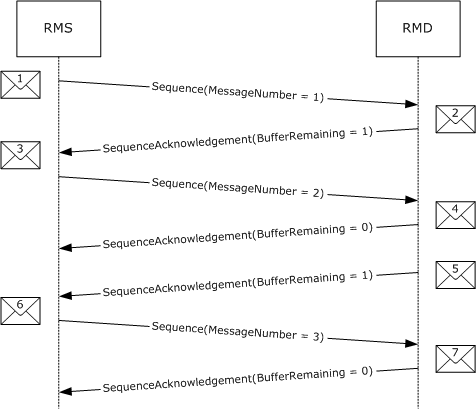
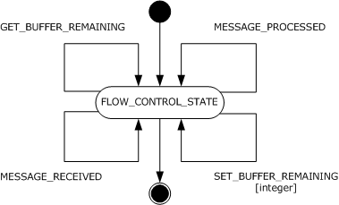
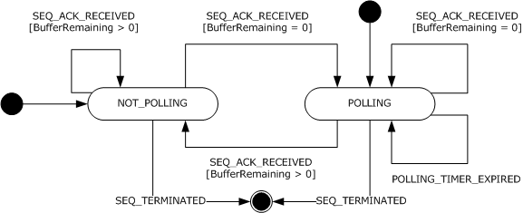
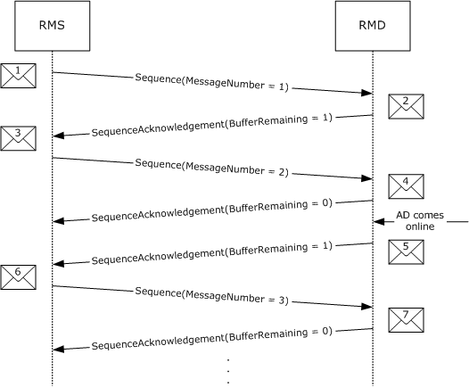

[MS-WSRVCRM]:

WS-ReliableMessaging Protocol: Advanced Flow Control
Extension

Intellectual Property Rights Notice for Open Specifications Documentation

  Technical Documentation. Microsoft publishes Open Specifications documentation (“this

documentation”) for protocols, file formats, data portability, computer languages, and standards
support. Additionally, overview documents cover inter-protocol relationships and interactions.

  Copyrights. This documentation is covered by Microsoft copyrights. Regardless of any other

terms that are contained in the terms of use for the Microsoft website that hosts this
documentation, you can make copies of it in order to develop implementations of the technologies
that are described in this documentation and can distribute portions of it in your implementations
that use these technologies or in your documentation as necessary to properly document the
implementation. You can also distribute in your implementation, with or without modification, any
schemas, IDLs, or code samples that are included in the documentation. This permission also
applies to any documents that are referenced in the Open Specifications documentation.
  No Trade Secrets. Microsoft does not claim any trade secret rights in this documentation.
  Patents. Microsoft has patents that might cover your implementations of the technologies

described in the Open Specifications documentation. Neither this notice nor Microsoft's delivery of
this documentation grants any licenses under those patents or any other Microsoft patents.
However, a given Open Specifications document might be covered by the Microsoft Open
Specifications Promise or the Microsoft Community Promise. If you would prefer a written license,
or if the technologies described in this documentation are not covered by the Open Specifications
Promise or Community Promise, as applicable, patent licenses are available by contacting
iplg@microsoft.com.

  License Programs. To see all of the protocols in scope under a specific license program and the

associated patents, visit the Patent Map.

  Trademarks. The names of companies and products contained in this documentation might be
covered by trademarks or similar intellectual property rights. This notice does not grant any
licenses under those rights. For a list of Microsoft trademarks, visit
www.microsoft.com/trademarks.

  Fictitious Names. The example companies, organizations, products, domain names, email

addresses, logos, people, places, and events that are depicted in this documentation are fictitious.
No association with any real company, organization, product, domain name, email address, logo,
person, place, or event is intended or should be inferred.

Reservation of Rights. All other rights are reserved, and this notice does not grant any rights other
than as specifically described above, whether by implication, estoppel, or otherwise.

Tools. The Open Specifications documentation does not require the use of Microsoft programming
tools or programming environments in order for you to develop an implementation. If you have access
to Microsoft programming tools and environments, you are free to take advantage of them. Certain
Open Specifications documents are intended for use in conjunction with publicly available standards
specifications and network programming art and, as such, assume that the reader either is familiar
with the aforementioned material or has immediate access to it.

Support. For questions and support, please contact dochelp@microsoft.com.

[MS-WSRVCRM] - v20190313
WS-ReliableMessaging Protocol: Advanced Flow Control Extension
Copyright © 2019 Microsoft Corporation
Release: March 13, 2019

1 / 29

Revision Summary

Date

Revision
History

Revision
Class

Comments

4/8/2008

0.1

6/20/2008

0.2

7/25/2008

1.0

New

Minor

Major

Version 0.1 release

Clarified the meaning of the technical content.

Updated and revised the technical content.

8/29/2008

1.0.1

Editorial

Changed language and formatting in the technical content.

10/24/2008  1.0.2

Editorial

Changed language and formatting in the technical content.

12/5/2008

2.0

Major

Updated and revised the technical content.

1/16/2009

2.0.1

Editorial

Changed language and formatting in the technical content.

2/27/2009

2.0.2

Editorial

Changed language and formatting in the technical content.

4/10/2009

2.0.3

Editorial

Changed language and formatting in the technical content.

5/22/2009

2.0.4

Editorial

Changed language and formatting in the technical content.

7/2/2009

2.0.5

Editorial

Changed language and formatting in the technical content.

8/14/2009

2.0.6

Editorial

Changed language and formatting in the technical content.

9/25/2009

2.0.7

Editorial

Changed language and formatting in the technical content.

11/6/2009

2.0.8

Editorial

Changed language and formatting in the technical content.

12/18/2009  2.1

Minor

Clarified the meaning of the technical content.

1/29/2010

2.1.1

Editorial

Changed language and formatting in the technical content.

3/12/2010

3.0

Major

Updated and revised the technical content.

4/23/2010

3.0.1

Editorial

Changed language and formatting in the technical content.

6/4/2010

3.0.2

Editorial

Changed language and formatting in the technical content.

7/16/2010

4.0

Major

Updated and revised the technical content.

8/27/2010

4.0

10/8/2010

4.0

11/19/2010  4.0

1/7/2011

4.0

2/11/2011

4.0

3/25/2011

4.0

5/6/2011

4.0

None

None

None

None

None

None

None

No changes to the meaning, language, or formatting of the
technical content.

No changes to the meaning, language, or formatting of the
technical content.

No changes to the meaning, language, or formatting of the
technical content.

No changes to the meaning, language, or formatting of the
technical content.

No changes to the meaning, language, or formatting of the
technical content.

No changes to the meaning, language, or formatting of the
technical content.

No changes to the meaning, language, or formatting of the
technical content.

2 / 29

[MS-WSRVCRM] - v20190313
WS-ReliableMessaging Protocol: Advanced Flow Control Extension
Copyright © 2019 Microsoft Corporation
Release: March 13, 2019

Date

Revision
History

Revision
Class

Comments

6/17/2011

4.1

Minor

Clarified the meaning of the technical content.

9/23/2011

4.1

None

No changes to the meaning, language, or formatting of the
technical content.

12/16/2011  5.0

Major

Updated and revised the technical content.

3/30/2012

5.0

7/12/2012

5.0

10/25/2012  5.0

1/31/2013

5.0

8/8/2013

5.0

11/14/2013  5.0

2/13/2014

5.0

5/15/2014

5.0

None

None

None

None

None

None

None

None

No changes to the meaning, language, or formatting of the
technical content.

No changes to the meaning, language, or formatting of the
technical content.

No changes to the meaning, language, or formatting of the
technical content.

No changes to the meaning, language, or formatting of the
technical content.

No changes to the meaning, language, or formatting of the
technical content.

No changes to the meaning, language, or formatting of the
technical content.

No changes to the meaning, language, or formatting of the
technical content.

No changes to the meaning, language, or formatting of the
technical content.

6/30/2015

6.0

Major

Significantly changed the technical content.

10/16/2015  6.0

7/14/2016

6.0

None

None

No changes to the meaning, language, or formatting of the
technical content.

No changes to the meaning, language, or formatting of the
technical content.

3/16/2017

7.0

Major

Significantly changed the technical content.

6/1/2017

7.0

None

No changes to the meaning, language, or formatting of the
technical content.

3/13/2019

8.0

Major

Significantly changed the technical content.

[MS-WSRVCRM] - v20190313
WS-ReliableMessaging Protocol: Advanced Flow Control Extension
Copyright © 2019 Microsoft Corporation
Release: March 13, 2019

3 / 29

Table of Contents

1.1
1.2

1.2.1
1.2.2

1  Introduction ............................................................................................................ 6
Glossary ........................................................................................................... 6
References ........................................................................................................ 6
Normative References ................................................................................... 7
Informative References ................................................................................. 7
Overview .......................................................................................................... 7
Relationship to Other Protocols ............................................................................ 8
Prerequisites/Preconditions ................................................................................. 8
Applicability Statement ....................................................................................... 8
Versioning and Capability Negotiation ................................................................... 8
Vendor-Extensible Fields ..................................................................................... 9
Standards Assignments ....................................................................................... 9

1.3
1.4
1.5
1.6
1.7
1.8
1.9

2.1
2.2

2  Messages ............................................................................................................... 10
Transport ........................................................................................................ 10
Message Syntax ............................................................................................... 10
SequenceAcknowledgement Header Block ...................................................... 10
AckRequested Header Block ......................................................................... 10
BufferRemaining Element Syntax .................................................................. 10

2.2.1
2.2.2
2.2.3

3.1

3.1.1

3.1.1.1

3.1.7.1
3.1.7.2
3.1.7.3
3.1.7.4

3.1.2
3.1.3
3.1.4
3.1.5
3.1.6
3.1.7

3  Protocol Details ..................................................................................................... 11
RMD Role Details ............................................................................................. 11
Abstract Data Model .................................................................................... 11
FLOW_CONTROL_STATE ........................................................................ 11
Timers ...................................................................................................... 12
Initialization ............................................................................................... 12
Higher-Layer Triggered Events ..................................................................... 12
Message Processing Events and Sequencing Rules .......................................... 12
Timer Events .............................................................................................. 12
Other Local Events ...................................................................................... 12
GET_BUFFER_REMAINING ...................................................................... 12
MESSAGE_PROCESSED .......................................................................... 12
MESSAGE_RECEIVED ............................................................................ 13
SET_BUFFER_REMAINING ...................................................................... 13
RMS Role Details .............................................................................................. 13
Abstract Data Model .................................................................................... 13
NOT_POLLING ...................................................................................... 14
POLLING .............................................................................................. 14
Timers ...................................................................................................... 14
POLLING_TIMER ................................................................................... 14
Initialization ............................................................................................... 14
Higher-Layer Triggered Events ..................................................................... 15
Message Processing Events and Sequencing Rules .......................................... 15
Timer Events .............................................................................................. 15
POLLING_TIMER_EXPIRED ..................................................................... 15
Other Local Events ...................................................................................... 15
SEQ_ACK_RECEIVED ............................................................................. 15
SEQ_TERMINATED ................................................................................ 16

3.2.3
3.2.4
3.2.5
3.2.6

3.2.7.1
3.2.7.2

3.2.1.1
3.2.1.2

3.2.6.1

3.2.2.1

3.2.7

3.2.1

3.2.2

3.2

4.1

4  Protocol Examples ................................................................................................. 17
Message Examples ........................................................................................... 17
Message 1: Sequence(MessageNumber = 1) .................................................. 17
Message 2: SequenceAcknowledgement(BufferRemaining = 1) ........................ 18
Message 3: Sequence(MessageNumber = 2) .................................................. 19
Message 4: SequenceAcknowledgement(BufferRemaining = 0) ........................ 20

4.1.1
4.1.2
4.1.3
4.1.4

[MS-WSRVCRM] - v20190313
WS-ReliableMessaging Protocol: Advanced Flow Control Extension
Copyright © 2019 Microsoft Corporation
Release: March 13, 2019

4 / 29

4.1.5
4.1.6
4.1.7

Message 5: SequenceAcknowledgement(BufferRemaining = 1) ........................ 21
Message 6: Sequence(MessageNumber = 3) .................................................. 22
Message 7: SequenceAcknowledgement(BufferRemaining = 0) ........................ 23

5  Security ................................................................................................................. 25
Security Considerations for Implementers ........................................................... 25
Index of Security Parameters ............................................................................ 25

5.1
5.2

6  Appendix A: Product Behavior ............................................................................... 26

7  Change Tracking .................................................................................................... 27

8  Index ..................................................................................................................... 28

[MS-WSRVCRM] - v20190313
WS-ReliableMessaging Protocol: Advanced Flow Control Extension
Copyright © 2019 Microsoft Corporation
Release: March 13, 2019

5 / 29

1  Introduction

This document specifies an advanced message flow control extension to the Web Services Reliable
Messaging Protocol [WSRM1-0], [WSRM1-1], and [WSRM1-2].

Sections 1.5, 1.8, 1.9, 2, and 3 of this specification are normative. All other sections and examples in
this specification are informative.

1.1  Glossary

This document uses the following terms:

advanced flow-control extension (AFCE): An extension to the Web Services Reliable Messaging
Protocol [WSRM1-0], [WSRM1-1], and [WSRM1-2] that attempts to minimize the number of
dropped messages by synchronizing the rate at which the reliable messaging source (RMS)
sends messages with the rate at which the reliable messaging destination (RMD) can
receive them.

advanced flow-control object (AFCO): The abstract construct used to demonstrate an

implementation of the advanced flow-control extension (AFCE) on the reliable messaging
destination (RMD)).

Application Destination (AD): The endpoint to which a message is delivered. For fuller

information, see [WSRM1-0], [WSRM1-1], and [WSRM1-2].

reliable messaging destination (RMD): An endpoint that receives a message. For more

information, see [WSRM1-0], [WSRM1-1], and [WSRM1-2].

reliable messaging source (RMS): An endpoint that sends a message. For more information,

see [WSRM1-0], [WSRM1-1], and [WSRM1-2].

sequence: A one-way, uniquely identifiable batch of messages between an RMS and an RMD.

SOAP: A lightweight protocol for exchanging structured information in a decentralized, distributed

environment. SOAP uses XML technologies to define an extensible messaging framework, which
provides a message construct that can be exchanged over a variety of underlying protocols. The
framework has been designed to be independent of any particular programming model and
other implementation-specific semantics. SOAP 1.2 supersedes SOAP 1.1. See [SOAP1.2-
1/2003].

Web Services Reliable Messaging (WSRM) Protocol: A protocol that defines mechanisms that
enable web services to ensure delivery of messages over unreliable communication networks.
The WSRM Protocol allows different operating and middleware systems to reliably exchange
these messages.

MAY, SHOULD, MUST, SHOULD NOT, MUST NOT: These terms (in all caps) are used as defined
in [RFC2119]. All statements of optional behavior use either MAY, SHOULD, or SHOULD NOT.

1.2  References

Links to a document in the Microsoft Open Specifications library point to the correct section in the
most recently published version of the referenced document. However, because individual documents
in the library are not updated at the same time, the section numbers in the documents may not
match. You can confirm the correct section numbering by checking the Errata.

[MS-WSRVCRM] - v20190313
WS-ReliableMessaging Protocol: Advanced Flow Control Extension
Copyright © 2019 Microsoft Corporation
Release: March 13, 2019

6 / 29

1.2.1  Normative References

We conduct frequent surveys of the normative references to assure their continued availability. If you
have any issue with finding a normative reference, please contact dochelp@microsoft.com. We will
assist you in finding the relevant information.

[RFC2119] Bradner, S., "Key words for use in RFCs to Indicate Requirement Levels", BCP 14, RFC
2119, March 1997, https://www.rfc-editor.org/info/rfc2119

[WSRM1-0] Bilorusets, R., Box D., Cabrera L., Davis D. et al., "Web Services Reliable Messaging
Protocol (WS-ReliableMessaging)", February 2005, https://specs.xmlsoap.org/ws/2005/02/rm/

[WSRM1-1] Bilorusets, R., Box D., Cabrera L., Davis D. et al., "Web Services Reliable Messaging (WS-
ReliableMessaging) Version 1.1", OASIS Standard, November 2004, https://docs.oasis-open.org/ws-
rx/wsrm/200608/wsrm-1.1-spec-cd-04.html

[WSRM1-2] Bilorusets, R., Box D., Cabrera L., Davis D. et al., "Web Services Reliable Messaging (WS-
ReliableMessaging) Version 1.2", OASIS Standard, February 2009, https://docs.oasis-open.org/ws-
rx/wsrm/200702

1.2.2  Informative References

[MS-NETOD] Microsoft Corporation, "Microsoft .NET Framework Protocols Overview".

1.3  Overview

The advanced flow-control extension (AFCE) to web services reliable messaging protocol
(WSRM) attempts to minimize the number of dropped messages by synchronizing the rate at which
the reliable messaging source (RMS) sends messages with the rate at which the reliable
messaging destination (RMD) can receive them. This minimization is achieved via the introduction
of the BufferRemaining element in the WSRM protocol's SequenceAcknowledgement header block. This
element is used to inform the RMS of the number of messages that the RMD is capable of receiving
before messages start being dropped.

The RMS uses the BufferRemaining element's value to adjust the rate at which messages are sent.
The RMS will not send new messages if the BufferRemaining element's value in a
SequenceAcknowledgement header block is 0.

While the BufferRemaining element value is reported as 0, the RMS will periodically request for
acknowledgements from the RMD until one is received containing a BufferRemaining element value
greater than 0.

The example in the following figure shows an already-established reliable sequence between an RMS
and an RMD. The RMS sends 2 messages (message 1 and 3), after which it is informed via the
SequenceAcknowledgement header block (message 4) that the RMD can no longer receive any new
messages (BufferRemaining is 0). Sometime later, the RMD informs the RMS that it can once again
receive messages by changing the BufferRemaining value to 1 in a SequenceAcknowledgement header
block (message 5). The RMS then proceeds to send the third message (message 6).

[MS-WSRVCRM] - v20190313
WS-ReliableMessaging Protocol: Advanced Flow Control Extension
Copyright © 2019 Microsoft Corporation
Release: March 13, 2019

7 / 29

<!-- Extracted images from page 8 -->

<!-- /Extracted images from page 8 -->

Figure 1: Example message flow diagram between an RMS and an RMD with AFCE to WSRM

1.4  Relationship to Other Protocols

The advanced flow-control extension (AFCE) to web services reliable messaging protocol
(WSRM) relies on the WSRM protocol, to which it is an extension.

1.5  Prerequisites/Preconditions

The following prerequisites are necessary for using the AFCE to WSRM:

  An implementation of WSRM is available.

  A reliable sequence has been established.

1.6  Applicability Statement

The AFCE to WSRM is applicable under all conditions where the WSRM protocol is applicable.

1.7  Versioning and Capability Negotiation

There is a single version of the AFCE to WSRM protocol.

[MS-WSRVCRM] - v20190313
WS-ReliableMessaging Protocol: Advanced Flow Control Extension
Copyright © 2019 Microsoft Corporation
Release: March 13, 2019

8 / 29

1.8  Vendor-Extensible Fields

None.

1.9  Standards Assignments

None.

[MS-WSRVCRM] - v20190313
WS-ReliableMessaging Protocol: Advanced Flow Control Extension
Copyright © 2019 Microsoft Corporation
Release: March 13, 2019

9 / 29

2  Messages

2.1  Transport

The advanced flow-control extension (AFCE) to web services reliable messaging protocol
(WSRM) does not impose any restrictions on the use of any specific Simple Object Access Protocol
(SOAP) transport protocol.

2.2  Message Syntax

2.2.1  SequenceAcknowledgement Header Block

The SequenceAcknowledgement header block is the SequenceAcknowledgement header block
specified in WSRM with the following extension:



The extensibility element of the SequenceAcknowledgement header block, as specified by the
WSRM specifications [WSRM1-0], [WSRM1-1], and [WSRM1-2] MUST contain a BufferRemaining
element.

2.2.2  AckRequested Header Block

The AckRequested header block is the AckRequested header block specified in WSRM.

2.2.3  BufferRemaining Element Syntax

The following is the element's schema.

 <xs:schema
     targetNamespace="http://schemas.microsoft.com/ws/2006/05/rm"
     xmlns:xs="http://www.w3.org/2001/XMLSchema"
 >
   <xs:element name="BufferRemaining">
     <xs:simpleType>
       <xs:restriction base="xs:int">
         <xs:minInclusive value="0"/>
         <xs:maxInclusive value="2147483647"/>
       </xs:restriction>
     </xs:simpleType>
   </xs:element>
 </xs:schema>

[MS-WSRVCRM] - v20190313
WS-ReliableMessaging Protocol: Advanced Flow Control Extension
Copyright © 2019 Microsoft Corporation
Release: March 13, 2019

10 / 29

<!-- Extracted images from page 11 -->

<!-- /Extracted images from page 11 -->

3  Protocol Details

3.1  RMD Role Details

3.1.1  Abstract Data Model

This section describes a conceptual model of possible data organization that an implementation
maintains to participate in this protocol. The described organization is provided to facilitate the
explanation of how the protocol behaves. This document does not mandate that implementations
adhere to this model as long as their external behavior is consistent with that described in this
document.

An abstract construct referred to as the advanced flow-control object (AFCO) is used in this
section to describe the advanced flow-control extension (AFCE) to web services reliable
messaging protocol (WSRM) on the reliable messaging destination (RMD).

The AFCO maintains the following data elements:

  Buffer Remaining: A 32-bit integer value that indicates the number of messages the RMD can to

receive. The value of Buffer Remaining is non-negative.

The following figure shows a hypothetical implementation of the AFCO and the events that control its
state on a hypothetical implementation-specific RMD.

Figure 2: State diagram of the AFCO on the RMD

3.1.1.1  FLOW_CONTROL_STATE

The AFCO has a single state called FLOW_CONTROL_STATE.

The following local events are processed by this state:

  GET_BUFFER_REMAINING

  MESSAGE_RECEIVED

[MS-WSRVCRM] - v20190313
WS-ReliableMessaging Protocol: Advanced Flow Control Extension
Copyright © 2019 Microsoft Corporation
Release: March 13, 2019

11 / 29

  MESSAGE_PROCESSED

  SET_BUFFER_REMAINING

3.1.2  Timers

None.

3.1.3  Initialization

When the RMD is initialized:







The AFCO MUST start in the FLOW_CONTROL_STATE state.

The Buffer Remaining field MUST be set to a value obtained from the RMD. <1>

The Buffer Remaining field's maximum value MUST be specified by the RMD. <2>

3.1.4  Higher-Layer Triggered Events

None.

3.1.5  Message Processing Events and Sequencing Rules

None.

3.1.6  Timer Events

None.

3.1.7  Other Local Events

None.

3.1.7.1  GET_BUFFER_REMAINING

The reliable messaging destination (RMD) MUST trigger the GET_BUFFER_REMAINING event
when adding a SequenceAcknowledgement header block to a message.

If the GET_BUFFER_REMAINING event is signaled, the following actions MUST be performed:





The GET_BUFFER_REMAINING event MUST return the value of the advanced flow-control
object's (AFCO) Buffer Remaining field.

The RMD MUST use the return value to set the value of the BufferRemaining element in the
SequenceAcknowledgement header block.

3.1.7.2  MESSAGE_PROCESSED

The MESSAGE_PROCESSED event SHOULD be triggered by the RMD when a message is processed by
the application destination (AD).

If the MESSAGE_PROCESSED event is signaled, the following actions MUST be performed:



If the AFCO Buffer Remaining value is less than the maximum allowed by the RMD:

[MS-WSRVCRM] - v20190313
WS-ReliableMessaging Protocol: Advanced Flow Control Extension
Copyright © 2019 Microsoft Corporation
Release: March 13, 2019

12 / 29



The AFCO's Buffer Remaining value SHOULD be incremented by 1 by having the RMD trigger
the SET_BUFFER_REMAINING event (see section 3.1.7.4).

  Otherwise:



The AFCO SHOULD NOT change its Buffer Remaining value.

3.1.7.3  MESSAGE_RECEIVED

The RMD SHOULD trigger the MESSAGE_RECEIVED event when a message is received.

If the MESSAGE_RECEIVED event is signaled, the following actions MUST be performed:



If the AFCO's Buffer Remaining has a value greater than 0:



The AFCO's Buffer Remaining value SHOULD be decremented by 1 by having the RMD
trigger the SET_BUFFER_REMAINING event (see section 3.1.7.4).

  Otherwise:



The AFCO SHOULD NOT change its Buffer Remaining value.

3.1.7.4  SET_BUFFER_REMAINING

The RMD MAY trigger the SET_BUFFER_REMAINING event to control higher-layer implementation-
specific flow control.

The SET_BUFFER_REMAINING event MUST be signaled by the higher-layer business logic containing
the following arguments:



The New Buffer Remaining argument

If the SET_BUFFER_REMAINING event is signaled, the AFCO MUST perform the following actions:



The AFCO MUST set the value of its Buffer Remaining field to the New Buffer Remaining value.

3.2  RMS Role Details

3.2.1  Abstract Data Model

This section describes a conceptual model of possible data organization that an implementation
maintains to participate in this protocol. The described organization is provided to facilitate the
explanation of how the protocol behaves. This document does not mandate that implementations
adhere to this model as long as their external behavior is consistent with that described in this
document.

The following figure shows the advanced flow-control extension (AFCE) to web services reliable
messaging protocol (WSRM) state diagram for a hypothetical reliable messaging source (RMS)
and the events that control its state.

[MS-WSRVCRM] - v20190313
WS-ReliableMessaging Protocol: Advanced Flow Control Extension
Copyright © 2019 Microsoft Corporation
Release: March 13, 2019

13 / 29

<!-- Extracted images from page 14 -->

<!-- /Extracted images from page 14 -->

Figure 3: State diagram of the AFCE to WSRM on the RMS

3.2.1.1  NOT_POLLING

The following local events are processed by this state:

  SEQ_ACK_RECEIVED

  SEQ_TERMINATED

3.2.1.2  POLLING

The following local events are processed by this state:

  SEQ_ACK_RECEIVED

  SEQ_TERMINATED

The following timer events are processed by this state:



POLLING_TIMER_EXPIRED

If the reliable messaging source (RMS) is in the POLLING state, the following actions MUST be
taken:

  New messages SHOULD NOT be sent to the reliable messaging destination (RMD).

3.2.2  Timers

3.2.2.1  POLLING_TIMER

The RMS MUST have a POLLING_TIMER. The POLLING_TIMER specifies the interval used by the RMS
to poll the RMD for the SequenceAcknowledgement header block.

The POLLING_TIMER raises the POLLING_TIMER_EXPIRED event whenever it expires.

3.2.3  Initialization

When the reliable messaging source (RMS) is initialized:



The RMS MUST be in the NOT_POLLING state.

[MS-WSRVCRM] - v20190313
WS-ReliableMessaging Protocol: Advanced Flow Control Extension
Copyright © 2019 Microsoft Corporation
Release: March 13, 2019

14 / 29



The expiration timeout of the POLLING_TIMER MUST be set to an RMS implementation-specific
value. <3>



The POLLING_TIMER MUST NOT be started.

3.2.4  Higher-Layer Triggered Events

There are no RMS specific higher-layer triggered events.

3.2.5  Message Processing Events and Sequencing Rules

There are no RMS specific message processing events or sequencing rules.

3.2.6  Timer Events

3.2.6.1  POLLING_TIMER_EXPIRED

The POLLING_TIMER_EXPIRED event MUST be triggered by the RMS every time the POLLING_TIMER
expires. The POLLING_TIMER_EXPIRED event is processed by the POLLING state.

If the POLLING_TIMER_EXPIRED event is signaled, the RMS MUST perform the following actions:

1.  Include an AckRequested header block in a message to the RMD.

2.  Reset the POLLING_TIMER timer.

3.  Restart the POLLING_TIMER timer.

3.2.7  Other Local Events

3.2.7.1  SEQ_ACK_RECEIVED

The SEQ_ACK_RECEIVED event MUST be triggered by the reliable messaging source (RMS) when
a SequenceAcknowledgement header block is received.

The SEQ_ACK_RECEIVED event MUST be signaled with the following arguments:





The BufferRemaining argument corresponding to the value of the BufferRemaining element in the
SequenceAcknowledgement header block.

If the BufferRemaining element is missing from the SequenceAcknowledgement header block, the
BufferRemaining argument MUST be set to -1.

If the SEQ_ACK_RECEIVED event is signaled, the RMS MUST perform the following actions:



If the RMS is in the POLLING state:



If the BufferRemaining value is greater than 0:

1.  The RMS MUST move to the NOT_POLLING state.

2.  The RMS MUST cancel the POLLING_TIMER timer.



If the BufferRemaining value is equal to 0:

1.  The RMS MUST remain in the POLLING state.



If the BufferRemaining value is equal to -1:

[MS-WSRVCRM] - v20190313
WS-ReliableMessaging Protocol: Advanced Flow Control Extension
Copyright © 2019 Microsoft Corporation
Release: March 13, 2019

15 / 29

1.  The RMS MUST remain in the POLLING state.



If the RMS is in the NOT_POLLING state:



If the BufferRemaining value is greater than 0:

1.  The RMS MUST remain in the NOT_POLLING state.



If the BufferRemaining value is equal to 0:

1.  The RMS MUST move to the POLLING state.

2.  The RMS MUST reset the POLLING_TIMER timer.

3.  The RMS MUST start the POLLING_TIMER timer.



If the BufferRemaining value is equal to -1:

1.  The RMS MUST remain in the NOT_POLLING state.

3.2.7.2  SEQ_TERMINATED

The SEQ_TERMINATED event MUST be triggered by the RMS when the sequence is terminated (as
specified in web services reliable messaging protocol (WSRM)).

If the SEQ_TERMINATED event is signaled, the RMS MUST perform the following actions:



If the RMS is in the POLLING state:



The RMS MUST stop the POLLING_TIMER timer.



If the RMS is in the NOT_POLLING state:

  No action is needed.

[MS-WSRVCRM] - v20190313
WS-ReliableMessaging Protocol: Advanced Flow Control Extension
Copyright © 2019 Microsoft Corporation
Release: March 13, 2019

16 / 29

<!-- Extracted images from page 17 -->

<!-- /Extracted images from page 17 -->

4  Protocol Examples

The following is an example of a reliable messaging source (RMS) sending 3 messages to a
reliable messaging destination (RMD). The RMD is capable of storing a maximum of 2 messages
at a time. Once stored, the messages are passed to the application destination (AD) for
processing. In this example, the AD is offline when the RMD starts receiving messages. The RMD uses
SequenceAcknowledgement header blocks to acknowledge every message received. The
BufferRemaining element is included in all SequenceAcknowledgement header blocks and the RMS
adjusts the rate at which it sends new messages accordingly.

The following figure shows the diagram of the message flow between the RMS and the RMD.

Figure 4: Example message flow diagram between an RMS and an RMD with AFCE to WSRM

4.1  Message Examples

The following are the actual messages, as shown in Figure 4, sent between the RMS and the RMD.
The body of each message is not shown as it is not relevant to the advanced flow-control
extension (AFCE) to the web services reliable messaging protocol (WSRM). The purpose of
each message is not included in this example. See the WSRM specification [WSRM1-0], [WSRM1-1],
and [WSRM1-2] for details on each message type.

4.1.1  Message 1: Sequence(MessageNumber = 1)

Message 1 in Figure 4 is the first message in the Sequence sent by the RMS.

[MS-WSRVCRM] - v20190313
WS-ReliableMessaging Protocol: Advanced Flow Control Extension
Copyright © 2019 Microsoft Corporation
Release: March 13, 2019

17 / 29

Line numbers 1-19 in Table 1 are the SOAP envelope of message 1. Line 11 shows this to be the first
message in the Sequence.

Table 1

1

2

3

4

5

6

7

8

9

10

11

12

13

14

15

16

17

18

19

<s:Envelope

 xmlns:s="http://www.w3.org/2003/05/soap-envelope"

 xmlns:r="http://schemas.xmlsoap.org/ws/2005/02/rm"

 xmlns:a="http://www.w3.org/2005/08/addressing"

>

 <s:Header>

 <r:Sequence s:mustUnderstand="1">

 <r:Identifier>

 urn:uuid:0b162747-99cf-479c-972f-95b776e141c3

 </r:Identifier>

 <r:MessageNumber>1</r:MessageNumber>

 </r:Sequence>

 <a:Action s:mustUnderstand="1">

 http://tempuri.org/IAFCEExampleContract/Operation1

 </a:Action>

 <a:To s:mustUnderstand="1">http://localhost/AFCEExample</a:To>

 </s:Header>

 <s:Body>...</s:Body>

</s:Envelope>

4.1.2  Message 2: SequenceAcknowledgement(BufferRemaining = 1)

Message 2 in Figure 4 contains the SequenceAcknowledgement header block sent by the RMD in
response to message 1.

Line numbers 1-24 in Table 2 are the SOAP envelope of message 2. Line 11 shows that the RMD has
received the first message in the Sequence. Lines 13-17 show the BufferRemaining element with a
value of 1. This means the RMD is capable of receiving one more message.

Table 2

[MS-WSRVCRM] - v20190313
WS-ReliableMessaging Protocol: Advanced Flow Control Extension
Copyright © 2019 Microsoft Corporation
Release: March 13, 2019

18 / 29

1

2

3

4

5

6

7

8

9

10

11

12

13

14

15

16

17

18

19

20

21

22

23

24

<s:Envelope

 xmlns:s="http://www.w3.org/2003/05/soap-envelope"

 xmlns:r="http://schemas.xmlsoap.org/ws/2005/02/rm"

 xmlns:a="http://www.w3.org/2005/08/addressing"

>

 <s:Header>

 <r:SequenceAcknowledgement>

 <r:Identifier>

 urn:uuid:0b162747-99cf-479c-972f-95b776e141c3

 </r:Identifier>

 <r:AcknowledgementRange Lower="1" Upper="1">

 </r:AcknowledgementRange>

 <netrm:BufferRemaining

 xmlns:netrm=http://schemas.microsoft.com/ws/2006/05/rm

 >

 1

 </netrm:BufferRemaining>

 </r:SequenceAcknowledgement>

 <a:Action s:mustUnderstand="1">

 http://schemas.xmlsoap.org/ws/2005/02/rm/SequenceAcknowledgement

 </a:Action>

 </s:Header>

 <s:Body></s:Body>

</s:Envelope>

4.1.3  Message 3: Sequence(MessageNumber = 2)

Message 3 in Figure 4 is the second message in the Sequence sent by the RMS.

Line numbers 1-19 in Table 3 are the SOAP envelope of message 3. Line 11 shows this to be the
second message in the Sequence.

Table 3

[MS-WSRVCRM] - v20190313
WS-ReliableMessaging Protocol: Advanced Flow Control Extension
Copyright © 2019 Microsoft Corporation
Release: March 13, 2019

19 / 29

1

2

3

4

5

6

7

8

9

10

11

12

13

14

15

16

17

18

19

<s:Envelope

 xmlns:s="http://www.w3.org/2003/05/soap-envelope"

 xmlns:r="http://schemas.xmlsoap.org/ws/2005/02/rm"

 xmlns:a="http://www.w3.org/2005/08/addressing"

>

 <s:Header>

 <r:Sequence s:mustUnderstand="1">

 <r:Identifier>

 urn:uuid:0b162747-99cf-479c-972f-95b776e141c3

 </r:Identifier>

 <r:MessageNumber>2</r:MessageNumber>

 </r:Sequence>

 <a:Action s:mustUnderstand="1">

 http://tempuri.org/IAFCEExampleContract/Operation1

 </a:Action>

 <a:To s:mustUnderstand="1">http://localhost/AFCEExample</a:To>

 </s:Header>

 <s:Body>...</s:Body>

</s:Envelope>

4.1.4  Message 4: SequenceAcknowledgement(BufferRemaining = 0)

Message 4 in Figure 4 contains the SequenceAcknowledgement header block sent by the RMD in
response to message 2.

Line numbers 1-24 in Table 4 are the SOAP envelope of message 4. Line 11 shows that the RMD has
received the first and second messages in the Sequence. Lines 13-17 show the BufferRemaining
element with a value of 0. This means the RMD is not capable of receiving more messages until the
AD comes online and starts processing the ones already received.

Table 4

[MS-WSRVCRM] - v20190313
WS-ReliableMessaging Protocol: Advanced Flow Control Extension
Copyright © 2019 Microsoft Corporation
Release: March 13, 2019

20 / 29

1

2

3

4

5

6

7

8

9

10

11

12

13

14

15

16

17

18

19

20

21

22

23

24

<s:Envelope

 xmlns:s="http://www.w3.org/2003/05/soap-envelope"

 xmlns:r="http://schemas.xmlsoap.org/ws/2005/02/rm"

 xmlns:a="http://www.w3.org/2005/08/addressing"

>

 <s:Header>

 <r:SequenceAcknowledgement>

 <r:Identifier>

 urn:uuid:0b162747-99cf-479c-972f-95b776e141c3

 </r:Identifier>

 <r:AcknowledgementRange Lower="1" Upper="2">

 </r:AcknowledgementRange>

 <netrm:BufferRemaining

 xmlns:netrm=http://schemas.microsoft.com/ws/2006/05/rm

 >

 0

 </netrm:BufferRemaining>

 </r:SequenceAcknowledgement>

 <a:Action s:mustUnderstand="1">

 http://schemas.xmlsoap.org/ws/2005/02/rm/SequenceAcknowledgement

 </a:Action>

 </s:Header>

 <s:Body></s:Body>

</s:Envelope>

4.1.5  Message 5: SequenceAcknowledgement(BufferRemaining = 1)

Message 5 in Figure 4 contains the SequenceAcknowledgement header block sent by the RMD in
response to the AD coming online and processing message 1. The RMD removed message 1 from its
store once it was processed, allowing the RMD to receive a new message in message 1's stead.

Line numbers 1-24 in Table 5 are the SOAP envelope of message 5. Line 11 shows that the RMD has
received the first and second messages in the Sequence, which has not changed since message 4.
Lines 13-17 show the BufferRemaining element with a value of 1. This means the RMD is now once
again capable of receiving a message.

Table 5

[MS-WSRVCRM] - v20190313
WS-ReliableMessaging Protocol: Advanced Flow Control Extension
Copyright © 2019 Microsoft Corporation
Release: March 13, 2019

21 / 29

1

2

3

4

5

6

7

8

9

10

11

12

13

14

15

16

17

18

19

20

21

22

23

24

<s:Envelope

 xmlns:s="http://www.w3.org/2003/05/soap-envelope"

 xmlns:r="http://schemas.xmlsoap.org/ws/2005/02/rm"

 xmlns:a="http://www.w3.org/2005/08/addressing"

>

 <s:Header>

 <r:SequenceAcknowledgement>

 <r:Identifier>

 urn:uuid:0b162747-99cf-479c-972f-95b776e141c3

 </r:Identifier>

 <r:AcknowledgementRange Lower="1" Upper="2">

 </r:AcknowledgementRange>

 <netrm:BufferRemaining

 xmlns:netrm=http://schemas.microsoft.com/ws/2006/05/rm

 >

 1

 </netrm:BufferRemaining>

 </r:SequenceAcknowledgement>

 <a:Action s:mustUnderstand="1">

 http://schemas.xmlsoap.org/ws/2005/02/rm/SequenceAcknowledgement

 </a:Action>

 </s:Header>

 <s:Body></s:Body>

</s:Envelope>

4.1.6  Message 6: Sequence(MessageNumber = 3)

Message 6 in Figure 4 is the third message in the Sequence sent by the RMS in response to
processing the BufferRemaining element in the SequenceAcknowledgement header block of message
5. The BufferRemaining element, with a value of 1, informed the RMS of the RMD's capability of
receiving a new message.

Line numbers 1-19 in Table 6 are the SOAP envelope of message 6. Line 11 shows this to be the third
message in the Sequence.

Table 6

[MS-WSRVCRM] - v20190313
WS-ReliableMessaging Protocol: Advanced Flow Control Extension
Copyright © 2019 Microsoft Corporation
Release: March 13, 2019

22 / 29

1

2

3

4

5

6

7

8

9

10

11

12

13

14

15

16

17

18

19

<s:Envelope

 xmlns:s="http://www.w3.org/2003/05/soap-envelope"

 xmlns:r="http://schemas.xmlsoap.org/ws/2005/02/rm"

 xmlns:a="http://www.w3.org/2005/08/addressing"

>

 <s:Header>

 <r:Sequence s:mustUnderstand="1">

 <r:Identifier>

 urn:uuid:0b162747-99cf-479c-972f-95b776e141c3

 </r:Identifier>

 <r:MessageNumber>3</r:MessageNumber>

 </r:Sequence>

 <a:Action s:mustUnderstand="1">

 http://tempuri.org/IAFCEExampleContract/Operation1

 </a:Action>

 <a:To s:mustUnderstand="1">http://localhost/AFCEExample</a:To>

 </s:Header>

 <s:Body>...</s:Body>

</s:Envelope>

4.1.7  Message 7: SequenceAcknowledgement(BufferRemaining = 0)

Message 7 in Figure 4 contains the SequenceAcknowledgement header block sent by the RMD in
response to message 6.

Line numbers 1-24 in Table 7 are the SOAP envelope of message 7. Line 11 shows that the RMD has
received the first, second, and third messages in the Sequence. Lines 13-17 show the
BufferRemaining element with a value of 0. This 0 value means that the RMD is once again incapable
of receiving more messages.

Table 7

[MS-WSRVCRM] - v20190313
WS-ReliableMessaging Protocol: Advanced Flow Control Extension
Copyright © 2019 Microsoft Corporation
Release: March 13, 2019

23 / 29

1

2

3

4

5

6

7

8

9

10

11

12

13

14

15

16

17

18

19

20

21

22

23

24

<s:Envelope

 xmlns:s="http://www.w3.org/2003/05/soap-envelope"

 xmlns:r="http://schemas.xmlsoap.org/ws/2005/02/rm"

 xmlns:a="http://www.w3.org/2005/08/addressing"

>

 <s:Header>

 <r:SequenceAcknowledgement>

 <r:Identifier>

 urn:uuid:0b162747-99cf-479c-972f-95b776e141c3

 </r:Identifier>

 <r:AcknowledgementRange Lower="1" Upper="3">

 </r:AcknowledgementRange>

 <netrm:BufferRemaining

 xmlns:netrm=http://schemas.microsoft.com/ws/2006/05/rm

 >

 0

 </netrm:BufferRemaining>

 </r:SequenceAcknowledgement>

 <a:Action s:mustUnderstand="1">

 http://schemas.xmlsoap.org/ws/2005/02/rm/SequenceAcknowledgement

 </a:Action>

 </s:Header>

 <s:Body></s:Body>

</s:Envelope>

[MS-WSRVCRM] - v20190313
WS-ReliableMessaging Protocol: Advanced Flow Control Extension
Copyright © 2019 Microsoft Corporation
Release: March 13, 2019

24 / 29

5  Security

5.1  Security Considerations for Implementers

The BufferRemaining element is secured with the entire SequenceAcknowledgement header block
containing it.

For information about securing a reliable session, including the SequenceAcknowledgement header
block, see section 5 of [WSRM1-0], [WSRM1-1], and [WSRM1-2].

5.2  Index of Security Parameters

None.

[MS-WSRVCRM] - v20190313
WS-ReliableMessaging Protocol: Advanced Flow Control Extension
Copyright © 2019 Microsoft Corporation
Release: March 13, 2019

25 / 29

6  Appendix A: Product Behavior

The information in this specification is applicable to the following Microsoft products or supplemental
software. References to product versions include updates to those products.

This document specifies version-specific details in the Microsoft .NET Framework. For information
about which versions of .NET Framework are available in each released Windows product or as
supplemental software, see [MS-NETOD] section 4.

  Microsoft .NET Framework 3.0

  Microsoft .NET Framework 3.5

  Microsoft .NET Framework 4.0

  Microsoft .NET Framework 4.5

  Microsoft .NET Framework 4.6

  Microsoft .NET Framework 4.7

  Microsoft .NET Framework 4.8

Exceptions, if any, are noted in this section. If an update version, service pack or Knowledge Base
(KB) number appears with a product name, the behavior changed in that update. The new behavior
also applies to subsequent updates unless otherwise specified. If a product edition appears with the
product version, behavior is different in that product edition.

Unless otherwise specified, any statement of optional behavior in this specification that is prescribed
using the terms "SHOULD" or "SHOULD NOT" implies product behavior in accordance with the
SHOULD or SHOULD NOT prescription. Unless otherwise specified, the term "MAY" implies that the
product does not follow the prescription.

<1> Section 3.1.3:  The Microsoft .NET Framework implementation sets this value to 8.

<2> Section 3.1.3: The Microsoft .NET Framework implementation sets this value to 4096.

<3> Section 3.2.3: The Microsoft .NET Framework implementation sets this value to 30 seconds.

[MS-WSRVCRM] - v20190313
WS-ReliableMessaging Protocol: Advanced Flow Control Extension
Copyright © 2019 Microsoft Corporation
Release: March 13, 2019

26 / 29

7  Change Tracking

This section identifies changes that were made to this document since the last release. Changes are
classified as Major, Minor, or None.

The revision class Major means that the technical content in the document was significantly revised.
Major changes affect protocol interoperability or implementation. Examples of major changes are:

  A document revision that incorporates changes to interoperability requirements.
  A document revision that captures changes to protocol functionality.

The revision class Minor means that the meaning of the technical content was clarified. Minor changes
do not affect protocol interoperability or implementation. Examples of minor changes are updates to
clarify ambiguity at the sentence, paragraph, or table level.

The revision class None means that no new technical changes were introduced. Minor editorial and
formatting changes may have been made, but the relevant technical content is identical to the last
released version.

The changes made to this document are listed in the following table. For more information, please
contact dochelp@microsoft.com.

Section

Description

Revision class

6 Appendix A: Product Behavior  Added .NET 4.8 to the list of applicable products.  Major

[MS-WSRVCRM] - v20190313
WS-ReliableMessaging Protocol: Advanced Flow Control Extension
Copyright © 2019 Microsoft Corporation
Release: March 13, 2019

27 / 29

8  Index
A

Abstract data model
   RMD
      FLOW_CONTROL_STATE 11
      overview 11
   RMS
      NOT_POLLING 14
      overview 13
      POLLING 14
AckRequested header block 10
AckRequested Header Block message 10
Applicability 8

B

BufferRemaining element syntax 10
BufferRemaining Element Syntax message 10

C

Capability negotiation 8
Change tracking 27

D

Data model - abstract
   RMD
      FLOW_CONTROL_STATE 11
      overview 11
   RMS
      NOT_POLLING 14
      overview 13
      POLLING 14

E

Element syntax - BufferRemaining 10
Examples
   message
      1: Sequence(MessageNumber = 1) 17
      2: SequenceAcknowledgement(BufferRemaining

= 1) 18

H

Header block
   AckRequested 10
   SequenceAcknowledgement 10
Higher-layer triggered events
   RMD 12
   RMS 15

I

Implementer - security considerations 25
Index of security parameters 25
Informative references 7
Initialization
   RMD 12
   RMS 14
Introduction 6

L

Local events
   RMD
      GET_BUFFER_REMAINING 12
      MESSAGE_PROCESSED 12
      MESSAGE_RECEIVED 13
      SET_BUFFER_REMAINING 13
   RMS
      SEQ_ACK_RECEIVED 15
      SEQ_TERMINATED 16

M

Message
   1: Sequence(MessageNumber = 1) example 17
   2: SequenceAcknowledgement(BufferRemaining =

1) example 18

   3: Sequence(MessageNumber = 2) example 19
   4: SequenceAcknowledgement(BufferRemaining =

0) example 20

   5: SequenceAcknowledgement(BufferRemaining =

1) example 21

      3: Sequence(MessageNumber = 2) 19
      4: SequenceAcknowledgement(BufferRemaining

   6: Sequence(MessageNumber = 3) example 22
   7: SequenceAcknowledgement(BufferRemaining =

= 0) 20

      5: SequenceAcknowledgement(BufferRemaining

= 1) 21

      6: Sequence(MessageNumber = 3) 22
      7: SequenceAcknowledgement(BufferRemaining

= 0) 23
      overview 17
   overview 17

F

Fields - vendor-extensible 9

G

Glossary 6

0) example 23

   examples - overview 17
   processing
      RMD 12
      RMS 15
Messages
   AckRequested Header Block 10
   BufferRemaining Element Syntax 10
   SequenceAcknowledgement Header Block 10
   transport 10
Messages - transport 10

N

Normative references 7

28 / 29

[MS-WSRVCRM] - v20190313
WS-ReliableMessaging Protocol: Advanced Flow Control Extension
Copyright © 2019 Microsoft Corporation
Release: March 13, 2019

   RMS - POLLING_TIMER_EXPIRED 15
Timers
   RMD 12
   RMS - POLLING_TIMER 14
Tracking changes 27
Transport 10
Triggered events - higher-layer
   RMD 12
   RMS 15

V

Vendor-extensible fields 9
Versioning 8

O

Overview (synopsis) 7

P

Parameters - security index 25
Preconditions 8
Prerequisites 8
Product behavior 26

R

References 6
   informative 7
   normative 7
Relationship to other protocols 8
RMD
   abstract data model
      FLOW_CONTROL_STATE 11
      overview 11
   higher-layer triggered events 12
   initialization 12
   local events
      GET_BUFFER_REMAINING 12
      MESSAGE_PROCESSED 12
      MESSAGE_RECEIVED 13
      SET_BUFFER_REMAINING 13
   message processing 12
   sequencing rules 12
   timer events 12
   timers 12
RMS
   abstract data model
      NOT_POLLING 14
      overview 13
      POLLING 14
   higher-layer triggered events 15
   initialization 14
   local events
      SEQ_ACK_RECEIVED 15
      SEQ_TERMINATED 16
   message processing 15
   sequencing rules 15
   timer events - POLLING_TIMER_EXPIRED 15
   timers - POLLING_TIMER 14

S

Security
   implementer considerations 25
   parameter index 25
SequenceAcknowledgement header block 10
SequenceAcknowledgement Header Block message

10

Sequencing rules
   RMD 12
   RMS 15
Standards assignments 9

T

Timer events
   RMD 12

[MS-WSRVCRM] - v20190313
WS-ReliableMessaging Protocol: Advanced Flow Control Extension
Copyright © 2019 Microsoft Corporation
Release: March 13, 2019

29 / 29

