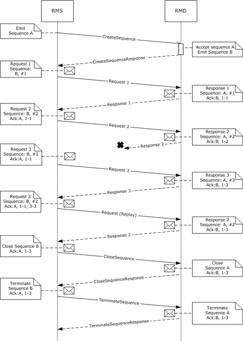
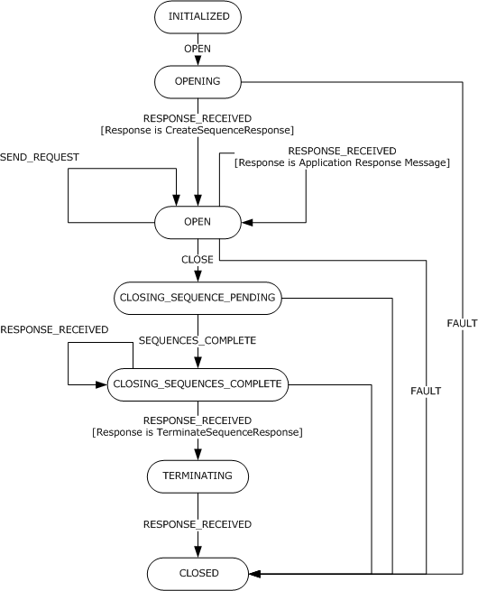
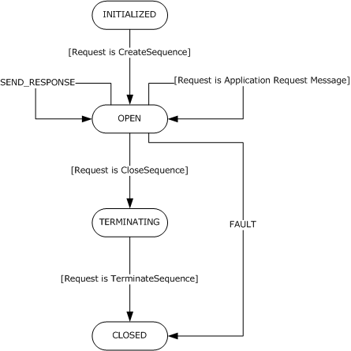

[MS-WSRVCRR]:

WS-ReliableMessaging Protocol: Reliable Request-Reply
Extension

Intellectual Property Rights Notice for Open Specifications Documentation

  Technical Documentation. Microsoft publishes Open Specifications documentation (“this

documentation”) for protocols, file formats, data portability, computer languages, and standards
support. Additionally, overview documents cover inter-protocol relationships and interactions.

  Copyrights. This documentation is covered by Microsoft copyrights. Regardless of any other

terms that are contained in the terms of use for the Microsoft website that hosts this
documentation, you can make copies of it in order to develop implementations of the technologies
that are described in this documentation and can distribute portions of it in your implementations
that use these technologies or in your documentation as necessary to properly document the
implementation. You can also distribute in your implementation, with or without modification, any
schemas, IDLs, or code samples that are included in the documentation. This permission also
applies to any documents that are referenced in the Open Specifications documentation.
  No Trade Secrets. Microsoft does not claim any trade secret rights in this documentation.
  Patents. Microsoft has patents that might cover your implementations of the technologies

described in the Open Specifications documentation. Neither this notice nor Microsoft's delivery of
this documentation grants any licenses under those patents or any other Microsoft patents.
However, a given Open Specifications document might be covered by the Microsoft Open
Specifications Promise or the Microsoft Community Promise. If you would prefer a written license,
or if the technologies described in this documentation are not covered by the Open Specifications
Promise or Community Promise, as applicable, patent licenses are available by contacting
iplg@microsoft.com.

  License Programs. To see all of the protocols in scope under a specific license program and the

associated patents, visit the Patent Map.

  Trademarks. The names of companies and products contained in this documentation might be
covered by trademarks or similar intellectual property rights. This notice does not grant any
licenses under those rights. For a list of Microsoft trademarks, visit
www.microsoft.com/trademarks.

  Fictitious Names. The example companies, organizations, products, domain names, email

addresses, logos, people, places, and events that are depicted in this documentation are fictitious.
No association with any real company, organization, product, domain name, email address, logo,
person, place, or event is intended or should be inferred.

Reservation of Rights. All other rights are reserved, and this notice does not grant any rights other
than as specifically described above, whether by implication, estoppel, or otherwise.

Tools. The Open Specifications documentation does not require the use of Microsoft programming
tools or programming environments in order for you to develop an implementation. If you have access
to Microsoft programming tools and environments, you are free to take advantage of them. Certain
Open Specifications documents are intended for use in conjunction with publicly available standards
specifications and network programming art and, as such, assume that the reader either is familiar
with the aforementioned material or has immediate access to it.

Support. For questions and support, please contact dochelp@microsoft.com.

[MS-WSRVCRR] - v20190313
WS-ReliableMessaging Protocol: Reliable Request-Reply Extension
Copyright © 2019 Microsoft Corporation
Release: March 13, 2019

1 / 46

Revision Summary

Date

Revision
History

Revision
Class

Comments

4/8/2008

0.1

New

Version 0.1 release

6/20/2008

0.1.1

Editorial

Changed language and formatting in the technical content.

7/25/2008

0.1.2

Editorial

Changed language and formatting in the technical content.

8/29/2008

0.1.3

Editorial

Changed language and formatting in the technical content.

10/24/2008  0.1.4

Editorial

Changed language and formatting in the technical content.

12/5/2008

0.1.5

Editorial

Changed language and formatting in the technical content.

1/16/2009

0.1.6

Editorial

Changed language and formatting in the technical content.

2/27/2009

0.1.7

Editorial

Changed language and formatting in the technical content.

4/10/2009

0.1.8

Editorial

Changed language and formatting in the technical content.

5/22/2009

0.1.9

Editorial

Changed language and formatting in the technical content.

7/2/2009

0.1.10

Editorial

Changed language and formatting in the technical content.

8/14/2009

0.1.11

Editorial

Changed language and formatting in the technical content.

9/25/2009

0.2

Minor

Clarified the meaning of the technical content.

11/6/2009

0.2.1

Editorial

Changed language and formatting in the technical content.

12/18/2009  1.0

Major

Updated and revised the technical content.

1/29/2010

1.0.1

Editorial

Changed language and formatting in the technical content.

3/12/2010

2.0

Major

Updated and revised the technical content.

4/23/2010

2.0.1

Editorial

Changed language and formatting in the technical content.

6/4/2010

2.0.2

Editorial

Changed language and formatting in the technical content.

7/16/2010

3.0

8/27/2010

4.0

10/8/2010

4.0

11/19/2010  4.0

1/7/2011

4.0

2/11/2011

4.0

3/25/2011

4.0

5/6/2011

4.0

Major

Major

None

None

None

None

None

None

Updated and revised the technical content.

Updated and revised the technical content.

No changes to the meaning, language, or formatting of the
technical content.

No changes to the meaning, language, or formatting of the
technical content.

No changes to the meaning, language, or formatting of the
technical content.

No changes to the meaning, language, or formatting of the
technical content.

No changes to the meaning, language, or formatting of the
technical content.

No changes to the meaning, language, or formatting of the
technical content.

[MS-WSRVCRR] - v20190313
WS-ReliableMessaging Protocol: Reliable Request-Reply Extension
Copyright © 2019 Microsoft Corporation
Release: March 13, 2019

2 / 46

Date

Revision
History

Revision
Class

Comments

6/17/2011

4.1

Minor

Clarified the meaning of the technical content.

9/23/2011

4.1

None

No changes to the meaning, language, or formatting of the
technical content.

12/16/2011  5.0

Major

Updated and revised the technical content.

3/30/2012

5.0

7/12/2012

5.0

10/25/2012  5.0

None

None

None

No changes to the meaning, language, or formatting of the
technical content.

No changes to the meaning, language, or formatting of the
technical content.

No changes to the meaning, language, or formatting of the
technical content.

1/31/2013

5.1

Minor

Clarified the meaning of the technical content.

8/8/2013

5.1

None

No changes to the meaning, language, or formatting of the
technical content.

11/14/2013  5.1

2/13/2014

6.0

5/15/2014

7.0

6/30/2015

8.0

10/16/2015  8.0

None

Major

Major

Major

None

No changes to the meaning, language, or formatting of the
technical content.

Updated and revised the technical content.

Updated and revised the technical content.

Significantly changed the technical content.

No changes to the meaning, language, or formatting of the
technical content.

7/14/2016

8.0

None

No changes to the meaning, language, or formatting of the
technical content.

3/16/2017

9.0

Major

Significantly changed the technical content.

6/1/2017

9.0

None

No changes to the meaning, language, or formatting of the
technical content.

3/13/2019

10.0

Major

Significantly changed the technical content.

[MS-WSRVCRR] - v20190313
WS-ReliableMessaging Protocol: Reliable Request-Reply Extension
Copyright © 2019 Microsoft Corporation
Release: March 13, 2019

3 / 46

## Table of Contents

- [1 Introduction](#1-introduction)
  - [1.1 Glossary](#11-glossary)
  - [1.2 References](#12-references)
    - [1.2.1 Normative References](#121-normative-references)
    - [1.2.2 Informative References](#122-informative-references)
  - [1.3 Overview](#13-overview)
  - [1.4 Relationship to Other Protocols](#14-relationship-to-other-protocols)
  - [1.5 Prerequisites/Preconditions](#15-prerequisitespreconditions)
  - [1.6 Applicability Statement](#16-applicability-statement)
  - [1.7 Versioning and Capability Negotiation](#17-versioning-and-capability-negotiation)
  - [1.8 Vendor-Extensible Fields](#18-vendor-extensible-fields)
  - [1.9 Standards Assignments](#19-standards-assignments)
- [2 Messages](#2-messages)
  - [2.1 Transport](#21-transport)
  - [2.2 Message Syntax](#22-message-syntax)
    - [2.2.1 Request Message](#221-request-message)
    - [2.2.2 Response Message](#222-response-message)
    - [2.2.3 CreateSequence Message](#223-createsequence-message)
    - [2.2.4 CreateSequenceResponse Message](#224-createsequenceresponse-message)
    - [2.2.5 CloseSequence Message](#225-closesequence-message)
    - [2.2.6 CloseSequenceResponse Message](#226-closesequenceresponse-message)
    - [2.2.7 TerminateSequence Message](#227-terminatesequence-message)
    - [2.2.8 TerminateSequenceResponse Message](#228-terminatesequenceresponse-message)
    - [2.2.9 Application Request Message](#229-application-request-message)
    - [2.2.10 Application Response Message](#2210-application-response-message)
    - [2.2.11 Empty Response Message](#2211-empty-response-message)
    - [2.2.12 Null Response Message](#2212-null-response-message)
- [3 Protocol Details](#3-protocol-details)
  - [3.1 Reliable Messaging Source Role Details](#31-reliable-messaging-source-role-details)
    - [3.1.1 Abstract Data Model](#311-abstract-data-model)
      - [3.1.1.1 INITIALIZED State](#3111-initialized-state)
      - [3.1.1.2 OPENING State](#3112-opening-state)
      - [3.1.1.3 OPEN State](#3113-open-state)
      - [3.1.1.4 CLOSING_SEQUENCES_PENDING State](#3114-closingsequencespending-state)
      - [3.1.1.5 CLOSING_SEQUENCES_COMPLETE State](#3115-closingsequencescomplete-state)
      - [3.1.1.6 TERMINATING State](#3116-terminating-state)
      - [3.1.1.7 CLOSED State](#3117-closed-state)
    - [3.1.2 Timers](#312-timers)
    - [3.1.3 Initialization](#313-initialization)
    - [3.1.4 Higher-Layer Triggered Events](#314-higher-layer-triggered-events)
      - [3.1.4.1 OPEN Event](#3141-open-event)
      - [3.1.4.2 SEND_REQUEST Event](#3142-sendrequest-event)
      - [3.1.4.3 CLOSE Event](#3143-close-event)
    - [3.1.5 Message Processing Events and Sequencing Rules](#315-message-processing-events-and-sequencing-rules)
      - [3.1.5.1 RESPONSE_RECEIVED Event](#3151-responsereceived-event)
    - [3.1.6 Timer Events](#316-timer-events)
    - [3.1.7 Other Local Events](#317-other-local-events)
      - [3.1.7.1 FAULT Event](#3171-fault-event)
      - [3.1.7.2 SEQUENCES_COMPLETE Event](#3172-sequencescomplete-event)
      - [3.1.7.3 PREPARE_ACKNOWLEDGEMENT Event](#3173-prepareacknowledgement-event)
  - [3.2 Reliable Messaging Destination Details](#32-reliable-messaging-destination-details)
    - [3.2.1 Abstract Data Model](#321-abstract-data-model)
      - [3.2.1.1 INITIALIZED State](#3211-initialized-state)
      - [3.2.1.2 OPEN State](#3212-open-state)
      - [3.2.1.3 TERMINATING State](#3213-terminating-state)
      - [3.2.1.4 CLOSED State](#3214-closed-state)
    - [3.2.2 Timers](#322-timers)
    - [3.2.3 Initialization](#323-initialization)
    - [3.2.4 Higher-Layer Triggered Events](#324-higher-layer-triggered-events)
      - [3.2.4.1 SEND_RESPONSE Event](#3241-sendresponse-event)
    - [3.2.5 Message Processing Events and Sequencing Rules](#325-message-processing-events-and-sequencing-rules)
      - [3.2.5.1 REQUEST_RECEIVED](#3251-requestreceived)
    - [3.2.6 Timer Events](#326-timer-events)
    - [3.2.7 Other Local Events](#327-other-local-events)
      - [3.2.7.1 FAULT Event](#3271-fault-event)
      - [3.2.7.2 ACKNOWLEDGEMENT_RECEIVED Event](#3272-acknowledgementreceived-event)
      - [3.2.7.3 PREPARE_ACKNOWLEDGEMENT Event](#3273-prepareacknowledgement-event)
- [4 Protocol Examples](#4-protocol-examples)
  - [4.1 WS-ReliableMessaging 1.0](#41-ws-reliablemessaging-10)
    - [4.1.1 Establish the Sequences](#411-establish-the-sequences)
    - [4.1.2 Reliable Request-Response Exchange](#412-reliable-request-response-exchange)
    - [4.1.3 Close and Terminate the Sequences](#413-close-and-terminate-the-sequences)
  - [4.2 WS-ReliableMessaging 1.1](#42-ws-reliablemessaging-11)
    - [4.2.1 Establish the Sequences](#421-establish-the-sequences)
    - [4.2.2 Reliable Request-Response Exchange](#422-reliable-request-response-exchange)
    - [4.2.3 Close and Terminate the Sequences](#423-close-and-terminate-the-sequences)
- [5 Security](#5-security)
  - [5.1 Security Considerations for Implementers](#51-security-considerations-for-implementers)
  - [5.2 Index of Security Parameters](#52-index-of-security-parameters)
- [6 Appendix A: Product Behavior](#6-appendix-a-product-behavior)
- [7 Change Tracking](#7-change-tracking)
- [8 Index](#8-index)

## 1 Introduction

The WS-ReliableMessaging Protocol: Reliable Request-Reply Extension, as specified in [WSRM1-0] and
[WSRM1-1], assumes the use of duplex underlying protocols in order to provide support for
applications that want to interact using a request-response message exchange pattern. The WS-
ReliableMessaging Protocol: Reliable Request-Reply Extension enables these applications to
communicate reliably over transfer protocols that support only SOAP Request-Response.

Sections 1.5, 1.8, 1.9, 2, and 3 of this specification are normative. All other sections and examples in
this specification are informative.

### 1.1 Glossary

This document uses the following terms:

anonymous IRI: The anonymous Internationalized Resource Identifier as specified in section

3.2.1 of [WSA].

endpoint: An entity, processor, or resource that can be referenced where Web service messages

are originated or targeted.

endpoint reference (EPR): As specified in section 2 of [WSA].

Reliable Messaging (RM): The transfer of SOAP messages between distributed applications in

the presence of software component, system, or network failures.

reliable messaging destination (RMD): An endpoint that receives a message. For more

information, see [WSRM1-0], [WSRM1-1], and [WSRM1-2].

reliable messaging source (RMS): An endpoint that sends a message. For more information,

see [WSRM1-0], [WSRM1-1], and [WSRM1-2].

replay: A rule of usage defined in the replay model, as specified in [WSO2-Replay].

request: A SOAP message with additional constraints as specified in  [MS-WSRVCRR] section

2.2.1.

request message: A SOAP message with additional constraints as specified in Request Message

(section 2.2.1).

response: A SOAP message with additional constraints as specified in  [MS-WSRVCRR] section

2.2.2.

response message: A SOAP message with additional constraints as specified in Response

Message (section 2.2.2).

sequence: A one-way, uniquely identifiable batch of messages between an RMS and an RMD.

SOAP: A lightweight protocol for exchanging structured information in a decentralized, distributed

environment. SOAP uses XML technologies to define an extensible messaging framework, which
provides a message construct that can be exchanged over a variety of underlying protocols. The
framework has been designed to be independent of any particular programming model and
other implementation-specific semantics. SOAP 1.2 supersedes SOAP 1.1. See [SOAP1.2-
1/2003].

SOAP Request-Response: The SOAP Request-Response Message Exchange Pattern as specified

in [SOAP1.2-2/2007] section 6 or SOAP over HTTP as specified in [SOAP1.1] section 6.

[MS-WSRVCRR] - v20190313
WS-ReliableMessaging Protocol: Reliable Request-Reply Extension
Copyright © 2019 Microsoft Corporation
Release: March 13, 2019

6 / 46

Uniform Resource Identifier (URI): A string that identifies a resource. The URI is an addressing
mechanism defined in Internet Engineering Task Force (IETF) Uniform Resource Identifier (URI):
Generic Syntax [RFC3986].

Web Services Reliable Messaging (WSRM) Protocol: A protocol that defines mechanisms that
enable web services to ensure delivery of messages over unreliable communication networks.
The WSRM Protocol allows different operating and middleware systems to reliably exchange
these messages.

WSRM Protocol: The Web Services Reliable Messaging Protocol (WS-ReliableMessaging) as

specified in [WSRM1-0] and [WSRM1-1].

MAY, SHOULD, MUST, SHOULD NOT, MUST NOT: These terms (in all caps) are used as defined
in [RFC2119]. All statements of optional behavior use either MAY, SHOULD, or SHOULD NOT.

### 1.2 References

Links to a document in the Microsoft Open Specifications library point to the correct section in the
most recently published version of the referenced document. However, because individual documents
in the library are not updated at the same time, the section numbers in the documents may not
match. You can confirm the correct section numbering by checking the Errata.

#### 1.2.1 Normative References

We conduct frequent surveys of the normative references to assure their continued availability. If you
have any issue with finding a normative reference, please contact dochelp@microsoft.com. We will
assist you in finding the relevant information.

[RFC2119] Bradner, S., "Key words for use in RFCs to Indicate Requirement Levels", BCP 14, RFC
2119, March 1997, https://www.rfc-editor.org/info/rfc2119

[SOAP1.1] Box, D., Ehnebuske, D., Kakivaya, G., et al., "Simple Object Access Protocol (SOAP) 1.1",
W3C Note, May 2000, https://www.w3.org/TR/2000/NOTE-SOAP-20000508/

[SOAP1.2-1/2007] Gudgin, M., Hadley, M., Mendelsohn, N., et al., "SOAP Version 1.2 Part 1:
Messaging Framework (Second Edition)", W3C Recommendation, April 2007,
http://www.w3.org/TR/2007/REC-soap12-part1-20070427/

[SOAP1.2-2/2007] Gudgin, M., Hadley, M., Mendelsohn, N., et al., "SOAP Version 1.2 Part 2: Adjuncts
(Second Edition)", W3C Recommendation, April 2007, http://www.w3.org/TR/2007/REC-soap12-
part2-20070427

[WSASB] Gudgin, M., Hadley, M., and Rogers, T., Eds., "Web Services Addressing 1.0 - SOAP
Binding", W3C Recommendation, May 2006, http://www.w3.org/TR/2006/REC-ws-addr-soap-
20060509/

[WSA] Gudgin, M., Hadley, M., and Rogers, T., "Web Services Addressing 1.0 - Core", W3C
Recommendation, May 2006, http://www.w3.org/TR/2006/REC-ws-addr-core-20060509/

[WSRM1-0] Bilorusets, R., Box D., Cabrera L., Davis D. et al., "Web Services Reliable Messaging
Protocol (WS-ReliableMessaging)", February 2005, https://specs.xmlsoap.org/ws/2005/02/rm/

[WSRM1-1] Bilorusets, R., Box D., Cabrera L., Davis D. et al., "Web Services Reliable Messaging (WS-
ReliableMessaging) Version 1.1", OASIS Standard, November 2004, https://docs.oasis-open.org/ws-
rx/wsrm/200608/wsrm-1.1-spec-cd-04.html

[MS-WSRVCRR] - v20190313
WS-ReliableMessaging Protocol: Reliable Request-Reply Extension
Copyright © 2019 Microsoft Corporation
Release: March 13, 2019

7 / 46

[WSRM1-2] Bilorusets, R., Box D., Cabrera L., Davis D. et al., "Web Services Reliable Messaging (WS-
ReliableMessaging) Version 1.2", OASIS Standard, February 2009, https://docs.oasis-open.org/ws-
rx/wsrm/200702

#### 1.2.2 Informative References

[MS-NETOD] Microsoft Corporation, "Microsoft .NET Framework Protocols Overview".

[RFC4346] Dierks, T., and Rescorla, E., "The Transport Layer Security (TLS) Protocol Version 1.1",
RFC 4346, April 2006, https://www.rfc-editor.org/info/rfc4346

[WSO2-Replay] Fremantle, P., and Goodner, M., "Replay Model", http://wso2.org/library/2792

[WSSP1.3] OASIS Standard, "WS-SecurityPolicy 1.3", February 2009, http://docs.oasis-open.org/ws-
sx/ws-securitypolicy/v1.3/os/ws-securitypolicy-1.3-spec-os.doc

### 1.3 Overview

The WS-ReliableMessaging Protocol: Reliable Request-Reply Extension specifies a composition of the
WSRM Protocol with the SOAP Request-Response specified in [SOAP1.2-2/2007] section 6 or
SOAP over HTTP as specified in [SOAP1.1] section 6. The composition is achieved by restricting the
use of the WSRM Protocol. A key restriction is a rule of usage known as replay [WSO2-Replay].
Replay stipulates that a Reliable Messaging Source (RMS) is to continue to retransmit a request
until a response is received that includes an acknowledgment header block that acknowledges the
request. These replays provide a mechanism for the RMD to retransmit unacknowledged responses.

The following figure illustrates part of a message exchange between an RM Source (RMS) and an RMD,
where the RMS is anonymous and the message exchange pattern is request-response. The RMS
establishes a pair of sequences and attempts to send three request messages: request 1, request
2, and request 3. The responses that the RMD sends are response 1, response 2, and response 3,
respectively. Response 2 is lost and the RMS replays request 2, even though response 3 acknowledged
request 2 in order to provide the RMD with an opportunity to replay response 2. After the RMS
receives response 2, the RMS closes the sequences (acknowledging all the responses) and then
terminates the sequences.

[MS-WSRVCRR] - v20190313
WS-ReliableMessaging Protocol: Reliable Request-Reply Extension
Copyright © 2019 Microsoft Corporation
Release: March 13, 2019

8 / 46

<!-- Extracted images from page 9 -->

<!-- /Extracted images from page 9 -->

Figure 1: Message flow with replay

### 1.4 Relationship to Other Protocols

The WS-ReliableMessaging Protocol: Reliable Request-Reply Extension requires the use of [WSRM1-0],
[WSRM1-1] or [WSRM1-2]. There is no preferred WSRM Protocol to be used with the WS-
ReliableMessaging Protocol: Reliable Request-Reply Extension.

[MS-WSRVCRR] - v20190313
WS-ReliableMessaging Protocol: Reliable Request-Reply Extension
Copyright © 2019 Microsoft Corporation
Release: March 13, 2019

9 / 46

### 1.5 Prerequisites/Preconditions

The WS-ReliableMessaging Protocol: Reliable Request-Reply Extension has the following preconditions:



The underlying protocol supports SOAP Request-Response.

  An implementation of the WSRM Protocol is available.

### 1.6 Applicability Statement

The WS-ReliableMessaging Protocol: Reliable Request-Reply Extension is applicable when it is
required, when an application request-response message exchange pattern is to be used, and when
uncorrelated two-way SOAP messaging is not possible.

### 1.7 Versioning and Capability Negotiation

This specification covers versioning issues in the following areas:

  Supported Transports: This protocol can be implemented by using transports that support the

SOAP Request-Response as described in section 2.1.

  Protocol Versions: This protocol requires [WSRM1-0] and [WSRM1-1].<1>

  Capability Negotiation: This protocol does not support negotiation of the version to use.

Instead, configure an implementation to process only messages as described in section 2.1.

### 1.8 Vendor-Extensible Fields

This protocol has no vendor-extensible fields.

### 1.9 Standards Assignments

There are no standards assignments for this protocol.

[MS-WSRVCRR] - v20190313
WS-ReliableMessaging Protocol: Reliable Request-Reply Extension
Copyright © 2019 Microsoft Corporation
Release: March 13, 2019

10 / 46

## 2 Messages

### 2.1 Transport

The underlying protocol MUST support the SOAP Request-Response as specified in [SOAP1.2-
2/2007] section 6 or SOAP over HTTP as specified in [SOAP1.1] section 6.

### 2.2 Message Syntax

This section describes the messages used by the WS-ReliableMessaging Protocol: Reliable Request-
Reply Extension. The messages specified in this section are SOAP messages as specified in [SOAP1.1]
section 4 or [SOAP1.2-1/2007] section 5 and they make use of the addressing properties defined in
[WSA] section 3. Addressing properties MUST be rendered into SOAP as specified in [WSASB].

The messages use elements that are specified by the WSRM Protocol and place additional
constraints on their syntax. Except where noted, these constraints are the same for [WSRM1-0] and
[WSRM1-1] elements.

#### 2.2.1 Request Message

Request messages are SOAP messages with the following additional constraints:

  Request messages MUST use the anonymous IRI address as the address of the reply endpoint

and [fault endpoint] addressing properties.

  Request messages MUST include the [action], [destination], and [reference parameters]

addressing properties as specified in [WSA] section 3.3.

  Request messages MUST include a [message id] addressing property.

#### 2.2.2 Response Message

Response messages are SOAP messages with the following additional constraints:

  Response messages MUST include the [action], [destination], [relationship], and [reference

parameters] addressing properties as specified in [WSA] section 3.4.

  Response messages MUST follow the rules for use of the anonymous IRI address specified in

[WSASB] section 5.1.

#### 2.2.3 CreateSequence Message

The CreateSequence message is a request message used for establishing a pair of sequences.



The SOAP body MUST be the CreateSequence element as specified in [WSRM1-0] section 3.4 or
[WSRM1-1] section 3.4 with the following additional constraints:







The CreateSequence element MUST include an Offer element.

For [WSRM1-1]:



The Address element of the Endpoint Reference element in the Endpoint element in the
Offer element MUST be the anonymous IRI.

The Address element of the endpoint reference element in the AcksTo element MUST be the
anonymous IRI.

[MS-WSRVCRR] - v20190313
WS-ReliableMessaging Protocol: Reliable Request-Reply Extension
Copyright © 2019 Microsoft Corporation
Release: March 13, 2019

11 / 46

#### 2.2.4 CreateSequenceResponse Message

The CreateSequenceResponse message is a response message used for establishing a pair of
sequences.



For [WSRM1-1]:



The SOAP body MUST be the CreateSequenceResponse element, as specified in [WSRM1-1]
section 3.4, with the following additional constraints:



The Accept element MUST be present.



For [WSRM1-0]:



The SOAP body MUST be the CreateSequenceResponse element, as specified in [WSRM1-0]
section 3.4.

#### 2.2.5 CloseSequence Message

The CloseSequence message is a request message used for closing a pair of sequences.



For [WSRM1-0]:









The SOAP body MUST be empty.

The SOAP header element MUST include a sequence header block.

The sequence header block MUST include a LastMessage element.

The SOAP header element MUST include a SequenceAcknowledgement header block.



For [WSRM1-1]:



 The SOAP body MUST be the CloseSequence element, as specified in [WSRM1-1] section 3.5,
with the following additional constraints:

  A LastMsgNumber element MUST be present.



The SOAP header element MUST include a SequenceAcknowledgement header block.

#### 2.2.6 CloseSequenceResponse Message

The CloseSequenceResponse message is a response message used for closing a pair or sequences:



For [WSRM1-0]:





The SOAP body MUST be empty.

The SOAP header element MUST include a Sequence header block, which MUST include a
LastMessage element.



The SOAP header element MUST include a SequenceAcknowledgement header block.



For [WSRM1-1]:



 The SOAP body MUST be the CloseSequenceResponse element as specified in [WSRM1-1]
section 3.5.



The SOAP header element MUST include a SequenceAcknowledgement header block.

  A LastMsgNumber element MUST be present.

12 / 46

[MS-WSRVCRR] - v20190313
WS-ReliableMessaging Protocol: Reliable Request-Reply Extension
Copyright © 2019 Microsoft Corporation
Release: March 13, 2019

#### 2.2.7 TerminateSequence Message

The TerminateSequence message is a request message used for terminating a pair of sequences:



The SOAP body MUST be the TerminateSequence element as specified in [WSRM1-0] section 3.5
and [WSRM1-1] section 3.6.



The SOAP header element MUST contain a SequenceAcknowledgement header block.

#### 2.2.8 TerminateSequenceResponse Message

The TerminateSequenceResponse message is a response message used for terminating a pair of
sequences:



For [WSRM1-0]:



 The SOAP body MUST be the TerminateSequence element as specified in [WSRM1-0] section
3.5.



The SOAP header element MUST contain a SequenceAcknowledgement header block.



For [WSRM1-1]:



The SOAP body MUST be the TerminateSequenceResponse element as specified in [WSRM1-1]
section 3.6.



The SOAP header element MUST contain a SequenceAcknowledgement header block.

#### 2.2.9 Application Request Message

The Application Request message is a request message with the following additional constraints:



The SOAP header element MUST contain a Sequence header block.

#### 2.2.10 Application Response Message

The Application Response message is a response message with the following additional constraints:





The SOAP header element MUST contain a SequenceAcknowledgement header block.

For [WSRM1-1]:



The SequenceAcknowledgement header block MUST NOT contain the Final element.



The SOAP header element MUST contain a Sequence header block.

#### 2.2.11 Empty Response Message

The Empty Response message is a response message with the following additional constraints:





The SOAP header element MUST contain a SequenceAcknowledgement header block.

For [WSRM1-1]:



The SequenceAcknowledgement header block MUST NOT contain the Final element.



The value of the action addressing information element MUST be:



For [WSRM1-0] SequenceAcknowledgement

[MS-WSRVCRR] - v20190313
WS-ReliableMessaging Protocol: Reliable Request-Reply Extension
Copyright © 2019 Microsoft Corporation
Release: March 13, 2019

13 / 46



For [WSRM1-1] SequenceAcknowledgement

#### 2.2.12 Null Response Message

The Null Response message represents the response to a request message for which there is no
response, as specified in [SOAP1.2-2/2007] section 6.2 and [SOAP1.1] section 6.2.

[MS-WSRVCRR] - v20190313
WS-ReliableMessaging Protocol: Reliable Request-Reply Extension
Copyright © 2019 Microsoft Corporation
Release: March 13, 2019

14 / 46

## 3 Protocol Details

This section describes the WS-ReliableMessaging Protocol: Reliable Request-Reply Extension from the
perspective of two distinct roles. The RMS role describes behaviors and requirements relevant to a
pair of sequences that an RMS manages. The RMD role describes behaviors and requirements
relevant to a pair of sequences that an RMD manages. These requirements and behaviors are
described in section 3.1 for the RMS role and in section 3.2 for the RMD role.

### 3.1 Reliable Messaging Source Role Details

#### 3.1.1 Abstract Data Model

This section describes a conceptual model of possible data organization that an implementation
maintains to participate in this protocol. The described organization is provided to facilitate the
explanation of how the protocol behaves. This document does not mandate that implementations
adhere to this model as long as their external behavior is consistent with that described in this
document.

An RMS MUST maintain the following data elements:

  State: An enumeration with the following possible values:



INITIALIZED

  OPENING

  OPEN

  CLOSING_SEQUENCES_PENDING

  CLOSING_SEQUENCES_COMPLETE



TERMINATING

  CLOSED



FAULTED

  Next Sequence Number: A nonnegative integer value. This value is the sequence number for

the next Application Request message.

  Maximum Replay Count: A nonnegative integer value: the maximum number of times a given

request can be replayed.

  Transmission Timeout: A nonnegative time span. This value is the amount of time to wait for

response messages.

  Request List: A list of Request Holder objects. A Request Holder object MUST include the

following data elements about a single request:

  Request Identifier: A unique identifier used for finding a Request Holder when a protocol

request finishes.

  Request Message: An Application Request message.

  Replay Count: A nonnegative integer value, the number of times a request message has

been replayed.

[MS-WSRVCRR] - v20190313
WS-ReliableMessaging Protocol: Reliable Request-Reply Extension
Copyright © 2019 Microsoft Corporation
Release: March 13, 2019

15 / 46

  Response Sequence Number List: A list of nonnegative integer values that contains the

sequence numbers of all Application Response messages received.



Inbound Sequence Identifier: The unique Uniform Resource Identifier (URI) of the
sequence used for reliable transfer of messages from the RMD to the RMS.

  Outbound Sequence Identifier: The unique URI of the sequence used for reliable transfer of

messages from the RMS to the RMD.



For the WSRM Version: An enumeration with the following possible values:

  WSRM10

  WSRM11

  WSRM12



The following figure shows the relationship among the RMS role states.

[MS-WSRVCRR] - v20190313
WS-ReliableMessaging Protocol: Reliable Request-Reply Extension
Copyright © 2019 Microsoft Corporation
Release: March 13, 2019

16 / 46

<!-- Extracted images from page 17 -->

<!-- /Extracted images from page 17 -->

Figure 2: State diagram for the RMS role

##### 3.1.1.1 INITIALIZED State

The following Higher-Layer event is processed in this state:

  OPEN

##### 3.1.1.2 OPENING State

The following Message Processing event is processed in this state:

[MS-WSRVCRR] - v20190313
WS-ReliableMessaging Protocol: Reliable Request-Reply Extension
Copyright © 2019 Microsoft Corporation
Release: March 13, 2019

17 / 46

  RESPONSE_RECEIVED

The following Local event is processed in this state:



FAULT

##### 3.1.1.3 OPEN State

The following Higher-Layer events are processed in this state:

  SEND_REQUEST

  CLOSE

The following Message Processing event is processed in this state:

  RESPONSE_RECEIVED

The following Local event is processed in this state:



FAULT

##### 3.1.1.4 CLOSING_SEQUENCES_PENDING State

The following Message Processing event is processed in this state:

  RESPONSE_RECEIVED

The following Local events are processed in this state:

  SEQUENCES_COMPLETE



FAULT

##### 3.1.1.5 CLOSING_SEQUENCES_COMPLETE State

The following Message Processing event is processed in this state:

  RESPONSE_RECEIVED

The following Local event is processed in this state:



FAULT

##### 3.1.1.6 TERMINATING State

The following Message Processing event is processed in this state:

  RESPONSE_RECEIVED

##### 3.1.1.7 CLOSED State

No events are signaled in this state.

#### 3.1.2 Timers

No timers are defined for the RMS role.

[MS-WSRVCRR] - v20190313
WS-ReliableMessaging Protocol: Reliable Request-Reply Extension
Copyright © 2019 Microsoft Corporation
Release: March 13, 2019

18 / 46

#### 3.1.3 Initialization

During initialization of the RMS role:



















The State field MUST be set to INITIALIZED.

The Next Sequence Number field MUST be set to 1.

The Request List list MUST be created and empty.

The Maximum Replay Count field MUST be set to an implementation-specific value.

The Transmission Timeout field MUST be set to an implementation-specific value.

The Response Sequence Number List MUST be created and empty.

The value of the Inbound Sequence Identifier field MUST be empty.

The value of the Outbound Sequence Identifier field MUST be empty.

The value of the WSRM Version field MUST be set according to the version of the WSRM that the
RMS wants to use: WSRM10 for [WSRM1-0] or WSRM11 for [WSRM1-1].

#### 3.1.4 Higher-Layer Triggered Events

##### 3.1.4.1 OPEN Event

If the OPEN event is signaled, the RMS role MUST perform the following actions:

  Set the value of the State field to OPENING.

  Create a new CreateSequence message.

  Set Inbound Sequence Identifier to the value of a new unique URI.

  Set the Identifier element in the Offer element in the CreateSequence element in the body of the

CreateSequence message to the value of Inbound Sequence Identifier.

  Send the CreateSequence message on the underlying protocol.

##### 3.1.4.2 SEND_REQUEST Event

This event MUST be signaled with the following argument:

  Request: A request message

If the SEND_REQUEST event is signaled, the RMS role MUST perform the following actions:

  Add a Sequence header block to request.

  Set the value of the Identifier element in the Sequence header block to the value of the

Outbound Sequence Identifier field.

  Set the value of the MessageNumber element in the Sequence header block to the value of the

Next Sequence Number field.





Increment the value of the Next Sequence Number field by 1.

If Response Sequence Number List is not empty:

[MS-WSRVCRR] - v20190313
WS-ReliableMessaging Protocol: Reliable Request-Reply Extension
Copyright © 2019 Microsoft Corporation
Release: March 13, 2019

19 / 46

  Add a SequenceAcknowledgement header block to the Header element of the request.

  Set the value of the Identifier element in the SequenceAcknowledgement block in the Header

element of the request to the value of the Inbound Sequence Identifier field.

  Add the sequence numbers in Response Sequence Number List to the

SequenceAcknowledgement header block in the Header element of request by adding
Acknowledgement Range elements as specified in [WSRM1-0] section 3.2 or [WSRM1-1]
section 3.9.

  Create a new Request Holder.

  Create a new Unique Identifier.

  Set the value of the Request Identifier field of the Request Holder to the value of the Unique

Identifier.

  Set the Request Message field of the Request Holder to request.

  Set the Replay Count field of the Request Holder to 0.

  Add the Request Holder to the Request List.

  Send the request on the underlying protocol passing Transmission Timeout and the Unique

Identifier.

##### 3.1.4.3 CLOSE Event

If the CLOSE event is signaled, the RMS role MUST perform the following actions:

  Set the value of the State field to CLOSING_SEQUENCES_PENDING.



If the Request List is empty:

  Signal the SEQUENCES_COMPLETE event.

#### 3.1.5 Message Processing Events and Sequencing Rules

##### 3.1.5.1 RESPONSE_RECEIVED Event

This event is signaled by the underlying protocol when a response message is received. This event
MUST be signaled with the following arguments:

  Response: A response message.

  Request Identifier: A unique identifier previously used when sending a request message on

the underlying protocol.

  Timeout Expired: A BOOLEAN value; true if the underlying protocol request time-out expired,

false otherwise.

If RESPONSE_RECEIVED is signaled, the RMS role MUST perform the following actions:



If the value of the State field is OPENING:



If Response is a CreateSequenceResponse message:

  Set the value of the Outbound Sequence Identifier field to the value of the Identifier

element in the CreateSequenceResponse element in the body of Response.

[MS-WSRVCRR] - v20190313
WS-ReliableMessaging Protocol: Reliable Request-Reply Extension
Copyright © 2019 Microsoft Corporation
Release: March 13, 2019

20 / 46

  Set the value of the State field to OPEN.

  Otherwise:

  Signal the FAULT event.

  Otherwise, if the value of the State field is OPEN or CLOSING_SEQUENCES_PENDING:



Look up a Request Holder in the Request List where the value of the Request Identifier
field is equal to the value of Request Identifier.



If the lookup is successful:



If Timeout Expired is true or Response is a Null Response message:





Increment the value of the Replay Count field of the Request Holder by 1.

If the value of the Replay Count field of the Request Holder is greater than the value
of the Maximum Replay Count field:

  Signal the FAULT event.

  Otherwise:

  Send the Request Message field of the Request Holder on the underlying

protocol passing Transmission Timeout and Request Identifier.

  Otherwise, if Response is an Application Response message:



If the SequenceAcknowledgement header block in the Header element of Response
does not acknowledge the sequence number in the Sequence header block in the
Header element of the Request field of Holder:

  Signal the FAULT event.

  Remove the Request Holder from the Request List.



For each Sequence Number acknowledged in the Acknowledgement Range elements in
the SequenceAcknowledgement header block in the Header element of Response:





Look up the Sequence Number in the Response Sequence Number List.

If the lookup is not successful:

  Add the Sequence Number to the Response Sequence Number List.



If the Request List is empty and the value of the State field is
CLOSING_SEQUENCES_PENDING:

  Signal the SEQUENCES_COMPLETE event.

  Otherwise:

  Signal the FAULT event.

  Otherwise, if the value of the State field is CLOSING_SEQUENCES_COMPLETE:



If Response is a CloseSequenceResponse message:

  Set the value of the State field to TERMINATING.

  Create a new TerminateSequence message.

[MS-WSRVCRR] - v20190313
WS-ReliableMessaging Protocol: Reliable Request-Reply Extension
Copyright © 2019 Microsoft Corporation
Release: March 13, 2019

21 / 46

  Set the value of the Identifier element in the TerminateSequence element in the body of

the TerminateSequence message to the value of the Outbound Sequence Identifier
field.

  Signal the PREPARE_ACKNOWELDGEMENT event passing the TerminateSequence

message.

  Send the TerminateSequence message on the underlying protocol.

  Otherwise:

  Signal the FAULT event.

  Otherwise, if the value of the State field is TERMINATING:

  Set the value of the State field to CLOSED.

  Otherwise:

  Do nothing.

#### 3.1.6 Timer Events

No timer events are defined for the RMS role.

#### 3.1.7 Other Local Events

##### 3.1.7.1 FAULT Event

If the FAULT event is signaled, the RMS role MUST perform the following actions:

  Set the value of the State field to CLOSED.

  Return an implementation-specific error to the higher-layer logic.

##### 3.1.7.2 SEQUENCES_COMPLETE Event

If the SEQUENCES_COMPLETE event is signaled, the RMS role MUST perform the following actions:

  Set the value of the State field to CLOSING_SEQUENCES_COMPLETE.

  Create a new CloseSequence message.



If the value of the WSRM Version field is WSRM10:

  Set the value of the Identifier element in the Sequence header block in the Header element of

the CloseSequence message to the value of the Outbound Sequence Identifier field.

  Set the value of the MessageNumber element in the Sequence header block in the Header

element of the CloseSequence message to the value of the Next Sequence Number field.

  Otherwise:

  Set the value of the Identifier element in the CloseSequence element in the body of the
CloseSequence message to the value of the Outbound Sequence Identifier field.

  Set the value of the LastMsgNumber element in the CloseSequence element in the body of the

CloseSequence message to the value of the Next Sequence Number field.

[MS-WSRVCRR] - v20190313
WS-ReliableMessaging Protocol: Reliable Request-Reply Extension
Copyright © 2019 Microsoft Corporation
Release: March 13, 2019

22 / 46

  Signal the PREPARE_ACKNOWLEDGEMENT event passing the CloseSequence message.

  Send the CloseSequence message on the underlying protocol.

##### 3.1.7.3 PREPARE_ACKNOWLEDGEMENT Event

This event MUST be signaled with the following argument:

  Request: A request message.

If PREPARE_ACKNOWLEDGEMENT is signaled, the RMS role MUST perform the following actions:

  Set the value of the Identifier element in the SequenceAcknowledgement block in the headers

element of the request to the value of the Inbound Sequence Identifier field.

  Add the sequence numbers in the Response Sequence Number List to the

SequenceAcknowledgement header block in the Header element of the Response by adding
Acknowledgement Range elements as specified in [WSRM1-0] section 3.2 or [WSRM1-1] section
3.9.

### 3.2 Reliable Messaging Destination Details

#### 3.2.1 Abstract Data Model

This section describes a conceptual model of possible data organization that an implementation
maintains to participate in this protocol. The described organization is provided to facilitate the
explanation of how the protocol behaves. This document does not mandate that implementations
adhere to this model so long as their external behavior is consistent with that described in this
document.

An RMD MUST maintain the following data elements:

  State: An enumeration with the following possible values:



INITIALIZED

  OPENING

  OPEN



TERMINATING

  CLOSED



FAULTED

  Next Sequence Number: A nonnegative integer value, this value is the sequence number for

the next Application Response message.

  Response List: A list of Response Holder objects. A Response Holder object MUST include the

following data elements about a single request:

  Request Identifier: A unique identifier used for finding a Response Holder when the higher-

layer logic finishes processing of a request message.

  State: An enumeration with the following possible values:

  RESPONSE_UNKNOWN

  RESPONSE_KNOWN

[MS-WSRVCRR] - v20190313
WS-ReliableMessaging Protocol: Reliable Request-Reply Extension
Copyright © 2019 Microsoft Corporation
Release: March 13, 2019

23 / 46

  RESPONSE_ACKNOWLEDGED

  Response Message: An Application Response message, this field is the Application Response

message related to an Application Request message.

  Request Sequence Number: The sequence number of the Application Request message

related to a response message.

  Response Sequence Number: The sequence number of a Response message.



Inbound Sequence Identifier: The unique URI of the sequence used for reliable transfer of
messages from the RMS to the RMD.

  Outbound Sequence Identifier: The unique URI of the sequence used for reliable transfer of

messages from the RMD to the RMS.

  WSRM Version: An enumeration with the following possible values:

  WSRM10

  WSRM11

  WSRM12

The following figure shows the relationship among the RMD role states.

[MS-WSRVCRR] - v20190313
WS-ReliableMessaging Protocol: Reliable Request-Reply Extension
Copyright © 2019 Microsoft Corporation
Release: March 13, 2019

24 / 46

<!-- Extracted images from page 25 -->

<!-- /Extracted images from page 25 -->

Figure 3: State diagram for the RMD role

##### 3.2.1.1 INITIALIZED State

The following Message Processing event is processed in this state:

  REQUEST_RECEIVED

##### 3.2.1.2 OPEN State

The following Higher-Layer event is processed in this state:

  SEND_RESPONSE

The following Message Processing event is processed in this state:

  REQUEST_RECEIVED

The following Local event is processed in this state:



FAULT

[MS-WSRVCRR] - v20190313
WS-ReliableMessaging Protocol: Reliable Request-Reply Extension
Copyright © 2019 Microsoft Corporation
Release: March 13, 2019

25 / 46

##### 3.2.1.3 TERMINATING State

The following Message Processing event is processed in this state:

  REQUEST_RECEIVED

##### 3.2.1.4 CLOSED State

No events are processed in this state.

#### 3.2.2 Timers

No timers are defined for the RMD role.

#### 3.2.3 Initialization

During initialization of the RMD role:













The State field MUST be set to INITIALIZED.

The Next Sequence Number field MUST be set to 1.

The Response List MUST be created and empty.

The value of the Inbound Sequence Identifier field MUST be empty.

The value of the Outbound Sequence Identifier field MUST be empty.

The value of the WSRM Version field MUST be set according to the version of the WSRM
Protocol that the RMS uses: WSRM10 for [WSRM1-0] and WSRM11 for [WSRM1-1].

#### 3.2.4 Higher-Layer Triggered Events

##### 3.2.4.1 SEND_RESPONSE Event

This event is signaled by the higher-layer logic to send a response message related to a request
message previously provided by the RMS role. This event MUST be signaled with the following
arguments:

  Response: A response message.

  Request Identifier: A unique identifier provided by the RMS role with the request message

related to Response

If SEND_RESPONSE is signaled, the RMD role MUST perform the following actions:



Look up a Response Holder in the Response List where the value of the Request Identifier field
is equal to the value of Request Identifier.



If the lookup is successful:



If the value of the [action] addressing property is not empty:

  Add a Sequence header block to the header element of Response.

  Set the value of the Identifier element in the Sequence header block in the header
element of Response to the value of the Outbound Sequence Identifier field.

[MS-WSRVCRR] - v20190313
WS-ReliableMessaging Protocol: Reliable Request-Reply Extension
Copyright © 2019 Microsoft Corporation
Release: March 13, 2019

26 / 46

  Set the value of the MessageNumber element in the Sequence header block in the header

element of Response to Next Sequence Number.



Increment the value of Next Sequence Number by 1.

  Otherwise:



If the value of the WSRM Version field is equal to WSRM10:

  Set the value of the [action] addressing property of Response to

SequenceAcknowledgement.

  Otherwise:

  Set the value of the [action] addressing property of Response to

SequenceAcknowledgement.

  Signal the PREPARE_ACKNOWLEDGEMENT event passing Response.

  Set the Response message of the Response Holder to Response.

  Set the value of the State field of the Response Holder to RESPONSE_KNOWN.

  Send Response by using the underlying protocol passing Request Identifier.

  Otherwise:

  Raise the FAULT event.

#### 3.2.5 Message Processing Events and Sequencing Rules

##### 3.2.5.1 REQUEST_RECEIVED

This event is signaled by the underlying protocol when a request message is received. This event
MUST be signaled with the following arguments:

  Request: A request message.

  Request Identifier: A unique identifier used to identify a response message related to the

request.

If REQUEST_RECEIVED is signaled, the RMD role MUST perform the following actions:



If the value of the State field is INITIALIZED:



If the request is a CreateSequence message:

  Set the value of Outbound Sequence Identifier to the value of the Identifier element in

the Offer element in the CreateSequence element in the body of request.

  Create a new CreateSequenceResponse message.

  Set Inbound Sequence Identifier to the value of a new unique URI.

  Set the Identifier element in the CreateSequenceResponse element in the body of the
SequenceResponse message to the value of the Inbound Sequence Identifier field.

  Set the value of the State field to OPEN.

  Send Response on the underlying protocol passing Request Identifier.

[MS-WSRVCRR] - v20190313
WS-ReliableMessaging Protocol: Reliable Request-Reply Extension
Copyright © 2019 Microsoft Corporation
Release: March 13, 2019

27 / 46

  Otherwise:

  Signal the FAULT event.

  Otherwise, if the value of the State field is OPEN:



If the request is an Application Request message:



If the header element in the request has a SequenceAcknowledgement header block:

  Signal ACKNOWLEDGEMENT_RECEIVED passing the request.





Let Request Sequence Number be equal to the value of the Sequence Number element in
the Sequence header block in the header element of the request.

Look up a Response Holder in the Response List where the value of the Request
Sequence Number field is equal to the value of Request Sequence Number.



If the lookup is successful:



If the value of the State field of the Response Holder is RESPONSE_UNKNOWN:

  Send a Null Response message by using the underlying protocol passing Request

Identifier.

  Otherwise, if the value of the State field of the Response Holder is

RESPONSE_KNOWN:

  Send the Response Message field of the Response Holder on the underlying

protocol passing Request Identifier.

  Otherwise:

  Create a new Empty Response message.

  Signal the PREPARE_ACKNOWLEDGEMENT event passing the Empty Response

message.

  Send the Empty Response message by using the underlying protocol passing

Request Identifier.

  Otherwise:

  Create a new Response Holder.

  Set the value of the Request Identifier field of the Response Holder to Request

Identifier.

  Set the value of the State field of the Response Holder to RESPONSE_UNKNOWN.

  Set the value of the Request Sequence Number field of the Response Holder to the

value of Request Sequence Number.

  Add the Response Holder to the Response List.



Provide a request to the higher-layer logic passing Request Identifier.

  Otherwise, if the request is a CloseSequence message:

  Signal the ACKNOWLEDGEMENT_RECEIVED event passing the request.

  Create a new CreateSequenceResponse message.

[MS-WSRVCRR] - v20190313
WS-ReliableMessaging Protocol: Reliable Request-Reply Extension
Copyright © 2019 Microsoft Corporation
Release: March 13, 2019

28 / 46



If the value of the WSRM field is WSRM10:

  Set the value of the Identifier element in the Sequence header block in the body of
the CreateSequenceResponse message to the value of the Output Sequence
Identifier field.

  Set the value of the MessageNumber element in the Sequence header block in the

body of the CreateSequenceResponse message to the value of the Next
Sequence Number field.

  Otherwise:

  Set the value of the Identifier element in the CloseSequenceResponse element in
the body of the CreateSequenceResponse message to the value of the Outbound
Sequence Identifier field.

  Set the value of the LastMsgNumber element in the SequenceAcknowledgement

header block in the headers element of the CreateSequenceResponse message to
the value of the Next Sequence Number field.

  Signal the PREPARE_ACKNOWLEDGEMENT event passing the

CreateSequenceResponse message.

  Set the value of the State field to TERMINATING.

  Send the CreateSequenceResponse message by using the underlying protocol passing

Request Identifier.

  Otherwise:

  Signal the FAULT event.

  Otherwise, if the value of the State field is TERMINATING and the request is a TerminateSequence

message:

  Create a new TerminateSequenceResponse message.



If the value of the WSRM field is WSRM10:

  Set the value of the Identifier element in the TerminateSequence element in the body of
the TerminateSequenceResponse message to the value of the Outbound Sequence
Identifier field.

  Otherwise:

  Set the value of the Identifier element in the TerminateSequenceResponse element in the

body of the TerminateSequenceResponse message to the value of the Outbound
Sequence Identifier field.

  Signal the PREPARE_ACKNOWLEDGEMENT event passing the TerminateSequenceResponse

message.

  Send the TerminateSequenceResponse message by using the underlying protocol passing

Request Identifier.

  Otherwise:

  Do nothing.

[MS-WSRVCRR] - v20190313
WS-ReliableMessaging Protocol: Reliable Request-Reply Extension
Copyright © 2019 Microsoft Corporation
Release: March 13, 2019

29 / 46

#### 3.2.6 Timer Events

No timer events are defined for the RMD role.

#### 3.2.7 Other Local Events

##### 3.2.7.1 FAULT Event

If the FAULT event is signaled, the RMD role MUST perform the following actions:

  Set the value of the State field to CLOSED.

  Return an implementation-specific error to the higher-layer logic.

##### 3.2.7.2 ACKNOWLEDGEMENT_RECEIVED Event

This event MUST be signaled with the following argument:

  Request: A request message

If ACKNOWLEDGEMENT_RECEIVED is signaled, the RMD role MUST perform the following actions:



For each Sequence Number acknowledged in the Acknowledgement Range elements in the
SequenceAcknowledgement header block in the headers element of the request:



Look up a Holder in Response List where the value of the Response Sequence Number field
is equal to the value of Sequence Number.



If the lookup is successful:

  Set the value of the State field of Holder to RESPONSE_ACKNOWLEDGED.

##### 3.2.7.3 PREPARE_ACKNOWLEDGEMENT Event

This event MUST be signaled with the following argument:

  Response: A Response message

If PREPARE_ACKNOWLEDGEMENT is signaled, the RMD role MUST perform the following actions:

  Set the value of the Identifier element in the SequenceAcknowledgement block in the header

element of Response to the value of the Inbound Sequence Identifier field.



For each Holder in Response List:

  Add the value of the Request Sequence Number field to an Acknowledgement Range

element in the SequenceAcknowledgement header block in the header element of Response as
specified in [WSRM1-0] section 3.2 or [WSRM1-1] section 3.9.

[MS-WSRVCRR] - v20190313
WS-ReliableMessaging Protocol: Reliable Request-Reply Extension
Copyright © 2019 Microsoft Corporation
Release: March 13, 2019

30 / 46

## 4 Protocol Examples

### 4.1 WS-ReliableMessaging 1.0

#### 4.1.1 Establish the Sequences

The RMS emits a new sequence identifier and sends it to the RMD on a CreateSequence message
that includes an Offer element (lines 15-17). The CreateSequence message indicates the RMS is
anonymous (an empty projection of the [reply endpoint] addressing property implies an anonymous
reply endpoint, as specified in [WSASB]) and carries an anonymous address in the AcksTo Endpoint
(lines 12-14).

 1     <?xml version="1.0" encoding="utf-8"?>
 2     <s:Envelope xmlns:s="http://www.w3.org/2003/05/soap-envelope"
 3                 xmlns:a="http://www.w3.org/2005/08/addressing">
 4         <s:Header>
 5             <a:Action s:mustUnderstand="1">
 6                 http://schemas.xmlsoap.org/ws/2005/02/rm
                   /CreateSequence</a:Action>
 7             <a:MessageID>urn:uuid:20c29d59-2f5d-401a-80c7
                   -55a6f57ffd52</a:MessageID>
 8             <a:To s:mustUnderstand="1">http://localhost/RMD</a:To>
 9         </s:Header>
 10         <s:Body>
 11            <CreateSequence xmlns="http://schemas.xmlsoap.org/ws
                       /2005/02/rm">
 12                 <AcksTo>
 13                     <a:Address>http://www.w3.org/2005/08
                            /addressing/anonymous</a:Address>
 14                 </AcksTo>
 15                 <Offer>
 16                     <Identifier>urn:uuid:f29e9c52-5b2e-4fc4-821f
                        -85abe541d973</Identifier>
 17                 </Offer>
 18             </CreateSequence>
 19         </s:Body>
 20     </s:Envelope>

The RMD responds by emitting a new sequence identifier and sending it to the RMS on a
CreateSequenceResponse message (line 11). The CreateSequenceResponse message indicates
acceptance of the offered sequence (lines 12-16).

 1     <?xml version="1.0" encoding="utf-8"?>
 2     <s:Envelope xmlns:s="http://www.w3.org/2003/05/soap-envelope"
 3                 xmlns:a="http://www.w3.org/2005/08/addressing">
 4         <s:Header>
 5             <a:Action s:mustUnderstand="1">
 6                 http://schemas.xmlsoap.org/ws/2005/02/rm
                   /CreateSequenceResponse</a:Action>
 7             <a:RelatesTo>urn:uuid:20c29d59-2f5d-401a-80c7
                     -55a6f57ffd52</a:RelatesTo>
 8         </s:Header>
 9         <s:Body>
 10             <CreateSequenceResponse
                      xmlns="http://schemas.xmlsoap.org/ws/2005/02/rm">
 11                 <Identifier>urn:uuid:57c7d4a2-2b43-4621-bc78
                        -38c78f2defbd</Identifier>
 12                 <Accept>
 13                     <AcksTo>
 14                         <a:Address>http://localhost/RMD</a:Address>

[MS-WSRVCRR] - v20190313
WS-ReliableMessaging Protocol: Reliable Request-Reply Extension
Copyright © 2019 Microsoft Corporation
Release: March 13, 2019

31 / 46

 15                     </AcksTo>
 16                 </Accept>
 17             </CreateSequenceResponse>
 18         </s:Body>
 19     </s:Envelope>

#### 4.1.2 Reliable Request-Response Exchange

The RMS sends the first reliable request message on the sequence that is provided by the RMD
(lines 6-9) and that indicates an anonymous reply endpoint (lines 11-13).

 1     <?xml version="1.0" encoding="utf-8"?>
 2     <s:Envelope xmlns:s="http://www.w3.org/2003/05/soap-envelope"
 3                 xmlns:r="http://schemas.xmlsoap.org/ws/2005/02/rm"
 4                 xmlns:a="http://www.w3.org/2005/08/addressing">
 5         <s:Header>
 6             <r:Sequence s:mustUnderstand="1">
 7                <r:Identifier>urn:uuid:57c7d4a2-2b43-4621-bc78
                      -38c78f2defbd</r:Identifier>
 8                <r:MessageNumber>1</r:MessageNumber>
 9             </r:Sequence>
 10            <a:Action s:mustUnderstand="1">http://tempuri.org/RMD
                      /Operation</a:Action>
 11            <a:ReplyTo>
 12                 <a:Address>http://www.w3.org/2005/08/addressing
                    /anonymous</a:Address>
 13            </a:ReplyTo>
 14            <a:To s:mustUnderstand="1">http://localhost/RMD</a:To>
 15         </s:Header>
 16         <s:Body>
 17             <!-- Application Data -->
 18         </s:Body>
 19     </s:Envelope>

The RMD delivers the first reliable request and, after the higher-layer logic provides a response,
sends a reliable Response message by using the sequence provided by the RMS (lines 6-9) and
acknowledges receipt of the related reliable request (lines 10-13).

 1     <?xml version="1.0" encoding="utf-8"?>
 2     <s:Envelope xmlns:s="http://www.w3.org/2003/05/soap-envelope"
 3                 xmlns:r="http://schemas.xmlsoap.org/ws/2005/02/rm"
 4                 xmlns:a="http://www.w3.org/2005/08/addressing">
 5         <s:Header>
 6             <r:Sequence s:mustUnderstand="1">
 7                <r:Identifier>urn:uuid:57c7d4a2-2b43-4621-bc78
                      -38c78f2defbd</r:Identifier>
 8                <r:MessageNumber>1</r:MessageNumber>
 9             </r:Sequence>
 10            <a:Action s:mustUnderstand="1">http://tempuri.org/RMD
                      /Operation</a:Action>
 11            <a:ReplyTo>
 12                 <a:Address>http://www.w3.org/2005/08/addressing
                    /anonymous</a:Address>
 13            </a:ReplyTo>
 14            <a:To s:mustUnderstand="1">http://localhost/RMD</a:To>
 15         </s:Header>
 16         <s:Body>
 17             <!-- Application Data -->
 18         </s:Body>
 19     </s:Envelope>

[MS-WSRVCRR] - v20190313
WS-ReliableMessaging Protocol: Reliable Request-Reply Extension
Copyright © 2019 Microsoft Corporation
Release: March 13, 2019

32 / 46

The RMS sends the second reliable request message on the sequence provided by the RMD (lines 10-
13), indicating an anonymous reply endpoint (lines 15-17) and acknowledging all the responses
received (lines 6-9).

 1     <?xml version="1.0" encoding="utf-8"?>
 2     <s:Envelope xmlns:s="http://www.w3.org/2003/05/soap-envelope"
 3                 xmlns:r="http://schemas.xmlsoap.org/ws/2005/02/rm"
 4                 xmlns:a="http://www.w3.org/2005/08/addressing">
 5         <s:Header>
 6             <r:SequenceAcknowledgement>
 7                 <r:Identifier>urn:uuid:f29e9c52-5b2e-4fc4-821f
                      -85abe541d973</r:Identifier>
 8                 <r:AcknowledgementRange Lower="1" Upper="1">
                  </r:AcknowledgementRange>
 9             </r:SequenceAcknowledgement>
 10             <r:Sequence s:mustUnderstand="1">
 11                 <r:Identifier>urn:uuid:57c7d4a2-2b43-4621-bc78
                      -38c78f2defbd</r:Identifier>
 12                 <r:MessageNumber>2</r:MessageNumber>
 13            </r:Sequence>
 14             <a:Action s:mustUnderstand="1">http://tempuri.org/RMD
                      /Operation</a:Action>
 15            <a:ReplyTo>
 16                 <a:Address>http://www.w3.org/2005/08/addressing
                      /anonymous</a:Address>
 17            </a:ReplyTo>
 18             <a:To s:mustUnderstand="1">http://localhost/RMD</a:To>
 19         </s:Header>
 20          <s:Body>
 21             <!-- Application Data -->
 22         </s:Body>
 23     </s:Envelope>

The RMD delivers the second reliable request and, after the higher-layer logic provides a response,
sends a reliable response message using the sequence provided by the RMS (lines 6-9) and
acknowledges receipt of the related reliable request (lines 10-13).

 1     <?xml version="1.0" encoding="utf-8"?>
 2     <s:Envelope xmlns:s="http://www.w3.org/2003/05/soap-envelope"
 3                 xmlns:r="http://schemas.xmlsoap.org/ws/2005/02/rm"
 4                 xmlns:a="http://www.w3.org/2005/08/addressing">
 5         <s:Header>
 6              <r:Sequence s:mustUnderstand="1">
 7                 <r:Identifier>urn:uuid:f29e9c52-5b2e-4fc4-821f
                      -85abe541d973</r:Identifier>
 8                 <r:MessageNumber>2</r:MessageNumber>
 9             </r:Sequence>
 10             <r:SequenceAcknowledgement>
 11                  <r:Identifier>urn:uuid:57c7d4a2-2b43-4621-bc78
                        -38c78f2defbd</r:Identifier>
 12                  <r:AcknowledgementRange Lower="1" Upper="2">
                    </r:AcknowledgementRange>
 13             </r:SequenceAcknowledgement>
 14              <a:Action s:mustUnderstand="1">
 15                 http://tempuri.org/RMS/OperationResponse
 16             </a:Action>
 17         </s:Header>
 18         <s:Body>
 19             <!-- Application Data -->
 20         </s:Body>
 21     </s:Envelope>

[MS-WSRVCRR] - v20190313
WS-ReliableMessaging Protocol: Reliable Request-Reply Extension
Copyright © 2019 Microsoft Corporation
Release: March 13, 2019

33 / 46

#### 4.1.3 Close and Terminate the Sequences

The RMS completes the exchange by sending a [WSRM1-0] CloseSequence message, ending the
sequence provided by the RMD (line 13) and acknowledging all the responses received (lines 6-9).

 1     <?xml version="1.0" encoding="utf-8"?>
 2     <s:Envelope xmlns:s="http://www.w3.org/2003/05/soap-envelope"
 3                 xmlns:r="http://schemas.xmlsoap.org/ws/2005/02/rm"
 4                 xmlns:a="http://www.w3.org/2005/08/addressing">
 5         <s:Header>
 6             <r:SequenceAcknowledgement>
 7                 <r:Identifier>urn:uuid:c107badb-a401-4d57-b74d-72be
                          4451b2c5</r:Identifier>
 8                 <r:AcknowledgementRange Lower="1" Upper="2">
                   </r:AcknowledgementRange>
 9              </r:SequenceAcknowledgement>
 10             <r:Sequence s:mustUnderstand="1">
 11                 <r:Identifier>urn:uuid:1f5ce322-c000-4e66-8f73
                          -6dbd5ab8d21d</r:Identifier>
 12                 <r:MessageNumber>3</r:MessageNumber>
 13                 <r:LastMessage></r:LastMessage>
 14             </r:Sequence>
 15             <a:Action s:mustUnderstand="1">
 16                 http://schemas.xmlsoap.org/ws/2005/02/rm
                         /LastMessage</a:Action>
 17             <a:To s:mustUnderstand="1">http://localhost/RMD</a:To>
 18         </s:Header>
 19       <s:Body></s:Body>
 20     </s:Envelope>

The RMD responds by sending a [WSRM1-0] CloseSequenceResponse message, ending the sequence
provided by the RMS (line 9) and acknowledging all the requests received (lines 11-14).

 1     <?xml version="1.0" encoding="utf-8"?>
 2     <s:Envelope xmlns:s="http://www.w3.org/2003/05/soap-envelope"
 3                 xmlns:r="http://schemas.xmlsoap.org/ws/2005/02/rm"
 4                 xmlns:a="http://www.w3.org/2005/08/addressing">
 5         <s:Header>
 6             <r:Sequence s:mustUnderstand="1">
 7                 <r:Identifier>urn:uuid:c107badb-a401-4d57-b74d-72be
                        4451b2c5</r:Identifier>
 8                 <r:MessageNumber>3</r:MessageNumber>
 9                 <r:LastMessage></r:LastMessage>
 10            </r:Sequence>
 11            <r:SequenceAcknowledgement>
 12                <r:Identifier>urn:uuid:1f5ce322-c000-4e66-8f73-6dbd
                        5ab8d21d</r:Identifier>
 13                <r:AcknowledgementRange Lower="1" Upper="3">
                   </r:AcknowledgementRange>
 14            </r:SequenceAcknowledgement>
 15            <a:Action s:mustUnderstand="1">
 16                     http://schemas.xmlsoap.org/ws/2005/02/rm
                        /LastMessage</a:Action>
 17         </s:Header>
 18         <s:Body></s:Body>
 19     </s:Envelope>

[MS-WSRVCRR] - v20190313
WS-ReliableMessaging Protocol: Reliable Request-Reply Extension
Copyright © 2019 Microsoft Corporation
Release: March 13, 2019

34 / 46

The RMS sends a [WSRM1-0] TerminateSequence message, terminating the sequence provided by the
RMD (line 17) and acknowledging all the responses received (lines 6-9).

 1     <?xml version="1.0" encoding="utf-8"?>
 2     <s:Envelope xmlns:s="http://www.w3.org/2003/05/soap-envelope"
 3                 xmlns:r="http://schemas.xmlsoap.org/ws/2005/02/rm"
 4                 xmlns:a="http://www.w3.org/2005/08/addressing">
 5         <s:Header>
 6             <r:SequenceAcknowledgement>
 7                 <r:Identifier>urn:uuid:c107badb-a401-4d57-b74d-72be
                        4451b2c5</r:Identifier>
 8                 <r:AcknowledgementRange Lower="1" Upper="3">
                   </r:AcknowledgementRange>
 9             </r:SequenceAcknowledgement>
 10            <a:Action s:mustUnderstand="1">
 11                     http://schemas.xmlsoap.org/ws/2005/02/rm
                        /TerminateSequence</a:Action>
 12            <a:MessageID>urn:uuid:ac81c6c7-bdd8-4d9e-bb64-6d5098aca
                        2ee</a:MessageID>
 13            <a:To s:mustUnderstand="1">http://localhost/RMD</a:To>
 14         </s:Header>
 15         <s:Body>
 16            <r:TerminateSequence>
 17                <r:Identifier>urn:uuid:1f5ce322-c000-4e66-8f73-6dbd
                        5ab8d21d</r:Identifier>
 18            </r:TerminateSequence>
 19         </s:Body>
 20     </s:Envelope>

The RMD responds by sending a [WSRM1-0] TerminateSequenceResponse message, terminating the
sequence provided by the RMS (line 15) and acknowledging all the requests received (lines 6-9).

 1     <?xml version="1.0" encoding="utf-8"?>
 2     <s:Envelope xmlns:s="http://www.w3.org/2003/05/soap-envelope"
 3                 xmlns:r="http://schemas.xmlsoap.org/ws/2005/02/rm"
 4                 xmlns:a="http://www.w3.org/2005/08/addressing">
 5         <s:Header>
 6             <r:SequenceAcknowledgement>
 7                 <r:Identifier>urn:uuid:1f5ce322-c000-4e66-8f73-6dbd
                        5ab8d21d</r:Identifier>
 8                 <r:AcknowledgementRange Lower="1" Upper="3">
                   </r:AcknowledgementRange>
 9             </r:SequenceAcknowledgement>
 10            <a:Action s:mustUnderstand="1">
 11                     http://schemas.xmlsoap.org/ws/2005/02/rm
                        /TerminateSequence</a:Action>
 12         </s:Header>
 13         <s:Body>
 14            <r:TerminateSequence>
 15                <r:Identifier>urn:uuid:c107badb-a401-4d57-b74d-72be
                   4451b2c5</r:Identifier>
 16            </r:TerminateSequence>
 17         </s:Body>
 18     </s:Envelope>

### 4.2 WS-ReliableMessaging 1.1

#### 4.2.1 Establish the Sequences

The RMS emits a new sequence identifier and sends it to the RMD on a CreateSequence message
that includes an Offer element (lines 16-24). The CreateSequence message indicates the RMS is

35 / 46

[MS-WSRVCRR] - v20190313
WS-ReliableMessaging Protocol: Reliable Request-Reply Extension
Copyright © 2019 Microsoft Corporation
Release: March 13, 2019

anonymous by using the [reply endpoint] addressing property (an empty projection of the [reply
endpoint] information property implies an anonymous reply endpoint as specified in [WSASB]) and
by using the anonymous address in the Endpoint element of the Offer element (lines 18-20). The
CreateSequence message carries an anonymous address in the AcksTo Endpoint (lines 13-15).

 1     <?xml version="1.0" encoding="utf-8"?>
 2     <s:Envelope xmlns:s="http://www.w3.org/2003/05/soap-envelope"
 3                 xmlns:a="http://www.w3.org/2005/08/addressing">
 4         <s:Header>
 5             <a:Action s:mustUnderstand="1">
 6                  http://docs.oasis-open.org/ws-rx/wsrm/200702
                    /CreateSequence
 7             </a:Action>
 8             <a:MessageID>urn:uuid:c961f2ab-a5f5-4450-9c57-5e54471ac
                   24d</a:MessageID>
 9             <a:To s:mustUnderstand="1">http://localhost/RMD</a:To>
 10         </s:Header>
 11         <s:Body>
 12            <CreateSequence xmlns="http://docs.oasis-open.org
                       /ws-rx/wsrm/200702">
 13                 <AcksTo>
 14                    <a:Address>http://www.w3.org/2005/08/addressing
                       /anonymous</a:Address>
 15                 </AcksTo>
 16                 <Offer>
 17                     <Identifier>urn:uuid:533a5de9-b2a8-41dd-b587-
                             704e104eb350</Identifier>
 18                     <Endpoint>
 19                          <a:Address>http://www.w3.org/2005/08
                             /addressing/anonymous</a:Address>
 20                     </Endpoint>
 21                     <IncompleteSequenceBehavior>
 22                          DiscardFollowingFirstGap
 23                     </IncompleteSequenceBehavior>
 24                 </Offer>
 25             </CreateSequence>
 26         </s:Body>
 27     </s:Envelope>

The RMD responds by emitting a new sequence identifier and sending it to the RMS on a
CreateSequenceResponse message (line 13). The CreateSequenceResponse message indicates
acceptance of the offered sequence (lines 17-21).

 1     <?xml version="1.0" encoding="utf-8"?>
 2     <s:Envelope xmlns:s="http://www.w3.org/2003/05/soap-envelope"
 3                 xmlns:a="http://www.w3.org/2005/08/addressing"
 4                 xmlns:r="http://docs.oasis-open.org/ws-rx/wsrm
                     /200702">
 5         <s:Header>
 6             <a:Action s:mustUnderstand="1">
 7                 http://docs.oasis-open.org/ws-rx/wsrm/200702
                   /CreateSequenceResponse
 8             </a:Action>
 9             <a:RelatesTo>urn:uuid:c961f2ab-a5f5-4450-9c57-
                   5e54471ac24d</a:RelatesTo>
 10         </s:Header>
 11         <s:Body>
 12             <r:CreateSequenceResponse>
 13                <Identifier>urn:uuid:74a45cb6-6ddb-40cf-ae30-
                       0e3f1b1542f6</Identifier>
 14                <IncompleteSequenceBehavior>
 15                    DiscardFollowingFirstGap
 16                </IncompleteSequenceBehavior>
 17                <Accept>
 18                    <AcksTo>

[MS-WSRVCRR] - v20190313
WS-ReliableMessaging Protocol: Reliable Request-Reply Extension
Copyright © 2019 Microsoft Corporation
Release: March 13, 2019

36 / 46

 19                        <a:Address>http://localhost/RMD</a:Address>
 20                    </AcksTo>
 21                </Accept>
 22             </r:CreateSequenceResponse>
 23         </s:Body>
 24     </s:Envelope>

#### 4.2.2 Reliable Request-Response Exchange

The RMS sends the first reliable request on the sequence provided by the RMD (lines 6-9) and
indicating an anonymous reply endpoint (lines 11-13).

 1     <?xml version="1.0" encoding="utf-8"?>
 2     <s:Envelope xmlns:s="http://www.w3.org/2003/05/soap-envelope"
 3                 xmlns:r="http://docs.oasis-open.org/ws-rx/wsrm
                     /200702"
 4                 xmlns:a="http://www.w3.org/2005/08/addressing">
 5         <s:Header>
 6             <r:Sequence s:mustUnderstand="1">
 7                 <r:Identifier>urn:uuid:74a45cb6-6ddb-40cf-ae30-0e
                         3f1b1542f6</r:Identifier>
 8                 <r:MessageNumber>1</r:MessageNumber>
 9             </r:Sequence>
 10            <a:Action s:mustUnderstand="1">http://tempuri.org/RMD
                         /Operation</a:Action>
 11            <a:ReplyTo>
 12                <a:Address>http://www.w3.org/2005/08/addressing
                   /anonymous</a:Address>
 13            </a:ReplyTo>
 14            <a:To s:mustUnderstand="1">http://localhost/RMD</a:To>
 15         </s:Header>
 16         <s:Body>
 17             <!-- Application Data -->
 18         </s:Body>
 19     </s:Envelope>

The RMD delivers the first reliable request and, after the higher layer logic provides a response,
sends a reliable Response message using the sequence provided by the RMS (lines 6-9) and
acknowledges receipt of the related reliable request (lines 10-14).

 1     <?xml version="1.0" encoding="utf-8"?>
 2     <s:Envelope xmlns:s="http://www.w3.org/2003/05/soap-envelope"
 3                 xmlns:r="http://docs.oasis-open.org
                         /ws-rx/wsrm/200702"
 4                 xmlns:a="http://www.w3.org/2005/08/addressing">
 5         <s:Header>
 6             <r:Sequence s:mustUnderstand="1">
 7                 <r:Identifier>urn:uuid:533a5de9-b2a8-41dd-b587
                         -704e104eb350</r:Identifier>
 8                 <r:MessageNumber>1</r:MessageNumber>
 9             </r:Sequence>
 10             <r:SequenceAcknowledgement>
 11                 <r:Identifier>urn:uuid:74a45cb6-6ddb-40cf-ae30
                         -0e3f1b1542f6</r:Identifier>
 12                 <r:AcknowledgementRange Lower="1" Upper="1">
 13                 </r:AcknowledgementRange>
 14             </r:SequenceAcknowledgement>
 15             <a:Action s:mustUnderstand="1">
 16                 http://tempuri.org/RMS/OperationResponse
 17             </a:Action>
 18         </s:Header>

[MS-WSRVCRR] - v20190313
WS-ReliableMessaging Protocol: Reliable Request-Reply Extension
Copyright © 2019 Microsoft Corporation
Release: March 13, 2019

37 / 46

 19         <s:Body>
 20             <!-- Application Data -->
 21         </s:Body>
 22     </s:Envelope>

The RMS sends the second reliable request message on the sequence provided by the RMD (lines
10-13), indicating an anonymous reply endpoint (lines 15-17) and acknowledging all the responses
received (lines 6-9).

 1     <?xml version="1.0" encoding="utf-8"?>
 2     <s:Envelope xmlns:s="http://www.w3.org/2003/05/soap-envelope"
 3                 xmlns:r="http://docs.oasis-open.org/ws-rx/wsrm
                     /200702"
 4                 xmlns:a="http://www.w3.org/2005/08/addressing">
 5         <s:Header>
 6             <r:SequenceAcknowledgement>
 7                 <r:Identifier>urn:uuid:533a5de9-b2a8-41dd-b587-
                      704e104eb350</r:Identifier>
 8                 <r:AcknowledgementRange Lower="1" Upper="1">
                     </r:AcknowledgementRange>
 9             </r:SequenceAcknowledgement>
 10            <r:Sequence s:mustUnderstand="1">
 11                <r:Identifier>urn:uuid:74a45cb6-6ddb-40cf-ae30-
                      0e3f1b1542f6</r:Identifier>
 12                <r:MessageNumber>2</r:MessageNumber>
 13             </r:Sequence>
 14             <a:Action s:mustUnderstand="1">http://tempuri.org/RMD
                   /Operation</a:Action>
 15             <a:ReplyTo>
 16                <a:Address>http://www.w3.org/2005/08/addressing
                   /anonymous</a:Address>
 17             </a:ReplyTo>
 18             <a:To s:mustUnderstand="1">http://localhost/RMD</a:To>
 19         </s:Header>
 20         <s:Body>
 21             <!-- Application Data -->
 22         </s:Body>
 23     </s:Envelope>

The RMD delivers the second reliable request and, after the higher-layer logic provides a response,
sends a reliable Response message using the sequence provided by the RMS (lines 6-9) and
acknowledges receipt of the related reliable request (lines 10-13).

 1     <?xml version="1.0" encoding="utf-8"?>
 2     <s:Envelope xmlns:s="http://www.w3.org/2003/05/soap-envelope"
 3                 xmlns:r="http://docs.oasis-open.org/ws-rx/wsrm
                     /200702"
 4                 xmlns:a="http://www.w3.org/2005/08/addressing">
 5         <s:Header>
 6             <r:Sequence s:mustUnderstand="1">
 7                 <r:Identifier>urn:uuid:533a5de9-b2a8-41dd-b587-
                     704e104eb350</r:Identifier>
 8                 <r:MessageNumber>2</r:MessageNumber>
 9             </r:Sequence>
 10            <r:SequenceAcknowledgement>
 11                <r:Identifier>urn:uuid:74a45cb6-6ddb-40cf-ae30-
                      0e3f1b1542f6</r:Identifier>
 12                <r:AcknowledgementRange Lower="1" Upper="2">
                   </r:AcknowledgementRange>
 13            </r:SequenceAcknowledgement>
 14            <a:Action s:mustUnderstand="1">
 15                http://tempuri.org/RMS/OperationResponse

[MS-WSRVCRR] - v20190313
WS-ReliableMessaging Protocol: Reliable Request-Reply Extension
Copyright © 2019 Microsoft Corporation
Release: March 13, 2019

38 / 46

 16            </a:Action>
 17         </s:Header>
 18         <s:Body>
 19             <!-- Application Data -->
 20         </s:Body>
 21     </s:Envelope>

#### 4.2.3 Close and Terminate the Sequences

The RMS completes the exchange by sending a [WSRM1-1] CloseSequence message, ending the
sequence provided by the RMD (line 19) and acknowledging all the responses received (lines 6-10)
as final (line 9).

 1     <?xml version="1.0" encoding="utf-8"?>
 2     <s:Envelope xmlns:s="http://www.w3.org/2003/05/soap-envelope"
 3                 xmlns:r="http://docs.oasis-open.org/ws-
                         rx/wsrm/200702"
 4                 xmlns:a="http://www.w3.org/2005/08/addressing">
 5         <s:Header>
 6              <r:SequenceAcknowledgement>
 7                 <r:Identifier>urn:uuid:533a5de9-b2a8-41dd-b587-
                        704e104eb350</r:Identifier>
 8                 <r:AcknowledgementRange Lower="1" Upper="2">
                   </r:AcknowledgementRange>
 9                 <r:Final></r:Final>
 10             </r:SequenceAcknowledgement>
 11             <a:Action s:mustUnderstand="1">
 12                     http://docs.oasis-open.org/ws-
                        rx/wsrm/200702/CloseSequence
 13             </a:Action>
 14             <a:MessageID>urn:uuid:fb74ba73-ac42-4780-bc88-
                        0de5a8c5f27f</a:MessageID>
 15             <a:To s:mustUnderstand="1">http://localhost/RMD</a:To>
 16         </s:Header>
 17         <s:Body>
 18             <r:CloseSequence>
 19                 <r:Identifier>urn:uuid:74a45cb6-6ddb-40cf-ae30-
                        0e3f1b1542f6</r:Identifier>
 20                 <r:LastMsgNumber>2</r:LastMsgNumber>
 21             </r:CloseSequence>
 22         </s:Body>
 23    </s:Envelope>

The RMD responds with a CloseSequenceResponse message, ending the sequence provided by the
RMS (line 18) and acknowledging all the requests (lines 6-11) as final (line 9).

 1     <?xml version="1.0" encoding="utf-8"?>
 2     <s:Envelope xmlns:s="http://www.w3.org/2003/05/soap-envelope"
 3                 xmlns:r="http://docs.oasis-open.org/ws-
                        rx/wsrm/200702"
 4                 xmlns:a="http://www.w3.org/2005/08/addressing">
 5          <s:Header>
 6              <r:SequenceAcknowledgement>
 7                 <r:Identifier>urn:uuid:74a45cb6-6ddb-40cf-ae30-
                        0e3f1b1542f6</r:Identifier>
 8                 <r:AcknowledgementRange Lower="1" Upper="2">
                   </r:AcknowledgementRange>
 9                 <r:Final></r:Final>
 10             </r:SequenceAcknowledgement>
 11             <a:Action s:mustUnderstand="1">
 12                     http://docs.oasis-open.org/ws-
                        rx/wsrm/200702/CloseSequenceResponse

[MS-WSRVCRR] - v20190313
WS-ReliableMessaging Protocol: Reliable Request-Reply Extension
Copyright © 2019 Microsoft Corporation
Release: March 13, 2019

39 / 46

 13             </a:Action>
 14             <a:RelatesTo>urn:uuid:fb74ba73-ac42-4780-bc88-
                        0de5a8c5f27f</a:RelatesTo>
 15         </s:Header>
 16         <s:Body>
 17             <r:CloseSequenceResponse>
 18                 <r:Identifier>urn:uuid:74a45cb6-6ddb-40cf-ae30-
                        0e3f1b1542f6</r:Identifier>
 19             </r:CloseSequenceResponse>
 20         </s:Body>
 21     </s:Envelope>

The RMS sends a [WSRM1-1] TerminateSequence message, terminating the sequence provided by the
RMD (line 19) and acknowledging all the responses received (lines 6-10).

 1     <?xml version="1.0" encoding="utf-8"?>
 2     <s:Envelope xmlns:s="http://www.w3.org/2003/05/soap-envelope"
 3                 xmlns:r="http://docs.oasis-open.org/ws-
                         rx/wsrm/200702"
 4                 xmlns:a="http://www.w3.org/2005/08/addressing">
 5         < s:Header>
 6              <r:SequenceAcknowledgement>
 7                 <r:Identifier>urn:uuid:533a5de9-b2a8-41dd-b587-
                         704e104eb350</r:Identifier>
 8                 <r:AcknowledgementRange Lower="1" Upper="2">
                   </r:AcknowledgementRange>
 9                 <r:Final></r:Final>
 10             </r:SequenceAcknowledgement>
 11             <a:Action s:mustUnderstand="1">
 12                      http://docs.oasis-open.org/ws-
                         rx/wsrm/200702/TerminateSequence
 13             </a:Action>
 14             <a:MessageID>urn:uuid:03e0dbb1-1508-4af7-83ee-
                         5d63725c7a4a</a:MessageID>
 15             <a:To s:mustUnderstand="1">http://localhost/RMD</a:To>
 16         </s:Header>
 17         <s:Body>
 18             <r:TerminateSequence>
 19                <r:Identifier>urn:uuid:74a45cb6-6ddb-40cf-ae30-
                         0e3f1b1542f6</r:Identifier>
 20                <r:LastMsgNumber>2</r:LastMsgNumber>
 21             </r:TerminateSequence>
 22         </s:Body>
 23     </s:Envelope>

The RMD responds by sending a [WSRM1-1] TerminateSequenceResponse message, terminating the
sequence provided by the RMS (line 18) and acknowledging all the requests received (lines 6-10).

 1     <?xml version="1.0" encoding="utf-8"?>
 2     <s:Envelope xmlns:s="http://www.w3.org/2003/05/soap-envelope"
 3                 xmlns:r="http://docs.oasis-open.org/ws-
                         rx/wsrm/200702"
 4                 xmlns:a="http://www.w3.org/2005/08/addressing">
 5         <s:Header>
 6             <r:SequenceAcknowledgement>
 7                 <r:Identifier>urn:uuid:74a45cb6-6ddb-40cf-ae30-
                         0e3f1b1542f6</r:Identifier>
 8                 <r:AcknowledgementRange Lower="1" Upper="2">
                   </r:AcknowledgementRange>
 9                 <r:Final></r:Final>
 10             </r:SequenceAcknowledgement>
 11             <a:Action s:mustUnderstand="1">

[MS-WSRVCRR] - v20190313
WS-ReliableMessaging Protocol: Reliable Request-Reply Extension
Copyright © 2019 Microsoft Corporation
Release: March 13, 2019

40 / 46

 12                      http://docs.oasis-open.org/ws-
                         rx/wsrm/200702/TerminateSequenceResponse
 13             </a:Action>
 14             <a:RelatesTo>urn:uuid:03e0dbb1-1508-4af7-83ee-
                         5d63725c7a4a</a:RelatesTo>
 15         </s:Header>
 16         <s:Body>
 17             <r:TerminateSequenceResponse>
 18                 <r:Identifier>urn:uuid:74a45cb6-6ddb-40cf-ae30-
                         0e3f1b1542f6</r:Identifier>
 19             </r:TerminateSequenceResponse>
 20         </s:Body>
 21     </s:Envelope>

[MS-WSRVCRR] - v20190313
WS-ReliableMessaging Protocol: Reliable Request-Reply Extension
Copyright © 2019 Microsoft Corporation
Release: March 13, 2019

41 / 46

## 5 Security

### 5.1 Security Considerations for Implementers

The WS-ReliableMessaging Protocol: Reliable Request-Reply Extension is a restricted use of [WSRM1-
0], [WSRM1-1], or [WSRM1-2] and therefore the same security considerations of [WSRM1-0],
[WSRM1-1], or [WSRM1-2] apply.

For information about securing a reliable session, see section 5 of [WSRM1-0], [WSRM1-1], or
[WSRM1-2].

  Note:  Section 5.2.1 of [WSRM1-2] identifies that mechanisms described by [WSSP1.3] can be

used by services to describe the requirements and constraints of the use of SSL/TLS [RFC4346].
The WS-ReliableMessaging Protocol: Reliable Request-Reply Extension only supports security
policy elements in namespace http://docs.oasis-open.org/ws-sx/ws-securitypolicy/200702 as
described in [WSSP1.3].

### 5.2 Index of Security Parameters

The WS-ReliableMessaging Protocol: Reliable Request-Reply Extension has no security parameters.

[MS-WSRVCRR] - v20190313
WS-ReliableMessaging Protocol: Reliable Request-Reply Extension
Copyright © 2019 Microsoft Corporation
Release: March 13, 2019

42 / 46

## 6 Appendix A: Product Behavior

The information in this specification is applicable to the following Microsoft products or supplemental
software. References to product versions include updates to those products.

This document specifies version-specific details in the Microsoft .NET Framework. For information
about which versions of .NET Framework are available in each released Windows product or as
supplemental software, see [MS-NETOD] section 4.

The terms "earlier" and "later", when used with a product version, refer to either all preceding
versions or all subsequent versions, respectively. The term "through" refers to the inclusive range of
versions. Applicable Microsoft products are listed chronologically in this section.

  Microsoft .NET Framework 3.0

  Microsoft .NET Framework 3.5

  Microsoft .NET Framework 4.0

  Microsoft .NET Framework 4.5

  Microsoft .NET Framework 4.6

  Microsoft .NET Framework 4.7

  Microsoft .NET Framework 4.8

Exceptions, if any, are noted in this section. If an update version, service pack or Knowledge Base
(KB) number appears with a product name, the behavior changed in that update. The new behavior
also applies to subsequent updates unless otherwise specified. If a product edition appears with the
product version, behavior is different in that product edition.

Unless otherwise specified, any statement of optional behavior in this specification that is prescribed
using the terms "SHOULD" or "SHOULD NOT" implies product behavior in accordance with the
SHOULD or SHOULD NOT prescription. Unless otherwise specified, the term "MAY" implies that the
product does not follow the prescription.

<1> Section 1.7: In .NET Framework 3.0, the WS-ReliableMessaging Protocol: Reliable Request-Reply
Extension is supported using [WSRM1-0]. In .NET Framework 3.5 and later, the WS-ReliableMessaging
Protocol: Reliable Request-Reply Extension is supported using [WSRM1-0] and [WSRM1-1].

[MS-WSRVCRR] - v20190313
WS-ReliableMessaging Protocol: Reliable Request-Reply Extension
Copyright © 2019 Microsoft Corporation
Release: March 13, 2019

43 / 46

## 7 Change Tracking

This section identifies changes that were made to this document since the last release. Changes are
classified as Major, Minor, or None.

The revision class Major means that the technical content in the document was significantly revised.
Major changes affect protocol interoperability or implementation. Examples of major changes are:

  A document revision that incorporates changes to interoperability requirements.
  A document revision that captures changes to protocol functionality.

The revision class Minor means that the meaning of the technical content was clarified. Minor changes
do not affect protocol interoperability or implementation. Examples of minor changes are updates to
clarify ambiguity at the sentence, paragraph, or table level.

The revision class None means that no new technical changes were introduced. Minor editorial and
formatting changes may have been made, but the relevant technical content is identical to the last
released version.

The changes made to this document are listed in the following table. For more information, please
contact dochelp@microsoft.com.

Section

Description

Revision class

6 Appendix A: Product Behavior  Added .NET 4.8 to the list of applicable products.  Major

[MS-WSRVCRR] - v20190313
WS-ReliableMessaging Protocol: Reliable Request-Reply Extension
Copyright © 2019 Microsoft Corporation
Release: March 13, 2019

44 / 46

## 8 Index
A

Abstract data model
   destination role 23
   source role 15
Applicability 10
Application Request Message message 13
Application Response Message message 13

C

Capability negotiation 10
Change tracking 44
CloseSequence Message message 12
CloseSequenceResponse Message message 12
CreateSequence Message message 11
CreateSequenceResponse Message message 12

D

Data model - abstract
   destination role 23
   source role 15
Destination role
   abstract data model 23
   higher-layer triggered events 26
   initialization 26
   local events 30
   message processing 27
   sequencing rules 27
   timer events 30
   timers 26

E

Empty Response Message message 13

F

Fields - vendor-extensible 10

G

Glossary 6

H

Higher-layer triggered events
   destination role 26
   source role 19

I

Implementer - security considerations 42
Index of security parameters 42
Informative references 8
Initialization
   destination role 26
   source role 19
Introduction 6

L

Local events
   destination role 30
   source role 22

M

Message processing
   destination role 27
   source role 20
Messages
   Application Request Message 13
   Application Response Message 13
   CloseSequence Message 12
   CloseSequenceResponse Message 12
   CreateSequence Message 11
   CreateSequenceResponse Message 12
   Empty Response Message 13
   Null Response Message 14
   Request Message 11
   Response Message 11
   syntax 11
   TerminateSequence Message 13
   TerminateSequenceResponse Message 13
   transport 11

N

Normative references 7
Null Response Message message 14

O

Overview (synopsis) 8

P

Parameters - security index 42
Preconditions 10
Prerequisites 10
Product behavior 43
Protocol Details
   overview 15

R

References 7
   informative 8
   normative 7
Relationship to other protocols 9
Request Message message 11
Response Message message 11

S

Security
   implementer considerations 42
   parameter index 42
Sequencing rules
   destination role 27

[MS-WSRVCRR] - v20190313
WS-ReliableMessaging Protocol: Reliable Request-Reply Extension
Copyright © 2019 Microsoft Corporation
Release: March 13, 2019

45 / 46

   source role 20
Source role
   abstract data model 15
   higher-layer triggered events 19
   initialization 19
   local events 22
   message processing 20
   sequencing rules 20
   timer events 22
   timers 18
Standards assignments 10
Syntax 11

T

TerminateSequence Message message 13
TerminateSequenceResponse Message message 13
Timer events
   destination role 30
   source role 22
Timers
   destination role 26
   source role 18
Tracking changes 44
Transport 11
Triggered events - higher-layer
   destination role 26
   source role 19

V

Vendor-extensible fields 10
Versioning 10

[MS-WSRVCRR] - v20190313
WS-ReliableMessaging Protocol: Reliable Request-Reply Extension
Copyright © 2019 Microsoft Corporation
Release: March 13, 2019

46 / 46

