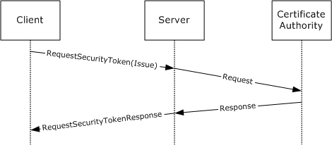
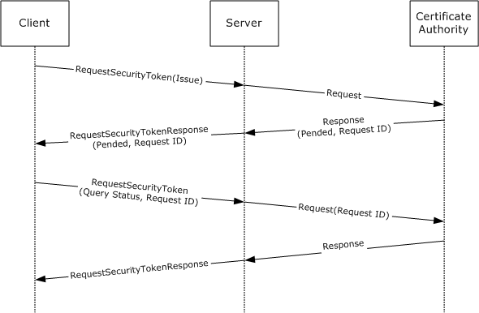
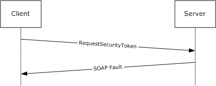
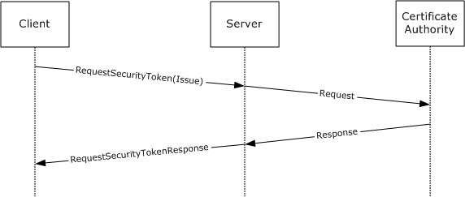
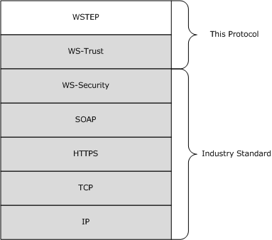
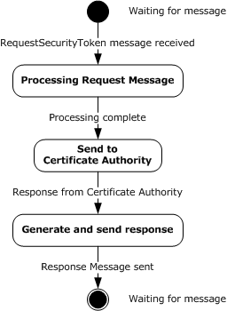

[MS-WSTEP]:

WS-Trust X.509v3 Token Enrollment Extensions

Intellectual Property Rights Notice for Open Specifications Documentation

  Technical Documentation. Microsoft publishes Open Specifications documentation (“this

documentation”) for protocols, file formats, data portability, computer languages, and standards
support. Additionally, overview documents cover inter-protocol relationships and interactions.

  Copyrights. This documentation is covered by Microsoft copyrights. Regardless of any other

terms that are contained in the terms of use for the Microsoft website that hosts this
documentation, you can make copies of it in order to develop implementations of the technologies
that are described in this documentation and can distribute portions of it in your implementations
that use these technologies or in your documentation as necessary to properly document the
implementation. You can also distribute in your implementation, with or without modification, any
schemas, IDLs, or code samples that are included in the documentation. This permission also
applies to any documents that are referenced in the Open Specifications documentation.
  No Trade Secrets. Microsoft does not claim any trade secret rights in this documentation.
  Patents. Microsoft has patents that might cover your implementations of the technologies

described in the Open Specifications documentation. Neither this notice nor Microsoft's delivery of
this documentation grants any licenses under those patents or any other Microsoft patents.
However, a given Open Specifications document might be covered by the Microsoft Open
Specifications Promise or the Microsoft Community Promise. If you would prefer a written license,
or if the technologies described in this documentation are not covered by the Open Specifications
Promise or Community Promise, as applicable, patent licenses are available by contacting
iplg@microsoft.com.

  License Programs. To see all of the protocols in scope under a specific license program and the

associated patents, visit the Patent Map.

  Trademarks. The names of companies and products contained in this documentation might be
covered by trademarks or similar intellectual property rights. This notice does not grant any
licenses under those rights. For a list of Microsoft trademarks, visit
www.microsoft.com/trademarks.

  Fictitious Names. The example companies, organizations, products, domain names, email

addresses, logos, people, places, and events that are depicted in this documentation are fictitious.
No association with any real company, organization, product, domain name, email address, logo,
person, place, or event is intended or should be inferred.

Reservation of Rights. All other rights are reserved, and this notice does not grant any rights other
than as specifically described above, whether by implication, estoppel, or otherwise.

Tools. The Open Specifications documentation does not require the use of Microsoft programming
tools or programming environments in order for you to develop an implementation. If you have access
to Microsoft programming tools and environments, you are free to take advantage of them. Certain
Open Specifications documents are intended for use in conjunction with publicly available standards
specifications and network programming art and, as such, assume that the reader either is familiar
with the aforementioned material or has immediate access to it.

Support. For questions and support, please contact dochelp@microsoft.com.

[MS-WSTEP] - v20240423
WS-Trust X.509v3 Token Enrollment Extensions
Copyright © 2024 Microsoft Corporation
Release: April 23, 2024

1 / 43

Revision Summary

Date

Revision
History

Revision
Class

Comments

12/5/2008

0.1

Major

Initial Availability

1/16/2009

0.1.1

Editorial

Changed language and formatting in the technical content.

2/27/2009

0.1.2

Editorial

Changed language and formatting in the technical content.

4/10/2009

0.1.3

Editorial

Changed language and formatting in the technical content.

5/22/2009

0.2

7/2/2009

1.0

8/14/2009

1.1

9/25/2009

2.0

11/6/2009

3.0

12/18/2009  4.0

1/29/2010

5.0

3/12/2010

5.1

Minor

Major

Minor

Major

Major

Major

Major

Minor

Clarified the meaning of the technical content.

Updated and revised the technical content.

Clarified the meaning of the technical content.

Updated and revised the technical content.

Updated and revised the technical content.

Updated and revised the technical content.

Updated and revised the technical content.

Clarified the meaning of the technical content.

4/23/2010

5.1.1

Editorial

Changed language and formatting in the technical content.

6/4/2010

5.1.2

Editorial

Changed language and formatting in the technical content.

7/16/2010

6.0

Major

Updated and revised the technical content.

8/27/2010

6.0

10/8/2010

6.0

11/19/2010  6.0

1/7/2011

6.0

2/11/2011

6.0

3/25/2011

6.0

5/6/2011

6.0

None

None

None

None

None

None

None

No changes to the meaning, language, or formatting of the
technical content.

No changes to the meaning, language, or formatting of the
technical content.

No changes to the meaning, language, or formatting of the
technical content.

No changes to the meaning, language, or formatting of the
technical content.

No changes to the meaning, language, or formatting of the
technical content.

No changes to the meaning, language, or formatting of the
technical content.

No changes to the meaning, language, or formatting of the
technical content.

6/17/2011

6.1

Minor

Clarified the meaning of the technical content.

9/23/2011

6.1

None

No changes to the meaning, language, or formatting of the
technical content.

12/16/2011  7.0

Major

Updated and revised the technical content.

3/30/2012

7.0

None

No changes to the meaning, language, or formatting of the
technical content.

[MS-WSTEP] - v20240423
WS-Trust X.509v3 Token Enrollment Extensions
Copyright © 2024 Microsoft Corporation
Release: April 23, 2024

2 / 43

Date

Revision
History

Revision
Class

Comments

7/12/2012

7.1

10/25/2012  7.2

1/31/2013

7.2

Minor

Minor

None

Clarified the meaning of the technical content.

Clarified the meaning of the technical content.

No changes to the meaning, language, or formatting of the
technical content.

8/8/2013

8.0

Major

Updated and revised the technical content.

11/14/2013  8.0

None

No changes to the meaning, language, or formatting of the
technical content.

2/13/2014

8.0

5/15/2014

8.1

6/30/2015

9.0

10/16/2015  9.0

7/14/2016

9.0

6/1/2017

10.0

9/15/2017

11.0

12/1/2017

11.0

9/12/2018

12.0

4/7/2021

13.0

6/25/2021

14.0

4/23/2024

15.0

None

Minor

Major

None

None

Major

Major

None

Major

Major

Major

Major

No changes to the meaning, language, or formatting of the
technical content.

Clarified the meaning of the technical content.

Significantly changed the technical content.

No changes to the meaning, language, or formatting of the
technical content.

No changes to the meaning, language, or formatting of the
technical content.

Significantly changed the technical content.

Significantly changed the technical content.

No changes to the meaning, language, or formatting of the
technical content.

Significantly changed the technical content.

Significantly changed the technical content.

Significantly changed the technical content.

Significantly changed the technical content.

[MS-WSTEP] - v20240423
WS-Trust X.509v3 Token Enrollment Extensions
Copyright © 2024 Microsoft Corporation
Release: April 23, 2024

3 / 43

Table of Contents

1.1
1.2

1.2.1
1.2.2

1  Introduction ............................................................................................................ 6
Glossary ........................................................................................................... 6
References ........................................................................................................ 7
Normative References ................................................................................... 7
Informative References ................................................................................. 8
Overview .......................................................................................................... 8
Relationship to Other Protocols .......................................................................... 10
Prerequisites/Preconditions ............................................................................... 11
Applicability Statement ..................................................................................... 11
Versioning and Capability Negotiation ................................................................. 11
Vendor-Extensible Fields ................................................................................... 11
Standards Assignments ..................................................................................... 12

1.3
1.4
1.5
1.6
1.7
1.8
1.9

2.1
2.2

2  Messages ............................................................................................................... 13
Transport ........................................................................................................ 13
Common Message Syntax ................................................................................. 13
Namespaces .............................................................................................. 13
Messages ................................................................................................... 13
Elements ................................................................................................... 13
Complex Types ........................................................................................... 13
Simple Types ............................................................................................. 13
Attributes .................................................................................................. 14
Groups ...................................................................................................... 14
Attribute Groups ......................................................................................... 14

2.2.1
2.2.2
2.2.3
2.2.4
2.2.5
2.2.6
2.2.7
2.2.8

3.1

3.1.1

3.1.4.1

3.1.1.1

3.1.4.1.1

3.1.2
3.1.3
3.1.4

3.1.4.1.1.1
3.1.4.1.1.2

3.1.1.1.1
3.1.1.1.2
3.1.1.1.3
3.1.1.1.4

3  Protocol Details ..................................................................................................... 15
SecurityTokenService Server Details ................................................................... 15
Abstract Data Model .................................................................................... 16
Authentication ...................................................................................... 16
Kerberos Authentication ................................................................... 16
X.509v3 Certificate Authentication ..................................................... 16
Username and Password Authentication ............................................. 16
No (Anonymous) Authentication ........................................................ 16
Timers ...................................................................................................... 16
Initialization ............................................................................................... 16
Message Processing Events and Sequencing Rules .......................................... 17
wst:RequestSecurityToken2 ................................................................... 17
Messages ....................................................................................... 17
wst:RequestSecurityTokenMsg .................................................... 17
wst:RequestSecurityTokenResponseCollectionMsg .......................... 17
Elements ........................................................................................ 17
wstep:CertificateEnrollmentWSDetail ............................................ 17
DispositionMessage .................................................................... 18
wst:KeyExchangeToken .............................................................. 18
RequestID ................................................................................. 18
wst:RequestSecurityToken .......................................................... 18
RequestSecurityTokenResponseCollection ..................................... 18
wst:RequestType ....................................................................... 18
wst:TokenType .......................................................................... 19
Complex Types ............................................................................... 19
DispositionMessageType ............................................................. 19
wst:RequestedSecurityTokenType ................................................ 19
wst:RequestSecurityTokenType ................................................... 20
wst:RequestSecurityTokenResponseType ...................................... 21
wst:RequestSecurityTokenResponseCollectionType ........................ 22

3.1.4.1.2.1
3.1.4.1.2.2
3.1.4.1.2.3
3.1.4.1.2.4
3.1.4.1.2.5
3.1.4.1.2.6
3.1.4.1.2.7
3.1.4.1.2.8

3.1.4.1.3.1
3.1.4.1.3.2
3.1.4.1.3.3
3.1.4.1.3.4
3.1.4.1.3.5

3.1.4.1.3

3.1.4.1.2

[MS-WSTEP] - v20240423
WS-Trust X.509v3 Token Enrollment Extensions
Copyright © 2024 Microsoft Corporation
Release: April 23, 2024

4 / 43

3.1.4.1.4

3.1.4.2

3.1.4.2.1

3.1.4.1.3.6
3.1.4.1.3.7

wst:RequestTypeEnum ............................................................... 23
wstep:CertificateEnrollmentWSDetailType ..................................... 23
Attributes ....................................................................................... 24
Processing Rules ................................................................................... 24
WSTEP Action: Request Security Token Processing Rules ...................... 24
New and Renewal Request Processing .......................................... 24
QueryTokenStatus Request Processing ......................................... 25
KET Action: Request Security Token Processing Rules .......................... 25
Key Exchange Token Request Processing ...................................... 25
Timer Events .............................................................................................. 26
Other Local Events ...................................................................................... 26

3.1.4.2.1.1
3.1.4.2.1.2

3.1.4.2.2

3.1.4.2.2.1

3.1.5
3.1.6

4.1

4.1.2

4.1.1

4.1.1.1
4.1.1.2

4.1.2.1
4.1.2.2

4  Protocol Examples ................................................................................................. 27
RequestSecurityToken Request/Response Message Sequence ................................ 27
Standard Certificate Request ........................................................................ 27
RequestSecurityToken Message (Issue Request) ....................................... 27
Server RequestSecurityToken Response ................................................... 28
Key Exchange Token Request ....................................................................... 30
Client Exchange Token Request .............................................................. 30
Server Key Exchange Token Response ..................................................... 31
Retrieval of a previously pended certificate request with Query Token Status ..... 32
Client Request ...................................................................................... 32
Message exchange with a server fault ........................................................... 32
Client Request ...................................................................................... 32
Server Fault Response ........................................................................... 32
Certificate Renewal ..................................................................................... 33
Client Renewal Request ......................................................................... 33
Server Request Security Token Response ................................................. 35

4.1.4.1
4.1.4.2

4.1.5.1
4.1.5.2

4.1.3.1

4.1.3

4.1.4

4.1.5

5  Security ................................................................................................................. 38
Security Considerations for Implementers ........................................................... 38
Index of Security Parameters ............................................................................ 38

5.1
5.2

6  Appendix A: Full WSDL .......................................................................................... 39

7  Appendix B: Product Behavior ............................................................................... 40

8  Change Tracking .................................................................................................... 41

9  Index ..................................................................................................................... 42

[MS-WSTEP] - v20240423
WS-Trust X.509v3 Token Enrollment Extensions
Copyright © 2024 Microsoft Corporation
Release: April 23, 2024

5 / 43

1  Introduction

The WS-Trust X.509v3 Token Enrollment Extensions are extensions of WS-Trust that are used by a
system to request that a certificate be issued.

The communication is initiated by a requesting client who requests a new certificate, retrieval of an
issued certificate, or retrieval of a server certificate. The server processes the request and generates a
response based on the request type.

Sections 1.5, 1.8, 1.9, 2, and 3 of this specification are normative. All other sections and examples in
this specification are informative.

1.1  Glossary

This document uses the following terms:

Abstract Syntax Notation One (ASN.1): A notation to define complex data types to carry a

message, without concern for their binary representation, across a network. ASN.1 defines an
encoding to specify the data types with a notation that does not necessarily determine the
representation of each value. ASN.1 encoding rules are sets of rules used to transform data that
is specified in the ASN.1 language into a standard format that can be decoded on any system
that has a decoder based on the same set of rules. ASN.1 and its encoding rules were once part
of the same standard. They have since been separated, but it is still common for the terms
ASN.1 and Basic Encoding Rules (BER) to be used to mean the same thing, though this is not
the case. Different encoding rules can be applied to a given ASN.1 definition. The choice of
encoding rules used is an option of the protocol designer. ASN.1 is described in the following
specifications: [ITUX660] for general procedures; [ITUX680] for syntax specification; [ITUX690]
for the Basic Encoding Rules (BER), Canonical Encoding Rules (CER), and Distinguished
Encoding Rules (DER) encoding rules; and [ITUX691] for the Packed Encoding Rules (PER).
Further background information on ASN.1 is also available in [DUBUISSON].

certificate: When referring to X.509v3 certificates, that information consists of a public key, a

distinguished name (DN) of some entity assumed to have control over the private key
corresponding to the public key in the certificate, and some number of other attributes and
extensions assumed to relate to the entity thus referenced. Other forms of certificates can bind
other pieces of information.

Certificate Management Messages over CMS (CMC): An internet standard for transport

mechanisms for CMS [RFC2797].

certification authority (CA): A third party that issues public key certificates. Certificates serve to
bind public keys to a user identity. Each user and certification authority (CA) can decide whether
to trust another user or CA for a specific purpose, and whether this trust is to be transitive. For
more information, see [RFC3280].

Hypertext Transfer Protocol Secure (HTTPS): An extension of HTTP that securely encrypts and
decrypts web page requests. In some older protocols, "Hypertext Transfer Protocol over Secure
Sockets Layer" is still used (Secure Sockets Layer has been deprecated). For more information,
see [SSL3] and [RFC5246].

Public Key Cryptography Standards (PKCS): A group of Public Key Cryptography Standards

published by RSA Laboratories.

security token service (STS): A special type of server defined in WS-Trust [WSTrust1.3].

SOAP action: The HTTP request header field used to indicate the intent of the SOAP request, using

a URI value. See [SOAP1.1] section 6.1.1 for more information.

[MS-WSTEP] - v20240423
WS-Trust X.509v3 Token Enrollment Extensions
Copyright © 2024 Microsoft Corporation
Release: April 23, 2024

6 / 43

SOAP fault: A container for error and status information within a SOAP message. See [SOAP1.2-

1/2007] section 5.4 for more information.

SOAP message: An XML document consisting of a mandatory SOAP envelope, an optional SOAP
header, and a mandatory SOAP body. See [SOAP1.2-1/2007] section 5 for more information.

Unicode: A character encoding standard developed by the Unicode Consortium that represents

almost all of the written languages of the world. The Unicode standard [UNICODE5.0.0/2007]
provides three forms (UTF-8, UTF-16, and UTF-32) and seven schemes (UTF-8, UTF-16, UTF-16
BE, UTF-16 LE, UTF-32, UTF-32 LE, and UTF-32 BE).

Web Services Description Language (WSDL): An XML format for describing network services

as a set of endpoints that operate on messages that contain either document-oriented or
procedure-oriented information. The operations and messages are described abstractly and are
bound to a concrete network protocol and message format in order to define an endpoint.
Related concrete endpoints are combined into abstract endpoints, which describe a network
service. WSDL is extensible, which allows the description of endpoints and their messages
regardless of the message formats or network protocols that are used.

X.509: An ITU-T standard for public key infrastructure subsequently adapted by the IETF, as

specified in [RFC3280].

XML: The Extensible Markup Language, as described in [XML1.0].

XML namespace: A collection of names that is used to identify elements, types, and attributes in
XML documents identified in a URI reference [RFC3986]. A combination of XML namespace and
local name allows XML documents to use elements, types, and attributes that have the same
names but come from different sources. For more information, see [XMLNS-2ED].

XML Schema (XSD): A language that defines the elements, attributes, namespaces, and data

types for XML documents as defined by [XMLSCHEMA1/2] and [XMLSCHEMA2/2] standards. An
XML schema uses XML syntax for its language.

MAY, SHOULD, MUST, SHOULD NOT, MUST NOT: These terms (in all caps) are used as defined
in [RFC2119]. All statements of optional behavior use either MAY, SHOULD, or SHOULD NOT.

1.2  References

Links to a document in the Microsoft Open Specifications library point to the correct section in the
most recently published version of the referenced document. However, because individual documents
in the library are not updated at the same time, the section numbers in the documents may not
match. You can confirm the correct section numbering by checking the Errata.

1.2.1  Normative References

We conduct frequent surveys of the normative references to assure their continued availability. If you
have any issue with finding a normative reference, please contact dochelp@microsoft.com. We will
assist you in finding the relevant information.

[MS-WCCE] Microsoft Corporation, "Windows Client Certificate Enrollment Protocol".

[RFC2119] Bradner, S., "Key words for use in RFCs to Indicate Requirement Levels", BCP 14, RFC
2119, March 1997, https://www.rfc-editor.org/info/rfc2119

[RFC2797] Myers, M., Liu, X., Schaad, J., and Weinstein, J., "Certificate Management Messages Over
CMS", RFC 2797, April 2000, http://www.rfc-editor.org/info/rfc2797

[RFC2986] Nystrom, M. and Kaliski, B., "PKCS#10: Certificate Request Syntax Specification", RFC
2986, November 2000, http://www.rfc-editor.org/info/rfc2986

7 / 43

[MS-WSTEP] - v20240423
WS-Trust X.509v3 Token Enrollment Extensions
Copyright © 2024 Microsoft Corporation
Release: April 23, 2024

[RFC3066] Alvestrand, H., "Tags for the Identification of Languages", BCP 47, RFC 3066, January
2001, https://www.rfc-editor.org/info/rfc3066

[RFC3852] Housley, R., "Cryptographic Message Syntax (CMS)", RFC 3852, July 2004,
https://www.rfc-editor.org/info/rfc3852

[RFC5246] Dierks, T., and Rescorla, E., "The Transport Layer Security (TLS) Protocol Version 1.2",
RFC 5246, August 2008, https://www.rfc-editor.org/info/rfc5246

[RFC5280] Cooper, D., Santesson, S., Farrell, S., et al., "Internet X.509 Public Key Infrastructure
Certificate and Certificate Revocation List (CRL) Profile", RFC 5280, May 2008, https://www.rfc-
editor.org/info/rfc5280

[WSDL] Christensen, E., Curbera, F., Meredith, G., and Weerawarana, S., "Web Services Description
Language (WSDL) 1.1", W3C Note, March 2001, https://www.w3.org/TR/2001/NOTE-wsdl-20010315

[WSSUTP] OASIS, "Web Services Security UsernameToken Profile 1.0", OASIS Standard, March 2004,
http://docs.oasis-open.org/wss/2004/01/oasis-200401-wss-username-token-profile-1.0.pdf

[WSS] OASIS, "Web Services Security: SOAP Message Security 1.1 (WS-Security 2004)", February
2006, https://www.oasis-open.org/committees/download.php/16790/wss-v1.1-spec-os-
SOAPMessageSecurity.pdf

[WSTrust1.3Schema] OASIS Standard, "WS-Trust 1.3", http://docs.oasis-open.org/ws-sx/ws-
trust/200512/ws-trust-1.3.xsd

[WSTrust1.3] Lawrence, K., Kaler, C., Nadalin, A., et al., "WS-Trust 1.3", OASIS Standard March
2007, https://docs.oasis-open.org/ws-sx/ws-trust/200512/ws-trust-1.3-os.html

[XMLNS] Bray, T., Hollander, D., Layman, A., et al., Eds., "Namespaces in XML 1.0 (Third Edition)",
W3C Recommendation, December 2009, https://www.w3.org/TR/2009/REC-xml-names-20091208/

[XMLSCHEMA1] Thompson, H., Beech, D., Maloney, M., and Mendelsohn, N., Eds., "XML Schema Part
1: Structures", W3C Recommendation, May 2001, https://www.w3.org/TR/2001/REC-xmlschema-1-
20010502/

[XMLSCHEMA2] Biron, P.V., Ed. and Malhotra, A., Ed., "XML Schema Part 2: Datatypes", W3C
Recommendation, May 2001, https://www.w3.org/TR/2001/REC-xmlschema-2-20010502/

1.2.2  Informative References

[DUBUISSON] Dubuisson, O., "ASN.1 Communication between Heterogeneous Systems", Morgan
Kaufmann, October 2000, ISBN: 0126333610.

[SCEP] Nourse, A., and Vilhuber, J. Ed., "Cisco Systems' Simple Certificate Enrollment Protocol", April
2009, http://tools.ietf.org/html/draft-nourse-scep-19

1.3  Overview

The WS-Trust X.509v3 Token Enrollment Extensions (WSTEP) defines the token enrollment profile for
WS-Trust [WSTrust1.3] to allow a client to request X.509v3 certificates.

Existing certificate authorities (CAs) support Abstract Syntax Notation One (ASN.1) formats
such as PKCS#10 ([RFC2986]), PKCS#7 ([RFC3852]), or CMC ([RFC2797]) to encode a certificate
request, and those requests are carried in an existing protocol, such as Windows Client Certificate
Enrollment Protocol [MS-WCCE] or Cisco's SCEP ([SCEP]). WSTEP also carries those requests from the
client to the issuer.

[MS-WSTEP] - v20240423
WS-Trust X.509v3 Token Enrollment Extensions
Copyright © 2024 Microsoft Corporation
Release: April 23, 2024

8 / 43

<!-- Extracted images from page 9 -->

<!-- /Extracted images from page 9 -->

WSTEP provides for issuance, renewal, and delayed-issuance scenarios for X.509v3 digital certificates.
The server is known in WS-Trust [WSTrust1.3] terminology as a Security Token Service (STS).

The WS-Trust protocol [WSTrust1.3] definition provides the framework for the STS and for enrollment
profile extensions. A typical client interacts with a STS with a request security token (RST) message.
The STS responds to a client request security token message with a request security token response
(RSTR) or a SOAP fault.

Figure 1: Typical sequence for certificate enrollment

The following figure shows a scenario in which a request cannot be satisfied immediately. In this
scenario, the client makes a request, and the server reply indicates that the request is pending some
other action. The client then queries the request at a later time, presumably after any conditions for
its satisfaction have been met, and receives a reply that the request was issued, rejected, or is still
pending.

Figure 2: Typical sequence for a pended certificate enrollment request

9 / 43

[MS-WSTEP] - v20240423
WS-Trust X.509v3 Token Enrollment Extensions
Copyright © 2024 Microsoft Corporation
Release: April 23, 2024

<!-- Extracted images from page 10 -->

<!-- /Extracted images from page 10 -->

In some circumstances, the client request could be rejected. In these instances, the STS responds
with a SOAP fault. The following figure shows the typical sequence.

Figure 3: Typical sequence for a rejected certificate renewal request

The following figure is an example of a message exchange for a renewal request. A renewal request
uses an existing certificate and requests a new lifespan. From the point of view of the WSTEP protocol,
this is the same as an issue request, as the message format is unchanged.

Figure 4: Typical sequence for a certificate renewal request

1.4  Relationship to Other Protocols

The following figure shows the WSTEP Protocol stack diagram.

[MS-WSTEP] - v20240423
WS-Trust X.509v3 Token Enrollment Extensions
Copyright © 2024 Microsoft Corporation
Release: April 23, 2024

10 / 43

<!-- Extracted images from page 11 -->

<!-- /Extracted images from page 11 -->

Figure 5: WSTEP Protocol stack diagram

The WSTEP protocol specification is a profile of the WS-Trust Protocol [WSTrust1.3] and makes use of
the SOAP and Hypertext Transfer Protocol over Secure Sockets Layer (HTTPS) protocols for
messaging and security.

1.5  Prerequisites/Preconditions

The WSTEP protocol specification facilitates the issuance of X.509v3 certificates. A server
implementation of the protocol requires the functionality of a certificate authority, capable of
interpreting requests in at least one of PKCS#7, PKCS#10, or Certificate Management Messages
over CMS (CMC).

1.6  Applicability Statement

The WSTEP protocol specification is applicable only for requests for X.509v3 certificates.

1.7  Versioning and Capability Negotiation

The WSTEP protocol specification does not include versioning and capability negotiation.

1.8  Vendor-Extensible Fields

The WSTEP protocol specification does not include any vendor-extensible fields.  WSTEP adheres to
the WS-Trust 1.3 [WSTrust1.3] provided extension points.

[MS-WSTEP] - v20240423
WS-Trust X.509v3 Token Enrollment Extensions
Copyright © 2024 Microsoft Corporation
Release: April 23, 2024

11 / 43

1.9  Standards Assignments

None.

[MS-WSTEP] - v20240423
WS-Trust X.509v3 Token Enrollment Extensions
Copyright © 2024 Microsoft Corporation
Release: April 23, 2024

12 / 43

2  Messages

2.1  Transport

SOAP version 1.2 MUST be used for messaging for the WSTEP protocol. HTTPS protocol MUST be
used as the transport.

2.2  Common Message Syntax

This section contains common definitions used by this protocol. The syntax of the definitions uses the
XML schema as defined in [XMLSCHEMA1] and [XMLSCHEMA2], and the Web Services Description
Language (WSDL) as defined in [WSDL].

2.2.1  Namespaces

This specification defines and references various XML namespaces, using the mechanisms specified
in [XMLNS]. Although this specification associates a specific XML namespace prefix for each XML
namespace that is used, the choice of any particular XML namespace prefix is implementation-specific
and not significant for interoperability.

 Prefixes and XML namespaces used in this specification are as follows.

Prefix  Namespace URI

xs

http://www.w3.org/2001/XMLSchema

wst

 http://docs.oasis-open.org/ws-sx/ws-trust/200512

auth

http://schemas.xmlsoap.org/ws/2006/12/authorization

Reference

[XMLSCHEMA1]

[WSTrust1.3]

[XMLSCHEMA1]

wsu

 http://docs.oasis-open.org/wss/2004/01/oasis-200401-wss-wssecurity-utility-
1.0.xsd

wsse

http://docs.oasis-open.org/wss/2004/01/oasis-200401-wss-wssecurity-secext-
1.0.xsd

wstep

 http://schemas.microsoft.com/windows/pki/2009/01/enrollment

This document

2.2.2  Messages

None.

2.2.3  Elements

This specification does not define any common XML schema element definitions.

2.2.4  Complex Types

This specification does not define any common XML schema complex type definitions.

2.2.5  Simple Types

The WSTEP protocol specification does not define any common XML schema simple type definitions.

13 / 43

[MS-WSTEP] - v20240423
WS-Trust X.509v3 Token Enrollment Extensions
Copyright © 2024 Microsoft Corporation
Release: April 23, 2024

2.2.6  Attributes

The WSTEP protocol specification does not define any common XML schema attribute definitions.

2.2.7  Groups

The WSTEP protocol specification does not define any common XML schema group definitions.

2.2.8  Attribute Groups

The WSTEP protocol specification does not define any common XML schema attribute group
definitions.

[MS-WSTEP] - v20240423
WS-Trust X.509v3 Token Enrollment Extensions
Copyright © 2024 Microsoft Corporation
Release: April 23, 2024

14 / 43

<!-- Extracted images from page 15 -->

<!-- /Extracted images from page 15 -->

3  Protocol Details

The client side of this protocol is a simple pass-through. No additional timers or other state is required
on the client side of this protocol. Calls made by the higher-layer protocol or application are passed
directly to the transport layer, and the results returned by the transport are passed directly back to
the higher-layer protocol or application.

This section addresses the message processing model for the protocol. It includes related information
required by an implementation to successfully send and consume protocol messages.

3.1  SecurityTokenService Server Details

The SecurityTokenService hosts a message endpoint that receives RequestSecurityToken
messages. When received, the server processes the client request and sends it to the certificate
authority. Upon receiving a response from the certificate authority, a response is generated, and the
server sends either a RequestSecurityTokenResponse message or a SOAP fault. When the
message has been sent to the client, the server returns to the waiting state.

Figure 6: Security token service state model

The items of information that are communicated between the server and the certificate authority are
specified in this section, but the method of communication used, including timeout and error handling
(local API, local remote procedure call (RPC), or some other protocol) is not specified.

[MS-WSTEP] - v20240423
WS-Trust X.509v3 Token Enrollment Extensions
Copyright © 2024 Microsoft Corporation
Release: April 23, 2024

15 / 43

The certificate authority MAY have additional requirements that MUST be met in order to issue an
X.509v3 certificate, such as manager approval, payment processing, or validation of request
information.  In these instances, a certificate authority response indicating the issuance is pending.

3.1.1  Abstract Data Model

A server supporting the WSTEP protocol maintains a relationship to an issuer which processes
messages submitted by the server. When communicating with requestors, a server can support a
variety of languages.

Issuer:  An address of a certificate authority (CA). The format of the stored address is specific to

the implementation and to the form of communication used between the Issuer and the Server.

SupportedLanguages: A list of language identifiers supported by the server. The set of languages

are of type xml:lang and defined in [RFC3066].

DefaultLanguage: The default language for the server. DefaultLanguage is of type xml:lang, and the

set of supported languages is defined in [RFC3066].

3.1.1.1  Authentication

The WS-Trust X.509v3 Token Enrollment Extensions use the authentication provisions in WS-Security
([WSS]) for the X.509v3 Security Token issuer to authenticate the X.509v3 Security Token requestor.
This section defines the schema used to express the credential descriptor for each supported
credential type.

3.1.1.1.1 Kerberos Authentication

Authentication using Kerberos is done at the transport layer.

3.1.1.1.2 X.509v3 Certificate Authentication

Authentication using X.509v3 certificates is done at the transport level using Transport Level
Security (TLS) 1.2 as defined in [RFC5246].

3.1.1.1.3 Username and Password Authentication

The username and password credential is provided in a request message using the WS-Security
Username Token Profile 1.0. The username is provided as defined in section 3.1 of the Ws-Security
document [WSSUTP].

3.1.1.1.4 No (Anonymous) Authentication

If no authentication is provided at either the transport layer or the message layer, the request is
considered to be anonymous. Anonymous authentication is supported only for renewal requests,
where the signature from the existing certificate on the request object serves as authentication for
the X.509v3 Security Token requestor.

3.1.2  Timers

None.

3.1.3  Initialization

The SupportedLanguages object MUST be initialized with the set of languages that the server
supports.

16 / 43

[MS-WSTEP] - v20240423
WS-Trust X.509v3 Token Enrollment Extensions
Copyright © 2024 Microsoft Corporation
Release: April 23, 2024

The DefaultLanguage parameter MUST be initialized with the language that is to be used by the server
when a request does not define a language preference, or the preference is not in
SupportedLanguages.<1>

3.1.4  Message Processing Events and Sequencing Rules

Operation

Description

wst:RequestSecurityToken2  The wst:RequestSecurityToken2 operation is the sole operation in the WSTEP

protocol. It provides the mechanism for certificate enrollment requests, retrieval
of pending certificate status, and the request of the server key exchange
certificate. The wst:RequestSecurityToken2 operation is defined in WS-Trust 1.3
[WSTrust1.3].

3.1.4.1  wst:RequestSecurityToken2

The wst:RequestSecurityToken2 operation provides the mechanism for certificate enrollment
requests, retrieval of pending certificate status, and the request of the server key exchange
certificate. The wst:SecurityTokenService port and wst:RequestSecurityToken2 operation are defined
in the [WSTrust1.3] WSDL wsdl:portType definition.

 <wsdl:operation name="RequestSecurityToken2">
   <wsdl:input message="wst:RequestSecurityTokenMsg" />
   <wsdl:output message="wst:RequestSecurityTokenResponseCollectionMsg" />
   </wsdl:operation>

WSTEP makes use of the wst:RequestSecurityToken2 operation. The wst:RequestSecurityToken
operation defined in the SecurityTokenService operation is not used. The
wst:RequestSecurityTokenMsg message consists of a single object definition: the client request.
The client request is made using the acceptable SOAP actions as defined in section 3.1.4.2 and
RequestType values, as defined in section 3.1.4.1.2.7.

3.1.4.1.1 Messages

The following WSDL message definitions are specific to this operation.

3.1.4.1.1.1  wst:RequestSecurityTokenMsg

The wst:RequestSecurityTokenMsg is an incoming message, and is defined in WS-Trust 1.3
[WSTrust1.3] WSDL.

wst:RequestSecurityToken: An instance of a wst:RequestSecurityTokenType complex type as
defined in section 3.1.4.1.3.3. The wst:RequestSecurityToken element defines the client
request and the required information for it to be processed.

3.1.4.1.1.2  wst:RequestSecurityTokenResponseCollectionMsg

The wst:RequestSecurityTokenResponseCollectionMsg is an outgoing message, and is defined in WS-
Trust 1.3 [WSTrust1.3] WSDL.

wst:RequestSecurityTokenResponseCollectionMsg: An instance of a

wst:RequestSecurityTokenResponseCollection element as defined in section 3.1.4.1.2.6. This
element contains the results of the client request.

3.1.4.1.2 Elements

[MS-WSTEP] - v20240423
WS-Trust X.509v3 Token Enrollment Extensions
Copyright © 2024 Microsoft Corporation
Release: April 23, 2024

17 / 43

3.1.4.1.2.1  wstep:CertificateEnrollmentWSDetail

The wstep:CertificateEnrollmentWSDetail element is used to convey additional information to a
client as part of the SOAP fault structure when a server returns a SOAP fault.

 <xs:element name="CertificateEnrollmentWSDetail" nillable="true"
type="wstep:CertificateEnrollmentWSDetailType" />

wstep:CertificateEnrollmentWSDetail: An instance of a

<wstep:CertificateEnrollmentWSDetailType> as defined in section 3.1.4.1.3.7. If there is no
additional information, the wstep:CertificateEnrollmentWSDetail SHOULD be omitted in the
SOAP fault.

3.1.4.1.2.2  DispositionMessage

 <xs:element name="DispositionMessage"
 type="wstep:DispositionMessageType" nillable="true" />

DispositionMessage: An instance of a DispositionMessageType object as defined in section

3.1.4.1.3.1.

3.1.4.1.2.3  wst:KeyExchangeToken

The <wst:KeyExchangeToken> element is defined in WS-Trust 1.3 [WSTrust1.3] section 8.4.

wst:KeyExchangeToken: The wst:KeyExchangeToken element provides a key exchange token that

can be used in certificate enrollment requests that include the private key.

3.1.4.1.2.4  RequestID

 <xs:element name="RequestID"
 type="xs:string" nillable="true"/>

RequestID: A string identifier used to identify a request.

3.1.4.1.2.5  wst:RequestSecurityToken

The <wst:RequestSecurityToken> element is defined in WS-Trust 1.3 [WSTrust1.3], section 3.1.

wst:RequestSecurityToken: An instance of a wst:RequestSecurityTokenType object as specified

in section 3.1.4.1.3.3.

3.1.4.1.2.6  RequestSecurityTokenResponseCollection

The RequestSecurityTokenResponseCollection is defined in WS-Trust 1.3 [WSTrust1.3], section 3.2.

RequestSecurityTokenResponseCollection: An instance of a

wst:RequestSecurityTokenResponseCollectionType object as specified in section 3.1.4.1.3.5.

3.1.4.1.2.7  wst:RequestType

The <wst:RequestType> element is defined in [WSTrust1.3] section 3.1.

wst:RequestType: An instance of a <wst:RequestTypeOpenEnum> object as defined in

[WSTrust1.3] XML schema definition (XSD).

[MS-WSTEP] - v20240423
WS-Trust X.509v3 Token Enrollment Extensions
Copyright © 2024 Microsoft Corporation
Release: April 23, 2024

18 / 43

The <wst:RequestType> MUST have one of the following values:

 "http://docs.oasis-open.org/ws-sx/ws-trust/200512/Issue"
 "http://schemas.microsoft.com/windows/pki/2009/01/enrollment/QueryTokenStatus"
 "http://docs.oasis-open.org/ws-sx/ws-trust/200512/KET"

If the <wst:RequestType> has any other value, the server MUST respond with a SOAP fault.

3.1.4.1.2.8  wst:TokenType

The <TokenType> element is defined in [WSTrust1.3], section 3.1.

wst:TokenType: For the X.509v3 enrollment extension to WS-Trust, the <wst:tokentype> element

MUST be http://docs.oasis-open.org/wss/2004/01/oasis-200401-wss-x509-token-profile-
1.0#X509v3.

3.1.4.1.3 Complex Types

The following XML schema complex type definitions are specific to this operation.

3.1.4.1.3.1  DispositionMessageType

The DispositionMessageType is an extension to the string type that allows an attribute definition of the
language for the string. The DispositionMessageType is used to provide additional information about
the server processing.

 <xs:complexType name="DispositionMessageType">
   <xs:simpleContent>
     <xs:extension base="xs:string">
       <xs:attribute ref="xml:lang"  use="optional" />
     </xs:extension>
   </xs:simpleContent>
 </xs:complexType>

xs:string: The string element contains the literal string disposition message returned from the server.
The string element contains an xml:lang attribute that defines the language for the string. The
language SHOULD be provided for each string element instance.

xml:lang: The language reference  xml:lang, indicating the natural or formal language the string

element content is written in.

3.1.4.1.3.2  wst:RequestedSecurityTokenType

The wst:RequestedSecurityTokenType is defined in WS-Trust XML schema definition (XSD)
[WSTrust1.3Schema].

 <xs:complexType name="RequestedSecurityTokenType">
   <xs:sequence>
   <xs:any namespace="##any" processContents="lax" />
   </xs:sequence>
   </xs:complexType>

MS-WSTEP extends the wst: RequestedSecurityTokenType with two additional elements as follows.

     <xs:element ref="wsse:BinarySecurityToken" />

19 / 43

[MS-WSTEP] - v20240423
WS-Trust X.509v3 Token Enrollment Extensions
Copyright © 2024 Microsoft Corporation
Release: April 23, 2024

     <xs:element ref="wsse:SecurityTokenReference" />

The server SHOULD<2> include the end entity certificate in the RequestedSecurityToken response.
The ValueType of the BinarySecurityToken element for this RequestedSecurityToken response
MUST be X509v3 [RFC5280]. The server MUST also include a CMC full PKI response in the
RequestSecurityTokenResponseCollection, as specified in sections 4.2 and 4.3 of [WSTrust1.3].

wsse:BinarySecurityToken: The wsse:BinarySecurityToken element contains the issued certificate

(2) in either a full CMC response or as a stand-alone x509v3 certificate [RFC5280].

wsse:SecurityTokenReference: A URI reference used to indicate where a pended Certificate

Request can be retrieved. The server MUST provide its own URI as the value of the
<wsse:BinarySecurityTokenReference:Reference> element as specified in [WSTrust1.3] section
4.2.

3.1.4.1.3.3  wst:RequestSecurityTokenType

The wst:RequestSecurityTokenType complex type contains the elements for the security token
request in the RequestSecurityTokenMsg message. It is the client-provided object for a certificate
enrollment request. wst:RequestSecurityTokenType is defined in the WS-Trust [WSTrust1.3] XML
schema definition (XSD).

 <xs:complexType name="RequestSecurityTokenType">
     <xs:annotation>
     <xs:documentation>
       Actual content model is non-deterministic, hence wildcard. The following shows intended
content model:
       <xs:element ref='wst:TokenType' minOccurs='0' />
       <xs:element ref='wst:RequestType' />
       <xs:element ref='wsp:AppliesTo' minOccurs='0' />
       <xs:element ref='wst:Claims' minOccurs='0' />
       <xs:element ref='wst:Entropy' minOccurs='0' />
       <xs:element ref='wst:Lifetime' minOccurs='0' />
       <xs:element ref='wst:AllowPostdating' minOccurs='0' />
       <xs:element ref='wst:Renewing' minOccurs='0' />
       <xs:element ref='wst:OnBehalfOf' minOccurs='0' />
       <xs:element ref='wst:Issuer' minOccurs='0' />
       <xs:element ref='wst:AuthenticationType' minOccurs='0' />
       <xs:element ref='wst:KeyType' minOccurs='0' />
       <xs:element ref='wst:KeySize' minOccurs='0' />
       <xs:element ref='wst:SignatureAlgorithm' minOccurs='0' />
       <xs:element ref='wst:Encryption' minOccurs='0' />
       <xs:element ref='wst:EncryptionAlgorithm' minOccurs='0' />
       <xs:element ref='wst:CanonicalizationAlgorithm' minOccurs='0' />
       <xs:element ref='wst:ProofEncryption' minOccurs='0' />
       <xs:element ref='wst:UseKey' minOccurs='0' />
       <xs:element ref='wst:SignWith' minOccurs='0' />
       <xs:element ref='wst:EncryptWith' minOccurs='0' />
       <xs:element ref='wst:DelegateTo' minOccurs='0' />
       <xs:element ref='wst:Forwardable' minOccurs='0' />
       <xs:element ref='wst:Delegatable' minOccurs='0' />
       <xs:element ref='wsp:Policy' minOccurs='0' />
       <xs:element ref='wsp:PolicyReference' minOccurs='0' />
       <xs:any namespace='##other' processContents='lax' minOccurs='0' maxOccurs='unbounded'
/>
     </xs:documentation>
   </xs:annotation>
     <xs:sequence>
     <xs:any namespace="##any" processContents="lax" minOccurs="0" maxOccurs="unbounded" />
   </xs:sequence>
   <xs:attribute name="Context" type="xs:anyURI" use="optional" />
   <xs:anyAttribute namespace="##other" processContents="lax" />
 </xs:complexType>

20 / 43

[MS-WSTEP] - v20240423
WS-Trust X.509v3 Token Enrollment Extensions
Copyright © 2024 Microsoft Corporation
Release: April 23, 2024

WSTEP extends <wst:RequestSecurityTokenType> with the following elements:

 <xs:element ref="wsse:BinarySecurityToken" minOccurs="0"
 maxOccurs="1" />
 <xs:element ref="auth:AdditionalContext" minOccurs="0"
 maxOccurs="1" />
 <xs:element ref="wst:RequestKET" minOccurs="0" maxOccurs="1" />
 <xs:element ref="wstep:RequestID" minOccurs="0" maxOccurs="1" />

Only the elements specified below are used in WSTEP. Any element received that is not specified
below SHOULD be ignored.

wst:TokenType: Refers to the wst:TokenType definition in section 3.1.4.1.2.8.

wst:RequestType: Refers to the wst:RequestType definition in section 3.1.4.1.2.7. The

wst:RequestType is used to identify the type of the security token request.

wst:RequestKET: Used when requesting a key exchange token as defined in [WSTrust1.3] section

8.4.

wsse:BinarySecurityToken: Provides the DER ASN.1 representation of the certificate request. The

type of token is defined by the wst:TokenType element. For the X.509v3 enrollment extension
the wst:TokenType MUST be specified as in section 3.1.4.1.2.8. The certificate request follows the
formatting from [MS-WCCE] section 2.2.2.6. The EncodingType attribute of the
wsse:BinarySecurityToken element MUST be set to base64Binary.

auth:AdditionalContext: The auth:AdditionalContext element is used to provide extra information in
a wst:RequestSecurityToken message. It is an optional element, and SHOULD be omitted if there
is no extra information to be passed.

wstep:RequestID: An instance of wstep:RequestID as specified in section 3.1.4.1.2.4.

3.1.4.1.3.4  wst:RequestSecurityTokenResponseType

The wst:RequestSecurityTokenResponseType contains the elements that are part of a server response
to a wst:RequestSecurityToken message. wst:RequestSecurityTokenResponseType is defined in the
WS-Trust [WSTrust1.3] XML schema definition (XSD).

 <xs:complexType name="RequestSecurityTokenResponseType">
     <xs:annotation>
     <xs:documentation>
       Actual content model is non-deterministic, hence wildcard. The following shows intended
content model:
       <xs:element ref='wst:TokenType' minOccurs='0' />
       <xs:element ref='wst:RequestType' />
       <xs:element ref='wst:RequestedSecurityToken' minOccurs='0' />
       <xs:element ref='wsp:AppliesTo' minOccurs='0' />
       <xs:element ref='wst:RequestedAttachedReference' minOccurs='0' />
       <xs:element ref='wst:RequestedUnattachedReference' minOccurs='0' />
       <xs:element ref='wst:RequestedProofToken' minOccurs='0' />
       <xs:element ref='wst:Entropy' minOccurs='0' />
       <xs:element ref='wst:Lifetime' minOccurs='0' />
       <xs:element ref='wst:Status' minOccurs='0' />
       <xs:element ref='wst:AllowPostdating' minOccurs='0' />
       <xs:element ref='wst:Renewing' minOccurs='0' />
       <xs:element ref='wst:OnBehalfOf' minOccurs='0' />
       <xs:element ref='wst:Issuer' minOccurs='0' />
       <xs:element ref='wst:AuthenticationType' minOccurs='0' />
       <xs:element ref='wst:Authenticator' minOccurs='0' />
       <xs:element ref='wst:KeyType' minOccurs='0' />
       <xs:element ref='wst:KeySize' minOccurs='0' />
       <xs:element ref='wst:SignatureAlgorithm' minOccurs='0' />

21 / 43

[MS-WSTEP] - v20240423
WS-Trust X.509v3 Token Enrollment Extensions
Copyright © 2024 Microsoft Corporation
Release: April 23, 2024

       <xs:element ref='wst:Encryption' minOccurs='0' />
       <xs:element ref='wst:EncryptionAlgorithm' minOccurs='0' />
       <xs:element ref='wst:CanonicalizationAlgorithm' minOccurs='0' />
       <xs:element ref='wst:ProofEncryption' minOccurs='0' />
       <xs:element ref='wst:UseKey' minOccurs='0' />
       <xs:element ref='wst:SignWith' minOccurs='0' />
       <xs:element ref='wst:EncryptWith' minOccurs='0' />
       <xs:element ref='wst:DelegateTo' minOccurs='0' />
       <xs:element ref='wst:Forwardable' minOccurs='0' />
       <xs:element ref='wst:Delegatable' minOccurs='0' />
       <xs:element ref='wsp:Policy' minOccurs='0' />
       <xs:element ref='wsp:PolicyReference' minOccurs='0' />
       <xs:any namespace='##other' processContents='lax' minOccurs='0' maxOccurs='unbounded'
/>
     </xs:documentation>
   </xs:annotation>
     <xs:sequence>
     <xs:any namespace="##any" processContents="lax" minOccurs="0" maxOccurs="unbounded" />
   </xs:sequence>
   <xs:attribute name="Context" type="xs:anyURI" use="optional" />
   <xs:anyAttribute namespace="##other" processContents="lax" />
 </xs:complexType>

WSTEP extends the wst:RequestSecurityTokenResponseType with the following elements:

     <xs:element ref="wstep:DispositionMessage" />
     <xs:element ref="wsse:BinarySecurityToken" minOccurs="0" maxOccurs="1" />
     <xs:element ref="wstep:RequestID" minOccurs="0" maxOccurs="1"
 <xs:element ref="wst:KeyExchangeToken" minOccurs="0" maxOccurs="1" />
 />

Only the elements documented as follows are used by WSTEP. Any element received that is not
documented as follows SHOULD be ignored.

wst:TokenType: Refers to the TokenType definition in section 3.1.4.1.2.8.

wstep:DispositionMessage: Refers to the definition in section 3.1.4.1.2.2. The

wstep:DispositionMessage element is used to convey any additional server disposition information
as part of the response message.

wsse:BinarySecurityToken: Refers to the wsse:BinarySecurityToken definition in section

3.1.4.1.3.2.

wst: KeyExchangeToken: Refers to the wst:KeyExchangeToken definition in section 3.1.4.1.2.3.

wst:RequestedSecurityToken: An instance of a wst:RequestedSecurityTokenType object as defined

in section 3.1.4.1.3.2.

wstep:RequestID: An instance of a wstep:RequestID as defined in section 3.1.4.1.2.4 that

conveys the request identifier of the originating request.

3.1.4.1.3.5  wst:RequestSecurityTokenResponseCollectionType

The <wst:RequestSecurityTokenResponseCollectionType> is defined in the [WSTrust1.3] XML schema
definition (XSD) as a collection of one or more <wst:RequestSecurityTokenResponse> elements. The
WS-Trust X.509v3 Token Enrollment Extensions further constrain the [WSTrust1.3] definition and the
<wst:RequestSecurityTokenResponseCollection> collection MUST contain at most one
<wst:RequestSecurityTokenResponse> element.

 <xs:complexType name="RequestSecurityTokenResponseCollectionType">
   <xs:annotation>

22 / 43

[MS-WSTEP] - v20240423
WS-Trust X.509v3 Token Enrollment Extensions
Copyright © 2024 Microsoft Corporation
Release: April 23, 2024

   <xs:documentation>
 The <wst:RequestSecurityTokenResponseCollection> element (RSTRC) MUST be used to return a
security token or response to a security token request on the final
response.</xs:documentation>
   </xs:annotation>
   <xs:sequence>
   <xs:element ref="wst:RequestSecurityTokenResponse" minOccurs="1" maxOccurs="unbounded" />
   </xs:sequence>
   <xs:anyAttribute namespace="##other" processContents="lax" />
   </xs:complexType>

wst:RequestSecurityTokenResponse: An instance of a wst:RequestSecurityTokenResponseType

object. The <wst:RequestSecurityTokenResponseCollectionType> MUST contain only one
<RequestSecurityTokenResponse> element.

3.1.4.1.3.6  wst:RequestTypeEnum

The <wst:RequestTypeEnum> is defined in WS-Trust [WSTrust1.3] XML schema definition (XSD).
WSTEP defines the following values for <wst:RequestTypeEnum>.

 "http://schemas.microsoft.com/windows/pki/2009/01/enrollment/QueryTokenStatus"

WSTEP makes use of the Key Exchange Token request type defined in [WSTrust1.3] section 10:

 "http://docs.oasis-open.org/ws-sx/ws-trust/200512/KET"

and the issue request type defined in [WSTrust1.3] XML schema definition (XSD):

 "http://docs.oasis-open.org/ws-sx/ws-trust/200512/Issue"

3.1.4.1.3.7  wstep:CertificateEnrollmentWSDetailType

The <wstep:CertificateEnrollmentWSDetailType> contains additional information pertaining to error
conditions.

 <xs:complexType name="CertificateEnrollmentWSDetailType">
     <xs:sequence>
       <xs:element minOccurs="0" maxOccurs="1" name="BinaryResponse" nillable="true"
type="xs:string" />
       <xs:element minOccurs="0" maxOccurs="1" name="ErrorCode" nillable="true" type="xs:int"
/>
       <xs:element minOccurs="0" maxOccurs="1" name="InvalidRequest" nillable="true"
type="xs:boolean" />
       <xs:element minOccurs="0" maxOccurs="1" name="RequestID" type="xs:string"
nillable="true" />
     </xs:sequence>
   </xs:complexType>

wstep:BinaryResponse: The wstep:BinaryResponse element is used to provide a response if the

Issuer generates one. If there is no response to provide, the wstep:BinaryResponse element MUST
be nil.

wstep:ErrorCode: An integer value representing a server error. If there is no error to provide,

wstep:ErrorCode MUST be specified as nil.

23 / 43

[MS-WSTEP] - v20240423
WS-Trust X.509v3 Token Enrollment Extensions
Copyright © 2024 Microsoft Corporation
Release: April 23, 2024

wstep:InvalidRequest: If the request is denied by the Issuer the server MUST return true. For other

errors the wstep:InvalidRequest SHOULD be false.

wstep:RequestID: If the Issuer provides a wstep:RequestID to the server, it MUST be provided to a
client. If no wstep:RequestID is provided by the Issuer, the wstep:RequestID element must be
specified as nil.

3.1.4.1.4 Attributes

There are no attributes that are specific to this operation.

3.1.4.2  Processing Rules

An incoming SOAP message MUST be processed to evaluate the SOAP actions and authentication
information.

If the user is authenticated successfully using the provided authentication information, message
processing MUST continue, and the authentication information SHOULD be provided to the Issuer. If
the authentication fails, the server MUST respond with a SOAP fault.

If the SOAP action is "http://schemas.microsoft.com/windows/pki/2009/01/enrollment/RST/wstep"
the server must follow the Request Security Token Processing Rules per section 3.1.4.2.1.

If the SOAP action is "http://docs.oasis-open.org/ws-sx/ws-trust/200512/RST/KET" the server must
follow the Key Exchange Token Processing Rules per section 3.1.4.2.2.

If any other SOAP action is defined, the server SHOULD respond with a SOAP fault.

3.1.4.2.1 WSTEP Action: Request Security Token Processing Rules

A <wst:RequestSecurityTokenMsg> MUST contain a <wst:RequestType> element as defined in
section 3.1.4.1.2.7. If the <wst:RequestType> element is absent, nil, or undefined, the server MUST
respond with a SOAP fault.

If a wstep:PrefferedLanguage attribute is not present in a <RequestSecurityTokenType> object, or
the value is not in SupportedLanguages, the server SHOULD use DefaultLanguage.

If the <wst:RequestType> is "http://docs.oasis-open.org/ws-sx/ws-trust/200512/Issue", the server
MUST process the request per section 3.1.4.2.1.1.

If the <wst:RequestType> is
"http://schemas.microsoft.com/windows/pki/2009/01/enrollment/QueryTokenStatus" the server MUST
process the request per section 3.1.4.2.1.2.

If the <wst:RequestType> is any other value, the server MUST respond with a SOAP fault.

3.1.4.2.1.1  New and Renewal Request Processing

A wst:RequestSecurityToken message with a wst:RequestType value of "http://docs.oasis-
open.org/ws-sx/ws-trust/200512/Issue" is used for the purposes of issuing an X.509v3 certificate or
for renewal of an existing X.509v3 certificate.

For this type of message, a server has additional syntax constraints on the request message.

wsse:BinarySecurityToken: If the wsse:BinarySecurityToken element is absent or undefined, the

server MUST respond with a SOAP fault.

wstep:RequestID: If the wstep:RequestID element is present and defined, the server SHOULD

ignore it.

24 / 43

[MS-WSTEP] - v20240423
WS-Trust X.509v3 Token Enrollment Extensions
Copyright © 2024 Microsoft Corporation
Release: April 23, 2024

The server MUST provide the wsse:BinarySecurityToken to the Issuer and SHOULD provide the
auth:AdditionalContext (see section 3.1.4.1.3.3) to the Issuer.

If the Issuer responds with an error, the server MUST respond with a SOAP fault. If the Issuer
indicates the issuance is pending, the server MUST use the Issuer response to generate a pending
wst:RequestSecurityTokenResponseCollectionMsg message. If the Issuer responds with an
issued certificate, the server MUST respond with a
wst:RequestSecurityTokenResponseCollectionMsg message providing the issued certificate.

3.1.4.2.1.2  QueryTokenStatus Request Processing

A wst:RequestSecurityToken message with a <wst:RequestType> of
"http://schemas.microsoft.com/windows/pki/2009/01/enrollment/QueryTokenStatus" is used to
retrieve an issued certificate or check the status of a certificate request that was pending.

For this type of message, the server has additional syntax constraints on the request message.

The wstep:RequestID element is a null-terminated Unicode string that contains a certificate request
identifier (as defined in section 3.1.4.1.2.4). If the <wstep:RequestID> element is absent, defined as
nil, or contains no value the server MUST return a SOAP fault.

The server MUST provide the wstep:RequestID to the Issuer.

If the Issuer responds with an error, the server MUST respond with a SOAP fault. If the Issuer
indicates the issuance is pending, the server MUST use the Issuer response to generate a pending
wst:RequestSecurityTokenResponseCollectionMsg message.  If the Issuer responds with an
issued certificate, the server MUST respond with a
wst:RequestSecurityTokenResponseCollectionMsg message providing the issued certificate.

3.1.4.2.2 KET Action: Request Security Token Processing Rules

A wst:RequestSecurityTokenMsg MUST contain a <wst:RequestType> element as defined in
section 3.1.4.1.2.7. If the <wst:RequestType> element is absent, nil, or undefined, the server MUST
respond with a SOAP fault.

If the <wst:RequestType> is "http://docs.oasis-open.org/ws-sx/ws-trust/200512/KET" the server
MUST process the request per section 3.1.4.2.2.1.

If the <wst:RequestType> is any other value, the server MUST respond with a SOAP fault.

3.1.4.2.2.1  Key Exchange Token Request Processing

A RequestSecurityToken message of wst:RequestType of "http://docs.oasis-open.org/ws-sx/ws-
trust/200512/KET" is used to retrieve the Key Exchange Token.

For this type of message, a server has additional syntax constraints on the
wst:RequestSecurityTokenMsg message.

If the <wst:RequestKET> element is absent, the server MUST return a SOAP fault.

The server requests the Key Exchange Token from the issuer. If the issuer responds with an error, the
server MUST respond with a SOAP fault. Otherwise, the server uses the Issuer response to generate a
wst:RequestSecurityTokenResponseCollectionMsg message.

The <wst:RequestSecurityTokenResponse> element in the server response follows the [WSTrust1.3]
definition in section 8, but for key exchange in the WSTEP protocol, the <wst:KeyExchangeToken>
element MUST be present, and provides the key exchange token provided from the Issuer.

[MS-WSTEP] - v20240423
WS-Trust X.509v3 Token Enrollment Extensions
Copyright © 2024 Microsoft Corporation
Release: April 23, 2024

25 / 43

3.1.5  Timer Events

None.

3.1.6  Other Local Events

None.

[MS-WSTEP] - v20240423
WS-Trust X.509v3 Token Enrollment Extensions
Copyright © 2024 Microsoft Corporation
Release: April 23, 2024

26 / 43

4  Protocol Examples

4.1  RequestSecurityToken Request/Response Message Sequence

In the following message sequence, the username/password authentication headers have been
included in the message sequences for clarity.

4.1.1  Standard Certificate Request

4.1.1.1  RequestSecurityToken Message (Issue Request)

    <s:Envelope xmlns:a="http://www.w3.org/2005/08/addressing"
 xmlns:s="http://www.w3.org/2003/05/soap-envelope">
   <s:Header>
   <a:Action s:mustUnderstand="1">
 http://schemas.microsoft.com/windows/pki/2009/01/enrollment/RST/wstep</a:Action>
   <a:MessageID>urn:uuid:b5d1a601-5091-4a7d-b34b-5204c18b5919</a:MessageID>
   <a:ReplyTo>
   <a:Address>http://www.w3.org/2005/08/addressing/anonymous</a:Address>
   </a:ReplyTo>
   </s:Header>
   <s:Body xmlns:xsi="http://www.w3.org/2001/XMLSchema-instance"
 xmlns:xsd="http://www.w3.org/2001/XMLSchema">
   <RequestSecurityToken xmlns="http://docs.oasis-open.org/ws-sx/ws-trust/200512">
   <TokenType>http://docs.oasis-open.org/wss/2004/01/oasis-200401-wss-x509-token-profile-
1.0#X509v3</TokenType>
   <RequestType>http://docs.oasis-open.org/ws-sx/ws-trust/200512/Issue</RequestType>
   <BinarySecurityToken EncodingType="http://docs.oasis-open.org/wss/2004/01/
 oasis-200401-wss-wssecurity-secext-1.0.xsd#base64binary"
 ValueType="http://docs.oasis-open.org/wss/2004/01/
 oasis-200401-wss-wssecurity-secext-1.0.xsd#PKCS7"
 xmlns="http://docs.oasis-open.org/wss/2004/01/oasis-200401-wss-wssecurity-secext-
1.0.xsd">MIIEDDCCAvQCAQAwADCCASIwDQYJKoZIhvcNAQEBBQADggEPADCCAQoCggEBANPk
/lAOEvYikbMJvabzapKyJkqLnaXWm2FvnO6UNCtXWf9WchbbumLqkIas9BUcMiSE
Eh4tVZNFugi3bahnjUjTG9MIvAZd3/C0YfuLX8yl9mcIVWZhyYZVwUeMh4GYS5ht
90NFZP0vXb7c0brSRyvhvWzq+kG7om24qMTZBgSIRsajcDVY+uGLdhixy4AtXNw5
pzzRdS/1QBF1wsDT3C0bceWy2uej2hsLYolyGdd0fHk1y/tOusoyjc3itw2o3P9j
k+bP4eDG2ukRjMMcjqxQ50OBze7hXQf2hrNEJRTd6pPIOdAub8Hz/DiPYaEY75XN
EQepc11nLmq2GQ9YghcCAwEAAaCCAcUwGgYKKwYBBAGCNw0CAzEMFgo2LjEuNzA1
My4yMGQGCSsGAQQBgjcVFDFXMFUCAQUMLzktMTM1MUMwNDA1QS5kOS0xMzUxQzA0
MDZBLm50dGVzdC5taWNyb3NvZnQuY29tDBJEOS0xMzUxQzA0MDZBXGFiYnkMC0Nl
c1Rlc3QuZXhlMHQGCisGAQQBgjcNAgIxZjBkAgEBHlwATQBpAGMAcgBvAHMAbwBm
AHQAIABFAG4AaABhAG4AYwBlAGQAIABDAHIAeQBwAHQAbwBnAHIAYQBwAGgAaQBj
ACAAUAByAG8AdgBpAGQAZQByACAAdgAxAC4AMAMBADCBygYJKoZIhvcNAQkOMYG8
MIG5MBcGCSsGAQQBgjcUAgQKHggAVQBzAGUAcjApBgNVHSUEIjAgBgorBgEEAYI3
CgMEBggrBgEFBQcDBAYIKwYBBQUHAwIwDgYDVR0PAQH/BAQDAgWgMEQGCSqGSIb3
DQEJDwQ3MDUwDgYIKoZIhvcNAwICAgCAMA4GCCqGSIb3DQMEAgIAgDAHBgUrDgMC
BzAKBggqhkiG9w0DBzAdBgNVHQ4EFgQUavblZB2QWG6vt+ag4T4jZMPFe3owDQYJ
KoZIhvcNAQEFBQADggEBAGId8Dv9gvCVNgnSHkNuTiErtwIacv609MnMt2WxhnAj
zGQZZS4bZ9JNH+CR49yswieFCS3zFiP5PxGL5CCogn2XHGs7LCCzHtrltAZBACTC
tzLF5Qcj0Ki/H5GRa4Q+Ze1UrcM1cSnD52zY+V1vFXXlXc2P5hTB0bq8GbZME/MW
84XE1sz75NqZeQ2vhO66ozAMywMtC26Q+7DOfBaPMxXrWgMQBm6qO/Yjj3vDY/U8
T9rpJqGHHTG7E7E+/3EcgPeKNExxf0n+VXRwLO9C5wOS6Xy/JNGfuipw+SzaRbPs
H5/6UiS+uqtSVzaJmAOa9vzxJQfgARCucr49wM3YUek=</BinarySecurityToken>
   <RequestID xsi:nil="true"
xmlns="http://schemas.microsoft.com/windows/pki/2009/01/enrollment" />
   </RequestSecurityToken>
   </s:Body>
   </s:Envelope>

[MS-WSTEP] - v20240423
WS-Trust X.509v3 Token Enrollment Extensions
Copyright © 2024 Microsoft Corporation
Release: April 23, 2024

27 / 43

4.1.1.2  Server RequestSecurityToken Response

   <s:Envelope xmlns:s="http://www.w3.org/2003/05/soap-envelope"
 xmlns:a="http://www.w3.org/2005/08/addressing">
   <s:Header>
   <a:Action s:mustUnderstand="1">
 http://schemas.microsoft.com/windows/pki/2009/01/enrollment/RSTRC/wstep</a:Action>
   <ActivityId CorrelationId="a0f231a3-ccf2-4b9c-99a6-bc353a59b5d0"
xmlns="http://schemas.microsoft.com/2004/09/ServiceModel/Diagnostics">
 95427c83-902c-48db-9529-f61cc1d8c035</ActivityId>
   <a:RelatesTo>urn:uuid:b5d1a601-5091-4a7d-b34b-5204c18b5919</a:RelatesTo>
   </s:Header>
   <s:Body>
   <RequestSecurityTokenResponseCollection
 xmlns="http://docs.oasis-open.org/ws-sx/ws-trust/200512">
   <RequestSecurityTokenResponse>
   <TokenType>http://docs.oasis-open.org/wss/2004/01/
 oasis-200401-wss-x509-token-profile-1.0#X509v3</TokenType>
   <DispositionMessage xml:lang="en-US"
 xmlns="http://schemas.microsoft.com/windows/pki/2009/01/enrollment">
 Issued</DispositionMessage>
   <BinarySecurityToken
 ValueType="http://docs.oasis-open.org/wss/2004/01/
 oasis-200401-wss-wssecurity-secext-1.0.xsd#PKCS7"
 EncodingType="http://docs.oasis-open.org/wss/2004/01/
 oasis-200401-wss-wssecurity-secext-1.0.xsd#base64binary"
 xmlns="http://docs.oasis-open.org/wss/2004/01/oasis-200401-wss-wssecurity-secext-
1.0.xsd">MIIRlAYJKoZIhvcNAQcCoIIRhTCCEYECAQMxCzAJBgUrDgMCGgUAMH0GCCsGAQUF
BwwDoHEEbzBtMGcwIQIBAQYIKwYBBQUHBwExEjAQAgEAMAMCAQEMBklzc3VlZDBC
AgECBgorBgEEAYI3CgoBMTEwLwIBADADAgEBMSUwIwYJKwYBBAGCNxURMRYEFFis
145+YbEa1zssa0G63KkQD6+OMAAwAKCCD0EwggNbMIICQ6ADAgECAhAeqF9153Dz
n0o0G27H8w6RMA0GCSqGSIb3DQEBBQUAMDQxGzAZBgNVBAsTEk1pY3Jvc29mdCBQ
S0kgVGVhbTEVMBMGA1UEAwwMRkJfRW50Um9vdENBMB4XDTA5MDMwMzAzMjQxMloX
DTE0MDMwMzAzMzQxMFowNDEbMBkGA1UECxMSTWljcm9zb2Z0IFBLSSBUZWFtMRUw
EwYDVQQDDAxGQl9FbnRSb290Q0EwggEiMA0GCSqGSIb3DQEBAQUAA4IBDwAwggEK
AoIBAQCInEl54od1KuJPZ8BoaqVIsuE4BX9dXTsk0BmBVblPlYzI1RWm0NE1Zr40
TdggZ/Nv69kwCOzi0D0Eo58fHYz3FAh6rw4o+ABpx9nFJlJj69D9H7JIQWsWdTOe
nQxvW59vzotQfMz00T//lNCilX3aBMj6VjArX51fYLCqBr2Qgw9BmEkaiVntw9Vd
1gvJTPNoyG79c2V2Mux+4M9dzIR17xw8Mx4LhJrXXKQPZ1YgwVeWdAXelS5aeoXG
LI2GIxl5LtsUQzYxce1SVotVcfR4NM3lXkis5x679DtxMoB2gYqjUhkB1hTLIQwK
8V5v5jjjsuy7tXP5qIEpOq7B6NCzAgMBAAGjaTBnMBMGCSsGAQQBgjcUAgQGHgQA
QwBBMA4GA1UdDwEB/wQEAwIBhjAPBgNVHRMBAf8EBTADAQH/MB0GA1UdDgQWBBS9
oNbJuWz92vLuQSIJlDzamg3dVTAQBgkrBgEEAYI3FQEEAwIBADANBgkqhkiG9w0B
AQUFAAOCAQEAVr8MMHZHcnUUyKGFnBE8qNPKIHI9oDEee3jnChqO9wmKbEZV4701
+ejdiDjiC9FQlHHbuWxhKPj0nAtqXN48E9XLPzS/ezx/LwsEv5LlroioRBym8NbA
1dLJNFqskrC0FAhefg9Jc4c91Q3uyGUjMb4Hoa9b2cqNIeMeRzV+L1oH0wVZpg9o
i8OoCIFX/woETKBryiLnXPLybdQu0E7brTkyYmXJsGuFPgLzj6DVFOdblZMmEJNy
6Opr98dFJYwcwnhjdVx0FtRTsXnU8epeAYOEHwJCuU01bWpcRPF6C6sJY0wmRaP7
iOCOGXhoFO6lcbLO8fztvGpUkyZfDoHg3DCCBUwwggQ0oAMCAQICCmEMfNwAAAAA
AAIwDQYJKoZIhvcNAQEFBQAwNDEbMBkGA1UECxMSTWljcm9zb2Z0IFBLSSBUZWFt
MRUwEwYDVQQDDAxGQl9FbnRSb290Q0EwHhcNMDkwMzAzMDMyNjE2WhcNMTEwMzAz
MDMzNjE2WjAzMRswGQYDVQQLExJNaWNyb3NvZnQgUEtJIFRlYW0xFDASBgNVBAMM
C0ZCX0VudFN1YkNBMIIBIjANBgkqhkiG9w0BAQEFAAOCAQ8AMIIBCgKCAQEAzqtl
8VMe3t1durXs81ORjWBWoxDQtTPJAlYNQdqvS+H2HutrUNjvW/+vKOAm0ib8GR3u
D8IT+Kk8TJvzSGOuQAKxYtzaqjDt7Alc7Utsne1SiKDT5ZSflpmfUvASKd28jJ4Y
B1SDJSiJmOyWqUZCnwwAwW0VXCrMk1QnyGjr3Akq+p6Mgo/ZqaeFuj4o7jJjI/em
BN5mMOlx00yjQF79bQbJagd0bidQkfSASDW3HAycTcWuKfMfjF5vPMZqLWcaRjAS
v2tEn9urPDJv4mhXrTz53ETuplkAOmA95BQULnLXXHreXImUkGacdPhd1hCWm9KE
v1Qlvsks9UUBfHUcKwIDAQABo4ICXzCCAlswEAYJKwYBBAGCNxUBBAMCAQAwHQYD
VR0OBBYEFJ+3jZGC0QUd0DHiPfaXeoF15VzIMBkGCSsGAQQBgjcUAgQMHgoAUwB1
AGIAQwBBMA4GA1UdDwEB/wQEAwIBhjAPBgNVHRMBAf8EBTADAQH/MB8GA1UdIwQY
MBaAFL2g1sm5bP3a8u5BIgmUPNqaDd1VMIHsBgNVHR8EgeQwgeEwgd6ggduggdiG
gdVsZGFwOi8vL0NOPUZCX0VudFJvb3RDQSxDTj05LTEzNTFDMDQwNkEsQ049Q0RQ
LENOPVB1YmxpYyUyMEtleSUyMFNlcnZpY2VzLENOPVNlcnZpY2VzLENOPUNvbmZp
Z3VyYXRpb24sREM9ZDktMTM1MUMwNDA2QSxEQz1udHRlc3QsREM9bWljcm9zb2Z0
LERDPWNvbT9jZXJ0aWZpY2F0ZVJldm9jYXRpb25MaXN0P2Jhc2U/b2JqZWN0Q2xh
c3M9Y1JMRGlzdHJpYnV0aW9uUG9pbnQwgdsGCCsGAQUFBwEBBIHOMIHLMIHIBggr
BgEFBQcwAoaBu2xkYXA6Ly8vQ049RkJfRW50Um9vdENBLENOPUFJQSxDTj1QdWJs

[MS-WSTEP] - v20240423
WS-Trust X.509v3 Token Enrollment Extensions
Copyright © 2024 Microsoft Corporation
Release: April 23, 2024

28 / 43

aWMlMjBLZXklMjBTZXJ2aWNlcyxDTj1TZXJ2aWNlcyxDTj1Db25maWd1cmF0aW9u
LERDPWQ5LTEzNTFDMDQwNkEsREM9bnR0ZXN0LERDPW1pY3Jvc29mdCxEQz1jb20/
Y0FDZXJ0aWZpY2F0ZT9iYXNlP29iamVjdENsYXNzPWNlcnRpZmljYXRpb25BdXRo
b3JpdHkwDQYJKoZIhvcNAQEFBQADggEBACUFJf5b34y2bob4+rmjcJ2F4MRRg8C3
v9ltkpai68neRyC2tNU0C+hav5QZ2DjW8KWns+rRblUW/5iRa/7uKhnHYySl4Yv0
I/LddTlv5Pf5uv5CK0YbmQiGx37aLLHjDngerh346N+z75kJZJ18eEVnUPZUQ/ZB
btqb7GAKcIRViJJ+9rspGRJoIFjFIAUI7jThssGlzobaLjyw4IvMX0+VpGpr8zxM
ZfK0P4kr3Ou+TSVKlH0cBSFy4SgkcSdxVFkoyCEm7Pr4osxVHcFkC9JgiihYldil
xgt4U54nFAgUrTbHjB+JYjHLqQYafPGCYfB9bR4Ml/1jhV05F1V61zIwggaOMIIF
dqADAgECAgoY2dXTAAAAAAA9MA0GCSqGSIb3DQEBBQUAMDMxGzAZBgNVBAsTEk1p
Y3Jvc29mdCBQS0kgVGVhbTEUMBIGA1UEAwwLRkJfRW50U3ViQ0EwHhcNMDkwMzA1
MTgyNTQ1WhcNMTAwMzA1MTgyNTQ1WjCBvjETMBEGCgmSJomT8ixkARkWA2NvbTEZ
MBcGCgmSJomT8ixkARkWCW1pY3Jvc29mdDEWMBQGCgmSJomT8ixkARkWBm50dGVz
dDEdMBsGCgmSJomT8ixkARkWDWQ5LTEzNTFDMDQwNkExDjAMBgNVBAMTBVVzZXJz
MQ0wCwYDVQQDEwRhYmJ5MTYwNAYJKoZIhvcNAQkBFidhYmJ5QEQ5LTEzNTFDMDQw
NkEuTlRURVNULk1JQ1JPU09GVC5DT00wggEiMA0GCSqGSIb3DQEBAQUAA4IBDwAw
ggEKAoIBAQDT5P5QDhL2IpGzCb2m82qSsiZKi52l1pthb5zulDQrV1n/VnIW27pi
6pCGrPQVHDIkhBIeLVWTRboIt22oZ41I0xvTCLwGXd/wtGH7i1/MpfZnCFVmYcmG
VcFHjIeBmEuYbfdDRWT9L12+3NG60kcr4b1s6vpBu6JtuKjE2QYEiEbGo3A1WPrh
i3YYscuALVzcOac80XUv9UARdcLA09wtG3Hlstrno9obC2KJchnXdHx5Ncv7TrrK
Mo3N4rcNqNz/Y5Pmz+HgxtrpEYzDHI6sUOdDgc3u4V0H9oazRCUU3eqTyDnQLm/B
8/w4j2GhGO+VzREHqXNdZy5qthkPWIIXAgMBAAGjggMWMIIDEjBEBgkqhkiG9w0B
CQ8ENzA1MA4GCCqGSIb3DQMCAgIAgDAOBggqhkiG9w0DBAICAIAwBwYFKw4DAgcw
CgYIKoZIhvcNAwcwFwYJKwYBBAGCNxQCBAoeCABVAHMAZQByMIHaBggrBgEFBQcB
AQSBzTCByjCBxwYIKwYBBQUHMAKGgbpsZGFwOi8vL0NOPUZCX0VudFN1YkNBLENO
PUFJQSxDTj1QdWJsaWMlMjBLZXklMjBTZXJ2aWNlcyxDTj1TZXJ2aWNlcyxDTj1D
b25maWd1cmF0aW9uLERDPWQ5LTEzNTFDMDQwNkEsREM9bnR0ZXN0LERDPW1pY3Jv
c29mdCxEQz1jb20/Y0FDZXJ0aWZpY2F0ZT9iYXNlP29iamVjdENsYXNzPWNlcnRp
ZmljYXRpb25BdXRob3JpdHkwHQYDVR0OBBYEFGr25WQdkFhur7fmoOE+I2TDxXt6
MA4GA1UdDwEB/wQEAwIFoDBrBgNVHREEZDBioDcGCisGAQQBgjcUAgOgKQwnYWJi
eUBkOS0xMzUxQzA0MDZBLm50dGVzdC5taWNyb3NvZnQuY29tgSdhYmJ5QEQ5LTEz
NTFDMDQwNkEuTlRURVNULk1JQ1JPU09GVC5DT00wgesGA1UdHwSB4zCB4DCB3aCB
2qCB14aB1GxkYXA6Ly8vQ049RkJfRW50U3ViQ0EsQ049OS0xMzUxQzA0MDdBLENO
PUNEUCxDTj1QdWJsaWMlMjBLZXklMjBTZXJ2aWNlcyxDTj1TZXJ2aWNlcyxDTj1D
b25maWd1cmF0aW9uLERDPWQ5LTEzNTFDMDQwNkEsREM9bnR0ZXN0LERDPW1pY3Jv
c29mdCxEQz1jb20/Y2VydGlmaWNhdGVSZXZvY2F0aW9uTGlzdD9iYXNlP29iamVj
dENsYXNzPWNSTERpc3RyaWJ1dGlvblBvaW50MB8GA1UdIwQYMBaAFJ+3jZGC0QUd
0DHiPfaXeoF15VzIMCkGA1UdJQQiMCAGCisGAQQBgjcKAwQGCCsGAQUFBwMEBggr
BgEFBQcDAjANBgkqhkiG9w0BAQUFAAOCAQEAwLndycUwoaaIU8itsOhThdSiImen
Izf4Gz4fOIcwKucl0RaHbeKDBp5e9lx1Z6My+4fbGn2o58vB05wRMfYa31HIngO/
+C2W+9pOxsPGXSfR8qwfiYCpLou6aZC40G21TSkclpZvuCqcOED2CPaHocW9f2OF
Z8OQyi+zFtNFY04B5TH2i9syCoOWivF4EsbamTLLbqTRdPLBJ2Vz+BB/nwTemZz1
vd7ZBw89C9qebI6QVb8udRi2lx5OLqQZUtJyiWpv/3zhpR6eL9DobsxIrhc4Np7r
ft2hfopnHulZLhwFRk2GXGRZqBabDN06kCe1qV6X2gwlv6NbDRXc/OfFOTGCAakw
ggGlAgEBMEIwNDEbMBkGA1UECxMSTWljcm9zb2Z0IFBLSSBUZWFtMRUwEwYDVQQD
DAxGQl9FbnRSb290Q0ECCmEMfNwAAAAAAAIwCQYFKw4DAhoFAKA+MBcGCSqGSIb3
DQEJAzEKBggrBgEFBQcMAzAjBgkqhkiG9w0BCQQxFgQUy/W4vpjAGswflv6yOirp
M+kawzEwDQYJKoZIhvcNAQEBBQAEggEAkQr0469R/EGRQaF4jdVlz/NGG+7WPnv8
SKKS0h3U5ZWkUPHjCtLKfA7oJDgCMMAO26/VVN3nAwCiFtA3ZCc+FASd+5rmUtUq
k25eeCTaBH/6NykvOddsgyKrtlGzvj+uavqQ0uNhQeZyWBJNgWlOQO9ENXwcw4qE
I05oOF8Td5Z2wACKunoU/xrvrWoPoS58TkSDGkd/BWq8R6ZzafdjAF26bGB7Hif5
OMzCxn5Sd/AILozG3F99/wnqijCxnsFPP6EYrVGs8gjDKfduaIb+cyw4X+wFZch2
DMryOkIN+6YDN60SNPgnHCMq+19P5IjX2aCk3EAyx3NWtf/BOu4KCw==</BinarySecurityToken>
   <RequestedSecurityToken>
   <BinarySecurityToken ValueType="http://docs.oasis-open.org/wss/2004/01/
 oasis-200401-wss-x509-token-profile-1.0#X509v3"
 EncodingType="http://docs.oasis-open.org/wss/2004/01/
 oasis-200401-wss-wssecurity-secext-1.0.xsd#base64binary"
 xmlns="http://docs.oasis-open.org/wss/2004/01/oasis-200401-wss-wssecurity-secext-
1.0.xsd">MIIGjjCCBXagAwIBAgIKGNnV0wAAAAAAPTANBgkqhkiG9w0BAQUFADAzMRswGQYD
VQQLExJNaWNyb3NvZnQgUEtJIFRlYW0xFDASBgNVBAMMC0ZCX0VudFN1YkNBMB4X
DTA5MDMwNTE4MjU0NVoXDTEwMDMwNTE4MjU0NVowgb4xEzARBgoJkiaJk/IsZAEZ
FgNjb20xGTAXBgoJkiaJk/IsZAEZFgltaWNyb3NvZnQxFjAUBgoJkiaJk/IsZAEZ
FgZudHRlc3QxHTAbBgoJkiaJk/IsZAEZFg1kOS0xMzUxQzA0MDZBMQ4wDAYDVQQD
EwVVc2VyczENMAsGA1UEAxMEYWJieTE2MDQGCSqGSIb3DQEJARYnYWJieUBEOS0x
MzUxQzA0MDZBLk5UVEVTVC5NSUNST1NPRlQuQ09NMIIBIjANBgkqhkiG9w0BAQEF
AAOCAQ8AMIIBCgKCAQEA0+T+UA4S9iKRswm9pvNqkrImSoudpdabYW+c7pQ0K1dZ
/1ZyFtu6YuqQhqz0FRwyJIQSHi1Vk0W6CLdtqGeNSNMb0wi8Bl3f8LRh+4tfzKX2
ZwhVZmHJhlXBR4yHgZhLmG33Q0Vk/S9dvtzRutJHK+G9bOr6QbuibbioxNkGBIhG
xqNwNVj64Yt2GLHLgC1c3DmnPNF1L/VAEXXCwNPcLRtx5bLa56PaGwtiiXIZ13R8

[MS-WSTEP] - v20240423
WS-Trust X.509v3 Token Enrollment Extensions
Copyright © 2024 Microsoft Corporation
Release: April 23, 2024

29 / 43

eTXL+066yjKNzeK3Dajc/2OT5s/h4Mba6RGMwxyOrFDnQ4HN7uFdB/aGs0QlFN3q
k8g50C5vwfP8OI9hoRjvlc0RB6lzXWcuarYZD1iCFwIDAQABo4IDFjCCAxIwRAYJ
KoZIhvcNAQkPBDcwNTAOBggqhkiG9w0DAgICAIAwDgYIKoZIhvcNAwQCAgCAMAcG
BSsOAwIHMAoGCCqGSIb3DQMHMBcGCSsGAQQBgjcUAgQKHggAVQBzAGUAcjCB2gYI
KwYBBQUHAQEEgc0wgcowgccGCCsGAQUFBzAChoG6bGRhcDovLy9DTj1GQl9FbnRT
dWJDQSxDTj1BSUEsQ049UHVibGljJTIwS2V5JTIwU2VydmljZXMsQ049U2Vydmlj
ZXMsQ049Q29uZmlndXJhdGlvbixEQz1kOS0xMzUxQzA0MDZBLERDPW50dGVzdCxE
Qz1taWNyb3NvZnQsREM9Y29tP2NBQ2VydGlmaWNhdGU/YmFzZT9vYmplY3RDbGFz
cz1jZXJ0aWZpY2F0aW9uQXV0aG9yaXR5MB0GA1UdDgQWBBRq9uVkHZBYbq+35qDh
PiNkw8V7ejAOBgNVHQ8BAf8EBAMCBaAwawYDVR0RBGQwYqA3BgorBgEEAYI3FAID
oCkMJ2FiYnlAZDktMTM1MUMwNDA2QS5udHRlc3QubWljcm9zb2Z0LmNvbYEnYWJi
eUBEOS0xMzUxQzA0MDZBLk5UVEVTVC5NSUNST1NPRlQuQ09NMIHrBgNVHR8EgeMw
geAwgd2ggdqggdeGgdRsZGFwOi8vL0NOPUZCX0VudFN1YkNBLENOPTktMTM1MUMw
NDA3QSxDTj1DRFAsQ049UHVibGljJTIwS2V5JTIwU2VydmljZXMsQ049U2Vydmlj
ZXMsQ049Q29uZmlndXJhdGlvbixEQz1kOS0xMzUxQzA0MDZBLERDPW50dGVzdCxE
Qz1taWNyb3NvZnQsREM9Y29tP2NlcnRpZmljYXRlUmV2b2NhdGlvbkxpc3Q/YmFz
ZT9vYmplY3RDbGFzcz1jUkxEaXN0cmlidXRpb25Qb2ludDAfBgNVHSMEGDAWgBSf
t42RgtEFHdAx4j32l3qBdeVcyDApBgNVHSUEIjAgBgorBgEEAYI3CgMEBggrBgEF
BQcDBAYIKwYBBQUHAwIwDQYJKoZIhvcNAQEFBQADggEBAMC53cnFMKGmiFPIrbDo
U4XUoiJnpyM3+Bs+HziHMCrnJdEWh23igwaeXvZcdWejMvuH2xp9qOfLwdOcETH2
Gt9RyJ4Dv/gtlvvaTsbDxl0n0fKsH4mAqS6LummQuNBttU0pHJaWb7gqnDhA9gj2
h6HFvX9jhWfDkMovsxbTRWNOAeUx9ovbMgqDlorxeBLG2pkyy26k0XTywSdlc/gQ
f58E3pmc9b3e2QcPPQvanmyOkFW/LnUYtpceTi6kGVLScolqb/984aUeni/Q6G7M
SK4XODae637doX6KZx7pWS4cBUZNhlxkWagWmwzdOpAntalel9oMJb+jWw0V3Pzn xTk=</BinarySecurityToken>
   </RequestedSecurityToken>
   <RequestID
xmlns="http://schemas.microsoft.com/windows/pki/2009/01/enrollment">61</RequestID>
   </RequestSecurityTokenResponse>
   </RequestSecurityTokenResponseCollection>
   </s:Body>
   </s:Envelope>

4.1.2  Key Exchange Token Request

4.1.2.1  Client Exchange Token Request

   <s:Envelope xmlns:a="http://www.w3.org/2005/08/addressing"
 xmlns:s="http://www.w3.org/2003/05/soap-envelope">
   <s:Header>
   <a:Action s:mustUnderstand="1">
 http://docs.oasis-open.org/ws-sx/ws-trust/200512/RST/KET</a:Action>
   <a:MessageID>urn:uuid:c2884a79-b943-45c6-ac02-7256071de309</a:MessageID>
   <a:ReplyTo>
   <a:Address>http://www.w3.org/2005/08/addressing/anonymous</a:Address>
   </a:ReplyTo>
   </s:Header>
   <s:Body xmlns:xsi="http://www.w3.org/2001/XMLSchema-instance"
 xmlns:xsd="http://www.w3.org/2001/XMLSchema">
   <RequestSecurityToken xmlns="http://docs.oasis-open.org/ws-sx/ws-trust/200512">
   <TokenType>http://docs.oasis-open.org/wss/2004/01/oasis-200401-wss-x509-token-profile-
1.0#X509v3</TokenType>
   <RequestType>http://docs.oasis-open.org/ws-sx/ws-trust/200512/KET</RequestType>
   <RequestKET />
   <RequestID xsi:nil="true"
xmlns="http://schemas.microsoft.com/windows/pki/2009/01/enrollment" />
   </RequestSecurityToken>
   </s:Body>
   </s:Envelope>

[MS-WSTEP] - v20240423
WS-Trust X.509v3 Token Enrollment Extensions
Copyright © 2024 Microsoft Corporation
Release: April 23, 2024

30 / 43

4.1.2.2  Server Key Exchange Token Response

   <s:Envelope xmlns:s="http://www.w3.org/2003/05/soap-envelope"
 xmlns:a="http://www.w3.org/2005/08/addressing">
   <s:Header>
   <a:Action s:mustUnderstand="1">
 http://docs.oasis-open.org/ws-sx/ws-trust/200512/RSTR/KETFinal</a:Action>
   <ActivityId CorrelationId="45f6782a-fb93-4a48-b0bb-a21496ba1f3c"
xmlns="http://schemas.microsoft.com/2004/09/ServiceModel/Diagnostics">
 17f6073c-c108-4268-9ce4-713ed86894b6</ActivityId>
   <a:RelatesTo>urn:uuid:c2884a79-b943-45c6-ac02-7256071de309</a:RelatesTo>
   </s:Header>
   <s:Body>
   <RequestSecurityTokenResponseCollection
 xmlns="http://docs.oasis-open.org/ws-sx/ws-trust/200512">
   <RequestSecurityTokenResponse>
   <TokenType>http://docs.oasis-open.org/wss/2004/01/
 oasis-200401-wss-x509-token-profile-1.0#X509v3</TokenType>
   <RequestedSecurityToken>
   <KeyExchangeToken>
   <BinarySecurityToken ValueType="http://docs.oasis-open.org/wss/2004/01/
 oasis-200401-wss-x509-token-profile-1.0#X509v3"
 EncodingType="http://docs.oasis-open.org/wss/2004/01/
 oasis-200401-wss-wssecurity-secext-1.0.xsd#base64binary"
 xmlns="http://docs.oasis-open.org/wss/2004/01/oasis-200401-wss-wssecurity-secext-
1.0.xsd">MIIFojCCBIqgAwIBAgIKGNn1JQAAAAAAQDANBgkqhkiG9w0BAQUFADAzMRswGQYD
VQQLExJNaWNyb3NvZnQgUEtJIFRlYW0xFDASBgNVBAMMC0ZCX0VudFN1YkNBMB4X
DTA5MDMwNTE4MjYyMloXDTA5MDMxMjE4MzYyMlowODEbMBkGA1UECxMSTWljcm9z
b2Z0IFBLSSBUZWFtMRkwFwYDVQQDDBBGQl9FbnRTdWJDQS1YY2hnMIIBIjANBgkq
hkiG9w0BAQEFAAOCAQ8AMIIBCgKCAQEAwaBSajsw24Kk106+39WQT87+hxaHSizX
BXOqJClcZOLjqrSkdc4KnUHV+XXohDO6ETCJ5vkXw9OThT6YWDqpno6G0PJ+h9S3
rmyzlEvXaXg4/eTnDygRVji5QgyXUWK5/BSJFDf160yG2lL1ueeS7Eux13Rnl2m2
IuvL4OExvhM08XVobhAQmYi1YGkJYImeT2Uq1mVJ0hxjAPi4SY56z2rHdsLFt1Pf
tpQIrHPJfwSa3ILMoaW5JODCYf7ixL4IyTaJQJ4+vSTtcz0Jyezje0m7mNS8k6aw
P0bzJnGMZkiq50q9TYN0ZfBYGE0cQRLLyPCITIoaV6npOlZEkvCsCQIDAQABo4IC
sTCCAq0wHQYDVR0OBBYEFDO96yx8TPm5xHhJkxqrsGmokCeJMB8GA1UdIwQYMBaA
FJ+3jZGC0QUd0DHiPfaXeoF15VzIMIHrBgNVHR8EgeMwgeAwgd2ggdqggdeGgdRs
ZGFwOi8vL0NOPUZCX0VudFN1YkNBLENOPTktMTM1MUMwNDA3QSxDTj1DRFAsQ049
UHVibGljJTIwS2V5JTIwU2VydmljZXMsQ049U2VydmljZXMsQ049Q29uZmlndXJh
dGlvbixEQz1kOS0xMzUxQzA0MDZBLERDPW50dGVzdCxEQz1taWNyb3NvZnQsREM9
Y29tP2NlcnRpZmljYXRlUmV2b2NhdGlvbkxpc3Q/YmFzZT9vYmplY3RDbGFzcz1j
UkxEaXN0cmlidXRpb25Qb2ludDCB2gYIKwYBBQUHAQEEgc0wgcowgccGCCsGAQUF
BzAChoG6bGRhcDovLy9DTj1GQl9FbnRTdWJDQSxDTj1BSUEsQ049UHVibGljJTIw
S2V5JTIwU2VydmljZXMsQ049U2VydmljZXMsQ049Q29uZmlndXJhdGlvbixEQz1k
OS0xMzUxQzA0MDZBLERDPW50dGVzdCxEQz1taWNyb3NvZnQsREM9Y29tP2NBQ2Vy
dGlmaWNhdGU/YmFzZT9vYmplY3RDbGFzcz1jZXJ0aWZpY2F0aW9uQXV0aG9yaXR5
MCMGCSsGAQQBgjcUAgQWHhQAQwBBAEUAeABjAGgAYQBuAGcAZTA3BgkrBgEEAYI3
FQcEKjAoBiArBgEEAYI3FQiDpLIy7eQShOGZGYGtn3+D2dR4gUYBGgIBagIBADAU
BgNVHSUEDTALBgkrBgEEAYI3FQUwDgYDVR0PAQH/BAQDAgUgMBwGCSsGAQQBgjcV
CgQPMA0wCwYJKwYBBAGCNxUFMA0GCSqGSIb3DQEBBQUAA4IBAQDESvFy3wA1iBjJ
pcWYC736HTLsu+9O215XQvfFvqswJayHQy6aRGvkoWf6qQcm8IJFp2fM/K29ov1o
KEdR1U/zC36TEL2jCxtJAw9/bwA5XEm9Ph+TFBH9focXFCS9FisFuuJzdaL357eI
WXBUkYDgzQXJcl+naKjC+74dKft/T7URU0e/8TRX0LFLxJG+7tECNEtSE5/oBMMo
yF+HNUmSjyoXMvZoHWB3J7/9ULMpI6lc0BrLVIKghMmCuIDkIuv67WQj/6NfG7uR
shWg/QbRwuEQk2ls9D9dtZwrN7XWgBbNAF6FnwZg7X9GqIDQ9erb6sZPYWg5Gbiz
XVTXYIKj</BinarySecurityToken>
   </KeyExchangeToken>
   </RequestedSecurityToken>
   </RequestSecurityTokenResponse>
   </RequestSecurityTokenResponseCollection>
   </s:Body>
   </s:Envelope>

[MS-WSTEP] - v20240423
WS-Trust X.509v3 Token Enrollment Extensions
Copyright © 2024 Microsoft Corporation
Release: April 23, 2024

31 / 43

4.1.3  Retrieval of a previously pended certificate request with Query Token Status

4.1.3.1  Client Request

   <s:Envelope xmlns:a="http://www.w3.org/2005/08/addressing"
 xmlns:s="http://www.w3.org/2003/05/soap-envelope">
   <s:Header>
   <a:Action s:mustUnderstand="1">
 http://schemas.microsoft.com/windows/pki/2009/01/enrollment/RST/wstep</a:Action>
   <a:MessageID>urn:uuid:ce330bb2-0ca2-473b-a29a-19e9264666ff</a:MessageID>
   <a:ReplyTo>
   <a:Address>http://www.w3.org/2005/08/addressing/anonymous</a:Address>
   </a:ReplyTo>
   </s:Header>
   <s:Body xmlns:xsi="http://www.w3.org/2001/XMLSchema-instance"
xmlns:xsd="http://www.w3.org/2001/XMLSchema">
   <RequestSecurityToken xmlns="http://docs.oasis-open.org/ws-sx/ws-trust/200512">
   <TokenType>http://docs.oasis-open.org/wss/2004/01/oasis-200401-wss-x509-token-profile-
1.0#X509v3</TokenType>

<RequestType>http://schemas.microsoft.com/windows/pki/2009/01/enrollment/QueryTokenStatus</Re
questType>
   <RequestID
xmlns="http://schemas.microsoft.com/windows/pki/2009/01/enrollment">65</RequestID>
   </RequestSecurityToken>
   </s:Body>
   </s:Envelope>

4.1.4  Message exchange with a server fault

4.1.4.1  Client Request

See section 4.1.1.1 for an example of a client request.

4.1.4.2  Server Fault Response

   <s:Envelope xmlns:s="http://www.w3.org/2003/05/soap-envelope"
 xmlns:a="http://www.w3.org/2005/08/addressing">
   <s:Header>
   <a:Action s:mustUnderstand="1">http://schemas.microsoft.com/net/2005/12/
 windowscommunicationfoundation/dispatcher/fault</a:Action>
   <a:RelatesTo>urn:uuid:ce330bb2-0ca2-473b-a29a-19e9264666ff</a:RelatesTo>
   <ActivityId CorrelationId="4f0e4425-4883-41c1-b704-771135d18f84"
xmlns="http://schemas.microsoft.com/2004/09/ServiceModel/Diagnostics">
 eda7e63d-0c42-455d-9c4f-47ab85803a50</ActivityId>
   </s:Header>
   <s:Body>
   <s:Fault>
   <s:Code>
   <s:Value>s:Receiver</s:Value>
   <s:Subcode>
   <s:Value xmlns:a="http://schemas.microsoft.com/net/2005/12/windowscommunicationfoundation/
 dispatcher">a:InternalServiceFault</s:Value>
   </s:Subcode>
   </s:Code>
   <s:Reason>
   <s:Text xml:lang="en-US">The server was unable to process the request
 due to an internal error. For more information about the error, either turn
  on IncludeExceptionDetailInFaults (either from ServiceBehaviorAttribute or
 from the &lt;<serviceDebug>&gt; configuration behavior) on the server in order to

32 / 43

[MS-WSTEP] - v20240423
WS-Trust X.509v3 Token Enrollment Extensions
Copyright © 2024 Microsoft Corporation
Release: April 23, 2024

 send the exception information back to the client, or turn on tracing as per
  the Microsoft .NET Framework 3.0 SDK documentation and inspect the server
 trace logs.</s:Text>
   </s:Reason>
   </s:Fault>
   </s:Body>
   </s:Envelope>

4.1.5  Certificate Renewal

4.1.5.1  Client Renewal Request

   <s:Envelope xmlns:a="http://www.w3.org/2005/08/addressing"
 xmlns:s="http://www.w3.org/2003/05/soap-envelope">
   <s:Header>
   <a:Action s:mustUnderstand="1">http://schemas.microsoft.com/windows/pki/2009/
 01/enrollment/RST/wstep</a:Action>
   <a:MessageID>urn:uuid:b0a9b388-2581-451d-8c03-270d4ffe2928</a:MessageID>
   <a:ReplyTo>
   <a:Address>http://www.w3.org/2005/08/addressing/anonymous</a:Address>
   </a:ReplyTo>
   </s:Header>
   <s:Body xmlns:xsi="http://www.w3.org/2001/XMLSchema-instance"
 xmlns:xsd="http://www.w3.org/2001/XMLSchema">
   <RequestSecurityToken xmlns="http://docs.oasis-open.org/ws-sx/ws-trust/200512">
   <TokenType>http://docs.oasis-open.org/wss/2004/01/
 oasis-200401-wss-x509-token-profile-1.0#X509v3</TokenType>
   <RequestType>http://docs.oasis-open.org/ws-sx/ws-trust/200512/Issue</RequestType>
   <BinarySecurityToken EncodingType="http://docs.oasis-open.org/wss/2004/01/
 oasis-200401-wss-wssecurity-secext-1.0.xsd#base64binary"
 ValueType="http://docs.oasis-open.org/wss/2004/01/
 oasis-200401-wss-wssecurity-secext-1.0.xsd#PKCS7"
 xmlns="http://docs.oasis-open.org/wss/2004/01/
 oasis-200401-wss-wssecurity-secext-1.0.xsd">
 MIIUIAYJKoZIhvcNAQcCoIIUETCCFA0CAQExCzAJBgUrDgMCGgUAMIIL9wYJKoZI
hvcNAQcBoIIL6ASCC+QwggvgMIIKyAIBADCBvjETMBEGCgmSJomT8ixkARkWA2Nv
bTEZMBcGCgmSJomT8ixkARkWCW1pY3Jvc29mdDEWMBQGCgmSJomT8ixkARkWBm50
dGVzdDEdMBsGCgmSJomT8ixkARkWDWQ5LTEzNTFDMDQwNkExDjAMBgNVBAMTBVVz
ZXJzMQ0wCwYDVQQDEwRhYmJ5MTYwNAYJKoZIhvcNAQkBFidhYmJ5QEQ5LTEzNTFD
MDQwNkEuTlRURVNULk1JQ1JPU09GVC5DT00wggEiMA0GCSqGSIb3DQEBAQUAA4IB
DwAwggEKAoIBAQDG7WyEmBjjr1iF0S4zEY2JZG7yTThp8cXI5OLdYS0bwXJLZWJ3
fmTD646r/oCeGKi0ogMJO7JUeMgb0F70fqmJH7GaXe6i+QGPY7DaTYYCtn94wPZQ
QGK6Mrnr1jPQyUU/1IOVQxukjZnzT11y9E/XfPLoqTm6p3F6GksLe0kT0MIq0xqX
Vl8lHh5mzR7ddrZ4YUjyQf2O0n1qNe233vHmiJbLTR1WFn4a+onBSFAUiNTyJXqu
NdDgza8eyNWeleJlJzxWbGtGjPhXrjL8wqpqxOCSlVgOvdDEDU3mCoCaOLw4i5pU
RRnj6RN8VemOIVQSb/XR7si3Xfi5wauKNC6rAgMBAAGgggjaMBoGCisGAQQBgjcN
AgMxDBYKNi4xLjcwNTMuMjBkBgkrBgEEAYI3FRQxVzBVAgEFDC85LTEzNTFDMDQw
NUEuZDktMTM1MUMwNDA2QS5udHRlc3QubWljcm9zb2Z0LmNvbQwSRDktMTM1MUMw
NDA2QVxhYmJ5DAtDZXNUZXN0LmV4ZTB0BgorBgEEAYI3DQICMWYwZAIBAR5cAE0A
aQBjAHIAbwBzAG8AZgB0ACAARQBuAGgAYQBuAGMAZQBkACAAQwByAHkAcAB0AG8A
ZwByAGEAcABoAGkAYwAgAFAAcgBvAHYAaQBkAGUAcgAgAHYAMQAuADADAQAwggE5
BgkqhkiG9w0BCQ4xggEqMIIBJjBEBgkqhkiG9w0BCQ8ENzA1MA4GCCqGSIb3DQMC
AgIAgDAOBggqhkiG9w0DBAICAIAwBwYFKw4DAgcwCgYIKoZIhvcNAwcwawYDVR0R
BGQwYqA3BgorBgEEAYI3FAIDoCkMJ2FiYnlAZDktMTM1MUMwNDA2QS5udHRlc3Qu
bWljcm9zb2Z0LmNvbYEnYWJieUBEOS0xMzUxQzA0MDZBLk5UVEVTVC5NSUNST1NP
RlQuQ09NMBcGCSsGAQQBgjcUAgQKHggAVQBzAGUAcjApBgNVHSUEIjAgBgorBgEE
AYI3CgMEBggrBgEFBQcDBAYIKwYBBQUHAwIwDgYDVR0PAQH/BAQDAgWgMB0GA1Ud
DgQWBBT2hT3VPgSMOvf7763YZRfhPYEZ0zCCBqEGCSsGAQQBgjcNATGCBpIwggaO
MIIFdqADAgECAgoY2d8GAAAAAAA+MA0GCSqGSIb3DQEBBQUAMDMxGzAZBgNVBAsT
Ek1pY3Jvc29mdCBQS0kgVGVhbTEUMBIGA1UEAwwLRkJfRW50U3ViQ0EwHhcNMDkw
MzA1MTgyNjE3WhcNMTAwMzA1MTgyNjE3WjCBvjETMBEGCgmSJomT8ixkARkWA2Nv
bTEZMBcGCgmSJomT8ixkARkWCW1pY3Jvc29mdDEWMBQGCgmSJomT8ixkARkWBm50
dGVzdDEdMBsGCgmSJomT8ixkARkWDWQ5LTEzNTFDMDQwNkExDjAMBgNVBAMTBVVz
ZXJzMQ0wCwYDVQQDEwRhYmJ5MTYwNAYJKoZIhvcNAQkBFidhYmJ5QEQ5LTEzNTFD

[MS-WSTEP] - v20240423
WS-Trust X.509v3 Token Enrollment Extensions
Copyright © 2024 Microsoft Corporation
Release: April 23, 2024

33 / 43

MDQwNkEuTlRURVNULk1JQ1JPU09GVC5DT00wggEiMA0GCSqGSIb3DQEBAQUAA4IB
DwAwggEKAoIBAQCUIUF1eKRjXgCHj0u0lmiL+Gq1uG85wgfsz2th+w0jM+BA+lKL
e57dbCc+FqzpZqJruPgGDSAfMP4o6Kk8roM/4kPEVSJYIBidnC3hRx2txSR7HrcS
Lo8/xhnxWY7m8WjpCfro2mBV/JbOnTT5KfU0Z+YSSCGzEVahJqN2Wj11z3VBZ8YC
J3BEUWY1UDYp33zDnPAMULKDPUPJlMXUmlX+pUL4vycfnm1on4iGw0kHHCqfM77L
NPYJFkDZSgeTFrD2qSPDfUeOurwoS8whyFvPe2LFT5BRcAoF4dIaRK5DYSCP8yv1
xQ+6z/yqD+tZ9WpROTC7gFi1xeHPrU3TpBq5AgMBAAGjggMWMIIDEjBEBgkqhkiG
9w0BCQ8ENzA1MA4GCCqGSIb3DQMCAgIAgDAOBggqhkiG9w0DBAICAIAwBwYFKw4D
AgcwCgYIKoZIhvcNAwcwFwYJKwYBBAGCNxQCBAoeCABVAHMAZQByMIHaBggrBgEF
BQcBAQSBzTCByjCBxwYIKwYBBQUHMAKGgbpsZGFwOi8vL0NOPUZCX0VudFN1YkNB
LENOPUFJQSxDTj1QdWJsaWMlMjBLZXklMjBTZXJ2aWNlcyxDTj1TZXJ2aWNlcyxD
Tj1Db25maWd1cmF0aW9uLERDPWQ5LTEzNTFDMDQwNkEsREM9bnR0ZXN0LERDPW1p
Y3Jvc29mdCxEQz1jb20/Y0FDZXJ0aWZpY2F0ZT9iYXNlP29iamVjdENsYXNzPWNl
cnRpZmljYXRpb25BdXRob3JpdHkwHQYDVR0OBBYEFAiBMzPGoRkGpoPN1ZHy7InY
IlG+MA4GA1UdDwEB/wQEAwIFoDBrBgNVHREEZDBioDcGCisGAQQBgjcUAgOgKQwn
YWJieUBkOS0xMzUxQzA0MDZBLm50dGVzdC5taWNyb3NvZnQuY29tgSdhYmJ5QEQ5
LTEzNTFDMDQwNkEuTlRURVNULk1JQ1JPU09GVC5DT00wgesGA1UdHwSB4zCB4DCB
3aCB2qCB14aB1GxkYXA6Ly8vQ049RkJfRW50U3ViQ0EsQ049OS0xMzUxQzA0MDdB
LENOPUNEUCxDTj1QdWJsaWMlMjBLZXklMjBTZXJ2aWNlcyxDTj1TZXJ2aWNlcyxD
Tj1Db25maWd1cmF0aW9uLERDPWQ5LTEzNTFDMDQwNkEsREM9bnR0ZXN0LERDPW1p
Y3Jvc29mdCxEQz1jb20/Y2VydGlmaWNhdGVSZXZvY2F0aW9uTGlzdD9iYXNlP29i
amVjdENsYXNzPWNSTERpc3RyaWJ1dGlvblBvaW50MB8GA1UdIwQYMBaAFJ+3jZGC
0QUd0DHiPfaXeoF15VzIMCkGA1UdJQQiMCAGCisGAQQBgjcKAwQGCCsGAQUFBwME
BggrBgEFBQcDAjANBgkqhkiG9w0BAQUFAAOCAQEAge5W3XJ3766qGf8Y+r2Yu1Gm
Q0cskpa7tqeZXwZW5lskiv6i0S1NPo67HNpO8+UFlyRpdghF+ZwtpnhCdTPieAVn
0Hmd1LvO+LxTGAl6oVCixa3qRG1x2NUQLH7VzH34ugf/YEaJDpJ/9818TJhQQ7iP
Ti3jlu9e52rYmNLb450egdmVJhbKJIftpcQqbwZY7HP3tzizf50dXhhzg3CGkOJI
WqSQPQQrKnUkvxCjvFIIOVrvNM3IluGDjIu9Ejj1gE1ZSqA4Lixjko2M/hzhWpej
KnVAEV9eb+ppWh25jbIevk6WrYMgnwPgS9gRBB150q01ahPi6Vj5EOFxOe99KTAN
BgkqhkiG9w0BAQUFAAOCAQEAL89MjFAUL4Bi2e/8KvIXY6r8CLEsXVVUsNNv16r4
wPdkWeuGNtec1vyufhxr3jNAEVwaechKQcIGKNz5cyd6fBE4LDPP+fiI4Ywb1bPU
gJVozQpJV5j2+dSux5TiJQYYeX1qrQfG3ioz7m7WSOvoFlmBomGpfUmHZMMdsVSj
xFvJ7DShQeOJOmRKc5GlXp7o5/W5Xi6bn4T0RTIGd6vtsbvAta1DJ/jais6urlv8
yqedfAJIE62BbbEWOvIOa6wqdhCLlUXilPv3eZy5SsyZdDBwkbJsVfEhr0yivq6q
0ErE0fcDm/WBqOwHifUgJwIUF9DtE7vykt7n043VZYQLTaCCBpIwggaOMIIFdqAD
AgECAgoY2d8GAAAAAAA+MA0GCSqGSIb3DQEBBQUAMDMxGzAZBgNVBAsTEk1pY3Jv
c29mdCBQS0kgVGVhbTEUMBIGA1UEAwwLRkJfRW50U3ViQ0EwHhcNMDkwMzA1MTgy
NjE3WhcNMTAwMzA1MTgyNjE3WjCBvjETMBEGCgmSJomT8ixkARkWA2NvbTEZMBcG
CgmSJomT8ixkARkWCW1pY3Jvc29mdDEWMBQGCgmSJomT8ixkARkWBm50dGVzdDEd
MBsGCgmSJomT8ixkARkWDWQ5LTEzNTFDMDQwNkExDjAMBgNVBAMTBVVzZXJzMQ0w
CwYDVQQDEwRhYmJ5MTYwNAYJKoZIhvcNAQkBFidhYmJ5QEQ5LTEzNTFDMDQwNkEu
TlRURVNULk1JQ1JPU09GVC5DT00wggEiMA0GCSqGSIb3DQEBAQUAA4IBDwAwggEK
AoIBAQCUIUF1eKRjXgCHj0u0lmiL+Gq1uG85wgfsz2th+w0jM+BA+lKLe57dbCc+
FqzpZqJruPgGDSAfMP4o6Kk8roM/4kPEVSJYIBidnC3hRx2txSR7HrcSLo8/xhnx
WY7m8WjpCfro2mBV/JbOnTT5KfU0Z+YSSCGzEVahJqN2Wj11z3VBZ8YCJ3BEUWY1
UDYp33zDnPAMULKDPUPJlMXUmlX+pUL4vycfnm1on4iGw0kHHCqfM77LNPYJFkDZ
SgeTFrD2qSPDfUeOurwoS8whyFvPe2LFT5BRcAoF4dIaRK5DYSCP8yv1xQ+6z/yq
D+tZ9WpROTC7gFi1xeHPrU3TpBq5AgMBAAGjggMWMIIDEjBEBgkqhkiG9w0BCQ8E
NzA1MA4GCCqGSIb3DQMCAgIAgDAOBggqhkiG9w0DBAICAIAwBwYFKw4DAgcwCgYI
KoZIhvcNAwcwFwYJKwYBBAGCNxQCBAoeCABVAHMAZQByMIHaBggrBgEFBQcBAQSB
zTCByjCBxwYIKwYBBQUHMAKGgbpsZGFwOi8vL0NOPUZCX0VudFN1YkNBLENOPUFJ
QSxDTj1QdWJsaWMlMjBLZXklMjBTZXJ2aWNlcyxDTj1TZXJ2aWNlcyxDTj1Db25m
aWd1cmF0aW9uLERDPWQ5LTEzNTFDMDQwNkEsREM9bnR0ZXN0LERDPW1pY3Jvc29m
dCxEQz1jb20/Y0FDZXJ0aWZpY2F0ZT9iYXNlP29iamVjdENsYXNzPWNlcnRpZmlj
YXRpb25BdXRob3JpdHkwHQYDVR0OBBYEFAiBMzPGoRkGpoPN1ZHy7InYIlG+MA4G
A1UdDwEB/wQEAwIFoDBrBgNVHREEZDBioDcGCisGAQQBgjcUAgOgKQwnYWJieUBk
OS0xMzUxQzA0MDZBLm50dGVzdC5taWNyb3NvZnQuY29tgSdhYmJ5QEQ5LTEzNTFD
MDQwNkEuTlRURVNULk1JQ1JPU09GVC5DT00wgesGA1UdHwSB4zCB4DCB3aCB2qCB
14aB1GxkYXA6Ly8vQ049RkJfRW50U3ViQ0EsQ049OS0xMzUxQzA0MDdBLENOPUNE
UCxDTj1QdWJsaWMlMjBLZXklMjBTZXJ2aWNlcyxDTj1TZXJ2aWNlcyxDTj1Db25m
aWd1cmF0aW9uLERDPWQ5LTEzNTFDMDQwNkEsREM9bnR0ZXN0LERDPW1pY3Jvc29m
dCxEQz1jb20/Y2VydGlmaWNhdGVSZXZvY2F0aW9uTGlzdD9iYXNlP29iamVjdENs
YXNzPWNSTERpc3RyaWJ1dGlvblBvaW50MB8GA1UdIwQYMBaAFJ+3jZGC0QUd0DHi
PfaXeoF15VzIMCkGA1UdJQQiMCAGCisGAQQBgjcKAwQGCCsGAQUFBwMEBggrBgEF
BQcDAjANBgkqhkiG9w0BAQUFAAOCAQEAge5W3XJ3766qGf8Y+r2Yu1GmQ0cskpa7
tqeZXwZW5lskiv6i0S1NPo67HNpO8+UFlyRpdghF+ZwtpnhCdTPieAVn0Hmd1LvO
+LxTGAl6oVCixa3qRG1x2NUQLH7VzH34ugf/YEaJDpJ/9818TJhQQ7iPTi3jlu9e
52rYmNLb450egdmVJhbKJIftpcQqbwZY7HP3tzizf50dXhhzg3CGkOJIWqSQPQQr
KnUkvxCjvFIIOVrvNM3IluGDjIu9Ejj1gE1ZSqA4Lixjko2M/hzhWpejKnVAEV9e
b+ppWh25jbIevk6WrYMgnwPgS9gRBB150q01ahPi6Vj5EOFxOe99KTGCAWgwggFk

[MS-WSTEP] - v20240423
WS-Trust X.509v3 Token Enrollment Extensions
Copyright © 2024 Microsoft Corporation
Release: April 23, 2024

34 / 43

AgEBMEEwMzEbMBkGA1UECxMSTWljcm9zb2Z0IFBLSSBUZWFtMRQwEgYDVQQDDAtG
Ql9FbnRTdWJDQQIKGNnfBgAAAAAAPjAJBgUrDgMCGgUAMA0GCSqGSIb3DQEBAQUA
BIIBAFO6/80HTk6v4fX5rYijOEpz43tvLOQk/0SfXeg4Nlm47SAzqDzNSZ3QljLJ
vZoBnz4E2vc1ITZsLYpMN0o4rxflZwc+2X7MtoYbnbmVllZnTnQINDfbmIiXyi+L
zkjw+ZOTZUxqNYIXhevKru3P3nDhFENhhSm/qC5Wovg7igCsDh9XJ/G6ZkQ8SEbl
vkBU21RjpOyKYaEUXz/Y0yViIxpYCPFrByDU50ngXhwOhBcbAc5RImhI8O7xE04W
YQ13sBxWI1sFuxMsmzwQ1TJrFauvjoPt96HfloG96p9w8D1zKxt1hqCI+XqIIqur
 30aWtKmxTQTxG8uBCrczYAgfWGk=</BinarySecurityToken>
   <RequestID xsi:nil="true"
 xmlns="http://schemas.microsoft.com/windows/pki/2009/01/enrollment" />
   </RequestSecurityToken>
   </s:Body>
   </s:Envelope>

4.1.5.2  Server Request Security Token Response

   <s:Envelope xmlns:s="http://www.w3.org/2003/05/soap-envelope"
 xmlns:a="http://www.w3.org/2005/08/addressing">
   <s:Header>
   <a:Action s:mustUnderstand="1">
 http://schemas.microsoft.com/windows/pki/2009/01/enrollment/RSTRC/wstep</a:Action>
   <ActivityId CorrelationId="b17bfb40-747b-477a-a83c-175624e401aa"
xmlns="http://schemas.microsoft.com/2004/09/ServiceModel/Diagnostics">
 0a9f1849-8211-489c-a2b7-6a07ed1e6832</ActivityId>
   <a:RelatesTo>urn:uuid:b0a9b388-2581-451d-8c03-270d4ffe2928</a:RelatesTo>
   </s:Header>
   <s:Body>
   <RequestSecurityTokenResponseCollection
 xmlns="http://docs.oasis-open.org/ws-sx/ws-trust/200512">
   <RequestSecurityTokenResponse>
   <TokenType>
 http://docs.oasis-open.org/wss/2004/01/
 oasis-200401-wss-x509-token-profile-1.0#X509v3</TokenType>
   <DispositionMessage xml:lang="en-US"
 xmlns="http://schemas.microsoft.com/windows/pki/2009/01/
 enrollment">Issued</DispositionMessage>
   <BinarySecurityToken
 ValueType="http://docs.oasis-open.org/wss/2004/01/
 oasis-200401-wss-wssecurity-secext-1.0.xsd#PKCS7"
 EncodingType="http://docs.oasis-open.org/wss/2004/01/
 oasis-200401-wss-wssecurity-secext-1.0.xsd#base64binary"
 xmlns="http://docs.oasis-open.org/wss/2004/01/oasis-200401-wss-wssecurity-secext-
1.0.xsd">MIIRlAYJKoZIhvcNAQcCoIIRhTCCEYECAQMxCzAJBgUrDgMCGgUAMH0GCCsGAQUF
BwwDoHEEbzBtMGcwIQIBAQYIKwYBBQUHBwExEjAQAgEAMAMCAQEMBklzc3VlZDBC
AgECBgorBgEEAYI3CgoBMTEwLwIBADADAgEBMSUwIwYJKwYBBAGCNxURMRYEFIog
XmwOBOuM1DF7AGxjuxgurDsiMAAwAKCCD0EwggNbMIICQ6ADAgECAhAeqF9153Dz
n0o0G27H8w6RMA0GCSqGSIb3DQEBBQUAMDQxGzAZBgNVBAsTEk1pY3Jvc29mdCBQ
S0kgVGVhbTEVMBMGA1UEAwwMRkJfRW50Um9vdENBMB4XDTA5MDMwMzAzMjQxMloX
DTE0MDMwMzAzMzQxMFowNDEbMBkGA1UECxMSTWljcm9zb2Z0IFBLSSBUZWFtMRUw
EwYDVQQDDAxGQl9FbnRSb290Q0EwggEiMA0GCSqGSIb3DQEBAQUAA4IBDwAwggEK
AoIBAQCInEl54od1KuJPZ8BoaqVIsuE4BX9dXTsk0BmBVblPlYzI1RWm0NE1Zr40
TdggZ/Nv69kwCOzi0D0Eo58fHYz3FAh6rw4o+ABpx9nFJlJj69D9H7JIQWsWdTOe
nQxvW59vzotQfMz00T//lNCilX3aBMj6VjArX51fYLCqBr2Qgw9BmEkaiVntw9Vd
1gvJTPNoyG79c2V2Mux+4M9dzIR17xw8Mx4LhJrXXKQPZ1YgwVeWdAXelS5aeoXG
LI2GIxl5LtsUQzYxce1SVotVcfR4NM3lXkis5x679DtxMoB2gYqjUhkB1hTLIQwK
8V5v5jjjsuy7tXP5qIEpOq7B6NCzAgMBAAGjaTBnMBMGCSsGAQQBgjcUAgQGHgQA
QwBBMA4GA1UdDwEB/wQEAwIBhjAPBgNVHRMBAf8EBTADAQH/MB0GA1UdDgQWBBS9
oNbJuWz92vLuQSIJlDzamg3dVTAQBgkrBgEEAYI3FQEEAwIBADANBgkqhkiG9w0B
AQUFAAOCAQEAVr8MMHZHcnUUyKGFnBE8qNPKIHI9oDEee3jnChqO9wmKbEZV4701
+ejdiDjiC9FQlHHbuWxhKPj0nAtqXN48E9XLPzS/ezx/LwsEv5LlroioRBym8NbA
1dLJNFqskrC0FAhefg9Jc4c91Q3uyGUjMb4Hoa9b2cqNIeMeRzV+L1oH0wVZpg9o
i8OoCIFX/woETKBryiLnXPLybdQu0E7brTkyYmXJsGuFPgLzj6DVFOdblZMmEJNy
6Opr98dFJYwcwnhjdVx0FtRTsXnU8epeAYOEHwJCuU01bWpcRPF6C6sJY0wmRaP7
iOCOGXhoFO6lcbLO8fztvGpUkyZfDoHg3DCCBUwwggQ0oAMCAQICCmEMfNwAAAAA
AAIwDQYJKoZIhvcNAQEFBQAwNDEbMBkGA1UECxMSTWljcm9zb2Z0IFBLSSBUZWFt

[MS-WSTEP] - v20240423
WS-Trust X.509v3 Token Enrollment Extensions
Copyright © 2024 Microsoft Corporation
Release: April 23, 2024

35 / 43

MRUwEwYDVQQDDAxGQl9FbnRSb290Q0EwHhcNMDkwMzAzMDMyNjE2WhcNMTEwMzAz
MDMzNjE2WjAzMRswGQYDVQQLExJNaWNyb3NvZnQgUEtJIFRlYW0xFDASBgNVBAMM
C0ZCX0VudFN1YkNBMIIBIjANBgkqhkiG9w0BAQEFAAOCAQ8AMIIBCgKCAQEAzqtl
8VMe3t1durXs81ORjWBWoxDQtTPJAlYNQdqvS+H2HutrUNjvW/+vKOAm0ib8GR3u
D8IT+Kk8TJvzSGOuQAKxYtzaqjDt7Alc7Utsne1SiKDT5ZSflpmfUvASKd28jJ4Y
B1SDJSiJmOyWqUZCnwwAwW0VXCrMk1QnyGjr3Akq+p6Mgo/ZqaeFuj4o7jJjI/em
BN5mMOlx00yjQF79bQbJagd0bidQkfSASDW3HAycTcWuKfMfjF5vPMZqLWcaRjAS
v2tEn9urPDJv4mhXrTz53ETuplkAOmA95BQULnLXXHreXImUkGacdPhd1hCWm9KE
v1Qlvsks9UUBfHUcKwIDAQABo4ICXzCCAlswEAYJKwYBBAGCNxUBBAMCAQAwHQYD
VR0OBBYEFJ+3jZGC0QUd0DHiPfaXeoF15VzIMBkGCSsGAQQBgjcUAgQMHgoAUwB1
AGIAQwBBMA4GA1UdDwEB/wQEAwIBhjAPBgNVHRMBAf8EBTADAQH/MB8GA1UdIwQY
MBaAFL2g1sm5bP3a8u5BIgmUPNqaDd1VMIHsBgNVHR8EgeQwgeEwgd6ggduggdiG
gdVsZGFwOi8vL0NOPUZCX0VudFJvb3RDQSxDTj05LTEzNTFDMDQwNkEsQ049Q0RQ
LENOPVB1YmxpYyUyMEtleSUyMFNlcnZpY2VzLENOPVNlcnZpY2VzLENOPUNvbmZp
Z3VyYXRpb24sREM9ZDktMTM1MUMwNDA2QSxEQz1udHRlc3QsREM9bWljcm9zb2Z0
LERDPWNvbT9jZXJ0aWZpY2F0ZVJldm9jYXRpb25MaXN0P2Jhc2U/b2JqZWN0Q2xh
c3M9Y1JMRGlzdHJpYnV0aW9uUG9pbnQwgdsGCCsGAQUFBwEBBIHOMIHLMIHIBggr
BgEFBQcwAoaBu2xkYXA6Ly8vQ049RkJfRW50Um9vdENBLENOPUFJQSxDTj1QdWJs
aWMlMjBLZXklMjBTZXJ2aWNlcyxDTj1TZXJ2aWNlcyxDTj1Db25maWd1cmF0aW9u
LERDPWQ5LTEzNTFDMDQwNkEsREM9bnR0ZXN0LERDPW1pY3Jvc29mdCxEQz1jb20/
Y0FDZXJ0aWZpY2F0ZT9iYXNlP29iamVjdENsYXNzPWNlcnRpZmljYXRpb25BdXRo
b3JpdHkwDQYJKoZIhvcNAQEFBQADggEBACUFJf5b34y2bob4+rmjcJ2F4MRRg8C3
v9ltkpai68neRyC2tNU0C+hav5QZ2DjW8KWns+rRblUW/5iRa/7uKhnHYySl4Yv0
I/LddTlv5Pf5uv5CK0YbmQiGx37aLLHjDngerh346N+z75kJZJ18eEVnUPZUQ/ZB
btqb7GAKcIRViJJ+9rspGRJoIFjFIAUI7jThssGlzobaLjyw4IvMX0+VpGpr8zxM
ZfK0P4kr3Ou+TSVKlH0cBSFy4SgkcSdxVFkoyCEm7Pr4osxVHcFkC9JgiihYldil
xgt4U54nFAgUrTbHjB+JYjHLqQYafPGCYfB9bR4Ml/1jhV05F1V61zIwggaOMIIF
dqADAgECAgoY2eyOAAAAAAA/MA0GCSqGSIb3DQEBBQUAMDMxGzAZBgNVBAsTEk1p
Y3Jvc29mdCBQS0kgVGVhbTEUMBIGA1UEAwwLRkJfRW50U3ViQ0EwHhcNMDkwMzA1
MTgyNjIxWhcNMTAwMzA1MTgyNjIxWjCBvjETMBEGCgmSJomT8ixkARkWA2NvbTEZ
MBcGCgmSJomT8ixkARkWCW1pY3Jvc29mdDEWMBQGCgmSJomT8ixkARkWBm50dGVz
dDEdMBsGCgmSJomT8ixkARkWDWQ5LTEzNTFDMDQwNkExDjAMBgNVBAMTBVVzZXJz
MQ0wCwYDVQQDEwRhYmJ5MTYwNAYJKoZIhvcNAQkBFidhYmJ5QEQ5LTEzNTFDMDQw
NkEuTlRURVNULk1JQ1JPU09GVC5DT00wggEiMA0GCSqGSIb3DQEBAQUAA4IBDwAw
ggEKAoIBAQDG7WyEmBjjr1iF0S4zEY2JZG7yTThp8cXI5OLdYS0bwXJLZWJ3fmTD
646r/oCeGKi0ogMJO7JUeMgb0F70fqmJH7GaXe6i+QGPY7DaTYYCtn94wPZQQGK6
Mrnr1jPQyUU/1IOVQxukjZnzT11y9E/XfPLoqTm6p3F6GksLe0kT0MIq0xqXVl8l
Hh5mzR7ddrZ4YUjyQf2O0n1qNe233vHmiJbLTR1WFn4a+onBSFAUiNTyJXquNdDg
za8eyNWeleJlJzxWbGtGjPhXrjL8wqpqxOCSlVgOvdDEDU3mCoCaOLw4i5pURRnj
6RN8VemOIVQSb/XR7si3Xfi5wauKNC6rAgMBAAGjggMWMIIDEjBEBgkqhkiG9w0B
CQ8ENzA1MA4GCCqGSIb3DQMCAgIAgDAOBggqhkiG9w0DBAICAIAwBwYFKw4DAgcw
CgYIKoZIhvcNAwcwFwYJKwYBBAGCNxQCBAoeCABVAHMAZQByMIHaBggrBgEFBQcB
AQSBzTCByjCBxwYIKwYBBQUHMAKGgbpsZGFwOi8vL0NOPUZCX0VudFN1YkNBLENO
PUFJQSxDTj1QdWJsaWMlMjBLZXklMjBTZXJ2aWNlcyxDTj1TZXJ2aWNlcyxDTj1D
b25maWd1cmF0aW9uLERDPWQ5LTEzNTFDMDQwNkEsREM9bnR0ZXN0LERDPW1pY3Jv
c29mdCxEQz1jb20/Y0FDZXJ0aWZpY2F0ZT9iYXNlP29iamVjdENsYXNzPWNlcnRp
ZmljYXRpb25BdXRob3JpdHkwHQYDVR0OBBYEFPaFPdU+BIw69/vvrdhlF+E9gRnT
MA4GA1UdDwEB/wQEAwIFoDBrBgNVHREEZDBioDcGCisGAQQBgjcUAgOgKQwnYWJi
eUBkOS0xMzUxQzA0MDZBLm50dGVzdC5taWNyb3NvZnQuY29tgSdhYmJ5QEQ5LTEz
NTFDMDQwNkEuTlRURVNULk1JQ1JPU09GVC5DT00wgesGA1UdHwSB4zCB4DCB3aCB
2qCB14aB1GxkYXA6Ly8vQ049RkJfRW50U3ViQ0EsQ049OS0xMzUxQzA0MDdBLENO
PUNEUCxDTj1QdWJsaWMlMjBLZXklMjBTZXJ2aWNlcyxDTj1TZXJ2aWNlcyxDTj1D
b25maWd1cmF0aW9uLERDPWQ5LTEzNTFDMDQwNkEsREM9bnR0ZXN0LERDPW1pY3Jv
c29mdCxEQz1jb20/Y2VydGlmaWNhdGVSZXZvY2F0aW9uTGlzdD9iYXNlP29iamVj
dENsYXNzPWNSTERpc3RyaWJ1dGlvblBvaW50MB8GA1UdIwQYMBaAFJ+3jZGC0QUd
0DHiPfaXeoF15VzIMCkGA1UdJQQiMCAGCisGAQQBgjcKAwQGCCsGAQUFBwMEBggr
BgEFBQcDAjANBgkqhkiG9w0BAQUFAAOCAQEAoZEiMPDULBVa9GIOi/Y4S4EN9x6C
MpbZ6krcUPEL2bRylJ7XJxxmq5VD6FdS9OjdTHkLng4U5TtW6B1cjC55JiaUsQMj
Etyr8/b08Xvbg4pR6MDLHIO5hxQSCxNOubX4hjKyG9guJbTau9zLVVziHO7YXzYE
AJ95NiQKwG+bIks/uLnF0HjOGq9NE2q6CEDpduP3X4N3X6WjDuZL8aj42GipN9PW
9emOn2fwhQzO5VT4KIM6y+PJc93B8k3wayStolsGKHChb80Trj6jFLUR7RtN5LuN
7MnnUAlB/xsEP/T4iaFSYaPmpLikarJEwqJAvkQ/g7pmGrYNJ2I0Xww/4jGCAakw
ggGlAgEBMEIwNDEbMBkGA1UECxMSTWljcm9zb2Z0IFBLSSBUZWFtMRUwEwYDVQQD
DAxGQl9FbnRSb290Q0ECCmEMfNwAAAAAAAIwCQYFKw4DAhoFAKA+MBcGCSqGSIb3
DQEJAzEKBggrBgEFBQcMAzAjBgkqhkiG9w0BCQQxFgQUoOWV5P4v00lTWl7lZHHO
acJ3I2QwDQYJKoZIhvcNAQEBBQAEggEAN0UXGUWCiZM9zOIFJt50AkL82/DHk43t
PElklvP4s3s/7EtKn04qbfVV4//HYWpcXz24dJ/SWZSTApWlKffKIY6Y67nL/dsn
swYSeBWxhzp6ZIYk8k1epCR+ebR8Nr1G9ZTow7yE0e9NZW/OR9IifwvPf8EMJBo/
6kXZaY/Ppz3ONljXfVmuAipYHn033A8PqR2i2/fjO+z2MC5grmkFOHxd4Sg90inQ

[MS-WSTEP] - v20240423
WS-Trust X.509v3 Token Enrollment Extensions
Copyright © 2024 Microsoft Corporation
Release: April 23, 2024

36 / 43

deTO8i8ksQ+aO/LsbEShmK/qWmHnnQ45Z8bWxkpvt7EtxpYGwQiZt6lU2oQt/UYL
hZBPEYQC1KpgCTMmVuzk6NdEim2z7RXUMIFBmjDTAh6M9FdLmMKQDw==</BinarySecurityToken>
   <RequestedSecurityToken>
   <BinarySecurityToken
 ValueType="http://docs.oasis-open.org/wss/2004/01/
 oasis-200401-wss-x509-token-profile-1.0#X509v3"
 EncodingType="http://docs.oasis-open.org/wss/2004/01/
 oasis-200401-wss-wssecurity-secext-1.0.xsd#base64binary"
 xmlns="http://docs.oasis-open.org/wss/2004/01/oasis-200401-wss-wssecurity-secext-
1.0.xsd">MIIGjjCCBXagAwIBAgIKGNnsjgAAAAAAPzANBgkqhkiG9w0BAQUFADAzMRswGQYD
VQQLExJNaWNyb3NvZnQgUEtJIFRlYW0xFDASBgNVBAMMC0ZCX0VudFN1YkNBMB4X
DTA5MDMwNTE4MjYyMVoXDTEwMDMwNTE4MjYyMVowgb4xEzARBgoJkiaJk/IsZAEZ
FgNjb20xGTAXBgoJkiaJk/IsZAEZFgltaWNyb3NvZnQxFjAUBgoJkiaJk/IsZAEZ
FgZudHRlc3QxHTAbBgoJkiaJk/IsZAEZFg1kOS0xMzUxQzA0MDZBMQ4wDAYDVQQD
EwVVc2VyczENMAsGA1UEAxMEYWJieTE2MDQGCSqGSIb3DQEJARYnYWJieUBEOS0x
MzUxQzA0MDZBLk5UVEVTVC5NSUNST1NPRlQuQ09NMIIBIjANBgkqhkiG9w0BAQEF
AAOCAQ8AMIIBCgKCAQEAxu1shJgY469YhdEuMxGNiWRu8k04afHFyOTi3WEtG8Fy
S2Vid35kw+uOq/6AnhiotKIDCTuyVHjIG9Be9H6piR+xml3uovkBj2Ow2k2GArZ/
eMD2UEBiujK569Yz0MlFP9SDlUMbpI2Z809dcvRP13zy6Kk5uqdxehpLC3tJE9DC
KtMal1ZfJR4eZs0e3Xa2eGFI8kH9jtJ9ajXtt97x5oiWy00dVhZ+GvqJwUhQFIjU
8iV6rjXQ4M2vHsjVnpXiZSc8VmxrRoz4V64y/MKqasTgkpVYDr3QxA1N5gqAmji8
OIuaVEUZ4+kTfFXpjiFUEm/10e7It134ucGrijQuqwIDAQABo4IDFjCCAxIwRAYJ
KoZIhvcNAQkPBDcwNTAOBggqhkiG9w0DAgICAIAwDgYIKoZIhvcNAwQCAgCAMAcG
BSsOAwIHMAoGCCqGSIb3DQMHMBcGCSsGAQQBgjcUAgQKHggAVQBzAGUAcjCB2gYI
KwYBBQUHAQEEgc0wgcowgccGCCsGAQUFBzAChoG6bGRhcDovLy9DTj1GQl9FbnRT
dWJDQSxDTj1BSUEsQ049UHVibGljJTIwS2V5JTIwU2VydmljZXMsQ049U2Vydmlj
ZXMsQ049Q29uZmlndXJhdGlvbixEQz1kOS0xMzUxQzA0MDZBLERDPW50dGVzdCxE
Qz1taWNyb3NvZnQsREM9Y29tP2NBQ2VydGlmaWNhdGU/YmFzZT9vYmplY3RDbGFz
cz1jZXJ0aWZpY2F0aW9uQXV0aG9yaXR5MB0GA1UdDgQWBBT2hT3VPgSMOvf7763Y
ZRfhPYEZ0zAOBgNVHQ8BAf8EBAMCBaAwawYDVR0RBGQwYqA3BgorBgEEAYI3FAID
oCkMJ2FiYnlAZDktMTM1MUMwNDA2QS5udHRlc3QubWljcm9zb2Z0LmNvbYEnYWJi
eUBEOS0xMzUxQzA0MDZBLk5UVEVTVC5NSUNST1NPRlQuQ09NMIHrBgNVHR8EgeMw
geAwgd2ggdqggdeGgdRsZGFwOi8vL0NOPUZCX0VudFN1YkNBLENOPTktMTM1MUMw
NDA3QSxDTj1DRFAsQ049UHVibGljJTIwS2V5JTIwU2VydmljZXMsQ049U2Vydmlj
ZXMsQ049Q29uZmlndXJhdGlvbixEQz1kOS0xMzUxQzA0MDZBLERDPW50dGVzdCxE
Qz1taWNyb3NvZnQsREM9Y29tP2NlcnRpZmljYXRlUmV2b2NhdGlvbkxpc3Q/YmFz
ZT9vYmplY3RDbGFzcz1jUkxEaXN0cmlidXRpb25Qb2ludDAfBgNVHSMEGDAWgBSf
t42RgtEFHdAx4j32l3qBdeVcyDApBgNVHSUEIjAgBgorBgEEAYI3CgMEBggrBgEF
BQcDBAYIKwYBBQUHAwIwDQYJKoZIhvcNAQEFBQADggEBAKGRIjDw1CwVWvRiDov2
OEuBDfcegjKW2epK3FDxC9m0cpSe1yccZquVQ+hXUvTo3Ux5C54OFOU7VugdXIwu
eSYmlLEDIxLcq/P29PF724OKUejAyxyDuYcUEgsTTrm1+IYyshvYLiW02rvcy1Vc
4hzu2F82BACfeTYkCsBvmyJLP7i5xdB4zhqvTRNqughA6Xbj91+Dd1+low7mS/Go
+NhoqTfT1vXpjp9n8IUMzuVU+CiDOsvjyXPdwfJN8GskraJbBihwoW/NE64+oxS1
Ee0bTeS7jezJ51AJQf8bBD/0+ImhUmGj5qS4pGqyRMKiQL5EP4O6Zhq2DSdiNF8M
 P+I=</BinarySecurityToken>
   </RequestedSecurityToken>
   <RequestID
 xmlns="http://schemas.microsoft.com/windows/pki/2009/01/enrollment">63</RequestID>
   </RequestSecurityTokenResponse>
   </RequestSecurityTokenResponseCollection>
   </s:Body>
   </s:Envelope>

[MS-WSTEP] - v20240423
WS-Trust X.509v3 Token Enrollment Extensions
Copyright © 2024 Microsoft Corporation
Release: April 23, 2024

37 / 43

5  Security

5.1  Security Considerations for Implementers

None.

5.2  Index of Security Parameters

None.

[MS-WSTEP] - v20240423
WS-Trust X.509v3 Token Enrollment Extensions
Copyright © 2024 Microsoft Corporation
Release: April 23, 2024

38 / 43

6  Appendix A: Full WSDL

The WSTEP protocol is a profile extension of WS-Trust1.3. As such, it does not have a WSDL.

WS-Trust 1.3 WSDL: The full WSDL for WS-Trust can be found at: http://docs.oasis-open.org/ws-
sx/ws-trust/200512/ws-trust-1.3.wsdl.

WSTEP XML Schema: For the convenience of implementation, the XML Schema is provided here.

 <xs:schema xmlns:xs="http://www.w3.org/2001/XMLSchema"
            xmlns:wstep="http://schemas.microsoft.com/windows/pki/2009/01/enrollment"
            targetNamespace="http://schemas.microsoft.com/windows/pki/2009/01/enrollment"
     elementFormDefault="qualified">

   <xs:import namespace="http://www.w3.org/XML/1998/namespace"
schemaLocation="http://www.w3.org/2001/xml.xsd" />

   <xs:element name="DispositionMessage" type="wstep:DispositionMessageType" nillable="true"
/>
   <xs:complexType name="DispositionMessageType">
     <xs:simpleContent>
       <xs:extension base="xs:string">
         <xs:attribute ref="xml:lang" use="optional" />
       </xs:extension>
     </xs:simpleContent>
   </xs:complexType>
   <xs:element name="CertificateEnrollmentWSDetail" nillable="true"
type="wstep:CertificateEnrollmentWSDetailType" />
   <xs:complexType name="CertificateEnrollmentWSDetailType">
     <xs:sequence>
       <xs:element minOccurs="0" maxOccurs="1" name="BinaryResponse" nillable="true"
type="xs:string" />
       <xs:element minOccurs="0" maxOccurs="1" name="ErrorCode" nillable="true" type="xs:int"
/>
       <xs:element minOccurs="0" maxOccurs="1" name="InvalidRequest" nillable="true"
type="xs:boolean" />
       <xs:element minOccurs="0" maxOccurs="1" name="RequestID" type="xs:string"
nillable="true" />
     </xs:sequence>
   </xs:complexType>
   <xs:element name="RequestID" type="xs:string" nillable="true" />

 </xs:schema>

[MS-WSTEP] - v20240423
WS-Trust X.509v3 Token Enrollment Extensions
Copyright © 2024 Microsoft Corporation
Release: April 23, 2024

39 / 43

7  Appendix B: Product Behavior

The information in this specification is applicable to the following Microsoft products or supplemental
software. References to product versions include updates to those products.

The following table shows the relationships between Microsoft product versions or supplemental
software and the roles they perform.

Windows Releases

Server Role

Client Role

Windows 7 operating system

Windows Server 2008 R2 operating
system

Windows 8 operating system

No

Yes

No

Windows Server 2012 operating system  Yes

Windows 8.1 operating system

Windows Server 2012 R2 operating
system

Windows 10 operating system

No

Yes

No

Windows Server 2016 operating system  Yes

Windows Server operating system

Yes

Windows Server 2019 operating system  Yes

Windows Server 2022 operating system  Yes

Windows 11 operating system

No

Windows Server 2025 operating system   Yes

Yes

Yes

Yes

Yes

Yes

Yes

Yes

Yes

Yes

Yes

Yes

Yes

Yes

Exceptions, if any, are noted in this section. If an update version, service pack or Knowledge Base
(KB) number appears with a product name, the behavior changed in that update. The new behavior
also applies to subsequent updates unless otherwise specified. If a product edition appears with the
product version, behavior is different in that product edition.

Unless otherwise specified, any statement of optional behavior in this specification that is prescribed
using the terms "SHOULD" or "SHOULD NOT" implies product behavior in accordance with the
SHOULD or SHOULD NOT prescription. Unless otherwise specified, the term "MAY" implies that the
product does not follow the prescription.

<1> Section 3.1.3: Applicable Windows Server releases set the DefaultLanguage parameter to the
installed language.

<2> Section 3.1.4.1.3.2:  Microsoft Windows always includes the requested end entity certificate in
the RequestedSecurityToken.

[MS-WSTEP] - v20240423
WS-Trust X.509v3 Token Enrollment Extensions
Copyright © 2024 Microsoft Corporation
Release: April 23, 2024

40 / 43

8  Change Tracking

This section identifies changes that were made to this document since the last release. Changes are
classified as Major, Minor, or None.

The revision class Major means that the technical content in the document was significantly revised.
Major changes affect protocol interoperability or implementation. Examples of major changes are:

  A document revision that incorporates changes to interoperability requirements.
  A document revision that captures changes to protocol functionality.

The revision class Minor means that the meaning of the technical content was clarified. Minor changes
do not affect protocol interoperability or implementation. Examples of minor changes are updates to
clarify ambiguity at the sentence, paragraph, or table level.

The revision class None means that no new technical changes were introduced. Minor editorial and
formatting changes may have been made, but the relevant technical content is identical to the last
released version.

The changes made to this document are listed in the following table. For more information, please
contact dochelp@microsoft.com.

Section

Description

3.1.4.1.3.2
wst:RequestedSecurityTokenType

11199 : Updated to clarify the use of
RequestSecurityTokenResponseCollection and
RequestedSecurityToken response together with each
containing the issued certificate; and clarified the return
types for the BinarySecurityToken.

7 Appendix B: Product Behavior

Added Windows Server 2025 to the list of applicable
products.

Revision
class

Major

Major

[MS-WSTEP] - v20240423
WS-Trust X.509v3 Token Enrollment Extensions
Copyright © 2024 Microsoft Corporation
Release: April 23, 2024

41 / 43

9  Index
A

Abstract data model 16
   server 16
Applicability 11
Attribute groups 14
Attributes 14
   overview 14
   RequestSecurityToken2 24
Authentication 16

C

Capability negotiation 11
Change tracking 41
Complex types 13
   overview 13
   RequestSecurityToken2
      DispositionMessageType 19
      overview 19
      RequestedSecurityTokenEnrollmentType 19
      RequestSecurityTokenEnrollmentType 20

RequestSecurityTokenResponseCollectionEnrollm
entType 22

      RequestSecurityTokenResponseEnrollmentType

21

      RequestTypeEnum 23

D

Data model - abstract 16
   server 16

E

Elements
   overview 13
   RequestSecurityToken2
      DispositionMessage 18
      RequestID 18
      RequestSecurityToken 18
      RequestSecurityTokenResponseCollection 18
      RequestType 18
      TokenType 19
Events
   local 26
   local - server 26
   timer 26
   timer - server 26
Examples - RequestSecurityToken request/response

message sequence 27

F

Fields - vendor-extensible 11
Full WSDL 39

G

Glossary 6

[MS-WSTEP] - v20240423
WS-Trust X.509v3 Token Enrollment Extensions
Copyright © 2024 Microsoft Corporation
Release: April 23, 2024

Groups 14

I

Implementer - security considerations 38
Index of security parameters 38
Informative references 8
Initialization 16
   server 16
Introduction 6
Issue request processing 24

K

Key Exchange Token request processing 25

L

Local events 26
   server 26

M

Message processing
   overview 17
   RequestSecurityToken2
      attributes 24
      complex types 19
      elements 17
      messages 17
      overview 17
   server 17
Messages
   attribute groups 14
   attributes 14
   complex types 13
   elements 13
   enumerated 13
   groups 14
   namespaces 13
   simple types 13
   syntax 13
   transport 13

N

Namespaces 13
Normative references 7

O

Operations
   Processing Rules 24
   wst:RequestSecurityToken2 17
Overview (synopsis) 8

P

Parameters - security index 38
Preconditions 11
Prerequisites 11

42 / 43

Processing rules
   Issue request 24
   Key Exchange Token request 25
   overview 24
   QueryTokenStatus request 25
   Renew request 24
Product behavior 40
Protocol Details
   overview 15

Q

QueryTokenStatus request processing 25

R

References 7
   informative 8
   normative 7
Relationship to other protocols 10
Renew request processing 24
RequestSecurityToken request/response message

sequence example 27

RequestSecurityToken2
   attributes 24
   complex types
      DispositionMessageType 19
      overview 19
      RequestedSecurityTokenEnrollmentType 19
      RequestSecurityTokenEnrollmentType 20

RequestSecurityTokenResponseCollectionEnrollm
entType 22

      RequestSecurityTokenResponseEnrollmentType

21

      RequestTypeEnum 23
   elements
      DispositionMessage 18
      RequestID 18
      RequestSecurityToken 18
      RequestSecurityTokenResponseCollection 18
      RequestType 18
      TokenType 19
   messages
      overview 17
      RequestSecurityTokenMsg 17
      RequestSecurityTokenResponseCollectionMsg 17
   overview 17

S

Security
   implementer considerations 38
   parameter index 38
SecurityTokenService server
   abstract data model 16
   initialization 16
   local events 26
   message processing
      overview 17
      RequestSecurityToken2 17
   overview 15
   processing rules
      Issue request 24
      Key Exchange Token request 25

[MS-WSTEP] - v20240423
WS-Trust X.509v3 Token Enrollment Extensions
Copyright © 2024 Microsoft Corporation
Release: April 23, 2024

      overview 24
      QueryTokenStatus request 25
      Renew request 24
   sequencing rules
      overview 17
      RequestSecurityToken2 17
   timer events 26
   timers 16
Sequencing rules
   overview 17
   RequestSecurityToken2
      attributes 24
      complex types 19
      elements 17
      messages 17
      overview 17
   server 17
Server
   abstract data model 16
   initialization 16
   local events 26
   message processing 17
   Processing Rules operation 24
   sequencing rules 17
   timer events 26
   timers 16
   wst:RequestSecurityToken2 operation 17
Server - SecurityTokenService - overview 15
Simple types 13
Standards assignments 12
Syntax
   messages - overview 13
Syntax - messages - overview 13

T

Timer events 26
   server 26
Timers 16
   server 16
Tracking changes 41
Transport 13
Types
   complex 13
   simple 13

V

Vendor-extensible fields 11
Versioning 11

W

WSDL 39

43 / 43

