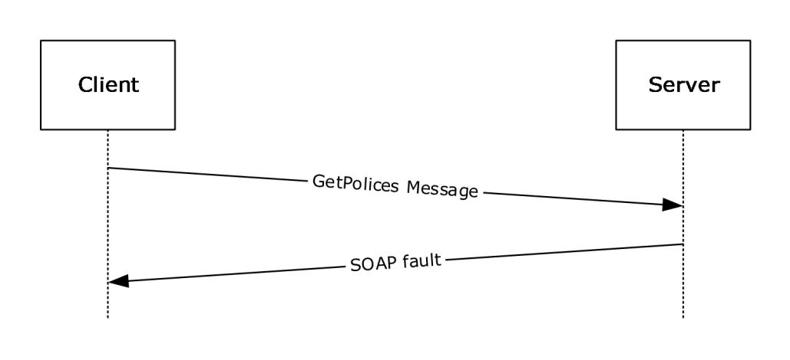
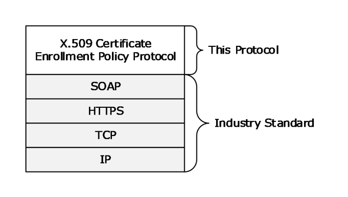
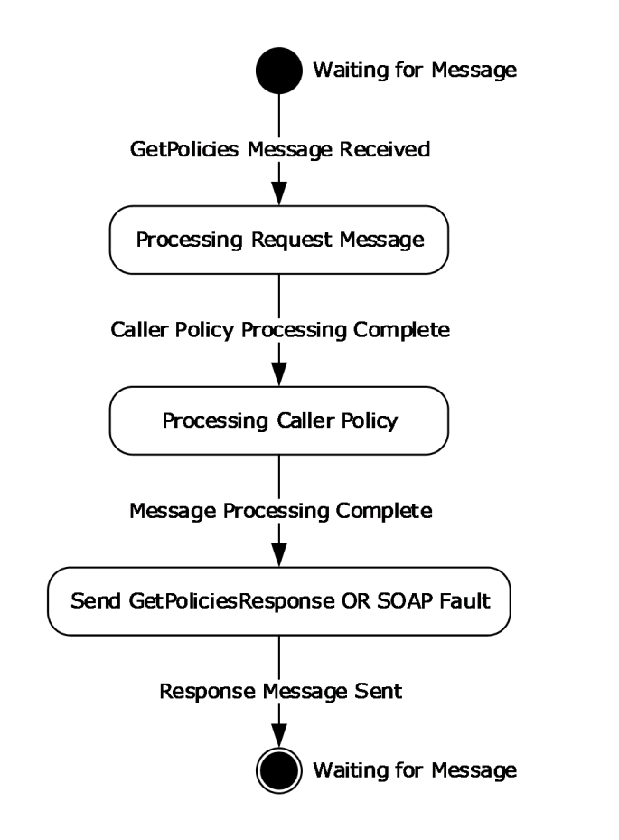

[MS-XCEP]:

X.509 Certificate Enrollment Policy Protocol

Intellectual Property Rights Notice for Open Specifications Documentation

  Technical Documentation. Microsoft publishes Open Specifications documentation (“this

documentation”) for protocols, file formats, data portability, computer languages, and standards
support. Additionally, overview documents cover inter-protocol relationships and interactions.

  Copyrights. This documentation is covered by Microsoft copyrights. Regardless of any other

terms that are contained in the terms of use for the Microsoft website that hosts this
documentation, you can make copies of it in order to develop implementations of the technologies
that are described in this documentation and can distribute portions of it in your implementations
that use these technologies or in your documentation as necessary to properly document the
implementation. You can also distribute in your implementation, with or without modification, any
schemas, IDLs, or code samples that are included in the documentation. This permission also
applies to any documents that are referenced in the Open Specifications documentation.
  No Trade Secrets. Microsoft does not claim any trade secret rights in this documentation.
  Patents. Microsoft has patents that might cover your implementations of the technologies

described in the Open Specifications documentation. Neither this notice nor Microsoft's delivery of
this documentation grants any licenses under those patents or any other Microsoft patents.
However, a given Open Specifications document might be covered by the Microsoft Open
Specifications Promise or the Microsoft Community Promise. If you would prefer a written license,
or if the technologies described in this documentation are not covered by the Open Specifications
Promise or Community Promise, as applicable, patent licenses are available by contacting
iplg@microsoft.com.

  License Programs. To see all of the protocols in scope under a specific license program and the

associated patents, visit the Patent Map.

  Trademarks. The names of companies and products contained in this documentation might be
covered by trademarks or similar intellectual property rights. This notice does not grant any
licenses under those rights. For a list of Microsoft trademarks, visit
www.microsoft.com/trademarks.

  Fictitious Names. The example companies, organizations, products, domain names, email

addresses, logos, people, places, and events that are depicted in this documentation are fictitious.
No association with any real company, organization, product, domain name, email address, logo,
person, place, or event is intended or should be inferred.

Reservation of Rights. All other rights are reserved, and this notice does not grant any rights other
than as specifically described above, whether by implication, estoppel, or otherwise.

Tools. The Open Specifications documentation does not require the use of Microsoft programming
tools or programming environments in order for you to develop an implementation. If you have access
to Microsoft programming tools and environments, you are free to take advantage of them. Certain
Open Specifications documents are intended for use in conjunction with publicly available standards
specifications and network programming art and, as such, assume that the reader either is familiar
with the aforementioned material or has immediate access to it.

Support. For questions and support, please contact dochelp@microsoft.com.

[MS-XCEP] - v20260309
X.509 Certificate Enrollment Policy Protocol
Copyright © 2026 Microsoft Corporation
Release: March 9, 2026

1 / 48

Revision Summary

Date

Revision
History

Revision
Class

Comments

12/5/2008

0.1

Major

Initial Availability

1/16/2009

0.1.1

Editorial

Changed language and formatting in the technical content.

2/27/2009

0.1.2

Editorial

Changed language and formatting in the technical content.

4/10/2009

0.2

5/22/2009

1.0

7/2/2009

2.0

8/14/2009

3.0

9/25/2009

3.1

Minor

Major

Major

Major

Minor

Clarified the meaning of the technical content.

Updated and revised the technical content.

Updated and revised the technical content.

Updated and revised the technical content.

Clarified the meaning of the technical content.

11/6/2009

3.1.1

Editorial

Changed language and formatting in the technical content.

12/18/2009  3.2

Minor

Clarified the meaning of the technical content.

1/29/2010

3.2.1

Editorial

Changed language and formatting in the technical content.

3/12/2010

3.3

4/23/2010

4.0

6/4/2010

4.1

7/16/2010

5.0

8/27/2010

6.0

10/8/2010

6.0

11/19/2010  6.0

1/7/2011

6.0

2/11/2011

6.0

3/25/2011

6.0

5/6/2011

6.0

Minor

Major

Minor

Major

Major

None

None

None

None

None

None

Clarified the meaning of the technical content.

Updated and revised the technical content.

Clarified the meaning of the technical content.

Updated and revised the technical content.

Updated and revised the technical content.

No changes to the meaning, language, or formatting of the
technical content.

No changes to the meaning, language, or formatting of the
technical content.

No changes to the meaning, language, or formatting of the
technical content.

No changes to the meaning, language, or formatting of the
technical content.

No changes to the meaning, language, or formatting of the
technical content.

No changes to the meaning, language, or formatting of the
technical content.

6/17/2011

6.1

Minor

Clarified the meaning of the technical content.

9/23/2011

6.1

None

No changes to the meaning, language, or formatting of the
technical content.

12/16/2011  7.0

Major

Updated and revised the technical content.

3/30/2012

7.0

None

No changes to the meaning, language, or formatting of the
technical content.

[MS-XCEP] - v20260309
X.509 Certificate Enrollment Policy Protocol
Copyright © 2026 Microsoft Corporation
Release: March 9, 2026

2 / 48

Date

Revision
History

Revision
Class

Comments

7/12/2012

7.1

10/25/2012  8.0

1/31/2013

8.0

Minor

Major

None

Clarified the meaning of the technical content.

Updated and revised the technical content.

No changes to the meaning, language, or formatting of the
technical content.

8/8/2013

9.0

Major

Updated and revised the technical content.

11/14/2013  9.0

2/13/2014

9.0

5/15/2014

9.0

6/30/2015

10.0

10/16/2015  11.0

7/14/2016

12.0

6/1/2017

12.0

None

None

None

Major

Major

Major

None

No changes to the meaning, language, or formatting of the
technical content.

No changes to the meaning, language, or formatting of the
technical content.

No changes to the meaning, language, or formatting of the
technical content.

Significantly changed the technical content.

Significantly changed the technical content.

Significantly changed the technical content.

No changes to the meaning, language, or formatting of the
technical content.

9/15/2017

13.0

Major

Significantly changed the technical content.

12/1/2017

13.0

9/12/2018

14.0

4/7/2021

15.0

6/25/2021

16.0

4/23/2024

17.0

3/9/2026

18.0

None

Major

Major

Major

Major

Major

No changes to the meaning, language, or formatting of the
technical content.

Significantly changed the technical content.

Significantly changed the technical content.

Significantly changed the technical content.

Significantly changed the technical content.

Significantly changed the technical content.

[MS-XCEP] - v20260309
X.509 Certificate Enrollment Policy Protocol
Copyright © 2026 Microsoft Corporation
Release: March 9, 2026

3 / 48

Table of Contents

1.1
1.2

1.2.1
1.2.2

1  Introduction ............................................................................................................ 6
Glossary ........................................................................................................... 6
References ........................................................................................................ 8
Normative References ................................................................................... 8
Informative References ................................................................................. 9
Overview .......................................................................................................... 9
Relationship to Other Protocols .......................................................................... 10
Prerequisites/Preconditions ............................................................................... 10
Applicability Statement ..................................................................................... 10
Versioning and Capability Negotiation ................................................................. 11
Vendor-Extensible Fields ................................................................................... 11
Standards Assignments ..................................................................................... 11

1.3
1.4
1.5
1.6
1.7
1.8
1.9

2.1
2.2

2  Messages ............................................................................................................... 12
Transport ........................................................................................................ 12
Common Message Syntax ................................................................................. 12
Namespaces .............................................................................................. 12
Messages ................................................................................................... 12
Elements ................................................................................................... 12
Complex Types ........................................................................................... 12
Simple Types ............................................................................................. 12
Attributes .................................................................................................. 12
Groups ...................................................................................................... 13
Attribute Groups ......................................................................................... 13
Directory Service Schema Elements ................................................................... 13

2.2.1
2.2.2
2.2.3
2.2.4
2.2.5
2.2.6
2.2.7
2.2.8

2.3

3.1

3.1.4.1

3.1.4.1.3

3.1.4.1.2

3.1.4.1.1

3.1.1
3.1.2
3.1.3
3.1.4

3.1.4.1.2.1
3.1.4.1.2.2

3.1.4.1.1.1
3.1.4.1.1.2

3  Protocol Details ..................................................................................................... 14
IPolicy Server Details ........................................................................................ 14
Abstract Data Model .................................................................................... 14
Timers ...................................................................................................... 15
Initialization ............................................................................................... 15
Message Processing Events and Sequencing Rules .......................................... 15
GetPolicies Operation ............................................................................ 15
Messages ....................................................................................... 15
GetPolicies Message ................................................................... 15
GetPoliciesResponse Message ...................................................... 16
Elements ........................................................................................ 16
GetPolicies ................................................................................ 16
GetPoliciesResponse ................................................................... 16
Complex Types ............................................................................... 17
Attributes ................................................................................. 18
CA ........................................................................................... 21
CACollection .............................................................................. 22
CAReferenceCollection ................................................................ 22
CAURI ...................................................................................... 22
CAURICollection ......................................................................... 23
CertificateEnrollmentPolicy .......................................................... 23
CertificateValidity ....................................................................... 24
Client ....................................................................................... 24
CryptoProviders ......................................................................... 25
EnrollmentPermission ................................................................. 25
Extension .................................................................................. 25
ExtensionCollection .................................................................... 26
FilterOIDCollection ..................................................................... 26
KeyArchivalAttributes ................................................................. 26

3.1.4.1.3.1
3.1.4.1.3.2
3.1.4.1.3.3
3.1.4.1.3.4
3.1.4.1.3.5
3.1.4.1.3.6
3.1.4.1.3.7
3.1.4.1.3.8
3.1.4.1.3.9
3.1.4.1.3.10
3.1.4.1.3.11
3.1.4.1.3.12
3.1.4.1.3.13
3.1.4.1.3.14
3.1.4.1.3.15

[MS-XCEP] - v20260309
X.509 Certificate Enrollment Policy Protocol
Copyright © 2026 Microsoft Corporation
Release: March 9, 2026

4 / 48

3.1.4.1.3.16  OID .......................................................................................... 27
3.1.4.1.3.17  OIDCollection ............................................................................ 27
3.1.4.1.3.18  OIDReferenceCollection .............................................................. 28
PolicyCollection .......................................................................... 28
3.1.4.1.3.19
PrivateKeyAttributes ................................................................... 28
3.1.4.1.3.20
RARequirements ........................................................................ 29
3.1.4.1.3.21
RequestFilter ............................................................................. 29
3.1.4.1.3.22
Response .................................................................................. 30
3.1.4.1.3.23
Revision .................................................................................... 31
3.1.4.1.3.24
SupersededPolicies ..................................................................... 31
3.1.4.1.3.25
Timer Events .............................................................................................. 32
Other Local Events ...................................................................................... 32

3.1.5
3.1.6

4.1

4.1.1

4  Protocol Examples ................................................................................................. 33
Standard GetPolicies Request and GetPoliciesResponse Response Message Sequences33
Initial Certificate Enrollment Policy Retrieval .................................................. 33
Initial GetPolicies Client Request ............................................................. 33
GetPoliciesResponse Response ................................................................ 34
Certificate Enrollment Policy Retrieval Using LastUpdateTime ........................... 36
Client Request with Provided LastUpdateTime ........................................... 36
Server Response ................................................................................... 37

4.1.1.1
4.1.1.2

4.1.2.1
4.1.2.2

4.1.2

5  Security ................................................................................................................. 38
Security Considerations for Implementers ........................................................... 38
Index of Security Parameters ............................................................................ 38

5.1
5.2

6  Appendix A: Full WSDL .......................................................................................... 39
WSDL ............................................................................................................. 39
XML Schema.................................................................................................... 39

6.1
6.2

7  Appendix B: Product Behavior ............................................................................... 44

8  Change Tracking .................................................................................................... 46

9  Index ..................................................................................................................... 47

[MS-XCEP] - v20260309
X.509 Certificate Enrollment Policy Protocol
Copyright © 2026 Microsoft Corporation
Release: March 9, 2026

5 / 48

1  Introduction

This protocol specification describes the X.509 Certificate Enrollment Policy Protocol, a protocol
between a requesting client and a responding server for the exchange of a certificate enrollment
policy.

The communication is initiated by a requesting client that requests either the full certificate enrollment
policy, or a subset, by passing in a filter. A server processes the identity of the client and an optionally
provided client filter, and generates a response with a collection of certificate enrollment policy objects
accompanied by a collection of certificate issuers. The returned certificate issuers provide X509v3
Security Token issuance using [MS-WSTEP].

The X.509 Certificate Enrollment Policy Protocol is a minimal messaging protocol that includes a single
client request message (GetPolicies) with a matching server response message (GetPoliciesResponse).
The server can alternatively respond with a SOAP fault message.

Sections 1.5, 1.8, 1.9, 2, and 3 of this specification are normative. All other sections and examples in
this specification are informative.

1.1  Glossary

This document uses the following terms:

Abstract Syntax Notation One (ASN.1): A notation to define complex data types to carry a

message, without concern for their binary representation, across a network. ASN.1 defines an
encoding to specify the data types with a notation that does not necessarily determine the
representation of each value. ASN.1 encoding rules are sets of rules used to transform data that
is specified in the ASN.1 language into a standard format that can be decoded on any system
that has a decoder based on the same set of rules. ASN.1 and its encoding rules were once part
of the same standard. They have since been separated, but it is still common for the terms
ASN.1 and Basic Encoding Rules (BER) to be used to mean the same thing, though this is not
the case. Different encoding rules can be applied to a given ASN.1 definition. The choice of
encoding rules used is an option of the protocol designer. ASN.1 is described in the following
specifications: [ITUX660] for general procedures; [ITUX680] for syntax specification; [ITUX690]
for the Basic Encoding Rules (BER), Canonical Encoding Rules (CER), and Distinguished
Encoding Rules (DER) encoding rules; and [ITUX691] for the Packed Encoding Rules (PER).
Further background information on ASN.1 is also available in [DUBUISSON].

certificate: When referring to X.509v3 certificates, that information consists of a public key, a

distinguished name (DN) of some entity assumed to have control over the private key
corresponding to the public key in the certificate, and some number of other attributes and
extensions assumed to relate to the entity thus referenced. Other forms of certificates can bind
other pieces of information.

certificate enrollment: The process of acquiring a digital certificate from a certificate authority

(CA), which typically requires an end entity to first makes itself known to the CA (either
directly, or through a registration authority). This certificate and its associated private key
establish a trusted identity for an entity that is using the public key–based services and
applications. Also referred to as simply "enrollment".

certificate enrollment policy: The collection of certificate templates and certificate issuers

available to the requestor for X.509 certificate enrollment.

certificate template: A list of attributes that define a blueprint for creating an X.509 certificate.
It is often referred to in non-Microsoft documentation as a "certificate profile". A certificate
template is used to define the content and purpose of a digital certificate, including issuance
requirements (certificate policies), implemented X.509 extensions such as application policies,
key usage, or extended key usage as specified in [X509], and enrollment permissions.

6 / 48

[MS-XCEP] - v20260309
X.509 Certificate Enrollment Policy Protocol
Copyright © 2026 Microsoft Corporation
Release: March 9, 2026

Enrollment permissions define the rules by which a certification authority (CA) will issue or
deny certificate requests. In Windows environments, certificate templates are stored as
objects in the Active Directory and used by Microsoft enterprise CAs.

certification authority (CA): A third party that issues public key certificates. Certificates serve
to bind public keys to a user identity. Each user and certification authority (CA) can decide
whether to trust another user or CA for a specific purpose, and whether this trust is to be
transitive. For more information, see [RFC3280].

common name (CN): A string attribute of a certificate that is one component of a distinguished
name (DN). In Microsoft Enterprise uses, a CN has to be unique within the forest where it is
defined and any forests that share trust with the defining forest. The website or email address of
the certificate owner is often used as a common name. Client applications often refer to a
certification authority (CA) by the CN of its signing certificate.

extended key usage (EKU): An X.509 certificate extension that indicates one or more

purposes for which the certificate can be used.

object identifier (OID): In the context of an object server, a 64-bit number that uniquely

identifies an object.

private key: One of a pair of keys used in public-key cryptography. The private key is kept secret
and is used to decrypt data that has been encrypted with the corresponding public key. For an
introduction to this concept, see [CRYPTO] section 1.8 and [IEEE1363] section 3.1.

public key: One of a pair of keys used in public-key cryptography. The public key is distributed
freely and published as part of a digital certificate. For an introduction to this concept, see
[CRYPTO] section 1.8 and [IEEE1363] section 3.1.

public key infrastructure (PKI): The laws, policies, standards, and software that regulate or

manipulate certificates and public and private keys. In practice, it is a system of digital
certificates, certificate authorities (CAs), and other registration authorities that verify and
authenticate the validity of each party involved in an electronic transaction. For more
information, see [X509] section 6.

registration authority (RA): A generic term for a software module, hardware component, or

human operator thereof that enables a user or public key infrastructure (PKI) administrator
to perform various administration and operational functions as part of the certification or
revocation process.

relative distinguished name (RDN): The name of an object relative to its parent. This is the

leftmost attribute-value pair in the distinguished name (DN) of an object. For example, in the
DN "cn=Peter Houston, ou=NTDEV, dc=microsoft, dc=com", the RDN is "cn=Peter Houston".
For more information, see [RFC2251].

Security Descriptor Definition Language (SDDL): The format used to specify a security

descriptor as a text string, specified in [MS-DTYP] section 2.5.1.

SOAP fault: A container for error and status information within a SOAP message. See [SOAP1.2-

1/2007] section 5.4 for more information.

Uniform Resource Identifier (URI): A string that identifies a resource. The URI is an addressing
mechanism defined in Internet Engineering Task Force (IETF) Uniform Resource Identifier (URI):
Generic Syntax [RFC3986].

Web Services Description Language (WSDL): An XML format for describing network services

as a set of endpoints that operate on messages that contain either document-oriented or
procedure-oriented information. The operations and messages are described abstractly and are
bound to a concrete network protocol and message format in order to define an endpoint.
Related concrete endpoints are combined into abstract endpoints, which describe a network

7 / 48

[MS-XCEP] - v20260309
X.509 Certificate Enrollment Policy Protocol
Copyright © 2026 Microsoft Corporation
Release: March 9, 2026

service. WSDL is extensible, which allows the description of endpoints and their messages
regardless of the message formats or network protocols that are used.

X.509: An ITU-T standard for public key infrastructure subsequently adapted by the IETF, as

specified in [RFC3280].

XML: The Extensible Markup Language, as described in [XML1.0].

XML namespace: A collection of names that is used to identify elements, types, and attributes in
XML documents identified in a URI reference [RFC3986]. A combination of XML namespace and
local name allows XML documents to use elements, types, and attributes that have the same
names but come from different sources. For more information, see [XMLNS-2ED].

XML Schema (XSD): A language that defines the elements, attributes, namespaces, and data

types for XML documents as defined by [XMLSCHEMA1/2] and [XMLSCHEMA2/2] standards. An
XML schema uses XML syntax for its language.

MAY, SHOULD, MUST, SHOULD NOT, MUST NOT: These terms (in all caps) are used as defined
in [RFC2119]. All statements of optional behavior use either MAY, SHOULD, or SHOULD NOT.

1.2  References

Links to a document in the Microsoft Open Specifications library point to the correct section in the
most recently published version of the referenced document. However, because individual documents
in the library are not updated at the same time, the section numbers in the documents may not
match. You can confirm the correct section numbering by checking the Errata.

1.2.1  Normative References

We conduct frequent surveys of the normative references to assure their continued availability. If you
have any issue with finding a normative reference, please contact dochelp@microsoft.com. We will
assist you in finding the relevant information.

[MS-ADLS] Microsoft Corporation, "Active Directory Lightweight Directory Services Schema".

[MS-CRTD] Microsoft Corporation, "Certificate Templates Structure".

[MS-WCCE] Microsoft Corporation, "Windows Client Certificate Enrollment Protocol".

[MS-WSTEP] Microsoft Corporation, "WS-Trust X.509v3 Token Enrollment Extensions".

[RFC2119] Bradner, S., "Key words for use in RFCs to Indicate Requirement Levels", BCP 14, RFC
2119, March 1997, https://www.rfc-editor.org/info/rfc2119

[RFC3066] Alvestrand, H., "Tags for the Identification of Languages", BCP 47, RFC 3066, January
2001, https://www.rfc-editor.org/info/rfc3066

[RFC5280] Cooper, D., Santesson, S., Farrell, S., et al., "Internet X.509 Public Key Infrastructure
Certificate and Certificate Revocation List (CRL) Profile", RFC 5280, May 2008, https://www.rfc-
editor.org/info/rfc5280

[WSDL] Christensen, E., Curbera, F., Meredith, G., and Weerawarana, S., "Web Services Description
Language (WSDL) 1.1", W3C Note, March 2001, https://www.w3.org/TR/2001/NOTE-wsdl-20010315

[XMLNS] Bray, T., Hollander, D., Layman, A., et al., Eds., "Namespaces in XML 1.0 (Third Edition)",
W3C Recommendation, December 2009, https://www.w3.org/TR/2009/REC-xml-names-20091208/

[MS-XCEP] - v20260309
X.509 Certificate Enrollment Policy Protocol
Copyright © 2026 Microsoft Corporation
Release: March 9, 2026

8 / 48

<!-- Extracted images from page 9 -->

<!-- /Extracted images from page 9 -->

[XMLSCHEMA1] Thompson, H., Beech, D., Maloney, M., and Mendelsohn, N., Eds., "XML Schema Part
1: Structures", W3C Recommendation, May 2001, https://www.w3.org/TR/2001/REC-xmlschema-1-
20010502/

[XMLSCHEMA2] Biron, P.V., Ed. and Malhotra, A., Ed., "XML Schema Part 2: Datatypes", W3C
Recommendation, May 2001, https://www.w3.org/TR/2001/REC-xmlschema-2-20010502/

1.2.2  Informative References

[DUBUISSON] Dubuisson, O., "ASN.1 Communication between Heterogeneous Systems", Morgan
Kaufmann, October 2000, ISBN: 0126333610.

[MS-CERSOD] Microsoft Corporation, "Certificate Services Protocols Overview".

[RFC4262] Santesson, S., "X.509 Certificate Extension for Secure/Multipurpose Internet Mail
Extensions (S/MIME) Capabilities", RFC 4262, December 2005, https://www.rfc-
editor.org/info/rfc4262

[RFC4523] Zeilenga, K., "Lightweight Directory Access Protocol (LDAP) Schema Definitions for X.509
Certificates", RFC 4523, June 2006, https://www.rfc-editor.org/info/rfc4523

1.3  Overview

The X.509 certificate enrollment policy defines the properties and characteristics for the
certificate enrollment process. The set of policies is stored and managed by the public key
infrastructure (PKI) administration. The X.509 Certificate Enrollment Policy Protocol is used by the
caller to retrieve enrollment policies that the PKI administrator has defined for use by the caller. This
protocol begins with initialization of the secure tunnel over HTTPS, followed by message exchange
(request/response) and subsequent closure of the secure tunnel. This specification does not describe
the setup and closure of the HTTPS transport.

Figure 1: Typical sequence for certificate enrollment

The server responds to a GetPolicies message with a GetPoliciesResponse message or a SOAP fault
message.

[MS-XCEP] - v20260309
X.509 Certificate Enrollment Policy Protocol
Copyright © 2026 Microsoft Corporation
Release: March 9, 2026

9 / 48

<!-- Extracted images from page 10 -->

<!-- /Extracted images from page 10 -->

Figure 2: Typical sequence when server responds with SOAP fault message

1.4  Relationship to Other Protocols

 The following figure shows the X.509 Certificate Enrollment Policy Protocol stack diagram.

Figure 3: Stack diagram for the X.509 Certificate Enrollment Policy Protocol

1.5  Prerequisites/Preconditions

The server that implements the X.509 Certificate Enrollment Policy Protocol requires the client to be
preconfigured with the URI location of the Web service. Authentication using Kerberos will require a
compliant Kerberos client. For information about the data model initialization requirements, see
section 3.1.3.

1.6  Applicability Statement

The X.509 Certificate Enrollment Policy Protocol is recommended for use as part of a managed PKI to
provide clients with policy guidance for the X.509 certificate life cycle. It is possible to enroll for a
certificate (to request and receive one) without knowing the policy information provided by this
protocol, and therefore, use of this protocol is optional. However, with the policy information, a client
can avoid making requests that would be rejected, and can therefore save time and network
bandwidth. If the client is running, for example, an autoenrollment process ([MS-CERSOD] sections
2.1.2.2 and 2.1.2.2.2), that process might require this policy information.

[MS-XCEP] - v20260309
X.509 Certificate Enrollment Policy Protocol
Copyright © 2026 Microsoft Corporation
Release: March 9, 2026

10 / 48

1.7  Versioning and Capability Negotiation

None.

1.8  Vendor-Extensible Fields

Vendor extensibility is provided through the use of individual extension points (the <##any>
element) as described in sections 3.1.4.1.3.1, 3.1.4.1.3.7, 3.1.4.1.3.9, 3.1.4.1.3.16, 3.1.4.1.3.22,
and 3.1.4.1.3.23.

1.9  Standards Assignments

None.

[MS-XCEP] - v20260309
X.509 Certificate Enrollment Policy Protocol
Copyright © 2026 Microsoft Corporation
Release: March 9, 2026

11 / 48

2  Messages

2.1  Transport

The X.509 Certificate Enrollment Policy Protocol makes use of the HTTPS transport for message
exchange.

2.2  Common Message Syntax

This section contains common definitions used by the X.509 Certificate Enrollment Policy Protocol. The
syntax of the definitions use XML Schema as defined in [XMLSCHEMA1] and [XMLSCHEMA2], and
Web Services Description Language (WSDL) as defined in [WSDL].

2.2.1  Namespaces

The X.509 Certificate Enrollment Policy Protocol defines and references various XML namespaces
using the mechanisms specified in [XMLNS]. Although this protocol associates a specific XML
namespace prefix for each XML namespace that is used, the choice of any particular XML namespace
prefix is implementation-specific and not significant for interoperability.

Prefix  Namespace URI

Reference

wsse

http://docs.oasis-open.org/wss/2004/01/oasis-200401-wss-wssecurity-secext-1.0.xsd

[XMLNS]

xsi

http://www.w3.org/2001/XMLSchema-instance

wsa

http://www.w3.org/2005/08/addressing

xs

http://www.w3.org/2001/XMLSchema

xcep

http://schemas.microsoft.com/windows/pki/2009/01/enrollmentpolicy

wsdl

http://schemas.xmlsoap.org/wsdl/

[XMLNS]

[XMLNS]

[XMLNS]

[XMLNS]

[WSDL]

2.2.2  Messages

This specification does not define any common XML schema message definitions.

2.2.3  Elements

This specification does not define any common XML schema element definitions.

2.2.4  Complex Types

This specification does not define any common XML schema complex type definitions.

2.2.5  Simple Types

This specification does not define any common XML schema simple type definitions.

2.2.6  Attributes

This specification does not define any common XML schema attribute definitions.

[MS-XCEP] - v20260309
X.509 Certificate Enrollment Policy Protocol
Copyright © 2026 Microsoft Corporation
Release: March 9, 2026

12 / 48

2.2.7  Groups

This specification does not define any common XML schema group definitions.

2.2.8  Attribute Groups

This specification does not define any common XML schema attribute group definitions.

2.3  Directory Service Schema Elements

This protocol accesses the following Directory Service schema classes and attributes listed in the
following table.

For the syntactic specifications of the following <Class> or <Class><Attribute> pairs, refer to
Active Directory Lightweight Directory Services (AD LDS) ([MS-ADLS]).

Class  Attribute

User

cn

distinguishedName

dNSHostName

mail

objectGUID

userCertificate

userPrincipalName

[MS-XCEP] - v20260309
X.509 Certificate Enrollment Policy Protocol
Copyright © 2026 Microsoft Corporation
Release: March 9, 2026

13 / 48

<!-- Extracted images from page 14 -->

<!-- /Extracted images from page 14 -->

3  Protocol Details

The client side of this protocol is simply a pass-through. That is, no additional timers or other state is
required on the client side of this protocol. Calls made by the higher-layer protocol or application are
passed directly to the transport, and the results returned by the transport are passed directly back to
the higher-layer protocol or application.

3.1  IPolicy Server Details

The IPolicy server hosts a message endpoint that receives GetPolicies (section 3.1.4.1.1.1) messages.
Once received, the server processes the client request, formulates a response, and sends either a
GetPoliciesResponse (section 3.1.4.1.1.2) response message or a SOAP fault. Once the message has
been sent to the client, the server returns to the waiting state.

Figure 4: X.509 Certificate Enrollment Policy Protocol session state diagram

3.1.1  Abstract Data Model

CertificateEnrollmentPolicyStore: A repository where a certificate enrollment policy resides.
The enrollment policy in the store is the basis for a server's X.509 Certificate Enrollment Policy
response.

SupportedLanguages: A list of language identifiers supported by the server. The set of languages

are of type xml:lang and defined in [RFC3066].

[MS-XCEP] - v20260309
X.509 Certificate Enrollment Policy Protocol
Copyright © 2026 Microsoft Corporation
Release: March 9, 2026

14 / 48

DefaultLanguage: A data element that is used to store the server's default language for localized

resources.

LastUpdateTime: A data element that specifies the last date and time when the

CertificateEnrollmentPolicyStore was updated or modified.

3.1.2  Timers

None.

3.1.3  Initialization

The CertificateEnrollmentPolicyStore data element MUST be initialized with the available
certificate enrollment policy. The initialization MUST also set the value for the LastUpdateTime
data element.

A server MUST initialize the DefaultLanguage data element with the language identifier that is to be
used when responding to requests when a caller has not specified a preferred language, or when the
specified preferred language is not available in the set of SupportedLanguages.

3.1.4  Message Processing Events and Sequencing Rules

Operation

Description

GetPolicies (section 3.1.4.1)  The GetPolicies operation defines the client request and server response messages

that are used to complete the act of retrieving a certificate enrollment policy.

3.1.4.1  GetPolicies Operation

The GetPolicies operation defines the client request and server response messages that are used to
complete the act of retrieving a certificate enrollment policy.

 <wsdl:portType name="IPolicy">
   <wsdl:operation name="GetPolicies">
     <wsdl:input
 wsaw:Action=http://schemas.microsoft.com/windows/pki/2009/01/enrollmentpolicy/IPolicy/GetPoli
cies
     message="xcep:IPolicy_GetPolicies_InputMessage"/>
     <wsdl:output
 wsaw:Action=http://schemas.microsoft.com/windows/pki/2009/01/enrollmentpolicy/IPolicy/GetPoli
ciesResponse
     message="xcep:IPolicy_GetPolicies_OutputMessage"/>
   </wsdl:operation>
 </wsdl:portType>

3.1.4.1.1 Messages

Message

Description

GetPolicies

Sent from the client to the server to retrieve certificate enrollment policies.

GetPoliciesResponse  Sent from the server to the client that contains the requested certificate enrollment policy.

3.1.4.1.1.1  GetPolicies Message

[MS-XCEP] - v20260309
X.509 Certificate Enrollment Policy Protocol
Copyright © 2026 Microsoft Corporation
Release: March 9, 2026

15 / 48

GetPolicies is a request message. It is the message sent from client to server to retrieve certificate
enrollment policies.

 <wsdl:message name="IPolicy_GetPolicies_InputMessage">
   <wsdl:part name="request" element="xcep:GetPolicies"/>
 </wsdl:message>

xcep:GetPolicies: An instance of a <GetPolicies> element as defined in section 3.1.4.1.2.1. This

element contains the client request.

3.1.4.1.1.2  GetPoliciesResponse Message

GetPoliciesResponse is a response message. It is the message sent from the server to the client
containing the requested certificate enrollment policy.

 <wsdl:message name="IPolicy_GetPolicies_OutputMessage">
   <wsdl:part name="response" element="xcep:GetPoliciesResponse"/>
 </wsdl:message>

xcep:GetPoliciesResponse: An instance of a <GetPoliciesResponse> element as defined in section

3.1.4.1.2.2. This element contains the server response.

3.1.4.1.2 Elements

Element

Description

<GetPolicies> (section 3.1.4.1.2.1)

Contains the body of the request for the GetPolicies operation.

<GetPoliciesResponse> (section 3.1.4.1.2.2)  Contains the server response to a GetPolicies request message.

3.1.4.1.2.1  GetPolicies

The <GetPolicies> element contains the client request.

 <xs:element name="GetPolicies">
   <xs:complexType>
     <xs:sequence>
       <xs:element name="client" type="xcep:Client" />
       <xs:element name="requestFilter" nillable="true" type="xcep:RequestFilter" />
     </xs:sequence>
   </xs:complexType>
 </xs:element>

xcep:client: The <xcep:client> element is an instance of the Client object as defined in section

3.1.4.1.3.9. The <xcep:client> element contains information about the caller including the caller's
preferred language, and the date and time of last policy retrieval. If the <xcep:client> element is
absent, is specified as nil, or has no value, the server MUST respond with a SOAP fault.

xcep:requestFilter: The <xcep:requestFilter> element is an instance of the RequestFilter object as

defined in section 3.1.4.1.3.22. The <xcep:requestFilter> element specified in the request is used
to constrain the policy request to specific policies.

3.1.4.1.2.2  GetPoliciesResponse

The <GetPoliciesResponse> element contains the server response.

16 / 48

[MS-XCEP] - v20260309
X.509 Certificate Enrollment Policy Protocol
Copyright © 2026 Microsoft Corporation
Release: March 9, 2026

 <xs:element name="GetPoliciesResponse">
   <xs:complexType>
     <xs:sequence>
       <xs:element name="response" nillable="true" type="xcep:Response" />
       <xs:element name="cAs" nillable="true" type="xcep:CACollection" />
       <xs:element name="oIDs" nillable="true" type="xcep:OIDCollection" />
     </xs:sequence>
   </xs:complexType>
 </xs:element>

xcep:response: The <xcep:response:> element is an instance of the Response object as defined in

section 3.1.4.1.3.23 that contains the certificate enrollment policies.

xcep:cAs: The <xcep:cAs> element is an instance of a CACollection object as defined in section

3.1.4.1.3.3 that contains the issuers for the certificate enrollment policies.

xcep:oIDs: The <xcep:oIDs> element is an instance of the OIDCollection object as defined in section

3.1.4.1.3.17 that contains the collection of OIDs for the response.

3.1.4.1.3 Complex Types

Complex Type

<Attributes>

<CA>

Description

Contains information about a CertificateEnrollmentPolicy object.

Encapsulates information about a certificate authority.

<CACollection>

Groups one or more CA objects together.

<CAReferenceCollection>

Groups one or more <cAReference> elements together.

<CAURI>

<CAURICollection>

Defines the URI for a certificate authority.

Groups one or more CAURI (section 3.1.4.1.3.5) objects in a
GetPoliciesResponse (section 3.1.4.1.1.2) message.

<CertificateEnrollmentPolicy>  Encapsulates a certificate enrollment policy object and its set of issuers.

<CertificateValidity>

Contains information about the expected validity of an issued certificate, and
the expected period when renewal starts.

<Client>

Contains information about the client's current state and preferences.

<CryptoProviders>

An unordered list of cryptographic providers for use in private key generation.

<EnrollmentPermission>

Conveys the permissions for the associated parent object.

<Extension>

Provides an X.509v3 Certificate Extension.

<ExtensionCollection>

The unordered list of extensions.

<FilterOIDCollection>

The unordered list of OIDs used to filter the server response down to certain
CertificateEnrollmentPolicy objects.

<KeyArchivalAttributes>

Contains the required attributes that MUST be used on the client prior to sending
the client private key to the server for archival.

<OID>

Identifies an object and provides generic attributes on the object.

<OIDCollection>

An unordered list of OID objects.

<OIDReferenceCollection>

An unordered list of references to OID objects.

<PolicyCollection>

An unordered list of CertificateEnrollmentPolicy objects.

<PrivateKeyAttributes>

Contains the attributes for the private key that will be associated with any
certificate request for the corresponding CertificateEnrollmentPolicy object.

<RARequirements>

Any additional registration authority (RA) keys required in signing
enrollment requests for this policy.

<RequestFilter>

<Response>

<Revision>

Filters the GetPoliciesResponse to contain only CertificateEnrollmentPolicy objects
that satisfy the filter.

Conveys the results of a request for certificate enrollment policy.

Identifies the version information of a CertificateEnrollmentPolicy object.

<SupersededPolicies>

An unordered list of superseded policies identified by the value of their

17 / 48

[MS-XCEP] - v20260309
X.509 Certificate Enrollment Policy Protocol
Copyright © 2026 Microsoft Corporation
Release: March 9, 2026

Complex Type

Description

<commonName> attribute.

3.1.4.1.3.1  Attributes

The <Attributes> complex type contains information about a CertificateEnrollmentPolicy object defined
in section 3.1.4.1.3.7. It MUST be present for each CertificateEnrollmentPolicy object instance.

 <xs:complexType name="Attributes">
   <xs:sequence>
     <xs:element ref="xcep:commonName" />
     <xs:element name="policySchema"
       type="xs:unsignedInt" />
     <xs:element name="certificateValidity"
       type="xcep:CertificateValidity" />
     <xs:element name="permission"
       type="xcep:EnrollmentPermission" />
     <xs:element name="privateKeyAttributes"
       type="xcep:PrivateKeyAttributes" />
     <xs:element name="revision"
       type="xcep:Revision" />
     <xs:element name="supersededPolicies"
       type="xcep:SupersededPolicies" nillable="true" />
     <xs:element name="privateKeyFlags"
       type="xs:unsignedInt" nillable="true" />
     <xs:element name="subjectNameFlags"
       type="xs:unsignedInt" nillable="true" />
     <xs:element name="enrollmentFlags"
       type="xs:unsignedInt" nillable="true" />
     <xs:element name="generalFlags"
       type="xs:unsignedInt" nillable="true" />
     <xs:element name="hashAlgorithmOIDReference"
       type="xs:int" nillable="true" />
     <xs:element name="rARequirements"
       type="xcep:RARequirements" nillable="true" />
     <xs:element name="keyArchivalAttributes"
       type="xcep:KeyArchivalAttributes" nillable="true" />
     <xs:element name="extensions"
       type="xcep:ExtensionCollection" nillable="true" />
     <xs:any namespace="##any" processContents="lax"
       minOccurs="0" maxOccurs="unbounded" />
   </xs:sequence>
 </xs:complexType>

xcep:commonName: A string value of the common name (CN) of a CertificateEnrollmentPolicy

object. The <xcep:commonName> element MUST be unique in the scope of a
GetPoliciesResponse (section 3.1.4.1.1.2) message.

policySchema: An integer value presenting the schema version of the corresponding

CertificateEnrollmentPolicy. The <policySchema> element SHOULD be an integer value of 1, 2, or
3.

certificateValidity: An instance of a CertificateValidity object as defined in section 3.1.4.1.3.8.

permission: An instance of an EnrollmentPermission object as defined in section 3.1.4.1.3.11.

privateKeyAttributes: An instance of a PrivateKeyAttributes object as defined in section
3.1.4.1.3.20.

revision: An instance of a Revision object as defined in section 3.1.4.1.3.24.

18 / 48

[MS-XCEP] - v20260309
X.509 Certificate Enrollment Policy Protocol
Copyright © 2026 Microsoft Corporation
Release: March 9, 2026

supersededPolicies: An instance of a SupersededPolicies object as defined in section 3.1.4.1.3.25. A
value of nil indicates that the corresponding CertificateEnrollmentPolicy object does not supersede
another.

privateKeyFlags: The <privateKeyFlags> element is an unsigned integer that MUST be a bitwise OR
of zero or more of the following possible values. For more information about the relationship
between the <privateKeyFlags> element and the <msPKI-Private-Key-Flag> attribute, see [MS-
WCCE] section 3.1.2.4.2.2.2.8.

Integer value  Meaning

0x00000001

Instructs the client to archive the private key.

0x00000010

Instructs the client to allow the private key to be exported.

0x00000020

Instructs the client to protect the private key.

subjectNameFlags: The <subjectNameFlags> element is an unsigned integer that MUST be a bitwise

OR of zero or more of the following possible values.

Integer
value

Meaning

0x00000001

The client supplies the Subject field value in the certificate request.

0x00010000

The client supplies the Subject Alternative Name field value in the certificate request.

0x00400000

The certificate authority (CA) adds the value of the DNS of the root domain (the domain
where the user's object resides in Active Directory) to the Subject Alternative Name
extension of the issued certificate.

0x00800000

The CA adds the value of the userPrincipalName attribute from the requestor's user object in
Active Directory to the Subject Alternative Name extension of the issued certificate.

0x01000000

The CA adds the value of the objectGUID attribute from the requestor's user object in Active
Directory to the Subject Alternative Name extension of the issued certificate.

0x02000000

The CA adds the value of the userPrincipalName attribute from the requestor's user object in
Active Directory to the Subject Alternative Name extension of the issued certificate.

0x04000000

The CA adds the value of the mail attribute from the requestor's user object in Active
Directory to the Subject Alternative Name extension of the issued certificate.

0x08000000

The CA adds the value obtained from the dNSHostName attribute of the requestor's user
object in Active Directory to the Subject Alternative Name extension of the issued certificate.

0x10000000

The CA adds the value obtained from the dNSHostName attribute of the requestor's user
object in Active Directory as the CN in the Subject extension of the issued certificate.

0x20000000

The CA adds the value of the mail attribute from the requestor's user object in Active
Directory as the Subject extension of the issued certificate.

0x40000000

The CA sets the Subject Name to the cn attribute value of the requestor's user object in
Active Directory.

0x80000000

The CA sets the Subject Name to the distinguishedName attribute value of the requestor's
user object in Active Directory.

0x00000008

The client reuses the values of the Subject Name and Subject Alternative Name extensions
from an existing, valid certificate when creating a renewal certificate request. This flag can
only be used when the SubjectNameEnrolleeSupplies (0x00000001) or
SubjectAlternativeNameEnrolleeSupplies (0x00010000) flag is specified.

19 / 48

[MS-XCEP] - v20260309
X.509 Certificate Enrollment Policy Protocol
Copyright © 2026 Microsoft Corporation
Release: March 9, 2026

enrollmentFlags: The <enrollmentFlags> element is an unsigned integer that MUST be a bitwise OR

of zero or more of the following values.

Integer
value

Meaning

0x00000001

Instructs the client and CA to include an S/MIME extension, as specified in [RFC4262].

0x00000008

Instructs the CA to append the issued certificate to the userCertificate attribute, on the user
object in Active Directory.

0x00000010

Instructs the CA to check the user's userCertificate attribute in Active Directory, as specified
in [RFC4523], for valid certificates that match the template enrolled for.

0x00000040

This flag instructs clients to sign the renewal request using the private key of the existing
certificate. For more information, see [MS-WCCE] section 3.2.2.6.2.1.4.5.6. This flag also
instructs the CA to process the renewal requests as specified in [MS-WCCE] section
3.2.2.6.2.1.4.5.6.

0x00000100

Instructs the client to get a user's consent before attempting to enroll for a certificate based
on the specified template.

0x00000400

Instructs the client to delete any expired, revoked, or renewed certificate from the user's
certificate stores.

0x00002000

This flag instructs the client to reuse the private key for a smart card–based certificate
renewal if it is unable to create a new private key on the card.

generalFlags: The <generalFlags> element is an unsigned integer that MUST be a bitwise OR of zero

or more of the following values.

Integer
value

Name

Meaning

0x00000040

GeneralMachineType  This certificate template is for an end entity that represents a

machine.

0x00000080

GeneralCA

A certificate request for a CA certificate.

0x00000800

GeneralCrossCA

A certificate request for cross-certifying a certificate.

0x00010000

Reserved

This flag value is reserved.

0x00020000

Reserved

This flag value is reserved.

0x10000000

Reserved

This flag value is reserved.

0x00000001

Reserved

This flag value is reserved.

0x00000002

Reserved

This flag value is reserved.

0x00000004

Reserved

This flag value is reserved.

0x00000008

Reserved

This flag value is reserved.

0x00000010

Reserved

This flag value is reserved.

0x00000020

Reserved

This flag value is reserved.

0x00000100

Reserved

This flag value is reserved.

0x00000200

Reserved

This flag value is reserved.

[MS-XCEP] - v20260309
X.509 Certificate Enrollment Policy Protocol
Copyright © 2026 Microsoft Corporation
Release: March 9, 2026

20 / 48

Integer
value

Name

Meaning

0x00000400

Reserved

This flag value is reserved.

0x00040000

Reserved

This flag value is reserved.

0x00080000

Reserved

This flag value is reserved.

0x00001000

Reserved

This flag value is reserved.

hashAlgorithmOIDReference: An integer value that references an existing <oIDReferenceID>

element as defined in section 3.1.4.1.3.16. The hash algorithm is used when signing operations
are performed during the certificate enrollment process. If the value of the <policySchema>
element for this Attributes object is 3 and the hash algorithm is defined for the policy, the value of
the <hashAlgorithmOIDReference> element MUST be an integer that references the
<oIDReferenceID> of the corresponding hash algorithm definition. If the value of the
<policySchema> element for this Attributes object is 1 or 2, or the hash algorithm is not defined,
the <hashAlgorithmOIDReference> element MUST be specified as nil.

rARequirements: An instance of an RARequirements object as defined in section 3.1.4.1.3.21.

keyArchivalAttributes: An instance of a KeyArchivalAttributes object as defined in section

3.1.4.1.3.15.

extensions: An instance of an ExtensionCollection object as defined in section 3.1.4.1.3.13.

##any: This element provides a vendor extensibility point. Additional elements MAY be added.

3.1.4.1.3.2  CA

The <CA> complex type is used to encapsulate information about a certificate authority, including
one or more URIs that are available for enrollment operations and permissions.

 <xs:complexType name="CA">
   <xs:sequence>
     <xs:element name="uris" type="xcep:CAURICollection" />
     <xs:element name="certificate" type="xs:base64Binary" />
     <xs:element name="enrollPermission" type="xs:boolean" />
     <xs:element name="cAReferenceID" type="xs:int" />
     <xs:any namespace="##any" processContents="lax"
       minOccurs="0" maxOccurs="unbounded" />
   </xs:sequence>
 </xs:complexType>

uris: An instance of a CAURICollection object as defined in section 3.1.4.1.3.6, which contains the list

of URI values for a certificate authority.

certificate: The <certificate> element contains the xs:base64Binary representation of the Abstract
Syntax Notation One (ASN.1) encoded certificate authority signing certificate. The value for
the <certificate> element MUST never be an empty string.

enrollPermission: The <enrollPermission> element contains an xs:boolean value that indicates
whether or not the requestor has permission to submit enrollment requests to the server
represented by the corresponding CA object. It MUST be true or false. If the <enrollPermission>
element is true, the requestor has enroll permissions and can submit requests. If the
<enrollPermission> element is false, the requestor does not have permission.

[MS-XCEP] - v20260309
X.509 Certificate Enrollment Policy Protocol
Copyright © 2026 Microsoft Corporation
Release: March 9, 2026

21 / 48

cAReferenceID: Each instance of a CA object in a GetPoliciesResponse message MUST have a unique

<cAReferenceID>. The <cAReferenceID> is an unsigned integer value used as an index for
referencing the corresponding CA object within the scope of a GetPoliciesResponse message.

3.1.4.1.3.3  CACollection

The <CACollection> complex type is used to group one or more CA objects together.

 <xs:complexType name="CACollection">
   <xs:sequence>
     <xs:element name="cA" type="xcep:CA" minOccurs="1"
       maxOccurs="unbounded" />
   </xs:sequence>
 </xs:complexType>

cA: An instance of an xcep:CA object as defined in section 3.1.4.1.3.2.

3.1.4.1.3.4  CAReferenceCollection

The <CAReferenceCollection> complex type is used to group one or more <cAReference> elements
together.

 <xs:complexType name="CAReferenceCollection">
   <xs:sequence>
     <xs:element name="cAReference" type="xs:int"
       minOccurs="1" maxOccurs="unbounded" />
   </xs:sequence>
 </xs:complexType>

caReference: An integer value reference of an existing <cAReferenceID> element in a

CA (section 3.1.4.1.3.2) object. The integer value of each <cAReference> element MUST be
unique for each CAReferenceCollection object and MUST reference a <cAReferenceID> element
defined in the corresponding GetPoliciesResponse message.

3.1.4.1.3.5  CAURI

The <CAURI> complex type is used to define the URI for a certificate authority, which includes
specifying the supported authentication type, the URI, and a relative priority.

 <xs:complexType name="CAURI">
   <xs:sequence>
     <xs:element name="clientAuthentication" type="xs:unsignedInt" />
     <xs:element name="uri" type="xs:anyURI" />
     <xs:element name="priority" type="xs:unsignedInt"
       nillable="true" />
    <xs:element name="renewalOnly" type ="xs:boolean" nillable="true" />
     <xs:any namespace="##any" processContents="lax"
       minOccurs="0" maxOccurs="unbounded" />
   </xs:sequence>
 </xs:complexType>

clientAuthentication: The <clientAuthentication> element is used to define the supported

authentication type for the <uri> element of this CAURI object. The <clientAuthentication>
element is an unsigned integer that MUST have one of the following values.

Integer value  Meaning

1

Anonymous Authentication

[MS-XCEP] - v20260309
X.509 Certificate Enrollment Policy Protocol
Copyright © 2026 Microsoft Corporation
Release: March 9, 2026

22 / 48

Integer value  Meaning

2

4

8

Transport Kerberos Authentication

Message Username and Password Authentication

Message X.509 Certificate Authentication

uri: The <uri> element is used to store a Uniform Resource Identifier (URI) entry for a

CA (section 3.1.4.1.3.2) object.

priority: The <priority> element is an integer value that represents the priority value for the URI. The
<priority> element value is used as a relative indicator against other CAURI objects. The lower the
integer value, the higher the priority.  Two CAURI objects have the same priority if the integer
values of each <priority> element are the same. A CAURI object is considered to have a lower
priority if the <priority> element integer value is more than the integer value of the <priority>
element of an alternate CAURI object.

renewalOnly: The <renewalOnly> element is an xs:boolean value that identifies whether the

corresponding CAURI object can accept all types of requests, or only renewal requests. If the
value is true, the server that is addressed by the CAURI object only accepts renewal requests. If
the value is false, other request types are supported.

3.1.4.1.3.6  CAURICollection

A <CAURICollection> complex type is used to group one or more CAURI (section 3.1.4.1.3.5) objects
in a GetPoliciesResponse message.

 <xs:complexType name="CAURICollection">
   <xs:sequence>
     <xs:element name="cAURI" type="xcep:CAURI"
       minOccurs="1" maxOccurs="unbounded" />
   </xs:sequence>
 </xs:complexType>

cAURI: A <cAURI> element is used to represent an instance of a CAURI object as defined in section

3.1.4.1.3.5.

3.1.4.1.3.7  CertificateEnrollmentPolicy

The <CertificateEnrollmentPolicy> complex type is used to encapsulate a certificate enrollment
policy object and its set of issuers. Each instance of a CertificateEnrollmentPolicy object is uniquely
identified by its <policyOIDReference>.

 <xs:complexType name="CertificateEnrollmentPolicy">
   <xs:sequence>
     <xs:element name="policyOIDReference" type="xs:int" />
     <xs:element name="cAs" type="CAReferenceCollection"
       nillable="true" />
     <xs:element name="attributes" type="Attributes" />
     <xs:any namespace="##any" processContents="lax"
       minOccurs="0" maxOccurs="unbounded" />
   </xs:sequence>
 </xs:complexType>

policyOIDReference: A <policyOIDReference> element is an integer value that references the

<oIDReferenceID> element of an existing OID object as defined in section 3.1.4.1.3.16. A
<policyOIDReference> element MUST be present in the set of <oIDReferenceID> element values
in the corresponding GetPoliciesResponse message.

[MS-XCEP] - v20260309
X.509 Certificate Enrollment Policy Protocol
Copyright © 2026 Microsoft Corporation
Release: March 9, 2026

23 / 48

cAs: A <cAs> element is used to represent an instance of a CAReferenceCollection object as defined

in section 3.1.4.1.3.4, which is used to reference the issuers for this CertificateEnrollmentPolicy
object.

attributes: A <attributes> element is used to represent an instance of an Attributes object as defined

in section 3.1.4.1.3.1.

##any: This element provides a vendor extensible point. Additional elements MAY be included as part

of a CertificateEnrollmentPoilcy object instance.

3.1.4.1.3.8  CertificateValidity

The <CertificateValidity> complex type contains information about the expected validity of an issued
certificate, and the expected period when renewal starts.

 <xs:complexType name="CertificateValidity">
   <xs:sequence>
     <xs:element name="validityPeriodSeconds" type="xs:unsignedLong" />
     <xs:element name="renewalPeriodSeconds" type="xs:unsignedLong" />
   </xs:sequence>
 </xs:complexType>

validityPeriodSeconds: The <validityPeriodSeconds> element is the recommended validity period of
an issued certificate in seconds. The <validityPeriodSeconds> element MUST be a positive nonzero
long.

renewalPeriodSeconds: The <renewalPeriodSeconds> element is the recommended renewal period

of an issued certificate. The <renewalPeriodSeconds> element MUST be a positive nonzero long.

3.1.4.1.3.9  Client

The <Client> complex type contains information about the client's current state and preferences.

 <xs:complexType name="Client">
   <xs:sequence>
     <xs:element name="lastUpdate" type="xs:dateTime"
       nillable="true" />
     <xs:element name="preferredLanguage" type="xs:language"
       nillable="true" />
     <xs:any namespace="##any" processContents="lax"
       minOccurs="0" maxOccurs="unbounded" />
   </xs:sequence>
 </xs:complexType>

lastUpdate: The <lastUpdate> element is an xs:dateTime value that represents the last time that the
client retrieved policies from a policy server with this Response object's <policyServerID>, as
defined in section 3.1.4.1.3.23. The <lastUpdate> element is provided as GMT. If the client does
not include the <lastUpdate> element or the element is nil, the server MUST consider the value to
be older than the initialized value of the LastUpdateTime data element. The server SHOULD
provide a full GetPoliciesResponse message if the client's <lastUpdate> time is older than the time
of the server's last update to the policy. If the <lastUpdate> time provided by the client is equal
to or newer than the <lastUpdate> time of the server, the server SHOULD respond with a
GetPoliciesResponse message in which the <oIDs> and <cAs> elements are set to nil, as defined
in 3.1.4.1.1.2, and the <policiesNotChanged> element in the Response object is set to true.

preferredLanguage: The <preferredLanguage> element is an xs:language value that indicates the

preferred caller language. The GetPoliciesResponse message SHOULD be returned in the preferred
client language. If the <preferredLanguage> is not present in the SupportedLanguages data

24 / 48

[MS-XCEP] - v20260309
X.509 Certificate Enrollment Policy Protocol
Copyright © 2026 Microsoft Corporation
Release: March 9, 2026

element, the GetPoliciesResponse message MUST return using the language specified by the
DefaultLanguage data element.

##any: This element provides a vendor-extensible point. Additional elements MAY be included as part

of a Client object instance. Additional elements MAY be ignored by a server.

3.1.4.1.3.10  CryptoProviders

A list of cryptographic providers for use in private key generation. The list is not ordered.

 <xs:complexType name="CryptoProviders">
   <xs:sequence>
     <xs:element name="provider" type="xs:string"
       minOccurs="1" maxOccurs="unbounded" />
   </xs:sequence>
 </xs:complexType>

provider: The <provider> element is the string name of a cryptographic provider. Each string in this

list follows the syntax of the pKIDefaultCSPs attribute specified in [MS-CRTD] section 2.8.

3.1.4.1.3.11  EnrollmentPermission

The <EnrollmentPermission> complex type is used to convey the permissions for the associated
parent object.

 <xs:complexType name="EnrollmentPermission">
   <xs:sequence>
     <xs:element name="enroll" type="xs:boolean" />
     <xs:element name="autoEnroll" type="xs:boolean" />
   </xs:sequence>
 </xs:complexType>

enroll: The xs:boolean <enroll> element is used to indicate whether the requestor has permission to
enroll. If the <enroll> element is true, the requestor has permission to enroll. If the <enroll>
element is false, the requestor does not have permission to enroll.

autoEnroll: The xs:boolean <autoEnroll> element is used to indicate whether the requestor has
permission to automatically enroll. If the <autoEnroll> element is true, the requestor has
permission to automatically enroll. If the <autoEnroll> element is false, the requestor does not
have permission to automatically enroll.

3.1.4.1.3.12  Extension

The <Extension> complex type is used to provide an X.509v3 Certificate Extension, as specified in
[RFC5280] section 4.1.2.9.

 <xs:complexType name="Extension">
   <xs:sequence>
     <xs:element name="oIDReference" type="xs:int" />
     <xs:element name="critical" type="xs:boolean" nillable="true" />
     <xs:element name="value" type="xs:base64Binary" nillable="true" />
   </xs:sequence>
 </xs:complexType>

oIDReference: The <oIDReference> element is an integer value that references an existing

<oIDReferenceID> element of an existing object identifier (OID) object as defined in section
3.1.4.1.3.16. The integer value MUST be a valid OID reference ID.

25 / 48

[MS-XCEP] - v20260309
X.509 Certificate Enrollment Policy Protocol
Copyright © 2026 Microsoft Corporation
Release: March 9, 2026

critical: The <critical> element is used to indicate whether the Extension is critical. A value of true

indicates that the Extension is critical. A value of false indicates that the Extension is not critical.

value: The <value> element contains the xs:base64Binary representation of the ASN.1 encoded

value of the Extension.

3.1.4.1.3.13  ExtensionCollection

The list of extensions. The list is not ordered. The <ExtensionCollection> is used to group Extension
objects together.

 <xs:complexType name="ExtensionCollection">
   <xs:sequence>
     <xs:element name="extension" type="xcep:Extension"
       minOccurs="1" maxOccurs="unbounded" />
   </xs:sequence>
 </xs:complexType>

extension: An instance of an Extension object as defined in section 3.1.4.1.3.12.

3.1.4.1.3.14  FilterOIDCollection

The <FilterOIDCollection> complex type is provided as part of a request message. The list of OIDs is
used to filter the server response down to CertificateEnrollmentPolicy objects where the
CertificateEnrollmentPolicy <policyOIDReference> value matches a value in the
<FilterOIDCollection>. The list is not ordered.

 <xs:complexType name="FilterOIDCollection">
   <xs:sequence>
     <xs:element name="oid" type="xs:string"
       minOccurs="1" maxOccurs="unbounded" />
   </xs:sequence>
 </xs:complexType>

oid: A string representation of an OID. Each <oid> element MUST be unique in the

<FilterOIDCollection>.

3.1.4.1.3.15  KeyArchivalAttributes

The <KeyArchivalAttributes> complex type contains the required attributes that MUST be used on the
client prior to sending the client private key to the server for archival.<1>

 <xs:complexType name="KeyArchivalAttributes">
   <xs:sequence>
     <xs:element name="symmetricAlgorithmOIDReference" type="xs:int" />
     <xs:element name="symmetricAlgorithmKeyLength" type="xs:unsignedInt" />
   </xs:sequence>
 </xs:complexType>

symmetricAlgorithmOIDReference: A reference to an <oIDReferenceID> element of an existing
OID object as defined in section 3.1.4.1.3.16. The referenced OID object identifies the expected
symmetric key algorithm used when encrypting a private key during key exchange requests. The
value MUST correspond to an existing <oIDReferenceID> in the
GetPoliciesResponse (section 3.1.4.1.1.2) message.

[MS-XCEP] - v20260309
X.509 Certificate Enrollment Policy Protocol
Copyright © 2026 Microsoft Corporation
Release: March 9, 2026

26 / 48

symmetricAlgorithmKeyLength: An integer value representing the expected bit length of a
symmetric key used when encrypting a private key during key exchange requests. The
<symmetricAlgorithmKeyLength> element MUST be a positive nonzero integer value.

3.1.4.1.3.16  OID

The <OID> complex type is used and referenced throughout the X.509 Certificate Enrollment Policy
Protocol to identify an object and to provide generic attributes on the object. Each OID object has a
specific intended purpose, denoted by the <group> element.

 <xs:complexType name="OID">
   <xs:sequence>
     <xs:element name="value" type="xs:string" />
     <xs:element name="group" type="xs:unsignedInt" />
     <xs:element name="oIDReferenceID" type="xs:int"/>
     <xs:element name="defaultName" type="xs:string" nillable="true" />
     <xs:any namespace="##any" processContents="lax"
       minOccurs="0" maxOccurs="unbounded" />
   </xs:sequence>
 </xs:complexType>

value: The object identifier value (for example, 1.2.3.4).

group: The integer value that identifies the type of object that the OID object represents. The

<group> element MUST be one of the following integer values.

Integer value  Meaning

1

2

3

4

5

6

7

8

9

Hash algorithm identifier.

Encryption algorithm identifier.

Public key identifier.

Signing algorithm identifier.

Relative distinguished name (RDN) identifier.

Certificate extension or attribute identifier.

Extended key usage identifier.

Certificate policy identifier.

Enrollment object identifier.

oIDReferenceID: The integer identifier for the OID. The value of <oIDReferenceID> MUST be unique

for each unique OID object instance in a GetPoliciesResponse message.

defaultName: A friendly name for the OID object. The <defaultName> element MUST be provided in

a GetPoliciesResponse message. The <defaultName> is not localized and has no language
specifier.

##any: This element provides a vendor-extensible point. Additional elements MAY be included as part

of an OID object instance.

3.1.4.1.3.17  OIDCollection

A list of OID objects. The list is not ordered. An <OIDCollection> is used to group OID objects
together.

 <xs:complexType name="OIDCollection">
   <xs:sequence>
     <xs:element name="oID" type="xcep:OID" minOccurs="1"
       maxOccurs="unbounded" />
   </xs:sequence>

[MS-XCEP] - v20260309
X.509 Certificate Enrollment Policy Protocol
Copyright © 2026 Microsoft Corporation
Release: March 9, 2026

27 / 48

 </xs:complexType>

oID: An instance of an OID object as defined in section 3.1.4.1.3.16.

3.1.4.1.3.18  OIDReferenceCollection

A list of references to OID objects. The reference is to the <oIDReferenceID> element of an OID
object. The list is not ordered.

 <xs:complexType name="OIDReferenceCollection">
   <xs:sequence>
     <xs:element name="oIDReference" type="xs:int"
       minOccurs="1" maxOccurs="unbounded" />
   </xs:sequence>
 </xs:complexType>

oIDReference: An integer reference to an <oIDReferenceID> element in an OID object in a

GetPoliciesResponse (section 3.1.4.1.1.2) message. The integer MUST reference an existing
<oIDReferenceID> in this GetPoliciesResponse message.

3.1.4.1.3.19  PolicyCollection

A list of CertificateEnrollmentPolicy objects. The list is not ordered. The <PolicyCollection> is used to
group CertificateEnrollmentPolicy objects together.

 <xs:complexType name="PolicyCollection">
   <xs:sequence>
     <xs:element name="policy" type="xcep:CertificateEnrollmentPolicy"
       minOccurs="1" maxOccurs="unbounded" />
   </xs:sequence>
 </xs:complexType>

policy: An instance of a CertificateEnrollmentPolicy object as defined in section 3.1.4.1.3.7.

3.1.4.1.3.20  PrivateKeyAttributes

The <PrivateKeyAttributes> complex type contains the attributes for the private key that will be
associated with any certificate request for the corresponding CertificateEnrollmentPolicy object.

 <xs:complexType name="PrivateKeyAttributes">
   <xs:sequence>
     <xs:element name="minimalKeyLength" type="xs:unsignedInt" />
     <xs:element name="keySpec" type="xs:unsignedInt"
       nillable="true" />
     <xs:element name="keyUsageProperty" type="xs:unsignedInt"
       nillable="true" />
     <xs:element name="permissions" type="xs:string"
       nillable="true" />
     <xs:element name="algorithmOIDReference" type="xs:int"
       nillable="true" />
     <xs:element name="cryptoProviders" type="xcep:CryptoProviders"
       nillable="true" />
   </xs:sequence>
 </xs:complexType>

minimalKeyLength: An integer specifying the minimum key length in bits for the private key. The

value of the <minimalKeyLength> element MUST be a positive nonzero number.

28 / 48

[MS-XCEP] - v20260309
X.509 Certificate Enrollment Policy Protocol
Copyright © 2026 Microsoft Corporation
Release: March 9, 2026

keySpec: This element has identical semantics for the <pKIDefaultKeySpec> attribute specified in

[MS-WCCE] section 3.1.2.4.2.2.1.5.

keyUsageProperty: This element has identical semantics to the <pKIKeyUsage> attribute specified

in [MS-WCCE] section 3.1.2.4.2.2.1.3.

permissions: Used to specify a Security Descriptor Definition Language (SDDL) representation

of the permissions when a private key is created.

algorithmOIDReference: An integer reference to an <oIDReferenceID> element of an existing

OID (section 3.1.4.1.3.16) object in a GetPoliciesResponse message. The OID object that is
referenced corresponds to the asymmetric algorithm of the private key.

cryptoProviders: An instance of the CryptoProviders object as specified in section 3.1.4.1.3.10. If

there are no cryptographic providers to be specified, the <cryptoProviders> element MUST be nil.

3.1.4.1.3.21  RARequirements

If additional registration authority (RA) key(s) are required in signing enrollment requests for this
policy, these keys are defined in an RARequirements object.

 <xs:complexType name="RARequirements">
   <xs:sequence>
     <xs:element name="rASignatures" type="xs:unsignedInt" />
     <xs:element name="rAEKUs" type="xcep:OIDReferenceCollection"
       nillable="true" />
     <xs:element name="rAPolicies" type="xcep:OIDReferenceCollection"
       nillable="true" />
   </xs:sequence>
 </xs:complexType>

rASignatures: Defines an integer indicating the number of additional signatures required. The

<rASignatures> element MUST be an integer greater than or equal to 0.

rAEKUs: An instance of an OIDReferenceCollection object as defined in section 3.1.4.1.3.18. The

<rAEKUs> element defines the required values in the extended key usage (EKU) extension of
the RA certificate.

rAPolicies: An instance of an OIDReferenceCollection object defined in section 3.1.4.1.3.18. The
<rAPolicies> element defines the required values in the policy extension of the RA certificate.

3.1.4.1.3.22  RequestFilter

The <RequestFilter> complex type is provided in a request and used by the server to filter the
GetPoliciesResponse to contain only CertificateEnrollmentPolicy objects that satisfy the filter.

 <xs:complexType name="RequestFilter">
   <xs:sequence>
     <xs:element name="policyOIDs" type="xcep:FilterOIDCollection"
       nillable="true" />
     <xs:element name="clientVersion" type="xs:int" nillable="true" />
     <xs:element name="serverVersion" type="xs:int" nillable="true" />
     <xs:any namespace="##any" processContents="lax"
       minOccurs="0" maxOccurs="unbounded" />
   </xs:sequence>
 </xs:complexType>

[MS-XCEP] - v20260309
X.509 Certificate Enrollment Policy Protocol
Copyright © 2026 Microsoft Corporation
Release: March 9, 2026

29 / 48

policyOIDs: An instance of a FilterOIDCollection object as defined in section 3.1.4.1.3.14. If the

<policyOIDs> element is missing or specified as nil or empty, the server MUST NOT apply an OID
filter to the policies returned in the GetPoliciesResponse message.

clientVersion: The server SHOULD only return CertificateEnrollmentPolicy objects whose bitwise
AND of the <privateKeyFlags> element of the <attributes> element with 0x0F000000 is smaller
than or equal to 0x0Z000000, where Z denotes the value of the clientVersion.<2>

The value of Z MUST be reset based on the following rules:

If the RequestFilter is not specified, Z is set to 3.

If the element is missing or specified as nil, Z is set to 3.

If the element is specified with a value of 0, Z is set to the server's maximum supported client
version.<3>

If the element is specified with a value greater than the server's maximum supported client
version, Z is capped to the server's maximum supported client version.









serverVersion: The server SHOULD only return the CertificateEnrollmentPolicy objects whose

bitwise AND of the <privateKeyFlags> element of the <attributes> element with 0x000F0000 is
smaller than or equal to 0x000Y0000, where Y denotes the value of the serverVersion.<4>

The value of Y MUST be reset based on the following rules:









If the RequestFilter is not specified, Y is set to the server's maximum supported CA version.<5>

If the element is missing or specified as nil, Y is set to 3.

If the element is specified with a value of 0, Y is set to the server's maximum supported CA
version.

If the element is specified with a value greater than the server's maximum supported CA version,
Y is capped to the server's maximum supported CA version.

##any: This element provides a vendor-extensible point. Additional elements MAY be included as part

of a RequestFilter object instance. Additional elements MAY be ignored by a server.

3.1.4.1.3.23  Response

The <Response> complex type is used to convey the results of a request for certificate enrollment
policy.

 <xs:complexType name="Response">
   <xs:sequence>
     <xs:element name="policyID" type="xs:string" />
     <xs:element name="policyFriendlyName" type="xs:string"
       nillable="true" />
     <xs:element name="nextUpdateHours" type="xs:unsignedInt"
       nillable="true" />
     <xs:element name="policiesNotChanged" type="xs:boolean"
       nillable="true" />
     <xs:element name="policies" type="xcep:PolicyCollection"
       nillable="true" />
     <xs:any namespace="##any" processContents="lax"
       minOccurs="0" maxOccurs="unbounded" />
   </xs:sequence>
 </xs:complexType>

[MS-XCEP] - v20260309
X.509 Certificate Enrollment Policy Protocol
Copyright © 2026 Microsoft Corporation
Release: March 9, 2026

30 / 48

policyID: A unique identifier for the certificate enrollment policy. Two or more servers can respond
with the same <policyID> element in a GetPoliciesResponse message if, and only if, they are
configured to return the same Response object to the same requestor. The <policyID> element is
not intended to be a human-readable property.

policyFriendlyName: A human readable friendly name for the certificate enrollment policy.

nextUpdateHours: An integer representing the number of hours that the server recommends the

client wait before submitting another GetPolicies message. If the <nextUpdateHours> element is
present and not nil, the <nextUpdateHours> element value MUST be a positive nonzero
integer.<6>

policiesNotChanged: Used to indicate to the requestor whether the policies have changed since the
requestor specified <lastUpdateTime> in the GetPolicies request message as described in section
3.1.4.1.3.9. If the value of the <policiesNotChanged> element is true, the policy has not changed
since the <lastUpdateTime> value in the GetPolicies message. If the <policiesNotChanged>
element is false or nil, the policy has changed since the requestor specified <lastUpdateTime>.

policies: An instance of a PolicyCollection object as defined in section 3.1.4.1.3.19.

##any: This element provides a vendor extensible point. Additional elements MAY be included as part

of a Response object instance.

3.1.4.1.3.24  Revision

The <Revision> complex type identifies the version information of a CertificateEnrollmentPolicy object.

 <xs:complexType name="Revision">
   <xs:sequence>
     <xs:element name="majorRevision" type="xs:unsignedInt" />
     <xs:element name="minorRevision" type="xs:unsignedInt" nillable="true" />
   </xs:sequence>
 </xs:complexType>

majorRevision: The major version number of the corresponding CertificateEnrollmentPolicy object.

The <majorRevision> element MUST be a positive nonzero integer. The <majorRevision> element
will be populated from the <revision> attribute as specified in [MS-CRTD] section 2.6.

minorRevision: The minor version number of the corresponding CertificateEnrollmentPolicy object.

The <minorRevision> element MUST be an integer greater than or equal to 0. The
<minorRevision> element will be populated from the <msPKI-Template-Minor-Revision> attribute
as specified in [MS-CRTD] section 2.17.

3.1.4.1.3.25  SupersededPolicies

A list of superseded policies identified by the value of their <commonName> attribute. The list is not
ordered.

 <xs:complexType name="SupersededPolicies">
   <xs:sequence>
     <xs:element ref="xcep:commonName"
       minOccurs="1" maxOccurs="unbounded" />
   </xs:sequence>
 </xs:complexType>

commonName: The <commonName> is a string value representing the common name of a

CertificateEnrollmentPolicy object that has been superseded by the CertificateEnrollmentPolicy
object corresponding to this SupersededPolicies object. The list of <commonName> elements in

31 / 48

[MS-XCEP] - v20260309
X.509 Certificate Enrollment Policy Protocol
Copyright © 2026 Microsoft Corporation
Release: March 9, 2026

the SupersededPolicies object is constructed based on the <msPKI-Supersede-Templates>
attribute as specified in [MS-CRTD] section 2.21. Each value is returned as a string element.

3.1.5  Timer Events

None.

3.1.6  Other Local Events

Updates to the certificate enrollment policy data model SHOULD be accompanied by an update to
the initialized update time for the data model.

[MS-XCEP] - v20260309
X.509 Certificate Enrollment Policy Protocol
Copyright © 2026 Microsoft Corporation
Release: March 9, 2026

32 / 48

4  Protocol Examples

4.1  Standard GetPolicies Request and GetPoliciesResponse Response Message

Sequences

In the following sections, the username/password authentication headers have been included in the
message sequences for clarity.

4.1.1  Initial Certificate Enrollment Policy Retrieval

4.1.1.1  Initial GetPolicies Client Request

 <s:Envelope
   xmlns:s="http://www.w3.org/2003/05/soap-envelope"
   xmlns:a="http://www.w3.org/2005/08/addressing"
   xmlns:u="http://docs.oasis-open.org/wss/2004/01/oasis-200401-wss-wssecurity-utility-
1.0.xsd">
   <s:Header>
     <a:Action s:mustUnderstand="1">
 http://schemas.microsoft.com/windows/pki/2009/01/enrollmentpolicy/IPolicy/GetPolicies
     </a:Action>
     <a:MessageID>
       urn:uuid:5fb5f6fd-4709-414b-8afa-0c05f6686d1c
     </a:MessageID>
     <a:ReplyTo>
       <a:Address>
         http://www.w3.org/2005/08/addressing/anonymous
       </a:Address>
     </a:ReplyTo>
     <a:To s:mustUnderstand="1">
       https://9-1351c1223a.dom9-
1351c1223a.nttest.microsoft.com/ADPolicyProvider_cep_usernamepassword/service.svc/cep
     </a:To>
     <o:Security
       s:mustUnderstand="1"
       xmlns:o="http://docs.oasis-open.org/wss/2004/01/oasis-200401-wss-wssecurity-secext-
1.0.xsd">
     <u:Timestamp u:Id="_0">
       <u:Created>2009-03-26T00:58:51.549Z</u:Created>
       <u:Expires>2009-03-26T01:03:51.549Z</u:Expires>
     </u:Timestamp>
     <o:UsernameToken u:Id="uuid-12df19ba-93db-4f41-8d7e-8bb789168bf9-1">
       <o:Username>
         <!--Removed-->
       </o:Username>
       <o:Password>
         <!--Removed-->
       </o:Password>
     </o:UsernameToken>
     </o:Security>
   </s:Header>
   <s:Body
     xmlns:xsi="http://www.w3.org/2001/XMLSchema-instance"
     xmlns:xs="http://www.w3.org/2001/XMLSchema">
     <GetPolicies xmlns="http://schemas.microsoft.com/windows/pki/2009/01/enrollmentpolicy">
       <client>
         <lastUpdate>0001-01-01T00:00:00</lastUpdate>
         <preferredLanguage xsi:nil="true"></preferredLanguage>
       </client>
       <requestFilter xsi:nil="true"></requestFilter>
     </GetPolicies>
   </s:Body>
  </s:Envelope>

[MS-XCEP] - v20260309
X.509 Certificate Enrollment Policy Protocol
Copyright © 2026 Microsoft Corporation
Release: March 9, 2026

33 / 48

4.1.1.2  GetPoliciesResponse Response

 <s:Envelope
   xmlns:a="http://www.w3.org/2005/08/addressing"
   xmlns:s="http://www.w3.org/2003/05/soap-envelope">
   <s:Header>
     <a:Action s:mustUnderstand="1">
 http://schemas.microsoft.com/windows/pki/2009/01/enrollmentpolicy/IPolicy/GetPoliciesResponse
     </a:Action>
   </s:Header>
   <s:Body
     xmlns:xsi="http://www.w3.org/2001/XMLSchema-instance"
     xmlns:xs="http://www.w3.org/2001/XMLSchema">
     <GetPoliciesResponse
xmlns="http://schemas.microsoft.com/windows/pki/2009/01/enrollmentpolicy">
       <response>
         <policyID>{083C7011-1D0A-4855-885D-AC945184658C}</policyID>
         <policyFriendlyName>Contoso Enrollment Policy</policyFriendlyName>
         <nextUpdateHours>8</nextUpdateHours>
         <policiesNotChanged xsi:nil="true"/>
         <policies>
           <policy>
             <policyOIDReference>9</policyOIDReference>
             <cAs>
               <cAReference>0</cAReference>
             </cAs>
             <attributes>
               <commonName>EFS</commonName>
               <policySchema>1</policySchema>
               <certificateValidity>
                 <validityPeriodSeconds>31536000</validityPeriodSeconds>
                 <renewalPeriodSeconds>3628800</renewalPeriodSeconds>
               </certificateValidity>
               <permission>
                 <enroll>true</enroll>
                 <autoEnroll>false</autoEnroll>
               </permission>
               <privateKeyAttributes>
                 <minimalKeyLength>2048</minimalKeyLength>
                 <keySpec>1</keySpec>
                 <keyUsageProperty xsi:nil="true"/>
                 <permissions xsi:nil="true"/>
                 <algorithmOIDReferencexsi:nil="true"/>
                 <cryptoProviders>
                   <provider>
                     Microsoft Enhanced Cryptographic Provider v1.0</provider>
                   <provider>
                     Microsoft Base Cryptographic Provider v1.0</provider>
                 </cryptoProviders>
               </privateKeyAttributes>
               <revision>
                 <majorRevision>3</majorRevision>
                 <minorRevision>1</minorRevision>
               </revision>
               <supersededPolicies xsi:nil="true"/>
               <privateKeyFlags nil="true"/>
               <subjectNameFlags nil="true/>
               <enrollmentFlags nil="true"/>
               <generalFlags nil="true"/>
               <hashAlgorithmOIDReference xsi:nil="true"></hashAlgorithmOIDReference>
               <rARequirements xsi:nil="true"/>
               <keyArchivalAttributes xsi:nil="true"/>
               <extensions>
                 <extension>
                   <oIDReference>5</oIDReference>
                   <critical>false</critical>
                   <value></value>
                 </extension>
                 <extension>

34 / 48

[MS-XCEP] - v20260309
X.509 Certificate Enrollment Policy Protocol
Copyright © 2026 Microsoft Corporation
Release: March 9, 2026

                   <oIDReference>6</oIDReference>
                   <critical>false</critical>
                   <value>
                     MCAGCCsGAQUFBwMCB…YBBAGCNwoDBA==
                   </value>
                 </extension>
                 <extension>
                   <oIDReference>7</oIDReference>
                   <critical>true</critical>
                   <value>
                     AwIFoA==
                   </value>
                 </extension>
               </extensions>
             </attributes>
           </policy>
         </policies>
       </response>
       <cAs>
         <cA>
           <uris>
             <cAURI>
               <clientAuthentication>8</clientAuthentication>
               <uri>https://9-1351c1223a.dom9-
1351c1223a.nttest.microsoft.com/EntRootCA_CES_Certificate/service.svc/CES</uri>
               <priority>1</priority>
               <renewalOnly>false</renewalOnly>
             </cAURI>
             <cAURI>
               <clientAuthentication>4</clientAuthentication>
               <uri>https://9-1351c1223a.dom9-
1351c1223a.nttest.microsoft.com/EntRootCA_CES_UsernamePassword/service.svc/CES</uri>
               <priority>1</priority>
               <renewalOnly>false</renewalOnly>
             </cAURI>
             <cAURI>
               <clientAuthentication>2</clientAuthentication>
               <uri>https://9-1351c1223a.dom9-
1351c1223a.nttest.microsoft.com/EntRootCA_CES_Kerberos/service.svc/CES</uri>
               <priority>1</priority>
               <renewalOnly>false</renewalOnly>
             </cAURI>
           </uris>
           <certificate>
             MIID4TCCAsmgAwI…Cz1HRi2TpCY3OlJLUPG/+Nw==
           </certificate>
           <enrollPermission>true</enrollPermission>
           <cAReferenceID>0</cAReferenceID>
         </cA>
       </cAs>
       <oIDs>
         <oID>
           <value>1.3.6.1.4.1.311.20.2</value>
           <group>6</group>
           <oIDReferenceID>5</oIDReferenceID>
           <defaultName>Certificate Template Name</defaultName>
         </oID>
         <oID>
           <value>2.5.29.37</value>
           <group>6</group>
           <oIDReferenceID>6</oIDReferenceID>
           <defaultName>Enhanced Key Usage</defaultName>
         </oID>
         <oID>
           <value>2.5.29.15</value>
           <group>6</group>
           <oIDReferenceID>7</oIDReferenceID>
           <defaultName>Key Usage</defaultName>
         </oID>

[MS-XCEP] - v20260309
X.509 Certificate Enrollment Policy Protocol
Copyright © 2026 Microsoft Corporation
Release: March 9, 2026

35 / 48

         <oID>
           <value>
        1.3.6.1.4.1.311.21.8.3800100.3166153.13323660.9808540.8334961.78.1.6
           </value>
           <group>9</group>
           <oIDReferenceID>9</oIDReferenceID>
           <defaultName>Basic EFS</defaultName>
         </oID>
       </oIDs>
     </GetPoliciesResponse>
   </s:Body>
 </s:Envelope>

4.1.2  Certificate Enrollment Policy Retrieval Using LastUpdateTime

4.1.2.1  Client Request with Provided LastUpdateTime

 <s:Envelope
   xmlns:s="http://www.w3.org/2003/05/soap-envelope"
   xmlns:a="http://www.w3.org/2005/08/addressing"
   xmlns:u="http://docs.oasis-open.org/wss/2004/01/oasis-200401-wss-wssecurity-utility-
1.0.xsd">
   <s:Header>
     <a:Action s:mustUnderstand="1">
 http://schemas.microsoft.com/windows/pki/2009/01/enrollmentpolicy/IPolicy/GetPolicies
     </a:Action>
     <a:MessageID>urn:uuid:5fb5f6fd-4709-414b-8afa-0c05f6686d1c</a:MessageID>
     <a:ReplyTo>
       <a:Address>http://www.w3.org/2005/08/addressing/anonymous</a:Address>
     </a:ReplyTo>
     <a:To s:mustUnderstand="1">
 https://9-1351c1223a.dom9-
1351c1223a.nttest.microsoft.com/ADPolicyProvider_cep_usernamepassword/service.svc/cep
     </a:To>
     <o:Security s:mustUnderstand="1"
       xmlns:o="http://docs.oasis-open.org/wss/2004/01/oasis-200401-wss-wssecurity-secext-
1.0.xsd">
       <u:Timestamp u:Id="_0">
         <u:Created>2009-03-28T11:28:41.692Z</u:Created>
         <u:Expires>2009-03-28T11:33:41.692Z</u:Expires>
       </u:Timestamp>
       <o:UsernameToken u:Id="uuid-12df19ba-93db-4f41-8d7e-8bb789168bf9-1">
         <o:Username>
           <!--Removed-->
         </o:Username>
         <o:Password>
           <!--Removed-->
         </o:Password>
       </o:UsernameToken>
     </o:Security>
   </s:Header>
   <s:Body xmlns:xsi="http://www.w3.org/2001/XMLSchema-instance"
xmlns:xs="http://www.w3.org/2001/XMLSchema">
     <GetPolicies xmlns="http://schemas.microsoft.com/windows/pki/2009/01/enrollmentpolicy">
       <client>
         <lastUpdate>20090-03-15-T09:38:46</lastUpdate>
         <preferredLanguage xsi:nil="true"></preferredLanguage>
       </client>
       <requestFilter xsi:nil="true"/>
     </GetPolicies>
   </s:Body>
 </s:Envelope>

[MS-XCEP] - v20260309
X.509 Certificate Enrollment Policy Protocol
Copyright © 2026 Microsoft Corporation
Release: March 9, 2026

36 / 48

4.1.2.2  Server Response

 <s:Envelope
   xmlns:a="http://www.w3.org/2005/08/addressing"
   xmlns:s="http://www.w3.org/2003/05/soap-envelope">
   <s:Header>
     <a:Action s:mustUnderstand="1">
 http://schemas.microsoft.com/windows/pki/2009/01/enrollmentpolicy/IPolicy/GetPoliciesResponse
     </a:Action>
   </s:Header>
   <s:Body
     xmlns:xsi="http://www.w3.org/2001/XMLSchema-instance"
     xmlns:xs="http://www.w3.org/2001/XMLSchema">
     <GetPoliciesResponse
       xmlns="http://schemas.microsoft.com/windows/pki/2009/01/enrollmentpolicy">
       <response>
         <policyID>{083C7011-1D0A-4855-885D-AC945184658C}</policyID>
         <policyFriendlyName>Contoso Enrollment Policy</policyFriendlyName>
         <nextUpdateHours>8</nextUpdateHours>
         <policiesNotChanged>true</policiesNotChanged>
         <policies xsi:nil="true"/>
       </response>
       <cAs xsi:nil="true"/>
       <oIDs xsi:nil="true">
     </GetPoliciesResponse>
   </s:Body>
 </s:Envelope

[MS-XCEP] - v20260309
X.509 Certificate Enrollment Policy Protocol
Copyright © 2026 Microsoft Corporation
Release: March 9, 2026

37 / 48

5  Security

5.1  Security Considerations for Implementers

The X.509 Certificate Enrollment Policy Protocol does not provide message-level signing or message-
level encryption for either GetPolicies (section 3.1.4.1.1.1) request messages or
GetPoliciesResponse (section 3.1.4.1.1.2) response messages. Implementers should make use of
available transport protection as available in HTTPS to provide security to the client/server interaction.

5.2  Index of Security Parameters

None.

[MS-XCEP] - v20260309
X.509 Certificate Enrollment Policy Protocol
Copyright © 2026 Microsoft Corporation
Release: March 9, 2026

38 / 48

6  Appendix A: Full WSDL

6.1  WSDL

For ease of implementation, the full WSDL is provided as follows.

 <?xml version="1.0" encoding="utf-8"?>
 <wsdl:definitions name="PolicyService"
   targetNamespace="http://schemas.microsoft.com/windows/pki/2009/01/enrollmentpolicy"
   xmlns:wsdl="http://schemas.xmlsoap.org/wsdl/"
   xmlns:soap="http://schemas.xmlsoap.org/wsdl/soap/"
   xmlns:xcep="http://schemas.microsoft.com/windows/pki/2009/01/enrollmentpolicy"
   xmlns:xs="http://www.w3.org/2001/XMLSchema"
   xmlns:wsaw="http://www.w3.org/2006/05/addressing/wsdl">
   <wsdl:types>
     <xs:schema
       targetNamespace="http://schemas.microsoft.com/windows/pki/2009/01/enrollmentpolicy">
       <xs:import
schemaLocation="http://schemas.microsoft.com/windows/pki/2009/01/enrollmentpolicy/xcep.xsd"
         namespace="http://schemas.microsoft.com/windows/pki/2009/01/enrollmentpolicy"/>
     </xs:schema>
   </wsdl:types>
   <wsdl:message name="IPolicy_GetPolicies_InputMessage">
     <wsdl:part name="request" element="xcep:GetPolicies"/>
   </wsdl:message>
   <wsdl:message name="IPolicy_GetPolicies_OutputMessage">
     <wsdl:part name="response" element="xcep:GetPoliciesResponse"/>
   </wsdl:message>
   <wsdl:portType name="IPolicy">
     <wsdl:operation name="GetPolicies">
       <wsdl:input
wsaw:Action="http://schemas.microsoft.com/windows/pki/2009/01/enrollmentpolicy/IPolicy/GetPol
icies"
         message="xcep:IPolicy_GetPolicies_InputMessage"/>
       <wsdl:output
wsaw:Action="http://schemas.microsoft.com/windows/pki/2009/01/enrollmentpolicy/IPolicy/GetPol
iciesResponse"
         message="xcep:IPolicy_GetPolicies_OutputMessage"/>
     </wsdl:operation>
   </wsdl:portType>
 </wsdl:definitions>

6.2  XML Schema

For ease of implementation, the XML Schema is provided as follows.

 <?xml version="1.0" encoding="utf-8"?>
 <xs:schema
targetNamespace="http://schemas.microsoft.com/windows/pki/2009/01/enrollmentpolicy"
 elementFormDefault="qualified"
xmlns:xcep="http://schemas.microsoft.com/windows/pki/2009/01/enrollmentpolicy"
 xmlns:xs="http://www.w3.org/2001/XMLSchema">

   <xs:element name="commonName" type="xs:string" />

   <xs:element name="GetPolicies">
     <xs:complexType>
       <xs:sequence>
         <xs:element name="client" type="xcep:Client" />
         <xs:element name="requestFilter" nillable="true"
          type="xcep:RequestFilter" />
       </xs:sequence>
     </xs:complexType>

[MS-XCEP] - v20260309
X.509 Certificate Enrollment Policy Protocol
Copyright © 2026 Microsoft Corporation
Release: March 9, 2026

39 / 48

   </xs:element>

   <xs:element name="GetPoliciesResponse">
     <xs:complexType>
       <xs:sequence>
         <xs:element name="response" nillable="true" type="xcep:Response" />
         <xs:element name="cAs" nillable="true" type="xcep:CACollection" />
         <xs:element name="oIDs" nillable="true" type="xcep:OIDCollection" />
       </xs:sequence>
     </xs:complexType>
   </xs:element>

   <xs:complexType name="Attributes">
     <xs:sequence>
       <xs:element ref="xcep:commonName" />
       <xs:element name="policySchema" type="xs:unsignedInt" />
       <xs:element name="certificateValidity"
         type="xcep:CertificateValidity" />
       <xs:element name="permission" type="xcep:EnrollmentPermission" />
       <xs:element name="privateKeyAttributes"
         type="xcep:PrivateKeyAttributes" />
       <xs:element name="revision" type="xcep:Revision" />
       <xs:element name="supersededPolicies"
         type="xcep:SupersededPolicies" nillable="true" />
       <xs:element name="privateKeyFlags" type="xs:unsignedInt"
       nillable="true" />
       <xs:element name="subjectNameFlags" type="xs:unsignedInt"
       nillable="true" />
       <xs:element name="enrollmentFlags" type="xs:unsignedInt"
       nillable="true" />
       <xs:element name="generalFlags" type="xs:unsignedInt"
       nillable="true" />
       <xs:element name="hashAlgorithmOIDReference" type="xs:int"
       nillable="true" />
       <xs:element name="rARequirements" type="xcep:RARequirements"
       nillable="true" />
       <xs:element name="keyArchivalAttributes"
         type="xcep:KeyArchivalAttributes" nillable="true" />
       <xs:element name="extensions" type="xcep:ExtensionCollection"
       nillable="true" />
       <xs:any namespace="##any"
         processContents="lax" minOccurs="0" maxOccurs="unbounded" />
     </xs:sequence>
   </xs:complexType>

   <xs:complexType name="CA">
     <xs:sequence>
       <xs:element name="uris" type="xcep:CAURICollection" />
       <xs:element name="certificate" type="xs:base64Binary" />
       <xs:element name="enrollPermission" type="xs:boolean" />
       <xs:element name="cAReferenceID" type="xs:int" />
       <xs:any namespace="##any"
         processContents="lax" minOccurs="0" maxOccurs="unbounded" />
     </xs:sequence>
   </xs:complexType>

   <xs:complexType name="CACollection">
     <xs:sequence>
       <xs:element name="cA" type="xcep:CA" minOccurs="1"
         maxOccurs="unbounded" />
     </xs:sequence>
   </xs:complexType>

   <xs:complexType name="CAReferenceCollection">
     <xs:sequence>
       <xs:element name="cAReference" type="xs:int" minOccurs="1"
         maxOccurs="unbounded" />
     </xs:sequence>
   </xs:complexType>

[MS-XCEP] - v20260309
X.509 Certificate Enrollment Policy Protocol
Copyright © 2026 Microsoft Corporation
Release: March 9, 2026

40 / 48

   <xs:complexType name="CAURI">
     <xs:sequence>
       <xs:element name="clientAuthentication" type="xs:unsignedInt" />
       <xs:element name="uri" type="xs:anyURI" />
       <xs:element name="priority" type="xs:unsignedInt" nillable="true" />
       <xs:element name="renewalOnly" type ="xs:boolean" />
       <xs:any namespace="##any"
         processContents="lax" minOccurs="0" maxOccurs="unbounded" />
     </xs:sequence>
   </xs:complexType>

   <xs:complexType name="CAURICollection">
     <xs:sequence>
       <xs:element name="cAURI" type="xcep:CAURI" minOccurs="1"
         maxOccurs="unbounded" />
     </xs:sequence>
   </xs:complexType>

   <xs:complexType name="CertificateEnrollmentPolicy">
     <xs:sequence>
       <xs:element name="policyOIDReference" type="xs:int" />
       <xs:element name="cAs" type="xcep:CAReferenceCollection"
         nillable="true" />
       <xs:element name="attributes" type="xcep:Attributes" />
       <xs:any namespace="##any"
         processContents="lax" minOccurs="0" maxOccurs="unbounded" />
     </xs:sequence>
   </xs:complexType>

   <xs:complexType name="CertificateValidity">
     <xs:sequence>
       <xs:element name="validityPeriodSeconds" type="xs:unsignedLong" />
       <xs:element name="renewalPeriodSeconds" type="xs:unsignedLong" />
     </xs:sequence>
   </xs:complexType>

   <xs:complexType name="Client">
     <xs:sequence>
       <xs:element name="lastUpdate" type="xs:dateTime" nillable="true" />
       <xs:element name="preferredLanguage" type="xs:language"
         nillable="true" />
       <xs:any namespace="##any"
         processContents="lax" minOccurs="0" maxOccurs="unbounded" />
     </xs:sequence>
   </xs:complexType>

   <xs:complexType name="CryptoProviders">
     <xs:sequence>
       <xs:element name="provider" type="xs:string" minOccurs="1"
         maxOccurs="unbounded" />
     </xs:sequence>
   </xs:complexType>

   <xs:complexType name="EnrollmentPermission">
     <xs:sequence>
       <xs:element name="enroll" type="xs:boolean" />
       <xs:element name="autoEnroll" type="xs:boolean" />
     </xs:sequence>
   </xs:complexType>

   <xs:complexType name="Extension">
     <xs:sequence>
       <xs:element name="oIDReference" type="xs:int" />
       <xs:element name="critical" type="xs:boolean" />
       <xs:element name="value" type="xs:base64Binary" nillable="true" />
     </xs:sequence>
   </xs:complexType>

[MS-XCEP] - v20260309
X.509 Certificate Enrollment Policy Protocol
Copyright © 2026 Microsoft Corporation
Release: March 9, 2026

41 / 48

   <xs:complexType name="ExtensionCollection">
     <xs:sequence>
       <xs:element name="extension"
         type="xcep:Extension" minOccurs="1" maxOccurs="unbounded" />
     </xs:sequence>
   </xs:complexType>

   <xs:complexType name="FilterOIDCollection">
     <xs:sequence>
       <xs:element name="oid" type="xs:string" minOccurs="1"
         maxOccurs="unbounded" />
     </xs:sequence>
   </xs:complexType>

   <xs:complexType name="KeyArchivalAttributes">
     <xs:sequence>
       <xs:element name="symmetricAlgorithmOIDReference" type="xs:int" />
       <xs:element name="symmetricAlgorithmKeyLength"
         type="xs:unsignedInt" />
     </xs:sequence>
   </xs:complexType>

   <xs:complexType name="OID">
     <xs:sequence>
       <xs:element name="value" type="xs:string" />
       <xs:element name="group" type="xs:unsignedInt" />
       <xs:element name="oIDReferenceID" type="xs:int" />
       <xs:element name="defaultName" type="xs:string" nillable="true" />
       <xs:any namespace="##any"
         processContents="lax" minOccurs="0" maxOccurs="unbounded" />
     </xs:sequence>
   </xs:complexType>

   <xs:complexType name="OIDCollection">
     <xs:sequence>
       <xs:element name="oID" type="xcep:OID" minOccurs="1"
         maxOccurs="unbounded" />
     </xs:sequence>
   </xs:complexType>

   <xs:complexType name="OIDReferenceCollection">
     <xs:sequence>
       <xs:element name="oIDReference"
         type="xs:int" minOccurs="1" maxOccurs="unbounded" />
     </xs:sequence>
   </xs:complexType>

   <xs:complexType name="PolicyCollection">
     <xs:sequence>
       <xs:element name="policy"
         type="xcep:CertificateEnrollmentPolicy" minOccurs="1"
         maxOccurs="unbounded" />
     </xs:sequence>
   </xs:complexType>

   <xs:complexType name="PrivateKeyAttributes">
     <xs:sequence>
       <xs:element name="minimalKeyLength" type="xs:unsignedInt" />
       <xs:element name="keySpec" type="xs:unsignedInt" nillable="true" />
       <xs:element name="keyUsageProperty" type="xs:unsignedInt"
         nillable="true" />
       <xs:element name="permissions" type="xs:string" nillable="true" />
       <xs:element name="algorithmOIDReference" type="xs:int"
         nillable="true" />
       <xs:element name="cryptoProviders" type="xcep:CryptoProviders"
         nillable="true" />
     </xs:sequence>
   </xs:complexType>

[MS-XCEP] - v20260309
X.509 Certificate Enrollment Policy Protocol
Copyright © 2026 Microsoft Corporation
Release: March 9, 2026

42 / 48

   <xs:complexType name="RARequirements">
     <xs:sequence>
       <xs:element name="rASignatures" type="xs:unsignedInt" />
       <xs:element name="rAEKUs" type="xcep:OIDReferenceCollection"
         nillable="true" />
       <xs:element name="rAPolicies" type="xcep:OIDReferenceCollection"
         nillable="true" />
     </xs:sequence>
   </xs:complexType>

   <xs:complexType name="RequestFilter">
     <xs:sequence>
       <xs:element name="policyOIDs" type="xcep:FilterOIDCollection"
       nillable="true" />
       <xs:any namespace="##any"
         processContents="lax" minOccurs="0" maxOccurs="unbounded" />
     </xs:sequence>
   </xs:complexType>

   <xs:complexType name="Response">
     <xs:sequence>
       <xs:element name="policyID" type="xs:string" nillable="false" />
       <xs:element name="policyFriendlyName" type="xs:string"
       nillable="true" />
       <xs:element name="nextUpdateHours" type="xs:unsignedInt"
       nillable="true" />
       <xs:element name="policiesNotChanged" type="xs:boolean"
       nillable="true" />
       <xs:element name="policies" type="xcep:PolicyCollection"
       nillable="true" />
       <xs:any namespace="##any"
         processContents="lax" minOccurs="0" maxOccurs="unbounded" />
     </xs:sequence>
   </xs:complexType>

   <xs:complexType name="Revision">
     <xs:sequence>
       <xs:element name="majorRevision" type="xs:unsignedInt" />
       <xs:element name="minorRevision" type="xs:unsignedInt" />
     </xs:sequence>
   </xs:complexType>

   <xs:complexType name="SupersededPolicies">
     <xs:sequence>
       <xs:element ref="xcep:commonName" minOccurs="1"
         maxOccurs="unbounded" />
     </xs:sequence>
   </xs:complexType>
 </xs:schema>

[MS-XCEP] - v20260309
X.509 Certificate Enrollment Policy Protocol
Copyright © 2026 Microsoft Corporation
Release: March 9, 2026

43 / 48

7  Appendix B: Product Behavior

The information in this specification is applicable to the following Microsoft products or supplemental
software. References to product versions include updates to those products.

Windows Releases

  Windows 7 operating system

  Windows Server 2008 R2 operating system

  Windows 8 operating system

  Windows Server 2012 operating system

  Windows 8.1 operating system

  Windows Server 2012 R2 operating system

  Windows 10 operating system

  Windows Server 2016 operating system

  Windows Server operating system

  Windows Server 2019 operating system

  Windows Server 2022 operating system

  Windows 11 operating system

  Windows Server 2025 operating system

Exceptions, if any, are noted in this section. If an update version, service pack or Knowledge Base
(KB) number appears with a product name, the behavior changed in that update. The new behavior
also applies to subsequent updates unless otherwise specified. If a product edition appears with the
product version, behavior is different in that product edition.

Unless otherwise specified, any statement of optional behavior in this specification that is prescribed
using the terms "SHOULD" or "SHOULD NOT" implies product behavior in accordance with the
SHOULD or SHOULD NOT prescription. Unless otherwise specified, the term "MAY" implies that the
product does not follow the prescription.

<1> Section 3.1.4.1.3.15: Applicable Windows Server releases will construct this object based on the
types stored in the <msPKI-RA-Application-Policies> attribute as specified in [MS-CRTD] section 2.23.





If <msPKI-RA-Application-Policies> has the msPKI-Symmetric-Algorithm type, then the value of
the <symmetricAlgorithmOIDReference> element is converted to an OID and the reference to this
OID is copied from <msPKI-RA-Application-Policies>.

If the <msPKI-RA-Application-Policies> has the msPKI-Symmetric-Key-Length type, then the
value of the <symmetricAlgorithmKeyLength> element is copied from <msPKI-RA-Application-
Policies>.

<2> Section 3.1.4.1.3.22: This attribute is not supported by Windows Server 2008 R2.

<3> Section 3.1.4.1.3.22:  On Windows Server 2012 operating system, the maximum supported
client version is 4. On Windows Server 2012 R2 operating system and later, the maximum supported
client version is 5.

<4> Section 3.1.4.1.3.22: This attribute is not supported by Windows Server 2008 R2.

44 / 48

[MS-XCEP] - v20260309
X.509 Certificate Enrollment Policy Protocol
Copyright © 2026 Microsoft Corporation
Release: March 9, 2026

<5> Section 3.1.4.1.3.22:  On Windows Server 2012, this rule is not applied, and Y is not reset when
the RequestFilter is not specified. On Windows Server 2012, the maximum supported CA version is
4. On Windows Server 2012 R2 and later, the maximum supported CA version is 5.

<6> Section 3.1.4.1.3.23: Applicable Windows Server releases provide a <nextUpdateHours> value of
8 by default. The value can be configured by an administrator.

[MS-XCEP] - v20260309
X.509 Certificate Enrollment Policy Protocol
Copyright © 2026 Microsoft Corporation
Release: March 9, 2026

45 / 48

8  Change Tracking

This section identifies changes that were made to this document since the last release. Changes are
classified as Major, Minor, or None.

The revision class Major means that the technical content in the document was significantly revised.
Major changes affect protocol interoperability or implementation. Examples of major changes are:

  A document revision that incorporates changes to interoperability requirements.
  A document revision that captures changes to protocol functionality.

The revision class Minor means that the meaning of the technical content was clarified. Minor changes
do not affect protocol interoperability or implementation. Examples of minor changes are updates to
clarify ambiguity at the sentence, paragraph, or table level.

The revision class None means that no new technical changes were introduced. Minor editorial and
formatting changes may have been made, but the relevant technical content is identical to the last
released version.

The changes made to this document are listed in the following table. For more information, please
contact dochelp@microsoft.com.

Section

Description

3.1.4.1.3.22
RequestFilter

32188 : Updated behavior to explicitly handle <policyOIDs> when
missing, nil, or empty.

3.1.4.1.3.22
RequestFilter

32188 : Added client version–specific reset rules for Z and added
Product Behaviour Note for the maximum supported client versions.

Revision
class

Major

Major

3.1.4.1.3.22
RequestFilter

32188 : Added server version–specific reset rules for the value of Y and
added a Product Behaviour Note for maximum supported CA versions.

Major

[MS-XCEP] - v20260309
X.509 Certificate Enrollment Policy Protocol
Copyright © 2026 Microsoft Corporation
Release: March 9, 2026

46 / 48

9  Index
A

Abstract data model
   server 14
Abstract data model - IPolicy server 14
Applicability 10
Attribute groups 13
Attributes 12

C

Capability negotiation 11
Change tracking 46
Client request with provided LastUpdateTime

sequence 36

Common messages - syntax 12
Complex types 12

D

Data model - abstract 14
   server 14
Directory service schema elements 13

E

Elements - directory service schema 13
Events
   local - server 32
   timer - server 32
Examples
   client request with provided LastUpdateTime

sequence 36

   GetPoliciesResponse response sequence 34
   initial GetPolicies client request sequence 33
   server response sequence 37

F

Fields - vendor-extensible 11
Full WSDL 39
   WSDL 39
   XML Schema 39

G

GetPolicies operation
   complex types
      Attributes 18
      CA 21
      CACollection 22
      CAReferenceCollection 22
      CAURI 22
      CAURICollection 23
      CertificateEnrollmentPolicy 23
      CertificateValidity 24
      client 24
      CryptoProviders 25
      EnrollmentPermission 25
      Extension 25
      ExtensionCollection 26

[MS-XCEP] - v20260309
X.509 Certificate Enrollment Policy Protocol
Copyright © 2026 Microsoft Corporation
Release: March 9, 2026

      FilterOIDCollection 26
      KeyArchivalAttributes 26
      OID 27
      OIDCollection 27
      OIDReferenceCollection 28
      overview 17
      PolicyCollection 28
      PrivateKeyAttributes 28
      RARequirements 29
      RequestFilter 29
      Response 30
      Revision 31
      SupersededPolicies 31
   elements
      GetPolicies 16
      GetPoliciesResponse 16
      table of 16
   messages
      GetPolicies 15
      GetPoliciesResponse 16
      overview 15
   overview 15
GetPoliciesResponse response sequence 34
Glossary 6
Groups 13

I

Implementer - security considerations 38
Index of security parameters 38
Informative references 9
Initial GetPolicies client request sequence 33
Initialization
   server 15
Initialization - IPolicy server 15
Introduction 6
IPolicy server
   abstract data model 14
   initialization 15
   local events 32
   message processing 15
   overview 14
   sequencing rules 15
   timer events 32
   timers 15

L

Local events
   server 32
Local events - IPolicy server 32

M

Message processing
   server 15
Message processing - IPolicy server 15
Messages
   attribute groups 13
   attributes 12
   complex types 12

47 / 48

   elements 12
   enumerated 12
   groups 13
   namespaces 12
   simple types 12
   syntax 12
   transport 12

N

Namespaces 12
Normative references 8

O

Operations
   GetPolicies Operation 15
Overview (synopsis) 9

P

Parameter index - security 38
Parameters - security index 38
Preconditions 10
Prerequisites 10
Product behavior 44
Protocol Details
   overview 14

R

References 8
   informative 9
   normative 8
Relationship to other protocols 10

S

Schema elements - directory service 13
Security
   implementer considerations 38
   parameter index 38
Sequencing rules
   server 15
Sequencing rules - IPolicy server 15
Server
   abstract data model 14
   GetPolicies Operation operation 15
   initialization 15
   local events 32
   message processing 15
   overview 14
   sequencing rules 15
   timer events 32
   timers 15
Server response sequence 37
Simple types 12
Standards assignments 11
Syntax
   attribute groups 13
   attributes 12
   complex types 12
   elements 12
   groups 13

[MS-XCEP] - v20260309
X.509 Certificate Enrollment Policy Protocol
Copyright © 2026 Microsoft Corporation
Release: March 9, 2026

   messages 12
   messages - overview 12
   namespaces 12
   overview 12
   simple types 12

T

Timer events
   server 32
Timer events - IPolicy server 32
Timers
   server 15
Timers - IPolicy server 15
Tracking changes 46
Transport 12
Types
   complex 12
   simple 12

V

Vendor-extensible fields 11
Versioning 11

W

WSDL 39
   WSDL 39
   XML Schema 39

X

XML Schema 39

48 / 48

