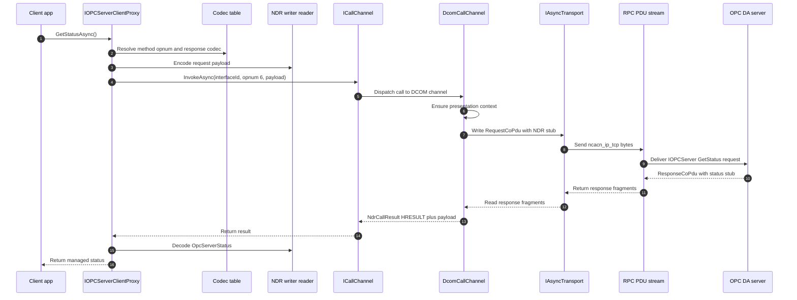

# Call shim flow

This sequence follows one outbound generated-proxy call, using `IOPCServer::GetStatus` as the example. The app calls the generated `GetStatusAsync` method and remains unaware of interface IDs, DCE/RPC opnums, PDU framing, or authentication verifiers.

The generated proxy body is emitted at compile time. It rents a buffer, writes request parameters with the generator codec table, calls `ICallChannel.InvokeAsync`, checks the returned HRESULT, and decodes response bytes through `NdrReader` before returning a managed `OpcServerStatus`.

`DcomCallChannel` owns the transport side of the call. It ensures a presentation context for the interface, builds a `RequestCoPdu`, writes it to the connected `IAsyncTransport` (for example `TcpClientTransport` from `DcomCallChannelFactory.ConnectTcpAsync` or `NcacnNpTransport` for SMB named pipes), reads one or more response fragments, and returns an `NdrCallResult` to the generated shim.

## ORPC envelope

Generated proxies pass only the method payload to `ICallChannel`. The DCOM channel adds the required [MS-DCOM] ORPC envelope centrally:

```text
RequestCoPdu.Stub  = ORPC_THIS  + method request payload
ResponseCoPdu.Stub = ORPC_THAT  + method response payload
```

`ORPC_THIS` carries COMVERSION 5.7, flags `0`, a causality GUID shared through `CausalityContext`, and a normally-null extension pointer. `ORPC_THAT` is read and stripped before the generated proxy decodes the response payload.



## Where to read more

- [`src\Opc.Classic.Da\Dcom\IOPCInterfaces.cs:29`](../../src/Opc.Classic.Da/Dcom/IOPCInterfaces.cs#L29-L45) defines `IOPCServer::GetStatus` with `[OpcMethod(6)]`.
- [`src\Opc.Classic.Generators\OpcProxyGenerator.cs:543`](../../src/Opc.Classic.Generators/OpcProxyGenerator.cs#L543-L620) emits marshalled `InvokeAsync` bodies.
- [`src\Opc.Classic.Generators\OpcProxyGenerator.cs:692`](../../src/Opc.Classic.Generators/OpcProxyGenerator.cs#L692-L760) emits codec writes and response reads from the generator codec table.
- [`src\Opc.Classic.Core\ICallChannel.cs:45`](../../src/Opc.Classic.Core/ICallChannel.cs#L45-L49) is the generated-shim call seam.
- [`src\Opc.Classic.Dcom\Transport\DcomCallChannel.cs:55`](../../src/Opc.Classic.Dcom/Transport/DcomCallChannel.cs#L55-L94) sends the DCE/RPC request and maps response or fault PDUs into `NdrCallResult`.
- [`src\Opc.Classic.Dcom\Transport\TcpClientTransport.cs:95`](../../src/Opc.Classic.Dcom/Transport/TcpClientTransport.cs#L95-L117) and [`DcomCallChannelFactory.cs:58`](../../src/Opc.Classic.Dcom/Transport/DcomCallChannelFactory.cs#L58-L69) are the direct TCP transport entry points.
- See also [`docs\ARCHITECTURE.md:157`](../ARCHITECTURE.md#L157-L168) and [`docs\ADOPTION.md:39`](../ADOPTION.md#L39-L79).
