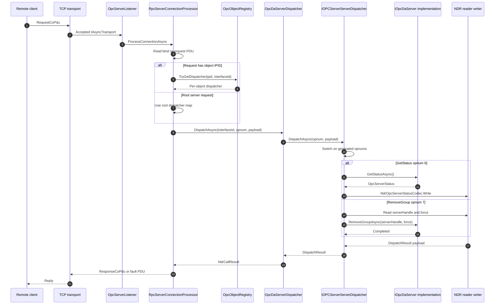

# Server dispatch flow

This diagram shows the server-side mirror of a generated client proxy. A TCP connection reaches `OpcServerListener`, the per-connection `RpcServerConnectionProcessor` reads DCE/RPC PDUs, and the request's interface ID, opnum, and optional object IPID route to the right generated dispatcher.

`OpcDaServerDispatcher.DispatchAsync` is the DA hosting adapter. It recognizes `IOPCServer.InterfaceId` and delegates to the source-generated `IOPCServerServerDispatcher`. For group, item, and enumerator calls that carry `PFC_OBJECT_UUID`, `OpcObjectRegistry` resolves the IPID to the per-object dispatcher map before the adapter/generator handoff.

The same adapter plus generated-dispatcher pattern exists for AE and HDA hosting, and generated dispatchers cover annotated `Opc.Classic.*` DCOM projections across the sub-spec packages. Keeping dispatch generated and explicit preserves OPC IDL opnums while avoiding reflection-based invocation in the portable server path.

## Where to read more

- [`src\Opc.Classic.Dcom\Transport\OpcServerListener.cs:41`](../../src/Opc.Classic.Dcom/Transport/OpcServerListener.cs#L41-L114) owns the TCP accept loop for managed servers.
- [`src\Opc.Classic.Dcom\Transport\RpcServerConnectionProcessor.cs:61`](../../src/Opc.Classic.Dcom/Transport/RpcServerConnectionProcessor.cs#L61-L120) reads PDUs and routes requests to dispatchers.
- [`src\Opc.Classic.Dcom\Transport\OpcObjectRegistry.cs:39`](../../src/Opc.Classic.Dcom/Transport/OpcObjectRegistry.cs#L39-L113) maps IPIDs to per-object dispatcher sets.
- [`src\Opc.Classic.Da\Hosting\OpcDaServerDispatcher.cs:13`](../../src/Opc.Classic.Da/Hosting/OpcDaServerDispatcher.cs#L13-L36) defines the DA adapter that delegates to the generated dispatcher.
- [`src\Opc.Classic.Generators\OpcServerDispatchGenerator.cs:350`](../../src/Opc.Classic.Generators/OpcServerDispatchGenerator.cs#L350-L390) emits the generated opnum switch.
- [`src\Opc.Classic.Generators\OpcServerDispatchGenerator.cs:427`](../../src/Opc.Classic.Generators/OpcServerDispatchGenerator.cs#L427-L559) emits request decoding, implementation calls, and response encoding.
- [`src\Opc.Classic.Da\Hosting\IOpcDaServer.cs:18`](../../src/Opc.Classic.Da/Hosting/IOpcDaServer.cs#L18-L43) is the managed implementation contract the dispatcher calls.
- [`src\Opc.Classic.Ae\Hosting\OpcAeServerDispatcher.cs:13`](../../src/Opc.Classic.Ae/Hosting/OpcAeServerDispatcher.cs#L13-L36) and [`src\Opc.Classic.Hda\Hosting\OpcHdaServerDispatcher.cs:13`](../../src/Opc.Classic.Hda/Hosting/OpcHdaServerDispatcher.cs#L13-L36) follow the same adapter shape for AE and HDA.
- See also [`docs\ARCHITECTURE.md:170`](../ARCHITECTURE.md#L170-L200).
