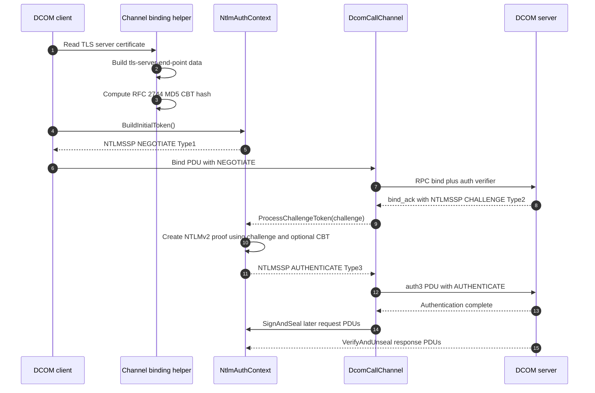

# NTLM handshake

This sequence shows the NTLMSSP handshake used by the DCOM authentication context. The client starts with a NEGOTIATE message, the server returns a CHALLENGE, and the client completes the exchange with an AUTHENTICATE message carrying NTLMv2 responses and negotiated flags.

`IAuthContext` gives `DcomCallChannel` a mechanism-neutral API: build the first bind token, process the server token, and then sign or seal later PDU bodies. The NTLM implementation adapts those calls to `Type1Message`, `Type2Message`, `Type3Message`, and the session-security object that signs and verifies DCE/RPC verifiers.

The diagram also includes the channel binding token path required by Extended Protection for Authentication. The shared `ChannelBindingsFactory` builds `tls-server-end-point` application data, and `ChannelBindingsHash` computes the RFC 2744 MD5 hash used by [MS-NLMP] for the `MsvAvChannelBindings` AV pair.

## Where to read more

- [`src\Opc.Classic.Core\IAuthContext.cs:13`](../../src/Opc.Classic.Core/IAuthContext.cs#L13-L39) defines the authentication seam used by DCOM channels.
- [`src\Opc.Classic.Dcom\rpc\Auth\NtlmAuthentication.cs:155`](../../src/Opc.Classic.Dcom/rpc/Auth/NtlmAuthentication.cs#L155-L220) adapts NTLM to `IAuthContext`, including `BuildInitialToken`, `ProcessChallengeToken`, `SignAndSeal`, and `VerifyAndUnseal`.
- [`src\Opc.Classic.Dcom\Common\Ntlm\Type1Message.cs:9`](../../src/Opc.Classic.Dcom/Common/Ntlm/Type1Message.cs#L9-L95), [`Type2Message.cs:9`](../../src/Opc.Classic.Dcom/Common/Ntlm/Type2Message.cs#L9-L151), and [`Type3Message.cs:10`](../../src/Opc.Classic.Dcom/Common/Ntlm/Type3Message.cs#L10-L129) model the three NTLMSSP messages.
- [`src\Opc.Classic.Core\Security\ChannelBindingsFactory.cs:12`](../../src/Opc.Classic.Core/Security/ChannelBindingsFactory.cs#L12-L58) and [`src\Opc.Classic.Core\Security\ChannelBindingsHash.cs:13`](../../src/Opc.Classic.Core/Security/ChannelBindingsHash.cs#L13-L70) implement CBT construction and hashing.
- Protocol references: [MS-NLMP](https://learn.microsoft.com/openspecs/windows_protocols/ms-nlmp/) and [`docs\cookbook\05-dcom-hardening-pkt-integrity-explainer.md:49`](../cookbook/05-dcom-hardening-pkt-integrity-explainer.md#L49-L53).
