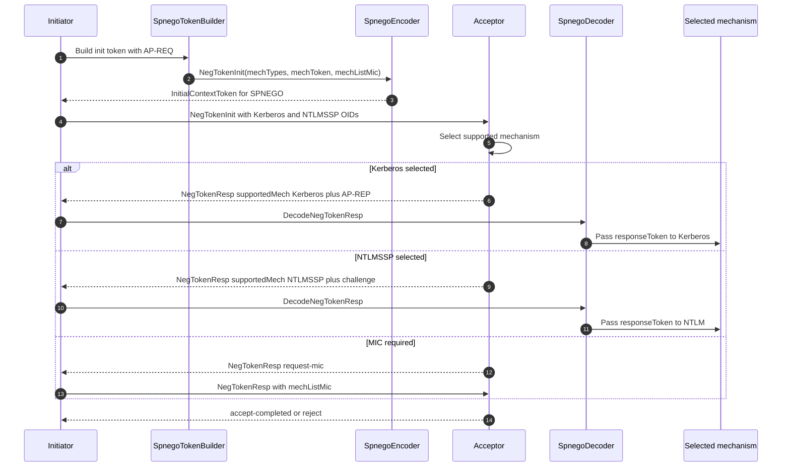

# SPNEGO negotiation

This sequence focuses on the SPNEGO wrapper rather than the underlying Kerberos or NTLM mechanism. The initiator sends `NegTokenInit` with an ordered mechanism list and, when Kerberos is preferred, an optimistic AP-REQ mechanism token.

The acceptor selects one mechanism and returns `NegTokenResp`. That response can carry `accept-incomplete` plus a mechanism response token, `accept-completed`, `request-mic`, or `reject`, matching the RFC 4178 negotiation state model.

In Opc.Classic, `SpnegoTokenBuilder` currently builds the common Kerberos-first, NTLMSSP-fallback initial token. `SpnegoEncoder` and `SpnegoDecoder` handle the DER shapes, while `KerberosAuthContext` feeds decoded response tokens back into the Kerberos AP-REP processing path.

## Where to read more

- [`src\Opc.Classic.Dcom.Kerberos\Spnego\SpnegoNegTokenInit.cs:11`](../../src/Opc.Classic.Dcom.Kerberos/Spnego/SpnegoNegTokenInit.cs#L11-L20) models RFC 4178 `NegTokenInit`.
- [`src\Opc.Classic.Dcom.Kerberos\Spnego\SpnegoNegTokenResp.cs:10`](../../src/Opc.Classic.Dcom.Kerberos/Spnego/SpnegoNegTokenResp.cs#L10-L21) models `NegTokenResp`.
- [`src\Opc.Classic.Dcom.Kerberos\Spnego\SpnegoOids.cs:11`](../../src/Opc.Classic.Dcom.Kerberos/Spnego/SpnegoOids.cs#L11-L27) defines the SPNEGO, Kerberos, and NTLMSSP OIDs.
- [`src\Opc.Classic.Dcom.Kerberos\Spnego\SpnegoEncoder.cs:14`](../../src/Opc.Classic.Dcom.Kerberos/Spnego/SpnegoEncoder.cs#L14-L72) and [`SpnegoDecoder.cs:14`](../../src/Opc.Classic.Dcom.Kerberos/Spnego/SpnegoDecoder.cs#L14-L120) encode and decode the DER tokens.
- Protocol references: [RFC 4178](https://www.rfc-editor.org/rfc/rfc4178) and [MS-SPNG](https://learn.microsoft.com/openspecs/windows_protocols/ms-spng/).
