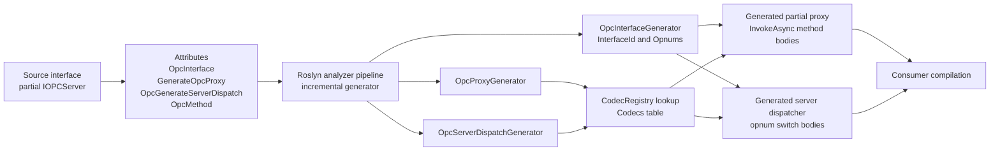

# Source generator pipeline

This flowchart shows the compile-time path for source-generated OPC projections. Source interfaces declare their DCOM identity and method opnums with `[OpcInterface]`, `[GenerateOpcProxy]`, `[OpcGenerateServerDispatch]`, and `[OpcMethod]` attributes.

Roslyn runs the generator package during compilation. `OpcInterfaceGenerator` emits interface metadata such as `InterfaceId` and nested `Opnums`; `OpcProxyGenerator` inspects annotated interfaces, validates supported method shapes, and maps parameter and return types through its codec table; and `OpcServerDispatchGenerator` emits server-side dispatchers for the same opnum tables. The current projection set covers 49 generated dispatchers and 228 annotated OPC opnums.

The outputs are generated partial client proxy classes and server dispatcher classes. Proxy method bodies allocate NDR buffers, emit direct codec calls, call `ICallChannel.InvokeAsync`, check HRESULTs, decode response payloads, and return managed values. Dispatcher bodies switch on generated opnum constants, decode request payloads, call managed implementations, and encode response payloads without runtime reflection or expression-tree compilation.

## Where to read more

- [`src\Opc.Classic.Da\Dcom\IOPCInterfaces.cs:29`](../../src/Opc.Classic.Da/Dcom/IOPCInterfaces.cs#L29-L55) shows an annotated `IOPCServer` projection with proxy and server-dispatch generation enabled.
- [`src\Opc.Classic.Generators\OpcInterfaceGenerator.cs:40`](../../src/Opc.Classic.Generators/OpcInterfaceGenerator.cs#L40-L130) defines the generated attributes and `OpcInterfaceGenerator` entry point.
- [`src\Opc.Classic.Generators\OpcProxyGenerator.cs:19`](../../src/Opc.Classic.Generators/OpcProxyGenerator.cs#L19-L43) defines the proxy generator and its generated `[GenerateOpcProxy]` attribute.
- [`src\Opc.Classic.Generators\OpcProxyGenerator.cs:55`](../../src/Opc.Classic.Generators/OpcProxyGenerator.cs#L55-L99) is the generator codec table.
- [`src\Opc.Classic.Generators\OpcProxyGenerator.cs:543`](../../src/Opc.Classic.Generators/OpcProxyGenerator.cs#L543-L620) emits generated `InvokeAsync` bodies.
- [`src\Opc.Classic.Generators\OpcServerDispatchGenerator.cs:320`](../../src/Opc.Classic.Generators/OpcServerDispatchGenerator.cs#L320-L347) emits generated dispatcher classes, and [`OpcServerDispatchGenerator.cs:350`](../../src/Opc.Classic.Generators/OpcServerDispatchGenerator.cs#L350-L390) emits their opnum switches.
- See also [`docs\ARCHITECTURE.md:135`](../ARCHITECTURE.md#L135-L168).
