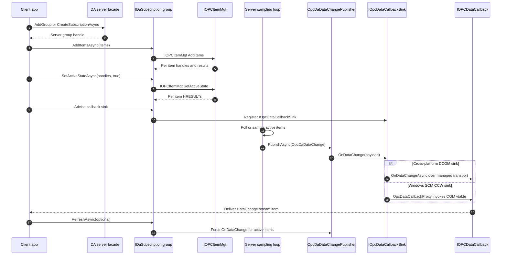

# Subscription data flow

This sequence shows the OPC DA subscription lifecycle. A client creates a group with `AddGroup`, adds items, activates them, and then receives batched `IOPCDataCallback::OnDataChange` notifications as values change or keep-alive heartbeats are emitted.

The managed public model names the server-side group as an `IDaSubscription`. Its `AddItemsAsync`, `SetActiveStateAsync`, `RefreshAsync`, and `DataChanges` stream map the COM subscription pattern into async .NET shapes.

On the hosting side, user code produces `OpcDaDataChange` batches and `OpcDaDataChangePublisher` fans those batches out to advised callback subscribers. `IOpcDataCallbackSink` is the unified server-side callback abstraction: cross-platform DCOM sinks marshal the payload back over the managed transport, while the Windows SCM CCW path uses `OpcDataCallbackProxy` to invoke the client-supplied COM vtable. The DCOM projection for `IOPCDataCallback` defines the wire-facing `OnDataChangeAsync` callback with transaction ID, group handle, values, qualities, timestamps, and per-item HRESULTs.

## Where to read more

- [`src\Opc.Classic.Da\SubscriptionState.cs:10`](../../src/Opc.Classic.Da/SubscriptionState.cs#L10-L83) describes DA group and subscription state, including active state and keep-alive.
- [`src\Opc.Classic.Da\IDaServer.cs:96`](../../src/Opc.Classic.Da/IDaServer.cs#L96-L100) creates managed DA subscriptions.
- [`src\Opc.Classic.Da\IDaSubscription.cs:14`](../../src/Opc.Classic.Da/IDaSubscription.cs#L14-L80) maps DA groups to async subscription operations and a `DataChanges` stream.
- [`src\Opc.Classic.Da\Dcom\IOPCInterfaces.cs:277`](../../src/Opc.Classic.Da/Dcom/IOPCInterfaces.cs#L277-L334) defines item management methods including `SetActiveState`.
- [`src\Opc.Classic.Da\Dcom\IOPCInterfaces.cs:575`](../../src/Opc.Classic.Da/Dcom/IOPCInterfaces.cs#L575-L625) defines `IOPCDataCallback::OnDataChange`.
- [`src\Opc.Classic.Da\Hosting\IOpcDaDataChangePublisher.cs:11`](../../src/Opc.Classic.Da/Hosting/IOpcDaDataChangePublisher.cs#L11-L22) and [`OpcDaDataChangePublisher.cs:19`](../../src/Opc.Classic.Da/Hosting/OpcDaDataChangePublisher.cs#L19-L83) implement callback fan-out.
- [`src\Opc.Classic.Da\Hosting\IOpcDataCallbackSink.cs:37`](../../src/Opc.Classic.Da/Hosting/IOpcDataCallbackSink.cs#L37-L55) is the unified callback sink abstraction.
- [`src\Opc.Classic.Da\Hosting\Windows\OpcDataCallbackProxy.cs:28`](../../src/Opc.Classic.Da/Hosting/Windows/OpcDataCallbackProxy.cs#L28-L76) implements the Windows CCW callback sink.
