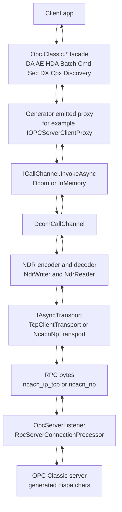
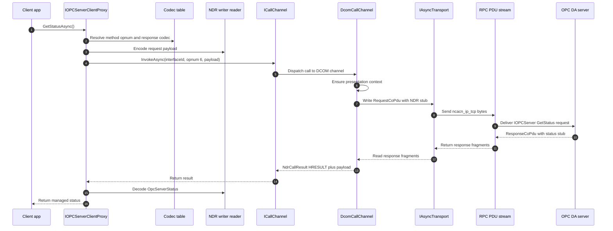
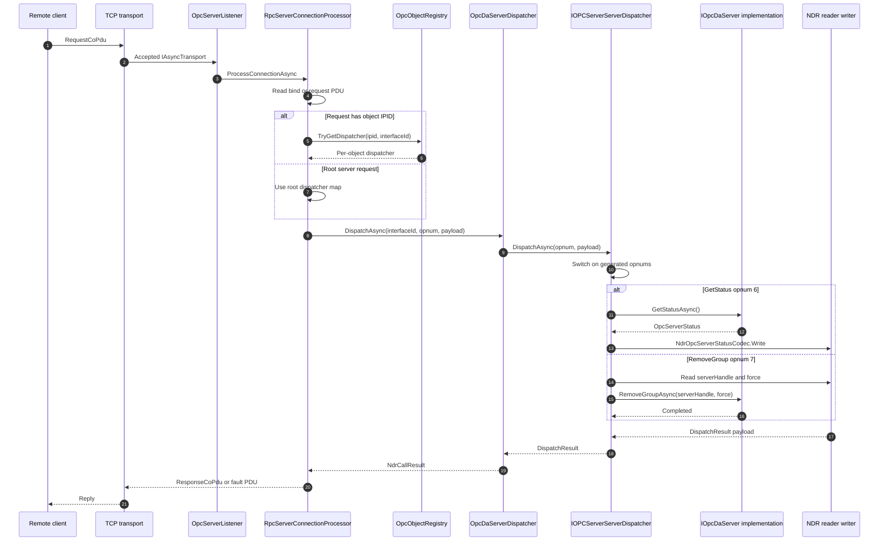
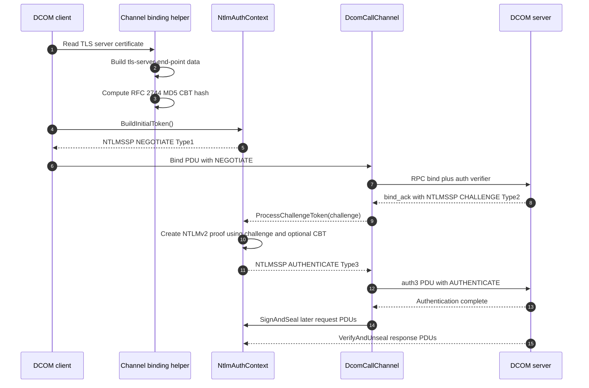
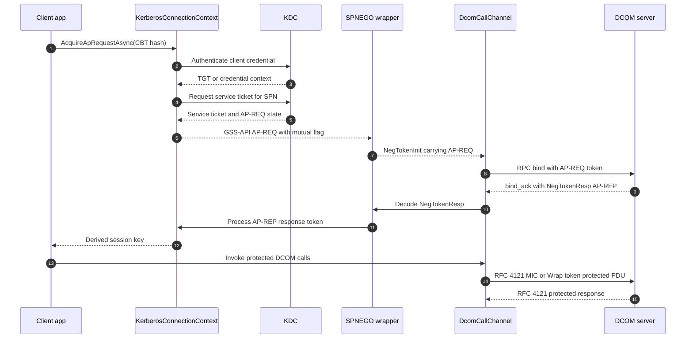
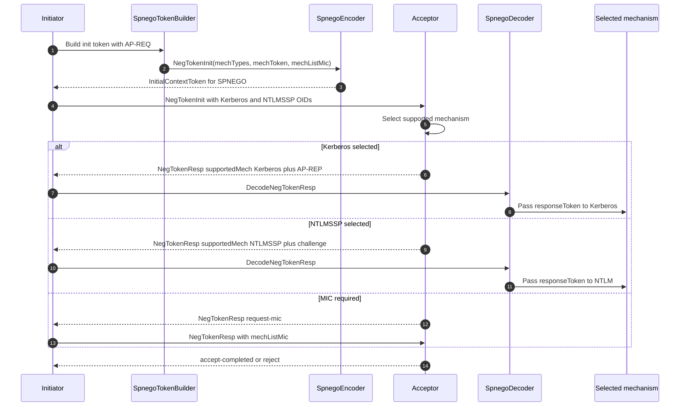
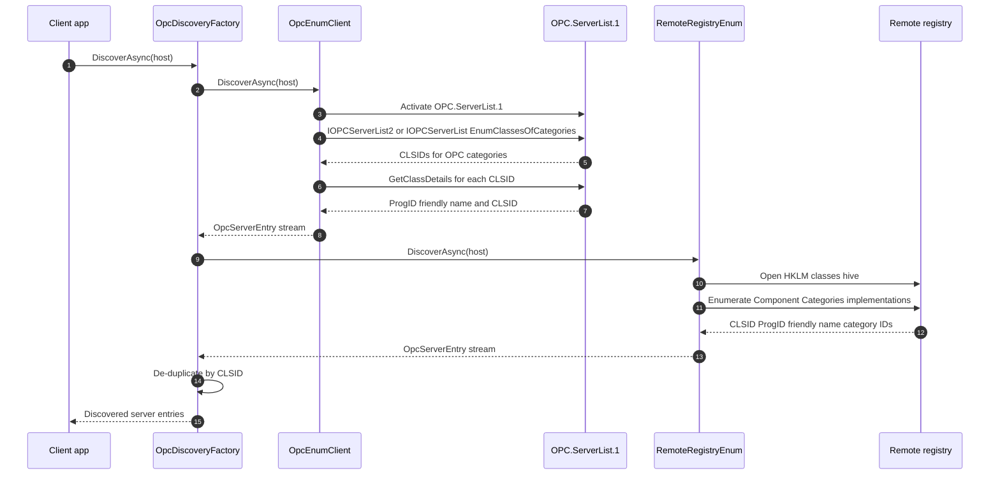
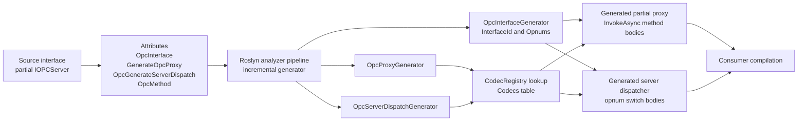
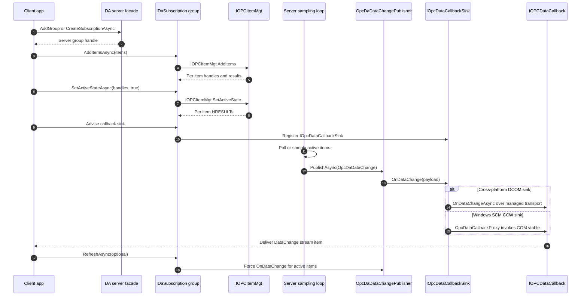
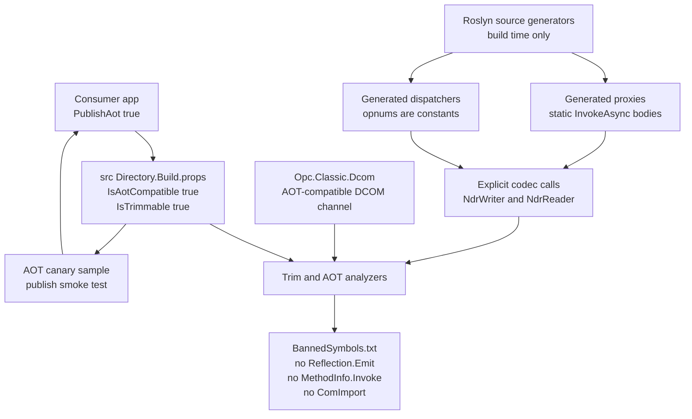

# Architecture diagrams

This page collects the architectural diagrams for `Opc.Classic.*`: source-generated client proxies and server dispatchers, `ICallChannel` with in-memory and DCOM implementations, channel-level NTLM/Kerberos/SPNEGO/CBT, NativeAOT-compatible libraries, and coverage across DA, AE, HDA, Batch, Commands, Security, DX, Cpx, and Discovery.

## High-level architecture

This diagram shows the portable OPC Classic path at the level most adopters encounter first. A client application talks to managed `Opc.Classic.*` facades and projection packages for DA, AE, HDA, Batch, Commands, Security, DX, Cpx, and Discovery instead of creating Windows COM runtime callable wrappers.

The facade delegates DCOM-shaped calls to generator-emitted proxies such as `IOPCServerClientProxy`. Those proxies use compile-time interface IDs, opnums, and codec emitters to produce NDR request payloads and decode NDR response payloads. Server hosting uses generated dispatchers for the matching interface/opnum tables.

`ICallChannel` is the seam between generated call shims and transport. Its implementations include `DcomCallChannel` for DCE/RPC over a pipelines-backed `IAsyncTransport` and `InMemoryCallChannel` for managed loopback. The DCOM channel binds to an interface, wraps payloads in DCE/RPC PDUs, applies channel-level authentication protection, and exchanges frames over the selected RPC sequence: direct TCP (`ncacn_ip_tcp`) through `TcpClientTransport` or named-pipe RPC (`ncacn_np`) through `NcacnNpTransport`. Direct TCP callers use `DcomCallChannelFactory.ConnectTcpAsync`; managed servers accept peers with `OpcServerListener` and route object IPIDs through `OpcObjectRegistry`.



### Where to read more

- [`src\Opc.Classic.Da\IDaServer.cs:33`](../../src/Opc.Classic.Da/IDaServer.cs#L33-L100), [`src\Opc.Classic.Ae\IAeServer.cs:16`](../../src/Opc.Classic.Ae/IAeServer.cs#L16-L65), and [`src\Opc.Classic.Hda\IHdaServer.cs:22`](../../src/Opc.Classic.Hda/IHdaServer.cs#L22-L90) define the managed facade shapes.
- [`src\Opc.Classic.Core\ICallChannel.cs:29`](../../src/Opc.Classic.Core/ICallChannel.cs#L29-L50) defines the transport-agnostic generated-proxy contract.
- [`src\Opc.Classic.Dcom\Transport\DcomCallChannel.cs:27`](../../src/Opc.Classic.Dcom/Transport/DcomCallChannel.cs#L27-L94) implements `ICallChannel` over DCE/RPC PDUs.
- [`src\Opc.Classic.Core\Testing\InMemoryCallChannel.cs:22`](../../src/Opc.Classic.Core/Testing/InMemoryCallChannel.cs#L22-L55) implements the managed loopback channel.
- [`src\Opc.Classic.Core\Ndr\NdrWriter.cs:36`](../../src/Opc.Classic.Core/Ndr/NdrWriter.cs#L36-L59) and [`src\Opc.Classic.Core\Ndr\NdrReader.cs:17`](../../src/Opc.Classic.Core/Ndr/NdrReader.cs#L17-L40) are the span-based NDR primitives.
- [`src\Opc.Classic.Core\Transport\IAsyncTransport.cs:14`](../../src/Opc.Classic.Core/Transport/IAsyncTransport.cs#L14-L34) describes the pipelines-backed transport contract.
- [`src\Opc.Classic.Dcom\Transport\TcpClientTransport.cs:35`](../../src/Opc.Classic.Dcom/Transport/TcpClientTransport.cs#L35-L117) and [`DcomCallChannelFactory.cs:58`](../../src/Opc.Classic.Dcom/Transport/DcomCallChannelFactory.cs#L58-L69) implement the direct TCP client path.
- [`src\Opc.Classic.Dcom\Transport\OpcServerListener.cs:41`](../../src/Opc.Classic.Dcom/Transport/OpcServerListener.cs#L41-L114) and [`RpcServerConnectionProcessor.cs:61`](../../src/Opc.Classic.Dcom/Transport/RpcServerConnectionProcessor.cs#L61-L120) implement the managed listener path.
- See also [`docs\ARCHITECTURE.md:35`](../ARCHITECTURE.md#L35-L63) and [`docs\ADOPTION.md:37`](../ADOPTION.md#L37-L79).

## Call shim flow

This sequence follows one outbound generated-proxy call, using `IOPCServer::GetStatus` as the example. The app calls the generated `GetStatusAsync` method and remains unaware of interface IDs, DCE/RPC opnums, PDU framing, or authentication verifiers.

The generated proxy body is emitted at compile time. It rents a buffer, writes request parameters with the generator codec table, calls `ICallChannel.InvokeAsync`, checks the returned HRESULT, and decodes response bytes through `NdrReader` before returning a managed `OpcServerStatus`.

`DcomCallChannel` owns the transport side of the call. It ensures a presentation context for the interface, builds a `RequestCoPdu`, writes it to the connected `IAsyncTransport` (for example `TcpClientTransport` from `DcomCallChannelFactory.ConnectTcpAsync` or `NcacnNpTransport` for SMB named pipes), reads one or more response fragments, and returns an `NdrCallResult` to the generated shim.

### ORPC envelope

Generated proxies pass only the method payload to `ICallChannel`. The DCOM channel adds the required [MS-DCOM] ORPC envelope centrally:

```text
RequestCoPdu.Stub  = ORPC_THIS  + method request payload
ResponseCoPdu.Stub = ORPC_THAT  + method response payload
```

`ORPC_THIS` carries COMVERSION 5.7, flags `0`, a causality GUID shared through `CausalityContext`, and a normally-null extension pointer. `ORPC_THAT` is read and stripped before the generated proxy decodes the response payload.



### Where to read more

- [`src\Opc.Classic.Da\Dcom\IOPCInterfaces.cs:29`](../../src/Opc.Classic.Da/Dcom/IOPCInterfaces.cs#L29-L45) defines `IOPCServer::GetStatus` with `[OpcMethod(6)]`.
- [`src\Opc.Classic.Generators\OpcProxyGenerator.cs:543`](../../src/Opc.Classic.Generators/OpcProxyGenerator.cs#L543-L620) emits marshalled `InvokeAsync` bodies.
- [`src\Opc.Classic.Generators\OpcProxyGenerator.cs:692`](../../src/Opc.Classic.Generators/OpcProxyGenerator.cs#L692-L760) emits codec writes and response reads from the generator codec table.
- [`src\Opc.Classic.Core\ICallChannel.cs:45`](../../src/Opc.Classic.Core/ICallChannel.cs#L45-L49) is the generated-shim call seam.
- [`src\Opc.Classic.Dcom\Transport\DcomCallChannel.cs:55`](../../src/Opc.Classic.Dcom/Transport/DcomCallChannel.cs#L55-L94) sends the DCE/RPC request and maps response or fault PDUs into `NdrCallResult`.
- [`src\Opc.Classic.Dcom\Transport\TcpClientTransport.cs:95`](../../src/Opc.Classic.Dcom/Transport/TcpClientTransport.cs#L95-L117) and [`DcomCallChannelFactory.cs:58`](../../src/Opc.Classic.Dcom/Transport/DcomCallChannelFactory.cs#L58-L69) are the direct TCP transport entry points.
- See also [`docs\ARCHITECTURE.md:157`](../ARCHITECTURE.md#L157-L168) and [`docs\ADOPTION.md:39`](../ADOPTION.md#L39-L79).

## Server dispatch flow

This diagram shows the server-side mirror of a generated client proxy. A TCP connection reaches `OpcServerListener`, the per-connection `RpcServerConnectionProcessor` reads DCE/RPC PDUs, and the request's interface ID, opnum, and optional object IPID route to the right generated dispatcher.

`OpcDaServerDispatcher.DispatchAsync` is the DA hosting adapter. It recognizes `IOPCServer.InterfaceId` and delegates to the source-generated `IOPCServerServerDispatcher`. For group, item, and enumerator calls that carry `PFC_OBJECT_UUID`, `OpcObjectRegistry` resolves the IPID to the per-object dispatcher map before the adapter/generator handoff.

The same adapter plus generated-dispatcher pattern exists for AE and HDA hosting, and generated dispatchers cover annotated `Opc.Classic.*` DCOM projections across the sub-spec packages. Keeping dispatch generated and explicit preserves OPC IDL opnums while avoiding reflection-based invocation in the portable server path.



### Where to read more

- [`src\Opc.Classic.Dcom\Transport\OpcServerListener.cs:41`](../../src/Opc.Classic.Dcom/Transport/OpcServerListener.cs#L41-L114) owns the TCP accept loop for managed servers.
- [`src\Opc.Classic.Dcom\Transport\RpcServerConnectionProcessor.cs:61`](../../src/Opc.Classic.Dcom/Transport/RpcServerConnectionProcessor.cs#L61-L120) reads PDUs and routes requests to dispatchers.
- [`src\Opc.Classic.Dcom\Transport\OpcObjectRegistry.cs:39`](../../src/Opc.Classic.Dcom/Transport/OpcObjectRegistry.cs#L39-L113) maps IPIDs to per-object dispatcher sets.
- [`src\Opc.Classic.Da\Hosting\OpcDaServerDispatcher.cs:13`](../../src/Opc.Classic.Da/Hosting/OpcDaServerDispatcher.cs#L13-L36) defines the DA adapter that delegates to the generated dispatcher.
- [`src\Opc.Classic.Generators\OpcServerDispatchGenerator.cs:350`](../../src/Opc.Classic.Generators/OpcServerDispatchGenerator.cs#L350-L390) emits the generated opnum switch.
- [`src\Opc.Classic.Generators\OpcServerDispatchGenerator.cs:427`](../../src/Opc.Classic.Generators/OpcServerDispatchGenerator.cs#L427-L559) emits request decoding, implementation calls, and response encoding.
- [`src\Opc.Classic.Da\Hosting\IOpcDaServer.cs:18`](../../src/Opc.Classic.Da/Hosting/IOpcDaServer.cs#L18-L43) is the managed implementation contract the dispatcher calls.
- [`src\Opc.Classic.Ae\Hosting\OpcAeServerDispatcher.cs:13`](../../src/Opc.Classic.Ae/Hosting/OpcAeServerDispatcher.cs#L13-L36) and [`src\Opc.Classic.Hda\Hosting\OpcHdaServerDispatcher.cs:13`](../../src/Opc.Classic.Hda/Hosting/OpcHdaServerDispatcher.cs#L13-L36) follow the same adapter shape for AE and HDA.
- See also [`docs\ARCHITECTURE.md:170`](../ARCHITECTURE.md#L170-L200).

## NTLM handshake

This sequence shows the NTLMSSP handshake used by the DCOM authentication context. The client starts with a NEGOTIATE message, the server returns a CHALLENGE, and the client completes the exchange with an AUTHENTICATE message carrying NTLMv2 responses and negotiated flags.

`IAuthContext` gives `DcomCallChannel` a mechanism-neutral API: build the first bind token, process the server token, and then sign or seal later PDU bodies. The NTLM implementation adapts those calls to `Type1Message`, `Type2Message`, `Type3Message`, and the session-security object that signs and verifies DCE/RPC verifiers.

The diagram also includes the channel binding token path required by Extended Protection for Authentication. The shared `ChannelBindingsFactory` builds `tls-server-end-point` application data, and `ChannelBindingsHash` computes the RFC 2744 MD5 hash used by [MS-NLMP] for the `MsvAvChannelBindings` AV pair.



### Where to read more

- [`src\Opc.Classic.Core\IAuthContext.cs:13`](../../src/Opc.Classic.Core/IAuthContext.cs#L13-L39) defines the authentication seam used by DCOM channels.
- [`src\Opc.Classic.Dcom\rpc\Auth\NtlmAuthentication.cs:155`](../../src/Opc.Classic.Dcom/rpc/Auth/NtlmAuthentication.cs#L155-L220) adapts NTLM to `IAuthContext`, including `BuildInitialToken`, `ProcessChallengeToken`, `SignAndSeal`, and `VerifyAndUnseal`.
- [`src\Opc.Classic.Dcom\Common\Ntlm\Type1Message.cs:9`](../../src/Opc.Classic.Dcom/Common/Ntlm/Type1Message.cs#L9-L95), [`Type2Message.cs:9`](../../src/Opc.Classic.Dcom/Common/Ntlm/Type2Message.cs#L9-L151), and [`Type3Message.cs:10`](../../src/Opc.Classic.Dcom/Common/Ntlm/Type3Message.cs#L10-L129) model the three NTLMSSP messages.
- [`src\Opc.Classic.Core\Security\ChannelBindingsFactory.cs:12`](../../src/Opc.Classic.Core/Security/ChannelBindingsFactory.cs#L12-L58) and [`src\Opc.Classic.Core\Security\ChannelBindingsHash.cs:13`](../../src/Opc.Classic.Core/Security/ChannelBindingsHash.cs#L13-L70) implement CBT construction and hashing.
- Protocol references: [MS-NLMP](https://learn.microsoft.com/openspecs/windows_protocols/ms-nlmp/) and [`docs\cookbook\05-dcom-hardening-pkt-integrity-explainer.md:49`](../cookbook/05-dcom-hardening-pkt-integrity-explainer.md#L49-L53).

## Kerberos handshake

This diagram shows the Kerberos path used when DCOM authentication is backed by Kerberos and SPNEGO. The client acquires a service ticket for the configured SPN, emits an AP-REQ in a GSS-API token, and requests mutual authentication so the server must answer with AP-REP.

`KerberosConnectionContext` owns the ticket acquisition and AP-REP processing state. `KerberosAuthContext` wraps that state behind `IAuthContext`, computes optional channel-binding hashes, wraps the AP-REQ in a SPNEGO initial token, and unwraps the server's response token from `NegTokenResp`.

The final packet-protection stage uses RFC 4121 GSS-API wrap and MIC tokens through `KerberosSession`. `KerberosAuthContext.SignAndSeal` and `VerifyAndUnseal` call that session for DCE/RPC packet integrity or privacy after AP-REQ/AP-REP establishes the key.



### Where to read more

- [`src\Opc.Classic.Dcom.Kerberos\KerberosAuthContext.cs:67`](../../src/Opc.Classic.Dcom.Kerberos/KerberosAuthContext.cs#L67-L99) adapts Kerberos/SPNEGO tokens to `IAuthContext`, and [`KerberosAuthContext.cs:142`](../../src/Opc.Classic.Dcom.Kerberos/KerberosAuthContext.cs#L142-L198) applies packet protection.
- [`src\Opc.Classic.Dcom.Kerberos\KerberosConnectionContext.cs:61`](../../src/Opc.Classic.Dcom.Kerberos/KerberosConnectionContext.cs#L61-L104) acquires AP-REQ tokens, requests mutual authentication, and processes AP-REP tokens.
- [`src\Opc.Classic.Dcom.Kerberos\IKerberosConnectionContext.cs:15`](../../src/Opc.Classic.Dcom.Kerberos/IKerberosConnectionContext.cs#L15-L37) defines the AP-REQ and AP-REP abstraction.
- [`src\Opc.Classic.Dcom.Kerberos\Spnego\SpnegoTokenBuilder.cs:13`](../../src/Opc.Classic.Dcom.Kerberos/Spnego/SpnegoTokenBuilder.cs#L13-L28) wraps Kerberos AP-REQ tokens in SPNEGO.
- [`src\Opc.Classic.Dcom.Kerberos\KerberosSession.cs:87`](../../src/Opc.Classic.Dcom.Kerberos/KerberosSession.cs#L87-L123) implements RFC 4121 wrap and unwrap tokens.
- Protocol references: [MS-KILE](https://learn.microsoft.com/openspecs/windows_protocols/ms-kile/) and [`docs\cookbook\03-kerberos-in-active-directory.md:36`](../cookbook/03-kerberos-in-active-directory.md#L36-L52).

## SPNEGO negotiation

This sequence focuses on the SPNEGO wrapper rather than the underlying Kerberos or NTLM mechanism. The initiator sends `NegTokenInit` with an ordered mechanism list and, when Kerberos is preferred, an optimistic AP-REQ mechanism token.

The acceptor selects one mechanism and returns `NegTokenResp`. That response can carry `accept-incomplete` plus a mechanism response token, `accept-completed`, `request-mic`, or `reject`, matching the RFC 4178 negotiation state model.

In Opc.Classic, `SpnegoTokenBuilder` currently builds the common Kerberos-first, NTLMSSP-fallback initial token. `SpnegoEncoder` and `SpnegoDecoder` handle the DER shapes, while `KerberosAuthContext` feeds decoded response tokens back into the Kerberos AP-REP processing path.



### Where to read more

- [`src\Opc.Classic.Dcom.Kerberos\Spnego\SpnegoNegTokenInit.cs:11`](../../src/Opc.Classic.Dcom.Kerberos/Spnego/SpnegoNegTokenInit.cs#L11-L20) models RFC 4178 `NegTokenInit`.
- [`src\Opc.Classic.Dcom.Kerberos\Spnego\SpnegoNegTokenResp.cs:10`](../../src/Opc.Classic.Dcom.Kerberos/Spnego/SpnegoNegTokenResp.cs#L10-L21) models `NegTokenResp`.
- [`src\Opc.Classic.Dcom.Kerberos\Spnego\SpnegoOids.cs:11`](../../src/Opc.Classic.Dcom.Kerberos/Spnego/SpnegoOids.cs#L11-L27) defines the SPNEGO, Kerberos, and NTLMSSP OIDs.
- [`src\Opc.Classic.Dcom.Kerberos\Spnego\SpnegoEncoder.cs:14`](../../src/Opc.Classic.Dcom.Kerberos/Spnego/SpnegoEncoder.cs#L14-L72) and [`SpnegoDecoder.cs:14`](../../src/Opc.Classic.Dcom.Kerberos/Spnego/SpnegoDecoder.cs#L14-L120) encode and decode the DER tokens.
- Protocol references: [RFC 4178](https://www.rfc-editor.org/rfc/rfc4178) and [MS-SPNG](https://learn.microsoft.com/openspecs/windows_protocols/ms-spng/).

## Discovery flow

This diagram shows current OPC Classic server discovery. `IOpcDiscovery` is the shared async contract, and `OpcDiscoveryFactory` composes multiple discovery strategies, isolates transport or authorization failures per strategy, and de-duplicates results by CLSID.

The OPCEnum path activates the standard `OPC.ServerList.1` DCOM server, prefers `IOPCServerList2` when available, uses `ICallChannel` shims for `EnumClassesOfCategories`, `GetClassDetails`, and `IOPCEnumGUID::Next`, and maps descriptors to `OpcServerEntry` values.

The remote-registry path enumerates OPC category registrations from a target machine's registry through the managed WINREG reader over SMB/ncacn_np. It returns `OpcServerEntry` values from CLSID, ProgID, friendly-name, and category metadata, while `OpcDiscoveryFactory` isolates per-strategy failures.



### Where to read more

- [`src\Opc.Classic.Discovery\IOpcDiscovery.cs:14`](../../src/Opc.Classic.Discovery/IOpcDiscovery.cs#L14-L22) defines the shared async discovery contract.
- [`src\Opc.Classic.Discovery\OpcDiscoveryFactory.cs:36`](../../src/Opc.Classic.Discovery/OpcDiscoveryFactory.cs#L36-L53) composes strategies and de-duplicates by CLSID; [`OpcDiscoveryFactory.cs:56`](../../src/Opc.Classic.Discovery/OpcDiscoveryFactory.cs#L56-L93) isolates per-strategy failures.
- [`src\Opc.Classic.Discovery\OpcEnumClient.cs:88`](../../src/Opc.Classic.Discovery/OpcEnumClient.cs#L88-L118) activates OPCEnum and selects the server-list interface; [`OpcEnumClient.cs:145`](../../src/Opc.Classic.Discovery/OpcEnumClient.cs#L145-L190) maps server-list results into descriptors.
- [`src\Opc.Classic.Discovery\OpcEnumDcomInterfaces.cs:16`](../../src/Opc.Classic.Discovery/OpcEnumDcomInterfaces.cs#L16-L96) contains the OPCEnum `ICallChannel` shims for `IOPCServerList` and `IOPCServerList2`.
- [`src\Opc.Classic.Da\Dcom\IOPCInterfaces.cs:632`](../../src/Opc.Classic.Da/Dcom/IOPCInterfaces.cs#L632-L680) defines `IOPCEnumGUID`, `IOPCServerList`, and `IOPCServerList2` projections.
- [`src\Opc.Classic.Discovery\RemoteRegistryEnum.cs:94`](../../src/Opc.Classic.Discovery/RemoteRegistryEnum.cs#L94-L162) enumerates registry entries, and [`RemoteRegistryEnum.cs:165`](../../src/Opc.Classic.Discovery/RemoteRegistryEnum.cs#L165-L243) reads category and CLSID metadata.
- [`src\Opc.Classic.Dcom\Winreg\WinRegClient.cs:21`](../../src/Opc.Classic.Dcom/Winreg/WinRegClient.cs#L21-L50), [`RemoteRegistryEnum.cs:336`](../../src/Opc.Classic.Discovery/RemoteRegistryEnum.cs#L336-L394), and [`NcacnNpTransport.cs:53`](../../src/Opc.Classic.Dcom/Transport/NcacnNpTransport.cs#L53-L85) show the `ncacn_np` / `\\PIPE\\winreg` path.
- See also [`docs\ARCHITECTURE.md:216`](../ARCHITECTURE.md#L216-L236) and [`docs\ADOPTION.md:242`](../ADOPTION.md#L242-L280).

## Source generator pipeline

This flowchart shows the compile-time path for source-generated OPC projections. Source interfaces declare their DCOM identity and method opnums with `[OpcInterface]`, `[GenerateOpcProxy]`, `[OpcGenerateServerDispatch]`, and `[OpcMethod]` attributes.

Roslyn runs the generator package during compilation. `OpcInterfaceGenerator` emits interface metadata such as `InterfaceId` and nested `Opnums`; `OpcProxyGenerator` inspects annotated interfaces, validates supported method shapes, and maps parameter and return types through its codec table; and `OpcServerDispatchGenerator` emits server-side dispatchers for the same opnum tables. The current projection set covers 49 generated dispatchers and 228 annotated OPC opnums.

The outputs are generated partial client proxy classes and server dispatcher classes. Proxy method bodies allocate NDR buffers, emit direct codec calls, call `ICallChannel.InvokeAsync`, check HRESULTs, decode response payloads, and return managed values. Dispatcher bodies switch on generated opnum constants, decode request payloads, call managed implementations, and encode response payloads without runtime reflection or expression-tree compilation.



### Where to read more

- [`src\Opc.Classic.Da\Dcom\IOPCInterfaces.cs:29`](../../src/Opc.Classic.Da/Dcom/IOPCInterfaces.cs#L29-L55) shows an annotated `IOPCServer` projection with proxy and server-dispatch generation enabled.
- [`src\Opc.Classic.Generators\OpcInterfaceGenerator.cs:40`](../../src/Opc.Classic.Generators/OpcInterfaceGenerator.cs#L40-L130) defines the generated attributes and `OpcInterfaceGenerator` entry point.
- [`src\Opc.Classic.Generators\OpcProxyGenerator.cs:19`](../../src/Opc.Classic.Generators/OpcProxyGenerator.cs#L19-L43) defines the proxy generator and its generated `[GenerateOpcProxy]` attribute.
- [`src\Opc.Classic.Generators\OpcProxyGenerator.cs:55`](../../src/Opc.Classic.Generators/OpcProxyGenerator.cs#L55-L99) is the generator codec table.
- [`src\Opc.Classic.Generators\OpcProxyGenerator.cs:543`](../../src/Opc.Classic.Generators/OpcProxyGenerator.cs#L543-L620) emits generated `InvokeAsync` bodies.
- [`src\Opc.Classic.Generators\OpcServerDispatchGenerator.cs:320`](../../src/Opc.Classic.Generators/OpcServerDispatchGenerator.cs#L320-L347) emits generated dispatcher classes, and [`OpcServerDispatchGenerator.cs:350`](../../src/Opc.Classic.Generators/OpcServerDispatchGenerator.cs#L350-L390) emits their opnum switches.
- See also [`docs\ARCHITECTURE.md:135`](../ARCHITECTURE.md#L135-L168).

## Subscription data flow

This sequence shows the OPC DA subscription lifecycle. A client creates a group with `AddGroup`, adds items, activates them, and then receives batched `IOPCDataCallback::OnDataChange` notifications as values change or keep-alive heartbeats are emitted.

The managed public model names the server-side group as an `IDaSubscription`. Its `AddItemsAsync`, `SetActiveStateAsync`, `RefreshAsync`, and `DataChanges` stream map the COM subscription pattern into async .NET shapes.

On the hosting side, user code produces `OpcDaDataChange` batches and `OpcDaDataChangePublisher` fans those batches out to advised callback subscribers. `IOpcDataCallbackSink` is the unified server-side callback abstraction: cross-platform DCOM sinks marshal the payload back over the managed transport, while the Windows SCM CCW path uses `OpcDataCallbackProxy` to invoke the client-supplied COM vtable. The DCOM projection for `IOPCDataCallback` defines the wire-facing `OnDataChangeAsync` callback with transaction ID, group handle, values, qualities, timestamps, and per-item HRESULTs.



### Where to read more

- [`src\Opc.Classic.Da\SubscriptionState.cs:10`](../../src/Opc.Classic.Da/SubscriptionState.cs#L10-L83) describes DA group and subscription state, including active state and keep-alive.
- [`src\Opc.Classic.Da\IDaServer.cs:96`](../../src/Opc.Classic.Da/IDaServer.cs#L96-L100) creates managed DA subscriptions.
- [`src\Opc.Classic.Da\IDaSubscription.cs:14`](../../src/Opc.Classic.Da/IDaSubscription.cs#L14-L80) maps DA groups to async subscription operations and a `DataChanges` stream.
- [`src\Opc.Classic.Da\Dcom\IOPCInterfaces.cs:277`](../../src/Opc.Classic.Da/Dcom/IOPCInterfaces.cs#L277-L334) defines item management methods including `SetActiveState`.
- [`src\Opc.Classic.Da\Dcom\IOPCInterfaces.cs:575`](../../src/Opc.Classic.Da/Dcom/IOPCInterfaces.cs#L575-L625) defines `IOPCDataCallback::OnDataChange`.
- [`src\Opc.Classic.Da\Hosting\IOpcDaDataChangePublisher.cs:11`](../../src/Opc.Classic.Da/Hosting/IOpcDaDataChangePublisher.cs#L11-L22) and [`OpcDaDataChangePublisher.cs:19`](../../src/Opc.Classic.Da/Hosting/OpcDaDataChangePublisher.cs#L19-L83) implement callback fan-out.
- [`src\Opc.Classic.Da\Hosting\IOpcDataCallbackSink.cs:37`](../../src/Opc.Classic.Da/Hosting/IOpcDataCallbackSink.cs#L37-L55) is the unified callback sink abstraction.
- [`src\Opc.Classic.Da\Hosting\Windows\OpcDataCallbackProxy.cs:28`](../../src/Opc.Classic.Da/Hosting/Windows/OpcDataCallbackProxy.cs#L28-L76) implements the Windows CCW callback sink.

## AOT and trimming shape

This diagram shows what the trimmer and NativeAOT compiler see in the portable `src/*` libraries. The design goal is static, analyzable code: generated proxies and dispatchers call known methods and codecs directly rather than reflecting over interface metadata at runtime.

`src/Directory.Build.props` enables AOT and trimming analyzers for source projects, and `src/BannedSymbols.txt` blocks the dynamic patterns that would hide code from the trimmer. The Roslyn generator assembly itself is build-time only, so it opts out of AOT properties while keeping its emitted output AOT-safe.

`Opc.Classic.Dcom` participates in the current AOT shape. Its channel-level DCOM transport, packet protection, source-generated shims and dispatchers, and explicit codecs keep the runtime path statically visible to analyzers and NativeAOT.



### Where to read more

- [`src\Directory.Build.props:27`](../../src/Directory.Build.props#L27-L34) sets `IsAotCompatible`, `IsTrimmable`, and analyzer properties for source assemblies.
- [`src\BannedSymbols.txt:1`](../../src/BannedSymbols.txt#L1-L37) lists banned reflection, expression compilation, COM RCW, and native marshal patterns.
- [`src\Opc.Classic.Generators\Opc.Classic.Generators.csproj:3`](../../src/Opc.Classic.Generators/Opc.Classic.Generators.csproj#L3-L42) explains why generators are build-time only and why their output must be AOT-safe.
- [`src\Opc.Classic.Dcom\Opc.Classic.Dcom.csproj:3`](../../src/Opc.Classic.Dcom/Opc.Classic.Dcom.csproj#L3-L8) defines the pure-managed DCOM assembly identity, and [`DcomCallChannel.cs:240`](../../src/Opc.Classic.Dcom/Transport/DcomCallChannel.cs#L240-L255) shows channel-level packet protection.
- [`samples\Opc.Classic.Samples.AotCanary\Opc.Classic.Samples.AotCanary.csproj:1`](../../samples/Opc.Classic.Samples.AotCanary/Opc.Classic.Samples.AotCanary.csproj#L1-L11) and [`Program.cs:21`](../../samples/Opc.Classic.Samples.AotCanary/Program.cs#L21-L30) show the AOT smoke sample.
- See also [`docs\ARCHITECTURE.md:281`](../ARCHITECTURE.md#L281-L292) and [`docs\ADOPTION.md:302`](../ADOPTION.md#L302-L312).
