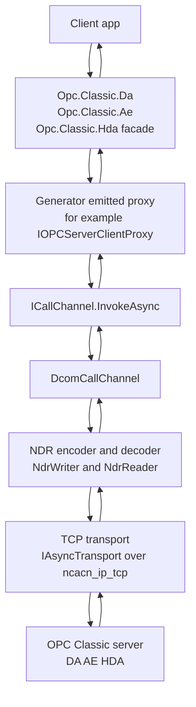

# High-level architecture

This diagram shows the portable OPC Classic client path at the level most adopters encounter first. A client application talks to the managed DA, AE, or HDA facade (`IDaServer`, `IAeServer`, or `IHdaServer`) instead of creating Windows COM runtime callable wrappers.

The facade delegates DCOM-shaped calls to generator-emitted proxies such as `IOPCServerClientProxy`. Those proxies use compile-time interface IDs, opnums, and codec emitters to produce NDR request payloads and decode NDR response payloads.

`ICallChannel` is the seam between generated call shims and transport. The production DCOM implementation is `DcomCallChannel`, which binds to an interface, wraps payloads in DCE/RPC PDUs, applies authentication protection, and exchanges frames over a pipelines-backed `IAsyncTransport` intended for `ncacn_ip_tcp` transport.

## Where to read more

- [`src\Opc.Classic.Da\IDaServer.cs:33`](../../src/Opc.Classic.Da/IDaServer.cs#L33-L100), [`src\Opc.Classic.Ae\IAeServer.cs:16`](../../src/Opc.Classic.Ae/IAeServer.cs#L16-L65), and [`src\Opc.Classic.Hda\IHdaServer.cs:22`](../../src/Opc.Classic.Hda/IHdaServer.cs#L22-L90) define the managed facade shapes.
- [`src\Opc.Classic.Core\ICallChannel.cs:29`](../../src/Opc.Classic.Core/ICallChannel.cs#L29-L50) defines the transport-agnostic generated-proxy contract.
- [`src\Opc.Classic.Dcom\Transport\DcomCallChannel.cs:27`](../../src/Opc.Classic.Dcom/Transport/DcomCallChannel.cs#L27-L94) implements `ICallChannel` over DCE/RPC PDUs.
- [`src\Opc.Classic.Core\Ndr\NdrWriter.cs:36`](../../src/Opc.Classic.Core/Ndr/NdrWriter.cs#L36-L59) and [`src\Opc.Classic.Core\Ndr\NdrReader.cs:17`](../../src/Opc.Classic.Core/Ndr/NdrReader.cs#L17-L40) are the span-based NDR primitives.
- [`src\Opc.Classic.Core\Transport\IAsyncTransport.cs:14`](../../src/Opc.Classic.Core/Transport/IAsyncTransport.cs#L14-L34) describes the pipelines-backed transport contract.
- See also [`docs\ARCHITECTURE.md:35`](../ARCHITECTURE.md#L35-L63) and [`docs\ADOPTION.md:37`](../ADOPTION.md#L37-L79).
