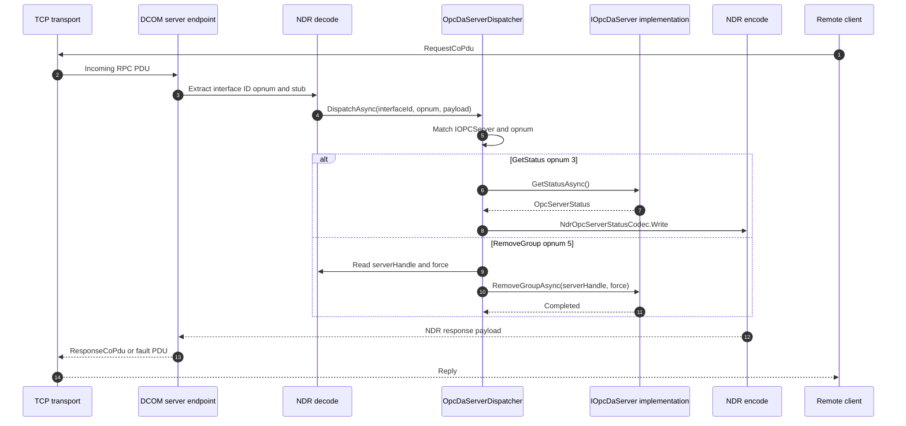

# Server dispatch flow

This diagram shows the server-side mirror of a generated client proxy. A DCE/RPC request arrives with an interface ID, opnum, and NDR stub, then the per-spec dispatcher routes it to managed server code.

`OpcDaServerDispatcher.DispatchAsync` is the DA example. It recognizes `IOPCServer.InterfaceId`, switches on the opnum, decodes request parameters with `NdrReader` when needed, calls the `IOpcDaServer` implementation, and writes the response with `NdrWriter` or a spec codec.

The same pattern exists for AE and HDA dispatchers. Keeping dispatch table-driven and explicit preserves OPC IDL opnums while avoiding reflection-based invocation in the portable server path.

## Where to read more

- [`src\Opc.Classic.Da\Hosting\OpcDaServerDispatcher.cs:16`](../../src/Opc.Classic.Da/Hosting/OpcDaServerDispatcher.cs#L16-L55) defines the default DA per-method dispatcher and its opnum switch.
- [`src\Opc.Classic.Da\Hosting\OpcDaServerDispatcher.cs:60`](../../src/Opc.Classic.Da/Hosting/OpcDaServerDispatcher.cs#L60-L95) shows `GetStatus`, `RemoveGroup`, and `GetErrorString` decoding and response writing.
- [`src\Opc.Classic.Da\Hosting\IOpcDaServer.cs:17`](../../src/Opc.Classic.Da/Hosting/IOpcDaServer.cs#L17-L45) is the managed implementation contract the dispatcher calls.
- [`src\Opc.Classic.Ae\Hosting\OpcAeServerDispatcher.cs:16`](../../src/Opc.Classic.Ae/Hosting/OpcAeServerDispatcher.cs#L16-L65) and [`src\Opc.Classic.Hda\Hosting\OpcHdaServerDispatcher.cs:15`](../../src/Opc.Classic.Hda/Hosting/OpcHdaServerDispatcher.cs#L15-L64) follow the same dispatcher shape for AE and HDA.
- See also [`docs\ARCHITECTURE.md:170`](../ARCHITECTURE.md#L170-L200).
