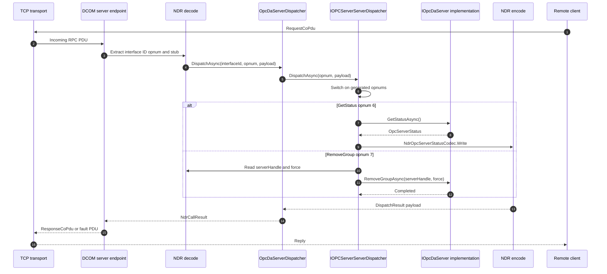

# Server dispatch flow

This diagram shows the server-side mirror of a generated client proxy. A DCE/RPC request arrives with an interface ID, opnum, and NDR stub, then the per-spec dispatcher routes it to managed server code.

`OpcDaServerDispatcher.DispatchAsync` is the DA hosting adapter. It recognizes `IOPCServer.InterfaceId` and delegates to the source-generated `IOPCServerServerDispatcher`. The generated dispatcher switches on the opnum, decodes request parameters with `NdrReader`, calls the `IOpcDaServer` implementation, and writes a `DispatchResult` response payload with `NdrWriter` or a spec codec.

The same adapter plus generated-dispatcher pattern exists for AE and HDA hosting, and generated dispatchers cover annotated `Opc.Classic.*` DCOM projections across the sub-spec packages. Keeping dispatch generated and explicit preserves OPC IDL opnums while avoiding reflection-based invocation in the portable server path.

## Where to read more

- [`src\Opc.Classic.Da\Hosting\OpcDaServerDispatcher.cs:13`](../../src/Opc.Classic.Da/Hosting/OpcDaServerDispatcher.cs#L13-L36) defines the DA adapter that delegates to the generated dispatcher.
- [`src\Opc.Classic.Generators\OpcServerDispatchGenerator.cs:350`](../../src/Opc.Classic.Generators/OpcServerDispatchGenerator.cs#L350-L390) emits the generated opnum switch.
- [`src\Opc.Classic.Generators\OpcServerDispatchGenerator.cs:427`](../../src/Opc.Classic.Generators/OpcServerDispatchGenerator.cs#L427-L559) emits request decoding, implementation calls, and response encoding.
- [`src\Opc.Classic.Da\Hosting\IOpcDaServer.cs:18`](../../src/Opc.Classic.Da/Hosting/IOpcDaServer.cs#L18-L43) is the managed implementation contract the dispatcher calls.
- [`src\Opc.Classic.Ae\Hosting\OpcAeServerDispatcher.cs:13`](../../src/Opc.Classic.Ae/Hosting/OpcAeServerDispatcher.cs#L13-L36) and [`src\Opc.Classic.Hda\Hosting\OpcHdaServerDispatcher.cs:13`](../../src/Opc.Classic.Hda/Hosting/OpcHdaServerDispatcher.cs#L13-L36) follow the same adapter shape for AE and HDA.
- See also [`docs\ARCHITECTURE.md:170`](../ARCHITECTURE.md#L170-L200).
