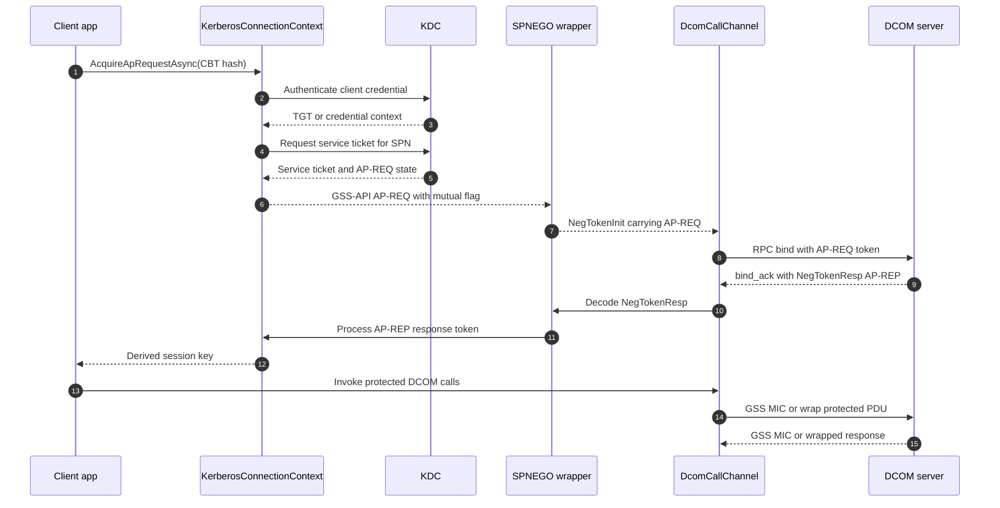

# Kerberos handshake

This diagram shows the Kerberos path used when DCOM authentication is backed by Kerberos and SPNEGO. The client acquires a service ticket for the configured SPN, emits an AP-REQ in a GSS-API token, and requests mutual authentication so the server must answer with AP-REP.

`KerberosConnectionContext` owns the ticket acquisition and AP-REP processing state. `KerberosAuthContext` wraps that state behind `IAuthContext`, computes optional channel-binding hashes, wraps the AP-REQ in a SPNEGO initial token, and unwraps the server's response token from `NegTokenResp`.

The final packet-protection stage is shown as GSS-API token wrapping and MIC verification. The code already exposes the `IAuthContext.SignAndSeal` and `VerifyAndUnseal` seam; the Kerberos-specific `gss_get_mic`, `gss_wrap`, `gss_verify_mic`, and `gss_unwrap` implementation is marked as the follow-up work item in the current source.

## Where to read more

- [`src\Opc.Classic.Dcom.Kerberos\KerberosAuthContext.cs:13`](../../src/Opc.Classic.Dcom.Kerberos/KerberosAuthContext.cs#L13-L104) adapts Kerberos/SPNEGO to `IAuthContext` and documents the signing follow-up seam.
- [`src\Opc.Classic.Dcom.Kerberos\KerberosConnectionContext.cs:39`](../../src/Opc.Classic.Dcom.Kerberos/KerberosConnectionContext.cs#L39-L108) acquires AP-REQ tokens, requests mutual authentication, and processes AP-REP tokens.
- [`src\Opc.Classic.Dcom.Kerberos\IKerberosConnectionContext.cs:15`](../../src/Opc.Classic.Dcom.Kerberos/IKerberosConnectionContext.cs#L15-L37) defines the AP-REQ and AP-REP abstraction.
- [`src\Opc.Classic.Dcom.Kerberos\Spnego\SpnegoTokenBuilder.cs:13`](../../src/Opc.Classic.Dcom.Kerberos/Spnego/SpnegoTokenBuilder.cs#L13-L28) wraps Kerberos AP-REQ tokens in SPNEGO.
- Protocol references: [MS-KILE](https://learn.microsoft.com/openspecs/windows_protocols/ms-kile/) and [`docs\cookbook\03-kerberos-in-active-directory.md:36`](../cookbook/03-kerberos-in-active-directory.md#L36-L52).
