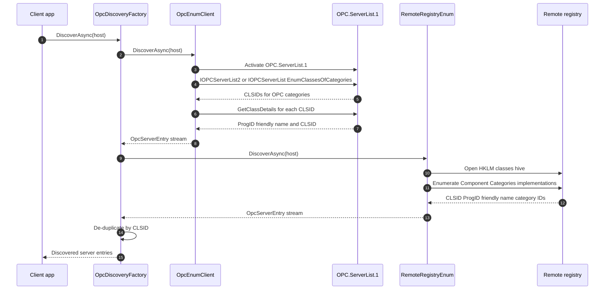

# Discovery flow

This diagram shows current OPC Classic server discovery. `IOpcDiscovery` is the shared async contract, and `OpcDiscoveryFactory` composes multiple discovery strategies, isolates transport or authorization failures per strategy, and de-duplicates results by CLSID.

The OPCEnum path activates the standard `OPC.ServerList.1` DCOM server, prefers `IOPCServerList2` when available, uses `ICallChannel` shims for `EnumClassesOfCategories`, `GetClassDetails`, and `IOPCEnumGUID::Next`, and maps descriptors to `OpcServerEntry` values.

The remote-registry path enumerates OPC category registrations from a target machine's registry through the managed WINREG reader. It returns `OpcServerEntry` values from CLSID, ProgID, friendly-name, and category metadata.

## Where to read more

- [`src\Opc.Classic.Discovery\IOpcDiscovery.cs:14`](../../src/Opc.Classic.Discovery/IOpcDiscovery.cs#L14-L22) defines the shared async discovery contract.
- [`src\Opc.Classic.Discovery\OpcDiscoveryFactory.cs:36`](../../src/Opc.Classic.Discovery/OpcDiscoveryFactory.cs#L36-L53) composes strategies and de-duplicates by CLSID; [`OpcDiscoveryFactory.cs:56`](../../src/Opc.Classic.Discovery/OpcDiscoveryFactory.cs#L56-L93) isolates per-strategy failures.
- [`src\Opc.Classic.Discovery\OpcEnumClient.cs:88`](../../src/Opc.Classic.Discovery/OpcEnumClient.cs#L88-L118) activates OPCEnum and selects the server-list interface; [`OpcEnumClient.cs:145`](../../src/Opc.Classic.Discovery/OpcEnumClient.cs#L145-L190) maps server-list results into descriptors.
- [`src\Opc.Classic.Discovery\OpcEnumDcomInterfaces.cs:16`](../../src/Opc.Classic.Discovery/OpcEnumDcomInterfaces.cs#L16-L96) contains the OPCEnum `ICallChannel` shims for `IOPCServerList` and `IOPCServerList2`.
- [`src\Opc.Classic.Da\Dcom\IOPCInterfaces.cs:632`](../../src/Opc.Classic.Da/Dcom/IOPCInterfaces.cs#L632-L680) defines `IOPCEnumGUID`, `IOPCServerList`, and `IOPCServerList2` projections.
- [`src\Opc.Classic.Discovery\RemoteRegistryEnum.cs:94`](../../src/Opc.Classic.Discovery/RemoteRegistryEnum.cs#L94-L162) enumerates registry entries, and [`RemoteRegistryEnum.cs:165`](../../src/Opc.Classic.Discovery/RemoteRegistryEnum.cs#L165-L243) reads category and CLSID metadata.
- [`src\Opc.Classic.Dcom\Registry\Smb\RegistryStub.cs:22`](../../src/Opc.Classic.Dcom/Registry/Smb/RegistryStub.cs#L22-L62) shows the `ncacn_np` / `\\PIPE\\winreg` endpoint shape.
- See also [`docs\ARCHITECTURE.md:216`](../ARCHITECTURE.md#L216-L236) and [`docs\ADOPTION.md:242`](../ADOPTION.md#L242-L280).
