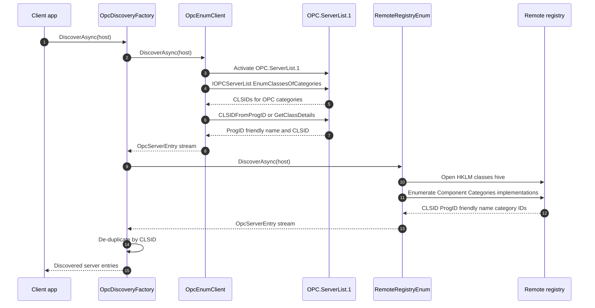

# Discovery flow

This diagram shows how OPC Classic server discovery is represented in the repository. `IOpcDiscovery` is the shared async contract, and `OpcDiscoveryFactory` composes multiple discovery strategies while de-duplicating results by CLSID.

The OPCEnum path targets the standard `OPC.ServerList.1` DCOM server and the `IOPCServerList` / `IOPCServerList2` projection interfaces. In the current source, `OpcEnumClient` is a scaffold that will use those generated shims once the remaining server-list method bodies are available.

The remote-registry path enumerates OPC category registrations from a target machine's registry. `RemoteRegistryEnum` is also a scaffold today, and the legacy SharpInterop registry client shows the underlying Windows Remote Registry over `ncacn_np` and `\\PIPE\\winreg` transport shape.

## Where to read more

- [`src\Opc.Classic.Discovery\IOpcDiscovery.cs:14`](../../src/Opc.Classic.Discovery/IOpcDiscovery.cs#L14-L22) defines the shared async discovery contract.
- [`src\Opc.Classic.Discovery\OpcDiscoveryFactory.cs:8`](../../src/Opc.Classic.Discovery/OpcDiscoveryFactory.cs#L8-L54) composes strategies and de-duplicates by CLSID.
- [`src\Opc.Classic.Discovery\OpcEnumClient.cs:13`](../../src/Opc.Classic.Discovery/OpcEnumClient.cs#L13-L39) documents the `OPC.ServerList.1` discovery scaffold.
- [`src\Opc.Classic.Da\Dcom\IOPCInterfaces.cs:390`](../../src/Opc.Classic.Da/Dcom/IOPCInterfaces.cs#L390-L416) defines `IOPCServerList` and `IOPCServerList2` projections.
- [`src\Opc.Classic.Discovery\RemoteRegistryEnum.cs:14`](../../src/Opc.Classic.Discovery/RemoteRegistryEnum.cs#L14-L46) documents the remote-registry scaffold, and [`src\Opc.Classic.Dcom\Registry\Smb\RegistryStub.cs:23`](../../src/Opc.Classic.Dcom/Registry/Smb/RegistryStub.cs#L23-L84) shows the legacy winreg transport endpoint.
- See also [`docs\ARCHITECTURE.md:216`](../ARCHITECTURE.md#L216-L236) and [`docs\ADOPTION.md:242`](../ADOPTION.md#L242-L280).
