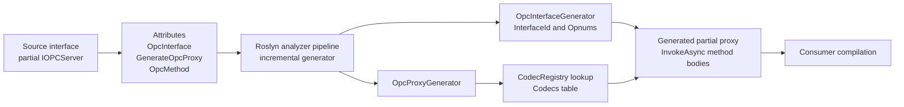

# Source generator pipeline

This flowchart shows the compile-time path for source-generated OPC projections. Source interfaces declare their DCOM identity and method opnums with `[OpcInterface]`, `[GenerateOpcProxy]`, and `[OpcMethod]` attributes.

Roslyn runs the generator package during compilation. `OpcInterfaceGenerator` emits interface metadata such as `InterfaceId` and nested `Opnums`, while `OpcProxyGenerator` inspects the annotated interface, validates supported method shapes, and maps parameter and return types through its codec table.

The output is a generated partial client proxy class. Its method bodies allocate NDR buffers, emit direct codec calls, call `ICallChannel.InvokeAsync`, check HRESULTs, decode response payloads, and return managed values without runtime reflection or expression-tree compilation.

## Where to read more

- [`src\Opc.Classic.Da\Dcom\IOPCInterfaces.cs:29`](../../src/Opc.Classic.Da/Dcom/IOPCInterfaces.cs#L29-L54) shows an annotated `IOPCServer` projection.
- [`src\Opc.Classic.Generators\OpcInterfaceGenerator.cs:40`](../../src/Opc.Classic.Generators/OpcInterfaceGenerator.cs#L40-L130) defines the generated attributes and `OpcInterfaceGenerator` entry point.
- [`src\Opc.Classic.Generators\OpcProxyGenerator.cs:19`](../../src/Opc.Classic.Generators/OpcProxyGenerator.cs#L19-L43) defines the proxy generator and its generated `[GenerateOpcProxy]` attribute.
- [`src\Opc.Classic.Generators\OpcProxyGenerator.cs:55`](../../src/Opc.Classic.Generators/OpcProxyGenerator.cs#L55-L96) is the generator codec table.
- [`src\Opc.Classic.Generators\OpcProxyGenerator.cs:473`](../../src/Opc.Classic.Generators/OpcProxyGenerator.cs#L473-L549) emits generated `InvokeAsync` bodies.
- See also [`docs\ARCHITECTURE.md:135`](../ARCHITECTURE.md#L135-L168).
