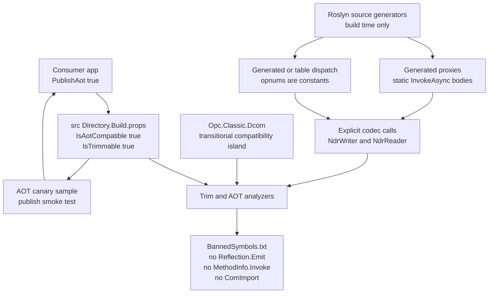

# AOT and trimming shape

This diagram shows what the trimmer and NativeAOT compiler see in the portable `src/*` libraries. The design goal is static, analyzable code: generated proxies and dispatchers call known methods and codecs directly rather than reflecting over interface metadata at runtime.

`src/Directory.Build.props` enables AOT and trimming analyzers for source projects, and `src/BannedSymbols.txt` blocks the dynamic patterns that would hide code from the trimmer. The Roslyn generator assembly itself is build-time only, so it opts out of AOT properties while keeping its emitted output AOT-safe.

The DCOM assembly is explicitly marked transitional while legacy Dcom code is modernized. The diagram calls that out separately from fresh portable code so readers can distinguish the current compatibility island from the intended steady-state shape.

## Where to read more

- [`src\Directory.Build.props:27`](../../src/Directory.Build.props#L27-L34) sets `IsAotCompatible`, `IsTrimmable`, and analyzer properties for source assemblies.
- [`src\BannedSymbols.txt:1`](../../src/BannedSymbols.txt#L1-L37) lists banned reflection, expression compilation, COM RCW, and native marshal patterns.
- [`src\Opc.Classic.Generators\Opc.Classic.Generators.csproj:3`](../../src/Opc.Classic.Generators/Opc.Classic.Generators.csproj#L3-L42) explains why generators are build-time only and why their output must be AOT-safe.
- [`src\Opc.Classic.Dcom\Opc.Classic.Dcom.csproj:3`](../../src/Opc.Classic.Dcom/Opc.Classic.Dcom.csproj#L3-L33) documents the transitional DCOM compatibility island.
- [`samples\Opc.Classic.Samples.AotCanary\Opc.Classic.Samples.AotCanary.csproj:1`](../../samples/Opc.Classic.Samples.AotCanary/Opc.Classic.Samples.AotCanary.csproj#L1-L11) and [`Program.cs:21`](../../samples/Opc.Classic.Samples.AotCanary/Program.cs#L21-L30) show the AOT smoke sample.
- See also [`docs\ARCHITECTURE.md:281`](../ARCHITECTURE.md#L281-L292) and [`docs\ADOPTION.md:302`](../ADOPTION.md#L302-L312).
