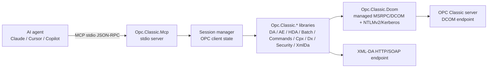

# Opc.Classic.Mcp

Opc.Classic.Mcp is a stdio [Model Context Protocol](https://modelcontextprotocol.io/) server for OPC Classic. It lets AI agents use the managed Opc.Classic libraries to discover OPC Classic servers, create long-lived sessions, browse DA/AE/HDA address spaces, read and write values, poll subscriptions, inspect batch and command models, manage DX configuration, call OPC Security operations, and use XML-DA endpoints.

## Why use it

OPC Classic is still common in plant-floor and historian environments, but it is usually accessed through DCOM and purpose-built tools. Opc.Classic.Mcp gives chat-based agents a narrow, auditable bridge into that existing estate:

- **For operators:** ask an agent to discover servers, check status, browse items, read values, or inspect events without hand-writing client code.
- **For automation engineers:** script repeatable DA, AE, HDA, Batch, Commands, Complex Data, DX, Security, and XML-DA workflows through MCP tools.
- **For library adopters:** exercise the same `Opc.Classic.*` managed client stack used by applications and tests.
- **For AI-tool administrators:** install one .NET tool and expose it to Claude Desktop, Cursor, VS Code Copilot Chat, or GitHub Copilot CLI through stdio.

## Install

```powershell
dotnet tool install --global Opc.Classic.Mcp
```

The installed command is:

```powershell
opc-classic-mcp
```

For local development from this repository, point your MCP client at `dotnet run --project mcp\Opc.Classic.Mcp` instead of the global tool command.

## Quick start by AI agent

1. Install the global tool.
2. Add the matching MCP stdio configuration for your client.
3. Restart the client so it discovers `opc-classic`.
4. Ask the agent to call `opcclassic.session.create`, then discovery/connect tools, then the per-spec operations you need.

| Client | Config file | Guide |
| --- | --- | --- |
| Claude Desktop | `%APPDATA%\Claude\claude_desktop_config.json` | [Claude Desktop](integrations.md#claude-desktop) |
| Cursor | `.cursor\mcp.json` or `~\.cursor\mcp.json` | [Cursor](integrations.md#cursor) |
| VS Code Copilot Chat | `.vscode\mcp.json` | [VS Code Copilot Chat](integrations.md#vs-code-copilot-chat) |
| GitHub Copilot CLI | `.copilot\mcp.json` | [GitHub Copilot CLI](integrations.md#github-copilot-cli) |

### Minimal stdio server command

All integrations launch the same process:

```json
{
  "command": "opc-classic-mcp"
}
```

## Tool count summary

The current source exposes **93 MCP tools**:

| Sub-spec | Tools | Reference |
| --- | ---: | --- |
| Session | 3 | [tools.md#session](tools.md#session) |
| Discovery | 1 | [tools.md#discovery](tools.md#discovery) |
| DA | 13 | [tools.md#da](tools.md#da) |
| AE | 13 | [tools.md#ae](tools.md#ae) |
| HDA | 20 | [tools.md#hda](tools.md#hda) |
| Batch | 7 | [tools.md#batch](tools.md#batch) |
| Commands | 7 | [tools.md#commands](tools.md#commands) |
| Cpx | 3 | [tools.md#cpx](tools.md#cpx) |
| Dx | 12 | [tools.md#dx](tools.md#dx) |
| Security | 4 | [tools.md#security](tools.md#security) |
| XmlDa | 10 | [tools.md#xmlda](tools.md#xmlda) |

## Session workflow

Opc.Classic.Mcp is session based because OPC Classic connections, DCOM channels, groups, subscriptions, and item handles are stateful.

1. Call `opcclassic.session.create` to receive an opaque `sessionId`.
2. Optionally call `opcclassic.discovery.enumerate_servers` to find ProgIDs and CLSIDs.
3. Call a spec-specific connect tool such as `opcclassic.da.connect`, `opcclassic.ae.connect`, `opcclassic.hda.connect`, or `opcclassic.xmlda.connect` with that `sessionId`.
4. Reuse the same `sessionId` for browse, read, write, subscription, event, history, batch, command, complex-data, DX, security, and XML-DA operations.
5. Call `opcclassic.session.close` when finished. Idle sessions expire automatically after 30 minutes by default; `opcclassic.session.create` accepts `idleExpirySeconds` to override this per session.

`opcclassic.session.list` shows active sessions, their expiry timestamps, and current DA connection state.

## Authentication model

Credentials are supplied at the tool boundary and flow only to the underlying connection or security operation:

- DCOM-backed connect tools accept `username`, `password`, and `useKerberos`. With credentials, the tool creates an `OpcConnectData` instance for NTLMv2 or Kerberos/SPNEGO. Without credentials, it uses the process/default identity where the target server permits it.
- User names can use `DOMAIN\user` when a Windows domain is required.
- OPC Security tools (`opcclassic.security.*`) operate inside an existing session and call the server's security interface; `opcclassic.security.logon` accepts server-private credentials and `opcclassic.security.logoff` clears that identity.
- XML-DA tools target HTTP/SOAP endpoints and use the XML-DA client surface.
- Do not put literal passwords in MCP config files. Prefer environment variables, OS secret stores, or agent-specific secret injection. `mcp\Opc.Classic.Mcp\appsettings.template.json` shows a secure reference pattern using `PasswordEnvironmentVariable` fields.

## Architecture



## Tool reference

- [Full generated-style tool reference](tools.md)
- [Session](tools.md#session)
- [Discovery](tools.md#discovery)
- [DA](tools.md#da)
- [AE](tools.md#ae)
- [HDA](tools.md#hda)
- [Batch](tools.md#batch)
- [Commands](tools.md#commands)
- [Cpx](tools.md#cpx)
- [Dx](tools.md#dx)
- [Security](tools.md#security)
- [XmlDa](tools.md#xmlda)
