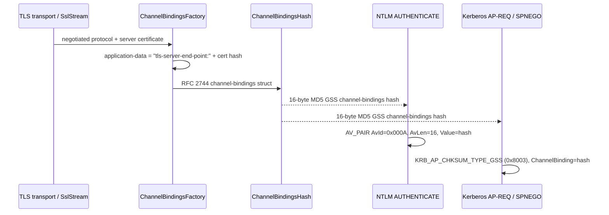

# Channel binding for TLS endpoints

OPC Classic DCOM can run behind a TLS-protected transport. Extended Protection for Authentication binds NTLMv2 and Kerberos/SPNEGO tokens to that outer TLS channel by carrying the RFC 5056/RFC 5929 `tls-server-end-point` channel binding token (CBT).

## Flow

## TLS server-end-point data

`ChannelBindingsFactory` extracts DER certificate bytes from either a caller-provided certificate or an authenticated `SslStream`, prefixes the selected certificate digest with ASCII `tls-server-end-point:`, and stores that as the GSS `ApplicationData` field. The prefix has no null terminator.

| TLS/certificate case | Digest used |
| --- | --- |
| TLS 1.3 endpoint | SHA-384 |
| TLS 1.2 or unspecified, certificate signed with SHA-384/SHA-512 | Matching stronger SHA family |
| TLS 1.2 or unspecified, SHA-256/SHA-1/MD5/unknown signature | SHA-256 floor |

Source: `src\Opc.Classic.Core\Security\ChannelBindingsFactory.cs`.

## RFC 2744 GSS channel-bindings hash

`ChannelBindingsHash.Compute` serializes the GSS channel-bindings structure as little-endian address types, lengths, addresses, and application data, then returns the required 16-byte MD5 checksum used by MS-NLMP and MS-KILE. `ForTlsServerCert` is the convenience path for DER certificates.

Source: `src\Opc.Classic.Core\Security\ChannelBindingsHash.cs`.

## MS-NLMP AV_PAIR encoding

NTLMv2 carries CBT in the NTLMv2 client challenge target-info AV_PAIR list inside the AUTHENTICATE message:

| Field | Value |
| --- | --- |
| `AvId` | `MsvAvChannelBindings` (`0x000A`) |
| `AvLen` | `0x0010` |
| `Value` | 16-byte RFC 2744 MD5 channel-bindings hash |

When a TLS channel binding hash is configured, `NtlmAuthentication.CreateType3` inserts or replaces that AV_PAIR before generating the NTLMv2 proof and MIC. The server-side verifier validates the returned AV_PAIR against the expected TLS endpoint hash. Without TLS, the pair is omitted (or a peer may send an all-zero value per MS-NLMP 3.1.5.1.2).

Source: `src\Opc.Classic.Dcom\rpc\Auth\NtlmAuthentication.cs`.

## MS-KILE GSS-CB encoding

Kerberos carries CBT in the AP-REQ authenticator checksum. The checksum type is `KRB_AP_CHKSUM_TYPE_GSS` (`0x8003`), and the checksum body is Kerberos.NET's GSS delegation-info structure with `ChannelBinding` set to the same 16-byte RFC 2744 hash and the configured GSS context flags.

`KerberosConnectionContext` attaches that checksum to the `RequestServiceTicket` so Kerberos.NET emits it into the AP-REQ authenticator before SPNEGO wrapping. SPNEGO preserves the offered mechanism list bytes so `mechListMIC` verification covers the same channel-bound Kerberos context.

Source: `src\Opc.Classic.Dcom.Kerberos\KerberosChannelBindingChecksum.cs`, `src\Opc.Classic.Dcom.Kerberos\KerberosConnectionContext.cs`, and `src\Opc.Classic.Dcom.Kerberos\KerberosAuthContext.cs`.

## Tests

Coverage lives in `tests\Opc.Classic.Core.Tests\Security\ChannelBindingsTests.cs`, `tests\Opc.Classic.Dcom.Tests\ChannelBindingTlsTests.cs`, `tests\Opc.Classic.Dcom.Kerberos.Tests\KerberosChannelBindingChecksumTests.cs`, `KerberosAuthContextTests.cs`, and `KerberosKdcIntegrationTests.cs`. It covers fixed SHA-256/SHA-384 certificate vectors, `SslStream` loopback extraction, NTLM AUTHENTICATE AV_PAIR insertion and no-TLS behavior, NTLM server verification, Kerberos GSS checksum encoding, and KDC-backed CBT tamper rejection.
