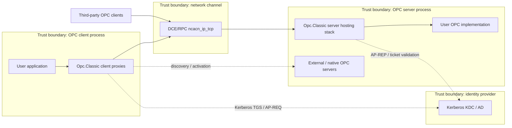
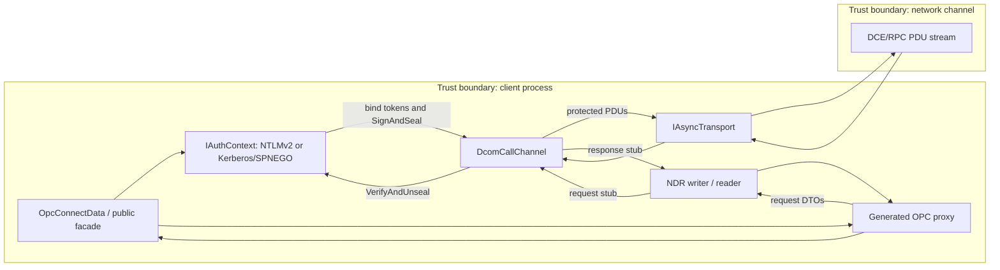
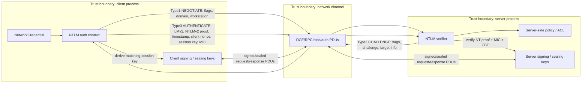
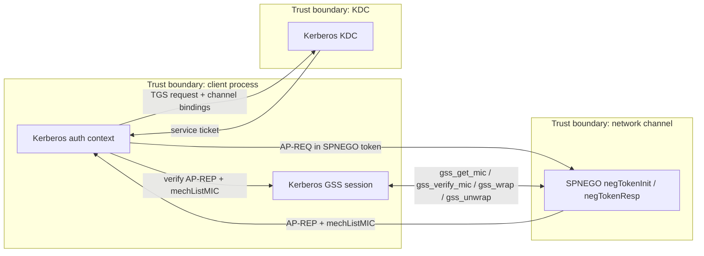

# Opc.Classic STRIDE Threat Model

**Document owner:** Opc.Classic maintainers
**Scope:** current managed OPC Classic client/server stack
**Method:** STRIDE over assets, trust boundaries, and the Connect / Authenticate / Invoke / Receive flows
**Status key:** **MITIGATED** = implemented control with cited code; **PARTIAL** = control exists but has residual gaps; **NOT MITIGATED** = no effective in-scope control identified.

## 1. Scope and assumptions

### 1.1 Components in scope

The threat model covers the security-sensitive Opc.Classic stack identified by the security policy: authentication, authorization, channel protection, NDR marshalling, activation, discovery, and server callback dispatch in the managed DCOM/MSRPC code (`SECURITY.md`). The in-scope components are:

- Client proxy stack and generated call shims.
- Server hosting, source-generated dispatch, IRemoteSCMActivator v5.6 hosting, and the Windows SCM CCW activation/vtable path.
- Self-contained NTLMv2; Kerberos RC4-HMAC and AES128/256; SPNEGO with `mechListMIC`.
- DCE/RPC and ORPC envelope handling, fragmentation, packet integrity, packet privacy, and RFC 5056/RFC 5929 channel binding tokens.
- NDR marshaling / unmarshaling, including full OAUT VARIANT and SAFEARRAY handling.
- OPCEnum discovery through `OpcEnumClient` and remote-registry discovery through WINREG over SMB/ncacn_np.

The managed components are NativeAOT-compatible, MIT licensed, and exposed through `Opc.Classic.*` namespaces.

### 1.2 Components out of scope

- User application code that consumes or implements OPC interfaces.
- The underlying TLS stack and certificate validation path, delegated to .NET and the hosting application.
- Network infrastructure: routing, firewalling, KDC placement, DNS, and NTP.
- Native OPC Foundation sample servers under `external\samples\` and redistributable inputs under `external\`; they are conformance references, not portable runtime surface.

### 1.3 Trust boundaries

| Boundary | Description | Primary risks |
| --- | --- | --- |
| Client process boundary | Consumer application, generated proxies, authentication context, transport channel. | Credential disclosure, malicious server responses, spoofed server identity. |
| Server process boundary | Managed host, RPC endpoint, auth verifier, dispatcher, OPC implementation. | Rogue clients, unauthorized activation/invocation, resource exhaustion. |
| Network channel | DCE/RPC PDUs over TCP or test transports. | Spoofing, tampering, replay, slow-loris, disclosure without privacy. |
| Identity provider / KDC | Kerberos realm, service tickets, AP-REQ/AP-REP exchange. | KDC impersonation, realm/SPN misconfiguration, replay window abuse. |

### 1.4 Threat actors

- **External attacker:** unauthenticated network attacker attempting spoofing, tampering, replay, credential theft, or denial-of-service.
- **Malicious peer:** rogue client or rogue server that speaks enough DCE/RPC/NTLM/Kerberos to send crafted tokens or PDUs.
- **Compromised insider:** authenticated user or service account abusing valid credentials or lateral movement.
- **Supply-chain attacker:** dependency, build, generator, or source compromise affecting cryptography, marshalling, or generated dispatch code.

### 1.5 Security objectives

1. Authenticate clients and servers before accepting privileged DCOM activation or OPC method calls.
2. Preserve integrity of DCE/RPC PDUs and NDR payloads; prefer privacy when data confidentiality is required.
3. Fail closed on malformed authentication tokens, malformed PDUs, malformed NDR, unsupported opnums, and failed HRESULTs.
4. Provide diagnosable security behavior without exposing secrets or sensitive plant data.
5. Keep crypto and marshalling changes testable, reviewable, and auditable.

## 2. Data flow diagrams

### 2.1 Level 0 context DFD

### 2.2 Level 1 component DFD: client process internals

### 2.3 Level 2 auth-flow DFD: NTLMv2 negotiation

Implementation anchors for the NTLMv2 flow are `Type1Message`, `Type2Message`, and `Type3Message` parsing/encoding (`src\Opc.Classic.Dcom\Common\Ntlm\`), NTLMv2 response construction and server proof verification (`src\Opc.Classic.Dcom\rpc\Auth\NtlmAuthentication.cs`), and NTLM packet MIC/sign/seal (`src\Opc.Classic.Dcom\rpc\Auth\NTLMKeyFactory.cs`, `src\Opc.Classic.Dcom\rpc\Auth\Ntlm1.cs`).

### 2.4 Level 2 auth-flow DFD: Kerberos/SPNEGO negotiation

Kerberos packet protection is implemented by `KerberosSession` (`src\Opc.Classic.Dcom.Kerberos\KerberosSession.cs`) for RFC 4121 MIC and Wrap tokens. Supported etypes are RC4-HMAC (RFC 4757), AES128/256 CTS-HMAC-SHA1 (RFC 3962), and AES128/256 CTS-HMAC-SHA256/SHA384 (RFC 8009). SPNEGO encoding, decoding, and `mechListMIC` verification are in `src\Opc.Classic.Dcom.Kerberos\Spnego\`. Channel binding checksum construction is in `KerberosChannelBindingChecksum` and `KerberosConnectionContext`.

## 3. STRIDE analysis per major flow

### 3.1 Flow: Connect

| STRIDE | Threat | Status | Evidence and mitigation | Residual risk |
| --- | --- | --- | --- | --- |
| Spoofing | Forged server identity. | **PARTIAL** | Kerberos requests mutual AP-REQ/AP-REP authentication and embeds the RFC 5056/RFC 5929 CBT in the authenticator checksum. NTLMv2 validates the target-info CBT when TLS channel binding is configured. | NTLM is not mutual authentication; deployments need correct SPNs, realm configuration, TLS validation, and CBT input for verifier-impersonation resistance. |
| Tampering | Downgrade to low DCOM protection during connect. | **PARTIAL** | `OpcConnectData` defaults to NTLMv2 and packet integrity, and `OpcProtectionLevel` exposes integrity/privacy semantics. `DcomCallChannel` applies per-PDU protection for negotiated sessions. | Callers can explicitly choose `Connect`/`None`; production deployments should enforce minimum protection policy. |
| Repudiation | No durable record of connection attempts. | **PARTIAL** | The DCOM shim routes logs through `ILogger`, and hosting logs lifecycle events with structured `LoggerMessage` definitions. | No dedicated security-audit sink, correlation ID, authenticated identity, or OpenTelemetry span is emitted for connect/auth events. |
| Information disclosure | Credentials or private-auth passwords exposed during connection. | **PARTIAL** | Packet privacy is available, NTLM privacy encrypts PDU bodies, and Kerberos Wrap provides confidentiality for privacy mode. | Passwords are still supplied as `string`/`NetworkCredential`; private OPC Security passwords require privacy mode or an equivalent protected transport. |
| Denial of service | Slow-loris or stalled connect/read. | **PARTIAL** | Async APIs accept cancellation tokens through connection and transport factories, and TCP receive timeout can be configured. | The DCOM channel does not enforce a mandatory connect timeout, read deadline, auth-rate limit, or aggregate byte ceiling. |
| Elevation of privilege | Unauthenticated or under-authorized client reaches server activation. | **PARTIAL** | Non-anonymous modes require credentials, anonymous mode is explicit, and IRemoteSCMActivator v5.6 server activation routes through managed class factories. | Server authorization policy remains an application/hosting concern; anonymous/test contexts must not be enabled for privileged deployments. |

### 3.2 Flow: Authenticate

| STRIDE | Threat | Status | Evidence and mitigation | Residual risk |
| --- | --- | --- | --- | --- |
| Spoofing | Forged client or forged server credentials. | **PARTIAL** | NTLMv2 is the default NTLM path and NTLMv1 is rejected unless explicitly allowed. Kerberos uses configured realm/SPN values and validates AP-REP for mutual authentication. | NTLM lacks Kerberos-style mutual authentication; server ACL enforcement remains application/hosting policy. |
| Tampering | Crafted NTLM/Kerberos/SPNEGO tokens alter negotiated state. | **MITIGATED** | NTLMSSP parsers validate signatures, message types, lengths, security-buffer bounds, MIC, and CBT. SPNEGO validates the initial-context OID, preserves the offered mechanism list, and verifies `mechListMIC` when the peer supplies it. Kerberos AP-REQ/AP-REP processing is delegated to Kerberos.NET and then bound to the local GSS session. | Keep mechanism policy explicit when enabling additional inner mechanisms. |
| Repudiation | Authentication success/failure cannot be audited. | **PARTIAL** | Generic logging infrastructure exists for DCOM and hosting. | Authentication paths need structured success/failure events with peer identity, mechanism, protection level, and failure reason. |
| Information disclosure | Plaintext credentials and auth material remain in memory; timing leaks. | **PARTIAL** | NTLMv2 proof verification uses fixed-time comparison, Kerberos MIC verification uses fixed-time comparisons in `KerberosSession`, and packet protection hides payloads when privacy is selected. | Passwords are immutable strings in public credential shapes, and NTLM packet signature comparison still uses `SequenceEqual`. |
| Denial of service | Malformed or oversized auth tokens consume CPU/memory. | **PARTIAL** | NTLM Type1/Type2/Type3 parsers reject short messages and out-of-message fields; SPNEGO uses DER `AsnReader` and checks for trailing data. | Add explicit token-size ceilings, handshake deadlines, and authentication-rate limiting. |
| Elevation of privilege | Auth bypass via crafted SPNEGO `mechToken`; NTLMSSP downgrade. | **MITIGATED** | NTLMv1 downgrade is blocked by default. SPNEGO carries Kerberos-first mechanism lists, stores the encoded mechanism list, and verifies `mechListMIC` through a Kerberos GSS MIC provider. | High-assurance deployments may disable NTLM fallback and require Kerberos-only policy. |

### 3.3 Flow: Invoke

| STRIDE | Threat | Status | Evidence and mitigation | Residual risk |
| --- | --- | --- | --- | --- |
| Spoofing | Rogue peer injects a request or response after auth. | **MITIGATED** | Default protection is integrity; `DcomCallChannel` signs outgoing protected PDUs and verifies incoming protected PDUs for NTLM and Kerberos sessions. | Mitigation assumes callers do not opt down to `None`, `Connect`, or anonymous test contexts. |
| Tampering | In-flight modification of RPC PDUs. | **MITIGATED** | NTLM signing includes sequence number and HMAC. Kerberos implements `gss_get_mic`, `gss_verify_mic`, `gss_wrap`, and `gss_unwrap` across RC4-HMAC and AES CTS-HMAC-SHA1/SHA256/SHA384 etypes. | Privacy is optional; integrity-only sessions still expose payload contents. |
| Repudiation | OPC calls are not attributable after the fact. | **PARTIAL** | Generated proxies fail closed on HRESULT failures, and `OpcException` preserves result IDs. | No per-call audit event records interface ID, opnum, peer identity, result, and correlation ID. |
| Information disclosure | Read/write values are visible on the wire. | **PARTIAL** | `OpcProtectionLevel.Privacy` is available for NTLM and Kerberos packet privacy. | Default protection is integrity; applications handling sensitive values must opt into privacy or run over an equivalent protected tunnel. |
| Denial of service | Large or fragmented invocation exhausts memory. | **PARTIAL** | DCE/RPC fragment length is bounded by the wire format, auth attachment rejects oversized fragments, and frame parsing rejects undersized headers. | `ReadFragmentedPduAsync` reassembles fragments without a maximum fragment count or aggregate-message limit. |
| Elevation of privilege | Crafted opnum invokes unintended method. | **MITIGATED** | Generated interface metadata rejects duplicate opnums, proxies use compile-time interface IDs/opnums, and source-generated server dispatch provides AOT-safe routing instead of reflection-based invocation. | Authorization decisions still need authenticated identity and application scope checks before dispatch. |

### 3.4 Flow: Receive

| STRIDE | Threat | Status | Evidence and mitigation | Residual risk |
| --- | --- | --- | --- | --- |
| Spoofing | Forged response or callback. | **MITIGATED** | Protected response, fault, and request PDUs are verified before decode. | Mitigation depends on negotiated integrity/privacy and correct sequence-state handling. |
| Tampering | Modified NDR payload causes memory corruption or parser confusion. | **MITIGATED** | Managed span/buffer readers check availability before reads, validate LPWSTR bounds, and validate OPC VARIANT/SAFEARRAY wire shapes. Full OAUT VARIANT support includes scalar values, SAFEARRAYs, nested `VT_VARIANT`, by-reference values, and record payloads. | Malformed payloads can still trigger controlled exceptions or resource pressure. |
| Repudiation | Received data cannot be correlated to peer identity. | **PARTIAL** | Hosting and DCOM logging can be configured through `ILoggerFactory`. | No receive-path security audit event includes peer identity, call ID, interface ID, or verifier result. |
| Information disclosure | Verbose logs leak payloads or decrypted values. | **PARTIAL** | Logging defaults to `NullLoggerFactory` when unconfigured. | Payload-level diagnostics must remain redacted and opt-in for production systems. |
| Denial of service | Malformed NDR causes infinite loop or large allocation. | **PARTIAL** | NDR variant and SAFEARRAY decoding reject unsupported types, invalid reserved fields, excessive recursion, and excessive counts. | Property/fuzz coverage and configurable allocation ceilings remain recommended controls. |
| Elevation of privilege | Response/receive path crosses into privileged server callback unexpectedly. | **PARTIAL** | `DcomCallChannel` rejects non-accepted presentation contexts, server activation uses managed class factories, and generated dispatch constrains opnum routing. | Callback/server receive authorization remains tied to host application policy. |

## 4. Threat-specific mitigation evidence by STRIDE category

| Category | Implemented controls | Status |
| --- | --- | --- |
| Spoofing | Kerberos mutual AP-REQ/AP-REP, SPNEGO mechanism-list protection, channel binding, NTLMv2 default auth context, and credential requirements for non-anonymous auth. | **PARTIAL**: NTLM lacks mutual authentication and authorization policy is host-defined. |
| Tampering | Packet integrity/privacy enum and defaults, DCOM packet protection, NTLM MIC/sign/seal, Kerberos MIC/wrap/unwrap, ORPC envelope handling, and NDR/NTLM bounds checks. | **PARTIAL**: callers can still opt into lower protection levels unless deployment policy blocks them. |
| Repudiation | Structured logging plumbing via `ILogger` and hosting lifecycle events. | **PARTIAL**: security audit and per-call correlation are open recommendations. |
| Information disclosure | Privacy mode exists for NTLM and Kerberos; generated proxies expose HRESULT/result IDs without raw implementation exceptions. | **PARTIAL**: credentials remain strings and payload logging requires strict redaction policy. |
| Denial of service | Cancellation-token-based async transport interfaces, fragment/auth verifier bounds, and NDR count/type validation. | **PARTIAL**: aggregate message limits, token limits, rate limits, and fuzzing gates remain recommended. |
| Elevation of privilege | NTLMv1 disabled by default, opnum duplicate detection, bind-ack validation, IRemoteSCMActivator v5.6 server activation, and source-generated dispatch. | **PARTIAL**: first-class server authorization policy remains application/hosting work. |

### 4.1 Fuzz coverage of attacker-controlled parsers

The FZ-0..FZ-6 fuzz campaign is closed for the initial security sweep. It uses the shared CsCheck harness in `tests\_TestDoubles\Fuzz\FuzzHarness.cs` for random byte streams, edge-weighted sizes, and structurally mutated valid inputs. Each surface declares a closed allowed-exception set; the harness fails on unexpected exceptions such as `NullReferenceException`, `IndexOutOfRangeException`, `OverflowException`, `OutOfMemoryException`, and `StackOverflowException`, enforces bounded 1s parse time by default, and optionally checks result invariants after successful parses.

| Surface | Fuzz tests | Allowed parser exceptions and invariants |
| --- | --- | --- |
| PDU codec plus `Bind`, `BindAck`, `BindNak`, `AlterContext`, `AlterContextResp`, `Request`, `Response`, `Fault`, `Cancel`, `Shutdown`, `Auth3`, and `Orphaned` PDUs | `tests\Opc.Classic.PropertyTests\Fuzz\Network\PduCodecFuzzTests.cs` | `InvalidDataException`, `EndOfStreamException`, `IOException`, `ArgumentException`, `ArgumentOutOfRangeException`, `NotSupportedException`, `InvalidOperationException`, `NdrException`; successful decodes must not advertise a fragment shorter than the DCE/RPC header, and valid PDUs canonical round-trip. |
| NTLM Type1/Type2/Type3, AV pairs, and MIC | `tests\Opc.Classic.PropertyTests\Fuzz\Network\NtlmFuzzTests.cs` | `InvalidDataException`, `ArgumentException`, `ArgumentOutOfRangeException`, `FormatException`, `EndOfStreamException`; random and mutated NTLM messages, AV-pair scans, and MIC verification must stay inside this exception set. |
| SMB2 message decoders | `tests\Opc.Classic.Dcom.Smb.Tests\Fuzz\Smb2DecoderFuzzTests.cs` | `InvalidDataException`, `EndOfStreamException`, `ArgumentException`, `ArgumentOutOfRangeException`, `NotSupportedException`, `InvalidOperationException`, `Smb2ProtocolException`; covers header, negotiate, session setup, tree connect, create, read, and ioctl responses. |
| SPNEGO ASN.1 DER | `tests\Opc.Classic.Dcom.Kerberos.Tests\Fuzz\SpnegoFuzzTests.cs` | `InvalidDataException`, `FormatException`, `ArgumentException`, `ArgumentOutOfRangeException`, `EndOfStreamException`, `AsnContentException`; covers random DER and tag/length/indefinite-length mutations for NegTokenInit and NegTokenResp. |
| `NdrReader` primitive/string/interface-pointer entry points | `tests\Opc.Classic.PropertyTests\Fuzz\Ndr\NdrReaderFuzzTests.cs` | `InvalidDataException`, `EndOfStreamException`, `ArgumentException`, `ArgumentOutOfRangeException`, `InvalidOperationException`; overlarge conformance counts, negative offsets, and `actual_count > max_count` must reject or remain bounded. |
| `NdrReader.ReadVariant` recursion | `tests\Opc.Classic.PropertyTests\Fuzz\Ndr\NdrVariantRecursionFuzzTests.cs` | `InvalidDataException`, `EndOfStreamException`, `ArgumentException`, `ArgumentOutOfRangeException`, `InvalidOperationException`; random `VARIANT` tags and nested `VT_VARIANT` depths up to 1024 must be bounded or rejected. |
| `OrpcExtentArrayCodec` / ORPC extent arrays | `tests\Opc.Classic.PropertyTests\Fuzz\Ndr\OrpcExtentFuzzTests.cs` | `InvalidDataException`, `EndOfStreamException`, `ArgumentException`, `ArgumentOutOfRangeException`, `InvalidOperationException`; random and mutated `ORPC_THAT` data and impossible extent-count/body-length combinations must be bounded. |
| OBJREF / `InterfacePointer` | `tests\Opc.Classic.Dcom.Tests\Fuzz\Objref\ObjrefFuzzTests.cs` | `InvalidDataException`, `EndOfStreamException`, `ArgumentException`, `ArgumentOutOfRangeException`, `FormatException`; validates bad signatures, dual-string-array overflow, and negative public reference counts. |
| CPX binary decoder and dictionary parser | `tests\Opc.Classic.Cpx.Tests\Fuzz\` | Binary decoder allows `InvalidDataException`, `FormatException`, `ArgumentException`, `ArgumentOutOfRangeException`, `EndOfStreamException`, `NotSupportedException`, `InvalidOperationException`, `KeyNotFoundException`; dictionary parser allows the same set except `InvalidOperationException`/`KeyNotFoundException` and includes `XmlException`. Deep dictionaries and type-reference cycles must parse safely or reject. |
| OPCEnum response decoder | `tests\Opc.Classic.Discovery.Tests\Fuzz\OpcEnumResponseFuzzTests.cs` | `InvalidDataException`, `EndOfStreamException`, `ArgumentException`, `ArgumentOutOfRangeException`, `InvalidOperationException`; malformed server-list responses and overlarge counts must stay bounded. |
| XML-DA `SoapEnvelopeReader` | `tests\Opc.Classic.Xml.Tests\Fuzz\SoapEnvelopeReaderFuzzTests.cs` | `XmlException`, `InvalidDataException`, `FormatException`, `ArgumentException`, `EndOfStreamException`, `NotSupportedException`; `DtdProcessing.Prohibit` and `XmlResolver = null` are verified, with XML-bomb and XXE payloads rejected. |
| MCP `OpcDcomDecoder` capture parser | `tests\Opc.Classic.Mcp.Capture.Tests\Fuzz\OpcDcomDecoderFuzzTests.cs` | `InvalidDataException`, `EndOfStreamException`, `ArgumentException`, `ArgumentOutOfRangeException`, `NotSupportedException`; random captured packets, mutated TCP frames, oversized IP lengths, truncated pcap records, and corpus replay must be bounded. |

The deep cadence is `.github\workflows\fuzz-deep.yml`, which runs manually (`workflow_dispatch`) and weekly on Sunday at 06:00 UTC with `OPCCLASSIC_FUZZ_ITERATIONS=10000` and a rotating `OPCCLASSIC_FUZZ_SEED`. The initial campaign found no production bugs in NTLM, PDU codec, NDR reader, OBJREF, CPX, OPCEnum, `SoapEnvelopeReader`, SPNEGO, SMB2, or ORPC; `SoapEnvelopeReader` also confirmed XML-bomb and XXE safety. One real bug was captured in MCP `OpcDcomDecoder`: truncated Ethernet inputs can throw raw `IndexOutOfRangeException`; the 20-file corpus is checked in under `tests\_Fixtures\Fuzz\OpcDcomDecoder\`, and the production fix is tracked separately as `fz-bug-opcdcomdecoder-ior`. Future expansion and regression discovery continue through the `fuzz-deep` workflow and checked-in corpus replay.

## 5. Current open recommendations

| ID | Risk | Current evidence | Recommendation | Priority |
| --- | --- | --- | --- | --- |
| R1 | Server-side authorization / ACL policy is not a first-class in-scope control. | OPC Security facades expose authentication state, and permission-denied HRESULTs exist, but dispatch does not require a common authorization decision. | Add a server authorization interface that evaluates authenticated identity, CLSID, IID, opnum, and item/group scope before dispatch. | High |
| R2 | DCOM per-call audit and OpenTelemetry tracing are absent. | Logging is generic and defaults to no-op. | Emit structured security events for connect/auth/invoke/receive and add `ActivitySource` spans with correlation IDs. | Medium |
| R3 | Passwords and derived secrets are not zeroized. | Public credential and logon request shapes use `string`/`NetworkCredential`. | Minimize lifetime, avoid logging, prefer ephemeral buffers for derived secrets, and call `CryptographicOperations.ZeroMemory` on arrays containing keys/hashes where feasible. | High |
| R4 | NTLM server challenge and session-key randomness need cryptographic hardening. | NTLM server challenge and some key paths use fixed or `Random`-based values. | Replace with `RandomNumberGenerator.Fill`; keep deterministic test injection isolated to tests. | High |
| R5 | Not all MAC/signature comparisons are constant-time. | NTLMv2 proof verification is fixed-time, while NTLM packet signature comparison uses `SequenceEqual`. | Replace packet verifier comparisons with `CryptographicOperations.FixedTimeEquals`; test length and content mismatches. | High |
| R6 | NDR and PDU decoders need continuous fuzzing against malformed inputs. | Bounds checks are implemented in parsers, but malformed-fragment and malformed-NDR coverage is not a release gate. | Add property/fuzz tests for `NdrReader`, `NdrBuffer`, Type1/2/3 NTLM messages, SPNEGO DER, ORPC envelopes, OAUT VARIANTs, and fragmented DCE/RPC frames. | Medium |
| R7 | Aggregate fragment/message limits are incomplete. | Fragment frames are length-delimited, but reassembly continues until `PFC_LAST_FRAG`. | Add configurable `MaxRpcMessageBytes` and `MaxFragmentCount`; reject over-limit calls before reassembly. | Medium |
| R8 | Verbose diagnostics can include raw or decrypted PDU contents. | Low-level auth and transport diagnostics can expose bytes when enabled. | Remove payload dumps or gate them behind explicit redaction-safe diagnostics; never enable payload logging in production default configuration. | Medium |
| R9 | Self-contained NTLMSSP / MD4 / RC4 code needs independent cryptographic review. | The security policy calls out in-tree NTLMv2, RC4, and MD4 and asks for cryptanalysis findings. | Obtain independent review and treat changes to these primitives as security-boundary changes. | High |
| R10 | Deployment policy needs minimum protection guidance. | API callers can choose lower protection levels for compatibility/testing. | Document and enforce production defaults that require at least packet integrity, prefer privacy for sensitive data, and disable anonymous/test contexts. | Medium |

## 6. Compliance and references

### 6.1 OWASP ASVS mapping

| ASVS area | Applicability | Opc.Classic status |
| --- | --- | --- |
| V2 Authentication Verification | NTLMv2/Kerberos/SPNEGO credentials and mutual auth. | **PARTIAL**: NTLMv2 defaults, Kerberos mutual auth, CBT, and SPNEGO `mechListMIC` exist; authorization policy remains host-defined. |
| V3 Session Management | DCE/RPC session keys, sequence numbers, verifier state. | **PARTIAL**: NTLM and Kerberos sequence-number signing exists; replay cache and random challenge hardening remain recommendations. |
| V7 Error Handling and Logging | Security events, non-leaking errors, auditability. | **PARTIAL**: `ILogger` plumbing exists; security audit and OpenTelemetry are recommendations. |
| V8 Data Protection | Confidentiality of credentials and OPC payloads. | **PARTIAL**: privacy mode exists; default is integrity and secrets are not zeroized. |
| V10 Malicious Code / Serialization | NDR unmarshalling, generator-produced dispatch, dependency/supply-chain controls. | **PARTIAL**: generated dispatch and bounds checks exist; fuzzing and independent crypto review remain recommendations. |
| V14 Configuration | Secure defaults and deployment hardening. | **PARTIAL**: NTLMv2 + packet integrity are default; unsafe opt-downs need policy controls. |

### 6.2 NIST SP 800-63 mapping

| Requirement area | Applicability | Status |
| --- | --- | --- |
| Verifier impersonation resistance | Kerberos mutual AP-REQ/AP-REP and channel binding. | **PARTIAL**: Kerberos mutual auth and CBT exist; NTLM callers need TLS CBT and deployment policy for comparable resistance. |
| Replay resistance | NTLMv2 timestamp/client nonce, Kerberos sequence numbers, and GSS token sequencing. | **PARTIAL**: packet sequence checks exist; explicit replay cache and NTLM randomness hardening remain recommendations. |
| Authenticator secret handling | Passwords, keytabs, session keys. | **PARTIAL**: plaintext credentials remain `string`-typed for API compatibility, but NTLM password-derived pooled buffers are zeroized before release. |
| Federation assertions | Not applicable. | Identity federation is out of scope; Kerberos realm trust is deployment-managed. |

### 6.3 IEC 62443 mapping

| IEC 62443 security requirement | Relevance to OPC Classic OT deployments | Status |
| --- | --- | --- |
| SR 1.1 / SR 1.2 Identification and authentication | Authenticate OPC clients and servers. | **PARTIAL**: NTLMv2/Kerberos/SPNEGO exist; ACL and audit gaps remain. |
| SR 1.5 Authenticator management | Password/keytab handling. | **PARTIAL**: no zeroization or secret-provider abstraction yet. |
| SR 2.1 Authorization enforcement | Restrict OPC operations to authorized identities. | **PARTIAL**: host applications can enforce policy; common server authorization hooks remain recommended. |
| SR 3.1 Communication integrity | Detect modified RPC PDUs. | **MITIGATED** for negotiated packet integrity with NTLM or Kerberos. |
| SR 3.8 Session integrity | Prevent session hijack/replay. | **PARTIAL**: sequence signing exists; replay cache and randomness hardening remain recommendations. |
| SR 4.1 Information confidentiality | Protect operational data over the network. | **PARTIAL**: privacy mode is opt-in today. DCOM uses `OpcProtectionLevel.Privacy` / `RPC_C_AUTHN_LEVEL_PKT_PRIVACY`; XML-DA relies on HTTPS with the caller-supplied `HttpClient`; SMB3 encryption is implemented for encrypted named-pipe sessions. Privacy SHOULD be enabled for deployments outside hardened local-only loopback. |
| SR 5.2 Zone boundary protection | Segment OPC Classic traffic. | Deployment responsibility; out of scope for library code. |
| SR 7.1 Denial-of-service protection | Timeouts, quotas, malformed input handling. | **PARTIAL**: cancellation, decoder quotas, and malformed-input rejection tests exist; broader coverage-guided fuzzing remains recommended. |

#### SR 4.1 transport confidentiality posture

| Transport | Current default | Recommended privacy path |
| --- | --- | --- |
| DCOM/TCP client | `OpcConnectData` defaults to `OpcAuthMode.NtlmV2` and `OpcProtectionLevel.Integrity`, so PDUs are signed but not encrypted. | Use `OpcConnectData.WithNtlmV2(..., OpcProtectionLevel.Privacy)` or `OpcConnectData.WithKerberos(..., OpcProtectionLevel.Privacy)` so DCE/RPC uses `RPC_C_AUTHN_LEVEL_PKT_PRIVACY`. |
| DCOM/TCP managed server listener | DA/AE/HDA/CttServer/Security hosted samples expose `ListenAddress`; `RpcServerConnectionProcessor` accepts authenticated PDUs only for dispatchers that consume `RpcRequestContext` and otherwise rejects them. | Do not expose the managed listener outside local-only or disposable interop rigs until listener authentication/privacy policy is available; production hosts should require packet privacy at the DCOM listener or gateway. |
| DCOM/SMB named pipe | `ncacn_np` is available through `NcacnNpTransport` and the focused SMB2 client. The SMB2 client signs when signing is negotiated and the caller supplies the NTLM/Kerberos SessionKey; SMB3 AES-128-CCM/GCM encryption is implemented for encrypted sessions. | Require SMB signing in server policy and require SMB encryption for confidentiality-sensitive named-pipe deployments after validating the target server's dialect and encryption policy. |
| XML-DA/HTTP | `HttpXmlDaClient` uses the caller-owned `HttpClient`; confidentiality depends on the supplied endpoint URI, TLS handler, and SOAP/security configuration. | Use `https://` endpoints, validate TLS, configure client credentials on `HttpClient`, and add WS-Security where the XML-DA server requires message-level security. |

Samples audit: `samples\Opc.Classic.Samples.DaClient`, `AeClient`, and `HdaClient` use `NoOpAuthContext` for their TCP sample path; the DA/AE/HDA/CttServer managed server samples and the shipped OPC Security reference sample (`samples\Opc.Classic.Samples.OpcSecurityServer`) use the demo managed listener posture above. These are interop/demo defaults, not production defaults. Production deployments should opt into privacy per [cookbook 07](../cookbook/07-enabling-packet-privacy.md).

### 6.4 Cryptographic and protocol references

- RFC 2744 GSS-API C bindings: channel-binding structure and MD5 channel-bindings hash.
- RFC 4121 Kerberos GSS-API per-message tokens: MIC and Wrap token layout.
- RFC 4178 and MS-SPNG: SPNEGO negotiation and `mechListMIC`.
- RFC 4757: RC4-HMAC Kerberos encryption type.
- RFC 3962: AES128/256 CTS-HMAC-SHA1 Kerberos encryption types.
- RFC 5056 and RFC 5929: channel binding and `tls-server-end-point` data.
- RFC 8009: AES128/256 CTS-HMAC-SHA256/SHA384 Kerberos encryption types.
- MS-NLMP: NTLMv2 responses, MIC, channel-binding AV_PAIR, and session security.
- MS-KILE: Kerberos AP-REQ/AP-REP, authenticator checksum, and CBT use.
- MS-DCOM: ORPC envelope, activation, and DCOM packet-protection semantics.
- Microsoft DCOM hardening KB5004442: minimum packet-integrity expectations for DCOM deployments.

## 7. Threat model review cadence

- **Every release:** update this document when releasing a package that changes DCOM, RPC, auth, NDR, generated proxies, server hosting, discovery, activation, or security defaults.
- **At least annually:** perform a maintainer security review against current OWASP ASVS, NIST SP 800-63, IEC 62443, and Microsoft DCOM hardening guidance.
- **On security-boundary changes:** require review for new authentication modes, channel-binding behavior, server authorization policy, transport changes, crypto primitive changes, marshalling changes, or generated dispatch changes.
- **On vulnerability reports:** update affected threat rows and open risks after private triage under `SECURITY.md`.
- **Participants:** at minimum one maintainer owning DCOM/RPC, one maintainer owning auth/crypto, one maintainer owning server hosting, and an external reviewer for crypto/security-sensitive changes.

## 8. Status summary

- STRIDE flow rows: **7 MITIGATED**, **17 PARTIAL**, **0 NOT MITIGATED**.
- Highest-priority open recommendations: server authorization policy (R1), secret lifetime/zeroization (R3), NTLM randomness (R4), constant-time comparisons (R5), and independent crypto review (R9).
- Security posture: NTLMv2, Kerberos/SPNEGO, CBT, NTLM MIC, SPNEGO `mechListMIC`, ORPC envelope handling, full VARIANT handling, IRemoteSCMActivator v5.6 hosting, legacy IActivation, Windows SCM CCW activation, OPCEnum and WINREG discovery, SMB signing/encryption, object-IPID dispatch, and Kerberos GSS packet protection are present; deployment policy and audit controls remain the main hardening work.
