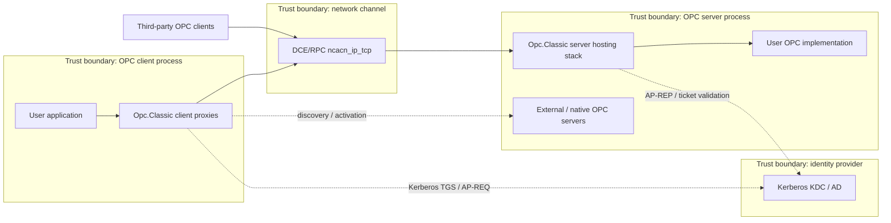
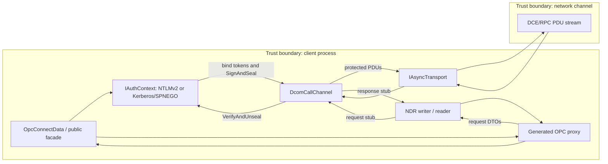

# Opc.Classic STRIDE Threat Model

**Document owner:** Opc.Classic maintainers  
**Scope version:** current branch, pre-1.0 managed DCOM stack  
**Method:** STRIDE over assets, trust boundaries, and the Connect / Authenticate / Invoke / Receive flows  
**Status key:** **MITIGATED** = implemented control with cited code; **PARTIAL** = control exists but has residual gaps; **NOT MITIGATED** = no effective in-scope control identified.

## 1. Scope and assumptions

### 1.1 Components in scope

The threat model covers the security-sensitive Opc.Classic stack identified by the security policy: authentication, authorization, channel protection, NDR marshalling, and server callback dispatch in the managed DCOM/MSRPC code (`SECURITY.md:36-42`). The in-scope components are:

- Client proxy stack and generated call shims.
- Server hosting / dispatch stack.
- NTLMv2, Kerberos, and SPNEGO authentication.
- DCE/RPC transport framing and packet protection.
- NDR marshaling / unmarshaling, including OAUT VARIANT and SAFEARRAY subsets.

The architecture describes the managed DCOM path, `DcomCallChannel`, bind/request/response handling, fragmentation, and authentication flows (`docs\ARCHITECTURE.md:58-63`, `docs\ARCHITECTURE.md:202-214`).

### 1.2 Components out of scope

- User application code that consumes or implements OPC interfaces.
- The underlying TLS stack and certificate validation path, delegated to .NET and the hosting application.
- Network infrastructure: routing, firewalling, KDC placement, DNS, and NTP.
- Native OPC Foundation sample servers under `COM\` and redistributable inputs under `External\`; the architecture identifies them as conformance references, not portable runtime surface (`docs\ARCHITECTURE.md:24-33`).

### 1.3 Trust boundaries

| Boundary | Description | Primary risks |
| --- | --- | --- |
| Client process boundary | Consumer application, generated proxies, authentication context, transport channel. | Credential disclosure, malicious server responses, spoofed server identity. |
| Server process boundary | Managed host, RPC endpoint, auth verifier, dispatcher, OPC implementation. | Rogue clients, unauthorized activation/invocation, resource exhaustion. |
| Network channel | DCE/RPC PDUs over TCP or test transports. | Spoofing, tampering, replay, slow-loris, disclosure without privacy. |
| Identity provider / KDC | Kerberos realm, service tickets, AP-REQ/AP-REP exchange. | KDC impersonation, realm/SPN misconfiguration, replay window abuse. |

### 1.4 Threat actors

- **External attacker:** unauthenticated network attacker attempting spoofing, tampering, replay, credential theft, or denial-of-service.
- **Malicious peer:** rogue client or rogue server that speaks enough DCE/RPC/NTLM/Kerberos to send crafted tokens or PDUs.
- **Compromised insider:** authenticated user or service account abusing valid credentials or lateral movement.
- **Supply-chain attacker:** dependency, build, generator, or source compromise affecting cryptography, marshalling, or generated dispatch code.

### 1.5 Security objectives

1. Authenticate clients and servers before accepting privileged DCOM activation or OPC method calls.
2. Preserve integrity of DCE/RPC PDUs and NDR payloads; prefer privacy when data confidentiality is required.
3. Fail closed on malformed authentication tokens, malformed PDUs, malformed NDR, unsupported opnums, and failed HRESULTs.
4. Provide diagnosable security behavior without exposing secrets or sensitive plant data.
5. Keep crypto and marshalling changes testable, reviewable, and auditable before stable release.

## 2. Data flow diagrams

### 2.1 Level 0 context DFD

### 2.2 Level 1 component DFD: client process internals

### 2.3 Level 2 auth-flow DFD: NTLMv2 negotiation

Implementation anchors for the NTLMv2 flow are `Type1Message`, `Type2Message`, and `Type3Message` parsing/encoding (`src\Opc.Classic.Dcom\Common\Ntlm\NtlmMessage.cs:51-103`, `src\Opc.Classic.Dcom\Common\Ntlm\Type2Message.cs:153-182`, `src\Opc.Classic.Dcom\Common\Ntlm\Type3Message.cs:218-260`), NTLMv2 response construction (`src\Opc.Classic.Dcom\rpc\Auth\NtlmAuthentication.cs:271-391`), and server proof verification (`src\Opc.Classic.Dcom\rpc\Auth\NtlmAuthentication.cs:574-609`).

## 3. STRIDE analysis per major flow

### 3.1 Flow: Connect

| STRIDE | Threat | Status | Evidence and mitigation | Residual risk |
| --- | --- | --- | --- | --- |
| Spoofing | Forged server identity. | **PARTIAL** | Kerberos requests mutual auth with `ApOptions.MutualRequired` and `GSS_C_MUTUAL_FLAG` (`src\Opc.Classic.Dcom.Kerberos\KerberosConnectionContext.cs:76-84`) and validates AP-REP (`src\Opc.Classic.Dcom.Kerberos\KerberosConnectionContext.cs:98-107`). Channel-binding helpers exist (`src\Opc.Classic.Core\Security\ChannelBindingsHash.cs:30-69`). | `NtlmAuthentication.CreateAuthContext` passes Kerberos `channelBindings: null` (`src\Opc.Classic.Dcom\rpc\Auth\NtlmAuthentication.cs:98-104`), and Kerberos currently accepts but does not embed the channel-binding hash (`src\Opc.Classic.Dcom.Kerberos\KerberosConnectionContext.cs:52-68`). |
| Tampering | Downgrade to low DCOM protection during connect. | **PARTIAL** | `OpcConnectData` defaults to NTLMv2 and packet integrity (`src\Opc.Classic.Core\OpcConnectData.cs:29-34`, `src\Opc.Classic.Core\OpcConnectData.cs:69-71`), and `OpcProtectionLevel` documents integrity/privacy semantics (`src\Opc.Classic.Core\OpcProtectionLevel.cs:49-59`). | Callers can explicitly choose `Connect`/`None`; no central policy blocks unsafe downgrades for production. |
| Repudiation | No durable record of connection attempts. | **PARTIAL** | The DCOM shim routes logs through `ILogger` (`src\Opc.Classic.Dcom\Internal\Log.cs:104-157`), and hosting logs server start/stop with structured `LoggerMessage` definitions (`src\Opc.Classic.Hosting\ClassicHostedService.cs:20-28`, `src\Opc.Classic.Hosting\ClassicHostedService.cs:62-75`). | No security-audit sink, correlation ID, authenticated identity, or OpenTelemetry span is emitted for connect/auth events. |
| Information disclosure | Credentials or private-auth passwords exposed during connection. | **PARTIAL** | Packet privacy is available (`src\Opc.Classic.Core\OpcProtectionLevel.cs:56-59`) and NTLM privacy encrypts/decrypts PDU bodies when negotiated (`src\Opc.Classic.Dcom\rpc\Auth\Ntlm1.cs:101-107`, `src\Opc.Classic.Dcom\rpc\Auth\Ntlm1.cs:169-172`). | Passwords are stored as `string` / `NetworkCredential` and copied into property bags (`src\Opc.Classic.Dcom\rpc\Auth\NtlmAuthentication.cs:87`, `src\Opc.Classic.Dcom\rpc\Auth\NtlmAuthentication.cs:149-151`); `IOpcSecurityPrivate` notes private passwords are cleartext unless DCOM encryption is used (`src\Opc.Classic.Security\IOpcSecurity.cs:52-55`). |
| Denial of service | Slow-loris or stalled connect/read. | **PARTIAL** | Modern APIs accept cancellation tokens through `DcomCallChannelFactory.ConnectAsync` (`src\Opc.Classic.Dcom\Transport\DcomCallChannelFactory.cs:36-47`) and `IAsyncTransportFactory` (`src\Opc.Classic.Core\Transport\IAsyncTransportFactory.cs:17-24`); legacy TCP receive timeout can be configured (`src\Opc.Classic.Dcom\Transport\ComTransport.cs:90-99`). | No mandatory connect timeout or read deadline policy is enforced by the DCOM channel itself. |
| Elevation of privilege | Unauthenticated or under-authorized client reaches server activation. | **NOT MITIGATED** | `OpcConnectData` rejects credentials with anonymous mode and requires credentials for non-anonymous modes (`src\Opc.Classic.Core\OpcConnectData.cs:48-58`), but `Anonymous` remains available (`src\Opc.Classic.Core\OpcConnectData.cs:90-92`) and `NoOpAuthContext` performs no signing or identity verification (`src\Opc.Classic.Core\NoOpAuthContext.cs:13-43`). | No in-scope server-side ACL / authorization policy was found; permission-denied HRESULTs are modeled only as result codes (`src\Opc.Classic.Dcom\Common\ErrorCode.cs:123-132`). |

### 3.2 Flow: Authenticate

| STRIDE | Threat | Status | Evidence and mitigation | Residual risk |
| --- | --- | --- | --- | --- |
| Spoofing | Forged client or forged server credentials. | **PARTIAL** | NTLMv2 is enabled by default and NTLMv1 is rejected unless explicitly allowed (`src\Opc.Classic.Dcom\rpc\Auth\NtlmAuthentication.cs:40-74`, `src\Opc.Classic.Dcom\rpc\Auth\NtlmAuthentication.cs:140-148`). Kerberos uses configured realm/SPN (`src\Opc.Classic.Dcom.Kerberos\KerberosAuthInfo.cs:22-40`). | NTLM is not mutually authenticated like Kerberos; server ACL enforcement remains application/policy work. |
| Tampering | Crafted NTLM/Kerberos/SPNEGO tokens alter negotiated state. | **PARTIAL** | NTLMSSP messages validate signatures, type, lengths, and security-buffer bounds (`src\Opc.Classic.Dcom\Common\Ntlm\NtlmMessage.cs:51-103`). Server-side NTLMv2 proof uses `CryptographicOperations.FixedTimeEquals` (`src\Opc.Classic.Dcom\rpc\Auth\NtlmAuthentication.cs:583-597`). SPNEGO validates the SPNEGO OID in initial-context tokens (`src\Opc.Classic.Dcom.Kerberos\Spnego\SpnegoDecoder.cs:76-84`). | SPNEGO response `SupportedMech` / `NegState` is decoded but not strictly validated by `KerberosAuthContext` (`src\Opc.Classic.Dcom.Kerberos\KerberosAuthContext.cs:72-83`). |
| Repudiation | Authentication success/failure cannot be audited. | **NOT MITIGATED** | Generic logging infrastructure exists (`src\Opc.Classic.Dcom\Internal\LogHost.cs:25-44`), but the auth paths do not emit structured success/failure events with peer identity. | Add authenticated identity, mechanism, protection level, and failure reason audit events, ideally also OpenTelemetry spans. |
| Information disclosure | Plaintext credentials and auth material remain in memory; timing leaks. | **PARTIAL** | NTLMv2 hash/proof construction uses BCL HMAC-MD5 (`src\Opc.Classic.Dcom\rpc\Auth\Responses.cs:160-164`, `src\Opc.Classic.Dcom\rpc\Auth\Responses.cs:270-273`), and one server proof comparison is fixed-time (`src\Opc.Classic.Dcom\rpc\Auth\NtlmAuthentication.cs:594-597`). | Passwords are immutable strings (`src\Opc.Classic.Security\OpcLogonRequest.cs:18-31`, `src\Opc.Classic.Dcom.Kerberos\KerberosAuthInfo.cs:54-62`), and NTLM signature comparison still uses `SequenceEqual` (`src\Opc.Classic.Dcom\rpc\Auth\NTLMKeyFactory.cs:263`). |
| Denial of service | Malformed or oversized auth tokens consume CPU/memory. | **PARTIAL** | Type1/Type2/Type3 parsers reject short messages and out-of-message fields (`src\Opc.Classic.Dcom\Common\Ntlm\Type1Message.cs:97-125`, `src\Opc.Classic.Dcom\Common\Ntlm\Type2Message.cs:153-182`, `src\Opc.Classic.Dcom\Common\Ntlm\Type3Message.cs:218-260`); SPNEGO uses DER `AsnReader` and checks for trailing data (`src\Opc.Classic.Dcom.Kerberos\Spnego\SpnegoDecoder.cs:21-25`). | No explicit maximum token size, authentication-rate limit, or handshake timeout is enforced. |
| Elevation of privilege | Auth bypass via crafted SPNEGO `mechToken`; NTLMSSP downgrade. | **NOT MITIGATED** | NTLMv1 downgrade is blocked by default (`src\Opc.Classic.Dcom\rpc\Auth\NtlmAuthentication.cs:71-74`) and documented obsolete (`src\Opc.Classic.Dcom\rpc\Auth\Ntlm1.cs:21-25`). | SPNEGO advertises Kerberos and NTLMSSP (`src\Opc.Classic.Dcom.Kerberos\Spnego\SpnegoTokenBuilder.cs:20-28`) but has no mech-list MIC validation or strict selected-mechanism policy in the auth context (`src\Opc.Classic.Dcom.Kerberos\Spnego\SpnegoNegTokenResp.cs:17-21`). |

### 3.3 Flow: Invoke

| STRIDE | Threat | Status | Evidence and mitigation | Residual risk |
| --- | --- | --- | --- | --- |
| Spoofing | Rogue peer injects a request or response after auth. | **MITIGATED** | Default protection is integrity (`src\Opc.Classic.Core\OpcConnectData.cs:69-71`); `DcomCallChannel` signs outgoing protected PDUs and verifies incoming protected PDUs (`src\Opc.Classic.Dcom\Transport\DcomCallChannel.cs:272-290`). | Mitigation assumes callers do not opt down to `None`, `Connect`, or anonymous test contexts. |
| Tampering | In-flight modification of RPC PDUs. | **MITIGATED** | NTLM signing includes sequence number and HMAC (`src\Opc.Classic.Dcom\rpc\Auth\NTLMKeyFactory.cs:214-240`); `Ntlm1.ProcessIncoming` decrypts when privacy is negotiated and rejects mismatched signatures (`src\Opc.Classic.Dcom\rpc\Auth\Ntlm1.cs:101-125`). | Kerberos sign/seal is not yet implemented, so this mitigation currently applies to NTLM session security. |
| Repudiation | OPC calls are not attributable after the fact. | **PARTIAL** | Generated proxies fail closed on HRESULT failures (`src\Opc.Classic.Generators\OpcProxyGenerator.cs:531-549`, `src\Opc.Classic.Generators\OpcProxyGenerator.cs:564-570`), and `OpcException` preserves result IDs (`src\Opc.Classic.Core\OpcException.cs:42-72`). | No per-call audit event records interface ID, opnum, peer identity, result, and correlation ID. |
| Information disclosure | Read/write values are visible on the wire. | **PARTIAL** | `OpcProtectionLevel.Privacy` is available (`src\Opc.Classic.Core\OpcProtectionLevel.cs:56-59`), and NTLM privacy applies RC4 to body data (`src\Opc.Classic.Dcom\rpc\Auth\Ntlm1.cs:169-172`). | Default is integrity, not privacy; applications handling sensitive values must opt into privacy. |
| Denial of service | Large or fragmented invocation exhausts memory. | **PARTIAL** | DCE/RPC fragment length is 16-bit and auth attachment rejects oversized fragments (`src\Opc.Classic.Dcom\Transport\DcomCallChannel.cs:300-321`); frame parsing rejects headers below the common length (`src\Opc.Classic.Dcom\Transport\DcomCallChannel.cs:448-459`). | `ReadFragmentedPduAsync` reassembles fragments without a maximum fragment count or aggregate-message limit (`src\Opc.Classic.Dcom\Transport\DcomCallChannel.cs:205-222`). |
| Elevation of privilege | Crafted opnum invokes unintended method. | **PARTIAL** | Generated interface metadata rejects duplicate opnums (`src\Opc.Classic.Generators\OpcInterfaceGenerator.cs:271-301`) and proxies call compile-time `InterfaceId` / `Opnums` (`src\Opc.Classic.Generators\OpcProxyGenerator.cs:430-436`, `src\Opc.Classic.Generators\OpcProxyGenerator.cs:533-538`). | Legacy server dispatch still contains a `MethodInfo.Invoke` fallback (`src\Opc.Classic.Dcom\Core\ReflectionDispatchTable.cs:34-41`). |

### 3.4 Flow: Receive

| STRIDE | Threat | Status | Evidence and mitigation | Residual risk |
| --- | --- | --- | --- | --- |
| Spoofing | Forged response or callback. | **MITIGATED** | Protected response/fault/request PDUs are verified before decode (`src\Opc.Classic.Dcom\Transport\DcomCallChannel.cs:225-236`, `src\Opc.Classic.Dcom\Transport\DcomCallChannel.cs:272-279`). | Mitigation depends on negotiated integrity/privacy. |
| Tampering | Modified NDR payload causes memory corruption or parser confusion. | **MITIGATED** | Managed span/buffer readers check availability before reads (`src\Opc.Classic.Core\Ndr\NdrReader.cs:65-183`, `src\Opc.Classic.Core\Ndr\NdrReader.cs:434-441`), validate LPWSTR bounds (`src\Opc.Classic.Core\Ndr\NdrReader.cs:205-242`), and legacy `NdrBuffer` checks readable/writable bounds (`src\Opc.Classic.Dcom\Common\LegacyNdr\NdrBuffer.cs:249-263`). | Memory corruption is mitigated by managed bounds checks; malformed payloads can still trigger controlled exceptions or resource pressure. |
| Repudiation | Received data cannot be correlated to peer identity. | **PARTIAL** | Hosting and DCOM logging can be configured through `ILoggerFactory` (`src\Opc.Classic.Dcom\Internal\LogHost.cs:30-44`). | No receive-path security audit event includes peer identity, call ID, interface ID, or verifier result. |
| Information disclosure | Verbose logs leak payloads or decrypted values. | **PARTIAL** | Logging defaults to `NullLoggerFactory` when unconfigured (`src\Opc.Classic.Dcom\Internal\LogHost.cs:25-40`). | NTLM sign/seal code builds verbose decrypted/encrypted hex dumps (`src\Opc.Classic.Dcom\rpc\Auth\Ntlm1.cs:108-109`, `src\Opc.Classic.Dcom\rpc\Auth\Ntlm1.cs:166-167`); redact or disable payload logging in production. |
| Denial of service | Malformed NDR causes infinite loop or large allocation. | **PARTIAL** | NDR variant and SAFEARRAY decoding reject unsupported types, invalid reserved fields, and excessive counts (`src\Opc.Classic.Core\Ndr\NdrVariantExtensions.cs:249-315`, `src\Opc.Classic.Core\Ndr\NdrSafeArrayExtensions.cs:134-163`). | No fuzzing gate exists for malformed NDR/PDU boundaries; large but syntactically valid counts can still pressure memory. |
| Elevation of privilege | Response/receive path crosses into privileged server callback unexpectedly. | **PARTIAL** | `DcomCallChannel.ValidateBindAcknowledge` rejects non-accepted presentation contexts (`src\Opc.Classic.Dcom\Transport\DcomCallChannel.cs:393-407`). | Callback/server receive authorization remains tied to application policy; legacy reflection dispatch fallback remains. |

## 4. Threat-specific mitigation evidence by STRIDE category

| Category | Implemented controls | Status |
| --- | --- | --- |
| Spoofing | Kerberos mutual AP-REQ/AP-REP (`src\Opc.Classic.Dcom.Kerberos\KerberosConnectionContext.cs:76-88`, `src\Opc.Classic.Dcom.Kerberos\KerberosConnectionContext.cs:98-107`); NTLMv2 default auth context (`src\Opc.Classic.Dcom\rpc\Auth\NtlmAuthentication.cs:40-74`); credential requirement for non-anonymous auth (`src\Opc.Classic.Core\OpcConnectData.cs:48-58`). | **PARTIAL**: Kerberos channel binding is not embedded, and server ACL policy is not implemented. |
| Tampering | Packet integrity/privacy enum and default (`src\Opc.Classic.Core\OpcProtectionLevel.cs:49-59`, `src\Opc.Classic.Core\OpcConnectData.cs:69-71`); DCOM packet protection (`src\Opc.Classic.Dcom\Transport\DcomCallChannel.cs:272-290`); NTLM HMAC/sign/seal (`src\Opc.Classic.Dcom\rpc\Auth\NTLMKeyFactory.cs:214-240`, `src\Opc.Classic.Dcom\rpc\Auth\Ntlm1.cs:101-125`); NDR/NTLM bounds checks (`src\Opc.Classic.Core\Ndr\NdrReader.cs:434-441`, `src\Opc.Classic.Dcom\Common\Ntlm\NtlmMessage.cs:90-103`). | **PARTIAL**: Kerberos wrap/unwrap is not implemented and SPNEGO negotiation validation is incomplete. |
| Repudiation | Structured logging plumbing via `ILogger` (`src\Opc.Classic.Dcom\Internal\Log.cs:104-157`) and hosting lifecycle events (`src\Opc.Classic.Hosting\ClassicHostedService.cs:20-28`). | **PARTIAL / NOT MITIGATED for security audit**: no authentication or per-call audit event model exists. |
| Information disclosure | Privacy mode exists (`src\Opc.Classic.Core\OpcProtectionLevel.cs:56-59`); NTLM privacy encrypts body bytes (`src\Opc.Classic.Dcom\rpc\Auth\Ntlm1.cs:169-172`); HRESULT/result mapping avoids exposing raw implementation exceptions in generated proxies (`src\Opc.Classic.Generators\OpcProxyGenerator.cs:564-570`). | **PARTIAL**: credentials remain strings and verbose payload logging can reveal data. |
| Denial of service | Cancellation-token-based async transport interfaces (`src\Opc.Classic.Core\Transport\IAsyncTransport.cs:30-33`, `src\Opc.Classic.Core\Transport\IAsyncTransportFactory.cs:17-24`); fragment length and auth verifier bounds (`src\Opc.Classic.Dcom\Transport\DcomCallChannel.cs:300-355`); NDR count/type validation (`src\Opc.Classic.Core\Ndr\NdrSafeArrayExtensions.cs:134-163`). | **PARTIAL**: no mandatory max aggregate message size, token size, auth-rate limit, or fuzzing gate. |
| Elevation of privilege | NTLMv1 disabled by default (`src\Opc.Classic.Dcom\rpc\Auth\NtlmAuthentication.cs:71-74`, `src\Opc.Classic.Dcom\rpc\Auth\NtlmAuthentication.cs:145-148`); opnum duplicate detection (`src\Opc.Classic.Generators\OpcInterfaceGenerator.cs:271-301`); bind-ack validation (`src\Opc.Classic.Dcom\Transport\DcomCallChannel.cs:393-407`). | **PARTIAL / NOT MITIGATED for ACL and SPNEGO mech validation**: server authorization and strict negotiation policy require follow-up. |

## 5. Open risks and recommendations

| ID | Risk | Current evidence | Recommendation | Priority |
| --- | --- | --- | --- | --- |
| R1 | Kerberos packet signing/sealing is not implemented. | `KerberosAuthContext.SignAndSeal` and `VerifyAndUnseal` throw `NotImplementedException` (`src\Opc.Classic.Dcom.Kerberos\KerberosAuthContext.cs:86-103`). | Implement GSS `get_mic` / `wrap` and `verify_mic` / `unwrap`; block `OpcProtectionLevel.Integrity`/`Privacy` with Kerberos until complete or fail closed at construction. | High |
| R2 | SPNEGO does not enforce selected mechanism, negotiation state, or mech-list MIC. | `KerberosAuthContext.ProcessChallengeToken` decodes and processes only `ResponseToken` (`src\Opc.Classic.Dcom.Kerberos\KerberosAuthContext.cs:72-83`); `SpnegoNegTokenResp` carries `SupportedMech`/`MechListMic` but no validator uses them (`src\Opc.Classic.Dcom.Kerberos\Spnego\SpnegoNegTokenResp.cs:17-21`). | Add strict mech-list validation, reject unoffered mechs, enforce `AcceptCompleted`/`AcceptIncomplete`, and require MIC when requested. | High |
| R3 | NTLM server challenge and session-key randomness are not cryptographically strong. | Server challenge is cloned from a fixed constant (`src\Opc.Classic.Dcom\rpc\Auth\NtlmAuthentication.cs:257-260`, `src\Opc.Classic.Dcom\rpc\Auth\NtlmAuthentication.cs:611`); nonce/session keys use `Random` (`src\Opc.Classic.Dcom\rpc\Auth\NtlmAuthentication.cs:639`, `src\Opc.Classic.Dcom\rpc\Auth\NTLMKeyFactory.cs:56-60`, `src\Opc.Classic.Dcom\rpc\Auth\NTLMKeyFactory.cs:265`). | Replace with `RandomNumberGenerator.Fill`; add deterministic test injection only under tests. | High |
| R4 | Not all MAC/signature comparisons are constant-time. | NTLMv2 proof uses `FixedTimeEquals` (`src\Opc.Classic.Dcom\rpc\Auth\NtlmAuthentication.cs:594-597`), but packet verifier comparison uses `SequenceEqual` (`src\Opc.Classic.Dcom\rpc\Auth\NTLMKeyFactory.cs:263`, `src\Opc.Classic.Dcom\rpc\Auth\Ntlm1.cs:120-125`). | Replace packet verifier comparisons with `CryptographicOperations.FixedTimeEquals`; add timing-independent tests for length mismatch and content mismatch. | High |
| R5 | Passwords and derived secrets are not zeroized. | Passwords are stored as `string` or `NetworkCredential` and copied into property bags (`src\Opc.Classic.Dcom\rpc\Auth\NtlmAuthentication.cs:87`, `src\Opc.Classic.Dcom\rpc\Auth\NtlmAuthentication.cs:149-151`); private logon record stores `Password` as `string` (`src\Opc.Classic.Security\OpcLogonRequest.cs:18-31`). | Minimize lifetime, avoid logging, prefer ephemeral buffers for derived secrets, and call `CryptographicOperations.ZeroMemory` on arrays containing keys/hashes where feasible. | High |
| R6 | Self-contained NTLMSSP / MD4 / RC4 code has not undergone third-party crypto audit. | The security policy calls out in-tree NTLMv2, RC4, and MD4 and asks for cryptanalysis findings (`SECURITY.md:44-56`). | Track `rw-e4-ntlm-audit`; obtain independent review before 1.0 or mark the package prerelease-only for production OT use. | High |
| R7 | NDR and PDU decoders lack fuzz-testing against malformed inputs. | Test audit recommends additional CsCheck fuzzers for NDR boundary, HRESULT, and PDU-fragment tests (`docs\TEST_COVERAGE_AUDIT.md:101-104`). | Add property/fuzz tests for `NdrReader`, legacy `NdrBuffer`, Type1/2/3 NTLM messages, SPNEGO DER, and fragmented DCE/RPC frames. | Medium |
| R8 | Aggregate fragment/message limits are incomplete. | Fragment frames are length-delimited, but `ReadFragmentedPduAsync` appends fragments until `PFC_LAST_FRAG` with no count or aggregate byte ceiling (`src\Opc.Classic.Dcom\Transport\DcomCallChannel.cs:205-222`). | Add configurable `MaxRpcMessageBytes` and `MaxFragmentCount`; reject over-limit calls before reassembly. | Medium |
| R9 | Server-side authorization / ACL policy is not a first-class in-scope control. | OPC Security facade exposes authentication state but no authorization policy (`src\Opc.Classic.Security\IOpcSecurity.cs:60-67`); permission-denied HRESULT exists as a code (`src\Opc.Classic.Dcom\Common\ErrorCode.cs:123-132`). | Add a server authorization interface that evaluates authenticated identity, CLSID, IID, opnum, and item/group scope before dispatch. | High |
| R10 | Verbose logs can include raw or decrypted PDU contents. | NTLM sign/seal logs decrypted/encrypted hex dumps (`src\Opc.Classic.Dcom\rpc\Auth\Ntlm1.cs:108-109`, `src\Opc.Classic.Dcom\rpc\Auth\Ntlm1.cs:166-167`). | Remove payload dumps or gate them behind explicit redaction-safe diagnostics; never enable in production default configuration. | Medium |
| R11 | DCOM per-call audit and OpenTelemetry tracing are absent. | Logging is generic and defaults to no-op (`src\Opc.Classic.Dcom\Internal\LogHost.cs:25-40`). | Emit structured security events for connect/auth/invoke/receive and add `ActivitySource` spans with correlation IDs. | Medium |
| R12 | Test coverage for sign/seal, Kerberos KDC success, and SPNEGO state machine remains incomplete. | Test audit identifies missing NTLM sign/seal vectors, Kerberos in-memory KDC, SPNEGO state-machine tests, and loopback auth (`docs\TEST_COVERAGE_AUDIT.md:57-65`, `docs\TEST_COVERAGE_AUDIT.md:91-98`). | Make these blocking 1.0 gates and require them for security-boundary changes. | High |

## 6. Compliance and references

### 6.1 OWASP ASVS mapping

| ASVS area | Applicability | Opc.Classic status |
| --- | --- | --- |
| V2 Authentication Verification | NTLMv2/Kerberos/SPNEGO credentials and mutual auth. | **PARTIAL**: NTLMv2 defaults and Kerberos mutual auth exist; SPNEGO validation and Kerberos sign/seal remain open. |
| V3 Session Management | DCE/RPC session keys, sequence numbers, verifier state. | **PARTIAL**: NTLM sequence-number signing exists; replay and random challenge hardening remain open. |
| V7 Error Handling and Logging | Security events, non-leaking errors, auditability. | **PARTIAL**: `ILogger` plumbing exists; security audit and OpenTelemetry are recommendations. |
| V8 Data Protection | Confidentiality of credentials and OPC payloads. | **PARTIAL**: privacy mode exists; default is integrity and secrets are not zeroized. |
| V10 Malicious Code / Serialization | NDR unmarshalling, generator-produced dispatch, dependency/supply-chain controls. | **PARTIAL**: generated opnum metadata and bounds checks exist; fuzzing and reflection-dispatch removal are open. |
| V14 Configuration | Secure defaults and deployment hardening. | **PARTIAL**: NTLMv2 + packet integrity are default; unsafe opt-downs need policy controls. |

### 6.2 NIST SP 800-63 mapping

| Requirement area | Applicability | Status |
| --- | --- | --- |
| Verifier impersonation resistance | Kerberos mutual AP-REQ/AP-REP and channel binding. | **PARTIAL**: Kerberos mutual auth exists; channel binding is not embedded. |
| Replay resistance | NTLMv2 timestamp/client nonce and Kerberos replay handling. | **PARTIAL**: NTLMv2 blob includes timestamp and nonce (`src\Opc.Classic.Dcom\rpc\Auth\Responses.cs:227-258`); no explicit replay cache is implemented in this stack. |
| Authenticator secret handling | Passwords, keytabs, session keys. | **PARTIAL**: uses standard primitives, but password lifetime/zeroization gaps remain. |
| Federation assertions | Not applicable. | Identity federation is out of scope; Kerberos realm trust is deployment-managed. |

### 6.3 IEC 62443 mapping

| IEC 62443 security requirement | Relevance to OPC Classic OT deployments | Status |
| --- | --- | --- |
| SR 1.1 / SR 1.2 Identification and authentication | Authenticate OPC clients and servers. | **PARTIAL**: NTLMv2/Kerberos exist; ACL and audit gaps remain. |
| SR 1.5 Authenticator management | Password/keytab handling. | **PARTIAL**: no zeroization or secret-provider abstraction yet. |
| SR 2.1 Authorization enforcement | Restrict OPC operations to authorized identities. | **NOT MITIGATED** in the stack; requires server authorization policy. |
| SR 3.1 Communication integrity | Detect modified RPC PDUs. | **MITIGATED for NTLM integrity**; Kerberos wrap remains open. |
| SR 3.8 Session integrity | Prevent session hijack/replay. | **PARTIAL**: NTLM sequence signing exists; replay cache/randomness gaps remain. |
| SR 4.1 Information confidentiality | Protect operational data over the network. | **PARTIAL**: privacy mode available; not the default. |
| SR 5.2 Zone boundary protection | Segment OPC Classic traffic. | Deployment responsibility; out of scope for library code. |
| SR 7.1 Denial-of-service protection | Timeouts, quotas, malformed input handling. | **PARTIAL**: cancellation and bounds checks exist; quotas/fuzzing remain. |

### 6.4 Additional references

- Microsoft DCOM hardening KB5004442: rationale captured in `OpcProtectionLevel` comments (`src\Opc.Classic.Core\OpcProtectionLevel.cs:13-18`) and cookbook guidance (`docs\cookbook\05-dcom-hardening-pkt-integrity-explainer.md:13-28`).
- RFC 4178 SPNEGO: encoder/decoder comments (`src\Opc.Classic.Dcom.Kerberos\Spnego\SpnegoEncoder.cs:11-21`, `src\Opc.Classic.Dcom.Kerberos\Spnego\SpnegoDecoder.cs:11-21`).
- RFC 2744 / RFC 5056 channel bindings: channel-binding hash helpers (`src\Opc.Classic.Core\Security\ChannelBindings.cs:8-18`, `src\Opc.Classic.Core\Security\ChannelBindingsHash.cs:8-17`).
- MS-NLMP: NTLMv2 response and session-key code paths (`src\Opc.Classic.Dcom\rpc\Auth\Responses.cs:41-63`, `src\Opc.Classic.Dcom\rpc\Auth\NTLMKeyFactory.cs:30-40`).

## 7. Threat model review cadence

- **Every release:** update this document when releasing a prerelease or stable package that changes DCOM, RPC, auth, NDR, generated proxies, server hosting, or security defaults.
- **At least annually:** perform a maintainer security review against current OWASP ASVS, NIST SP 800-63, IEC 62443, and Microsoft DCOM hardening guidance.
- **On security-boundary changes:** require review for new authentication modes, channel-binding behavior, server authorization policy, transport changes, crypto primitive changes, marshalling changes, or generated dispatch changes.
- **On vulnerability reports:** update affected threat rows and open risks after private triage under `SECURITY.md`.
- **Participants:** at minimum one maintainer owning DCOM/RPC, one maintainer owning auth/crypto, one maintainer owning server hosting, and an external reviewer for crypto/security-sensitive changes before 1.0.

## 8. Status summary

- STRIDE flow rows: **4 MITIGATED**, **17 PARTIAL**, **3 NOT MITIGATED**.
- Highest-priority open risks: Kerberos sign/seal not implemented (R1), SPNEGO selected-mechanism validation missing (R2), and NTLM challenge/session randomness not cryptographically strong (R3).
- Security posture: safe defaults are moving in the right direction (NTLMv2 + packet integrity), but this threat model should be treated as a release gate until R1-R6, R9, and R12 are addressed or explicitly accepted.
