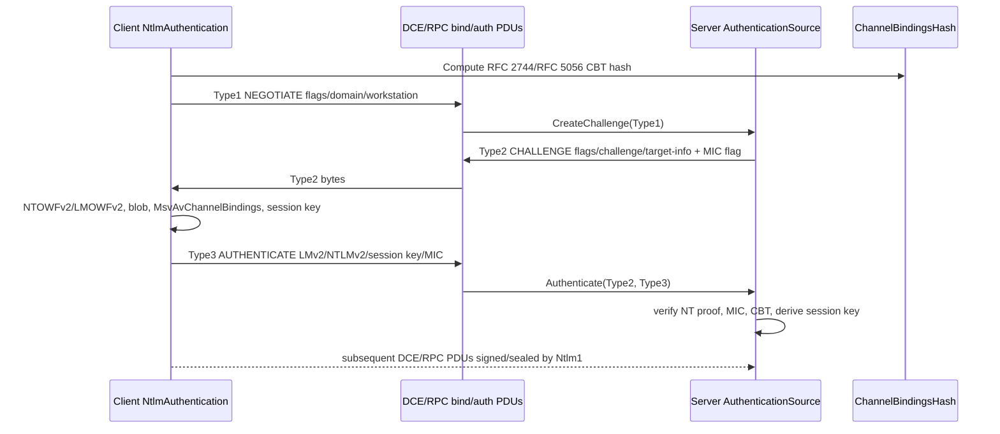

<!-- SPDX-License-Identifier: MIT -->
<!-- Last-updated: 2026-06-09T08:19:11+02:00; Commit: 3db24c2050a80a3d28c58e801516088d30aa8592 -->

# NTLMSSP design overview

## State machine

1. Client auth context is created by `NtlmAuthentication.CreateAuthContext` (`src\Opc.Classic.Dcom\rpc\Auth\NtlmAuthentication.cs:91`) from `OpcConnectData`.
2. Client creates Type1 with `NtlmAuthentication.CreateType1` (`NtlmAuthentication.cs:248`) or `NtlmAuthContext.BuildInitialToken` (`NtlmAuthentication.cs:169`).
3. Server-side verifier code creates Type2 with `AuthenticationSource.CreateChallenge` (`src\Opc.Classic.Dcom\rpc\Auth\AuthenticationSource.cs:68`) and `NtlmAuthentication.CreateType2` (`NtlmAuthentication.cs:266`).
4. Client processes Type2 and creates Type3 with `NtlmAuthContext.ProcessChallengeToken` (`NtlmAuthentication.cs:176`) and `NtlmAuthentication.CreateType3` (`NtlmAuthentication.cs:300`).
5. Type3 includes NTLMv2 response material from `Responses.GetLMv2Response` / `GetNTLMv2Response` and session-key setup through `NTLMKeyFactory`.
6. Server verifies Type3 through `AuthenticationSource.Authenticate` (`AuthenticationSource.cs:77`) and `NtlmAuthentication.CreateSecurityWhenServerWithMic` (`NtlmAuthentication.cs:567`).
7. Established calls use `NtlmConnection.OutgoingRebind` (`src\Opc.Classic.Dcom\rpc\Auth\NtlmConnection.cs:80`) or modern `IAuthContext.SignAndSeal` / `VerifyAndUnseal` (`NtlmAuthentication.cs:183`, `198`).
8. `NtlmConnectionContext.Accept` accepts client-side bind acks, but server-side `BindPdu`/`AlterContextPdu` paths throw because listener-level authenticated binds are not implemented (`src\Opc.Classic.Dcom\rpc\Auth\NtlmConnectionContext.cs:75-126`).

## Key types

- Message DTOs: `Type1Message`, `Type2Message`, `Type3Message` in `src\Opc.Classic.Dcom\Common\Ntlm\`.
- AV pairs: `NtlmAvPairs` (`MsvAvFlags`, `MsvAvChannelBindings`, MIC flag).
- MIC: `NtlmMic` and `Type3Message.ToByteArrayWithMic`.
- Channel binding: `ChannelBindings`, `ChannelBindingsFactory`, `ChannelBindingsHash` in `src\Opc.Classic.Core\Security\`.
- Session security: `NTLMKeyFactory` and `Ntlm1` in `src\Opc.Classic.Dcom\rpc\Auth\`.

## NTLMv2 with CBT sequence

## Wire-protocol integration

`PduCodec` reads and writes complete DCE/RPC frames (`src\Opc.Classic.Dcom\Transport\PduCodec.cs:42`, `144`) and preserves frame `auth_length` metadata. The client channel appends the actual DCE/RPC auth verifier in `DcomCallChannel.AttachAuthenticationVerifier` (`src\Opc.Classic.Dcom\Transport\DcomCallChannel.cs:449-474`).

For packet integrity/privacy, `DcomCallChannel.ApplyPacketProtectionCore` builds the verifier header, updates `frag_length` and `auth_length`, signs the full PDU except `auth_value`, and copies the 16-byte NTLM verifier returned by `IAuthContext.SignAndSeal` (`DcomCallChannel.cs:409-445`). Incoming frames are stripped and verified in `DcomCallChannel.StripAuthenticationVerifier` and `VerifyPacketProtection` (`DcomCallChannel.cs:383-503`).
