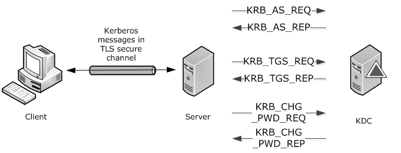
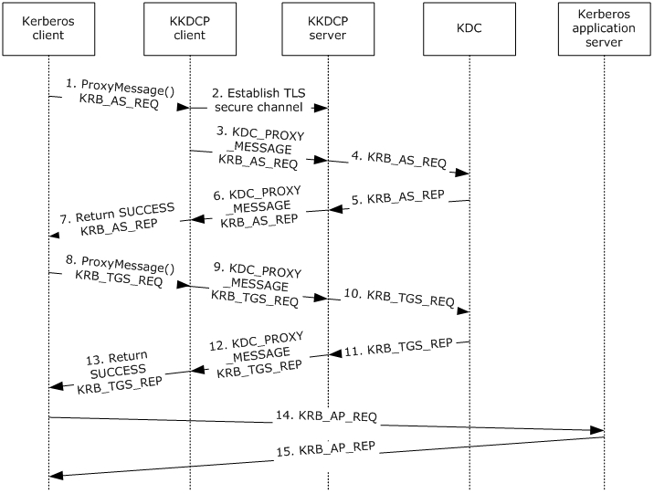
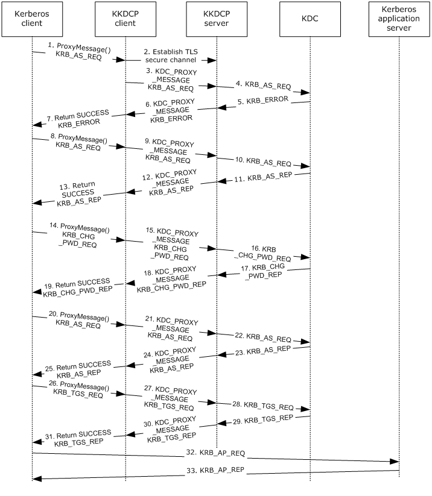

[MS-KKDCP]:

Kerberos Key Distribution Center (KDC) Proxy Protocol

Intellectual Property Rights Notice for Open Specifications Documentation

  Technical Documentation. Microsoft publishes Open Specifications documentation (“this

documentation”) for protocols, file formats, data portability, computer languages, and standards
support. Additionally, overview documents cover inter-protocol relationships and interactions.

  Copyrights. This documentation is covered by Microsoft copyrights. Regardless of any other

terms that are contained in the terms of use for the Microsoft website that hosts this
documentation, you can make copies of it in order to develop implementations of the technologies
that are described in this documentation and can distribute portions of it in your implementations
that use these technologies or in your documentation as necessary to properly document the
implementation. You can also distribute in your implementation, with or without modification, any
schemas, IDLs, or code samples that are included in the documentation. This permission also
applies to any documents that are referenced in the Open Specifications documentation.
  No Trade Secrets. Microsoft does not claim any trade secret rights in this documentation.
  Patents. Microsoft has patents that might cover your implementations of the technologies

described in the Open Specifications documentation. Neither this notice nor Microsoft's delivery of
this documentation grants any licenses under those patents or any other Microsoft patents.
However, a given Open Specifications document might be covered by the Microsoft Open
Specifications Promise or the Microsoft Community Promise. If you would prefer a written license,
or if the technologies described in this documentation are not covered by the Open Specifications
Promise or Community Promise, as applicable, patent licenses are available by contacting
iplg@microsoft.com.

  License Programs. To see all of the protocols in scope under a specific license program and the

associated patents, visit the Patent Map.

  Trademarks. The names of companies and products contained in this documentation might be
covered by trademarks or similar intellectual property rights. This notice does not grant any
licenses under those rights. For a list of Microsoft trademarks, visit
www.microsoft.com/trademarks.

  Fictitious Names. The example companies, organizations, products, domain names, email

addresses, logos, people, places, and events that are depicted in this documentation are fictitious.
No association with any real company, organization, product, domain name, email address, logo,
person, place, or event is intended or should be inferred.

Reservation of Rights. All other rights are reserved, and this notice does not grant any rights other
than as specifically described above, whether by implication, estoppel, or otherwise.

Tools. The Open Specifications documentation does not require the use of Microsoft programming
tools or programming environments in order for you to develop an implementation. If you have access
to Microsoft programming tools and environments, you are free to take advantage of them. Certain
Open Specifications documents are intended for use in conjunction with publicly available standards
specifications and network programming art and, as such, assume that the reader either is familiar
with the aforementioned material or has immediate access to it.

Support. For questions and support, please contact dochelp@microsoft.com.

[MS-KKDCP] - v20240423
Kerberos Key Distribution Center (KDC) Proxy Protocol
Copyright © 2024 Microsoft Corporation
Release: April 23, 2024

1 / 22

Revision Summary

Date

Revision
History

Revision
Class

Comments

12/16/2011  1.0

3/30/2012

1.0

New

None

Released new document.

No changes to the meaning, language, or formatting of the
technical content.

7/12/2012

1.1

Minor

Clarified the meaning of the technical content.

10/25/2012  1.1

1/31/2013

1.2

8/8/2013

2.0

11/14/2013  2.1

2/13/2014

3.0

5/15/2014

3.1

6/30/2015

4.0

10/16/2015  4.0

None

Minor

Major

Minor

Major

Minor

Major

None

No changes to the meaning, language, or formatting of the
technical content.

Clarified the meaning of the technical content.

Significantly changed the technical content.

Clarified the meaning of the technical content.

Significantly changed the technical content.

Clarified the meaning of the technical content.

Significantly changed the technical content.

No changes to the meaning, language, or formatting of the
technical content.

7/14/2016

4.0

None

No changes to the meaning, language, or formatting of the
technical content.

6/1/2017

4.0

9/15/2017

5.0

9/12/2018

6.0

4/7/2021

7.0

6/25/2021

8.0

4/23/2024

9.0

None

Major

Major

Major

Major

Major

No changes to the meaning, language, or formatting of the
technical content.

Significantly changed the technical content.

Significantly changed the technical content.

Significantly changed the technical content.

Significantly changed the technical content.

Significantly changed the technical content.

[MS-KKDCP] - v20240423
Kerberos Key Distribution Center (KDC) Proxy Protocol
Copyright © 2024 Microsoft Corporation
Release: April 23, 2024

2 / 22

## Table of Contents

- [1 Introduction](#1-introduction)
  - [1.1 Glossary](#11-glossary)
  - [1.2 References](#12-references)
    - [1.2.1 Normative References](#121-normative-references)
    - [1.2.2 Informative References](#122-informative-references)
  - [1.3 Overview](#13-overview)
  - [1.4 Relationship to Other Protocols](#14-relationship-to-other-protocols)
  - [1.5 Prerequisites/Preconditions](#15-prerequisitespreconditions)
  - [1.6 Applicability Statement](#16-applicability-statement)
  - [1.7 Versioning and Capability Negotiation](#17-versioning-and-capability-negotiation)
  - [1.8 Vendor-Extensible Fields](#18-vendor-extensible-fields)
  - [1.9 Standards Assignments](#19-standards-assignments)
- [2 Messages](#2-messages)
  - [2.1 Transport](#21-transport)
  - [2.2 Message Syntax](#22-message-syntax)
    - [2.2.1 Namespaces](#221-namespaces)
    - [2.2.2 KDC_PROXY_MESSAGE](#222-kdcproxymessage)
- [3 Protocol Details](#3-protocol-details)
  - [3.1 Client Details](#31-client-details)
    - [3.1.1 Abstract Data Model](#311-abstract-data-model)
    - [3.1.2 Timers](#312-timers)
    - [3.1.3 Initialization](#313-initialization)
    - [3.1.4 Higher-Layer Triggered Events](#314-higher-layer-triggered-events)
    - [3.1.5 Message Processing Events and Sequencing Rules](#315-message-processing-events-and-sequencing-rules)
      - [3.1.5.1 ProxyMessage() Call](#3151-proxymessage-call)
      - [3.1.5.2 Receiving a KDC_PROXY_MESSAGE](#3152-receiving-a-kdcproxymessage)
      - [3.1.5.3 Receiving a HTTP Error or Dropped Connection](#3153-receiving-a-http-error-or-dropped-connection)
    - [3.1.6 Timer Events](#316-timer-events)
    - [3.1.7 Other Local Events](#317-other-local-events)
  - [3.2 Server Details](#32-server-details)
    - [3.2.1 Abstract Data Model](#321-abstract-data-model)
    - [3.2.2 Timers](#322-timers)
    - [3.2.3 Initialization](#323-initialization)
    - [3.2.4 Higher-Layer Triggered Events](#324-higher-layer-triggered-events)
    - [3.2.5 Message Processing Events and Sequencing Rules](#325-message-processing-events-and-sequencing-rules)
      - [3.2.5.1 Receiving a KDC_PROXY_MESSAGE](#3251-receiving-a-kdcproxymessage)
      - [3.2.5.2 Receiving a Kerberos Message Response](#3252-receiving-a-kerberos-message-response)
    - [3.2.6 Timer Events](#326-timer-events)
    - [3.2.7 Other Local Events](#327-other-local-events)
- [4 Protocol Examples](#4-protocol-examples)
  - [4.1 Obtaining a Service Ticket](#41-obtaining-a-service-ticket)
  - [4.2 Obtaining a Service Ticket with Password Change](#42-obtaining-a-service-ticket-with-password-change)
- [5 Security](#5-security)
  - [5.1 Security Considerations for Implementers](#51-security-considerations-for-implementers)
  - [5.2 Index of Security Parameters](#52-index-of-security-parameters)
- [6 Appendix A: Product Behavior](#6-appendix-a-product-behavior)
- [7 Change Tracking](#7-change-tracking)
- [8 Index](#8-index)

## 1 Introduction

The Kerberos Key Distribution Center (KDC) Proxy Protocol (KKDCP) is used by an HTTP-based KKDCP
server and KKDCP client to relay the Kerberos Network Authentication Service (V5) protocol
[RFC4120] and Kerberos change password [RFC3244] messages between a Kerberos client and a
KDC.

Note  Throughout the remainder of this specification the Kerberos Network Authentication Service
(V5) protocol will be referred to simply as Kerberos V5. Kerberos Network Authentication Service (V5)
protocol [RFC4120] and Kerberos change password [RFC3244] messages will be referred to simply as
Kerberos messages.

Sections 1.5, 1.8, 1.9, 2, and 3 of this specification are normative. All other sections and examples in
this specification are informative.

### 1.1 Glossary

This document uses the following terms:

domain controller (DC): The service, running on a server, that implements Active Directory, or
the server hosting this service. The service hosts the data store for objects and interoperates
with other DCs to ensure that a local change to an object replicates correctly across all DCs.
When Active Directory is operating as Active Directory Domain Services (AD DS), the DC
contains full NC replicas of the configuration naming context (config NC), schema naming
context (schema NC), and one of the domain NCs in its forest. If the AD DS DC is a global
catalog server (GC server), it contains partial NC replicas of the remaining domain NCs in its
forest. For more information, see [MS-AUTHSOD] section 1.1.1.5.2 and [MS-ADTS]. When
Active Directory is operating as Active Directory Lightweight Directory Services (AD LDS),
several AD LDS DCs can run on one server. When Active Directory is operating as AD DS, only
one AD DS DC can run on one server. However, several AD LDS DCs can coexist with one AD
DS DC on one server. The AD LDS DC contains full NC replicas of the config NC and the schema
NC in its forest. The domain controller is the server side of Authentication Protocol Domain
Support [MS-APDS].

Hypertext Transfer Protocol Secure (HTTPS): An extension of HTTP that securely encrypts and

decrypts web page requests. In some older protocols, "Hypertext Transfer Protocol over Secure
Sockets Layer" is still used (Secure Sockets Layer has been deprecated). For more information,
see [SSL3] and [RFC5246].

Kerberos: An authentication system that enables two parties to exchange private information

across an otherwise open network by assigning a unique key (called a ticket) to each user that
logs on to the network and then embedding these tickets into messages sent by the users. For
more information, see [MS-KILE].

Key Distribution Center (KDC): The Kerberos service that implements the authentication and
ticket granting services specified in the Kerberos protocol. The service runs on computers
selected by the administrator of the realm or domain; it is not present on every machine on the
network. It has to have access to an account database for the realm that it serves. KDCs are
integrated into the domain controller role. It is a network service that supplies tickets to
clients for use in authenticating to services.

realm: A collection of key distribution centers (KDCs) with a common set of principals, as

described in [RFC4120] section 1.2.

ticket-granting ticket (TGT): A special type of ticket that can be used to obtain other tickets.

The TGT is obtained after the initial authentication in the Authentication Service (AS) exchange;
thereafter, users do not need to present their credentials, but can use the TGT to obtain
subsequent tickets.

4 / 22

[MS-KKDCP] - v20240423
Kerberos Key Distribution Center (KDC) Proxy Protocol
Copyright © 2024 Microsoft Corporation
Release: April 23, 2024

Transport Layer Security (TLS): A security protocol that supports confidentiality and integrity of
messages in client and server applications communicating over open networks. TLS supports
server and, optionally, client authentication by using X.509 certificates (as specified in [X509]).
TLS is standardized in the IETF TLS working group.

Uniform Resource Identifier (URI): A string that identifies a resource. The URI is an addressing
mechanism defined in Internet Engineering Task Force (IETF) Uniform Resource Identifier (URI):
Generic Syntax [RFC3986].

MAY, SHOULD, MUST, SHOULD NOT, MUST NOT: These terms (in all caps) are used as defined
in [RFC2119]. All statements of optional behavior use either MAY, SHOULD, or SHOULD NOT.

### 1.2 References

Links to a document in the Microsoft Open Specifications library point to the correct section in the
most recently published version of the referenced document. However, because individual documents
in the library are not updated at the same time, the section numbers in the documents may not
match. You can confirm the correct section numbering by checking the Errata.

#### 1.2.1 Normative References

We conduct frequent surveys of the normative references to assure their continued availability. If you
have any issue with finding a normative reference, please contact dochelp@microsoft.com. We will
assist you in finding the relevant information.

[MS-NRPC] Microsoft Corporation, "Netlogon Remote Protocol".

[RFC2119] Bradner, S., "Key words for use in RFCs to Indicate Requirement Levels", BCP 14, RFC
2119, March 1997, https://www.rfc-editor.org/info/rfc2119

[RFC2616] Fielding, R., Gettys, J., Mogul, J., et al., "Hypertext Transfer Protocol -- HTTP/1.1", RFC
2616, June 1999, https://www.rfc-editor.org/info/rfc2616

[RFC2818] Rescorla, E., "HTTP Over TLS", RFC 2818, May 2000, https://www.rfc-
editor.org/info/rfc2818

[RFC3244] Swift, M., Trostle, J., and Brezak, J., "Microsoft Windows 2000 Kerberos Change Password
and Set Password Protocols", RFC 3244, February 2002, https://www.rfc-editor.org/info/rfc3244

[RFC4120] Neuman, C., Yu, T., Hartman, S., and Raeburn, K., "The Kerberos Network Authentication
Service (V5)", RFC 4120, July 2005, https://www.rfc-editor.org/rfc/rfc4120

[RFC6113] Hartman, S., and Zhu, L., "A Generalized Framework for Kerberos Pre-Authentication", RFC
6113, April 2011, https://www.rfc-editor.org/info/rfc6113

[X680] ITU-T, "Abstract Syntax Notation One (ASN.1): Specification of Basic Notation",
Recommendation X.680, July 2002, http://www.itu.int/rec/T-REC-X.680/en

[X690] ITU-T, "Information Technology - ASN.1 Encoding Rules: Specification of Basic Encoding Rules
(BER), Canonical Encoding Rules (CER) and Distinguished Encoding Rules (DER)", Recommendation
X.690, July 2002, http://www.itu.int/rec/T-REC-X.690/en

#### 1.2.2 Informative References

None.

[MS-KKDCP] - v20240423
Kerberos Key Distribution Center (KDC) Proxy Protocol
Copyright © 2024 Microsoft Corporation
Release: April 23, 2024

5 / 22

<!-- Extracted images from page 6 -->

<!-- /Extracted images from page 6 -->

### 1.3 Overview

Kerberos V5 [RFC4120] requires client connectivity to the Key Distribution Center (KDC) for
authentication. Kerberos Key Distribution Center (KDC) Proxy Protocol (KKDCP) provides a mechanism
for a client to use a KKDCP server to change passwords and securely obtain Kerberos service tickets.
The KKDCP client sends Kerberos messages using HTTPS to the KKDCP server. The KKDCP server
locates a KDC for the request and sends the request to the KDC on behalf of the Kerberos V5 client.
Since the messages received by the KDC are Kerberos messages, the KDC does not have a role in
KKDCP. Once the KKDCP server receives the response from the KDC it sends the Kerberos message
using HTTPS to the KKDCP client.

Figure 1: Messages between client, server, and KDC

### 1.4 Relationship to Other Protocols

KKDCP relies on either HTTP [RFC2616] or HTTPS [RFC2818] for network transport.

The KDC proxy server relies on domain controller (DC) location ([MS-NRPC] section 3.4.5.1.1) to
find KDCs.

### 1.5 Prerequisites/Preconditions

KKDCP assumes the following:





The KKDCP client is configured with the URL of the KKDCP server.

The KKDCP client and server is configured for Transport Layer Security (TLS).

### 1.6 Applicability Statement

KKDCP provides suitable Kerberos message proxying capability for Kerberos V5 clients where the
client does not have connectivity to the KDC and a KKDCP server does.

### 1.7 Versioning and Capability Negotiation

None.

### 1.8 Vendor-Extensible Fields

None.

[MS-KKDCP] - v20240423
Kerberos Key Distribution Center (KDC) Proxy Protocol
Copyright © 2024 Microsoft Corporation
Release: April 23, 2024

6 / 22

### 1.9 Standards Assignments

None.

[MS-KKDCP] - v20240423
Kerberos Key Distribution Center (KDC) Proxy Protocol
Copyright © 2024 Microsoft Corporation
Release: April 23, 2024

7 / 22

## 2 Messages

### 2.1 Transport

Messages are transported by using HTTP POST as specified in [RFC2616]. These messages are sent
via Hypertext Transfer Protocol over Secure Sockets Layer (HTTPS) by default. The URI uses
the virtual directory /KdcProxy unless otherwise configured. The body of the HTTP message contains
the KDC_PROXY_MESSAGE (section 2.2.2).

KDC proxy messages are defined using Abstract Syntax Notation One (ASN.1), as specified in [X680],
and encoded using Distinguished Encoding Rules (DER), as specified in [X690] section 10.

### 2.2 Message Syntax

KKDCP does not alter the syntax of any Kerberos messages.

#### 2.2.1 Namespaces

None.

#### 2.2.2 KDC_PROXY_MESSAGE

This structure is a KDC proxy message that contains the Kerberos message to be proxied and
optional information for DC location at the KKDCP server.

 KDC-PROXY-MESSAGE::= SEQUENCE {
     kerb-message           [0] OCTET STRING,
     target-domain          [1] KERB-REALM OPTIONAL,
     dclocator-hint         [2] INTEGER OPTIONAL
 }

kerb-message: A Kerberos message, including the 4 octet length value specified in [RFC4120]

section 7.2.2 in network byte order.

target-domain: An optional KerberosString ([RFC4120] section 5.2.1) that represents the realm to
which the Kerberos message is sent, which is required for client messages and is not used in
server messages. This value is not case-sensitive.

dclocator-hint: An optional Flags ([MS-NRPC] section 3.5.4.3.1) which contains additional data to be

used to find a domain controller for the Kerberos message.

[MS-KKDCP] - v20240423
Kerberos Key Distribution Center (KDC) Proxy Protocol
Copyright © 2024 Microsoft Corporation
Release: April 23, 2024

8 / 22

## 3 Protocol Details

### 3.1 Client Details

This section describes details of protocol processing that must be understood in order to implement a
client that can correctly perform its role in the protocol message exchange.

#### 3.1.1 Abstract Data Model

This section describes a conceptual model of possible data organization that an implementation
maintains to participate in this protocol. The described organization is provided to facilitate the
explanation of how the protocol behaves. This document does not mandate that implementations
adhere to this model as long as their external behavior is consistent with that described in this
document.

The KKDCP client has the following configuration setting:

KKDCPServerURL: A string containing the URL of the KKDCP server.

The following parameters are set when the Kerberos client calls ProxyMessage():

KerberosMessage: A temporary variable that contains a Kerberos message.

Error: A temporary variable that contains an error message or NULL. By default, it is set to NULL.

TargetDomain: The realm field of the Kerberos message ([RFC4120] section 5.4.1).

#### 3.1.2 Timers

None.

#### 3.1.3 Initialization

As stated in section 1.5, the KKDCP client MUST be configured with the URL of the KKDCP server.

#### 3.1.4 Higher-Layer Triggered Events

The KKDCP client is triggered when the Kerberos client calls ProxyMessage() and when HTTPS
returns an error or data.

#### 3.1.5 Message Processing Events and Sequencing Rules

##### 3.1.5.1 ProxyMessage() Call

Inputs:







Input_kerb_message OCTET STRING

Target_domain KERB-REALM - optional

dclocator-hint INTEGER - optional

Outputs:

  Output_kerb_message OCTET STRING

[MS-KKDCP] - v20240423
Kerberos Key Distribution Center (KDC) Proxy Protocol
Copyright © 2024 Microsoft Corporation
Release: April 23, 2024

9 / 22

The ProxyMessage() call enables Kerberos clients to pass Kerberos messages and realm data to the
KKDCP client to proxy.

The KKDCP client SHOULD:

Establish an HTTPS connection using KKDCPServerURL.

Create a KDC_PROXY_MESSAGE (section 2.2.2) where:

kerb-message is set to KerberosMessage (section 3.1.1).

target-domain is set to the realm field of the Kerberos message ([RFC4120] section 5.4.1).

dclocator-hint: If the Kerberos client used only Flags G and H in DsrGetDcNameEx2 ([MS-
NRPC] section 3.5.4.3.1) when attempting to locate the domain controller, then this setting is
not used. Otherwise, it is set to the Flags used.

Send the KDC_PROXY_MESSAGE using the HTTPS connection to the KKDCP server.

If the KKDCP client receives:

  A Kerberos message reply, the client SHOULD set Output_kerb_message to

KerberosMessage (section 3.1.1) and return SUCCESS.

  Otherwise, the client SHOULD return Error, and SHOULD NOT return Output_kerb_message.

##### 3.1.5.2 Receiving a KDC_PROXY_MESSAGE

When the KKDCP client receives the KDC_PROXY_MESSAGE (section 2.2.2), it SHOULD set
KerberosMessage (section 3.1.1) to KDC_PROXY_MESSAGE.kerb-message.

##### 3.1.5.3 Receiving a HTTP Error or Dropped Connection

When the KKDCP client receives an HTTP error or dropped connection:

  On HTTP 403 errors, the client SHOULD set Error (section 3.1.1) to

STATUS_AUTHENTICATION_FIREWALL_FAILED.

  Otherwise, the client SHOULD set Error (section 3.1.1) to STATUS_NO_LOGON_SERVERS.

#### 3.1.6 Timer Events

None.

#### 3.1.7 Other Local Events

None.

### 3.2 Server Details

This section describes details of protocol processing that must be understood to implement a server
that can correctly perform its role in the protocol message exchange.

#### 3.2.1 Abstract Data Model

None.

[MS-KKDCP] - v20240423
Kerberos Key Distribution Center (KDC) Proxy Protocol
Copyright © 2024 Microsoft Corporation
Release: April 23, 2024

10 / 22

#### 3.2.2 Timers

None.

#### 3.2.3 Initialization

Prior to receiving request messages, the server MUST open an HTTP/HTTPS endpoint, which will
receive requests by clients with the URL for which they are configured.

#### 3.2.4 Higher-Layer Triggered Events

None.

#### 3.2.5 Message Processing Events and Sequencing Rules

##### 3.2.5.1 Receiving a KDC_PROXY_MESSAGE

When the KKDCP server receives the KDC_PROXY_MESSAGE (section 2.2.2), it SHOULD:

1.  Validate that the KDC_PROXY_MESSAGE.kerb-message is a well-formed Kerberos message.

If not, then the KKDCP server SHOULD drop the connection and stop processing.

2.  If target-domain is not present, return ERROR_BAD_FORMAT.

3.  Before the KKDCP server can send a Kerberos message, it MUST discover the KDC to which the

message will be sent. The KKDCP server SHOULD perform the equivalent of calling
DsrGetDcNameEx2 ([MS-NRPC] section 3.5.4.3.1) where:

  AllowableAccountControlBits has bits A, B, C, D, E, and F set.

  DomainName is TargetDomain.



Flags is KDC_PROXY_MESSAGE.dclocator-hint. If there is no dclocator-hint in the
message, Flags has bits G and H set.



If the Kerberos message is "FAST armored", then also set bit U.

  All other fields are set to NULL.

4.  Return the IP address of the DC in DomainControllerInfo.DomainControllerAddress.

5.  Send the KDC_PROXY_MESSAGE.kerb-message to the KDC.

##### 3.2.5.2 Receiving a Kerberos Message Response

When the KKDCP server receives the Kerberos message response, it SHOULD:

Create a KDC_PROXY_MESSAGE (section 2.2.2) where:

1.  kerb-message is set to the Kerberos message response.



target-domain is not used.

  dclocator-hint is not used.

2.  Send the KDC_PROXY_MESSAGE using the HTTP connection to the KKDCP client.

[MS-KKDCP] - v20240423
Kerberos Key Distribution Center (KDC) Proxy Protocol
Copyright © 2024 Microsoft Corporation
Release: April 23, 2024

11 / 22

#### 3.2.6 Timer Events

None.

#### 3.2.7 Other Local Events

None.

[MS-KKDCP] - v20240423
Kerberos Key Distribution Center (KDC) Proxy Protocol
Copyright © 2024 Microsoft Corporation
Release: April 23, 2024

12 / 22

<!-- Extracted images from page 13 -->

<!-- /Extracted images from page 13 -->

## 4 Protocol Examples

The following sections describe two common scenarios to illustrate the function of the KKDCP.

### 4.1 Obtaining a Service Ticket

Figure 2: Obtaining a service ticket

When a Kerberos client wants to use Kerberos-based authentication and cannot locate a DC for the
realm, it uses ProxyMessage() (section 3.1.5.1) to invoke the KKDCP client.

1.  Because the Kerberos client does not have a ticket-granting ticket (TGT), it calls ProxyMessage

with a KRB_AS_REQ.

2.  The KKDCP client establishes a TLS secure channel with the KKDCP server.

3.  The KKDCP client sends a KDC_PROXY_MESSAGE containing the KRB_AS_REQ to the KKDCP

server.

4.  The KKDCP server finds the KDC and sends the KRB_AS_REQ to the KDC.

5.  The KDC returns a KRB_AS_REP to the KKDCP server.

6.  The KKDCP server sends a KDC_PROXY_MESSAGE containing the KRB_AS_REP to the KKDCP

client.

7.  The KKDCP client returns the KRB_AS_REP and SUCCESS to the Kerberos client.

8.  The Kerberos client processes the KRB_AS_REP and calls ProxyMessage with a KRB_TGS_REQ.

13 / 22

[MS-KKDCP] - v20240423
Kerberos Key Distribution Center (KDC) Proxy Protocol
Copyright © 2024 Microsoft Corporation
Release: April 23, 2024

9.  The KKDCP client sends a KDC_PROXY_MESSAGE containing the KRB_TGS_REQ to the KKDCP

server.

10. The KKDCP server finds the KDC and sends the KRB_TGS_REQ to the KDC.

11. The KDC returns a KRB_TGS_REP to the KKDCP server.

12. The KKDCP server sends a KDC_PROXY_MESSAGE containing the KRB_TGS_REP to the KKDCP

client.

13. The KKDCP client returns the KRB_TGS_REP and SUCCESS to the Kerberos client.

14. The Kerberos client processes the KRB_TGS_REP and sends a KRB_AP_REQ to the Kerberos

application server.

15. The Kerberos application server processes the KRB_AP_REQ and sends a KRB_AP_REP to the

Kerberos client.

[MS-KKDCP] - v20240423
Kerberos Key Distribution Center (KDC) Proxy Protocol
Copyright © 2024 Microsoft Corporation
Release: April 23, 2024

14 / 22

<!-- Extracted images from page 15 -->

<!-- /Extracted images from page 15 -->

### 4.2 Obtaining a Service Ticket with Password Change

Figure 3: Obtaining a service ticket with password change

When a Kerberos client wants to use Kerberos-based authentication and cannot locate a DC for the
realm, it uses ProxyMessage() (section 3.1.5.1) to invoke the KKDCP client. If the logon requires the
user to change the password prior to logon, applications can use KKDCP for Kerberos password
change.

1.  Since the Kerberos client does not have a TGT, it calls ProxyMessage with a KRB_AS_REQ.

2.  The KKDCP client establishes a TLS secure channel with the KKDCP server.

3.  The KKDCP client sends a KDC_PROXY_MESSAGE containing the KRB_AS_REQ to the KKDCP

server.

15 / 22

[MS-KKDCP] - v20240423
Kerberos Key Distribution Center (KDC) Proxy Protocol
Copyright © 2024 Microsoft Corporation
Release: April 23, 2024

4.  The KKDCP server finds the KDC and sends the KRB_AS_REQ to the KDC.

5.  The KDC returns KRB_ERROR for password change required before logon to the KKDCP server.

6.  The KKDCP server sends a KDC_PROXY_MESSAGE containing the KRB_ERROR to the KKDCP

client.

7.  The KKDCP client returns the KRB_ERROR and SUCCESS to the Kerberos client.

8.  The Kerberos client processes the KRB_ERROR and returns a password change required before
logon error to the application. Since the application supports change password, it initiates a
Kerberos change password. The Kerberos client calls ProxyMessage with a KRB_AS_REQ for
kadmin/changepw.

9.  The KKDCP client sends a KDC_PROXY_MESSAGE containing the KRB_AS_REQ to the KKDCP

server.

10. The KKDCP server finds the KDC and sends the KRB_AS_REQ to the KDC.

11. The KDC returns a KRB_AS_REP to the KKDCP server.

12. The KKDCP server sends a KDC_PROXY_MESSAGE containing the KRB_AS_REP to the KKDCP

client.

13. The KKDCP client returns the KRB_AS_REP and SUCCESS to the Kerberos client.

14. The Kerberos client processes the KRB_AS_REP and creates a Kerberos change password request

(KRB_CHG_PWD_REQ) and calls ProxyMessage.

15. The KKDCP client sends a KDC_PROXY_MESSAGE containing the KRB_CHG_PWD_REQ to the

KKDCP server.

16. The KKDCP server finds the KDC and sends the KRB_CHG_PWD_REQ to the KDC.

17. The KDC returns a Kerberos change password request (KRB_CHG_PWD_REP) to the KKDCP

server.

18. The KKDCP server sends a KDC_PROXY_MESSAGE containing the KRB_CHG_PWD_REP to the

KKDCP client.

19. The KKDCP client returns the KRB_CHG_PWD_REP and SUCCESS to the Kerberos client.

20. The Kerberos client processes the KRB_CHG_PWD_REP. The application initiates a logon with the

new password. The Kerberos client calls ProxyMessage with a KRB_AS_REQ.

21. The KKDCP client sends a KDC_PROXY_MESSAGE containing the KRB_AS_REQ to the KKDCP

server.

22. The KKDCP server finds the KDC and sends the KRB_AS_REQ to the KDC.

23. The KDC returns a KRB_AS_REP to the KKDCP server.

24. The KKDCP server sends a KDC_PROXY_MESSAGE containing the KRB_AS_REP to the KKDCP

client.

25. The KKDCP client returns the KRB_AS_REP and SUCCESS to the Kerberos client.

26. The Kerberos client processes the KRB_AS_REP and calls ProxyMessage with a KRB_TGS_REQ.

27. The KKDCP client sends a KDC_PROXY_MESSAGE containing the KRB_TGS_REQ to the KKDCP

server.

[MS-KKDCP] - v20240423
Kerberos Key Distribution Center (KDC) Proxy Protocol
Copyright © 2024 Microsoft Corporation
Release: April 23, 2024

16 / 22

28. The KKDCP server finds the KDC and sends the KRB_TGS_REQ to the KDC.

29. The KDC returns a KRB_TGS_REP to the KKDCP server.

30. The KKDCP server sends a KDC_PROXY_MESSAGE containing the KRB_TGS_REP to the KKDCP

client.

31. The KKDCP client returns the KRB_TGS_REP and SUCCESS to the Kerberos client.

32. The Kerberos client processes the KRB_TGS_REP and sends a KRB_AP_REQ to the Kerberos

application server.

33. The Kerberos application server processes the KRB_AP_REQ and sends a KRB_AP_REP to the

Kerberos client.

[MS-KKDCP] - v20240423
Kerberos Key Distribution Center (KDC) Proxy Protocol
Copyright © 2024 Microsoft Corporation
Release: April 23, 2024

17 / 22

## 5 Security

### 5.1 Security Considerations for Implementers

Because KKDCP is typically used in the Internet, messages are only protected when HTTPS is used,
and the KKDCP server’s certificate is valid. When using HTTP, the KKDCP client is sending clear text
Kerberos messages, which are vulnerable to attacks discussed in Kerberos V5 ([RFC4120] section
10), unless FAST [RFC6113] is used.

When the KKDCP server relays messages from Internet KKDCP clients to the KDC, it opens
unauthenticated access to the KDC from the Internet, unless TLS client authentication is required.
KKDCP servers can also provide some level of protection by only relaying valid Kerberos messages,
and by throttling messages. KKDCP servers open KDCs to the Internet, exposing them to denial-of-
service attacks (using Kerberos messages) that were previously only possible via other authentication
protocols, such as NTLM.

### 5.2 Index of Security Parameters

None.

[MS-KKDCP] - v20240423
Kerberos Key Distribution Center (KDC) Proxy Protocol
Copyright © 2024 Microsoft Corporation
Release: April 23, 2024

18 / 22

## 6 Appendix A: Product Behavior

The information in this specification is applicable to the following Microsoft products or supplemental
software. References to product versions include updates to those products.

  Windows 8 operating system

  Windows Server 2012 operating system

  Windows 8.1 operating system

  Windows Server 2012 R2 operating system

  Windows 10 operating system

  Windows Server 2016 operating system

  Windows Server operating system

  Windows Server 2019 operating system

  Windows Server 2022 operating system

  Windows 11 operating system

  Windows Server 2025 operating system

Exceptions, if any, are noted in this section. If an update version, service pack or Knowledge Base
(KB) number appears with a product name, the behavior changed in that update. The new behavior
also applies to subsequent updates unless otherwise specified. If a product edition appears with the
product version, behavior is different in that product edition.

Unless otherwise specified, any statement of optional behavior in this specification that is prescribed
using the terms "SHOULD" or "SHOULD NOT" implies product behavior in accordance with the
SHOULD or SHOULD NOT prescription. Unless otherwise specified, the term "MAY" implies that the
product does not follow the prescription.

[MS-KKDCP] - v20240423
Kerberos Key Distribution Center (KDC) Proxy Protocol
Copyright © 2024 Microsoft Corporation
Release: April 23, 2024

19 / 22

## 7 Change Tracking

This section identifies changes that were made to this document since the last release. Changes are
classified as Major, Minor, or None.

The revision class Major means that the technical content in the document was significantly revised.
Major changes affect protocol interoperability or implementation. Examples of major changes are:

  A document revision that incorporates changes to interoperability requirements.
  A document revision that captures changes to protocol functionality.

The revision class Minor means that the meaning of the technical content was clarified. Minor changes
do not affect protocol interoperability or implementation. Examples of minor changes are updates to
clarify ambiguity at the sentence, paragraph, or table level.

The revision class None means that no new technical changes were introduced. Minor editorial and
formatting changes may have been made, but the relevant technical content is identical to the last
released version.

The changes made to this document are listed in the following table. For more information, please
contact dochelp@microsoft.com.

Section

Description

6 Appendix A: Product
Behavior

Added Windows Server 2025 to the list of applicable
products.

Revision
class

Major

[MS-KKDCP] - v20240423
Kerberos Key Distribution Center (KDC) Proxy Protocol
Copyright © 2024 Microsoft Corporation
Release: April 23, 2024

20 / 22

## 8 Index
A

Abstract data model
   client 9
   server 10
Applicability 6

C

Capability negotiation 6
Change tracking 20
Client
   abstract data model 9
   higher-layer triggered events 9
   initialization 9
   message processing
      ProxyMessage call 9
      receiving KDC_PROXY_MESSAGE (section

3.1.5.2 10, section 3.1.5.3 10)

   other local events 10
   overview 9
   sequencing rules
      ProxyMessage call 9
      receiving KDC_PROXY_MESSAGE (section

3.1.5.2 10, section 3.1.5.3 10)

   timer events 10
   timers 9

D

Data model - abstract
   client 9
   server 10

E

Examples
   obtaining service ticket 13
   obtaining service ticket with password change 15

F

Fields - vendor-extensible 6

G

Glossary 4

H

Higher-layer triggered events
   client 9
   server 11

I

Implementer - security considerations 18
Index of security parameters 18
Informative references 5
Initialization
   client 9

[MS-KKDCP] - v20240423
Kerberos Key Distribution Center (KDC) Proxy Protocol
Copyright © 2024 Microsoft Corporation
Release: April 23, 2024

   server 11
Introduction 4

K

KDC_PROXY_MESSAGE message 8

M

Message processing
   client
      ProxyMessage call 9
      receiving KDC_PROXY_MESSAGE (section

3.1.5.2 10, section 3.1.5.3 10)

   server
      receiving KDC_PROXY_MESSAGE 11
      receiving Kerberos message response 11
Messages
   KDC_PROXY_MESSAGE 8
   KDC_PROXY_MESSAGE message 8
   Namespaces 8
   Namespaces message 8
   transport 8

N

Namespaces message 8
Normative references 5

O

Obtaining service ticket example 13
Obtaining service ticket with password change

example 15

Other local events
   client 10
   server 12
Overview (synopsis) 6

P

Parameters - security index 18
Preconditions 6
Prerequisites 6
Product behavior 19

R

References 5
   informative 5
   normative 5
Relationship to other protocols 6

S

Security
   implementer considerations 18
   parameter index 18
Sequencing rules
   client
      ProxyMessage call 9

21 / 22

      receiving KDC_PROXY_MESSAGE (section

3.1.5.2 10, section 3.1.5.3 10)

   server
      receiving KDC_PROXY_MESSAGE 11
      receiving Kerberos message response 11
Server
   abstract data model 10
   higher-layer triggered events 11
   initialization 11
   message processing
      receiving KDC_PROXY_MESSAGE 11
      receiving Kerberos message response 11
   other local events 12
   overview 10
   sequencing rules
      receiving KDC_PROXY_MESSAGE 11
      receiving Kerberos message response 11
   timer events 12
   timers 11
Standards assignments 7

T

Timer events
   client 10
   server 12
Timers
   client 9
   server 11
Tracking changes 20
Transport 8
Triggered events - higher-layer
   client 9
   server 11

V

Vendor-extensible fields 6
Versioning 6

[MS-KKDCP] - v20240423
Kerberos Key Distribution Center (KDC) Proxy Protocol
Copyright © 2024 Microsoft Corporation
Release: April 23, 2024

22 / 22

