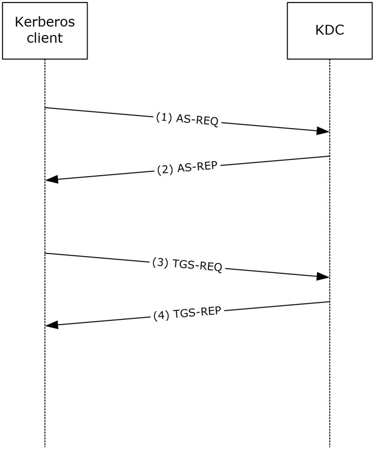
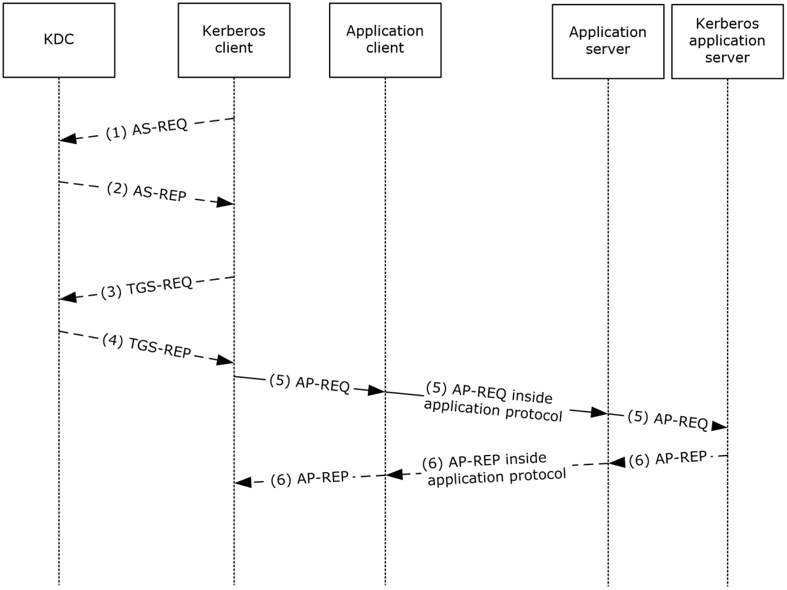

[MS-PKCA]:

Public Key Cryptography for Initial Authentication
(PKINIT) in Kerberos Protocol

Intellectual Property Rights Notice for Open Specifications Documentation

  Technical Documentation. Microsoft publishes Open Specifications documentation (“this

documentation”) for protocols, file formats, data portability, computer languages, and standards
support. Additionally, overview documents cover inter-protocol relationships and interactions.

  Copyrights. This documentation is covered by Microsoft copyrights. Regardless of any other

terms that are contained in the terms of use for the Microsoft website that hosts this
documentation, you can make copies of it in order to develop implementations of the technologies
that are described in this documentation and can distribute portions of it in your implementations
that use these technologies or in your documentation as necessary to properly document the
implementation. You can also distribute in your implementation, with or without modification, any
schemas, IDLs, or code samples that are included in the documentation. This permission also
applies to any documents that are referenced in the Open Specifications documentation.
  No Trade Secrets. Microsoft does not claim any trade secret rights in this documentation.
  Patents. Microsoft has patents that might cover your implementations of the technologies

described in the Open Specifications documentation. Neither this notice nor Microsoft's delivery of
this documentation grants any licenses under those patents or any other Microsoft patents.
However, a given Open Specifications document might be covered by the Microsoft Open
Specifications Promise or the Microsoft Community Promise. If you would prefer a written license,
or if the technologies described in this documentation are not covered by the Open Specifications
Promise or Community Promise, as applicable, patent licenses are available by contacting
iplg@microsoft.com.

  License Programs. To see all of the protocols in scope under a specific license program and the

associated patents, visit the Patent Map.

  Trademarks. The names of companies and products contained in this documentation might be
covered by trademarks or similar intellectual property rights. This notice does not grant any
licenses under those rights. For a list of Microsoft trademarks, visit
www.microsoft.com/trademarks.

  Fictitious Names. The example companies, organizations, products, domain names, email

addresses, logos, people, places, and events that are depicted in this documentation are fictitious.
No association with any real company, organization, product, domain name, email address, logo,
person, place, or event is intended or should be inferred.

Reservation of Rights. All other rights are reserved, and this notice does not grant any rights other
than as specifically described above, whether by implication, estoppel, or otherwise.

Tools. The Open Specifications documentation does not require the use of Microsoft programming
tools or programming environments in order for you to develop an implementation. If you have access
to Microsoft programming tools and environments, you are free to take advantage of them. Certain
Open Specifications documents are intended for use in conjunction with publicly available standards
specifications and network programming art and, as such, assume that the reader either is familiar
with the aforementioned material or has immediate access to it.

Support. For questions and support, please contact dochelp@microsoft.com.

[MS-PKCA] - v20260309
Public Key Cryptography for Initial Authentication (PKINIT) in Kerberos Protocol
Copyright © 2026 Microsoft Corporation
Release: March 9, 2026

1 / 29

Revision Summary

Date

Revision
History

Revision
Class

Comments

3/2/2007

1.0

4/3/2007

1.1

5/11/2007

1.2

New

Minor

Minor

Version 1.0 release

Version 1.1 release

Version 1.2 release

6/1/2007

1.2.1

Editorial

Changed language and formatting in the technical content.

7/3/2007

1.2.2

Editorial

Changed language and formatting in the technical content.

8/10/2007

1.2.3

Editorial

Changed language and formatting in the technical content.

9/28/2007

1.2.4

Editorial

Changed language and formatting in the technical content.

10/23/2007  2.0

1/25/2008

2.1

Major

Minor

Converted document to unified format.

Clarified the meaning of the technical content.

3/14/2008

2.1.1

Editorial

Changed language and formatting in the technical content.

6/20/2008

2.1.2

Editorial

Changed language and formatting in the technical content.

7/25/2008

2.1.3

Editorial

Changed language and formatting in the technical content.

8/29/2008

2.1.4

Editorial

Changed language and formatting in the technical content.

10/24/2008  2.1.5

Editorial

Changed language and formatting in the technical content.

12/5/2008

2.2

Minor

Clarified the meaning of the technical content.

1/16/2009

2.2.1

Editorial

Changed language and formatting in the technical content.

2/27/2009

2.2.2

Editorial

Changed language and formatting in the technical content.

4/10/2009

2.2.3

Editorial

Changed language and formatting in the technical content.

5/22/2009

2.2.4

Editorial

Changed language and formatting in the technical content.

7/2/2009

2.3

8/14/2009

2.4

9/25/2009

2.5

11/6/2009

3.0

12/18/2009  3.1

1/29/2010

3.2

3/12/2010

3.3

4/23/2010

4.0

6/4/2010

5.0

7/16/2010

5.1

8/27/2010

6.0

Minor

Minor

Minor

Major

Minor

Minor

Minor

Major

Major

Minor

Major

Clarified the meaning of the technical content.

Clarified the meaning of the technical content.

Clarified the meaning of the technical content.

Updated and revised the technical content.

Clarified the meaning of the technical content.

Clarified the meaning of the technical content.

Clarified the meaning of the technical content.

Updated and revised the technical content.

Updated and revised the technical content.

Clarified the meaning of the technical content.

Updated and revised the technical content.

[MS-PKCA] - v20260309
Public Key Cryptography for Initial Authentication (PKINIT) in Kerberos Protocol
Copyright © 2026 Microsoft Corporation
Release: March 9, 2026

2 / 29

Date

Revision
History

Revision
Class

Comments

10/8/2010

6.0

11/19/2010  6.0

1/7/2011

6.0

2/11/2011

6.0

3/25/2011

6.0

5/6/2011

6.0

None

None

None

None

None

None

No changes to the meaning, language, or formatting of the
technical content.

No changes to the meaning, language, or formatting of the
technical content.

No changes to the meaning, language, or formatting of the
technical content.

No changes to the meaning, language, or formatting of the
technical content.

No changes to the meaning, language, or formatting of the
technical content.

No changes to the meaning, language, or formatting of the
technical content.

6/17/2011

6.1

Minor

Clarified the meaning of the technical content.

9/23/2011

6.1

None

No changes to the meaning, language, or formatting of the
technical content.

12/16/2011  7.0

Major

Updated and revised the technical content.

3/30/2012

7.0

None

No changes to the meaning, language, or formatting of the
technical content.

7/12/2012

7.1

Minor

Clarified the meaning of the technical content.

10/25/2012  7.1

1/31/2013

7.1

None

None

No changes to the meaning, language, or formatting of the
technical content.

No changes to the meaning, language, or formatting of the
technical content.

8/8/2013

8.0

Major

Updated and revised the technical content.

11/14/2013  8.0

2/13/2014

8.0

5/15/2014

8.0

None

None

None

No changes to the meaning, language, or formatting of the
technical content.

No changes to the meaning, language, or formatting of the
technical content.

No changes to the meaning, language, or formatting of the
technical content.

6/30/2015

9.0

Major

Significantly changed the technical content.

10/16/2015  9.0

None

No changes to the meaning, language, or formatting of the
technical content.

7/14/2016

9.0

6/1/2017

10.0

9/15/2017

11.0

9/12/2018

12.0

4/7/2021

13.0

None

Major

Major

Major

Major

No changes to the meaning, language, or formatting of the
technical content.

Significantly changed the technical content.

Significantly changed the technical content.

Significantly changed the technical content.

Significantly changed the technical content.

[MS-PKCA] - v20260309
Public Key Cryptography for Initial Authentication (PKINIT) in Kerberos Protocol
Copyright © 2026 Microsoft Corporation
Release: March 9, 2026

3 / 29

Date

Revision
History

Revision
Class

Comments

6/25/2021

14.0

10/6/2021

15.0

9/20/2023

16.0

9/25/2023

17.0

4/23/2024

18.0

7/29/2024

19.0

8/26/2024

20.0

9/16/2024

21.0

6/3/2025

22.0

11/21/2025  22.1

1/26/2026

23.0

3/9/2026

24.0

Major

Major

Major

Major

Major

Major

Major

Major

Major

Minor

Major

Major

Significantly changed the technical content.

Significantly changed the technical content.

Significantly changed the technical content.

Significantly changed the technical content.

Significantly changed the technical content.

Significantly changed the technical content.

Significantly changed the technical content.

Significantly changed the technical content.

Significantly changed the technical content.

Clarified the meaning of the technical content.

Significantly changed the technical content.

Significantly changed the technical content.

[MS-PKCA] - v20260309
Public Key Cryptography for Initial Authentication (PKINIT) in Kerberos Protocol
Copyright © 2026 Microsoft Corporation
Release: March 9, 2026

4 / 29

## Table of Contents

- [1 Introduction](#1-introduction)
  - [1.1 Glossary](#11-glossary)
  - [1.2 References](#12-references)
    - [1.2.1 Normative References](#121-normative-references)
    - [1.2.2 Informative References](#122-informative-references)
  - [1.3 Overview](#13-overview)
  - [1.4 Relationship to Other Protocols](#14-relationship-to-other-protocols)
  - [1.5 Prerequisites/Preconditions](#15-prerequisitespreconditions)
  - [1.6 Applicability Statement](#16-applicability-statement)
  - [1.7 Versioning and Capability Negotiation](#17-versioning-and-capability-negotiation)
  - [1.8 Vendor-Extensible Fields](#18-vendor-extensible-fields)
  - [1.9 Standards Assignments](#19-standards-assignments)
- [2 Messages](#2-messages)
  - [2.1 Transport](#21-transport)
  - [2.2 Message Syntax](#22-message-syntax)
    - [2.2.1 PA-PK-AS-REP_OLD 1](#221-pa-pk-as-repold-1)
    - [2.2.2 PA-PK-AS-REP_OLD 2](#222-pa-pk-as-repold-2)
    - [2.2.3 PA-PK-AS-REQ](#223-pa-pk-as-req)
    - [2.2.4 PA-PK-AS-REP](#224-pa-pk-as-rep)
- [3 Protocol Details](#3-protocol-details)
  - [3.1 Common Details](#31-common-details)
    - [3.1.1 Abstract Data Model](#311-abstract-data-model)
    - [3.1.2 Timers](#312-timers)
    - [3.1.3 Initialization](#313-initialization)
    - [3.1.4 Higher-Layer Triggered Events](#314-higher-layer-triggered-events)
    - [3.1.5 Message Processing Events and Sequencing Rules](#315-message-processing-events-and-sequencing-rules)
      - [3.1.5.1 Client](#3151-client)
      - [3.1.5.2 KDC](#3152-kdc)
        - [3.1.5.2.1 Certificate Mapping](#31521-certificate-mapping)
          - [3.1.5.2.1.1 SAN DNSName field](#315211-san-dnsname-field)
          - [3.1.5.2.1.2 SAN UPN field](#315212-san-upn-field)
          - [3.1.5.2.1.3 Explicit Mapping](#315213-explicit-mapping)
          - [3.1.5.2.1.4 Key Trust](#315214-key-trust)
          - [3.1.5.2.1.5 Mapping Strength](#315215-mapping-strength)
          - [3.1.5.2.1.6 SID](#315216-sid)
        - [3.1.5.2.2 Smart-card-only Account Password Reset](#31522-smart-card-only-account-password-reset)
    - [3.1.6 Timer Events](#316-timer-events)
    - [3.1.7 Other Local Events](#317-other-local-events)
- [4 Protocol Examples](#4-protocol-examples)
  - [4.1 Interactive Logon Using Smart Cards](#41-interactive-logon-using-smart-cards)
  - [4.2 Network Logon Using Smart Cards](#42-network-logon-using-smart-cards)
  - [4.3 Non-RFC Kerberos Clients during AS-REQ](#43-non-rfc-kerberos-clients-during-as-req)
- [5 Security](#5-security)
  - [5.1 Security Considerations for Implementers](#51-security-considerations-for-implementers)
  - [5.2 Index of Security Parameters](#52-index-of-security-parameters)
- [6 Appendix A: Product Behavior](#6-appendix-a-product-behavior)
- [7 Change Tracking](#7-change-tracking)
- [8 Index](#8-index)

## 1 Introduction

The Public Key Cryptography for Initial Authentication in Kerberos (PKINIT) protocol [RFC4556]
enables the use of public key cryptography in the initial authentication exchange (that is, in the
Authentication Service (AS) exchange) of the Kerberos protocol [MS-KILE]. This specification
describes the Public Key Cryptography for Initial Authentication in Kerberos (PKINIT): Microsoft
Extensions protocol (PKCA) and how the protocol differs from what is specified in [RFC4556].

In an implementation of [RFC4120] or KILE, the security of the AS exchange depends on the strength
of the password used to protect it. This also affects the security of subsequent protocol requests.

By using public key cryptography to protect the initial authentication, the Kerberos protocol [MS-KILE]
is substantially strengthened and can be used with already existing public key authentication
mechanisms such as smart cards.

This document references the PKINIT methods and data formats [RFC4556] and [RFC5349], that the
client and the KDC can use both to mutually authenticate during the AS exchange with public and
private key pairs and to negotiate the AS-REP key, which allows the KDC to encrypt the AS-REP key
sent to the client.

Sections 1.5, 1.8, 1.9, 2, and 3 of this specification are normative. All other sections and examples in
this specification are informative.

### 1.1 Glossary

This document uses the following terms:

Active Directory: The Windows implementation of a general-purpose directory service, which uses

LDAP as its primary access protocol. Active Directory stores information about a variety of
objects in the network such as user accounts, computer accounts, groups, and all related
credential information used by Kerberos [MS-KILE]. Active Directory is either deployed as Active
Directory Domain Services (AD DS) or Active Directory Lightweight Directory Services (AD LDS),
which are both described in [MS-ADOD]: Active Directory Protocols Overview.

Authentication Service (AS) exchange: The Kerberos subprotocol in which the Authentication
Service (AS) component of the key distribution center (KDC) accepts an initial logon or
authentication request from a client and provides the client with a ticket-granting ticket
(TGT) and necessary cryptographic keys to make use of the ticket. This is specified in
[RFC4120] section 3.1. The AS exchange is always initiated by the client, usually in response
to the initial logon of a principal such as a user.

authorization data: An extensible field within a Kerberos ticket, used to pass authorization data

about the principal on whose behalf the ticket was issued to the application service.

certification authority (CA): A third party that issues public key certificates. Certificates serve to
bind public keys to a user identity. Each user and certification authority (CA) can decide whether
to trust another user or CA for a specific purpose, and whether this trust is to be transitive. For
more information, see [RFC3280].

elliptic curve cryptography (ECC): A public-key cryptosystem that is based on high-order elliptic

curves over finite fields.  For more information, see [IEEE1363].

key: In cryptography, a generic term used to refer to cryptographic data that is used to initialize a

cryptographic algorithm. Keys are also sometimes referred to as keying material.

Key Distribution Center (KDC): The Kerberos service that implements the authentication and
ticket granting services specified in the Kerberos protocol. The service runs on computers
selected by the administrator of the realm or domain; it is not present on every machine on the
network. It has to have access to an account database for the realm that it serves. KDCs are

6 / 29

[MS-PKCA] - v20260309
Public Key Cryptography for Initial Authentication (PKINIT) in Kerberos Protocol
Copyright © 2026 Microsoft Corporation
Release: March 9, 2026

integrated into the domain controller role. It is a network service that supplies tickets to clients
for use in authenticating to services.

object identifier (OID): In the context of a directory service, a number identifying an object
class or attribute. Object identifiers are issued by the ITU and form a hierarchy. An OID is
represented as a dotted decimal string (for example, "1.2.3.4"). For more information on OIDs,
see [X660] and [RFC3280] Appendix A. OIDs are used to uniquely identify certificate templates
available to the certification authority (CA). Within a certificate, OIDs are used to identify
standard extensions, as described in [RFC3280] section 4.2.1.x, as well as non-standard
extensions.

one-way function (OWF): The calculation of a hash of the password using the Rivest-Shamir-

Adleman (RSA) MD4 function. OWF is used to refer to the resulting value of the hash operation.

pre-authentication: In Kerberos, a state in which a key distribution center (KDC) demands

that the requestor in the Authentication Service (AS) exchange demonstrate knowledge of
the key associated with the account. If the requestor cannot demonstrate this knowledge, the
KDC will not issue a ticket-granting ticket (TGT) ([RFC4120] sections 5.2.7 and 7.5.2).

privilege attribute certificate (PAC): A Microsoft-specific authorization data present in the
authorization data field of a ticket. The PAC contains several logical components, including
group membership data for authorization, alternate credentials for non-Kerberos authentication
protocols, and policy control information for supporting interactive logon.

public key infrastructure (PKI): The laws, policies, standards, and software that regulate or

manipulate certificates and public and private keys. In practice, it is a system of digital
certificates, certificate authorities (CAs), and other registration authorities that verify and
authenticate the validity of each party involved in an electronic transaction. For more
information, see [X509] section 6.

realm: A collection of key distribution centers (KDCs) with a common set of principals, as

described in [RFC4120] section 1.2.

security identifier (SID): An identifier for security principals that is used to identify an account
or a group. Conceptually, the SID is composed of an account authority portion (typically a
domain) and a smaller integer representing an identity relative to the account authority, termed
the relative identifier (RID). The SID format is specified in [MS-DTYP] section 2.4.2; a string
representation of SIDs is specified in [MS-DTYP] section 2.4.2 and [MS-AZOD] section 1.1.1.2.

service: A process or agent that is available on the network, offering resources or services for

clients. Examples of services include file servers, web servers, and so on.

ticket: A record generated by the key distribution center (KDC) that helps a client authenticate
to a service. It contains the client's identity, a unique cryptographic key for use with this ticket
(the session key), a time stamp, and other information, all sealed using the service's secret key.
It only serves to authenticate a client when presented along with a valid authenticator.

ticket-granting service (TGS): A service that issues tickets for admission to other services in its

own domain or for admission to the ticket-granting service in another domain.

ticket-granting ticket (TGT): A special type of ticket that can be used to obtain other tickets.

The TGT is obtained after the initial authentication in the Authentication Service (AS)
exchange; thereafter, users do not need to present their credentials, but can use the TGT to
obtain subsequent tickets.

MAY, SHOULD, MUST, SHOULD NOT, MUST NOT: These terms (in all caps) are used as defined
in [RFC2119]. All statements of optional behavior use either MAY, SHOULD, or SHOULD NOT.

[MS-PKCA] - v20260309
Public Key Cryptography for Initial Authentication (PKINIT) in Kerberos Protocol
Copyright © 2026 Microsoft Corporation
Release: March 9, 2026

7 / 29

### 1.2 References

Links to a document in the Microsoft Open Specifications library point to the correct section in the
most recently published version of the referenced document. However, because individual documents
in the library are not updated at the same time, the section numbers in the documents may not
match. You can confirm the correct section numbering by checking the Errata.

#### 1.2.1 Normative References

We conduct frequent surveys of the normative references to assure their continued availability. If you
have any issue with finding a normative reference, please contact dochelp@microsoft.com. We will
assist you in finding the relevant information.

[FIPS140] FIPS PUBS, "Security Requirements for Cryptographic Modules", FIPS PUB 140-2, May
2001, https://csrc.nist.gov/csrc/media/publications/fips/140/2/final/documents/fips1402.pdf

[ITUX680] ITU-T, "Abstract Syntax Notation One (ASN.1): Specification of Basic Notation",
Recommendation X.680, Approved 2021-02-13, https://www.itu.int/rec/T-REC-X.680-202102-I/en

[MS-ADA1] Microsoft Corporation, "Active Directory Schema Attributes A-L".

[MS-ADA2] Microsoft Corporation, "Active Directory Schema Attributes M".

[MS-ADA3] Microsoft Corporation, "Active Directory Schema Attributes N-Z".

[MS-ADTS] Microsoft Corporation, "Active Directory Technical Specification".

[MS-KILE] Microsoft Corporation, "Kerberos Protocol Extensions".

[MS-NLMP] Microsoft Corporation, "NT LAN Manager (NTLM) Authentication Protocol".

[MS-PAC] Microsoft Corporation, "Privilege Attribute Certificate Data Structure".

[MS-SAMR] Microsoft Corporation, "Security Account Manager (SAM) Remote Protocol (Client-to-
Server)".

[MS-SAMS] Microsoft Corporation, "Security Account Manager (SAM) Remote Protocol (Server-to-
Server)".

[MS-SPNG] Microsoft Corporation, "Simple and Protected GSS-API Negotiation Mechanism (SPNEGO)
Extension".

[MS-WCCE] Microsoft Corporation, "Windows Client Certificate Enrollment Protocol".

[RFC1964] Linn, J., "The Kerberos Version 5 GSS-API Mechanism", RFC 1964, June 1996,
https://www.rfc-editor.org/info/rfc1964

[RFC2119] Bradner, S., "Key words for use in RFCs to Indicate Requirement Levels", BCP 14, RFC
2119, March 1997, https://www.rfc-editor.org/info/rfc2119

[RFC2315] Kaliski, B., "PKCS #7: Cryptographic Message Syntax Version 1.5", RFC 2315, March 1998,
https://www.rfc-editor.org/info/rfc2315

[RFC2743] Linn, J., "Generic Security Service Application Program Interface Version 2, Update 1", RFC
2743, January 2000, https://www.rfc-editor.org/info/rfc2743

[RFC3370] Housley, R., "Cryptographic Message Syntax (CMS) Algorithms", RFC 3370, August 2002,
https://www.rfc-editor.org/info/rfc3370

[MS-PKCA] - v20260309
Public Key Cryptography for Initial Authentication (PKINIT) in Kerberos Protocol
Copyright © 2026 Microsoft Corporation
Release: March 9, 2026

8 / 29

[RFC3852] Housley, R., "Cryptographic Message Syntax (CMS)", RFC 3852, July 2004,
https://www.rfc-editor.org/info/rfc3852

[RFC4120] Neuman, C., Yu, T., Hartman, S., and Raeburn, K., "The Kerberos Network Authentication
Service (V5)", RFC 4120, July 2005, https://www.rfc-editor.org/rfc/rfc4120

[RFC4556] Zhu, L., and Tung, B., "Public Key Cryptography for Initial Authentication in Kerberos", RFC
4556, June 2006, https://www.rfc-editor.org/info/rfc4556

[RFC5280] Cooper, D., Santesson, S., Farrell, S., et al., "Internet X.509 Public Key Infrastructure
Certificate and Certificate Revocation List (CRL) Profile", RFC 5280, May 2008, https://www.rfc-
editor.org/info/rfc5280

[RFC5349] Zhu, L., Jaganathan, K., and Lauter, K., "Elliptic Curve Cryptography (ECC) Support for
Public Key Cryptography for Initial Authentication in Kerberos (PKINIT)", RFC 5349, September 2008,
https://www.rfc-editor.org/info/rfc5349

[RFC5754] Turner, S., "Using SHA2 Algorithms with Cryptographic Message Syntax", RFC 5754,
January 2010, https://www.rfc-editor.org/info/rfc5754

[RFC8017] Moriarty, K., Ed., Kaliski, B., Jonsson, J., and Rusch, A., "PKCS #1: RSA Cryptography
Specifications Version 2.2", November 2016, https://www.rfc-editor.org/info/rfc8017

[RFC8070] Moore, S., Miller, P., and Short, M., Ed., "Public Key Cryptography for Initial Authentication
in Kerberos (PKINIT)", https://www.rfc-editor.org/info/rfc8070

[X509] ITU-T, "Information Technology - Open Systems Interconnection - The Directory: Public-Key
and Attribute Certificate Frameworks", Recommendation X.509, August 2005,
http://www.itu.int/rec/T-REC-X.509/en

#### 1.2.2 Informative References

[MSFT-CVE-2021-33764] Microsoft Corporation, "Windows Key Distribution Center Information
Disclosure Vulnerability", CVE-2021-33764 July 13, 2021, https://msrc.microsoft.com/update-
guide/vulnerability/CVE-2021-33764

[MSKB-5060525] Microsoft Corporation, "June 2025 - 5060525", June 2025,
https://www.catalog.update.microsoft.com/Search.aspx?q=5060525

[MSKB-5060841] Microsoft Corporation, "June 2025 - 5060841", June 2025,
https://www.catalog.update.microsoft.com/Search.aspx?q=5060841

[RFC8636] L. Hornquist Astrand, L., Zhu, L., Cullen, M., Hudson, G., "Public Key Cryptography for
Initial Authentication in Kerberos (PKINIT)", RFC 8636, July 2019, https://www.rfc-
editor.org/rfc/rfc8636.html

### 1.3 Overview

The PKINIT protocol is a security protocol that authenticates entities on a network using public key
cryptography. Kerberos is a security protocol that mutually authenticates entities on a network and
can provide user credential delegation after authentication is complete. Kerberos is specified in
[RFC4120] and [MS-KILE], and PKINIT is specified in [RFC4556]. [RFC5349] specifies the use of
elliptic curve cryptography (ECC) within the framework of PKINIT. PKINIT is a pre-
authentication extension that extends the Kerberos Protocol to use public key cryptography and
ticket-granting ticket (TGT) data signing during the initial AS exchange.

[MS-PKCA] - v20260309
Public Key Cryptography for Initial Authentication (PKINIT) in Kerberos Protocol
Copyright © 2026 Microsoft Corporation
Release: March 9, 2026

9 / 29

This specification describes the extensions to PKINIT that enable the use of public key cryptography in
the initial authentication exchanges of the Kerberos protocol (Authentication Service (AS) exchange)
[RFC4120].

### 1.4 Relationship to Other Protocols

PKCA is defined as a Kerberos pre-authentication extension ([RFC4120] section 3.1.1). This
extension is used in the Kerberos AS exchange [RFC4556], and therefore PKCA relies on a working
Kerberos infrastructure and a certificate authority (CA) for issuing [X509] certificates. PKCA
includes the use of elliptic curve cryptography (ECC). ECC support [RFC5349] relies upon a CA
issuing ECC certificates.  Applications already using Kerberos can use PKCA without modifications.

In order to support NTLM authentication [MS-NLMP] for applications connecting to network services
that do not support Kerberos authentication, when PKCA is used, the KDC returns the user's NTLM
one-way function (OWF) in the privilege attribute certificate (PAC) PAC_CREDENTIAL_INFO
buffer ([MS-PAC] section 2.6.1).

### 1.5 Prerequisites/Preconditions

PKCA assumes the following, in addition to any assumptions specified in [MS-KILE]:

1.  The key distribution center (KDC) has an X.509 public key certificate [X509], issued by a

certificate authority (CA) and trusted by the clients in the Kerberos realm. For ECC support,
the KDC has an ECC public key certificate issued by a CA and trusted by clients in the Kerberos
realm. The issuing of these [X509] certificates is not addressed in this protocol specification.

2.  A cryptographic-strength random-number generator is available for generating keys and other

cryptographically sensitive information.<1>

3.  Each user has an [X509] certificate suitable for use with PKINIT. Details about such a certificate

are specified in [RFC4556] Appendix C.

Details about general Kerberos assumptions are specified in [RFC4120] section 1.6.

### 1.6 Applicability Statement

PKCA is used only in environments that use Kerberos, and it requires the deployment of a Public Key
Infrastructure (PKI) for issuing [X509] certificates.

### 1.7 Versioning and Capability Negotiation

PKCA does not have explicit versioning; it is tied to the Kerberos protocol [MS-KILE] versioning
mechanisms, as specified in [RFC4120] section 7.5.6. Capability negotiation is as specified in
[RFC4556] sections 3.3 and 3.4.

### 1.8 Vendor-Extensible Fields

None.

### 1.9 Standards Assignments

There are no standards assignments in PKCA beyond what is specified in [RFC4556] and [RFC5349].

[MS-PKCA] - v20260309
Public Key Cryptography for Initial Authentication (PKINIT) in Kerberos Protocol
Copyright © 2026 Microsoft Corporation
Release: March 9, 2026

10 / 29

## 2 Messages

### 2.1 Transport

Messages are carried in the Kerberos AS exchange as pre-authentication data, as specified in
[RFC4120] section 5.2.7.

### 2.2 Message Syntax

The message syntax SHOULD<2> be as specified in [RFC4556] section 3.2.

PKCA MAY<3> support these variations based on an earlier draft of [RFC4556] for interoperability.

An earlier draft of [RFC4556] supported a different pre-authentication data identifier:



PA-PK-AS-REP_OLD 15

The algorithm identifier in Cryptographic Message Syntax (CMS) messages, as specified in [RFC2315]
and [RFC3852], is md5WithRSAEncryption instead of md5 ([RFC3370] sections 3.2 and 2.2).<4>
SHA-1WithRSAEncryption [RFC3370] SHOULD<5> be supported. ecdsa-with-Sha1, ecdsa-with-
Sha256, ecdsa-with-Sha384, and ecdsa-with-Sha512 ([RFC5349] section 3) SHOULD<6> be
supported.

The following ECC curves ([RFC5349] section 5) SHOULD<7> be supported:







ECPRGF256Random | groupP-256 | secp256r1

ECPRGF384Random | groupP-384 | secp384r1

ECPRGF521Random | groupP-521 | secp521r1

#### 2.2.1 PA-PK-AS-REP_OLD 1

The data for the PA-PK-AS-REP_OLD pre-authentication data identifiers is based on an earlier draft
of [RFC4556]; therefore, there are some differences in the message format. The ASN.1 [ITUX680]
description of the message that SHOULD<8> be used in place of the message format specified in
[RFC4556] section 3.2.1 follows.

 PKINIT DEFINITIONS EXPLICIT TAGS ::=
 BEGIN
 --EXPORTS ALL--
 IMPORTS
 KerberosTime, PrincipalName, Realm, EncryptionKey
 FROM KerberosV5Spec2
 { iso(1) identified-organization(3) dod(6) internet(1) security(5)
          kerberosV5(2) }
 -- Different from [RFC4556] Appendix A
 ContentInfo, EnvelopedData, SignedData, IssuerAndSerialNumber
 FROM CryptographicMessageSyntax2004
 { iso(1) member-body(2) us(840) rsadsi(113549)
 pkcs(1) pkcs-9(9) smime(16) modules(0) cms-
 2004(24) }
 -- Same as defined in [RFC3852]
 AlgorithmIdentifier
 FROM PKIX1Explicit88
 { iso(1) identified-organization(3) dod(6) internet(1) security(5)
          mechanisms(5) pkix(7) id-mod(0) id-pkix1-explicit(18) };
 -- From [RFC3280] (Same as defined in [RFC4556] Appendix A)
 --
 -- PKINT data types

[MS-PKCA] - v20260309
Public Key Cryptography for Initial Authentication (PKINIT) in Kerberos Protocol
Copyright © 2026 Microsoft Corporation
Release: March 9, 2026

11 / 29

 --
 PA-PK-AS-REQ ::= SEQUENCE {
 -- PA TYPE 15
 signedAuthPack [0] IMPLICIT OCTET STRING
 }

 AuthPack::= SEQUENCE {
     pkAuthenticator  [0] PKAuthenticator
 }

 --
 -- PK-AUTHENTICATOR - Different from [RFC4556]
 -- Appendix A, PKAuthenticator.
 --
 PKAuthenticator::= SEQUENCE {
     kdc-name   [0] PRINCIPAL-NAME,
     kdc-realm  [1] REALM,
 -- name and realm of the KDC issuing the ticket
     cusec      [2] INTEGER,
     ctime      [3] KerberosTime,
     nonce      [4] INTEGER
 }
 END

PA-PK-AS-REQ field:



signedAuthPack: Contains content identical to the content of the signedAuthPack field, as specified
in [RFC4556] section 3.2.1.

AuthPack field:



pkAuthenticator: Contains a PKAuthenticator structure, as defined in this document. This variation
of the AuthPack structure is different from the one specified in [RFC4556].

PKAuthenticator fields:











kdc-name: Contains the name portion of the ticket-granting service (TGS) name of the KDC
that will service the request, as specified in [RFC4120] section 7.3.

kdc-realm: Contains the realm portion of the TGS name of the KDC that will service the request,
as specified in [RFC4120] section 7.3.

cusec: Contains the same content of the corresponding, identically named field in the type
PKAuthenticator, as specified in [RFC4556] section 3.2.1.

ctime: Contains the same content of the corresponding, identically named field in the type
PKAuthenticator, as specified in [RFC4556] section 3.2.1.

nonce: Contains the same content of the corresponding, identically named field in the type
PKAuthenticator, as specified in [RFC4556] section 3.2.1.

#### 2.2.2 PA-PK-AS-REP_OLD 2

The data for the PA-PK-AS-REP_OLD pre-authentication data identifiers is based on an earlier draft
of [RFC4556]; therefore, there are some differences in the message format. The ASN.1 [ITUX680]
description of the message that SHOULD<9> be used in place of the message format specified in
[RFC4556] section 3.2.3 follows.

 --

[MS-PKCA] - v20260309
Public Key Cryptography for Initial Authentication (PKINIT) in Kerberos Protocol
Copyright © 2026 Microsoft Corporation
Release: March 9, 2026

12 / 29

 -- KERB-REPLY-KEY-PACKAGE - Different from [RFC4556]
 -- Appendix A, ReplyKeyPack
 --
 KERB-REPLY-KEY-PACKAGE ::= SEQUENCE {
     replyKey [0] EncryptionKey,
 -- Contains the session key used to encrypt the enc-part
 -- field in the AS-REP, for example, the AS reply key.

 nonce [1] INTEGER,
 -- binds response to the request; MUST be same as the nonce
 -- passed in the PK-AUTHENTICATOR.
     ...
 } --#public-

KERB-REPLY-KEY-PACKAGE fields:



replyKey: Contains the same content of the identically named field in the type ReplyKeyPack, as
specified in [RFC4556] section 3.2.3.2.



nonce: Contains the nonce from the PKAuthenticator structure in the PA-PK-AS-REQ request.

However, if the AS-REQ message contains a padata of type KRB5-PADATA-AS-CHECKSUM(132) with
no corresponding data field (padata-value is an empty OCTET STRING), then the PA-PK-AS-REP_OLD
pre-authentication data contains the same data as specified in [RFC4556] section 3.2.3.2.

#### 2.2.3 PA-PK-AS-REQ

The PA-PK-AS-REQ message format is specified in [RFC4556] section 3.2.1.<10>

PKAuthenticator in [RFC4556] is extended to add the following PAChecksum2. If SHA-1 is disabled as
a checksum algorithm PAChecksum2 SHOULD be present; if this field is present, it will always be
validated even if it is SHA-1.<11>

 PAChecksum2 ::= SEQUENCE {
    checksum                     [0] OCTET STRING,
    algorithmIdentifier          [1] AlgorithmIdentifier
}

PAChecksum2 follows the freshness token specified in [RFC8070] section 4 which is itself an extension
of PKAuthenticator.

PAChecksum2 fields:





checksum: An octet string that is the result of calculating the checksum using the algorithm
identified by the algorithmIdentifier.

algorithmIdentifier: See [RFC5280], section 4.1.1.2, for the definition of algorithmIdentifier. The
algorithmIdentifier is an OID. The supported OIDs are as follows.

Name

OID

SHA-1

"1.3.14.3.2.26"

SHA-256

"2.16.840.1.101.3.4.2.1"

SHA-384

"2.16.840.1.101.3.4.2.2"

[MS-PKCA] - v20260309
Public Key Cryptography for Initial Authentication (PKINIT) in Kerberos Protocol
Copyright © 2026 Microsoft Corporation
Release: March 9, 2026

13 / 29

Name

OID

SHA-512

"2.16.840.1.101.3.4.2.3"

SHA-2 family OIDs are defined in [RFC5754]. The SHA-1 OID is defined in [RFC3370].

#### 2.2.4 PA-PK-AS-REP

The PA-PK-AS-REP message format is specified in [RFC4556] section 3.2.3.<12> The returned ticket
does not include the AD-INITIAL-VERIFIED-CAS type in the authorization data. The content of the
SignedData field in the content of EnvelopedData is encoded, as specified in [RFC2315] section 7, not
as specified in [RFC3852]. Therefore, the data is not wrapped in OCTET STRING; rather, it is wrapped
in an ANY DEFINED BY content specific type, as specified in [RFC2315] section 7.

[MS-PKCA] - v20260309
Public Key Cryptography for Initial Authentication (PKINIT) in Kerberos Protocol
Copyright © 2026 Microsoft Corporation
Release: March 9, 2026

14 / 29

## 3 Protocol Details

### 3.1 Common Details

#### 3.1.1 Abstract Data Model

This section describes a conceptual model of possible data organization that an implementation
maintains to participate in this protocol. The described organization is provided to facilitate the
explanation of how the protocol behaves. This document does not mandate that implementations
adhere to this model as long as their external behavior is consistent with that described in this
document.

The abstract data model follows what is specified in [RFC4556].

#### 3.1.2 Timers

None.

#### 3.1.3 Initialization

During initialization, the [FIPS140]-compliant random-number generator for keys and nonces is
initialized.

#### 3.1.4 Higher-Layer Triggered Events

None.

#### 3.1.5 Message Processing Events and Sequencing Rules

In addition to the required ([RFC4556] section 3.1.1) and recommended ([RFC4556] section 3.1.2)
algorithms, an implementer MUST<13> specify des-ede3-cbc ([RFC4556] section 3.1.2) as the default
algorithm.

PKCA does not implement the id-pkinit-san algorithm ([RFC4556] section 3.2.2).

PKCA SHOULD<14> support the PKINIT Freshness Extension [RFC8070].

##### 3.1.5.1 Client

The Kerberos client SHOULD<15> <16> send only a PA-PK-AS-REQ pre-authentication data
identifier.

Kerberos clients can process either the PA-PK-AS-REP_OLD or the PA-PK-AS-REP pre-authentication
data identifier in the reply, but not both.<17>

For computer AS-REQ, PKCA clients SHOULD<18> fail unless all of the following conditions are met.



The computer certificate contains:





subjectAltName (SAN) DNSName field: <computer name>.<DNS domain name> where
<computer name> matches the computer name and <DNS domain name> matches the
computer's DNS domain name.

Enhance Key Usage (EKU): id-pkinit-KPClientAuth (1.3.6.1.5.2.3.4) or TLS/SSL Client
Authentication (1.3.6.1.5.5.7.3.2).

[MS-PKCA] - v20260309
Public Key Cryptography for Initial Authentication (PKINIT) in Kerberos Protocol
Copyright © 2026 Microsoft Corporation
Release: March 9, 2026

15 / 29



The KDC certificate contains:

  SAN DNSName field: the DNS name of the domain



EKU: id-pkinit-KPkdc (1.3.6.1.5.2.3.5)

See [RFC4120] for descriptions of possible errors.

##### 3.1.5.2 KDC

If the KDC receives both a PA-PK-AS-REQ and PA-PK-AS-REQ_OLD, the KDC MUST return
KRB_ERROR_GENERIC.

The KDC SHOULD<19> process the PA-PK-AS-REQ pre-authentication data identifier. The KDC
SHOULD<20> respond with PA-PK-AS-REP.

The KDC MUST return the user's unicodePwd attribute ([MS-ADA3] section 2.332) in the
NTLM_SUPPLEMENTAL_CREDENTIAL buffer ([MS-PAC] section 2.6.4).

See [RFC4120] for descriptions of possible errors.

###### 3.1.5.2.1 Certificate Mapping

The KDC SHOULD look up the account using the cname. If the account is not found and the cname
name-type is NT-X500-PRINCIPAL, the KDC locates the account in the account database using the
explicit mapping fields. Implementations of PKCA KDCs which use Active Directory for the account
database when the userAccountControl attribute ([MS-ADA3] section 2.342) bit WT or ST ([MS-ADTS]
section 2.2.16) is:



TRUE: validate certificate mapping using the SAN DNSName field.<21>

  Both FALSE: validate certificate mapping using the SAN UPNName field first, then try explicit

mapping.

If the account is not found, the KDC returns KDC_ERR_C_PRINCIPAL_UNKNOWN.

###### 3.1.5.2.1.1 SAN DNSName field

The KDC MUST confirm that the name of the account found matches the computer name in the
DNSName field of the certificate terminated with "$" and that the DNS domain name in the
DNSName field of the certificate matches the DNS domain name of the realm. Implementations of
PKCA KDCs which use Active Directory for the account database MUST use the sAMAccountName
attribute ([MS-ADA3] section 2.222) for the computer name. If they do not match, the KDC SHOULD
return KDC_ERR_CLIENT_NAME_MISMATCH.

###### 3.1.5.2.1.2 SAN UPN field

The KDC MUST confirm that the account found matches that the account found when using the UPN in
the UPN field of the certificate. If they do not match, the KDC SHOULD return
KDC_ERR_CLIENT_NAME_MISMATCH.

###### 3.1.5.2.1.3 Explicit Mapping

The KDC MUST confirm the explicit mapping of the account to a certificate. Implementations of PKCA
KDCs which use Active Directory for the account database MUST confirm that the
altSecurityIdentities attribute ([MS-ADA1] section 2.61) contains the string created by
concatenating the following information from the certificate in the order shown:

[MS-PKCA] - v20260309
Public Key Cryptography for Initial Authentication (PKINIT) in Kerberos Protocol
Copyright © 2026 Microsoft Corporation
Release: March 9, 2026

16 / 29

1.  Subject and Issuer Name fields: "X509:<I>" + Issuer Name field with "\r" and "\n" replaced with

"," + "<S>" + Subject field with "\r" and "\n" replaced with ",".

2.  Subject field: "X509:<S>" + Subject field with "\r" and "\n" replaced with ",".

3.  Issuer and Serial Number fields: "X509:<I>" + Issuer Name field with "\r" and "\n" replaced with

"," + "<SR>" + Serial Number field.

4.  Subject Key Identifier field: "X509:<SKI>" + Subject Key Identifier field.

5.  SHA1 hash of public key: "X509:<SHA1-PUKEY>" + SHA1 hash of public key.

6.  822 field: "X509: <RFC822>" + 822 Name field.

7.  Issuer and SID fields: "X509:<I>" + Issuer Name field with "\r" and "\n" replaced with "," +
"<SID>" + SID field.<22> More information about the SID field can be found in section
3.1.5.2.1.6.

If they do not match, the KDC SHOULD return KDC_ERR_CLIENT_NAME_MISMATCH.

###### 3.1.5.2.1.4 Key Trust

The KDC SHOULD<23> look the account up using the public key. If an account is found with the
public key that is trusted for the account, then the KDC SHOULD:



If the account was also found using the cname but the accounts do not match, return
KDC_ERR_CLIENT_NAME_MISMATCH.



Ignore any certificate chain validation errors.

Implementations of PKCA KDCs that use Active Directory for the account database MUST confirm
that the msDS-KeyCredentialLink attribute ([MS-ADA2] section 2.358) contains the same public key.
See [MS-ADTS] section 2.2.20.5.1 for how the 2048-bit RSA [RFC8017] public key is stored.

###### 3.1.5.2.1.5 Mapping Strength

The KDC SHOULD<24> map a certificate to a user using one of the following mappings. These
methods of mapping a certificate to a user are classified as strong or weak based on whether they
depend on a name as a secure identifier. The following mappings are considered weak:

  SAN UPNName

  SAN DNSName







altSecurityIdentities Issuer Name and Subject Name

altSecurityIdentities Subject Name

altSecurityIdentities 822 field

If a KDC maps a certificate to a user using one of the above weak mappings, it SHOULD<25>
continue to search for more mappings until it encounters a strong mapping. If it does not find such a
mapping, it MAY fail the authentication request with KDC_ERR_CERTIFICATE_MISMATCH.

The following mappings are considered strong:

  SID (section 3.1.5.2.1.6)

  Key Trust (section 3.1.5.2.1.4)



altSecurityIdentities Issuer and Serial Number

[MS-PKCA] - v20260309
Public Key Cryptography for Initial Authentication (PKINIT) in Kerberos Protocol
Copyright © 2026 Microsoft Corporation
Release: March 9, 2026

17 / 29







altSecurityIdentities Subject Key Identifier

altSecurityIdentities SHA1 Hash of Public Key

altSecurityIdentities Issuer and SID<26>

If an Issuer-OID-MappingType triplet has been configured, the KDC SHOULD<27> consider
certificates from the specified Issuer with any of the specified policy OIDs to have strong mappings if
mapped via one of the specified mapping types. Supported MappingTypes are IssuerSubject (referring
to the altSecurityIdentities Issuer Name and Subject Name above) and UPNSuffix=<domainname>
(referring to the SAN UPNName above, scoped to UPNs ending in "@<domainname>").

###### 3.1.5.2.1.6 SID

If a Key Distribution Center (KDC) has exhausted all other mapping types for a certificate and
found a weak mapping without finding a strong mapping, it SHOULD<28> check if the certificate
contains a security identifier (SID). If the certificate does contain a SID and the SID matches the
user to which the certificate is weakly mapped, the certificate is to be considered strongly mapped. If
the SID does not match, the authentication MUST fail with KDC_ERR_CERTIFICATE_MISMATCH. If the
certificate does not contain a SID, the KDC MAY fail the authentication request as no strong mapping
is available. For more details on the objectSID in an issued certificate see [MS-WCCE] section
2.2.2.7.7.4.

If a KDC has further exhausted strong mapping per [MS-WCCE] section 2.2.2.7.7.4, it SHOULD<29>
check if the certificate contains a SID using a Subject Alternate Name with type URL in the literal
format of:

tag:microsoft.com,2022-09-14:sid:<string-sid>

If the certificate is weakly mapped to a user and the SID matches that user, the certificate is to be
considered strongly mapped.

###### 3.1.5.2.2 Smart-card-only Account Password Reset

When processing an AS-REQ request (section 2.2.3) the PKCA KDC MUST trigger a
ResetSmartCardAccountPassword request ([MS-SAMS] section 3.2.4.7) when the following conditions
are all TRUE:







The PKCA KDC is using Active Directory for the account database

The account’s userAccountControl attribute ([MS-ADTS] section 2.2.16) SR flag is set to TRUE.

The account’s PasswordMustChange attribute ([MS-SAMR] section 3.1.5.14.4) is set to zero, OR
the account’s PasswordLastSet attribute ([MS-SAMR] section 2.2.6.1) is set to a value in the
past.

Upon successful completion of the ResetSmartCardAccountPassword request, the PKCA KDC MUST
restart processing of the original request.

#### 3.1.6 Timer Events

None.

#### 3.1.7 Other Local Events

There are no local events other than what is specified in [RFC4556].

[MS-PKCA] - v20260309
Public Key Cryptography for Initial Authentication (PKINIT) in Kerberos Protocol
Copyright © 2026 Microsoft Corporation
Release: March 9, 2026

18 / 29

<!-- Extracted images from page 19 -->

<!-- /Extracted images from page 19 -->

## 4 Protocol Examples

The following sections describe three common scenarios to illustrate the function of the KILE.

### 4.1 Interactive Logon Using Smart Cards

Figure 1: Interactive logon

Step 1: A user attempts to log on to a client. At the logon screen, the user selects the certificate and
types the PIN. Using the PIN to unlock the smart card, the client generates an AS-REQ with PA-PK-AS-
REQ pre-authentication data ([RFC4556] section 3.2.1) and sends the request to the KDC.

Step 2: The KDC validates the AS-REQ ([RFC4120] section 3.1.2), including verifying the user's
signature and validating certificate ([RFC4556] section 3.2.2). If the AS-REQ is valid, the KDC
generates an AS-REP ([RFC4556] section 3.2.3), with a PAC ([MS-KILE] section 3.3.5.3.2) in the
authorization_data field of the TGT, and sends the reply to the client.

Step 3: The client validates the AS-REP ([RFC4556] section 3.2.4). For interactive logons, the client
runtime requests authentication to host/hostname.domain, where hostname is the actual name of the
client machine, and domain is the domain or realm of the client machine. If the AS-REP is valid, the
client generates a TGS-REQ based on the TGT that is obtained in step 2 to obtain a service ticket for
host/hostname.domain ([RFC4120] section 3.3.1) and sends the request to the KDC.

Step 4: The KDC validates the TGS-REQ ([RFC4120] section 3.3.2) ([MS-KILE] section 3.3.5.7.1). If
the TGS-REQ is valid, the KDC adds Domain Local Groups to the PAC ([MS-KILE] section 3.3.5.7.3),
generates a TGS-REP ([RFC4120] section 3.3.3), and sends the reply to the client.

19 / 29

[MS-PKCA] - v20260309
Public Key Cryptography for Initial Authentication (PKINIT) in Kerberos Protocol
Copyright © 2026 Microsoft Corporation
Release: March 9, 2026

The client validates the TGS-REP ([MS-KILE] section 3.3.4). If the TGS-REP is valid, the service ticket
is then interpreted by the Kerberos runtime within the local workstation.

The following fields from the KERB_VALIDATION_INFO field of the PAC ([MS-PAC] Section 2.5) are
required by the interactive logon client runtime to authorize the user for local interactive logon, and to
establish the necessary management profile for the user:





LogonTime

LogoffTime

  KickOffTime













PasswordLastSet

PasswordCanChange

EffectiveName

FullName

LogonScript

ProfilePath

  HomeDirectory

  HomeDirectoryDrive



LogonCount

  BadPasswordCount





LogonServer

LogonDomainName

  UserAccountControl

[MS-PKCA] - v20260309
Public Key Cryptography for Initial Authentication (PKINIT) in Kerberos Protocol
Copyright © 2026 Microsoft Corporation
Release: March 9, 2026

20 / 29

<!-- Extracted images from page 21 -->

<!-- /Extracted images from page 21 -->

### 4.2 Network Logon Using Smart Cards

Figure 2: Network logon

When an application wants authentication, it calls GSS_Init_sec_context ([RFC2743] section 2.2.1) to
either invoke KILE [MS-KILE] directly, or SPNEGO [MS-SPNG] which can invoke Kerberos.

Step 0: The application client calls GSS_Init_sec_context ([RFC2743] section 2.2.1).

When the client does not have a TGT, steps 1 through 2, as described in section 4.1, are performed.

When the client does not have a service ticket for the application server, steps 3 and 4, as described
in section 4.1, are performed.

Step 5: The Kerberos client generates a GSS-API initial token ([RFC1964] section 1.1.1) containing an
AP-REQ ([RFC4120] section 3.2.2) and returns it to the application.

Step 6: The application server calls GSS_Accept_sec_context ([RFC2743] section 2.2.2). The Kerberos
application server validates the AP-REQ ([RFC4120] section 3.2.3). If the AP-REQ is valid and the
client requested mutual authentication, the Kerberos application server generates a GSS-API response
token ([RFC1964] section 1.1.2) containing an AP-REP ([RFC4120] section 3.2.4) and returns it to the
application server. The Kerberos application server provides the authorization data from the ticket
to the operating system, which creates an object called an access token that provides authorization
functions.

If mutual authentication was requested, the application client calls GSS_Init_sec_context ([RFC2743]
section 2.2.1). The Kerberos client validates the AP-REP ([RFC4120] section 3.2.5). If the AP-REP is
valid, the Kerberos client returns GSS_S_COMPLETE ([RFC2743] section 2.2.1).

21 / 29

[MS-PKCA] - v20260309
Public Key Cryptography for Initial Authentication (PKINIT) in Kerberos Protocol
Copyright © 2026 Microsoft Corporation
Release: March 9, 2026

### 4.3 Non-RFC Kerberos Clients during AS-REQ

PKCA clients developed prior to finalizing RFC 4556 support a PKInit pre-authentication data based
on an earlier draft of [RFC4556].

Step 1: A user attempts to log on to a client. At the logon screen, the user selects the certificate and
types the PIN. Using the PIN to unlock the smart card, the client generates an AS-REQ with PA-PK-AS-
REP_OLD pre-authentication data (section 2.2.1) and sends the request to the KDC.

Step 2: The KDC validates the AS-REQ ([RFC4120] section 3.1.2) including verifying the user's
signature and validating certificate ([RFC4556] section 3.2.2). Since the PA-PK-AS-REP_OLD version
of the pre-authentication data does not contain a paChecksum, the KDC does not return a KRB-ERROR
with the code KDC_ERR_PA_CHECKSUM_MUST_BE_INCLUDED ([RFC4556] section 3.2.3).  If the AS-
REQ is valid, with the exception of the paChecksum checks, the KDC generates an AS-REP ([RFC4556]
section 3.2.3) using the PA-PK-AS-REP_OLD, instead of the PA-PK-AS-REP with a PAC ([MS-KILE]
section 3.3.5.6.4) in the authorization_data field of the TGT, and sends the reply to the client.

[MS-PKCA] - v20260309
Public Key Cryptography for Initial Authentication (PKINIT) in Kerberos Protocol
Copyright © 2026 Microsoft Corporation
Release: March 9, 2026

22 / 29

## 5 Security

### 5.1 Security Considerations for Implementers

PKCA security considerations are specified in [RFC4556]. PA-PK-AS-REP_OLD is the earlier version of
PA-PK-AS-REQ and PA-PK-AS-REP, and has the same security considerations.

### 5.2 Index of Security Parameters

PKCA security parameters are specified in [RFC4556].

Security parameter

Section

PKAuthenticator

2.2.1

KERB-REPLY-KEY-PACKAGE  2.2.2

[MS-PKCA] - v20260309
Public Key Cryptography for Initial Authentication (PKINIT) in Kerberos Protocol
Copyright © 2026 Microsoft Corporation
Release: March 9, 2026

23 / 29

## 6 Appendix A: Product Behavior

The information in this specification is applicable to the following Microsoft products or supplemental
software. References to product versions include updates to those products.

The terms "earlier" and "later", when used with a product version, refer to either all preceding
versions or all subsequent versions, respectively. The term "through" refers to the inclusive range of
versions. Applicable Microsoft products are listed chronologically in this section.

Windows Client

  Windows 2000 operating system

  Windows XP operating system

  Windows Vista operating system

  Windows 7 operating system

  Windows 8 operating system

  Windows 8.1 operating system

  Windows 10 operating system

  Windows 11 operating system

Windows Server

  Windows Server 2003 operating system

  Windows Server 2008 operating system

  Windows Server 2008 R2 operating system

  Windows Server 2012 operating system

  Windows Server 2012 R2 operating system

  Windows Server 2016 operating system



 Windows Server operating system

  Windows Server 2019 operating system

  Windows Server 2022 operating system

  Windows Server 2025 operating system

Exceptions, if any, are noted in this section. If an update version, service pack or Knowledge Base
(KB) number appears with a product name, the behavior changed in that update. The new behavior
also applies to subsequent updates unless otherwise specified. If a product edition appears with the
product version, behavior is different in that product edition.

Unless otherwise specified, any statement of optional behavior in this specification that is prescribed
using the terms "SHOULD" or "SHOULD NOT" implies product behavior in accordance with the
SHOULD or SHOULD NOT prescription. Unless otherwise specified, the term "MAY" implies that the
product does not follow the prescription.

<1> Section 1.5: Windows contains a FIPS-140-validated random-number generator, as specified in
[FIPS140].

[MS-PKCA] - v20260309
Public Key Cryptography for Initial Authentication (PKINIT) in Kerberos Protocol
Copyright © 2026 Microsoft Corporation
Release: March 9, 2026

24 / 29

<2> Section 2.2: [RFC4556] message syntax is not supported in Windows 2000, Windows XP, and
Windows Server 2003.

<3> Section 2.2: Windows 2000, Windows XP, and Windows Server 2003 sent PA-PK-AS-REP_OLD
where [RFC4120] would have them send PA-PK-AS-REQ or PA-PK-AS-REP.

<4> Section 2.2: Supported by Windows 2000, Windows XP operating system Service Pack 2 (SP2),
and Windows Server 2003 operating system with Service Pack 1 (SP1). In Windows Vista, Windows
Server 2008, Windows 7, and Windows Server 2008 R2, the object identifier (OID) has been
updated to match CMS algorithms, as specified in [RFC3370] sections 3.2 and 2.2. Windows 2000,
Windows XP, Windows XP operating system Service Pack 1 (SP1), and Windows Server 2003 do not
accept the correct OID.

<5> Section 2.2: Not supported by Windows 2000, Windows XP, and Windows Server 2003.

<6> Section 2.2: ECC is not supported by Windows 2000, Windows XP, Windows Server 2003,
Windows Vista, or Windows Server 2008.

<7> Section 2.2: ECC is not supported by Windows 2000, Windows XP, Windows Server 2003,
Windows Vista, or Windows Server 2008.

<8> Section 2.2.1: In Windows 2000, Windows XP SP2, and Windows Server 2003 with SP1,
SignedData is encoded as specified in [RFC2315] section 9, not as specified in [RFC3852] section 5.
Therefore, the data is not wrapped in OCTET STRING; it is wrapped in an ANY, as specified in
[RFC2315] section 7.

Except in Windows 2000, Windows XP, and Windows Server 2003, SignedData is encoded as specified
in [RFC3852].

Only Windows XP prior to Windows XP SP2, and Windows Server 2003 prior to Windows Server 2003
with SP1, do not accept the SignedData, as specified in [RFC3852].

In Windows 2000, Windows XP SP2, and Windows Server 2003 with SP1, the DHRepInfo form is not
implemented; the Public Key Encryption style is used, as specified in [RFC4556] section 3.2.3.2.

The Diffie-Hellman key delivery method, as specified in [RFC4556] section 3.2.3.1, is not supported in
Windows 2000, Windows XP, and Windows Server 2003.

In Windows 2000, Windows XP SP2, and Windows Server 2003 with SP1, the content-type field of the
SignedData in PA-PK-AS-REQ is id-data, as specified in [RFC3852] section 4, instead of id-pkinit-
authData.

Except in Windows 2000, Windows XP, and Windows Server 2003, the content-type field of the
SignedData is id-pkinit-authData, as specified in [RFC4556] section 3.2.3.2.

Only Windows XP prior to Windows XP SP2, and Windows Server 2003 prior to Windows Server 2003
with SP1, do not accept id-data in the PA-PK-AS-REQ_OLD pre-authentication data.

<9> Section 2.2.2: In Windows 2000, Windows XP SP2, and Windows Server 2003 with SP1, the
content-type field of the SignedData type inside the EnvelopedData type in the PA-PK-AS-REP_OLD
pre-authentication data is id-data, as defined in [RFC3852] section 4, instead of id-pkinit-rkeyData, as
defined in [RFC4556]. In all other Windows releases, the content-type field is id-pkinit-rkeyData, as
specified in [RFC4556].

Except in Windows XP prior to Windows XP SP2 and Windows Server 2003 prior to Windows Server
2003 with SP1, Windows accepts id-data in the SignedData contained in the PA-PK-AS-REP_OLD pre-
authentication data.

Windows does not process id-pkinit-san in the client's [X509] certificate, if present, as specified in
[RFC4556] section 3.2.4.

[MS-PKCA] - v20260309
Public Key Cryptography for Initial Authentication (PKINIT) in Kerberos Protocol
Copyright © 2026 Microsoft Corporation
Release: March 9, 2026

25 / 29

<10> Section 2.2.3: The PA-PK-AS-REQ message format is not supported in Windows 2000, Windows
XP, and Windows Server 2003.

<11> Section 2.2.3: The extension of PKAuthenticator in PA-PK-AS-REQ applies to Windows Server
2022, 23H2 operating system.and later versions. Windows Server 2022, 23H2 and later DCs will send
back TD-CMS-DIGEST-ALGORITHMS-DATA as described in [RFC8636] section 4, CMS Digest Algorithm
Agility.

On supported versions of Windows, PAChecksum2 is validated if any one of the following conditions is
true:

1.  The field is present

2.  If an EC algorithm is not allowed and the signedAuthPack algorithm is not SHA-1

3.  SHA-1 is disabled

<12> Section 2.2.4: The RFC version of PA-PK-AS-REP is not supported in Windows 2000, Windows
XP, and Windows Server 2003.

<13> Section 3.1.5: In Windows with PKCA, the KDC supports and uses des-ede3-cbc. The RC2
algorithm rc2-cbc is no longer supported for encryption mode based key delivery with Kerberos PKINIT
([RFC4556]). See Windows Key Distribution Center Information Disclosure Vulnerability July 13,
2021[MSFT-CVE-2021-33764]. This update applies to Windows Servers with Domain Controllers,
Windows Server 2008, and later.

<14> Section 3.1.5: [RFC8070] is not supported in Windows 2000, Windows XP, Windows Server
2003, Windows Vista, Windows Server 2008, Windows 7, Windows Server 2008 R2, Windows 8,
Windows Server 2012, Windows 8.1, or Windows Server 2012 R2.

<15> Section 3.1.5.1: Except in Windows 2000, Windows XP, and Windows Server 2003, the PKINIT
pre-authentication data identifiers have been updated to match what is specified in [RFC4556], with
one addition (KRB5-PADATA-AS-CHECKSUM) as noted below. However, for backward-compatibility, if
the client detects that the KDC is running Windows 2000, Windows XP, Windows Server 2003, or
Windows Vista, it sends both.

Except in Windows 2000, Windows XP, and Windows Server 2003, the client sends additional padata
(KRB5-PADATA-AS-CHECKSUM) besides what is specified in [RFC4556]. This padata contains no data.

 #define KRB5_PADATA_AS_CHECKSUM         132 /* AS checksum */

Clients running Windows XP and Windows 2000 also send this additional padata type.

<16> Section 3.1.5.1: Windows 2000, Windows XP, and Windows Server 2003 clients send a PA-PK-
AS-REP_OLD pre-authentication data identifier. Windows Vista, Windows Server 2008, Windows 7, and
Windows Server 2008 R2 clients send a PA-PK-AS-REP_OLD pre-authentication data identifier when all
of the following are true:





The user certificate has a smart card logon EKU.

The user certificate has a UPN in Subject Alternative Name.

<17> Section 3.1.5.1: Windows 2000 and Windows XP SP2 Kerberos clients only process PA-PK-AS-
REP-WINDOWS-OLD.

<18> Section 3.1.5.1: Computer logon is not supported by Windows 2000, Windows XP, Windows
Server 2003, Windows Vista, Windows Server 2008, Windows 7 and Windows Server 2008 R2.

[MS-PKCA] - v20260309
Public Key Cryptography for Initial Authentication (PKINIT) in Kerberos Protocol
Copyright © 2026 Microsoft Corporation
Release: March 9, 2026

26 / 29

Windows 10 through Windows 11, version 25H2 operating system and Windows Server 2016 through
Windows Server 2025 clients fail when Credential Guard is enabled and the KDC does not set the
optional nonce field.

<19> Section 3.1.5.2: Windows 2000 and Windows Server 2003 KDCs always discard the PA-PK-AS-
REQ data identifier and process the PA-PK-AS-REP_OLD data identifier, if present.

<20> Section 3.1.5.2: Windows 2000 and Windows Server 2003 KDCs respond with PA-PK-AS-
REP_OLD.

Windows Server 2025 does not support Public Key Encryption ([RFC4556] section 3.2.3.2) and returns
KRB_ERROR_GENERIC.

<21> Section 3.1.5.2.1: SAN DNSName field is not supported by Windows 2000, Windows Server
2003, Windows Server 2008 and Windows Server 2008 R2.

<22> Section 3.1.5.2.1.3:  Available in Windows Server 2022 and Windows Server 2025 after
installation of [MSKB-5060525] or [MSKB-5060841].

<23> Section 3.1.5.2.1.4: Public key lookup is not supported by Windows 2000, Windows Server
2003,  Windows Server 2008, Windows Server 2008 R2, Windows Server 2012, or Windows Server
2012 R2 KDCs.

<24> Section 3.1.5.2.1.5: Certificate mapping strength is applicable to Windows Server 2008 R2 and
later.

<25> Section 3.1.5.2.1.5: Certificate mapping strength is applicable to Windows Server 2008 R2 and
later.

<26> Section 3.1.5.2.1.5:  Available in Windows Server 2022 and Windows Server 2025 after
installation of [MSKB-5060525] or [MSKB-5060841].

<27> Section 3.1.5.2.1.5: In Windows Server 2019 and later, policy update allows for certificates
from issuer X with policy OID Y present inside the certificate for IssuerSubject altSecurityIdentitifier or
SAN UPN with a specified suffix to be considered strong instead of weak.

<28> Section 3.1.5.2.1.6: Certificate SID mapping is applicable to Windows Server 2008 R2 and later.

<29> Section 3.1.5.2.1.6: Certificate SID mapping using a Subject Alternate Name is applicable to
Windows Server 2019 and later.

[MS-PKCA] - v20260309
Public Key Cryptography for Initial Authentication (PKINIT) in Kerberos Protocol
Copyright © 2026 Microsoft Corporation
Release: March 9, 2026

27 / 29

## 7 Change Tracking

This section identifies changes that were made to this document since the last release. Changes are
classified as Major, Minor, or None.

The revision class Major means that the technical content in the document was significantly revised.
Major changes affect protocol interoperability or implementation. Examples of major changes are:

  A document revision that incorporates changes to interoperability requirements.
  A document revision that captures changes to protocol functionality.

The revision class Minor means that the meaning of the technical content was clarified. Minor changes
do not affect protocol interoperability or implementation. Examples of minor changes are updates to
clarify ambiguity at the sentence, paragraph, or table level.

The revision class None means that no new technical changes were introduced. Minor editorial and
formatting changes may have been made, but the relevant technical content is identical to the last
released version.

The changes made to this document are listed in the following table. For more information, please
contact dochelp@microsoft.com.

Section

Description

Revision
class

3.1.5.2
KDC

32101 : Updated Windows Behavior Note with Windows Server 2025 processing
for KDC that receives PA-PK-AS-REQ.

Major

[MS-PKCA] - v20260309
Public Key Cryptography for Initial Authentication (PKINIT) in Kerberos Protocol
Copyright © 2026 Microsoft Corporation
Release: March 9, 2026

28 / 29

## 8 Index
A

Applicability 10
Applicability statement 10

C

Capability negotiation 10
Change tracking 28

E

Examples
   non-RFC Kerberos clients during AS-REQ 22
   overview 19
   smart cards
      interactive logon using 19
      network logon using 21

F

Fields - vendor-extensible 10
Fields – vendor-extensible 10

G

Glossary 6

H

Higher-layer triggered events 15

I

Implementer - security considerations 23
Implementer – security considerations 23
Index of security parameters 23
Informative references 9
Initialization 15
Introduction 6

L

Local events 18

M

Message processing
   client 15
   KDC 16
   overview 15
Messages
   PA-PK-AS-REP 14
   PA-PK-AS-REP_OLD 1 11
   PA-PK-AS-REP_OLD 2 12
   PA-PK-AS-REQ 13
   syntax 11
   transport 11

N

Non-RFC Kerberos clients during AS-REQ example 22
Normative references 8

O

Overview (synopsis) 9

P

PA-PK-AS-REP 14
PA-PK-AS-REP message 14
PA-PK-AS-REP_OLD 12
PA-PK-AS-REP_OLD 1 message 11
PA-PK-AS-REP_OLD 2 message 12
PA-PK-AS-REQ 13
PA-PK-AS-REQ message 13
PA-PK-AS-REQ-WINDOWS-OLD 11
Parameter index – security 23
Parameters - security index 23
Preconditions 10
Prerequisites 10
Product behavior 24

R

References 8
   informative 9
   normative 8
Relationship to other protocols 10

S

Security
   implementer considerations 23
   parameter index 23
Sequencing rules
   client 15
   KDC 16
   overview 15
Smart cards
   interactive logon using - example 19
   network logon using - example 21
Standards assignments 10
Syntax – message 11

T

Timer events 18
Timers 15
Tracking changes 28
Transport 11
Triggered events – higher layer 15

V

Vendor-extensible fields 10
Versioning 10

[MS-PKCA] - v20260309
Public Key Cryptography for Initial Authentication (PKINIT) in Kerberos Protocol
Copyright © 2026 Microsoft Corporation
Release: March 9, 2026

29 / 29

