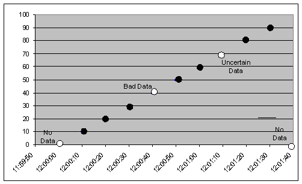
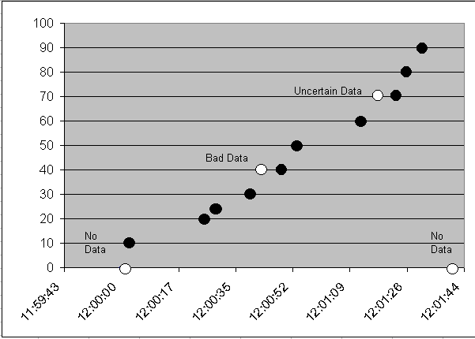
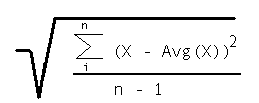

<!-- Errata notes: historical-dataaccess-1.20-errata.zip extracted to ext/private/docs/OPC-HDA-1.20-ERRATA-NOTES.md; table-heavy errata retained verbatim because automatic in-place application was unreliable. -->

F O U N D A T I O N

OPC Historical Data Access Specification

Version 1.20

Released

December 10, 2003

OPC Historical Data Access
Specification
(Version 1.20)

F O U N D A T I O N

Specification Type

Industry Standard Specification

Released

Title:

OPC Historical Data
Access Specification

Date:

December 10, 2003

Version:

Version 1.20

Soft
Source:  OPC HDA 1.20

MS-Word

Specification.doc

Author:

Opc Foundation 

Status:  Released

Synopsis:

This specification is the specification of the interface for developers of OPC
clients and OPC servers.   The specification is a result of an analysis and
design process to develop a standard interface to facilitate the development of
servers and clients by multiple vendors that shall inter-operate seamlessly
together.

Trademarks:

Most computer and software brand names have trademarks or registered
trademarks. The individual trademarks have not been listed here.

Required Runtime Environment:

This specification requires Windows 95 / Windows NT 4.0 or later

ii

OPC Historical Data Access
Specification
(Version 1.20)

F O U N D A T I O N

Released

NON-EXCLUSIVE LICENSE AGREEMENT

The OPC Foundation, a non-profit corporation (the “OPC Foundation”), has established a set of
specifications intended to foster greater interoperability between automation/control applications, field
systems/devices, and business/office applications in the process control industry.

The OPC specifications define standard interfaces, objects, methods, and properties for servers of real-time
information like distributed process systems, programmable logic controllers, smart field devices and
analyzers. The OPC Foundation distributes specifications, prototype software examples and related
documentation (collectively, the "OPC Materials") to its members in order to facilitate the development of
OPC compliant applications.

The OPC Foundation will grant to you (the "User"), whether an individual or legal entity, a license to use,
and provide User with a copy of, the current version of the OPC Materials so long as User abides by the
terms contained in this Non-Exclusive License Agreement ("Agreement"). If User does not agree to the
terms and conditions contained in this Agreement, the OPC Materials may not be used, and all copies (in
all formats) of such materials in User’s possession must either be destroyed or returned to the OPC
Foundation. By using the OPC Materials, User (including any employees and agents of User) agrees to be
bound by the terms of this Agreement.

All OPC Materials, unless explicitly designated otherwise, are only available to currently registered
members of the OPC Foundation (an "Active Member"). If the User is not an employee or agent of an
Active Member then the User is prohibited from using the OPC Materials and all copies (in all formats) of
such materials in User’s possession must either be destroyed or returned to the OPC Foundation.

LICENSE GRANT:

Subject to the terms and conditions of this Agreement, the OPC Foundation hereby grants to User a non-
exclusive, royalty-free, limited license to use, copy, display and distribute the OPC Materials in order to
make, use, sell or otherwise distribute any products and/or product literature that are compliant with the
standards included in the OPC Materials. User may not distribute OPC Materials outside of the Active
Member organization to which User belongs unless the OPC Foundation has explicitly designated the OPC
Material for public use.

All copies of the OPC Materials made and/or distributed by User must include all copyright and other
proprietary rights notices included on or in the copy of such materials provided to User by the OPC
Foundation.

The OPC Foundation shall retain all right, title and interest (including, without limitation, the copyrights)
in the OPC Materials, subject to the limited license granted to User under this Agreement.

The following additional restrictions apply to all OPC Materials that are software source code, libraries or
executables:

1.  User is requested to acknowledge the use of the OPC Materials and provide a link to the OPC

Foundation home page www.opcfoundation.org from the About box of the User’s or Active
Member’s application(s).

2.  User may include the source code, modified source code, built binaries or modified built binaries

within User’s own applications for either personal or commercial use except for:
a)  The OPC Foundation software source code or binaries cannot be sold as is, either individually

or together.

b)  The OPC Foundation software source code or binaries cannot be modified and then sold as a

library component, either individually or together.

iii

OPC Historical Data Access
Specification
(Version 1.20)

F O U N D A T I O N

Released

In other words, User may use OPC Foundation software to enhance the User’s applications and to ensure
compliance with the various OPC specifications. User is prohibited from gaining commercially from the
OPC software itself.

WARRANTY AND LIABILITY DISCLAIMERS:

User acknowledges that the OPC Foundation has provided the OPC Materials for informational purposes
only in order to help User understand the relevant OPC specifications. THE OPC MATERIALS ARE
PROVIDED "AS IS" WITHOUT WARRANTY OF ANY KIND, EXPRESS OR IMPLIED,
INCLUDING, BUT NOT LIMITED TO, WARRANTIES OF PERFORMANCE, MERCHANTABILITY,
FITNESS FOR A PARTICULAR PURPOSE OR NON-INFRINGEMENT. USER BEARS ALL RISK
RELATING TO QUALITY, DESIGN, USE AND PERFORMANCE OF THE OPC MATERIALS. The
OPC Foundation and its members do not warrant that the OPC Materials, their design or their use will meet
User’s requirements, operate without interruption or be error free.

IN NO EVENT SHALL THE OPC FOUNDATION, ITS MEMBERS, OR ANY THIRD PARTY BE
LIABLE FOR ANY COSTS, EXPENSES, LOSSES, DAMAGES (INCLUDING, BUT NOT LIMITED
TO, DIRECT, INDIRECT, CONSEQUENTIAL, INCIDENTAL, SPECIAL OR PUNITIVE DAMAGES)
OR INJURIES INCURRED BY USER OR ANY THIRD PARTY AS A RESULT OF THIS
AGREEMENT OR ANY USE OF THE OPC MATERIALS.

iv

OPC Historical Data Access
Specification
(Version 1.20)

GENERAL PROVISIONS:

F O U N D A T I O N

Released

This Agreement and User’s license to the OPC Materials shall be terminated (a) by User ceasing all use of
the OPC Materials, (b) by User obtaining a superseding version of the OPC Materials, or (c) by the OPC
Foundation, at its option, if User commits a material breach hereof.  Upon any termination of this
Agreement, User shall immediately cease all use of the OPC Materials, destroy all copies thereof then in its
possession and take such other actions as the OPC Foundation may reasonably request to ensure that no
copies of the OPC Materials licensed under this Agreement remain in its possession.

User shall not export or re-export the OPC Materials or any product produced directly by the use thereof to
any person or destination that is not authorized to receive them under the export control laws and
regulations of the United States.

The Software and Documentation are provided with Restricted Rights.  Use, duplication or disclosure by
the U.S. government is subject to restrictions as set forth in (a) this Agreement pursuant to DFARs
227.7202-3(a); (b) subparagraph (c)(1)(i) of the Rights in Technical Data and Computer Software clause at
DFARs 252.227-7013; or (c) the Commercial Computer Software Restricted Rights clause at FAR 52.227-
19 subdivision (c)(1) and (2), as applicable.  Contractor/ manufacturer is the OPC Foundation, 16101 N
82nd Street Suite 3B, Scottsdale, AZ 85260-1830.

Should any provision of this Agreement be held to be void, invalid, unenforceable or illegal by a court, the
validity and enforceability of the other provisions shall not be affected thereby.

This Agreement shall be governed by and construed under the laws of the State of Minnesota, excluding its
choice or law rules.

This Agreement embodies the entire understanding between the parties with respect to, and supersedes any
prior understanding or agreement (oral or written) relating to, the OPC Materials.

v

OPC Historical Data Access
Specification
(Version 1.20)

F O U N D A T I O N

Released

Revision 1.2 Highlights
This revision contains the changes made to the Historical Data Access Custom Interface (1.1 Version
Baseline).  This revision includes additional minor clarifications to certain ambiguities which were
discovered during Interoperability sessions.   The affected sections include:

•  Clarification of Definitions
•  Clarification of Standard Aggregates and example data sets.
•  Added two example data sets to demonstrate aggregate usage.
•  4.4.3.1 Clarify NumValues returned with only one time specified and how bounds are treated.
•  4.4.3.1 Highlight requirement for clients to perform ReadRaw call multiple times to return all data

over the time range when  NumValues is exceeded.

•  4.4.3.1/4.5.1.1 Clarify that a null value signifies an unspecified value for htStartTime/htEndTime
•  Addition of OPCHDA_PARTIAL quality.
•  Clarifications on use of relative time.
•  Clarifications on browsing
•  Clarification of interpolation used for ReadAtTime.  Sections 4.4.3.3, 4.5.1.5
•  Added link to OPC forums for tracking errata

Some issues have been noted that will require modifications to the existing IDL that would affect
compatibility.  These modifications have been deferred until the next major release the Historical Data
Access Custom Interface 2.0.  These issues include:

•  ENUM precludes servers from specifying more than one method.  Affects:

o  4.4.4.1 SyncUpdate::QueryCapabilties
o  4.4.5.1 SyncAnnotations::QueryCapabilities
o  4.5.2.1 AsyncUpdate::QueryCapabilties
o  4.5.3.1 AsyncAnnotations::QueryCapabilities

•  The OnPlayback interface mistakenly has a double pointer for ppItemValues.   This should be a

single pointer.

vi

OPC Historical Data Access
Specification
(Version 1.20)

F O U N D A T I O N

## Table of Contents

- [1. Introduction](#1-introduction)
  - [1.1 Background](#11-background)
  - [1.2 Purpose](#12-purpose)
  - [1.3 Relationship to Other OPC Specifications](#13-relationship-to-other-opc-specifications)
  - [1.4 Scope](#14-scope)
    - [1.4.1 General](#141-general)
    - [1.4.2 Multiple Levels of Capability](#142-multiple-levels-of-capability)
    - [1.4.3 Types of Historian Servers](#143-types-of-historian-servers)
  - [1.5 References](#15-references)
  - [1.6 Audience](#16-audience)
  - [1.7 Deliverables](#17-deliverables)
  - [1.8 HDA Errata](#18-hda-errata)
- [2. OPC-HDA Fundamentals](#2-opc-hda-fundamentals)
  - [2.1 Overview](#21-overview)
  - [2.2 Data Sources](#22-data-sources)
  - [2.3 General Architecture and components](#23-general-architecture-and-components)
  - [2.4 Overview of Object and Interfaces](#24-overview-of-object-and-interfaces)
  - [2.5 Required Interface Definition](#25-required-interface-definition)
  - [2.6 Optional Interface Definition](#26-optional-interface-definition)
  - [2.7 Definitions](#27-definitions)
  - [2.8 Bounding values and Time Domain](#28-bounding-values-and-time-domain)
  - [2.9 Aggregates](#29-aggregates)
    - [2.9.1 Common Characteristics](#291-common-characteristics)
      - [2.9.1.1 Generating Intervals](#2911-generating-intervals)
      - [2.9.1.2 Data Types](#2912-data-types)
      - [2.9.1.3 Quality](#2913-quality)
    - [2.9.2 Aggregate Specific characteristics](#292-aggregate-specific-characteristics)
      - [2.9.2.1 Example aggregate data - Historian 1](#2921-example-aggregate-data-historian-1)
      - [2.9.2.2 Example aggregate data - Historian 2](#2922-example-aggregate-data-historian-2)
      - [2.9.2.3 Example Conditions](#2923-example-conditions)
      - [2.9.2.4 INTERPOLATIVE](#2924-interpolative)
      - [2.9.2.5 TIMEAVERAGE](#2925-timeaverage)
      - [2.9.2.6 TOTAL](#2926-total)
      - [2.9.2.7 AVERAGE](#2927-average)
      - [2.9.2.8 COUNT](#2928-count)
      - [2.9.2.9 STDEV](#2929-stdev)
      - [2.9.2.10 VARIANCE](#29210-variance)
      - [2.9.2.11 MINIMUM ACTUAL TIME](#29211-minimum-actual-time)
      - [2.9.2.12 MINIMUM](#29212-minimum)
      - [2.9.2.13 MAXIMUM ACTUAL TIME](#29213-maximum-actual-time)
      - [2.9.2.14 MAXIMUM](#29214-maximum)
      - [2.9.2.15 START](#29215-start)
      - [2.9.2.16 END](#29216-end)
      - [2.9.2.17 DELTA](#29217-delta)
      - [2.9.2.18 REGSLOPE](#29218-regslope)
      - [2.9.2.19 REGCONST](#29219-regconst)
      - [2.9.2.20 REGDEV](#29220-regdev)
      - [2.9.2.21 RANGE](#29221-range)
      - [2.9.2.22 DURATION GOOD](#29222-duration-good)
      - [2.9.2.23 DURATION BAD](#29223-duration-bad)
      - [2.9.2.24 PERCENT GOOD](#29224-percent-good)
      - [2.9.2.25 PERCENT BAD](#29225-percent-bad)
      - [2.9.2.26 WORST QUALITY](#29226-worst-quality)
      - [2.9.2.27 ANNOTATIONS](#29227-annotations)
- [3. OPC-HDA Quick Reference](#3-opc-hda-quick-reference)
  - [3.1 Custom Interface](#31-custom-interface)
    - [3.1.1 IOPCCommon](#311-iopccommon)
    - [3.1.2 IOPCHDA_Server](#312-iopchdaserver)
    - [3.1.3 IOPCHDA_Browser](#313-iopchdabrowser)
    - [3.1.4 IOPCHDA_SyncRead](#314-iopchdasyncread)
    - [3.1.5 IOPCHDA_SyncUpdate (optional)](#315-iopchdasyncupdate-optional)
    - [3.1.6 IOPCHDA_SyncAnnotations (optional)](#316-iopchdasyncannotations-optional)
    - [3.1.7 IOPCHDA_AsyncRead (optional)](#317-iopchdaasyncread-optional)
    - [3.1.8 IOPCHDA_AsyncUpdate (optional)](#318-iopchdaasyncupdate-optional)
    - [3.1.9 IOPCHDA_AsyncAnnotations (optional)](#319-iopchdaasyncannotations-optional)
    - [3.1.10 IOPCHDA_Playback (optional)](#3110-iopchdaplayback-optional)
    - [3.1.11 IConnectionPointContainer (required if any Async interface is supported)](#3111-iconnectionpointcontainer-required-if-any-async-interface-is-supported)
    - [3.1.12 IOPCHDA_DataCallback](#3112-iopchdadatacallback)
- [4. OPC-HDA Custom Interface](#4-opc-hda-custom-interface)
  - [4.1 Overview of the OPC HDA Custom Interface](#41-overview-of-the-opc-hda-custom-interface)
  - [4.2 General Information](#42-general-information)
    - [4.2.1 Ownership of memory](#421-ownership-of-memory)
    - [4.2.2 Standard Interfaces](#422-standard-interfaces)
    - [4.2.3 Null Strings and Null Pointers](#423-null-strings-and-null-pointers)
    - [4.2.4 Returned Arrays](#424-returned-arrays)
    - [4.2.5 Asynchronous vs. Synchronous Interfaces](#425-asynchronous-vs-synchronous-interfaces)
    - [4.2.6 Errors and return codes](#426-errors-and-return-codes)
    - [4.2.7 IUnknown](#427-iunknown)
  - [4.3 IOPCHDA_SyncRead::ReadProcessed](#43-iopchdasyncreadreadprocessed)
  - [4.4 IOPCHDA_SyncRead::ReadAtTime](#44-iopchdasyncreadreadattime)
    - [4.4.1 IOPCHDA_Server](#441-iopchdaserver)
      - [4.4.1.1 IOPCHDA_Server::GetItemAttributes](#4411-iopchdaservergetitemattributes)
      - [4.4.1.2 IOPCHDA_Server::GetAggregates](#4412-iopchdaservergetaggregates)
      - [4.4.1.3 IOPCHDA_Server::GetHistorianStatus](#4413-iopchdaservergethistorianstatus)
      - [4.4.1.4 IOPCHDA_Server::GetItemHandles](#4414-iopchdaservergetitemhandles)
      - [4.4.1.5 IOPCHDA_Server::ReleaseItemHandles](#4415-iopchdaserverreleaseitemhandles)
      - [4.4.1.6 IOPCHDA_Server::ValidateItemIDs](#4416-iopchdaservervalidateitemids)
      - [4.4.1.7 IOPCHDA_Server::CreateBrowse](#4417-iopchdaservercreatebrowse)
    - [4.4.2 IOPCHDA_Browser](#442-iopchdabrowser)
      - [4.4.2.1 IOPCHDA_Browser::GetEnum](#4421-iopchdabrowsergetenum)
      - [4.4.2.2 IOPCHDA_Browser::ChangeBrowsePosition](#4422-iopchdabrowserchangebrowseposition)
      - [4.4.2.3 IOPCHDA_Browser::GetItemID](#4423-iopchdabrowsergetitemid)
      - [4.4.2.4 IOPCHDA_Browser::GetBranchPosition](#4424-iopchdabrowsergetbranchposition)
    - [4.4.3 IOPCHDA_SyncRead](#443-iopchdasyncread)
      - [4.4.3.1 IOPCHDA_SyncRead::ReadRaw](#4431-iopchdasyncreadreadraw)
      - [4.4.3.4 IOPCHDA_SyncRead::ReadModified](#4434-iopchdasyncreadreadmodified)
      - [4.4.3.5 IOPCHDA_SyncRead::ReadAttribute](#4435-iopchdasyncreadreadattribute)
    - [4.4.4 IOPCHDA_SyncUpdate](#444-iopchdasyncupdate)
      - [4.4.4.1 IOPCHDA_SyncUpdate::QueryCapabilities](#4441-iopchdasyncupdatequerycapabilities)
      - [4.4.4.2 IOPCHDA_SyncUpdate::Insert](#4442-iopchdasyncupdateinsert)
      - [4.4.4.3 IOPCHDA_ SyncUpdate::Replace](#4443-iopchda-syncupdatereplace)
      - [4.4.4.4 IOPCHDA_ SyncUpdate::InsertReplace](#4444-iopchda-syncupdateinsertreplace)
      - [4.4.4.5 IOPCHDA_ SyncUpdate::DeleteRaw](#4445-iopchda-syncupdatedeleteraw)
      - [4.4.4.6 IOPCHDA_ SyncUpdate::DeleteAtTime](#4446-iopchda-syncupdatedeleteattime)
    - [4.4.5 IOPCHDA_SyncAnnotations](#445-iopchdasyncannotations)
      - [4.4.5.1 IOPCHDA_SyncAnnotations::QueryCapabilities](#4451-iopchdasyncannotationsquerycapabilities)
      - [4.4.5.2 IOPCHDA_SyncAnnotations::Read](#4452-iopchdasyncannotationsread)
      - [4.4.5.3 IOPCHDA_SyncAnnotations:: Insert](#4453-iopchdasyncannotations-insert)
  - [4.5 Asynchronous Interfaces](#45-asynchronous-interfaces)
    - [4.5.1 IOPCHDA_AsyncRead](#451-iopchdaasyncread)
      - [4.5.1.1 IOPCHDA_AsyncRead::ReadRaw](#4511-iopchdaasyncreadreadraw)
      - [4.5.1.2 IOPCHDA_AsyncRead::AdviseRaw](#4512-iopchdaasyncreadadviseraw)
      - [4.5.1.3 IOPCHDA_AsyncRead::ReadProcessed](#4513-iopchdaasyncreadreadprocessed)
      - [4.5.1.4 IOPCHDA_AsyncRead::AdviseProcessed](#4514-iopchdaasyncreadadviseprocessed)
      - [4.5.1.5 IOPCHDA_AsyncRead::ReadAtTime](#4515-iopchdaasyncreadreadattime)
      - [4.5.1.6 IOPCHDA_AsyncRead::ReadModified](#4516-iopchdaasyncreadreadmodified)
      - [4.5.1.7 IOPCHDA_AsyncRead::ReadAttribute](#4517-iopchdaasyncreadreadattribute)
      - [4.5.1.8 IOPCHDA_AsyncRead::Cancel](#4518-iopchdaasyncreadcancel)
    - [4.5.2 IOPCHDA_AsyncUpdate](#452-iopchdaasyncupdate)
      - [4.5.2.1 IOPCHDA_AsyncUpdate::QueryCapabilities](#4521-iopchdaasyncupdatequerycapabilities)
      - [4.5.2.2 IOPCHDA_AsyncUpdate::Insert](#4522-iopchdaasyncupdateinsert)
      - [4.5.2.3 IOPCHDA_AsyncUpdate::Replace](#4523-iopchdaasyncupdatereplace)
      - [4.5.2.4 IOPCHDA_AsyncUpdate::InsertReplace](#4524-iopchdaasyncupdateinsertreplace)
      - [4.5.2.5 IOPCHDA_AsyncUpdate::DeleteRaw](#4525-iopchdaasyncupdatedeleteraw)
      - [4.5.2.6 IOPCHDA_AsyncUpdate::DeleteAtTime](#4526-iopchdaasyncupdatedeleteattime)
      - [4.5.2.7 IOPCHDA_AsyncUpdate::Cancel](#4527-iopchdaasyncupdatecancel)
    - [4.5.3 IOPCHDA_AsyncAnnotations](#453-iopchdaasyncannotations)
      - [4.5.3.1 IOPCHDA_ AsyncAnnotations::QueryCapabilities](#4531-iopchda-asyncannotationsquerycapabilities)
      - [4.5.3.2 IOPCHDA_AsyncAnnotations::Read](#4532-iopchdaasyncannotationsread)
      - [4.5.3.3 IOPCHDA_AsyncAnnotations::Insert](#4533-iopchdaasyncannotationsinsert)
      - [4.5.3.4 IOPCHDA_AsyncAnnotations::Cancel](#4534-iopchdaasyncannotationscancel)
  - [4.6 IOPCHDA_DataCallback::OnPlayback](#46-iopchdadatacallbackonplayback)
    - [4.6.1 IOPCHDA_Playback](#461-iopchdaplayback)
      - [4.6.1.1 IOPCHDA_Playback::ReadRawWithUpdate](#4611-iopchdaplaybackreadrawwithupdate)
      - [4.6.1.2 IOPCHDA_Playback::ReadProcessedWithUpdate](#4612-iopchdaplaybackreadprocessedwithupdate)
      - [4.6.1.3 IOPCHDA_Playback::Cancel](#4613-iopchdaplaybackcancel)
  - [4.7 IConnectionPointContainer Interface](#47-iconnectionpointcontainer-interface)
    - [4.7.1 IConnectionPointContainer](#471-iconnectionpointcontainer)
      - [4.7.1.1 IConnectionPointContainer::EnumConnectionPoints](#4711-iconnectionpointcontainerenumconnectionpoints)
      - [4.7.1.2 IConnectionPointContainer::FindConnectionPoint](#4712-iconnectionpointcontainerfindconnectionpoint)
  - [4.8 Client Interfaces](#48-client-interfaces)
    - [4.8.1 IOPCHDA_DataCallback](#481-iopchdadatacallback)
      - [4.8.1.1 IOPCHDA_DataCallback::OnDataChange](#4811-iopchdadatacallbackondatachange)
      - [4.8.1.2 IOPCHDA_DataCallback::OnReadComplete](#4812-iopchdadatacallbackonreadcomplete)
      - [4.8.1.3 IOPCHDA_DataCallback::OnReadModifiedComplete](#4813-iopchdadatacallbackonreadmodifiedcomplete)
      - [4.8.1.4 IOPCHDA_DataCallback::OnReadAttributeComplete](#4814-iopchdadatacallbackonreadattributecomplete)
      - [4.8.1.5 IOPCHDA_DataCallback::OnReadAnnotations](#4815-iopchdadatacallbackonreadannotations)
      - [4.8.1.6 IOPCHDA_DataCallback::OnInsertAnnotations](#4816-iopchdadatacallbackoninsertannotations)
      - [4.8.1.8 IOPCHDA_DataCallback::OnUpdateComplete](#4818-iopchdadatacallbackonupdatecomplete)
      - [4.8.1.9 IOPCHDA_DataCallback::OnCancelComplete](#4819-iopchdadatacallbackoncancelcomplete)
- [5. Description of Data Types, Parameters and Structures](#5-description-of-data-types-parameters-and-structures)
  - [5.1 OPCHDA_QUALITY](#51-opchdaquality)
  - [5.2 OPCHDA ITEM ATTRIBUTES](#52-opchda-item-attributes)
  - [5.3 Structures and Masks](#53-structures-and-masks)
    - [5.3.1 OPCHDA_ITEM](#531-opchdaitem)
    - [5.3.2 OPCHDA_EDITTYPE](#532-opchdaedittype)
    - [5.3.3 OPCHDA_AGGREGATE](#533-opchdaaggregate)
    - [5.3.4 OPCHDA_TIME](#534-opchdatime)
    - [5.3.5 OPCHDA_ATTRIBUTE](#535-opchdaattribute)
    - [5.3.6 OPCHDA_MODIFIEDITEM](#536-opchdamodifieditem)
    - [5.3.7 OPCHDA_ANNOTATION](#537-opchdaannotation)
    - [5.3.8 OPCHDA_OPERATORCODES](#538-opchdaoperatorcodes)
    - [5.3.9 OPCHDA_UPDATECAPABILITIES](#539-opchdaupdatecapabilities)
    - [5.3.10 OPCHDA_ANNOTATIONCAPABILITIES](#5310-opchdaannotationcapabilities)
    - [5.3.11 OPCHDA_BROWSETYPE](#5311-opchdabrowsetype)
    - [5.3.12 OPCHDA_BROWSEDIRECTION](#5312-opchdabrowsedirection)
    - [5.3.13 OPCHDA_SERVERSTATUS](#5313-opchdaserverstatus)
- [6. Component Categories Registration](#6-component-categories-registration)
  - [6.1 } OPCHDA_TIME;](#61-opchdatime)
  - [6.2 Client Enumeration](#62-client-enumeration)
- [7. OPC Historical Data Access](#7-opc-historical-data-access)
- [8. Appendix B - Historical Data Access Error Codes](#8-appendix-b-historical-data-access-error-codes)

## 1. Introduction
### 1.1 Background
Today with the level of automation that is being applied in manufacturing, people are dealing with
more and more information.

Historical engines today produce an added source of information that must be distributed to users and
software clients that are interested in this information. Currently most historical systems use their own
proprietary interfaces for dissemination of data. There is no capability to augment or use existing
historical solutions with other capabilities in a plug-and-play environment. This requires the developer
to recreate the same infrastructure for their products as all other vendors have had to develop
independently with no interoperability with any other systems.

In keeping with the desire to integrate data at all levels of a business (as was stated in the OPC Data
background information), historical information can be considered to be another type of data. This
information is a valuable component of the information architecture outlined in the OPC Data
specification.

Manufacturers and consumers want to use off the shelf, open solutions from vendors that offer
superior value that solve a specific need or problem.

### 1.2 Purpose
A growing number of custom applications are being developed in environments like Visual Basic
(VB), Delphi, Power Builder, etc. OPC must take this trend into account. Microsoft understands this
trend and designed OLE/COM to allow components (written in C and C++ by experts in a specific
domain) to be utilized by a custom program (written in VB or Delphi for an entirely different domain).
Developers will write software components in C and C++ to encapsulate the intricacies of accessing
Historical data, so that business application developers can write code in VB that requests and utilizes
historical data.

The intent of this specification is to facilitate the development of OPC Servers for Historical Data
Access in C and C++, and to facilitate development of OPC client applications in the language of
choice.  The architecture and design of the interfaces described in this specification are intended to
support development of OPC servers in other languages as well.

This specification tries to identify interfaces used to pass historical information between components
which would be suitable to standardization. Additionally this document details the design of those
interfaces in such a way as to complement the existing OPC Data Access Interfaces.

### 1.3 Relationship to Other OPC Specifications
There is a loose binding between this and other OPC specifications.  This OPC specification is not
derived from, nor does it inherit interfaces from, another OPC specification.   Where identical
interfaces are desired, they are replicated here.  Data types are assumed from the Data Access
specification. The interfaces in this document provide time series Historical data. If real time data is
desired, a Data Access server and its interfaces should be used.  This specification does not deal with
historical Alarm or relational type data.

### 1.4 Scope
This document represents the initial release of the HDA specification. The scope of this release was
purposely limited to defining interfaces to support the reading, writing, and editing of historical data
between client applications and historical data servers. Additional functionality was deferred to future
releases of this specification.

1

OPC Historical Data Access
Specification
(Version 1.20)

#### 1.4.1 General

F O U N D A T I O N

Released

This document specifies the interfaces a historian is required to support to be classified an OPC
Historian server.  It does not intend to define the underlining architecture of the historian.

#### 1.4.2 Multiple Levels of Capability

The OPC Historian specification accommodates a variety of applications that need to provide
Historical data.  In particular, there are multiple levels of capability for handling historical
functionality, from the simple to the sophisticated.  The simple historian may only support one or two
of the interfaces.

#### 1.4.3 Types of Historian Servers

There are several types of Historian servers.  Some key types supported by this specification are:

•  Simple Trend data servers.  These servers provide little other than simple raw data storage.  (Data
would typically be the types of data available from an OPC Data Access server, usually provided
in the form of a tuple [Time, Value & Quality])

•  Complex data compression and analysis servers.  These servers provide data compression as well
as raw data storage.  They are capable of providing summary data or data analysis functions, such
as average values, minimums and maximums etc.  They can support data updates and history of
the updates.  They can support storage of annotations along with the actual historical data storage.

These different servers are all covered under this specification by optional interfaces.  If a server
does not support a group of functions, it is not required to implement the optional interface for
that functional group.

### 1.5 References
OLE for Process Control Standard – RELEASE UPDATE Version 1.0A, OPC Foundation, May 27,
1997.

The Component Object Model Specification, Version 0.9, Microsoft Corporation, (available from
Microsoft’s FTP site), October 24, 1995.

Kraig Brockschmidt , Inside OLE, Second Edition, Microsoft Press, Redmond, WA, 1995.

OLE Automation Programming Reference, Microsoft Press, Redmond, WA, 1996.

OLE 2 Programming Reference, Vol. 1, Microsoft Press, Redmond, WA, 1994.

The OPC Data Access Custom Interface Specification 2.0, OPC Foundation 1998.

The OPC Alarms and Events Specification 1.0, OPC Foundation 1998

The OPC Common Definition  and Interface Specification Version 1.0, OPC Foundation, 1998

### 1.6 Audience
This document is intended to be used as reference material for developers of OPC compliant historical
clients and servers. It is assumed that the reader is familiar with Microsoft OLE/COM technology, the
needs of the process control industry and the OPC Data 2.0 specification.

This specification is intended to facilitate development of OPC Servers in C and C++, and of  OPC
client applications in the language of choice.  Therefore, the developer of the respective component is
expected to be fluent in the technology required for the specific component.

2

OPC Historical Data Access
Specification
(Version 1.20)

F O U N D A T I O N

Released

### 1.7 Deliverables
The deliverables from the OPC Foundation with respect to the OPC Historical Specification 1.2
include the Specification itself, OPC IDL files (included in this document as Appendices), an
Automation Interface Wrapper, and the OPC Error header files (included in this document). As a
convenience, standard proxy stub DLLs and a standard Historical Header file for the OPC interfaces
generated directly from the IDL will be provided at the OPC Foundation Web Site.

This OPC Historical specification contains design information for the following:

1.  The OPC Historical Custom Interface - This section will describe the Interfaces and Methods of

OPC Components and Objects.

### 1.8 HDA Errata
Any errors, omissions or corrections to this OPC Historical Specification will be posted to the OPC
HDA Errata topic of the OPC foundation forums:

http://www.opcfoundation.org/forum/viewtopic.php?p=1137

3

OPC Historical Data Access
Specification
(Version 1.20)

F O U N D A T I O N

Released

## 2. OPC-HDA Fundamentals

### 2.1 Overview
This specification describes the OPC COM Objects and their interfaces implemented by OPC
Historical Servers.  An OPC Client can connect to OPC Historical Servers provided by one or more
vendors. Different vendors may provide OPC Historian Servers. Vendor supplied code determines the
data to which each server has access, the data names, and the details about how the server physically
accesses that data.  Vendors may also provide other OPC Servers along with their OPC Historical Data
server, but they are not required to.  The following figure illustrates possible OPC Vendor server
configurations:

4

OPC Historical Data Access
Specification
(Version 1.20)

F O U N D A T I O N

Released

OPC Data
Server
Vendor A

OPC
Historian
Server
Vendor A

OPC Alarm
Server
Vendor B

OPC
Historian
Server
Vendor B

OPC
Historian
Server
Vendor C

OPC Client #3

OPC Client #1

OPC Client #2

Figure 1 - Server Interactions

Any vendor, even a vendor that does not provide a server, can provide the clients.  The client should
be able to function with any of the servers.  If another OPC server is required (such as Data Access
server) for full functionality, the client should still be able to operate on Historical data without the
other OPC server.

### 2.2 Data Sources
The OPC Historical Data Server provides a way to access or communicate to a set of Historical data
sources. The types of sources available are a function of the server implementation.

5

OPC Historical Data Access
Specification
(Version 1.20)

F O U N D A T I O N

Released

server

client

Operator
Station 2

OPC Historian
Server

Proprietary
Historian Server

Operator
Trend Display

Event
Logger, etc.

OPC Historian Server

Proprietary Data
Server

OPC Data
Access Server

Figure 2 - Possible OPC Historian Servers

The server may be implemented as a stand alone OPC Historical Data Server that collects data from an
OPC Data Access server or another data source.  It may also be a set of interfaces that are layered on
top of an existing Proprietary Historical Data Server.  The clients that reference the OPC Historical
Data server may be simple trending packages that just want values over a given time frame or they
may be complex reports that require data in multiple formats.

### 2.3 General Architecture and components
An OPC client application communicates to an OPC Historical Data server through the specified OPC
custom and automation interfaces.  OPC Historical Data servers must implement the custom interface,
and optionally may implement the automation interface.

C++ Application

OPC Custom I/F

VB Application

OPC Automation I/F

OPC Historical Data Server
(In-Proc, Local, Remote,
Handler)

Vendor Specific Logic

The OPC Specification specifies COM interfaces (what the interfaces are), not the implementation (not
the how of the implementation) of those interfaces. It specifies the behavior that the interfaces are
expected to provide to the client applications that use them.

6

OPC Historical Data Access
Specification
(Version 1.20)

F O U N D A T I O N

Released

Included are descriptions of architectures and interfaces that seemed most appropriate for those
architectures. Like all COM implementations, the architecture of OPC is a client-server model where
the OPC Server component provides an interface to the OPC objects and manages them.

An inproc (OPC handler)  may be used to marshal the interface and provide the additional Item level
functionality of the OPC Automation Interface.

OPC Automation Interface

VB
Application

OPC Automation
Wrapper

C++
Application

OPC Custom Interface

Local or Remote OPC
Historical Data Server

The OPC automation interface may be implemented via a wrapper. A generic wrapper is provided by
the OPC foundation.  This wrapper would provide the automation interface for any Custom interface.

### 2.4 Overview of Object and Interfaces
The OPC Historical Data server objects provide the ability to read data from a historical server and
write data to a historical server. The types of historical data are server dependent. All COM objects are
accessed through Interfaces. The client sees only the interfaces. Thus, the objects described here are
‘logical’ representations which may not have anything to do with the actual internal implementation of
the server. The following figures are a summary of the OPC Objects and their interfaces.  Note that
some of the interfaces are Optional (as indicated by [  ]).

## 7. OPC Historical Data Access
Specification
(Version 1.20)

F O U N D A T I O N

Released

Historian Server Model

(Two Objects)

IUnknown

IOPCCommon

IOPCHDA_SyncRead

[IOPCHDA_SyncUpdate]

[IOPCHDA_SyncAnnotations]
[IOPCHDA_SyncAnnotations]

IOPCHDA_
Server
Object

[IOPCHDA_AsyncRead]

[IOPCHDA_AsyncUpdate]

[IOPCHDA_AsyncAnnotations]

IConnectionPointContainer

[IOPCHDA_Playback]

IOPCHDA_Server

IUnknown

IOPCHDA_Browser

IOPCHDA_
Browser
Object

Figure 3 - Model Overview

The browser interface provides a method for the client to review the address space of the historian.  It is
expected that this address space may be hierarchical for some servers and flat for others.  This interface is
designed to support the hierarchical view, with a flat address space represented as a single level
hierarchical view.  The browser interface is essential in most large historical data servers, it allows a client
to review the address space in a simple graphical manner.

An OPC Historian Client application must implement a callback interface to support a shutdown request.
The client may also implement interfaces for the various asynchronous connections that a server may
provide.  If the client expects to use (and the server provides) a particular asynchronous interface, the client
must implement the matching callback.

8

OPC Historical Data Access
Specification
(Version 1.20)

F O U N D A T I O N

Released

Historian Client Model

IUnknown

IOPCHDA_Shutdown

[IOPCHDA_ReadCallback]

[IOPCHDA_UpdateCallback]

[IOPCHDA_AnnotationsCallback]

IOPCHDA_
Client
Object

Figure 4 - Client Model Overview

The shutdown request is required to allow the OPC Historical Data Server to shutdown cleanly.  When
accessed by the HDA server, the client should free server provided memory (see Custom interface
memory section) and terminate all connections.

### 2.5 Required Interface Definition
OPC Historical Data server developers must implement all methods of required interfaces, and must
implement all functionality of required methods. An OPC Historical client communicates to an OPC
Historical Data server by calling functions from the OPC required interfaces.  An OPC Historical Data
server may return E_NOTIMPL for optional methods on required interfaces.

### 2.6 Optional Interface Definition
OPC Historical Data server developers may implement the functionality of the optional interfaces.
When an OPC Historical Data server supports an optional interface, all functions within that optional
interface must be implemented, even if the function just returns E_NOTIMPL.  An OPC Historical
client that wishes to use the functionality of an optional interface will query the OPC Historical Data
server for the optional interface.  The client must be designed to not require that this optional interface
exist.

### 2.7 Definitions

The following terms and concepts used in this specification are commonly used in Historians but can be
defined by different vendors to have slightly different definitions.  Their definitions as used in this
specification are listed below.

Attribute – An additional qualifier that a particular item may have associated with it.  For example, an
“Item Value” attribute would probably have the following attributes associated with it: “Data Type”
(VT_R4), “Stepped” (0) and “Archiving”(1)., i.e. the “Item Value” returns a 4-byte real number, the
value can be displayed as interpolated (sloped line) and data is being archived .

Aggregates – Methods that summarize data values.  Common aggregates include Averages over a
given time range, Minimum over a time range and Maximum over a time range. These aggregates are
performed during the retrieval of the data.

Annotations - An operator or user entered comment that is associated with an item, usually at a given
instance in time. There does not have to be a value stored at that time.

Bounding Values  - Bounding values are required by clients to determine the entry and exit points
when requesting raw data over a time range.  If a raw data value exists at the entry or exit point, it is

9

OPC Historical Data Access
Specification
(Version 1.20)

F O U N D A T I O N

Released

considered the bounding value even though it is part of the data request.  If no raw data value exists at
the entry or exit point, the next data point outside of the range is considered the bounding value.

Interpolated Data – Data that is derived from the data in the archive, but for which there is no stored
value.  This may be linearly derived from two stored data points on either side of the requested
timestamp, or it may be extrapolated from the data in the archive by a more complex method.

Item Handles – The ItemHandle can be either a client or server value.  It is used by the owner to
speed access to the items.  Its data type is OPCHandle (DWORD).

It is expected that a client will assign a unique value to the client handle if it intends to use any of the
asynchronous functions of the OPC HDA interfaces. However, the server should not make any
assumptions about the client handle and the client should not make any assumptions about the server
handle. Uniqueness of the item handles are implementation dependent.

Item ID - The character string that is a unique reference to a data item in the server address space.

Modified values – A value that has been changed after it was stored in the historian.  A lab data entry
value is not a modified value, but if a user corrects a lab value, the original value would be considered
a modified value, and would be returned on a request for modified values.  All methods on all
interfaces are assumed to be based upon the current, or most recent, value for the specified Item at the
specified timestamp.  Requests for modified values are used to access values that have been
superseded.

Properties  – Within the Automation interface, properties are attributes of the history server that
indicate how it operates.

Raw Data -  Data that is stored within the historian.  The data may be compressed or may be all data
collected for the item depending on the historian and the storage rules invoked when the item values
were saved.

Start Time / End Time – The times bounding a history request, which define the time domain of the
request.  For all requests, a value falling at the end of the time domain is not included in the domain, so
that requests made for successive, contiguous time domains will include every value in the archive
exactly once.  See the examples section below.

Time Domain - The interval of time covered by a particular request, or by a particular response.  In
general, if the start time is earlier than the end time, the time domain is considered to begin at the start
time and end just before the end time; if the end time is earlier than the start time, the time domain still
begins at the start time and ends just before the end time, with time "running backward" for the
particular request and response.  In both cases, any value which falls exactly at the end time of the
time domain is not included in the domain.  See the examples section below.

Note that all timestamps which can legally be represented in a FILETIME are valid timestamps, and
the server may not return E_INVALIDARG due to the timestamp being outside of the range for which
the server has data.  Servers are expected to handle out-of-bounds timestamps gracefully, and return
the proper error codes and value to clients, such as OPC_S_NODATA or OPCHDA_NOBOUND.

### 2.8 Bounding values and Time Domain

As stated above in the Fundamental Concepts, the time domain includes all values between the start
and end time, and any value that falls exactly on the start time, but not any value that falls exactly on
the end time.  Thus, for cases where bounding values are not requested, if data is requested from 1:00
to 1:05, and then from 1:05 to 1:10, a value that exists at exactly 1:05 would be included in the second
request, but not in the first.

Given that a historian has values stored at 5:00, 5:02, 5:03, 5:05 and 5:06, the data returned from a
RAW data call is given by the following table.  In the table, FIRST stands for a tuple with a value of

10

OPC Historical Data Access
Specification
(Version 1.20)

F O U N D A T I O N

Released

VT_EMPTY, a timestamp of the specified StartTime, and a quality of OPCHDA_NOBOUND.  LAST
stands for a tuple with a value of VT_EMPTY, a timestamp of the specified EndTime, and a quality of
OPCHDA_NOBOUND.

Start Time
5:00
5:00
5:01
5:01
5:05
5:05
5:04
5:04
4:59
4:59
5:01
5:01
5:00
5:00
5:01
5:01
5:05
5:05
5:04
5:04
4:59
4:59
5:01
5:01
5:00
5:00
5:00
5:00
NULL
NULL
NULL
NULL

End Time  dwNumValues

5:05
5:05
5:04
5:04
5:00
5:00
5:01
5:01
5:05
5:05
5:07
5:07
5:05
5:05
5:04
5:04
5:00
5:00
5:01
5:01
5:05
5:05
5:07
5:07
NULL
NULL
NULL
NULL
5:06
5:06
5:06
5:06

0
0
0
0
0
0
0
0
0
0
0
0
3
3
3
3
3
3
3
3
3
3
3
3
3
3
6
6
3
3
6
6

Bounds
Yes
No
Yes
No
Yes
No
Yes
No
Yes
No
Yes
No
Yes
No
Yes
No
Yes
No
Yes
No
Yes
No
Yes
No
Yes
No
Yes
No
Yes
No
Yes
No

Data Returned
5:00, 5:02, 5:03, 5:05
5:00, 5:02, 5:03
5:00, 5:02, 5:03, 5:05
5:02, 5:03
5:05, 5:03, 5:02, 5:00
5:05, 5:03, 5:02
5:05, 5:03, 5:02, 5:00
5:03, 5:02
FIRST, 5:00, 5:02, 5:03, 5:05
5:00, 5:02, 5:03, 5:05
5:00, 5:02, 5:03, 5:05, 5:06, LAST
5:02, 5:03, 5:05, 5:06
5:00, 5:02, 5:03
5:00, 5:02, 5:03
5:00, 5:02, 5:03
5:02, 5:03
5:05, 5:03, 5:02
5:05, 5:03, 5:02
5:05, 5:03, 5:02
5:03, 5:02
FIRST, 5:00, 5:02
5:00, 5:02, 5:03
5:00, 5:02, 5:03
5:02, 5:03, 5:05
5:00, 5:02, 5:03
5:00, 5:02, 5:03
5:00, 5:02, 5:03, 5:05, 5:06
5:00, 5:02, 5:03, 5:05, 5:06
5:00, 5:02, 5:03
5:00, 5:02, 5:03
5:00, 5:02, 5:03, 5:05, 5:06
5:00, 5:02, 5:03, 5:05, 5:06

### 2.9 Aggregates

The purpose of this section is to detail the requirements and behaviour for HDA aggregates. The  intent is
to standardise the HDA aggregates such that HDA clients can reliably predict the results of an aggregate
computation and understand its meaning. If users require custom functionality in the aggregates, those
aggregates should be written as custom aggregates.

The standard aggregates must be as consistent as possible, meaning that each aggregate’s behavior must be
similar to every other aggregate’s behavior where input parameters, raw data, and boundary conditions are
similar. Where possible, the aggregates should deal with input and preconditions in a similar manner.
This section is divided up into two parts. The first sub section deals with aggregate characteristics and
behavior that are common to all aggregates. The remaining sub sections deal with the characteristics and
behavior of aggregates that are aggregate-specific.

11

OPC Historical Data Access
Specification
(Version 1.20)

F O U N D A T I O N

Released

#### 2.9.1 Common Characteristics

This  sub section deals with aggregate characteristics and behavior that are common to all aggregates.

#### 2.9.1.1 Generating Intervals
To read aggregates, OPC clients must specify three time parameters:

-

-

-

start time (Start)

end time (End)

resample interval (Int)

The OPC server must use these three parameters to generate a sequence of time intervals and then
calculate an aggregate for each interval.  This section specifies, given the three parameters, which time
intervals are generated.  In the table, we define Range to be |End - Start|.

Start/End Time
Start = End

Resample Interval
Int = Anything

Start < End

Int = 0 or Int ≥ Range

Start < End

Start < End

Int ≠  0, Int < Range, Int
divides Range evenly.
Int ≠  0, Int < Range, Int
does not divide Range
evenly.

Start > End

Int = 0 or Int ≥ Range

Start > End

Start > End

Int ≠  0, Int < Range, Int
divides Range evenly.
Int ≠  0, Int < Range, Int
does not divide Range
evenly.

Resulting Intervals
No intervals.  Returns E_INVALIDARG, regardless
of whether there is data at the specified time or not.
One interval, starting at Start and ending at End.
Includes Start, excludes End, i.e., [Start, End).
Range/Int intervals. Intervals are  [Start, Start + Int),
[Start + Int, Start + 2 *  Int),..., [End - Int, End).
Range/Int intervals. Intervals are  [Start, Start +
Int),  [Start + Int, Start + 2 *  Int),..., [Start + (
Range/Int  - 1)* Int, Start + Range/Int * Int),
[Start + Range/Int * Int, End).

In other words, the last interval contains the “rest”
that remains in the range after taking away
Range/Int intervals of size Int.

One interval, starting at Start and ending at End.
Includes Start, excludes End, i.e., [End, Start).
Range/Int intervals. Intervals are [Start - Int, Start],
[Start – 2 * Int, Start – Int),...,  [End, End + Int).
Range/Int intervals. Intervals are [Start - Int,
Start),  [Start – 2 * Int, Start - Int),..., [Start -
Range/Int * Int, Start – ( Range/Int - 1)* Int),
[End,  Start -  Range/Int * Int).

In other words, the last interval contains the “rest”
that remains in the range after taking away
Range/Int intervals of size Int starting at Start.

#### 2.9.1.2 Data Types

All of the following aggregates will only work with numeric data types – i.e. integers or real/floating
point numbers. Dates, strings, arrays, etc. are not supported.

However, in some cases  the OPC servers may have item types of  non-numeric type (i.e.
“VT_BSTR”), but the item actually represents a numeric value. Therefore, each aggregate must

12

OPC Historical Data Access
Specification
(Version 1.20)

F O U N D A T I O N

Released

attempt conversions of the item value to a numeric type using VariantChangeType. This must be done
for every item in the raw history list.

If any item in an interval fails to be converted, it should not be used in the aggregate calculation, and
the aggregate should have an uncertain/subnormal quality. If all items fail to be converted in an
interval, the aggregate placeholder should return a quality of bad, OPCHDA_CONVERSION.

#### 2.9.1.3 Quality

All aggregates should omit bad data values from the calculation. If any values are omitted, the
aggregate quality should be uncertain/subnormal.

In some cases,  there will be values which are uncertain (i.e. neither good, nor bad).  It will be server
dependant as to whether or not these values are omitted from the aggregate call.  The server
documentation must clearly state how the server will treat uncertain values.  If uncertain values are
used in the aggregate calculation, the quality should be uncertain/subnormal for those intervals.

#### 2.9.2 Aggregate Specific characteristics

#### 2.9.2.1 Example aggregate data - Historian 1

For the purposes of examples consider a source historian with the following data:

Timestamp
Jan-01-2002 12:00:00
Jan-01-2002 12:00:10
Jan-01-2002 12:00:20
Jan-01-2002 12:00:30
Jan-01-2002 12:00:40
Jan-01-2002 12:00:50
Jan-01-2002 12:01:00
Jan-01-2002 12:01:10
Jan-01-2002 12:01:20
Jan-01-2002 12:01:30

Value
0
10
20
30
40
50
60
70
80
90
NULL

Quality
No Data
Raw, Good
Raw, Good
Raw, Good
Raw, Bad
Raw, Good
Raw, Good
Raw, Uncertain
Raw, Good
Raw, Good
No Data

Notes
First archive entry, Point Created

Scan failed, Bad data entered

Value is flagged as questionable

No more entries, awaiting next scan.

13

<!-- Extracted images from page 24 -->

<!-- /Extracted images from page 24 -->

OPC Historical Data Access
Specification
(Version 1.20)

F O U N D A T I O N

Released

#### 2.9.2.2 Example aggregate data - Historian 2

The following data is also include in a separate column to illustrate non-periodic data
Timestamp
Jan-01-2002 12:00:00
Jan-01-2002 12:00:02
Jan-01-2002 12:00:25
Jan-01-2002 12:00:28
Jan-01-2002 12:00:39
Jan-01-2002 12:00:42

Quality
No Data
Raw, Good
Raw, Good
Raw, Good
Raw, Good
Raw, Bad

Value
0
10
20
25
30
40

Notes
First archive entry, Point Created

 Bad quality data received, Bad data
entered
Received good quality value

Value is flagged as questionable

No more entries, awaiting next value.

Jan-01-2002 12:00:48
Jan-01-2002 12:00:52
Jan-01-2002 12:01:12
Jan-01-2002 12:01:17
Jan-01-2002 12:01:23
Jan-01-2002 12:01:26
Jan-01-2002 12:01:30

40
50
60
70
70
80
90
NULL

Raw, Good
Raw, Good
Raw, Good
Raw, Uncertain
Raw, Good
Raw, Good
Raw, Good
No Data

14

<!-- Extracted images from page 25 -->

<!-- /Extracted images from page 25 -->

OPC Historical Data Access
Specification
(Version 1.20)

F O U N D A T I O N

Released

For the purposes of all examples,

#### 2.9.2.3 Example Conditions

       Historian 1

1.  Uncertain values are included in aggregate call.
2.  Linear interpolation is used between data points.
3.  Stepped extrapolation is used at end boundary conditions

Historian 2

1.  Uncertain values are treated as bad quality, and not included in the aggregate call.
2.  Linear interpolation is used between data points.
3.  Stepped extrapolation is used at end boundary conditions

#### 2.9.2.4 INTERPOLATIVE

In order for the interpolative aggregate to return meaningful data, there must be good values at the
boundary conditions.  For the purposes of discussion we will use the terms good and non-good.  As
discussed in the Quality section, what is represented by non-good is server dependant.  For some servers
non-good represents only bad data, for others it represents bad and uncertain data.
When a non-good value is encountered at a boundary condition, the following rules must be followed:

o  If the value at the requested time is non-good, the aggregate looks for good data on both sides of

the requested time in order to perform straight line interpolation.

15

OPC Historical Data Access
Specification
(Version 1.20)

F O U N D A T I O N

Released

o  If there is no end bound (i.e future time),  the value should be extrapolated forward in time from

the previous good value.  In this case the quality would be subnormal.

o  The aggregate should not extrapolate backwards in time.  If there is no beginning bound, it should

return OPCHDANO_DATA. The trailing value should not be pulled forward in time.
o  If there happens to be a good raw value at the requested time, the raw value is returned.
o  The method of interpolation, stepped (i.e. hold last value) or linear straight line interpolation, will

be server dependant.  The server documentation must clearly state the method used.

o  If any non-good values are skipped in order to find the closest good value, the aggregate will be

uncertain/subnormal

o  All interval aggregates return timestamp of the start of the interval. Unless otherwise indicated,

qualities are good, interpolative.

The following examples demonstrate the various situations:

Case 4.1.  Requesting data with good bounding value.
Start:  Jan-01-2002 12:00:10  End:  Jan-01-2002 12:00:20  Interval: 00:00:05
Timestamp

Historian 1
Value  Quality
10

Raw, Good

Historian 2
Value  Quality
13.4

Jan-01-02 12:00:10

Notes

Interpolated, Good  Value2 –Interpolated between

Jan-01-02 12:00:15

15

Interpolated, Good

15.6

values at 12:00:02 and
12:00:25
Interpolated, Good  Value2 –Interpolated between

values at 12:00:02 and
12:00:25

Case 4.2.  Requesting data with good bounding value with bad data in the interval.
Start:  Jan-01-2002 12:00:35  End:  Jan-01-2002 12:01:00  Interval: 00:00:05
Timestamp

Notes

Historian 1
Value  Quality

Historian 2
Value  Quality

Jan-01-02 12:00:35

35

Interpolated, Uncertain  28.2

Interpolated, Good  Value2 –Interpolated between

Jan-01-02 12:00:40

40

Interpolated, Uncertain  31.1

Jan-01-02 12:00:45

45

Interpolated, Uncertain  36.7

Interpolated,
Uncertain

Interpolated,
Uncertain

Jan-01-02 12:00:50

Jan-01-02 12:00:55

50

55

Raw, Good

50

Interpolated, Good

Interpolated, Good

51.5

Interpolated, Good

Case 4.3.  Requesting data with no good end bounding value.
Start:  Jan-01-2002 12:01:20  End:  Jan-01-2002 12:01:40  Interval: 00:00:05
Timestamp

Jan-01-02 12:01:20

Historian 1
Value
80

Quality
Raw, Good

Historian 2
Value  Quality
67.3*

Interpolated,
Uncertain

Jan-01-02 12:01:25
Jan-01-02 12:01:30

85
90

Interpolated, Good
Raw, Good

76.6
90

Interpolated, Good
Raw, Good

16

values at 12:00:28 and
12:00:39
Raw value is Bad, Value2 –
Interpolated between values at
12:00:39 and 12:00:48

Bounding value Bad, Value2 –
Interpolated between values at
12:00:39 and 12:00:48

Notes

Uncertain values excluded.
Value2 –Interpolated between
values at 12:00:12 and
12:01:23

OPC Historical Data Access
Specification
(Version 1.20)

F O U N D A T I O N

Released

90

Jan-01-02 12:01:35

Bounding value at 12:01:30,
Extrapolated using stepped
method
* If Historian 2 had treated Uncertian values as Good.  The value would be 70, interpolated between
12:00:17 and 12:00:23.

Interpolated,
Uncertain

Interpolated,
Uncertain

90

Case 4.4.  Requesting data with no good start bounding value.
Start:  Jan-01-2002 12:00:00  End:  Jan-01-2002 12:00:20  Interval: 00:00:05
Timestamp

Historian 1
Value
0

Quality
No Data, Bad

Historian 2
Value  Quality
0

No Data, Bad

Jan-01-2002 12:00:00

Notes

No bounding value, do not
extrapolate

Jan-01-2002 12:00:05

0

No Data, Bad

11.3

Interpolated, Good  Value 1 - No bounding

value, do not extrapolate
Value2 –Interpolated
between values at 12:00:02
and 12:00:25

Jan-01-2002 12:00:10

10

Raw, Good

13.4

Interpolated, Good  Value2 –Interpolated

Jan-01-2002 12:00:15

15

Interpolated, Good

15.6

Interpolated, Good  Value2 –Interpolated

between values at 12:00:02
and 12:00:25

between values at 12:00:02
and 12:00:25

#### 2.9.2.5 TIMEAVERAGE

The time weighted average aggregate uses interpolation as described in the interpolated section above to
find the value of a point at the beginning and end of an interval. A straight line is drawn between each raw
value in the interval. The area under the line is divided by the length of the interval to yield the average.

For Example:
Given:

Start:  Jan-01-2002 12:00:10
End:  Jan-01-2002 12:00:15
Interval: 00:00:05

Then:

Point1 = Good Raw value of 10 at 12:00:10
Point2 =  interpolated value of 15 at 12:00:15, using bounding values at 12:00:10 and 12:00:20.
Area under the line is 62.5  (1/2b*h + b*h).  Interval is 5 seconds
TimeAverage = Area/interval = 12.5

If  any of an interval’s raw values are non-good, they are ignored, and the aggregate
quality for that interval is uncertain/subnormal.

All interval aggregates return timestamp of the start of the interval. Unless otherwise indicated, qualities
are
good, calculated.
All cases use the interpolated values determined in Case 4.x

Case 5.1.  Requesting data with good bounding value.
Start:  Jan-01-2002 12:00:10  End:  Jan-01-2002 12:00:20  Interval: 00:00:05
Timestamp

Historian 2

Historian 1

Notes

17

OPC Historical Data Access
Specification
(Version 1.20)

F O U N D A T I O N

Released

Value  Quality

Jan-01-2002 12:00:10  12.5

Jan-01-2002 12:00:15  17.5

Calculated,
Good

Calculated,
Good

Value  Quality
14.5

Calculated,
Good

16.7

Calculated,
Good

Area under the line between
12:00:10 and 12:00:15 divided by
inteval length of 5

Case 5.2.  Requesting data with good bounding value with bad data in the interval.
Start:  Jan-01-2002 12:00:35  End:  Jan-01-2002 12:01:00  Interval: 00:00:05
Timestamp

Notes

Historian 1
Value  Quality

Historian 2
Value  Quality
29.7

Calculated,
Uncertian

Jan-01-2002 12:00:35  37.5

Calculated,
Uncertain

Value1– Interpolate values at :35
and :40 using bounds at :30 and :50
Value2– Interpolate values at :35
and :40 using bounds at :28 and :48
Uncertian means Bad value ignored
Value1– Interpolate values at :40
and :45 using bounds at :30 and :50
Value2– Interpolate values at :40
and :45 using bounds at :39 and :48
Uncertian means Bad value ignored
Value1– Interpolate value at :45
using bounds at :30 and :50
Value2– Interpolate value at :45
using bounds at :39 and :48
Interpolate value at :50 using
bounds at :48 and :52
Uncertian means Bad value ignored
Value1– Interpolate value at :55
using bounds at :50 and 01:00
Value2– Interpolate value at :50
using bounds at :48 and :52
Interpolate value at :55 using
bounds at :52 and :01:12
Value1– Interpolate value at :55
using bounds at :50 and 01:00
Value2– Interpolate value at :50
using bounds at :48 and :52
Interpolate value at :55 using
bounds at :52 and :01:12

Notes

Jan-01-2002 12:00:40  42.5

Calculated,
Uncertain

33.9

Calculated
Uncertain

Jan-01-2002 12:00:45  47.5

Calculated,
Uncertain

40.9

Calculated
Uncertain

Jan-01-2002 12:00:50  52.5

Calculated,
Good

48.3

Calculated,
Good

Jan-01-2002 12:00:55  57.5

Calculated,
Good

52.8

Calculated,
Good

Case 5.3.  Requesting data with no good end bounding value.
Start:  Jan-01-2002 12:01:20  End:  Jan-01-2002 12:01:40  Interval: 00:00:05
Timestamp

Historian 1
Value  Quality

Historian 2
Value  Quality

18

OPC Historical Data Access
Specification
(Version 1.20)

F O U N D A T I O N

Released

Jan-01-2002 12:01:20  82.5

Calculated,
Good

67.3

Calculated
Uncertain

Jan-01-2002 12:01:25  87.5

Calculated,
Good

83.3

Calculated,
Good

Jan-01-2002 12:01:30  90*

Jan-01-2002 12:01:35  90*

Calculated,
Uncertain
Calculated,
Uncertain

90*

90*

Calculated,
Uncertain
Calculated,
Uncertain

Value1– Interpolate value at :25 using
bounds at :20 and :30
Value2– Interpolate value at :20 using
bounds at :16 and :23  (Uncertain
value at :17 is ignored by this
historian)
Interpolate value at :25 using bounds
at :23 and :26
Value1– Interpolate value at :25 using
bounds at :20 and :30
Value2– Interpolate value at :25 using
bounds at :23 and :26
Extrapolate value at :35 using value at
:30
Extrapolate values at :35 and :40 using
value at :30

* Stepped extrapolation is used at the boundary.  Servers may opt to extrapolate data based on the previous
slope.

Case 5.4.  Requesting data with no good start bounding value.
Start:  Jan-01-2002 12:00:00  End:  Jan-01-2002 12:00:20  Interval: 00:00:05
Timestamp

Historian 1
Value  Quality

Jan-01-2002 12:00:00  0

No Data, Bad

Historian 2
Value  Quality
Partial,
10.7
Uncertain

Jan-01-2002 12:00:05  0

No Data, Bad

12.4

Calculated,
Good

Jan-01-2002 12:00:10  12.5

Calculated,
Good

14.5

Calculated,
Good

Jan-01-2002 12:00:15  17.5

Calculated,
Good

16.7

Calculated,
Good

Notes

Value1-No bounding value, do not
extrapolate. No data in the interval
Value2- Interpolate value at :05
using bounds at :02 and :25
Use partial interval  :02 to :05, with
interval of 3.
Value1-No bounding value, do not
extrapolate. No data in the interval
Value2- Interpolate values at :05
and 10 using bounds at :02 and :25
Value1– Interpolate value at :15
using bounds at :10 and :20
Value2– Interpolate values at :10
and :15 using bounds at :02 and :25
Value1– Interpolate value at :15
using bounds at :10 and :20
Value2– Interpolate values at :15
and :20 using bounds at :02 and :25

#### 2.9.2.6 TOTAL

The total aggregate performs the following calculation for each interval:
Total = time_weighted_avg * interval_length (sec)

Where:

Time_weighted_avg is the result from the TIMEAVERAGE aggregate, using the interval supplied

to the TOTAL call.

Interval_length is the interval of the aggregate.

The resulting units would be normalized to seconds, i.e. [time_weighted_avg Units]*sec.

19

OPC Historical Data Access
Specification
(Version 1.20)

F O U N D A T I O N

Released

All interval aggregates return timestamp of the start of the interval. Unless otherwise indicated, qualities
are good, calculated

#### 2.9.2.7 AVERAGE

The average aggregate adds up the values of all good raw data in a given interval, and divides the sum by
the number of good values. If any non-good values are ignored in the computation, the aggregate quality
will be uncertain/subnormal.
If no good data exists for an interval, the quality of the aggregate for that interval will be bad,
OPCHDA_NODATA.
All interval aggregates return timestamp of the start of the interval. Unless otherwise indicated, qualities
are good, calculated.

Case 7.1.  Requesting data with good bounding value.
Start:  Jan-01-2002 12:00:10  End:  Jan-01-2002 12:00:20  Interval: 00:00:05
Timestamp

Historian 1
Value  Quality

Jan-01-2002 12:00:10  10
Jan-01-2002 12:00:15  0

Calculated, Good
No Data, Bad

Historian 2
Value  Quality
0
0

No Data, Bad
No Data, Bad

Notes

Value2-No Raw data in interval
No Raw data in intervals

Case 7.2.  Requesting data with good bounding value with bad data in the interval.
Start:  Jan-01-2002 12:00:35  End:  Jan-01-2002 12:01:00  Interval: 00:00:05
Timestamp

Notes

Historian 1
Value  Quality

Historian 2
Value  Quality
30
0

Calculated, Good
No Data, Bad

Jan-01-2002 12:00:35  0
Jan-01-2002 12:00:40  0

No Data, Bad
No Data, Bad

Jan-01-2002 12:00:45  0
Jan-01-2002 12:00:50  50
Jan-01-2002 12:00:55  0

No Data, Bad
Calculated, Good
No Data, Bad

40
50
0

Value1-Only Bad data in
interval
Value 2- No data in interval
Calculated, Good  Value 1- No data in interval
Calculated, Good
No Data, Bad

No data in intervals

Case 7.3.  Requesting data with no good end bounding value.
Start:  Jan-01-2002 12:01:20  End:  Jan-01-2002 12:01:40  Interval: 00:00:05
Timestamp

Notes

Historian 1
Value  Quality

Jan-01-2002 12:01:20  80
Jan-01-2002 12:01:25  0
Jan-01-2002 12:01:30  90
Jan-01-2002 12:01:35  0

Calculated, Good
No Data, Bad
Calculated, Good
No Data, Bad

Historian 2
Value  Quality
70
80
90
0

Calculated, Good
Calculated, Good  Value 1- No data in interval
Calculated, Good
No Data, Bad

No data in intervals

Case 7.4.  Requesting data with no good start bounding value.
Start:  Jan-01-2002 12:00:00  End:  Jan-01-2002 12:00:20  Interval: 00:00:05
Timestamp

Historian 1
Value  Quality

Historian 2
Value  Quality
10

Partial, Good

Jan-01-2002 12:00:00  0

No Data, Bad

Jan-01-2002 12:00:05  0
Jan-01-2002 12:00:10  10
Jan-01-2002 12:00:15  0

No Data, Bad
Calculated, Good
No Data, Bad

0
0
0

No Data, Bad
No Data, Bad
No Data, Bad

20

Notes

Value1- No data in interval
Value2 - Parital interval :02-
:05
No data in intervals
Value 2- No data in interval
No data in intervals

<!-- Extracted images from page 31 -->

<!-- /Extracted images from page 31 -->

OPC Historical Data Access
Specification
(Version 1.20)

F O U N D A T I O N

Released

#### 2.9.2.8 COUNT

This aggregate retrieves a count of all the raw values within an interval. If one or more raw values are non-
good, they are not included in the count, and the aggregate quality is uncertain/subnormal.
If no good data exists for an interval, the count is zero.
All interval aggregates return timestamp of the start of the interval. Unless otherwise indicated, qualities
are good, calculated.

Case 8.1.  Requesting data with good bounding value.
Start:  Jan-01-2002 12:00:10  End:  Jan-01-2002 12:00:20  Interval: 00:00:05
Timestamp

Historian 1
Value  Quality
1
0

Calculated, Good
Calculated, Good

Historian 2
Value  Quality
0
0

Calculated, Good
Calculated, Good

Jan-01-2002 12:00:10
Jan-01-2002 12:00:15

Case 8.2.  Requesting data with uncertain data in the interval.
Start:  Jan-01-2002 12:00:50  End:  Jan-01-2002 12:01:30  Interval: 00:00:00
Timestamp

Jan-01-2002 12:00:50

Calculated, Good

Historian 1
Value  Quality
4*

Historian 2
Value  Quality
4

Calculated,
Uncertain

Notes

Notes

Value2 treats uncertain as
bad, which also changes
quality

* Some servers may opt to treat uncertain data as bad, thus the result would be 3.

#### 2.9.2.9 STDEV

The standard deviation aggregate uses the formula:

Where X is each good raw value in the interval, Avg(X) is the average of the good raw values, and n is the
number of good raw values in the interval.
For every intervals where n=1, then a value of 0 is returned.
If any non-good values were ignored, the aggregate quality is uncertain/subnormal.
All interval aggregates return timestamp of the start of the interval. Unless otherwise indicated, qualities
are good, calculated.

#### 2.9.2.10 VARIANCE

The variance aggregate retrieves the square of the standard deviation. Its behaviour is the same as the
standard deviation aggregate. Unless otherwise indicated, qualities are good, calculated.

#### 2.9.2.11 MINIMUM ACTUAL TIME

The minimum actual time aggregate retrieves the minimum good raw value within the interval [s,e), and
returns that value with the timestamp at which that value occurs. Note that if the same minimum exists at
more than one timestamp, the oldest one is retrieved. If a non-good value is lower than the good minimum,
the quality of the aggregate will be uncertain/subnormal.
Unless otherwise indicated, qualities are good, raw.   If no values are in the interval no data is returned
with a timestamp of the start of the interval

21

OPC Historical Data Access
Specification
(Version 1.20)

F O U N D A T I O N

Released

Case 11.1.  Requesting data with good bounding value.
Start:  Jan-01-2002 12:00:10  End:  Jan-01-2002 12:00:20  Interval: 00:00:05
Timestamp

Notes

Jan-01-2002 12:00:10
Jan-01-2002 12:00:15

Historian 1
Value
10
0

Quality
Raw, Good
No Data, Bad

No raw data in interval, do not interpolate

Timestamp

Jan-01-2002 12:00:10
Jan-01-2002 12:00:15

Historian 2
Value
0
0

Quality
No Data, Bad
No Data, Bad

Notes

No raw data in interval, do not interpolate
No raw data in interval, do not interpolate

Case 11.2.  Requesting data with good bounding value with bad data in the interval.
Start:  Jan-01-2002 12:00:35  End:  Jan-01-2002 12:01:00  Interval: 00:00:05
Timestamp

Notes

Jan-01-2002 12:00:35
Jan-01-2002 12:00:40
Jan-01-2002 12:00:45
Jan-01-2002 12:00:50
Jan-01-2002 12:00:55

Historian 1
Value
0
0
0
50
0

Quality
No Data, Bad
No Data, Bad
No Data, Bad
Raw, Good
No Data, Bad

Timestamp

Jan-01-2002 12:00:39
Jan-01-2002 12:00:42
Jan-01-2002 12:00:48
Jan-01-2002 12:00:52
Jan-01-2002 12:00:55

Historian 2
Value
30
40
40
50
0

Quality
Raw, Good
Raw, Bad
Raw, Good
Raw, Good
No Data, Bad

No raw data in interval, do not interpolate
No raw data in interval, do not interpolate
No raw data in interval, do not interpolate

No raw data in interval, do not interpolate

Notes

Only Bad data in interval

No raw data in interval, do not interpolate

Case 11.3.  Requesting data with no good end bounding value.
Start:  Jan-01-2002 12:01:20  End:  Jan-01-2002 12:01:40  Interval: 00:00:05
Timestamp

Notes

Jan-01-2002 12:01:20
Jan-01-2002 12:01:25
Jan-01-2002 12:01:30
Jan-01-2002 12:01:35

Historian 1
Value
80
0
90
0

Quality
Raw, Good
No Data, Bad
Raw, Good
No Data, Bad

No raw data in interval, do not interpolate

Timestamp

Jan-01-2002 12:01:23
Jan-01-2002 12:01:26
Jan-01-2002 12:01:30
Jan-01-2002 12:01:35

Historian 2
Value
70
80
90
0

Quality
Raw, Good
Raw, Good
Raw, Good
No Data, Bad

Notes

Case 11.4.  Requesting data with no good start bounding value.
Start:  Jan-01-2002 12:00:00  End:  Jan-01-2002 12:00:20  Interval: 00:00:05
Timestamp

Notes

Historian 1
Value

Quality

22

OPC Historical Data Access
Specification
(Version 1.20)

F O U N D A T I O N

Released

Jan-01-2002 12:00:00
Jan-01-2002 12:00:05
Jan-01-2002 12:00:10
Jan-01-2002 12:00:15

0
0
10
0

No Data, Bad
No Data, Bad
Raw, Good
No Data, Bad

Timestamp

Jan-01-2002 12:00:02
Jan-01-2002 12:00:05
Jan-01-2002 12:00:10
Jan-01-2002 12:00:15

Historian 2
Value
10
0
0
0

Quality
Raw, Good
No Data, Bad
No Data, Bad
No Data, Bad

Notes

Case 11.5.  Partial Interval.
Start:  Jan-01-2002 12:00:05  End:  Jan-01-2002 12:00:35  Interval: 00:00:16
Timestamp

Notes

Jan-01-2002 12:00:10
Jan-01-2002 12:00:30

Historian 1
Value
10
30

Quality
Raw, Good
Partial, Good

Timestamp

Jan-01-2002 12:00:05
Jan-01-2002 12:00:25

Historian 2
Value
0
20

Quality
No Data, Bad
Partial, Good

Notes

#### 2.9.2.12 MINIMUM

The minimum aggregate is the same as the minimum actual time, except the timestamp of the aggregate
will always be the start of the interval for every interval.
Unless otherwise indicated, qualities are good, calculated.

Case 12.1.  Requesting data with good bounding value.
Start:  Jan-01-2002 12:00:10  End:  Jan-01-2002 12:00:20  Interval: 00:00:05
Timestamp

Historian 1
Value
10
0

Quality
Raw, Good
No Data, Bad

Historian 2
Value  Quality
0
0

No Data, Bad
No Data, Bad

Jan-01-2002 12:00:10
Jan-01-2002 12:00:15

Case 12.2.  Requesting data with good bounding value with bad data in the interval.
Start:  Jan-01-2002 12:00:35  End:  Jan-01-2002 12:01:00  Interval: 00:00:05
Timestamp

Historian 1
Value
0
0

Quality
No Data, Bad
No Data, Bad

Historian 2
Value  Quality
30
40

Calculated, Good
Calculated, Bad

Jan-01-2002 12:00:35
Jan-01-2002 12:00:40

Jan-01-2002 12:00:45
Jan-01-2002 12:00:50
Jan-01-2002 12:00:55

0
50
0

No Data, Bad
Raw, Good
No Data, Bad

40
50
0

Calculated, Good
Calculated, Good
No Data, Bad

Case 12.3.  Requesting data with no good end bounding value.
Start:  Jan-01-2002 12:01:20  End:  Jan-01-2002 12:01:40  Interval: 00:00:05
Timestamp

Historian 2

Historian 1

23

Notes

Notes

Value1- Only Bad data in
interval.

Notes

OPC Historical Data Access
Specification
(Version 1.20)

F O U N D A T I O N

Released

Jan-01-2002 12:01:20
Jan-01-2002 12:01:25
Jan-01-2002 12:01:30
Jan-01-2002 12:01:35

Value
80
0
90
0

Quality
Raw, Good
No Data, Bad
Raw, Good
No Data, Bad

Value  Quality
70
80
90
0

Calculated Good
Calculated Good
Raw, Good
No Data, Bad

Case 12.4.  Requesting data with no good start bounding value.
Start:  Jan-01-2002 12:00:00  End:  Jan-01-2002 12:00:20  Interval: 00:00:05
Timestamp

Jan-01-2002 12:00:00
Jan-01-2002 12:00:05
Jan-01-2002 12:00:10
Jan-01-2002 12:00:15

Historian 1
Value
0
0
10
0

Quality
No Data, Bad
No Data, Bad
Raw, Good
No Data, Bad

Historian 2
Value  Quality
10
0
0
0

Calculated Good
No Data, Bad
No Data, Bad
No Data, Bad

Case 12.5.  Partial Interval.
Start:  Jan-01-2002 12:00:05  End:  Jan-01-2002 12:00:35  Interval: 00:00:16
Timestamp

Historian 1
Value
10
30

Quality
Raw, Good
Partial, Good

Historian 2
Value  Quality
0
20

No Data, Bad
Partial, Good

Jan-01-2002 12:00:05
Jan-01-2002 12:00:21

Notes

Notes

#### 2.9.2.13 MAXIMUM ACTUAL TIME

This is the same as the minimum actual time aggregate, except that the value is the maximum raw value
within the interval [s,e). Note that if the same maximum exists at more than one timestamp, the oldest one
is retrieved.
Unless otherwise indicated, qualities are good, raw.

Case 13.1.  Requesting data with good bounding value.
Start:  Jan-01-2002 12:00:10  End:  Jan-01-2002 12:00:20  Interval: 00:00:05
Timestamp

Notes

Jan-01-2002 12:00:10
Jan-01-2002 12:00:15

Historian 1
Value
10
0

Quality
Raw, Good
No Data, Bad

No raw data in interval, do not interpolate

Timestamp

Jan-01-2002 12:00:10
Jan-01-2002 12:00:15

Historian 2
Value
0
0

Quality
No Data, Bad
No Data, Bad

Notes

No raw data in interval, do not interpolate
No raw data in interval, do not interpolate

Start:  Jan-01-2002 12:00:35  End:  Jan-01-2002 12:01:00  Interval: 00:00:05
Timestamp

Notes

Jan-01-2002 12:00:35
Jan-01-2002 12:00:40
Jan-01-2002 12:00:45
Jan-01-2002 12:00:50
Jan-01-2002 12:00:55

Historian 1
Value
0
0
0
50
0

Quality
No Data, Bad
No Data, Bad
No Data, Bad
Raw, Good
No Data, Bad

No raw data in interval, do not interpolate
No raw data in interval, do not interpolate
No raw data in interval, do not interpolate

No raw data in interval, do not interpolate

Timestamp

Historian 2

Notes

24

OPC Historical Data Access
Specification
(Version 1.20)

F O U N D A T I O N

Released

Jan-01-2002 12:00:39
Jan-01-2002 12:00:42
Jan-01-2002 12:00:48
Jan-01-2002 12:00:52
Jan-01-2002 12:00:55

Value
30
40
40
50
0

Quality
Raw, Good
Raw, Bad
Raw, Good
Raw, Good
No Data, Bad

Only Bad data in interval

No raw data in interval, do not interpolate

Case 13.2.  Requesting data with no good end bounding value.
Start:  Jan-01-2002 12:01:20  End:  Jan-01-2002 12:01:40  Interval: 00:00:05
Timestamp

Notes

Jan-01-2002 12:01:20
Jan-01-2002 12:01:25
Jan-01-2002 12:01:30
Jan-01-2002 12:01:35

Historian 1
Value
80
0
90
0

Quality
Raw, Good
No Data, Bad
Raw, Good
No Data, Bad

No raw data in interval, do not interpolate

Timestamp

Jan-01-2002 12:01:23
Jan-01-2002 12:01:26
Jan-01-2002 12:01:30
Jan-01-2002 12:01:35

Historian 2
Value
70
80
90
0

Quality
Raw, Good
Raw, Good
Raw, Good
No Data, Bad

Notes

Case 13.3.  Requesting data with no good start bounding value.
Start:  Jan-01-2002 12:00:00  End:  Jan-01-2002 12:00:20  Interval: 00:00:05
Timestamp

Notes

Jan-01-2002 12:00:00
Jan-01-2002 12:00:05
Jan-01-2002 12:00:10
Jan-01-2002 12:00:15

Historian 1
Value
0
0
10
0

Quality
No Data, Bad
No Data, Bad
Raw, Good
No Data, Bad

Timestamp

Jan-01-2002 12:00:02
Jan-01-2002 12:00:05
Jan-01-2002 12:00:10
Jan-01-2002 12:00:15

Historian 2
Value
10
0
0
0

Quality
Raw, Good
No Data, Bad
No Data, Bad
No Data, Bad

Notes

Case 13.4.  Partial Interval.
Start:  Jan-01-2002 12:00:05  End:  Jan-01-2002 12:00:35  Interval: 00:00:16
Timestamp

Notes

Jan-01-2002 12:00:10
Jan-01-2002 12:00:30

Historian 1
Value
10
30

Quality
Raw, Good
Partial, Good

Timestamp

Jan-01-2002 12:00:05

Historian 2
Value
0

Quality
No Data, Bad

Notes

25

OPC Historical Data Access
Specification
(Version 1.20)

F O U N D A T I O N

Released

Jan-01-2002 12:00:28

25

Partial, Good

#### 2.9.2.14 MAXIMUM

This aggregate is the same as the minimum, except the value is the maximum raw value within the interval
[s,e).
Unless otherwise indicated, qualities are good, calculated.
Case 14.1.  Requesting data with good bounding value.
Start:  Jan-01-2002 12:00:10  End:  Jan-01-2002 12:00:20  Interval: 00:00:05
Timestamp

Notes

Jan-01-2002 12:00:10
Jan-01-2002 12:00:15

Historian 1
Value
10
0

Quality
Raw, Good
No Data, Bad

Historian 2
Value  Quality
0
0

No Data, Bad
No Data, Bad

Case 14.2.  Requesting data with good bounding value with bad data in the interval.
Start:  Jan-01-2002 12:00:35  End:  Jan-01-2002 12:01:00  Interval: 00:00:05
Timestamp

Historian 1
Value
0
0

Quality
No Data, Bad
No Data, Bad

Historian 2
Value  Quality
30
40

Calculated, Good
Calculated, Bad

Jan-01-2002 12:00:35
Jan-01-2002 12:00:40

Jan-01-2002 12:00:45
Jan-01-2002 12:00:50
Jan-01-2002 12:00:55

0
50
0

No Data, Bad
Raw, Good
No Data, Bad

40
50
0

Calculated, Good
Calculated, Good
No Data, Bad

Case 14.3.  Requesting data with no good end bounding value.
Start:  Jan-01-2002 12:01:20  End:  Jan-01-2002 12:01:40  Interval: 00:00:05
Timestamp

Jan-01-2002 12:01:20
Jan-01-2002 12:01:25
Jan-01-2002 12:01:30
Jan-01-2002 12:01:35

Historian 1
Value
80
0
90
0

Quality
Raw, Good
No Data, Bad
Raw, Good
No Data, Bad

Historian 2
Value  Quality
70
80
90
0

Calculated Good
Calculated Good
Raw, Good
No Data, Bad

Case 14.4.  Requesting data with no good start bounding value.
Start:  Jan-01-2002 12:00:00  End:  Jan-01-2002 12:00:20  Interval: 00:00:05
Timestamp

Jan-01-2002 12:00:00
Jan-01-2002 12:00:05
Jan-01-2002 12:00:10
Jan-01-2002 12:00:15

Historian 1
Value
0
0
10
0

Quality
No Data, Bad
No Data, Bad
Raw, Good
No Data, Bad

Historian 2
Value  Quality
10
0
0
0

Calculated Good
No Data, Bad
No Data, Bad
No Data, Bad

Case 14.5.  Partial Interval.
Start:  Jan-01-2002 12:00:05  End:  Jan-01-2002 12:00:35  Interval: 00:00:16
Timestamp

Historian 1
Value
10
30

Quality
Raw, Good
Partial, Good

Historian 2
Value  Quality
0
25

No Data, Bad
Partial, Good

Jan-01-2002 12:00:05
Jan-01-2002 12:00:21

26

Notes

Only Bad data in
interval.

Notes

Notes

Notes

OPC Historical Data Access
Specification
(Version 1.20)

#### 2.9.2.15 START

F O U N D A T I O N

Released

The start aggregate retrieves the first raw value within the interval [s,e), and returns that value with the
timestamp at which that value occurs.   If the value is non-good , than the quality of the aggregate will be
uncertain/subnormal.
Unless otherwise indicated, qualities are good, raw.

Case 15.1.  Requesting data with good bounding value.
Start:  Jan-01-2002 12:00:10  End:  Jan-01-2002 12:00:20  Interval: 00:00:05
Timestamp

Notes

Jan-01-2002 12:00:10
Jan-01-2002 12:00:15

Return timestamp of the interval

Start:  Jan-01-2002 12:00:10  End:  Jan-01-2002 12:00:20  Interval: 00:00:05
Timestamp

Notes

Jan-01-2002 12:00:10
Jan-01-2002 12:00:15

Return timestamp of the interval
Return timestamp of the interval

Historian 1
Value
10
0

Quality
Raw, Good
No Data, Bad

Historian 2
Value
0
0

Quality
No Data, Bad
No Data, Bad

Case 15.2.  Requesting data with good bounding value with bad data in the interval.
Start:  Jan-01-2002 12:00:35  End:  Jan-01-2002 12:01:00  Interval: 00:00:05
Timestamp

Notes

Jan-01-2002 12:00:35
Jan-01-2002 12:00:40
Jan-01-2002 12:00:45
Jan-01-2002 12:00:50
Jan-01-2002 12:00:55

Jan-01-2002 12:00:39
Jan-01-2002 12:00:40
Jan-01-2002 12:00:48
Jan-01-2002 12:00:52
Jan-01-2002 12:00:55

Historian 1
Value
0
40
0
50
0

Quality
No Data, Bad
Raw, Bad
No Data, Bad
Raw, Good
No Data, Bad

Historian 2
Value
30
40
40
50
0

Quality
Raw, Good
Raw, Bad
Raw, Good
Raw, Good
No Data, Bad

Start:  Jan-01-2002 12:00:35  End:  Jan-01-2002 12:01:00  Interval: 00:00:05
Timestamp

Notes

Raw value (If Bad values are stored)

First raw in :35-:40 at :39
Raw value (If Bad values are stored)
First raw in :45-:50 at :48
First raw in :50-:55 at :52

Case 15.3.  Partial Intervals.
Start:  Jan-01-2002 12:00:05  End:  Jan-01-2002 12:00:35  Interval: 00:00:16
Timestamp

Notes

Jan-01-2002 12:00:10
Jan-01-2002 12:00:30

Historian 1
Value
10
30

Quality
Raw, Good
Partial, Good

First raw in :05-:21 at :10
First raw in :21-:35 at :30

Start:  Jan-01-2002 12:00:05  End:  Jan-01-2002 12:00:35  Interval: 00:00:16
Timestamp

Notes

Jan-01-2002 12:00:25

Historian 2
Value
0

Quality
No Data, Bad

No raw data in :05-:21 at :10

27

OPC Historical Data Access
Specification
(Version 1.20)

F O U N D A T I O N

Released

Jan-01-2002 12:00:25

20

Raw, Good

First raw in :21-:35 at :25

#### 2.9.2.16 END

The end aggregate retrieves the last raw value within the interval [s,e), and returns that value with the
timestamp at which that value occurs.   If the value is non-good , than the quality of the aggregate will be
uncertain/subnormal.
Unless otherwise indicated, qualities are good, raw.

Case 16.1.  Requesting data with good bounding value.
Start:  Jan-01-2002 12:00:10  End:  Jan-01-2002 12:00:20  Interval: 00:00:05
Timestamp

Notes

Jan-01-2002 12:00:10
Jan-01-2002 12:00:15

Historian 1
Value
10
0

Quality
Raw, Good
No Data, Bad

Last raw in :10-:15 at :10
Return timestamp of the interval.

Start:  Jan-01-2002 12:00:10  End:  Jan-01-2002 12:00:20  Interval: 00:00:05
Timestamp

Notes

Jan-01-2002 12:00:10
Jan-01-2002 12:00:15

Historian 2
Value  Quality
0
0

No Data, Bad
No Data, Bad

Return timestamp of the interval
Return timestamp of the interval

Case 16.2.  Requesting data with good bounding value with bad data in the interval.
Start:  Jan-01-2002 12:00:35  End:  Jan-01-2002 12:01:00  Interval: 00:00:05
Timestamp

Notes

Jan-01-2002 12:00:35
Jan-01-2002 12:00:40
Jan-01-2002 12:00:45
Jan-01-2002 12:00:50
Jan-01-2002 12:00:55

Jan-01-2002 12:00:39
Jan-01-2002 12:00:40
Jan-01-2002 12:00:48
Jan-01-2002 12:00:52
Jan-01-2002 12:00:55

Historian 1
Value
0
40
0
50
0

Quality
No Data, Bad
Raw, Bad
No Data, Bad
Raw, Good
No Data, Bad

Historian 2
Value
30
40
40
50
0

Quality
Raw, Good
Raw, Bad
Raw, Good
Raw, Good
No Data, Bad

Start:  Jan-01-2002 12:00:35  End:  Jan-01-2002 12:01:00  Interval: 00:00:05
Timestamp

Notes

Raw value (If Bad values are stored)

Last raw in :35-:40 at :39
Raw value (If Bad values are stored)
Last raw in :45-:50 at :48
Last raw in :50-:55 at :52

Case 16.3.  Partial Intervals.
Start:  Jan-01-2002 12:00:05  End:  Jan-01-2002 12:00:35  Interval: 00:00:16
Timestamp

Notes

Jan-01-2002 12:00:10
Jan-01-2002 12:00:30

Historian 1
Value
10
30

Quality
Raw, Good
Partial, Good

Last raw in :05-:21 at :10
Last raw in :21-:35 at :30

Start:  Jan-01-2002 12:00:05  End:  Jan-01-2002 12:00:35  Interval: 00:00:16

28

OPC Historical Data Access
Specification
(Version 1.20)

F O U N D A T I O N

Released

Timestamp

Jan-01-2002 12:00:25
Jan-01-2002 12:00:28

Historian 2
Value
0
25

Quality
No Data, Bad
Raw, Good

Notes

No raw data in :05-:21 at :10
Last raw in :21-:35 at :28

#### 2.9.2.17 DELTA

The delta aggregate retrieves the difference between the earliest and latest good raw values in an interval.
If the last value is less than the first value, the result will be negative. If the last value is the same as the
first value, or if the last value is also the first value at the same timestamp, the result will be zero. If the last
value is greater than the first value, the result will be positive.
If any non-good values exist earlier or later than the earliest and latest good values, respectively, the
aggregate is uncertain/subnormal.
All interval aggregates are returned with timestamp of the start of the interval. Unless otherwise indicated,
qualities are good, calculated.

#### 2.9.2.18 REGSLOPE

A regression line is simply a “line-of-best-fit” across the interval. The method used to determine this will
be server dependent.
If there are any non-good raw values in the interval, they are ignored, and the aggregate quality will be
uncertain/subnormal.
All interval aggregates are returned with timestamp of the start of the interval. Unless otherwise indicated,
qualities are good, calculated.

#### 2.9.2.19 REGCONST

The method used to determine this aggregate will be server dependent.
If there are any non-good raw values in the interval, they are ignored, and the aggregate quality will be
uncertain/subnormal.
All interval aggregates are returned with timestamp of the start of the interval. Unless otherwise indicated,
qualities are good, calculated.

#### 2.9.2.20 REGDEV

The method used to determine this aggregate will be server dependent.
If there are any non-good raw values in the interval, they are ignored, and the aggregate quality will be
uncertain/subnormal.
All interval aggregates are returned with timestamp of the start of the interval. Unless otherwise indicated,
qualities are good, calculated.

#### 2.9.2.21 RANGE

The range aggregate finds the difference between the raw maximum and raw minimum values in the
interval. If only one value exists in the interval, the range is zero. Note that the range is always zero or
positive.
If there are any non-good raw values in the interval, they are ignored, and the aggregate quality will be
uncertain/subnormal.
All interval aggregates are returned with timestamp of the start of the interval. Unless otherwise indicated,
qualities are good, calculated.

#### 2.9.2.22 DURATION GOOD

The duration good aggregate looks at the quality of a bounding value of the interval to determine what the
quality is at the beginning of the interval. If no bounding value exists, the quality is assumed to be bad at

29

OPC Historical Data Access
Specification
(Version 1.20)

F O U N D A T I O N

Released

the start of the interval.   This aggregate only considers truly Good values.  Uncertain values are not
considered good for purposes of calculating this aggregate.
Whenever a raw value x with quality q is encountered from beginning to end within an interval, the quality
is considered to be q until the next value, y, is encountered, at which point the quality becomes that of y,
and so on.
The time is returned in seconds. No returned value will ever be uncertain or subnormal.
Each interval’s aggregate is returned with timestamp of the start of the interval. Qualities are good,
calculated.

Case 22.1.  Requesting data with good bounding value.
Start:  Jan-01-2002 12:00:10  End:  Jan-01-2002 12:00:20  Interval: 00:00:05
Timestamp

Historian 1
Value
5
5

Quality
Calculated, Good
Calculated, Good

Historian 2
Value  Quality
5
5

Calculated, Good
Calculated, Good

Jan-01-2002 12:00:10
Jan-01-2002 12:00:15

Case 22.2.  Requesting data with good bounding value with bad data in the interval.
Start:  Jan-01-2002 12:00:35  End:  Jan-01-2002 12:01:00  Interval: 00:00:05
Timestamp

Historian 1
Value
5

Quality
Calculated, Good

Historian 2
Value  Quality
5

Calculated, Good

Jan-01-2002 12:00:35

Jan-01-2002 12:00:40

Jan-01-2002 12:00:45

Jan-01-2002 12:00:50
Jan-01-2002 12:00:55

0

0

5
5

Calculated, Good

Calculated, Good

Calculated, Good
Calculated, Good

2

2

5
5

Calculated, Good

Calculated, Good

Calculated, Good
Calculated, Good

Case 22.3.  Requesting data with no good end bounding value.
Start:  Jan-01-2002 12:01:20  End:  Jan-01-2002 12:01:40  Interval: 00:00:05
Timestamp

Historian 1
Value
5

Quality
Calculated, Good

Historian 2
Value  Quality
2

Calculated, Good

Jan-01-2002 12:01:20

Jan-01-2002 12:01:25
Jan-01-2002 12:01:30
Jan-01-2002 12:01:35

5
5
5

Calculated, Good
Calculated, Good
Calculated, Good

5
5
5

Calculated, Good
Calculated, Good
Calculated, Good

Case 22.4.  Requesting data with no good start bounding value.
Start:  Jan-01-2002 12:00:00  End:  Jan-01-2002 12:00:20  Interval: 00:00:05
Timestamp

Historian 1
Value
0

Quality
Calculated, Good

Historian 2
Value  Quality
3

Calculated,
Good

Jan-01-2002 12:00:00

Jan-01-2002 12:00:05

Jan-01-2002 12:00:10

0

5

Calculated, Good

Calculated, Good

5

5

Calculated,
Good
Calculated,
Good

30

Notes

Notes

Value2-Good from :35 to
:39.  Good :39 to :40
Value2-Good from :40 to
:42.  Bad :42 to :45
Value2-Bad from :45 to
:48.  Good :48 to :50

Notes

Value2-Uncertain from :20
to :23.  Good :23 to :25

Notes

Value1-No bound, Bad from
:00 to :05
Value2-Bad from :00 to :02.
Good :02 to :05
Value1-No bound, Bad from
:05 to :10

OPC Historical Data Access
Specification
(Version 1.20)

F O U N D A T I O N

Released

Jan-01-2002 12:00:15

5

Calculated, Good

5

Calculated,
Good

Case 22.5.  Requesting data with uncertain data in the interval.
Start:  Jan-01-2002 12:01:00  End:  Jan-01-2002 12:01:30  Interval: 00:00:00
Timestamp

Jan-01-2002 12:01:00

Historian 1
Value
20*

Quality
Calculated, Good

Historian 2
Value  Quality
25*

Calculated,
Good

Notes

Value1-Uncertain from :10 to :20
Value1-Uncertain from :12 to :17

* Uncertain data should not be counted as good.

#### 2.9.2.23 DURATION BAD

The duration bad aggregate looks at the quality of a bounding value of the interval to determine what the
quality is at the beginning of the interval. If no bounding value exists, the quality is assumed to be bad at
the start of the interval.   This aggregate only considers truly Bad values.  Uncertain values are not
considered bad for purposes of calculating this aggregate.
Whenever a raw value x with quality q is encountered from beginning to end within an interval, the quality
is considered to be q until the next value, y, is encountered, at which point the quality becomes that of y,
and so on.
The time is returned in seconds. No returned value will ever be uncertain or subnormal.
Each interval’s aggregate is returned with timestamp of the start of the interval. Qualities are good,
calculated.
Duration Bad is not simply the interval minus duration good, since the interval uncertain data.

Case 23.1.  Requesting data with good bounding value.
Start:  Jan-01-2002 12:00:10  End:  Jan-01-2002 12:00:20  Interval: 00:00:05
Timestamp

Historian 1
Value
0
0

Quality
Calculated, Good
Calculated, Good

Historian 2
Value  Quality
0
0

Calculated, Good
Calculated, Good

Jan-01-2002 12:00:10
Jan-01-2002 12:00:15

Case 23.2.  Requesting data with good bounding value with bad data in the interval.
Start:  Jan-01-2002 12:00:35  End:  Jan-01-2002 12:01:00  Interval: 00:00:05
Timestamp

Jan-01-2002 12:00:35
Jan-01-2002 12:00:40
Jan-01-2002 12:00:45
Jan-01-2002 12:00:50
Jan-01-2002 12:00:55

Historian 1
Value
0
5
5
0
0

Quality
Calculated, Good
Calculated, Good
Calculated, Good
Calculated, Good
Calculated, Good

Historian 2
Value  Quality
0
3
3
0
0

Calculated, Good
Calculated, Good
Calculated, Good
Calculated, Good
Calculated, Good

Case 23.3.  Requesting data with uncertain data in the interval.
Start:  Jan-01-2002 12:01:00  End:  Jan-01-2002 12:01:30  Interval: 00:00:00
Timestamp

Historian 1
Value
0

Quality
Calculated, Good

Historian 2
Value  Quality
0

Calculated, Good

Jan-01-2002 12:01:00

#### 2.9.2.24 PERCENT GOOD

This aggregate performs the following calculation:
percent_good = duration_good / interval_length.

31

Notes

Notes

Notes

OPC Historical Data Access
Specification
(Version 1.20)

F O U N D A T I O N

Released

Where:

duration_good is the result from the DURATIONGOOD aggregate, calculated using the interval

supplied to PERCENTGOOD call.

Interval_length is the interval of the aggregates.

The time is returned in seconds. No returned value will ever be uncertain or subnormal.
Each interval’s aggregate is returned with timestamp of the start of the interval. Qualities are good,
calculated.
The interval_length is the entire sample interval, regardless of quality.

#### 2.9.2.25 PERCENT BAD

This aggregate performs the following calculation:
percent_bad = duration_bad / interval_length.

Where:

duration_good is the result from the DURATIONBADaggregate, calculated using the interval

supplied to PERCENTBAD call.

Interval_length is the interval of the aggregates.

The time is returned in seconds. No returned value will ever be uncertain or subnormal.
Each interval’s aggregate is returned with timestamp of the start of the interval. Qualities are good,
calculated.
The interval_length is the entire sample interval, regardless of quality.

#### 2.9.2.26 WORST QUALITY

This aggregate returns the worst quality of the raw values in the interval. That is, bad qualities are worse
than uncertain, which are worse than good. No distinction is made between the specific reasons for the
quality.
This aggregate returns the worst OPC DA quality as the value of the aggregate.
The timestamp is always  the start of the interval. The quality is always good, calculated.

#### 2.9.2.27 ANNOTATIONS

This aggregate returns a count of all annotations.

32

OPC Historical Data Access
Specification
(Version 1.20)

F O U N D A T I O N

Released

## 3. OPC-HDA Quick Reference

### 3.1 Custom Interface
Note: This section does not show additional standard enumerators used by this interface.

#### 3.1.1 IOPCCommon

HRESULT
Description

HRESULT
Description

HRESULT
Description

HRESULT
Description

HRESULT
Description

SetLocaleID (dwLcid)
Set the default LocaleID for this server/client session. This LocaleID will be used by
the GetErrorString method on this interface. It should also be used as the ‘default’
LocaleID by any other server functions that are affected by LocaleID. Other OPC
interfaces may provide additional LocaleID capability by allowing this LocaleID to be
overridden either via a parameter to a method or via a property on a child object.

GetLocaleID (pdwLcid)
Return the default LocaleID for this server/client session.

QueryAvailableLocaleIDs (pdwCount, ppdwLcid)
Return the available LocaleIDs for this server/client session.

GetErrorString(dwError, pszString)
Returns the error string for a server specific error code.

SetClientName ( pszName)
Allows the client to optionally register a client name with the server.

#### 3.1.2 IOPCHDA_Server

HRESULT

Description

HRESULT
Description

GetItemAttributes(pdwCount , ppdwAttrID, ppszAttrName, ppszAttrDesc,
ppvtAttrDataType)
This function returns the item attributes supported by the server. The OPC defined
attribute types are defined in section (5.2). Vendor specific attributes are also
supported. The vendor supplied attributes are made available to allow the client to
access and display vendor specific information. Attribute data types are intended to
allow query filtering when browsing item ids.

GetAggregates(pdwCount , ppdwAggrID, ppszAggrName, ppszAggrDesc)
This function returns the list of aggregates supported by the server. The OPC defined
aggregates are defined in section 5.3.3. Vendor specific aggregates are also supported.
The vendor supplied aggregates are made available to allow the client to use all the
functions available to their specific server. If no aggregates are supported by the
server, all pointers are NULL.

HRESULT

Description

GetHistorianStatus(pwStatus, pftCurrentTime, pftStartTime, pwMajorVersion,
pwMinorVersion, pwBuildNumber, pdwMaxReturnValues, ppszStatusString,
ppszVendorInfo)
This function returns the information on the current status of the server. The start time
is optional and may be returned as a NULL pointer.

33

OPC Historical Data Access
Specification
(Version 1.20)

F O U N D A T I O N

Released

HRESULT
Description

HRESULT
Description

HRESULT
Description

HRESULT
Description

GetItemHandles(dwCount, pszItemID, phClient, pphServer, ppErrors)
This function returns associations between server handles and client handles for
specific HDA items.

ReleaseItemHandles(dwCount, phServer, ppErrors)
This function releases associations between server handles and client handles for
specific HDA items.

ValidateItemIDs(dwCount, pszItemID, ppErrors)
This function validates that specific HDA item IDs are known to the server.

CreateBrowse(dwCount, pdwAttrID, pOperator, vFilter, pphBrowser, ppErrors)
This function returns a pointer to an OPCHDA_BROWSER interface.

#### 3.1.3 IOPCHDA_Browser

HRESULT
Description

HRESULT
Description

HRESULT
Description

HRESULT
Description

GetEnum(dwBrowseType, ppIEnumString)
This function returns a pointer to an IENUM string enumerator for a list of leaves,
branches, or item IDs, depending on the browse type requested.

ChangeBrowsePosition(dwBrowseDirection, szString)
This function provides a way to move up or down relative to the current position, or
directly to a given position in a hierarchy.

GetItemID (szNode, pszItemID)
This function provides a way to get an item identification.

GetBranchPosition (pszBranchPos)
This function provides the current browse position in the hierarchy.

#### 3.1.4 IOPCHDA_SyncRead

HRESULT

Description

HRESULT

Description

HRESULT

Description

ReadRaw (htStartTime,  htEndTime, dwNumValues, bBounds, dwNumItems,
phServer, ppItemValues,  ppErrors)
This function reads the values, qualities, and timestamps from the history database for
the specified time domain for one or more items in a group.

ReadProcessed (htStartTime, htEndTime, ftResampleInterval, dwNumItems,
phServer,  haAggregate, ppItemValues, ppErrors)
This function computes aggregate values, qualities, and timestamps from data in the
history database for the specified time domain for one or more items.   This is an
optional method on the interface.

ReadAtTime (dwNumTimeStamps, ftTimeStamps, dwNumItems,  phServer,
ppItemValues,  ppErrors)
This function reads the values and qualities from the history database for the specified
timestamps for one or more items. This is an optional method on the interface.

HRESULT

Description

ReadModified(htStartTime,  htEndTime, dwNumValues,  dwNumItems,  phServer,
ppItemValues,  ppErrors)
The purpose of this function is to read values from history that have been

34

OPC Historical Data Access
Specification
(Version 1.20)

F O U N D A T I O N

Released

modified/replaced.  If  ReadRaw, ReadProcessed, or ReadAtTime has returned a
quality of  OPCHDA_EXTRADATA, indicating that there are values which have been
superseded, this function will allow you to see those values which were superseded.
Only values that have been modified/replaced or deleted are read by this function. This
is an optional method on the interface.

HRESULT

Description

ReadAttribute (htStartTime, htEndTime, hServer, dwNumAttributes, pdwAttributeIDs,
ppAttributeValues, ppErrors)
This function reads the attribute values and timestamps from the history database for
the specified time domain for an item.  If the current values for the attributes are
desired, htStartTime should be set to "NOW" and htEndTime should be NULL.

#### 3.1.5 IOPCHDA_SyncUpdate (optional)

HRESULT
Description

HRESULT
Description

HRESULT

Description

HRESULT

Description

HRESULT
Description

HRESULT
Description

QueryCapabilities(pCapabilities)
This function specifies which update methods the server supports.  It is a required
method for all servers which support the OPCHDA SyncUpdate interface.

Insert(dwNumItems, phServer, ftTimeStamps, vDataValues, pdwQualities, ppErrors)
This function inserts values and qualities into the history database at the specified
timestamps for one or more items.   This is an optional method on the interface.

Replace(dwNumItems, phServer, ftTimeStamps, vDataValues, pdwQualities,
ppErrors)
This function replaces the values and qualities in the history database at the specified
timestamps for one or more items.   This is an optional method on the interface.

InsertReplace (dwNumItems, phServer, ftTimeStamps, vDataValues, pdwQualities,
ppErrors)
This function will insert or replace the values and qualities in the history database for
the specified timestamps for one or more items.  If the item has a value at the specified
timestamp, the new value and quality will replace the old one.  If there is no value at
that timestamp, the function will insert the new data.   This is an optional method on
the interface.

DeleteRaw (htStartTime,  htEndTime, dwNumItems, phServer, ppErrors)
This function deletes the values, qualities, and timestamps from the history database
for the specified time domain for one or more items in a group.   This is an optional
method on the interface.

DeleteAtTime (dwNumItems,  phServer, ftTimeStamps, ppErrors)
This function deletes the values and qualities in the history database for the specified
timestamps for one or more items in a group.   This is an optional method on the
interface.

#### 3.1.6 IOPCHDA_SyncAnnotations (optional)

HRESULT
Description

QueryCapabilities(pCapabilities)
This function specifies which update methods the server supports.  It is a required
method for all servers which support the OPCHDA SyncAnnotations interface.

35

OPC Historical Data Access
Specification
(Version 1.20)

F O U N D A T I O N

Released

HRESULT

Description

Read(htStartTime,  htEndTime, dwNumItems,  phServer, ppAnnotationValues,
ppErrors)
This function reads the annotations from the history database in the specified time
domain for the specified item IDs.  This is a required method for all servers which
support the OPCHDA SyncAnnotations interface.

HRESULT
Description

Insert(dwNumItems, phServer, ftTimeStamps, ppAnnotationValues, ppErrors)
This function inserts annotations into the history database. This is an optional method
on the interface.

#### 3.1.7 IOPCHDA_AsyncRead (optional)

HRESULT

Description

HRESULT

Description

HRESULT

Description

HRESULT

Description

HRESULT

Description

HRESULT

Description

ReadRaw (dwTransactionID,  htStartTime, htEndTime, dwNumValues, bBounds,
dwNumItems,  phServer, pdwCancelID, ppErrors)
This function reads the values, qualities, and timestamps from the history database for
the specified time domain for one or more items.  The results are returned via the
client's IOPCHDA_DataCallback::OnReadComplete method.

AdviseRaw(dwTransactionID, htStartTime, ftUpdateInterval, dwNumItems,
phServer, pdwCancelID,  ppErrors)
This function reads the values, qualities, and timestamps from the history database
from the specified start time at the update interval for one or more items.  The results
are returned via the client's IOPCHDA_DataCallback::OnDataChange method. This is
an optional method on the interface.

ReadProcessed (dwTransactionID, htStartTime, htEndTime, ftResampleInterval,
dwNumItems,  phServer, haAggregate, pdwCancelID,  ppErrors)
This function computes aggregate values, qualities, and timestamps from data in the
history database for the specified time domain for one or more items.  The results are
returned via the client's IOPCHDA_DataCallback::OnReadComplete method. This is
an optional method on the interface.

AdviseProcessed (dwTransactionID, htStartTime, ftResampleInterval, dwNumItems,
phServer, haAggregate, dwNumIntervals, pdwCancelID,  ppErrors)
This function computes the aggregate values, qualities, and timestamps from the
history database from the specified start time at the interval for one or more items.
The results are returned via the client's IOPCHDA_DataCallback::OnDataChange
method. This is an optional method on the interface.

ReadAtTime (dwTransactionID, dwNumTimeStamps, ftTimeStamps, dwNumItems,
phServer, pdwCancelID, ppErrors)
This function reads the values and qualities from the history database for the specified
timestamps for one or more items in a group.  The results are returned via the client's
IOPCHDA_DataCallback::OnReadComplete method. This is an optional method on
the interface.

ReadModified (dwTransactionID, htStartTime, htEndTime, dwNumValues,
dwNumItems,  phServer, pdwCancelID,  ppErrors)
This function reads the values, qualities, timestamps, user ID, and timestamp of
modification from the history database for the specified time domain for one or more
items. The results are returned via the client's
IOPCHDA_DataCallback::OnReadModifiedComplete method.  The purpose of this

36

OPC Historical Data Access
Specification
(Version 1.20)

F O U N D A T I O N

Released

function is to read values from history that have been modified/replaced. If  ReadRaw,
ReadProcessed, or ReadAtTime has returned a quality of  OPCHDA_EXTRADATA,
indicating that there are values which have been superseded, this function will allow
you to see those values which were superseded. Only values that have been
modified/replaced or deleted are read by this function. This is an optional method on
the interface.

ReadAttribute (dwTransactionID,  htStartTime, htEndTime, hServer,
dwNumAttributes, dwAttributeIDs, pdwCancelID, ppErrors)
This function reads the attribute values and timestamps from the history database for
the specified time domain for an item. The results are returned via the client's
IOPCHDA_DataCallback::OnReadAttributeComplete method. This is an optional
method on the interface.

Cancel(dwCancelID)
This function cancels the outstanding operation.  The actual implementation is server
specific, but the server will respond via the client's
IOPCHDA_DataCallback::OnCancelComplete method unless a FAILED error code is
returned from the call.

HRESULT

Description

HRESULT
Description

#### 3.1.8 IOPCHDA_AsyncUpdate (optional)

HRESULT
Description

HRESULT

Description

HRESULT

Description

HRESULT

Description

QueryCapabilities(pCapabilities)
This function specifies which update methods the server supports.  It is a required
method for all servers which support the OPCHDA AsyncUpdate interface.

Insert(dwTransactionID, dwNumItems, phServer, ftTimeStamps, vDataValues,
pdwQualities, pdwCancelID, ppErrors)
This function inserts values and qualities into the history database for the specified
timestamps for one or more items.  The results are returned via the client's
IOPCHDA_DataCallback::OnUpdateComplete method. This is an optional method on
the interface.

Replace (dwTransactionID, dwNumItems, phServer, ftTimeStamps, vDataValues,
pdwQualities, pdwCancelID, ppErrors)
This function replaces values and qualities in the history database at the specified
timestamps for one or more items. The results are returned via the client's
IOPCHDA_DataCallback::OnUpdateComplete method. This is an optional method on
the interface.

InsertReplace(dwTransactionID, dwNumItems, phServer, ftTimeStamps,
vDataValues, pdwQualities, pdwCancelID, ppErrors)
This function inserts or replaces values and qualities at the specified timestamps for
one or more items.  If the item has a value at the specified timestamp, the new value
and quality will replace the old one.  If there is no value at that timestamp, the function
will insert the new data. The results are returned via the client's
IOPCHDA_DataCallback::OnUpdateComplete method. This is an optional method on
the interface.

HRESULT

Description

DeleteRaw (dwTransactionID, htStartTime, htEndTime, dwNumItems, phServer,
pdwCancelID, ppErrors)
This function deletes the values, qualities, and timestamps from the history database

37

OPC Historical Data Access
Specification
(Version 1.20)

F O U N D A T I O N

Released

HRESULT

Description

HRESULT
Description

for the specified time domain for one or more items.  The results are returned via the
client's IOPCHDA_DataCallback::OnUpdateComplete method. This is an optional
method on the interface.

DeleteAtTime (dwTransactionID, dwNumItems, phServer, ftTimeStamps,
pdwCancelID, ppErrors)
This function deletes the values and qualities in the history database for the specified
timestamps for one or more items.  The results are returned via the client's
IOPCHDA_DataCallback::OnUpdateComplete method. This is an optional method on
the interface.

Cancel(dwCancelID)
This function cancels the outstanding operation.  The actual implementation is server
specific, but the server will respond via the client's
IOPCHDA_DataCallback::OnCancelComplete method unless a FAILED error code is
returned from the call.

#### 3.1.9 IOPCHDA_AsyncAnnotations (optional)

HRESULT
Description

HRESULT

Description

HRESULT

Description

HRESULT
Description

QueryCapabilities(pCapabilities)
This function specifies which annotation methods the server supports.  It is a required
method for all servers which support the OPCHDA AsyncAnnotations interface.

Read(dwTransactionID, htStartTime, htEndTime, dwNumItems, phServer,
pdwCancelID, ppErrors)
This function reads the annotations from the history database in the specified time
domain for the specified item IDs.  This function is intended to read annotations
entered by users to document observations for a value at a specified timestamp.  The
results are returned via the client's IOPCHDA_DataCallback::OnReadAnnotations
method.

Insert(dwTransactionID, dwNumItems, phServer, ftTimeStamps, pAnnotationValues,
pdwCancelID, ppErrors)
This function inserts annotations into the history database. This function is intended to
insert annotations by users to document observations for a value at a specified
timestamp.  The results are returned via the client's
IOPCHDA_DataCallback::OnInsertAnnotations method. This is an optional method
on the interface.

Cancel(dwCancelID)
This function cancels the outstanding operation.  The actual implementation is server
specific, but the server shall respond via the client's
IOPCHDA_DataCallback::OnCancelComplete method unless a FAILED error code is
returned from the call.

#### 3.1.10 IOPCHDA_Playback (optional)

HRESULT

Description

ReadRawWithUpdate(dwTransactionID, htStartTime, htEndTime, dwNumValues,
ftUpdateDuration, ftUpdateInterval, dwNumItems, phServer, pdwCancelID, ppErrors)
This operation will initially retrieve data from the start time to the end time.  After the
initial response it will periodically (at the ftUpdateInterval) respond with an amount of

38

OPC Historical Data Access
Specification
(Version 1.20)

F O U N D A T I O N

Released

HRESULT

Description

data identified by ftUpdateDuration.  The end time of the initial response is used as the
start time for the first update.  After that, the end time of the last update is used as the
start time for the next update.

ReadProcessedWithUpdate(dwTransactionID, htStartTime, htEndTime,
ftResampleInterval, dwNumIntervals, ftUpdateInterval, dwNumItems, phServer,
haAggregate, pdwCancelID, ppErrors)
This operation will initially retrieve data from the start time to the end time.  After the
initial response it will periodically (at the ftUpdateInterval) respond with a
dwNumIntervals amount of data divided into ftResampleInterval sized bins.  The end
time of the initial response is used as the start time for the first update.  After that, the
end time of the last update is used as the start time for the next update. This is an
optional method on the interface.

HRESULT
Description

Cancel(dwCancelID)
This function cancels the outstanding operation.  The actual implementation is server
specific, but the server will respond via the OPCHDA_CancelComplete callback
unless a FAILED error code is returned from the call.

#### 3.1.11 IConnectionPointContainer (required if any Async interface is supported)

HRESULT
Description

EnumConnectionPoints(ppEnum)
Create an enumerator for the Connection Points supported between the OPCHDA
server and the Client.

HRESULT
Description

FindConnectionPoint(riid, ppCP)
Find a particular connection point between the OPCHDA server and the Client.

#### 3.1.12 IOPCHDA_DataCallback

HRESULT
Description

HRESULT
Description

HRESULT

Description

HRESULT

Description

OnDataChange(dwTransactionID, hrStatus, dwNumItems, pItemValues, phrErrors)
This method is provided by the client to handle notifications from the OPCHDA server
resulting from calls to OPCHDA_AsyncRead::AdviseRaw and
OPCHDA_AsyncRead::AdviseProcessed.

OnReadComplete(dwTransactionID, hrStatus, dwNumItems, pItemValues,  phrErrors)
This method is provided by the client to handle returned data from
OPCHDA_AsyncRead::ReadRaw, OPCHDA_AsyncRead::ReadProcessed, and
OPCHDA_AsyncRead::ReadAtTime.

OnReadModifiedComplete (dwTransactionID, hrStatus, dwNumItems, pItemValues,
phrErrors)
This method is provided by the client to handle returned data from
OPCHDA_AsyncRead::ReadModified.

OnReadAttributeComplete(dwTransactionID, hrStatus, hClient, dwNumItems,
pAttributeValues, phrErrors)
This method is provided by the client to handle returned data from
OPCHDA_AsyncRead::ReadAttribute.

39

OPC Historical Data Access
Specification
(Version 1.20)

F O U N D A T I O N

Released

HRESULT

Description

HRESULT
Description

HRESULT
Description

HRESULT
Description

OnReadAnnotations(dwTransactionID, hrStatus, dwNumItems, pAnnotationValues,
phrErrors)
This method is provided by the client to handle returned data from
OPCHDA_AsyncReadAnnotations::Read.

OnInsertAnnotations (dwTransactionID, hrStatus, dwCount, phClients, phrErrors)
This method is provided by the client to handle notifications from the server on
completion of OPCHDA_AsyncAnnotations::Insert.

OnPlayback (dwTransactionID, hrStatus, dwNumItems, ppItemValues, phrErrors)
This method is provided by the client to handle notifications from the OPCHDA server
resulting from calls to OPCHDA_Playback::ReadRawWithUpdate and
OPCHDA_Playback::ReadProcessedWithUpdate.

OnUpdateComplete (dwTransactionID, hrStatus, dwCount, phClients, phrErrors)
This method is provided by the client to handle notifications from the server on
completion of OPCHDA_AsyncUpdate::Insert, OPCHDA_AsyncUpdate::Replace,
OPCHDA_AsyncUpdate::InsertReplace, OPCHDA_AsyncUpdate::DeleteRaw, and
OPCHDA_AsyncUpdate::DeleteAtTime.

HRESULT
Description

OnCancelComplete(dwCancelID)
This method is provided by the client to handle notifications from the server on
completion of Async Cancel.

40

OPC Historical Data Access
Specification
(Version 1.20)

F O U N D A T I O N

Released

## 4. OPC-HDA Custom Interface

### 4.1 Overview of the OPC HDA Custom Interface
The OPC HDA custom interface objects include the following custom objects:

•  OPCHDAServer

(cid:190) IOPCHDA_SyncRead

(cid:190) IOPCHDA_SyncUpdate

(cid:190) IOPCHDA_SyncAnnotations

(cid:190) IOPCHDA_AsyncRead

(cid:190) IOPCHDA_AsyncUpdate

(cid:190) IOPCHDA_AsyncAnnotations

(cid:190) IOPCHDA_Playback

•  OPCHDABrowser

(cid:190) IOPCHDA_Browser

•  OPCHDAClient

(cid:190) IOPCHDA_DataCallback

The interfaces and behaviors of these objects are described in detail in this chapter.   Developers of OPC
HDA servers are required to implement the OPC HDA objects by providing the functionality defined in
this chapter.

This chapter also references and defines expected behavior for the standard OLE interfaces  that OPC
HDA servers and clients are required to implement when building OPC compliant components.

Also, standard and custom Enumerator objects are created, and interfaces to these objects are returned. In
general the enumerator objects and interfaces are described briefly here since their behavior is well defined
by OLE.

The OPC specification follows the preferred approach that enumerators are created and returned from
methods on objects rather than through QueryInterface. The enumerators are as follows:

•  Historical Data Address Space Enumerator - (see IOPCHDA_Browser::GetEnum)

Also you will note that in some cases lists of things are returned via enumerators and in other cases as
simple lists of items. Our choice depends on the expected number of items returned. ‘Large’ lists are best
returned through enumerators while ‘small’ lists are more easily and efficiently returned via explicit lists.

### 4.2 General Information
This section provides general information about the OPC HDA interfaces, and some background
information about how the designers of OPC expected these interfaces to be implemented and used.

#### 4.2.1 Ownership of memory

Per the COM specification, clients must free all memory associated with ‘out’ or ‘in/out’ parameters.
This includes memory that is pointed to by elements within any structures.  This is very important for
client writers to understand, otherwise they will experience memory leaks that are difficult to find.
See the IDL files to determine which parameters are out parameters.  The recommended approach is
for a client to create a subroutine that is used for freeing each type of structure properly.

41

OPC Historical Data Access
Specification
(Version 1.20)

F O U N D A T I O N

Released

Independent of success/failure, the server must always return well-defined values for ‘out’ parameters.
Releasing the allocated resources is the client’s responsibility.

Note:  If the error result is any FAILED error such as E_OUTOFMEMORY , the OPC HDA server
shall return NULL for all `out' pointers (this is standard COM behavior).  This rule also applies to the
error arrays (ppErrors) returned by many of the functions below.  In general, a robust OPC client
should check each ‘out’ or ‘in/out’ pointer for NULL prior to freeing it.

In general , the guidelines for who has what rights and responsibilities are:

[in] something* means "The client will pass the address of a something that he allocated (by any
means he wishes) and the server may look at it but may not change it."

[out] something* means "The client will pass the address of a something that he allocated (by any
means he wishes) and the server may not look at it, the server can only write to it."

[in,out] something* means "The client will pass the address of a something that he allocated (by any
means he wishes) and the server may both look at and change it."

[in] something** is not used.

[out] something** means "The client will pass the address of a (something*), allocated by any means
he wishes, and the server will use CoTaskMemAlloc to allocate a new "something" and store its
address there."

[in,out] something** means "The client will allocate a "something" via CoTaskMemAlloc and pass the
address of a pointer to it.  [The pointer variable can be allocated anywhere.]  The server may free the
"something*" via CoTaskMemFree and allocate a new "something" via CoTaskMemAlloc.  The server
will place the address of the allocated memory into the parameter and return it to the client."

#### 4.2.2 Standard Interfaces

Per the COM specification, all methods must be implemented on each required interface.

Per the COM specification, any optional interfaces that are supported must have all functions within
that interface implemented, even if the implementation is only a stub implementation returning
E_NOTIMPL.

#### 4.2.3 Null Strings and Null Pointers

Both of these terms are used below.  They are NOT the same thing.  A NULL Pointer is an invalid
pointer (0) which will cause an exception if used.  A NULL String is a valid (non zero) pointer to a 1
character array where that character is a NULL (i.e. 0). If a NULL string is returned from a method as
an [out] parameter (or as an element of a structure) it must be freed, otherwise the memory containing
the NULL will be lost. Also note that a NULL pointer cannot be passed for an [in,string] argument due
to COM marshalling restrictions. In this case a pointer to a NULL string shall be passed to indicate an
omitted parameter.

#### 4.2.4 Returned Arrays

You will note the syntax size_is(,dwCount) in the IDL used in combination with pointers to pointers.
This indicates that the returned item is a pointer to an actual array of the indicated type, rather than a
pointer to an array of pointers to items of the indicated type.  This simplifies marshaling , creation, and
access of the data by the server and client.

#### 4.2.5 Asynchronous vs. Synchronous Interfaces
There are two ways for a client to obtain data from a server.

42

OPC Historical Data Access
Specification
(Version 1.20)

F O U N D A T I O N

Released

•

•

It can perform a synchronous read  (simple and reasonably efficient). This may be appropriate for
fairly simple clients that are reading relatively small amounts of data and where maximum
efficiency is not a concern.  A client that operates in this way  is willing to block and wait for the
results.  When a large amount of data is requested this could require some time.  This method is
appropriate for reports or other non-interactive reads, but would be very poor for an interactive
display.

It can ‘subscribe’ to data using the Async methods, which is more complex but very efficient.
This is the recommended behavior for interactive clients because it will minimize display lockups.
The client would be free to process other interactions while waiting for the data to return.

#### 4.2.6 Errors and return codes

The OPC specification describes interfaces and corresponding behavior that an OPC HDA server
implements, and an OPC client application depends on.   A list of OPC Specific errors and return
codes is contained in the summary of OPC error codes section in this specification.  For each method
described below a list of all possible OPC error codes as well as the most common OLE error codes is
included.  It is likely that clients will encounter additional error codes such as RPC and Security
related codes in practice and they should be prepared to deal with them.

In some cases, it is also allowed for a server to return Vendor Specific error codes.  Such codes can be
passed to GetErrorString method.  This is discussed in more detail later.

In all cases  ‘E’ error codes will indicate FAILED type errors, and ‘S’ error codes will indicate at least
partial success, minimally indicating that more information is available in the ppErrors array.  The
server may or may not return data when returning an ‘S’ error code, but it must always return a
ppErrors array if the pointer to one is provided in the call.  If any ppErrors code returned to the client
is not S_OK, the server must return S_FALSE to indicate to the client that it should examine the
ppErrors array for more information.

For all methods of all interfaces, if a FAILED code is returned from a call, the client should expect
that all output values are invalid, and the server should return NULL pointers for all "out" parameters.
This is standard COM behavior.   For Asynchronous interfaces, if a FAILED code is returned from a
call, or if S_FALSE is returned and the ppErrors codes for the individual items are all FAILED codes,
then there will be no callback.

In general, a client should always check each "out" or "in/out" pointer for a NULL value before
freeing it.

#### 4.2.7 IUnknown

The server must provide a standard IUnknown Interface.  Since this is a well defined interface it is not
discussed in detail.  See the OLE Programmer’s reference for additional information.  This interface
must be provided, and all  functions implemented as required by Microsoft.

4.3. IOPCCommon

This is an Required Interface

Other OPC Servers such as alarms and events share this interface design. It provides the ability to set
and query a LocaleID which would be in effect for the particular client/server session. That is, as with
a Group definition, the actions of one client do not affect any other clients.

A quick reference for this interface is provided below. A more detailed discussion can be found in the
OPC Common Definitions and Interfaces document.

HRESULT SetLocaleID (

43

OPC Historical Data Access
Specification
(Version 1.20)

F O U N D A T I O N

Released

  [in] LCID dwLcid
  );

HRESULT GetLocaleID (
  [out] LCID *pdwLcid
  );

HRESULT QueryAvailableLocaleIDs (
  [out] DWORD *pdwCount,
  [out, sizeis(, *pdwCount)] LCID **ppdwLcid
  );

HRESULT GetErrorString(
  [in] HRESULT dwError,
  [out, string] LPWSTR *ppString
  );

HRESULT SetClientName (
  [in, string] LPCWSTR szName
  );

4.4. Synchronous Interfaces
Synchronous operations require the client software to wait until the server has fulfilled the request and
returned the data.  Synchronous operations that may require significant time for the server to fulfill
have corresponding asynchronous operations that may be cancelled.

#### 4.4.1 IOPCHDA_Server

This is an Required Interface

#### 4.4.1.1 IOPCHDA_Server::GetItemAttributes

A Required Method

HRESULT GetItemAttributes(

[out]
[out, size_is(,*pdwCount)]
[out, size_is(,*pdwCount),string] LPWSTR **ppszAttrName,
[out, size_is(,*pdwCount),string] LPWSTR **ppszAttrDesc,
[out, size_is(,*pdwCount)]
  **ppvtAttrDataType
);

DWORD *pdwCount,
DWORD **ppdwAttrID,

VARTYPE

Description

This function returns the item attributes supported by the server. The OPC defined attribute types are
defined in section 5.2. Vendor specific attributes also are supported. The vendor supplied attributes are
made available to allow the client to access and display vendor specific information. Attribute data
types are intended to allow query filtering when browsing item ids. If no attributes are supported by
the server, the function shall return a count of 0 and NULL pointers.

44

OPC Historical Data Access
Specification
(Version 1.20)

F O U N D A T I O N

Released

Parameters

Description

pdwCount
ppdwAttrID
ppszAttrName
ppszAttrDesc
ppvtAttrDataType

The number of item attributes returned.
The attribute identification index number.
The name of the attribute.
A description of the attribute.
The variant data type of the attribute.

HRESULT Return Codes

Return Code
S_OK
E_FAIL

Description
The function was successful.
The function was unsuccessful.

#### 4.4.1.2 IOPCHDA_Server::GetAggregates

A Required Method

HRESULT GetAggregates(

[out]
[out, size_is(,*pdwCount)]
[out, size_is(,*pdwCount), string] LPWSTR
  **ppszAggrName,
[out, size_is(,*pdwCount), string] LPWSTR
  **ppszAggrDesc
);

DWORD *pdwCount,
DWORD **ppdwAggrID,

Description

This function returns the list of aggregates supported by the server. The OPC defined aggregates are
defined in section 5.3.3. Vendor specific aggregates also are supported. The vendor supplied
aggregates are made available to allow the client to use all the functions available to their specific
server. If no aggregates are supported, the function shall return a count of 0 and NULL pointers.

Parameters

Description

pdwCount
ppdwAggrID
ppszAggrName
ppszAggrDesc

The number of aggregate descriptions returned.
The aggregate identification index number.
The name of  the aggregate.
A description of the aggregate.

HRESULT Return Codes

Return Code
S_OK
E_FAIL

Description
The function was successful.
The function was unsuccessful.

45

OPC Historical Data Access
Specification
(Version 1.20)

F O U N D A T I O N

Released

#### 4.4.1.3 IOPCHDA_Server::GetHistorianStatus

A Required Method

HRESULT GetHistorianStatus(

*pwStatus,

[out]
[out]
[out]
[out]
[out]
[out]
    [out]

OPCHDA_ SERVERSTATUS
FILETIME  **pftCurrentTime,
FILETIME  **pftStartTime,
WORD
WORD
WORD
DWORD
[out,string]  LPWSTR
[out,string]  LPWSTR
);

*pwMajorVersion,
*pwMinorVersion,
*pwBuildNumber,
*pdwMaxReturnValues,
*ppszStatusString,
*ppszVendorInfo

Description

This function returns the information on the current status of the server. The start time is optional and
may be returned as a NULL pointer.

Parameters

Description

pwStatus

pftCurrentTime
pftStartTime
pwMajorVersion
pwMinorVersion
pwBuildNumber
pdwMaxReturnValues

ppszStatusString

ppszVendorInfo

HRESULT Return Codes

The current status of the historian. See values defined
below.
The current time at the historian location.
The time when the historian was last started.
The major version identification of the historian.
The minor version identification of the historian.
The build number identification of the historian
The maximum number of values that can be returned
by the server on a per item basis. A value of 0 indicates
that the server forces no limit on the number of values
it can return.
A string explaining historian status when the pwStatus
value is OPCHDA_INDETERMINATE.
A vendor specific informational string.

Return Code
S_OK
E_FAIL

Description
The function was successful.
The function was unsuccessful.

46

OPC Historical Data Access
Specification
(Version 1.20)

F O U N D A T I O N

Released

#### 4.4.1.4 IOPCHDA_Server::GetItemHandles

A Required Method

HRESULT GetItemHandles(

dwCount,

[in] DWORD
[in, size_is(dwCount)] LPWSTR *pszItemID,
[in, size_is(dwCount)] OPCHANDLE *phClient,
[out, size_is(,dwCount)] OPCHANDLE **pphServer,
[out, size_is(,dwCount)] HRESULT **ppErrors
);

Description

Given a list of ItemIDs and client handles, this function returns the server handles for each item. The
returned server handles must be used in all requests to read or update history. The supplied client
handles are included in the returns of all read and update requests.

Parameters

Description

dwCount
pszItemID

phClient
pphServer

ppErrors

The number of item handles being requested.
An array of  null terminated strings that uniquely
identify the OPC HDA items.
The handle of the client to be associated with the item.
The returned handle of the server used to refer to this
item.
The status of association of the client to the server.

HRESULT Return Codes

Return Code
S_OK
E_FAIL
S_FALSE

Description
The function was successful.
The function was unsuccessful.
The function was partially successful. See the ppErrors
to determine success of individual associations.

ppError Codes

Return Code
S_OK
OPC_E_BADRIGHTS
OPC_E_INVALIDITEMID
OPC_E_UNKNOWNITEMID
E_FAIL

Description
The operation was successful.
Insufficient rights for this operation.
The ItemId was specified incorrectly.
The item does not exist in the server address space.
The association was unsuccessful.

47

OPC Historical Data Access
Specification
(Version 1.20)

F O U N D A T I O N

Released

#### 4.4.1.5 IOPCHDA_Server::ReleaseItemHandles

A Required Method

HRESULT ReleaseItemHandles(
dwCount,

[in] DWORD
[in, size_is(dwCount)] OPCHANDLE *phServer,
[out, size_is(,dwCount)] HRESULT **ppErrors
);

Description

This function releases associations between server handles and client handles for specific HDA items.

Parameters

Description

dwCount
phServer
ppErrors

The number of item handles being released.
The server handles of the items to be released.
The status of operations.

HRESULT Return Codes

Return Code
S_OK
E_FAIL
S_FALSE

Description
The function was successful.
The function was unsuccessful.
The function was partially successful. See the ppErrors
to determine success of individual association releases.

ppError Codes

Return Code
S_OK
OPC_E_INVALIDHANDLE
E_FAIL

Description
The operation was successful.
The server handle does not exist.
The release failed.

#### 4.4.1.6 IOPCHDA_Server::ValidateItemIDs

A Required Method

HRESULT ValidateItemIDs(

[in]
[in, size_is(dwCount)] LPWSTR *pszItemID,
[out, size_is(,dwCount)] HRESULT **ppErrors
);

DWORD dwCount,

Description

This function validates that specific HDA item IDs are known to the server.

Parameters

Description

dwCount
pszItemID

The number of item handles being validated.
An array of  null terminated strings that uniquely

48

Released

OPC Historical Data Access
Specification
(Version 1.20)

ppErrors

HRESULT Return Codes

F O U N D A T I O N

identify the OPC HDA items.
The status of validation.

Return Code
S_OK
E_FAIL
S_FALSE

Description
The function was successful.
The function was unsuccessful.
The function was partially successful. See the ppErrors
to determine success of individual validations.

ppError Codes

Return Code
S_OK
OPC_E_BADRIGHTS
OPC_E_UNKNOWNITEMID
OPC_E_INVALIDITEMID
E_FAIL

Description
The operation was successful.
Insufficient rights for this operation.
The item does not exist in the server address space.
The item ID specification is syntactically incorrect.
The validation was unsuccessful.

#### 4.4.1.7 IOPCHDA_Server::CreateBrowse

A Required Method

dwCount,

HRESULT CreateBrowse(
[in] DWORD
[in, size_is(dwCount)]   DWORD *pdwAttrID,
[in, size_is(dwCount)]   OPCHDA_OPERATORCODES
  *pOperator,
[in, size_is(dwCount)]   VARIANT
[out] IOPCHDA_Browser   **pphBrowser,
[out, size_is(,dwCount)]
);

*vFilter,

HRESULT   **ppErrors

Description

This function returns a pointer to an OPCHDA_BROWSER interface. The filters will be applied to all
method calls to this instance of the browser. The server is expected to validate the filter arrays. The
server must support a single client having simultaneous access to multiple browse interfaces. Filtering
is optional behavior for a server. If a server does not support filtering, or only supports filtering on
some of the requested attributes, the server shall return an interface to a browser which is only filtered
on the accepted attributes. A server which does not support filtering shall return a pointer to an
unfiltered browser interface. Filter operations are additive. To successfully pass filter criteria, the item
must successfully satisfy all of the filter criteria.

Implementation of filtering and browsing is server specific, however it is anticipated that servers with
hierarchical name spaces may only apply filters to leaves, causing them to return branches which have
no leaves which satisfy the criteria. It is anticipated that a client may create one browser to locate a
particular area of the hierarchy, obtain a fully qualified branch name using GetBranchPosition, then
pass that branch name to another browser which is using a different filter set.

Servers may optionally support wild cards for string filters. To represent a single character the “?”
shall be used. To represent multiple characters the “*” shall be used.

49

OPC Historical Data Access
Specification
(Version 1.20)

F O U N D A T I O N

Released

Parameters

dwCount
pdwAttrID
pOperator
vFilter
pphBrowser
ppErrors

Description

The number of attribute IDs in the filter.
The filter attribute IDs.
The filter operators .
The filter values.
The returned browser interface.
The validity of the filtering inputs.

HRESULT Return Codes

Return Code
S_OK
E_FAIL
S_FALSE

ppError Codes

Description
The function was successful.
The function was unsuccessful.
The function was partially successful. See the ppErrors
to determine success of individual filters. Note: a valid
browser interface pointer is still returned.

Return Code
S_OK
OPC_W_NOFILTER
OPC_E_UNKNOWNATTRID
OPC_E_INVALIDDATATYPE  The supplied value for the attribute is not a correct data

Description
The operation was successful.
The server does not support this filter.
The server does not support this attribute.

E_INVALIDARG

E_FAIL

type.
The supplied operator is invalid or unsupported with this
attribute.
The operation was unsuccessful.

Comments

A filter is defined by the three parameters pdwAttrID, pOperator and vFilter. The filter expression is
true if the relationship of the value of the attribute to the filter value matches the filter operator.  If
multiple filter expressions are given, they must all be true for the item to be included.

#### 4.4.2 IOPCHDA_Browser

This is an Required Interface

#### 4.4.2.1 IOPCHDA_Browser::GetEnum

A Required Method

HRESULT GetEnum(

[in] OPCHDA_ BROWSETYPE  dwBrowseType,
[out] LPENUMSTRING **ppIEnumString
);

Description

This function returns a pointer to an IENUM string enumerator for a list of leaves, branches, or
ItemIDs, depending on the browse type requested. Whether a branch is an ItemID is undetermined and
may be server dependent. The members of the enum set will be determined by the position of the

50

OPC Historical Data Access
Specification
(Version 1.20)

F O U N D A T I O N

Released

browser in the server address space and the value of the filters when the browser interface was created.
If no ItemIDs pass the filter criteria, the enum set is empty.  Thus, a server which has a flat namespace
would always return an empty enumerator when asked for a list of branches, and it would return the
same list whether it was asked for leafs or ItemIDs, since all of its Items are, by definition, leafs.

Parameters

Description

dwBrowseType

The type of browse to perform.

ppIEnumString

Where to save the returned enumerator pointer. NULL
if the HRESULT is other than S_OK or S_FALSE.

HRESULT Return Codes

Return Code
S_OK
S_FALSE

Description
The function was successful.
There is nothing to enumerate. However, an
enumerator is still returned and must be released.
OPC_E_MAXEXCEEDED  The maximum number of values returnable by the
server was exceeded.
The function was unsuccessful.

E_FAIL

Comments

Items are anything which can have data values, and for which the server will return a fully qualified
ItemID and a handle.  Branches and leafs are mutually exclusive sets.  Leafs are always Items, and a
branch is an Item if the client can get a fully qualified ItemID for it, and thus ask for and receive a
server handle for it.

#### 4.4.2.2 IOPCHDA_Browser::ChangeBrowsePosition

A Required Method

HRESULT ChangeBrowsePosition(

OPCHDA_BROWSEDIRECTION

[in]
  dwBrowseDirection,
[in,string]  LPCWSTR
);

szString

Description

This function provides a way to move up or down relative to the current position, or directly to a given
position in a hierarchy.

Parameters

Description

dwBrowseDirection

The direction to move the browse interface.

szString

Indicates the branch name when moving down the
hierarchy and the full path to a branch when moving
directly to a position. Note: this parameter is ignored

51

OPC Historical Data Access
Specification
(Version 1.20)

F O U N D A T I O N

Released

when moving up the hierarchy and should be set to an
empty string.  For OPCHDA_BROWSE_DIRECT, if an
empty string is passed, the server shall move the
browser to the root position.

HRESULT Return Codes

Return Code
S_OK
E_FAIL

Description
The function was successful.
The function was unsuccessful.

#### 4.4.2.3 IOPCHDA_Browser::GetItemID

A Required Method

HRESULT GetItemID (

[in,string]  LPCWSTR
[out,string]  LPWSTR
);

szNode,
*pszItemID

Description

This function provides a way to get a fully qualified item identification. This is required since the
browsing functions return only the components or tokens that make up an ItemID and do not return the
delimiters used to separate those tokens.

Parameters

Description

szNode

pszItemID

An item name from the Enum set returned by GetEnum
as an OPCHDA_LEAF or OPCHDA_ITEMID
A pointer to the string which contains the fully
qualified ItemID.

HRESULT Return Codes

Return Code
S_OK
E_FAIL

Description
The function was successful.
The function was unsuccessful.

Comments

This function returns the fully qualified ItemID for the OPCHDA_LEAF or OPCHDA_ITEMID in the
Enum set obtained from the GetEnum method for the current browse position. This is an ID that can
be passed to IOPCHDA_Server::GetItemHandles.

#### 4.4.2.4 IOPCHDA_Browser::GetBranchPosition

A Required Method

HRESULT GetBranchPosition (

 [out,string] LPWSTR
);

*pszBranchPos

Description

This function provides the current browse position in the hierarchy.

52

OPC Historical Data Access
Specification
(Version 1.20)

F O U N D A T I O N

Released

Parameters

Description

pszBranchPos

A pointer to a string which contains the fully qualified
path to the current BRANCH or LEAF (ItemID)
browse position.

HRESULT Return Codes

Return Code
S_OK
E_FAIL

Description
The function was successful.
The function was unsuccessful.

Comments

The fully qualified path obtained from this method can be used to set the browse position with the
ChangeBrowsePosition method using the OPCHDA_BROWSE_DIRECT flag.

#### 4.4.3 IOPCHDA_SyncRead

This is an Required Interface

#### 4.4.3.1 IOPCHDA_SyncRead::ReadRaw

A Required Method

HRESULT ReadRaw (

[in, out] OPCHDA_TIME *htStartTime,
[in, out] OPCHDA_TIME *htEndTime,
[in] DWORD
[in] BOOL
[in] DWORD
[in, size_is(dwNumItems)] OPCHANDLE * phServer,
[out, size_is(,dwNumItems)] OPCHDA_ITEM ** ppItemValues,
[out, size_is(,dwNumItems)] HRESULT ** ppErrors
);

dwNumValues,
bBounds,
dwNumItems,

Description

This function reads the values, qualities, and timestamps from the history database for the specified
time domain for one or more items. When bBounds is TRUE, the bounding values for the time domain
are returned. This function is intended for use by clients wanting the actual data saved within the
historian.  The actual data may be compressed or may be all data collected for the item depending on
the historian and the storage rules invoked when the item values were saved.  The optional bounding
values are provided to allow clients to interpolate values for the start and end times when trending the
actual data on a display.

Parameters

htStartTime

Description

The beginning of the history period to be read. Note:
the time structure is allocated and freed by the client.

53

OPC Historical Data Access
Specification
(Version 1.20)

F O U N D A T I O N

Released

htEndTime

dwNumValues

bBounds
dwNumItems
phServer
ppItemValues

ppErrors

The end of the history period to be read. Note: the time
structure is allocated and freed by the client.
The maximum number of values returned for any item
over the time range. If only one time is specified, the
time range must extend to return this number of values.
True if bounding values should be returned.
The number of items to be read.
The list of server item handles for the items to be read.
Array of structures in which the item values are
returned. The order of the structures in the array shall
be the same as the order of the server item handles.
Array of HRESULTs indicating the success of the
individual item reads. The errors correspond to the
handles passed in phServer. This indicates whether the
read succeeded in obtaining a defined value, quality
and timestamp.  NOTE that any FAILED error code
indicates that the corresponding OPCHDA_ITEM
struct is undefined.

HRESULT Return Codes

Return Code
S_OK
S_FALSE

OPC_E_MAXEXCEEDED

E_INVALIDARG
E_FAIL

ppError Codes

Return Code
S_OK
OPC_E_BADRIGHTS
OPC_E_INVALIDHANDLE
OPC_S_MOREDATA

OPC_S_NODATA
E_FAIL

Comments

Description
The function was successful.
The function was partially successful. See the
ppErrors to determine what  happened.
The maximum number of values requested
(dwNumValues) is greater than the server limit
of maximum values returned.
An invalid parameter was passed.
The function was unsuccessful.

Description
The item was read successfully.
Insufficient rights for this operation.
The handle is invalid.
More data is available in the time range beyond the number
of values requested.
No data was found in the specified time range.
The item read was unsuccessful.

The time domain of the request is defined by htStartTime, htEndTime, and dwNumValues; at least two
of these must be specified. If htEndTime is less than htStartTime, or htEndTime and dwNumValues
alone are specified, the data will be returned in reverse order, with later data coming first.  If all three
are specified, the call shall return up to dwNumValues results going from htStartTime to htEndTime,
in either ascending or descending order depending on the relative values of htStartTime and
htEndTime. If dwNumValues is 0, then all the values in the range are returned.   A null value for
OPCHDA_TIME (see section 5.3.4) is used to indicate htStartTime or htEndTime is not specified.

54

OPC Historical Data Access
Specification
(Version 1.20)

F O U N D A T I O N

Released

If either htStartTime or htEndTime is given in string (relative) format, the absolute time of the
OPCHDA_TIME structure (ftTime) shall be set to the FILETIME which the relative time was
translated to by the server.

It is specifically allowed for the htStartTime and the htEndTime to be identical.  This allows the client
to request just one value.  It is specifically not allowed for the server to return E_INVALIDARG if the
requested time domain is outside of the server's range.  Such a case shall be treated as an interval in
which no data exists.

If more than dwNumValues results exist within that time range, the ppErrors entry
for that ItemID shall be OPC_S_MOREDATA. When OPC_S_MOREDATA is
returned, clients wanting the next dwNumValues values should call ReadRaw again
with the timestamp of the oldest value returned for the item as the new htStartTime
and the original value of htEndTime unchanged (reverse htStartTime and
htEndTime if reverse order is needed). Note that the second call will return a
duplicate of the last value in the previous call.

If bounding values are requested and a non-zero dwNumValues was specified, any bounding values
returned are included in the dwNumValues count.  If dwNumValues is 1, then only the start bound is
returned (the End bound if reverse order is needed).  If dwNumValues is 2, then the data point, and the
start bound is returned (the End bound if reverse order is needed).

When bounding values are requested and no bounding value is found, the corresponding array
elements in the ppItemValues will have a quality of OPCHDA_NOBOUND, a timestamp equal to the
start or end time, as appropriate, and a VARIANT with a value of VT_EMPTY.  How far back or
forward to look in history for bounding values is server dependent.

For cases where only one of htStartTime or htEndTime, and a non-zero dwNumValues is specified,
then the last value in history is considered the End bound  (the Start bound if reverse order is needed).

For an interval in which no data exists, if bounding values are not requested or are not found, the
corresponding ppErrors shall be OPC_S_NODATA, and the OPCHDA_Item shall have a dwCount of
0.  If bounding values are requested and one or both exist, the ppError return is S_OK and the
bounding value(s) are returned.  And, of course, if any ppError code is not S_OK, the HRESULT
returned to the client must be S_FALSE.

55

OPC Historical Data Access
Specification
(Version 1.20)

F O U N D A T I O N

Released

4.4.3.2.

### 4.3 IOPCHDA_SyncRead::ReadProcessed

This method was changed between v1.0 and v1.1 of the standard, to pass the haAggregate as a
DWORD rather than an ENUM, to allow vendors to specify their own aggregates.   Servers and
clients build with v1.0 of the standard will work with those built with v1.1, but v1.0 clients may not
be compatible with v1.1 servers which return vendor-specified aggregates.

An Optional Method

HRESULT ReadProcessed (

[in, out] OPCHDA_TIME *htStartTime,
[in, out] OPCHDA_TIME *htEndTime,
[in] FILETIME ftResampleInterval,
[in] DWORD dwNumItems,
[in, size_is(dwNumItems)] OPCHANDLE * phServer,
[in, size_is(dwNumItems)] DWORD * haAggregate,
[out, size_is(,dwNumItems)] OPCHDA_ITEM ** ppItemValues,
[out, size_is(,dwNumItems)] HRESULT ** ppErrors
);

Description

This function computes aggregate values, qualities, and timestamps from data in the history database
for the specified time domain for one or more items.   The time domain is divided into subintervals of
duration ftResampleInterval.  The specified haAggregate is calculated for each subinterval beginning
with htStartTime by using the data within the next ftResampleInterval.

This function is intended to provide values calculated with respect to the resample interval.  For
example, this function can provide hourly statistics such as Maximum, Minimum, Average, etc.  for
each item during the specified time domain when ftResampleInterval is 1 hour.

Parameters

htStartTime

htEndTime

ftResampleInterval
dwNumItems
phServer
haAggregate

ppItemValues

ppErrors

Description

The beginning of the history period to be read. Note:
the time structure is allocated and freed by the client.
The end of the history period to be read. Note: the time
structure is allocated and freed by the client.
Interval between returned values.
The number of items to be read.
The list of server item handles for the items to be read.
The calculation to be performed on the raw data to
create the values to be returned.
Array of structures in which the item values are
returned. The order of the structures in the array shall
be the same as the order of the server item handles.
Array of HRESULTs indicating the success of the
individual item reads. The errors correspond to the
handles passed in phServer. This indicates whether the
read succeeded in obtaining defined values, qualities
and timestamps.  NOTE any FAILED error code
indicates that the contents of the corresponding

56

OPC Historical Data Access
Specification
(Version 1.20)

F O U N D A T I O N

Released

OPCHDA_ITEM structure are UNDEFINED.

HRESULT Return Codes

Return Code
S_OK
S_FALSE

OPC_E_MAXEXCEEDED

E_INVALIDARG
E_FAIL

ppError Codes

Return Code
S_OK
OPC_S_NODATA
OPC_S_EXTRADATA

OPC_E_NOT_AVAIL

OPC_E_BADRIGHTS
OPC_E_INVALIDHANDLE
E_FAIL

Comments

Description
The function was successful.
The function was partially successful. See the
ppErrors to determine what  happened
The maximum number of values returnable by
the server was exceeded.  The resample
interval is too small for the size of the time
domain.
An Invalid parameter was passed.
The function was unsuccessful.

Description
The Item was read successfully.
No data was found in the specified time range.
There is more data available than was returned.  (Used for
MinimumActualTime and MaximumActualTime when
there is more than one timestamp for the value.)
The requested aggregate is not available from the provided
item.
Insufficient rights for this operation.
The handle is invalid.
The Item read was unsuccessful.

The domain of the request is defined by htStartTime, htEndTime, and htResampleInterval. If
htStartTime or htEndTime is given in string (relative) format, the value returned shall be the
FILETIME to which that value was translated by the server. All three must be specified. If htEndTime
is less than htStartTime, the data shall be returned in reverse order, with later data coming first.  If
htStartTime and htEndTime are the same, the server shall return E_INVALIDARG, as there is no
meaningful way to interpret such a case.

The values used in computing the aggregate for each subinterval shall include any value that falls
exactly on the timestamp beginning the subinterval, but shall not include any value that falls directly
on the timestamp ending the subinterval.  Thus, each value shall be included only once in the
calculation.  If the time domain is in reverse order, we consider the later timestamp to be the one
beginning the subinterval, and the earlier timestamp to be the one ending it.  Note that this means that
simply swapping the start and end times will not result in getting the same values back in reverse
order, as the subintervals being requested in the two cases are not the same.

If the last subinterval computed is not a complete subinterval (the time domain of the request is not
evenly divisible by the resample interval), the last aggregate returned shall be based upon that
incomplete subinterval, and the quality of the aggregate shall be OPCHDA_PARTIAL.

For MinimumActualTime and MaximumActualTime, if more than one instance of the value exists
within a subinterval, which instance (time stamp) of the value returned is server dependent.  In any
case, the server may set the OPCHDA_EXTRADATA quality flag to let the caller know that there are
other timestamps with that value.

57

OPC Historical Data Access
Specification
(Version 1.20)

F O U N D A T I O N

Released

To obtain multiple aggregates for the same item, include the server item handle in the list of items for
each desired aggregate.

If htResampleInterval is 0, the server shall create one aggregate value for the entire time range.  This
allows aggregates over large periods of time.  A value with a timestamp equal to htEndTime will be
excluded from that aggregate, just as it would be excluded from a subinterval with that ending time.

The timestamp returned with the aggregate shall be the time at the beginning of the interval, except
where the aggregate specifies a different value.  Also, the quality returned with the aggregate shall be
GOOD (see the OPC Data Access Standard) if all values upon which the aggregate is based have a
quality of GOOD.  If any of those values have any other quality, the quality of the aggregate shall be
Sub-Normal (0x010110xx).

If no data exists for a given Item in any subinterval in the time domain, the server shall return
OPC_S_NODATA in the ppErrors array for that Item, and the corresponding ppItemValues structure
shall have a dwCount of 0.

 If data does exist in at least one subinterval for that item, the server shall return a timestamp, quality,
and value for each subinterval in the time domain.  For each subinterval for which there is no data, the
server shall return a value of VT_EMPTY and a quality of OPCHDA_NODATA for that subinterval,
with the appropriate timestamp.  If the timestamp for the aggregate is based upon the data, the
timestamp returned for OPCHDA_NODATA shall be that of the beginning of the interval.

Note: Vendor-defined aggregates may have different behavior with respect to whether trailing edge
values are included in a subinterval.  It is expected that server vendors will document the behavior of
their vendor-specific aggregates clearly so that clients will know what values are included in each
aggregate.

4.4.3.3.

### 4.4 IOPCHDA_SyncRead::ReadAtTime

An Optional Method

HRESULT ReadAtTime (

[in] DWORD dwNumTimeStamps,
[in, size_is(dwNumTimeStamps)] FILETIME *ftTimeStamps,
[in] DWORD dwNumItems,
[in, size_is(dwNumItems)] OPCHANDLE * phServer,
[out, size_is(,dwNumItems)] OPCHDA_ITEM ** ppItemValues,
[out, size_is(,dwNumItems)] HRESULT ** ppErrors
);

Description

This function reads the values and qualities from the history database for the specified timestamps for
one or more items. This function is intended to provide values to correlate with other values with a
known timestamp.  For example, the values of sensors when lab samples were collected.

Parameters

Description

dwNumTimeStamps
ftTimeStamps
dwNumItems

The number of timestamps specified.
The timestamps for the requested data.
The number of items to be read.

58

OPC Historical Data Access
Specification
(Version 1.20)

F O U N D A T I O N

Released

phServer
ppItemValues

ppErrors

The list of server item handles for the items to be read.
Array of structures in which the item values are
returned. The order of the structures in the array shall
be the same as the order of the server item handles.
Array of HRESULTs indicating the success of the
individual item reads. The errors correspond to the
handles passed in phServer. This indicates whether the
read succeeded in obtaining a defined value, quality
and timestamp.  NOTE that any FAILED error code
indicates that the corresponding OPCHDA_ITEM
struct is undefined.

HRESULT Return Codes

Return Code
S_OK
S_FALSE

E_INVALIDARG
E_NOTIMPL
E_FAIL

Description
The function was successful.
The function was partially successful. See the ppErrors
to determine what  happened.
An Invalid parameter was passed.
This server does not support this function.
The function was unsuccessful.

ppError Codes

Return Code
S_OK
OPC_E_BADRIGHTS
OPC_E_INVALIDHANDLE
OPC_S_NODATA
E_FAIL

Description
The item was read successfully.
Insufficient rights for this operation.
The handle is invalid.
No data was found for the item.
The item read was unsuccessful.

Comments

The order of the values and qualities returned shall match the order of the time stamps supplied in the
request.

When no value exists for a specified timestamp, a value shall be interpolated from the surrounding
values to represent the value at the specified timestamp.  The interpolation will follow the same rules
as the standard Intpolated aggregate as outlined in Section 2.9

The OPCHDA_ITEM structure will return OPCHDA_NOAGGREGATE in the haAggregate field.

If a value is found for the specified timestamp, the server will set the OPCHDA_RAW bit in the
quality.   If the value is interpolated from the surrounding values, the server will set the
OPCHDA_INTERPOLATED bit in the quality.

59

OPC Historical Data Access
Specification
(Version 1.20)

F O U N D A T I O N

Released

#### 4.4.3.4 IOPCHDA_SyncRead::ReadModified

An Optional Method

HRESULT ReadModified(

[in, out] OPCHDA_TIME *htStartTime,
[in, out] OPCHDA_TIME *htEndTime,
[in] DWORD dwNumValues,
[in] DWORD dwNumItems,
[in, size_is(dwNumItems)] OPCHANDLE * phServer,
[out, size_is(,dwNumItems)] OPCHDA_MODIFIEDITEM
  ** ppItemValues,
[out, size_is(,dwNumItems)] HRESULT ** ppErrors
);

Description

This function reads the values, qualities, timestamps, user ID, and timestamp of the modification from
the history database for the specified time domain for one or more items.

The purpose of this function is to read values from history that have been modified/replaced.  If
ReadRaw, ReadProcessed, or ReadAtTime has returned a quality of  OPCHDA_EXTRADATA,
indicating that there are values which have been superseded, this function reads those values which
were superseded. Only values that have been modified/replaced or deleted are read by this function.

Parameters

htStartTime

htEndTime

dwNumValues

dwNumItems
phServer
ppItemValues

ppErrors

Description

The beginning of the history period to be read. Note:
the time structure is allocated and freed by the client.
The end of the history period to be read. Note: the time
structure is allocated and freed by the client.
The maximum number of values returned for any item
over the time range. If only one time is specified, this
number specifies the extent of the time range.
The number of items to be read.
The list of server item handles for the items to be read.
Array of structures in which the item values are
returned. The order of the structures in the array shall
be the same as the order of the server item handles.
Array of HRESULTs indicating the success of the
individual item reads. The errors correspond to the
handles passed in phServer. This indicates whether the
read succeeded in obtaining a defined value, quality
and time stamp.  NOTE that any FAILED error code
indicates that the corresponding
OPCHDA_MODIFIEDITEM struct is undefined.

60

OPC Historical Data Access
Specification
(Version 1.20)

HRESULT Return Codes

F O U N D A T I O N

Released

Return Code
S_OK
S_FALSE

E_INVALIDARG
E_NOTIMPL
E_FAIL

Description
The function was successful.
The function was partially successful. See the ppErrors
to determine what  happened.
An Invalid parameter was passed.
This server does not support this function.
The function was unsuccessful.

ppError Codes

Return Code
S_OK
OPC_E_BADRIGHTS
OPC_E_INVALIDHANDLE
OPC_S_MOREDATA

OPC_S_NODATA
E_INVALIDARG
E_FAIL

Comments

Description
The item was read successfully.
Insufficient rights for this operation..
The handle is invalid.
More data is available in the time range beyond the number
of values requested.
No data was found in the specified time range.
An invalid parameter was passed.
The item read was unsuccessful.

The domain of the request is defined by htStartTime, htEndTime, and dwNumValues; at least two of
these must be specified.  If htEndTime is less than htStartTime, or htEndTime and dwNumValues
alone are specified, the data shall be returned in reverse order, with later data coming first.  If all three
are specified, the call shall return up to dwNumValues results going from StartTime to EndTime, in
either ascending or descending order depending on the relative values of StartTime and EndTime.  If
more than dwNumValues results exist within that time range, the ppErrors entry for that ItemID shall
be OPC_S_MOREDATA. If dwNumValues is 0, then all the values in the range are returned.

If a value has been modified multiple times, all values for the time are returned.  This means that a
timestamp can appear in the array more than once.  The order of the returned values with the same
timestamp should be from most recent to oldest modified value.  It is server dependent whether
multiple modifications are kept or only the most recent.

#### 4.4.3.5 IOPCHDA_SyncRead::ReadAttribute

A Required Method

HRESULT ReadAttribute (

[in, out] OPCHDA_TIME *htStartTime,
[in, out] OPCHDA_TIME *htEndTime,
[in] OPCHANDLE hServer,
[in] DWORD dwNumAttributes,
[in, size_is(dwNumAttributes)] DWORD *pdwAttributeIDs,
[out, size_is(,dwNumAttributes)] OPCHDA_ATTRIBUTE
  ** ppAttributeValues,
[out, size_is(,dwNumAttributes)] HRESULT ** ppErrors
);

61

OPC Historical Data Access
Specification
(Version 1.20)

F O U N D A T I O N

Released

Description

This function reads the attribute values and timestamps from the history database for the specified time
domain for an item.  If the current values for the attributes are desired, htStartTime shall be set to
"NOW" and htEndTime shall be NULL time.

This function is intended to be used to retrieve attributes that have changed to correlate the values of
these attributes with the values of their data.  For example, the recalibration of a sensor may have
required the normal maximum and minimum attributes to be changed.

Parameters

htStartTime

htEndTime

hServer
dwNumAttributes
pdwAttributeIDs
ppAttributeValues

ppErrors

Description

The beginning of the attribute read period. Note: the
time structure is allocated and freed by the client.
The end of the attribute read period. Note: the time
structure is allocated and freed by the client.
The server item handle for the item to be read.
The number of attributes to be read.
The list of attribute IDs to be read.
Array of structures in which the item attribute values
are returned. The order of the structures in the array
shall be the same as the order of attribute IDs.
Array of HRESULTs indicating the success of the
individual attribute reads. The errors correspond to the
attribute IDs passed in dwAttributeIDs. This indicates
whether the read succeeded in obtaining a defined
value for the requested attribute.  NOTE any FAILED
error code indicates that the corresponding attribute
value is UNDEFINED.

HRESULT Return Codes

Return Code
S_OK
S_FALSE

OPC_E_INVALIDHANDLE
E_INVALIDARG
E_FAIL

ppError Codes

Description
The function was successful.
The function was partially successful. See the
ppErrors to determine what  happened.
The handle is invalid.
An invalid parameter was passed.
The function was unsuccessful.

Return Code
S_OK
OPC_E_BADRIGHTS
OPC_E_INVALIDATTRID
E_FAIL
OPC_S_CURRENTVALUE

Description
The attribute was read successfully.
Insufficient rights for this operation.
The attribute ID is not valid.
The attribute read was unsuccessful.
No history available for attribute.

Comments

If  the only attribute values available for the item are the current values, these shall be returned and the
ppError set to OPC_S_CURRENTVALUE.

62

OPC Historical Data Access
Specification
(Version 1.20)

F O U N D A T I O N

Released

Except for the case where current values are requested (htStartTime = NOW, htEndTime = NULL),
the server shall always return a beginning bounding value.  Thus, if the client requests attribute values
for Jan1, 1997 to October 1, 1997, the server shall return a value for the attribute on Jan 1, 1997, rather
than the first value returned being the first new value for the attribute after Jan 1, 1997.  Likewise, the
timestamp for that first value shall be Jan 1, 1997, regardless of when the attribute actually took that
value.  All other timestamps shall be for the time when the value of the attribute changed.

Note that while the client can query the server for the native datatype of an ItemID, the client cannot
assume that all data sent from the server will be that datatype.  The datatype of a given ItemID may
have changed over the life of the Item, and thus clients should be able to handle receiving data of a
different datatype than that returned from this call.

#### 4.4.4 IOPCHDA_SyncUpdate

This is an Optional Interface

#### 4.4.4.1 IOPCHDA_SyncUpdate::QueryCapabilities

This call uses an ENUM for the return parameter; this is incorrect for a bitmask
value and precludes servers specifying more than one supported method.
In order to avoid changes to the IDL for this maintenance update, the correction for
this is deferred until version 2.0

A Required Method

HRESULT QueryCapabilities(

[out] OPCHDA_UPDATECAPABILITIES *pCapabilities
);

Description

This function specifies the update methods that the server supports.

Parameters

pCapabilities

Description

The methods supported by the interface.

63

OPC Historical Data Access
Specification
(Version 1.20)

HRESULT Return Codes

F O U N D A T I O N

Released

Return Code
S_OK
E_INVALIDARG
E_NOTIMPL
E_FAIL

Description
The function was successful.
An invalid parameter was passed.
This server does not support this function.
The function was unsuccessful.

#### 4.4.4.2 IOPCHDA_SyncUpdate::Insert

An Optional Method

HRESULT Insert(

[in] DWORD dwNumItems,
[in, size_is(dwNumItems)] OPCHANDLE * phServer,
[in, size_is(dwNumItems)] FILETIME *ftTimeStamps,
[in, size_is(dwNumItems)] VARIANT *vDataValues,
[in, size_is(dwNumItems)] DWORD *pdwQualities,
[out, size_is(,dwNumItems)] HRESULT ** ppErrors
);

Description

This function inserts values and qualities into the history database at the specified timestamps for one
or more items.   If a value exists at the specified timestamp, the new value shall not be inserted; instead
ppErrors shall indicate an error.

This function is intended to insert new values at the specified timestamps; e.g., the insertion of lab data
to reflect the time of data collection.

Parameters

dwNumItems
phServer

ftTimeStamps
vDataValues
pdwQualities

ppErrors

Description

The number of items to be inserted.
The list of server item handles for the items to be
inserted.
Array of the time stamps for the new values.
Array of structures which contain the new item values.
Array of the quality flags of the new values.  These are
the Data Access Quality flags, not the HDA quality
flags.
Array of HRESULTs indicating the success of the
individual item. The errors correspond to the handles
passed in phServer. This indicates whether the insert
succeeded.

64

OPC Historical Data Access
Specification
(Version 1.20)

HRESULT Return Codes

F O U N D A T I O N

Released

Return Code
S_OK
S_FALSE

E_NOTIMPL
E_FAIL

Description
The function was successful.
The function was partially successful. See the ppErrors
to determine what  happened.
This server does not support this function.
The function was unsuccessful.

ppError Codes

Return Code
S_OK
OPC_E_BADRIGHTS
OPC_E_INVALIDHANDLE
OPC_E_DATAEXISTS
E_INVALIDARG
E_FAIL

Description
The item was inserted successfully.
Insufficient rights for this operation.
The handle is invalid.
Unable to insert – data already present.
An invalid parameter was passed.
The Item update was unsuccessful.

Comments

The phServer, ftTimeStamps, vValues and pdwQualities are arrays of size numItems.  To insert a
value for a number of different items at a single time, then ftTimeStamp array would have the same
time for each item.  To insert a stream of values, timestamps and qualities for a single item, set the size
of the item array to the number of values  to be inserted and put the same ItemID in each element.

#### 4.4.4.3 IOPCHDA_ SyncUpdate::Replace

An Optional Method

HRESULT Replace(

[in] DWORD dwNumItems,
[in, size_is(dwNumItems)] OPCHANDLE * phServer,
[in, size_is(dwNumItems)] FILETIME *ftTimeStamps,
[in, size_is(dwNumItems)] VARIANT *vDataValues,
[in, size_is(dwNumItems)] DWORD *pdwQualities,
[out, size_is(,dwNumItems)] HRESULT ** ppErrors
);

Description

This function replaces the values and qualities in the history database at the specified timestamps for
one or more items.  If no value exists at the specified timestamp, the new value shall not be inserted;
instead ppErrors shall indicate an error.

This function is intended to replace existing values at the specified timestamp; e.g., correct lab data
that was improperly processed, but inserted into the history database.

Parameters

Description

dwNumItems

The number of items to be replaced.

65

OPC Historical Data Access
Specification
(Version 1.20)

F O U N D A T I O N

Released

phServer

ftTimeStamps
vDataValues
pdwQualities

ppErrors

The list of server item handles for the items to be
replaced.
Array of the time stamps for the new values.
Array of structures which contain the new item values.
Array of the quality flags of the new values.  These are
the Data Access Quality flags, not the HDA quality
flags.
Array of HRESULTs indicating the success of the
individual item. The errors correspond to the handles
passed in phServer. This indicates whether the edit
succeeded in replacing a defined value, quality and
timestamp.

HRESULT Return Codes

Return Code
S_OK
S_FALSE

E_NOTIMPL
E_FAIL

Description
The function was successful.
The function was partially successful. See the ppErrors
to determine what  happened.
This server does not support this function.
The function was unsuccessful.

ppError Codes

Return Code
S_OK
OPC_E_BADRIGHTS
OPC_E_INVALIDHANDLE
OPC_E_NODATAEXISTS
E_INVALIDARG
E_FAIL

Description
The item was updated successfully.
Insufficient rights for this operation.
The handle is invalid.
Unable to replace – no data exists.
An invalid parameter was passed.
The Item update was unsuccessful.

Comments

The phServer, ftTimeStamps, vValues and pdwQualities are arrays of size numItems.  To replace the
values for a number of different items at a single time, then ftTimeStamp array would have the same
time for each item.  To replace a stream of values, timestamps and qualities for a single item, set the
size of the item array to the number of values  to be replaced and put the same ItemID in each element.

66

OPC Historical Data Access
Specification
(Version 1.20)

F O U N D A T I O N

Released

#### 4.4.4.4 IOPCHDA_ SyncUpdate::InsertReplace

An Optional Method

HRESULT InsertReplace (

[in] DWORD dwNumItems,
[in, size_is(dwNumItems)] OPCHANDLE * phServer,
[in, size_is(dwNumItems)] FILETIME *ftTimeStamps,
[in, size_is(dwNumItems)] VARIANT *vDataValues,
[in, size_is(dwNumItems)] DWORD *pdwQualities,
[out, size_is(,dwNumItems)] HRESULT ** ppErrors
);

Description

This function inserts or replaces values and qualities in the history database for the specified
timestamps for one or more items.  If the item has a value at the specified timestamp, the new value
and quality will replace the old one.  If there is no value at that timestamp, the function will insert the
new data.  The function runs to completion before returning.

This function is intended to unconditionally insert/replace values and qualities; e.g., correction of
values for bad sensors.

Parameters

dwNumItems
phServer

ftTimeStamps
vDataValues
pdwQualities

ppErrors

Description

The number of items to be edited.
The list of server item handles for the items to be
edited.
Array of the time stamps for the new values.
Array of structures which contain the new item values.
Array of the quality flags of the new values.  These are
the Data Access Quality flags, not the HDA quality
flags.
Array of HRESULTs indicating the success of the
individual item. The errors correspond to the handles
passed in phServer. This indicates whether the edit
succeeded in inserting/replacing a defined value,
quality and timestamp.

HRESULT Return Codes

Return Code
S_OK
S_FALSE

E_NOTIMPL
E_FAIL

Description
The function was successful.
The function was partially successful. See the ppErrors
to determine what  happened.
This server does not support this function.
The function was unsuccessful.

67

OPC Historical Data Access
Specification
(Version 1.20)

F O U N D A T I O N

Released

ppError Codes

Return Code
S_OK
OPC_E_BADRIGHTS
OPC_E_INVALIDHANDLE
OPC_S_INSERTED
OPC_S_REPLACED
E_INVALIDARG
E_FAIL

Description
The item was updated successfully.
Insufficient rights for this operation.
The handle is invalid.
The requested insert occurred.
The requested replace occurred.
An invalid parameter was passed.
The Item update was unsuccessful.

Comments

The phServer, ftTimeStamps, vValues and pdwQualities are arrays of size numItems.  To set values
and qualities for a number of different items at a single time, then ftTimeStamp array would have the
same time for each item.  To set a stream of values, timestamps and qualities for a single item, set the
size of the item array to the number of values  to be inserted/replaced and put the same ItemID in each
element.

S_OK as a ppError return code for an individual value is allowed when the HDA server is unable to
say whether there was already a value at that timestamp.  If the HDA server can determine whether the
new value replaces a value that was already there, it should use OPC_S_INSERTED or
OPC_S_REPLACED to return that information.

#### 4.4.4.5 IOPCHDA_ SyncUpdate::DeleteRaw

An Optional Method

HRESULT DeleteRaw (

[in, out] OPCHDA_TIME *htStartTime,
[in, out] OPCHDA_TIME *htEndTime,
[in] DWORD dwNumItems,
[in, size_is(dwNumItems)] OPCHANDLE * phServer,
[out, size_is(,dwNumItems)] HRESULT **ppErrors
);

Description

This function deletes the values, qualities, and timestamps from the history database for the specified
time domain for one or more items.

This function is intended to be used to delete data that has been accidentally entered into the history
database; e.g., deletion of data from a source with incorrect timestamps.

Parameters

htStartTime

htEndTime

Description

The beginning of the history period to be deleted.
Note: the time structure is allocated and freed by the
client.
The end of the history period to be deleted. Note: the

68

OPC Historical Data Access
Specification
(Version 1.20)

F O U N D A T I O N

Released

dwNumItems
phServer

ppErrors

time structure is allocated and freed by the client.
The number of items to be deleted
The list of server item handles for the items to be
deleted.
Array of HRESULTs indicating the success of the
individual item deletes. The errors correspond to the
handles passed in phServer. This indicates whether the
delete succeeded in removing the specified items.
NOTE: any FAILED error code indicates that the
corresponding item was not completely deleted.

HRESULT Return Codes

Return Code
S_OK
S_FALSE

E_NOTIMPL
E_INVALIDARG
E_FAIL

Description
The item values were deleted successfully.
The function was partially successful. See the ppErrors
to determine what happened.
This server does not support this function.
An invalid parameter was passed.
The function was unsuccessful.

ppError Codes

Return Code
S_OK
OPC_E_BADRIGHTS
OPC_E_INVALIDHANDLE
OPC_S_NODATA
E_FAIL

Description
The item was deleted successfully.
Insufficient rights for this operation.
The handle is invalid.
No values to delete for the item in the specified time range.
The item delete was unsuccessful.

Comments

If no data is found in the time range for a particular item, a success status of S_FALSE is returned and
the error code for that item is OPC_S_NODATA.

#### 4.4.4.6 IOPCHDA_ SyncUpdate::DeleteAtTime

An Optional Method

HRESULT DeleteAtTime (

[in] DWORD dwNumItems,
[in, size_is(dwNumItems)] OPCHANDLE * phServer,
[in, size_is(dwNumItems)] FILETIME *ftTimeStamps,
[out, size_is(,dwNumItems)] HRESULT **ppErrors
);

Description

This function deletes the values and qualities in the history database for the specified timestamps for
one or more items.

This function is intended to be used to delete specific data from the history database; e.g., lab data that
is incorrect and cannot be correctly reproduced.

69

OPC Historical Data Access
Specification
(Version 1.20)

F O U N D A T I O N

Released

Parameters

dwNumItems
phServer

ftTimeStamps
ppErrors

Description

The number of items to be deleted.
The list of server item handles for the items to be
deleted.
The timestamps for the data to be deleted.
Array of HRESULTs indicating the success of the
individual item deletes. The errors correspond to the
timestamps passed in phServer.

HRESULT Return Codes

Return Code
S_OK
S_FALSE

E_NOTIMPL
E_INVALIDARG
E_FAIL

Description
The item values were deleted successfully.
The function was partially successful. See the ppErrors
to determine what  happened.
This server does not support this function.
An invalid parameter was passed.
The function was unsuccessful.

ppError Codes

Return Code
S_OK
OPC_E_BADRIGHTS
OPC_E_INVALIDHANDLE
OPC_S_NODATA
E_FAIL

Description
The item was deleted successfully.
Insufficient rights for this operation.
The handle is invalid.
No values matching times given to delete.
The item delete was unsuccessful.

#### 4.4.5 IOPCHDA_SyncAnnotations

This is an Optional Interface

#### 4.4.5.1 IOPCHDA_SyncAnnotations::QueryCapabilities

This call uses an ENUM for the return parameter; this is incorrect for a bitmask
value and precludes servers specifying more than one supported method.
In order to avoid changes to the IDL for this maintenance update, the correction for
this is deferred until version 2.0

A Required Method

HRESULT QueryCapabilities(

[out] OPCHDA_ANNOTATIONCAPABILITIES *pCapabilities
);

Description

This function specifies which update methods the server supports.  It is a required method for all
servers which support the OPCHDA SyncAnnotations interface.

70

OPC Historical Data Access
Specification
(Version 1.20)

F O U N D A T I O N

Released

Parameters

pCapabilities

Description

The methods supported by the interface.

HRESULT Return Codes

Return Code
S_OK
E_FAIL

Description
The function was successful.
The function was unsuccessful.

#### 4.4.5.2 IOPCHDA_SyncAnnotations::Read

A Required Method

HRESULT Read(

dwNumItems,

[in, out] OPCHDA_TIME *htStartTime,
[in, out] OPCHDA_TIME *htEndTime,
[in] DWORD
[in, size_is(dwNumItems)] OPCHANDLE * phServer,
[out, size_is(,dwNumItems)] OPCHDA_ANNOTATION
  ** ppAnnotationValues,
[out, size_is(,dwNumItems)] HRESULT ** ppErrors
);

Description

This function reads the annotations from the history database in the specified time domain for the
specified item IDs.

This function is intended to read annotations for an item at specified timestamps.

Parameters

htStartTime

htEndTime

dwNumItems
phServer

ppAnnotationValues

ppErrors

Description

The beginning of the history period to be read. Note:
the time structure is allocated and freed by the client.
The end of the history period to be read. Note: the time
structure is allocated and freed by the client.
The number of annotation items to be read.
The list of server item handles for the annotation items
to be read.
Array of structures in which the annotation values are
returned. The order of the structures in the array shall
be the same as the order of server item handles.
Array of HRESULTs indicating the success of the
individual annotation reads. The errors correspond to
the handles passed in phServer. This indicates whether
the read succeeded in obtaining a defined annotation
item.  NOTE any FAILED error code indicates that the
corresponding Annotation structure is undefined.

71

OPC Historical Data Access
Specification
(Version 1.20)

HRESULT Return Codes

F O U N D A T I O N

Released

Return Code
S_OK
S_FALSE

E_INVALIDARG
E_FAIL

Description
The function was successful.
The function was partially successful. See the ppErrors
to determine what  happened
An invalid parameter was passed.
The function was unsuccessful.

ppError Codes

Return Code
S_OK
OPC_E_BADRIGHTS
OPC_E_INVALIDHANDLE
OPC_S_NODATA
E_FAIL

Description
The item was read successfully.
Insufficient rights for this operation.
The handle is invalid.
No data was found in the specified time range.
The item read was unsuccessful.

Comments

The time domain of the request is defined by htStartTime and htEndTime.  If htEndTime is less than
htStartTime the data shall be returned in reverse order, with later data coming first.

If either htStartTime or htEndTime is given in string (relative) format, the absolute time of the
OPCHDA_TIME structure (ftTime) shall be set to the FILETIME which the relative time was
translated to by the server.

OPC_S_NODATA is returned only if no annotations exist over the time domain.

#### 4.4.5.3 IOPCHDA_SyncAnnotations:: Insert

An Optional Method

HRESULT Insert(

[in] DWORD dwNumItems,
[in, size_is(dwNumItems)] OPCHANDLE * phServer,
[in, size_is(dwNumItems)] FILETIME *ftTimeStamps,
[in, size_is(dwNumItems)] OPCHDA_ANNOTATION
  *pAnnotationValues,
[out, size_is(,dwNumItems)] HRESULT ** ppErrors
);

Description

This function inserts annotations into the history database.

This function is intended to insert annotations by users to document observations for a value at a
specified timestamp.

Parameters

dwNumItems
phServer

Description

The number of annotation items to be inserted.
The list of server item handles for the annotation items
to be inserted.

72

OPC Historical Data Access
Specification
(Version 1.20)

F O U N D A T I O N

Released

ftTimeStamps
pAnnotationValues

ppErrors

Array of time stamps for the annotations to be inserted.
Array of structures containing the annotation values to
be inserted.
Array of HRESULTs indicating the success of the
individual annotation inserts. The errors correspond to
the handles passed in phServer.

HRESULT Return Codes

Return Code
S_OK
S_FALSE

E_NOTIMPL
E_INVALIDARG
E_FAIL

Description
The function was successful.
The function was partially successful. See the ppErrors
to determine what  happened
This server does not support this function.
An invalid parameter was passed.
The function was unsuccessful.

ppError Codes

Return Code
S_OK
OPC_E_BADRIGHTS
OPC_E_INVALIDHANDLE
E_FAIL

Description
The annotation was inserted successfully.
Insufficient rights for this operation.
The handle is invalid.
The item insert was unsuccessful.

### 4.5 Asynchronous Interfaces

Asynchronous operations allow a client to send a request to a server without waiting for the server to
fill the request and return the data.  Each operation has an associated transaction ID (created by the
client) which is returned with the data during the callback to the client.  Asynchronous methods for
OPC HDA servers are implemented using IConnectionPoint.  This allows the client to establish
different callbacks to handle different types of data transfers.  While there is some information given
on IConnectionPoint later in this document, it is advisable to read the Microsoft documentation.

It is anticipated that some servers will not support all of the asynchronous interfaces specified here.
However, all servers must support IConnectPointContainer, and any server which supports any
asynchronous interface must support the IOPCHDA_DataCallback ConnectionPoint.  If a server does
not support a specific interface, it need not implement the means to send a callback to the matching
callback routine in the client's IOPCHDA_DataCallback object.

The client provides a TransactionID to differentiate one call from another, if it needs to do so.  Since
the response to an async call can actually arrive before the call completes, the client should store this
TransactionID before making the call, so the callback routine will have access to the TransactionID.
Conversely, the CancelID is generated by the server, and is used to cancel async requests if the client
wishes to do so.

73

OPC Historical Data Access
Specification
(Version 1.20)

F O U N D A T I O N

Released

#### 4.5.1 IOPCHDA_AsyncRead

This is an Optional Interface

#### 4.5.1.1 IOPCHDA_AsyncRead::ReadRaw

A Required Method

HRESULT ReadRaw (

[in] DWORD dwTransactionID,
[in, out] OPCHDA_TIME *htStartTime,
[in, out] OPCHDA_TIME *htEndTime,
[in] DWORD dwNumValues,
[in] BOOL bBounds,
[in] DWORD dwNumItems,
[in, size_is(dwNumItems)] OPCHANDLE * phServer,
[out] DWORD *pdwCancelID,
[out, size_is(,dwNumItems)] HRESULT ** ppErrors);

Description

This function reads the values, qualities, and timestamps from the history database for the specified
time domain for one or more items. When bBounds is TRUE, the bounding values for the time domain
are returned. This function is intended for use by clients wanting the actual data saved within the
historian.  The actual data may be compressed or may be all data collected for the item depending on
the historian and the storage rules invoked when the item values were saved.  The optional bounding
values are provided to allow clients to interpolate values for the start and end times when trending the
actual data on a display.

The results are returned via the client's IOPCHDA_DataCallback::OnReadComplete method.

Parameters

Description

dwTransactionID

htStartTime

htEndTime

dwNumValues

bBounds
dwNumItems
phServer
pdwCancelID

ppErrors

An identifier created by the client and passed to the
server in this call.  The server shall return this identifier
along with the results of this call.
The beginning of the history period to be read. Note:
the time structure is allocated and freed by the client.
The end of the history period to be read. Note: the time
structure is allocated and freed by the client.
The maximum number of values returned for any item
over the time range. If only one time is specified, the
time range must extend to return this number of values.
True if bounding values should be returned.
The number of items to be read.
The list of server item handles for the items to be read.
Place to return a Server generated ID to be used in case
the operation needs to be canceled.
Array of HRESULTs indicating whether the
corresponding server handle was valid.

74

OPC Historical Data Access
Specification
(Version 1.20)

HRESULT Return Codes

Return Code
S_OK
S_FALSE

OPC_E_MAXEXCEEDED

E_NOTIMPL
E_INVALIDARG
E_FAIL

ppError Codes

F O U N D A T I O N

Released

Description
The function was successful.
The function was partially successful. See the
ppErrors to determine what happened.
The maximum number of values requested
(dwNumValues) is greater than the server limit
of maximum values returned.
This server does not support this function.
An invalid parameter was passed.
The function was unsuccessful.

Return Code
S_OK
OPC_E_BADRIGHTS
OPC_E_INVALIDHANDLE

Description
The item was read successfully.
Insufficient rights for this operation.
The handle is invalid.

Comments

The time domain of the request is defined by htStartTime and htEndTime.  If htEndTime is less than
htStartTime, the data shall be returned in reverse order, with later data coming first. Unlike the
synchronous method, if dwNumValues is non-zero, the function continues sending data in blocks of
size dwNumValues until all requested data has been sent. The CancelID can be used to cancel the
request.

If either htStartTime or htEndTime is given in string (relative) format, the absolute time of the
OPCHDA_TIME structure (ftTime) shall be set to the FILETIME which the relative time was
translated to by the server.  A null value for OPCHDA_TIME (see section 5.3.4) is used to indicate
htStartTime or htEndTime is not specified.

The callback shall contain data for all ItemIDs in the request except those for which a FAILED error
code was returned.

See the discussion at IOPCHDA_SyncRead:ReadRaw for specifics of what a server should return to
the client in various situations.

#### 4.5.1.2 IOPCHDA_AsyncRead::AdviseRaw

An Optional Method

HRESULT AdviseRaw(

[in] DWORD dwTransactionID,
[in, out] OPCHDA_TIME *htStartTime,
[in] FILETIME ftUpdateInterval,
[in] DWORD dwNumItems,
[in, size_is(dwNumItems)] OPCHANDLE * phServer,
[out] DWORD *pdwCancelID,
[out, size_is(,dwNumItems)] HRESULT ** ppErrors
);

75

OPC Historical Data Access
Specification
(Version 1.20)

F O U N D A T I O N

Released

Description

This function reads the values, qualities, and timestamps from the history database from the specified
start time at the update interval for one or more items.

This function is intended to be used to update the client software with new data as it becomes
available; e.g., update a trend with new data on a periodic basis.

The results are returned via the client's IOPCHDA_DataCallback::OnDataChange method.

Parameters

Description

dwTransactionID

htStartTime

ftUpdateInterval
dwNumItems
phServer
pdwCancelID

ppErrors

An identifier created by the client and passed to the
server in this call.  The server shall return this identifier
along with the results of this call.
The beginning of the history period to be read. Note:
the time structure is allocated and freed by the client.
Update interval to send new data
The number of items to be read.
The list of server item handles for the items to be read.
Place to return a Server generated ID to be used in case
the operation needs to be canceled.
Array of HRESULTs indicating whether the
corresponding server handle was valid.

HRESULT Return Codes

Return Code
S_OK
S_FALSE

E_NOTIMPL
E_INVALIDARG
E_FAIL
OPC_S_UNSUPPORT
EDRATE

Description
The function was successful.
The function was partially successful. See the ppErrors
to determine what  happened.
This server does not support this function.
An invalid parameter was passed.
The function was unsuccessful.
The requested update interval is not supported by the
server.

ppError Codes

Return Code
S_OK
E_INVALIDARG
OPC_E_BADRIGHTS
OPC_E_INVALIDHANDLE

Description
The item was read successfully.
An Invalid parameter was passed.
Insufficient rights for this operation.
The handle is invalid.

Comments

The request will be for all data from the htStartTime into the future, as it is collected, reported at the
rate specified by the ftUpdateInterval. Reporting will continue until the request is canceled. Caution
should be used in specifying start times prior to the present, as data which is already available will be
returned unthrottled, with ftUpdateInterval worth of data in each response.  Once all data which has
already been collected has been sent, new data will be sent for every ftUpdateInterval.

76

OPC Historical Data Access
Specification
(Version 1.20)

F O U N D A T I O N

Released

If there is no new data, the server shall still send a response  with an entry for each Item, with a zero
dwCount and a ppErrors code of OPC_S_NODATA for any item for which there was no data.  This
way a client can be sure that the interval has been processed.

This function uses the ftUpdateInterval to throttle the rate of data return.

No annotations will be identified in an advise.

See the discussion at IOPCHDA_SyncRead:ReadRaw for specifics of what a server should return to
the client in various situations.

#### 4.5.1.3 IOPCHDA_AsyncRead::ReadProcessed

This method was changed between v1.0 and v1.1 of the standard, to pass the haAggregate as a
DWORD rather than an ENUM, to allow vendors to specify their own aggregates.   Servers and
clients build with v1.0 of the standard will work with those built with v1.1, but v1.0 clients may not
be compatible with v1.1 servers which return vendor-specified aggregates.

An Optional Method

HRESULT ReadProcessed (

[in] DWORD dwTransactionID,
[in, out] OPCHDA_TIME *htStartTime,
[in, out] OPCHDA_TIME *htEndTime,
[in] FILETIME ftResampleInterval,
[in] DWORD dwNumItems,
[in, size_is(dwNumItems)] OPCHANDLE * phServer,
[in, size_is(dwNumItems)] DWORD * haAggregate,
[out] DWORD *pdwCancelID,
[out, size_is(,dwNumItems)] HRESULT ** ppErrors
);

Description

This function computes aggregate values, qualities, and timestamps from data in the history database
for the specified time domain for one or more items. The time domain is divided into subintervals of
duration ftResampleInterval.  The specified haAggregate is calculated for each subinterval beginning
with htStartTime by using the data within the next ftResampleInterval.

This function is intended to provide values calculated with respect to the resample interval.  For
example, this function can provide hourly statistics such as Maximum, Minimum, Average, et. al. for
each item during the specified time domain when ftResampleInterval is 1 hour.

The results are returned via the client's IOPCHDA_DataCallback::OnReadComplete method.

Parameters

Description

dwTransactionID

htStartTime

htEndTime

ftResampleInterval

An identifier created by the client and passed to the
server in this call.  The server shall return this identifier
along with the results of this call.
The beginning of the history period to be read. Note:
the time structure is allocated and freed by the client.
The end of the history period to be read. Note: the time
structure is allocated and freed by the client.
Interval between returned values.

77

OPC Historical Data Access
Specification
(Version 1.20)

F O U N D A T I O N

Released

dwNumItems
phServer

haAggregate
pdwCancelID

ppErrors

The number of items to be read.
The list item handles for the items to be read from the
server.
The list of aggregate values to be returned.
Place to return a Server generated ID to be used in case
the operation needs to be canceled.
Array of HRESULTs indicating whether the
corresponding server handle was valid.

HRESULT Return Codes

Return Code
S_OK
S_FALSE

OPC_E_MAXEXCEEDED

E_NOTIMPL
E_INVALIDARG
E_FAIL

ppError Codes

Description
The function was successful.
The function was partially successful. See the
ppErrors to determine what  happened.
The maximum number of values returnable by
the server was exceeded.
This server does not support this function.
An invalid parameter was passed.
The function was unsuccessful.

Return Code
S_OK
OPC_E_BADRIGHTS
OPC_E_INVALIDHANDLE

Description
The item was read successfully.
Insufficient rights for this operation.
The handle is invalid.

Comments

The domain of the request is defined by htStartTime, htEndTime, and htResampleInterval. If
htStartTime or htEndTime is given in string (relative) format, the value returned shall be the
FILETIME to which that value was translated by the server. All three must be specified. If htEndTime
is less than htStartTime, the data shall be returned in reverse order, with later data coming first.

For MinimumActualTime and MaximumActualTime, if more than one instance of the value exists
within a subinterval, which instance (time stamp) of the value is returned is server dependent. In any
case, the server may set the OPCHDA_EXTRADATA quality flag to let the caller know that there are
other timestamps with that value.

If htResampleInterval is 0, the server shall create one aggregate value for the entire time range.  This
allows aggregates over large periods of time.

See the discussion at IOPCHDA_SyncRead:ReadProcessed for specifics of what a server should
return to the client in various situations.

78

OPC Historical Data Access
Specification
(Version 1.20)

F O U N D A T I O N

Released

#### 4.5.1.4 IOPCHDA_AsyncRead::AdviseProcessed

This method was changed between v1.0 and v1.1 of the standard, to pass the haAggregate as a
DWORD rather than an ENUM, to allow vendors to specify their own aggregates.   Servers and
clients build with v1.0 of the standard will work with those built with v1.1, but v1.0 clients may not
be compatible with v1.1 servers which return vendor-specified aggregates.

An Optional Method

HRESULT AdviseProcessed (

[in] DWORD dwTransactionID,
[in, out] OPCHDA_TIME *htStartTime,
[in] FILETIME ftResampleInterval,
[in] DWORD dwNumItems,
[in, size_is(dwNumItems)] OPCHANDLE * phServer,
[in, size_is(dwNumItems)] DWORD * haAggregate,
[in] DWORD dwNumIntervals,
[out] DWORD *pdwCancelID,
[out, size_is(,dwNumItems)] HRESULT ** ppErrors
);

Description

This function computes the aggregate values, qualities, and timestamps from the history database from
the specified start time at the interval for one or more items.

This function is intended to be used to update the client software with new data as it becomes
available; e.g., update a trend with new data on a periodic basis.

The results are returned via the client's IOPCHDA_DataCallback::OnDataChange method.

Parameters

Description

dwTransactionID

htStartTime

ftResampleInterval
dwNumItems
phServer
haAggregate
dwNumIntervals
pdwCancelID

ppErrors

An identifier created by the client and passed to the
server in this call.  The server shall return this identifier
along with the results of this call.
The beginning of the history to be read. Note: the time
structure is allocated and freed by the client.
Interval between returned values.
The number of items to be read.
The list server item handles for the items to be read.
The list of aggregate values to be returned.
Number of resample intervals between updates.
Place to return a Server generated ID to be used in case
the operation needs to be canceled.
Array of HRESULTs indicating whether the
corresponding server handle was valid.

79

OPC Historical Data Access
Specification
(Version 1.20)

HRESULT Return Codes

F O U N D A T I O N

Released

Return Code
S_OK
S_FALSE

E_NOTIMPL
E_INVALIDARG
E_FAIL
OPC_S_UNSUPPORT
EDRATE

Description
The function was successful.
The function was partially successful. See the ppErrors
to determine what happened.
This server does not support this function.
An invalid parameter was passed.
The function was unsuccessful.
The requested resample interval is not supported by the
server.

ppError Codes

Return Code
S_OK
OPC_E_BADRIGHTS
OPC_E_INVALIDHANDLE

Description
The item was read successfully.
Insufficient rights for this operation.
The handle is invalid.

Comments

The request will be for all data from the htStartTime into the future, as it is collected, reported at the
rate specified by: (dwNumIntervals* ftResampleInterval). The ftResampleInterval determines the
subintervals to which the specified functions will be applied.  Beginning with htStartTime and
selecting the data within the next ftResampleInterval, the values specified by haAggregate will be
determined for each subinterval.  Reporting shall continue until the request is canceled.  Caution
should be used in specifying start times prior to the present, as data which is already available will be
returned unthrottled, with dwNumIntervals worth of data in each response.  Once all data which has
already been collected has been sent, new data shall be sent as soon as a full dwNumIntervals worth of
data is available.

If there is no new data for a (dwNumIntervals* ftResampleInterval) period, the server shall still send a
response, with empty pointers for the arrays and dwCount = 0.  This will allow the client to be sure
that the connection is still active.

For MinimumActualTime and MaximumActualTime, if more than one instance of the value exists
within a subinterval, which instance (time stamp) of the value returned is server dependent. In any
case, the server may set the OPCHDA_EXTRADATA quality flag to let the caller know that there are
other timestamps with that value.

See the discussion at IOPCHDA_SyncRead:ReadProcessed for specifics of what a server should
return to the client in various situations.

80

OPC Historical Data Access
Specification
(Version 1.20)

F O U N D A T I O N

Released

#### 4.5.1.5 IOPCHDA_AsyncRead::ReadAtTime

An Optional Method

HRESULT ReadAtTime (

[in] DWORD dwTransactionID,
[in] DWORD dwNumTimeStamps,
[in, size_is(dwNumTimeStamps)] FILETIME *ftTimeStamps,
[in] DWORD dwNumItems,
[in, size_is(dwNumItems)] OPCHANDLE * phServer,
[out] DWORD *pdwCancelID,
[out, size_is(,dwNumItems)] HRESULT ** ppErrors
);

Description

This function reads the values and qualities from the history database for the specified timestamps for
one or more items. This function is intended to provide values to correlate with other values with a
known timestamp.  For example, the values of sensors when lab samples were collected.

The results are returned via the client's IOPCHDA_DataCallback::OnReadComplete method.

Parameters

Description

dwTransactionID

dwNumTimeStamps
ftTimeStamps
dwNumItems
phServer
pdwCancelID

ppErrors

An identifier created by the client and passed to the
server in this call.  The server shall return this identifier
along with the results of this call.
The number of time stamps specified.
The timestamps for the requested data.
The number of items to be read.
The list of server item handles for the items to be read.
Place to return a Server generated ID to be used in case
the operation needs to be canceled.
Array of HRESULTs indicating whether the
corresponding server handle was valid.

HRESULT Return Codes

Return Code
S_OK
S_FALSE

E_NOTIMPL
E_INVALIDARG
E_FAIL

Description
The function was successful.
The function was partially successful. See the ppErrors
to determine what  happened.
This server does not support this function.
An invalid parameter was passed.
The function was unsuccessful.

81

OPC Historical Data Access
Specification
(Version 1.20)

F O U N D A T I O N

Released

ppError Codes

Return Code
S_OK
OPC_E_BADRIGHTS
OPC_E_INVALIDHANDLE

Description
The item was read successfully.
Insufficient rights for this operation.
The handle is invalid.

Comments

When no value exists for a specified timestamp, a value shall be interpolated from the surrounding
values to represent the value at the specified timestamp.  The interpolation will follow the same rules
as the standard Intpolated aggregate as outlined in Section 2.9 .

The OPCHDA_ITEM structure will return OPCHDA_NOAGGREGATE in the haAggregate field.

If a value is found for the specified timestamp, the server will return OPCHDA_RAW in the quality.
If the value is interpolated from the surrounding values, the server will return
OPCHDA_INTERPOLATED in the quality.

#### 4.5.1.6 IOPCHDA_AsyncRead::ReadModified

An Optional Method

HRESULT ReadModified (

[in] DWORD dwTransactionID,
[in, out] OPCHDA_TIME *htStartTime,
[in, out] OPCHDA_TIME *htEndTime,
[in] DWORD dwNumValues,
[in] DWORD dwNumItems,
[in, size_is(dwNumItems)] OPCHANDLE * phServer,
[out] DWORD *pdwCancelID,
[out, size_is(,dwNumItems)] HRESULT ** ppErrors
);

Description

This function reads the values, qualities, timestamps, user ID, and timestamp of the modification from
the history database for the specified time domain for one or more items.

The purpose of this function is to read values from history that have been modified/replaced  (a value
was returned with a quality of  OPCHDA_EXTRADATA, indicating that there were other values for
that item/timestamp which had been superseded).

The results are returned via the client's IOPCHDA_DataCallback::OnReadModifiedComplete method.

Parameters

Description

dwTransactionID

htStartTime

An identifier created by the client and passed to the
server in this call.  The server shall return this identifier
along with the results of this call.
The beginning of the history period to be read. Note:

82

OPC Historical Data Access
Specification
(Version 1.20)

F O U N D A T I O N

Released

htEndTime

dwNumValues

dwNumItems
phServer
pdwCancelID

ppErrors

the time structure is allocated and freed by the client.
The end of the history period to be read. Note: the time
structure is allocated and freed by the client.
The maximum number of values returned for any item
over the time range. If only one time is specified, this
number specifies the extent of the time range.
The number of items to be read.
The list of server item handles for the items to be read.
Place to return a Server generated ID to be used in case
the operation needs to be canceled.
Array of HRESULTs indicating whether the
corresponding server handle was valid.

HRESULT Return Codes

Return Code
S_OK
S_FALSE

E_NOTIMPL
E_INVALIDARG
E_FAIL

Description
The function was successful.
The function was partially successful. See the ppErrors
to determine what  happened.
This server does not support this function.
An invalid parameter was passed.
The function was unsuccessful.

ppError Codes

Return Code
S_OK
OPC_E_BADRIGHTS
OPC_E_INVALIDHANDLE

Description
The item was read successfully.
Insufficient rights for this operation.
The handle is invalid.

Comments

The time domain of the request is defined by htStartTime and htEndTime.  If htEndTime is less than
htStartTime, the data shall be returned in reverse order, with later data coming first.  Unlike the
synchronous method, if dwNumValues is non-zero, the function continues sending data in blocks of
size dwNumValues until all requested data has been sent. The CancelID can be used to cancel the
request.

If a value has been modified multiple times, all values for the time are returned.  This means that a
time stamp can appear in the array more than once.  The order of the returned values with the same
time stamp should be from most recent to oldest modified value.  It is server dependent whether it
keeps multiple modifications or only the most recent.

In asynchronous ReadModified, unlike in synchronous, if all three parameters (htStartTime,
htEndTime & dwNumValues) are specified, the function continues sending data in blocks of size
dwNumValues until all requested data has been sent. The CancelID which can be used to cancel the
request.

83

OPC Historical Data Access
Specification
(Version 1.20)

F O U N D A T I O N

Released

#### 4.5.1.7 IOPCHDA_AsyncRead::ReadAttribute

A Required Method

HRESULT ReadAttribute (

[in] DWORD dwTransactionID,
[in, out] OPCHDA_TIME *htStartTime,
[in, out] OPCHDA_TIME *htEndTime,
[in] OPCHANDLE hServer,
[in] DWORD dwNumAttributes,
[in, size_is(dwNumAttributes)] DWORD * dwAttributeIDs,
[out] DWORD *pdwCancelID,
[out, size_is(,dwNumAttributes)] HRESULT ** ppErrors
);

Description

This function reads the attribute values and timestamps from the history database for the specified time
domain for an item.

This function is intended to be used to retrieve attributes that have changed to correlate the values of
these attributes with the values of their data.  For example, the recalibration of a sensor may have
required the normal maximum and minimum attributes to be changed.

The results are returned via the client's IOPCHDA_DataCallback::OnReadAttributeComplete method.

Parameters

Description

dwTransactionID

htStartTime

htEndTime

hServer
dwNumAttributes
dwAttributeIDs
pdwCancelID

ppErrors

An identifier created by the client and passed to the
server in this call.  The server shall return this identifier
along with the results of this call.
The beginning of the attribute  history period to be
read. Note: the time structure is allocated and freed by
the client.
The end of the attribute  history period to be read.
Note: the time structure is allocated and freed by the
client.
The server item handle for the item to be read
The number of attributes to be read.
The list of attribute IDs to be read
Place to return a Server generated ID to be used in case
the operation needs to be canceled.
Array of HRESULTs indicating whether the
corresponding dwAttributeID was valid.

84

OPC Historical Data Access
Specification
(Version 1.20)

HRESULT Return Codes

Return Code
S_OK
S_FALSE

OPC_E_INVALIDHA
NDLE
E_INVALIDARG
E_FAIL

ppError Codes

F O U N D A T I O N

Released

Description
The function was successful.
The function was partially successful. See the ppErrors
to determine what  happened
The handle is invalid.

An invalid parameter was passed.
The function was unsuccessful.

Return Code
S_OK
OPC_E_BADRIGHTS
OPC_E_INVALIDATTRID
E_FAIL
OPC_S_CURRENTVALUE

Description
The item was read successfully.
Insufficient rights for this operation.
The attribute ID is not valid.
The attribute read was unsuccessful.
No history available for attribute.

Comments

If  the only attribute values available for the item are the current values, these shall be returned and the
ppError set to OPC_S_CURRENTVALUE.

Except for the case where current values are requested (htStartTime = NOW, htEndTime = NULL
time), the server shall always return a beginning bounding value.  Thus, if the client requests attribute
values for Jan1, 1997 to October 1, 1997, the server shall return a value for the attribute on Jan 1,
1997, rather than the first value returned being the first new value for the attribute after Jan 1, 1997.
Likewise, the timestamp for that first value shall be Jan 1, 1997, regardless of when the attribute
actually took that value.  All other timestamps shall be for the time when the value of the attribute
changed.

Note that while the client can query the server for the native datatype of an ItemID, the client cannot
assume that all data sent from the server will be that datatype.  The datatype of a given ItemID may
have changed over the life of the Item, and thus clients should be able to handle receiving data of a
different datatype than that returned from this call.

#### 4.5.1.8 IOPCHDA_AsyncRead::Cancel

A Required Method

HRESULT Cancel(

[in] DWORD dwCancelID
);

Description

This function cancels the outstanding operation.  The actual implementation is server specific, but the
server shall respond via the client's IOPCHDA_DataCallback::OnCancelComplete method unless a
FAILED error code is returned from the call.  If a FAILED error code is returned, there will be no
callback to the client's IOPCHDA_DataCallback::OnCancelComplete method.

85

OPC Historical Data Access
Specification
(Version 1.20)

F O U N D A T I O N

Released

Parameters

dwCancelID

Description

The server-generated cancelID which was returned
from the original method call.

HRESULT Return Codes

Return Code
S_OK
E_INVALIDARG

E_FAIL

Description
The function was successful.
The client has not established a connection via the
OPCHDA_CancelComplete ConnectionPoint.
The function was unsuccessful. The CancelID does not
match any outstanding operation on the server.

#### 4.5.2 IOPCHDA_AsyncUpdate

This is an Optional Interface

#### 4.5.2.1 IOPCHDA_AsyncUpdate::QueryCapabilities

This call uses an ENUM for the return parameter; this is incorrect for a bitmask
value and precludes servers specifying more than one supported method.
In order to avoid changes to the IDL for this maintenance update, the correction for
this is deferred until version 2.0

A Required Method

HRESULT QueryCapabilities(

[out] OPCHDA_UPDATECAPABILITIES*pCapabilities
);

Description

This function specifies the update methods that the server supports.

Parameters

pCapabilities

Description

The methods supported by the interface.

HRESULT Return Codes

Return Code
S_OK
E_FAIL

Description
The function was successful.
The function was unsuccessful.

86

OPC Historical Data Access
Specification
(Version 1.20)

F O U N D A T I O N

#### 4.5.2.2 IOPCHDA_AsyncUpdate::Insert

An Optional Method

HRESULT Insert(

Released

[in] DWORD dwTransactionID,
[in] DWORD dwNumItems,
[in, size_is(dwNumItems)] OPCHANDLE * phServer,
[in, size_is(dwNumItems)] FILETIME *ftTimeStamps,
[in, size_is(dwNumItems)] VARIANT *vDataValues,
[in, size_is(dwNumItems)] DWORD *pdwQualities,
[out] DWORD *pdwCancelID,
[out, size_is(,dwNumItems)] HRESULT ** ppErrors
);

Description

This function inserts values and qualities into the history database for the specified timestamps for one
or more items. If a value exists at the specified timestamp, the new value shall not be inserted; instead
ppErrors shall indicate an error.

This function is intended to insert new values at the specified timestamps; e.g., the insertion of lab data
to reflect the time of data collection.

The results are returned via the client's IOPCHDA_DataCallback::OnUpdateComplete method.

Parameters

Description

dwTransactionID

dwNumItems
phServer

ftTimeStamps
vDataValues
pdwQualities

pdwCancelID

ppErrors

An identifier created by the client and passed to the
server in this call.  The server shall return this identifier
along with the results of this call.
The number of items to be inserted.
The list of server item handles for the items to be
inserted.
Array of the time stamps for the new values.
Array of structures which contain the item values.
Array of the quality flags of the new values.  These are
the Data Access Quality flags, not the HDA quality
flags.
Place to return a Server generated ID to be used in case
the operation needs to be canceled.
Array of HRESULTs indicating whether the
corresponding server handle was valid.

HRESULT Return Codes

Return Code
S_OK
S_FALSE

E_NOTIMPL
E_INVALIDARG
E_FAIL

Description
The function was successful.
The function was partially successful. See the ppErrors
to determine what  happened.
This server does not support this function.
An invalid parameter was passed.
The function was unsuccessful.

87

OPC Historical Data Access
Specification
(Version 1.20)

F O U N D A T I O N

Released

ppError Codes

Return Code
S_OK
OPC_E_BADRIGHTS
OPC_E_INVALIDHANDLE

Description
The item was inserted successfully.
Insufficient rights for this operation.
The handle is invalid.

#### 4.5.2.3 IOPCHDA_AsyncUpdate::Replace

An Optional Method

HRESULT Replace (

[in] DWORD dwTransactionID,
[in] DWORD dwNumItems,
[in, size_is(dwNumItems)] OPCHANDLE * phServer,
[in, size_is(dwNumItems)] FILETIME *ftTimeStamps,
[in, size_is(dwNumItems)] VARIANT *vDataValues,
[in, size_is(dwNumItems)] DWORD *pdwQualities,
[out] DWORD *pdwCancelID,
[out, size_is(,dwNumItems)] HRESULT ** ppErrors
);

Description

This function replaces values and qualities in the history database at the specified timestamps for one
or more items. If no value exists at the specified timestamp, the new value shall not be inserted;
instead ppErrors shall indicate an error.

This function is intended to replace existing values at the specified timestamp; e.g., correct lab data
that was improperly processed, but inserted into the history database.

The results are returned via the client's IOPCHDA_DataCallback::OnUpdateComplete method.

Parameters

Description

dwTransactionID

dwNumItems
phServer

ftTimeStamps
vDataValues
pdwQualities

pdwCancelID

ppErrors

An identifier created by the client and passed to the
server in this call.  The server shall return this identifier
along with the results of this call.
The number of items to be replaced.
The list of server item handles for the items to be
replaced.
Array of the time stamps for the new values.
Array of structures which contain the item values.
Array of the quality flags of the new values.  These are
the Data Access Quality flags, not the HDA quality
flags.
Place to return a Server generated ID to be used in case
the operation needs to be canceled.
Array of HRESULTs indicating whether the
corresponding server handle was valid.

88

OPC Historical Data Access
Specification
(Version 1.20)

HRESULT Return Codes

F O U N D A T I O N

Released

Return Code
S_OK
S_FALSE

E_NOTIMPL
E_INVALIDARG
E_FAIL

Description
The function was successful.
The function was partially successful. See the ppErrors
to determine what  happened.
This server does not support this function.
An invalid parameter was passed.
The function was unsuccessful.

ppError Codes

Return Code
S_OK
OPC_E_BADRIGHTS
OPC_E_INVALIDHANDLE

Description
The item was replaced successfully.
Insufficient rights for this operation.
The handle is invalid.

#### 4.5.2.4 IOPCHDA_AsyncUpdate::InsertReplace

An Optional Method

HRESULT InsertReplace(

[in] DWORD dwTransactionID,
[in] DWORD dwNumItems,
[in, size_is(dwNumItems)] OPCHANDLE * phServer,
[in, size_is(dwNumItems)] FILETIME *ftTimeStamps,
[in, size_is(dwNumItems)] VARIANT *vDataValues,
[in, size_is(dwNumItems)] DWORD *pdwQualities,
[out] DWORD *pdwCancelID,
[out, size_is(,dwNumItems)] HRESULT ** ppErrors
);

Description

This function inserts or replaces values and qualities at the specified timestamps for one or more items.
If the item has a value at the specified timestamp, the new value and quality shall replace the old one.
If there is no value at that timestamp, the function shall insert the new data.

This function is intended to unconditionally insert/replace values and qualities; e.g., correction of
values for bad sensors.

The results are returned via the client's IOPCHDA_DataCallback::OnUpdateComplete method.

Parameters

Description

dwTransactionID

dwNumItems
phServer

ftTimeStamps
vDataValues
pdwQualities

An identifier created by the client and passed to the
server in this call.  The server shall return this identifier
along with the results of this call.
The number of items to be inserted or replaced.
The list of server item handles for the items to be
inserted or replaced.
Array of the time stamps for the new values.
Array of structures which contain the item values.
Array of the quality flags of the new values.  These are

89

OPC Historical Data Access
Specification
(Version 1.20)

F O U N D A T I O N

Released

pdwCancelID

ppErrors

HRESULT Return Codes

the Data Access Quality flags, not the HDA quality
flags.
Place to return a Server generated ID to be used in case
the operation needs to be canceled.
Array of HRESULTs indicating whether the
corresponding server handle was valid.

Return Code
S_OK
S_FALSE

E_NOTIMPL
E_INVALIDARG
E_FAIL

Description
The function was successful.
The function was partially successful. See the ppErrors
to determine what  happened.
This server does not support this function.
An invalid parameter was passed.
The function was unsuccessful.

ppError Codes

Return Code
S_OK
OPC_E_BADRIGHTS
OPC_E_INVALIDHANDLE

Description
The item was read successfully.
Insufficient rights for this operation.
The handle is invalid.

Comments

When the OnUpdateComplete call is sent to the client, S_OK as a ppError return code for an
individual value is allowed when the HDA server is unable to say whether there was already a value at
that timestamp.  If the HDA server can determine whether the new value replaces a value that was
already there, it should use OPC_S_INSERTED or OPC_S_REPLACED to return that information.

#### 4.5.2.5 IOPCHDA_AsyncUpdate::DeleteRaw

An Optional Method

HRESULT DeleteRaw (

[in] DWORD dwTransactionID,
[in,out] OPCHDA_TIME *htStartTime,
[in, out] OPCHDA_TIME *htEndTime,
[in] DWORD dwNumItems,
[in, size_is (dwNumItems)] OPCHANDLE * phServer,
[out] DWORD *pdwCancelID,
[out, size_is(,dwNumItems)] HRESULT **ppErrors
);

Description

This function deletes the values, qualities, and timestamps from the history database for the specified
time domain for one or more items.

This function is intended to be used to delete data that has been accidentally entered into the history
database; e.g., deletion of data from a source with incorrect timestamps.

The results are returned via the client's IOPCHDA_DataCallback::OnUpdateComplete method.

90

OPC Historical Data Access
Specification
(Version 1.20)

F O U N D A T I O N

Released

Parameters

Description

dwTransactionID

htStartTime

htEndTime

dwNumItems
phServer

pdwCancelID

ppErrors

An identifier created by the client and passed to the
server in this call.  The server shall return this identifier
along with the results of this call.
The beginning of the history period to be deleted.
Note: the time structure is allocated and freed by the
client.
The end of the history period to be deleted. Note: the
time structure is allocated and freed by the client.
The number of items to be deleted.
The list of server item handles for the items to be
deleted.
Place to return a Server generated ID to be used in case
the operation needs to be canceled.
Array of HRESULTs indicating whether the
corresponding server handle was valid.

HRESULT Return Codes

Return Code
S_OK
S_FALSE

E_NOTIMPL
E_INVALIDARG
E_FAIL

Description
The item values were deleted successfully.
The function was partially successful. See the ppErrors
to determine what  happened.
This server does not support this function.
An invalid parameter was passed.
The function was unsuccessful.

ppError Codes

Return Code
S_OK
OPC_E_BADRIGHTS
OPC_E_INVALIDHANDLE

Description
The item was read successfully.
Insufficient rights for this operation.
The handle is invalid.

Comment

#### 4.5.2.6 IOPCHDA_AsyncUpdate::DeleteAtTime

An Optional Method

HRESULT DeleteAtTime (

[in] DWORD dwTransactionID,
[in] DWORD dwNumItems,
[in, size_is(dwNumItems)]
[in, size_is(dwNumItems)]
[out] DWORD *pdwCancelID,
[out, size_is(,dwNumItems)] HRESULT **ppErrors
);

OPCHANDLE * phServer,
FILETIME ftTimeStamps,

91

OPC Historical Data Access
Specification
(Version 1.20)

F O U N D A T I O N

Released

Description

This function deletes the values and qualities in the history database for the specified timestamps for
one or more items.

This function is intended to be used to delete specific data from the history database; e.g., lab data that
is incorrect and cannot be correctly reproduced.

The results are returned via the client's IOPCHDA_DataCallback::OnUpdateComplete method.

Parameters

Description

dwTransactionID

dwNumItems
phServer

ftTimeStamps
pdwCancelID

ppErrors

An identifier created by the client and passed to the
server in this call.  The server shall return this identifier
along with the results of this call.
The number of items to be deleted.
The list of server item handles for the items to be
deleted.
The timestamps for the data to be deleted.
Place to return a Server generated ID to be used in case
the operation needs to be canceled.
Array of HRESULTs indicating whether the
corresponding server handle was valid.

HRESULT Return Codes

Return Code
S_OK
S_FALSE

E_NOTIMPL
E_INVALIDARG
E_FAIL

Description
The item values were deleted successfully.
The function was partially successful. See the ppErrors
to determine what happened.
This server does not support this function.
An invalid parameter was passed.
The function was unsuccessful.

ppError Codes

Return Code
S_OK
OPC_E_BADRIGHTS
OPC_E_INVALIDHANDLE

Description
The item was read successfully.
Insufficient rights for this operation.
The handle is invalid.

#### 4.5.2.7 IOPCHDA_AsyncUpdate::Cancel

A Required Method

HRESULT Cancel(

[in] DWORD dwCancelID
);

Description

This function cancels the outstanding operation.  The actual implementation is server specific, but the
server shall respond via the client's IOPCHDA_DataCallback::OnCancelComplete method.

92

OPC Historical Data Access
Specification
(Version 1.20)

F O U N D A T I O N

Released

Parameters

dwCancelID

Description

The server-generated cancelID which was returned
from the original method call.

HRESULT Return Codes

Return Code
S_OK
E_INVALIDARG

E_FAIL

Description
The function was successful.
The client has not established a connection via the
OPCHDA_CancelComplete ConnectionPoint.
The function was unsuccessful. The CancelID does not
match any outstanding operation on the server.

#### 4.5.3 IOPCHDA_AsyncAnnotations

#### 4.5.3.1 IOPCHDA_ AsyncAnnotations::QueryCapabilities

This call uses an ENUM for the return parameter; this is incorrect for a bitmask
value and precludes servers specifying more than one supported method.
In order to avoid changes to the IDL for this maintenance update, the correction for
this is deferred until version 2.0

A Required Method

HRESULT QueryCapabilities(

[out] OPCHDA_ANNOTATIONCAPABILITIES *pCapabilities
);

Description

This function specifies the methods that the server supports.

Parameters

pCapabilities

Description

The methods supported by the interface.

HRESULT Return Codes

Return Code
S_OK
E_FAIL

Description
The function was successful.
The function was unsuccessful.

Comments

While a part of the AsyncAnnotations interface, this method will actually run to completion before
returning.

93

OPC Historical Data Access
Specification
(Version 1.20)

F O U N D A T I O N

Released

#### 4.5.3.2 IOPCHDA_AsyncAnnotations::Read

A Required Method

HRESULT Read(

[in] DWORD dwTransactionID,
[in, out] OPCHDA_TIME *htStartTime,
[in, out] OPCHDA_TIME *htEndTime,
[in] DWORD dwNumItems,
[in, size_is(dwNumItems)] OPCHANDLE * phServer,
[out] DWORD *pdwCancelID,
[out, size_is(,dwNumItems)] HRESULT ** ppErrors
);

Description

This function reads the annotations from the history database in the specified time domain for the
specified item IDs.

This function is intended to read annotations for an item at specified timestamps.

The results are returned via the client's IOPCHDA_DataCallback::OnReadAnnotations method.

Parameters

Description

dwTransactionID

htStartTime

htEndTime

dwNumItems
phServer

pdwCancelID

ppErrors

An identifier created by the client and passed to the
server in this call.  The server shall return this identifier
along with the results of this call.
The beginning of the history period to be read. Note:
the time structure is allocated and freed by the client.
The end of the history period to be read. Note: the time
structure is allocated and freed by the client.
The number of annotation items to be read.
The list of server item handles for the annotation items
to be read.
Place to return a Server generated ID to be used in case
the operation needs to be canceled.
Array of HRESULTs indicating the success of the
individual annotation reads. The errors correspond to
the handles passed in phServer. This indicates whether
the read succeeded in obtaining a defined annotation
item.  NOTE any FAILED error code indicates that the
corresponding Annotation structure is undefined.

HRESULT Return Codes

Return Code
S_OK
S_FALSE

E_INVALIDARG
E_FAIL

Description
The function was successful.
The function was partially successful. See the ppErrors
to determine what  happened
An invalid parameter was passed.
The function was unsuccessful.

94

OPC Historical Data Access
Specification
(Version 1.20)

F O U N D A T I O N

Released

ppError Codes

Return Code
S_OK
E_INVALIDARG
OPC_E_BADRIGHTS
OPC_E_INVALIDHANDLE

Description
The item was read successfully.
An Invalid parameter was passed.
Insufficient rights for this operation.
The handle is invalid.

Comments

The time domain of the request is defined by htStartTime and htEndTime.  If htEndTime is less than
htStartTime the data shall be returned in reverse order, with later data coming first.

If either htStartTime or htEndTime is given in string (relative) format, the absolute time of the
OPCHDA_TIME structure (ftTime) shall be set to the FILETIME which the relative time was
translated to by the server.

OPC_S_NODATA is returned only if no values are returned.

The order of the data returned shall match the order of the ItemIDs in the request.

#### 4.5.3.3 IOPCHDA_AsyncAnnotations::Insert

An Optional Method

HRESULT Insert(

[in] DWORD dwTransactionID,
[in] DWORD dwNumItems,
[in, size_is(dwNumItems)] OPCHANDLE * phServer,
[in, size_is(dwNumItems)] FILETIME *ftTimeStamps,
[in, size_is(dwNumItems)] OPCHDA_ANNOTATION
  *pAnnotationValues,
[out] DWORD *pdwCancelID,
[out, size_is(,dwNumItems)] HRESULT ** ppErrors
);

Description

This function inserts annotations into the history database.

This function is intended to insert annotations by users to document observations for a value at a
specified timestamp.

The results are returned via the client's IOPCHDA_DataCallback::OnInsertAnnotations method.

Parameters

Description

dwTransactionID

dwNumItems
phServer

ftTimeStamps
pAnnotationValues

An identifier created by the client and passed to the
server in this call.  The server shall return this identifier
along with the results of this call.
The number of annotation items to be inserted.
The list of server item handles for the annotation items
to be inserted.
Array of time stamps for the annotations to be inserted.
Array of structures containing the annotation values to
be inserted.

95

OPC Historical Data Access
Specification
(Version 1.20)

F O U N D A T I O N

Released

pdwCancelID

ppErrors

Place to return a Server generated ID to be used in case
the operation needs to be canceled.
Array of HRESULTs indicating the success of the
individual annotation inserts. The errors correspond to
the handles passed in phServer.

HRESULT Return Codes

Return Code
S_OK
S_FALSE

E_NOTIMPL
E_INVALIDARG
E_FAIL

Description
The function was successful.
The function was partially successful. See the ppErrors
to determine what  happened
This server does not support this function.
An invalid parameter was passed.
The function was unsuccessful.

ppError Codes

Return Code
S_OK
E_INVALIDARG
OPC_E_BADRIGHTS
OPC_E_INVALIDHANDLE

Description
The annotation was inserted successfully.
An Invalid parameter was passed.
Insufficient rights for this operation.
The handle is invalid.

#### 4.5.3.4 IOPCHDA_AsyncAnnotations::Cancel

A Required Method

HRESULT Cancel(

[in] DWORD dwCancelID
);

Description

This function cancels the outstanding operation.  The actual implementation is server specific, but the
server shall respond via the client's IOPCHDA_DataCallback::OnCancelComplete method.

Parameters

dwCancelID

Description

The server-generated cancelID which was returned
from the original method call.

HRESULT Return Codes

Return Code
S_OK
E_INVALIDARG

E_FAIL

Description
The function was successful.
The client has not established a connection via the
OPCHDA_CancelComplete ConnectionPoint.
The function was unsuccessful. The CancelID does not
match any outstanding operation on the server.

96

OPC Historical Data Access
Specification
(Version 1.20)

F O U N D A T I O N

Released

4.6. Playback Interface

#### 4.6.1 IOPCHDA_Playback

This is an Optional Interface

This interface supports the playback functionality of a History server.  This provides the capability to
get an initial set of data from the History  server and then get continual updates of historical data.  This
is different than the Asynchronous Advise methods in that those methods are centered around the
current time.  The playback interface supports methods that retrieval data from the past and then
supply updates from stored data.  Typically the updates are sent at a rate that is more frequent than the
time the data was stored.  For example, the request could be to send 10 minutes worth of data every
minute.

#### 4.6.1.1 IOPCHDA_Playback::ReadRawWithUpdate

A Required Method

HRESULT ReadRawWithUpdate(

[in] DWORD dwTransactionID,
[in, out] OPCHDA_TIME *htStartTime,
[in, out] OPCHDA_TIME *htEndTime,
[in] DWORD dwNumValues,
[in] FILETIME ftUpdateDuration,
[in] FILETIME ftUpdateInterval,
[in] DWORD dwNumItems,
[in, size_is(dwNumItems)] OPCHANDLE * phServer,
[out] DWORD *pdwCancelID,
[out, size_is(,dwNumItems)] HRESULT ** ppErrors
);

Description

This function initially retrieves data from the start time to the end time.  After the initial response it
periodically (every ftUpdateInterval) responds with an ftUpdateDuration amount of data.  The time of
the last value returned in the initial response is used as the start time for the first update.  After that, the
time of the last value returned in an update is used as the start time for the next update.

This function is intended to be used to playback raw history data.  By controlling the update interval,
the data can be displayed on trends in real time, in slower motion, or faster than real time.

The results are returned via the client's IOPCHDA_DataCallback::OnPlayback method.

Parameters

Description

dwTransactionID

htStartTime

htEndTime

An identifier created by the client and passed to the
server in this call.  The server shall return this identifier
along with the results of this call.
The earliest time of the history to be read. Note: the
time structure is allocated and freed by the client.
The latest time of the history to be read. The end time
must be greater than the start  time, otherwise
INVALID_PARMS is returned. Note: the time
structure is allocated and freed by the client.

97

OPC Historical Data Access
Specification
(Version 1.20)

F O U N D A T I O N

Released

dwNumValues

ftUpdateDuration
ftUpdateInterval
dwNumItems
phServer
pdwCancelID

ppErrors

The maximum number of values returned for any item
over the time range. If only one time is specified, this
number specifies the extent of the time range.
The amount of time the update covers in.
The interval to send data for updates.
The number of items to be read.
The list of server item handles for the items to be read.
Place to return a Server generated ID to be used in case
the operation needs to be canceled.
Array of HRESULTs indicating the success of the
individual item reads.  Indicates only whether the
corresponding server handle was valid.

HRESULT Return Codes

Return Code
S_OK
S_FALSE

OPC_E_MAXEXCEEDED

E_INVALIDARG
E_FAIL

ppError Codes

Description
The function was successful.
The function was partially successful. See the
ppErrors to determine what happened.
The maximum number of values returnable by
the server was exceeded.
An Invalid parameter was passed.
The function was unsuccessful.

Return Code
S_OK
S_NODATA
E_INVALIDARG
OPC_E_BADRIGHTS
OPC_E_INVALIDHANDLE
E_FAIL

Description
The Item was read successfully.
The function found no data to return.
An Invalid parameter was passed.
Insufficient rights for this operation.
The handle is invalid.
The Item read was unsuccessful.

Comments

Playback is only supported in the forward direction. The domain of the initial request is defined by
htStartTime, htEndTime, and dwNumValues  The value of htStartTime must be defined.  If
htEndTime is not specified, the request shall be for all data from the htStartTime for the requested
number of values. Then further data shall be sent according to the ftUpdateDuration and
ftUpdateInterval from the time of the last value returned.

If either the htStartTime or htEndTime is given in string (relative) format, the absolute time of the
OPCHDA_TIME structure (ftTime) will be set to the FILETIME the relative time was translated to by
the server.

This request continues sending data in blocks of dwNumvals until all requested data has been sent,
returns transaction ID which can be used to cancel the request, and uses the update rate on the group to
throttle the rate of block returns.

The dwNumValues defines the maximum number of values for any item which will be returned in a
single callback. This could be for the initial set of data or any subsequent updates (notice therefore that
an update may require more than one callback).

Implementation of the operation is server dependent.

98

OPC Historical Data Access
Specification
(Version 1.20)

F O U N D A T I O N

Released

#### 4.6.1.2 IOPCHDA_Playback::ReadProcessedWithUpdate

This method was changed between v1.0 and v1.1 of the standard, to pass the haAggregate as a
DWORD rather than an ENUM, to allow vendors to specify their own aggregates.   Servers and
clients build with v1.0 of the standard will work with those built with v1.1, but v1.0 clients may not
be compatible with v1.1 servers which return vendor-specified aggregates.

An Optional Method

HRESULT ReadProcessedWithUpdate(
[in] DWORD dwTransactionID,
[in, out] OPCHDA_TIME *htStartTime,
[in, out] OPCHDA_TIME *htEndTime,
[in] FILETIME ftResampleInterval,
[in] DWORD dwNumIntervals,
[in] FILETIME ftUpdateInterval,
[in] DWORD dwNumItems,
[in, size_is(dwNumItems)] OPCHANDLE * phServer,
[in, size_is(dwNumItems)] DWORD * haAggregate,
[out] DWORD *pdwCancelID,
[out, size_is(,dwNumItems)] HRESULT ** ppErrors
);

Description

This operation initially retrieves data from the start time to the end time.  After the initial response it
periodically (every ftUpdateInterval)  responds with dwNumIntervals worth of data divided into
ftResampleInterval sized bins.  The time of the last value returned in the initial response is used as the
start time for the first update.  After that, the time of the last value returned in an update is used as the
start time for the next update.

This function is intended to be used to playback processed history data.  By controlling the update
interval, the data can be displayed on trends in real time, in slower motion, or faster than real time.

The results are returned via the client's IOPCHDA_DataCallback::OnPlayback method.

Parameters

Description

dwTransactionID

htStartTime

htEndTime

ftResampleInterval
dwNumIntervals
ftUpdateInterval
dwNumItems
phServer
haAggregate
pdwCancelID

An identifier created by the client and passed to the
server in this call.  The server shall return this identifier
along with the results of this call.
The earliest time of the history to be read. Note: the
time structure is allocated and freed by the client.
The latest time of the history to be read. Note: the time
structure is allocated and freed by the client.
Time between return values.
The number of ResampleIntervals in an update.
The interval to send data for updates.
The number of items to be read.
The list of processed server items to be retrieved.
The list of processed values to be returned.
Place to return a Server generated ID to be used in case

99

OPC Historical Data Access
Specification
(Version 1.20)

F O U N D A T I O N

Released

ppErrors

HRESULT Return Codes

Return Code
S_OK
S_FALSE

OPC_E_MAXEXCEEDED

E_NOTIMPL
E_INVALIDARG
E_FAIL

ppError Codes

the operation needs to be canceled.
Array of HRESULTs indicating the success of the
individual item reads.  Indicates only whether the
corresponding server handle was valid.

Description
The function was successful.
The function was partially successful. See the
ppErrors to determine what  happened.
The maximum number of values returnable by
the server was exceeded.
This server does not support this function.
An Invalid parameter was passed.
The function was unsuccessful.

Return Code
S_OK
OPC_E_BADRIGHTS
OPC_E_INVALIDHANDLE
E_FAIL

Description
The Item was read successfully.
Insufficient rights for this operation.
The handle is invalid.
The Item read was unsuccessful.

Comments

The domain of the initial request is defined by htStartTime, htEndTime, and ftResampleInterval. If
htStartTime or htEndTime is given in string (relative) format, the value returned will be the
FILETIME to which that value was translated by the server. All three must be specified. htEndTime
must be greater than htStartTime.

The ftResampleInterval determines how many subintervals the complete interval is divided into.  The
specified function is calculated at each subinterval beginning with htStartTime and selecting the data
within the next ftResampleInterval, a value will be calculated according to the haAggregate at each
subinterval.

For MinimumActualTime and MaximumActualTime used with aggregate values, if more than one
instance of the value exists within a time range, which instance (time stamp) of the value is returned is
server dependent.  In any case, the server may set the OPCHDA_EXTRADATA quality flag to let the
caller know that there are other timestamps with that value.

The domain of updates is defined by the time of the last value returned, the ftResampleInterval and
dwNumIntervals.

A ftResampleInterval of 0 is illegal resulting in a return status of E_INVALIDARG. If only an initial
set of data is desired, the dwNumIntervals should be set to 0 The request must still be cancelled.

The ftUpdateInterval can not be less than the ftResampleInterval.

The order of the data returned will match the order of the ItemIDs in the request.

100

OPC Historical Data Access
Specification
(Version 1.20)

F O U N D A T I O N

#### 4.6.1.3 IOPCHDA_Playback::Cancel

A Required Method

HRESULT Cancel(

[in] DWORD dwCancelID
);

Description

Released

This function cancels the outstanding operation.  The actual implementation is server specific, but the
server shall respond via the OPCHDA_CancelComplete callback.

Parameters

dwCancelID

Description

The server-generated cancelID which was returned
from the original method call.

HRESULT Return Codes

Return Code
S_OK
E_INVALIDARG

E_FAIL

Description
The function was successful.
The client has not established a connection via the
OPCHDA_CancelComplete ConnectionPoint.
The function was unsuccessful. The CancelID does not
match any outstanding operation on the server.

### 4.7 IConnectionPointContainer Interface

This is a Required Interface if the Async Interface is supported

#### 4.7.1 IConnectionPointContainer

The general principles of ConnectionPoints are not discussed here as they are covered very clearly in
the Microsoft Documentation. The reader is assumed to be familiar with this technology. Likewise the
details of the IEnumConnectionPoints, IConnectionPoint and IEnumConnections interfaces are well
defined by Microsoft and are not discussed here.

#### 4.7.1.1 IConnectionPointContainer::EnumConnectionPoints

HRESULT EnumConnectionPoints(

[out] IEnumConnectionPoints **ppEnum
);

Description

Create an enumerator for the Connection Points supported between the OPCHDA server and the
Client.

Parameters

Description

ppEnum

Where to save the pointer to the connection point

101

OPC Historical Data Access
Specification
(Version 1.20)

F O U N D A T I O N

Released

enumerator. See the Microsoft documentation for a
discussion of IEnumConnectionPoints.

Description
The function was successful.

HRESULT Return Codes

Return Code
S_OK
For other codes see the
OLE programmers
reference

Comments

OPCHDA Servers must return an enumerator that includes IOPCHDA_DataCallback. Additional
vendor specific callbacks are also allowed.

#### 4.7.1.2 IConnectionPointContainer::FindConnectionPoint

HRESULT FindConnectionPoint(

[in]
[out]
);

REFIID
IConnectionPoint

riid,
**ppCP

Description

Find a particular connection point between the OPCHDA server and the Client.

Parameters

Description

riid

ppCP

The IID of the Connection Point. (e.g.
IID_IOPCHDA_DataCallBack)

Where to store the Connection Point. See the Microsoft
documentation for a discussion of IConnectionPoint.

HRESULT Return Codes

Return Code
S_OK
For other codes see the
OLE programmers
reference

Comments

Description
The function was successful.

OPCHDA servers must support IID_IOPCHDA_DataCallback. Additional vendor specific callbacks
are also allowed.

### 4.8 Client Interfaces
In order to use connection points, the client must create an object which supports both the IUnknown
interface and all callback interfaces which the client wishes to use. The client would pass a pointer to
the IUnknown interface (NOT the callback interface) to the Advise method of the proper

102

OPC Historical Data Access
Specification
(Version 1.20)

F O U N D A T I O N

Released

IConnectionPoint in the server (as obtained from IConnectionPointContainer:: FindConnectionPoint or
EnumConnectionPoints). The Server shall call QueryInterface on the client object to obtain the
specific callback interface. Note that the transaction must be performed in this way in order for the
interface marshalling to work properly for Local or Remote servers.

The methods which must be implemented by the client are noted as required methods.  Note that for
all Asynchronous methods, items for which a FAILED ppErrors code was returned shall not appear in
the callback, and if all ppErrors returned for a call were FAILED, there shall be no callback, even if
the HRESULT returned from the call was not a FAILED code.  This is to allow servers to return
useful information in the ppErrors array without requiring a callback that will not have any further
useful information to deliver.

#### 4.8.1 IOPCHDA_DataCallback

This is a Required Interface

#### 4.8.1.1 IOPCHDA_DataCallback::OnDataChange

This is a Required Method

HRESULT OnDataChange(
[in] DWORD
[in] HRESULT
[in] DWORD
[in, size_is(dwNumItems)] OPCHDA_ITEM *pItemValues,
[in, size_is(dwNumItems)] HRESULT
*phrErrors
);

dwTransactionID,
hrStatus,
dwNumItems,

Description

This method is provided by the client to handle notifications from the OPCHDA server resulting from
calls to OPCHDA_AsyncRead::AdviseRaw and OPCHDA_AsyncRead::AdviseProcessed.

Parameters

Description

dwTransactionID

The client-generated TransactionID passed with the originating call

hrStatus

dwNumItems

pItemValues

phrErrors

S_OK if all phrErrors are S_OK, S_FALSE otherwise.

The number of items that were read.

The array of structures in which the item values are returned.

A list of HRESULTS for the items.

HRESULT Return Codes

Return Code
S_OK

Description
The client must always return S_OK.

103

OPC Historical Data Access
Specification
(Version 1.20)

F O U N D A T I O N

Released

phrErrors Return Codes

Return Code
S_OK
OPC_E_BADRIGHTS
OPC_E_MAXEXCEEDED

OPC_S_EXTRADATA

OPC_S_NODATA
E_FAIL

Comments

Description
The returned data for this item is GOOD.
Insufficient rights for this operation.
The maximum number of values returnable by the server
was exceeded.
There is more data available than was returned.  (Used for
MinimumActualTime and MaximumActualTime when
there is more than one timestamp for the value.)
No data has changed but the update interval has passed.
The item read was unsuccessful.

Note that item values must be well defined regardless of the contents of the phrErrors field.

#### 4.8.1.2 IOPCHDA_DataCallback::OnReadComplete

This is a Required Method

HRESULT OnReadComplete(

[in] DWORD
[in] HRESULT
[in] DWORD
[in, size_is(dwNumItems)] OPCHDA_ITEM *pItemValues,
[in, size_is(dwNumItems)] HRESULT

dwTransactionID,
hrStatus,
dwNumItems,

*phrErrors);

Description

This method is provided by the client to handle returned data from OPCHDA_AsyncRead::ReadRaw,
OPCHDA_AsyncRead::ReadProcessed, and OPCHDA_AsyncRead::ReadAtTime.

Parameters

Description

dwTransactionID

The client-generated TransactionID passed with the originating call

hrStatus

dwNumItems

pItemValues

phrErrors

S_OK if all phrErrors are S_OK, S_FALSE otherwise.

The number of items that were read.

The array of structures in which the item values are returned.

A list of HRESULTS for the items.

HRESULT Return Codes

Return Code
S_OK

Description
The client must always return S_OK.

phrErrors Return Codes

Return Code
S_OK

Description
The returned data for this item is GOOD.

104

OPC Historical Data Access
Specification
(Version 1.20)

F O U N D A T I O N

Released

OPC_E_BADRIGHTS
OPC_S_NODATA
OPC_S_EXTRADATA

OPC_S_MOREDATA

E_FAIL

Comments

Insufficient rights for this operation.
The function found no data to return.
There is more data available than was returned.  (Used for
MinimumActualTime and MaximumActualTime when
there is more than one timestamp for the value.)
More data is available in the time range beyond the number
of values requested. (This return code is only valid in a
response to a ReadRaw method call.)
The item read was unsuccessful.

Note that item values must be well defined regardless of the contents of the phrErrors field.  This
means that the pItemValues array will exist and will have dwNumItems members. If the phrErrors
field indicates no data for the member, the pItemValues entry will have dwCount of 0 and NULL
pointers for the Timestamps, Qualities, and Data.  The Client handle and AggregateID must still be
valid.

Note that a given client handle or aggregate type or timestamp may appear multiple times in an array.

#### 4.8.1.3 IOPCHDA_DataCallback::OnReadModifiedComplete

This is a Required Method

HRESULT OnReadModifiedComplete (

dwTransactionID,
hrStatus,
dwNumItems,

[in] DWORD
[in] HRESULT
[in] DWORD
[in, size_is(dwNumItems)] OPCHDA_MODIFIEDITEM
  *pItemValues,
[in, size_is(dwNumItems)] HRESULT  *phrErrors
);

Description

This method is provided by the client to handle returned data from
OPCHDA_AsyncRead::ReadModified.

Parameters

Description

dwTransactionID

The client-generated TransactionID passed with the originating call

hrStatus

dwNumItems

pItemValues

phrErrors

S_OK if all phrErrors are S_OK, S_FALSE otherwise.

The number of items that were read.

The array of structures in which the item values are returned.

A list of HRESULTS for the items.

105

OPC Historical Data Access
Specification
(Version 1.20)

F O U N D A T I O N

Released

HRESULT Return Codes

Return Code
S_OK

Description
The client must always return S_OK.

phrErrors Return Codes

Return Code
S_OK
OPC_E_BADRIGHTS
OPC_S_NODATA
OPC_S_MOREDATA

E_FAIL

Comments

Description
The returned data for this item is GOOD.
Insufficient rights for this operation.
No data was found in the specified time range.
More data is available in the time range beyond the number
of values requested.
The item read was unsuccessful.

Note that item values must be well defined regardless of the contents of the phrErrors field.

Also note that a given client handle or timestamp may appear multiple times in an array.

#### 4.8.1.4 IOPCHDA_DataCallback::OnReadAttributeComplete

This is a Required Method

HRESULT OnReadAttributeComplete(

dwTransactionID,
hrStatus,
hClient,
dwNumItems,

[in] DWORD
[in] HRESULT
[in] OPCHANDLE
[in] DWORD
[in, size_is(dwNumItems)] OPCHDA_ATTRIBUTE
  *pAttributeValues,
[in, size_is(dwNumItems)] HRESULT  *phrErrors
);

Description

This method is provided by the client to handle returned data from
OPCHDA_AsyncRead::ReadAttribute.

Parameters

Description

dwTransactionID

The client-generated TransactionID passed with the originating call

hrStatus

hClient

S_OK if all phrErrors are S_OK, S_FALSE otherwise.

The client handle for the item.

dwNumItems

The number of items that were read.

pAttributeValues

The array of structures in which the attribute values are returned.

106

OPC Historical Data Access
Specification
(Version 1.20)

F O U N D A T I O N

Released

phrErrors

A list of HRESULTS for the attributes.

HRESULT Return Codes

Return Code
S_OK

Description
The client must always return S_OK.

phrErrors Return Codes

Return Code
S_OK
OPC_E_BADRIGHTS
OPC_S_CURRENTVALUE
E_FAIL

Description
The returned data for this item is GOOD.
Insufficient rights for this operation.
No history available for attribute.
The item read was unsuccessful.

Comments

Note that attribute values must be well defined regardless of the contents of the phrErrors field.

#### 4.8.1.5 IOPCHDA_DataCallback::OnReadAnnotations

This is a Required Method

HRESULT OnReadAnnotations(

[in] DWORD
[in] HRESULT
[in] DWORD
[in, size_is(dwNumItems)] OPCHDA_ANNOTATION
  *pAnnotationValues,
[in, size_is(dwNumItems)] HRESULT  *phrErrors
);

dwTransactionID,
hrStatus,
dwNumItems,

Description

This method is provided by the client to handle returned data from
OPCHDA_AsyncReadAnnotations::Read.

Parameters

Description

dwTransactionID

The client-generated TransactionID passed with the originating call

hrStatus

S_OK if all phrErrors are S_OK, S_FALSE otherwise.

dwNumItems

The number of items that were read.

pAnnotationValues

The array of structures in which the annotation values are returned.

phrErrors

A list of HRESULTS for the items.

107

OPC Historical Data Access
Specification
(Version 1.20)

HRESULT Return Codes

F O U N D A T I O N

Released

Return Code
S_OK

Description
The client must always return S_OK.

phrErrors Return Codes

Return Code
S_OK
OPC_E_BADRIGHTS
OPC_S_NODATA
OPC_S_MOREDATA

E_FAIL

Comments

Description
The returned data for this item is GOOD.
Insufficient rights for this operation.
No data was found in the specified time range.
More data is available in the time range beyond the number
of values requested. (This return code is only valid in a
response to a ReadRaw method call.)
The item read was unsuccessful.

Note that annotation values must be well defined regardless of the contents of the phrErrors field.

#### 4.8.1.6 IOPCHDA_DataCallback::OnInsertAnnotations

This is a Required Method

HRESULT OnInsertAnnotations (

[in] DWORD
[in] HRESULT
[in] DWORD
[in, size_is(dwCount)] OPCHANDLE
[in, size_is(dwCount)] HRESULT
);

dwTransactionID,
hrStatus,
dwCount,

*phClients,
*phrErrors

Description

This method is provided by the client to handle notifications from the server on completion of
OPCHDA_AsyncAnnotations::Insert.

Parameters

Description

dwTransactionID

The client-generated TransactionID passed with the originating call

hrStatus

dwCount

phClients

phrErrors

S_OK if all phrErrors are S_OK, S_FALSE otherwise.

The number of items in the arrays.

A pointer to an array of client handles.

A list of HRESULTS for the items.

HRESULT Return Codes

Return Code
S_OK

Description
The client must always return S_OK

108

OPC Historical Data Access
Specification
(Version 1.20)

phrErrors Return Codes

F O U N D A T I O N

Released

Return Code
S_OK
OPC_E_BADRIGHTS
E_INVALIDARG
E_FAIL

Description

The item was updated successfully.
Insufficient rights for this operation.
An invalid parameter was passed.
The Item update was unsuccessful.

Comments

NOTE that items for which an error was returned in the initial request shall NOT be returned here, i.e.
the returned list may be ‘sparse’ and also its order is not specified.

4.8.1.7.

### 4.6 IOPCHDA_DataCallback::OnPlayback

This is a Required Method

HRESULT OnPlayback (
[in] DWORD
[in] HRESULT
[in] DWORD
[in, size_is(dwNumItems)] OPCHDA_ITEM * pItemValues,
[in, size_is(dwNumItems)] HRESULT
);

dwTransactionID,
hrStatus,
dwNumItems,

*phrErrors

Description

This method is provided by the client to handle notifications from the OPCHDA server resulting from
calls to OPCHDA_Playback::ReadRawWithUpdate and
OPCHDA_Playback::ReadProcessedWithUpdate.

Parameters

Description

dwTransactionID

The client-generated TransactionID passed with the originating call

hrStatus

dwNumItems

ppItemValues

phrErrors

S_OK if all phrErrors are S_OK, S_FALSE otherwise.

The number of items that were read.

The array of structures in which the values are returned.

A list of HRESULTS for the items.

HRESULT Return Codes

Return Code
S_OK

Description
The client must always return S_OK.

109

OPC Historical Data Access
Specification
(Version 1.20)

F O U N D A T I O N

Released

phrErrors Return Codes

Return Code
S_OK
OPC_E_BADRIGHTS
OPC_S_EXTRADATA

OPC_S_NODATA
E_FAIL

Description
The returned data for this item is GOOD.
Insufficient rights for this operation.
More than one piece of data that may be hidden exists at
same timestamp.
No data has changed but the update interval has passed.
The item read was unsuccessful.

Comments

Note that values, timestamps and qualities must all be well defined regardless of the contents of the
phrErrors field.

#### 4.8.1.8 IOPCHDA_DataCallback::OnUpdateComplete

This is a Required Method

HRESULT OnUpdateComplete (

[in] DWORD
[in] HRESULT
[in] DWORD
[in, size_is(dwCount)] OPCHANDLE
[in, size_is(dwCount)] HRESULT
);

dwTransactionID,
hrStatus,
dwCount,

*phClients,
*phrErrors

Description

This method is provided by the client to handle notifications from the server on completion of
OPCHDA_AsyncUpdate::Insert, OPCHDA_AsyncUpdate::Replace,
OPCHDA_AsyncUpdate::InsertReplace, OPCHDA_AsyncUpdate::DeleteRaw, and
OPCHDA_AsyncUpdate::DeleteAtTime.

Parameters

Description

dwTransactionID

The client-generated TransactionID passed with the originating call

hrStatus

dwCount

phClients

phrErrors

S_OK if all phrErrors are S_OK, S_FALSE otherwise.

The number of items in the arrays.

A pointer to an array of client handles.

A list of HRESULTS for the items.

HRESULT Return Codes

Return Code
S_OK

Description
The client must always return S_OK

110

OPC Historical Data Access
Specification
(Version 1.20)

phrErrors  Return Codes

F O U N D A T I O N

Released

Return Code
S_OK
OPC_E_BADRIGHTS
OPC_E_DATAEXISTS
OPC_E_NODATAEXISTS
OPC_S_NODATA
OPC_S_INSERTED
OPC_S_REPLACED
E_INVALIDARG
E_FAIL

Description
The item was updated successfully.
Insufficient rights for this operation.
Unable to insert – data already present.
Unable to replace – no data exists.
No values to delete for the item in the specified time range.
The requested insert occurred.
The requested replace occurred.
An invalid parameter was passed.
The Item update was unsuccessful.

Comments

NOTE that items for which an error was returned in the initial request shall NOT be returned here. I.e.
the returned list may be ‘sparse’.  However, the order of the returned list must match the order of the
parameters to the update call, to permit the client to match the phrErrors codes to the actual updates
which were requested.  This is necessary because the client may apply several updates to the same item
within one call, and the only way to know which updates did not succeed is by the order of the
phrErrors array..

#### 4.8.1.9 IOPCHDA_DataCallback::OnCancelComplete

HRESULT OnCancelComplete(

[in] DWORD
);

dwCancelID

Description

This method is provided by the client to handle notifications from the server on completion of Async
Cancel.

Parameters

dwCancelID

HRESULT Return Codes

Description

The client-generated TransactionID passed with the originating call

Return Code
S_OK

Description
The client must always return S_OK

Comments

This Callback occurs only after an Async Cancel. Note that if the Cancel Request returned S_OK then
the client can expect to receive this callback. If the Cancel request Failed then the client should NOT
receive this callback

111

OPC Historical Data Access
Specification
(Version 1.20)

F O U N D A T I O N

Released

## 5. Description of Data Types, Parameters and Structures

### 5.1 OPCHDA_QUALITY
The values for OPCHDA_QUALITY were changed between v1.0 and v1.1 of the standard, to actually
define 32 bits, with bits 15-0 zeroed.  This allows them to be used as bitmasks, as intended, against the
actual 32-bit quality field.  Specifically, servers may return a quality that has information for both Data
Access quality and information for HDA quality, i.e. 0x000100c0.

OPCHDA_QUALITY values identify quality values specific to retrieval of historical data. Quality
values related to general data access are specified in the specification OPC Data Access Automation
Specification 2.0, OPC Foundation 1998. This specification supports the data access quality flags in
addition to those specified in this section.  The HDA quality flags have no impact on the DA quality
flags; the DA quality flags should never be changed due to the value of the HDA quality bits.

bits 31 – 16  History Data Access Quality

bits 15 – 0 Data Access Flags

Quality Values

Description

Value

OPCHDA_EXTRADATA

More than one piece of data that may be
hidden exists at same timestamp.

0x00010000

OPCHDA_INTERPOLATED

Interpolated data value.

0x00020000

OPCHDA_RAW

Raw data value.

0x00040000

OPCHDA_CALCULATED

Calculated data value, as would be returned
from a ReadProcessed call.

0x00080000

OPCHDA_NOBOUND

OPCHDA_NODATA

OPCHDA_DATALOST

OPCHDA_CONVERSION

No data found to provide upper or lower
bound value.
No data collected. Archiving not active (for
item or all items).
Collection started / stopped / lost.
Scaling / conversion error.

0x00100000

0x00200000

Bad

0x00400000
0x00800000

OPCHDA_PARTIAL

Aggregate value is for an incomplete interval.  0x01000000

Associat
ed DA
Quality

Good,
Bad,
Quest.
Good,
Bad,
Quest.
Good,
Bad,
Quest.
Good,
Bad,
Quest.
Bad

Bad
Bad,
Quest.
Good,
Bad,
Quest.

Comments

OPCHDA_NOBOUND is intended to be used when bounding values are requested but not available. The
server returns an empty place holder (value NULL, timestamp that of the start time or end time, as
appropriate) with a quality of OPCHDA_NOBOUND.
For Aggregate values, the quality for each returned aggregate shall be GOOD (from the Data Access
standard, 110000xx) if the quality for all values used in the aggregate was GOOD.  If the quality of any
value used in computing the aggregate was not GOOD, the quality returned shall be Sub-Normal
(010110xx).

112

OPC Historical Data Access
Specification
(Version 1.20)

F O U N D A T I O N

Released

In the  case where interpolated data is requested, and there is an actual raw value for that timestamp, the
server should return OPCHDA_RAW as the quality of that value.

### 5.2 OPCHDA ITEM ATTRIBUTES
This indicates the attribute IDs for the history data.  The precise meaning of each attribute may be
server specific.  Attributes not supported by the server shall return OPC_E_INVALIDATTRID in the
error code for that attribute.  Additional attributes may be defined by vendors. Server specific
attributes must be defined with values beginning at 0x80000000.  The OPC foundation reserves all
attribute IDs from 0 to 0x7fffffff.

The IOPCHDA_Server::GetAttributes method shall return the attributes supported by the server, with
a AttributeID, AttributeName, AttributeDescription, and AttributeDataType for each attribute.  The
AttributeDataType is included to enable the client to specify filter values when browsing the server's
ItemIDs.

General attributes:

AttrID

Name - Description

Data Type

Value

OPCHDA_DATA_TYPE

Data Type -Specifies the data type
for the item.  See the definition of a
VARIANT for valid values (VT_R4,
etc.)

OPCHDA_DESCRIPTION

Description - Describes the item.

OPCHDA_ENG_UNITS

OPCHDA_STEPPED

OPCHDA_ARCHIVING

OPCHDA_DERIVE_EQUATION

Eng Units - Specifies the label to use
in displays to define the units for the
item (e.g., kg/sec).

Stepped - Specifies whether data
from the history repository should be
displayed as interpolated (sloped
lines between points) or stepped
(vertically-connected horizontal lines
between points) data.  Value of 0
indicates interpolated.

Archiving - Indicates whether
historian is recording data for this
item (0 means no).

Derive Equation - Specifies the
equation to be used by a derived item
to calculate its value.  This is a free-
form string.

VT_I2

0x01

VT_BSTR

VT_BSTR

0x02

0x03

VT_BOOL

0x04

VT_BOOL

0x05

VT_BSTR

0x06

113

OPC Historical Data Access
Specification
(Version 1.20)

OPCHDA_NODE_NAME

OPCHDA_PROCESS_NAME

OPCHDA_SOURCE_NAME

OPCHDA_SOURCE_TYPE

OPCHDA_NORMAL_MAXIMUM

OPCHDA_NORMAL_MINIMUM

Released

VT_BSTR

0x07

VT_BSTR

0x08

VT_BSTR

0x09

VT_BSTR

0x0a

VT_R8

0x0b

VT_R8

0x0c

F O U N D A T I O N

Node Name - Specifies the machine
which is the source for the item.  This
is intended to be the broadest
category for defining sources.  For an
OPC Data Access Server source, this
is the nodename or IP address of the
server.  For non-OPC sources, the
meaning of this field is server-
specific.

Process Name - Specifies the process
which is the source for the item.  This
is intended to the second-broadest
category for defining sources.  For an
OPC DA server, this would be the
registered server name.  For non-OPC
sources, the meaning of this field is
server-specific.

Source Name - Specifies the name of
the item on the source.  For an OPC
DA server, this is the ItemID.  For
non-OPC sources, the meaning of this
field is server-specific.

Source Type - Specifies what sort of
source produces the data for the item.
For an OPC DA server, this would be
"OPC".  For non-OPC sources, the
meaning of this field is server-
specific.

Normal Maximum - Specifies the
upper limit for the normal value
range for the item.
OPCHDA_NORMAL_MAXIMUM
is used for trend display default
scaling and exception deviation limit
calculations.

OPCHDA_ NORMAL _MAXIMUM
should be the normal high value for
the item.

Normal Minimum - Specifies the
lower limit for the normal value
range for the item.  OPCHDA_
NORMAL _MINIMUM is used for
trend display default scaling and
exception deviation limit calculations.

OPCHDA_ NORMAL _MINIMUM
should be the normal low value for
the item.

114

OPC Historical Data Access
Specification
(Version 1.20)

OPCHDA_ITEMID

Released

VT_BSTR

0x0d

F O U N D A T I O N

ItemID - Specifies the item id. This
is used to allow filtering in the
CreateBrowse method, therefore the
intention is to return only the leaf
portion of an ItemID, not the fully
qualified ItemID which would be
returned from a GetItemID call.

Data Type

Value

VT_CY

0x0e

VT_CY

0x0f

VT_R8

0x10

Attributes which affect how the data is historized:

Attributes

Description

OPCHDA_MAX_TIME_INT

OPCHDA_MIN_TIME_INT

OPCHDA_EXCEPTION_DEV

Max Time Interval - Specifies the
maximum interval between data
points in the history repository
regardless of their value change.

A new value shall be stored in history
whenever
OPCHDA_MAX_TIME_INT
seconds have passed since the last
value stored for the item.

Note that the binary value inside the
VARIANT maps to FILETIME, such
that  .Hi equates to .dwHighDateTime
and .Lo equates to .dwLowDateTime.

Min Time Interval - Specifies the
minimum interval between data
points in the history repository
regardless of their value change.

A new value shall be not be stored in
history unless
OPCHDA_MIN_TIME_INT seconds
have passed since the last value
stored for the item.

Note that the binary value inside the
VARIANT maps to FILETIME, such
that  .Hi equates to .dwHighDateTime
and .Lo equates to .dwLowDateTime.

Exception Deviation - Specifies the
minimum amount that the data for the
item must change in order for the
change to be reported to the history
database.  See
OPCHDA_EXCEPTION_DEV_TYPE for
the specific meaning of this field.

115

OPC Historical Data Access
Specification
(Version 1.20)

F O U N D A T I O N

OPCHDA_EXCEPTION_DEV_TY
PE

OPCHDA_HIGH_ENTRY_LIMIT

OPCHDA_LOW_ENTRY_LIMIT

Exception Dev Type - Specifies
whether the OPCHDA_EXCEPTION_DEV
is given as an absolute value, percent
of span, or percent of value.  The
span is defined as
OPCHDA_HIGH_ENTRY_LIMIT -
OPCHDA_LOW_ENTRY_LIMIT.

High Entry Limit - Specifies the
highest valid value for the item.  A
value for the item that is above
OPCHDA_HIGH_ENTRY_LIMIT
cannot be entered into history.   This
is the top of the span.

Low Entry Limit - Specifies the
lowest valid value for the item.  A
value for the item that is below
OPCHDA_LOW_ENTRY_LIMIT
cannot be entered into history.   This
is the zero for the span.

Released

VT_I2

0x11

VT_R8

0x12

VT_R8

0x13

### 5.3 Structures and Masks

#### 5.3.1 OPCHDA_ITEM

This structure was changed between v1.0 of the standard and v1.1 of the standard.  Rather than passing
the Aggregate as an ENUM, it must be passed as a DWORD, to allow vendors to use vendor-specific
aggregate values.

 Servers and clients build with v1.0 of the standard will work with those built with v1.1, but v1.0
clients may not be compatible with v1.1 servers which return vendor-specified aggregates.

typedef struct {

OPCHANDLE
DWORD
DWORD
[size_is(dwCount)] FILETIME
[size_is(dwCount)] DWORD
[size_is(dwCount)] VARIANT

hClient;
haAggregate;
dwCount;
*pftTimeStamps;
*pdwQualities;
*pvDataValues;

} OPCHDA_ITEM;

Member

hClient

Description

The client provided handle for this item

116

OPC Historical Data Access
Specification
(Version 1.20)

F O U N D A T I O N

Released

haAggregate

dwCount
ftTimeStamps

pdwQualities
vDataValues

The aggregate which was applied to retrieve the data.  For
the IOPCHDA_SyncRead::ReadRaw and
IOPCHAD_SyncRead::ReadAtTime, this should be
OPCHDA_NOAGGREGATE.
Count of the number of data values returned for the item.
UTC TimeStamps for this item’s values. This field may be
NULL if timestamps were not requested in the call.
The qualities of the data for this item.
The values for the item.

#### 5.3.2 OPCHDA_EDITTYPE

This indicates the way in which the history data is to be edited.

EditHistory Values

Description

OPCHDA_INSERT

OPCHDA_REPLACE

OPCHDA_INSERTREPLACE

OPCHDA_DELETE

Insert data into history.  If data already exists at the timestamp
specified, the operation may optionally fail.
Replace data in history.  If data does not exist at the timestamp
specified, the operation may optionally fail.
Insert or replace the data in history, depending on whether data
already exists or not.
Delete data from history.

#### 5.3.3 OPCHDA_AGGREGATE

This indicates the aggregate to be used when retrieving processed history. The precise meaning of
each aggregate may be server specific.  Aggregates not supported by the server shall return
E_INVALIDARG in the error code for that aggregate.  Additional aggregates may be defined by
vendors.  Server specific aggregates must be defined with values beginning at 0x80000000.  The OPC
foundation reserves all aggregates IDs from 0 to 0x7fffffff.

Aggregate Value

Description

OPCHDA_INTERPOLATIVE

OPCHDA_TOTAL

OPCHDA_AVERAGE

OPCHDA_TIMEAVERAGE

OPCHDA_COUNT

OPCHDA_STDEV

OPCHDA_MINIMUMACTUALTIME

OPCHDA_MINIMUM

OPCHDA_MAXIMUMACTUALTIME

OPCHDA_MAXIMUM

OPCHDA_START

OPCHDA_END

Do not retrieve an aggregate.  This is used for retrieving
interpolated values.
Retrieve the totalized  value (time integral) of the data over the
resample interval.
Retrieve the average data over the resample interval.
Retrieve the time weighted average data over the resample
interval.
Retrieve the number of raw values over the resample interval.
Retrieve the standard deviation over the resample interval.
Retrieve the minimum value in the resample interval and the
timestamp of the minimum value.
Retrieve the minimum value in the resample interval.
Retrieve the maximum value in the resample interval and the
timestamp of the maximum value.
Retrieve the maximum value in the resample interval.
Retrieve the value at the beginning of the resample interval. The
time stamp is the time stamp of the beginning of the interval.
Retrieve the value at the end of the resample interval. The time

117

OPC Historical Data Access
Specification
(Version 1.20)

F O U N D A T I O N

Released

OPCHDA_DELTA

OPCHDA_REGSLOPE

OPCHDA_REGCONST

OPCHDA_REGDEV

OPCHDA_VARIANCE

OPCHDA_RANGE

OPCHDA_DURATIONGOOD

OPCHDA_DURATIONBAD

OPCHDA_PERCENTGOOD

OPCHDA_PERCENTBAD

OPCHDA_WORSTQUALITY

OPCHDA_ANNOTATIONS

stamp is the time stamp of the end of the interval.
Retrieve the difference between the first and last value in the
resample interval.
Retrieve the slope of the regression line over the resample
interval.
Retrieve the intercept of the regression line over the resample
interval. This is the value of the regression line at the start of the
interval.
Retrieve the standard deviation of the regression line over the
resample interval.
Retrieve the variance over the sample interval .
Retrieve the difference between the minimum and maximum
value over the sample interval.
Retrieve the duration (in seconds) of time in the interval during
which the data is good.
Retrieve the duration (in seconds) of time in the interval during
which the data is bad.
Retrieve the percent of data (1 equals 100 percent) in the
interval which has good quality.
Retrieve the percent of data (1 equals 100 percent) in the
interval which has bad quality.
Retrieve the worst quality of data in the interval.
Retrieve the number of annotations in the interval.

Comment
The implementation of these standard aggregate types is as outlined in section 2.9Aggregates.  If
vendors require custom functionality in the aggregates, those aggregates should be written as custom
aggregates.

#### 5.3.4 OPCHDA_TIME

typedef struct {
bString;
BOOL
[string] LPWSTR szTime;
FILETIME
ftTime;
} OPCHDA_TIME;

Member

bString

szTime
ftTime

Description

Flag indicating if the time is in string (relative time) format
(TRUE) or FILETIME (absolute) format (FALSE).
String format for the time.
FILETIME format for the time.

For the szTime, the time is considered to be a relative time local to the server.  This means that all
times are given in UTC time, compute from the current time on the server's local clock.  The format
for the relative time is:

118

OPC Historical Data Access
Specification
(Version 1.20)

F O U N D A T I O N

Released

keyword+/-offset+/-offset…

where keyword and offset are as specified in the table below.  Whitespace is ignored.  The time string
must begin with a keyword.  Each offset must be preceded by a signed integer that specifies the
number and direction of the offset.  If the integer preceding the offset is unsigned, the value of the
preceding sign is assumed (beginning default sign is positive). The keyword refers to the beginning of
the specified time period. DAY means the timestamp at the beginning of the current day (00:00 hours,
midnight), MONTH means the timestamp at the beginning of the current month, etc.

For example, “DAY -1D+7H30M” could represent the start time for data request for a daily report
beginning at 7:30 in the morning of the current day (DAY = the first timestamp for today, -1D would
make it the first timestamp for yesterday, +7H would take it to 7 a.m. yesterday, +30M would make it
7:30 a.m. yesterday (the + on the last term is carried over from the last term).

Similarly, “MO-1D+5h” would be 5 a.m. on the last day of the previous month, “NOW-1H15M”
would be an hour and fifteen minutes ago, and “YEAR+3MO” would be the first timestamp of April 1
this year.

Resolving relative timestamps is based upon what Microsoft has done with Excel, thus for various
questionable time strings, we have these results:

10-Jan-2001 + 1 MO = 10-Feb-2001

29-Jan-1999 + 1 MO = 28-Feb-1999

31-Mar-2002 + 2 MO = 30-May-2002

29-Feb-2000 + 1 Y    = 28-Feb-2001

In handling a gap in the calendar (due to different numbers of days in the month, or in the year), when
one is adding or subtracting months or years:

 Month:
month.

Year:
February 28.

if the answer falls in the gap, it is backed up to the same time of day on the last day of the

if the answer falls in the gap (February 29), it is backed up to the same time of day on

Note that the above does not hold for cases where one is adding or subtracting weeks or days, but only
when adding or subtracting months or years, which may have different numbers of days in them.

The null value for time is bString=TRUE and an empty time string.  When string times are sent to the
server, the server shall return the FILETIME to which that string resolved. When bString=FALSE, the
time string is an empty string.

Note that all keywords and offsets are specified in uppercase.

Keyword

Offset  Description

NOW

SECOND

MINUTE

HOUR

DAY

WEEK

MONTH

YEAR

The current UTC time as calculated on the server.
The start of the current second.
The start of the current minute.
The start of the current hour.
The start of the current day.
The start of the current week.
The start of the current month.
The start of the current year.

S
M
H
D
W
MO
Y

119

OPC Historical Data Access
Specification
(Version 1.20)

Offset

Description

F O U N D A T I O N

Released

S

M

H

D

W

MO

Y

Offset from time in seconds.
Offset from time in minutes.
Offset from time in hours.
Offset from time in days.
Offset from time in weeks.
Offset from time in months.
Offset from time in years.

#### 5.3.5 OPCHDA_ATTRIBUTE

typedef struct {

OPCHANDLE
DWORD
DWORD
[size_is (dwNumValues)] FILETIME
[size_is (dwNumValues)] VARIANT

hClient;
dwNumValues;
dwAttributeID

} OPCHDA_ATTRIBUTE;

*ftTimeStamps;
*vAttributeValues;

Member

hClient
dwNumValues

dwAttributeID
ftTimeStamps
vAttributeValues

Description

The client provided handle for this item
Count of the number of attribute values returned for the
attribute.
AttributeID of this value.
UTC TimeStamps for this attribute’s values.
Array of values for the attribute.

Comment
The return from the call is an array of these structures, one for each AttributeID specified in the call.
The timestamp is that of the time when the attribute was set to the specified value, except for the first
value returned: as stated earlier, the first value returned shall be the value of the attribute at the start
time of the specified interval, and thus the timestamp for that value should be the start time of the
interval.

#### 5.3.6 OPCHDA_MODIFIEDITEM

typedef struct {

OPCHANDLE
DWORD
[size_is(dwCount)] FILETIME
[size_is(dwCount)] DWORD
[size_is(dwCount)] VARIANT
[size_is(dwCount)] FILETIME
[size_is(dwCount)] OPCHDA_EDITTYPE  *pEditType;
[size_is(dwCount)] LPWSTR

hClient;
dwCount;
*pftTimeStamps;
*pdwQualities;
*pvDataValues;
*pftModificationTime;

*szUser;

} OPCHDA_MODIFIEDITEM;

120

OPC Historical Data Access
Specification
(Version 1.20)

F O U N D A T I O N

Released

Member

hClient
dwNumValues
pftTimeStamps

pdwQualities
pvDataValues
pftModificationTime

pEditType
szUser

Description

The client provided handle for this item
Count of the number of data items returned for the item.
UTC TimeStamps for this item’s values. This field may be
NULL if timestamps were not requested in the call.
The qualities of the data for this item.
The values for the item.
The time the modification was made.  Support for this field
is optional.  A NULL pointer shall be returned if it is not
implemented.
The modification type for the item.
The name of the user that made the modification. Support
for this field is optional.  A NULL pointer shall be returned
if it is not implemented.

#### 5.3.7 OPCHDA_ANNOTATION

typedef struct {

hClient;
dwNumValues;

OPCHANDLE
DWORD
[size_is (dwNumValues)]
[size_is (dwNumValues), string]  LPWSTR
[size_is (dwNumValues)]
[size_is (dwNumValues), string]  LPWSTR

FILETIME

FILETIME

*ftTimeStamps;
*szAnnotation;
*ftAnnotationTime;
*szUser;

} OPCHDA_ANNOTATION;

Member

hClient
dwNumValues
ftTimeStamp
szAnnotation
ftAnnotationTime

szUser

Description

The client provided handle for this item
Count of the number of annotations returned for the item.
UTC TimeStamps for the annotations.
The array of annotations.
The time the annotation was added. This will probably be
different than the ftTimeStamp.
The name of the user that added the annotation.

#### 5.3.8 OPCHDA_OPERATORCODES

typedef enum {OPCHDA_EQUAL =1,

OPCHDA_LESS,
OPCHDA_LESSEQUAL,
OPCHDA_GREATER,
OPCHDA_GREATEREQUAL,
OPCHDA_NOTEQUAL
} OPCHDA_OPERATORCODES

121

OPC Historical Data Access
Specification
(Version 1.20)

F O U N D A T I O N

Released

Member

Description

OPCHDA_EQUAL

OPCHDA_LESS

OPCHDA_LESSEQUAL

OPCHDA_GREATER

OPCHDA_GREATEREQUAL

OPCHDA_NOTEQUAL

Attribute value equals filter value.
Attribute value is less than filter
value.
Attribute value is less than or equal to
filter.
Attribute value is greater than filter
value.
Attribute value is greater than or equal
to filter value.
Attribute value is not equal to filter
value.

#### 5.3.9 OPCHDA_UPDATECAPABILITIES

This uses an ENUM for the return parameter; this is incorrect for a bitmask value
and precludes servers specifying more than one supported method.
In order to avoid changes to the IDL for this maintenance update, the correction for
this is deferred until version 2.0

Identifies the capabilities of the update interfaces.  The values of the enumeration are combined to
form a mask when the capabilities are queried.

typedef enum {OPCHDA_INSERTCAP = 0x01,
OPCHDA_REPLACECAP= 0x02,
OPCHDA_INSERTREPLACECAP= 0x04,
OPCHDA_DELETERAWCAP= 0x08,
OPCHDA_DELETEATTIMECAP= 0x10
} OPCHDA_ UPDATECAPABILITIES

#### 5.3.10 OPCHDA_ANNOTATIONCAPABILITIES

This uses an ENUM for the return parameter; this is incorrect for a bitmask value
and precludes servers specifying more than one supported method.
In order to avoid changes to the IDL for this maintenance update, the correction for
this is deferred until version 2.0

Identifies the capabilities of the annotation interfaces.  The values of the enumeration are combined to
form a mask when the capabilities are queried.

typedef enum {OPCHDA_READANNOTATIONCAP = 0x01,
OPCHDA_INSERTANNOTATIONCAP = 0x02
} OPCHDA_ ANNOTATIONCAPABILITIES

#### 5.3.11 OPCHDA_BROWSETYPE

typedef enum { OPCHDA_BRANCH =1,

OPCHDA_LEAF,
OPCHDA_FLAT,
OPCHDA_ITEMS
} OPCHDA_ BROWSETYPE

122

OPC Historical Data Access
Specification
(Version 1.20)

F O U N D A T I O N

Released

Member

Description

OPCHDA_ BRANCH

OPCHDA_LEAF

OPCHDA_FLAT

OPCHDA_ITEMS

Returns only nodes that can have children. These may or
may not be items.
Returns only nodes that cannot have children. These are
always items.
Returns everything at and below this level including all
children of children, all the way to the end, as fully
qualified ItemIDs – basically ‘pretends’ that the address
space at this level and below is FLAT. This parameter is
ignored for FLAT address space.
Returns all items at the current browse position. This means
all objects at the current level which are valid objects to
send to IOPCHDA_Server::GetItemHandles.  Note: this
browse type will normally be used instead of
OPCHDA_LEAF to guarantee that all items are displayed.

There is not a browse type which will return all objects at the current level.  The set of objects which
are returned from a call for OPCHDA_BRANCH and the set returned from a call for
OPCHDA_LEAF, together, are the set of all the objects at the current level.  The set of objects
returned for OPCHDA_ITEMS may be the same set as that returned for OPCHDA_LEAF, if there are
no branches which may have an ItemID, or it may be a superset of OPCHDA_LEAF.  In no case may
the set returned from OPCHDA_ITEMS be smaller than that returned for OPCHDA_LEAF.

The ItemIDs returned from a call for OPCHDA_FLAT will be fully qualified ItemIDs which can be
used in a call to IOPCHDA_Server::GetItemHandles.  The names returned for the other types are short
names, which can be used in a subsequent call to IOPCHDA_Browser::ChangeBrowsePosition or
IOPCHDA_Browser::GetItemID, but which are not expected to be fully qualified ItemIDs suitable for
IOPCHDA_Server::GetItemHandles.  While servers are allowed to use the fully qualified ItemID as
the short name, clients must assume that any name returned from GetEnum will need to be passed to
GetItemID in order to obtain the fully qualified ItemID.

#### 5.3.12 OPCHDA_BROWSEDIRECTION

typedef enum { OPCHDA_BROWSE_UP =1,

OPCHDA_BROWSE_DOWN,
OPCHDA_BROWSE_DIRECT
} OPCHDA_BROWSEDIRECTION

Member

Description

OPCHDA_BROWSE_UP

OPCHDA_BROWSE_DOWN

OPCHDA_BROWSE_DIRECT

Move the browse position up to the parent branch of the
current position.
Move the browse position down to the branch indicated by
szString from the current position. Note: szString must
contain only the name of a branch that is a child of the
current position. It cannot move multiple branches.
Move the browse position to the fully qualified branch
indicated by szString. Note: this move is relative to the
root, not the current position.  If the position string is an
empty string, the browser shall move to the root.

123

OPC Historical Data Access
Specification
(Version 1.20)

F O U N D A T I O N

Released

#### 5.3.13 OPCHDA_SERVERSTATUS

typedef enum { OPCHDA_UP =1,

OPCHDA_DOWN,
OPCHDA_INDETERMINATE
} OPCHDA_ SERVERSTATUS

Member

Description

OPCHDA_UP

OPCHDA_DOWN

OPCHDA_INDETERMINATE

The historian is running.
The historian is not running.
The status of the historian is indeterminate. See the
szStatusString for further information.

124

OPC Historical Data Access
Specification
(Version 1.20)

F O U N D A T I O N

Released

## 6. Component Categories Registration

During the registration process, each OPC History Data Server must register itself with the Component
Categories Manager, a Microsoft supplied system COM object. OPC History Data Clients will query
the Components Category Manager to enumerate the CLSIDs of all registered OPC History Data
Servers.

Given below is the category GUID for OPC History Data Access servers.

“OPC History Data Access Servers Version 1.0:

CATID_OPCHDAServer10 = {7DE5B060-E089-11d2-A5E6-000086339399};

Note: At this time the Component Categories Manager stores its information in the
registry, however this will change in the near future.  Please use the Component
Categories Manager API to access this information rather than using the registry
directly.

6.1. Server Registration
To Register with the Component Categories Manager, a server should first register the OPC defined
Category ID (CATID) and the OPC defined Category Description by calling ICatRegister::
RegisterCategories(), and then register its own CLSID as an implementation of the CATID with a call
to ICatRegister:: RegisterClassImplCategories().

To get an interface pointer to ICatRegister, call CoCreateInstance() as in this example:

#include <comcat.h>

CoCreateInstance(CLSID_StdComponentCategoriesMgr, NULL, CLSCTX_INPROC_SERVER,
IID_ICatRegister, (void**)&pcr);

Here is how the sample server registers and un-registers the component categories:

EXTERN_C const GUID CATID_OPCHDAServer10;
// This is defined in opchda_cats.c

// Create the Component Catagories
void CreateOPCHDACat(void)
{

  HRESULT hr, hr2;
  ICatRegister *pCat;

  // Get the Catagories Interface
  //
  hr = CoCreateInstance (CLSID_StdComponentCategoriesMgr, NULL,

CLSCTX_INPROC_SERVER, IID_ICatRegister,
(void **)&pCat);

  if (SUCCEEDED(hr))
  {

CATEGORYINFO Catlist[1];
// Build the catagory info
//
Catlist[0].catid = CATID_OPCHDAServer10;
Catlist[0].lcid = 0x0409;
wcscpy(Catlist[0].szDescription, L"OPC Historical Data Access Servers

Version 1.0");

125

OPC Historical Data Access
Specification
(Version 1.20)

F O U N D A T I O N

Released

// And register the Category
//
hr2 = pCat->RegisterCategories(

1, Catlist);

if (FAILED(hr2)) MessageBox(NULL, "CreateOPCHDACat:RegisterCatagories

Failed", NULL, MB_OK);

pCat->Release();

    } else MessageBox(NULL, "CreateOPCDACat:CoCreateInstance Failed", NULL, MB_OK);
}

void RegOPCHDACat(GUID clsid)
{

  HRESULT hr, hr2;
  ICatRegister *pCat;

  // Get the Categories Interface
  //
  hr = CoCreateInstance (CLSID_StdComponentCategoriesMgr, NULL,

CLSCTX_INPROC_SERVER, IID_ICatRegister,
(void **)&pCat);

  if (SUCCEEDED(hr))
  {

// Register the categories as being "implemented" by
// the passed clsid.
//
CATID rgcatid[1] ;
rgcatid[0] = CATID_OPCHDAServer10;
hr2 = pCat->RegisterClassImplCategories(clsid, 1, rgcatid);

if(FAILED(hr2))MessageBox(NULL, "RegOPCHDACat:RegisterClassImplCatagories

Failed", NULL, MB_OK);

pCat->Release();

    } else MessageBox(NULL, "RegOPCDACat:CoCreateInstance Failed", NULL, MB_OK);
}

### 6.2 Client Enumeration

Editor’s Note: This section will change if the TSC adopts the proposed DCOM
aware remote OPC browse server.

To get a list of CLSIDs of all OPC History Servers registered with the Component Categories
Manager, the client calls ICatInformation::EnumClassesOfCategories() to return an enumerator
interface, IEnumCLSID as in this code snippet:

ICatInformation* pcr = NULL ;
HRESULT hr = S_OK ;

hr = CoCreateInstance(CLSID_StdComponentCategoriesMgr,

NULL, CLSCTX_INPROC_SERVER, IID_ICatInformation, (void**)&pcr);

IEnumCLSID* pEnumCLSID;

CLSID catid = IID_OPCHDAServerCATID;
pcr->EnumClassesOfCategories(1, &catid, 1, &catid, &pEnumCLSID);

// get 10 at a time for efficiency
unsigned long c;
CLSID clsids[10];

while (SUCCEEDED(hr = pEnumCLSID->Next(10, clsids, &c)))
{
  for( unsigned long i = 0; i < c; i++ )

{

126

OPC Historical Data Access
Specification
(Version 1.20)

F O U N D A T I O N

Released

// clsid[i] is a CLSID that implements the component category ...

.
.
.

}

}

127

OPC Historical Data Access
Specification
(Version 1.20)

F O U N D A T I O N

Released

7.  Appendix A – Historical Data Access IDL Specification

The current files require MIDL compiler 3.00.15 or later and the WIN NT 4.0 release SDK.

Use the command line MIDL //Oicf opcda.idl.

The resulting  OPCHDA.H  file should be included in all clients and servers.

The resulting  OPCHDA_I.C  file defines the interface IDs and should be linked into all clients and
servers.

NOTE: This IDL file and the Proxy/Stub generated from it should NEVER be
modified in any way. If you add vendor specific interfaces to your server (which
is allowed) you must generate a SEPARATE vendor specific IDL file to describe
only those interfaces and a separate vendor specific ProxyStub DLL to marshall
only those interfaces.

Note: See the OPC Overview document (OPCOVW.DOC) for a listing and disucssion of
OPCCOMN.IDL.

// OPCHDA.IDL
// REVISION:  08/26/2001 04:00 PM (CST)
// VERSIONINFO
//

1.2.0.0

import "oaidl.idl" ;

typedef enum tagOPCHDA_SERVERSTATUS {
    OPCHDA_UP =1,

OPCHDA_DOWN,
OPCHDA_INDETERMINATE
} OPCHDA_SERVERSTATUS;

typedef enum tagOPCHDA_BROWSEDIRECTION {

OPCHDA_BROWSE_UP =1,
OPCHDA_BROWSE_DOWN,
OPCHDA_BROWSE_DIRECT
} OPCHDA_BROWSEDIRECTION;

typedef enum tagOPCHDA_BROWSETYPE {

OPCHDA_BRANCH =1,
OPCHDA_LEAF,
OPCHDA_FLAT,
OPCHDA_ITEMS
} OPCHDA_BROWSETYPE;

typedef enum tagOPCHDA_ANNOTATIONCAPABILITIES {

OPCHDA_READANNOTATIONCAP = 0x01,
OPCHDA_INSERTANNOTATIONCAP = 0x02
} OPCHDA_ANNOTATIONCAPABILITIES;

typedef enum tagOPCHDA_UPDATECAPABILITIES {

OPCHDA_INSERTCAP = 0x01,

128

OPC Historical Data Access
Specification
(Version 1.20)

F O U N D A T I O N

Released

OPCHDA_REPLACECAP= 0x02,
OPCHDA_INSERTREPLACECAP= 0x04,
OPCHDA_DELETERAWCAP= 0x08,
OPCHDA_DELETEATTIMECAP= 0x10
} OPCHDA_UPDATECAPABILITIES;

typedef enum tagOPCHDA_OPERATORCODES {

OPCHDA_EQUAL =1,
OPCHDA_LESS,
OPCHDA_LESSEQUAL,
OPCHDA_GREATER,
OPCHDA_GREATEREQUAL,
OPCHDA_NOTEQUAL
} OPCHDA_OPERATORCODES;

typedef enum tagOPCHDA_EDITTYPE {

OPCHDA_INSERT = 1,
OPCHDA_REPLACE,
OPCHDA_INSERTREPLACE,
OPCHDA_DELETE
} OPCHDA_EDITTYPE;

typedef enum tagOPCHDA_AGGREGATE {
OPCHDA_NOAGGREGATE = 0,
OPCHDA_INTERPOLATIVE,
OPCHDA_TOTAL,
OPCHDA_AVERAGE,
OPCHDA_TIMEAVERAGE,
OPCHDA_COUNT,
OPCHDA_STDEV,
OPCHDA_MINIMUMACTUALTIME,
OPCHDA_MINIMUM,
OPCHDA_MAXIMUMACTUALTIME,
OPCHDA_MAXIMUM,
OPCHDA_START,
OPCHDA_END,
OPCHDA_DELTA,
OPCHDA_REGSLOPE,
OPCHDA_REGCONST,
OPCHDA_REGDEV,
OPCHDA_VARIANCE,
OPCHDA_RANGE,
OPCHDA_DURATIONGOOD,
OPCHDA_DURATIONBAD,
OPCHDA_PERCENTGOOD,
OPCHDA_PERCENTBAD,
OPCHDA_WORSTQUALITY,
OPCHDA_ANNOTATIONS
} OPCHDA_AGGREGATE;

typedef DWORD OPCHANDLE;

typedef struct tagOPCHDA_ANNOTATION {

OPCHANDLE

hClient;

129

OPC Historical Data Access
Specification
(Version 1.20)

F O U N D A T I O N

Released

DWORD
dwNumValues;
[size_is (dwNumValues)]
[size_is (dwNumValues), string]
[size_is (dwNumValues)]
[size_is (dwNumValues), string]

FILETIME

*ftTimeStamps;

LPWSTR

*szAnnotation;

FILETIME

*ftAnnotationTime;

LPWSTR

*szUser;

} OPCHDA_ANNOTATION;

typedef struct tagOPCHDA_MODIFIEDITEM {

hClient;
dwCount;

OPCHANDLE
DWORD
[size_is(dwCount)] FILETIME
[size_is(dwCount)] DWORD
[size_is(dwCount)] VARIANT
[size_is(dwCount)] FILETIME
[size_is(dwCount)] OPCHDA_EDITTYPE  *pEditType;
[size_is(dwCount)] LPWSTR

*szUser;

*pftTimeStamps;
*pdwQualities;
*pvDataValues;
*pftModificationTime;

} OPCHDA_MODIFIEDITEM;

typedef struct tagOPCHDA_ATTRIBUTE {

hClient;
OPCHANDLE
dwNumValues;
DWORD
DWORD
dwAttributeID;
[size_is (dwNumValues)] FILETIME
[size_is (dwNumValues)] VARIANT

} OPCHDA_ATTRIBUTE;

typedef struct tagOPCHDA_TIME {

BOOL
[string] LPWSTR  szTime;
ftTime;
FILETIME
### 6.1 } OPCHDA_TIME;

bString;

typedef struct tagOPCHDA_ITEM {

*ftTimeStamps;

*vAttributeValues;

OPCHANDLE
DWORD
DWORD
[size_is(dwCount)] FILETIME  *pftTimeStamps;
[size_is(dwCount)] DWORD
[size_is(dwCount)] VARIANT

*pdwQualities;
*pvDataValues;

dwCount;

hClient;

haAggregate;

} OPCHDA_ITEM;

// AttributeID

cpp_quote("#define    OPCHDA_DATA_TYPE
cpp_quote("#define    OPCHDA_DESCRIPTION
cpp_quote("#define    OPCHDA_ENG_UNITS
cpp_quote("#define    OPCHDA_STEPPED
cpp_quote("#define    OPCHDA_ARCHIVING
cpp_quote("#define    OPCHDA_DERIVE_EQUATION
cpp_quote("#define    OPCHDA_NODE_NAME
cpp_quote("#define    OPCHDA_PROCESS_NAME
cpp_quote("#define    OPCHDA_SOURCE_NAME

0x01")

0x02")

0x03")
0x04")
0x05")

0x06")

0x07")

0x08")
0x09")

130

OPC Historical Data Access
Specification
(Version 1.20)

F O U N D A T I O N

cpp_quote("#define    OPCHDA_SOURCE_TYPE
cpp_quote("#define    OPCHDA_NORMAL_MAXIMUM
cpp_quote("#define    OPCHDA_NORMAL_MINIMUM
cpp_quote("#define    OPCHDA_ITEMID

cpp_quote("#define    OPCHDA_MAX_TIME_INT
cpp_quote("#define    OPCHDA_MIN_TIME_INT
cpp_quote("#define    OPCHDA_EXCEPTION_DEV
cpp_quote("#define    OPCHDA_EXCEPTION_DEV_TYPE
cpp_quote("#define    OPCHDA_HIGH_ENTRY_LIMIT
cpp_quote("#define    OPCHDA_LOW_ENTRY_LIMIT

Released

0x0a")

0x0b")
0x0c")
0x0d")

0x0e")
0x0f")

0x10")

0x11")
0x12")
0x13")

// OPCHDA_QUALITY -- these are the high-order 16 bits, OPC DA Quality
// occupies low-order 16 bits

cpp_quote("#define    OPCHDA_EXTRADATA
cpp_quote("#define    OPCHDA_INTERPOLATED 0x00020000")
cpp_quote("#define    OPCHDA_RAW
cpp_quote("#define    OPCHDA_CALCULATED
cpp_quote("#define    OPCHDA_NOBOUND
cpp_quote("#define    OPCHDA_NODATA
cpp_quote("#define    OPCHDA_DATALOST
cpp_quote("#define    OPCHDA_CONVERSION
cpp_quote("#define    OPCHDA_PARTIAL

0x00040000")
0x00080000")
0x00100000")
0x00200000")
0x00400000")
0x00800000")
0x01000000")

0x00010000")

//****************************************************
//Interface Definitions
//

//****************************************************
// {1F1217B1-DEE0-11d2-A5E5-000086339399}
//DEFINE_GUID(<<name>>,
//0x1f1217b1, 0xdee0, 0x11d2, 0xa5, 0xe5, 0x0, 0x0, 0x86, 0x33, 0x93,
0x99);

[
  object,
  uuid(1F1217B1-DEE0-11d2-A5E5-000086339399),
  pointer_default(unique)
]
interface IOPCHDA_Browser : IUnknown
{

HRESULT GetEnum(
[in]  OPCHDA_BROWSETYPE dwBrowseType,
[out] LPENUMSTRING
);

*ppIEnumString

HRESULT ChangeBrowsePosition(
[in]
[in,string] LPCWSTR
);

OPCHDA_BROWSEDIRECTION  dwBrowseDirection,

szString

HRESULT GetItemID (
[in,string]
[out,string]

LPCWSTR
LPWSTR

szNode,
*pszItemID

131

OPC Historical Data Access
Specification
(Version 1.20)

);

F O U N D A T I O N

Released

HRESULT GetBranchPosition (
 [out,string] LPWSTR
);

*pszBranchPos

}

//****************************************************
// {1F1217B0-DEE0-11d2-A5E5-000086339399}
//DEFINE_GUID(<<name>>,
//0x1f1217b0, 0xdee0, 0x11d2, 0xa5, 0xe5, 0x0, 0x0, 0x86, 0x33, 0x93,
0x99);
[
  object,
  uuid(1F1217B0-DEE0-11d2-A5E5-000086339399),
  pointer_default(unique)
]
interface IOPCHDA_Server : IUnknown
{

HRESULT GetItemAttributes(
[out]
[out, size_is(,*pdwCount)]
[out, size_is(,*pdwCount),string]  LPWSTR
[out, size_is(,*pdwCount),string]  LPWSTR
[out, size_is(,*pdwCount)]
**ppvtAttrDataType
);

DWORD *pdwCount,

DWORD **ppdwAttrID,

**ppszAttrName,
**ppszAttrDesc,

VARTYPE

HRESULT GetAggregates(
[out]
*pdwCount,
[out, size_is(,*pdwCount)]
[out, size_is(,*pdwCount), string] LPWSTR **ppszAggrName,
[out, size_is(,*pdwCount), string] LPWSTR **ppszAggrDesc
);

DWORD

DWORD **ppdwAggrID,

*pwStatus,

OPCHDA_SERVERSTATUS
FILETIME

FILETIME

HRESULT GetHistorianStatus(
[out]
[out]
**pftCurrentTime,
[out]
**pftStartTime,
[out]
*pwMajorVersion,
[out]
*pwMinorVersion,
[out]
*pwBuildNumber,
[out]
*pdwMaxReturnValues,
[out,string]
*ppszStatusString,
[out,string]
*ppszVendorInfo

LPWSTR

LPWSTR

WORD

WORD

WORD

DWORD

132

OPC Historical Data Access
Specification
(Version 1.20)

);

F O U N D A T I O N

Released

HRESULT GetItemHandles(
[in]
[in, size_is(dwCount)]
[in, size_is(dwCount)]
[out, size_is(,dwCount)]
[out, size_is(,dwCount)]
);

DWORD

dwCount,
*pszItemID,

LPWSTR
OPCHANDLE  *phClient,
OPCHANDLE  **pphServer,
HRESULT

**ppErrors

HRESULT ReleaseItemHandles(
[in]
[in, size_is(dwCount)]
[out, size_is(,dwCount)]
);

DWORD

dwCount,

OPCHANDLE  *phServer,
HRESULT

**ppErrors

HRESULT ValidateItemIDs(
[in]
[in, size_is(dwCount)]
[out, size_is(,dwCount)]
);

HRESULT CreateBrowse(
[in]
dwCount,
[in, size_is(dwCount)]
*pdwAttrID,
[in, size_is(dwCount)]
[in, size_is(dwCount)]
*vFilter,
[out]
**pphBrowser,
[out, size_is(,dwCount)]
**ppErrors
);

}

DWORD dwCount,

LPWSTR
HRESULT **ppErrors

*pszItemID,

DWORD

DWORD

OPCHDA_OPERATORCODES
VARIANT

*pOperator,

IOPCHDA_Browser

HRESULT

//****************************************************
// {1F1217B2-DEE0-11d2-A5E5-000086339399}
//DEFINE_GUID(<<name>>,
//0x1f1217b2, 0xdee0, 0x11d2, 0xa5, 0xe5, 0x0, 0x0, 0x86, 0x33, 0x93,
0x99);
[
  object,
  uuid(1F1217B2-DEE0-11d2-A5E5-000086339399),
  pointer_default(unique)
]
interface IOPCHDA_SyncRead: IUnknown
{
HRESULT ReadRaw (
[in, out] OPCHDA_TIME *htStartTime,
[in, out] OPCHDA_TIME *htEndTime,
[in] DWORD  dwNumValues,

133

OPC Historical Data Access
Specification
(Version 1.20)

F O U N D A T I O N

Released

[in] BOOL  bBounds,
[in] DWORD  dwNumItems,
[in, size_is(dwNumItems)] OPCHANDLE * phServer,
[out, size_is(,dwNumItems)] OPCHDA_ITEM ** ppItemValues,
[out, size_is(,dwNumItems)] HRESULT ** ppErrors
);

HRESULT ReadProcessed (
[in, out] OPCHDA_TIME *htStartTime,
[in, out] OPCHDA_TIME *htEndTime,
[in] FILETIME ftResampleInterval,
[in] DWORD dwNumItems,
[in, size_is(dwNumItems)] OPCHANDLE * phServer,
[in, size_is(dwNumItems)] DWORD* haAggregate,
[out, size_is(,dwNumItems)] OPCHDA_ITEM ** ppItemValues,
[out, size_is(,dwNumItems)] HRESULT ** ppErrors
);

HRESULT ReadAtTime (
[in] DWORD dwNumTimeStamps,
[in, size_is(dwNumTimeStamps)] FILETIME *ftTimeStamps,
[in] DWORD dwNumItems,
[in, size_is(dwNumItems)] OPCHANDLE * phServer,
[out, size_is(,dwNumItems)] OPCHDA_ITEM ** ppItemValues,
[out, size_is(,dwNumItems)] HRESULT ** ppErrors
);

*phServer,

** ppItemValues,
**ppErrors

HRESULT ReadModified(
[in, out] OPCHDA_TIME *htStartTime,
[in, out] OPCHDA_TIME *htEndTime,
[in] DWORD dwNumValues,
[in] DWORD dwNumItems,
[in, size_is(dwNumItems)]
[out, size_is(,dwNumItems)] OPCHDA_MODIFIEDITEM
[out, size_is(,dwNumItems)] HRESULT
);

OPCHANDLE

HRESULT ReadAttribute (
[in, out] OPCHDA_TIME *htStartTime,
[in, out] OPCHDA_TIME *htEndTime,
[in] OPCHANDLE hServer,
[in] DWORD dwNumAttributes,
[in, size_is(dwNumAttributes)]
*pdwAttributeIDs,

DWORD

[out, size_is(,dwNumAttributes)]
**ppAttributeValues,
[out, size_is(,dwNumAttributes)]

**ppErrors

OPCHDA_ATTRIBUTE

HRESULT

);

}

//****************************************************
// {1F1217B3-DEE0-11d2-A5E5-000086339399}

134

OPC Historical Data Access
Specification
(Version 1.20)

F O U N D A T I O N

Released

//DEFINE_GUID(<<name>>,
//0x1f1217b3, 0xdee0, 0x11d2, 0xa5, 0xe5, 0x0, 0x0, 0x86, 0x33, 0x93,
0x99);
[
  object,
  uuid(1F1217B3-DEE0-11d2-A5E5-000086339399),
  pointer_default(unique)
]

interface IOPCHDA_SyncUpdate : IUnknown
{
HRESULT QueryCapabilities(
[out] OPCHDA_UPDATECAPABILITIES *pCapabilities
);

HRESULT Insert(
[in] DWORD dwNumItems,
[in, size_is(dwNumItems)] OPCHANDLE * phServer,
[in, size_is(dwNumItems)] FILETIME *ftTimeStamps,
[in, size_is(dwNumItems)] VARIANT *vDataValues,
[in, size_is(dwNumItems)] DWORD *pdwQualities,
[out, size_is(,dwNumItems)] HRESULT ** ppErrors
);

HRESULT Replace(
[in] DWORD dwNumItems,
[in, size_is(dwNumItems)] OPCHANDLE * phServer,
[in, size_is(dwNumItems)] FILETIME *ftTimeStamps,
[in, size_is(dwNumItems)] VARIANT *vDataValues,
[in, size_is(dwNumItems)] DWORD *pdwQualities,
[out, size_is(,dwNumItems)] HRESULT ** ppErrors
);

HRESULT InsertReplace (
[in] DWORD dwNumItems,
[in, size_is(dwNumItems)] OPCHANDLE * phServer,
[in, size_is(dwNumItems)] FILETIME *ftTimeStamps,
[in, size_is(dwNumItems)] VARIANT *vDataValues,
[in, size_is(dwNumItems)] DWORD *pdwQualities,
[out, size_is(,dwNumItems)] HRESULT ** ppErrors
);

HRESULT DeleteRaw (
[in, out] OPCHDA_TIME *htStartTime,
[in, out] OPCHDA_TIME *htEndTime,
[in] DWORD dwNumItems,
[in, size_is(dwNumItems)] OPCHANDLE * phServer,
[out, size_is(,dwNumItems)] HRESULT **ppErrors
);

HRESULT DeleteAtTime (
[in] DWORD dwNumItems,
[in, size_is(dwNumItems)] OPCHANDLE * phServer,
[in, size_is(dwNumItems)] FILETIME *ftTimeStamps,
[out, size_is(,dwNumItems)] HRESULT **ppErrors
);
}

135

OPC Historical Data Access
Specification
(Version 1.20)

F O U N D A T I O N

Released

//****************************************************
// {1F1217B4-DEE0-11d2-A5E5-000086339399}
//DEFINE_GUID(<<name>>,
//0x1f1217b4, 0xdee0, 0x11d2, 0xa5, 0xe5, 0x0, 0x0, 0x86, 0x33, 0x93,
0x99);
[
  object,
  uuid(1F1217B4-DEE0-11d2-A5E5-000086339399),
  pointer_default(unique)
]

interface IOPCHDA_SyncAnnotations : IUnknown
{
HRESULT QueryCapabilities(
[out] OPCHDA_ANNOTATIONCAPABILITIES *pCapabilities
);

HRESULT Read(
[in, out] OPCHDA_TIME *htStartTime,
[in, out] OPCHDA_TIME *htEndTime,
[in] DWORD  dwNumItems,
[in, size_is(dwNumItems)]
[out, size_is(,dwNumItems)] OPCHDA_ANNOTATION  **ppAnnotationValues,
[out, size_is(,dwNumItems)] HRESULT
);

OPCHANDLE

*phServer,

**ppErrors

HRESULT Insert(
[in] DWORD dwNumItems,
[in, size_is(dwNumItems)] OPCHANDLE
[in, size_is(dwNumItems)] FILETIME
[in, size_is(dwNumItems)] OPCHDA_ANNOTATION
[out, size_is(,dwNumItems)] HRESULT
);
}

*phServer,
*ftTimeStamps,
*pAnnotationValues,
**ppErrors

//****************************************************
// {1F1217B5-DEE0-11d2-A5E5-000086339399}
//DEFINE_GUID(<<name>>,
//0x1f1217b5, 0xdee0, 0x11d2, 0xa5, 0xe5, 0x0, 0x0, 0x86, 0x33, 0x93,
0x99);
[
  object,
  uuid(1F1217B5-DEE0-11d2-A5E5-000086339399),
  pointer_default(unique)
]
interface IOPCHDA_AsyncRead : IUnknown
{
HRESULT ReadRaw (
[in] DWORD dwTransactionID,
[in, out] OPCHDA_TIME *htStartTime,
[in, out] OPCHDA_TIME *htEndTime,

136

OPC Historical Data Access
Specification
(Version 1.20)

F O U N D A T I O N

Released

[in] DWORD dwNumValues,
[in] BOOL bBounds,
[in] DWORD dwNumItems,
[in, size_is(dwNumItems)] OPCHANDLE * phServer,
[out] DWORD *pdwCancelID,
[out, size_is(,dwNumItems)] HRESULT ** ppErrors
);

HRESULT AdviseRaw(
[in] DWORD dwTransactionID,
[in, out] OPCHDA_TIME *htStartTime,
[in] FILETIME ftUpdateInterval,
[in] DWORD dwNumItems,
[in, size_is(dwNumItems)] OPCHANDLE * phServer,
[out] DWORD *pdwCancelID,
[out, size_is(,dwNumItems)] HRESULT ** ppErrors
);

HRESULT ReadProcessed (
[in] DWORD dwTransactionID,
[in, out] OPCHDA_TIME *htStartTime,
[in, out] OPCHDA_TIME *htEndTime,
[in] FILETIME ftResampleInterval,
[in] DWORD dwNumItems,
[in, size_is(dwNumItems)] OPCHANDLE * phServer,
[in, size_is(dwNumItems)] DWORD* haAggregate,
[out] DWORD *pdwCancelID,
[out, size_is(,dwNumItems)] HRESULT ** ppErrors
);

HRESULT AdviseProcessed (
[in] DWORD dwTransactionID,
[in, out] OPCHDA_TIME *htStartTime,
[in] FILETIME ftResampleInterval,
[in] DWORD dwNumItems,
[in, size_is(dwNumItems)] OPCHANDLE * phServer,
[in, size_is(dwNumItems)] DWORD* haAggregate,
[in] DWORD dwNumIntervals,
[out] DWORD *pdwCancelID,
[out, size_is(,dwNumItems)] HRESULT ** ppErrors
);

HRESULT ReadAtTime (
[in] DWORD dwTransactionID,
[in] DWORD dwNumTimeStamps,
[in, size_is(dwNumTimeStamps)] FILETIME *ftTimeStamps,
[in] DWORD dwNumItems,
[in, size_is(dwNumItems)] OPCHANDLE * phServer,
[out] DWORD *pdwCancelID,
[out, size_is(,dwNumItems)] HRESULT ** ppErrors
);

HRESULT ReadModified (
[in] DWORD dwTransactionID,
[in, out] OPCHDA_TIME *htStartTime,
[in, out] OPCHDA_TIME *htEndTime,
[in] DWORD dwNumValues,

137

OPC Historical Data Access
Specification
(Version 1.20)

F O U N D A T I O N

Released

[in] DWORD dwNumItems,
[in, size_is(dwNumItems)] OPCHANDLE * phServer,
[out] DWORD *pdwCancelID,
[out, size_is(,dwNumItems)] HRESULT ** ppErrors
);

HRESULT ReadAttribute (
[in] DWORD dwTransactionID,
[in, out] OPCHDA_TIME *htStartTime,
[in, out] OPCHDA_TIME *htEndTime,
[in] OPCHANDLE hServer,
[in] DWORD dwNumAttributes,
[in, size_is(dwNumAttributes)] DWORD * dwAttributeIDs,
[out] DWORD *pdwCancelID,
[out, size_is(,dwNumAttributes)] HRESULT ** ppErrors
);

HRESULT Cancel(
[in] DWORD dwCancelID
);

}

//****************************************************
// {1F1217B6-DEE0-11d2-A5E5-000086339399}
//DEFINE_GUID(<<name>>,
//0x1f1217b6, 0xdee0, 0x11d2, 0xa5, 0xe5, 0x0, 0x0, 0x86, 0x33, 0x93,
0x99);
[
  object,
  uuid(1F1217B6-DEE0-11d2-A5E5-000086339399),
  pointer_default(unique)
]
interface IOPCHDA_AsyncUpdate : IUnknown
{
HRESULT QueryCapabilities(
[out] OPCHDA_UPDATECAPABILITIES *pCapabilities
);

HRESULT Insert(
[in] DWORD dwTransactionID,
[in] DWORD dwNumItems,
[in, size_is(dwNumItems)] OPCHANDLE * phServer,
[in, size_is(dwNumItems)] FILETIME *ftTimeStamps,
[in, size_is(dwNumItems)] VARIANT *vDataValues,
[in, size_is(dwNumItems)] DWORD *pdwQualities,
[out] DWORD *pdwCancelID,
[out, size_is(,dwNumItems)] HRESULT ** ppErrors
);

HRESULT Replace (
[in] DWORD dwTransactionID,
[in] DWORD dwNumItems,
[in, size_is(dwNumItems)] OPCHANDLE * phServer,
[in, size_is(dwNumItems)] FILETIME *ftTimeStamps,
[in, size_is(dwNumItems)] VARIANT *vDataValues,
[in, size_is(dwNumItems)] DWORD *pdwQualities,

138

OPC Historical Data Access
Specification
(Version 1.20)

F O U N D A T I O N

Released

[out] DWORD *pdwCancelID,
[out, size_is(,dwNumItems)] HRESULT ** ppErrors
);

HRESULT InsertReplace(
[in] DWORD dwTransactionID,
[in] DWORD dwNumItems,
[in, size_is(dwNumItems)] OPCHANDLE * phServer,
[in, size_is(dwNumItems)] FILETIME *ftTimeStamps,
[in, size_is(dwNumItems)] VARIANT *vDataValues,
[in, size_is(dwNumItems)] DWORD *pdwQualities,
[out] DWORD *pdwCancelID,
[out, size_is(,dwNumItems)] HRESULT ** ppErrors
);

HRESULT DeleteRaw (
[in] DWORD dwTransactionID,
[in,out] OPCHDA_TIME *htStartTime,
[in, out] OPCHDA_TIME *htEndTime,
[in] DWORD dwNumItems,
[in, size_is (dwNumItems)] OPCHANDLE * phServer,
[out] DWORD *pdwCancelID,
[out, size_is(,dwNumItems)] HRESULT **ppErrors
);

HRESULT DeleteAtTime (
[in] DWORD dwTransactionID,
[in] DWORD dwNumItems,
[in, size_is(dwNumItems)]
[in, size_is(dwNumItems)]
[out] DWORD *pdwCancelID,
[out, size_is(,dwNumItems)] HRESULT **ppErrors
);

OPCHANDLE * phServer,
FILETIME *ftTimeStamps,

HRESULT Cancel(
[in] DWORD dwCancelID
);

}

//****************************************************
// {1F1217B7-DEE0-11d2-A5E5-000086339399}
//DEFINE_GUID(<<name>>,
//0x1f1217b7, 0xdee0, 0x11d2, 0xa5, 0xe5, 0x0, 0x0, 0x86, 0x33, 0x93,
0x99);
[
  object,
  uuid(1F1217B7-DEE0-11d2-A5E5-000086339399),
  pointer_default(unique)
]
interface IOPCHDA_AsyncAnnotations: IUnknown
{
HRESULT QueryCapabilities(
[out] OPCHDA_ANNOTATIONCAPABILITIES *pCapabilities
);

139

OPC Historical Data Access
Specification
(Version 1.20)

F O U N D A T I O N

Released

HRESULT Read(
[in] DWORD dwTransactionID,
[in, out] OPCHDA_TIME *htStartTime,
[in, out] OPCHDA_TIME *htEndTime,
[in] DWORD dwNumItems,
[in, size_is(dwNumItems)] OPCHANDLE * phServer,
[out] DWORD *pdwCancelID,
[out, size_is(,dwNumItems)] HRESULT ** ppErrors
);

HRESULT Insert(
[in] DWORD dwTransactionID,
[in] DWORD dwNumItems,
[in, size_is(dwNumItems)]
[in, size_is(dwNumItems)]
*ftTimeStamps,
[in, size_is(dwNumItems)]
*pAnnotationValues,
[out] DWORD *pdwCancelID,
[out, size_is(,dwNumItems)] HRESULT
);

OPCHANDLE
FILETIME

OPCHDA_ANNOTATION

* phServer,

** ppErrors

HRESULT Cancel(
[in] DWORD dwCancelID
);

}

//****************************************************
// {1F1217B8-DEE0-11d2-A5E5-000086339399}
//DEFINE_GUID(<<name>>,
//0x1f1217b8, 0xdee0, 0x11d2, 0xa5, 0xe5, 0x0, 0x0, 0x86, 0x33, 0x93,
0x99);
[
  object,
  uuid(1F1217B8-DEE0-11d2-A5E5-000086339399),
  pointer_default(unique)
]
interface IOPCHDA_Playback : IUnknown
{
HRESULT ReadRawWithUpdate(
[in] DWORD dwTransactionID,
[in, out] OPCHDA_TIME *htStartTime,
[in, out] OPCHDA_TIME *htEndTime,
[in] DWORD dwNumValues,
[in] FILETIME ftUpdateDuration,
[in] FILETIME ftUpdateInterval,
[in] DWORD dwNumItems,
[in, size_is(dwNumItems)] OPCHANDLE * phServer,
[out] DWORD *pdwCancelID,
[out, size_is(,dwNumItems)] HRESULT ** ppErrors
);

HRESULT ReadProcessedWithUpdate(
[in] DWORD dwTransactionID,
[in, out] OPCHDA_TIME *htStartTime,

140

OPC Historical Data Access
Specification
(Version 1.20)

F O U N D A T I O N

Released

[in, out] OPCHDA_TIME *htEndTime,
[in] FILETIME ftResampleInterval,
[in] DWORD dwNumIntervals,
[in] FILETIME ftUpdateInterval,
[in] DWORD dwNumItems,
[in, size_is(dwNumItems)] OPCHANDLE * phServer,
[in, size_is(dwNumItems)] DWORD* haAggregate,
[out] DWORD *pdwCancelID,
[out, size_is(,dwNumItems)] HRESULT ** ppErrors
);

HRESULT Cancel(
[in] DWORD dwCancelID
);

}

// {1F1217B9-DEE0-11d2-A5E5-000086339399}
//DEFINE_GUID(<<name>>,
//0x1f1217b9, 0xdee0, 0x11d2, 0xa5, 0xe5, 0x0, 0x0, 0x86, 0x33, 0x93,
0x99);

[
  object,
  uuid(1F1217B9-DEE0-11d2-A5E5-000086339399),
  pointer_default(unique)
]
interface IOPCHDA_DataCallback : IUnknown
{
HRESULT OnDataChange(
[in] DWORD
[in] HRESULT
[in] DWORD
[in, size_is(dwNumItems)] OPCHDA_ITEM *pItemValues,
[in, size_is(dwNumItems)] HRESULT
);

dwTransactionID,

dwNumItems,

hrStatus,

*phrErrors

HRESULT OnReadComplete(
[in] DWORD
[in] HRESULT
[in] DWORD
[in, size_is(dwNumItems)] OPCHDA_ITEM *pItemValues,
[in, size_is(dwNumItems)] HRESULT
);

dwTransactionID,

dwNumItems,

hrStatus,

*phrErrors

dwTransactionID,

HRESULT OnReadModifiedComplete (
[in] DWORD
[in] HRESULT
[in] DWORD
[in, size_is(dwNumItems)] OPCHDA_MODIFIEDITEM  *pItemValues,
[in, size_is(dwNumItems)] HRESULT
);

dwNumItems,

hrStatus,

*phrErrors

HRESULT OnReadAttributeComplete(
[in] DWORD
[in] HRESULT
[in] OPCHANDLE

hClient,

hrStatus,

dwTransactionID,

141

OPC Historical Data Access
Specification
(Version 1.20)

F O U N D A T I O N

[in] DWORD
[in, size_is(dwNumItems)] OPCHDA_ATTRIBUTE
[in, size_is(dwNumItems)] HRESULT
);

dwNumItems,

Released

*pAttributeValues,
*phrErrors

HRESULT OnReadAnnotations(
[in] DWORD
[in] HRESULT
[in] DWORD
[in, size_is(dwNumItems)] OPCHDA_ANNOTATION

dwTransactionID,
hrStatus,
dwNumItems,

*pAnnotationValues,

[in, size_is(dwNumItems)] HRESULT
);

*phrErrors

dwTransactionID,

HRESULT OnInsertAnnotations (
[in] DWORD
[in] HRESULT
[in] DWORD
[in, size_is(dwCount)] OPCHANDLE
[in, size_is(dwCount)] HRESULT
);

dwCount,

hrStatus,

*phClients,
*phrErrors

HRESULT OnPlayback (
[in] DWORD
[in] HRESULT
[in] DWORD
[in, size_is(dwNumItems)] OPCHDA_ITEM ** ppItemValues,
[in, size_is(dwNumItems)] HRESULT
);

dwTransactionID,

dwNumItems,

*phrErrors

hrStatus,

dwTransactionID,

HRESULT OnUpdateComplete (
[in] DWORD
[in] HRESULT
[in] DWORD
[in, size_is(dwCount)] OPCHANDLE
[in, size_is(dwCount)] HRESULT
);

dwCount,

hrStatus,

*phClients,
*phrErrors

HRESULT OnCancelComplete(
[in] DWORD
);
}

dwCancelID

// This TYPELIB is generated as a convenience to users of high level
tools
// which are capable of using or browsing TYPELIBs.
// 'Smart Pointers' in VC5 is one example.
// {1F1217BA-DEE0-11d2-A5E5-000086339399}
//DEFINE_GUID(<<name>>,
//0x1f1217ba, 0xdee0, 0x11d2, 0xa5, 0xe5, 0x0, 0x0, 0x86, 0x33, 0x93,
0x99);
[
    uuid(1F1217BA-DEE0-11d2-A5E5-000086339399),
    version(1.0),
    helpstring("OPCHDA 1.0 Type Library")

142

OPC Historical Data Access
Specification
(Version 1.20)

F O U N D A T I O N

Released

]
library OPCHDA
{
    importlib("stdole32.tlb");
    importlib("stdole2.tlb");

    interface IOPCHDA_Server ;
    interface IOPCHDA_Browser ;
    interface IOPCHDA_SyncRead;
    interface IOPCHDA_SyncUpdate ;
    interface IOPCHDA_SyncAnnotations ;
    interface IOPCHDA_AsyncRead ;
    interface IOPCHDA_AsyncUpdate ;
    interface IOPCHDA_AsyncAnnotations;
    interface IOPCHDA_Playback ;
    interface IOPCHDA_DataCallback ;

};

143

OPC Historical Data Access
Specification
(Version 1.20)

F O U N D A T I O N

Released

## 8. Appendix B - Historical Data Access Error Codes

/*++
Module Name:
 OpcHDA_Error.h
Author:
Ayana Craven, OSI Software, Inc.

Revision History:

--*/

/*
Code Assignments:
  0000 to 0200 are reserved for Microsoft use
  (although some were inadverdantly used for OPC 1.0 errors).
  0200 to 8000 are reserved for future OPC use.
  8000 to FFFF can be vendor specific.

  HDA error codes are 1000 throu 10FF

*/

#ifndef __OPCHDAERROR_H
#define __OPCHDAERROR_H

//
//  Values are 32 bit values laid out as follows:
//
//   3 3 2 2 2 2 2 2 2 2 2 2 1 1 1 1 1 1 1 1 1 1
//   1 0 9 8 7 6 5 4 3 2 1 0 9 8 7 6 5 4 3 2 1 0 9 8 7 6 5 4 3

2 1 0

//  +---+-+-+-----------------------+-------------------------

------+

//  |Sev|C|R|     Facility          |               Code

|

//  +---+-+-+-----------------------+-------------------------

------+

//
//  where
//
//      Sev - is the severity code
//
//          00 - Success
//          01 - Informational
//          10 - Warning
//          11 - Error
//
//      C - is the Customer code flag
//
//      R - is a reserved bit
//

144

OPC Historical Data Access
Specification
(Version 1.20)

F O U N D A T I O N

Released

//      Facility - is the facility code
//
//      Code - is the facility's status code
//
//

//
// MessageId: OPC_S_NODATA
//
// MessageText:
//
//  There is no data within the specified parameters
//

#define OPC_S_NODATA

             ((HRESULT)0x40041002L)

//
// MessageId: OPC_S_MOREDATA
//
// MessageText:
//
// There is more data satisfying the query than was returned
//

#define OPC_S_MOREDATA               ((HRESULT)0x40041003L)

//
// MessageId: OPC_S_CURRENTVALUE
//
// MessageText:
//
//  The server only returns current values for the requested

item attributes.

//

#define OPC_S_CURRENTVALUE

  ((HRESULT)0x40041005L)

//
// MessageId: OPC_S_EXTRADATA
//
// MessageText:
//
//  Additional data satisfying the query was found.
//

#define OPC_S_EXTRADATA

  ((HRESULT)0x40041006L)

145

OPC Historical Data Access
Specification
(Version 1.20)

F O U N D A T I O N

Released

//
// MessageId: OPC_S_INSERTED
//
// MessageText:
//
//  The requested insert occurred.
//

#define OPC_S_INSERTED

  ((HRESULT)0x4004100EL)

//
// MessageId: OPC_S_REPLACED
//
// MessageText:
//
//  The requested replace occurred.
//

#define OPC_S_REPLACED

  ((HRESULT)0x4004100FL)

//
// MessageId: OPC_W_NOFILTER
//
// MessageText:
//
//  The server does not support this filter.
//

#define OPC_W_NOFILTER

  ((HRESULT)0x80041007L)

//
// MessageId: OPC_E_MAXEXCEEDED
//
// MessageText:
//
//  The maximum number of values requested exceeds the

server's limit.

//

#define OPC_E_MAXEXCEEDED           ((HRESULT)0xC0041001L)

//
// MessageId: OPC_E_UNKNOWNATTRID
//
// MessageText:

146

OPC Historical Data Access
Specification
(Version 1.20)

F O U N D A T I O N

Released

//
//  The server does not support this attribute.
//

#define OPC_E_UNKNOWNATTRID         ((HRESULT)0xC0041008L)

//
// MessageId: OPC_E_NOT_AVAIL
//
// MessageText:
//
//  The requested aggregate is not available for the specified

item.

//

#define OPC_E_NOT_AVAIL

  ((HRESULT)0xC0041009L)

//
// MessageId: OPC_E_INVALIDDATATYPE
//
// MessageText:
//
//  The supplied value for the attribute is not a correct data

type.

//

#define OPC_E_INVALIDDATATYPE       ((HRESULT)0xC004100AL)

//
// MessageId: OPC_E_DATAEXISTS
//
// MessageText:
//
//  Unable to insert - data already present.
//
#define OPC_E_DATAEXISTS

((HRESULT)0xC004100BL)

//
// MessageId: OPC_E_INVALIDATTRID
//
// MessageText:
//
//  The supplied attribute ID is not valid.
//
#define OPC_E_INVALIDATTRID        ((HRESULT)0xC004100CL)

//

147

OPC Historical Data Access
Specification
(Version 1.20)

F O U N D A T I O N

Released

// MessageId: OPC_E_INVALIDAGGREGATE
//
// MessageText:
//
//  The aggregate requested is not valid.
//

#define OPC_E_INVALIDAGGREGATE
  ((HRESULT)0xC0041004L)

#endif // OpcHDA_Error

148

OPC Historical Data Access
Specification
(Version 1.20)

F O U N D A T I O N

Released

149

OPC Historical Data Access
Specification
(Version 1.20)

F O U N D A T I O N

Released

150

