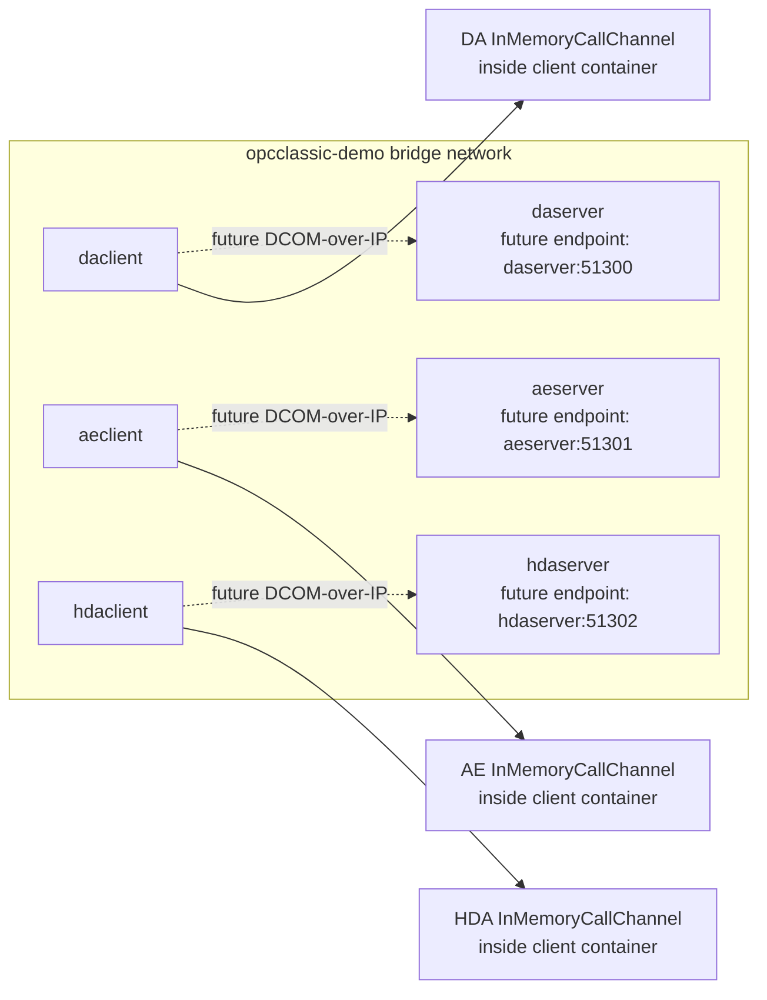

# Dockerized Opc.Classic samples

These files let adopters run the sample apps from Linux/macOS containers without installing the .NET 10 SDK locally.

## Quick start

From the repository root:

```powershell
docker compose -f samples/docker-compose.yml up
```

Loopback-only demo:

```powershell
docker compose -f samples/docker-compose.loopback.yml up
```

> Caveat: clients talking to server containers over DCOM-over-IP is **not functional yet**. The current DA/AE/HDA client samples use an in-process `InMemoryCallChannel` and do not consume the server containers. The Compose topology, service DNS names, and published ports are illustrative for the future DCOM-over-IP transport.

## Architecture



## Images, ports, and environment

| Service/image | Dockerfile | Published port | Environment | Notes |
| --- | --- | --- | --- | --- |
| `opcclassic/daserver:local` | `samples/Opc.Classic.Samples.DaServer/Dockerfile` | `51300/tcp` | `DOTNET_ENVIRONMENT=Production`, `OPC_CLASSIC_SAMPLE_PORT=51300` | DA server container; port is reserved/documentary until DCOM-over-IP is wired up. |
| `opcclassic/daclient:local` | `samples/Opc.Classic.Samples.DaClient/Dockerfile` | none | `DOTNET_ENVIRONMENT=Production`, `OPC_CLASSIC_SERVER_HOST=daserver`, `OPC_CLASSIC_SERVER_PORT=51300` | Runs the DA read/browse/subscription demo in-process. |
| `opcclassic/aeserver:local` | `samples/Opc.Classic.Samples.AeServer/Dockerfile` | `51301/tcp` | `DOTNET_ENVIRONMENT=Production`, `OPC_CLASSIC_SAMPLE_PORT=51301` | AE server container; port is reserved/documentary. |
| `opcclassic/aeclient:local` | `samples/Opc.Classic.Samples.AeClient/Dockerfile` | none | `DOTNET_ENVIRONMENT=Production`, `OPC_CLASSIC_SERVER_HOST=aeserver`, `OPC_CLASSIC_SERVER_PORT=51301` | Runs the AE event/ack demo in-process. |
| `opcclassic/hdaserver:local` | `samples/Opc.Classic.Samples.HdaServer/Dockerfile` | `51302/tcp` | `DOTNET_ENVIRONMENT=Production`, `OPC_CLASSIC_SAMPLE_PORT=51302` | HDA server container; port is reserved/documentary. |
| `opcclassic/hdaclient:local` | `samples/Opc.Classic.Samples.HdaClient/Dockerfile` | none | `DOTNET_ENVIRONMENT=Production`, `OPC_CLASSIC_SERVER_HOST=hdaserver`, `OPC_CLASSIC_SERVER_PORT=51302` | Runs the HDA historical read demo in-process. |
| `opcclassic/cttserver:local` | `samples/Opc.Classic.Samples.CttServer/Dockerfile` | `51303/tcp` | `DOTNET_ENVIRONMENT=Production`, `OPC_CLASSIC_SAMPLE_PORT=51303` | Manual CTT-compatible DA server image; not included in the multi-container Compose file. |
| `opcclassic/loopbackdemo:local` | `samples/Opc.Classic.Samples.LoopbackDemo/Dockerfile` | none | `DOTNET_ENVIRONMENT=Production` | Single-container DA loopback demo. |

The `OPC_CLASSIC_*` variables document the intended future network wiring. Current sample code still uses hard-coded loopback/in-memory channels.

## Build manually

Build from the repository root so project references under `src/` are available:

```powershell
docker build -t opcclassic/daserver -f samples/Opc.Classic.Samples.DaServer/Dockerfile .
docker build -t opcclassic/aeserver -f samples/Opc.Classic.Samples.AeServer/Dockerfile .
docker build -t opcclassic/hdaserver -f samples/Opc.Classic.Samples.HdaServer/Dockerfile .
docker build -t opcclassic/cttserver -f samples/Opc.Classic.Samples.CttServer/Dockerfile .
docker build -t opcclassic/daclient -f samples/Opc.Classic.Samples.DaClient/Dockerfile .
docker build -t opcclassic/aeclient -f samples/Opc.Classic.Samples.AeClient/Dockerfile .
docker build -t opcclassic/hdaclient -f samples/Opc.Classic.Samples.HdaClient/Dockerfile .
docker build -t opcclassic/loopbackdemo -f samples/Opc.Classic.Samples.LoopbackDemo/Dockerfile .
```

## Cross-architecture build

Each Dockerfile maps Docker BuildKit `TARGETARCH` values to .NET runtime identifiers (`linux-x64` and `linux-arm64`):

```powershell
docker buildx build --platform linux/amd64,linux/arm64 -t opcclassic/daserver -f samples/Opc.Classic.Samples.DaServer/Dockerfile .
```

Replace the Dockerfile path and tag for the other samples.

## CI consideration

A future `.github/workflows/docker-build.yml` workflow could run `docker buildx build --platform linux/amd64,linux/arm64` for these Dockerfiles and publish images to GitHub Container Registry (GHCR). The Dockerfiles already include `org.opencontainers.image.source=https://github.com/marcschier/opc-classic` for GHCR linkage.
