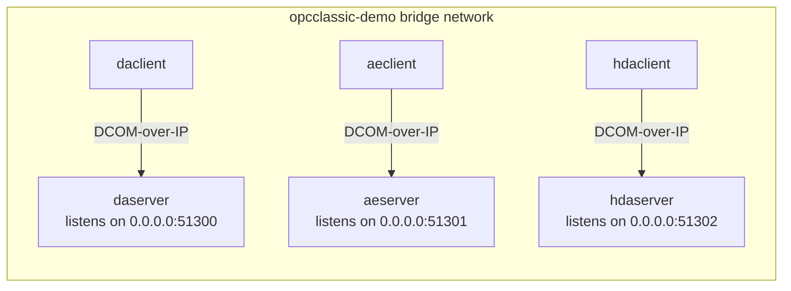

# Dockerized Opc.Classic samples

These files let adopters run the sample apps from Linux/macOS containers without installing the .NET 10 SDK locally.

## Quick start

From the repository root:

```powershell
docker compose -f samples/docker-compose.yml up
```

Loopback-only demo:

```powershell
docker compose -f samples/docker-compose.loopback.yml up
```

The compose topology runs three OPC-spec pairs (DA, AE, HDA) on a shared bridge network. Each client dials its peer server over **TCP** (DCOM-over-IP) at the docker service-DNS name + the configured port. The client samples log which transport they are using at startup so it's easy to confirm in `docker compose logs`.

> **Authentication note**: the sample compose deployment uses a `NoOpAuthContext` for the call channel — no NTLM/Kerberos handshake. This is intentional for the sample's interop demo. Production deployments would layer real auth on top of the same transport (`Opc.Classic.Dcom.Auth.*`).

## Architecture



For an in-process variant of the same architecture (single container, no network), see [`Opc.Classic.Samples.LoopbackDemo`](Opc.Classic.Samples.LoopbackDemo/README.md).

## Images, ports, and environment

| Service/image | Dockerfile | Published port | Environment | Notes |
| --- | --- | --- | --- | --- |
| `opcclassic/daserver:local` | `samples/Opc.Classic.Samples.DaServer/Dockerfile` | `51300/tcp` | `DOTNET_ENVIRONMENT=Production`, `OPC_CLASSIC_SAMPLE_PORT=51300` | DA server binds `0.0.0.0:51300`. |
| `opcclassic/daclient:local` | `samples/Opc.Classic.Samples.DaClient/Dockerfile` | none | `DOTNET_ENVIRONMENT=Production`, `OPC_CLASSIC_SERVER_HOST=daserver`, `OPC_CLASSIC_SERVER_PORT=51300` | DA client dials `daserver:51300` over TCP. |
| `opcclassic/aeserver:local` | `samples/Opc.Classic.Samples.AeServer/Dockerfile` | `51301/tcp` | `DOTNET_ENVIRONMENT=Production`, `OPC_CLASSIC_SAMPLE_PORT=51301` | AE server binds `0.0.0.0:51301`. |
| `opcclassic/aeclient:local` | `samples/Opc.Classic.Samples.AeClient/Dockerfile` | none | `DOTNET_ENVIRONMENT=Production`, `OPC_CLASSIC_SERVER_HOST=aeserver`, `OPC_CLASSIC_SERVER_PORT=51301` | AE client dials `aeserver:51301` over TCP. |
| `opcclassic/hdaserver:local` | `samples/Opc.Classic.Samples.HdaServer/Dockerfile` | `51302/tcp` | `DOTNET_ENVIRONMENT=Production`, `OPC_CLASSIC_SAMPLE_PORT=51302` | HDA server binds `0.0.0.0:51302`. |
| `opcclassic/hdaclient:local` | `samples/Opc.Classic.Samples.HdaClient/Dockerfile` | none | `DOTNET_ENVIRONMENT=Production`, `OPC_CLASSIC_SERVER_HOST=hdaserver`, `OPC_CLASSIC_SERVER_PORT=51302` | HDA client dials `hdaserver:51302` over TCP. |
| `opcclassic/cttserver:local` | `samples/Opc.Classic.Samples.CttServer/Dockerfile` | `51303/tcp` | `DOTNET_ENVIRONMENT=Production`, `OPC_CLASSIC_SAMPLE_PORT=51303` | Manual CTT-compatible DA server image; not included in the multi-container Compose file. |
| `opcclassic/loopbackdemo:local` | `samples/Opc.Classic.Samples.LoopbackDemo/Dockerfile` | none | `DOTNET_ENVIRONMENT=Production` | Single-container DA loopback demo (in-process, no network). |

### Optional overrides

- `OPC_CLASSIC_LISTEN_ADDRESS` — server-side full bind override (e.g. `192.168.1.10:51300`). Takes precedence over `OPC_CLASSIC_SAMPLE_PORT`.
- Running a client outside Docker without setting `OPC_CLASSIC_SERVER_HOST` falls back to the original in-process `InMemoryCallChannel` + `LoopbackDaServer` path. This keeps `dotnet run --project samples/Opc.Classic.Samples.DaClient` working for local-dev with no compose.

## Build manually

Build from the repository root so project references under `src/` are available:

```powershell
docker build -t opcclassic/daserver -f samples/Opc.Classic.Samples.DaServer/Dockerfile .
docker build -t opcclassic/aeserver -f samples/Opc.Classic.Samples.AeServer/Dockerfile .
docker build -t opcclassic/hdaserver -f samples/Opc.Classic.Samples.HdaServer/Dockerfile .
docker build -t opcclassic/cttserver -f samples/Opc.Classic.Samples.CttServer/Dockerfile .
docker build -t opcclassic/daclient -f samples/Opc.Classic.Samples.DaClient/Dockerfile .
docker build -t opcclassic/aeclient -f samples/Opc.Classic.Samples.AeClient/Dockerfile .
docker build -t opcclassic/hdaclient -f samples/Opc.Classic.Samples.HdaClient/Dockerfile .
docker build -t opcclassic/loopbackdemo -f samples/Opc.Classic.Samples.LoopbackDemo/Dockerfile .
```

## Cross-architecture build

Each Dockerfile maps Docker BuildKit `TARGETARCH` values to .NET runtime identifiers (`linux-x64` and `linux-arm64`):

```powershell
docker buildx build --platform linux/amd64,linux/arm64 -t opcclassic/daserver -f samples/Opc.Classic.Samples.DaServer/Dockerfile .
```

Replace the Dockerfile path and tag for the other samples.

## CI consideration

A future `.github/workflows/docker-build.yml` workflow could run `docker buildx build --platform linux/amd64,linux/arm64` for these Dockerfiles and publish images to GitHub Container Registry (GHCR). The Dockerfiles already include `org.opencontainers.image.source=https://github.com/marcschier/opc-classic` for GHCR linkage.

## Implementation references

- [`Opc.Classic.Dcom.Transport.TcpClientTransport`](../src/Opc.Classic.Dcom/Transport/TcpClientTransport.cs) — the pipe-backed TCP transport the clients use.
- [`Opc.Classic.Dcom.Transport.DcomCallChannelFactory.ConnectTcpAsync`](../src/Opc.Classic.Dcom/Transport/DcomCallChannelFactory.cs) — the convenience helper sample `Program.cs` files call.
- [`Opc.Classic.Da.Hosting.OpcDaServerHost`](../src/Opc.Classic.Da/Hosting/OpcDaServerHost.cs) — DA server-side listener wireup (analogous for AE/HDA).
- [`tests/Opc.Classic.Dcom.Tests/Tests/TcpClientTransportTests.cs`](../tests/Opc.Classic.Dcom.Tests/Tests/TcpClientTransportTests.cs) — unit tests pinning the public surface.
- [`tests/Opc.Classic.Integration.Tests/CompatMatrix/ManagedClientOverTransportTests.cs`](../tests/Opc.Classic.Integration.Tests/CompatMatrix/ManagedClientOverTransportTests.cs) — end-to-end integration smoke through the same transport classes.

